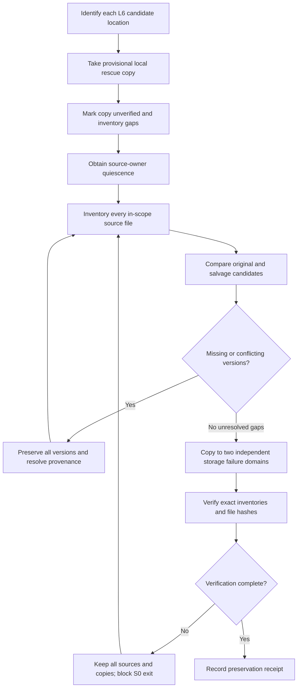
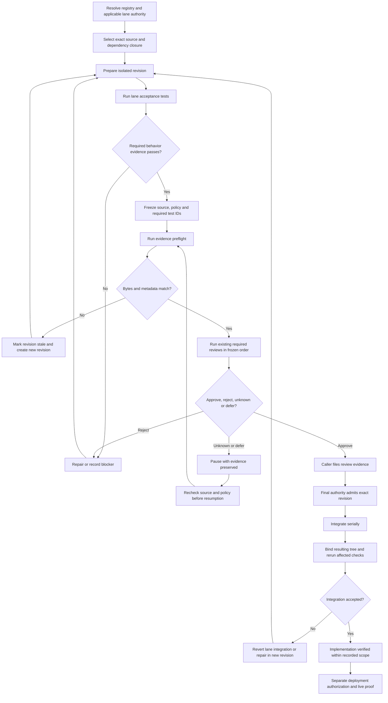
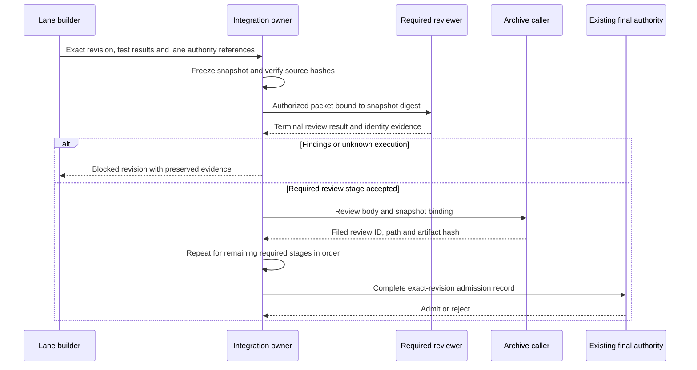
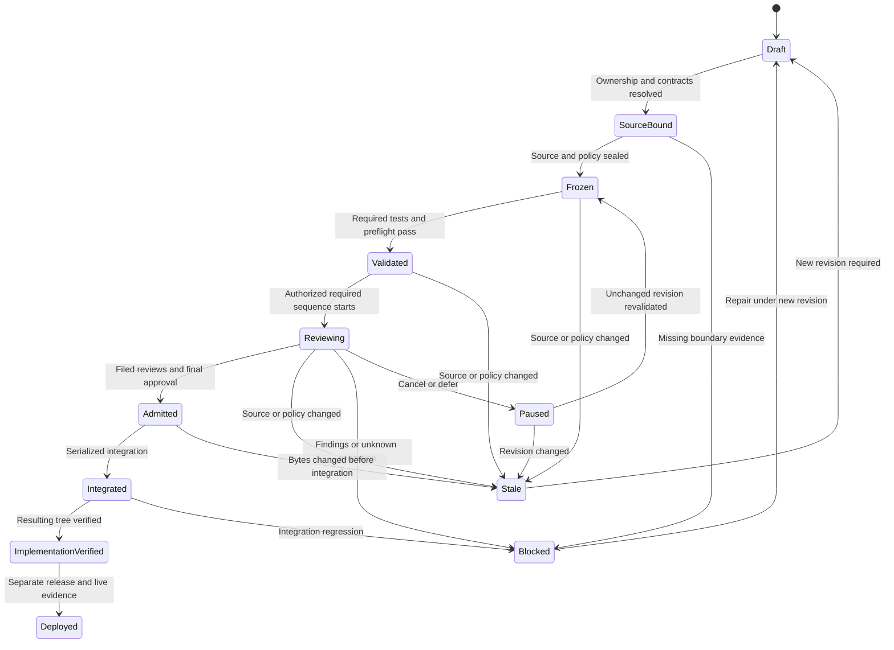

**System boundary**

**[VERIFIED — decision]** The master operates on repository artifacts, local preservation copies, test evidence and archive records. It introduces no product screen, application API, database table, provider integration or production background service.

Existing mechanisms are treated as follows:

| Mechanism | Treatment |
|---|---|
| Mega Blueprint mandate library | Adopt; do not duplicate its output-contract responsibility |
| Blueprint splitter | Adopt for document extraction; splitting is not semantic acceptance |
| Existing consultation transports | Retain; invocation requires the frozen lane policy and existing authorization |
| Archive tooling | Adopt; caller files and indexes reviews |
| Missing workflow controller/hook | Do not build here; remove claims that they enforce the current process |
| Existing lane runtime code | Preserve and classify before choosing adoption or extension |

**Preservation flow**

**Admission flow**

**Review handoff sequence**

This is a file/actor interaction, not a newly introduced application API.

**State machine**

**Dependency model**

| Edge | Classification | Reason |
|---|---|---|
| L6 provisional rescue → stable preservation | Mandatory preservation order | A rescue copy alone is not verified S0 evidence |
| Shared admission substrate → every implementation slice | Mandatory gate | Common source, reference and review truth |
| L6 verified preservation → L6 integration | Mandatory | Prevent losing uncommitted candidates |
| L1 B Stage 1 → L1 B Stage 2 | Inherited hard dependency | L1’s explicit migration order |
| L1 A → neither B stage | No prerequisite edge | L1 explicitly makes A independent |
| L7 Phase 0 → Phase 1 → Phase 2 | Inherited hard dependency | Foundation/contracts precede the native vertical slice |
| L8 ↔ L1 shared theme/capability contract | Mandatory **boundary gate if overlap is confirmed** | Public theme state and capability selection must not acquire competing owners |
| L3 → L2 | Conditional | Hard only if a bound L2 slice consumes L3’s new rules or events |
| L3 → L4 | Conditional | Hard only if a bound L4 slice consumes L3’s new events |
| L6 fleet → L1 | Conditional | Hard only if a bound public-home slice actually adopts those assets |
| Shared API change → L7 contract revalidation | Mandatory when API changes | Mobile remains an unchanged-API consumer |

**[VERIFIED — decision]** Until a consumer receipt proves a conditional edge, it must not be used either to block an independent lane indefinitely or to justify an unreviewed integration.

**Diagram applicability**

- Application `sequenceDiagram` per API: **N/A — the master adds no application API interaction.** Each lane must retain or refresh its own diagrams against its actual endpoint contracts before admission.
- Relational `erDiagram`: **N/A — the master adds no relational storage or database columns.** L3 and any other database-changing lane remain blocked until their actual model/migration schemas are available; column names will not be invented.
- Product screen flows: **N/A at master scope.** Per-lane requirements are listed in `02-wireframes.md`.
- Permissions: builder prepares source; integration owner freezes and integrates; required reviewers review; caller files; existing final authority admits; deployment requires separate authority.
- Privacy boundary: preservation and raw evidence remain local. Only separately authorized, appropriately sanitized review packets may leave that boundary.
