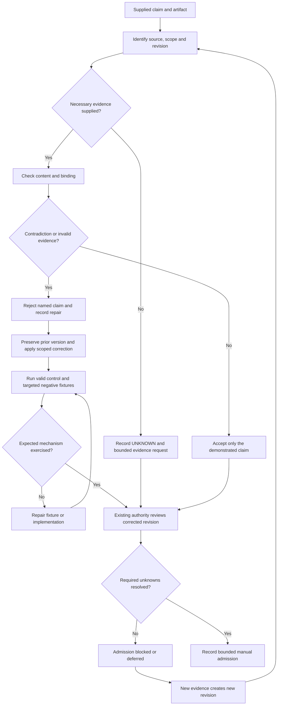
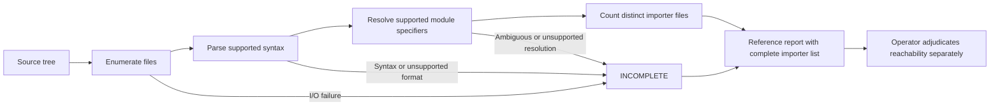
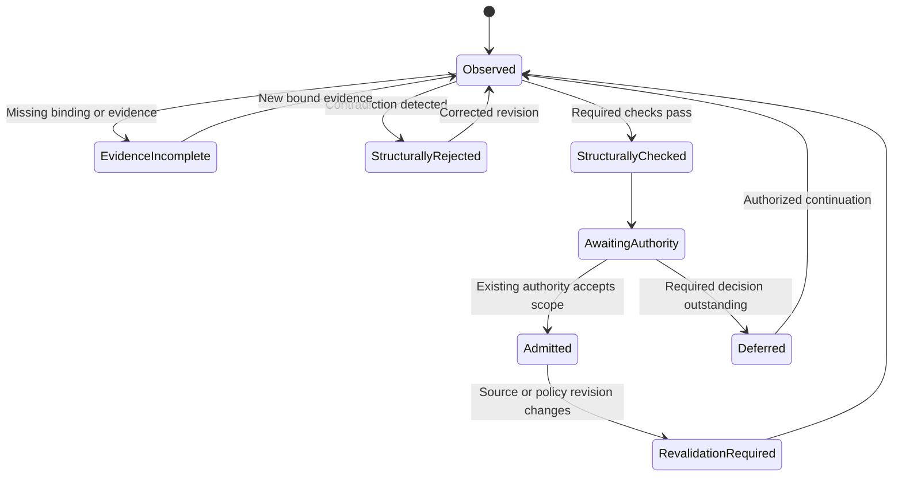

# Astra Reply — subscription transport — 2026-09-21T01:13:11.592Z

**Provider:** openai-codex
**Billing:** chatgpt-subscription
**Authentication:** chatgpt_subscription
**Transport:** codex-cli
**Requested model:** gpt-6-astra
**Served model:** NOT OBSERVABLE on codex-cli (see SERVED_MODEL_UNVERIFIABLE_NOTE)
**Reasoning effort:** xhigh
**Tokens:** in=189054 out=32020 reasoning=18510
**Packet:** `C:/tmp/master-r2-packet.md`
**Wall:** 986.1s
**Mega Blueprint:** ARMED (operator flag)

> Marginal cost $0 — this leg rides the ChatGPT subscription, not OpenRouter.

---
Mega Blueprint: I’ll test all sixteen closure claims against the supplied text and code, then emit the corrections package. I’ll keep reported measurements separate from what the packet proves.

I’m applying `fable-blueprint-forge` with your packet-only scope and exact output contract. The supplied code already exposes two closure problems: the admission checks can accept opaque evidence files without validating their claims, and Reach can miss real imports. Section 4 also lacks the two promised 4/4 matrices.

The closure summary miscounts its own table: eight A1 findings are marked resolved, one partial, and one open. The L3 figures support 2,267 summed insertions and 22 file-change entries, but they do not establish 22 distinct files or the absence of equivalent work at HEAD.

The lane register supports “observed activity” and “ownership unknown”; it does not establish that quiet lanes are stranded. I’ll preserve the recovery candidates without treating them as scope transfers. Round 3 should focus on the admission path: keep all hashes valid, insert contradictory evidence, and verify that it rejects the receipt for that contradiction.

## PART A — HOSTILE REVIEW

**Verdict: DEFECTS-FOUND. Admission remains blocked.** The packet does not establish the claimed closure of round 1. A1-02 remains critical and partially resolved.

[VERIFIED] The adjudication table contains **eight RESOLVED, one PARTIALLY RESOLVED, and one OPEN** finding. “Nine resolved, one open” is incorrect. This error appears in the packet summary, manifest, and characterization of the adjudication. Evidence: `VERIFICATION-NOTES.md#PART A`; `MANIFEST.md#Filer additions`.

Labels below distinguish evidence precisely:

- **[VERIFIED]** — established by the supplied text or code.
- **[LIKELY]** — supported inference, with a remaining alternative.
- **[HYPOTHESIS]** — a concrete possibility requiring a discriminating check.
- **[UNKNOWN]** — the packet does not supply the necessary evidence.

No target-file inspection or test execution supports this review. Code counterexamples below are source-level deductions, not reported test runs.

**Independent adjudication of all sixteen findings**

| Finding | Decision | Evidence and what would settle the remainder |
|---|---|---|
| **A1-01** | **REJECT RESOLVED; partial textual repair.** | [VERIFIED] The replacement withdraws the controller claim. It also makes unsupported repository-wide and historical claims. [UNKNOWN] The full amended standard, applicable hook configuration, previous snapshot, and other repository’s inspection are absent. Settle with a repository-qualified capability receipt and the complete amendment. See R2-09. |
| **A1-02** | **ACCEPT PARTIALLY RESOLVED as the appropriate non-closure status.** | [VERIFIED] The document retains quiescence and reconciliation as outstanding. [UNKNOWN] Copies, inventories, device mappings, and their hashes cannot be verified here. Independent candidate inventories, reconciled differences, stable-source evidence, and copy-to-device bindings would settle it. `VERIFICATION-NOTES.md#A1-02`; R2-07. |
| **A1-03** | **REJECT fully verified closure; accept the quoted blocking policy.** | [VERIFIED] The packet supplies the blocked status and L4’s quoted reason. It does not supply all eight actual rows or prove that every admission path consumes them. Settle with the exact table plus an admission-path check that cannot bypass its reasons. `VERIFICATION-NOTES.md#A1-03`. |
| **A1-04** | **REJECT RESOLVED.** | [VERIFIED] Three lanes receive classifications; equivalent coverage for all eight is not supplied. L3’s forced adoption and L7’s unconditional greenfield classification exceed the evidence. Settle with bounded provenance and equivalence checks, followed by per-lane decisions. R2-04/R2-05. |
| **A1-05** | **REJECT RESOLVED.** | [VERIFIED] The checker expects separated fields. It does not establish their semantic correctness, validate aliases, or require every authority/registry artifact to belong to the frozen manifest. [UNKNOWN] The registry itself is absent. R2-10 specifies the repair. |
| **A1-06** | **ACCEPT the limited documentation correction; runtime relationships remain UNKNOWN.** | [VERIFIED] The supplied rule explicitly prevents an unproven conditional edge from indefinitely blocking an independent lane. This corrects the scheduling/dependency conflation as described. A hard edge without its bound consumer receipt would falsify closure. `VERIFICATION-NOTES.md#A1-06` and `#PART B`, A2-02. |
| **A1-07** | **REJECT RESOLVED.** | [VERIFIED] Reach has concrete false-negative paths. Neither importer counts nor declared/locked/installed agreement establishes a replacement cohort’s runtime compatibility. [UNKNOWN] Resolve’s source, outputs, lockfile cohort, and the five hand-count populations are absent. R2-08. |
| **A1-08** | **REJECT full closure; accept that an index was produced.** | [VERIFIED] The index maps selected artifacts, but overstates search completeness, undercounts L5 source artifacts, and does not enumerate every mobile acceptance criterion. Settle with a bounded, criterion-level matrix retaining unresolved paths. R2-05. |
| **A1-09** | **ACCEPT OPEN; REJECT the reason given.** | [VERIFIED] An existing backend API can have a contract before a mobile application exists. The index itself identifies a backend contract-lock artifact and an existing endpoint. Mobile absence does not prevent freezing that boundary. `11-lane-test-index.md#4`; R2-05. |
| **A1-10** | **REJECT verified closure; filing is reported, not independently established.** | [UNKNOWN] The archive record, header, body, and index entry are not supplied. [VERIFIED] The receipt binds the round-1 input packet, not the later filer additions. Settle with the actual immutable archive record and separate input/output/change bindings. R2-11. |
| **A2-01** | **ACCEPT the design correction; execution remains UNKNOWN.** | [VERIFIED] The quoted two-stage preservation rule distinguishes immediate rescue from stable preservation. A prerequisite that prevented provisional copying, or admission based solely on rescue, would falsify the correction. `VERIFICATION-NOTES.md#PART B`, A2-01. |
| **A2-02** | **ACCEPT the documentation correction.** | [VERIFIED] The supplied categorization and skip rule distinguish conditional dependencies from mandatory gates. This acceptance does not certify actual dependency receipts. `VERIFICATION-NOTES.md#PART B`, A2-02. |
| **A2-03** | **ACCEPT the non-circular design; REJECT complete implementation verification.** | [VERIFIED] The quoted snapshot contract excludes self-hashes and later outputs. The checker does not enforce the quoted requirement that supporting records live outside the frozen checkout. Settle with containment and manifest-membership checks. `VERIFICATION-NOTES.md#PART B`, A2-03; `blueprint-master-evidence.test.mjs#artifact`. |
| **A2-04** | **REJECT RESOLVED.** | [VERIFIED] Separating review from deployment does not separate structural evidence checks from product acceptance. The checker can accept arbitrary bytes as successful behavior evidence. R2-06. |
| **A2-05** | **ACCEPT the stated authority-preservation design.** | [VERIFIED] The quoted text preserves existing authority and introduces no replacement reviewer. [UNKNOWN] The actual policy and authorities are absent; the checker does not authenticate them. An imposed master reviewer or a policy inconsistent with the lane’s authority would falsify closure. `VERIFICATION-NOTES.md#PART B`, A2-05. |
| **A2-06** | **REJECT verified closure.** | [VERIFIED] Distinct storage labels can refer to the same copy root. The attestation is hashed but never parsed. [UNKNOWN] The reported disk inspection is not supplied and does not, by itself, bind copy roots to disks. R2-07. |

**R2-01 — Medium — The evidence inventory and closure arithmetic are unreliable**

[VERIFIED] The packet presents incompatible descriptions of the supposed acceptance evidence:

- The remit refers to **two fault-injection matrices, 4/4 each**.
- Section 6 reports **MT-01…MT-07 plus a control: 8/8**.
- Section 4 supplies **six registered `node:test` cases and a Reach CLI**. It supplies neither matrix driver nor case-level results.

Eight fault-injection scenarios could exercise six tests; those counts are not inherently incompatible. The defect is that the required mapping and outputs are absent.

[UNKNOWN] The two specifically requested self-reports—an incomplete first repair and a stale published hash subsequently corrected—are also absent as identifiable before/after records. A residual pointer contradiction and a statement that hashes match do not establish those histories.

**Fix:** replace the closure summary with **8 resolved claims / 1 partial / 1 open**, then attach case definitions, control results, exact injected changes, targeted failures, and output bindings. Supply both error histories separately. Do not invent their dates, original hashes, or blast radius.

Evidence: packet §1, §4, §6; `MANIFEST.md#Filer additions`; `VERIFICATION-NOTES.md#What I could not verify`.

**R2-02 — High — “Stranded” substitutes inactivity for ownership and expands scope**

[VERIFIED] The register acknowledges that owner identity and idle-but-alive agents were not measured. Nevertheless, it classifies quiet lanes as stranded and presents them under “rolled in.”

The inconsistent cases are concrete:

- **B4 Aftertaste is on the wrong side of the binary classification.** Reviews are work. The packet reports reviews that day, then excludes them from “being worked.”
- **B2 is not an additional lane.** The register itself identifies it as L6’s source worktree.
- **B1’s damage establishes a preservation/commit hazard, not absence of an owner.**
- **B3/B5’s elapsed time establishes recency, not abandonment or eligibility for takeover.**
- **X5’s recent commit establishes recent activity, not current ownership.**
- **X3/X4’s missing completion markers do not establish a currently executing process.** Crashes and incomplete logging remain alternatives.

[VERIFIED] The operator quotation authorizes identifying stranded work. The categorical “do not roll in what is live” rule is the filer’s interpretation, not a sentence present in that quotation.

**Fix:** maintain separate fields for activity, ownership, integration state, hazards, and admission. Reclassify B1/B3/B5 as **recovery candidates; ownership UNKNOWN**; B4 as **review activity observed; ownership UNKNOWN**; B2 as **L6 source alias**. Record X1–X5 as activity observations with timestamps. No ownership transfer follows from elapsed hours.

Evidence: `10-lane-register-beyond-the-eight.md#0`, `#0.1`, `#0.2`, `#1`, `#2`, `#3.4`, `#5`.

**R2-03 — High — A moving branch tip is confused with changed reviewed material**

[VERIFIED] The register calls L4’s review binding stale because shared HEAD advanced. That establishes commit drift. It does not establish that L4’s reviewed files, transitive dependencies, policy, or packet changed.

[VERIFIED] `FILE-RECEIPT.md#The commit drift` correctly recognizes that a fixed packet remains the same reviewed packet after HEAD moves. The register’s broader statement fails to preserve that distinction.

**Fix:** distinguish:

1. historical packet identity;
2. exact-checkout identity;
3. scoped applicability to a later checkout.

A strict exact-commit gate may reject any new HEAD by policy. Call that **revision mismatch**, not proof that reviewed content changed. Carry-forward requires a documented scope comparison and existing authority’s acceptance; a hash match alone does not settle applicability.

Evidence: `10-lane-register-beyond-the-eight.md#1` and `#4`; `FILE-RECEIPT.md#Binding chain` and `#The commit drift`.

**R2-04 — High — L3’s recovery conclusion exceeds both the Git evidence and the arithmetic**

[VERIFIED] The supplied arithmetic establishes:

- `1,088 + 1,179 = 2,267` summed insertions;
- `117 + 164 = 281` reported test lines;
- `11 + 11 = 22` file-change entries across two commits.

It does **not** establish 22 distinct files. The packet also says both commits modify `associations.mjs` and `index.mjs`. If those are the same two paths, the total is at most **20 distinct paths**.

[VERIFIED] Testing whether the **branch tip** is an ancestor of HEAD does not test whether either named slice commit is an ancestor. Neither test detects equivalent work integrated by cherry-pick, squash, rename, or rewrite.

[VERIFIED] Zero filename-filter matches establishes zero matches for those filters. It does not establish zero equivalent tests or implementation. Historical checkpoint labels do not prove current execution.

**Fix:** classify L3 as **PRESERVE; evaluate adoption**. Remove “recover the 22 files” and mandatory adoption.

**Method that would falsify “stranded”:**

- Check each named slice commit’s ancestry independently.
- Compare patch equivalence against HEAD.
- Produce a distinct changed-path union from the two commits.
- Inspect corresponding implementation and tests at HEAD, following renames and equivalent responsibilities.
- Establish historical checkpoint provenance separately from current applicability.

Finding equivalent integrated behavior would falsify “missing from HEAD.” Finding an active owner would falsify the ownership meaning of “stranded.” Neither result permits discarding the preserved branch automatically.

Evidence: `11-lane-test-index.md#1`, `#2`, `#6`; `VERIFICATION-NOTES.md#A1-04`.

**R2-05 — Medium — The test index converts bounded searches into global absence claims**

[VERIFIED] Several conclusions outrun the documented search:

- “Slices 3–5 have no test file anywhere” is unsupported by checking HEAD and one branch.
- The L5 table names **four** absent source artifacts: two template/token modules, one sender, and one component. “Three source modules” excludes the component without explaining that distinction.
- The method promises branch checks for missing artifacts, but L5/L7 rows provide no named branch results.
- Zero tracked files under `mobile/` does not establish that the directory does not exist, contains no untracked work, or has no implementation elsewhere.
- The mobile index summarizes five artifact groups while describing approximately thirty criteria. It does not demonstrate complete criterion coverage.
- Treating a basename as authoritative does not resolve an ambiguous path.

**Fix:** use `NOT FOUND IN <specified revision and search scope>`, retain unresolved paths, and list each acceptance criterion or mark it unmapped. Count **three backend modules plus one frontend component** for L5. Freeze the existing backend contract before mobile admission; absence of mobile code is not a reason to defer identifying that contract.

Evidence: `11-lane-test-index.md#Method`, `#2`, `#3`, `#4`, `#5`; `VERIFICATION-NOTES.md#A1-08` and `#A1-09`.

**R2-06 — High — Hash-correct garbage can satisfy admission evidence**

[VERIFIED] `artifact()` establishes that bytes match a supplied hash. It does not establish that the bytes support the receipt’s assertion.

With otherwise passing fixtures, these inputs can pass their named checks:

| Check | Concrete false evidence accepted by the supplied code |
|---|---|
| Required behavior evidence | `result.output` contains `not a test result`; outer receipt says `PASS`, exit `0`. |
| Ordered filed reviews | Archive says `verdict: DEFECTS-FOUND`, contains the required snapshot substring, and outer receipt says `APPROVE`. |
| Terminal evidence | File says `{"status":"failed"}`; the checker hashes it without interpreting it. |
| Identity evidence | File contains `null`; hashing still succeeds. |
| Final admission | Attestation contains `DENIED`; outer receipt says `ADMIT`. |

[VERIFIED] `authorityRefs` only needs nonzero length. The budget record is also hashed without validating its meaning.

[VERIFIED] An ignored registry or authority file can be consumed without appearing in `snapshot.files`. A clean tracked checkout and complete tracked-file manifest do not close that path.

**Fix:** parse and cross-check structured evidence, require consumed source/policy artifacts to belong to their declared frozen scope, and separate **structural consistency** from **authorized human admission**. Authenticity requires a trusted collection/authority boundary; adding more self-authored JSON does not create one.

A negative fixture must preserve valid hashes and fail on the semantic contradiction. A missing file, spawn error, malformed fixture setup, or unrelated dirty-tree failure is not a successful rejection test.

Evidence: `blueprint-master-evidence.test.mjs#artifact`, `#preflight: registry`, `#admission: required behavior evidence`, `#admission: ordered filed reviews`, `#admission: final authority and unresolved findings`.

**R2-07 — High — Preservation can count the same copy twice**

[VERIFIED] This passes the supplied distinct-label condition:

```json
[
  {"root":"C:/copies/L6","storageId":"disk-A"},
  {"root":"C:/copies/L6","storageId":"disk-B"}
]
```

Both iterations enumerate and hash the same directory. The checker requires unique labels, not distinct copy identities.

[VERIFIED] `storageAttestation` is never parsed. Root paths are not bound to its device evidence. Checking a root’s own link status also does not establish that none of its ancestors redirects it.

**Fix:** reject duplicate resolved copy roots before validating storage labels; resolve ancestor links; bind each copy root and inventory to the attestation; compare observed volume identity where available. Keep device independence, source completeness, and whole-machine disaster resilience as separate claims.

[UNKNOWN] The reported four-disk inspection may be correct. Without the actual root-to-device mapping it does not settle this defect.

Evidence: `blueprint-master-evidence.test.mjs#preflight: preservation`, `#localFile`, `#listFiles`; `VERIFICATION-NOTES.md#A2-06`.

**R2-08 — High — Reach has false negatives and does not implement its relative-target promise**

[VERIFIED] These valid source forms defeat the supplied extraction:

```js
const note = "//"; import value from "pkg";
void import("pkg", { with: { type: "json" } });
```

The comment stripper removes the import in the first example. The dynamic-import regex excludes the second form.

Additional defects are visible:

- String literals containing fake imports can count as real edges.
- Relative specifiers are compared as strings; they are never resolved from importer locations.
- The claimed definition-file exclusion is not implemented.
- Unreadable directories and files are silently skipped.
- `filesScanned` reports enumerated files, including files that failed to read.
- A require-only target is mislabeled `LIVE-DYNAMIC`.
- Type-only references and references inside unreachable files can produce `LIVE`.
- Only 25 importer paths are returned, without a complete enumeration artifact.

**Fix:** report syntactic reference evidence without claiming runtime liveness. Parse supported source syntax, resolve relative imports, distinguish reference classes, and expose incomplete scans. Unsupported resolution and I/O failures must prevent absence/deletion conclusions.

[VERIFIED] Reproducing five positive hand counts cannot validate these negative paths or a React replacement cohort.

Evidence: `intake-reach.mjs#stripComments`, `#RE`, `#specsIn`, `#refersTo`, `#walk`, `#main`; `VERIFICATION-NOTES.md#A1-07`.

**R2-09 — High — The shared standard replaces one overclaim with several others**

[VERIFIED] The amendment says:

- the scripts do not exist “in this repository”;
- no runtime enforcement is claimed “anywhere in this mandate”;
- none of the described mechanism “was ever installed here.”

The changed file is in another repository. The packet does not bind those statements to that repository’s identity, revision, configuration, or history.

[VERIFIED] Looking for three filenames and inspecting `.git/hooks/` cannot exclude alternate hook paths, native harness guards, or differently named mechanisms. Current absence also cannot establish historical nonexistence.

[VERIFIED] The excerpt stops at “It detects drift at checkpoints;”. The rest of the section and mandate are unavailable. Whole-document consistency cannot be certified.

**Fix:** replace global installation claims with a **target-repository capability status**. Say what was observed at a specified revision and what remains unverified. Replace “detects drift” with the actual manual obligation to compare bound artifacts at each checkpoint.

The pointer warning is useful for readers entering through this section. It does not protect readers who enter `workflow-usage.md` directly. Add a contextual availability notice at that entry point or a repository-qualified resolver. Do not declare a shared controller unavailable in unrelated installations.

[UNKNOWN] The claim that no second same-basename file was created is not verifiable from this packet.

Evidence: packet §5; `VERIFICATION-NOTES.md#A1-01`; `MANIFEST.md#Externally modified`.

**R2-10 — Medium — A filesystem-generated registry is not an authority validator**

[VERIFIED] The registry test does not validate alias existence or normalization. It checks authority-path existence and integer precedence, not whether the referenced document grants that scope.

An alias such as `../../unrelated` can participate in the uniqueness comparison without being passed through `localFile()`. An authority can be an existing but incorrect document.

[VERIFIED] A claim that a generator uses `readdirSync` does not establish that every emitted field came from that enumeration or remains current.

**Fix:** validate aliases as normalized repository-relative paths with explicit alias semantics; bind registry and authority contents; validate precedence against the applicable authority decision. Keep **path exists**, **document status**, and **authority is valid** as separate results.

Evidence: `blueprint-master-evidence.test.mjs#preflight: registry`; `VERIFICATION-NOTES.md#A1-05`.

**R2-11 — Medium — Filing provenance mixes historical review with later adjudication**

[VERIFIED] The receipt describes **four** HEAD transitions while saying “three times.”

[VERIFIED] The manifest dates `VERIFICATION-NOTES.md` at 17:35; the receipt dates filing at 17:32:41. This does not prove improper editing, but it prevents treating the later adjudication as necessarily included in the earlier filed bytes.

[VERIFIED] The binding hash identifies the dispatched round-1 packet. It does not bind the later registry, scripts, mandate amendment, or filer additions. The manifest supplies sizes and line counts, not a cryptographic inventory of those additions.

**Fix:** retain the historical review unchanged. Bind the round-2 input, output, and reviewed changes separately. Attribute filer conclusions to the filer. Supply the actual archive record before claiming verified filing or supersession.

For the stale-hash self-report, require both published values, their corresponding bytes, publication/correction times, and every consumer that could still trust the earlier value. For the incomplete-fix self-report, require the original defect, first repair, counterexample, final repair, and remaining affected paths.

Evidence: `FILE-RECEIPT.md#Binding chain`, `#The commit drift`, `#Tooling`; `MANIFEST.md#Filer additions`.

**R2-12 — Medium — The Guardian observation does not establish a universal admission prerequisite or a safe repair**

[VERIFIED] The supplied report supports a claimed process-name match and repeated deferrals. It does not establish that the resource gate was intended to permit sustained screen recording, that all cross-lane communication depends on this inbox, or that draining during the recording is acceptable.

“Add a maximum age” is insufficient: an old render can still consume resources. An age bypass can replace starvation with resource contention.

**Fix:** record an operational hazard and unknown communication impact. Define workload classification, queue-age escalation, resource limits, and an operator-controlled override before selecting a repair. Admission may use another complete, acknowledged coordination channel. Do not make unrelated lanes depend on speculative Guardian work.

[VERIFIED] The growth calculation is approximately **135 MiB/hour**, or **142 MB/hour**. The published 135 MB/hour mixes units.

Evidence: `10-lane-register-beyond-the-eight.md#3.1`, `#4`, `#5`.

**A2 — One hostile pass over this corrections package**

The self-review changed four draft decisions:

| Draft defect | Correction reflected in PART B |
|---|---|
| A correction package could become another master authority. | `00-README.md` makes these proposed amendments to the existing package, with existing authority preserved. |
| An eight-case regression result could be presented as complete admission verification. | `07-checkpoints.md` separates the two unit matrices from the real caller-path checkpoint. |
| Synthetic preservation fixtures could imply physical independence. | `03-contracts.md` and `09-tests.md` explicitly limit them to logical validation. |
| Parser output could retain the same unsupported liveness claim. | `03-contracts.md` replaces runtime-liveness verdicts with reference and completeness classifications. |

**Round 3: warranted.** Its single most valuable target is the **repaired admission caller path**, using an isolated, valid frozen fixture. Keep all hashes valid, then introduce contradictory test/review/admission evidence and duplicate preservation roots. Require rejection for the named contradiction while the unmutated control passes. Inspect the actual caller wiring and evidence collection boundary; do not accept helper-only green results.

## PART B — FORGED PACKAGE

### 00-README.md

**Status:** CORRECTIONS PROPOSED — ADMISSION BLOCKED  
**Implementation verified:** No  
**Test execution:** NOT RUN  
**Authority:** Existing lane and final-admission authorities remain unchanged.

These documents specify amendments to the existing master-reconciliation artifact. They do not replace the excluded round-1 plan, admit a product lane, transfer ownership, or authorize merging recovered code.

**Required replacements**

| Requirement | Correction | Acceptance |
|---|---|---|
| **CR-01** | Correct closure accounting and distinguish supplied evidence from reported measurements. | Every one of the sixteen findings has a bounded disposition; summary arithmetic agrees. |
| **CR-02** | Separate activity, ownership, integration, and hazard classifications. | No elapsed-time observation grants takeover or adoption authority. |
| **CR-03** | Separate packet identity, checkout identity, and later applicability. | Revision drift cannot silently become either approval or a claim of changed content. |
| **CR-04** | Remove unproven L3 adoption and global absence claims. | Recovery inventory uses distinct paths and checks equivalent integration. |
| **CR-05** | Make evidence validation reject semantic contradictions and duplicate copies. | Targeted negative cases reject for their designated reasons. |
| **CR-06** | Make Reach disclose syntax/resolution/I/O incompleteness. | No incomplete scan produces an absence verdict. |
| **CR-07** | Scope capability statements to the inspected repository and mechanism. | No unsupported “ever installed,” “anywhere,” or automatic-enforcement claim remains. |
| **CR-08** | Preserve immutable review provenance. | Input, output, amendment, and filing identities are distinct and traceable. |

**Builder contract**

Apply one correction slice at a time. Preserve the prior artifact and its binding before changing it. Return the scoped diff and actual evidence to the existing checkpoint authority. A missing fixture, dependency, or parser is a setup failure; it is not regression RED evidence.

The caller files this review as a new record. It references the round-1 record without changing its findings. Supersession requires inspection of the previous record’s actual scope; it is not assumed here.

### 01-architecture.md

**Correction boundaries**

The affected subsystems are documentation, registry interpretation, local receipt validation, preservation evidence, and importer reporting. Product APIs, database migrations, mobile implementation, Guardian execution, and lane merges are outside this correction.





```mermaid
sequenceDiagram
    participant O as Integration owner
    participant V as Local evidence checker
    participant A as Bound artifacts
    participant F as Existing final authority

    O->>V: Frozen identity and receipt
    V->>A: Read referenced bytes and compare hashes
    V->>V: Validate schemas, content agreement and scope
    alt Missing, contradictory or incomplete evidence
        V-->>O: REJECT with named diagnostic
    else Structural checks pass
        V-->>O: STRUCTURAL_PASS; admission not established
        O->>F: Results plus provenance and unresolved limits
        F-->>O: ADMIT, REVISE or DEFER for the bound scope
    end
```



The state diagram defines recorded manual states. It does not claim an installed controller.

**API sequence diagrams:** N/A — no application API is introduced or changed. The sequence above documents local artifact processing.

**ER diagram:** N/A — no database tables or columns are introduced or changed. Receipt and registry JSON contracts are specified below.

**Rendering:** literal Mermaid sources supplied; rendered previews were not produced.

### 02-wireframes.md

**N/A — this correction changes headless validators, CLI reporting, and documentation. It introduces no desktop screen, 375px mobile screen, visual interaction state, or palette token.**

Required CLI copy:

```text
Evidence validation: STRUCTURAL_PASS
Admission: NOT ESTABLISHED
```

```text
Evidence validation: REJECT
Reason: <stable diagnostic code>
Admission: NOT ESTABLISHED
```

```text
Reach: INCOMPLETE
Absence conclusion: NOT AVAILABLE
```

These are terminal messages, not product wireframes.

### 03-contracts.md

**Evidence contract**

Preserve existing identity bindings and add semantic validation. Do not replace byte hashing with semantic comparison.

A machine-readable behavior report must contain:

```ts
type RunReport = {
  schemaVersion: 1;
  id: string;
  command: string;
  snapshotSha256: string;
  outcome: "PASS" | "FAIL" | "BLOCKED";
  exitCode: number;
};
```

The report’s fields must agree with the corresponding receipt row. Retain raw command output as a separately bound artifact when available. Neither file authenticates its author by itself.

For reviews:

- Parse the actual archive record; do not search for an arbitrary matching substring.
- Match review identity, snapshot binding, published status, applicable decision, terminal completion, and policy requirements.
- Contradictory archive content must reject an `APPROVE` assertion.
- A non-clean review can be accepted only through the existing policy’s explicit, bound disposition process. Do not silently translate `DEFECTS-FOUND` into approval.
- Unknown served identity remains unknown unless the applicable policy explicitly permits proceeding with that limitation.
- Parse and cross-check admission attestations; opaque bytes cannot establish agreement.
- Require policy and authority artifacts to belong to the declared frozen evidence scope.

**Diagnostic contract for the supplied regression matrices**

| Code | Exact triggering condition |
|---|---|
| `E_RUN_REPORT_INVALID` | Required behavior evidence cannot be parsed as a supported report. |
| `E_REVIEW_CONTENT` | A claimed approval contradicts the bound archive’s admissible content. |
| `E_COPY_ALIAS` | Two copies resolve to the same root identity. |
| `E_PARSE` | A supported source file cannot be parsed. |

Do not translate unrelated I/O, setup, or process failures into these codes.

**Preservation contract**

Compare resolved roots before evaluating their labels. An alias collision produces `E_COPY_ALIAS` first.

Each parsed storage attestation must bind:

```ts
type StorageAttestation = {
  schemaVersion: 1;
  sourceId: string;
  inventorySha256: string;
  copies: Array<{
    root: string;
    storageId: string;
  }>;
};
```

This is a minimum binding structure, not proof of physical independence. The operator’s evidence must connect those roots to observed storage identities. Ancestor links, unavailable volume identification, source completeness, and writer quiescence remain explicit checks. Unknown identity prevents verified-preservation closure.

**Registry contract**

Every consumed registry/authority document must be included in its declared frozen manifest or separately bound supporting scope. Aliases require normalized, repository-relative paths and explicit semantics. Existence does not imply authority.

**Reach contract**

Retain the current CLI arguments and exported entry points. Replace unsupported liveness conclusions with:

- `REFERENCED` — supported syntax contains matching references;
- `NO_LITERAL_MATCH` — a complete supported scan found none;
- `INCOMPLETE` — syntax, I/O, or resolution gaps prevent the requested conclusion.

Return complete importer lists in JSON. Distinguish enumerated, successfully parsed, and failed files. Include diagnostics with `code` and root-relative `path`.

For the regression suite, a parse failure returns exit **6**, with a JSON report whose affected verdict is `INCOMPLETE` and a diagnostic `{code:"E_PARSE", path:"broken.ts"}`.

Relative CLI targets are rooted at `--root`; relative source imports are resolved from the importing file. Ambiguous resolution is incomplete. Require-only references must not be labeled dynamic imports. Type-only references must be separately identifiable.

**Parser selection — bounded delegation:** the implementation owner may select an already installed, version-bound parser after verifying its availability and JS/TS/JSX support. No new dependency is authorized by this document. Vue/Svelte and configuration-dependent aliases remain incomplete unless their supported parsing/resolution path is demonstrated.

**Capability amendment — replacement language**

> This package uses manual admission for the identified SS-PT revision. The supplied evidence does not demonstrate an installed controller for that target. Claims about other repositories, alternative hook locations, native harness guards, or historical installation require separate inspection.
>
> At each checkpoint, the integration owner must compare the declared source and policy scope against its recorded identities, record discrepancies, obtain the applicable reviews, and obtain the existing authority’s decision.
>
> This procedure does not itself block writes, establish exclusive ownership, or authenticate evidence authors.

**Environment, migration, rollback**

- Keep `BLUEPRINT_RECEIPT` as the explicit receipt input.
- No database migration, credentials, provider call, or production environment change is required.
- Schema or behavior changes receive a new evidence revision; old receipts are not silently upgraded.
- Rollback restores the prior implementation/version while retaining this review and the failed evidence. Rollback does not restore an unsupported admission claim.
- Fixture files must remain inside a dedicated temporary root. Tests must not write to the real archive.

### 04-build-order.md

| Order | Entry point | Required change | Verification |
|---|---|---|---|
| 1 | `VERIFICATION-NOTES.md`, `MANIFEST.md` | Correct totals, confidence, missing exhibits, and authorship/binding claims. | CR-01/CR-08 document comparison. |
| 2 | `10-lane-register-beyond-the-eight.md` | Replace binary ownership inference; make B2 an L6 source alias; qualify revision and Guardian claims. | CR-02/CR-03 classification audit. |
| 3 | `11-lane-test-index.md` | Correct distinct-path arithmetic, search bounds, L5 counts, and mobile-contract reasoning. | CR-04 criterion and provenance audit. |
| 4 | `scripts/blueprint-master-evidence.regression.test.mjs` | Materialize the four-case matrix below. | Observe control success and targeted negative failures against the old checker. |
| 5 | `scripts/blueprint-master-evidence.test.mjs` | Add semantic evidence checks, copy identity checks, and manifest/scope validation. | Matrix, then real caller-path checkpoint. |
| 6 | `scripts/intake-reach.regression.test.mjs` | Materialize the four-case matrix below. | Observe control success and targeted regression failures. |
| 7 | `scripts/intake-reach.mjs` | Correct parsing, resolution, completeness, classifications, and output. | Matrix plus the bounded original comparison corpus when supplied. |
| 8 | External canonical standard and direct operator-contract entry point | Apply repository-qualified availability language after identifying their own revision and authority. | Full scoped amendment inspection. |
| 9 | `FILE-RECEIPT.md`, manifest, new archive record | Record exact final bindings and actual results. | Existing final authority’s review. |

Preserve current imports and interfaces unless a demonstrated correction requires extraction. Any extraction must remain directly wired into the existing entry point and stay below the project’s file-size limit. The builder may choose private helper names; changing policy or public receipt semantics is not delegated.

### 05-slices.md

| Slice | Scope | Acceptance evidence | Stop condition |
|---|---|---|---|
| **C1 — Correct the record** | Orders 1–3 | Eight/one/one accounting; all sixteen dispositions; revised lane classifications; bounded absence claims; L3 distinct-path claim removed pending evidence. | Existing checkpoint authority accepts the documentation diff. |
| **C2 — Repair evidence validation** | Orders 4–5 | Four named matrix cases pass; contradiction tests fail for their named reasons; source/policy membership checks demonstrated; real caller-path proof remains separately identified. | No advancement on helper-only results or fixture setup failures. |
| **C3 — Repair Reach** | Orders 6–7 | Four named matrix cases pass; incomplete scans cannot assert absence; full importer list and reference-class behavior checked. | Unsupported syntax/resolution remains explicitly incomplete. |
| **C4 — Correct shared standards and bind results** | Orders 8–9 | Repository-qualified amendment; direct-entry notice; prior text preserved; new evidence bindings; round-3 review filed by caller. | Product admission remains blocked until applicable lane evidence and authority are satisfied. |

L3 recovery, mobile construction, Guardian changes, and merges are not hidden follow-on slices.

### 06-bans.md

- Do not infer ownership from age, missing log terminators, or an unmerged branch.
- Do not convert historical checkpoint labels into current passing-test claims.
- Do not add per-commit file counts and call the sum distinct files.
- Do not use branch-tip ancestry as proof of absent patches.
- Do not call a bounded filename search “anywhere.”
- Do not treat zero tracked mobile files as proof that no API contract exists.
- Do not treat hashes, labels, or self-authored reports as independent authentication.
- Do not accept ignored, unbound authorities through a tracked-file-only manifest.
- Do not count one copy root twice under different storage labels.
- Do not infer runtime liveness or deletion eligibility from syntactic imports.
- Do not treat an incomplete scan as zero results.
- Do not rewrite historical reviews, reset unresolved findings, or invent missing self-reports.
- Do not broaden this correction into product implementation, live database testing, queue draining, archive mutation by fixtures, or branch integration.

### 07-checkpoints.md

| Gate | Required evidence | Current status |
|---|---|---|
| **G1 — Documentary consistency** | Corrected accounting, classifications, provenance, and bounded conclusions. | PROPOSED |
| **G2 — Regression matrices** | Exact commands, four named cases per matrix, valid controls, designated rejection reasons. | NOT RUN |
| **G3 — Real caller path** | Isolated frozen fixture exercised through the actual entry point; source/policy scope and evidence contradictions checked without mocks replacing the caller. | NOT RUN |
| **G4 — Preservation truth** | Stable-source evidence, reconciled inventories, distinct roots, actual device bindings and stated failure-domain limit. | UNKNOWN |
| **G5 — Authority and filing** | Applicable policy, actual final authority, new archive record, exact bindings. | NOT ESTABLISHED |
| **G6 — Product acceptance/deployment** | Lane-specific evidence and separate release authority. | OUTSIDE THIS CORRECTION |

**Round-3 remit**

Review C2’s final implementation and the complete G3 evidence. Try to obtain a structural pass with contradictory evidence whose hashes are all valid. Inspect ignored/unbound authorities, opaque reports, mismatched reviewer content, duplicate copy roots, and the trusted evidence-collection boundary.

A 4/4 unit matrix does not satisfy G3, G4, or product acceptance.

### 09-tests.md

**Status: NOT RUN.** These are new regression matrices, not reconstructions of the missing historical matrices.

The first matrix executes the supplied checker’s actual registered callbacks against synthetic filesystem artifacts. It does not execute Git, touch the real archive, verify a disk, or prove evidence authenticity. The second exercises the real Reach CLI entry point against temporary source files.

**Matrix A — `scripts/blueprint-master-evidence.regression.test.mjs`**

Command, from the repository root:

```text
node --experimental-vm-modules --test scripts/blueprint-master-evidence.regression.test.mjs
```

This fixture uses the checker’s existing callback names. Renaming or disconnecting a callback is a setup/wiring failure, not a successful negative case.

```js
import test from 'node:test';
import assert from 'node:assert/strict';
import { readFileSync } from 'node:fs';
import * as path from 'node:path';
import { tmpdir } from 'node:os';
import { createHash } from 'node:crypto';
import vm from 'node:vm';

const source = readFileSync(
  new URL('./blueprint-master-evidence.test.mjs', import.meta.url), 'utf8');

const names = {
  run: 'admission: required behavior evidence',
  review: 'admission: ordered filed reviews',
  copies: 'preflight: preservation',
};
const sha = b => createHash('sha256').update(b).digest('hex');

function fixture() {
  const files = new Map();
  const base = path.resolve(tmpdir(), 'master-r2-virtual');
  const key = p => path.resolve(p);
  const store = (p, value) => {
    const b = Buffer.from(value);
    files.set(key(p), b);
    return { path: key(p), sha256: sha(b) };
  };
  const put = (name, value) => store(path.join(base, name), value);
  const json = (name, value) => put(name, JSON.stringify(value));

  const copyA = path.join(base, 'copy-a');
  const copyB = path.join(base, 'copy-b');
  store(path.join(copyA, 'a.txt'), 'preserved');
  store(path.join(copyB, 'a.txt'), 'preserved');

  const inventory = json('inventory.json', [
    { path: 'a.txt', sha256: sha(Buffer.from('preserved')) },
  ]);
  const copies = [
    { root: copyA, storageId: 'fixture-volume-a' },
    { root: copyB, storageId: 'fixture-volume-b' },
  ];
  const storageAttestation = json('storage.json', {
    schemaVersion: 1,
    sourceId: 'fixture-source',
    inventorySha256: inventory.sha256,
    copies,
  });
  const budgetRecord = json('budget.json', {
    policyId: 'fixture-policy', authorized: true, additionalSpend: 0,
  });
  const snapshot = {
    git: { root: path.join(base, 'source') },
    requiredTestIds: ['PRODUCT-01'],
    preservation: [{
      sourceId: 'fixture-source', inventory, storageAttestation, copies,
    }],
    reviewPolicy: {
      policyId: 'fixture-policy',
      authorityRefs: ['fixture-authority'],
      orderedSeats: ['fixture-seat'],
      finalAuthority: 'fixture-seat',
      budgetRecord,
    },
  };

  function archiveText(hash, verdict = 'CLEAN') {
    return [
      '---',
      'review_id: fixture-review',
      'date_local: 2026-09-20',
      'date_utc: 2026-09-20T00:00:00Z',
      'subject: synthetic regression fixture',
      'reviewer_agent: fixture-agent',
      'reviewer_seat: fixture-seat',
      'round: 1',
      'repo: fixture',
      `repo_path: ${JSON.stringify(snapshot.git.root)}`,
      'branch: fixture',
      `commit: ${'a'.repeat(40)}`,
      'scope: synthetic evidence validation only',
      `verdict: ${verdict}`,
      'defects: {"critical":0,"high":0,"medium":0,"low":0}',
      'unproven: 0',
      'supersedes: null',
      'superseded_by: null',
      'tags: [fixture]',
      'status: published',
      '---',
      `Snapshot-SHA256: ${hash}`,
      'Admission-Decision: APPROVE',
    ].join('\n');
  }

  function finish(kind) {
    if (kind === 'alias') copies[1].root = copies[0].root;

    const snapshotRef = json('snapshot.json', snapshot);
    const hash = snapshotRef.sha256;
    const report = {
      schemaVersion: 1, id: 'PRODUCT-01', command: 'fixture-command',
      snapshotSha256: hash, outcome: 'PASS', exitCode: 0,
    };
    const output = kind === 'garbage'
      ? put('run.json', 'not a test result')
      : json('run.json', report);

    const archive = store(
      path.resolve('Z:/HostileReviews/fixture-review.md'),
      archiveText(hash, kind === 'review' ? 'DEFECTS-FOUND' : 'CLEAN'));

    const receipt = {
      snapshot: snapshotRef,
      tests: [{ ...report, output }],
      reviews: [{
        reviewId: 'fixture-review', seat: 'fixture-seat',
        decision: 'APPROVE', snapshotSha256: hash, archive,
        terminalEvidence: json('terminal.json', {
          reviewId: 'fixture-review', seat: 'fixture-seat',
          snapshotSha256: hash, decision: 'APPROVE', terminal: true,
        }),
        identityEvidence: json('identity.json', {
          seat: 'fixture-seat', identityVerified: true,
          servedModel: 'synthetic-fixture',
        }),
      }],
      unresolvedFindings: [],
    };
    return json('receipt.json', receipt).path;
  }

  return { files, key, finish };
}

async function callbacks(kind) {
  const f = fixture();
  const receiptPath = f.finish(kind);
  const jobs = new Map();
  const context = vm.createContext({
    process: { env: { BLUEPRINT_RECEIPT: receiptPath } },
  });

  const children = p => {
    const prefix = f.key(p) + path.sep;
    return [...new Set([...f.files.keys()]
      .filter(k => k.startsWith(prefix))
      .map(k => k.slice(prefix.length).split(path.sep)[0]))];
  };
  const isDir = p => children(p).length > 0;
  const fakeFs = {
    readFileSync(p, encoding) {
      const b = f.files.get(f.key(p));
      if (!b) throw new Error(`Fixture file missing: ${p}`);
      return encoding === 'utf8' ? b.toString('utf8') : b;
    },
    lstatSync(p) {
      if (!f.files.has(f.key(p)) && !isDir(p)) {
        throw new Error(`Fixture path missing: ${p}`);
      }
      return {
        isSymbolicLink: () => false,
        isFile: () => f.files.has(f.key(p)),
      };
    },
    readdirSync(p) {
      return children(p).map(name => {
        const full = path.join(p, name);
        return {
          name, isSymbolicLink: () => false,
          isDirectory: () => isDir(full),
          isFile: () => f.files.has(f.key(full)),
        };
      });
    },
  };
  const modules = {
    'node:test': { default: (name, fn) => jobs.set(name, fn) },
    'node:assert/strict': { default: assert },
    'node:fs': fakeFs,
    'node:path': path,
    'node:crypto': { createHash },
    'node:child_process': {
      spawnSync() { throw new Error('Unexpected Git/process call'); },
    },
  };
  const subject = new vm.SourceTextModule(source, { context });
  await subject.link(specifier => {
    const values = modules[specifier];
    if (!values) throw new Error(`Unexpected import: ${specifier}`);
    return new vm.SyntheticModule(Object.keys(values), function () {
      for (const [name, value] of Object.entries(values)) {
        this.setExport(name, value);
      }
    }, { context });
  });
  await subject.evaluate();
  for (const name of Object.values(names)) {
    assert.equal(typeof jobs.get(name), 'function', `Missing callback: ${name}`);
  }
  return jobs;
}

test('AT-01 valid synthetic evidence control', async () => {
  const jobs = await callbacks();
  for (const name of Object.values(names)) jobs.get(name)();
});

for (const [id, kind, check, code] of [
  ['AT-02', 'garbage', names.run, 'E_RUN_REPORT_INVALID'],
  ['AT-03', 'review', names.review, 'E_REVIEW_CONTENT'],
  ['AT-04', 'alias', names.copies, 'E_COPY_ALIAS'],
]) {
  test(`${id} rejects ${kind} for its designated reason`, async () => {
    const control = await callbacks();
    control.get(check)();
    const mutated = await callbacks(kind);
    assert.throws(mutated.get(check), error =>
      String(error?.message).includes(code));
  });
}
```

Expected current-source behavior, **not executed**: AT-01 is intended to pass; AT-02/03/04 expose missing rejection mechanisms. If AT-01 fails, repair the fixture or investigate the baseline before interpreting any negative result.

The fixture deliberately does not certify the complete snapshot schema, Git identity, authority authenticity, or physical storage. Those are separate checkpoints.

**Matrix B — `scripts/intake-reach.regression.test.mjs`**

Command:

```text
node --test scripts/intake-reach.regression.test.mjs
```

```js
import test from 'node:test';
import assert from 'node:assert/strict';
import {
  mkdtempSync, mkdirSync, writeFileSync, rmSync,
} from 'node:fs';
import { tmpdir } from 'node:os';
import { join, dirname, resolve } from 'node:path';
import { main } from './intake-reach.mjs';

function scan(files, specs) {
  const parent = resolve(tmpdir());
  const root = mkdtempSync(join(parent, 'reach-r2-'));
  const output = [];
  const oldLog = console.log;
  const oldError = console.error;
  try {
    for (const [name, contents] of Object.entries(files)) {
      const target = join(root, name);
      mkdirSync(dirname(target), { recursive: true });
      writeFileSync(target, contents);
    }
    console.log = (...args) => output.push(args.join(' '));
    console.error = () => {};
    const code = main(['--root', root, '--specs', specs, '--json']);
    return { code, data: JSON.parse(output.join('\n')) };
  } finally {
    console.log = oldLog;
    console.error = oldError;
    assert.equal(dirname(root), parent);
    assert.ok(root.startsWith(join(parent, 'reach-r2-')));
    rmSync(root, { recursive: true, force: true });
  }
}

test('RT-01 counts distinct static, dynamic and require importers', () => {
  const { code, data } = scan({
    'static.ts': 'import x from "pkg"; export { x } from "pkg";',
    'dynamic.ts': 'void import("pkg");',
    'common.cjs': 'require("pkg");',
  }, 'pkg');
  assert.equal(code, 0);
  const row = data.report[0];
  assert.equal(row.importerFiles, 3);
  assert.equal(row.staticCount, 1);
  assert.equal(row.dynamicCount, 1);
  assert.equal(row.requireCount, 1);
});

test('RT-02 preserves real imports and excludes string-literal impostors', () => {
  const { code, data } = scan({
    'literal.ts': 'const note = "//"; import x from "pkg";',
    'options.ts': 'void import("pkg", { with: { type: "json" } });',
    'noise.ts': `const text = "import value from 'ghost'";`,
  }, 'pkg,ghost');
  assert.equal(code, 0);
  assert.equal(data.report.find(r => r.spec === 'pkg').importerFiles, 2);
  assert.equal(data.report.find(r => r.spec === 'ghost').importerFiles, 0);
});

test('RT-03 malformed source reports incomplete parsing, not absence', () => {
  const { code, data } = scan({
    'broken.ts': 'import {',
  }, 'pkg');
  assert.equal(code, 6);
  assert.equal(data.report[0].verdict, 'INCOMPLETE');
  assert.ok(data.diagnostics.some(d =>
    d.code === 'E_PARSE' && d.path === 'broken.ts'));
});

test('RT-04 resolves relative targets from each importer', () => {
  const { code, data } = scan({
    'lib/widget.ts': 'export const value = 1;',
    'pages/use.ts': 'import { value } from "../lib/widget";',
    'other/lib/widget.ts': 'export const value = 2;',
    'other/use.ts': 'import { value } from "./lib/widget";',
  }, './lib/widget');
  assert.equal(code, 0);
  assert.deepEqual(data.report[0].importers, ['pages/use.ts']);
});
```

**Coverage limits and additional acceptance obligations**

| Obligation | Required check | Status |
|---|---|---|
| Evidence authenticity and real caller wiring | G3 isolated caller-path run, with valid controls and bound collection provenance. | NOT RUN |
| Ignored registry/authority exclusion | A consumed ignored artifact outside the frozen manifest must reject explicitly. | NOT RUN |
| Preservation roots/device truth | Real resolved-root and device mapping, including ancestor links. | UNKNOWN |
| Reach unreadable-file behavior | Inject a read failure and require incomplete status with the affected path. | NOT RUN |
| Require-only/type-only classification | Require-only is not dynamic; type-only is not runtime liveness. | NOT RUN |
| Original hand counts | Supply exact source population and revision, then compare complete importer sets. | UNKNOWN |
| Database-dependent historical claims | No execution specified by this correction; remain unverified. | OUT OF SCOPE |

The matrices’ **4/4 + 4/4** target is a bounded regression result, not the complete acceptance count.

## PART C — DECISION-DENSITY SELF-TEST

**Decisions fixed or delegated with bounds**

| Choice a builder might otherwise make | Decision |
|---|---|
| Whether the filer’s closure labels are authoritative | No. Use the sixteen independent dispositions above. |
| Whether to replace the original nine-document plan | No. Apply scoped corrections; excluded original content remains unreviewed. |
| Whether inactivity permits lane takeover | No. Ownership is a separate, acknowledged fact. |
| Whether B2 becomes a new lane | No. Record it as L6’s source location. |
| Whether L3 must be adopted | No. Preserve first; decide adoption after equivalence and applicability checks. |
| Whether to scan all unmerged branches | Not required for this correction. Keep claims bounded to inspected revisions. |
| Whether mobile absence prevents contract freezing | No. Identify the existing backend boundary before mobile admission. |
| Whether any HEAD movement invalidates historical packet identity | No. Distinguish packet identity, exact-revision policy, and later applicability. |
| Whether structural validation grants admission | No. Existing authority makes the bounded admission decision. |
| Whether to invent an authentication mechanism | No. Identify the existing trusted collection/authority boundary; keep authenticity unknown until demonstrated. |
| Which parser to use | Delegated to the implementation owner: already installed, version-bound, demonstrated syntax support, no new dependency authorization. |
| Whether unsupported imports may be ignored | No. Report incomplete resolution where it affects the requested conclusion. |
| Whether device labels prove independence | No. Require resolved-root and device bindings; retain whole-machine limits. |
| Whether to repair Guardian or drain its queue | Outside scope; no such operation follows from this package. |
| Whether to impose a different reviewer chain | No. Preserve applicable lane policy and existing authority. |
| Whether to supersede the previous archive entry | Not assumed. Inspect actual scope first; preserve historical findings. |
| Whether eight green unit cases complete the task | No. G3, authority, filing, and applicable evidence remain separate gates. |
| Whether to run database-dependent historical suites | No such execution is specified here. Their runtime claims remain unknown. |

**Fifteen unproven evidence groups remain**

| ID | Unknown | Evidence that would settle it |
|---|---|---|
| **U1** | Full original sections cited for closure | Exact relevant excerpts and revision bindings; no inference about excluded content. |
| **U2** | Registry contents and generator correctness | Complete registry, generator, scope manifest, and validation results. |
| **U3** | M0 preservation truth | Candidate inventories, reconciled differences, stable-source evidence, copy hashes, and device mappings. |
| **U4** | Historical 8/8 or two 4/4 results | Actual drivers, case mapping, controls, diagnostics, commands, and bound outputs. |
| **U5** | Reach hand counts and Resolve results | Source populations, revisions, complete importer sets, Resolve source/output, and exact dependency cohort. |
| **U6** | L3 integration and historical PASS provenance | Individual-commit ancestry, patch/content comparison, distinct path union, test bodies, and checkpoint evidence. |
| **U7** | L5/L7 implementation absence and complete criterion mapping | Named search scopes, branch results, untracked-work consideration, and criterion-level index. |
| **U8** | Lane ownership and in-flight execution | Owner acknowledgments and attributable process/terminal evidence at a stated instant. |
| **U9** | Applicability of older reviews to current source | Scoped source/dependency/policy comparison and authority decision. |
| **U10** | Shared-standard installation/history claims | Both repository identities, full amendment, relevant configuration, prior bytes, and duplicate-path evidence. |
| **U11** | Actual filing and provenance | Archive header/body, index entry, input/output bindings, and chronological records. |
| **U12** | Incomplete first-fix self-report | First repair, surviving counterexample, corrected repair, and affected-path inventory. |
| **U13** | Stale-hash self-report and blast radius | Old/new published hashes, corresponding bytes, timestamps, and every dependent receipt or consumer. |
| **U14** | Historical database/runtime claims | Separately authorized runtime evidence from an appropriate isolated environment; outside this correction. |
| **U15** | Proposed regression and caller-path outcomes | Actual execution receipts for the corrected implementation and G3. |

**Round 3 is required for closure of the repaired admission mechanism.** Its target is the actual caller accepting or rejecting hash-correct but contradictory evidence—not another prose-only confirmation of the filer’s verdicts.
