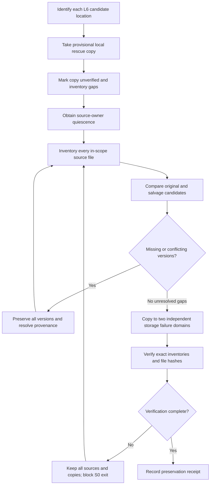
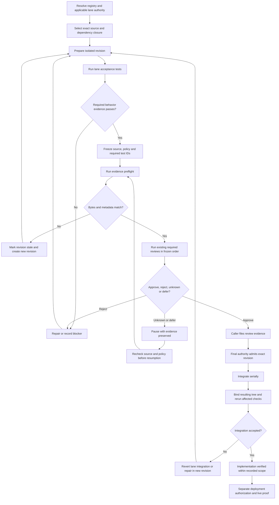
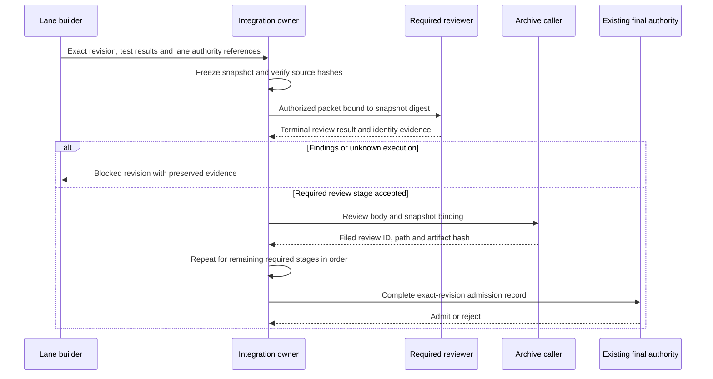
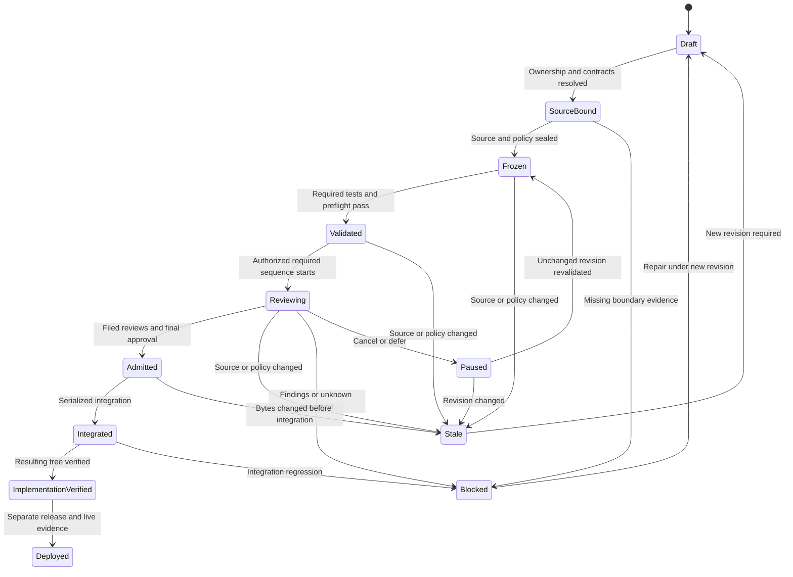

# Astra Reply — subscription transport — 2026-09-20T10:10:49.268Z

**Provider:** openai-codex
**Billing:** chatgpt-subscription
**Authentication:** chatgpt_subscription
**Transport:** codex-cli
**Requested model:** gpt-6-astra
**Served model:** NOT OBSERVABLE on codex-cli (see SERVED_MODEL_UNVERIFIABLE_NOTE)
**Reasoning effort:** xhigh
**Tokens:** in=43747 out=23568 reasoning=8888
**Packet:** `C:/tmp/master-blueprint/MASTER-PACKET.md`
**Wall:** 721.8s
**Mega Blueprint:** ARMED (operator flag)

> Marginal cost $0 — this leg rides the ChatGPT subscription, not OpenRouter.

---
Mega Blueprint — I’m applying the inlined `fable-blueprint-forge` skill to the supplied packet. I’ll decide the shared substrate and build order, distinguish inherited evidence from unverified claims, and identify which lane work can start.

The master package will use an explicit manual review workflow; the supplied evidence does not support claiming controller or hook enforcement. I’m also separating L6’s urgent preservation copy from build admission, so its uncommitted work can be protected before the readiness blockers are cleared.

The build order will distinguish technical dependencies from scheduling priorities. L6’s preservation comes first, and L4 is the first product-work candidate after its open review and source gates close. The React 19 measurement remains dated evidence, not migration approval; Theme Lens and cinematic capability contracts will be pinned before their web changes are integrated.

## PART A — HOSTILE REVIEW

**Verdict: DEFECTS-FOUND in the supplied cross-lane planning and admission model. No implementation verdict is issued.**

Evidence labels apply throughout:

- **[VERIFIED]** — established by the supplied packet or explicitly decided in this package.
- **[LIKELY]** — supported inference, requiring confirmation before implementation.
- **[HYPOTHESIS]** — a possibility to test, not an established dependency or defect.
- **[UNKNOWN]** — evidence was not supplied.

Repository measurements are inherited **as dated 2026-09-20 premises**, not independently refreshed facts. References below use packet sections because source-file line numbers were not supplied. No invented line numbers are used.

**A1 — Review of the supplied existing-blueprint material**

Review coverage: the eight lane excerpts, document inventories, cross-lane findings, infrastructure inventory and archive summary. **[UNKNOWN]** The contents of the underlying wireframes, schemas, tests, adjudications and archived findings were not supplied. Their correctness—and whether particular findings were previously settled—is outside this pass.

The following findings identify cross-lane consequences and decisions. They do not claim to rediscover the archived lane defects.

| ID | Severity | Finding and evidence | Concrete fix |
|---|---|---|---|
| A1-01 | High | **[VERIFIED]** The specified controller is absent in the packet’s measurement, while concurrent writers remain active. A written freeze cannot establish that a native hook blocks their edits. Evidence: `MASTER-PACKET.md §1`, `§3/X1`, `§3/X5`. The new master concern is **false enforcement across lanes**, beyond the already reported missing files. | Select an explicitly manual workflow. Freeze isolated, committed revisions; record review policy and source hashes; check them before admission and integration. Amend the actual canonical mandate to remove active controller/hook claims. Do not implement a controller in this workstream. |
| A1-02 | Critical | **[VERIFIED]** L6 contains reported uncommitted, ignored work, but the listed current salvage worktree and the lane’s original source directory are different locations. Their equivalence is **[UNKNOWN]**. Evidence: `§1`, `§2/L6`, `§3/X6`. Treating the registered salvage worktree as proof that preservation is finished could strand a unique version. | Inventory and preserve each candidate independently. Start a provisional rescue immediately; then obtain writer quiescence, reconcile inventories and verify stable copies. Do not delete either source or choose a winner from branch names alone. |
| A1-03 | High | **[VERIFIED]** `S5 BUILDABLE` is a lane-local claim; the archive summary also records an L4 correctness review with `DEFECTS-FOUND`. Whether that review has been resolved is **[UNKNOWN]**. Evidence: `§2/L4`, `§5`. A master queue must not promote that label into current admission. | Put L4 first in the product implementation queue **after** exact-revision source binding, review disposition and executable acceptance gates. No lane receives present implementation admission from this packet. |
| A1-04 | High | **[VERIFIED]** Eight unverified implementations do not imply eight absent implementations. L6 explicitly contains code and a results document; L3 names existing runtime facilities. Evidence: `§2/L3`, `§2/L6`, `§3/X2`. Treating these lanes as greenfield would risk duplicate systems or overwriting work. | Require an adopt/extend/preserve classification of existing artifacts before each lane slice. Never rebuild a component solely because its implementation acceptance is unverified. |
| A1-05 | High | **[VERIFIED]** Package aliases, document supersession and architectural authority are different concerns. L2 has a location mismatch, L4 records a rename, and L6 rejects an older merge document while retaining selected patterns. Evidence: `§2/L2`, `§2/L4`, `§2/L6`, `§3/X4`. A universal “old path redirects to new authority” rule would collapse these distinctions. | Introduce one registry with separate fields for canonical package paths, aliases, document status and authority scope. Keep L6’s `MEGA-BLUEPRINT.md` authoritative inside L6; the master governs only cross-lane admission and integration. |
| A1-06 | High | **[VERIFIED]** The packet does not establish runtime dependency edges between the eight lanes. Shared product vocabulary is insufficient to prove that L2 consumes L3, L4 consumes L3 events, or the public homepage consumes L6 fleet assets. Evidence: `§2/L1–L8`, `§4`. | Separate mandatory gates, chosen scheduling priorities and conditional consumer dependencies. A conditional dependency becomes a hard edge only when a frozen caller/contract receipt proves it. |
| A1-07 | High | **[VERIFIED]** X7 is a dated dependency measurement. It does not provide a tested replacement cohort, complete transitive compatibility evidence or React 19 runtime results. The `framer-motion`/`motion` row also spans different package names. Evidence: `§3/X7`. | Carry the measurement unchanged as the planning baseline. Keep L1 A independent. Require an exact lockfile cohort and import/API audit for B Stage 1; require separate runtime acceptance for B Stage 2. Do not infer compatibility from peer ranges or negative grep results alone. |
| A1-08 | Medium | **[VERIFIED]** L3, L5 and L7 lack separately named `09-tests.md` documents in the supplied inventories. Whether their existing documents already contain usable tests is **[UNKNOWN]**. Evidence: `§2/L3`, `§2/L5`, `§2/L7`. The master currently cannot address their acceptance commands uniformly. | Produce a lane test index by first mapping existing tests and acceptance criteria. Add missing executable cases only where an actual coverage gap is established. Missing filenames are not proof that testing content is absent. |
| A1-09 | High | **[VERIFIED]** L7’s inherited boundary is an unchanged existing API and no web modifications. Its actual endpoint contracts are not supplied. Evidence: `§2/L7`. A master “shared API improvement” could silently violate that lane decision. | Freeze the API contract used by mobile before Phase 1/2 admission. If mobile requirements cannot be met without backend changes, block that requirement and obtain an explicit scope amendment; do not hide the change inside another lane. |
| A1-10 | High | **[VERIFIED]** The archive summary supplies verdicts and IDs, not review bodies, exact reviewed bytes or dispositions. Evidence: `§5`. This response cannot establish that an old defect is closed or that a new package is filed. | The caller files this master review and records its archive ID. Each lane’s later admission requires the actual applicable review, its revision binding and resolution evidence. The master review does not supersede the lane reviews. |

**A2 — One hostile review of the draft master package**

The draft was reviewed once. The following changes are incorporated into PART B.

| ID | Draft defect found | Fix reflected in the emitted package |
|---|---|---|
| A2-01 | Requiring a fully stabilized source before taking any L6 copy would prolong the data-loss exposure. Evidence: draft `04-build-order.md#M0`. | Split preservation into immediate **provisional rescue** and later **verified stable preservation**. The former authorizes no build or deletion. |
| A2-02 | A single ordered list made scheduling preferences resemble proven technical dependencies. Evidence: draft `01-architecture.md#Dependency model`. | Label every edge as mandatory, conditional or scheduling-only. Supply a bounded rule for skipping a blocked lane. |
| A2-03 | Including review receipts inside the artifact they hash creates a circular identity and invalidates the snapshot when a review is filed. Evidence: draft `03-contracts.md#Revision identity`. | Freeze source and policy in `snapshot.json`; store test results, archive references and admission attestations outside that snapshot. |
| A2-04 | “All evidence tests pass” could be mistaken for product acceptance even when only manifests and receipts were checked. Evidence: draft `07-checkpoints.md#Admission`. | Separate evidence-integrity checks, lane behavior tests, human adjudication, integration verification and deployment proof. None substitutes for the next. |
| A2-05 | A universal reviewer chain would overwrite lane-specific authority that this packet explicitly preserves. Evidence: draft `03-contracts.md#Review policy`. | Freeze the applicable lane policy, including exact seat order and final authority. Resolve it from existing scoped instructions; ambiguity blocks review admission. No master-selected replacement reviewer. |
| A2-06 | A salvage test that verified hashes but trusted the labels “two devices” would overclaim independent preservation. Evidence: draft `09-tests.md#Preservation`. | Require a separate storage-topology attestation and identify its limits. Automated checks verify copied bytes and receipt consistency; the operator verifies independent storage failure domains. |

**Filing disposition:** caller filing pending. The combined review’s scope is the supplied master packet and this forged package. It does not certify or supersede the underlying eight lane reviews.

## PART B — FORGED PACKAGE

### 00-README.md

**Package ID:** `MASTER-RECONCILIATION-20260920`  
**Proposed canonical directory:** `docs/ai-workflow/AI-HANDOFF/BLUEPRINT-master-reconciliation-2026-09-20/`  
**Status:** `PLAN ISSUED — ADMISSION BLOCKED`  
**Implementation verified:** No.  
**Deployed:** Not established.

**[VERIFIED — decision]** This package establishes one shared, manual admission process and one build queue. It does not redesign the eight lanes or authorize production deployment, paid reviews, messages to third parties, deletion or broad staging of the shared checkout.

**Outcome**

Protect L6’s vulnerable source; establish stable revision identity; reconcile package references; and admit independently verifiable lane slices without invalidating another lane’s work.

**Authority**

1. Latest explicit, applicable user instructions govern scope and authorized overrides.
2. This package governs shared preservation, source binding, registry resolution, cross-lane ordering and integration gates.
3. Each lane retains its internal architectural decisions and adjudications.
4. L4 retains its stated source-excerpt precedence.
5. L6 retains its internal `MEGA-BLUEPRINT.md` authority. Its rejected August merge document remains rejected as an architectural source.
6. A conflict is recorded and blocks the affected slice. The builder may not silently choose whichever document permits advancement.

The master does not supersede any lane package or archived review.

**Shared substrate — defined once, instantiated per revision**

| Shared element | Built once | Recorded per lane/revision |
|---|---|---|
| Manual workflow policy | Policy amendment and checkpoint definitions | Applicable authority, reviewer order, counters and transition evidence |
| Package registry | Canonical identities, aliases and authority model | Package version, applicable documents and source binding |
| Preservation procedure | Capture and verification rules | Inventories, copies and storage attestations |
| Evidence integrity tests | `scripts/blueprint-master-evidence.test.mjs`, supplied in `09-tests.md` | Snapshot, results, review references and admission attestation |
| Integration discipline | One integration owner and serialized merges | Conflict resolution, resulting revision and rerun evidence |

This is evidence tooling around a manual process. It is **not** a workflow controller or native write-blocking hook.

**Requirements**

| Requirement | Acceptance criterion | Artifact / evidence |
|---|---|---|
| MR-01 Preserve vulnerable source | Every identified L6 candidate has a reconciled inventory and two verified copies on independently attested storage failure domains | `03`, M0, preservation records |
| MR-02 Bind decisions to bytes | Full commit/tree IDs, clean isolated checkout and hashes for every tracked file match at preflight and admission | `03`, `09`, snapshot |
| MR-03 Make enforcement truthful | Actual canonical mandate explicitly selects manual execution; controller and native-hook enforcement are not claimed | `03`, policy amendment |
| MR-04 Resolve references | Exactly one canonical path per lane; aliases resolve directly; rejected documents cannot become active authority through aliases | Registry, `09` |
| MR-05 Preserve lane decisions | Every admitted slice references its existing applicable architecture and adjudications | Lane admission record |
| MR-06 Make acceptance executable | Required behavior tests have files, named cases, exact commands, fixtures, boundaries and observed results | Lane test index, `09` |
| MR-07 Preserve review authority | Applicable ordered seats and final authority are frozen; required reviews bind the same revision and are archived | `03`, `07` |
| MR-08 Prevent integration drift | Integrated bytes receive fresh binding and affected-boundary verification | M3, integration receipt |
| MR-09 Preserve deployment truth | Plan, implementation and deployment statuses remain separate | Every checkpoint receipt |

**Inherited lane constraints and canonical paths**

All paths below are beneath `docs/ai-workflow/AI-HANDOFF/`.

| Lane | Canonical package directory | Inherited constraint |
|---|---|---|
| L1 | `BLUEPRINT-cinematic-frontend-2026-09-19/` | Preserve `HomePage.V4`, twelve sections, V3 fallback and conversion flow. A is independent of B. Keep `PerformanceTierProvider.tsx`, `full / lean / reduced`, `useAnimationTier` and `useTierFlags`. |
| L2 | `BLUEPRINT-coach-cc-ai-harness-2026-09-20/` | Preserve three role routes and Talk / Review / History. Model prose cannot authorize mutation. Preserve authoritative outcomes and committed execution receipts. |
| L3 | `BLUEPRINT-cortex-phase1-knowledge-spine-2026-07-14/` | Preserve knowledge provenance, Sean approval, rule version/conflict tracking and progression/regression intent. Adopt or extend the existing loader and catalog. |
| L4 | `BLUEPRINT-social-bridge-completion-2026-09-19/` | Preserve S5–S8 decisions and source-excerpt precedence. The supplied `BUILDABLE` claim is not master admission. |
| L5 | `BLUEPRINT-speed-to-lead-email-2026-07-16/` | One slice at a time; acceptance evidence and checkpoint verdict before the next. |
| L6 | `BLUEPRINT-swan-brain-console-v3-merge-2026-09-18/` | Preserve all salvage candidates first. Retain internal decision authority and the rejection of the older merge analysis. |
| L7 | `BLUEPRINT-swan-native-mobile-2026-07-13/` | Standalone `mobile/` application; existing API unchanged; no web modifications. Phases 3–6 remain roadmap-only. |
| L8 | `BLUEPRINT-theme-lens-2026-09-20/` | R6.1 remains the active proposal; preserve R5 and reviews. Theme selection, persistence, restoration and focus must work without animation or WebGL. |

**What can start from the supplied evidence**

“Can start” below means a bounded future operator action; no execution is claimed in this response.

| Lane | Permitted preparatory work | Product implementation admission |
|---|---|---|
| L1 | Bind A/B scopes; inventory capability/theme consumers; preserve X7 measurement | **Blocked:** source binding, complete acceptance commands and applicable review disposition absent |
| L2 | Resolve package alias; bind mounted submission/execute/recovery contracts | **Blocked:** dirty source unbound; integration evidence expressly required |
| L3 | Preserve intent; compare old baseline with selected integration base; index existing tests | **Blocked:** stale baseline and unverified current model/caller contracts |
| L4 | Reconcile the latest filed correctness review with its current package and source excerpts | **Blocked:** exact current reviewed revision and defect disposition absent |
| L5 | Bind current implementation candidates and existing acceptance material | **Blocked:** current source/API evidence and executable acceptance index absent |
| L6 | **Immediate provisional preservation**, followed by stable inventory reconciliation | **Blocked:** S0 preservation/admission evidence and latest review disposition absent |
| L7 | Execute its foundation/contract-audit planning step against bound sources | **Blocked:** current API contract and mobile acceptance evidence absent |
| L8 | Bind R6.1, source and theme registry; index its acceptance tests | **Blocked:** the lane’s explicit source, executable-evidence and archive gates remain |

### 01-architecture.md

**System boundary**

**[VERIFIED — decision]** The master operates on repository artifacts, local preservation copies, test evidence and archive records. It introduces no product screen, application API, database table, provider integration or production background service.

Existing mechanisms are treated as follows:

| Mechanism | Treatment |
|---|---|
| Mega Blueprint mandate library | Adopt; do not duplicate its output-contract responsibility |
| Blueprint splitter | Adopt for document extraction; splitting is not semantic acceptance |
| Existing consultation transports | Retain; invocation requires the frozen lane policy and existing authorization |
| Archive tooling | Adopt; caller files and indexes reviews |
| Missing workflow controller/hook | Do not build here; remove claims that they enforce the current process |
| Existing lane runtime code | Preserve and classify before choosing adoption or extension |

**Preservation flow**



**Admission flow**



**Review handoff sequence**

This is a file/actor interaction, not a newly introduced application API.



**State machine**



**Dependency model**

| Edge | Classification | Reason |
|---|---|---|
| L6 provisional rescue → stable preservation | Mandatory preservation order | A rescue copy alone is not verified S0 evidence |
| Shared admission substrate → every implementation slice | Mandatory gate | Common source, reference and review truth |
| L6 verified preservation → L6 integration | Mandatory | Prevent losing uncommitted candidates |
| L1 B Stage 1 → L1 B Stage 2 | Inherited hard dependency | L1’s explicit migration order |
| L1 A → neither B stage | No prerequisite edge | L1 explicitly makes A independent |
| L7 Phase 0 → Phase 1 → Phase 2 | Inherited hard dependency | Foundation/contracts precede the native vertical slice |
| L8 ↔ L1 shared theme/capability contract | Mandatory **boundary gate if overlap is confirmed** | Public theme state and capability selection must not acquire competing owners |
| L3 → L2 | Conditional | Hard only if a bound L2 slice consumes L3’s new rules or events |
| L3 → L4 | Conditional | Hard only if a bound L4 slice consumes L3’s new events |
| L6 fleet → L1 | Conditional | Hard only if a bound public-home slice actually adopts those assets |
| Shared API change → L7 contract revalidation | Mandatory when API changes | Mobile remains an unchanged-API consumer |

**[VERIFIED — decision]** Until a consumer receipt proves a conditional edge, it must not be used either to block an independent lane indefinitely or to justify an unreviewed integration.

**Diagram applicability**

- Application `sequenceDiagram` per API: **N/A — the master adds no application API interaction.** Each lane must retain or refresh its own diagrams against its actual endpoint contracts before admission.
- Relational `erDiagram`: **N/A — the master adds no relational storage or database columns.** L3 and any other database-changing lane remain blocked until their actual model/migration schemas are available; column names will not be invented.
- Product screen flows: **N/A at master scope.** Per-lane requirements are listed in `02-wireframes.md`.
- Permissions: builder prepares source; integration owner freezes and integrates; required reviewers review; caller files; existing final authority admits; deployment requires separate authority.
- Privacy boundary: preservation and raw evidence remain local. Only separately authorized, appropriately sanitized review packets may leave that boundary.

### 02-wireframes.md

**N/A — the master creates a headless repository admission process, local JSON records and test commands. It creates no screen, responsive layout, copy string, palette token or interactive control.**

It does not revise lane UI decisions indirectly.

| Lane | UI applicability | Admission requirement |
|---|---|---|
| L1 | Homepage and signature enhancement | Existing twelve-section desktop and 375px layouts, fallback, capability modes and reduced-motion states remain authoritative. Exact copy/tokens must come from the bound lane package. |
| L2 | Talk / Review / History and command lifecycle | Preserve those exact navigation labels. Wireframes must distinguish proposal, approval, execution, committed result, cancellation, recovery and unknown outcome. |
| L3 | Admin Knowledge Console | Bind source/rule review, citations, conflicts, approval and failure states to current contracts. No invented schema fields in the UI. |
| L4 | Studio Spotlight S5–S8 | Use the corrected source-backed package. Current screen/state completeness is **[UNKNOWN]** from this packet. |
| L5 | **[UNKNOWN]** whether new product screens are required | Inspect existing lane scope. If headless, explicitly identify the absent screens; email content is still a user-visible artifact requiring its own approved copy/state contract. |
| L6 | Operator console; fleet previews where applicable | Preserve console/operator boundaries. A preview does not establish public-home adoption. |
| L7 | Native login → workout → logger → save → history → chart | Native layouts must cover 375px width, offline drafts, interruption and the actual API errors. Desktop web wireframes are N/A for the native-only surface. |
| L8 | Header lens and theme-dependent states | Exact registered themes, persistence/restoration, keyboard focus and no-animation operation must be represented. |

For every applicable lane, admission requires:

- Desktop and 375px mobile coverage, plus any stricter inherited viewport matrix.
- Exact strings and palette tokens from its authoritative package.
- Loading, empty, partial, success, denial, validation failure, failure and recovery states where the contract exposes them.
- Keyboard/focus behavior and touch targets.
- An explicit state-by-state N/A reason where a state cannot occur.

**[UNKNOWN]** These lane wireframes were not supplied. This table is an admission contract, not a claim that they were reviewed or refreshed here.

### 03-contracts.md

**Manual workflow amendment**

Replace the actual canonical mandate’s installed-mechanism claim with the following text, retaining the prior text in a verified historical snapshot:

> This repository currently uses the manual Mega Blueprint admission protocol defined by `MASTER-RECONCILIATION-20260920`. No `scripts/workflow.mjs`, `scripts/workflow-policy.mjs` or `scripts/workflow-hook.mjs` enforcement is claimed.  
>  
> An integration owner freezes an isolated committed revision, records the applicable review policy, verifies source identity, obtains the required reviews in order, records archive receipts and obtains the existing final authority’s admission. Changes to reviewed source or review policy require a new revision.  
>  
> The protocol detects drift at checkpoints; it does not prevent concurrent filesystem writes. Native enrollment and write-blocking status are `NOT INSTALLED` unless separately implemented and demonstrated.

**[UNKNOWN]** The canonical mandate’s full repository path is absent from the packet. The operator must resolve the existing unique file and record its path. Creating a second file with the same basename is forbidden.

**Package registry**

New supporting file:

`docs/ai-workflow/AI-HANDOFF/BLUEPRINT-master-reconciliation-2026-09-20/package-registry.json`

Schema:

```ts
type PackageRegistry = {
  schemaVersion: 1;
  masterPackagePath: string; // Repository-relative; forward slashes.
  lanes: Array<{
    id: "L1" | "L2" | "L3" | "L4" | "L5" | "L6" | "L7" | "L8";
    canonicalPackagePath: string;
    aliases: string[];
    authorities: Array<{
      path: string;
      scope: string;
      precedence: number; // Unique within this lane; lower wins.
    }>;
    documents: Array<{
      path: string;
      status: "ACTIVE" | "HISTORICAL" | "REJECTED";
      supersededBy: string | null;
      permittedUse: string;
    }>;
  }>;
};
```

Rules:

1. Exactly eight lane IDs and one master path.
2. Canonical paths are those in `00-README.md`.
3. Aliases resolve directly to one canonical package; no alias chains or case-insensitive collisions.
4. L2’s `BLUEPRINT-coach-ai-harness-20260920/` location is an alias.
5. L4’s `BLUEPRINT-studio-spotlight-completion-2026-09-19/` location is an alias.
6. L6’s rejected August merge document is a **rejected document**, not an alias to active architecture.
7. Authorities must be actual, bound document paths. Missing full authority evidence blocks the affected lane.
8. Preserve historical documents. Correct current routing and future references; do not rewrite historical quotations to make old paths disappear.
9. File existence alone cannot establish authority or precedence.

**Source selection and ownership**

- Resolve the packet’s abbreviated commits to full commit IDs before use.
- Treat `382427ae6` as the inherited comparison point, not a certified integration base.
- Before building, the integration owner selects the exact intended integration base after comparing relevant candidates and preserving user-owned work.
- Use an isolated integration branch named `blueprint/master-reconciliation-20260920`; if it already exists, inspect and resume or choose a documented suffix. Never replace it blindly.
- Each lane starts from the latest admitted integration revision.
- One owner serializes integration. Concurrent independent planning is allowed; competing writes to the same source are not.
- Never bulk-import the reported 1,235 dirty files. Each imported change needs ownership, scope and provenance.
- Full reviewed source remains in its isolated checkout. An external review packet may contain a smaller authorized scope; that review must identify what it did not cover.

**Revision identity**

Supporting records live outside the frozen checkout, under a caller-selected local evidence directory. Each revision receives a new directory; prior records remain preserved.

```ts
type ArtifactRef = { path: string; sha256: string };

type FileRecord = {
  path: string;       // Relative, forward slashes, no traversal.
  sha256: string;     // SHA-256 of raw bytes.
  mode: string;       // Git mode for tracked source.
};

type Snapshot = {
  schemaVersion: 1;
  taskId: string;
  revision: string;
  git: {
    root: string;    // Absolute isolated-checkout path.
    commit: string;  // Full Git object ID.
    tree: string;    // Full Git tree ID.
  };
  registryPath: string;
  files: FileRecord[]; // Every tracked file, unique and sorted by path.
  requiredTestIds: string[];
  reviewPolicy: {
    policyId: string;
    authorityRefs: string[];
    orderedSeats: string[];
    finalAuthority: string; // Must equal the last required seat.
    budgetRecord: ArtifactRef;
  };
  preservation: Array<{
    sourceId: string;
    inventory: ArtifactRef; // JSON array of {path, sha256}.
    storageAttestation: ArtifactRef;
    copies: Array<{ root: string; storageId: string }>;
  }>;
};
```

`snapshot.json` is serialized once. Its SHA-256 hashes its exact raw bytes. It contains no self-hash, review result or later test output.

```ts
type Receipt = {
  snapshot: ArtifactRef;
  tests: Array<{
    id: string;
    command: string;
    exitCode: number;
    outcome: "PASS" | "FAIL" | "BLOCKED" | "NOT RUN";
    snapshotSha256: string;
    output: ArtifactRef;
  }>;
  reviews: Array<{
    seat: string;
    reviewId: string;
    archive: ArtifactRef;
    snapshotSha256: string;
    decision: "APPROVE" | "REVISE" | "REJECT" | "UNKNOWN";
    terminalEvidence: ArtifactRef;
    identityEvidence: ArtifactRef;
  }>;
  unresolvedFindings: string[];
  admission: {
    decision: "ADMIT" | "BLOCK";
    by: string;
    snapshotSha256: string;
    attestation: ArtifactRef;
  } | null;
};
```

The required test list excludes the evidence-integrity suite itself, avoiding a receipt that must contain its own unfinished result. Its output is attached after execution.

A receipt’s assertions are not self-authenticating. The final authority checks the linked underlying evidence.

**Preservation contract**

1. Capture the reported original L6 directory, the registered salvage worktree, and relevant root-scope candidates separately where present.
2. Preserve both named scopes: `scripts/swan-brain-console/` and `frontend/src/pages/HomePage/three-worlds/`.
3. Treat the reported 77 files as a reconciliation clue, not a count to manufacture.
4. Provisional rescue may proceed before quiescence. It must remain labeled unverified.
5. Stable preservation requires source-owner quiescence, exact inventories and reconciliation of missing/conflicting versions.
6. Keep two verified copies outside the source worktrees on independently attested storage failure domains. Different directories alone do not satisfy this.
7. Select local, non-public destinations. Do not upload raw source as an implicit backup.
8. Record metadata for links or special files without dereferencing them during rescue. They require explicit resolution before regular-file admission tests.
9. Source disappearance or an unexplained inventory difference blocks S0 exit. Preserve available copies while resolving it.

**Review and archive contract**

- This master pass is planning adjudication, not a replacement for any lane’s implementation review.
- Resolve the exact applicable lane policy from existing scoped instructions and explicit overrides. Record ordered seats, final authority, historical counters and remaining authorization.
- Ambiguous authority, unknown terminal execution, unavailable required identity or exhausted authorization blocks the affected review.
- Do not reset budgets or invoke a paid fallback.
- Each new review body includes this exact binding line:

```text
Snapshot-SHA256: <64 lowercase hexadecimal characters>
```

- Use the existing archive header schema. Keep `unproven` explicit.
- The caller records actual archive paths, IDs and hashes after filing and indexing.
- A later review supersedes an earlier review only when it actually replaces the same review scope. Master reconciliation does not supersede L4 or L6 correctness reviews.
- Preserve findings and verdicts. Only the mandated reciprocal supersession link may update an older filed review.

**Shared runtime boundary contracts**

| Boundary | Decision |
|---|---|
| Capability | L1’s existing provider remains authoritative for its capability vocabulary and hooks. A second detector is forbidden. |
| Theme | L8 remains owner of its existing theme-selection contract. This master creates no new theme store or token vocabulary. |
| Capability × theme | If callers overlap, record exact reads/writes and initialization order before either overlapping slice is admitted. |
| Knowledge × actions | L3 approval/provenance and L2 action authorization remain distinct. Knowledge approval never grants mutation permission. |
| Console × public UI | L6 operator previews/assets do not enter public runtime without an explicit consumer receipt and lane review. |
| Web × mobile API | L7 consumes the bound existing contract. Backend changes require separate scope authority and consumer verification. |

**Migrations, environment and rollback**

- Application database migration: **N/A — none introduced by the master.**
- Application environment variables: **N/A — none introduced.**
- Test-only environment variable: `BLUEPRINT_RECEIPT`, an absolute local receipt path; never a secret.
- Workflow migration: preserve old instructions and counters; amend the actual authority; create new registry/evidence records; retain previous review state.
- Master tooling rollback: revert its isolated commit and leave all preserved artifacts and review history intact.
- Lane rollback: revert the lane’s integration commits, then rerun affected integration checks.
- Database-changing lanes must supply their own tested migration, restore and rollback plans before admission.
- No master rollback permits deletion of preservation copies or review records.

### 04-build-order.md

**[VERIFIED — decision]** Use this queue. It is a scheduling decision unless the dependency table explicitly marks a hard edge.

| Order | Work | Exit needed before advancement |
|---|---|---|
| 0 | **L6 provisional rescue** | Available vulnerable candidates copied; unresolved gaps visible |
| 1 | **M0 stable preservation** | Reconciled inventories, verified copies and storage attestation |
| 2 | **M1 shared manual substrate** | Canonical policy amendment, registry, supplied evidence tests and owner recorded |
| 3 | **M2 lane admission preparation** | Exact source, authority, dependency boundaries and executable acceptance index for the next lane |
| 4 | **L6 S0 closure only** | Existing salvage acceptance reconciled with the new preservation evidence |
| 5 | **L4 S5, then S6–S8** | Each inherited slice admitted separately; latest correctness findings resolved against exact bytes |
| 6 | **L8 R6.1** | Theme behavior and shared boundary contracts verified |
| 7 | **L1 A** | Signature enhancement verified with existing home, fallback and conversion behavior retained |
| 8 | **L3 Phase 1** | Current schema/loader contracts rebound; knowledge and event behavior verified |
| 9 | **L2 harness** | Submission/action/recovery boundaries verified; any real L3 consumer edge satisfied |
| 10 | **L5 email epic** | Existing slice order and checkpoint contract fulfilled |
| 11 | **L7 Phases 0–2** | Existing API contract verified before native implementation; scoped vertical slice accepted |
| 12 | **L6 remaining merge/runtime work** | Preserved candidates integrated under existing L6 decisions and reviews |
| 13 | **L1 B Stage 1** | Compatible dependency cohort verified while remaining on React 18 |
| 14 | **L1 B Stage 2** | Separate React 19 migration accepted with bounded rollback |
| 15 | **M3 combined integration** | Final integrated revision and affected consumer boundaries verified |

Reasons for the chosen priorities:

- L6 preservation is first because it addresses reported data-loss exposure.
- L4 is the first product candidate because its supplied package has the strongest source-backed readiness claim, subject to unresolved review evidence.
- L8 precedes L1 A to settle theme behavior before overlapping visual integration.
- L3 precedes L2 as a planning convenience for any confirmed knowledge consumer; this is not an invented universal dependency.
- The dependency migration follows the product queue to avoid moving the web baseline underneath multiple unaccepted lanes.

**Bounded queue exception**

A blocked lane does not stop an independent later lane indefinitely. The integration owner may advance the next lane only after recording:

1. The blocked lane and concrete blocker.
2. No unmet hard dependency.
3. No unresolved shared-file ownership or contract conflict.
4. The later lane’s own admission evidence.
5. The updated queue entry.

The owner may not waive a blocker, change lane scope, change reviewer authority or bypass a dependency.

### 05-slices.md

**M0 — Preserve L6 source**

- **Entry:** packet’s candidate locations and named scopes; local preservation owner assigned.
- **Work:** provisional rescue; writer coordination; stable inventories; version reconciliation; two verified copies.
- **Exit:** preservation records satisfy MR-01.
- **Test:** `preflight: preservation` in `09-tests.md`.
- **Stop:** missing source, unexplained divergence, incomplete copy or unattested storage independence.
- **Recovery:** retain all candidates and repeat stable capture after resolving the gap.
- **No product code change.**

**M1 — Establish the manual substrate**

- **Entry:** verified preservation or an explicit preserved emergency state while other nondependent preparation continues.
- **Work:** snapshot the existing policy; amend its installed-mechanism section; create registry and evidence tests; assign integration ownership.
- **Exit:** no active claim that nonexistent controller/native-hook enforcement protects this task; registry paths and authority references are valid.
- **Tests:** `preflight: registry`, plus a manual policy inspection recorded in the receipt.
- **Stop:** multiple apparent canonical mandate files, unresolved authority or overlapping ownership.
- **Rollback:** revert the isolated policy/tooling commit; retain all evidence.

**M2 — Admit one lane slice**

- **Entry:** M1 complete; lane selected under `04-build-order.md`.
- **Work:** map existing implementation; bind exact contracts; update the lane’s own package; identify executable tests; implement only the admitted scope; freeze the result.
- **Exit:** lane behavior tests pass, exact-source preflight passes, required reviews are filed and final authority admits the revision.
- **Tests:** complete evidence suite plus the lane’s frozen named commands.
- **Stop:** unverified caller, schema, API, authority, source identity or acceptance boundary.
- **Rollback:** discard no shared work; repair or revert only the isolated slice under a new revision.

**M3 — Integrate and verify the combined state**

- **Entry:** individually admitted slice; integration owner has exclusive merge ownership.
- **Work:** integrate explicit commits; resolve conflicts as new changes; bind resulting tree; run affected consumer and regression checks.
- **Exit:** combined revision accepted under the applicable review policy.
- **Tests:** complete evidence suite on the integrated snapshot and the affected lane test union.
- **Stop:** conflict resolution changes reviewed behavior, runtime dependency drifts or a consumer check fails.
- **Rollback:** revert the lane’s integration commits and verify the restored integration tree.
- **Deployment:** separate; M3 grants no production push authority.

**Lane work remains bounded**

Existing lane slice IDs and acceptance criteria remain authoritative. The queue above does not rename their internal slices or replace their tests with master artifact checks.

**Traceability**

| Packet concern | Requirement | Slice | Verification |
|---|---|---|---|
| X1 missing controller | MR-03 | M1 | Manual policy inspection; no hook-enforcement claim |
| X2 unverified implementations | MR-05, MR-06, MR-09 | M2/M3 | Existing-artifact classification; actual lane results |
| X3 repeated readiness blockers | MR-02, MR-06, MR-07 | M1/M2 | Shared records plus per-revision evidence |
| X4 path/supersession drift | MR-04 | M1 | Registry test and authority inspection |
| X5 dirty, concurrent source | MR-02, MR-08 | M2/M3 | Clean isolated source and exact manifest checks |
| X6 vulnerable L6 work | MR-01 | M0 | Stable inventory/copy verification |
| X7 React cohort risk | MR-06, MR-08 | L1 B1/B2 | Exact dependency cohort and separate runtime acceptance |

### 06-bans.md

1. **No cleanup of the shared dirty tree.** No broad staging, reset, clean, forced checkout or wholesale import of the reported dirty files.
2. **No deletion after provisional rescue.** A copy without stable inventory verification does not authorize removing the original.
3. **No declaring storage independence from different path names.** This prevents two copies on one failing device from masquerading as redundancy.
4. **No claimed native freeze enforcement.** The selected workflow is manual and detects drift at checkpoints.
5. **No new controller implementation in this package.** It would expand scope and delay the actual preservation/admission work.
6. **No second canonical mandate or competing lane blueprint.** Resolve existing authority; preserve originals and explicit supersession.
7. **No alias promotion of rejected documents.** L6’s rejected merge analysis cannot regain architectural authority through a path redirect.
8. **No admission from status prose.** `BUILDABLE`, `PACKAGE READY` and a successful split are not acceptance evidence.
9. **No green artifact checks presented as product success.** Manifest tests do not prove command execution, emails, offline saves, theme persistence or production behavior.
10. **No review reuse across changed bytes or changed policy without applicability adjudication.** Unknown scope stays unknown.
11. **No invented served-model identity, terminal result or reset review budget.**
12. **No provider calls, paid fallback or retries inferred from this planning package.**
13. **No broad exposure of raw preserved source.** External review packets require their existing authorization and privacy controls.
14. **No React 19 migration folded into L1 A.** Preserve the inherited independent delivery path.
15. **No automatic `framer-motion` → `motion` substitution from the registry row.** Package-name, import and API changes require an explicit cohort plan.
16. **No new capability or theme authority beside the inherited owners.**
17. **No knowledge approval treated as action authorization.**
18. **No backend or web changes hidden inside L7’s unchanged-API/native-only scope.**
19. **No operator-console fleet automatically mounted on the public homepage.**
20. **No production deployment claim without separate authorization and live evidence.**

### 07-checkpoints.md

| Gate | Required evidence | Passing meaning |
|---|---|---|
| G0 — Rescue captured | Provisional copy inventory and explicit gaps | Available vulnerable bytes have a rescue copy |
| G1 — Preservation verified | Stable source reconciliation, copy hashes, storage attestation | L6 preservation requirement satisfied |
| G2 — Authority resolved | Canonical policy amendment, registry, lane authorities and reviewer policy | A slice can be prepared under a determinate process |
| G3 — Source bound | Full commit/tree, clean isolated checkout, complete tracked-file manifest, scoped boundary receipts | Review target is identifiable |
| G4 — Behavior verified locally | Actual lane commands/results, fixtures and real-boundary evidence | Specified local acceptance criteria passed |
| G5 — Reviewed and filed | Required ordered reviews, terminal/identity evidence, archive IDs, findings disposition | Existing final authority can decide admission |
| G6 — Admitted | Exact-revision final-authority attestation | Only that revision may integrate |
| G7 — Integrated | Resulting revision, affected test union and applicable combined review | Implementation verified within its recorded scope |
| G8 — Deployed | Separate release authority, deployment identity and live checks | Only the evidenced deployed behavior is established |

**Current receipt**

| Item | Status |
|---|---|
| Master package emitted | **[VERIFIED]** This response |
| Source exploration or live verification | **NOT RUN**, by dispatch scope |
| Preservation | **NOT RUN** |
| Policy amendment / registry written | **NOT RUN** |
| Executable evidence test source supplied | **[VERIFIED]** `09-tests.md` |
| Evidence or lane tests executed | **NOT RUN** |
| Full lane documents and archive bodies reviewed | **NOT RUN** |
| This master review filed | **Caller action pending** |
| Any lane admitted | **No** |
| Combined implementation verified | **No** |
| Deployment | **Not established** |

**Caller filing record**

File this combined planning review with:

- Subject: `master-blueprint-reconciliation-20260920`
- Verdict: `DEFECTS-FOUND`
- Scope: supplied eight-lane excerpts and cross-lane reconciliation; excludes unsupplied lane bodies and runtime implementation.
- Reviewed source: the supplied packet and emitted package, bound by artifact hashes.
- Repository commit: reported `382427ae6`, explicitly marked inherited and insufficient to identify the dirty tree.
- `unproven`: source currency, full lane contracts, runtime behavior, defect dispositions, preservation and deployment.
- Supersession: none unless the caller establishes an actual earlier review of this same master scope.

Use actual caller/tool metadata. Do not invent filing time, review ID or verified identity. Run the archive’s existing indexing process and retain its result.

**Long-running progress record**

Each admitted task keeps a compact record of:

`finished → exact revision/artifacts → failed or blocked → next authorized action`

This is working state, not an automatic continuity closeout.

**Artifact hygiene**

Expected new artifacts are the master package, registry, one evidence test file, revision records and local preservation copies. Keep temporary outputs inside the evidence directory. Do not place ad hoc logs or screenshots at repository root. Preserve filed reviews and preservation evidence.

### 09-tests.md

**Status: executable source supplied below; not saved or run in this dispatch.**

This suite tests the **real records produced by the manual process**. It does not mock a missing workflow controller and does not certify product behavior.

**File:** `scripts/blueprint-master-evidence.test.mjs`

```js
import test from 'node:test';
import assert from 'node:assert/strict';
import {
  readFileSync, readdirSync, lstatSync,
} from 'node:fs';
import {
  resolve, relative, isAbsolute, sep, basename,
} from 'node:path';
import { createHash } from 'node:crypto';
import { spawnSync } from 'node:child_process';

const digest = bytes =>
  createHash('sha256').update(bytes).digest('hex');

function artifact(ref) {
  assert.ok(ref && isAbsolute(ref.path), 'Absolute artifact path required');
  assert.match(ref.sha256, /^[a-f0-9]{64}$/);
  const bytes = readFileSync(ref.path);
  assert.equal(digest(bytes), ref.sha256, `Artifact changed: ${ref.path}`);
  return bytes;
}

function within(root, path) {
  const rel = relative(resolve(root), resolve(path));
  assert.ok(rel !== '..' && !rel.startsWith(`..${sep}`));
  assert.ok(!isAbsolute(rel), 'Path escapes root');
}

function localFile(root, path) {
  assert.ok(typeof path === 'string' && path.length > 0);
  assert.ok(!isAbsolute(path) && !/[\0\r\n\\:]/.test(path));
  const parts = path.split('/');
  assert.ok(parts.every(p => p && p !== '.' && p !== '..'));
  let current = resolve(root);
  assert.ok(!lstatSync(current).isSymbolicLink());
  for (const part of parts) {
    current = resolve(current, part);
    assert.ok(!lstatSync(current).isSymbolicLink(), 'Link requires resolution');
  }
  within(root, current);
  return current;
}

function listFiles(root, prefix = '') {
  const result = [];
  for (const entry of readdirSync(resolve(root, prefix), {
    withFileTypes: true,
  })) {
    const path = prefix ? `${prefix}/${entry.name}` : entry.name;
    assert.ok(!entry.isSymbolicLink(), 'Link requires resolution');
    if (entry.isDirectory()) result.push(...listFiles(root, path));
    else {
      assert.ok(entry.isFile(), 'Special file requires resolution');
      result.push(path);
    }
  }
  return result.sort();
}

function git(...args) {
  const result = spawnSync('git', ['-C', snapshot.git.root, ...args], {
    encoding: 'utf8',
    windowsHide: true,
    maxBuffer: 64 * 1024 * 1024,
  });
  assert.equal(result.error, undefined);
  assert.equal(result.status, 0, result.stderr);
  return result.stdout;
}

function unique(values) {
  assert.equal(new Set(values).size, values.length, 'Duplicate values');
}

const receiptPath = process.env.BLUEPRINT_RECEIPT;
assert.ok(receiptPath && isAbsolute(receiptPath),
  'Set BLUEPRINT_RECEIPT to an absolute local receipt path');
const receipt = JSON.parse(readFileSync(receiptPath, 'utf8'));
const snapshot = JSON.parse(artifact(receipt.snapshot).toString('utf8'));
const snapshotHash = receipt.snapshot.sha256;
const root = snapshot.git.root;

const base = 'docs/ai-workflow/AI-HANDOFF/';
const master = `${base}BLUEPRINT-master-reconciliation-2026-09-20`;
const directories = [
  'BLUEPRINT-cinematic-frontend-2026-09-19',
  'BLUEPRINT-coach-cc-ai-harness-2026-09-20',
  'BLUEPRINT-cortex-phase1-knowledge-spine-2026-07-14',
  'BLUEPRINT-social-bridge-completion-2026-09-19',
  'BLUEPRINT-speed-to-lead-email-2026-07-16',
  'BLUEPRINT-swan-brain-console-v3-merge-2026-09-18',
  'BLUEPRINT-swan-native-mobile-2026-07-13',
  'BLUEPRINT-theme-lens-2026-09-20',
];

test('preflight: registry', () => {
  const registry = JSON.parse(readFileSync(
    localFile(root, snapshot.registryPath), 'utf8'));
  assert.equal(registry.schemaVersion, 1);
  assert.equal(registry.masterPackagePath, master);
  assert.equal(registry.lanes.length, 8);
  unique(registry.lanes.map(lane => lane.id));
  const allPaths = [master];

  directories.forEach((directory, index) => {
    const lane = registry.lanes.find(l => l.id === `L${index + 1}`);
    assert.ok(lane);
    assert.equal(lane.canonicalPackagePath, `${base}${directory}`);
    localFile(root, lane.canonicalPackagePath);
    assert.ok(lane.authorities.length > 0);
    unique(lane.authorities.map(a => a.precedence));
    lane.authorities.forEach(a => {
      assert.ok(a.scope && Number.isInteger(a.precedence));
      localFile(root, a.path);
    });
    lane.documents.forEach(d => {
      localFile(root, d.path);
      assert.ok(['ACTIVE', 'HISTORICAL', 'REJECTED'].includes(d.status));
      assert.ok(d.permittedUse);
      if (d.supersededBy) localFile(root, d.supersededBy);
      if (d.status === 'REJECTED') {
        assert.ok(!lane.authorities.some(a => a.path === d.path));
      }
    });
    allPaths.push(lane.canonicalPackagePath, ...lane.aliases);
  });
  unique(allPaths.map(path => path.toLowerCase()));
});

test('preflight: source identity and complete manifest', () => {
  assert.equal(snapshot.schemaVersion, 1);
  assert.ok(snapshot.taskId && snapshot.revision);
  assert.match(snapshot.git.commit, /^(?:[a-f0-9]{40}|[a-f0-9]{64})$/);
  assert.match(snapshot.git.tree, /^(?:[a-f0-9]{40}|[a-f0-9]{64})$/);
  assert.equal(git('rev-parse', 'HEAD').trim(), snapshot.git.commit);
  assert.equal(git('rev-parse', 'HEAD^{tree}').trim(), snapshot.git.tree);
  assert.equal(git('status', '--porcelain=v1',
    '--untracked-files=all').trim(), '');

  const tracked = git('ls-files', '--stage', '-z')
    .split('\0').filter(Boolean).map(row => {
      const split = row.indexOf('\t');
      const [mode, , stage] = row.slice(0, split).split(' ');
      assert.equal(stage, '0', 'Unmerged index entry');
      assert.ok(['100644', '100755'].includes(mode),
        'Submodule or link requires explicit resolution');
      return { path: row.slice(split + 1), mode };
    }).sort((a, b) => a.path < b.path ? -1 : a.path > b.path ? 1 : 0);

  unique(snapshot.files.map(file => file.path));
  assert.deepEqual(snapshot.files.map(({ path, mode }) => ({ path, mode })),
    tracked);
  snapshot.files.forEach(file => {
    const path = localFile(root, file.path);
    assert.ok(lstatSync(path).isFile());
    assert.equal(digest(readFileSync(path)), file.sha256, file.path);
  });
});

test('preflight: preservation', () => {
  assert.ok(snapshot.preservation.length > 0);
  unique(snapshot.preservation.map(p => p.sourceId));
  snapshot.preservation.forEach(record => {
    const inventory = JSON.parse(artifact(record.inventory).toString('utf8'));
    artifact(record.storageAttestation);
    assert.ok(inventory.length > 0);
    unique(inventory.map(file => file.path));
    assert.ok(record.copies.length >= 2);
    unique(record.copies.map(copy => copy.storageId));
    const expected = inventory.map(file => file.path).sort();

    record.copies.forEach(copy => {
      assert.ok(isAbsolute(copy.root) && copy.storageId);
      assert.deepEqual(listFiles(copy.root), expected);
      inventory.forEach(file => {
        assert.equal(digest(readFileSync(localFile(copy.root, file.path))),
          file.sha256, file.path);
      });
    });
  });
});

test('admission: required behavior evidence', () => {
  assert.ok(snapshot.requiredTestIds.length > 0);
  unique(snapshot.requiredTestIds);
  unique(receipt.tests.map(result => result.id));
  snapshot.requiredTestIds.forEach(id => {
    const result = receipt.tests.find(item => item.id === id);
    assert.ok(result, `Missing required test: ${id}`);
    assert.ok(result.command);
    assert.equal(result.snapshotSha256, snapshotHash);
    assert.equal(result.outcome, 'PASS');
    assert.equal(result.exitCode, 0);
    artifact(result.output);
  });
});

test('admission: ordered filed reviews', () => {
  const policy = snapshot.reviewPolicy;
  assert.ok(policy.policyId && policy.authorityRefs.length > 0);
  assert.ok(policy.orderedSeats.length > 0);
  assert.equal(policy.finalAuthority, policy.orderedSeats.at(-1));
  artifact(policy.budgetRecord);
  assert.deepEqual(receipt.reviews.map(r => r.seat), policy.orderedSeats);

  receipt.reviews.forEach(review => {
    assert.equal(review.decision, 'APPROVE');
    assert.equal(review.snapshotSha256, snapshotHash);
    within('Z:/HostileReviews', review.archive.path);
    assert.equal(basename(review.archive.path), `${review.reviewId}.md`);
    const body = artifact(review.archive).toString('utf8');
    assert.ok(body.includes(`Snapshot-SHA256: ${snapshotHash}`));
    artifact(review.terminalEvidence);
    artifact(review.identityEvidence);
  });
});

test('admission: final authority and unresolved findings', () => {
  assert.deepEqual(receipt.unresolvedFindings, []);
  assert.ok(receipt.admission);
  assert.equal(receipt.admission.decision, 'ADMIT');
  assert.equal(receipt.admission.by, snapshot.reviewPolicy.finalAuthority);
  assert.equal(receipt.admission.snapshotSha256, snapshotHash);
  artifact(receipt.admission.attestation);
});
```

**Execution**

Run from the isolated checkout containing the supplied test file. Set the receipt path to the actual revision record.

```powershell
$env:BLUEPRINT_RECEIPT = 'C:\tmp\master-blueprint\evidence\r0001\receipt.json'
node --test --test-name-pattern="^preflight:" scripts/blueprint-master-evidence.test.mjs
if ($LASTEXITCODE -ne 0) { throw 'Blueprint preflight failed' }
```

After behavior evidence, reviews and the final-authority attestation exist:

```powershell
node --test scripts/blueprint-master-evidence.test.mjs
if ($LASTEXITCODE -ne 0) { throw 'Blueprint admission evidence failed' }
```

The receipt path is an example deployment location for the records, not an assertion that the file exists. A missing record or test file is **BLOCKED configuration**, not a valid product regression failure.

**Named cases and what they prove**

| Case | Proves | Does not prove |
|---|---|---|
| `preflight: registry` | Exact lane paths, unique identities, accessible authority references and rejected-document exclusion | That every authority declaration is substantively correct |
| `preflight: source identity and complete manifest` | Commit/tree identity, clean tracked/untracked state and complete tracked-file hashes | Runtime dependency integrity, ignored-file absence or product correctness |
| `preflight: preservation` | Copy inventories and bytes match their recorded source inventory; required attestation exists | Physical device independence or original-inventory completeness without operator verification |
| `admission: required behavior evidence` | Every frozen required test ID has a passing, hash-bound result artifact | That the command was honestly recorded or its test adequately exercises behavior |
| `admission: ordered filed reviews` | Ordered review records and linked archive/terminal/identity artifacts exist and match hashes | Provider identity or review quality merely from metadata |
| `admission: final authority and unresolved findings` | Exact-revision admission record is complete | Deployment or freedom from undiscovered defects |

These limits are checked by the underlying evidence inspection at G5/G6.

**Protocol fault-injection acceptance**

Use disposable copies of the evidence records and isolated fixture checkouts. Never mutate the real frozen revision to demonstrate a test failure.

| ID | Action | Exact test selection | Required result |
|---|---|---|---|
| MT-01 | Change a tracked source byte after producing the fixture manifest | `--test-name-pattern="source identity"` | Nonzero exit, source mismatch |
| MT-02 | Point L2 at its alias as if canonical | `--test-name-pattern="registry"` | Nonzero exit, canonical path mismatch |
| MT-03 | Truncate one copied preservation file | `--test-name-pattern="preservation"` | Nonzero exit, hash mismatch |
| MT-04 | Remove a required lane result | `--test-name-pattern="required behavior"` | Nonzero exit, missing required ID |
| MT-05 | Swap required review records | `--test-name-pattern="ordered filed"` | Nonzero exit, ordering mismatch |
| MT-06 | Bind final admission to a different digest | `--test-name-pattern="final authority"` | Nonzero exit, revision mismatch |
| MT-07 | Restore the unchanged valid fixture | Full command above | Zero exit |

For each selection, use:

```text
node --test <selection> scripts/blueprint-master-evidence.test.mjs
```

Expected fault-injection failures are isolated from the normal passing suite. Import/setup failures do not satisfy MT-01–MT-06.

**Lane behavior-test requirements**

**[UNKNOWN]** The packet does not supply actual executable lane test files or full acceptance criteria. Their names must be recovered from the existing packages and implementation; this master will not fabricate existing paths.

Before M2 admission, each lane must provide a test index containing:

`requirement ID → actual test file → named case → exact command → fixture → observable result → forbidden side effect → real or mocked boundary → evidence artifact`

Minimum scope:

| Lane | Required observable boundaries |
|---|---|
| L1 | Existing homepage/conversion behavior; capability modes and fallback; A independent of B; separate B1/B2 dependency/runtime results |
| L2 | Submission outcome authority; permission denial; confirmation/cancellation; duplicate execution; committed receipts; interruption and unknown-outcome recovery |
| L3 | Provenance, approval filtering, rule versions/conflicts, actual schema/loader behavior and progression/regression events |
| L4 | Corrected S5–S8 contracts and the actual latest archived correctness findings |
| L5 | Existing email delivery/admission contract; its actual retry, duplicate and failure rules; checkpoint evidence |
| L6 | Complete preservation, actual console/asset integration and unresolved round-10 findings |
| L7 | Existing API compatibility; authentication; workout save/history/chart; offline draft interruption and replay under the actual contract |
| L8 | All registered themes; select/persist/restore; keyboard focus; no-animation/WebGL operation; desktop and mobile states |

No broad test may touch the production database merely because it runs locally. Fixtures and destructive test resources must be isolated and identified.

## PART C — DECISION-DENSITY SELF-TEST

The remaining choices are either decided here or delegated within explicit bounds.

| Choice | Resolution |
|---|---|
| Implement the missing controller? | **Decided:** no; amend the active mandate to an explicit manual process. |
| Claim native write prevention? | **Decided:** no. Drift is checked at checkpoints. |
| Preserve L6 before source stabilization? | **Decided:** provisional rescue immediately; verified preservation requires quiescence and reconciliation. |
| Which L6 location wins? | **Delegated fact resolution:** compare all candidates and preserve unique versions. Branch names and file counts cannot select the winner. |
| Preservation destinations? | **Delegated operational selection:** local, non-public, outside source worktrees, two independently attested storage failure domains. Failure to satisfy this blocks preservation completion. |
| Who performs integration? | **Delegated assignment:** one recorded integration owner at a time, without changing existing lane ownership. |
| Which commit is the integration base? | **Delegated evidence resolution:** full commit ID chosen from current intended integration history after candidate comparison; no assumption that the packet’s abbreviated HEAD is certified. |
| How much dirty source is imported? | **Decided:** only explicitly scoped, owned and preserved changes. No bulk import. |
| Where does the master live? | **Decided:** `BLUEPRINT-master-reconciliation-2026-09-20/` under the existing handoff directory. |
| How are path changes resolved? | **Decided:** one registry; direct aliases; separate document status and authority. |
| Does the master replace L6 architecture? | **Decided:** no; it governs only shared admission and integration. |
| Does it replace lane reviews? | **Decided:** no. |
| How are the lanes ordered? | **Decided:** the queue in `04-build-order.md`. |
| May a blocked lane be skipped? | **Delegated within bounds:** only through the recorded independent-lane exception; no dependency or authority waiver. |
| Are L3→L2 or L6→L1 mandatory dependencies? | **Decided:** only when a bound consumer receipt proves the relationship. |
| Who owns theme and capability decisions? | **Decided:** retain L8’s existing theme contract and L1’s inherited capability authority; resolve actual overlap before integration. |
| Which lane reviewers run? | **Delegated authority resolution:** apply the latest applicable existing policy and overrides, freeze exact seats/order, preserve counters. Ambiguity blocks invocation. |
| Does this authorize provider spend or retries? | **Decided:** no additional authorization is granted. |
| What identifies a reviewed revision? | **Decided:** full Git identity, complete tracked-file manifest and exact-byte snapshot digest. |
| Where do reviews and results live? | **Decided:** outside the frozen source identity; reviews are filed in the existing archive. |
| Can artifact tests grant product acceptance? | **Decided:** no; lane behavior evidence and final adjudication are separate gates. |
| Which lane test paths are used? | **Delegated evidence mapping:** use actual existing tests first; define missing cases against actual contracts. Missing information blocks the lane rather than becoming an invented path. |
| Is React 19 authorized by X7? | **Decided:** no; X7 remains a dated measurement. B1 and B2 retain separate acceptance. |
| May mobile requirements change the API? | **Decided:** not under the inherited L7 scope. Incompatible requirements need an explicit scope amendment. |
| Are new screens, APIs or database columns required by the master? | **Decided:** no; corresponding N/A declarations are scoped and explicit. |
| Can admission survive changed bytes? | **Decided:** no automatic carry-forward; produce a new revision and adjudicate applicable evidence. |
| Who files this response? | **Decided:** caller; actual filing evidence remains pending. |
| Can this package authorize deployment or cleanup? | **Decided:** no. Separate authority and evidence remain required. |

**Unverified inputs remain blockers, not silent builder discretion:** current source ownership, complete lane authorities, full schemas/contracts, actual test commands, archived finding dispositions, review-policy resolution and preservation topology.

**Next authorized work:** provisional L6 rescue, then stable preservation and the shared manual admission records. No lane implementation is certified by this response.
