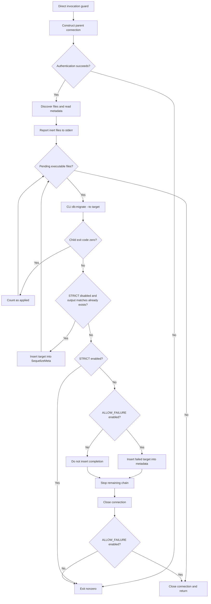
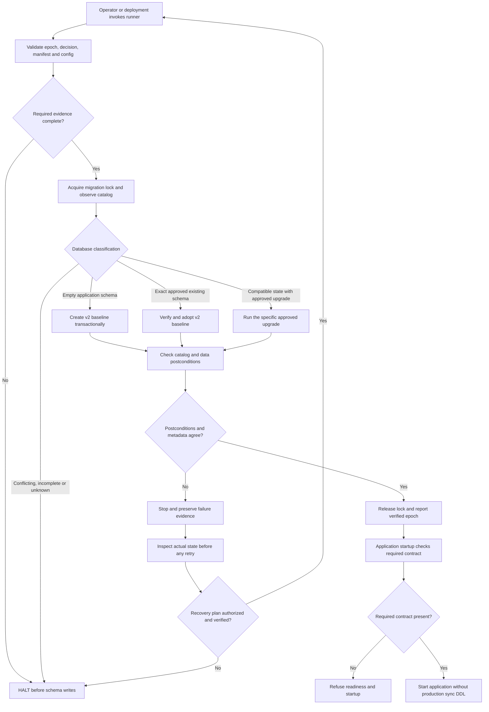
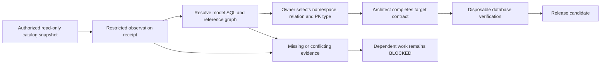
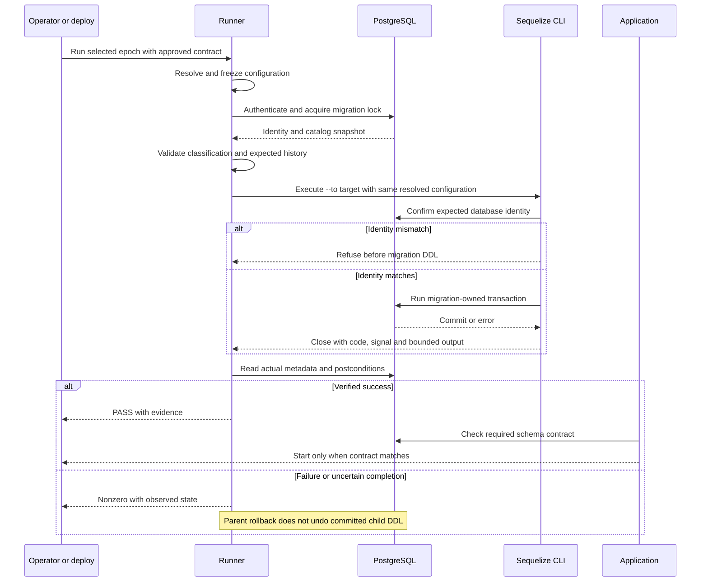
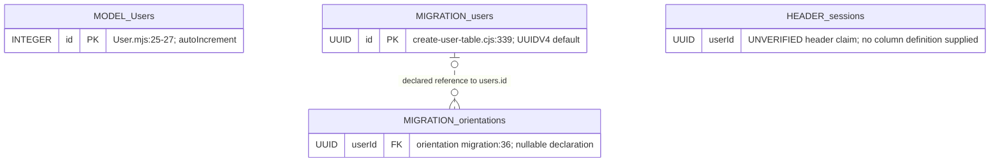
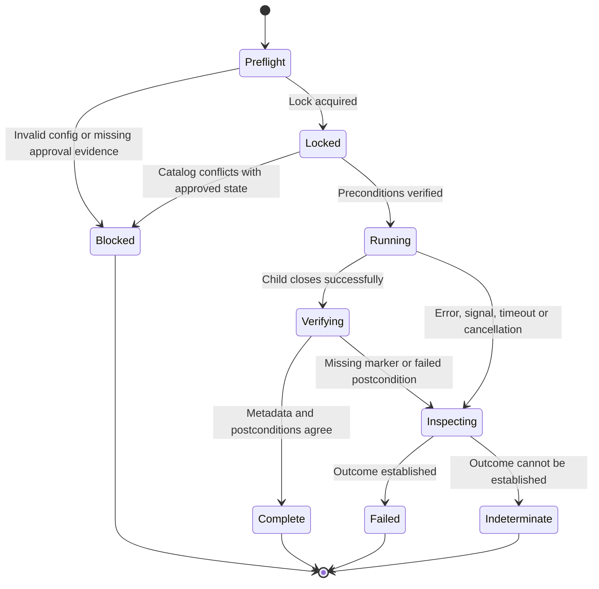

**1. Responsibility and authority**

| Component | Responsibility | Forbidden responsibility |
|---|---|---|
| Catalog observer | Report physical identifiers, column types, defaults, constraints, and metadata | Mutate schema or inspect client records for the review packet |
| Decision receipt | Bind approved relation, PK type, namespace, and observation | Pretend an unknown value has been observed |
| Migration manifest | Bind reviewed files, order, dependencies, and postconditions | Infer that a filename proves a migration ran |
| Runner | Validate configuration, serialize execution, invoke CLI, verify outcome, stop accurately | Convert arbitrary error text into completion |
| Baseline/adoption migration | Establish or verify the approved v2 schema contract | Mark legacy migrations executed |
| Application startup | Require the schema contract before accepting traffic after cutover | Repair production schema through model sync |
| Models | Describe application persistence expectations | Independently change production schema |

**2. Current runner flow**

[VERIFIED] This describes the supplied `safe-migrate.mjs`, not verified deployed behavior.

The deployment catch at `backend/scripts/render-start.mjs:95-100` can continue server startup after `X`.

**3. Intended execution paths**

“Empty” means no application relations in the approved ownership manifest. The presence of unrelated relations or uncertain ownership prevents empty-schema classification.

**4. Observation and decision flow**

**5. Database interaction sequence**

N/A — there are no HTTP endpoints or screen API interactions. The database/CLI interaction is applicable:

**6. ERD: supplied evidence projection**

[VERIFIED] This is a projection of declarations and claims, **not a complete or observed physical ERD**. Entity prefixes identify their evidence source. Only supplied columns are shown.

[UNKNOWN] Namespace, complete columns, session primary key, actual session FK, orientation primary key, physical constraint existence, and the model’s resolved physical identifier are absent.

The final target ERD must be generated from the approved complete contract and checked against PostgreSQL. Do not manufacture full model definitions or mark this projection as that deliverable.

**7. Runner state machine**

Retry begins a new observation. No automatic transition from Failed or Indeterminate back to Running.
