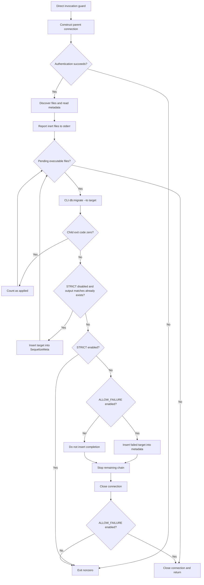
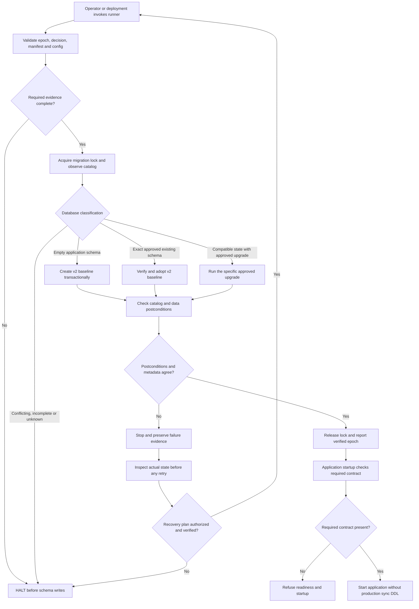
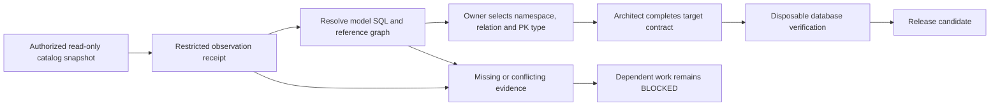
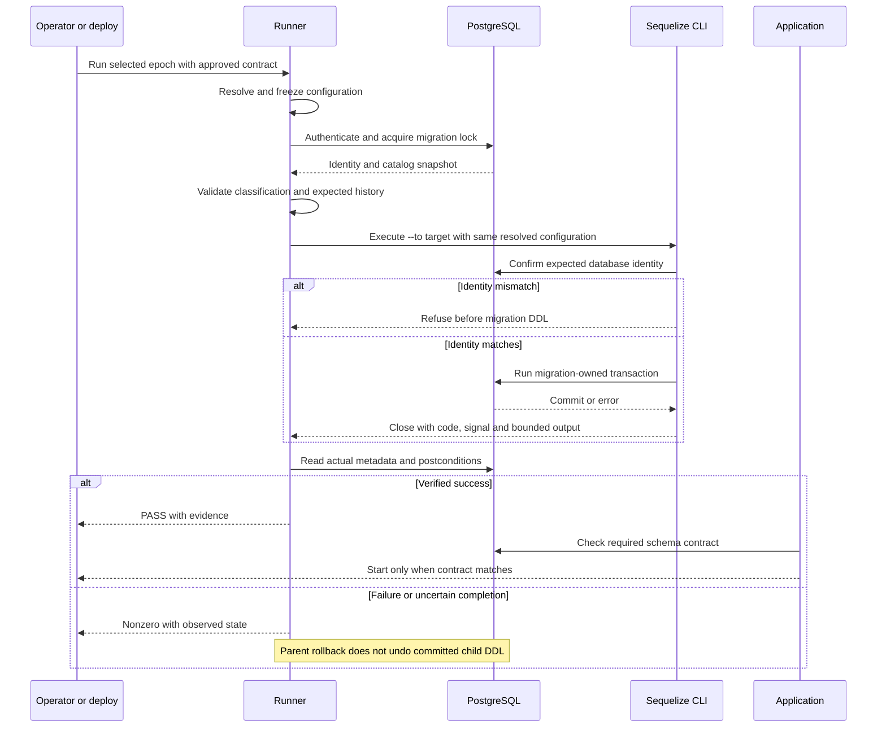
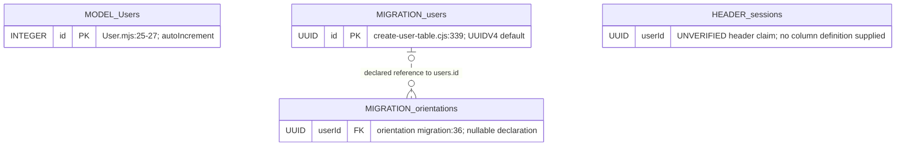
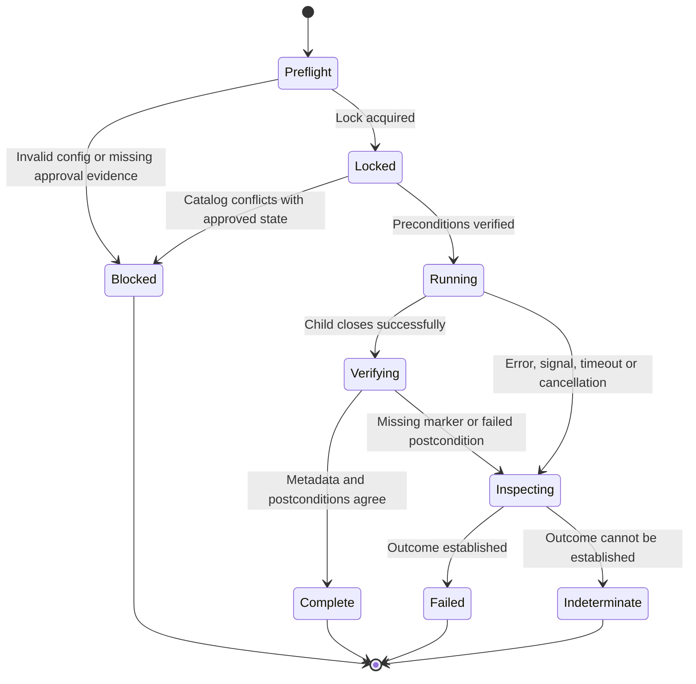

# Astra Reply — subscription transport — 2026-09-21T00:12:17.294Z

**Provider:** openai-codex
**Billing:** chatgpt-subscription
**Authentication:** chatgpt_subscription
**Transport:** codex-cli
**Requested model:** gpt-6-astra
**Served model:** NOT OBSERVABLE on codex-cli (see SERVED_MODEL_UNVERIFIABLE_NOTE)
**Reasoning effort:** xhigh
**Tokens:** in=54417 out=23948 reasoning=9399
**Packet:** `docs/ai-workflow/AI-HANDOFF/BLUEPRINT-migrations-reconciliation-2026-09-20/CONSULT-PACKET.md`
**Wall:** 732.3s
**Mega Blueprint:** ARMED (document)

> Marginal cost $0 — this leg rides the ChatGPT subscription, not OpenRouter.

---
Mega Blueprints — I’m using the inlined `fable-blueprint-forge` skill to review the supplied packet and forge the remediation package. I’ll distinguish excerpt-supported facts from production unknowns and bound the decisions the evidence cannot settle.

The packet has three consequential gaps: an “already exists” error can still cause an entire migration to be recorded as complete; the debt register contains 19 `Users` entries, not the claimed 22; and the supplied searches do not prove which tables exist in production. The package will make migrations the sole intended schema authority and keep the physical table name and key type behind explicit owner decisions.

The draft now separates fresh-database creation from existing-database adoption, while preserving the historical migration filenames and metadata. The self-review caught two further gaps: the supplied excerpts cannot establish a complete target schema, and adoption must verify that schema without inventing a history of migrations having run. Both are explicit gates in the revised package.

## PART A — HOSTILE REVIEW

**Verdict: DEFECTS-FOUND. Implementation readiness: PARTIAL. Production state: UNVERIFIED.**

[VERIFIED] Evidence below is limited to the supplied packet. It does not establish the contents of omitted migration bodies, the current checkout, deployed code, or production catalogs. `[VERIFIED]` means directly supported by a supplied excerpt; `[UNKNOWN]` identifies missing evidence. Proposed requirements are decisions, not claims that implementation already exists.

Caller filing remains pending. Preserve this review against the packet’s working-tree snapshot; the supplied text does not include its commit or SHA-256 receipt.

**A1 — Review of the existing package**

| ID | Severity | Finding and evidence | Concrete fix |
|---|---|---|---|
| A1-01 | High | [VERIFIED] Structural error text still substitutes for migration completion. `ALREADY_APPLIED_PATTERNS` includes unrestricted `/already exists/i`; `main()` matches combined stdout/stderr and inserts the migration name into metadata. A multi-operation migration can encounter an existing first object before creating its remaining objects. Existing-object text does not establish compatible columns, constraints, indexes, or completed data changes. Evidence: `CONSULT-PACKET.md#2`, `isAlreadyAppliedError()` and `main()`; successor `#0`, H-03. | Remove automatic completion based on error text. A failed execution stops the chain. Existing databases enter a separate, catalog-verified adoption path. Revise H-03 from “FIXED—do not fix further” to “exit behavior improved; completion classification remains defective.” |
| A1-02 | High | [VERIFIED] `SWAN_MIGRATE_ALLOW_FAILURE=1` can still mark a genuinely failed migration complete and return success after stopping the remaining chain. Its warning promises success even when STRICT subsequently exits nonzero; the final diagnostic says failures were not marked although the bypass can mark them. Evidence: `CONSULT-PACKET.md#2`, `ALLOW_FAILURE`, failure branch, and final summary. | Reject `ALLOW_FAILURE=1` before connecting in the replacement runner. Report observed metadata state separately from execution outcome. Do not claim “left pending” unless a subsequent metadata read establishes that fact. |
| A1-03 | High | [VERIFIED] Parent metadata operations and delegated migrations do not demonstrably share a connection configuration. Outside the production-URL branch, `main()` imports `database.mjs`; the child always selects `config/config.cjs` with `--env`. The unused `getSequelize()` is not a remedy. [UNKNOWN] Whether these resolve to the same database is absent. Evidence: `backend/scripts/safe-migrate.mjs:108-127`, `:280-295`; packet `#2`, `runSingleMigration()`. | Resolve one configuration for both connections; preserve the selected environment and dialect options. Require a matching database-identity handshake before migration DDL. Delete the dead helper after the active adapter is tested. |
| A1-04 | High | [VERIFIED] `getExecutedMigrations()` converts every query error into an empty execution history. Permission failures, connection failures, and malformed metadata can therefore be treated as “nothing has run.” Evidence: `CONSULT-PACKET.md#2`, `getExecutedMigrations()`. | Recognize only the confirmed absence of the configured metadata relation as an uninitialized history. Every other error stops before child execution. Test permission-denied and connection-loss outcomes independently. |
| A1-05 | Medium | [VERIFIED] The child wrapper resolves on `exit`, has no explicit `error` handler or deadline, and does not wait for stdio closure. The direct-invocation guard establishes URL-string equality, not the comment’s claimed protection against different casing or symlink paths. [LIKELY] Those path forms can produce a false negative under some launch conditions. Evidence: packet `#2`, `runSingleMigration()`; `backend/scripts/safe-migrate.mjs:443-451`. | Handle spawn errors, termination signals, timeout, bounded output, and `close`; settle once. Test direct execution through the actual Windows and deployment launch forms. Compare resolved filesystem identities for the compatibility entry point rather than asserting that string equality proves identity. |
| A1-06 | High | [VERIFIED] The schema conclusion exceeds the supplied evidence. Searching only `createTable("Users"` cannot exclude single-quoted calls, generated identifiers, raw SQL, or helper-created tables. Model declarations and startup code do not prove deployed table existence or which relation receives application writes. Evidence: packet `#4.1`, `#4.4`, `#6.2-6.3`; `backend/models/User.mjs:552-553`. | Retain the verified declaration mismatch; retract the asserted production two-table state. Obtain a read-only catalog observation and inspect the model’s generated SQL against a disposable database. Resolve schema namespace, relation name, and the handling of the embedded quotes in `tableName`. |
| A1-07 | High | [VERIFIED] D4’s premise that renaming a recorded migration “changes nothing for production” conflicts with the runner’s filename-based history: `pending = executable.filter(f => !executed.has(f))`. A renamed file is a different metadata key and can become pending. [UNKNOWN] The three repair files’ production execution status is not supplied. Evidence: packet `#7`, D4; packet `#2`, `getExecutedMigrations()` and pending calculation. | Preserve historical filenames and bytes. Introduce a separately tracked migration epoch with explicit fresh-create and existing-database adoption paths. Never rename, replay, or delete a historical repair as a shortcut to correcting order. |
| A1-08 | Medium | [VERIFIED] The debt register’s explanation is false. Its 23 strings contain **19 `Users`, two `Gamifications`, one `SocialLikes`, and one `messages`** entries, rather than 22 `Users` plus one `SocialLikes`. Evidence: `backend/tests/unit/migrationGuardTableNames.test.mjs`, `KNOWN_UNGUARDED`, reproduced in packet `#6.4`. | Correct the explanation and derive per-table counts from the register. Preserve the historical ratchet. Require the new executable chain to satisfy all four table families and their dependencies without exceptions. |
| A1-09 | Medium | [VERIFIED] The repair headers do not establish a contradiction: one file conditionally handles UUID, while another describes an integer-parent/UUID-child mismatch. Those can represent successive or different states. Likewise, eight-digit names have deterministic lexical positions; their intended dependency order is what is unproven. The displayed naming command anchors its regex against a path-prefixed `ls` result, so it does not reliably prove the claimed violation count. Evidence: packet `#5.3-5.4`; `20250528140000-fix-uuid-integer-mismatch.cjs:1-12`. | Replace “self-contradiction” with “overlapping, unverified transformations.” Inventory basenames and complete migration bodies. Record preconditions, postconditions, touched relations, destructive operations, and dependencies. Validate dependency order directly. Do not edit historical files merely to normalize names. |
| A1-10 | High | [VERIFIED] A nonzero migration exit is not a release gate: the deployment path catches it and continues. A separate startup branch can mutate schema from models. The successor accurately corrects the development-only `alter: true` attribution but leaves the production authority conflict unresolved. Evidence: `backend/scripts/render-start.mjs:95-100`; `backend/core/startup.mjs:200-216`; `backend/utils/productionDatabaseSync.mjs:41-53`, `:262-283`. | Adopt migrations as the sole intended schema writer. At the eventual cutover, gate server startup on the required schema contract and disable production model-driven DDL together. Do not disable repair sync before migration completeness and adoption have been demonstrated. |
| A1-11 | Medium | [VERIFIED] The discovery implementation does not fully model the resolver quoted in its own comments: the CLI pattern includes `.cts` and `.ts`, while discovery omits them. “H-04 FIXED” therefore overstates scope. Reporting an inert set also does not implement its schema effects. Evidence: `backend/scripts/safe-migrate.mjs:211-243`; packet `#2`, resolver commentary; successor `#1`, H-04. | Distinguish “discovered,” “CLI-resolvable,” and “approved for execution.” Inventory all relevant extensions; verify installed CLI behavior. Use only top-level `.cjs` for new migrations. Reconcile each inert file’s intended effects into the new baseline/upgrade plan without widening the legacy outer filter. |
| A1-12 | High | [VERIFIED] The supplied tests establish bounded source and intercepted-control-flow coverage. They do not establish PostgreSQL convergence, real CLI discovery, physical FK compatibility, production state, or readiness of omitted migrations. [UNKNOWN] The reported 9/9 result has no raw execution receipt in this packet. Evidence: packet `#6.5-6.6`; successor `#2`. | Preserve those tests with their actual scope. Add real PostgreSQL/CLI fixtures and independent catalog assertions. Use named before/after failure sets for any broad-suite comparison. Mark unexecuted tests NOT RUN and missing full-schema inputs BLOCKED. |

**A2 — One hostile pass over the draft package**

The following changes are incorporated in PART B.

| ID | Draft defect | Correction incorporated |
|---|---|---|
| A2-01 | An appended creation migration would not repair earlier ALTER-before-CREATE failures in a fresh legacy replay. Evidence: draft `01-architecture.md#Execution paths`, `05-slices.md#S5`. | Fresh databases use a new migration directory and metadata epoch. The 312-file legacy chain is not their bootstrap path. |
| A2-02 | “Adopt the baseline” could become another way to fabricate historical success. Evidence: draft `03-contracts.md#Adoption`. | Adoption records a **new baseline contract verification**, never execution of old filenames. It requires complete postconditions before the new baseline marker is committed. |
| A2-03 | An ERD implied that the supplied fragments constituted a complete physical schema. Evidence: draft `01-architecture.md#ERD`, `03-contracts.md#Schema contract`. | The ERD now labels model, migration, and header evidence separately. Full target DDL, model definitions, and dependencies remain an explicit prerequisite to the schema slice. |
| A2-04 | A parent-held lock was described as if it made subprocess DDL transactional. Evidence: draft `03-contracts.md#Concurrency and recovery`. | The lock serializes participating runners only. Child transactions own migration atomicity. Interruption requires catalog and metadata reconciliation before retry. |
| A2-05 | Generating both baseline DDL and expected test results from the same manifest could produce a consistently wrong green test. Evidence: draft `09-tests.md#Database tests`. | Require an independently reviewed catalog contract plus application-model operations on synthetic records. Include a mutation that corrupts generated DDL without changing the expected contract. |
| A2-06 | Switching off sync without a startup gate could leave a running application on an incomplete schema. Evidence: draft `04-build-order.md#Cutover`, `07-checkpoints.md#Release`. | The release must couple epoch selection, schema readiness enforcement, and removal of production DDL fallback. No partial cutover is releasable. |

## PART B — FORGED PACKAGE

### 00-README.md

**Package:** `BLUEPRINT-migrations-reconciliation-2026-09-20`  
**Status:** REVIEWED PLAN — implementation and production execution NOT VERIFIED.  
**Scope:** migration correctness, schema authority, historical reconciliation, and evidence.

**1. Governing decisions**

1. **Migrations become the sole intended authority for schema changes.** Models declare application expectations; startup must eventually validate rather than create or alter production schema.
2. **PostgreSQL catalogs establish installed reality.** Neither models nor migration metadata alone establish that reality.
3. **Use a new migration epoch.** Its directory is `backend/migrations-v2/`; its metadata relation is `SequelizeMetaV2`, in the approved application schema. Existing `SequelizeMeta` remains historical evidence.
4. **Preserve the legacy chain.** Do not rename or delete its repairs, fabricate its completion records, or use it to bootstrap new databases after cutover.
5. **Choose table identity and key type only through the owner decision below.** Recommend migration ownership now; do not infer production values.
6. **No current production connection, mutation, commit, staging, deployment, or external review call is authorized by this package.**

**2. Owner-held schema decisions**

[UNKNOWN] The packet cannot select a production-safe physical table or key conversion.

| Decision | Allowed outcomes | Required evidence | Boundary |
|---|---|---|---|
| D2: canonical user relation | Preserve/adopt `Users`; preserve/adopt `users`; explicitly approved reconciliation when both exist | Exact namespace/name, model-emitted SQL, FK graph, restricted data ownership assessment | Sean selects; builder cannot choose from naming preference or row count |
| D3: canonical key type | Preserve INTEGER; preserve UUID; separately designed remapping | Actual parent/child types, all constrained and unconstrained references, application serialization assumptions | Sean selects; no implicit cast or newly assigned IDs |
| Existing incompatible data | Approved mapping and migration addendum, or HALT | Collision policy, identity provenance, reference coverage, rollback proof | No generic “merge users” operation |
| Target application schema | Existing observed namespace selected in the decision receipt | Catalog and configuration observation | Do not assume `public` |

The house rule “FKs reference `Users`” describes the preferred existing application convention. It cannot authorize moving data or changing physical identities. If Sean selects another target, record the explicit override before changing callers or constraints.

**3. Builder contract**

> Implement one authorized slice at a time. Follow decided contracts. Stop a dependent slice when required evidence or an owner decision is absent; continue independent work where possible. Return the exact diff, named test results, mutation evidence, and unresolved boundaries for each checkpoint. Do not turn missing evidence into defaults. Do not claim production correctness from mocks, source searches, or suite totals.

**4. Build sequence**

- S0: freeze evidence and reconcile claims.
- S1: runner control-flow hardening.
- S2: discovery inventory and historical dispositions.
- S3: read-only observation and owner schema decisions.
- S4: complete target contract and epoch adoption design.
- S5: implement and verify the new migration chain in disposable PostgreSQL.
- S6: prepare the coupled deployment/startup change and its rollback.
- S7: obtain production execution authority, perform bounded rollout, and record observations.

S0–S2 do not require a production connection. S3’s production observation needs separate authorization. S4–S7 cannot bypass missing schema decisions or omitted source evidence.

**5. Truth and preservation**

[VERIFIED] The packet reports 312 executable and 38 inert files and describes a dirty runner. Those are packet observations, not a newly measured inventory.

Before implementation, the caller must provide:

- Snapshot identifier, commit when available, dirty patch, and hashes of every reviewed source.
- Full relevant configuration and startup sources with secrets removed.
- Complete migration inventory and bodies needed for the selected scope.
- Existing test definitions, actual commands, and raw bounded results.
- Existing review references and caller-assigned archive identity.

Preserve the original ledger and successor. Publish this package as a successor interpretation, not an alteration of historical findings.

### 01-architecture.md

**1. Responsibility and authority**

| Component | Responsibility | Forbidden responsibility |
|---|---|---|
| Catalog observer | Report physical identifiers, column types, defaults, constraints, and metadata | Mutate schema or inspect client records for the review packet |
| Decision receipt | Bind approved relation, PK type, namespace, and observation | Pretend an unknown value has been observed |
| Migration manifest | Bind reviewed files, order, dependencies, and postconditions | Infer that a filename proves a migration ran |
| Runner | Validate configuration, serialize execution, invoke CLI, verify outcome, stop accurately | Convert arbitrary error text into completion |
| Baseline/adoption migration | Establish or verify the approved v2 schema contract | Mark legacy migrations executed |
| Application startup | Require the schema contract before accepting traffic after cutover | Repair production schema through model sync |
| Models | Describe application persistence expectations | Independently change production schema |

**2. Current runner flow**

[VERIFIED] This describes the supplied `safe-migrate.mjs`, not verified deployed behavior.



The deployment catch at `backend/scripts/render-start.mjs:95-100` can continue server startup after `X`.

**3. Intended execution paths**



“Empty” means no application relations in the approved ownership manifest. The presence of unrelated relations or uncertain ownership prevents empty-schema classification.

**4. Observation and decision flow**



**5. Database interaction sequence**

N/A — there are no HTTP endpoints or screen API interactions. The database/CLI interaction is applicable:



**6. ERD: supplied evidence projection**

[VERIFIED] This is a projection of declarations and claims, **not a complete or observed physical ERD**. Entity prefixes identify their evidence source. Only supplied columns are shown.



[UNKNOWN] Namespace, complete columns, session primary key, actual session FK, orientation primary key, physical constraint existence, and the model’s resolved physical identifier are absent.

The final target ERD must be generated from the approved complete contract and checked against PostgreSQL. Do not manufacture full model definitions or mark this projection as that deliverable.

**7. Runner state machine**



Retry begins a new observation. No automatic transition from Failed or Indeterminate back to Running.

### 02-wireframes.md

**N/A — this is a headless migration and schema-reconciliation task. It introduces no screens, desktop layouts, 375px mobile layouts, UI controls, palette tokens, or HTTP interfaces.**

Operator-visible output is specified instead:

| State | Required copy |
|---|---|
| Invalid configuration | `BLOCKED: migration configuration is invalid.` |
| Missing owner decision | `BLOCKED: schema authority decision is incomplete.` |
| Other runner holds lock | `BLOCKED: another migration runner holds the database lock.` |
| Unapproved catalog state | `BLOCKED: observed schema does not match an approved migration path.` |
| Historical inert files reported | `LEGACY INVENTORY: files outside the approved execution path remain recorded debt.` |
| Child failure | `FAILED: migration execution did not complete successfully.` |
| Uncertain completion | `INDETERMINATE: inspect catalog and migration metadata before retrying.` |
| Verified completion | `PASS: required migration postconditions and metadata were verified.` |
| Startup schema mismatch | `BLOCKED: required application schema contract is not satisfied.` |

Messages may include migration filenames, contract identifiers, and SQLSTATE values. They must not print connection URLs, credentials, row values, or unrestricted child output.

### 03-contracts.md

**1. Public surface**

N/A — no HTTP endpoints, request bodies, response status codes, UI events, or new application-facing data models.

The applicable interfaces are configuration, catalog observation, CLI execution, migration metadata, and operator receipts.

**2. Schema decision receipt**

The caller persists `schema-authority-decision.json` alongside this package after the owner decision. Until then, nulls remain null.

```json
{
  "formatVersion": 1,
  "authority": "migrations-v2",
  "applicationSchema": null,
  "userRelation": null,
  "userPrimaryKeyType": null,
  "observationReceiptSha256": null,
  "targetContractSha256": null,
  "approvedBy": null,
  "approvedAtUtc": null,
  "approvedExecutionModes": [],
  "incompatibleDataPlanSha256": null
}
```

Validation:

- `userRelation` must be exactly `Users` or `users`, paired with its namespace.
- `userPrimaryKeyType` must be exactly `integer` or `uuid`.
- Receipt approval is not authorization to deploy or connect to production.
- A cross-type or cross-table transition requires an explicit data-plan digest.
- No fallback values. Missing required fields produce BLOCKED.

**3. Catalog observation**

The production read is separately authorized. The observer role must lack schema/data write privileges. Set read-only transaction mode and bounded timeouts.

Proposed file: `backend/scripts/migrations/observe-schema.sql`.

Its D1 core is:

```sql
BEGIN TRANSACTION ISOLATION LEVEL REPEATABLE READ READ ONLY;

SET LOCAL statement_timeout = '10s';
SET LOCAL lock_timeout = '1s';

SELECT
  transaction_timestamp() AS observed_at_utc,
  current_setting('server_version_num') AS server_version_num,
  current_setting('transaction_read_only') AS transaction_read_only;

SELECT
  n.nspname AS table_schema,
  c.relname AS table_name,
  a.attname AS column_name,
  pg_catalog.format_type(a.atttypid, a.atttypmod) AS column_type,
  a.attnotnull AS not_null,
  a.attidentity AS identity_kind,
  pg_get_expr(d.adbin, d.adrelid) AS default_expression,
  EXISTS (
    SELECT 1
    FROM pg_constraint p
    WHERE p.conrelid = c.oid
      AND p.contype = 'p'
      AND a.attnum = ANY(p.conkey)
  ) AS participates_in_primary_key
FROM pg_class c
JOIN pg_namespace n ON n.oid = c.relnamespace
JOIN pg_attribute a ON a.attrelid = c.oid
LEFT JOIN pg_attrdef d
  ON d.adrelid = c.oid AND d.adnum = a.attnum
WHERE c.relkind IN ('r', 'p')
  AND n.nspname <> 'information_schema'
  AND n.nspname !~ '^pg_'
  AND lower(replace(c.relname, '"', '')) IN (
    'users', 'sessions', 'orientations',
    'sociallikes', 'gamifications', 'messages',
    'sequelizemeta', 'sequelizemetav2'
  )
  AND a.attnum > 0
  AND NOT a.attisdropped
ORDER BY n.nspname, c.relname, a.attnum;

WITH RECURSIVE connected(oid) AS (
  SELECT c.oid
  FROM pg_class c
  JOIN pg_namespace n ON n.oid = c.relnamespace
  WHERE c.relkind IN ('r', 'p')
    AND n.nspname <> 'information_schema'
    AND n.nspname !~ '^pg_'
    AND lower(replace(c.relname, '"', '')) = 'users'
  UNION
  SELECT CASE
    WHEN k.conrelid = x.oid THEN k.confrelid
    ELSE k.conrelid
  END
  FROM connected x
  JOIN pg_constraint k
    ON k.contype = 'f'
   AND (k.conrelid = x.oid OR k.confrelid = x.oid)
)
SELECT
  ns.nspname AS source_schema,
  src.relname AS source_table,
  k.conname AS constraint_name,
  nt.nspname AS target_schema,
  dst.relname AS target_table,
  k.convalidated AS validated,
  pg_get_constraintdef(k.oid, true) AS definition
FROM pg_constraint k
JOIN pg_class src ON src.oid = k.conrelid
JOIN pg_namespace ns ON ns.oid = src.relnamespace
JOIN pg_class dst ON dst.oid = k.confrelid
JOIN pg_namespace nt ON nt.oid = dst.relnamespace
WHERE k.contype = 'f'
  AND (
    k.conrelid IN (SELECT oid FROM connected)
    OR k.confrelid IN (SELECT oid FROM connected)
  )
ORDER BY ns.nspname, src.relname, k.conname;

COMMIT;
```

This establishes observed identifier/type facts and declared FK connectivity. It does **not** establish unconstrained references or ownership of records.

The completed observer must additionally:

- Read all columns, constraints, indexes, sequences, and relevant functions in the approved ownership manifest.
- Read historical migration names from each confirmed metadata relation using safely quoted catalog identifiers.
- Distinguish absent relations from query failure.
- Record timestamp, tool version, source hashes, and an operator-local database identity.
- Keep raw output restricted; redact sensitive default literals before inclusion in a review packet.
- Never select client record contents for this review.

Exact operator command, **only after authorization and private service provisioning**:

```text
psql -X -w --dbname=service=swan_schema_observer --set=ON_ERROR_STOP=1 --file=backend/scripts/migrations/observe-schema.sql
```

No credentials or private service definition belong in this package.

**4. Runtime function contracts**

Proposed interfaces; none is claimed to exist already:

```typescript
type Epoch = "legacy" | "v2";

type RunResult = {
  status: "PASS" | "BLOCKED" | "FAILED" | "INDETERMINATE";
  exitCode: 0 | 1 | 2 | 3;
  firstFailure: string | null;
  attempted: string[];
  notEvaluated: string[];
  observedCompleted: string[];
  evidenceDigest: string | null;
};

type ChildResult = {
  code: number | null;
  signal: string | null;
  timedOut: boolean;
  spawnErrorCode: string | null;
  outputTail: string;
  outputTruncated: boolean;
};

type CatalogDifference = {
  object: string;
  property: string;
  expected: unknown;
  observed: unknown;
};

type MigrationSpec = {
  name: string;
  sha256: string;
  dependsOn: string[];
  preconditionId: string;
  postconditionId: string;
  allowedMode: "fresh" | "adopt" | "upgrade";
};

async function runMigrations(
  options: RunnerOptions,
  dependencies: RunnerDependencies
): Promise<RunResult>;

async function runCliMigration(
  request: CliMigrationRequest
): Promise<ChildResult>;

async function observeCatalog(
  session: DatabaseSession,
  scope: CatalogScope
): Promise<CatalogSnapshot>;

function compareCatalog(
  expected: SchemaContract,
  observed: CatalogSnapshot
): CatalogDifference[];

function discoverMigrationFiles(
  directory: string
): MigrationInventory;
```

Contract completion at S0/S4 must provide the referenced object definitions, including the resolved connection configuration. A builder cannot substitute `any` or infer omitted production values.

**5. Runner semantics**

- Load one canonical configuration adapter. Both parent and child consume the same resolved, frozen configuration.
- Validate the selected environment; do not silently select another one.
- Confirm child database identity before migration DDL. Identity mismatch is BLOCKED.
- Use the installed local CLI entry point through Node with `shell: false`. No `npx` download fallback.
- Retain `db:migrate --to`; do not treat it as a single-migration API.
- Compare pending order with the approved manifest and the installed CLI’s discovered order.
- Hold a database migration lock while reading pending state, executing, and verifying.
- Stop after the first failed or indeterminate invocation.
- Never insert completion because output matches a phrase.
- A zero child exit requires the expected metadata delta and the migration’s postconditions.
- A nonzero exit never triggers manual completion or deletion of metadata.
- Only confirmed missing metadata is an uninitialized state. Permission, schema, and transport errors fail closed.
- Library code returns a result; the executable wrapper sets the process exit code and closes owned resources.

Exit codes:

| Code | Meaning |
|---|---|
| `0` | Verified completion |
| `1` | Execution or postcondition failure |
| `2` | Preconditions, configuration, lock, or required decisions block execution |
| `3` | Outcome cannot be determined after interruption or observation failure |

**6. Configuration and resource bounds**

| Input | Contract |
|---|---|
| Existing database configuration | Values remain private; freeze and test actual resolution before changing the runner |
| `SWAN_MIGRATION_EPOCH` | Required for the replacement runner; exactly `legacy` or `v2`; no automatic fallback |
| `SWAN_MIGRATE_ALLOW_FAILURE` | Value `1` is rejected before connection |
| `SWAN_MIGRATE_STRICT` | Retained only for compatibility diagnostics; v2 always uses fail-closed semantics |
| `AUTO_SYNC` | Cannot enable production DDL after v2 cutover |
| `STARTUP_DATABASE_REPAIR` | Cannot bypass the v2 production schema gate |
| Test database configuration | Supplied only by an approved disposable-fixture provisioner |

Bounds:

- Metadata/catalog statements: 10-second timeout; lock acquisition is nonwaiting.
- Child migration deadline: 120 seconds by default.
- A reviewed migration may declare a larger deadline, up to 600 seconds; exceeding that requires a separate operational decision.
- Keep at most 64 KiB of child output in memory; sanitize before displaying or persisting it.
- On timeout/cancel: request termination, allow five seconds, then terminate the owned process tree using the tested platform adapter.
- Until process termination is confirmed, retain lock ownership where possible and report INDETERMINATE. Do not start another migration.

**7. Concurrency and transaction boundaries**

Use one reserved PostgreSQL advisory-lock identity for all participating migration entry points. S0 must establish that it does not collide with an existing application lock.

The adapter must keep lock ownership on one pinned database connection. Releasing a pool connection does not constitute a valid lock lifecycle.

The lock does not control old startup sync or external SQL sessions. Cutover must stop those writers before adoption.

Each migration owns its database transaction. The parent’s lock transaction does not wrap the CLI’s DDL. On interruption, inspect actual metadata and postconditions before selecting recovery.

**8. Baseline and adoption**

Reserve the first new filename:

```text
backend/migrations-v2/20260920000000-schema-authority-baseline.cjs
```

Do not create an empty placeholder migration.

Fresh mode:

1. Confirm the approved application schema is empty.
2. Execute the complete approved baseline.
3. Verify all required objects and invariants.
4. Commit schema work.
5. Require the CLI’s expected new-epoch metadata record.

Adopt mode:

1. Verify the entire existing target contract.
2. Make no application-schema or data changes.
3. Record the new baseline’s successful verification through the normal CLI completion mechanism.
4. Preserve legacy metadata unchanged.

The new marker means “v2 baseline contract verified.” It does not mean any legacy migration was executed.

Partial or incompatible databases cannot enter either path. They require a specific approved upgrade with complete preconditions, transformations, and postconditions.

**9. Data migration and rollback**

UUID and INTEGER are distinct identity domains. No direct cast, generated replacement ID, or association by coincidentally equal values is authorized.

Any later remapping plan must specify every affected table, unconstrained reference, uniqueness rule, orphan policy, sequence/default update, and rollback mapping. That plan is BLOCKED by missing source and production observation.

Rollback contracts:

- Fresh disposable baseline: roll back its transaction or discard the owned fixture.
- Existing-database adoption: stop before application deployment when verification fails; never erase historical metadata to retry.
- Production upgrade: use its reviewed compensating operation or an operator-controlled restore rehearsed on a disposable clone.
- A code rollback is allowed only if the prior application version is compatible with the installed schema.
- No automatic destructive `down` migration or fallback to legacy replay.

### 04-build-order.md

**1. File plan**

All listed new runtime modules have a 300-line maximum. Existing untouched historical files are not refactoring targets.

| Order / slice | Path | Responsibility and interface | Pattern/evidence |
|---|---|---|---|
| S0 | This package’s nine documents | Record corrected claims, evidence requirements, decisions, and checkpoints | Supplied successor structure |
| S0 | Package `evidence-index.json` | Bind reviewed inputs, hashes, commands, and unavailable inputs | New evidence contract; no fabricated values |
| S1 | `backend/tests/unit/migrationRunnerContract.test.mjs` | Node built-in test cases for the replacement runner | Extend the supplied intercepted-boundary approach after its full implementation is supplied |
| S1 | `backend/scripts/migrations/cli-process.mjs` | Export `runCliMigration`; import Node process primitives | Replace the supplied `runSingleMigration()` wrapper |
| S1 | `backend/scripts/migrations/runner.mjs` | Export `runMigrations`; import injected adapters/contracts | Preserve supplied `--to` stop-on-failure semantics |
| S1 | `backend/scripts/migrations/connection.mjs` | Resolve common configuration, validate identity, own pinned lock connection | BLOCKED until full existing configuration is supplied |
| S1 | `backend/scripts/safe-migrate.mjs` | Thin compatibility entry point; preserve required discovery exports | Current source supplied in packet; remove dead `getSequelize()` |
| S2 | `backend/scripts/migrations/discovery.mjs` | Export inventory/discovery functions; import `fs`/`path` | Existing recursive discovery excerpt |
| S2 | `backend/tests/unit/migrationInventoryContract.test.mjs` | Verify classification, naming, dependencies, and no silent expansion | New explicit test contract |
| S2 | Package `migration-dispositions.json` | One disposition per historical file, with original path/hash | Full inventory not supplied |
| S2 | `backend/tests/unit/migrationGuardTableNames.test.mjs` | Correct false explanation; retain historical exact-match ratchet | Supplied `KNOWN_UNGUARDED` |
| S3 | `backend/scripts/migrations/observe-schema.sql` | Complete bounded read-only observation | SQL and requirements in `03-contracts.md` |
| S3 | Package `schema-authority-decision.json` | Owner-held target selection | Receipt in `03-contracts.md` |
| S4 | `backend/scripts/migrations/catalog.mjs` | Export `observeCatalog`; schema-only observation | Observer SQL contract |
| S4 | `backend/scripts/migrations/schema-contract.mjs` | Export `compareCatalog`; compare independently reviewed expectations | No current implementation supplied |
| S4 | Package `target-schema-contract.json` | Complete identifiers, columns, constraints, sequences, and dependencies | Must be supplied/approved before baseline implementation |
| S4 | `backend/tests/unit/migrationSchemaContract.test.mjs` | Reject unknown, conflicting, stale, or unapproved transitions | New contract cases |
| S5 | `backend/migrations-v2/20260920000000-schema-authority-baseline.cjs` | Fresh creation or exact adoption; normal CLI `up` contract | Supplied CommonJS migration shape |
| S5 | `backend/tests/integration/migrationEpochV2.test.mjs` | Actual PostgreSQL and CLI tests | Independent catalog and model assertions |
| S5 | `backend/tests/helpers/migration-fixture/` | Own disposable resources, fixtures, and mutant isolation | Exact internal files enumerated at S4 after runtime/provisioner verification |
| S6 | `backend/scripts/render-start.mjs` | Require v2 migration/schema success before startup | Supplied `:40-101` excerpt; full file required |
| S6 | `backend/core/startup.mjs` | Disable production schema-writing fallback under completed v2 cutover | Supplied `:200-216`; full caller closure required |
| S6 | `backend/tests/unit/migrationStartupContract.test.mjs` | Verify failed schema checks cannot reach listen/sync paths | Actual startup control flow required |

Do not edit `productionDatabaseSync.mjs` globally merely because its production caller is gated. Its other callers must first be established.

**2. Required implementation patterns**

Preserve the existing migration module contract:

```javascript
'use strict';

module.exports = {
  async up(queryInterface, Sequelize) {
    // Approved migration operations and postconditions.
  }
};
```

This excerpt specifies the interface, not an executable baseline. Do not ship a body containing only comments.

Preserve the migration-argument meaning:

```text
sequelize-cli db:migrate --config <approved adapter>
  --migrations-path <selected epoch directory>
  --env <validated environment>
  --to <approved target>
```

The implementation must invoke the verified installed CLI entry point through Node, rather than launching this text through a shell.

**3. Missing source gates**

[UNKNOWN] Full configuration, PostgreSQL version, installed CLI storage configuration, complete model definitions, complete migration bodies, and startup caller closure are absent.

Consequently:

- S1’s configuration adapter requires an evidence supplement before implementation.
- S4 cannot emit complete target DDL yet.
- S5 cannot begin from this packet alone.
- Exact helper filenames and baseline decomposition must be added at S4; allocation is limited to the listed subsystem and 300-line cap.
- No helper allocation can authorize a new schema object or behavior.

**4. Release coupling**

The runner hardening candidate is not independently declared production-ready. Replacing heuristic completion can expose existing drift.

The release candidate must jointly provide:

1. A verified adoption or upgrade path.
2. Explicit v2 epoch selection.
3. Required-schema startup enforcement.
4. Removal of production model-sync authority.
5. Verified rollback compatibility.

### 05-slices.md

**S0 — Freeze evidence and correct reconciliation**

Scope: package, evidence index, supplied claims.

Acceptance:

- Every A1 finding has a corrected instruction or a named unresolved dependency.
- Record current file hashes and dirty state without staging or modifying unrelated files.
- Distinguish packet-reported counts from fresh measurements.
- Correct debt distribution to 19/2/1/1.
- Mark H-03 partial, H-04 visibility-only, and H-07 production state unknown.
- Record actual test commands from supplied test/runtime configuration before using historical results.

Evidence: hash-bound input list and reconciled status table. Runtime tests N/A for the documentary correction itself.

**STOP: do not implement S1 against an unidentified source/configuration snapshot.**

**S1 — Runner truth and lifecycle**

Scope: runner modules, connection adapter, compatibility entry point, runner unit tests.

Decisions: reject completion-by-text and failure bypass; preserve `--to`; stop on first failure; unified target; bounded lifecycle.

Acceptance command:

```text
node --test backend/tests/unit/migrationRunnerContract.test.mjs
```

Required: all 12 top-level cases pass; applicable subprocess/platform cases execute. Unsupported platform coverage is explicitly BLOCKED, not silently passed.

Mutation requirement: restore completion-by-text and demonstrate the partial-migration assertion fails.

**STOP: do not deploy this slice independently of catalog reconciliation.**

**S2 — Inventory and legacy preservation**

Scope: discovery, disposition manifest, inventory tests, historical debt comment.

Every file receives exactly one disposition:

- Historical executable, retained.
- Intended schema/data effects incorporated into the approved v2 contract.
- Duplicate effects, evidenced against a named successor.
- Unimplemented intention explicitly excluded from this release.

“Incorporated” requires complete source review and linked verification; filename resemblance is insufficient.

Acceptance command:

```text
node --test backend/tests/unit/migrationInventoryContract.test.mjs
```

Required: seven cases pass. Unknown files, hash changes, and newly inert files fail the inventory gate.

**STOP: do not convert or relocate the 38 inert files as a bulk operation.**

**S3 — Observe and decide**

Scope: observer, authorized observation receipt, owner decisions.

Acceptance:

- D1 resolved by timestamped catalog evidence, not migration filenames.
- D2/D3 selected with exact namespace/name/type.
- Physical FK graph and source-derived unconstrained references reconciled.
- If both user relations exist, stop until ownership and reconciliation are approved.
- A missing production authorization leaves observation NOT RUN.

Exact observation command is in `03-contracts.md`; it is not executed by this review.

**STOP: no dependent schema implementation while D2/D3 remain null.**

**S4 — Complete the target and adoption contract**

Scope: full schema contract, model mappings, migration dispositions, test fixtures, baseline design.

Acceptance command:

```text
node --test backend/tests/unit/migrationSchemaContract.test.mjs
```

Required: six cases pass. In addition:

- Full target DDL and model definitions are supplied and independently reviewed.
- Final ERD uses exact physical columns/types and validated references.
- All four debt-table families and transitive dependencies are accounted for.
- Each schema operation has a precondition, postcondition, and rollback applicability decision.
- Select the fixture PostgreSQL major to match the observed deployment major; pin the fixture image or provisioner version.
- Confirm the installed CLI’s metadata-table/schema configuration through an actual fixture run.
- Specify any PostgreSQL extension or nontransactional operation explicitly; none is implicitly permitted.

**STOP: this packet’s partial ERD is not permission to invent the baseline.**

**S5 — Prove fresh creation and existing adoption**

Scope: v2 baseline, complete fixtures, real CLI/PostgreSQL integration.

Acceptance command:

```text
node --test --test-concurrency=1 backend/tests/integration/migrationEpochV2.test.mjs
```

Required: all ten cases pass against disposable resources. No skips.

Evidence must include actual catalog differences, migration metadata deltas, synthetic-record checks, and the tested manifest digest.

**STOP: no claim of production convergence from fixture results alone.**

**S6 — Couple deployment and startup**

Scope: deployment/startup integration and runtime gate tests.

Acceptance command:

```text
node --test backend/tests/unit/migrationStartupContract.test.mjs
```

Required: four cases pass; integration case `startup-refuses-incomplete-schema-without-sync` also passes.

Record compatibility of the proposed rollback application version. No production sync fallback may bypass the v2 requirement.

**STOP: release preparation is not deployment authority.**

**S7 — Authorized rollout and observation**

Scope: separately approved production operation.

Entry:

- Owner decision, immutable release digest, backup/restore evidence, migration timeout, and operational owner recorded.
- Old schema writers stopped.
- Fresh preflight observation matches the approved upgrade/adoption state.
- Explicit production execution authority is present.

Exit:

- Required catalog and metadata postconditions observed.
- Application readiness observed with production schema sync disabled.
- Any failure is classified FAILED or INDETERMINATE; no automatic retry.
- Caller files the review and rollout receipts.

### 06-bans.md

1. Do not equate `SequelizeMeta` membership with schema correctness.
2. Do not complete a migration because stdout/stderr contains “already exists.”
3. Do not enable `SWAN_MIGRATE_ALLOW_FAILURE`.
4. Do not reinterpret `--to` as one migration.
5. Do not continue after the first failed or indeterminate migration.
6. Do not convert permission or connection errors into an empty migration history.
7. Do not permit parent and child to resolve different database targets.
8. Do not automatically retry an interrupted, timed-out, or failed migration.
9. Do not rename, delete, or rewrite the five historical repair migrations.
10. Do not modify legacy metadata to make a new chain appear applied.
11. Do not replay legacy repairs against a fresh v2 database.
12. Do not widen only the outer discovery filter to execute inert files.
13. Do not assume `.ts`/`.cts` are absent or executable merely from the quoted resolver regex.
14. Do not guard the 23 historical ALTERs blindly.
15. Do not claim all 23 entries target `Users`/`SocialLikes`.
16. Do not infer production identifiers or types from models, headers, or source searches.
17. Do not merge `Users` and `users`, cast identifiers, or invent replacement identities without the approved data plan.
18. Do not use the existing `Users` FK house rule to bypass D2/D3.
19. Do not disable production sync before a complete migration-owned replacement is verified.
20. Do not retain production sync as an automatic escape hatch after cutover.
21. Do not let a schema-gate failure proceed to application listen/readiness.
22. Do not treat a local connection as a disposable database.
23. Do not include credentials, connection strings, client records, or sensitive defaults in artifacts or review prompts.
24. Do not stage, commit, push, deploy, or write to production under this planning task.
25. Do not overwrite parallel work or broad-stage changes.
26. Do not create new files exceeding 300 lines; split by the responsibilities in the build order.
27. Do not cite a green count as proof of untested database behavior.
28. Do not relabel BLOCKED, NOT RUN, or mocked coverage as PASS.
29. Do not claim review filing until the caller supplies its archive receipt.

N/A — MUI, styled-components, Victory, visual color tokens, touch targets, and responsive layout rules have no surface in this headless change.

### 07-checkpoints.md

**1. Evidence required at every slice boundary**

- Input snapshot and resulting diff hashes.
- Exact changed files and applicable requirements.
- Exact command, runtime/environment, exit code, named cases, failures, and skips.
- Mutation or controlled negative evidence for enforcement guards.
- Whether each boundary was mocked, exercised with real PostgreSQL, or observed in production.
- Findings addressed and remaining.
- Next authorized slice.

A passing check gets a concise result. A failing check includes the case, diagnostic, exit code, and relevant file.

**2. Review authority**

The builder does not approve its own slice boundary.

This Astra review is the requested adjudication of the supplied packet. Subsequent checkpoint execution remains assigned to the established Final Decider or an explicit owner-designated reviewer. No unavailable reviewer is silently replaced, and no paid call is implied.

Checkpoint verdicts:

- **PASS:** that slice’s evidence is complete.
- **REVISE:** bounded defects require correction.
- **HALT:** authority, schema decision, source evidence, or runtime proof is missing.

A slice PASS is not a release approval.

**3. Reusable review remit**

> Review only the immutable slice diff and supplied evidence. Verify its requirements against actual caller paths, configuration identity, CLI semantics, catalog postconditions, metadata changes, failure handling, and forbidden side effects. Challenge whether tests can pass while the migration is incomplete. Cite file:line or package section for every finding and prescribe a concrete fix. Distinguish mocked, fixture, and production evidence. Return PASS, REVISE, or HALT; do not advance based on totals.

**4. Readiness receipt**

| Boundary | Current status | Required next evidence |
|---|---|---|
| Existing-packet review | Completed against supplied excerpts | Caller archive receipt |
| A2 package review | Completed once; six corrections incorporated | Preserve this version |
| Sole intended schema authority | Decided: migrations-v2 | Implementation |
| Production physical schema | UNKNOWN | Authorized timestamped observation |
| D2/D3 owner choice | BLOCKED | Approved decision receipt |
| Complete target schema/ERD | BLOCKED | Full definitions and dependency closure |
| Runner implementation | NOT RUN | Source-bound changes and targeted tests |
| Real CLI/PostgreSQL convergence | NOT RUN | Disposable-fixture results |
| Broad-suite nonregression | UNVERIFIED | Stable before/after case identities if run |
| Production deployment | NOT AUTHORIZED / NOT RUN | Separate operation approval |
| Secret scan | NOT RUN | Caller execution over persisted package |
| Archive persistence | Caller pending | Filed review identifier |

**5. Historical status reconciliation**

- H-03: genuine-failure default exit behavior improved; heuristic completion and bypass remain open.
- H-04: inert-file visibility improved; complete inventory and effect convergence remain open.
- M-01: stop-on-first-failure is the correct bounded response to `--to`; retain it.
- M-02: production model-driven schema mutation remains a separate authority path in supplied code.
- M-10/D6: static historical debt is preserved; runtime closure requires v2 proof.
- H-07/D1: production observation remains unknown until performed.
- Unrelated successor items remain outside this review’s scope.

**6. Filing handoff**

Caller files a new `DEFECTS-FOUND` review under Rule 86, including:

- Packet identifier and source hashes.
- Actual branch/commit or explicit unavailable/dirty qualification.
- A1 and A2 findings.
- Unproven production, schema-completeness, and runtime boundaries.
- Supersession links to the applicable prior review, when identified.
- Reciprocal archive links and reindex result.

Do not fabricate a review timestamp, identifier, commit, or successful filing receipt.

### 09-tests.md

**1. Test execution contract**

All new `.test.mjs` files use Node’s built-in `node:test` and `node:assert/strict`. Their commands below are proposed runnable interfaces; the files are not claimed to exist or have passed.

[UNKNOWN] The actual invocation commands and complete source for the existing tests are absent. Preserve the reported existing coverage, but obtain their real commands before running or replacing them.

Database tests must obtain a freshly provisioned, uniquely identified disposable database. The provisioner owns its lifecycle and records the PostgreSQL version. An ambient `DATABASE_URL` is never an accepted fixture source.

Missing fixture prerequisites must produce a failing/blocked run, not a successful run with all cases skipped.

**2. `backend/tests/unit/migrationRunnerContract.test.mjs` — 12 cases**

```text
node --test backend/tests/unit/migrationRunnerContract.test.mjs
```

| Case | What it proves |
|---|---|
| `import-does-not-connect-spawn-or-write` | Importing testable modules has no operational side effects |
| `direct-entry-executes-through-supported-path-aliases` | Actual supported Windows/deployment invocation forms cannot silently skip `main` |
| `parent-and-child-use-identical-resolved-target` | Environment, database identity, and dialect options are shared |
| `metadata-permission-error-prevents-child-spawn` | SQLSTATE permission denial is not treated as empty history |
| `only-confirmed-missing-metadata-is-uninitialized` | Missing relation is distinguished from transport and malformed-query errors |
| `already-exists-output-cannot-complete-partial-migration` | Text matching cannot create a completion marker |
| `zero-exit-without-required-marker-or-postcondition-fails` | Child exit alone cannot establish success |
| `first-failure-stops-all-later-to-targets` | Later pending migrations are NOT EVALUATED after failure |
| `spawn-error-settles-and-closes-owned-resources` | Launch failure cannot leave the operation hanging |
| `timeout-signal-and-late-output-produce-bounded-result` | Deadline, process termination, output closure, and uncertainty are handled |
| `allow-failure-is-rejected-before-connect` | The former bypass cannot mark failed work complete |
| `lock-is-held-through-postcondition-verification` | Participating runners cannot overlap execution/verification |

Intercepted boundaries prove orchestration. They do not prove PostgreSQL DDL behavior.

**3. `backend/tests/unit/migrationInventoryContract.test.mjs` — seven cases**

```text
node --test backend/tests/unit/migrationInventoryContract.test.mjs
```

| Case | What it proves |
|---|---|
| `inventory-includes-cjs-js-mjs-sql-cts-ts-candidates` | Extension omissions cannot silently hide candidates |
| `nested-files-are-classified-without-expanding-execution` | Recursive visibility does not imply CLI execution |
| `v2-allows-only-top-level-fourteen-digit-cjs-names` | The new epoch has one explicit naming convention |
| `basename-validation-is-independent-of-parent-path` | A path prefix cannot corrupt naming counts |
| `duplicate-identities-and-dependency-order-fail` | Lexical order must satisfy declared dependencies |
| `legacy-paths-and-hashes-remain-unchanged` | Reconciliation preserves historical identity |
| `new-or-changed-inert-file-requires-disposition` | Debt cannot grow silently |

The installed CLI’s actual discovered order is also checked in the integration suite; a mocked inventory alone is insufficient.

**4. `backend/tests/unit/migrationSchemaContract.test.mjs` — six cases**

```text
node --test backend/tests/unit/migrationSchemaContract.test.mjs
```

| Case | What it proves |
|---|---|
| `missing-owner-name-type-or-schema-blocks-plan` | Unknown D2/D3 values cannot become defaults |
| `partial-schema-cannot-be-adopted` | Existing-object presence cannot satisfy an incomplete contract |
| `same-relation-name-in-different-schema-is-not-equal` | Namespace is part of table identity |
| `uuid-integer-change-requires-explicit-mapping-plan` | Identity conversion cannot occur implicitly |
| `changed-observation-or-contract-digest-blocks-execution` | Stale approval cannot authorize changed inputs |
| `legacy-debt-distribution-is-19-2-1-1` | The supplied register’s explanation remains truthful |

The last case is documentary/static coverage, not database correctness evidence.

**5. `backend/tests/integration/migrationEpochV2.test.mjs` — ten cases**

```text
node --test --test-concurrency=1 backend/tests/integration/migrationEpochV2.test.mjs
```

| Case | Fixture and observable result |
|---|---|
| `fresh-v2-baseline-satisfies-independent-catalog-contract` | Empty approved schema; actual CLI creates complete schema; independently reviewed expected columns/types/FKs/indexes match; application models create and read synthetic records |
| `exact-existing-schema-adopts-without-legacy-replay` | Complete approved schema; adoption changes only new-epoch metadata; legacy metadata and application data remain unchanged |
| `partial-baseline-fails-without-completion-marker` | Required object deliberately omitted; adoption fails and no v2 baseline marker appears |
| `conflicting-users-relations-block-before-ddl` | Both names present without an approved reconciliation; no application-schema or data mutation |
| `incompatible-parent-child-key-types-block-before-ddl` | UUID/integer mismatch; no cast, replacement identity, or FK removal |
| `multi-operation-conflict-cannot-fabricate-completion` | First operation encounters an existing object, later required object absent; no false metadata success |
| `different-parent-child-database-identities-block-before-ddl` | Two disposable databases; mismatch detected; neither receives application migration DDL |
| `concurrent-runners-permit-one-mutator` | Two real processes; one owns lock, other exits BLOCKED; no duplicate execution |
| `startup-refuses-incomplete-schema-without-sync` | Required contract deliberately broken; application does not listen and does not call schema-writing sync |
| `restore-rehearsal-preserves-identities-and-references` | Disposable backup/restore; synthetic identities, FK relationships, and relevant counts match before/after |

Required independent assertions:

- Do not generate expected schema exclusively from the same DDL generator under test.
- Verify physical catalog state rather than log messages.
- Verify synthetic application persistence through the actual selected model mapping.
- Verify metadata **deltas**, including unchanged historical entries.
- Assert forbidden side effects on failure fixtures.

These tests remain BLOCKED until the complete target schema and fixture definitions exist.

**6. `backend/tests/unit/migrationStartupContract.test.mjs` — four cases**

```text
node --test backend/tests/unit/migrationStartupContract.test.mjs
```

| Case | What it proves |
|---|---|
| `migration-failure-prevents-listen` | The new deployment path cannot swallow required migration failure |
| `schema-mismatch-prevents-listen` | A nominally successful migration command cannot bypass readiness |
| `v2-production-startup-never-invokes-schema-sync` | Production schema authority is singular after cutover |
| `missing-epoch-does-not-fall-back-to-legacy` | Configuration omission cannot silently replay history |

**7. Required mutations**

Each mutation runs in an isolated temporary copy. Restore the original between runs. Record the exact case, expected assertion failure, actual diagnostic, and nonzero exit. An import/setup failure does not count as a killed mutation.

| Mutation | Required failing case |
|---|---|
| Restore broad “already exists” completion | `already-exists-output-cannot-complete-partial-migration` |
| Treat every metadata read error as empty history | `metadata-permission-error-prevents-child-spawn` |
| Continue after first `--to` failure | `first-failure-stops-all-later-to-targets` |
| Restore failure bypass | `allow-failure-is-rejected-before-connect` |
| Remove target-identity validation | `different-parent-child-database-identities-block-before-ddl` |
| Remove required baseline column without changing expected contract | `fresh-v2-baseline-satisfies-independent-catalog-contract` |
| Adopt after checking table existence only | `partial-baseline-fails-without-completion-marker` |
| Remove migration lock | `concurrent-runners-permit-one-mutator` |
| Restore nonfatal startup continuation | `migration-failure-prevents-listen` |
| Restore production sync fallback | `v2-production-startup-never-invokes-schema-sync` |

**8. Regression evidence**

For any broader existing suite that is run, compare stable identities:

```text
test file + suite name + case name + environment + failure classification
```

Report:

- Existing failures reproduced.
- New failures introduced.
- Previous failures absent.
- Cases skipped, renamed, or not executed.
- Environmental failures separately from product failures.

No all-green broad-suite evidence is supplied. No test in this forged package has been executed during this review.

## PART C — DECISION-DENSITY SELF-TEST

| Choice | Resolution or bounded delegation |
|---|---|
| Who owns schema changes? | **Decided:** migrations-v2; application startup validates |
| What establishes installed reality? | **Decided:** timestamped PostgreSQL catalogs |
| D1: production `users.id` type | **UNKNOWN:** authorized observer settles it; no inference from repair names |
| D2: `Users` or `users` | **Owner-held:** exact namespace/name selected after catalog, model-SQL, and ownership evidence |
| D3: INTEGER or UUID | **Owner-held:** preserve or explicitly remap after full reference analysis |
| Both user relations exist | **Decided:** block automatic adoption; owner-approved reconciliation required |
| D4: letter-prefixed repairs | **Decided:** retain historical names/bytes; exclude legacy replay from fresh v2 bootstrap |
| D5: inert migrations | **Decided:** reconcile intended effects into migration ownership; preserve originals and record each disposition |
| D6: historical 23-entry debt | **Decided:** retain truthful historical ratchet; require zero unexplained debt in the new execution path |
| D7: acceptance | **Decided:** named targeted tests, real DB/CLI fixtures, mutations, and bounded baseline comparisons |
| D8: dead helper | **Decided:** delete `getSequelize()` after verified shared configuration replaces active connection resolution |
| New execution directory | **Decided:** `backend/migrations-v2/` |
| New metadata identity | **Decided:** `SequelizeMetaV2` in approved schema; installed CLI configuration must be proven |
| Baseline filename | **Decided:** `20260920000000-schema-authority-baseline.cjs`; do not create a placeholder |
| Existing-schema adoption | **Decided:** verify full new contract; never fabricate legacy execution |
| Partially compatible schema | **Decided:** only a specific approved upgrade; otherwise HALT |
| Automatic structural-error recovery | **Decided:** prohibited |
| Failure bypass | **Decided:** rejected before connection |
| `--to` behavior | **Decided:** retained with first-failure stop and verified metadata/postconditions |
| Missing metadata versus read failure | **Decided:** only confirmed relation absence permits uninitialized history |
| Parent/child database selection | **Decided:** shared frozen configuration plus identity validation before DDL |
| Child execution mechanism | **Decided:** verified installed CLI through Node, no shell/download fallback |
| Invocation aliases | **Bounded implementation:** support actual deployment and Windows forms; filesystem-identity and subprocess tests required |
| Concurrent runners | **Decided:** one database lock through verification; pinned connection |
| Exact advisory-lock identity | **Bounded S0 choice:** reserve an unused identity after existing-lock evidence; record it before implementation |
| Timeout/output limits | **Decided:** 120-second default, reviewed maximum 600 seconds, five-second termination grace, 64 KiB output bound |
| Interrupted execution | **Decided:** observe actual state; no automatic retry or metadata deletion |
| PostgreSQL fixture version | **Bounded S4 choice:** match observed deployment major and pin provisioner/image version |
| Fixture ownership | **Decided:** freshly provisioned disposable resources; ambient application URLs prohibited |
| Full columns and model definitions | **BLOCKED:** absent from packet; must be supplied, not invented |
| Final physical ERD | **BLOCKED:** follows approved complete schema; evidence projection is not a substitute |
| Per-table baseline decomposition | **Bounded S4 choice:** listed subsystem only, ≤300 lines/file, no new behavior, checkpoint approval |
| Extensions/nontransactional DDL | **BLOCKED unless explicitly declared:** no implicit installation or execution |
| Production sync removal | **Decided:** coupled with verified adoption and startup schema gate |
| Rollback | **Decided:** compatibility-tested code rollback or approved/rehearsed database recovery; no automatic destructive down |
| Production connection/execution | **Separately authorized:** this review performs neither |
| Reviewer and spending | **Decided:** preserve established authority; no silent replacement or paid call |
| Historical review preservation | **Decided:** successor record; caller files and links it |
| UI, wireframes, palette, HTTP contracts | **N/A:** no such surface |
| Implementation readiness | **PARTIAL:** safe decisions are specified; missing schema evidence blocks dependent implementation |

**Self-test result:** No consequential choice is silently delegated. The sole schema authority and migration-history strategy are decided. Physical schema selection, complete DDL, and production execution remain explicitly gated by evidence and owner authority.
