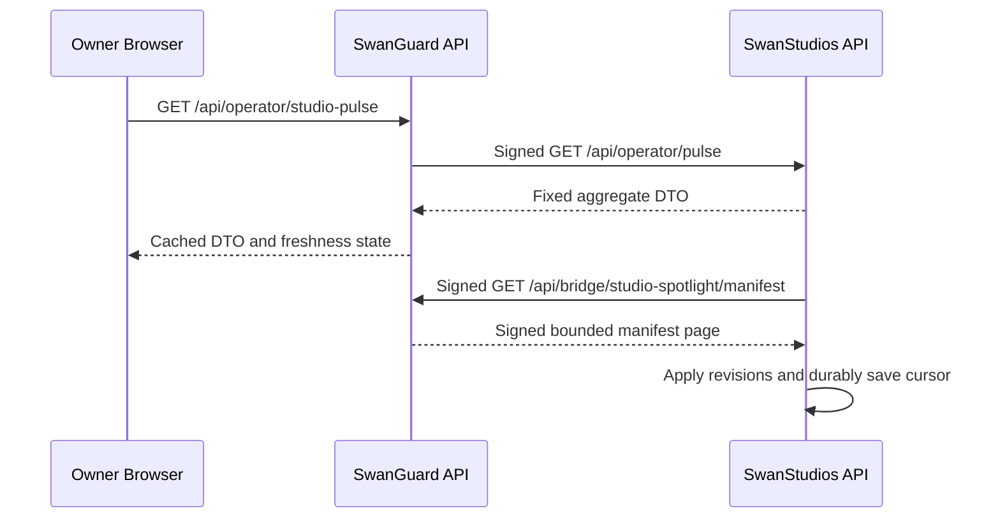
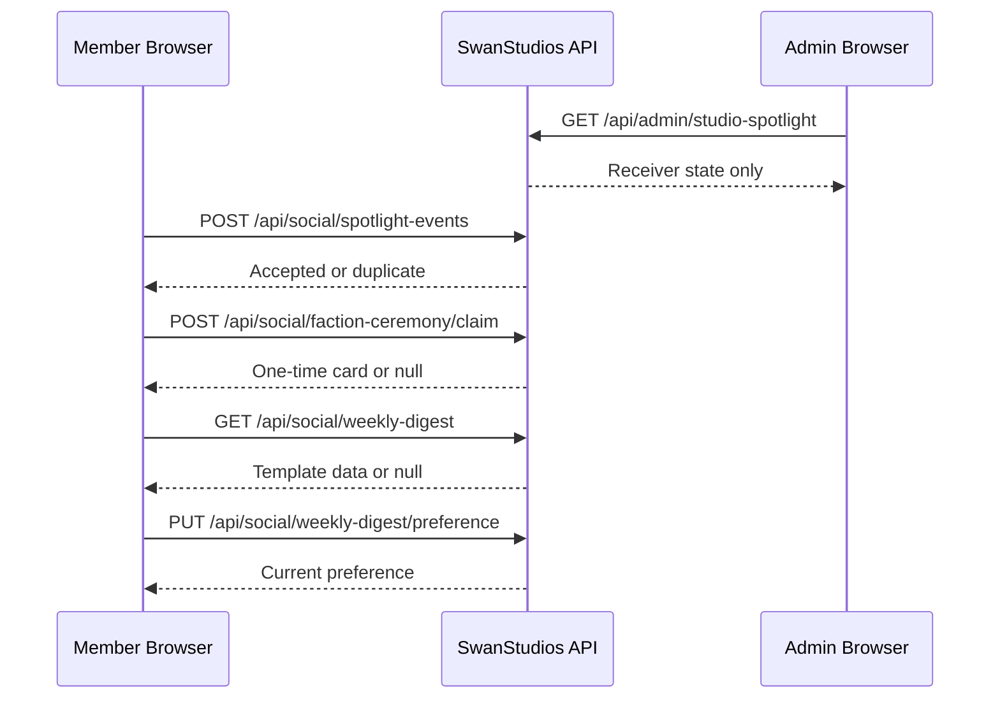
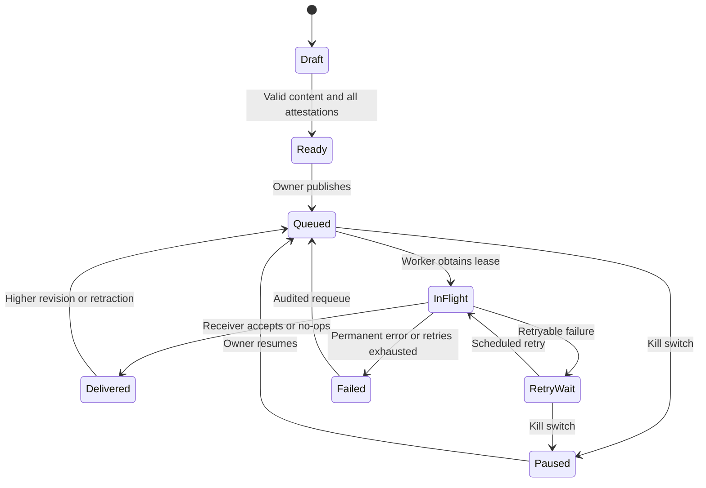
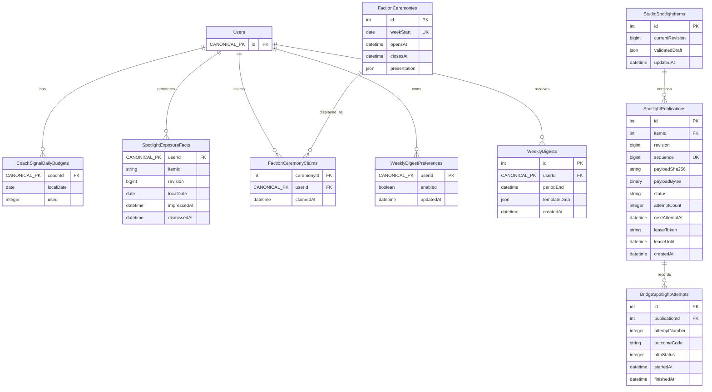

# 01 — Architecture: trust boundaries, flows, and schema

**Scope:** S5–S8 of the social bridge — Spotlight publishing, operator pulse, faction ceremony,
weekly digest.
**Contents:** 6 Mermaid diagrams (`flowchart LR` ×1, `sequenceDiagram` ×3, `erDiagram` ×1,
`stateDiagram-v2` ×1), the logical schema, and its primary-key convention (Correction 7).
**Note:** physical types for canonical keys and SwanGuard migrations remain `BLOCKED-G0`. This is
deliberately not a fabricated deployed ERD.

---

#### Ownership and trust boundaries

- SwanGuard owns drafts, ceremony attestations, publish/retract decisions, outbox attempts, and publisher receipts.
- SwanStudios owns accepted Spotlight state, hosted image assets, member visibility, local engagement events, and aggregate pulse production.
- Editorial payloads contain only the verified `spotlight.v1` fields. Do not add source provenance, operator identity, saved-story bodies, or private URLs.
- New reverse traffic contains fixed aggregates only.
- HMAC secrets stay server-side. The browser never signs bridge requests.
- SwanGuard may learn aggregate acceptance state through receipts/pulse, not member identities.
- The existing positivity gate remains authoritative at the receiver. Publisher ceremony is an additional gate, not a replacement.

```mermaid
flowchart LR
    O[Sean] --> C[Studio Spotlight Console]
    C --> P[Publication Transaction]
    P --> E[Immutable Publication Events]
    P --> Q[Durable Outbox]
    Q --> D[Bridge Spotlight Dispatcher]
    D --> I[SwanStudios Bridge Ingest]
    I --> G[Schema and Positivity Gate]
    G --> S[Revision State and Tombstones]
    G --> R[Bounded Image Rehosting]
    R --> S
    S --> F[Member Spotlight Rail]
    S --> A[Read-only Admin Console]
    F --> M[Local Measurement]
    M --> U[Aggregate Pulse]
    U --> T[Studio Pulse Tile]
    E --> N[Signed Manifest]
    N --> H[Hourly Reconciler]
    H --> G
```



#### API interaction diagrams

Existing ingest body and responses are `BLOCKED-G0`; its path and signature semantics remain unchanged.

```mermaid
sequenceDiagram
    participant B as Owner Browser
    participant G as SwanGuard API
    participant DB as SwanGuard Database
    participant W as Dispatcher
    participant S as SwanStudios API

    B->>G: GET /api/operator/studio-spotlight/items
    G->>G: Existing owner authorization
    G-->>B: Queue page
    B->>G: POST /items/{itemId}/publications
    G->>DB: Revision + event + outbox transaction
    DB-->>G: Durable commit
    G-->>B: 202 publication receipt
    W->>DB: Lease next eligible outbox row
    W->>W: Check owner kill switch
    W->>S: POST /api/bridge/spotlight
    S-->>W: Existing ingest response
    W->>DB: Append attempt receipt; resolve lease
    B->>G: GET /publications/{publicationId}/receipts
    G-->>B: Sanitized receipt list
```





Kill-switch requests use the **existing** owner API and its verified DTO; do not invent a parallel switch endpoint.

#### State machines



`Ready` is a derived UI state, not permission to bypass server validation. Retrying a failed publication preserves its revision and payload bytes. Editing content creates a higher revision and requires a fresh ceremony.

#### Schema decisions

The following logical schema is fixed. **Primary-key convention is now decided — see the note under the diagram (Correction 7).** Physical types for canonical keys, SwanGuard migrations, and complete Sequelize definitions remain blocked by G0. This is intentionally not a fabricated deployed ERD.



**Primary-key convention (Correction 7).** This diagram originally declared `uuid id PK` for every
new table. That does not match the schema S5–S8 extends, and mixing both conventions inside one
directory is the schema-inconsistency class the house rules exist to prevent. The rule is now:

- **New top-level `backend/models/social/*.mjs` tables use `DataTypes.INTEGER` autoIncrement `id`** —
  the convention of all 20 existing top-level `social/` models, and of `CoachSignal.mjs:13-17`.
  **Zero** top-level `social/` files use `DataTypes.UUID`.
- **Or a natural key where one genuinely exists** — as `SwanSpotlight.mjs:17-21` does with
  `itemId STRING(36)` as the primary key and no `id` column at all.
- **`backend/models/social/enhanced/*.mjs` uses `DataTypes.UUID`** (12 of 13 files). UUIDs are
  therefore an established pattern in this repo — but *not in the directory S5–S8 write into*.
- `Users` stays stubbed as `CANONICAL_PK id PK`. That is the correct behaviour when the real schema
  was not supplied, and it must not be replaced with invented columns.
- SwanGuard-side tables (`StudioSpotlightItems`, `SpotlightPublications`,
  `BridgeSpotlightAttempts`) must follow **SwanGuard's** migration convention, which remains
  `BLOCKED-G0`. The `int id PK` shown above is the stated default; a builder who finds a different
  verified convention in `packages/database/migrations` follows the verified one and says so.

If you want UUIDs for a top-level `social/` table, that is a **separate, explicit, argued decision** —
not a default inherited from this diagram.

**A foreign key's type is not a free choice — it must match the parent primary key's type.**
`FactionCeremonies.id` and `FactionCeremonyClaims.ceremonyId` were the last two `uuid` holdouts in
this diagram and were converted to `int` for exactly that reason: changing the parent without the
child would have produced a join between `integer` and `uuid` columns, which Postgres rejects. When
you convert a PK, convert every FK that references it in the same migration.

Additional required state:

- Manifest cursor: one durable consumer row, containing the last committed sequence.
- Publisher ceremony attestations: immutable publication-linked record; owner ID stays in SwanGuard.
- Scheduler ledger: unique `(jobName, scheduledFor)` with lease and completion state.
- Receiver tombstones: retain indefinitely; exact integration into `SwanSpotlight` depends on its real definition.
- Content hashes: SHA-256 of the exact outgoing UTF-8 body bytes, not reserialized JSON.

Do not persist `bigint` values as JavaScript numbers. API revisions and sequences introduced by this package use decimal strings; the existing wire revision type remains unchanged.

#### Concurrency and delivery rules

- Publication revision allocation, immutable payload creation, manifest sequence, and outbox insertion commit atomically.
- Transactional database sequence allocation must not allow a consumer to advance past an uncommitted lower sequence. Use a single locked stream-counter row acquired within the publication transaction.
- One active delivery per item. Serialize revisions; do not deliver an older revision after a newer one has been accepted.
- Worker leases last 60 seconds; HTTP timeout is 10 seconds. Lease completion requires the original lease token.
- Initial attempt plus **six retries**: 30, 120, 600, 1,800, 7,200, and 21,600 seconds after each preceding failure.
- Add deterministic 0–20% positive jitter derived from publication ID and retry number; persist the resulting schedule.
- Retry network failure, timeout, 408, 429, and 5xx. Respect a bounded `Retry-After`, maximum six hours.
- Treat other 4xx as permanent failures. A verified disabled-receiver 503 becomes paused, not an exhausted attempt.
- Check the kill switch at enqueue and immediately before network dispatch. Abort in-flight requests when possible. **A kill switch cannot recall a request the receiver already accepted.**
- Emergency content removal therefore uses explicit retractions or SwanStudios disablement, not a false “instant recall” promise.

---
