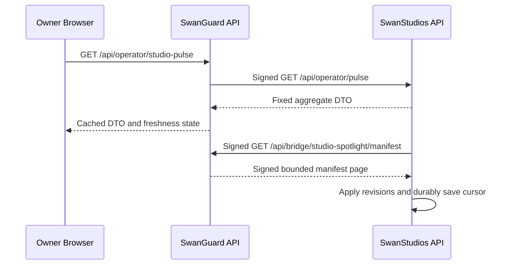
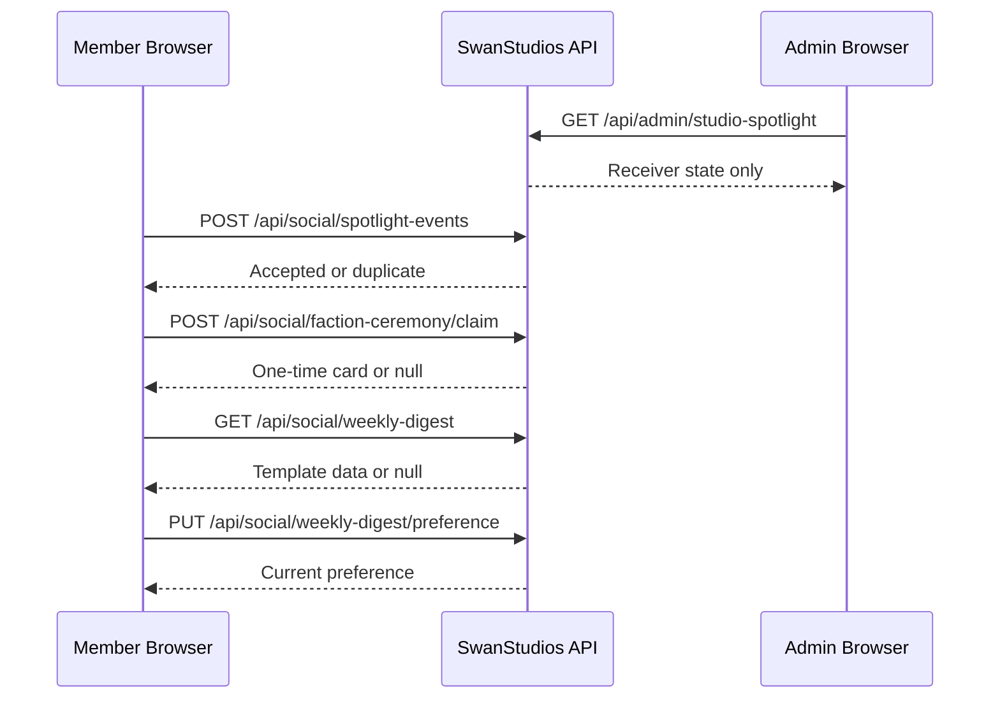
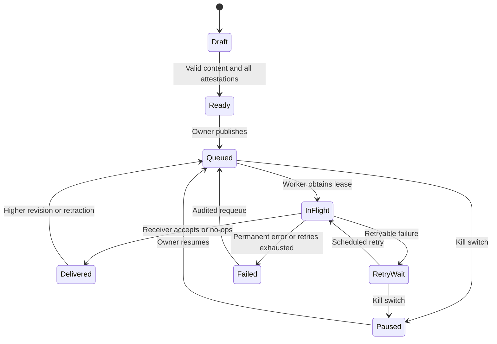
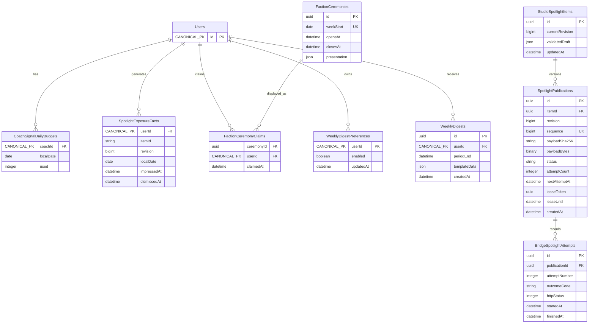

# Astra Pro Reply — Social Bridge Completion Blueprint

**Model:** `openai/gpt-6-astra-pro` via OpenRouter
**Date:** 2026-09-19T08:38:17.937Z
**Packet:** `docs/ai-workflow/AI-HANDOFF/BLUEPRINT-social-bridge-completion-2026-09-19/CONSULT-PACKET.md`
**Prompt SHA-256:** `65272c98503fa6b1ba2452fd83d1f8a01d51e872811e6dce310201e2657cc193`
**Tokens:** 57740 in / 41798 out | **Cost:** ~$2.6673 | **Wall:** 377.9s | **finish_reason:** stop

---

## PART A — HOSTILE REVIEW

### A.1 Findings

**Evidence boundary:** No repository contents, diffs, database schema, or command output are attached. The packet contains file names and reported results, but almost no source excerpts or line numbers. I cannot honestly produce a source-verified hostile review from that material, and I will not manufacture `file:line` citations.

The findings below distinguish **reported gaps**, **conditional defects**, and **unverified risks**. They are actionable, but they are **not a substitute for the required repository audit**. That audit becomes the first blocking checkpoint.

1. **CRITICAL · The requested implementation-ready handoff lacks its required evidence.**
   - **Evidence:** `backend/scripts/safe-migrate.mjs:146` is the only source line supplied. No bridge DTO, model definition, route mount excerpt, scheduler example, authorization implementation, database dialect for SwanGuard, or package test scripts were supplied.
   - **What is wrong:** A builder cannot safely implement an interoperable publisher from a contract name, headers, and idempotency rules alone. The actual `spotlight.v1` body is missing. Claiming a complete package would conceal architectural decisions inside implementation.
   - **Specific fix:** Introduce checkpoint **G0**, before implementation. A repository-capable reviewer must attach the exact excerpts and baseline artifacts enumerated in `00-README.md`. The architect then finalizes the blocked interfaces. Do not ask the context-free builder to discover these facts.

2. **HIGH · Session-targeted CoachSignal uniqueness is conditionally broken.**
   - **Evidence target:** `backend/migrations/20260916-create-coach-signals.cjs` and `backend/models/social/CoachSignal.mjs`; **line numbers and definitions unavailable**.
   - **Status:** PostgreSQL’s treatment of NULL in ordinary unique constraints is established. Whether another index already closes this hole is unverified.
   - **Why it matters:** A unique constraint on `(coachId, postId)` does not prevent duplicate signals for the same non-NULL session target when `postId` is NULL.
   - **Specific fix:** If the actual columns are `"coachId"`, `"postId"`, and `"sessionId"`, enforce exactly one target and add session uniqueness:
     ```sql
     ALTER TABLE "CoachSignals"
       ADD CONSTRAINT "CoachSignals_exactly_one_target"
       CHECK (num_nonnulls("postId", "sessionId") = 1) NOT VALID;

     CREATE UNIQUE INDEX CONCURRENTLY
       "CoachSignals_coach_session_unique"
       ON "CoachSignals" ("coachId", "sessionId")
       WHERE "sessionId" IS NOT NULL;

     ALTER TABLE "CoachSignals"
       VALIDATE CONSTRAINT "CoachSignals_exactly_one_target";
     ```
     Preserve the existing post uniqueness constraint. First reconcile duplicates and invalid targets using an approved, auditable survivor mapping. Do not silently delete records. `CREATE INDEX CONCURRENTLY` must run outside a transaction; G0 must establish whether the migration runner permits that. If not, use an explicitly scheduled write-maintenance window and ordinary index creation.
   - **Stop condition:** This DDL is not authorized until the column names, target semantics, referencing tables, and runner transaction behavior are verified.

3. **HIGH · A five-per-day limit can still be exceeded if implemented as count-then-insert.**
   - **Evidence target:** `backend/routes/social/coachSignalRoutes.mjs`; **implementation and lines unavailable**.
   - **Status:** Unverified concurrency risk, not a demonstrated defect.
   - **Why it matters:** Concurrent requests can all observe four existing signals and each insert a fifth. Correct timezone selection does not repair this.
   - **Specific fix:** Serialize quota allocation by `(coachId, localDate)` inside the same transaction as signal creation. Use a unique daily-counter row, lock it, increment only below five, and roll the increment back if signal insertion fails. A duplicate target consumes no additional allowance.
   - **Boundary decision:** Use `America/Los_Angeles`, not a fixed UTC offset. The sixth successful signal before local midnight returns 429. At local midnight, the new day receives a fresh allowance. Store timestamps in UTC.
   - **Deployment decision:** Initialize the current local-day counters from existing signals while creation is briefly write-gated; otherwise rollout itself grants an accidental second allowance.

4. **HIGH · “S3 complete” excludes an operationally necessary surface.**
   - **Evidence target:** `backend/routes/social/spotlightReadRoutes.mjs` and the reported absence of an admin surface; **source lines unavailable**.
   - **Status:** Reported gap.
   - **Why it matters:** An operator cannot distinguish “nothing published,” “publication rejected,” “image degraded,” and “feature disabled” from the member rail.
   - **Specific fix:** Add a read-only SwanStudios admin screen showing receiver state, current live items, revision, receive time, image degradation, and opaque last receipt ID. It must not expose SwanGuard URLs, source documents, checklist attestations, retry internals, or publishing controls. Retractions originate in SwanGuard.

5. **HIGH · Spotlight retraction and revision safety are not established by the summarized idempotency rule.**
   - **Evidence targets:** `backend/routes/bridge/bridgeIngestRoutes.mjs`, `backend/models/social/SwanSpotlight.mjs`, `backend/services/swanBridgeSignature.mjs`; **source lines unavailable**.
   - **Status:** Unverified risk.
   - **Why it matters:** Concurrent revisions, an old retry, or a late image download can resurrect a retracted item or overwrite a newer revision.
   - **Specific fix:** Persist the highest accepted revision and retraction tombstone. Use atomic compare-and-set or a row lock. Lower revisions are no-ops; equal revisions remain 200 no-ops; higher revisions replace state. Attach an uploaded image only while the row still has the intended revision and remains live. Never delete the revision tombstone when removing an item from the rail.

6. **HIGH · Mandatory remote image rehosting introduces an unverified SSRF and resource-exhaustion boundary.**
   - **Evidence target:** `backend/routes/bridge/bridgeIngestRoutes.mjs` and its image-fetch dependency, whose path was not supplied; **source lines unavailable**.
   - **Status:** Unverified risk.
   - **Why it matters:** Signed input does not make arbitrary URLs safe. A compromised publisher or unsafe redirect could target internal services; oversized or decompression-bomb images can exhaust memory.
   - **Specific fix:** HTTPS only; approved image-source hosts; no credentials or nonstandard ports; reject private, loopback, link-local, multicast, and metadata addresses for IPv4 and IPv6; validate every redirect and bind connections to validated addresses. Maximum two redirects, five-second total fetch deadline, 5 MiB compressed input, and 16 megapixels decoded. Accept JPEG, PNG, and WebP by decoder inspection; reject SVG and animation. Re-encode before R2 storage.
   - **Failure behavior:** Every image failure yields `imageUrl=null`; authenticated, otherwise-valid content ingestion still succeeds.

7. **HIGH · The reverse pulse and reconciliation path are missing; webhook retries alone cannot establish convergence.**
   - **Evidence targets:** reported absence of `GET /api/operator/pulse`; `apps/api/src/featureDispatchOwnerOperator.ts` for the future operator mount; **source lines unavailable**.
   - **Status:** Reported gap.
   - **Why it matters:** A webhook dropped beyond the retry horizon leaves the applications permanently inconsistent. A “pulse” assembled from arbitrary ORM objects can accidentally disclose personal data.
   - **Specific fix:** Add a fixed-schema aggregate serializer and signed incremental manifest protocol. Retractions remain durable. Advance the manifest cursor only after durable application of the entire page. Pulse queries must not select names, emails, handles, post text, or individual identifiers.

8. **MED · The proposed dismissal threshold is currently unevaluable.**
   - **Evidence target:** `frontend/src/components/Social/Spotlight/SpotlightRail.tsx`; **source lines unavailable**.
   - **Status:** Reported gap.
   - **Why it matters:** Without a defined denominator, “40% dismissals” is a slogan, not an operational criterion. Rendering a hidden card must not count as an impression.
   - **Specific fix:** Count an impression only after at least 50% visibility for one continuous second in a foreground tab. Deduplicate by member, item, revision, and Pacific day. Count dismissal only against a qualifying impression; use the same unit for numerator and denominator. Evaluate seven closed Pacific days only when impressions are at least 100. Alert strictly above 0.40, not at 0.40. Never export member IDs.

9. **HIGH · The SwanGuard dirty worktree is an uncontrolled change boundary.**
   - **Evidence targets:** `Desktop/@Everything/SwanGuard-Newsroom/.git` and worktree/index state; **no command output supplied**.
   - **Status:** Reported operational risk.
   - **Why it matters:** Repairing a gitfile does not prove that untracked assets, ignored files, staged changes, and unpublished commits are recoverable. A bundle preserves commits, not the dirty worktree.
   - **Specific fix:** Freeze writers; make a protected filesystem backup; separately save staged and unstaged binary patches, untracked-file inventory, refs, and a git bundle; verify restore before any cleanup. Audit the 12 commits against the fetched remote. Classify and commit explicit file lists by subsystem. Build this feature in a clean worktree from an approved integration commit. Do not blanket-stash, reset, clean, cherry-pick an assumed range, or stage everything.

10. **MED · Passing the reported test suite does not prove deployment, privacy, or concurrency correctness.**
    - **Evidence targets:** named contract tests in the packet; **test bodies and output unavailable**.
    - **Status:** Unsupported completion inference, not a claim that the tests failed.
    - **Why it matters:** Unit tests may never exercise the production raw-body parser mount, real PostgreSQL contention, scheduler multiplicity, DNS rebinding, or omission of forbidden response fields.
    - **Specific fix:** Require production-stack HTTP tests, real-database race tests, migration rehearsals against representative data, schema-based privacy tests, and two-worker scheduler/outbox tests before enablement.

### A.2 Refuted

No implementation claim can be marked source-verified from the supplied material.

Two proposed interpretations can nevertheless be rejected:

- **“Default OFF is a defect.”** No. Changing the default to ON before publisher, privacy, rollback, and reconciliation checks would be a defect. Keep the default OFF; enable explicitly through the rollout below.
- **“A partial index is always required for session uniqueness.”** No. An ordinary unique constraint on `(coachId, sessionId)` also prevents duplicates when both values are non-NULL. The partial index is chosen because it excludes irrelevant post-targeted rows. The separate exactly-one-target constraint is still necessary if that is the verified domain model.

### A.3 Verdict on the current state

S1–S4 are **reported implemented, not independently established as production-sound**. I would retain their existing work, refuse to rewrite their shipped contracts, and refuse public Spotlight enablement until receiver ordering, image isolation, operator visibility, and recovery are demonstrated. I would also refuse to call the package below “complete” while its source-harvest gate remains open. The plan therefore starts with evidence and containment, not S5 UI construction.

## PART B — FORGED PACKAGE

### 00-README.md

**Destination**

`docs/ai-workflow/AI-HANDOFF/BLUEPRINT-studio-spotlight-completion-2026-09-19/`

**Status: ARCHITECTURE DECIDED; IMPLEMENTATION RELEASE BLOCKED AT G0.**

These are proposed document contents, not files written into either repository. No tests or commands below have been executed.

#### Builder Contract

> You are the builder, not the architect. Follow the package to the letter. Where the package decides, you do not re-decide — even if you'd do it differently. Where the package is silent on something that matters, STOP and return the question; do not improvise. Build ONE slice at a time; after each slice, output the diff + the acceptance-criteria evidence and WAIT for the checkpoint verdict before continuing. Never claim a criterion passed without pasting its output.

#### Build order

| Gate/slice | Deliverable |
|---|---|
| G0 | Repository evidence, worktree preservation, approved integration baselines |
| R1 | Signal constraints/quota correctness; receiver revision/image hardening |
| R2 | SwanStudios Spotlight administration and measurement |
| S5a | SwanGuard publication storage, authorization, outbox, receipts, kill-switch integration |
| S5b | Separate Studio Spotlight operator console and ceremony |
| S7 | Aggregate pulse, manifest reconciliation, Studio Pulse tile |
| S6 | Scheduled faction ceremony and bounded Three.js enhancement |
| S8 | Template-only in-app weekly digest |
| E1 | Staging rehearsal, production canary, explicit enablement |

Do not renumber the product slices to imply S1–S4 were rebuilt.

#### G0: evidence the repository-capable reviewer must attach

The **reviewer**, not the context-free builder, supplies numbered excerpts with commit SHA, path, and line range.

| Artifact | Required contents |
|---|---|
| `truth/01-baselines.txt` | Worktree list, branch status, commit SHAs, dirty inventory, protected backup verification |
| `truth/02-bridge.md` | Entire `spotlight.v1` validation schema; accepted/rejected bodies; exact success/error bodies; raw parser and route mounts; flag reader; HMAC implementation |
| `truth/03-ss-schema.md` | CoachSignal, SwanSpotlight, canonical user/post/session keys, actual indexes/checks/FKs, database drift comparison |
| `truth/04-ss-patterns.md` | Working authenticated admin route, frontend admin mount, model registration, top-level migration example, scheduler, test commands |
| `truth/05-sg-patterns.md` | Complete relevant route handler/dispatch excerpt, owner authorization, kill-switch persistence and checks, DB transaction/worker pattern, test commands |
| `truth/06-sg-surfaces.md` | Operator surface registration; `OperatorGrantConsole` excerpts; protected-file hashes; actual `bridge-policy.json` location and schema |
| `truth/07-domain-adapters.md` | Authoritative faction scoring, MVP eligibility, XP ledger, streaks, friendship visibility, preferences, client name resolver |
| `truth/08-runtime.md` | Runtime versions, database dialects, deployment topology, scheduler ownership, R2 helper, CORS/CSP, bundle baseline |
| `truth/09-baseline-results.txt` | Actual test/typecheck/build output, secret scan, production-router smoke tests |

**G0 deliverable:** An architect revision that replaces every `BLOCKED-G0` entry in this package with actual excerpts, final model definitions, exact integration edits, and executable repository-native commands.

#### Worktree preservation procedure

Run only after stopping editors, agents, dev servers that write generated files, and background git operations:

```bash
WT="$HOME/Desktop/@Everything/SwanGuard-Newsroom"
STAMP="$(date -u +%Y%m%dT%H%M%SZ)"
BACKUP="$HOME/SwanGuard-recovery-$STAMP"
mkdir -m 700 "$BACKUP"

git -C "$WT" status --porcelain=v2 --branch > "$BACKUP/status.txt"
git -C "$WT" worktree list --porcelain > "$BACKUP/worktrees.txt"
git -C "$WT" show-ref > "$BACKUP/refs.txt"
git -C "$WT" diff --binary > "$BACKUP/unstaged.patch"
git -C "$WT" diff --cached --binary > "$BACKUP/staged.patch"
git -C "$WT" ls-files --others --exclude-standard -z \
  > "$BACKUP/untracked-files.zlist"
git -C "$WT" bundle create "$BACKUP/repository.bundle" --all
git -C "$WT" bundle verify "$BACKUP/repository.bundle"
```

These commands are **not the complete backup**. Also take a protected filesystem copy of both the worktree and the repository’s shared git directory, including ignored files. The copy may contain secrets: restrict access and never commit it.

Verify restoration in a disposable location. Then fetch, record the actual divergence, and classify changes before making explicit-path commits. Create a clean feature worktree only from Sean’s approved integration commit.

> **SEAN MUST DECIDE:** Approve the SwanGuard integration commit and publication/push destination after the dirty-state audit. No automatic push to `main`, and no assumption that the 12 commits are all feature prerequisites.

---

### 01-architecture.md

#### Ownership and trust boundaries

- SwanGuard owns drafts, ceremony attestations, publish/retract decisions, outbox attempts, and publisher receipts.
- SwanStudios owns accepted Spotlight state, hosted image assets, member visibility, local engagement events, and aggregate pulse production.
- Editorial payloads contain only the verified `spotlight.v1` fields. Do not add source provenance, operator identity, saved-story bodies, or private URLs.
- New reverse traffic contains fixed aggregates only.
- HMAC secrets stay server-side. The browser never signs bridge requests.
- SwanGuard may learn aggregate acceptance state through receipts/pulse, not member identities.
- The existing positivity gate remains authoritative at the receiver. Publisher ceremony is an additional gate, not a replacement.

```mermaid
flowchart LR
    O[Sean] --> C[Studio Spotlight Console]
    C --> P[Publication Transaction]
    P --> E[Immutable Publication Events]
    P --> Q[Durable Outbox]
    Q --> D[Bridge Spotlight Dispatcher]
    D --> I[SwanStudios Bridge Ingest]
    I --> G[Schema and Positivity Gate]
    G --> S[Revision State and Tombstones]
    G --> R[Bounded Image Rehosting]
    R --> S
    S --> F[Member Spotlight Rail]
    S --> A[Read-only Admin Console]
    F --> M[Local Measurement]
    M --> U[Aggregate Pulse]
    U --> T[Studio Pulse Tile]
    E --> N[Signed Manifest]
    N --> H[Hourly Reconciler]
    H --> G
```



#### API interaction diagrams

Existing ingest body and responses are `BLOCKED-G0`; its path and signature semantics remain unchanged.

```mermaid
sequenceDiagram
    participant B as Owner Browser
    participant G as SwanGuard API
    participant DB as SwanGuard Database
    participant W as Dispatcher
    participant S as SwanStudios API

    B->>G: GET /api/operator/studio-spotlight/items
    G->>G: Existing owner authorization
    G-->>B: Queue page
    B->>G: POST /items/{itemId}/publications
    G->>DB: Revision + event + outbox transaction
    DB-->>G: Durable commit
    G-->>B: 202 publication receipt
    W->>DB: Lease next eligible outbox row
    W->>W: Check owner kill switch
    W->>S: POST /api/bridge/spotlight
    S-->>W: Existing ingest response
    W->>DB: Append attempt receipt; resolve lease
    B->>G: GET /publications/{publicationId}/receipts
    G-->>B: Sanitized receipt list
```





Kill-switch requests use the **existing** owner API and its verified DTO; do not invent a parallel switch endpoint.

#### State machines



`Ready` is a derived UI state, not permission to bypass server validation. Retrying a failed publication preserves its revision and payload bytes. Editing content creates a higher revision and requires a fresh ceremony.

#### Schema decisions

The following logical schema is fixed. **Physical types for canonical keys, SwanGuard migrations, and complete Sequelize definitions remain blocked by G0.** This is intentionally not a fabricated deployed ERD.



Additional required state:

- Manifest cursor: one durable consumer row, containing the last committed sequence.
- Publisher ceremony attestations: immutable publication-linked record; owner ID stays in SwanGuard.
- Scheduler ledger: unique `(jobName, scheduledFor)` with lease and completion state.
- Receiver tombstones: retain indefinitely; exact integration into `SwanSpotlight` depends on its real definition.
- Content hashes: SHA-256 of the exact outgoing UTF-8 body bytes, not reserialized JSON.

Do not persist `bigint` values as JavaScript numbers. API revisions and sequences introduced by this package use decimal strings; the existing wire revision type remains unchanged.

#### Concurrency and delivery rules

- Publication revision allocation, immutable payload creation, manifest sequence, and outbox insertion commit atomically.
- Transactional database sequence allocation must not allow a consumer to advance past an uncommitted lower sequence. Use a single locked stream-counter row acquired within the publication transaction.
- One active delivery per item. Serialize revisions; do not deliver an older revision after a newer one has been accepted.
- Worker leases last 60 seconds; HTTP timeout is 10 seconds. Lease completion requires the original lease token.
- Initial attempt plus **six retries**: 30, 120, 600, 1,800, 7,200, and 21,600 seconds after each preceding failure.
- Add deterministic 0–20% positive jitter derived from publication ID and retry number; persist the resulting schedule.
- Retry network failure, timeout, 408, 429, and 5xx. Respect a bounded `Retry-After`, maximum six hours.
- Treat other 4xx as permanent failures. A verified disabled-receiver 503 becomes paused, not an exhausted attempt.
- Check the kill switch at enqueue and immediately before network dispatch. Abort in-flight requests when possible. **A kill switch cannot recall a request the receiver already accepted.**
- Emergency content removal therefore uses explicit retractions or SwanStudios disablement, not a false “instant recall” promise.

---

### 02-wireframes.md

#### Tokens

```css
--studio-bg: var(--midnight-sapphire, #002060);
--studio-surface: var(--obsidian-black, #0A0A0F);
--studio-text: var(--frost-white, #E0ECF4);
--studio-editorial: var(--ice-wing, #60C0F0);
--studio-earned: var(--gilded-fern, #C6A84B);
```

All functional controls are at least 44×44 CSS pixels. Focus indication uses the editorial token plus an outline; status never depends on color alone. No purple appears in these surfaces.

#### SwanGuard: separate operator page

Route: `/operator/studio-spotlight`.

Desktop, 1440×900:

```text
+------------------------------------------------------------------+
| Studio Spotlight                  [Pause publishing] [Refresh]    |
| Publishing active                                                |
+----------------------+-------------------------------------------+
| Queue                | Selected item                             |
| [All statuses v]     | Headline                                  |
| [Search items     ]  | [                                        ]|
|                      | Member preview                            |
| Headline             | +---------------------------------------+ |
| Draft                | | Positive perspective                  | |
|                      | | Headline                              | |
| Headline             | | Editorial summary                     | |
| Delivered            | +---------------------------------------+ |
|                      | [Save draft] [Review for publishing]      |
|                      | [Retract from SwanStudios]                |
+----------------------+-------------------------------------------+
| Delivery receipts                                                |
| Revision | State | Last attempt | [View receipt]                  |
+------------------------------------------------------------------+
```

375×812:

```text
+-----------------------------------+
| Studio Spotlight                  |
| Publishing active                 |
| [Pause publishing] [Refresh]      |
| [All statuses v]                  |
| [Search items                  ]  |
| Queue                             |
| [Headline                      >] |
| Draft                             |
+-----------------------------------+
```

Selecting an item opens a full-width detail route with `[Back to queue]`; it does not mutate `StorySheet.tsx`.

#### Publication ceremony

Desktop modal and mobile full-screen dialog:

```text
+-----------------------------------+
| Review for publishing     [Close] |
| Confirm every statement.          |
| [ ] No politics                   |
| [ ] No negativity or ragebait     |
| [ ] Image rights cleared         |
| [ ] Headline is in Sean's voice   |
|                                   |
| Publishing sends this preview     |
| to SwanStudios.                   |
| [Cancel] [Publish to SwanStudios]  |
+-----------------------------------+
```

- Publish disabled until all four boxes are checked and validation passes.
- With no image, rights confirmation means no uncleared image is being sent.
- Changing any published field after opening the dialog resets all four boxes.
- Server binds attestations to the content hash; browser checkboxes are not authority.
- Modal focus is trapped and restored. Escape closes only while no request is pending.

Retraction confirmation:

```text
+-----------------------------------+
| Retract Spotlight         [Close] |
| Remove this item from             |
| SwanStudios?                      |
| [Cancel] [Retract item]            |
+-----------------------------------+
```

#### SwanStudios admin

Route: `/admin/studio-spotlight`.

```text
DESKTOP 1440x900
+------------------------------------------------------------------+
| Studio Spotlight                                      [Refresh]  |
| Spotlight disabled                                               |
| Live items: 0                                                    |
| Headline | Revision | Received | Image | Receipt                  |
+------------------------------------------------------------------+

MOBILE 375x812
+-----------------------------------+
| Studio Spotlight       [Refresh]  |
| Spotlight disabled                |
| Live items: 0                     |
| No live Spotlight items.          |
+-----------------------------------+
```

No publish, edit, or direct-delete button exists here.

#### Studio Pulse tile

```text
DESKTOP                              MOBILE 375px
+--------------------------------+   +-----------------------------------+
| Studio Pulse         [Refresh] |   | Studio Pulse            [Refresh] |
| Updated 2 minutes ago          |   | Updated 2 minutes ago             |
| Spotlight active               |   | Spotlight active                  |
| Live items                 3   |   | Live items: 3                     |
| Impressions              240   |   | Impressions: 240                  |
| Dismissal rate           25%   |   | Dismissal rate: 25%               |
| Placement review not needed    |   | Placement review not needed       |
+--------------------------------+   +-----------------------------------+
```

When sample size is insufficient: `"Not enough activity to assess placement."`

#### Faction ceremony

```text
DESKTOP RIGHT RAIL                    MOBILE 375px
+------------------------------+     +-----------------------------------+
| This week's faction honors   |     | This week's faction honors       |
| [bounded crystal scene]      |     | [static crystal illustration]    |
| Winner: resolved faction     |     | Winner: resolved faction         |
| MVP: resolved member         |     | MVP: resolved member             |
| Next week: resolved modifier |     | Next week: resolved modifier     |
| [Continue]                   |     | [Continue]                       |
+------------------------------+     +-----------------------------------+
```

Gold is limited to earned recognition. Scene backdrop and system labels remain ice-cyan.

#### Weekly digest

```text
DESKTOP                              MOBILE 375px
+--------------------------------+   +-----------------------------------+
| Your week at SwanStudios        |   | Your week at SwanStudios          |
| XP earned: 120                  |   | XP earned: 120                    |
| Current streak: 4 days          |   | Current streak: 4 days            |
| Friend highlight               |   | Friend highlight                  |
| A friend completed a challenge.|   | A friend completed a challenge.   |
| Faction rank: 2                |   | Faction rank: 2                   |
| [Read Spotlight]               |   | [Read Spotlight]                  |
| [Weekly digest: On]            |   | [Weekly digest: On]               |
+--------------------------------+   +-----------------------------------+
```

Names replace `"A friend"` only after authorized client-side resolution.

#### Exact shared states

Use the same state layout on desktop and mobile; no layout-only inaccessible spinner.

```text
LOADING
+-----------------------------------+
| Loading Studio Spotlight...       |
+-----------------------------------+

EMPTY QUEUE
+-----------------------------------+
| No items in this queue.           |
| Save a draft to get started.      |
+-----------------------------------+

ERROR
+-----------------------------------+
| Studio Spotlight could not load.  |
| [Try again]                       |
+-----------------------------------+

PAUSED
+-----------------------------------+
| Publishing paused.                |
| Queued items will not be sent.    |
| [Resume publishing]               |
+-----------------------------------+
```

Surface-specific replacements:

| Surface | Loading | Empty | Error |
|---|---|---|---|
| Admin | `Loading live items...` | `No live Spotlight items.` | `Live items could not load.` |
| Pulse | `Loading Studio Pulse...` | `No activity yet.` | `Studio Pulse is unavailable.` |
| Ceremony | No placeholder | Render nothing | Render nothing; local diagnostic only |
| Digest | `Loading your weekly digest...` | `Your next weekly digest is on its way.` | `Your weekly digest could not load.` |
| Receipts | `Loading delivery receipts...` | `No delivery attempts yet.` | `Delivery receipts could not load.` |

Digest opt-out state: `"Weekly digest is off."` and `[Turn on weekly digest]`.

Pulse stale state: `"Studio Pulse is out of date."`; keep last verified values with their timestamp, never relabel them current.

#### Three.js boundary

- Exists **only inside the faction ceremony**.
- One decorative crystalline swan-like silhouette assembled from at most 24 low-poly shards.
- No simulation, particles, physics, audio, postprocessing, shadows, remote assets, text rendering, or additional canvas.
- Lazy import only after the member receives a non-null ceremony claim and passes motion/device checks.
- Animation lasts 2.5 seconds, then renders one static frame and stops.
- Cap at 30 fps and device-pixel ratio 1.5.
- At widths below 600px, including 375px: static CSS/SVG illustration, **no Three.js import**.
- `prefers-reduced-motion`, Save-Data, hidden tab, unavailable WebGL, or detected low-memory device: same static fallback.
- Incremental lazy chunk budget: **180 KiB gzip maximum**, with **0 bytes of Three.js in the initial social route chunk**. This is a build gate, not a claimed measurement.
- If the measured build exceeds budget, reduce the Three.js import surface or stop for checkpoint review. Do not silently remove the required desktop spectacle.
- The canvas is `aria-hidden`; the card’s text contains all information.

---

### 03-contracts.md

#### Contract release rule

The exact existing `spotlight.v1` body and receiver response are **BLOCKED-G0**. Do not derive them from this package, invent `headline`/`summary` fields, or change shipped field types.

All newly defined DTOs below reject unknown request keys. New JSON responses use an explicit serializer, not `toJSON()` on an ORM object.

#### Common errors for new endpoints

```json
{"error":{"code":"UNAUTHORIZED","message":"Authentication required."}}
```

| Status | Code | Message |
|---|---|---|
| 400 | `INVALID_REQUEST` | `Request is invalid.` |
| 401 | `UNAUTHORIZED` | `Authentication required.` |
| 403 | `FORBIDDEN` | `This action is not permitted.` |
| 404 | `NOT_FOUND` | `Item not found.` |
| 409 | `REVISION_CONFLICT` | `This item changed. Reload and try again.` |
| 413 | `PAYLOAD_TOO_LARGE` | `Request is too large.` |
| 429 | `RATE_LIMITED` | `Too many requests. Try again later.` |
| 500 | `INTERNAL_ERROR` | `The request could not be completed.` |
| 503 | `PUBLISHING_PAUSED` | `Publishing is paused.` |
| 503 | `FEATURE_DISABLED` | `This feature is disabled.` |
| 503 | `UPSTREAM_UNAVAILABLE` | `Studio Pulse is unavailable.` |

Never return exception text, upstream response bodies, SQL errors, source URLs, or secret-validation details.

#### SwanGuard operator APIs

Prefix: `/api/operator/studio-spotlight`.

Authorization: existing authenticated **owner** check; ordinary operators receive 403. Cookie-authenticated mutations require the existing CSRF mechanism.

| Method/path | Request | Success |
|---|---|---|
| `GET /items?status=all&limit=20` | Optional opaque `cursor`; limit 1–50 | 200 `StudioSpotlightItemPage` |
| `POST /items` | `{"draft": <verified editorial DTO>}` | 201 `StudioSpotlightItem` |
| `PUT /items/:itemId` | `{"expectedRevision":"0","draft":<DTO>}` | 200 `StudioSpotlightItem` |
| `POST /items/:itemId/publications` | Body below | 202 publication result |
| `POST /items/:itemId/retractions` | `{"expectedRevision":"1"}` | 202 publication result |
| `GET /publications/:publicationId/receipts` | None | 200 receipts |
| `POST /publications/:publicationId/retry` | `{}` | 202 same publication result |

Publication request:

```json
{
  "expectedRevision":"0",
  "draftSha256":"<64 lowercase hex characters>",
  "checks":{
    "noPolitics":true,
    "noNegativity":true,
    "imageRightsCleared":true,
    "headlineInOwnerVoice":true
  }
}
```

Publication result:

```json
{
  "publicationId":"11111111-1111-4111-8111-111111111111",
  "itemId":"22222222-2222-4222-8222-222222222222",
  "revision":"1",
  "state":"queued"
}
```

Receipts:

```json
{
  "publicationId":"11111111-1111-4111-8111-111111111111",
  "receipts":[
    {
      "attempt":1,
      "outcome":"accepted",
      "httpStatus":200,
      "completedAt":"2026-09-21T16:00:00.000Z"
    }
  ]
}
```

`outcome` is one of `accepted`, `retryable`, `rejected`, `timeout`, `network_error`, `paused`. These are application strings with database CHECK validation where supported, **not an extended existing ENUM**.

`StudioSpotlightItem` and its draft schema remain blocked until the wire DTO and current source-item projection are attached. Neither endpoint may return raw SwanGuard story objects.

#### SwanStudios admin read

`GET /api/admin/studio-spotlight?limit=20`

Existing SwanStudios admin authorization. Limit 1–50; opaque cursor.

```json
{
  "enabled":false,
  "liveCount":0,
  "items":[],
  "nextCursor":null
}
```

Each nonempty item contains only:

```ts
type StudioSpotlightAdminItem = {
  itemId: string;
  revision: string;
  title: string;
  receivedAt: string;
  imageState: "hosted" | "none" | "degraded";
  receiptId: string | null;
};
```

`title` is an admin DTO projection from the verified wire field, not a new wire field.

#### Impression/dismissal collection

`POST /api/social/spotlight-events`

Authenticated member, CSRF-protected, maximum 4 KiB request.

```json
{
  "itemId":"22222222-2222-4222-8222-222222222222",
  "revision":"1",
  "event":"impression"
}
```

Success, including duplicate:

```json
{"accepted":true}
```

- `event` permits `impression` or `dismissal`.
- Server derives member and local day; never accepts either from the client.
- Reject unknown, inaccessible, retracted, or revision-mismatched items with 404.
- Dismissal without an existing qualifying exposure returns 409 with code `IMPRESSION_REQUIRED` and message `"Record an impression before dismissal."`
- Serialize client transmission per item. A sub-one-second dismissal remains a local UI dismissal and is excluded from the placement-rate statistic.
- Database uniqueness: `(userId, itemId, revision, localDate)`.
- Maximum 60 requests/member/minute.
- Retain member-keyed exposure facts for 35 days, then delete. Retain daily aggregate totals without member identifiers.

#### Pulse authentication

`GET /api/operator/pulse`

No browser authentication. TLS required. Use `SWAN_PULSE_SECRET_V1`.

Headers:

```text
X-Swan-Timestamp: <integer Unix seconds>
X-Swan-Nonce: <32 lowercase hex characters>
X-Swan-Signature: sha256=<hex>
```

Signature input, exactly:

```text
pulse.v1
<timestamp>
<nonce>
GET
/api/operator/pulse
```

No trailing newline. Timestamp tolerance ±300 seconds. Reject reused nonces for ten minutes using a shared store. Constant-time signature comparison. Reject query parameters.

Response:

```json
{
  "schema":"studio-pulse.v1",
  "generatedAt":"2026-09-21T16:00:00.000Z",
  "window":{
    "timeZone":"America/Los_Angeles",
    "start":"2026-09-14T07:00:00.000Z",
    "end":"2026-09-21T07:00:00.000Z"
  },
  "spotlight":{
    "enabled":true,
    "liveItems":3,
    "impressions":240,
    "dismissals":60,
    "dismissalRate":0.25,
    "placementReviewRequired":false
  }
}
```

- Window: seven fully closed Pacific calendar days.
- For 0–19 impressions, return `impressions:null`, `dismissals:null`, `dismissalRate:null`, and `placementReviewRequired:false`.
- At 20–99 impressions, return aggregate counts/rate but no placement alert.
- At least 100 impressions: alert iff `dismissals / impressions > 0.40`.
- Return rate rounded to four decimal places; threshold uses unrounded counts.
- Do not add drilldown, cohort, item, member, or date-range parameters.
- Set `Cache-Control: no-store`.
- SwanGuard caches the response server-side for 60 seconds and labels it stale after five minutes.

This prevents name/email disclosure **by construction of the fixed DTO and aggregate query**. It does not claim formal anonymity against every auxiliary-information attack; suppression reduces small-sample exposure.

`GET /api/operator/studio-pulse` is SwanGuard owner-authenticated:

```json
{
  "freshness":"fresh",
  "lastSuccessAt":"2026-09-21T16:00:00.000Z",
  "pulse":{}
}
```

`pulse` is exactly the above DTO, not `{}` in a real nonempty response. No verified cached value and upstream failure returns 503. A cached value with upstream failure returns 200, `freshness:"stale"`.

#### Manifest reconciliation

`GET /api/bridge/studio-spotlight/manifest?after=0&through=&limit=100`

Publisher-side endpoint, server-to-server only.

- `after` and `through`: nonnegative decimal strings; empty `through` starts a snapshot.
- `limit`: exactly 100 in the consumer; server permits 1–100.
- Initial page captures the highest committed manifest sequence as `through`.
- Following pages retain that `through`.
- Events ordered by committed sequence ascending.
- Immutable events include retractions. Retain them for this phase; do not introduce pruning without a full-snapshot protocol.

Request uses `SWAN_BRIDGE_SECRET_V1`, existing timestamp/signature header names, and a fresh nonce. Domain-separated signature input:

```text
manifest.request.v1
<timestamp>
<nonce>
GET
<exact path and query>
```

Canonical query order is `after`, `through`, `limit`; values use ordinary percent encoding. Reject noncanonical query order or duplicate parameters.

Response:

```json
{
  "schema":"studio-spotlight-manifest.v1",
  "through":"0",
  "nextAfter":"0",
  "hasMore":false,
  "events":[]
}
```

A nonempty event:

```ts
type BridgeSpotlightManifestEvent = {
  sequence: string;
  payloadBase64: string;
  payloadSha256: string;
};
```

The decoded payload is the exact, previously approved `spotlight.v1` body. No publication actor, attempt history, source metadata, or source ID is exported.

Response headers include fresh timestamp, echoed nonce, and signature over:

```text
manifest.response.v1
<response timestamp>
<request nonce>
<exact response body bytes>
```

- Maximum response body: 1 MiB. Return fewer than 100 events when needed.
- Manifest payload-size limit must match the verified existing ingest ceiling. If even one event cannot fit, stop and alert; never skip it.
- Receiver verifies the raw response before parsing.
- Apply through the same schema/positivity/revision/image service used by webhook ingestion.
- Advance cursor transactionally after every event in the page is durably accepted or a valid no-op.
- Invalid event stops advancement and alerts the operator; do not silently drop it.
- Poll at minute 17 each hour, with a distributed lease and startup catch-up.
- When Spotlight is disabled, do not poll/apply or advance the cursor.
- Maximum 20 pages/run; continue from the saved cursor next run.

#### Faction ceremony

`POST /api/social/faction-ceremony/claim`, authenticated member, CSRF-protected.

Request: `{}`.

No eligible ceremony or already claimed:

```json
{"ceremony":null}
```

Successful claim:

```json
{
  "ceremony":{
    "id":"33333333-3333-4333-8333-333333333333",
    "opensAt":"2026-09-21T16:00:00.000Z",
    "closesAt":"2026-09-22T16:00:00.000Z",
    "winnerFactionId":"faction-1",
    "mvpUserId":null,
    "modifierCode":"<existing verified modifier code>"
  }
}
```

- Monday 09:00 to Tuesday 09:00, `America/Los_Angeles`.
- Snapshot prior closed faction period at reveal time.
- Existing faction authority supplies score, tie rules, MVP eligibility, and modifier. **Do not invent new scoring rules.**
- Claim inserts `(ceremonyId, userId)` atomically before returning the card.
- Two concurrent claims return one card and one null.
- This chooses **at-most-once reveal**, not guaranteed viewing: a crash after claim can suppress the card. Never promise exactly-once human viewing.
- UI names resolve through existing authorized client lookup. Missing names use `"Winning faction"` and `"MVP unavailable"`.

#### Weekly digest

Delivery medium: **in-app only**, not email or push.

`GET /api/social/weekly-digest`, authenticated member:

```json
{
  "enabled":true,
  "digest":{
    "id":"44444444-4444-4444-8444-444444444444",
    "periodEnd":"2026-09-21T01:00:00.000Z",
    "xpEarned":120,
    "streakDays":4,
    "friendHighlight":{
      "userId":"<canonical opaque ID>",
      "kind":"challenge_completed"
    },
    "factionRank":2,
    "spotlightItemId":"22222222-2222-4222-8222-222222222222"
  }
}
```

No digest: `{"enabled":true,"digest":null}`.

Opted out: `{"enabled":false,"digest":null}`.

`PUT /api/social/weekly-digest/preference`

Request: `{"enabled":false}`.

Response: `{"enabled":false}`.

- Sunday 18:00 Pacific; period is previous Sunday 18:00 through current Sunday 18:00.
- XP/streak/rank come from authoritative adapters.
- Friend highlight requires an eligible challenge completion and current sharing permission. Stable tie-break: latest qualifying completion, then canonical ID.
- Recheck friendship and visibility on read; if invalid, set `friendHighlight:null`.
- Select at most one currently live Spotlight. Recheck on read; retracted/disabled yields null.
- Opt-out checked both during generation and read.
- Default follows the verified existing digest preference. If none exists, default OFF.
- Template-only. No prose generation service, model client, prompt, embedding, or LLM dependency.

#### Exported application interfaces

These signatures are fixed for newly introduced service boundaries:

```ts
type DecimalString = string;
type Instant = string;
type CanonicalUserId = string | number; // Narrow at G0.

type StudioSpotlightPublishInput = {
  itemId: string;
  expectedRevision: DecimalString;
  draftSha256: string;
  checks: {
    noPolitics: true;
    noNegativity: true;
    imageRightsCleared: true;
    headlineInOwnerVoice: true;
  };
};

type BridgeSpotlightDispatchResult = {
  publicationId: string;
  outcome: "accepted" | "retryable" | "rejected" | "paused";
};

export function publishStudioSpotlight(
  input: StudioSpotlightPublishInput,
  context: StudioSpotlightOwnerContext
): Promise<StudioSpotlightPublicationResult>;

export function dispatchBridgeSpotlight(
  publicationId: string,
  dependencies: BridgeSpotlightDispatchDependencies
): Promise<BridgeSpotlightDispatchResult>;

export function reconcileBridgeSpotlight(
  dependencies: BridgeSpotlightReconcileDependencies
): Promise<{ applied: number; cursor: DecimalString }>;

export function buildStudioPulse(
  now: Date,
  dependencies: StudioPulseDependencies
): Promise<StudioPulseV1>;

export function claimFactionCeremony(
  userId: CanonicalUserId,
  now: Date
): Promise<FactionCeremonyDTO | null>;

export function buildWeeklyDigest(
  userId: CanonicalUserId,
  periodEnd: Date
): Promise<WeeklyDigestDTO | null>;
```

The dependency types, route context type, canonical ID narrowing, complete model definitions, and actual working pattern excerpts are **BLOCKED-G0**. They must be written into this file before builder release; `any`, placeholder imports, and guessed Sequelize models are forbidden.

---

### 04-build-order.md

**All paths below are new proposed files unless explicitly labeled existing.** Budgets are maximum source lines, excluding generated lockfiles. Test files follow the same 299-line limit.

#### Integration edits requiring G0 excerpts

| Existing file/surface | Authorized edit |
|---|---|
| `backend/core/middleware/index.mjs` | Preserve bridge raw-body exclusion; add only verified new mounts |
| `backend/routes/bridge/bridgeIngestRoutes.mjs` | Extract shared application service without changing shipped HTTP contract |
| `backend/routes/social/coachSignalRoutes.mjs` | Transactional quota and verified target handling |
| `frontend/src/components/Social/Spotlight/SpotlightRail.tsx` | Visibility/dismissal event adapter; no publisher details |
| `apps/api/src/featureDispatchOwnerOperator.ts` | Prefix dispatch following verified owner pattern |
| `apps/api/src/ownerKillSwitches.ts` | Register the dedicated publishing switch using existing extension mechanism |
| SwanGuard operator navigation | Mount separate console; exact file `BLOCKED-G0` |
| SwanStudios admin navigation | Mount read-only receiver console; exact file `BLOCKED-G0` |
| Social right rail | Mount ceremony/digest; exact file `BLOCKED-G0` |
| `bridge-policy.json` | Narrow exact-host/exact-path carve-out; actual location `BLOCKED-G0` |

`FeedLanes.tsx` and `StorySheet.tsx`: **zero-byte changes**.

#### New service and UI files

| Slice | Exact path | Purpose/export | Budget |
|---|---|---|---:|
| R1 | `backend/services/social/coachSignalQuota.mjs` | Atomic quota allocation | 180 |
| R1 | `backend/services/bridge/bridgeSpotlightApply.mjs` | Shared validated revision application | 240 |
| R1 | `backend/services/bridge/bridgeSpotlightImage.mjs` | Bounded fetch/decode/rehost | 240 |
| R1 | `backend/migrations/20260920-harden-coach-signals.cjs` | Constraints/counter schema | 180 |
| R1 | `backend/migrations/20260920-harden-spotlight-revisions.cjs` | Receiver tombstone/revision changes if needed | 160 |
| R2 | `backend/routes/admin/studioSpotlightAdminRoutes.mjs` | Admin read DTO | 160 |
| R2 | `backend/routes/social/spotlightEventRoutes.mjs` | Authenticated measurement | 180 |
| R2 | `backend/services/social/spotlightMeasurements.mjs` | Deduplication/aggregation | 200 |
| R2 | `backend/migrations/20260921-create-spotlight-exposure-facts.cjs` | Event/aggregate storage | 180 |
| R2 | `frontend/src/components/Admin/StudioSpotlightAdmin.tsx` | Read-only admin screen | 220 |
| R2 | `frontend/src/components/Admin/StudioSpotlightAdmin.styles.ts` | Token-only styles | 140 |
| R2 | `frontend/src/components/Social/Spotlight/useSpotlightExposure.ts` | Visibility state machine | 180 |
| S5a | `apps/api/src/studioSpotlightRoutes.ts` | Existing-style handler | 240 |
| S5a | `apps/api/src/studioSpotlightPublications.ts` | `publishStudioSpotlight` | 240 |
| S5a | `apps/api/src/bridgeSpotlightDispatcher.ts` | `dispatchBridgeSpotlight` | 220 |
| S5a | `apps/api/src/bridgeSpotlightSigning.ts` | Exact-byte signing | 120 |
| S5a | `apps/api/src/bridgeSpotlightRepository.ts` | DB/lease operations | 260 |
| S5a | `apps/api/src/bridgeSpotlightContracts.ts` | Strict DTO validators | 240 |
| S5b | `apps/web/src/components/StudioSpotlightConsole.tsx` | Operator screen | 240 |
| S5b | `apps/web/src/components/StudioSpotlightConsole.styles.ts` | Styles | 180 |
| S5b | `apps/web/src/components/StudioSpotlightCeremony.tsx` | Checklist modal | 220 |
| S5b | `apps/web/src/components/StudioSpotlightReceipts.tsx` | Receipt panel | 180 |
| S5b | `apps/web/src/components/StudioSpotlightItemEditor.tsx` | Verified editorial DTO editor | 240 |
| S7 | `backend/routes/operator/pulseRoutes.mjs` | Signed aggregate API | 180 |
| S7 | `backend/services/operator/studioPulse.mjs` | `buildStudioPulse` | 200 |
| S7 | `backend/services/bridge/bridgeSpotlightReconcile.mjs` | Manifest verification/application | 260 |
| S7 | `backend/services/bridge/bridgeRequestAuth.mjs` | Domain-separated request auth | 180 |
| S7 | `backend/migrations/20260922-create-bridge-consumer-state.cjs` | Cursor/nonce state | 140 |
| S7 | `apps/api/src/bridgeSpotlightManifestRoutes.ts` | Signed manifest | 220 |
| S7 | `apps/api/src/studioPulseRoutes.ts` | Owner proxy/cache | 180 |
| S7 | `apps/web/src/components/StudioPulseTile.tsx` | Aggregate tile | 200 |
| S6 | `backend/services/social/factionCeremony.mjs` | Snapshot/claim | 220 |
| S6 | `backend/routes/social/factionCeremonyRoutes.mjs` | Claim route | 140 |
| S6 | `backend/migrations/20260923-create-faction-ceremonies.cjs` | Snapshot/claims | 180 |
| S6 | `frontend/src/components/Social/Faction/FactionCeremonyCard.tsx` | Accessible card | 220 |
| S6 | `frontend/src/components/Social/Faction/FactionCrystalScene.tsx` | Lazy bounded Three.js | 240 |
| S6 | `frontend/src/components/Social/Faction/FactionCeremonyCard.styles.ts` | Static fallback/styles | 180 |
| S8 | `backend/services/social/weeklyDigest.mjs` | Deterministic builder | 220 |
| S8 | `backend/services/social/weeklyDigestData.mjs` | Permission-aware authoritative reads | 240 |
| S8 | `backend/routes/social/weeklyDigestRoutes.mjs` | Read/preference routes | 180 |
| S8 | `backend/migrations/20260924-create-weekly-digests.cjs` | Digest/preference schema | 180 |
| S8 | `frontend/src/components/Social/Digest/WeeklyDigestCard.tsx` | Template renderer | 220 |
| S8 | `frontend/src/components/Social/Digest/WeeklyDigestCard.styles.ts` | Styles | 160 |

SwanGuard migration paths are deliberately **not invented**. They must use the verified SwanGuard migration system.

#### Imports and pattern rules

- API handlers import authorization/context types from the verified examples, not new authentication stacks.
- Services import repositories/interfaces, not route modules.
- Bridge application imports the single exported `bannedTerms` through a verified dependency-safe path. If direct import creates a cycle, extract the existing definition to one shared module and re-export it from `feedEnrichment.mjs`; never create a second list.
- UI imports styled-components and local DTO clients; never imports server signing or persistence code.
- Three.js imports appear only in `FactionCrystalScene.tsx`.
- Scheduler entrypoints invoke services and use the existing distributed scheduler/ledger pattern.
- Each new module’s imports/exports and matching in-repo example must be attached at G0. This table is not permission to guess them.

---

### 05-slices.md

**Counts below are required new tests, not claimed passing results.** Baseline tests must also remain green.

Because repository test commands and fixture infrastructure were not supplied, the execution wrappers are **BLOCKED-G0**. G0 must install an approved fixture profile with:

- Frozen clock: `2026-09-21T16:00:00.000Z`.
- One owner, one non-owner operator, one admin, two ordinary members.
- No production secrets or production database access.
- `SS_BASE`, `SG_BASE`, `OWNER_TOKEN`, `ADMIN_TOKEN`, and `MEMBER_TOKEN`.
- An authentication adaptation if the verified applications use cookies instead of bearer tokens.
- A `verify-slice` script that invokes the actual repository runners and emits their unedited output.

The curls below specify endpoint behavior; do not claim they are runnable against the present repository before G0 finalizes authentication and fixtures.

#### G0 — Recover and establish truth

**Scope:** `truth/*`, backup artifacts, baseline report, completed contract/model revisions.

**Required checks:**

1. Disposable restoration recovers committed, staged, unstaged, and untracked fixture files.
2. Baseline SHA recorded for both applications.
3. Protected SwanGuard surface hashes recorded.
4. Actual DB schema matches or explicitly differs from ORM/migrations.
5. Complete wire body and raw-parser mount included.
6. Every remaining blocked integration resolved.

**Acceptance:** Zero `BLOCKED-G0` markers in the released implementation package; architect signs the revised excerpts and contracts.

**STOP: do not proceed to R1 until checkpoint G0 passes.**

#### R1 — Correctness foundations

Tests:

- `backend/tests/coachSignalIntegrity.contract.test.mjs` — **10**: target checks, post/session uniqueness, concurrent quota, duplicate quota rollback, local midnight, DST transitions, migration reconciliation, restart.
- `backend/tests/bridgeSpotlightOrdering.contract.test.mjs` — **10**: duplicate, lower revision, higher revision, retraction, late retry, concurrent revisions, late image, tombstone, parser mount, flag-off.
- `backend/tests/bridgeSpotlightImage.security.test.mjs` — **12**: host/port/scheme rejection, private IPv4/IPv6, rebinding, redirects, timeout, byte/decode limits, SVG/animation rejection, graceful degradation.

Exact disabled-ingest smoke test must use the **existing verified** error body, not a newly invented one. G0 inserts it.

UI check: unchanged rail and dock at 1440×900 and 375×812.

**STOP: do not proceed to R2 until checkpoint R1 passes.**

#### R2 — Operator read and measurement

Tests:

- `backend/tests/studioSpotlightAdmin.contract.test.mjs` — **6**.
- `backend/tests/spotlightMeasurements.contract.test.mjs` — **10**.
- `frontend/src/components/Admin/StudioSpotlightAdmin.test.tsx` — **6**.
- `frontend/src/components/Social/Spotlight/useSpotlightExposure.test.ts` — **8**.

Empty fixture:

```bash
curl -sS "$SS_BASE/api/admin/studio-spotlight?limit=20" \
  -H "Authorization: Bearer $ADMIN_TOKEN"
```

Expected 200:

```json
{"enabled":false,"liveCount":0,"items":[],"nextCursor":null}
```

Viewport checks: admin loading/empty/error/live at 1440×900 and 375×812; no horizontal document overflow; no edit control; tab targets and touch targets verified.

Measurement tests must use fake visibility timers and a real uniqueness constraint, not solely mocked repository calls.

**STOP: do not proceed to S5a until checkpoint R2 passes.**

#### S5a — Publisher backend

Tests:

- `apps/api/src/studioSpotlightPublications.test.ts` — **12**.
- `apps/api/src/bridgeSpotlightDispatcher.test.ts` — **14**.
- `apps/api/src/bridgeSpotlightSigning.test.ts` — **8**.
- `apps/api/src/studioSpotlightAuthorization.test.ts` — **6**.

Required cases include two workers, lease expiry, stale lease completion, kill between lease and send, six-retry exhaustion, raw-byte signature, concurrent revision allocation, uncommitted-sequence safety, unchanged-payload retry, and permanent 4xx.

Unauthenticated check:

```bash
curl -sS "$SG_BASE/api/operator/studio-spotlight/items?status=all&limit=20"
```

Expected 401:

```json
{"error":{"code":"UNAUTHORIZED","message":"Authentication required."}}
```

With kill switch active, owner publication request returns 503:

```json
{"error":{"code":"PUBLISHING_PAUSED","message":"Publishing is paused."}}
```

Exact positive publish curl is blocked until the real editorial DTO and fixture item are attached at G0.

No new UI in this slice; existing operator page remains bootable at both required viewports.

**STOP: do not proceed to S5b until checkpoint S5a passes.**

#### S5b — Publisher console

Tests:

- `apps/web/src/components/StudioSpotlightConsole.test.tsx` — **10**.
- `apps/web/src/components/StudioSpotlightCeremony.test.tsx` — **10**.
- `apps/web/src/components/StudioSpotlightReceipts.test.tsx` — **6**.
- `apps/web/src/components/StudioSpotlightItemEditor.test.tsx` — **6**.

Receipt fixture check:

```bash
curl -sS \
  "$SG_BASE/api/operator/studio-spotlight/publications/11111111-1111-4111-8111-111111111111/receipts" \
  -H "Authorization: Bearer $OWNER_TOKEN"
```

Expected 200:

```json
{"publicationId":"11111111-1111-4111-8111-111111111111","receipts":[{"attempt":1,"outcome":"accepted","httpStatus":200,"completedAt":"2026-09-21T16:00:00.000Z"}]}
```

Viewport checks: every wireframe state at 1440×900 and 375×812; full keyboard ceremony; disabled publish until all checks; edit resets attestations; error preserves draft.

Require empty git diff for the exact resolved `FeedLanes.tsx` and `StorySheet.tsx` paths.

**STOP: do not proceed to S7 until checkpoint S5b passes.**

#### S7 — Pulse and convergence

Tests:

- `backend/tests/studioPulsePrivacy.contract.test.mjs` — **12**.
- `backend/tests/bridgeSpotlightReconcile.contract.test.mjs` — **14**.
- `apps/api/src/bridgeSpotlightManifestRoutes.test.ts` — **10**.
- `apps/web/src/components/StudioPulseTile.test.tsx` — **8**.

Privacy tests:

- Seed names, emails, handles, phone-like strings, and private post text with canaries.
- Assert none appear in the entire serialized pulse.
- Assert exact permitted keys at every level.
- Assert aggregate query does not select identity/text columns.
- Assert user-supplied filters are rejected.
- Assert small-sample suppression.

Signed pulse curl:

```bash
TS="$(date +%s)"
NONCE="$(openssl rand -hex 16)"
SIG="$(
  printf 'pulse.v1\n%s\n%s\nGET\n/api/operator/pulse' "$TS" "$NONCE" |
  openssl dgst -sha256 -hmac "$SWAN_PULSE_SECRET_V1" |
  sed 's/^.* //'
)"
curl -sS "$SS_BASE/api/operator/pulse" \
  -H "X-Swan-Timestamp: $TS" \
  -H "X-Swan-Nonce: $NONCE" \
  -H "X-Swan-Signature: sha256=$SIG"
```

Run only in the controlled fixture shell; never with shell tracing. In frozen-clock tests, set `TS=1790006400`.

Expected 200 is the exact pulse example in `03-contracts.md`.

Convergence acceptance: drop a publish webhook and a later retraction webhook, run reconciliation, assert highest revision and tombstone match publisher state; restart between page application and cursor persistence; no resurrection.

Viewport checks: fresh, stale, empty, suppressed, and unavailable tile at both sizes.

**STOP: do not proceed to S6 until checkpoint S7 passes.**

#### S6 — Ceremony and spectacle

Tests:

- `backend/tests/factionCeremony.contract.test.mjs` — **12**.
- `frontend/src/components/Social/Faction/FactionCeremonyCard.test.tsx` — **10**.
- `frontend/src/components/Social/Faction/FactionCrystalScene.test.tsx` — **8**.

At a fixture time outside the reveal window:

```bash
curl -sS -X POST "$SS_BASE/api/social/faction-ceremony/claim" \
  -H "Authorization: Bearer $MEMBER_TOKEN" \
  -H "Content-Type: application/json" \
  --data '{}'
```

Expected 200:

```json
{"ceremony":null}
```

Inside the window, first claim returns the fixture card; refresh/second claim returns exactly the null response.

Required cases: Monday boundary, Tuesday boundary, DST weeks, two schedulers, two tabs, late scheduler catch-up before close, no late reveal after close, no faction membership, unavailable MVP.

Viewport/performance checks:

- 1440×900: animated reveal, text remains accessible.
- 375×812: static illustration; no Three.js network request.
- Reduced motion at desktop: static; no Three.js request.
- WebGL context loss: static fallback, no uncaught exception.
- Attach measured gzip chunk report and initial-route import graph.

**STOP: do not proceed to S8 until checkpoint S6 passes.**

#### S8 — Weekly digest

Tests:

- `backend/tests/weeklyDigest.contract.test.mjs` — **12**.
- `backend/tests/weeklyDigestPrivacy.test.mjs` — **8**.
- `frontend/src/components/Social/Digest/WeeklyDigestCard.test.tsx` — **10**.

Opt-out:

```bash
curl -sS -X PUT "$SS_BASE/api/social/weekly-digest/preference" \
  -H "Authorization: Bearer $MEMBER_TOKEN" \
  -H "Content-Type: application/json" \
  --data '{"enabled":false}'
```

Expected 200:

```json
{"enabled":false}
```

Then:

```bash
curl -sS "$SS_BASE/api/social/weekly-digest" \
  -H "Authorization: Bearer $MEMBER_TOKEN"
```

Expected 200:

```json
{"enabled":false,"digest":null}
```

Static scan:

```bash
rg -n -i \
  'openai|anthropic|gemini|langchain|chat\.completions|responses\.create|generateContent|invokeLLM' \
  backend/services/social/weeklyDigest.mjs \
  backend/services/social/weeklyDigestData.mjs \
  backend/routes/social/weeklyDigestRoutes.mjs \
  frontend/src/components/Social/Digest/WeeklyDigestCard.tsx
```

Expected: **no output, exit 1**.

A grep alone is not proof. Also require a dependency-graph denylist test and an integration test that denies all outbound network access during digest generation.

Viewport checks: populated, loading, empty, error, opted-out, friend unavailable, and retracted Spotlight at both sizes.

**STOP: do not proceed to E1 until checkpoint S8 passes.**

#### E1 — Enablement

1. Deploy schema and code with Spotlight disabled and publishing paused.
2. Verify new migrations actually appear in deployed migration history.
3. Configure secrets through the deployment secret store; verify neither appears in client bundles/logs.
4. Exercise publish/update/retract/image failure/retry/reconciliation in staging.
5. Rehearse production receiver disablement and publisher pause independently.
6. Enable receiver first, with zero production live items.
7. Resume publisher for one owner-approved positive item.
8. Confirm admin state, member rail, receipt, hosted image, and pulse.
9. Publish a higher revision; confirm replacement.
10. Retract the canary; confirm removal and resistance to an old replay.
11. Resume normal publishing only after Sean approves the evidence.

Production verification uses signed real requests; never create a public debug endpoint or a client flag override to bypass the global flag.

**STOP: default OFF remains unchanged. Explicit deployment configuration enables the feature.**

---

### 06-bans.md

- Do not claim inspected lines, executed commands, passed tests, deployed migrations, or measured bundle sizes without evidence.
- Do not implement from an unresolved G0 placeholder.
- Do not alter the shipped `spotlight.v1` body, endpoint, signature construction, idempotency header, flag default, or image-failure semantics.
- Do not edit `FeedLanes.tsx` or `StorySheet.tsx`.
- New SwanGuard Spotlight-related exported identifiers use `StudioSpotlight*` or `BridgeSpotlight*`; do not collide with Wiki Spotlight identifiers.
- Do not give ordinary operators owner publication powers.
- Do not place HMAC secrets in browsers, URLs, telemetry, or logs.
- Do not sign parsed/reformatted JSON instead of exact body bytes.
- Do not duplicate `bannedTerms`.
- Do not hot-link publisher images or fetch arbitrary image URLs.
- Do not fail otherwise-valid ingestion because image rehosting failed.
- Do not remove tombstones or apply stale revisions over newer state.
- Do not treat six retries as six total attempts.
- Do not retry permanent 4xx indefinitely.
- Do not expose source metadata, private URLs, owner identities, names, emails, handles, or member identifiers through pulse/manifest payloads.
- Do not add arbitrary pulse filters or member-level analytics.
- Do not claim that textual keyword scanning proves absence of PII.
- Do not grant XP for posting, impressions, dismissals, digest viewing, or ceremony viewing.
- Do not change faction scoring or introduce new modifier semantics in this phase.
- Do not call an LLM from digest generation, directly or transitively.
- Do not send email/push digests in this scope.
- Do not use fixed PST/PDT offsets; use `America/Los_Angeles`.
- Do not put SwanStudios migrations below subdirectories of `backend/migrations/`.
- Do not guess canonical FK table names or key types.
- Do not extend existing ENUMs for these features.
- Do not use in-memory-only quotas, idempotency, scheduler locks, manifest cursors, or worker leases in a multi-process deployment.
- Styled-components only; shared fragments use `css`.
- Victory only if a chart becomes necessary; this package does not require a chart.
- Use palette tokens with fallbacks. No literal styling colors outside token fallbacks.
- Never use `#0a0a1a`, `#00FFFF`, or `#7851A9`.
- Gold means earned recognition only; purple means AI coach only; editorial Spotlight uses ice-cyan.
- No interactive target below 44×44 CSS pixels.
- No motion-only information; no Three.js on 375px mobile or reduced-motion.
- No source file reaches 300 lines.
- No global leaderboard, follower counts, live audio, or Reels work.
- No `git add -A`, destructive cleanup, blanket dirty-state recovery, or unapproved push to main.
- No blanket staging of generated or recovered files. Stage reviewed explicit paths.
- No silent builder deviations.

---

### 07-checkpoints.md

#### Submission required after each slice

1. Starting and ending commit SHA.
2. Explicit changed-file list and diff.
3. Source excerpts for every changed trust boundary, with `file:line`.
4. Test command, exit code, and unedited output.
5. Migration up/down or documented nonreversible operation evidence.
6. Real-database concurrency output where required.
7. Exact HTTP status, headers relevant to the contract, and JSON body for acceptance curls.
8. Screenshots at 1440×900 and 375×812.
9. Keyboard/focus and reduced-motion evidence.
10. Bundle report for S6.
11. Secret-scan result.
12. Protected-file diff.
13. New deviations or unresolved questions, including an explicit `"None"` when empty.

#### Verdicts

- **PASS:** all slice criteria and regressions evidenced.
- **PASS WITH BOUNDED FOLLOW-UP:** only nonfunctional documentation cleanup; no security, privacy, migration, concurrency, contract, or accessibility exception.
- **FAIL:** return exact fixes; builder stops.
- **BLOCKED:** missing evidence or owner decision; builder stops.

No approval by silence.

#### Reusable review remit

> Review this slice as a hostile maintainer. Compare the implementation against the approved package and actual source excerpts. Inspect raw-body handling, authorization, exact DTO serialization, database constraints, transaction boundaries, concurrent execution, retry/revision ordering, kill-switch races, timezone boundaries, image-fetch isolation, accessibility, protected surfaces, and deployment migration discovery. Every implementation finding must include actual file:line evidence and a specific fix. Distinguish confirmed defects from hypotheses. Do not accept test counts without output, screenshots without viewport dimensions, or privacy claims based only on grep. Return PASS, FAIL, or BLOCKED with required actions.

#### Rollback boundaries

- Application rollback must not erase new revision/tombstone state.
- On receiver trouble: disable Spotlight; pause publishing; preserve outbox and cursor.
- On publisher trouble: pause publishing; retain drafts, events, and receipts.
- On digest trouble: stop the job and hide its surface; preserve preferences.
- On ceremony graphics trouble: force static rendering without changing claims.
- On migration trouble: restore only through the rehearsed database procedure, not a speculative down migration.
- Re-enablement requires the failed checkpoint to pass again.

## PART C — DECISION-DENSITY SELF-TEST

| Remaining choice | Disposition |
|---|---|
| Queue location | **Decided:** separate `/operator/studio-spotlight`; protected reading surfaces unchanged |
| Publication authority | **Decided:** existing owner authorization only |
| Default flag | **Decided:** OFF; explicit staged enablement |
| Signal day | **Decided:** Pacific calendar day, atomic quota |
| Null-target uniqueness | **Decided conditionally:** exactly-one-target check plus session unique index; actual schema must confirm compatibility |
| Revision concurrency | **Decided:** atomic highest-revision state, persistent tombstones, revision-conditional image attachment |
| Image safety | **Decided:** bounded HTTPS fetch/decode/rehost; graceful null degradation |
| Retry count/backoff | **Decided:** one initial attempt plus six retries, persisted bounded jitter |
| Kill-switch semantics | **Decided:** enqueue/send gate; no promise of recalling accepted requests |
| Reconciliation | **Decided:** signed committed-sequence stream, durable cursor, retained retractions |
| Telemetry denominator | **Decided:** qualified daily member/item/revision exposures |
| Dismissal threshold | **Decided:** seven closed Pacific days, at least 100 impressions, strictly greater than 40% |
| Pulse privacy | **Decided:** fixed aggregate DTO, no filters, small-sample suppression |
| Ceremony schedule/window | **Decided:** Monday 09:00 through Tuesday 09:00 Pacific |
| Refresh duplication | **Decided:** atomic at-most-once claim; possible missed display after crash disclosed |
| Three.js placement/cost | **Decided:** ceremony only, desktop lazy chunk ≤180 KiB gzip, static mobile/reduced-motion |
| Digest medium/time | **Decided:** in-app, Sunday 18:00 Pacific |
| Digest generation | **Decided:** deterministic templates, network-denied generation test |
| Component extraction and test fixture helper names | **Delegated with bounds:** preserve interfaces, line budgets, and test semantics; no new dependencies or architectural changes |
| Exact existing bridge body/responses | **Blocked G0:** cannot truthfully reconstruct from the packet |
| Existing model definitions and canonical key types | **Blocked G0:** full definitions and drift evidence required |
| SwanGuard DB/migration mechanics | **Blocked G0:** must follow actual implementation |
| Route mounts, owner context, scheduler registration, preference/name adapters | **Blocked G0:** exact excerpts and final edits required |
| Existing faction winner/MVP/modifier rules | **Blocked G0:** authoritative domain contract required; no invented scoring |
| Real test commands, auth fixtures, baseline sizes | **Blocked G0:** runtime evidence required |
| Safe integration commit and push destination | **SEAN MUST DECIDE** after recovery audit |

**Completion judgment:** There are no concealed decisions in this response, but there are material, explicitly blocked inputs. This is a usable architecture and acceptance specification—not a truth-harvested, implementation-ready Forge package. Calling it complete without the missing source excerpts, full model definitions, mount points, and verified wire DTO would repeat the very “claimed but not true” failure the hostile review was requested to catch.