# Astra Reply — subscription transport — 2026-09-20T09:44:52.219Z

**Provider:** openai-codex
**Billing:** chatgpt-subscription
**Authentication:** chatgpt_subscription
**Transport:** codex-cli
**Requested model:** gpt-6-astra
**Served model:** NOT OBSERVABLE on codex-cli (see SERVED_MODEL_UNVERIFIABLE_NOTE)
**Reasoning effort:** high
**Tokens:** in=500283 out=25632 reasoning=3545
**Packet:** `docs/ai-workflow/AI-HANDOFF/BLUEPRINT-social-bridge-completion-2026-09-19/R1-ASTRA-PACKET.md`
**Wall:** 798.1s
**Mega Blueprint:** ARMED (remit)

> Marginal cost $0 — this leg rides the ChatGPT subscription, not OpenRouter.

---
Mega Blueprints. I’ll attack the four headline claims first, then forge the R2-onward package. I’ll keep findings bounded to the supplied packet and distinguish reported test results from verified behavior.

I’m using the `fable-blueprint-forge`, `non-vibe-coding`, and `hostile-review-archive` skills. The packet already shows two acceptance blockers: the quota still uses count-then-insert, and revision writes remain unconditional after an asynchronous image fetch. The new tests exercise sequential cases.

This session is read-only, so I can emit the full package here but cannot file it in `Z:\HostileReviews`; archive completion will remain blocked.

The headline claims need narrower wording. Invalid manifest signatures can fail before the raw-body guard, so “every caller got 500” is false. The disabled-response tests compare parsed objects, not bytes or production responses. Keeping `postId` nullable is consistent with `SET NULL`, but the packet does not prove the deployed constraint or deletion behavior.

I also found stale plan decisions: Pacific versus UTC quota days, integer IDs versus UUID examples, and two different manifest protocols treated as one.

The forged package will keep the existing UTC quota day, separate the receiver’s live-item manifest from the publisher’s durable event stream, and require atomic revision updates before R2 advances. Missing mounts, schema types, and runtime wiring will remain explicit release gates.

The one-pass self-review also exposed response-loss hazards in publishing and partial image handling. I’m adding stable publication request IDs and revision-conditional image attachment to the final contracts.

## PART A — HOSTILE REVIEW

**Verdict: FAIL — R1 does not establish its correctness foundations.** [VERIFIED] The supplied source retains an unconditional revision write after asynchronous image work, and the supplied quota excerpt retains count-then-insert without serialization. Missing database access limits verification; it does not explain away either implementation gap.

**Evidence boundary:** `[VERIFIED]` means established from the supplied packet, not reproduced against the current repository or deployment. `[LIKELY]` identifies an inference; `[HYPOTHESIS]` identifies a proposed failure requiring reproduction; `[UNKNOWN]` identifies missing evidence. Prescriptive decisions in PART B are requirements, not claims of implementation.

**A1 — Existing implementation and blueprint review**

**1. Manifest authentication: the fix has a valid purpose, but the headline overclaims it.**

- [VERIFIED] `G0-SOURCE-EXCERPTS.md#G0-3` puts signature-shape and timestamp validation **before** the raw-body guard. Therefore malformed or expired requests could already return 401. “500 for every caller, valid signature or not” is false.
- [VERIFIED] For `Buffer.alloc(0)`, the supplied canonicalizer returns exactly `` `${timestamp}.` ``. The timestamp and dot remain in the signed message.
- [LIKELY] The new fallback supplies the intended empty Buffer for an ordinary bodyless GET, even when the raw parser does not populate `req.body`.
- [UNKNOWN] Installed Express/body-parser behavior for absent content type, compression, oversized requests, and already-consumed GET bodies was not supplied or independently exercised.
- [VERIFIED] The fallback cannot distinguish a genuinely empty request from bytes consumed by earlier middleware. The supplied regression rig tests this condition only for POST.

**F01 — MEDIUM.** Evidence: packet §3 `captureRawBody`; §5 “the router owns its body parser”; §8.14 G0-3.  
**Fix:** narrow the historical claim; add direct GET cases for empty body, signed nonempty body, changed bytes, upstream consumption, and limits. Reject unavailable raw bytes when a request declares a body; do not synthesize authenticated emptiness for that case.

**2. Mutation evidence: useful, insufficient for the submitted conclusion.**

- [VERIFIED] The three reported mutations cover cap value, UTC boundary calculation, and manifest raw-body capture. They do not establish transactional quota enforcement, simultaneous revision safety, deployed constraints, or every asserted guard.
- [VERIFIED] The complete ordering suite in §5 contains **15 `it(...)` cases**, while several documents say 12.
- [VERIFIED] `never emits a retracted itemId even if the store returns one` supplies only a live-looking row. It never injects the advertised counterexample. The route maps every returned row.
- [VERIFIED] “two racing revisions” supplies one preexisting winning revision and sends one request. It exercises sequential stale delivery.
- [VERIFIED] §7.1 repeats `spotlightImageDecode.test.mjs` and omits the deletion-cleanup file named in the command. That listing is not a complete, consistent execution transcript.
- [UNKNOWN] Actual mutation executions, restoration hashes, and the reported 107/25 results were not reproduced here.

**F02 — MEDIUM.** Evidence: packet §§5, 7.1–7.3; `05-slices.md#R1`.  
**Fix:** correct counts and case names; preserve complete machine-readable results tied to frozen source hashes; replace the false manifest fixture; add controlled simultaneous-request interleavings. Mutation-test critical properties, without treating mutation count as proof of untested properties.

**3. Nullable `postId`: retain the operator’s correction.**

- [VERIFIED] The documented combination of `NOT NULL` and `ON DELETE SET NULL` conflicts when deletion must clear a referencing value. Preserving nullable `postId` is the coherent package decision.
- [VERIFIED] The supplied quota excerpt always inserts `parsedPostId`; no session target appears.
- [UNKNOWN] The actual deployed foreign key, unique constraint, historical null rows, complete target validation, and hard-delete callers are not included as complete source or database evidence.
- [VERIFIED] The new tests inspect migration/model text. They do not execute deletion or prove the deployed constraint.
- [LIKELY] Keeping nullability does not introduce a duplicate hole through the documented validated, post-anchored creation path. This conclusion is conditional on validation and the real non-null unique constraint.

**F03 — MEDIUM.** Evidence: `CORRECTIONS-APPLIED.md#3` versus “Known remaining deviations” item 4; `VERIFICATION-NOTES.md#Part 4`; `08-decision-density-self-test.md` null-target and signal-day rows.  
**Fix:** supersede the stale active instructions explicitly. Keep `postId` nullable, retain the non-null coach/post uniqueness requirement, add no `sessionId`, and retain the existing **UTC** quota day. Actual deletion/constraint behavior remains unproven.

**4. Disabled responses: matching source objects, not demonstrated production bytes.**

- [VERIFIED] Both handlers in packet §3 return the same 503 object. The flag predicate is exactly `env.SPOTLIGHT_ENABLED === 'true'`.
- [VERIFIED] `.toEqual(VERIFIED_DISABLED_BODY)` compares parsed JSON structure. It does not establish byte equality.
- [UNKNOWN] Production deployment identity and response bytes.
- [VERIFIED] Both parsers execute before the handler’s flag check. The documented universal “flag first” order is not the actual middleware order. Parser failures can occur before that branch.

**F04 — MEDIUM.** Evidence: packet §3 route declarations; §5 disabled-ingest cases; `G0-SOURCE-EXCERPTS.md#G0-1`.  
**Fix:** say “identical JSON objects in the supplied handlers.” Assert raw response text separately if byte equality is required. Move the shared feature gate before route parsing if unconditional disabled 503 behavior is the intended contract; test malformed and oversized disabled requests.

**Additional load-bearing findings**

| ID | Severity | Finding and evidence | Concrete fix |
|---|---|---|---|
| F05 | HIGH | [VERIFIED] **Quota race remains.** `G0-SOURCE-EXCERPTS.md#G0-4` counts and then creates without a transaction/lock. The R1 inventory excludes the quota route and contains no quota service or migration. Two distinct posts can both pass a count of four. | Reopen R1. Serialize quota admission per coach, count and insert in one transaction, preserve UTC, and roll back on insert failure. Keep database enforcement unproven until separately evidenced. |
| F06 | HIGH | [VERIFIED] **Revision and tombstone races remain.** Packet §3 reads `existing`, awaits `rehostImage`, then calls unconditional `existing.update(values)` or `create(values)`. Two requests can read the same revision; a delayed older request can overwrite a newer revision or retraction. Simultaneous first creation also lacks a conflict/no-op path. | Atomic conditional highest-revision application, including insert conflict handling. Attach completed images only if the accepted revision is still current and unretracted. |
| F07 | HIGH | [VERIFIED] **Validation and persistence disagree.** Packet §3 validates `str(body.itemId,36)` but later uses the original destructured `itemId`. `revision` accepts integers outside the stored INTEGER range; optional `retracted` values are interpreted differently by the image branch and stored boolean. `G0-1` describes coercion as a strict DTO. | Separate the observed legacy parser from a strict publisher DTO. Add an explicitly reviewed receiver validation repair for canonical item IDs, bounded revisions and real booleans; do not disguise it as an unchanged contract. |
| F08 | HIGH | [VERIFIED] **The DNS-rebinding completion claim is unsupported.** `04-build-order.md#rehostImage` and `CORRECTIONS-APPLIED.md#4b` assert that rejecting redirects makes the validated URL the connected URL. Redirect policy does not establish which resolved address is used for connection. [UNKNOWN] The helper’s connection implementation is omitted. | Require evidence that connection resolution is bound to approved addresses while retaining TLS hostname verification. Until the helper is supplied and checked, remove the DNS-rebinding “DONE” claim and hold image-security readiness. |
| F09 | HIGH | [VERIFIED] **G0 is falsely closed.** `00-README.md` says buildable; `05-slices.md#G0` requires zero unresolved integration markers; `03b` leaves dependency types and canonical IDs blocked; `G0-SOURCE-EXCERPTS.md#What is still missing` acknowledges missing source. | Reopen readiness at affected boundaries. Enumerate missing inputs and prohibit only their dependent implementation/deployment. Six excerpts do not close the larger nine-artifact gate. |
| F10 | HIGH | [VERIFIED] **A known misleading suite remains part of acceptance evidence.** Packet §7.4 admits the image upload mock targets the wrong module. The new ordering suite does not exercise successful upload wiring. [UNKNOWN] The older suite’s complete behavior is omitted. | Repair the existing suite in a separately scoped change before counting its image cases. Mock the actual import, assert upload arguments and stored result, and fail on unexpected network access. |
| F11 | MEDIUM | [VERIFIED] **Two manifests are conflated.** Packet §3 exposes a receiver live-only inventory. `03b#Manifest reconciliation` specifies a publisher event stream containing retractions. `CORRECTIONS-APPLIED.md#10` treats the receiver GET repair as a dependency that establishes S7 convergence. | Name and diagram them separately. The live-only receiver inventory cannot recover a missed retraction by itself. S7 consumes retained publisher events with its own authentication, cursor and tests. |
| F12 | MEDIUM | [VERIFIED] **Admin fields lack authoritative storage.** `03-contracts.md#SwanStudios admin read` requires `imageState:"degraded"` and `receiptId`; G0-2 supplies only `imageUrl`, with no degradation state or receipt record. Wireframes also omit denied, conflict, pending and partial-state behavior. | Add explicit image-state persistence for future processing; backfill historical null images as `none`, not inferred degradation. Return `receiptId:null` until real receiver receipts exist. Complete UI states in PART B. |
| F13 | MEDIUM | [VERIFIED] **Submission provenance and verdict contradict the checkpoint.** Packet §1 says four uncommitted paths; the embedded submission says six, lists eight, and reports three modifications plus five blueprint changes inconsistently. `07-checkpoints.md` forbids concurrency exceptions under bounded follow-up, but the submission recommends that verdict. | Accept a frozen, explicit-path working-tree snapshot instead of demanding a commit; record base SHA, four path hashes and complete diff. Use FAIL for known defects and BLOCKED for missing evidence. No unrelated staging. |
| F14 | MEDIUM | [VERIFIED] **Schema/DDL instructions contradict themselves.** `01-architecture.md` uses integer IDs while publication, ceremony and digest examples use UUID IDs. G0-5 supplies evidence about the migration transaction wrapper, but no evidence supporting its blanket conclusion about `NOT VALID`/`VALIDATE`. | Use integer IDs serialized as decimal strings for newly specified surrogate IDs; preserve the natural item key. Keep ordinary transactional indexes. Remove the unsupported blanket DDL rationale; evaluate future constraint-validation strategies separately. |
| F15 | MEDIUM | [VERIFIED] **Later slices leave correctness choices implicit.** `03-contracts.md#Impression/dismissal collection` lacks a complete exposure qualification/state contract; `03b` leaves scheduler/adapters unresolved; publication requests lack response-loss idempotency and draft-edit versioning. | Specify exposure timing, day-boundary behavior, rollup ownership, stable publication request IDs, separate draft versions, bounded scheduling and explicit adapter release gates. |

**R1 reachability judgment:** [VERIFIED] Its permitted four-path change set could repair manifest capture and add tests. It could not implement the listed transactional quota service, shared atomic apply service, or relevant schema changes. Reclassify it as a **partial R1 submission**, preserving credit for the manifest repair without passing the foundation gate.

**A2 — One hostile pass over the drafted replacement package**

The following defects were found in the draft and corrected in PART B:

| ID | Draft defect | Final correction |
|---|---|---|
| A2-01 | A retry after a lost publication response could allocate another revision. | Stable `requestId`, command fingerprint, and replay of the original committed result. |
| A2-02 | `expectedRevision` could not detect concurrent draft edits. | Separate `draftVersion`, checked on save and publish alongside the draft hash. |
| A2-03 | Conditional row application alone left late image attachment able to resurrect stale imagery. | Commit revision state first; attach image by current revision and unretracted predicate. |
| A2-04 | Historical missing images would be mislabeled as failed rehosts. | Conservative backfill: hosted URL → `hosted`; otherwise `none`. |
| A2-05 | A dismissal across midnight could contaminate a different exposure denominator. | Server-day qualification, explicit 409 behavior, and client reset/requalification at the Pacific day boundary. |
| A2-06 | Manifest cursor progress could lose snapshot bounds after a restart. | Persist `through` with the cursor; apply each page and cursor movement atomically. |
| A2-07 | Suggested local simulations could be mistaken for real storage enforcement. | Separate simulation acceptance from unresolved database/runtime assurance; no database-dependent test commands in this environment. |
| A2-08 | A lease token prevented stale bookkeeping but not a stale worker’s network send. | Require receiver revision monotonicity as the final safety boundary; document that leases cannot retract already-sent requests. |

**Execution and archive status:** [VERIFIED] No product tests, mutations, migrations or browser checks were run in this pass. `node Z:/HostileReviews/query.mjs --subject "social bridge"` and the continuity count command were denied execution; neither process supplied an exit code. A read-only filename/index fallback found no matching Social Bridge/Spotlight review, which is not proof of archive completeness.

**Filing remains BLOCKED.** The [hostile-review-archive skill](.claude/skills/hostile-review-archive/SKILL.md) requires: “Every hostile-review pass leaves exactly one file in `Z:\HostileReviews`.” This session permits reads only. The analysis below is emitted, but it is **not a filed review or a completed archive checkpoint**.

## PART B — FORGED PACKAGE

### 00-README.md

# Social Bridge completion — corrected R2-onward package

**Version:** R1 adjudication / R2 planning revision, 2026-09-20.  
**Owner:** Sean; implementation owner remains the assigned builder.  
**Status:** DESIGN DECISIONS UPDATED; R1 FAILED; DEPENDENT BUILD RELEASE BLOCKED.  
**Evidence baseline:** supplied R1 packet only. Packet-time HEAD: `d05038a91`; four uncommitted R1 paths. Current checkout identity is UNKNOWN.

This package replaces conflicting **active instructions** in the supplied `00–07`, `03b`, and `08` documents after preservation and installation. Historical corrections and prior reviews remain historical records. This response has not overwritten those files.

**Precedence**

1. Sean’s latest explicit decisions.
2. This adjudication and its accepted replacement contracts.
3. Supplied source excerpts, as evidence of existing behavior.
4. Earlier plans, only where consistent.

Source demonstrates existing behavior; it does not automatically override an explicit repair requirement.

**Requirements and acceptance**

| ID | Required outcome | Observable acceptance |
|---|---|---|
| R-COR | Coach quota and receiver revisions remain correct under overlapping requests. | Serialized quota admission; monotonic revision writes; conditional image attachment; failures preserve state. |
| R-AUTH | Only authorized actors invoke protected operations. | Owner/admin/member boundaries, CSRF where applicable, exact bridge verification, no secrets in responses. |
| R-ADMIN | Admin can distinguish receiver state and image processing outcomes. | Read-only bounded DTO, persisted image status, correct disabled/expired/retracted display. |
| R-MEASURE | Placement metrics have a defined denominator and bounded retention. | Qualified, deduplicated exposures; qualifying dismissals; consistent daily rollups. |
| R-PUBLISH | Publication is durable, review-bound and response-loss safe. | Atomic event/outbox/attestation commit; optimistic draft concurrency; stable request replay. |
| R-CONVERGE | Missed publication and retraction delivery converges. | Retained ordered event stream; authenticated bounded pages; durable cursor; no resurrection. |
| R-PRIVACY | Reverse traffic contains only approved aggregates/editorial payloads. | Exact serializers, no identity/text selection in pulse queries, no arbitrary filters. |
| R-CEREMONY | Eligible members receive at most one reveal per ceremony. | Atomic claim semantics, Pacific window, accessible static fallback. |
| R-DIGEST | Digest is deterministic, permission-aware and optional. | Authoritative adapters, current sharing checks, default off absent existing preference, no network/model calls. |
| R-OPS | Failure preserves recoverability and evidence. | Default off, independent pause controls, retained tombstones/outbox/cursor, explicit enablement approval. |

**Build order**

`R1 repair → R2 → S5a → S5b → S7 → S6 → S8 → E1`.

No product slice is renumbered. R1 repair is completion of the failed foundation, not a new feature slice.

**Builder contract**

Build one bounded slice at a time. Use only the files claimed for that slice. Return its explicit diff, requirement-linked evidence and unresolved inputs at the checkpoint. Do not proceed past a failed or blocked dependency. Do not invent missing mounts, canonical key types, domain rules or runner commands.

A working-tree submission is acceptable when it contains:

- Base commit and branch.
- Explicit owned-path inventory.
- SHA-256 for every reviewed file.
- Complete diff including untracked file contents.
- Test output tied to those hashes.
- Confirmation that unrelated changes were excluded.

No commit, push, deployment, provider call or enablement is authorized by this document.

**Applicability**

All six artifact classes apply to the complete feature. R1 repair itself has no new screen; its wireframe requirement is N/A because it changes backend correctness only. Existing UI smoke checks remain separate from proof that frontend source was unchanged.

**Unresolved inputs**

PART C’s U01–U20 are release dependencies with named closure evidence. They are not silent builder choices. No claim of PLAN READY, IMPLEMENTATION VERIFIED or DEPLOYED is made.

### 01-architecture.md

# Ownership, flows and storage boundaries

SwanGuard owns drafts, publication attestations, immutable editorial events, delivery state and local owner identity. SwanStudios owns accepted receiver state, hosted assets, member exposure facts, pulse aggregates, ceremony claims and digests.

Browser code never signs bridge requests. New pulse and event-manifest authentication is separate from legacy ingest signing.

**User and subsystem flow**

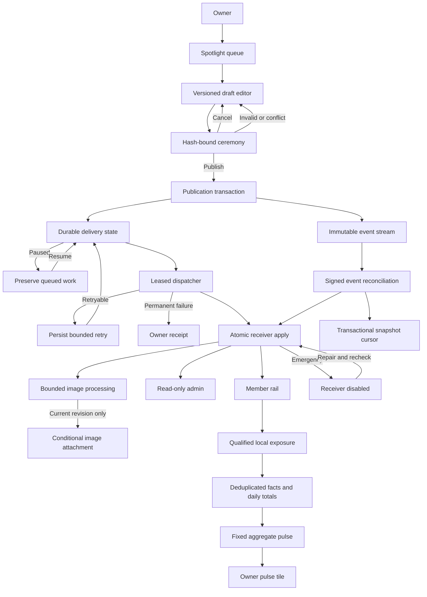

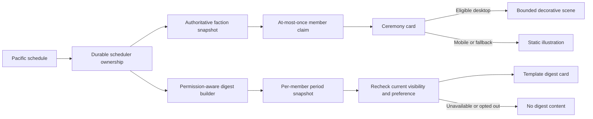

**API sequences**

Each sequence identifies a distinct HTTP interaction. Validation, errors and transaction details are normative in `03-contracts.md`.

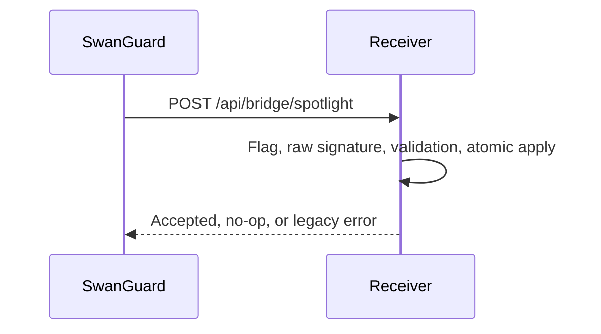

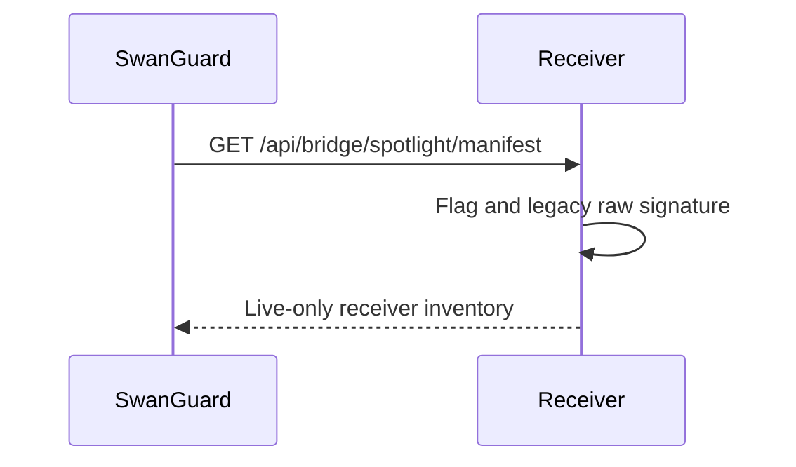

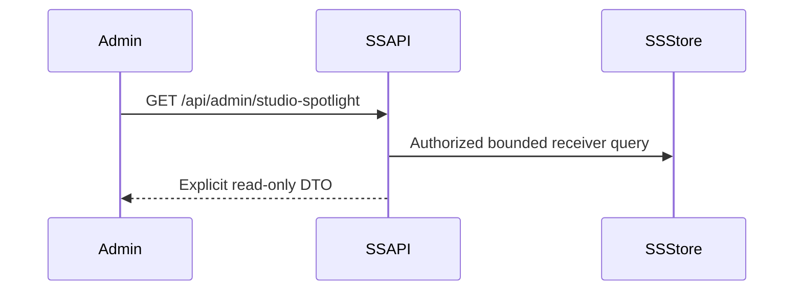

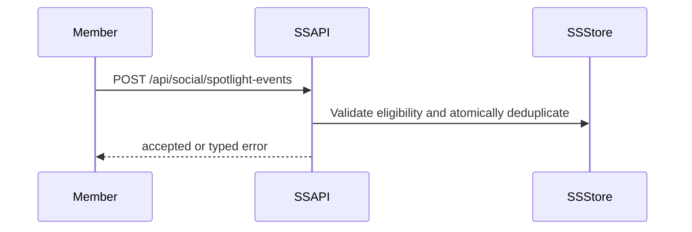

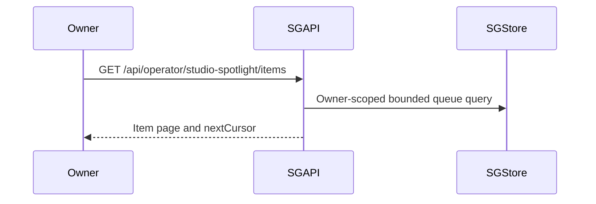


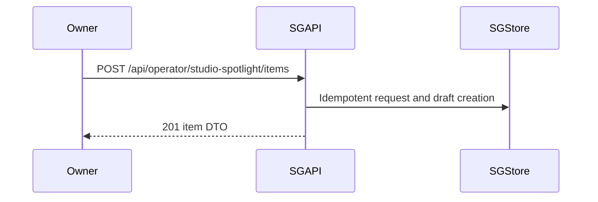

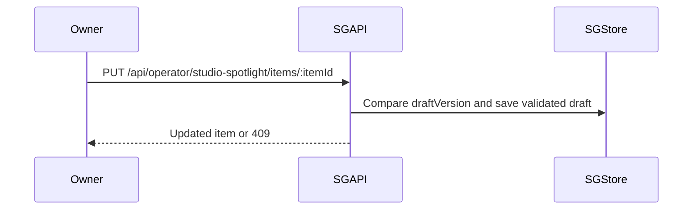

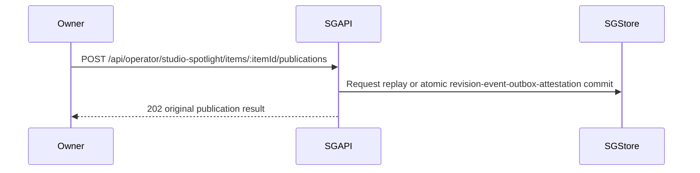

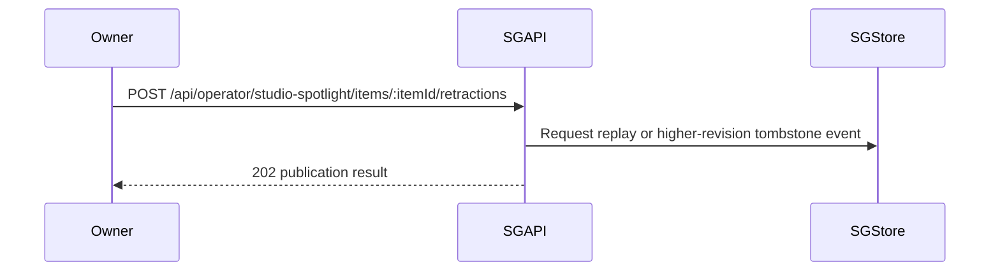

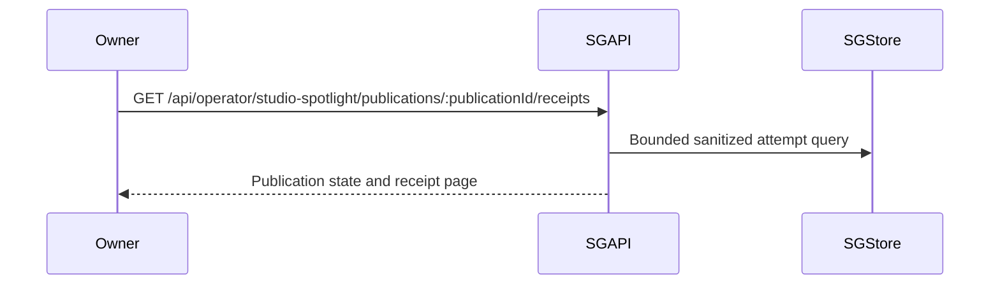

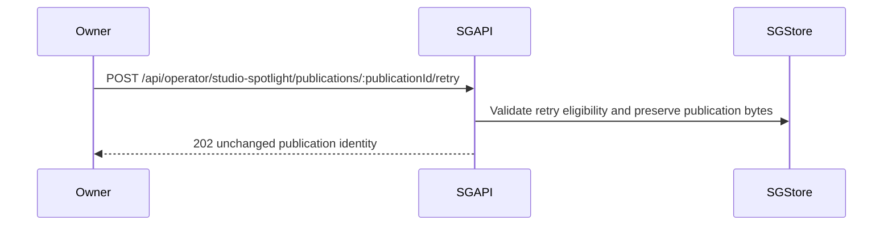

```mermaid
sequenceDiagram
    Owner->>SGAPI: Existing owner kill-switch request
    SGAPI->>SGStore: Existing verified switch persistence
    SGAPI-->>Owner: Existing verified switch DTO
    Note over Owner,SGStore: Exact path and DTO remain U07; no invented endpoint
```

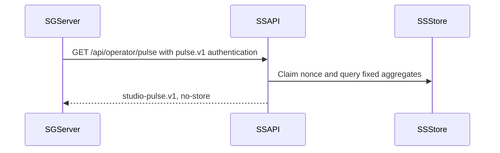

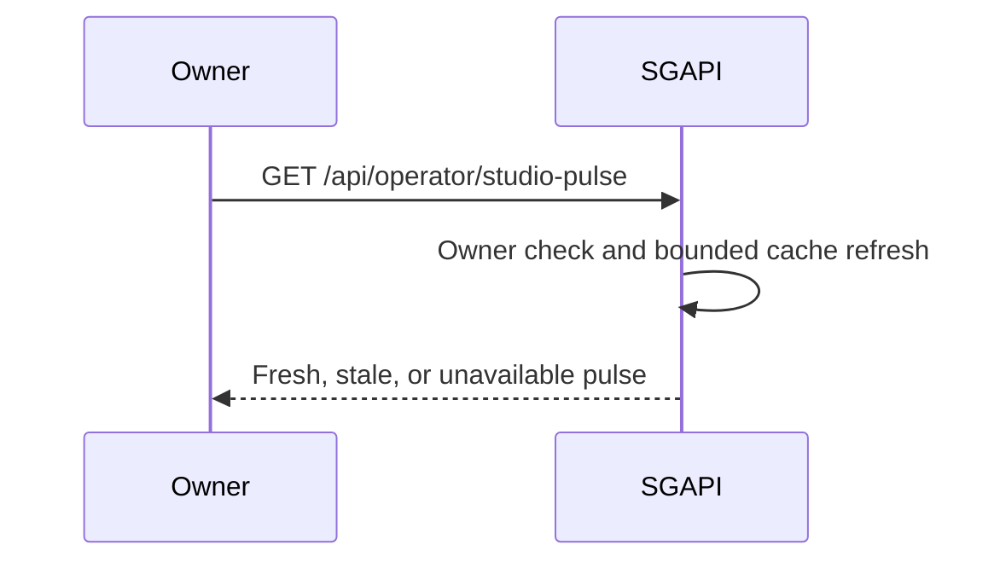

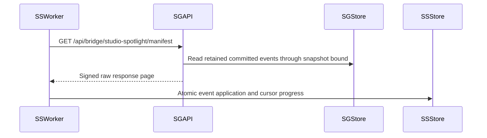

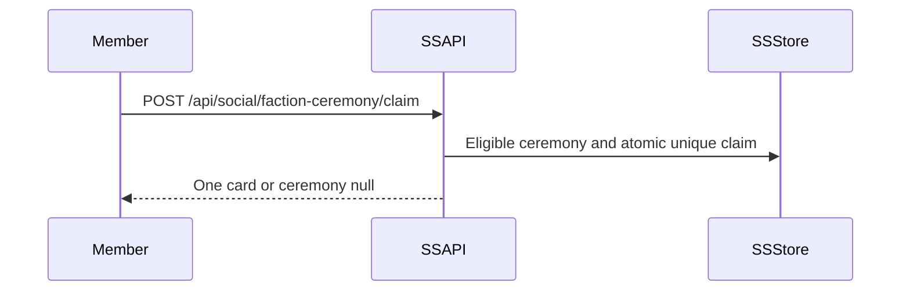

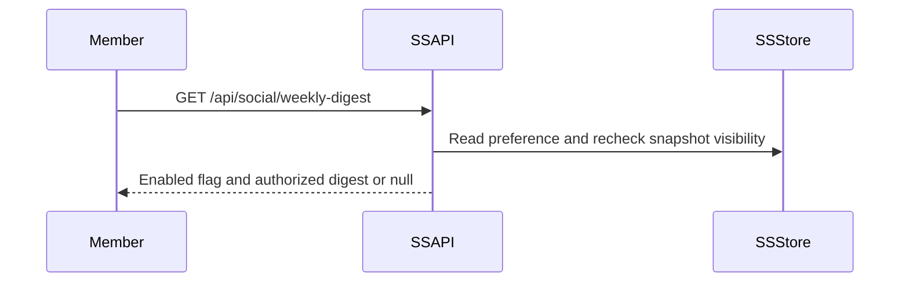

```mermaid
sequenceDiagram
    Member->>SSAPI: PUT /api/social/weekly-digest/preference
    SSAPI->>SSStore: Persist authenticated member preference
    SSAPI-->>Member: Current enabled flag
```

**State machines**

```mermaid
stateDiagram-v2
    [*] --> Draft
    Draft --> Reviewed: Current version and hash attested
    Reviewed --> Draft: Content changes or cancel
    Reviewed --> Queued: Atomic publication commit
    Queued --> Paused: Publishing disabled
    Paused --> Queued: Explicit resume
    Queued --> InFlight: Valid lease and send gate
    InFlight --> Delivered: Valid accepted or no-op response
    InFlight --> RetryWait: Retryable failure
    RetryWait --> Queued: Persisted due time
    InFlight --> Failed: Permanent or exhausted
    Failed --> Queued: Audited eligible requeue
```

```mermaid
stateDiagram-v2
    [*] --> Unqualified
    Unqualified --> Timing: At least 50 percent visible and tab visible
    Timing --> Unqualified: Visibility interrupted
    Timing --> Recording: Continuous 1000 ms
    Recording --> Qualified: Server accepts impression
    Recording --> Unqualified: Request fails or day changes
    Qualified --> Dismissed: Accepted same-day dismissal
    Qualified --> Unqualified: Revision or Pacific day changes
    Unqualified --> LocalDismissed: Early dismissal
```

**Exact supplied receiver schema and proposed independent bridge tables**

SQL type spellings below define target migrations. Existing receiver columns come from G0-2. Proposed tables are not claimed to exist.

```mermaid
erDiagram
    SwanSpotlights {
        varchar_36 itemId PK
        integer revision
        boolean retracted
        varchar_80 headline
        varchar_200 dek
        text imageUrl
        varchar_80 sourceName
        text sourceUrl
        varchar_140 curatorNote
        integer sortWeight
        timestamptz publishedAt
        timestamptz expiresAt
        varchar_64 gateHash
        timestamptz createdAt
        timestamptz updatedAt
        varchar_12 imageState
    }
    StudioSpotlightItems ||--o{ SpotlightPublications : publishes
    SpotlightPublications ||--|| BridgeSpotlightDeliveries : delivers
    SpotlightPublications ||--o{ BridgeSpotlightAttempts : records
    SpotlightPublications ||--|| SpotlightAttestations : attests
    StudioSpotlightItems {
        varchar_36 itemId PK
        integer draftVersion
        integer currentRevision
        jsonb validatedDraft
        char_64 draftSha256
        timestamptz createdAt
        timestamptz updatedAt
    }
    SpotlightPublications {
        integer id PK
        varchar_36 itemId FK
        integer revision
        bigint sequence UK
        uuid requestId UK
        char_64 commandSha256
        bytea payloadBytes
        char_64 payloadSha256
        timestamptz createdAt
    }
    BridgeSpotlightDeliveries {
        integer publicationId PK,FK
        varchar_16 state
        integer attemptCount
        timestamptz nextAttemptAt
        uuid leaseToken
        timestamptz leaseUntil
        timestamptz updatedAt
    }
    BridgeSpotlightAttempts {
        integer id PK
        integer publicationId FK
        integer attemptNumber
        varchar_20 outcomeCode
        integer httpStatus
        timestamptz startedAt
        timestamptz finishedAt
    }
    SpotlightAttestations {
        integer publicationId PK,FK
        text ownerKey
        jsonb checks
        char_64 draftSha256
        timestamptz createdAt
    }
    BridgeStreamState {
        integer id PK
        bigint lastSequence
    }
    BridgeConsumerState {
        varchar_40 consumer PK
        bigint afterSequence
        bigint throughSequence
        timestamptz updatedAt
    }
    BridgeRequestNonces {
        varchar_40 purpose PK
        varchar_16 keyVersion PK
        char_32 nonce PK
        timestamptz expiresAt
    }
```

`imageState` is the sole proposed addition shown on `SwanSpotlights`; its migration is required before use. Actual PostgreSQL timestamp mappings remain U02 until checked against the complete migration.

**Intentionally unresolved physical schemas:** `CoachSignals` canonical foreign-key types; exposure/member keys; ceremony claims; digest/member keys. Their exact column lists and constraints are specified in `03-contracts.md`, but physical user/faction key types remain U01/U13. They are excluded from the ERD rather than labeled with invented types. Their migrations are blocked.

Diagram rendering and syntax validation: NOT RUN in this session.

### 02-wireframes.md

# Screen layouts, copy and interaction states

**Viewports:** desktop 1440×900; mobile 375×812. Additional verification: 414px, 768px, 2560×1440 and 3840×2160.

**Exact semantic tokens**

```css
--studio-bg: var(--midnight-sapphire, #002060);
--studio-surface: var(--obsidian-black, #0A0A0F);
--studio-text: var(--frost-white, #E0ECF4);
--studio-editorial: var(--ice-wing, #60C0F0);
--studio-earned: var(--gilded-fern, #C6A84B);
--studio-muted: var(--swan-lavender, #4070C0);
```

Use Frost White for body/status text; do not assume `--studio-muted` meets text contrast. Editorial focus outlines use `--studio-editorial`. Gold is restricted to earned recognition. No purple is introduced on these surfaces.

Every control has a minimum 44×44 CSS-pixel target. No horizontal document scrolling. Dialogs trap focus, support labeled close buttons, and restore focus to the invoker. Pending writes prevent duplicate submission but preserve readable status.

**Operator queue — `/operator/studio-spotlight`**

```text
DESKTOP 1440x900
+-----------------------------------------------------------------------+
| Studio Spotlight                        [Pause publishing] [Refresh]  |
| Publishing active                                                     |
+--------------------------+--------------------------------------------+
| [All statuses       v]   | Select an item to review its draft and     |
| [Search items        ]   | delivery state.                            |
| [New draft]              |                                            |
| Queue                    |                                            |
| [Garden harvest      >]  |                                            |
| Delivered · Revision 2   |                                            |
+--------------------------+--------------------------------------------+

MOBILE 375x812
+-------------------------------------+
| Studio Spotlight                    |
| Publishing active                   |
| [Pause publishing] [Refresh]        |
| [All statuses                    v] |
| [Search items                     ] |
| [New draft]                         |
| Queue                               |
| [Garden harvest                  >] |
| Delivered · Revision 2              |
+-------------------------------------+
```

Selecting an item opens `/operator/studio-spotlight/items/:itemId`. Desktop may retain the queue beside detail; mobile uses a separate full-width detail view.

**Item editor**

```text
DESKTOP
+-----------------------------------------------------------------------+
| [Back to queue]                     Draft version 3 · Revision 2       |
| Headline [                                                        ]   |
| Editorial summary [                                               ]   |
| Curator note [                                                    ]   |
| Image URL [                                                       ]   |
| Source name [                    ] Source URL [                   ]   |
| Publish time [                   ] Expiry time [                   ]   |
| Sort weight [1]                                                       |
| Member preview                                                        |
| +-------------------------------------------------------------------+ |
| | Positive perspective                                               | |
| | Garden harvest                                                     | |
| | Editorial summary                                                  | |
| +-------------------------------------------------------------------+ |
| [Save draft] [Review for publishing] [Retract from SwanStudios]         |
| Delivery receipts                                  [Load receipts]   |
+-----------------------------------------------------------------------+

MOBILE
+-------------------------------------+
| [Back to queue]                     |
| Draft version 3 · Revision 2         |
| Headline                            |
| [                                 ] |
| Editorial summary                   |
| [                                 ] |
| Curator note                        |
| [                                 ] |
| Image URL                           |
| [                                 ] |
| Source name                         |
| [                                 ] |
| Source URL                          |
| [                                 ] |
| Publish time [                    ] |
| Expiry time [                     ] |
| Sort weight [1]                     |
| Member preview                      |
| Positive perspective                |
| Garden harvest                      |
| Editorial summary                   |
| [Save draft]                        |
| [Review for publishing]             |
| [Retract from SwanStudios]           |
| Delivery receipts                   |
| [Load receipts]                     |
+-------------------------------------+
```

Datetime controls display `America/Los_Angeles`; convert to explicit UTC instants. Invalid/nonexistent local times require correction; ambiguous times require choosing the displayed offset. Blank means null. URL controls never render remote images directly in operator previews; use a text placeholder until a permitted preview mechanism is verified.

**Publication and retraction dialogs**

```text
DESKTOP MODAL / MOBILE FULL SCREEN
+-------------------------------------+
| Review for publishing       [Close] |
| Confirm every statement.            |
| [ ] No politics                     |
| [ ] No negativity or ragebait       |
| [ ] Image rights cleared            |
| [ ] Headline is in Sean's voice     |
| Publishing sends this preview       |
| to SwanStudios.                     |
| [Cancel] [Publish to SwanStudios]    |
+-------------------------------------+

+-------------------------------------+
| Retract Spotlight           [Close] |
| Remove this item from SwanStudios?  |
| [Cancel] [Retract item]              |
+-------------------------------------+
```

All four checks bind to the displayed saved draft hash/version. Unsaved changes disable publication. Any edit or conflict clears checks. Retraction uses the latest accepted editorial payload with a higher revision; it does not publish unsaved edits.

**Delivery receipts**

```text
DESKTOP
| Delivery receipts | Revision 2 | Delivered |
| Attempt | Outcome      | Completed               |
| 1       | Accepted     | Sep 21, 9:00 AM Pacific  |
| [Load more]                                      |

MOBILE
+-------------------------------------+
| Delivery receipts                   |
| Revision 2 · Delivered              |
| Attempt 1                           |
| Accepted                            |
| Sep 21, 9:00 AM Pacific              |
| [Load more]                         |
+-------------------------------------+
```

Retry appears only for an eligible failed latest publication. Exact label: `[Retry delivery]`. Pending label: `Retry queued.` Old superseded publications display `A newer revision exists.` with no retry control.

**SwanStudios admin — `/admin/studio-spotlight`**

```text
DESKTOP
+-----------------------------------------------------------------------+
| Studio Spotlight                                           [Refresh] |
| Spotlight disabled · Live items: 0                                   |
| Headline       | Revision | Visibility | Image    | Received           |
| Garden harvest | 2        | Disabled   | Hosted   | Sep 21, 9:00 AM    |
| Receiver receipt unavailable                                         |
| [Load more]                                                          |
+-----------------------------------------------------------------------+

MOBILE
+-------------------------------------+
| Studio Spotlight          [Refresh] |
| Spotlight disabled                  |
| Live items: 0                       |
| Garden harvest                      |
| Revision 2 · Disabled               |
| Image: Hosted                       |
| Received: Sep 21, 9:00 AM Pacific    |
| Receiver receipt unavailable        |
| [Load more]                         |
+-------------------------------------+
```

No publishing, editing, deleting or secret controls. Existing receiver rows remain inspectable when disabled.

**Pulse tile**

```text
DESKTOP / MOBILE STACKED CARD
+-------------------------------------+
| Studio Pulse              [Refresh] |
| Updated 2 minutes ago               |
| Spotlight active                    |
| Live items: 3                       |
| Impressions: 240                    |
| Dismissal rate: 25%                 |
| Placement review not needed         |
+-------------------------------------+
```

Suppressed values use `—`, never `0`. Exact suppression copy: `Not enough activity to assess placement.` Alert copy: `Review Spotlight placement.`

**Faction ceremony**

```text
DESKTOP RIGHT RAIL                    MOBILE 375px
+--------------------------------+   +-------------------------------------+
| This week's faction honors     |   | This week's faction honors           |
| [bounded decorative scene]     |   | [static crystal illustration]        |
| Winner: Winning faction        |   | Winner: Winning faction              |
| MVP unavailable                |   | MVP unavailable                      |
| Next week: resolved modifier   |   | Next week: resolved modifier         |
| [Continue]                     |   | [Continue]                           |
+--------------------------------+   +-------------------------------------+
```

Claim/loading/empty/error renders no placeholder card. A failed request records a sanitized local diagnostic. Never retry a claim automatically after an ambiguous response loss.

**Weekly digest**

```text
DESKTOP / MOBILE STACKED CARD
+-------------------------------------+
| Your week at SwanStudios             |
| XP earned: 120                      |
| Current streak: 4 days              |
| Friend highlight                    |
| A friend completed a challenge.     |
| Faction rank: 2                     |
| [Read Spotlight]                    |
| Weekly digest [On]                  |
+-------------------------------------+
```

Do not render missing values as zero. Omit absent friend/Spotlight blocks. Names resolve only through the authorized client resolver.

**Complete state placement**

Each replacement below occupies the content region of the corresponding desktop/mobile frame; it retains that frame’s heading and permitted navigation.

| Surface/state | Exact content and controls |
|---|---|
| Queue loading | `Loading Studio Spotlight...` |
| Queue empty | `No items in this queue.` `Save a draft to get started.` `[New draft]` |
| Queue filtered empty | `No items match these filters.` `[Clear filters]` |
| Editor loading | `Loading draft...` |
| Editor invalid | Field error plus `Check the highlighted fields.` |
| Editor saved | `Draft saved.` |
| Editor conflict | `This item changed. Reload before publishing.` `[Reload item]` |
| Editor missing | `This item is no longer available.` `[Back to queue]` |
| Publication pending | `Publishing...` |
| Publication accepted | `Publication queued.` |
| Publication ambiguous | `Delivery confirmation is unavailable. Check publication status.` `[Check status]` |
| Retraction pending/success | `Queueing retraction...` / `Retraction queued.` |
| Publishing paused | `Publishing paused. Queued items will not be sent.` `[Resume publishing]` |
| Owner access denied | `Owner access is required.` |
| Admin denied | `Admin access is required.` |
| Expired session | `Your session expired. Sign in again.` `[Sign in]` |
| Admin loading/empty/error | `Loading receiver items...` / `No Spotlight items received.` / `Receiver items could not load.` `[Try again]` |
| Image state | `No image`, `Processing image`, `Hosted`, or `Image unavailable` |
| Receipts loading/empty/error | `Loading delivery receipts...` / `No delivery attempts yet.` / `Delivery receipts could not load.` `[Try again]` |
| Pulse loading/unavailable | `Loading Studio Pulse...` / `Studio Pulse is unavailable.` `[Try again]` |
| Pulse stale | `Studio Pulse is out of date.` Keep timestamp and last verified values. |
| Digest loading/empty/error | `Loading your weekly digest...` / `Your next weekly digest is on its way.` / `Your weekly digest could not load.` `[Try again]` |
| Digest off | `Weekly digest is off.` `[Turn on weekly digest]` |
| Preference pending/error | `Saving preference...` / `Preference could not be saved.` Restore server-confirmed toggle value. |

Errors preserve unsaved local draft content. Conflict reload must first offer `Copy unsaved draft` and `Discard and reload`; no silent overwrite. Status messages use a polite live region; validation summaries receive focus.

**Scene limits:** ceremony only; ≤24 shards; 2.5 seconds; ≤30 fps; DPR ≤1.5; ≤180 KiB gzip incremental chunk; zero Three.js bytes in initial social chunk. Below 600px, reduced motion, Save-Data, hidden tab, unavailable WebGL or known low memory: static illustration and no initial Three.js import. Dispose resources on unmount/context loss.

### 03-contracts.md

# Contracts, migrations and recovery

**Status:** normative target contracts; missing canonical integration inputs remain blocked.

**A. Common rules**

New endpoints reject unknown request keys and serialize allowlisted response fields. IDs introduced as integer surrogate keys are decimal strings in APIs. `itemId` remains a 36-character UUID string generated by SwanGuard for new items. Existing receiver IDs are not rewritten.

Common error body:

```json
{"error":{"code":"INVALID_REQUEST","message":"Request is invalid."}}
```

| Status | Code | Exact message |
|---|---|---|
| 400 | INVALID_REQUEST | Request is invalid. |
| 401 | UNAUTHORIZED | Authentication required. |
| 403 | FORBIDDEN | This action is not permitted. |
| 404 | NOT_FOUND | Item not found. |
| 409 | REVISION_CONFLICT | This item changed. Reload and try again. |
| 409 | REQUEST_CONFLICT | This request identifier was already used. |
| 409 | IMPRESSION_REQUIRED | Record an impression before dismissal. |
| 409 | PUBLICATION_SUPERSEDED | A newer revision exists. |
| 413 | PAYLOAD_TOO_LARGE | Request is too large. |
| 429 | RATE_LIMITED | Too many requests. Try again later. |
| 500 | INTERNAL_ERROR | The request could not be completed. |
| 503 | PUBLISHING_PAUSED | Publishing is paused. |
| 503 | FEATURE_DISABLED | This feature is disabled. |
| 503 | UPSTREAM_UNAVAILABLE | Studio Pulse is unavailable. |

These do not silently replace existing bridge/coach error formats. Existing authentication middleware compatibility remains U06/U07.

**B. Legacy bridge and R1 repair**

Paths, header names, secret selection, signature construction and default-off flag stay unchanged.

```text
POST /api/bridge/spotlight
GET  /api/bridge/spotlight/manifest
X-Swan-Timestamp: ISO timestamp
X-Swan-Signature: sha256=<hex>
SWAN_BRIDGE_SECRET_V1: server-side secret, minimum 32 characters
canonical input: timestamp + "." + rawBody.toString("utf8")
```

This is the supplied UTF-8 canonicalizer. Do not claim arbitrary binary byte identity. Publisher payloads must be valid UTF-8 JSON and signed from the exact bytes sent.

R1 repair decisions:

1. Run the feature gate before route parsing. Disabled requests return the existing 503 object without querying storage or fetching an image.
2. Enabled POST retains a 256 KiB parser ceiling. Enabled legacy GET permits signed raw bytes within that ceiling; an absent body signs the empty Buffer.
3. Distinguish absent body from an unavailable body already consumed upstream. The latter returns the existing `RAW_BODY_UNAVAILABLE` failure.
4. Compression/encoding acceptance must match an explicitly tested installed-parser contract; U05 blocks claims about unsupported combinations.
5. Preserve existing success/no-op JSON shapes.
6. Preserve image failure as successful text-only ingestion.
7. Legacy GET remains a live-only inventory. Do not add S7 cursor or nonce semantics to it.

**Receiver validation repair — explicit compatibility change**

Retain truncation of human-readable copy for legacy compatibility. Reject:

- Nonstring, empty, untrimmed or over-36-character `itemId`.
- Revision outside integer range `1..2147483647`.
- Present `retracted` that is not boolean.

Use the validated value consistently for lookup and persistence. Rejection uses legacy 422 `{success:false,message:<reason>}`. Exact new messages:

- `itemId must be a trimmed string of 1 to 36 characters.`
- `revision must be an integer from 1 to 2147483647.`
- `retracted must be a boolean.`

This narrowing requires fixture compatibility review before release. No claim that it was already the shipped validator.

**Atomic revision application**

Text/tombstone state commits before optional image processing. Insert conflicts and higher-revision updates are handled through one storage operation whose update predicate is `stored.revision < incoming.revision`.

- Equal/lower revision: valid no-op, no image fetch.
- Higher retraction: preserve retained URL; mark row retracted.
- Higher non-retraction with no incoming image: preserve current stored image/state.
- Higher non-retraction with an incoming image: commit `imageUrl=null,imageState="pending"`; process image after commit.
- Success attachment: update only where item ID and revision still match and `retracted=false`.
- Failure attachment: same predicate, `imageUrl=null,imageState="degraded"`.
- Superseded attachment: no row change. Sanitized diagnostic only.
- Interrupted pending image: a bounded recovery job marks pending state degraded after ten minutes, conditional on the same revision. It does not re-fetch an unrecorded source URL.
- Reconciliation replays do not repeat completed image work.

Returned acceptance refers to the accepted revision, not a promise that it remains the latest after the response.

**Coach quota**

Preserve five signals per **UTC** day, nullable `postId`, existing role/assignment rules and non-null coach/post uniqueness.

Use a transaction-scoped, database-held lock keyed by normalized coach identity. Within that transaction:

1. Acquire coach lock.
2. Recheck target eligibility and duplicate.
3. Count successful rows since UTC midnight.
4. Return 429 when count is already five.
5. Insert signal; commit.
6. Send optional notification after commit.

An insert failure rolls back the transaction; it cannot consume quota. Duplicate violation maps to 409. All signal writers must use this boundary; U03 blocks that completeness claim.

A PostgreSQL advisory transaction lock is the selected design; collisions may serialize unrelated coaches but must never permit excess admission. No new quota counter table or backfill is required.

**C. SwanStudios administration**

`GET /api/admin/studio-spotlight?limit=20&cursor=<opaque>`; admin authentication; limit 1–50.

```ts
type StudioSpotlightAdminPage = {
  enabled: boolean;
  liveCount: number;
  items: {
    itemId: string;
    revision: string;
    title: string;
    receivedAt: string;
    visibility: "live" | "disabled" | "expired" | "retracted";
    imageState: "none" | "pending" | "hosted" | "degraded";
    receiptId: null;
  }[];
  nextCursor: string | null;
};
```

List current receiver rows, including expired/retracted/disabled rows; sort `updatedAt DESC,itemId ASC`. Cursor includes both ordering values and is validated. `receivedAt=updatedAt` is explicitly a receiver-update timestamp, not publisher delivery proof.

Visibility precedence: retracted → expired → disabled → live. Expiry boundary is `expiresAt <= now`. `liveCount=0` when disabled. Otherwise use the same verified eligibility predicate as the rail; final mount/query equivalence remains U04.

Do not expose source URLs, gate hashes, raw ORM objects or publisher receipts.

**D. Measurement and pulse**

`POST /api/social/spotlight-events`; member authentication; applicable CSRF; 4 KiB body; 60 requests/member/minute.

```json
{"itemId":"22222222-2222-4222-8222-222222222222","revision":"1","event":"impression"}
```

Success for accepted/duplicate: `{"accepted":true}`.

Qualification: at least 50% visible for 1,000 continuous milliseconds while the document is visible. Server authentication establishes actor identity; browser visibility reports are not fraud-proof evidence.

Uniqueness: `(userId,itemId,revision,localDate)`, with Pacific date derived by the server. Dismissal requires a same-day stored impression; otherwise 409. A prequalification dismissal remains local only. On day/revision change, clear qualification and require a new interval. A transport retry may cross midnight; do not reinterpret a stale queued event as a new exposure.

Storage updates the fact and corresponding daily total atomically. Duplicate events add nothing. Maintain `dismissals <= impressions` per daily total. Retain facts 35 days, then delete facts only; preserve identifier-free totals.

`GET /api/operator/pulse`; server-to-server only; TLS; no query parameters.

```text
X-Swan-Timestamp: integer Unix seconds
X-Swan-Nonce: 32 lowercase hex characters
X-Swan-Signature: sha256=<hex>
HMAC key: SWAN_PULSE_SECRET_V1
input, without trailing newline:
pulse.v1
<timestamp>
<nonce>
GET
/api/operator/pulse
```

Skew ±300 seconds. After valid authentication, atomically reserve nonce for ten minutes in shared storage. Replay rejection cannot use an in-memory-only cache.

Response retains `studio-pulse.v1`, `generatedAt`, seven fully closed Pacific days, and exactly:

```ts
type PulseSpotlight = {
  enabled: boolean;
  liveItems: number;
  impressions: number | null;
  dismissals: number | null;
  dismissalRate: number | null;
  placementReviewRequired: boolean;
};
```

Under 20 impressions: suppress counts/rate; alert false. At 20–99: counts/rate, alert false. At ≥100: alert iff unrounded ratio exceeds 0.40. Serialize rate to four decimal places. `Cache-Control:no-store`.

`GET /api/operator/studio-pulse`: SwanGuard owner proxy. Refresh cache after 60 seconds; one refresh in flight. Failed refresh with cached value returns 200 stale; no cached value returns 503. Any cached value older than five minutes is stale, even without a new failure.

**E. Publisher DTOs and transaction**

Owner only. Cookie mutations use verified SwanGuard CSRF. No raw newsroom/story object is accepted or returned.

```ts
type EditorialDraft = {
  headline: string;             // 1..80 trimmed characters
  dek: string | null;           // 1..200 when present
  curatorNote: string | null;   // 1..140 when present
  imageUrl: string | null;      // HTTPS, no credentials, <=2048
  sourceAttribution: {name: string | null; url: string | null};
  sortWeight: number;           // signed 32-bit integer
  publishedAt: string | null;   // canonical UTC ISO instant
  expiresAt: string | null;     // canonical UTC ISO instant
};
```

Reject overlength publisher content; do not silently truncate it. If both dates exist, expiry must follow publication. Source URL permits HTTPS only without credentials. Browser does not fetch submitted URLs.

Draft hashing uses a single fixed-key-order serializer. No omitted optional keys; use null. Hash UTF-8 bytes with SHA-256. Outgoing payload includes the receiver’s `itemId`, numeric `revision`, `retracted`, editorial fields and `gate.checklistHash`; never `summary`.

```ts
type StudioSpotlightItem = {
  itemId: string;
  draftVersion: string;
  currentRevision: string;
  draftSha256: string;
  draft: EditorialDraft;
  state: "draft" | "queued" | "in_flight" | "retry_wait" |
         "paused" | "delivered" | "failed";
  updatedAt: string;
};
```

Prefix `/api/operator/studio-spotlight`:

| Method/path | Body/query | Result |
|---|---|---|
| GET `/items` | `status`, `q` ≤100 chars, limit 1–50, cursor | `{items:StudioSpotlightItem[],nextCursor}` |
| GET `/items/:itemId` | None | `StudioSpotlightItem` |
| POST `/items` | `{requestId,draft}` | 201 item; replay returns original item creation identity |
| PUT `/items/:itemId` | `{expectedDraftVersion,draft}` | 200 updated item |
| POST `/items/:itemId/publications` | `{requestId,expectedRevision,expectedDraftVersion,draftSha256,checks}` | 202 publication result |
| POST `/items/:itemId/retractions` | `{requestId,expectedRevision}` | 202 publication result |
| GET `/publications/:publicationId/receipts` | limit 1–50, cursor | Publication state and bounded receipt page |
| POST `/publications/:publicationId/retry` | `{requestId}` | 202 original publication identity |

`requestId` is a UUID generated once per user action and retained across transport retries. Server stores a fingerprint of the complete normalized command. Same ID/same fingerprint returns the original result; same ID/different fingerprint returns `REQUEST_CONFLICT`.

Publication checks are exactly the four true booleans named in the supplied package. Under one transaction, verify owner, current versions/hash and pause state; allocate bounded integer revision; lock the stream-counter row; allocate sequence; write immutable payload, attestation and delivery row. Commit before returning 202.

```json
{"publicationId":"1","itemId":"22222222-2222-4222-8222-222222222222","revision":"1","state":"queued"}
```

Retraction copies the latest published payload, increments revision and sets `retracted:true`. An unpublished item cannot be retracted. Retry never changes payload/revision or reapplies older content. Superseded publication retry returns 409.

**F. Delivery, authentication and reconciliation**

One active delivery per item. Lease 60 seconds; network request deadline 10 seconds. Every bookkeeping completion requires the current lease token. Stale workers can still have sent a request; receiver monotonicity provides final protection.

One initial attempt plus six retries, after 30, 120, 600, 1,800, 7,200 and 21,600 seconds respectively, plus persisted deterministic 0–20% positive jitter. Bound total delay to six hours when honoring `Retry-After`.

Retry network failures, timeout, 408, 429 and 5xx. Other 4xx are permanent. A 503 counts as receiver-disabled pause only when status and the **exact parsed legacy disabled body** match; arbitrary 503s are retryable.

Validate successful response identity/revision and success shape before recording acceptance. A 200 with malformed JSON is not acceptance.

Publisher event manifest:

```text
GET /api/bridge/studio-spotlight/manifest?after=0&through=&limit=100
```

Canonical query order is fixed; reject duplicates, unknown keys and alternate ordering. `after/through` are bounded nonnegative decimal strings. Initial request captures committed `through`; subsequent pages retain it. Sequences are strictly increasing and never exceed `through`.

Request input:

```text
manifest.request.v1
<Unix-seconds timestamp>
<nonce>
GET
<exact path and canonical query>
```

Use `SWAN_BRIDGE_SECRET_V1`, the existing timestamp/signature header names, and `X-Swan-Nonce`. This is a **new endpoint contract**, not a change to legacy signing.

Response:

```json
{"schema":"studio-spotlight-manifest.v1","through":"0","nextAfter":"0","hasMore":false,"events":[]}
```

Each event has exactly `sequence,payloadBase64,payloadSha256`. Retractions remain indefinitely. Body ≤1 MiB; ≤100 events. Never skip an oversized event. Reject nonprogressing pages and nonmonotonic sequences.

Response signature input consists of `manifest.response.v1`, response timestamp, request nonce and exact response bytes, separated by newlines. Echo the request nonce; enforce timestamp skew before parsing verified bytes.

Receiver persists both `afterSequence` and `throughSequence`. Apply a page’s text/tombstone state and cursor atomically; start conditional image work after commit. On any invalid event, commit neither page nor cursor. No polling/application/cursor advance while disabled. Hourly at minute 17, startup catch-up, at most 20 pages/run.

**G. Ceremony and digest**

Ceremony claim remains `POST /api/social/faction-ceremony/claim {}`. Response is `{"ceremony":null}` or:

```ts
type FactionCeremonyDTO = {
  id: string; opensAt: string; closesAt: string;
  winnerFactionId: string; mvpUserId: string | null; modifierCode: string;
};
```

Use integer surrogate ID serialized as decimal string. Canonical faction/user ID conversion remains U01/U13. Window: Monday 09:00 inclusive through Tuesday 09:00 exclusive, Pacific. Unique claim per ceremony/member; at-most-once response, not guaranteed viewing.

Digest remains in-app only, Sunday 18:00 Pacific, prior Sunday 18:00 inclusive to current boundary exclusive. Unique `(userId,periodEnd)`. Default off unless an existing explicit preference establishes otherwise.

`GET /api/social/weekly-digest` returns `{enabled,digest}`; digest contains exactly the supplied fields with decimal-string `id`, nullable `friendHighlight`, nullable `factionRank`, and nullable `spotlightItemId`. Missing authoritative data must remain null or suppress generation according to the adapter contract; never fabricate zeros.

`PUT /api/social/weekly-digest/preference {"enabled":boolean}` returns `{"enabled":boolean}`. Recheck preference, friendship, challenge visibility and Spotlight eligibility on read. No email, push, model, embedding or external generation call.

**H. Storage and migrations**

- SS migrations: top-level `backend/migrations/`.
- SG migrations: `packages/database/migrations/`, using its verified transactional runner and final naming convention from U08.
- New integer surrogate IDs use auto-increment semantics; FKs exactly match parent types.
- `SwanSpotlights.imageState`: `VARCHAR(12) NOT NULL`, CHECK `none|pending|hosted|degraded`. Backfill URL present → hosted, otherwise none.
- `SpotlightPublications`: unique `(itemId,revision)`, unique sequence, unique request ID; immutable after commit.
- `BridgeSpotlightAttempts`: unique `(publicationId,attemptNumber)`.
- Stream-counter row: singleton `id=1`; lock within publication transaction.
- Creation-request replay needs a separate `StudioSpotlightCommands(requestId UUID PK,commandSha256 CHAR(64),itemId VARCHAR(36),createdAt TIMESTAMPTZ)` record, atomically committed with draft creation.
- Exposure facts: `id INTEGER`, canonical `userId`, `itemId VARCHAR(36)`, `revision INTEGER`, `localDate DATE`, `impressedAt TIMESTAMPTZ`, nullable `dismissedAt TIMESTAMPTZ`; unique exposure tuple.
- Daily totals: `localDate DATE PK,impressions BIGINT,dismissals BIGINT,updatedAt TIMESTAMPTZ`; nonnegative counts and dismissals ≤ impressions.
- Ceremony: integer ID, unique `weekStart DATE`, open/close instants, validated presentation JSON.
- Claims: canonical member key plus integer ceremony FK as composite key, claim timestamp.
- Digest preferences: canonical member key PK, enabled boolean, updated timestamp.
- Digests: integer ID, canonical member key, period end, validated template JSON, created timestamp; unique member/period.
- Scheduler ledger: job name and scheduled instant composite key, lease token/expiry, completion timestamp.

Complete ORM declarations for user/faction-dependent tables await U01/U13. Do not substitute guessed types. No migration is approved merely because this table lists its columns.

**I. Service interfaces**

Use typed JSDoc for `.mjs`, TypeScript types for `.ts`; no `any`.

```ts
publishStudioSpotlight(input: PublishInput, context: OwnerContext):
  Promise<PublicationResult>;
dispatchBridgeSpotlight(publicationId: string, deps: DispatchDependencies):
  Promise<DispatchResult>;
applyBridgeSpotlight(input: ValidatedSpotlight, deps: ApplyDependencies):
  Promise<AcceptedResult | NoopResult>;
reconcileBridgeSpotlight(deps: ReconcileDependencies):
  Promise<{applied: number; cursor: string}>;
recordSpotlightEvent(actor: MemberContext, input: SpotlightEvent, deps: MeasurementDependencies):
  Promise<{accepted: true}>;
buildStudioPulse(now: Date, deps: PulseDependencies):
  Promise<StudioPulseV1>;
claimFactionCeremony(actor: MemberContext, now: Date, deps: CeremonyDependencies):
  Promise<FactionCeremonyDTO | null>;
buildWeeklyDigest(actor: MemberContext, periodEnd: Date, deps: DigestDependencies):
  Promise<WeeklyDigestDTO | null>;
```

Dependency contracts must expose transaction ownership, conditional writes, authoritative adapters and clocks explicitly. Concrete runtime imports remain gated by the excerpt checklist in `04-build-order.md`.

**J. Environment and rollback**

Existing `SPOTLIGHT_ENABLED` remains exact-string true and defaults off. Existing bridge secret remains server-side. New pulse secret is server-side only. No database URL, token, secret value or private host is added to this package.

On failure: disable receiver, pause publisher, preserve all events/tombstones/cursors/receipts. Roll application code forward or back without dropping those records. Reverse migrations are not an emergency rollback plan. Stop digest jobs while retaining preferences; force static ceremony rendering without altering claims.

### 04-build-order.md

# Bounded implementation inventory

**Maximum:** 299 lines per source/test file. Extract focused helpers when necessary; do not minify to meet the budget.

All paths below are targets, not evidence they exist. Reuse an existing equivalent only after proving its caller and recording the substitution.

| Slice | Files | Responsibility and boundary |
|---|---|---|
| R1 repair | Existing `backend/routes/bridge/bridgeIngestRoutes.mjs` | Gate/parser/auth/response adapter; preserve legacy format. |
| R1 repair | `backend/services/bridge/bridgeSpotlightApply.mjs` | Atomic revision application; exported `applyBridgeSpotlight`. |
| R1 repair | `backend/services/bridge/bridgeSpotlightRepository.mjs` | Conditional insert/update/image attachment; transaction adapter. |
| R1 repair | Existing `backend/services/spotlightImageFetch.mjs` | Inspect omitted connection behavior; retain one image pipeline. |
| R1 repair | Existing `backend/routes/social/coachSignalRoutes.mjs`; `backend/services/social/coachSignalQuota.mjs` | UTC transactional admission, existing authorization and response mapping. |
| R1 repair | Existing two R1 tests and `backend/tests/api/swanBridgeIngest.test.mjs` | Correct fixtures, mocks, names and interleavings. |
| R1 repair | `backend/migrations/20260921-add-spotlight-image-state.cjs` | Add/backfill image state; do not alter `postId`. |
| R2 | `backend/routes/admin/studioSpotlightAdminRoutes.mjs` | Admin DTO only. |
| R2 | `backend/routes/social/spotlightEventRoutes.mjs`; `backend/services/social/spotlightMeasurements.mjs` | Authenticated event handling and atomic dedup/rollup. |
| R2 | `backend/models/social/SpotlightExposureFact.mjs`; `backend/models/social/SpotlightDailyTotal.mjs`; `backend/migrations/20260921-create-spotlight-exposure-facts.cjs` | Physical schema after U01 closure. |
| R2 | `frontend/src/components/Admin/StudioSpotlightAdmin.tsx`, `.styles.ts` | Read-only admin states. |
| R2 | Existing `frontend/src/components/Social/Spotlight/SpotlightRail.tsx`; new `useSpotlightExposure.ts` | Visibility adapter and local dismissal behavior. |
| S5a | `apps/api/src/studioSpotlightRoutes.ts`; `bridgeSpotlightContracts.ts` | Owner HTTP adapter, strict DTOs and serializers. |
| S5a | `studioSpotlightPublications.ts`; `bridgeSpotlightRepository.ts` | Draft/version/request transactions and event/outbox storage. |
| S5a | `bridgeSpotlightDispatcher.ts`; `bridgeSpotlightSigning.ts` | Leases, retries, exact outgoing bytes and response validation. |
| S5a | `packages/database/migrations/<verified-next-name>.sql` | Tables in `03`; filename allocation blocked by U08. |
| S5b | `apps/web/src/components/StudioSpotlightConsole.tsx`, `.styles.ts` | Separate queue/detail surface. |
| S5b | `StudioSpotlightItemEditor.tsx`; `StudioSpotlightCeremony.tsx`; `StudioSpotlightReceipts.tsx` | Draft, review and delivery workflows. |
| S7 | `backend/routes/operator/pulseRoutes.mjs`; `backend/services/operator/studioPulse.mjs` | Fixed aggregate endpoint. |
| S7 | `backend/services/bridge/bridgeRequestAuth.mjs`; `bridgeSpotlightReconcile.mjs` | New endpoint authentication and page application. |
| S7 | `backend/migrations/20260922-create-bridge-consumer-state.cjs` | Nonce/cursor state. |
| S7 | `apps/api/src/bridgeSpotlightManifestRoutes.ts`; `studioPulseRoutes.ts` | Publisher stream and owner proxy. |
| S7 | `apps/web/src/components/StudioPulseTile.tsx` | Fresh/stale/suppressed states. |
| S6 | `backend/services/social/factionCeremony.mjs`; `backend/routes/social/factionCeremonyRoutes.mjs`; `backend/migrations/20260923-create-faction-ceremonies.cjs` | Authoritative snapshot and atomic claim. |
| S6 | `frontend/src/components/Social/Faction/FactionCeremonyCard.tsx`, `.styles.ts`; `FactionCrystalScene.tsx` | Accessible text/static card and bounded lazy scene. |
| S8 | `backend/services/social/weeklyDigest.mjs`; `weeklyDigestData.mjs`; `backend/routes/social/weeklyDigestRoutes.mjs`; `backend/migrations/20260924-create-weekly-digests.cjs` | Deterministic generation, current permissions and preference. |
| S8 | `frontend/src/components/Social/Digest/WeeklyDigestCard.tsx`, `.styles.ts` | Template rendering and preference state. |

Unprefixed S5/S7 service filenames inherit `apps/api/src/`; unprefixed S5b component filenames inherit `apps/web/src/components/`.

**Integration receipt required before editing mounts**

| Boundary | Required excerpt and permitted edit |
|---|---|
| SS bridge parser | Global middleware order and exact exclusion; preserve byte capture. |
| SS admin API/UI | Authenticated admin precedent, route mount and mounted JSX; add one read-only route. |
| SS social events | Existing member auth/CSRF and router registration; add one endpoint. |
| SS rail | Mounted rail, read hook and backend eligibility query; attach measurement only. |
| SG owner API | Complete request context, owner authorization and CSRF error behavior; add prefix dispatch. |
| SG navigation | Actual owner navigation and detail-route registration; add separate console. |
| SG kill switch | Exact extension API and persistence; reuse, never parallel it. |
| Bridge policy | Actual file/schema; exact destination/path changes only. |
| Scheduler | Real registration/lease pattern; invoke services, not routes. |
| Social ceremony/digest | Actual mounted parent and authenticated data client; no competing surface. |

**Pattern and import rules**

The packet supplies a router/parser example and partial SG authorization primitives. It does not supply all required model registration, admin UI, scheduler or transaction examples. Those imports are **not authorized guesses**.

Services import repository/adapters; repositories own database operations. UI imports DTO clients and styled-components only. The existing positivity list remains singular. Preserve `FeedLanes.tsx` and `StorySheet.tsx` byte-for-byte.

Before modifying existing documents, snapshot and verify hashes. Before modifying code, read current lane ownership and claim only exact paths. No blanket cleanup or staging.

### 05-slices.md

# Slice acceptance and stop conditions

All test cases below are specified in `09-tests.md`. Results are NOT RUN unless independently attached to a future checkpoint.

| Slice | Entry gate | Required exit evidence | Stop condition |
|---|---|---|---|
| R1 repair | Frozen four-file submission; expanded owned-file scope; U03/U05/U10 source inputs | Corrected manifest claim; parser/flag tests; repaired upload mocks; deterministic quota/revision interleavings; no stale image/tombstone writes | Stop before R2 while storage enforcement or required source bindings remain unproven. |
| R2 | R1 accepted; canonical user types, admin mounts, rail predicate and auth mechanism attached | Admin DTO/state tests; exposure qualification/dedup/day-boundary tests; mocked UI at both required viewports | Stop before S5a on metric or access-control gaps. |
| S5a | SG root/integration baseline, auth, transaction and migration conventions verified | Owner/CSRF contracts; request replay; concurrent draft/publication simulation; immutable payload; lease/retry/kill semantics | Stop before S5b until backend contract is accepted. |
| S5b | S5a accepted; navigation receipt | Every specified screen/state at desktop/mobile; keyboard workflow; conflict/response-loss recovery; protected surfaces unchanged | Stop before S7. |
| S7 | R1 monotonicity and R2 measurement accepted; scheduler/policy inputs resolved | Fixed pulse serializer; nonce replay simulation; signed page validation; dropped-publication/retraction recovery simulation; durable cursor contract | Stop before S6; local simulations do not certify storage durability. |
| S6 | Domain adapters and scheduler ownership resolved | Schedule boundaries, at-most-once claim simulation, all fallbacks, measured import/chunk budget | Stop before S8. |
| S8 | Authoritative XP/streak/friendship/preference adapters resolved | Deterministic output, read-time revocation, preference handling, network-denied generation, all UI states | Stop before E1. |
| E1 | All slice checkpoints; separate deployment/storage evidence; Sean’s explicit release approval | Staged publish/update/retract/retry/reconcile; receiver/publisher disablement; one approved production canary | No enablement from this environment or this package alone. |

**R1 acceptance corrections**

- A mock unique-constraint error proves route mapping only.
- Two requests against a fake shared store prove the chosen orchestration under that fake, not PostgreSQL enforcement.
- No frontend diff proves only that frontend source was untouched.
- Screenshots of mocked populated/loading/error states do not need production data.
- No screenshot is required to prove a headless parser change.
- Do not require a commit solely to obtain a reviewable boundary.

**Rollout order**

Deploy additive schemas and code disabled. Keep publishing paused. Establish runtime/migration evidence in an appropriate isolated environment separately. Enable receiver before publisher only after approval. Canary must cover a higher revision, retraction, old replay and image failure. Preserve evidence and state on rollback.

**Operational ownership and budgets**

Sean controls publishing/enablement. Application maintainers own receiver errors, pending-image recovery, outbox lease expiry, reconciliation lag and failed scheduled jobs.

Record sanitized counts/statuses for:

- Accepted/no-op/rejected revisions.
- Conditional image attachments discarded as stale.
- Image pending older than ten minutes.
- Outbox oldest eligible age and permanent failures.
- Reconciliation cursor lag and nonprogressing page errors.
- Suppressed pulse windows.
- Scheduler lease expiry without completion.

No source URL, editorial body, owner identity or member identifier in these aggregate diagnostics.

### 06-bans.md

# Binding prohibitions

- Do not pass R1 while known quota/revision races remain.
- Do not call a mocked exception a deployed unique-constraint test.
- Do not call sequential stale-delivery handling a concurrency test.
- Do not claim production response bytes from parsed JSON assertions.
- Do not turn missing evidence into either assumed safety or an invented exploit.
- Do not mark G0 closed while required integration inputs remain unresolved.
- Do not restore `postId NOT NULL`; do not add `sessionId`.
- Do not change the quota day from UTC in this scope.
- Do not overwrite higher revisions or remove receiver tombstones.
- Do not attach an image without a matching current, unretracted revision.
- Do not treat redirect rejection as proof of DNS connection pinning.
- Do not add a second image pipeline or positivity list.
- Do not fail otherwise-valid ingestion solely because an image failed.
- Do not fetch image URLs without the verified HTTPS/address/connection/size/decode controls.
- Do not silently change legacy signature construction or endpoint response formats.
- Do not confuse the receiver inventory with the publisher retained event stream.
- Do not advance a cursor past uncommitted, invalid or unapplied events.
- Do not reuse an old publication revision with changed bytes.
- Do not allocate a second revision for a replayed publication command.
- Do not treat a lease token as the ability to recall a network request.
- Do not use in-memory-only quotas, nonces, outbox state, cursors or scheduler ownership.
- Do not infer image degradation from historical null URLs.
- Do not invent receiver receipts or select raw ORM objects for API output.
- Do not export member identities, owner identities, private URLs or raw story objects through pulse.
- Do not add pulse filters, drilldowns or cohort endpoints.
- Do not grant XP for views, dismissals, posts, ceremonies or digests.
- Do not invent faction scoring, modifier rules or missing progress values.
- Do not call an LLM or external service during digest generation.
- Do not send email or push digests.
- Do not use fixed Pacific offsets.
- Do not guess canonical FK types, route mounts, auth contexts or migration filenames.
- Do not use `CREATE INDEX CONCURRENTLY` with the supplied transactional SG runner.
- Do not repeat the unsupported claim that every `NOT VALID`/`VALIDATE` strategy is prohibited by that runner.
- Do not alter `FeedLanes.tsx` or `StorySheet.tsx`.
- Do not use MUI, new chart libraries, literal colors outside token fallbacks, or targets below 44px.
- Do not put Three.js in mobile/reduced-motion or initial social-route imports.
- Do not introduce yoga/meditation terminology.
- Do not exceed 299 lines in new source/test files; extract meaningful helpers.
- Do not stage unrelated files, use `git add -A`, clean the shared tree, push main or deploy.
- Do not claim archive completion without a filed review ID.
- Do not change a failed checkpoint to passed merely because implementation was deferred.

### 07-checkpoints.md

# Evidence, verdicts and readiness

**Required submission**

1. Exact baseline: repository/worktree, branch, base SHA, owned paths and hashes.
2. Complete source diff, including untracked files.
3. Canonical route/component/service/model receipt for touched runtime paths.
4. Requirement → named test → output → source-hash mapping.
5. Exact command, exit code and complete retained output; concise summary in chat.
6. Migration definition and rollback analysis; actual application status explicitly separate.
7. HTTP status, relevant headers and response body where exercised.
8. UI screenshots at stated dimensions where UI changed.
9. Keyboard, focus, responsive and reduced-motion evidence where applicable.
10. Measured bundle/import evidence for S6.
11. Actual secret-scan result, not “no secret was added.”
12. Protected-file diff and ownership check.
13. Known failures, missing inputs and truthful N/A reasons.
14. Filed hostile-review ID and supersession links.

**Verdicts**

- **PASS:** all applicable acceptance evidence exists.
- **PASS WITH BOUNDED FOLLOW-UP:** documentation-only cleanup; no correctness, security, privacy, concurrency, migration, contract or accessibility exception.
- **FAIL:** known defect requires repair.
- **BLOCKED:** required evidence/input/authorization is unavailable.

Known defects and evidence blocks may coexist. R1 currently has both; its adjudication is FAIL.

**Database boundary**

No database-dependent tests are prescribed for the present environment. Tests in `09-tests.md` are local, synthetic or mocked. They must be labeled accordingly.

Claims about deployed constraints, transaction isolation, cross-process locking, migration application and durable recovery remain unproven until an authorized isolated storage environment supplies the corresponding evidence. That future evidence requirement does not authorize credentials, database provisioning or production access here.

**Review authority**

This pass adjudicates the supplied R1 submission and forges documentation. It does not approve its own package for implementation where unresolved inputs remain. Preserve the existing reviewer chain unless Sean explicitly changes it; do not silently invoke paid review.

**Preservation and archive**

Before installing this response, snapshot the existing canonical package and verify hashes. Preserve prior findings; mark superseded decisions explicitly.

File A1 and A2 together as the review artifact, with their distinct scopes. Suggested archive verdict: `DEFECTS-FOUND`; subject: `Social Bridge R1 correctness and blueprint package`; unproven count: 20 as enumerated in PART C. A final review ID is generated by the archive tool, not invented in chat.

**Readiness receipt**

| Item | Status |
|---|---|
| R1 implementation acceptance | FAIL |
| Replacement architecture/contracts/wireframes | Emitted |
| Full physical model and integration bindings | BLOCKED |
| New executable test files installed | NOT RUN / not written |
| Product tests or mutations rerun | NOT RUN |
| Diagram syntax/render verification | NOT RUN |
| Database/deployment proof | UNKNOWN |
| Canonical package preservation/installation | BLOCKED by read-only session |
| Archive filing | BLOCKED by read-only session |
| Production enablement | Not authorized |
| Next work | Freeze R1 evidence; obtain missing source inputs; repair R1 |

No temporary repository artifacts, screenshots, commits or cleanup changes were created by this pass.

### 09-tests.md

# Named tests and exact execution contracts

**Status:** the two existing R1 suites are supplied source; other files below are planned deliverables unless explicitly identified as existing. No results below are claimed. A planned filename is not a test that already exists.

Use synthetic identities, test-only secrets and frozen clocks. Deny unexpected external network calls. Do not load production configuration.

**Backend execution**

From `backend`:

```powershell
npx vitest run tests/coachSignalIntegrity.contract.test.mjs tests/bridgeSpotlightOrdering.contract.test.mjs tests/api/swanBridgeIngest.test.mjs
```

New slice suites, after implementation:

```powershell
npx vitest run tests/bridgeSpotlightAtomicApply.contract.test.mjs tests/studioSpotlightAdmin.contract.test.mjs tests/spotlightMeasurements.contract.test.mjs tests/studioPulsePrivacy.contract.test.mjs tests/bridgeSpotlightReconcile.contract.test.mjs tests/factionCeremony.contract.test.mjs tests/weeklyDigest.contract.test.mjs tests/weeklyDigestPrivacy.test.mjs
```

**Frontend execution**

From `frontend`:

```powershell
npx vitest run src/components/Admin/StudioSpotlightAdmin.test.tsx src/components/Social/Spotlight/useSpotlightExposure.test.ts src/components/Social/Faction/FactionCeremonyCard.test.tsx src/components/Social/Faction/FactionCrystalScene.test.tsx src/components/Social/Digest/WeeklyDigestCard.test.tsx
```

Existing unchanged-surface regression command:

```powershell
npx vitest run src/components/Social/Spotlight/SpotlightRail.test.tsx src/components/Social/CoachDock/SocialCoachDock.test.tsx
```

**SwanGuard runner**

The packet does not establish its installed test runner or TypeScript execution setup. U09 must supply the actual command before SG test release. Do not run `npx` there as an implicit dependency download.

Required files retain the specified repository locations and cases below. This is an explicit command-binding block, not a claim that they are currently runnable.

**R1 — critical named cases**

| File | Named cases | What they prove locally |
|---|---|---|
| `coachSignalIntegrity.contract.test.mjs` | `allows fifth and rejects sixth sequential signal`; `serializes two admissions from count four`; `rolls back failed signal creation`; `uses UTC midnight`; `maps duplicate to 409`; `notifies only after commit`; `retains nullable deleted-post target policy` | HTTP mapping and service orchestration against a controlled transactional fake; no deployed-constraint claim. |
| `bridgeSpotlightOrdering.contract.test.mjs` | `authenticates bodyless GET without content type`; `rejects malformed signature before storage`; `authenticates exact nonempty GET bytes`; `rejects changed GET bytes`; `rejects consumed declared GET body`; `enforces enabled GET size limit`; `returns disabled JSON before parsing`; `queries receiver live inventory`; `projects only allowed manifest fields` | Actual Express router behavior under installed dependencies, with mocked storage. |
| `bridgeSpotlightAtomicApply.contract.test.mjs` | `older image completion cannot overwrite newer revision`; `older update cannot undo retraction`; `simultaneous first delivery resolves conflict`; `equal revision fetches no image`; `higher un-retraction remains allowed`; `image failure preserves accepted text`; `interrupted pending image becomes degraded conditionally` | Barrier-controlled interleavings through the actual apply service and fake atomic repository. |
| Existing `tests/api/swanBridgeIngest.test.mjs` | `uses photoStorageService upload export`; `persists returned hosted URL`; `passes decoded bytes and metadata`; `degrades on injected upload failure`; `fails unexpected network access` | Correct dependency wiring; avoids missing-credential false positives. |

Manifest field test must inject extra fields into mocked rows and assert they are absent. Do not name it “filters retracted store results” unless the implementation actually performs such filtering.

**R1 deterministic race fixtures**

- Quota: start at four; block request A after entering the admission boundary; start B; release A; assert one create succeeds and one receives 429. Record lock acquisition order.
- Revision: block image processing for revision 2; accept revision 3 retraction; release revision 2; assert stored revision 3 remains retracted.
- New item: start two first-delivery calls; fake repository enforces a single natural key and conditional update semantics; assert no unhandled create conflict.
- Every test must invoke the production service, not a reimplementation of its algorithm.

**Mutations required for these local properties**

Remove the quota admission boundary; remove the revision predicate; remove the image predicate; point upload mocking at the wrong module; synthesize empty raw bytes after upstream consumption. Each mutation must fail its named behavioral test. Preserve source hashes before/after. Setup/import failures are not valid RED evidence.

**R2 cases**

| File | Named cases |
|---|---|
| `studioSpotlightAdmin.contract.test.mjs` | `denies member`; `serializes exact keys`; `lists disabled receiver rows`; `does not infer degraded from historical null`; `validates cursor`; `uses documented visibility precedence` |
| `spotlightMeasurements.contract.test.mjs` | `deduplicates impression`; `deduplicates dismissal`; `rejects dismissal without impression`; `rejects stale revision`; `rejects disabled item`; `rolls back fact and total together`; `resets Pacific date`; `retains totals after fact expiry`; `does not accept actor or date fields`; `enforces rate limit contract` |
| `StudioSpotlightAdmin.test.tsx` | `renders loading empty error denied populated`; `contains no mutation controls`; `announces reload failure`; `shows image state copy`; `loads next page without duplicates` |
| `useSpotlightExposure.test.ts` | `qualifies at 1000ms`; `does not qualify at 999ms`; `resets below half visibility`; `resets hidden tab`; `serializes impression before dismissal`; `keeps early dismissal local`; `resets revision`; `resets Pacific day` |

**S5a cases**

| File under `apps/api/src/` | Named cases |
|---|---|
| `studioSpotlightPublications.test.ts` | `replays lost-response request`; `rejects reused request with different command`; `rejects stale draft version`; `rejects changed hash`; `requires four checks`; `commits revision event outbox and attestation together`; `rolls back allocation failure`; `does not expose uncommitted lower sequence`; `retraction copies last publication`; `rejects integer revision exhaustion` |
| `bridgeSpotlightDispatcher.test.ts` | `allows one lease per item`; `rejects stale completion token`; `rechecks pause before send`; `preserves bytes on retry`; `performs seven total attempts`; `bounds retry after`; `distinguishes disabled 503 from other 503`; `rejects malformed 200`; `rejects wrong item acknowledgement`; `does not resend superseded publication` |
| `bridgeSpotlightSigning.test.ts` | `matches supplied canonical fixture`; `preserves whitespace`; `rejects accidental reserialization`; `emits idempotency header`; `does not expose secret` |
| `studioSpotlightAuthorization.test.ts` | `rejects anonymous`; `rejects member`; `rejects admin without owner role`; `accepts owner`; `rejects missing CSRF`; `does not infer owner from operator grant` |

Use a shared controllable repository fake for concurrency simulations. Label them simulation; they cannot establish PostgreSQL commit-order or locking behavior.

**S5b cases**

| File under `apps/web/src/components/` | Named cases |
|---|---|
| `StudioSpotlightConsole.test.tsx` | `renders queue states`; `opens dedicated detail`; `preserves filters`; `shows paused state`; `handles denied session`; `does not mount protected reading surfaces` |
| `StudioSpotlightItemEditor.test.tsx` | `rejects overlength fields`; `preserves failed save`; `protects unsaved content on conflict`; `uses explicit timezone conversion`; `does not hotlink preview URL` |
| `StudioSpotlightCeremony.test.tsx` | `requires every check`; `resets on edit`; `binds saved hash`; `reuses requestId after response loss`; `traps and restores focus`; `prevents duplicate pending action` |
| `StudioSpotlightReceipts.test.tsx` | `renders bounded receipt page`; `shows permanent failure`; `hides superseded retry`; `preserves publication identity on retry` |

**S7 cases**

| File | Named cases |
|---|---|
| `backend/tests/studioPulsePrivacy.contract.test.mjs` | `serializes exact nested keys`; `suppresses 19`; `reveals 20`; `does not alert at 99`; `does not alert at exactly forty percent`; `alerts above forty percent`; `uses closed Pacific days`; `rejects filters`; `omits identity query columns`; `omits seeded PII canaries`; `rejects replay nonce`; `returns no-store` |
| `backend/tests/bridgeSpotlightReconcile.contract.test.mjs` | `rejects modified response bytes`; `rejects wrong nonce`; `rejects expired response`; `rejects hash mismatch`; `rejects unordered sequence`; `rejects nonprogressing page`; `retains through after restart`; `rolls back page and cursor`; `recovers missed retraction`; `does not resurrect stale revision`; `stops after twenty pages`; `does not advance while disabled` |
| `apps/api/src/bridgeSpotlightManifestRoutes.test.ts` | `enforces canonical query`; `rejects duplicate keys`; `caps response bytes`; `never skips oversized event`; `includes retained retraction`; `uses committed snapshot boundary`; `signs exact returned bytes` |
| `apps/web/src/components/StudioPulseTile.test.tsx` | `renders fresh stale unavailable`; `renders suppression as dash`; `does not relabel cached values current`; `shows threshold copy`; `retains timestamp on failed refresh` |

**S6/S8 cases**

| File | Named cases |
|---|---|
| `backend/tests/factionCeremony.contract.test.mjs` | `opens Monday nine`; `closes Tuesday nine`; `handles DST week`; `simulates two claims`; `returns null without membership`; `uses authoritative tie decision`; `catches up only before close`; `does not regenerate completed period` |
| `FactionCeremonyCard.test.tsx` | `renders accessible text`; `uses missing-name fallbacks`; `does not repeat claim on rerender`; `handles ambiguous claim loss without automatic retry`; `continues by keyboard` |
| `FactionCrystalScene.test.tsx` | `does not import below 600px`; `does not import reduced motion`; `honors Save-Data`; `stops after 2500ms`; `disposes resources`; `falls back on context loss` |
| `backend/tests/weeklyDigest.contract.test.mjs` | `uses Sunday eighteen boundary`; `uses authoritative metrics`; `defaults off`; `respects generation opt-out`; `rechecks read opt-out`; `selects deterministic friend tie`; `nulls revoked friend`; `nulls retracted Spotlight`; `deduplicates period` |
| `backend/tests/weeklyDigestPrivacy.test.mjs` | `denies outbound network during generation`; `rejects model dependency graph`; `serializes exact keys`; `does not return private challenge text`; `omits unauthorized names` |
| `WeeklyDigestCard.test.tsx` | `renders loading empty error off populated`; `does not render absent metrics as zero`; `omits absent friend`; `omits unavailable Spotlight`; `restores preference after failed save` |

**Browser and bundle checks**

Use synthetic intercepted API fixtures; no database is required for UI-state evidence. Existing Playwright projects do not satisfy the requested viewports automatically.

Create `frontend/tests/e2e/socialBridgeStates.spec.ts` with explicit 1440×900 and 375×812 viewport settings and tests:

- `admin states have no overflow or write controls`
- `ceremony keyboard focus is trapped and restored`
- `mobile and reduced motion request no Three.js chunk`
- `digest revoked content is absent`
- `controls meet 44px target bounds`

Bind its exact Playwright invocation/config after U09/U17 confirms the installed harness. Do not present an unverified command as repository-native.

For S6, run the verified frontend build command and attach actual gzip sizes and import graph. A mocked dynamic-import test is not a bundle measurement.

**Coverage limits**

No listed test requires a reachable database or paid service. Real constraints, isolation, cross-process leases, applied migrations, deployment headers and production screen behavior remain outside these local tests and inside the explicit unresolved evidence gates.

## PART C — DECISION-DENSITY SELF-TEST

**Decided in this package**

| Choice | Decision |
|---|---|
| R1 verdict | FAIL; partial manifest/test delivery does not complete foundations. |
| Working-tree review | Allowed with frozen paths, full diff and hashes; commit not mandatory. |
| Quota day | UTC; Pacific conversion is out of scope. |
| Quota mechanism | Per-coach transaction-held database lock, count and insert together. |
| Signal target | Nullable post FK; no session target. |
| Receiver ordering | Atomic highest-revision application and conditional image attachment. |
| Historical image state | Hosted URL → hosted; missing URL → none; no inferred failure. |
| Receiver validation | Explicit bounded repair, separately reviewed for compatibility. |
| Legacy signature | Preserve supplied UTF-8 canonicalizer and headers. |
| Manifest roles | Receiver live inventory and publisher retained event stream are distinct. |
| Publisher identity | Natural UUID item string; integer publication IDs serialized as decimal strings. |
| Draft concurrency | Separate draft version and content hash. |
| Response-loss publication | Stable request ID and command fingerprint; replay original result. |
| Retraction source | Last published payload, higher revision; never unsaved draft. |
| Retry | Seven total attempts; immutable bytes; bounded persisted timing. |
| Kill switch | Check enqueue/send; cannot recall accepted requests. |
| Event snapshot progress | Persist cursor and snapshot bound; atomic page application/progress. |
| Measurement qualification | Half-visible for 1,000 continuous milliseconds in visible tab. |
| Measurement day | Pacific server date; no cross-day reinterpretation of queued events. |
| Pulse | Fixed aggregates, closed seven-day window, suppression and strict threshold. |
| Admin state | Inspect all receiver states; no mutation controls; receipt null until real storage exists. |
| Ceremony | Pacific 24-hour window, at-most-once claim, no guaranteed human viewing. |
| Scene | Desktop-only bounded lazy enhancement with required static fallback. |
| Digest | In-app, deterministic, permission-aware, default off absent existing preference. |
| Rollback | Disable/pause and preserve durable state; no destructive schema rollback by assumption. |
| Local test assurance | Synthetic/router/service evidence only; no database-certification claim. |

**Delegated with bounds**

| Choice | Bounds |
|---|---|
| Helper extraction | Preserve public contracts and 299-line source/test limit; no new architecture or dependency. |
| Component composition | Match wireframes/copy, focus behavior, target sizes and viewport requirements. |
| Index names and migration filenames | Follow verified local conventions; preserve specified keys/predicates; check collisions first. |
| Repository SQL implementation | Must enforce the selected atomic predicates/transaction boundaries; no read-then-write replacement. |
| Hash/serializer helper location | One shared deterministic implementation per protocol; exact UTF-8 fixtures required. |
| Fixture helpers | Synthetic data, explicit clocks/barriers, deny unexpected network, never load production configuration. |

**Twenty unresolved inputs — all `[UNKNOWN]`, none silently delegated**

| ID | Missing evidence | Who closes it / required result | Blocks |
|---|---|---|---|
| U01 | Canonical SS user/faction/session key definitions | Repository owner supplies complete model/migration excerpts and ID conversion contract. | User-linked migrations and DTO binding. |
| U02 | Applied receiver/CoachSignal schema and drift | Authorized environment supplies schema/constraint evidence; not requested as a test here. | Storage/runtime certification. |
| U03 | Full CoachSignal handler and all writers | Builder supplies source/caller inventory proving every creation path uses quota admission. | R1 acceptance. |
| U04 | Canonical rail query and mounts | Builder supplies frontend route/JSX/hook/API/backend/model receipt. | R2 eligibility parity. |
| U05 | Installed parser behavior and middleware order | Local isolated GET/POST parser cases and exact dependency versions. | Manifest/parser completion claim. |
| U06 | SS admin/member auth, CSRF and route conventions | Complete working exemplars and new mount receipt. | R2/API release. |
| U07 | SG owner context, CSRF, kill-switch and navigation APIs | Complete source excerpts, DTOs and integration edits. | S5a/S5b. |
| U08 | SG migration filenames/schema conventions | Existing migration example, ordering rule and approved new filenames. | SG migration release. |
| U09 | SG test runner and browser harness commands | Package scripts, installed dependencies, configuration and successful synthetic smoke. | Runnable SG/browser test release. |
| U10 | Image helper connection binding and upload isolation | Full helper/source plus connection-address and upload-success tests. | Image-security readiness. |
| U11 | Immutable R1 source/test execution identity | Frozen owned-file hashes, consistent full output and mutation receipts. | Reproducible R1 acceptance. |
| U12 | Database concurrency/durability behavior | Separately authorized isolated-environment evidence for lock, conditional writes and cursor transactions. | Runtime correctness certification. |
| U13 | Faction scoring/MVP/modifier authority | Existing domain adapters and exact missing-data/tie rules. | S6 implementation. |
| U14 | XP, streak, friendship and challenge visibility authority | Complete adapter contracts and permission examples. | S8 implementation. |
| U15 | Existing digest preference and authorized name resolver | Verified source and default/ID-resolution behavior. | S8 integration. |
| U16 | Scheduler/deployment ownership | Actual scheduler registration, lease mechanism and process topology. | S7/S6/S8 operational release. |
| U17 | Current bundle baseline and UI runtime evidence | Measured build/import graph and synthetic viewport captures. | S6/UI acceptance. |
| U18 | Current SG integration baseline and publication destination | Sean’s approved integration commit after preservation/dirty-state audit. | SG merge/push/release. |
| U19 | Bridge policy, destination configuration and secret provisioning | Exact policy schema and deployment-owned confirmation without secret disclosure. | Server-to-server activation. |
| U20 | Canonical package preservation and archive filing | Writable authorized session installs preserved revisions and files this review with reciprocal supersession links where applicable. | Filed-review/package-installation completion. |

**Final disposition:** the replacement documents are emitted; R1 is **FAIL**, subsequent implementation remains gated by the listed dependencies, and archive filing remains **BLOCKED by the read-only session**.

---

## REDACTION RECORD (added 2026-09-20, before this file's first commit)

One line of the raw reply carried the operator's absolute home path: the archive-status paragraph
above links the `hostile-review-archive` skill by absolute path. That is an `operator-identity`
pattern, and this repo's pre-commit secret scan blocks it.

It was **redacted, not allowlisted** — the same call, at the same kind of site, that commit
`6018d715e` records for the Creator Brains round-2 reply. The path was rewritten to its
repo-relative form; no finding, verdict or count changed.

- SHA-256 **before** redaction: `c4ba07b3fe45dc000d54ebce66eb1a0ca217861f68c0a11a64a051a4e0dcafc0`
- SHA-256 **immediately after** redaction: `42b1f50f9b0d3aa07a1ed8abad5160585016dab536b7c65bc4ce0666728a07d6`

**Neither number is the hash of this file as committed, and neither can be.** The second was taken
before this record was appended, and appending it changed the hash again. An earlier draft of this
note labelled that value "after redaction", which a later auditor comparing it against the committed
blob could only read as tampering. It is therefore kept as exactly what it measures — the post-edit,
pre-record state — and the committed blob is left authoritative with no number written here:

```
git rev-parse HEAD:docs/ai-workflow/AI-HANDOFF/BLUEPRINT-social-bridge-completion-2026-09-19/R1-ASTRA-REPLY.md
```

The archived review (`Z:/HostileReviews/2026-09-20-025023-social-bridge-completion-r1-correctness.md`,
artifact-redaction note) carries the same `42b1f50f…` value as a **snapshot taken at filing time**,
before this record existed. It is deliberately not edited to match: Rule 86 makes the archive
append-only and superseded-never-corrected, so the snapshot is the honest record of what was measured
then. Expect that number and the committed blob to disagree — this paragraph is why.

Because this file is new in this commit, the account name never entered git history.
