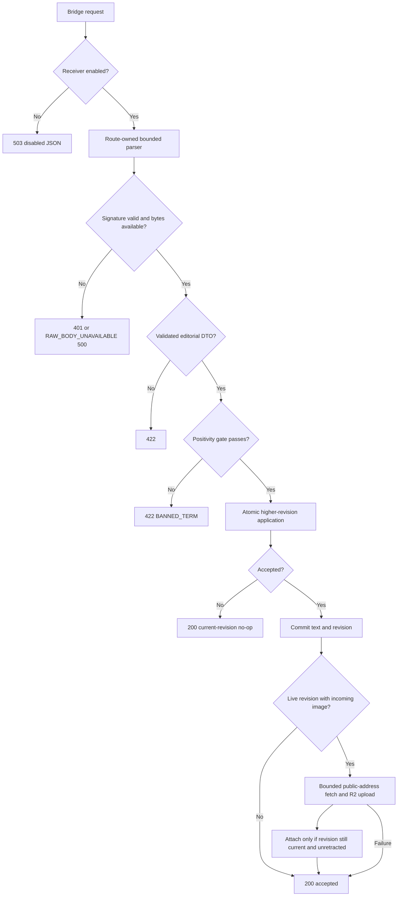
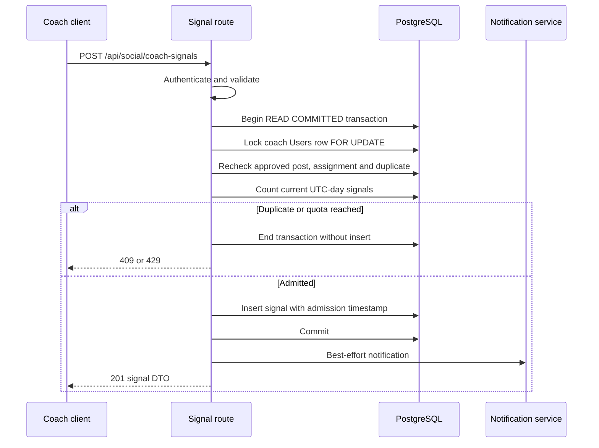
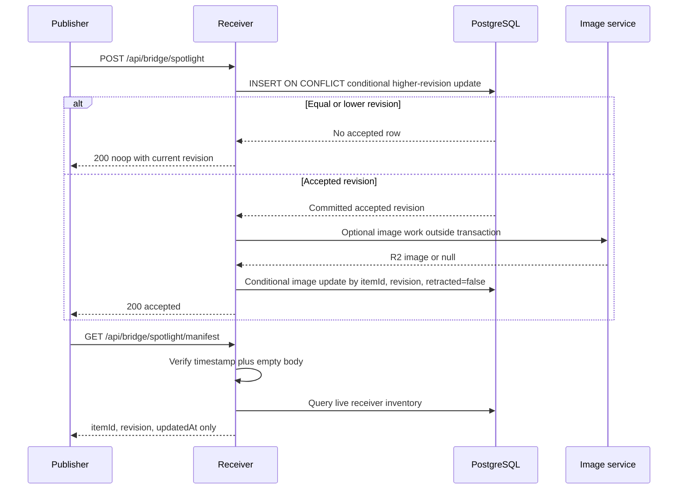
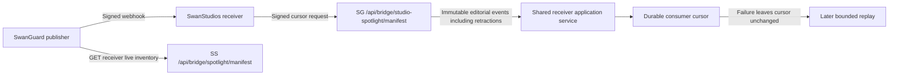
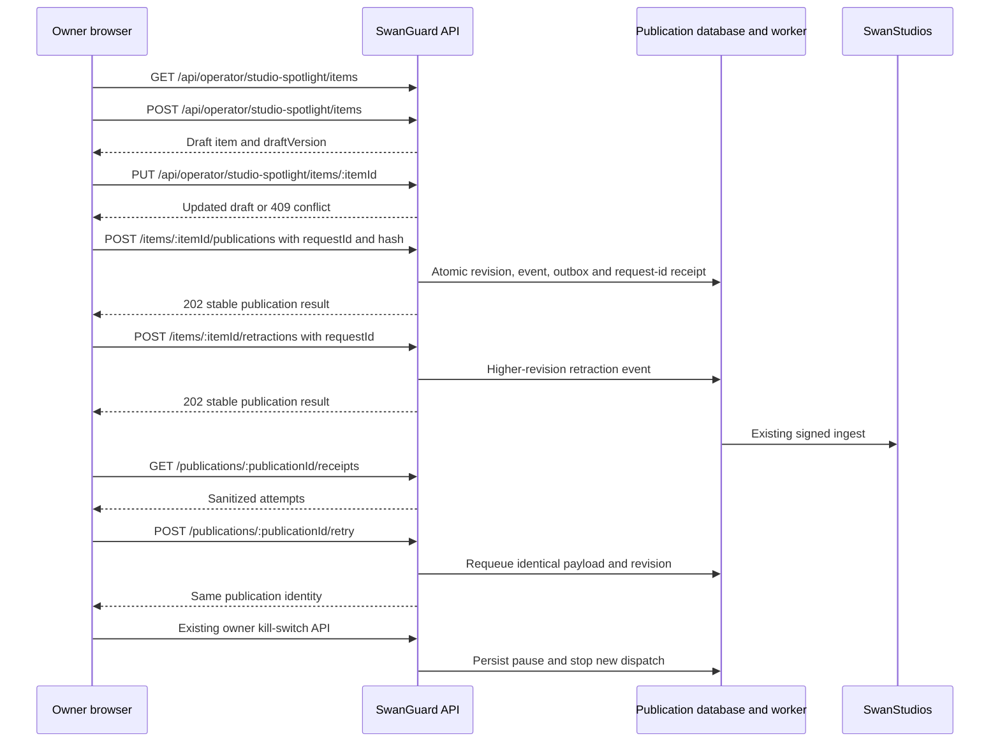
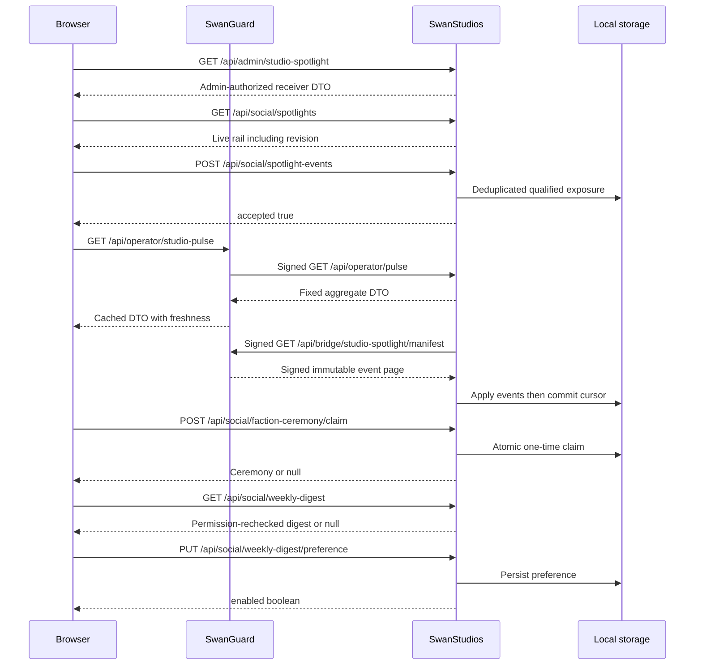
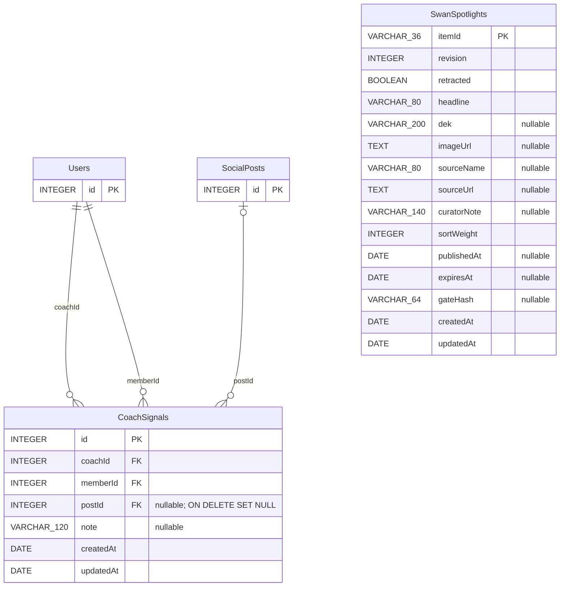
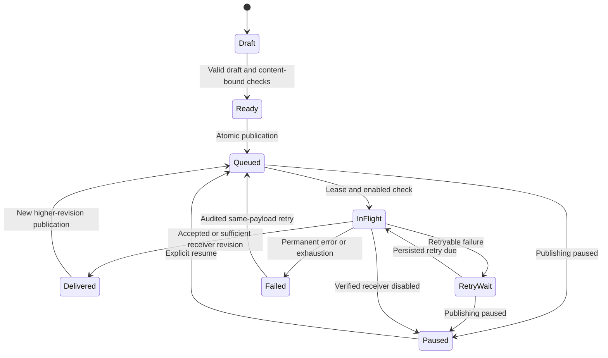
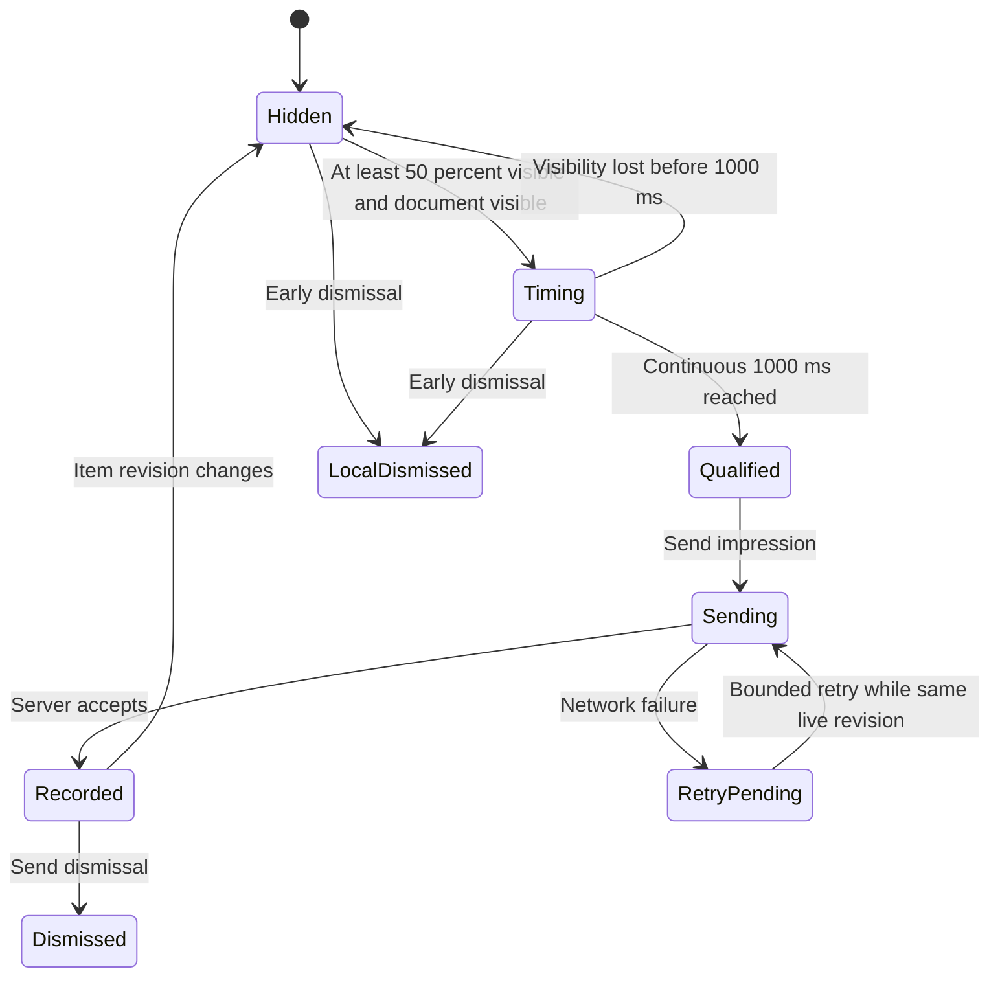

# Astra Reply — subscription transport — 2026-09-21T00:06:34.956Z

**Provider:** openai-codex
**Billing:** chatgpt-subscription
**Authentication:** chatgpt_subscription
**Transport:** codex-cli
**Requested model:** gpt-6-astra
**Served model:** NOT OBSERVABLE on codex-cli (see SERVED_MODEL_UNVERIFIABLE_NOTE)
**Reasoning effort:** high
**Tokens:** in=1026096 out=21050 reasoning=2174
**Packet:** `docs/ai-workflow/AI-HANDOFF/BLUEPRINT-social-bridge-completion-2026-09-19/R1-REVIEW-ROUND-2-PACKET.md`
**Wall:** 689.0s
**Mega Blueprint:** ARMED (remit, document)

> Marginal cost $0 — this leg rides the ChatGPT subscription, not OpenRouter.

---
Mega Blueprint. I’ll compare the two pinned revisions, test round 1’s findings against the committed source, and emit the revised nine-document package. This session is read-only, so I can return the artifacts but cannot file the review in `Z:\HostileReviews`.

I’m using the `fable-blueprint-forge`, `non-vibe-coding`, and `hostile-review-archive` skills. The packet already contains a provenance contradiction: an empty R1-commit-to-later-commit diff would not prove equality with round 1’s reviewed dirty tree, because the filed review says corrections landed afterward. I’ll check those comparisons separately.

The pinned four-path diff is empty (`exit 0`), and HEAD matches `4977987a7…`. The three HIGH defects remain visible in the committed source. The deferral rationale is partly wrong: `bridgeIngestRoutes.mjs` was inside R1’s changed paths, and the build plan explicitly calls for atomic revision application.

Node execution is denied by this environment, so I cannot rerun tests or mutations. I’ll distinguish source-confirmed findings from the packet’s reported test results.

Two further claims need correction. The legacy image tests mock the wrong module, but missing R2 credentials are not a proven cause of their passing: the fetch can fail before upload, and storage can fall back to disk. Also, the repaired receiver manifest lists live items only; it cannot establish the planned publisher event stream’s recovery of missed retractions.

The verdict remains FAIL. I’m revising the package to preserve the UTC quota and nullable `postId`, distinguish the two manifests, and define an explicit repair scope before R2.

## PART A — HOSTILE REVIEW

**Verdict: FAIL — R1 remains an incomplete correctness foundation.** Its manifest repair is useful, but the committed revision still contains the quota race, revision/tombstone race, and validation/persistence mismatch.

**Review target:** `4977987a7b9706b9ede9eae5085920c41f59760b`, branch `creator-brains-engine-r2-20260915`. “Shipped” below means committed; production deployment is **[UNKNOWN]**.

**Evidence obtained this round**

- Git HEAD matched the target SHA.
- The four attributable paths—bridge route, two new suites, checkpoint submission—were unchanged between `3688294988b904f5b32488d6f69c152db6e9f99f` and the target: `git diff --quiet … -- <four paths>` returned **0**.
- The supporting quota route, signature helper, image helper, storage helper, and legacy ingest suite were also unchanged between those revisions.
- Reviewed source was read using `git show <pinned SHA>:<path>`.
- The worktree contained **1,242 dirty paths** at inspection. No files were changed.
- Node and Bash execution returned **“Access is denied.”** Tests, mutations, archive query, lane digest, and continuity count were therefore **BLOCKED**, not passed. PowerShell’s aggregate exit code did not negate those native-command failures.
- The archive index and round-1 artifact were readable directly. This fallback does not establish archive completeness.

**Filing status: BLOCKED.** The [hostile-review-archive skill](.claude/skills/hostile-review-archive/SKILL.md) requires: “Every hostile-review pass leaves exactly one file in `Z:\HostileReviews`.” This session permits reading only. The dispatcher must file this response, link it with `supersedes: 2026-09-20-025023-social-bridge-completion-r1-correctness`, and reindex before treating it as an archived checkpoint. No new `review_id` is claimed here.

**A1 — Adjudication of the five requested claims**

| Claim | Result | Evidence and concrete correction |
|---|---|---|
| 1. Reviewed code equals shipped code | **Confirmed for R1 commit → target; false as a statement about round 1’s original review target.** | The four-path diff returned 0. However, the filed round-1 review’s ordering note explicitly says F01/F02/F04 corrections followed the reviewed dirty tree. Replace “the code round 1 reviewed … byte for byte” with “the corrected R1 commit is unchanged at the round-2 target.” |
| 2. FAIL was justified; three HIGH defects remain | **Confirmed from committed source. Deferral explanations require correction.** | See F05–F07 below. No live database is needed to identify missing serialization or inconsistent value handling; database reproduction and deployed effects remain unproven. |
| 3. Manifest fix is correct and complete | **Correct for the intended bodyless GET and supplied upstream-JSON-parser case; completeness is not established.** | `bridgeIngestRoutes.mjs:239–253`: absent declared body becomes an empty Buffer; a declared body consumed into a non-Buffer fails closed. `swanBridgeSignature.mjs#buildCanonicalPayload` signs a bodyless request as `timestamp + "."`. Compression, malformed framing, upstream transformations, and the mounted application need additional tests. |
| 4. Both suites are load-bearing | **Partially supported; broader claims remain overstated.** | Packet-reported mutations cover cap, UTC boundary, and manifest capture removal. They do not establish concurrent admission, concurrent revision application, real uniqueness, restart behavior, every security guard, or successful image upload. |
| 5. Full R1 acceptance fits its four-path scope | **False if that four-path set is binding. The restriction itself is not established by the plan.** | Submission §2 labels these paths attributable changes, not an authorization document. `04-build-order.md#Integration edits` expressly includes the quota route, and its file table includes quota/apply services and migrations. A four-path patch cannot satisfy that full slice. Separate patch acceptance from foundation acceptance and release an explicit repair scope. |

**A1 — Every round-1 finding retested against this revision**

| ID | Severity | Round-2 disposition and fix |
|---|---|---|
| F01 | Medium | **Partly resolved.** The committed fallback distinguishes ordinary bodyless GET from a declared body consumed by an upstream JSON parser. The “every caller gets 500” claim is corrected in the route but survives in `CORRECTIONS-APPLIED.md#10` and submission §12. Replace those active instructions; preserve historical review text. |
| F02 | Medium | **Partly resolved.** Both suites contain 16 cases, and the concurrent-revision test was renamed in source. Nevertheless, `05-slices.md#R1` still advertises a “concurrent-revision loser” and “duplicate rollback.” Neither is exercised. Rewrite those claims and add barrier-controlled concurrency tests. Captured green output is historical evidence, not a mutation record. |
| F03 | Medium | **Decision correct; runtime evidence outstanding.** Migration `20260916-create-coach-signals.cjs:30–38` declares nullable integer `postId` with `ON DELETE SET NULL`. Keep it nullable. Source cannot establish deployed constraints or the existence of historical NULL rows. Replace unconditional data claims with **[UNKNOWN]** pending a disposable-DB deletion test and deployed-schema inspection. |
| F04 | Medium | **Still partly open.** Both parsers precede the handler feature gate. The test at `bridgeSpotlightOrdering.contract.test.mjs:251` still says “byte-identical” while comparing parsed objects. Rename it or assert `res.text`. Define disabled behavior at a specific middleware boundary; test malformed and oversized requests there. |
| F05 / D2 | High | **Open.** `coachSignalRoutes.mjs:125–140` counts, then inserts without a transaction or serialization. Two distinct posts can both observe four signals. Fix with per-coach database serialization and count/insert in one transaction. “Outside the four attributable paths” is true; “outside the blueprint’s R1 scope” is false. |
| F06 / D1 | High | **Open.** `bridgeIngestRoutes.mjs:113–153` reads an instance, awaits image work, then writes unconditionally. An older request can overwrite a newer tombstone. Concurrent first inserts also lack conflict-to-no-op handling. Fix with atomic highest-revision application and revision-conditional image attachment. The route was one of the four attributable paths; its alleged exclusion is incorrect. |
| F07 / D3 | High | **Open.** `bridgeIngestRoutes.mjs:58–68,99–141`: validation trims/truncates a temporary ID, persistence uses the raw ID; revision lacks the stored integer bound; retraction controls image work by truthiness but storage by `=== true`. Fix by producing one validated DTO consumed everywhere. The ban does require an explicit compatibility decision for newly rejected inputs; it does **not** require preserving accidental coercion or forbid correcting internal consistency. |
| F08 / D4 | High | **Open, with a confirmed implementation gap.** `spotlightImageFetch.mjs:84–91,120–132` checks DNS, then normal fetch resolves independently. `04-build-order.md#rehostImage` falsely says redirect rejection closes rebinding. Bind connection lookup to validated public addresses, or require verified equivalent egress enforcement. A valid publisher HMAC does not authenticate the remote image server. |
| F09 / D5 | High | **Confirmed, no longer merely plausible.** `00-README.md` and `MANIFEST.md` close G0 while `03b#Exported application interfaces`, `04#Integration edits`, and `05#G0` leave release prerequisites unresolved. Six excerpts are not the nine truth artifacts or zero-blocker acceptance criterion. Reopen G0 and identify evidence-only versus implementation-release gates. |
| F10 / D6 | High | **Core finding confirmed; claimed failure mechanism corrected.** Legacy suite §5.4 mocks `r2StorageService`, while the route imports `photoStorageService`; image fetching is also unstubbed. But “real upload fails on missing credentials” is not established: DNS can fail first, and `photoStorageService.mjs:181–197` falls back to disk. Mock both actual boundaries, deny external network/filesystem effects, and assert successful upload plus separately injected failure. |
| F11 | Medium | **Open.** Receiver `/api/bridge/spotlight/manifest` is a live-only inventory; proposed publisher `/api/bridge/studio-spotlight/manifest` is a retained event stream. The former cannot independently recover a missed retraction. Give them distinct names, diagrams, contracts, and tests. |
| F12 | Medium | **Open.** Current `SwanSpotlight` has neither degradation state nor receipt storage. A null URL cannot distinguish absent, failed, or pending image work. Return truthful `unknown` status until explicit storage exists; do not fabricate `degraded` or receipt IDs. Complete denied/pending/conflict/partial UI states. |
| F13 | Medium | **Materially improved, not fully resolved.** Commit identity and FAIL verdict now exist. Submission §13 still asks whether to commit an “uncommitted” six-file change, and §12 repeats the old universal-500 claim. Supersede the submission’s active status with exact commit inventory and remove obsolete questions from current instructions. |
| F14 | Medium | **Open.** Integer schema examples conflict with UUID publication/ceremony/digest examples. G0-5 also wrongly groups `NOT VALID`/`VALIDATE` with `CREATE INDEX CONCURRENTLY`. Keep existing natural Spotlight keys; serialize new integer surrogate IDs as decimal strings. Correct the DDL explanation. |
| F15 | Medium | **Open.** Publication response-loss idempotency, draft edit versions, exposure qualification, scheduler registrations, and domain adapters remain incomplete. Fix the decisions specified below; keep dependent slices blocked until exact integrations are supplied. |

PostgreSQL distinguishes these operations: `CREATE INDEX CONCURRENTLY` cannot run inside a transaction block; the blanket claim that foreign-key/CHECK `NOT VALID` and `VALIDATE CONSTRAINT` are likewise prohibited is incorrect. Their lock behavior and supported constraint types must be assessed separately. [CREATE INDEX](https://www.postgresql.org/docs/15/sql-createindex.html), [ALTER TABLE](https://www.postgresql.org/docs/17/sql-altertable.html)

**Additional A1 findings**

| ID | Severity | Evidence | Concrete fix |
|---|---|---|---|
| R2-01 | Medium | `08-decision-density-self-test.md#Signal day` says Pacific; committed quota and revised R1 tests use UTC. `CORRECTIONS-APPLIED.md#3` still orders NOT NULL despite its later supersession. | Make UTC and nullable `postId` the sole current decisions; label contrary sections historical. |
| R2-02 | Medium | Receiver `rehostImage()` accepts any returned storage URL. `photoStorageService.mjs:179,197` can return either R2 or local storage. | Stop claiming R2 hosting from a non-null URL. Before enablement, use a bridge-specific R2-only upload boundary that returns null on failure without local fallback. Leave other upload callers unchanged. |
| R2-03 | Medium | `spotlightImageFetch.mjs:120` awaits DNS validation before creating the timeout at `:132`; decode and upload occur afterward. Early status/length rejection does not explicitly cancel the response body. | Describe the current timeout narrowly. Add bounded DNS/connection/body handling and cleanup tests; separately budget decode/upload. |
| R2-04 | Medium | `spotlightReadRoutes.mjs:36–44` omits `revision`; R2’s measurement request requires it. | Add revision to the authenticated rail projection and client DTO in R2’s explicit scope, then test a revision-changing refresh. A hook alone cannot supply authoritative revision. |
| R2-05 | Medium | `06-bans.md` forbids arbitrary image URLs while forbidding an exact-host allowlist; it prohibits source metadata in manifest payloads while `03b` exports exact payload bytes containing editorial attribution. | Permit validated arbitrary-public-host image inputs; prohibit unchecked fetching. Distinguish public editorial attribution from private source records and operator identity. Export only publisher-whitelisted editorial payloads. |
| R2-06 | Medium | `05-slices.md#R1` and suite names overstate rollback/restart/concurrency. Ordering suite is 318 lines despite the 299-line test-file cap. DST fixtures at 09:30Z and 10:30Z are both after the 2026 fall-back transition. | Split tests by boundary; rename source/lookup assertions; add process-restart, rollback, and before/after-transition fixtures. |

**Manifest completeness qualification**

The committed code is fail-closed for the supplied upstream JSON-parser scenario, assuming request headers have not been rewritten and the upstream parser represents consumed JSON as a non-Buffer. A genuinely bodyless request hashes the nonempty canonical string `"<timestamp>."`, not an empty HMAC input.

Two broader “exact bytes” claims remain too strong:

- The installed body-parser source defaults to inflation; compressed requests are processed after decompression.
- `buildCanonicalPayload()` converts Buffer bytes through UTF-8 text. Distinct invalid UTF-8 sequences can lose byte identity.

Neither establishes a demonstrated production bypass here. The corrected compatibility profile below limits signed traffic to uncompressed valid UTF-8 JSON, with a bodyless receiver-inventory GET.

**[UNKNOWN] evidence needed**

1. Actual PostgreSQL constraints, drift, historical NULL rows, and two-connection races: disposable PostgreSQL tests plus separately authorized deployed-schema reads.
2. Mounted application parser/error behavior: isolated production-router smoke with synthetic credentials.
3. Real publisher signature interoperability: controlled staging requests using deployment-managed secrets.
4. Successful durable R2 hosting: controlled staging upload and read-back.
5. Production deployment of the reviewed SHA: deployment receipt and runtime revision evidence.
6. Historical mutation executions and precise restore hashes: original immutable command logs; this round did not reproduce them.
7. SwanGuard mounts, approved integration commit, scheduler/domain adapters: pinned source receipts.
8. Archive completeness and final filing: successful query, filing, reciprocal supersession, and reindex.

**A2 — One hostile pass over the draft package**

The draft package was challenged once; the following corrections are incorporated in PART B.

| Draft weakness found | Correction applied |
|---|---|
| “Wrap count/create in a transaction” still permits concurrent admission. | Require a per-coach database lock and READ COMMITTED count/insert using the same transaction. |
| An update-only compare-and-swap leaves simultaneous first creation unresolved. | Require atomic insert-on-conflict conditional revision application. |
| Holding a database lock across image networking increases contention and can block retractions. | Commit text/revision first; perform image work outside the transaction; attach only to the same unretracted revision. |
| A normalized-ID repair could silently truncate two IDs into one. | Trim once, reject length over 36, never truncate identity. Preserve opaque IDs rather than inventing UUID-only validation. |
| `imageUrl:null → imageState:none` invents historical knowledge. | Use `unknown` where provenance is absent; no inferred degradation or receipt. |
| A new “live inventory” design was accidentally being credited with tombstone convergence. | Separate inventory from publisher event replay throughout the package. |
| A generic DB test command could silently hit the existing production-connected setup. | Keep database gates blocked until an isolated fixture runner is implemented; supplied source probes never import the application database. |
| Newly authored probes could be mistaken for executed evidence. | Label them executable, unexecuted source probes; distinguish them from real database and full-router tests. |
| The package appeared to release all later slices despite missing SwanGuard contracts. | Keep the entire slice order, update its decisions, and explicitly withhold dependent implementation release. |

## PART B — FORGED PACKAGE

### 00-README.md

# Social Bridge completion — round-2 revision

**Version:** R1-R2-review, 2026-09-20  
**Baseline:** `4977987a7b9706b9ede9eae5085920c41f59760b`  
**Status:** R1 **FAIL**; G0 implementation release **BLOCKED**; R2 and later slices **NOT RELEASED**.  
**Artifact status:** emitted document contents; not written to disk.

This package supersedes conflicting active instructions in the supplied `00–08`, `03b`, manifest, corrections, and verification notes. Historical packets and filed reviews remain unchanged. Adoption requires preserved pre-edit artifacts, an explicit supersession record, and a filed round-2 review.

**Outcome**

A coach cannot exceed five successfully persisted signals per UTC day through concurrent requests. Spotlight state never regresses to a lower revision or loses a newer tombstone. Valid signed inventory requests work without inventing request bytes. Image failures preserve text delivery. Later publisher, measurement, pulse, ceremony, and digest work cannot inherit false readiness.

**Requirements**

| ID | Acceptance |
|---|---|
| BR-01 | Reviewed revision, changed paths, and evidence provenance are reproducible. |
| BR-02 | Concurrent distinct-post admissions from count four produce one creation and one quota rejection. |
| BR-03 | Stored Spotlight revision is monotonically nondecreasing; stale image completion cannot overwrite newer state. |
| BR-04 | Identity, revision, and retraction values used for validation equal those used for storage and branching. |
| BR-05 | Bodyless inventory authenticates; unavailable declared bytes fail closed. |
| BR-06 | Image connection targets are validated, processing is bounded, and failure remains nonfatal. |
| BR-07 | Nullable post linkage preserves recognition on hard deletion; no session target is invented. |
| BR-08 | Tests distinguish mocked route behavior, actual database behavior, and deployment evidence. |
| BR-09 | Later DTOs, UI states, privacy rules, and integration gates are internally consistent. |

**Scope**

Round-2 review and replacement planning artifacts. Runtime changes, migrations, deployment, feature enablement, external messages, and provider calls are not performed by this response.

**Roles and authority**

- Builder implements one released repair slice.
- Reviewer evaluates the immutable resulting revision.
- Dispatcher preserves/adopts artifacts and files the review.
- Sean retains production enablement and integration-destination decisions.
- Existing authentication owns user identity; the bridge owns server-side signature verification.

**Build order**

`G0-R → R1a → R1b → R1c → R1d → R1 checkpoint → R2 → S5a → S5b → S7 → S6 → S8 → E1`.

R1a–R1d are repairs within R1, not replacements for the product slice numbering.

**Builder contract**

Follow the decided interfaces and invariants. Do not turn an unavailable dependency into a guessed implementation. After each slice, submit its exact diff and actual evidence. A commit preserves work; it does not change FAIL to PASS. No approval by silence.

**Applicability**

Architecture, contracts, flows, state machines, tests, traceability, operations, and hostile review apply. R1 adds no screen; later screens remain specified in `02-wireframes.md`. Real database and deployed infrastructure evidence remain required where identified, not waived by mocks.

### 01-architecture.md

# Ownership, flows, and state

**Existing mounts verified**

- `backend/core/routes.mjs:428`: `/api/bridge` mounts `bridgeIngestRoutes`.
- `backend/routes/social/index.mjs:29`: `/coach-signals` mounts the signal router.
- `backend/routes/social/index.mjs:33`: `/spotlights` mounts the member read router.
- `backend/core/middleware/index.mjs:45`: bridge excluded from global JSON parsing.
- The URL-encoded parser at `:51` is not covered by that exclusion; mounted-parser tests must include it.

This is a backend review receipt. No frontend mount or full application shadow audit is claimed.

**Current versus required**

Current revision handling is read/await/unconditional-write. Required handling is atomic revision acceptance followed by conditional image attachment. Current quota handling is count/create. Required handling serializes admissions per coach.



The diagram describes the **repair target**, not the committed middleware order. Moving the feature gate is an explicit R1 compatibility correction.





**Two separate reconciliation resources**



**Later API interactions — planned, not mounted proof**





**Exact current affected schema**

Types below are Sequelize model/migration types. `DATE` is a timestamp-valued Sequelize type; it is not a calendar-day column. Parent tables show only verified key columns, not their full schemas.



`CoachSignals` has unique `(coachId, postId)`. R1’s chosen quota repair uses the existing coach row as a serialization lock; it introduces **no daily-budget table**. The earlier Pacific `localDate` budget diagram is superseded.

Future publisher, exposure, ceremony, and digest physical schemas are **BLOCKED**, not N/A: those subsystems need storage, but this round lacks complete verified integration contracts.





Mermaid source is supplied; a rendered preview was **NOT VERIFIED** in this session.

### 02-wireframes.md

# Screens, copy, and responsive states

R1 has **no new screen or palette**. These updated wireframes preserve the later product scope without releasing its implementation.

**SwanStudios tokens**

```css
--studio-bg: var(--midnight-sapphire, #002060);
--studio-surface: var(--obsidian-black, #0A0A0F);
--studio-text: var(--frost-white, #E0ECF4);
--studio-editorial: var(--ice-wing, #60C0F0);
--studio-earned: var(--gilded-fern, #C6A84B);
```

SwanGuard uses its verified existing design tokens. Their exact names are an explicit S5b release blocker; do not transplant SwanStudios tokens into SwanGuard.

Controls have at least 44×44 CSS-pixel targets. Focus is visible, labels remain readable without color, and document-level horizontal overflow is prohibited.

**Operator queue and editor**

```text
DESKTOP 1440×900
+--------------------------------------------------------------------+
| Studio Spotlight                    [Pause publishing] [Refresh]    |
| Publishing active                                                  |
+-----------------------+--------------------------------------------+
| Queue                 | Selected item                              |
| [All statuses v]      | Headline [______________________________]  |
| [Search items_______] | Editorial summary [_____________________]  |
| [Headline         >]  | Curator note [__________________________]  |
| Draft                 | Image URL [_____________________________]  |
| [Headline         >]  | Source name [________] Source URL [_____]  |
| Delivered             | Published at [____] Expires at [_______]  |
|                       | Sort weight [1]                            |
|                       | Member preview                             |
|                       | [Save draft] [Review for publishing]       |
|                       | [Retract from SwanStudios]                 |
+-----------------------+--------------------------------------------+
| Delivery receipts: Revision | State | Last attempt | [View receipt]|
+--------------------------------------------------------------------+

MOBILE 375×812 — QUEUE
+-----------------------------------+
| Studio Spotlight                  |
| Publishing active                 |
| [Pause publishing] [Refresh]      |
| [All statuses v]                  |
| [Search items_________________]   |
| Queue                             |
| [Headline                      >] |
| Draft                             |
+-----------------------------------+

MOBILE 375×812 — DETAIL, vertical scroll
+-----------------------------------+
| [Back to queue]                   |
| Selected item                     |
| Headline [____________________]   |
| Editorial summary [___________]   |
| Curator note [________________]   |
| Image URL [___________________]   |
| Source name [_________________]   |
| Source URL [__________________]   |
| Published at [________________]   |
| Expires at [__________________]   |
| Sort weight [1]                   |
| Member preview                    |
| [Save draft]                      |
| [Review for publishing]           |
| [Retract from SwanStudios]         |
| Delivery receipts                 |
+-----------------------------------+
```

Search applies to authorized editorial items only. Search/query behavior must be added to the item-list contract before S5b release; it must not search private newsroom story bodies.

**Ceremony and retraction**

```text
DESKTOP DIALOG / MOBILE FULL-SCREEN
+-----------------------------------+
| Review for publishing     [Close] |
| Confirm every statement.          |
| [ ] No politics                   |
| [ ] No negativity or ragebait     |
| [ ] Image rights cleared          |
| [ ] Headline is in Sean's voice    |
| Publishing sends this preview     |
| to SwanStudios.                   |
| [Cancel] [Publish to SwanStudios]  |
+-----------------------------------+

DESKTOP DIALOG / MOBILE FULL-SCREEN
+-----------------------------------+
| Retract Spotlight         [Close] |
| Remove this item from             |
| SwanStudios?                      |
| [Cancel] [Retract item]            |
+-----------------------------------+
```

Changing editorial fields resets attestations. Pending submission disables duplicate actions and shows `"Publishing..."` or `"Retracting..."`. Escape/Cancel closes before submission; while pending, the UI does not imply cancellation of a durable publication.

**Admin receiver state**

```text
DESKTOP 1440×900
+--------------------------------------------------------------------+
| Studio Spotlight                                        [Refresh] |
| Spotlight disabled                    Live items: 0                |
| Headline | Revision | Received | Image status | Receipt             |
| No live Spotlight items.                                           |
+--------------------------------------------------------------------+

MOBILE 375×812
+-----------------------------------+
| Studio Spotlight       [Refresh]  |
| Spotlight disabled                |
| Live items: 0                     |
| Headline                          |
| Revision: 3                       |
| Received: <formatted timestamp>   |
| Image status: Unknown             |
| Receipt: Not recorded             |
+-----------------------------------+
```

No publisher/edit/delete control. `"Unknown"` is valid data truth, not a loading placeholder.

**Pulse, ceremony, digest**

```text
DESKTOP TILE / MOBILE FULL-WIDTH
+-----------------------------------+
| Studio Pulse            [Refresh] |
| Updated 2 minutes ago             |
| Spotlight active                  |
| Live items: 3                     |
| Impressions: 240                  |
| Dismissal rate: 25%               |
| Placement review not needed       |
+-----------------------------------+

DESKTOP RAIL / MOBILE FULL-WIDTH
+-----------------------------------+
| This week's faction honors        |
| <desktop crystal / mobile static> |
| Winner: Winning faction           |
| MVP: MVP unavailable              |
| Next week: <authorized label>     |
| [Continue]                        |
+-----------------------------------+

DESKTOP TILE / MOBILE FULL-WIDTH
+-----------------------------------+
| Your week at SwanStudios           |
| XP earned: 120                    |
| Current streak: 4 days             |
| Friend highlight                  |
| A friend completed a challenge.   |
| Faction rank: 2                   |
| [Read Spotlight]                  |
| [Weekly digest: On]               |
+-----------------------------------+
```

**State frame used at both widths**

```text
DESKTOP: full content-column width
MOBILE: 375px viewport, 16px side gutters
+-----------------------------------+
| <surface title>                   |
| <exact state message below>       |
| <state action, if present>         |
+-----------------------------------+
```

| Surface/state | Exact message | Action |
|---|---|---|
| Queue loading | `Loading Studio Spotlight...` | None |
| Queue empty | `No items in this queue.` / `Save a draft to get started.` | `Create draft` |
| Queue denied | `You do not have permission to publish Spotlight.` | `Back` |
| Queue error | `Studio Spotlight could not load.` | `Try again` |
| Paused | `Publishing paused. Queued items will not be sent.` | `Resume publishing` |
| Save success | `Draft saved.` | Existing editor actions |
| Validation | `Review the highlighted fields.` | Focus first invalid field |
| Draft conflict | `This item changed. Reload before publishing.` | `Reload item` |
| Publication accepted | `Publication queued.` | `View receipt` |
| Response lost | `Delivery confirmation is unavailable.` | `Check publication status` |
| Receipt loading | `Loading delivery receipts...` | None |
| Receipt empty | `No delivery attempts yet.` | None |
| Receipt error | `Delivery receipts could not load.` | `Try again` |
| Admin loading | `Loading live items...` | None |
| Admin empty | `No live Spotlight items.` | `Refresh` |
| Admin denied | `Administrator access is required.` | `Back` |
| Admin error | `Live items could not load.` | `Try again` |
| Admin partial image knowledge | `Image status: Unknown` | None |
| Pulse loading | `Loading Studio Pulse...` | None |
| Pulse suppressed | `Not enough activity to assess placement.` | `Refresh` |
| Pulse stale | `Studio Pulse is out of date.` | `Refresh`; retain timestamp |
| Pulse unavailable | `Studio Pulse is unavailable.` | `Try again` |
| Ceremony absent/error | Render nothing | Local diagnostic only |
| Ceremony graphics failure | Keep text and static illustration | `Continue` |
| Digest loading | `Loading your weekly digest...` | None |
| Digest empty | `Your next weekly digest is on its way.` | Preference control |
| Digest error | `Your weekly digest could not load.` | `Try again` |
| Digest opted out | `Weekly digest is off.` | `Turn on weekly digest` |
| Digest partial | `Friend highlight unavailable.` | Retain authorized remaining fields |

Dialogs trap/restore focus. Status updates use a polite live region; validation errors are associated with fields. No hover-only controls.

Three.js remains ceremony-only: desktop ≥600px, ≤24 shards, 2.5 seconds, ≤30fps, DPR ≤1.5, ≤180KiB gzip lazy chunk, zero initial-route Three.js bytes. Mobile, reduced motion, Save-Data, hidden tab, unavailable WebGL, or low-memory detection use static rendering. These are acceptance budgets, not measured results.

### 03-contracts.md

# Contracts, compatibility, storage, and rollback

**R1 contract amendment**

The repair explicitly permits correcting invalid-input handling and middleware precedence. Preserve endpoint paths, valid v1 field types, timestamp/HMAC format, flag default OFF, positive-content gate, and nonfatal image failure. No protocol-wide silent rewrite is authorized.

**Validated Spotlight input**

```ts
type SpotlightInput = {
  itemId: string;
  revision: number;
  retracted: boolean;
  headline: string;
  dek: string | null;
  curatorNote: string | null;
  imageUrl: string | null;
  sourceName: string | null;
  sourceUrl: string | null;
  sortWeight: number;
  publishedAt: Date | null;
  expiresAt: Date | null;
  gateHash: string | null;
};
```

- `itemId`: required string, trim once, length 1–36; reject overlength, never truncate identity. No UUID-only requirement.
- `revision`: integer 1–2,147,483,647.
- `retracted`: omitted becomes false; supplied value must be boolean.
- Headline/dek/note retain existing trim/truncation limits 80/200/140.
- Existing optional source/gate projection and date fallback remain unchanged in R1.
- `sortWeight`: default 1 when absent/non-integer as currently implemented; an integer outside the database range returns 422.
- All branching, logging identifiers, lookup keys, and persistence consume this DTO.
- Unknown request fields remain ignored for legacy ingest compatibility. New publisher-facing APIs use strict allowlists.
- IDs previously stored with whitespace are **not** silently renamed. Detect collisions before any data migration.

**Bridge HTTP**

| Endpoint | Authentication | Success | Errors |
|---|---|---|---|
| `POST /api/bridge/spotlight` | Existing bridge HMAC | Existing 200 accepted/no-op objects | Existing 401 codes; 422 validation/banned; 500 generic persistence failure; 503 disabled |
| `GET /api/bridge/spotlight/manifest` | Same HMAC over `timestamp + "."` for bodyless GET | `{success:true,generatedAt,items:[{itemId,revision,updatedAt}]}` | 401 signature failure; 500 unavailable bytes/query failure; 503 disabled |

Disabled JSON remains:

```json
{"success":false,"message":"Spotlight ingest is disabled."}
```

Unavailable bytes remain:

```json
{"success":false,"code":"RAW_BODY_UNAVAILABLE"}
```

Producer profile: uncompressed UTF-8 JSON; inventory GET has no body. Parser/HMAC support beyond that profile must be tested before being advertised. Preserve fail-closed behavior for declared but unavailable bytes.

`X-Swan-Idempotency-Key` is documented but is not currently enforced by the supplied guard/route. Actual deduplication uses stored `itemId` and revision. Do not describe header presence as a security control.

**Quota transaction**

```ts
createCoachSignalAtomic(input: {
  coachId: number;
  postId: number;
  note: string | null;
}): Promise<
  | { kind: "created"; signal: SignalDTO }
  | { kind: "duplicate" }
  | { kind: "quota_exceeded" }
  | { kind: "not_found" }
  | { kind: "forbidden" }
>;
```

Use the existing Sequelize connection, READ COMMITTED isolation, and a database row lock on the coach. Recheck target eligibility, assignment, duplicate, quota, and insert using the same transaction. Acquire necessary target/assignment locks consistently so eligibility cannot change during admission.

Take the admission timestamp **after** acquiring the coach lock; use it both for UTC-day boundaries and inserted `createdAt`. Query `[UTC midnight, next UTC midnight)`. Notification occurs only after commit and remains best-effort.

Existing unique-constraint violations map to 409. A transaction failure creates neither a signal nor a notification. No new budget schema is required for this design.

**Revision application**

```ts
applySpotlight(input: SpotlightInput): Promise<
  | { kind: "accepted"; itemId: string; revision: number; retracted: boolean }
  | { kind: "noop"; itemId: string; revision: number }
>;

attachSpotlightImage(input: {
  itemId: string;
  revision: number;
  imageUrl: string;
}): Promise<{ attached: boolean }>;
```

Atomic insert/conflict application accepts only a revision greater than stored revision. Equal/lower revisions remain no-ops even if payloads differ.

- Commit accepted text/revision before external image work.
- A new incoming image starts as null for the accepted revision.
- No incoming image preserves the existing URL.
- Retraction preserves the existing URL but suppresses visibility.
- Image completion updates only matching `itemId`, revision, and `retracted=false`.
- Concurrent first creation must resolve as accepted/no-op, not an unhandled uniqueness error.
- Tombstones remain indefinitely.
- A crash after text commit can leave a text-only item. Same-revision replay remains a no-op; a higher revision can retry image processing.

**Image service**

Use one existing fetch/decode implementation, not a competing helper. Bind validated DNS answers to the actual connection while preserving TLS hostname verification. Reject redirects and nonpublic addresses. Preserve 5MiB input, 16MP decode, 1600px edge, metadata stripping, and static-raster output controls.

A bridge-specific uploader must return R2 storage or null without disk fallback. This is a scoped adapter change; other photo callers retain their behavior. Establish bounded DNS/fetch, decode, and upload behavior before claiming a total image-processing deadline.

**Later contracts retained and corrected**

- Publisher item APIs retain owner authorization and existing CSRF.
- Draft edits use a separate monotonic `draftVersion`; publication revision increments only on publication/retraction.
- Publication/retraction requests carry a persisted `requestId`. Same ID plus identical request hash returns the original result; same ID plus different hash returns 409.
- Publication IDs use the verified publisher DB convention; do not release a schema until that convention is supplied. Newly introduced SwanStudios integer IDs serialize as decimal strings.
- Sender retries preserve exact payload bytes/revision; one initial attempt plus six retries at 30/120/600/1800/7200/21600 seconds with persisted deterministic 0–20% positive jitter.
- A disabled-receiver response pauses only when status and expected disabled DTO match; arbitrary 503 remains retryable.
- Receiver inventory is not the publisher event stream.
- Publisher manifest retains retractions, signed raw responses, committed sequence ordering, durable cursor, 100-event/1MiB limits, 20 pages/run, and minute-17 hourly scheduling.
- Exported event bytes contain whitelisted public editorial content only; omit `gate.curatorId`, private story metadata, and operator identities.
- Pulse keeps a separate `SWAN_PULSE_SECRET_V1`, nonce replay protection, fixed aggregate DTO, seven closed Pacific days, suppression below 20 exposures, and placement alert only at ≥100 and ratio >0.40.
- Exposure qualifies after ≥50% continuous visibility for 1000ms while the document is visible. Key by server-derived Pacific date, member, item, and revision. Dismissal follows acknowledged impression; early dismissal is local only.
- Ceremony preserves Monday 09:00–Tuesday 09:00 Pacific and atomic at-most-once claim.
- Digest remains in-app, template-only, Sunday 18:00 Pacific, default OFF absent a verified preference, with current permission checks on read.

**Admin truth**

Until dedicated image/receipt persistence exists:

```ts
type AdminItem = {
  itemId: string;
  revision: string;
  title: string;
  receivedAt: string;
  imageState: "unknown";
  receiptId: null;
};
```

`receivedAt` projects receiver `updatedAt`; it is not a publisher delivery receipt. A later schema may provide authoritative image states and receipts through a separately reviewed migration.

**Environment and rollback**

R1 introduces no environment variables. Existing bridge/R2 variables remain server-only. Tests use synthetic secrets and isolated resources; never inherit application `DATABASE_URL`.

No R1 migration is presumed necessary. Verify existing FK/unique constraints before release. If drift requires DDL, write a new top-level migration; do not edit migration history.

Rollback disables receiver and pauses publisher while retaining revisions, tombstones, outbox, and cursor. Do not roll back to the racy writer with publishing enabled. Do not delete accepted state to make old code appear compatible.

### 04-build-order.md

# Exact repair boundaries

All new source/test files stay below 300 lines. Split by boundary, not by duplicating fixtures.

| Slice | Paths | Work and integration |
|---|---|---|
| G0-R | Existing blueprint directory; isolated fixture configuration | Preserve artifacts; adopt this revision; establish database/schema and complete mount receipts. No product mutation. |
| R1a | `backend/routes/bridge/bridgeIngestRoutes.mjs`; `backend/services/bridge/spotlightPayload.mjs`; ordering/parser/validation tests | Extract one validated DTO, repair disabled-gate ordering, preserve signature construction. Existing `str()` and signature helper are the compatibility precedents. |
| R1b | `backend/routes/social/coachSignalRoutes.mjs`; `backend/services/social/coachSignalQuota.mjs`; quota and database tests | Replace count/create with one serialized service. Import the existing database/model instances; route preserves existing HTTP response bodies. |
| R1c | `backend/routes/bridge/bridgeIngestRoutes.mjs`; `backend/services/bridge/bridgeSpotlightApply.mjs`; revision race tests | Move persistence into atomic application service; image work remains outside DB transaction. Both future replay and webhook use this service. |
| R1d | `backend/services/spotlightImageFetch.mjs`; bridge-specific upload adapter; `backend/tests/api/swanBridgeIngest.test.mjs`; image tests | Pin connection resolution, bound/cancel resource handling, use correct mocks, verify successful R2 adapter result and graceful failure. |
| R1 closure | Existing checkpoint submission and archive artifact | Exact diff, red/green evidence, actual DB results, regression evidence, review disposition. |
| R2 | Admin/event routes and components already named in original build table; additionally `backend/routes/social/spotlightReadRoutes.mjs` and its verified frontend DTO consumer | Supply revision to measurements; return truthful admin state; implement durable deduplication. |
| S5a | Existing proposed SwanGuard publication/dispatcher/repository/contracts files | Release only after exact owner context, DB adapter, migration paths, kill-switch extension, and request-id storage are specified. |
| S5b | Existing proposed console/editor/ceremony/receipt files | Release after route/nav mount and SwanGuard palette receipt; protected reader files unchanged. |
| S7 | Existing proposed pulse, manifest, auth, consumer-state, and tile files | Separate protocols and durable replay; shared receiver application service. |
| S6 | Existing proposed faction service/routes/schema/card/scene | Release after authoritative scoring, membership, MVP, modifier, and scheduler adapters. |
| S8 | Existing proposed digest service/data/routes/schema/card | Release after XP/streak/friendship/preferences/scheduler adapters. |
| E1 | Deployment configuration and evidence only | Explicit staged enablement; no default-on code change. |

The original `coachSignalQuota.mjs` and `bridgeSpotlightApply.mjs` entries were already R1 work. They are not out-of-scope inventions.

**No speculative migrations**

The previously proposed `20260920-harden-coach-signals.cjs` is not required merely to add atomic admission. Do not create empty DDL or a redundant counter table. A migration is conditional on measured constraint drift.

**Preservation**

Work from an isolated revision-bound checkout when writes become available. Record branch, base SHA, dependencies, scoped dirty diff, and ownership. Claim paths through the lane mechanism before editing. No shared-tree mutation probes or broad staging.

### 05-slices.md

# Acceptance and traceability

| Slice | Requirement | Required evidence | Exit |
|---|---|---|---|
| G0-R | BR-01, BR-07, BR-08 | Pinned source/mount receipt; current schema; isolated fixture proof; artifact preservation | No unresolved prerequisite for the particular next repair |
| R1a | BR-04, BR-05 | Validation matrix; bodyless and consumed-body GET; parser precedence; valid-wire compatibility | Focused tests pass |
| R1b | BR-02, BR-07 | Real concurrent distinct-post admission; unique duplicate; insert rollback; UTC crossing; deletion preservation | Database cases pass |
| R1c | BR-03 | Delayed older image vs newer tombstone; simultaneous first insert; equal/lower no-op; conditional attachment | Mocked interleaving and real DB cases pass |
| R1d | BR-06, BR-08 | Actual import mocks; successful upload path; DNS connection pin; cancellation; no uncontrolled network/disk | Security/resource cases pass |
| R1 closure | BR-01–08 | Combined immutable revision and all required evidence | PASS before R2 |
| R2 | BR-09 | Admin states, rail revision, real deduplication, visibility timers | PASS before S5a |
| S5a/S5b | BR-09 | Transactional publication, response-loss idempotency, lease/retry/pause tests; complete UI states | PASS before S7 |
| S7 | BR-03, BR-09 | Dropped publish and retraction converge; crash-safe cursor; strict pulse privacy | PASS before S6 |
| S6 | BR-09 | Scheduler/claim races; DST windows; accessibility and measured bundle | PASS before S8 |
| S8 | BR-09 | Deterministic digest, opt-out, permission revocation, denied network | PASS before E1 |

**Current evidence status**

- Historical packet: backend 108 tests and frontend 25 tests reported passing.
- This review: those runs **NOT REPRODUCED**.
- This review: committed-source defects **CONFIRMED**.
- Database concurrency, deletion behavior, deployment, and R2 round-trip: **[UNKNOWN]**.
- Exact commit comparison: **PASS**.
- R1 checkpoint: **FAIL**.

**Gate distinction**

A headless R1 repair needs no invented UI screen. “No frontend diff” proves no changed frontend bytes; it does not prove the application renders successfully. UI smoke may use synthetic fixtures without a live database. If required viewport evidence is unavailable, mark it BLOCKED rather than claim a database is inherently necessary.

**STOP rules**

Do not advance to R2 until R1 passes. Do not release S5a/S5b based on six excerpts while their adapters/mounts remain unresolved. Do not enable publishing while DNS rebinding and durable-image storage remain unresolved.

### 06-bans.md

# Prohibitions and explicit exceptions

- Do not equate round-1 dirty source, corrected R1 commit, later commit, and deployed runtime.
- Do not call historical green output a current run.
- Do not equate a transaction without serialization with an atomic quota.
- Do not overwrite newer revision state, delete tombstones, or attach an image to a superseded/retracted revision.
- Do not hold database locks during DNS, fetch, decode, or storage upload.
- Do not truncate identifiers, enforce invented UUID-only IDs, or persist values different from the validated DTO.
- Do not change the UTC quota boundary to Pacific.
- Do not make `CoachSignal.postId` NOT NULL or introduce nonexistent session targets.
- Do not claim historical NULL rows or deployed indexes were observed without database evidence.
- Do not change valid v1 wire fields, signature construction, endpoint paths, or flag default. The explicitly reviewed R1 amendment permits stricter invalid-value handling and receiver-gate precedence.
- Do not treat redirect rejection as DNS connection pinning.
- Do not fetch unchecked arbitrary URLs. Arbitrary **public hostnames** are permitted only through the validated, connection-bound image service.
- Do not hot-link publisher images or represent local fallback as R2 storage.
- Do not fail otherwise-valid text ingestion solely because an image fails.
- Do not infer historical image degradation or fabricate receipts.
- Do not conflate receiver inventory with publisher event replay.
- Do not export raw newsroom objects, operator identities, private source metadata, or member data through publisher manifests/pulse.
- Do not prohibit legitimate public editorial attribution by confusing it with private provenance.
- Do not perform mutation tests in the dirty shared tree.
- Do not let tests access production databases, provider services, external DNS, or storage accidentally.
- Do not create migrations solely to satisfy a planned filename.
- Do not use `CREATE INDEX CONCURRENTLY` through the transactional SwanGuard runner. Do not misstate `NOT VALID`/`VALIDATE` as the same restriction.
- Do not edit protected `FeedLanes.tsx` or `StorySheet.tsx`.
- Do not invent faction scoring, modifier semantics, name-resolution authority, or preference defaults.
- Do not introduce LLMs, email/push digests, XP for passive activity, or unrelated social features.
- Use styled-components, accessible contrast, token fallbacks, and 44px controls; preserve project-specific branding.
- Do not introduce Three.js into mobile/reduced-motion/initial social-route bundles.
- Do not use broad staging, destructive cleanup, unapproved main pushes, or automatic feature enablement.
- Do not silently replace historical evidence. Supersede it.

### 07-checkpoints.md

# Review and release receipt

**Verdicts**

- **PASS:** required acceptance and regression evidence exists for the exact submitted revision.
- **PASS WITH BOUNDED FOLLOW-UP:** documentation cleanup only; no functional, security, concurrency, privacy, accessibility, or migration exception.
- **FAIL:** confirmed defect remains.
- **BLOCKED:** a required environment, decision, or evidence item is unavailable.

R1 is **FAIL**, with additional evidence blockers. BLOCKED does not erase confirmed defects.

**Required submission**

1. Base/end SHAs and exact path inventory.
2. Full scoped diff; dependency/lockfile revision.
3. Trust-boundary excerpts and actual mount receipt.
4. Exact commands, exit codes, unedited retained output.
5. RED/GREEN result per repaired invariant.
6. Real database concurrency/deletion evidence where required.
7. HTTP status/body and relevant headers.
8. UI evidence only where applicable; record viewport and fixture source.
9. Migration/drift evidence, or explicit no-DDL rationale.
10. Protected-file and secret-scan results.
11. Remaining unknowns and owner.
12. Filed archive review with reciprocal supersession.
13. Next released slice.

**Round-2 readiness receipt**

| Item | State |
|---|---|
| Target identity | VERIFIED |
| R1-to-target four-path equality | VERIFIED |
| Equality with round-1 dirty review target | REFUTED by preserved ordering record |
| R1 correctness | FAIL |
| Updated artifacts | EMITTED, not persisted |
| Product tests/mutations this round | BLOCKED by denied Node execution |
| Real database behavior | [UNKNOWN] |
| Production deployment | [UNKNOWN] |
| Mermaid rendering | NOT VERIFIED |
| Archive filing | BLOCKED by read-only session |
| Implementation release | WITHHELD pending required G0-R inputs |
| Next task | Adopt package and establish isolated R1 repair fixture |

**Archive handoff**

File PART A and link this nine-document package. Use round 2, the pinned SHA, `DEFECTS-FOUND`, and the earlier review ID as `supersedes`. Derive defect/unproven counts from the final adopted report; do not copy round 1’s counts.

**Recovery**

Disable receiver and pause publisher independently. Preserve state. A failed test is not permission to reset a shared checkout or database. Re-enable only after the failed gate is passed with fresh evidence.

### 09-tests.md

# Executable evidence and required release tests

**Status:** The following commands and probe source are supplied, not executed here. Node invocation was denied. No generated test file is claimed to exist.

**Existing suite commands**

From `backend`, after verifying the isolated test environment:

```powershell
npx --no-install vitest run tests/coachSignalIntegrity.contract.test.mjs tests/bridgeSpotlightOrdering.contract.test.mjs tests/api/coachSignalRoutes.contract.test.mjs
```

These prove current mocked route behavior and source declarations. They do not prove database concurrency or deployment.

Do not count the legacy image cases toward image acceptance until their actual fetch/upload boundaries are mocked and asserted.

**Runnable committed-source probes**

Save the following as `backend/tests/review/socialBridgeR1.probe.mjs`. It reads the pinned Git revision, evaluates the actual route source in a VM, and replaces network/database imports. It does not import application database setup or use live credentials.

Run from the repository root:

```powershell
node --experimental-vm-modules --test backend/tests/review/socialBridgeR1.probe.mjs
```

The first five cases assert required behavior and are expected to expose defects at the pinned revision. The final case checks the repaired capture distinction. Expected results are predictions until executed.

```js
import test from 'node:test';
import assert from 'node:assert/strict';
import { execFileSync } from 'node:child_process';
import vm from 'node:vm';

const REV = '4977987a7b9706b9ede9eae5085920c41f59760b';
const ROOT = execFileSync('git', ['rev-parse', '--show-toplevel'], {
  encoding: 'utf8',
}).trim();
const BRIDGE = 'backend/routes/bridge/bridgeIngestRoutes.mjs';
const COACH = 'backend/routes/social/coachSignalRoutes.mjs';
const ITEM = '11111111-2222-3333-4444-555555555555';

function deferred() {
  let resolve;
  const promise = new Promise((done) => { resolve = done; });
  return { promise, resolve };
}

async function load(path, overrides = {}) {
  const routes = new Map();
  const router = {
    post: (url, ...handlers) => routes.set(`POST ${url}`, handlers),
    get: (url, ...handlers) => routes.set(`GET ${url}`, handlers),
  };
  const pass = (_req, _res, next) => next();
  const defaults = {
    express: {
      default: {
        Router: () => router,
        json: () => pass,
        raw: () => pass,
      },
    },
    sequelize: { Op: { or: Symbol(), is: Symbol(), gte: Symbol() } },
    'logger.mjs': {
      default: { warn() {}, info() {}, error() {} },
    },
    'feedEnrichment.mjs': { bannedTerms: [] },
    'swanBridgeSignature.mjs': {
      verifyBridgeRequest: () => ({ ok: true }),
    },
    'spotlightImageFetch.mjs': {
      fetchAndDecodeSpotlightImage: async () => ({ ok: false }),
    },
    'authMiddleware.mjs': { protect: pass },
    'notificationController.mjs': { createNotification: async () => {} },
  };
  const definitions = { ...defaults, ...overrides };
  const context = vm.createContext({
    Buffer, Date, console,
    process: { env: { SPOTLIGHT_ENABLED: 'true' } },
  });
  const cache = new Map();

  async function dependency(specifier) {
    const key = Object.keys(definitions).find(
      (candidate) => specifier === candidate || specifier.endsWith(`/${candidate}`),
    );
    if (!key) throw new Error(`Unstubbed dependency: ${specifier}`);
    if (!cache.has(key)) {
      const values = definitions[key];
      const module = new vm.SyntheticModule(Object.keys(values), function () {
        for (const [name, value] of Object.entries(values)) {
          this.setExport(name, value);
        }
      }, { context });
      cache.set(key, module);
      await module.link(() => { throw new Error('Unexpected nested import'); });
      await module.evaluate();
    }
    return cache.get(key);
  }

  const source = execFileSync('git', ['show', `${REV}:${path}`], {
    cwd: ROOT, encoding: 'utf8',
  });
  const module = new vm.SourceTextModule(source, {
    context,
    identifier: path,
    importModuleDynamically: dependency,
  });
  await module.link(dependency);
  await module.evaluate();

  async function post(url, body) {
    const result = { status: 200, body: null };
    const response = {
      status(value) { result.status = value; return this; },
      json(value) { result.body = value; return this; },
    };
    await routes.get(`POST ${url}`).at(-1)({
      body, headers: {}, user: { id: '7', role: 'trainer' },
    }, response);
    return result;
  }
  return { module, routes, post };
}

test('BR-04 rejects revision above PostgreSQL INTEGER range', async () => {
  const rig = await load(BRIDGE);
  const result = rig.module.namespace.validateSpotlightPayload({
    itemId: ITEM, revision: 2147483648, headline: 'Garden harvest',
  });
  assert.equal(result.ok, false);
});

test('BR-04 rejects a supplied non-boolean retraction', async () => {
  const rig = await load(BRIDGE);
  const result = rig.module.namespace.validateSpotlightPayload({
    itemId: ITEM, revision: 1, headline: 'Garden harvest', retracted: 'false',
  });
  assert.equal(result.ok, false);
});

test('BR-04 persists the same canonical ID that it validates', async () => {
  let stored;
  const rig = await load(BRIDGE, {
    'SwanSpotlight.mjs': {
      default: {
        findByPk: async () => null,
        create: async (value) => { stored = value; },
      },
    },
  });
  await rig.post('/spotlight', {
    itemId: ` ${ITEM} `, revision: 1, headline: 'Garden harvest',
  });
  assert.equal(stored.itemId, ITEM);
});

test('BR-03 delayed older image cannot overwrite a newer tombstone',
  { timeout: 2000 }, async () => {
    let stored = { itemId: ITEM, revision: 1, retracted: false, imageUrl: null };
    const entered = deferred();
    const release = deferred();
    const rig = await load(BRIDGE, {
      'SwanSpotlight.mjs': {
        default: {
          findByPk: async () => ({
            ...stored,
            update: async (value) => { stored = { ...value }; },
          }),
          create: async (value) => { stored = { ...value }; },
        },
      },
      'spotlightImageFetch.mjs': {
        fetchAndDecodeSpotlightImage: async () => {
          entered.resolve();
          await release.promise;
          return { ok: false };
        },
      },
    });
    const older = rig.post('/spotlight', {
      itemId: ITEM, revision: 2, retracted: false,
      headline: 'Garden harvest', imageUrl: 'https://example.invalid/image.png',
    });
    await entered.promise;
    try {
      await rig.post('/spotlight', {
        itemId: ITEM, revision: 3, retracted: true, headline: 'Garden harvest',
      });
    } finally {
      release.resolve();
    }
    await older;
    assert.equal(stored.revision, 3);
    assert.equal(stored.retracted, true);
  });

test('BR-02 two admissions at four cannot both create',
  { timeout: 2000 }, async () => {
    const counted = deferred();
    let readers = 0;
    let total = 4;
    const rig = await load(COACH, {
      'CoachSignal.mjs': {
        default: {
          findOne: async () => null,
          count: async () => {
            if (++readers === 2) counted.resolve();
            await counted.promise;
            return 4;
          },
          create: async (value) => ({
            ...value, id: ++total, createdAt: new Date(),
          }),
        },
      },
      'SocialPost.mjs': {
        default: { findOne: async ({ where }) => ({ id: where.id, userId: 42 }) },
      },
      'ClientTrainerAssignment.mjs': {
        default: { findOne: async () => ({ id: 1 }) },
      },
      'User.mjs': {
        default: { findByPk: async () => ({ username: 'SyntheticCoach' }) },
      },
    });
    const results = await Promise.all([
      rig.post('/', { postId: 3 }),
      rig.post('/', { postId: 4 }),
    ]);
    assert.deepEqual(results.map((r) => r.status).sort(), [201, 429]);
    assert.equal(total, 5);
  });

test('BR-05 empty capture differs from consumed declared body', async () => {
  const rig = await load(BRIDGE);
  const capture = rig.routes.get('GET /spotlight/manifest')[1];
  const empty = { headers: {}, body: {} };
  capture(empty, {}, () => {});
  assert.equal(Buffer.isBuffer(empty.rawBody), true);
  assert.equal(empty.rawBody.length, 0);

  const consumed = { headers: { 'content-length': '14' }, body: { probe: true } };
  capture(consumed, {}, () => {});
  assert.equal(consumed.rawBody, undefined);
});
```

These are **source-bound counterexample probes**, not a replacement for repaired-service tests: their imports are intentionally pinned to the shipped revision, and authentication/parsing are stubbed except for the directly invoked capture middleware.

**Named release tests**

The builder must implement these cases in the stated files before claiming repair. Until then they are **NOT IMPLEMENTED**, not runnable evidence.

| File | Named cases and proof |
|---|---|
| `backend/tests/bridgeSpotlightValidation.contract.test.mjs` | `canonical_id_is_used_everywhere`; `overlength_id_rejected_without_lookup`; `revision_int32_boundaries`; `boolean_retraction_only`; `valid_v1_payload_unchanged` |
| `backend/tests/bridgeSpotlightParser.contract.test.mjs` | `bodyless_manifest_signs_timestamp_dot`; `declared_consumed_body_fails_closed`; `changed_nonempty_body_rejected`; `disabled_malformed_request_returns_defined_response`; `compressed_request_matches_declared_profile` |
| `backend/tests/bridgeSpotlightOrdering.contract.test.mjs` | `older_completion_cannot_replace_tombstone`; `simultaneous_first_delivery_is_not_500`; `equal_revision_is_noop`; `stale_attachment_updates_zero_rows` |
| `backend/tests/coachSignalIntegrity.contract.test.mjs` | Retain existing role/assignment/note cases; rename restart/DDL cases to the narrow behavior actually asserted |
| `backend/tests/integration/socialBridgeR1.database.test.mjs` | `two_connections_admit_one_fifth_signal`; `duplicate_does_not_consume_admission`; `insert_failure_rolls_back`; `utc_boundary_after_lock`; `post_delete_preserves_signal`; `concurrent_first_spotlight_insert`; `higher_revision_wins_after_restart` |
| `backend/tests/api/swanBridgeIngest.test.mjs` | `successful_decode_calls_actual_upload_mock`; `upload_rejection_is_nonfatal`; `fetch_rejection_never_uploads`; `no_real_network_or_disk` |
| `backend/tests/bridgeSpotlightImage.security.test.mjs` | `connection_uses_validated_address`; `rebinding_to_private_address_is_not_connected`; `dns_deadline`; `early_rejection_cancels_body`; `upload_failure_stays_text_only` |

The default backend Vitest configuration excludes `tests/integration/**`; simply naming a database test on the default command does not establish execution. G0-R must supply a dedicated isolated configuration and runner, with an explicit test database target and a guard against production credentials.

**Mutation acceptance**

| Mutation | Required failing assertion |
|---|---|
| Remove quota serialization | Two-connection fifth/sixth admission |
| Remove revision conflict predicate | Highest revision persists |
| Remove attachment revision/tombstone predicate | Delayed image cannot alter newer state |
| Replace normalized ID with raw input | Canonical ID persistence |
| Remove integer/boolean validation | Bound/type rejection |
| Restore unconditional empty-Buffer fallback | Consumed declared-body rejection |
| Restore wrong upload mock | Success-path call assertion/network-deny guard |
| Use independent connection DNS lookup | Rebinding fixture |

Run mutations only in an isolated checkout; record original/restored hashes. No setup failure counts as a successful mutation kill.

## PART C — DECISION-DENSITY SELF-TEST

| Remaining builder choice | Disposition |
|---|---|
| Which revision is reviewed? | **Decided:** `4977987a7b9706b9ede9eae5085920c41f59760b`. |
| Does empty commit diff prove round-1 dirty-tree equality? | **Decided:** no. Preserve both provenance statements. |
| Is R1 passed? | **Decided:** FAIL; later product slices remain gated. |
| Is the four-path list the whole foundation scope? | **Decided:** no; it describes the partial patch. Explicit repair paths are in `04`. |
| Quota day | **Decided:** UTC. |
| Quota serialization | **Decided:** database coach-row lock, READ COMMITTED, same-transaction count/insert. |
| Midnight handling | **Decided:** timestamp after lock; same timestamp drives count window and creation. |
| Post deletion | **Decided:** nullable `postId`, preserve signal via SET NULL. |
| New quota table | **Decided:** none for this repair. |
| Revision acceptance | **Decided:** atomic insert/conflict update only for higher revision. |
| First-insert conflict | **Decided:** accepted/no-op handling, not generic 500. |
| Image timing | **Decided:** outside transaction, conditional attachment. |
| Image crash recovery | **Decided:** text survives; same-revision replay stays no-op; higher revision may retry. |
| Identity validation | **Decided:** trim once, reject overlength, preserve opaque ID convention. |
| Revision/retraction types | **Decided:** signed integer range and real booleans. |
| Legacy unknown request keys | **Decided:** ignored by receiver; new publisher APIs strictly whitelist. |
| Malformed-input compatibility | **Decided:** explicit R1 amendment, not described as unchanged acceptance. |
| Bodyless signature | **Decided:** HMAC over `timestamp + "."`. |
| Compression/encoding | **Decided producer profile:** uncompressed UTF-8 JSON; broader support unproven. |
| Signature protocol redesign | **Decided:** outside this repair. |
| DNS security | **Decided requirement:** connection-bound validated public addresses; implementation must match verified installed client API. |
| Durable image destination | **Decided:** bridge-specific R2-only adapter, nonfatal failure. |
| Admin image/receipt claims | **Decided:** unknown/null until authoritative storage exists. |
| Receiver inventory versus publisher replay | **Decided:** separate resources with different guarantees. |
| Rail measurement revision | **Decided:** add authoritative revision to rail projection and verified client DTO. |
| Publication response-loss handling | **Decided:** persisted request ID and request hash. |
| Draft concurrency | **Decided:** draftVersion separate from publication revision. |
| Exposure qualification | **Decided:** ≥50%, continuous 1000ms, visible document; server Pacific day. |
| Pulse privacy/threshold | **Decided:** fixed aggregates, existing suppression, ≥100 and strictly >40% alert. |
| Ceremony/digest timing | **Decided:** preserve specified Pacific schedules; no new domain scoring. |
| Surrogate key convention | **Decided for SwanStudios:** integer serialized as decimal string. **SwanGuard blocked** pending actual schema convention. |
| Helper extraction and fixture organization | **Delegated with bounds:** under 300 lines/file, no duplicate domain logic, no new dependency without need and review. |
| Exact DB fixture/configuration | **Blocked:** implement isolated runner; never reuse unknown application database configuration. |
| Deployed schema/data/credentials | **[UNKNOWN]:** settle with authorized environment evidence; do not infer from source. |
| SwanGuard mounts, palette, owner context, scheduler and domain adapters | **Blocked:** exact pinned receipts required before their slices are released. |
| Full future physical schemas and exported dependency types | **Blocked:** genuine required artifacts, not N/A and not guessed. |
| Integration/push destination | **Owner decision:** preserve existing explicit production authority. |
| Archive filing | **Dispatcher action:** required because this session is read-only. |
| Package completion claim | **Decided:** updated review package emitted; implementation readiness and archive completion are not claimed. |

The remaining gaps are explicit release blockers. None authorizes a builder to improvise a production dependency or relabel missing evidence as passed.
