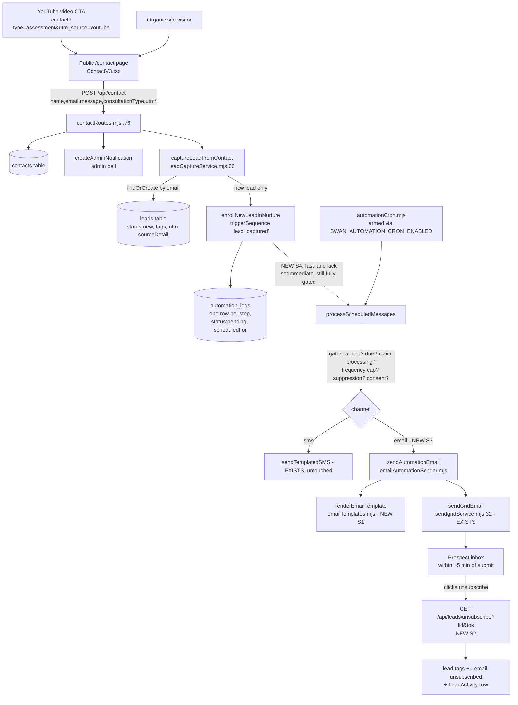
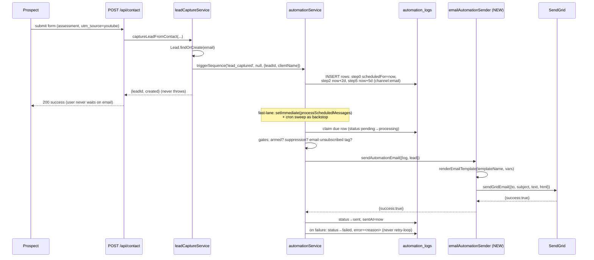
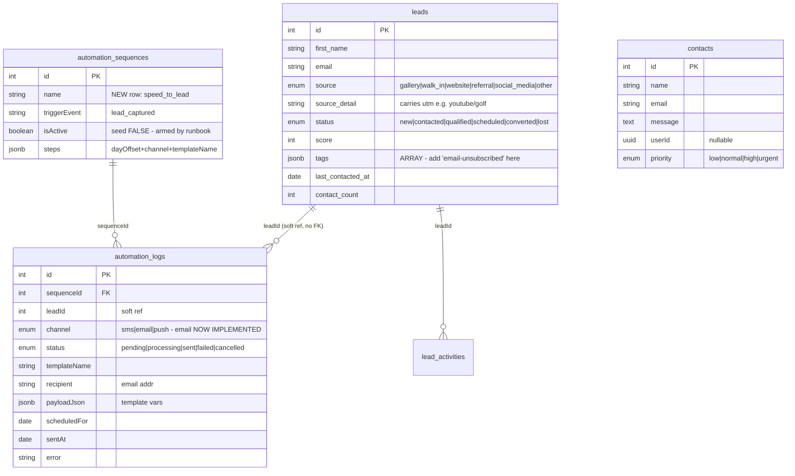
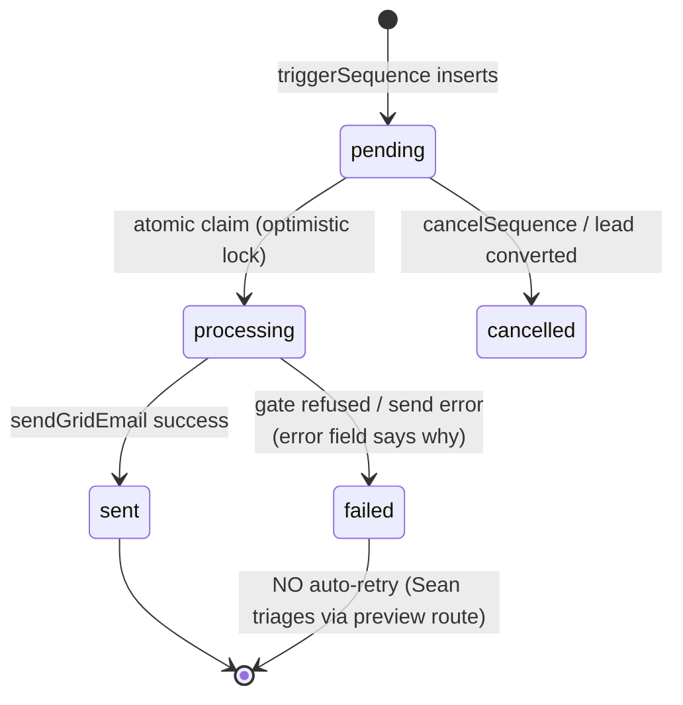

# 01 — Architecture

## A. The whole funnel (flowchart)



## B. Speed-to-lead send (sequence diagram — the critical path)



## C. Data model (ER — touched tables only; NO new tables)



**Schema deltas: ZERO migrations needed.** `automation_logs.channel` already has
`'email'` in its enum; `leads.tags` is JSONB. Unsubscribe = a tag + LeadActivity,
not a column. (If the builder believes a migration is needed, STOP — that's drift.)

## D. State machine — one automation_log row



## E. Component tree (frontend touch — S5 only)

```
MarketingWorkspace.tsx (route /dashboard/marketing — EXISTS)
└── SpeedToLeadStatusCard.tsx (NEW, ≤300 lines, styled-components)
    ├── ArmedBadge        (reads GET /api/automation/status)
    ├── PendingCount      (reads GET /api/automation/preview — email rows)
    └── RecentSendsList   (last 5 sent/failed email logs, relative time)
```
