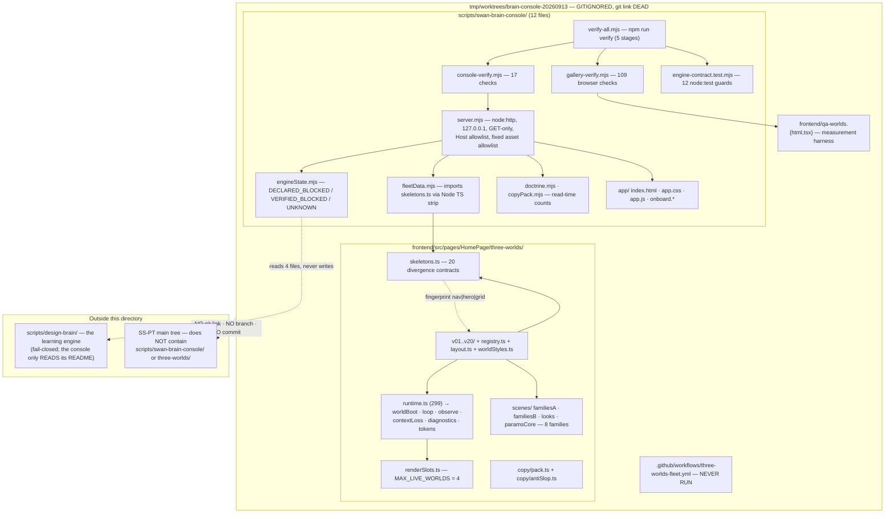
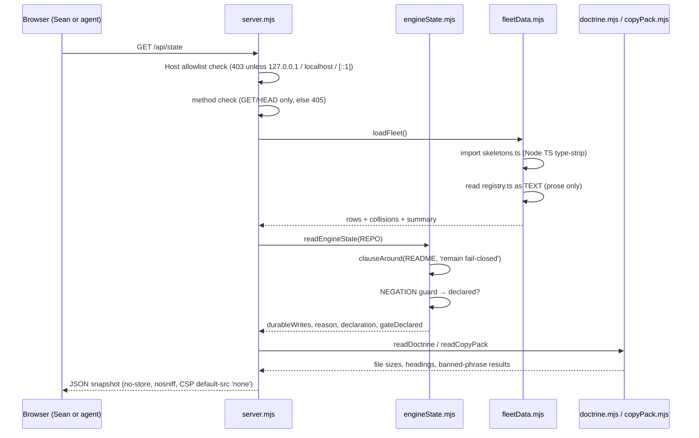
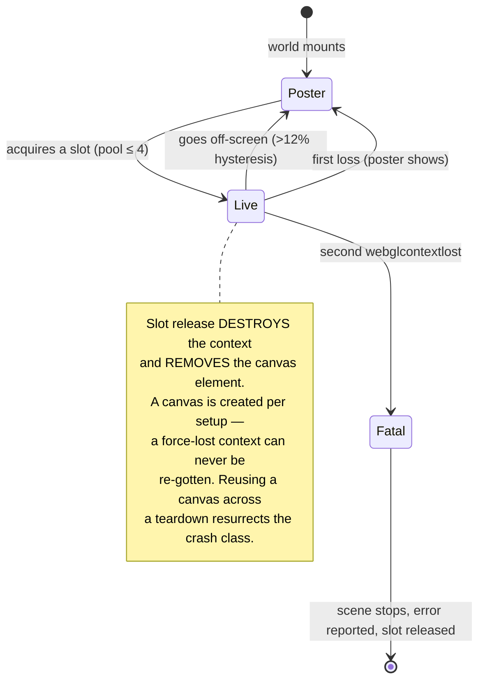
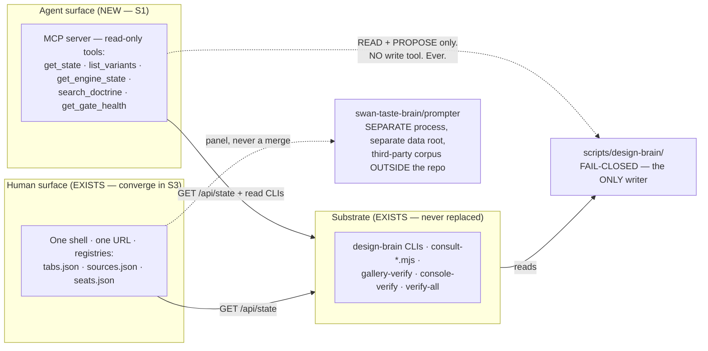
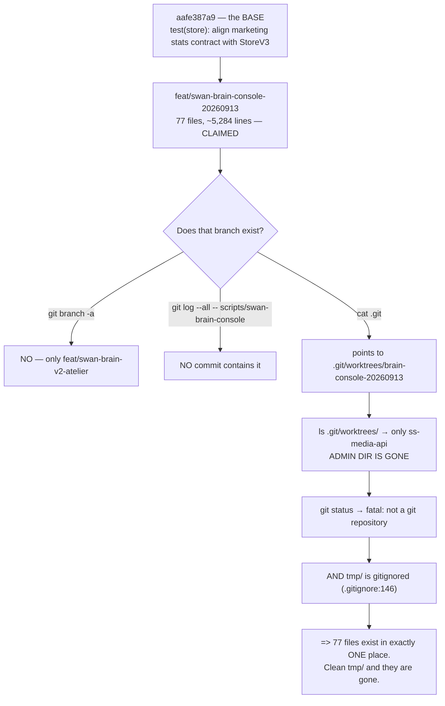

# 01 — Architecture (as-is, and the three-layer target)

## 1. As-is topology (verified 2026-09-18)

**Read the dotted line at the bottom.** That is the hazard: the entire left-hand column has no
version-control path to the right-hand column.

## 2. Data flow — one request

**Invariants visible in this flow:** every number is computed at read time; no branch of the handler
can reach the filesystem from the request path; `writeControls` is always `[]`.

## 3. The slot pool — the one invariant that must never break

Round 3 called this *"arithmetic, not a renderer mystery"*: browsers cap live WebGL contexts at
~8–16 and LRU-evict the oldest, firing `webglcontextlost`, after which `getActiveUniform` returns
null and Three's `parseUniform` dereferences it. 20 co-mounted variants exceed the cap **by
construction**. The pool is the fix; the hand-off is what makes it honest.

## 4. Target topology — three layers, one door

The dashed edge from the shell to the taste-brain is a **panel, not a merge** — a separate process
with a separate data root, surfaced in one UI. That is how Sean gets "one app" without putting
licensed corpus material inside SS-PT.

## 5. The untracked-work hazard, drawn

## 6. Rule 4 — file-size discipline

The workstream honours the ≤300-line cap, and the receipt records a genuine self-catch: the round-4
reviewer's own `runtime.ts` draft hit **353 lines** and the fleet suite's line-cap test rejected it
before a human saw it. Extraction produced `loop.ts`, `worldBoot.ts`, `contextLoss.ts`,
`diagnostics.ts`; final `runtime.ts` = **299**.

Two measured exceptions, both disclosed rather than hidden:
- `app/app.css` = **343 lines** — pre-existing overage, flagged, deliberately not grown.
- `gallery-verify.mjs` = **501 lines** — the verifier is a script, not product source; the cap test
  is scoped to the fleet. **Builder note:** do not cite this as licence to exceed the cap elsewhere.

## 7. Bounds (what the console can and cannot reach)

| Bound | Value | Enforced by |
|---|---|---|
| Bind address | `127.0.0.1` only | `server.mjs:40` |
| Accepted `Host` | `127.0.0.1`, `localhost`, `[::1]` | `ALLOWED_HOSTS`, checked before routing |
| Methods | `GET`, `HEAD` | 405 otherwise |
| Request → filesystem | **impossible** — path selects an allowlist KEY | `ASSET_ROUTES` |
| Engine writes | **none** | `writeControls: []`, asserted by test |
| Network / DB / `.env` | none | by construction |
