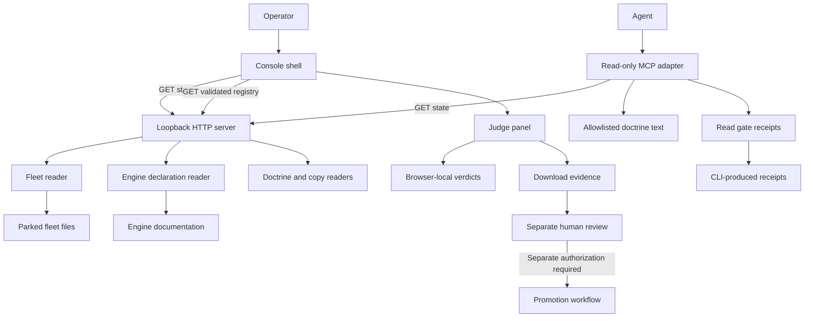
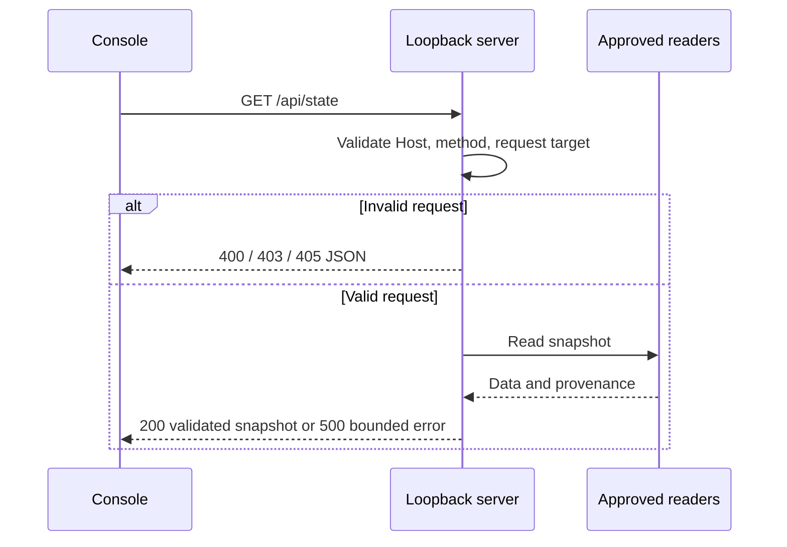
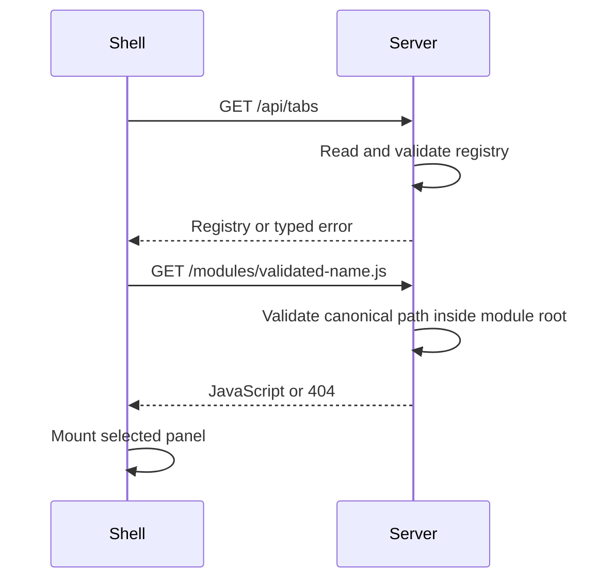
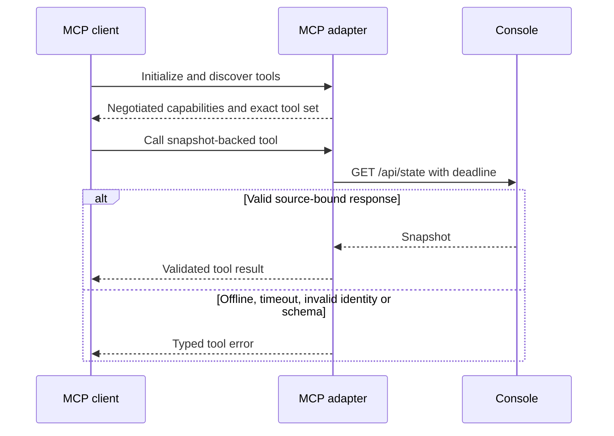
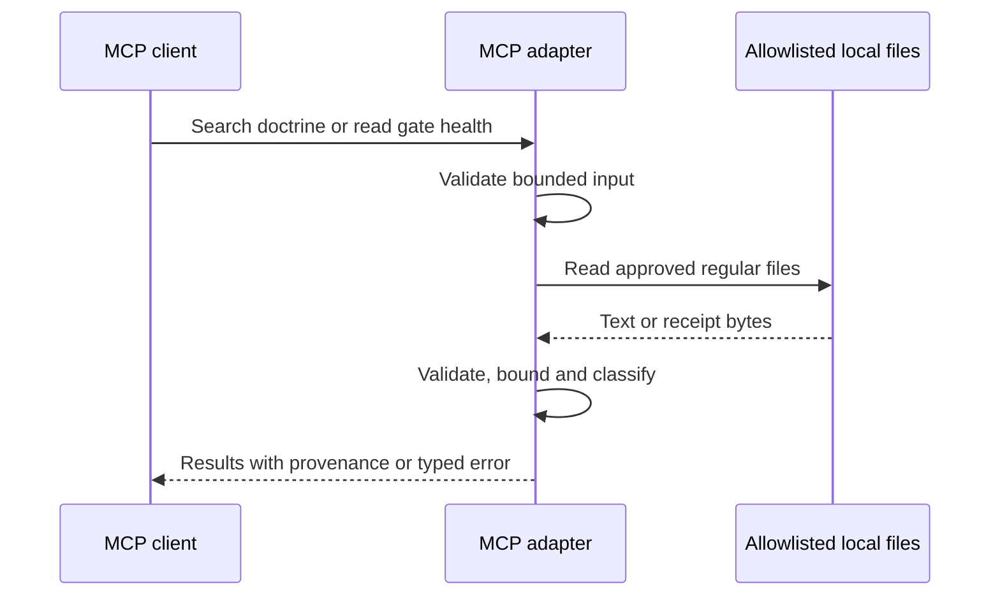
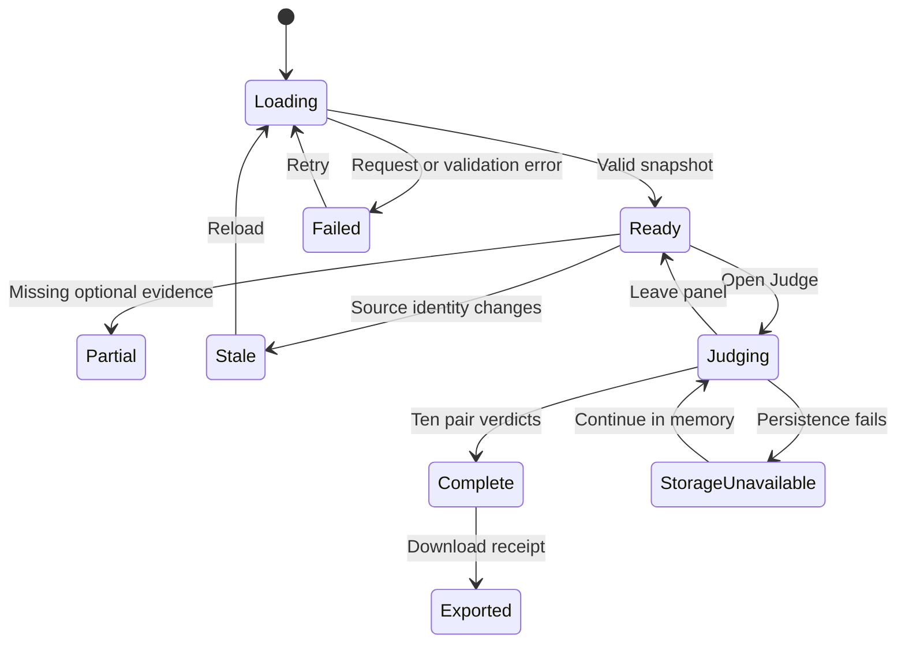

# Astra Reply — subscription transport — 2026-09-19T23:07:53.072Z

**Provider:** openai-codex
**Billing:** chatgpt-subscription
**Authentication:** chatgpt_subscription
**Transport:** codex-cli
**Requested model:** gpt-6-astra
**Served model:** unknown
**Tokens:** in=721444 out=12448
**Packet:** `C:/tmp/astra-dispatch/astra-review-request.md`
**Wall:** 425.9s
**Mega Blueprint:** ARMED (document)

> Marginal cost $0 — this leg rides the ChatGPT subscription, not OpenRouter.

---
Mega Blueprint. I’ll check the packet, prior review archive, and source evidence before issuing the required package. This session is read-only, so filing the review to `Z:\HostileReviews` is blocked; I’ll report that explicitly.

The packet already has two material contradictions: S0 omits integration files from its preservation manifest, and S2 cannot mount Judge Mode within its permitted file changes. I’m checking the source to distinguish documentation defects from runtime defects. I found and am applying the `fable-blueprint-forge` skill.

Source checks falsified several claims: the signature correction still assigns three React-owned attributes to the runtime; the wrapper is not fail-fast; and “every number is read at read time” overlooks Node’s cached skeleton import. I’m also testing malformed request handling without starting a server or changing files.

The strongest new defect is in the verifier: its “zero collisions” check accepts `10` because it searches for the character `0`. The snapshot also does not contain the claimed per-variant `findSlop` results. My advisory ruling is **REVISE**: preserve the work, repair the evidence and salvage plan first, then extend it. The earlier 204 checks remain reported evidence, not results rerun in this session.

## PART A — HOSTILE REVIEW

**Advisory disposition: REVISE.** Preserve and extend the implementation, but reject the package’s **EXECUTION-READY** status. Its preservation scope is incomplete, several tests prove weaker properties than claimed, and two proposed slices cannot be implemented within their declared boundaries.

**Review status: PARTIAL — archive filing BLOCKED.** I read the existing round-1 archive. This session permits filesystem reads only; no source, documents, archive records, or indexes were changed. Under Rule 74, this response is not a filed review.

Evidence notation:

- `C/` = `tmp/worktrees/brain-console-20260913/scripts/swan-brain-console/`
- `F/` = `tmp/worktrees/brain-console-20260913/frontend/src/pages/HomePage/three-worlds/`
- Document section citations refer to the supplied packet.
- `[VERIFIED]` means directly inspected or probed this session; it does not imply deployed behavior.

The on-disk dispatch packet’s SHA-256 is:

```text
F14F510F3B19D62C10A9BB1762BE37E31CDC2F06D438F5891DD3CF9C632D80DD
```

### A1 — Verified findings

| ID | Severity | Finding, evidence, and concrete disposition |
|---|---|---|
| F01 | HIGH | **Salvage omits integration dependencies.** `[VERIFIED]` `05-slices.md#S0` excludes root `package.json`, although the orphan’s `package.json:5` supplies `npm run verify`. The current checkout has no `scripts.verify`. The orphan’s `frontend/package.json:90` also declares `@types/three`, absent from the current checkout’s manifest. **Fix:** preserve integration diffs and lockfiles as evidence; perform byte-preserving salvage first, then a separate integration slice that ports required manifest changes without overwriting destination manifests. Verify against a clean dependency installation. |
| F02 | HIGH | **Judge Mode cannot become reachable within its permitted scope.** `[VERIFIED]` `04-build-order.md#S2` permits only two asset additions to the server. Existing HTML loads only `app.js` and `onboard.js` (`C/app/index.html:173–174`); tabs are hardcoded (`C/app/app.js:34–55`). No permitted edit imports or mounts Judge Mode. Its browser exporter is also absent from the permitted asset additions. **Fix:** explicitly include HTML, tab-controller integration, exporter serving, and browser tests—or complete the registry shell before Judge Mode. |
| F03 | MEDIUM | **“Zero collisions” accepts nonzero collisions.** `[VERIFIED]` `C/console-verify.mjs:90–93` uses `collisionCard.includes('0')`. A direct probe returned `true` for `"Fingerprint collisions\n10"`. The rendered card actually contains the collision count (`C/app/app.js:116–120`). **Fix:** inspect the dedicated numeric value and require exact zero; test 0, 1, 10, and 20. This falsifies the verifier’s claimed assertion, not the present fleet’s uniqueness. |
| F04 | MEDIUM | **Malformed request targets bypass the promised first guard.** `[VERIFIED]` `new URL()` executes outside error handling at `C/server.mjs:86`, before Host validation at `:102–105`. An in-memory invocation of the actual handler with `url: 'http://['` and a denied Host rejected with `ERR_INVALID_URL`, sending zero responses. **Fix:** validate Host first, catch URL parsing, return a bounded 400 response, and retain an outer handler error boundary. `[UNKNOWN]` Actual listener termination was not tested. |
| F05 | MEDIUM | **The copy snapshot is not the documented copy-gate result.** `[VERIFIED]` `03-contracts.md#1.1` claims per-variant banned-phrase results from `findSlop`. `C/copyPack.mjs:69–95` never calls it; it returns extracted copy, an import-string indicator, and a count of phrase-like source lines. A direct invocation confirmed those keys. **Fix:** describe the current data honestly; add actual canonical `findSlop` evaluation as a separately tested change. Do not label phrase-source counts as gate results. |
| F06 | MEDIUM | **The signature correction is incomplete.** `[VERIFIED]` `03-contracts.md#2.5` says runtime solely owns `data-live`, `data-motion`, and `data-nav-model`. React renders them in `F/WorldPage.tsx:102–106`. **Fix:** assign these three attributes to `WorldPage`; assign frame/context/render diagnostics to the runtime. Add an ownership regression check for `data-frames` specifically. |
| F07 | MEDIUM | **“Every number is read at read time” is false for skeleton-derived data.** `[VERIFIED]` `C/fleetData.mjs:30–32` repeatedly imports the same module URL. Two calls returned the identical `SKELETONS` array object. The source is canonical, but its module instance is cached. **Fix:** declare skeletons process-scoped and require restart after changes, or implement bounded reload semantics. Avoid unlimited cache-busting imports. |
| F08 | MEDIUM | **The package overstates accessibility coverage.** `[VERIFIED]` `02-wireframes.md#0` says every control is measured at 44×44. `C/console-verify.mjs:121–135` tests height only, with Fleet selected. Its viewport loop retains that panel (`:137–147`). This does not prove width or all-panel responsiveness. **Fix:** measure both dimensions, visit every panel at every required viewport, and test loading/error/placeholder states. |
| F09 | MEDIUM | **The proposed extension boundaries contradict the fixed server boundary.** `[VERIFIED]` `04-build-order.md#S3` lists registries and a shell but no server integration. `C/server.mjs:49–55` serves a fixed asset set. Registry JSON and new modules therefore remain unreachable. “One row plus one module” requires a defined, constrained module-serving mechanism. **Fix:** add explicit registry validation and module-serving contracts; reject traversal, remote modules, duplicate IDs, and unknown API identifiers. |
| F10 | MEDIUM | **MCP and Gate Health are scheduled before their contracts exist.** `[VERIFIED]` `03-contracts.md#4` introduces five tools, but Gate Health files arrive in S4. Search roots have no disclosure allowlist or bounds; `filter: 'nav_model'` provides no value; protocol lifecycle and errors are unspecified. `04-build-order.md#S1` also imports readers directly despite the HTTP-adapter contract. **Fix:** define Gate Health’s missing-result representation before S1, select one snapshot source, specify bounded search/filter semantics, and require a real MCP-client handshake test. |
| F11 | LOW | **The wrapper is not fail-fast, and cleanup completion is unproven.** `[VERIFIED]` `C/verify-all.mjs:68–81` continues after failed stages; `:99` and `:117` call `kill()` without awaiting termination. `09-tests.md#0` claims fail-fast and clean shutdown. **Fix:** choose and document aggregate execution, mark dependent stages skipped when prerequisites fail, and await owned-child exit with a deadline. |
| F12 | LOW | **Preservation and verification records contradict one another.** `[VERIFIED]` `MEGA-BLUEPRINT.md#3` says the files exist in exactly one place, while the packet declares a backup. The backup tarball and manifest exist on `Z:`; their byte identity was not rerun. Its §4 marks three gates unexecuted, whereas `09-tests.md#8` reports execution. S0 copies documents that its hash manifests omit. **Fix:** maintain one timestamped evidence ledger and one explicit manifest covering every preserved artifact. Distinguish backup existence, verified backup, tracked branch, and committed recovery point. |

### A1 — Claims tested and found FALSE

These are falsifications, not merely missing evidence:

1. **“The collision check establishes zero collisions.”** It accepts 10.
2. **“The corrected contract accurately assigns all diagnostic attributes.”** Three listed attributes are React-owned.
3. **“The snapshot contains per-variant `findSlop` results.”** Its actual returned structure does not.
4. **“Host validation is checked first.”** URL parsing executes first and can reject.
5. **“Every number is read at read time.”** Skeleton imports reuse a cached module instance.
6. **“The wrapper is fail-fast.”** Later stages execute independently of earlier failures.
7. **“44×44 controls are measured by console verification.”** Only height is checked.
8. **“T-2 is a current RED case.”** The extracted current `isPresenting` predicate already returns false for a running loop with a lost context. Missing coverage is not proof of defective behavior.

Additional documentation falsifications:

- `[VERIFIED]` The stated wireframe palette and focus ring do not match `C/app/app.css:13–26,147`: the implementation defines `--obsidian`, `--carbon`, and a purple focus ring.
- `[VERIFIED]` `03-contracts.md#I7` attributes absence of POST routes to engine tests. The relevant test asserts only `writeControls: []` (`C/engine-contract.test.mjs:44–45`).
- `[VERIFIED]` “Every screen and state” is not supplied: the original wireframes omit dedicated Doctrine, Canvas, Copy, Seats, Memory, and Ship layouts and Judge’s mobile/error states.

### A1 — Prior findings and unverified claims

- **D1–D3:** `[VERIFIED]` source still contains the cumulative counter, unused diagnostic readers/predicate, and 25%/12% contradiction. Retain them; do not count them as new findings.
- **D4:** retain as a **latent API hazard**. No reachable double release was established in this session.
- **D5:** broaden its acceptance test to reject a stale instance of the *same* application. A title check alone cannot establish candidate identity.
- **D6:** the same result-loss structure exists in `console-verify.mjs:163–172`; the sibling verifier also needs crash-safe reporting.
- **204 previous checks:** reported prior evidence, **not rerun here**.
- **Backup 81/81 identity, browser geometry, production isolation, CI execution, current live listener identity:** **NOT VERIFIED here**.
- **Screenshot uniqueness:** `[VERIFIED]` the verifier compares sampled PNG-byte hashes (`C/gallery-verify.mjs:131–135,330–335`). That establishes differing captured bytes, not perceptual design distinctness.
- **“A federation cannot erode write isolation”:** unsupported architectural certainty. Process separation helps, but capability boundaries and enforcement determine write isolation.
- **“Copyright requires separate applications”:** no legal conclusion established. Preserve the existing corpus boundary; it does not alone prove a particular UI architecture is necessary.

**Merge ruling:** retain **salvage and extend** as the least disruptive recommendation. Passing tests support preserving useful work; they do not prove that every proposed extension is ready. Separate operator and SaaS processes remain a sensible scope boundary. MCP is an adapter opportunity, not something already implemented by having JSON.

### A2 — One self-review pass of the replacement package

The initial replacement draft had four weaknesses. This emitted version incorporates their fixes:

| Self-finding | Correction incorporated below |
|---|---|
| Replacing the stale plan could silently become implementation authorization. | All artifacts are an **advisory replacement proposal**; no source changes, commit, or release is authorized by this review. |
| A full five-tool MCP slice still depended on an undefined Gate Health producer. | Defined explicit `NOT_RUN`/`INVALID`/`STALE` states; no execution from the reader. Protocol/dependency selection remains a bounded prerequisite. |
| Judge export could be mistaken for promotion approval. | Receipt explicitly states `approval: "NONE"` and identifies source bytes; selection evidence cannot authorize promotion. |
| Registry extensibility could reintroduce arbitrary filesystem serving. | Defined canonical-root checks, fixed module namespace, no remote imports, and invalid-registry failure behavior. |

## PART B — FORGED PACKAGE

### 00-README.md

# Swan Brain Console V3 — proposed review revision

**Status:** REVISE; implementation and release readiness remain blocked.  
**Authority:** advisory replacement for the supplied package, pending adoption by its owner. Preserve the original `MEGA-BLUEPRINT.md`; do not silently overwrite it.

**Objective:** recover a reproducible operator console and parked fleet, correct misleading evidence, then extend the existing console through bounded read-only interfaces.

**Requirements**

| ID | Acceptance |
|---|---|
| R1 Preservation | Every inventoried source, integration diff, and governing document has a verified preservation record. |
| R2 Reproducibility | Fresh destination dependencies resolve the fleet; scoped typecheck and named suites execute there. |
| R3 Truthful evidence | Counts, gate states, freshness, and source identity have explicit provenance. |
| R4 Read-only boundary | Console/MCP perform no engine, repository, provider, or production mutations. |
| R5 Reachable extensions | Every approved module is mounted, served, keyboard reachable, and tested through its caller. |
| R6 Judging | Deterministic pairs, browser-local persistence, source-bound exports, no promotion authority. |
| R7 Accessibility | Every panel/state is checked at desktop and 375px; all controls meet both 44px dimensions. |

**Order:** S0 preservation → S0.1 integration → S0.2 evidence repairs → S3 registry foundation → S1 MCP → S2 Judge → separately approved S4/S5 backlog.

Original slice identifiers are retained to preserve history.

**Builder contract:** implement only an adopted slice. Preserve other agents’ files. Stage explicit paths. Stop at its checkpoint with actual evidence. Unknown evidence remains unknown; missing tools or dependencies do not justify fabricated passes.

**Non-goals:** production homepage promotion, engine unlock, model execution, corpus ingestion, global instruction changes, deployment.

### 01-architecture.md

# Architecture and ownership

The operator server remains independent of the SaaS runtime. Existing CLI tools remain separate executables. MCP consumes the validated console snapshot; it does not silently substitute direct readers when HTTP fails.



**Screen flows**

- Doctrine/Fleet/Canvas/Copy/Engine: load snapshot → validate → render success, partial, or failure.
- Seats/Memory/Ship: explicit unavailable capability; no action implies hidden integration.
- Judge: validate fleet identity → restore compatible local state → compare → export.
- Gate Health: read receipts → classify each gate → display; never execute a gate.











**WebGL contract:** retain the existing four-slot limit during these slices. Reset per-context frame evidence on successful setup; evaluate frame advancement within the same context generation. Do not substitute cumulative historical frames for current rendering.

**ERD:** N/A — no relational database tables or ORM columns are introduced or changed. Browser-local receipt structure is defined in `03-contracts.md`.

**Diagram rendering:** literal Mermaid supplied; rendered preview not verified in this session.

### 02-wireframes.md

# Operator surfaces

These are **proposed corrected layouts**, not claims that they match every current pixel.

**Exact tokens:** use existing definitions:

```css
background: var(--obsidian, #0a0a0f);
color: var(--frost, #e0ecf4);
border-color: var(--hairline, rgba(96, 192, 240, 0.18));
/* Panels */
background: var(--carbon, #141419);
/* Focus */
outline: 2px solid var(--purple, #8b5cf6);
outline-offset: 2px;
/* Error text */
color: var(--danger, #ff8a8a);
```

Every control: minimum 44×44px. Long paths wrap. Tables scroll inside their panel. Tabs use one horizontal scroll strip at 375px; no page-level horizontal scrolling.

**Shared desktop frame**

```text
Swan Brain Console                                      [?]
Read-only operator surface
[Doctrine][Fleet][Canvas][Copy][Engine][Seats][Memory][Ship]
[Judge][Gate Health]

{Selected panel heading}
{Status message}
{Panel content}

Source: {sourceId}    Snapshot: {generatedAt}
```

**Shared 375px frame**

```text
Swan Brain Console        [?]
Read-only operator surface
[Doctrine][Fleet][Canvas] →  local tab-strip scroll

{Selected panel heading}
{Status message}
{Single-column content}

Source: {wrapped sourceId}
Snapshot: {wrapped timestamp}
```

Judge and Gate Health tabs appear only after their slices pass.

**Panel layouts — desktop / 375px**

```text
Doctrine
Desktop: [Present documents] [Archetypes]
         Document | Role | Lines | Headings | State
375px:   [Present documents]
         [Archetypes]
         [Document table → local scroll]

Fleet
Desktop: [Variants] [Distinct nav models] [Fingerprint collisions]
         ID | Title | Nav model | Hero mechanic | Grid | Cost it accepts | Render
375px:   [Summary cards stacked]
         [Fleet table → local scroll]
         Render action: [Watch it move]

Canvas
Desktop: Round {n}   [v01] [v02] [v03] [v04] [v05]
375px:   Round {n}
         [v01]
         [v02]
         ...single column
Each card: {title}, {tuple}, [Watch it move]

Copy
Desktop: [Variants with copy] [Stat source]
         {ID} {headline}
         {sub}
         Gate result: {status}
375px:   Same fields stacked, wrapped.

Engine
Desktop: State: {durableWrites}
         Declaration: {verbatim declaration}
         Runtime gate verification: Not available
         Write controls: None
375px:   Same fields stacked, declaration wrapped.

Seats
Both: Model seats are not wired in this build.
      No model execution is available here.

Memory
Both: Durable learning is not readable from here yet.
      Engine unlock alone does not connect this panel.

Ship
Both: Promotion is a reviewed commit, never a console action.
      A judging receipt records preference; it does not approve release.
```

**Judge**

```text
Desktop:
Judge                         Pair {1..10} of 10
[v01: title / structure / cost] | [v02: title / structure / cost]
[Watch it move]                 | [Watch it move]
[1 · pick left]                 | [2 · pick right]
[E · either] [N · neither] [← back] [→ next pair]
Judged: {count}/10
[Export JSON ↓] [Export Markdown ↓]

375px:
Judge
Pair {1..10} of 10
[v01: wrapped details]
[Watch it move]
[1 · pick left]
[v02: wrapped details]
[Watch it move]
[2 · pick right]
[E · either]
[N · neither]
[← back] [→ next pair]
Judged: {count}/10
[Export JSON ↓]
[Export Markdown ↓]
```

This slice compares structural summaries and links to live previews. Embedded live comparison is deferred; no iframe/CSP expansion is implicit.

**Gate Health**

```text
Desktop:
Gate Health
Gate | Result | Source | Finished | Evidence
{gate} | NOT_RUN / PASS / FAIL / STALE / INVALID | ...

375px:
Gate Health
{gate}
Result: {status}
Source: {wrapped sourceId}
Finished: {timestamp or "Not available"}
Evidence: {reference or "Not available"}
```

No “re-run now” control.

**Shared state frames and exact copy**

```text
Loading:
{Panel}
Loading console state…

Empty:
{Panel}
No records available.

Partial:
{Panel}
Some evidence is unavailable.
{available content; missing fields say "Not available"}

Denied:
{Panel}
Request refused.
[Retry]

Failure:
{Panel}
Console state could not be loaded.
[Retry]

Invalid:
{Panel}
Console data failed validation.
[Retry]

Stale:
{Panel}
Source changed. Reload before judging.
[Reload]

Judge storage failure:
Verdicts cannot be saved in this browser.
You can continue and export this session.

Judge invalid stored data:
Saved verdicts could not be read.
[Continue without saved verdicts]

Judge complete:
All 10 pairs judged. Export your preferences for review.

Export failure:
Download could not be started. Try again.
[Export JSON ↓] [Export Markdown ↓]
```

All frames use the shared desktop/mobile container. Retry preserves focus; status changes use a polite live region. Judge shortcuts operate only in the active panel and ignore editable controls and modifier combinations.

### 03-contracts.md

# Contracts, provenance, and rollback

**Existing HTTP surface:** retain `GET`/`HEAD`, loopback binding, existing asset paths, and JSON no-store headers. Host refusal precedes URL parsing. Invalid target → 400; denied Host → 403; unsupported method → 405; unknown route → 404. HEAD responses contain no body.

**Corrected current facts**

- `WorldPage` owns `data-live`, `data-motion`, `data-nav-model`.
- Runtime owns frame/context/render diagnostics.
- Current copy extraction is not canonical copy-gate execution.
- Current skeleton module is cached for the process lifetime.
- `writeControls: []` is metadata, not proof of method enforcement.
- `VERIFIED_BLOCKED` remains unavailable without a real gate probe.

**Proposed source binding**

Add an additive `provenance` object:

```ts
type Provenance = {
  schemaVersion: 1;
  instanceId: string;       // Random process-start identifier; not a credential
  sourceId: string;         // SHA-256 of sorted path/hash manifest
  startedAt: string;        // ISO UTC
  skeletonLoadedAt: string;
  skeletonSourceHash: string;
  skeletonCurrentHash: string;
  stale: boolean;
};
```

The manifest covers console implementation, fleet implementation, relevant configuration, and package/lockfile dependencies. Exclude secrets, caches, screenshots, and local stores. Changed skeleton bytes make `stale: true`; consumers must refuse new judging sessions until restart. No claim of atomic multi-file snapshots is permitted without implementation proof.

**Registry**

```ts
type Tab = {
  id: string;       // /^[a-z][a-z0-9-]{0,31}$/
  label: string;    // 1..60 characters
  module: string;   // basename matching /^app-[a-z0-9-]+\.js$/
  api: "state" | "gate-health" | "none";
};
```

Maximum 16 unique tabs. Modules resolve only within the approved module directory; canonical-path validation rejects escaping symlinks. No remote URLs, query strings, arbitrary paths, or eval. Invalid registry → typed 500 response; keep an already-rendered last valid shell with a visible stale warning.

**MCP tool semantics**

| Tool | Input | Output/bounds |
|---|---|---|
| `swan_get_state` | `{}` | Validated snapshot |
| `swan_list_variants` | `{wildcard?: boolean, navModel?: string}` | Matching rows; invalid enum rejected |
| `swan_get_engine_state` | `{}` | Engine object plus provenance |
| `swan_search_doctrine` | `{query: string, limit?: number}` | Literal case-insensitive search; query 1–200 chars; limit 1–50, default 20 |
| `swan_get_gate_health` | `{}` | Gate statuses, never execution |

Search only explicitly inventoried public doctrine files; exclude local catalogs, third-party corpus, secrets, symlinks, and arbitrary caller paths. Maximum scanned file size 1 MiB and response size 128 KiB.

HTTP-backed tools use the configured loopback port, a five-second deadline, no redirects, no retries, and a 2 MiB response limit. Errors distinguish `CONSOLE_UNAVAILABLE`, `TIMEOUT`, `INVALID_RESPONSE`, `SOURCE_STALE`, and `INVALID_ARGUMENT`.

**Protocol prerequisite:** select an installed, compatible MCP implementation and pin its exact protocol/dependency versions before S1 implementation. Do not implement an ad hoc line reader and label it MCP. Acceptance requires initialization, tool discovery, calls, invalid input, and disconnect through an actual MCP client.

**Gate receipt**

```ts
type GateReceipt = {
  schemaVersion: 1;
  gateId: string;
  sourceId: string;
  runId: string;
  command: string[];
  startedAt: string;
  finishedAt: string;
  exitCode: number;
  status: "PASS" | "FAIL";
  evidencePaths: string[];
};
```

Missing receipt → `NOT_RUN`; malformed or inconsistent exit/status → `INVALID`; different source → `STALE`. Gate readers never create receipts. Only explicitly invoked verifier CLIs write them.

**Judge record**

```ts
type JudgeSession = {
  schemaVersion: 1;
  sourceId: string;
  sessionId: string;
  createdAt: string;
  updatedAt: string;
  pairs: Array<{
    left: string;
    right: string;
    verdict: null | "left" | "right" | "either" | "neither";
  }>;
  approval: "NONE";
};
```

Pair sorted IDs consecutively: v01/v02 through v19/v20. Exactly ten pairs; no ranking or winner inferred. Revisiting replaces a pair’s verdict rather than adding another. Store under `swan-brain:judge:v1:{sourceId}`. Different source identities never silently reuse verdicts. Downloads are separate user actions to avoid multi-download blocking.

**Environment:** retain default port 4599; introduce no provider keys or production DB configuration. A configurable gallery URL must be loopback-only and used consistently by UI and verification.

**Migrations:** N/A — no DB migration. Invalid browser-local state is preserved but not consumed.

**Rollback:** retain original source and verified archive. Revert only the adopted integration/extension commits after separate authorization. Never delete the orphan as part of salvage. Browser-local verdicts remain exportable; no automatic storage deletion.

### 04-build-order.md

# File responsibilities

All new implementation files ≤300 lines. Existing oversized files must not grow; extraction is a separately scoped change.

| Slice | Files / entry points | Responsibility |
|---|---|---|
| S0 | Preservation manifest and evidence directory | Inventory source, documents, integration diffs, backup identity |
| S0.1 | Root/frontend manifests and associated lockfiles | Port required script/types dependencies surgically |
| S0.2 | `C/server.mjs`, `fleetData.mjs`, `copyPack.mjs` | Request errors, provenance, truthful copy results |
| S0.2 | `C/console-verify.mjs`, `gallery-verify.mjs`, `verify-all.mjs` | Exact assertions, source binding, crash-safe results, owned-child cleanup |
| S0.2 | `F/runtime.ts`, diagnostics and tests | Context-generation evidence; ownership contracts |
| S3 | `app/index.html`, `app/app.js`, new shell/registry modules, server routes | Reachable registry-driven panels |
| S1 | `mcp/server.mjs`, `tools.mjs`, schemas/client adapter/tests | Exact read-only tools and protocol integration |
| S2 | Judge controller/model/exporter/styles/tests, registry row | Deterministic preference capture and download |
| S4.1 | Gate receipt reader, panel, verifier receipt writer | Source-bound evidence display |
| S4.2/S4.3/S5 | Deferred | Screenshot baselines, adaptive cap, new material families |

**Existing patterns to preserve**

- `C/app/app.js:18–24`: create DOM nodes and assign `textContent`.
- `C/server.mjs:49–55`: explicit serving boundary; extend deliberately.
- `C/engine-contract.test.mjs:44–45`: narrow metadata assertion; add HTTP tests separately.
- `F/WorldPage.tsx:102–106`: React ownership of structural attributes.

**Proposed pure interfaces**

```ts
makePairs(ids: string[]): Array<{left: string; right: string}>;
setVerdict(session: JudgeSession, index: number, verdict: Verdict): JudgeSession;
exportJudge(session: JudgeSession): {json: string; markdown: string};
validateTabs(input: unknown): Tab[];
classifyGate(input: unknown, sourceId: string): GateHealth;
```

No production routes, engine source, or doctrine content are changed by these slices.

### 05-slices.md

# Slice acceptance

**S0 — Preservation**

1. Enumerate every file in the two scopes, harness/config/workflow files, governing documents, and relevant package/lockfile differences.
2. Verify the existing archive against its manifest; record what it excludes.
3. Choose a registered worktree outside temporary-cleanup roots.
4. Copy without deleting source.
5. Compare manifests, including document hashes.
6. Record source/destination identities and unresolved integration differences.

**STOP:** preservation must pass before implementation. A registered but uncommitted worktree is not a durable committed recovery point.

**S0.1 — Integration**

Port necessary manifest changes into the pinned destination base. Do not replace whole manifests. Install from the resulting lockfile in an isolated environment. Run scoped typecheck and existing suites there.

**STOP:** no MCP or UI extension until dependencies and the verification entry point work in the destination.

**S0.2 — Evidence repair**

Repair F03–F08 and F11; retain D1–D6 dispositions. Add source-bound verifier startup. A pre-existing foreign or stale listener must not be adopted automatically.

**STOP:** observed failing regression cases become green; existing behavior remains checked. T-2 is a characterization test, not claimed RED evidence.

**S3 — Registry foundation**

Serve and validate registries/modules; mount existing panels through the shell. Add a ninth fixture panel without shell edits. Preserve keyboard behavior and content.

**STOP:** invalid registry/module paths are rejected; all eight existing panels pass desktop/mobile checks.

**S1 — MCP**

Resolve and document the protocol prerequisite. Implement exactly five tools, bounded inputs, output validation, and unavailable-console behavior.

**STOP:** a real client completes initialization, discovery, and calls. No filesystem writes, child CLI execution, provider calls, or production access.

**S2 — Judge**

Implement deterministic pairs, local persistence, source-change protection, and separate downloads. Register and mount the panel.

**STOP:** browser reload, storage refusal, invalid saved state, keyboard input, mobile layout, and export contents pass.

**S4/S5 — Deferred**

- Gate Health may proceed only with receipt writer/reader agreement.
- Screenshot diff requires deterministic capture conditions and approved baselines.
- Adaptive cap requires measurements; `hardwareConcurrency` alone is not a GPU-capacity measurement.
- New families require explicit visual specifications and disposal tests.

No implementation authority is implied for these deferred slices.

### 06-bans.md

# Enforcement boundaries

1. No engine writes, provider execution, promotion, production access, or arbitrary CLI execution from console/MCP.
2. Browser-local preference persistence and user-triggered downloads are explicitly permitted; they are not engine writes.
3. No production route changes or corpus copying.
4. No broad staging, source deletion, shared-tree reset, or whole-manifest replacement.
5. No inferred MCP compatibility from JSON-over-stdio.
6. No green state from missing, stale, malformed, or source-mismatched evidence.
7. No source identity inferred solely from port, page title, or HTTP 200.
8. No arbitrary registry paths, remote modules, traversal, or escaping symlinks.
9. No `innerHTML` with source-derived data.
10. No render-health claim from historical frame counts alone.
11. No perceptual-distinctness claim from differing PNG bytes alone.
12. No gate-execution control in Gate Health.
13. No promotion authority in judging exports.
14. No speculative hardware-cap changes.
15. No commit, push, deployment, or paid review authorized by this advisory package.

### 07-checkpoints.md

# Evidence and readiness

Each checkpoint records:

```text
sliceId
sourceManifestHash
destinationBaseCommit
changedPaths
commands and working directories
exit codes
named assertions
evidence paths
unverified boundaries
review disposition
next permitted slice
```

**PASS** means the slice’s named criteria were observed, not that the product is deployed.

**Current receipt**

| Category | Status |
|---|---|
| Packet and prior archive inspected | VERIFIED |
| Source evidence and in-memory probes | VERIFIED within stated scope |
| Existing source preserved unchanged | No mutations performed |
| Existing 204 checks independently rerun | NOT RUN |
| Backup byte identity rechecked | NOT RUN |
| Proposed regression tests implemented | NOT RUN |
| Browser/mobile acceptance | NOT RUN |
| MCP interoperability | NOT RUN |
| Secret scan on emitted package files | NOT RUN — files not written |
| Review archive filing | BLOCKED — read-only filesystem |
| Native workflow-hook execution | UNVERIFIED |
| Plan/implementation/release readiness | BLOCKED |

Review-chain authority remains with the existing owner and Final Decider. This independent review does not appoint itself the commit gate.

**Archive continuation:** when writable execution is available, file a new dated review referencing round 1, preserve all prior findings and history, and reindex. Do not relabel this response as already archived.

**Hygiene:** no temporary files, screenshots, source edits, or cleanup operations were created by this review.

### 09-tests.md

# Executable test plan

The following are **proposed test files and exact case requirements**, not executed results.

Commands assume the adopted destination repository as working directory.

| File | Named cases and what they prove |
|---|---|
| `scripts/swan-brain-console/server-contract.test.mjs` | `denied Host precedes malformed URL`; `malformed target returns 400 without unhandled rejection`; `POST PUT PATCH DELETE return 405`; `HEAD has no body`; `unknown asset returns 404` |
| `scripts/swan-brain-console/evidence-contract.test.mjs` | `collision count accepts only zero`; fixtures 0/1/10/20; `cached skeleton change marks snapshot stale`; `copy result equals canonical findSlop output`; `missing copy source is unavailable, not clean` |
| `scripts/swan-brain-console/verify-all.test.mjs` | `foreign listener rejected`; `same application wrong source rejected`; `child exit before readiness fails`; `hung fetch times out`; `partial results survive verifier exception`; `owned children terminate before completion`; `unrelated listener is never killed` |
| `frontend/src/pages/HomePage/three-worlds/__tests__/runtime.contract.test.ts` | `new context starts new frame generation`; `reacquired non-rendering world fails current presentation`; `lost context is not presenting`; `WorldPage does not own data-frames` |
| `scripts/swan-brain-console/app/app-shell.test.mjs` | `ninth fixture panel mounts without shell edit`; `duplicate ID rejected`; `remote module rejected`; `traversal rejected`; `escaping symlink rejected`; `unknown API rejected` |
| `scripts/swan-brain-console/mcp/tools.test.mjs` | `exact five-tool set`; `invalid filter rejected`; `search treats query literally`; `search respects file and output limits`; `missing receipts return NOT_RUN`; `offline console returns typed error without exiting` |
| `scripts/swan-brain-console/mcp/protocol.test.mjs` | `real client initializes`; `real client discovers tools`; `real client calls each tool`; `malformed arguments rejected`; `disconnect releases resources` |
| `scripts/swan-brain-console/app/judge-export.test.mjs` | `twenty IDs produce ten unique pairs`; `replacement verdict does not duplicate`; `invalid stored schema rejected`; `source mismatch rejected`; `JSON and Markdown contain identical verdicts`; `approval is NONE`; `Markdown values escaped` |
| `scripts/swan-brain-console/gateHealth.test.mjs` | `missing is NOT_RUN`; `malformed is INVALID`; `wrong source is STALE`; `PASS requires exit zero`; `reader performs no writes` |

**Unit/contract commands**

```bash
node --test scripts/swan-brain-console/server-contract.test.mjs scripts/swan-brain-console/evidence-contract.test.mjs scripts/swan-brain-console/verify-all.test.mjs
node --test scripts/swan-brain-console/app/app-shell.test.mjs scripts/swan-brain-console/app/judge-export.test.mjs
node --test scripts/swan-brain-console/mcp/tools.test.mjs scripts/swan-brain-console/mcp/protocol.test.mjs
node --test scripts/swan-brain-console/gateHealth.test.mjs
node --test scripts/swan-brain-console/engine-contract.test.mjs
```

From `frontend/`:

```bash
node node_modules/typescript/bin/tsc --noEmit -p tsconfig.three-worlds.json
node node_modules/vitest/vitest.mjs run src/pages/HomePage/three-worlds/__tests__/
```

**Browser acceptance**

Extend `console-verify.mjs` to visit every panel and shared state, testing:

- both control dimensions;
- one tab stop, arrow navigation, visible selected panel;
- viewport sizes 320×800, 375×812, 414×896, 768×1024, 1280×900, 2560×1440, 3840×2160;
- Judge persistence, storage failure, source mismatch, both download formats;
- no mutating HTTP requests;
- visible failure rather than a misleading empty/pass display.

Run against verifier-owned, source-identified listeners:

```bash
node scripts/swan-brain-console/console-verify.mjs http://127.0.0.1:4599/
node scripts/swan-brain-console/gallery-verify.mjs http://127.0.0.1:5299/qa-worlds.html
```

Port availability and source identity are prerequisites, not assumptions.

**RED discipline:** F03’s 10-collision fixture and F04’s malformed-target fixture reproduce current defects. The lost-context predicate characterization already passes; only a deliberately broken mutation should make that guard red. Never claim that test absence alone establishes a current failure.

**Traceability**

| Requirement | Tests |
|---|---|
| R1 | Complete preservation-manifest comparison |
| R2 | Clean install, scoped typecheck, existing suites, verify entry-point check |
| R3 | Evidence, wrapper, runtime, Gate Health contracts |
| R4 | HTTP method tests, exact MCP tools, no-side-effect observations |
| R5 | Shell fixture and real-client MCP tests |
| R6 | Judge unit and browser cases |
| R7 | All-panel/all-state browser matrix |

## PART C — DECISION-DENSITY SELF-TEST

| Remaining choice | Disposition |
|---|---|
| Rebuild or preserve? | **Decided:** preserve; repairs precede extensions. |
| Actual destination base/path? | **Delegated with bounds:** pin a verified base commit and unused registered worktree outside temporary-cleanup roots; preserve both original and backup. |
| Integration dependencies? | **Delegated with bounds:** include only dependencies/scripts proven necessary by clean installation and caller tracing; no whole-file manifest replacement. |
| Existing documentation authority? | **Decided:** preserve originals; owner adopts revision explicitly; no silent supersession. |
| Cached skeleton handling? | **Decided:** process-scoped load, detect changed bytes, mark stale, require restart. |
| Attribute ownership? | **Decided:** structural React attributes remain in `WorldPage`; frame/context diagnostics remain runtime-owned. |
| Verifier orchestration? | **Decided:** aggregate independent results, skip invalid dependencies, preserve partial evidence, await owned-child exit. |
| Dynamic modules? | **Decided:** constrained local namespace, registry validation, canonical-root enforcement. |
| MCP protocol/library version? | **Bounded prerequisite:** verify installed compatibility and real-client support before S1; blocked until recorded. |
| MCP snapshot source? | **Decided:** validated HTTP snapshot; no silent direct-reader fallback. |
| Doctrine disclosure scope? | **Delegated with bounds:** explicit reviewed public-file allowlist; exclude local/private/corpus stores. |
| Gate execution ownership? | **Decided:** explicitly invoked CLI only; readers return `NOT_RUN` without creating evidence. |
| Judge pairing/ranking? | **Decided:** ten consecutive sorted-ID pairs; no inferred ranking or winner. |
| Live comparison implementation? | **Decided:** linked previews in this slice; embedded live comparison deferred. |
| Storage conflict/source drift? | **Decided:** source-keyed sessions; incompatible state is not consumed or deleted. |
| Export approval meaning? | **Decided:** preference evidence only; `approval: "NONE"`. |
| Screenshot tolerance/adaptive cap/new families? | **Bounded deferral:** no implementation until separate measured specification and checkpoint. |
| Archive completion? | **Blocked:** requires writable execution; this response is not a filed review. |

**Decision-density result:** consequential gaps are either decided or explicitly bounded. The unresolved prerequisites prevent an execution-ready claim.
