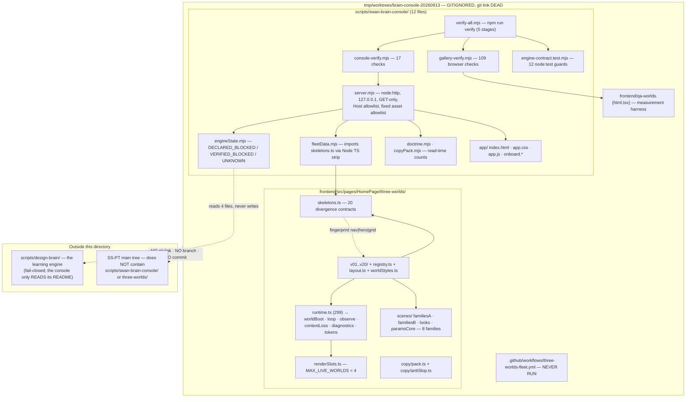
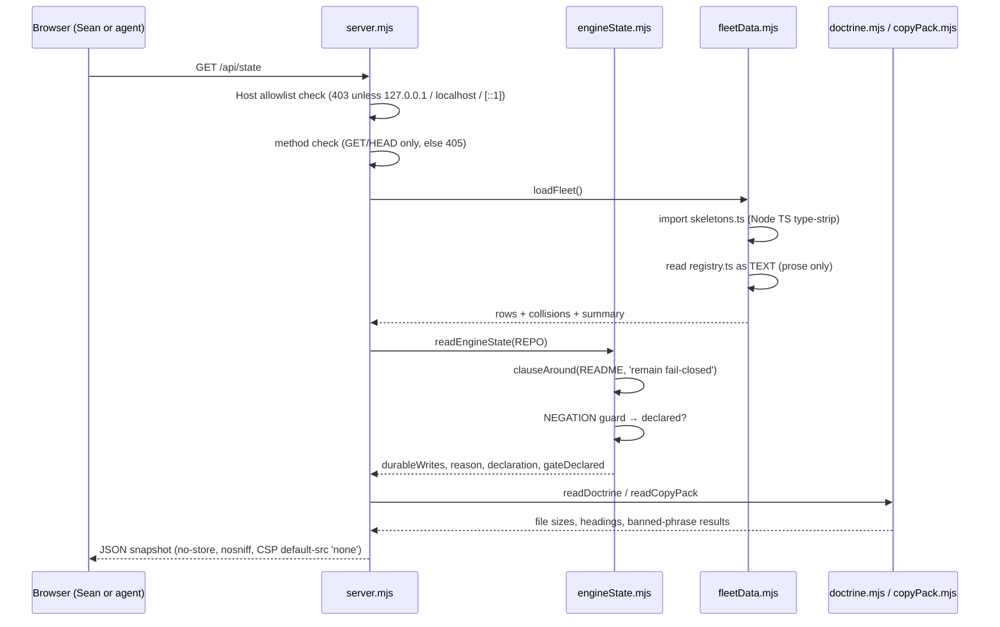
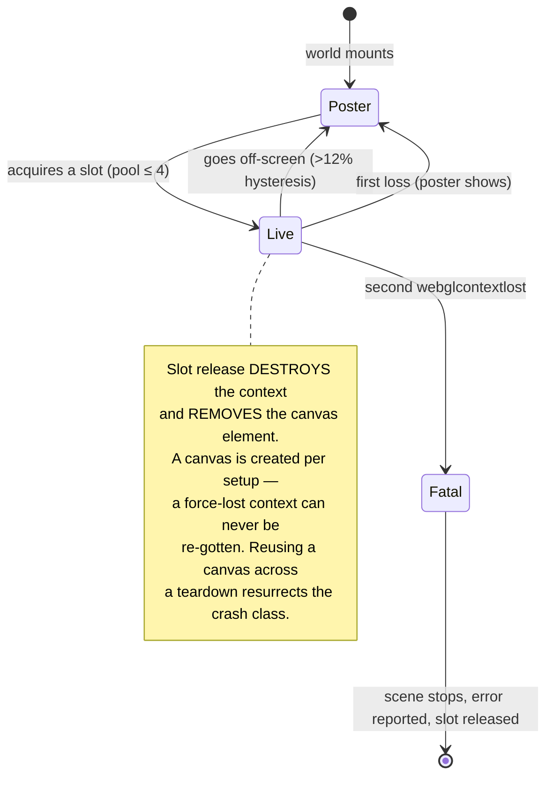
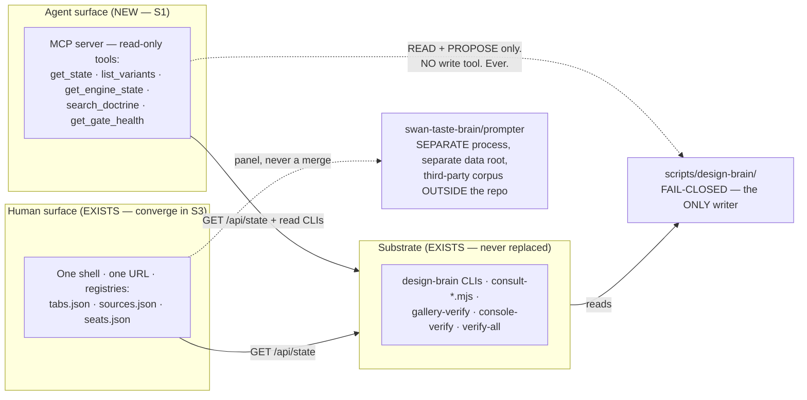
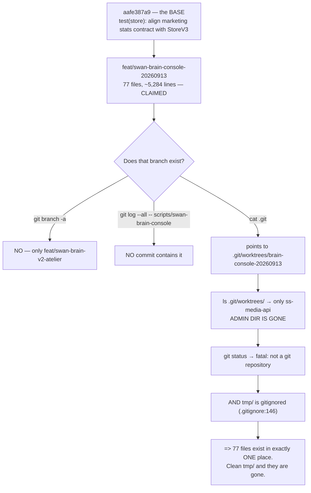

# REMIT — hostile review of the Swan Brain Console V3 merge package

You are the hostile reviewer. Your job is not to confirm this work is good; it is to find
what is wrong with it before it ships. Assume the author was confident and wrong.

For every claim in the packet, ask: *is this wired, or does it merely exist? Does this guard
catch something it must not? Is this sentence true for every case it covers?* Prove each
finding with a `file:line` or a re-runnable command — a restatement of the packet is not
evidence.

Report separately: **(a)** findings you verified, **(b)** findings you could not verify,
**(c)** claims in the packet you tested and found FALSE. Category (c) is the most valuable
thing you can produce; a reviewer who reports no falsifications has probably not looked.

You may not "fix" anything. You produce findings and dispositions only.

**Mega Blueprint is in force.** Print the banner once, then carry out all five actions:
documentation refresh (blueprints, wireframes, flowcharts, mermaid, tests, other docs);
hostile review **A1** of the existing blueprints in this packet; hostile review **A2** of your
own draft, **one pass only**, for extra hardening; the decision-density self-test; and emit
under the `## PART A — HOSTILE REVIEW` / `## PART B — FORGED PACKAGE` /
`## PART C — DECISION-DENSITY SELF-TEST` contract, with `### NN-name.md` level-3 headings
inside PART B so the reply can be split mechanically.

---

## What is under review

**Subject.** Swan Brain Console V3 (a zero-dependency `node:http` operator surface on
`127.0.0.1:4599`, GET-only, read-only) and the 20-variant Three.js homepage fleet it
inspects. The workstream lives in an **untracked worktree** at
`tmp/worktrees/brain-console-20260913/` and is **unbacked by git** — its `.git` file points
at an admin directory that no longer exists, so `git status` reports `fatal: not a git
repository` and no commit in any ref contains `scripts/swan-brain-console/server.mjs`. A
hash-verified tarball exists at
`Z:/SwanStudios-backups/brain-console-20260913-salvage-20260918/` (81/81 entries
byte-identical on extract).

**The nine documents above are the package.** `MEGA-BLUEPRINT.md` is the decision authority;
`00-README.md` is the builder contract; `09-tests.md` was added this session.

**A prior hostile pass (round 1) has already been filed** to `Z:\HostileReviews`
(`2026-09-19-155923-…`). Its findings are reproduced below **so you attack them rather than
rediscover them** — if you think one is wrong, say so and prove it.

---

## Measured evidence — executed 2026-09-19, not inherited

Every number below was produced by a command run in this session against the worktree above.
Nothing here is a restatement of a prior receipt.

| Gate | Command | Result |
|---|---|---|
| Lane typecheck | `tsc -p tsconfig.three-worlds.json --noEmit` (8 GB heap) | **exit 0, no output** |
| Fleet contract | `vitest run src/pages/HomePage/three-worlds/__tests__/` | **17 passed** |
| Runtime contract | same | **49 passed** |
| Combined vitest | same | **66 passed / 0 failed** |
| Engine contract | `node --test scripts/swan-brain-console/engine-contract.test.mjs` | **12 pass / 0 fail** |
| Gallery | `gallery-verify.mjs http://127.0.0.1:5299/qa-worlds.html` | **109/109 passed, exit 0** |
| Console | `console-verify.mjs http://127.0.0.1:4599/` | **17/17 passed, exit 0** |
| Project-wide `tsc --noEmit` | stage 1 of `verify-all` | **NOT RUN — UNVERIFIED** |
| `npm run verify` end to end | — | **NOT RUN — UNVERIFIED** |

**Total executed and green: 204 checks.** The two UNVERIFIED rows are the honest gaps, not
oversights: stage 1 needs a 14 GB heap and pulls in `components/Header/**`; the wrapper
hardcodes ports 5199/4599 and 5199 is held by an unrelated workstream.

Note the drift: pre-existing workstream docs claim the runtime contract is **47** and the
combined suite **64**. Measured: **49** and **66**. The packet's own verification table
(`MEGA-BLUEPRINT.md:141-145`) records this correctly.

---

## Round-1 findings — attack these

| # | Finding | Severity | Evidence |
|---|---|---|---|
| D1 | **`data-frames` is cumulative per card, not per context, and a guard branches on it.** `framesRef` is created once at hook scope (`runtime.ts:113`); the only write fleet-wide is `+= 1` (`loop.ts:47`) — **never reset**. `gallery-verify.mjs:440` treats `frames <= 2` as proof a live world is currently presenting. Latent on today's page (scroll-0 and scroll-bottom live sets are disjoint) but blind to a world that rendered, was torn down, and rebuilt broken. | MEDIUM | exhaustive `grep -rn framesRef` → six sites, zero assignments |
| D2 | **`isPresenting()` / `readDiag()` are dead code.** `diagnostics.ts:161-163` calls `isPresenting` *"The single predicate QA should branch on"*; `grep -rn` across the whole frontend returns **three lines, all inside `diagnostics.ts`** — zero call sites. `gallery-verify` hand-rolls one of its five terms. | LOW | `grep -rn "isPresenting\|readDiag"` (excl. node_modules) |
| D3 | **`runtime.ts` contradicts itself on hysteresis:** header `:19` says **25%**, inline comment `:215` and code `:229` say **12%**. | LOW | three `file:line` sites |
| D4 | **`releaseSlot()` has no per-world identity** and decrements unconditionally (`renderSlots.ts:48`), so a double release silently under-counts. No reachable double release found → **latent, downgraded**. The existing test proves the wrong invariant (`never counts below zero`). | LOW | `renderSlots.ts:40,48`; `runtime.contract.test.ts:400` |
| D5 | **The gate's readiness probe checks reachability, not identity.** `verify-all.mjs:58` accepts any `res.ok` for `:91`'s `http://127.0.0.1:5199/qa-worlds.html`. A Vite server for a *different* app holds 5199 and answers **200** while serving `<title>Theme Lens Harness</title>` (real harness: `Three.js fleet QA harness`). Measured consequence: `gallery-verify` pointed there emits **0 PASS / 0 FAIL** and dies with an unhandled `TimeoutError` at `:132`. Fails closed, so severity is diagnostic, not correctness. | LOW | `/tmp/gallery-wrongapp.log` |
| D6 | **A mid-loop crash discards every result already collected** — `gallery-verify` prints `results` only after the `try/finally`, so one Playwright timeout destroys the evidence for all prior variants. Measured: 0 PASS / 0 FAIL lines on the D5 run. | LOW | same log |

**Self-finding, already fixed:** an earlier draft of `03-contracts.md` **invented four
signatures** (`acquireSlot(worldId): number \| null`, `releaseSlot(worldId)`,
`publishSlotStats(): {live, cap}`, `useThreeWorld(ref, variantId, opts?)`) transcribed from a
prose description rather than read from source. A builder following them would have written
non-compiling code. Both sections now carry `⚠ CORRECTED 2026-09-19` blocks with
line-numbered real signatures. **Check that the correction is complete.**

## Confirmed clean — do not re-litigate without evidence

- `hasWebGL()` **is** wired (`WorldPage.tsx:66-67`), despite being exported and easy to misread as unused.
- The anti-slop boundary regex does **not** match `"today's"`.
- The console's base-URL port bug is **already fixed** (`server.mjs:86`).
- The hand-off check's geometry claim is **true**: at both scroll positions every live card genuinely intersects the viewport and `data-on-screen` agrees with `getBoundingClientRect()` on every card.
- The engine verdict is genuinely derived: a README saying *"must no longer remain fail-closed"* yields `UNKNOWN`, not a false all-clear.

---

## What we most want from you

1. **Falsify something.** Category (c) above. The packet makes many claims; which are false?
2. **A1 on the nine documents** — where does the package contradict itself, assert what the
   code does not do, or leave a builder with a choice it cannot make?
3. **A2 on your own forged package** — one pass, extra hardening.
4. **The decision-density self-test (PART C)** — read each slice as a hostile builder and list
   every choice you would still have to make. Resolve each as *decided* or
   *delegated-with-bounds*. A silent gap is worse than a delegated one.
5. **Is the merge ruling right?** `MEGA-BLUEPRINT.md` rules *salvage and extend, do not
   rebuild*, and proposes the console's eventual shape. Attack that ruling.

---


<!-- ===== BEGIN MEGA-BLUEPRINT.md ===== -->

# ⟪FILE: MEGA-BLUEPRINT.md⟫

# MEGA-BLUEPRINT — Swan Brain Console V3: merge, surface, and repair

**Status:** EXECUTION-READY (v1.0, 2026-09-18) · **Decision authority for this packet**
**Inputs:** the four V3 review rounds on disk (`SWAN-BRAIN-CONSOLE-V3-READINESS-RECEIPT-2026-09-13.md`
§10–§16, `ZCODE-HOSTILE-ROUND4-SWAN-BRAIN-CONSOLE-V3-2026-09-15.md`), the rejected Aug-26 blueprint
(patterns only), and a fresh independent re-verification run this session.
**Builder:** any competent seat. **Doctrine:** `fable-blueprint-forge` — every builder decision is
pre-made here.

---

## 0. The question Sean asked, restated exactly

> *"these are supposed to be merged. the swan brain can be what you suggest is better — a MCP
> server / dashboard / a CLI or what. here is the context of this so you can see how mergable it is
> to make this all one app and if it is a good idea."*

Two questions hide inside that one sentence, and they have **opposite** answers:

- **"Should these be one app?"** → **No.** There are two load-bearing reasons the separation exists.
- **"Should the Swan Brain have one front door?"** → **Yes**, and it does not have one today.

---

## 1. THE RULING

### 1.1 It is not MCP *or* dashboard *or* CLI. It is all three, in three layers.

These are not competing product shapes. They are three tiers of one system, and the current code
already contains the seam that proves it:

> `SWAN-BRAIN-CONSOLE-V3-READINESS-RECEIPT-2026-09-13.md` §16.1 —
> *"Machine surface for agents: `GET /api/state` returns the full structured snapshot (fleet,
> doctrine, engine state) — agents integrate through that, humans through the UI."*

That sentence **is** the MCP design. The console already serves a machine-readable snapshot; it
simply is not exposed over a protocol an agent can discover. MCP is therefore an *adapter over an
interface that already exists* — days of work, not a rewrite.

| Layer | Role | Owns | Why it must stay this layer |
|---|---|---|---|
| **CLI / engine** | substrate | `scripts/design-brain/*`, `consult-*.mjs`, verifiers | Deterministic, scriptable, CI-runnable, no UI. **This is the only layer allowed to write.** |
| **MCP server** | agent interface | a thin read-only adapter over `GET /api/state` + design-brain read CLIs | Discovery. An agent should not have to *know* the console exists. |
| **Dashboard** | human surface | one shell, registry-driven tabs | Judgement. Sean needs to see 20 variants and pick. |
| **CLI again** | the human path when a browser is wrong | same engine, unchanged | Never remove it. A dashboard that becomes the only way in is a dashboard that can lie without appeal. |

### 1.2 Do NOT merge into one app. Merge into one **door**.

Three concrete reasons the merge Sean proposed is a bad idea as stated — each is a *property of the
existing code*, not a preference:

1. **The console is deliberately outside the SaaS design system.** The Aug-26 blueprint (rejected as
   architecture, correct on this point) states it: *"It is not a React app inside SwanStudios. It is
   an operator tool, and per the taste-brain ruling, operator tools sit outside the SaaS
   styled-components/Victory rules — judging design well requires a neutral surface that does not
   itself argue for a palette."* Merging the console into the app makes the surface that *judges*
   the design system *part of* the design system. That is a category error with a real cost.
2. **The taste-brain indexes a third-party copyrighted corpus.** `swan-taste-brain/sources/midlibrary/`
   is third-party material and lives **outside** SS-PT by design; the console "cites and links, it
   never copies material in." Merging it into the repo puts licensed corpus material next to repo
   doctrine.
3. **The learning engine is fail-closed, and the console is GET-only, on purpose.** Merging them
   into one app creates pressure for one shared write path. The single most important invariant in
   this workstream is that **no surface may write to the engine or promote a claim.** A monolith
   erodes that; a federation with a read-only door cannot.

**What "one door" means in practice** (the cheap, correct version of Sean's instinct): one shell, one
URL, N panels — where a new panel is **one registry row plus one module**, and the shell is never
edited. That is the Aug-26 pattern, kept:

```
console/tabs.json    {id, label, module, api}    — a new panel = one row + one app-<id>.js
console/sources.json {id, kind, path, note}      — a new corpus = one row, not new code
console/seats.json   {seat, script, billing, gate} — a new model = one row; gate:"relay" renders a stop-card
```

Registries are read at request time, so adding a panel needs no restart and no shell change.

### 1.3 The one thing that must NOT be merged, ever

**No write path may be added to any agent-facing surface.** The engine is fail-closed until a signed
source-classification authority adapter exists. `writeControls: []` is asserted by a test. The
console's refusal to offer a seat picker is not an oversight — the recorded Ox-as-Grok misfires
(`2026-08-24`, `2026-08-25`) are what happens when a seat is selected by an environment variable
that nothing verifies. **The MCP server inherits this: read and propose only. Never write.**

---

## 2. Locked decisions

| # | Decision | Choice | Source |
|---|---|---|---|
| D1 | Merge into one app? | **NO.** One shell + registries; separate processes, separate data roots | §1.2 |
| D2 | MCP server? | **YES, but read-only.** Adapter over `GET /api/state`; never a write tool | §1.1, §1.3 |
| D3 | Keep the CLI? | **YES.** It is the substrate and the only CI-runnable surface | §1.1 |
| D4 | Keep the dashboard? | **YES.** But stop building *new shells* — converge on one | §1.2 |
| D5 | Rebuild the console from scratch? | **NO.** Salvage, then extend. 66/66 tests pass today | §3 |
| D6 | Merge taste-brain into SS-PT? | **NO.** Copyright corpus boundary | §1.2(2) |
| D7 | Console gains a promote button? | **NO, ever.** Promotion is a reviewed commit | `06-bans.md` |
| D8 | Console gains a seat picker? | **NO** until a verified identity check exists | §1.3 |
| D9 | Engine writes from any surface? | **NO.** Fail-closed until the signed adapter lands | §1.3 |
| D10 | Slice order | **S0 salvage first**, then S1 MCP, then S2 judge mode | `05-slices.md` |
| D11 | Where does the work live? | A **live branch**, not `tmp/` (gitignored) | `01-architecture.md` §5 |

---

## 3. The finding that reorders everything: the work is unbacked

Established this session, by execution, not inference:

| Check | Command | Result |
|---|---|---|
| Is the work tracked? | `git log --all --oneline -- 'scripts/swan-brain-console/server.mjs'` | **empty — no commit in any ref contains it** |
| Is the fleet tracked? | `git log --all --diff-filter=A -- '*three-worlds*'` | **empty** |
| Is the directory even a git worktree? | `cat tmp/worktrees/brain-console-20260913/.git` | points to `SS-PT/.git/worktrees/brain-console-20260913` |
| Does that admin dir exist? | `ls SS-PT/.git/worktrees/` | **only `ss-media-api` — it is gone** |
| Can git read it? | `git status` in that directory | **`fatal: not a git repository`** |
| Is the claimed branch real? | `git branch -a \| grep swan-brain` | only `feat/swan-brain-v2-atelier`; **`feat/swan-brain-console-20260913` does not exist** |
| Is the directory protected by VCS? | `git check-ignore -v …` | `.gitignore:146:tmp/` — **ignored** |
| What would be lost? | `find … -type f` in the two scopes | **77 files** (~5,284 lines per the receipt) |

`aafe387a9` resolves as a commit — but `git log -1 aafe387a9` shows
`test(store): align marketing stats contract with StoreV3`, i.e. it is the **base**, and
`git ls-tree` against it returns **nothing** for either scope. The work is uncommitted changes on
top of that base, inside a directory that git has been told to ignore and can no longer resolve.

**Conclusion:** the console and the fleet exist in exactly one place. If `tmp/` is cleaned, they are
gone. This is not a hypothetical — it is the current state. **S0 is the salvage slice, and it is
first.**

---

## 4. Independent re-verification (this session, on the tree as it sits)

Sean's own context said *"other reported test results still require independent verification."*
Done, on the current tree:

| Gate | Documented | Re-run now | Agreement |
|---|---|---|---|
| Engine contract (`node --test engine-contract.test.mjs`) | 12 | **12 pass / 0 fail** | ✅ agrees |
| Fleet contract (`fleet.contract.test.ts`) | 17 | **17 pass** | ✅ agrees |
| Runtime contract (`runtime.contract.test.ts`) | 47 | **49 pass** | ⚠️ **docs stale by +2** |
| Combined vitest | 64 | **66 pass / 0 fail** | ⚠️ same drift |
| `gallery-verify.mjs` | 109 | **NOT RUN** — needs a browser + the Vite harness | UNVERIFIED |
| `console-verify.mjs` | 17 | **NOT RUN** — needs a live server + browser | UNVERIFIED |
| Scoped `tsc -p tsconfig.three-worlds.json` | 0 errors | **NOT RUN** | UNVERIFIED |

**The +2 drift is itself a finding, and an ironic one.** The whole justification for the console is
that *"numbers a human maintains by hand go stale invisibly"* (blueprint §0). The receipt's own
test count went stale the same way. Two tests were added to `runtime.contract.test.ts` after the
count was written down. Severity: LOW. Lesson: **generate the count, never transcribe it** — and
that rule applies to the review documents too, not just the UI.

**Nothing was falsified.** Every claim that could be re-run reproduced. Three gates could not be
re-run in this environment and are marked UNVERIFIED rather than inherited as green.

---

## 5. What is genuinely good here (do not regress)

The hostile review's job is to find what is wrong; a dishonest one omits what is right. These are
load-bearing and must survive every subsequent slice:

1. **`engineState.mjs` is the best file in the workstream.** It refuses to emit a bare `BLOCKED`,
   distinguishes `DECLARED_BLOCKED` / `VERIFIED_BLOCKED` / `UNKNOWN`, **quotes the matched clause as
   evidence**, and guards against negation — so a README saying *"must no longer remain fail-closed"*
   yields `UNKNOWN`, not a confident block. That is a rare piece of honest instrumentation.
2. **`renderSlots.ts` — the 4-live-world pool** with off-screen hand-off is the correct answer to
   WebGL's ~8–16 context cap. Round 3 named it *"arithmetic, not a renderer mystery"*; round 4 found
   the hand-off had been **claimed but never implemented**, and fixed it with a test that can
   actually fail (`live set must CHANGE when the viewport moves`).
3. **Read-time counts everywhere.** `fleetData.mjs` imports the canonical `skeletons.ts` via Node's
   TS type-stripping so there is no second copy to drift. `registry.ts` is read as text only for
   prose fields.
4. **The console's honesty about what is not built.** Seats / Memory / Ship are placeholders that
   state *why*, with a "Do today instead" line. Most products fake these.
5. **The CI workflow's header** records its own reason for existing: *"a guard nobody runs is not a
   guard"* — and it names the three rounds where that mistake was repeated.

---

## 6. Slice order (detail in `05-slices.md`)

| # | Slice | Why here |
|---|---|---|
| **S0** | **Salvage to a live branch** | 77 files currently unbacked. Nothing else matters until this passes. |
| **S1** | **MCP server (read-only)** | The highest-leverage *new* surface: it makes the whole system discoverable to every agent Sean runs. |
| **S2** | **Judge Mode** | Sean's actual job is *picking winners*; today he has no instrument for it. |
| **S3** | **Registries + tab convergence** | Turns "one app?" into "one door" cheaply. |
| **S4** | Upgrade backlog | Adaptive context cap · screenshot-diff CI · copy gate surfaced · canvas-pixel contrast · promotion receipt. |
| **S5** | Fidelity backlog | Lit/refraction families — closes the honest 8-families gap. |

**Deliberately NOT proposed:** model-seat picker (blocked on verified identity), one-click promote
(bypasses review gates), engine writes (blocked on the signed adapter), merging taste-brain into the
repo (copyright boundary).

---

## 7. Rule 46 chain position

This packet is **advisory input**, not a gate. Per Rule 46 as amended: whoever builds → Gemini
reviews → **Codex runs the hostile review as mandatory input** → **Fable is the Final Decider and
commit gate**. Codex's verdict is advisory to Fable, never the gate itself.

**Nothing in this packet authorises a commit.** S0 produces a branch and a proof of byte-identity;
landing it still requires Sean's explicit approval.


<!-- ===== BEGIN 00-README.md ===== -->

# ⟪FILE: 00-README.md⟫

# Swan Brain Console V3 — Merge / Salvage Mega-Blueprint

**Status:** PACKAGE READY — **readiness BLOCKED** until slice S0 (salvage) lands.
**Date:** 2026-09-18 · **Author:** WorkBuddy (Sable) · **Protocol:** `fable-blueprint-forge`
**Decision authority:** `MEGA-BLUEPRINT.md` (this packet) — every builder choice is pre-made there.

**Supersedes for the *merge* question:** `SWAN-BRAIN-CONSOLE-BLUEPRINT-2026-08-26.md` is **REJECTED**
(GPT-5.6 Sol — its analysis ran against a branch 2,285 commits behind `origin/main`). Do not consume
it for architecture. Its *patterns* (tab/source/seat registries) are reused below with attribution,
because the pattern survived even though the document did not.

**Subject of record (all uncommitted, all in one gitignored directory):**
- Console — `scripts/swan-brain-console/` (12 files, 2,840 lines incl. `app/`)
- Fleet — `frontend/src/pages/HomePage/three-worlds/` (20 variants, 8 scene families)
- Living in `tmp/worktrees/brain-console-20260913/` — 77 files in the two scopes above

---

## Why this packet exists (and why it is not a rebuild)

Sean asked whether the Swan Brain should be merged into one app, and whether it should be an
**MCP server / dashboard / CLI** — and then asked for a hostile review with fixes, upgrades and
enhancements, or a decision to break it down and build it better.

The review's first act was to establish what actually exists. It found something that changes the
sequencing: **the entire workstream is untracked, and the git link that would have recovered it is
dead.** See `05-slices.md` §S0 and `01-architecture.md` §5. The work is not bad — it is *good and
unbacked*. Repairing the backup is slice zero; everything else is downstream of it.

The verdict on rebuild: **do not rebuild.** 66/66 contract tests pass on the current tree
(re-verified 2026-09-18, this session), the engine-honesty guard is genuinely well-built, and four
hostile-review rounds already closed 30+ findings with executed proof. A rebuild would discard
verified work and re-earn the same bugs. The correct move is **verify → salvage → merge the door,
not the monolith → then build the upgrade backlog.**

---

## The doc set (build order)

| # | File | What it decides |
|---|---|---|
| 0 | `MEGA-BLUEPRINT.md` | **The ruling.** MCP vs dashboard vs CLI; merge yes/no; locked decisions |
| 1 | `01-architecture.md` | As-is topology, the three-layer target, data flow, the untracked-work hazard |
| 2 | `02-wireframes.md` | Every console screen + state, ASCII, desktop + 375px, exact copy |
| 3 | `03-contracts.md` | Every endpoint, every exported signature, every invariant |
| 4 | `04-build-order.md` | File-by-file, ≤300-line budgets, what to mimic in-repo |
| 5 | `05-slices.md` | Slice plan with executable acceptance criteria + STOP lines |
| 6 | `06-bans.md` | The "do NOT" list, restated for a context-free builder |
| 7 | `07-checkpoints.md` | Checkpoint protocol + review remit text |

---

## Builder Contract (paste into the builder's first prompt, verbatim)

> You are the builder, not the architect. Follow this package to the letter. Where the package
> decides, you do not re-decide — even if you would do it differently. Where the package is silent
> on something that matters, STOP and return the question; do not improvise.
>
> Build ONE slice at a time. After each slice, output the diff plus the acceptance-criteria evidence
> (test output, curl results, screenshots) and **WAIT** for the checkpoint verdict before continuing.
> Never claim a criterion passed without pasting its output.
>
> **Three rules that are not negotiable in this workstream:**
> 1. **Never `git add -A`.** The main tree holds >1,000 dirty files from other agents (Rule 67).
>    Stage explicit paths only.
> 2. **The console never gains a write path.** It is GET-only by construction. Do not add a POST
>    handler, do not add a promote button, do not add a seat picker. Each refusal is deliberate and
>    documented in `06-bans.md`.
> 3. **Never commit or push without Sean's explicit approval.** `main` auto-deploys to
>    sswanstudios.com via Render.

---

## First slice

**S0 — Salvage.** Move the workstream out of the gitignored, git-link-dead directory into a live
branch and prove it arrived byte-identical. Acceptance criteria and the exact commands are in
`05-slices.md` §S0. **Do not begin S1 until S0 passes.**

## Checkpoint plan

Architect checkpoint per slice, free ladder first (GLM/ZCode seats, $0), Fable only if Sean
authorises spend. Rule 46 chain applies at commit: builder → Gemini → Codex hostile (advisory) →
**Fable = Final Decider / commit gate**.

## Secret scan

`bash scripts/scan-secrets.sh` must pass over this package before commit (Rule 44). Known trap in
this environment: the scanner's own `rm -f "$tmp"` dies when `rm` resolves to the safe-delete shim,
which the hook then misreports as "secret-pattern detected". Workaround:
`TMPDIR="$PWD/tmp/gitscan" bash scripts/scan-secrets.sh`.


<!-- ===== BEGIN 01-architecture.md ===== -->

# ⟪FILE: 01-architecture.md⟫

# 01 — Architecture (as-is, and the three-layer target)

## 1. As-is topology (verified 2026-09-18)



**Read the dotted line at the bottom.** That is the hazard: the entire left-hand column has no
version-control path to the right-hand column.

## 2. Data flow — one request



**Invariants visible in this flow:** every number is computed at read time; no branch of the handler
can reach the filesystem from the request path; `writeControls` is always `[]`.

## 3. The slot pool — the one invariant that must never break



Round 3 called this *"arithmetic, not a renderer mystery"*: browsers cap live WebGL contexts at
~8–16 and LRU-evict the oldest, firing `webglcontextlost`, after which `getActiveUniform` returns
null and Three's `parseUniform` dereferences it. 20 co-mounted variants exceed the cap **by
construction**. The pool is the fix; the hand-off is what makes it honest.

## 4. Target topology — three layers, one door



The dashed edge from the shell to the taste-brain is a **panel, not a merge** — a separate process
with a separate data root, surfaced in one UI. That is how Sean gets "one app" without putting
licensed corpus material inside SS-PT.

## 5. The untracked-work hazard, drawn



## 6. Rule 4 — file-size discipline

The workstream honours the ≤300-line cap, and the receipt records a genuine self-catch: the round-4
reviewer's own `runtime.ts` draft hit **353 lines** and the fleet suite's line-cap test rejected it
before a human saw it. Extraction produced `loop.ts`, `worldBoot.ts`, `contextLoss.ts`,
`diagnostics.ts`; final `runtime.ts` = **299**.

Two measured exceptions, both disclosed rather than hidden:
- `app/app.css` = **343 lines** — pre-existing overage, flagged, deliberately not grown.
- `gallery-verify.mjs` = **501 lines** — the verifier is a script, not product source; the cap test
  is scoped to the fleet. **Builder note:** do not cite this as licence to exceed the cap elsewhere.

## 7. Bounds (what the console can and cannot reach)

| Bound | Value | Enforced by |
|---|---|---|
| Bind address | `127.0.0.1` only | `server.mjs:40` |
| Accepted `Host` | `127.0.0.1`, `localhost`, `[::1]` | `ALLOWED_HOSTS`, checked before routing |
| Methods | `GET`, `HEAD` | 405 otherwise |
| Request → filesystem | **impossible** — path selects an allowlist KEY | `ASSET_ROUTES` |
| Engine writes | **none** | `writeControls: []`, asserted by test |
| Network / DB / `.env` | none | by construction |


<!-- ===== BEGIN 02-wireframes.md ===== -->

# ⟪FILE: 02-wireframes.md⟫

# 02 — Wireframes (console as built + the two new surfaces)

Every string below is the **exact copy** from `scripts/swan-brain-console/app/index.html`. The
builder must not paraphrase it. Palette tokens are the closed Crystalline Swan set.

## 0. Layout rules that apply to every screen

- Dark-first. Background `var(--bg-primary, #0D1117)`; surface `var(--bg-surface, #161B22)`.
- Every interactive control **≥ 44×44px** (measured in `console-verify.mjs`, not assumed).
- Focus ring is the house signature: `2px solid var(--ice-wing, #60C0F0)` + 2px offset.
- Text on surface must meet **WCAG 4.5:1**; the console's measured worst is **8.72:1**.
- **No horizontal overflow at 320 / 375 / 414 / 768 / 1280 / 2560.** Long unbreakable strings (file
  paths, ISO timestamps, `nav|hero|grid` tuples) must carry `overflow-wrap: anywhere`.
- Tabs are an ARIA `tablist` with **one tab stop** (roving tabindex), `←`/`→` to move.

---

## 1. Console shell — desktop (≥1280px)

```
┌──────────────────────────────────────────────────────────────────────────────────────┐
│  ◆  Swan Brain Console                                        ?                      │
│     Design Brain operator surface — read-only                                        │
│                                                                                      │
│     Doctrine      Variants      Archetypes      Engine                               │
│     design.md    20             22              DECLARED_BLOCKED                     │
├──────────────────────────────────────────────────────────────────────────────────────┤
│  [ Doctrine ] [ Fleet ] [ Canvas ] [ Copy ] [ Engine ] [ Seats ] [ Memory ] [ Ship ] │
│  Tip: use ← → arrow keys to move between tabs.                                       │
├──────────────────────────────────────────────────────────────────────────────────────┤
│  ┌─ Start here — what this console is ─────────────────────────────────────────────┐ │
│  │ Twenty AI-built homepage designs (the "fleet") are competing to become the next │ │
│  │ SwanStudios front page. This console is the briefing room: the design rules they │ │
│  │ follow, their structural line-up, and an honest report of what the system can   │ │
│  │ and cannot do yet.                                                              │ │
│  │                                                                                 │ │
│  │ Nothing here can break anything. The console is read-only and runs only on your │ │
│  │ machine — there is no button anywhere that writes to the site, the repo, or the │ │
│  │ learning engine.                                                                │ │
│  │                                                                                 │ │
│  │ The loop is three steps:                                                        │ │
│  │   1 · Skim the Doctrine tab — the rules every variant was built against.        │ │
│  │   2 · Shortlist in the Fleet tab — then open a variant's Watch it move link.    │ │
│  │   3 · Check the Engine tab — what the system saves today, and why.              │ │
│  │                                                                                 │ │
│  │ The winner never ships from here: promotion happens as a normal reviewed        │ │
│  │ commit, so every design, accessibility and review gate still applies. Links     │ │
│  │ marked Watch it move open the live gallery — if one does not load, the gallery  │ │
│  │ harness is not running: start it with npx vite --port 5199 from frontend/.      │ │
│  │                                                                                 │ │
│  │                        [ Got it — don't show this again ]                        │ │
│  └─────────────────────────────────────────────────────────────────────────────────┘ │
│  ▸ Glossary — the words this console uses                                            │
└──────────────────────────────────────────────────────────────────────────────────────┘
```

**States:**
- `welcome` visible on a **fresh browser context** (no `localStorage` key). Non-modal — it must never
  block automation.
- Dismissed → persisted; reopenable via the 44×44 `?` button (`aria-label="Reopen the getting-started
  briefing"`).
- `#engine-banner` — `hidden` unless `durableWrites === 'UNKNOWN'`. `DECLARED_BLOCKED` is the
  **expected** state and must render calm-neutral, not red.

## 2. Console shell — 375px

```
┌──────────────────────────────┐
│ ◆ Swan Brain Console      ?  │
│   Design Brain operator      │
│   surface — read-only        │
│                              │
│ Doctrine       design.md     │
│ Variants       20            │
│ Archetypes     22            │
│ Engine         DECLARED_     │
│                BLOCKED       │
├──────────────────────────────┤
│ [Doctrine][Fleet][Canvas]    │  ← horizontally scrollable
│ [Copy][Engine][Seats]        │    tab strip, one tab stop
│ [Memory][Ship]               │
├──────────────────────────────┤
│  (panel content, single      │
│   column; tables get a       │
│   mobile scroller — never    │
│   a page-level h-scroll)     │
└──────────────────────────────┘
```

## 3. Fleet tab — the judging surface

```
┌───────────────────────────────────────────────────────────────────────────────────┐
│  Fleet                                                                            │
│  Twenty front-page candidates. Each row shows how that variant differs: where      │
│  navigation lives, how the hero moves, how content grids — plus the cost it        │
│  accepts for that choice. What to do here: shortlist the structures you like,      │
│  then use a row's Watch it move link to judge it live in the browser gallery.      │
│                                                                                   │
│  ┌ 20 variants ┐ ┌ 20 nav models ┐ ┌ 20 grids ┐ ┌ 8 scene families ┐ ┌ 1 wildcard ┐│
│                                                                                   │
│  Structural divergence contract per variant                                        │
│  ┌─────┬───────────────┬───────────────┬───────────────┬──────┬────────┬────────┐  │
│  │ ID  │ Title         │ Nav model     │ Hero mechanic │ Grid │ Cost   │ Render │  │
│  ├─────┼───────────────┼───────────────┼───────────────┼──────┼────────┼────────┤  │
│  │ v01 │ …             │ vertical-index│ scroll-scrub  │ full-│ …      │ Watch  │  │
│  │ v02 │ …             │ stepper-left  │ measured-…    │ time-│ …      │ Watch  │  │
│  │ …   │               │               │               │ spine│        │ it move│  │
│  │ v18 │ …  ★wildcard  │ command-strip │ terrain-fly   │ edit-│ …      │ Watch  │  │
│  │ v20 │ …             │ horizon-bar   │ pointer-par…  │ edit-│ …      │ Watch  │  │
│  └─────┴───────────────┴───────────────┴───────────────┴──────┴────────┴────────┘  │
└───────────────────────────────────────────────────────────────────────────────────┘
```

`Cost it accepts` is the **tradeoff string** — the judgement instrument (blueprint R10). It must be
non-empty and ≥13 characters per variant, asserted by `fleet.contract.test.ts`.

## 4. Engine tab — the honesty surface

```
┌───────────────────────────────────────────────────────────────────────────────────┐
│  Engine                                                                           │
│  The Design Brain learning loop. It is fail-closed by design, and this panel       │
│  reports that state rather than offering controls that cannot work. What to do     │
│  here: nothing to operate — this tab exists so the console cannot lie to you       │
│  about what is being saved.                                                       │
│                                                                                   │
│  State: DECLARED_BLOCKED                                                          │
│  Evidence (quoted from scripts/design-brain/README.md, not paraphrased):           │
│  "…new receipt writes remain fail-closed until the signed source-classification    │
│   authority adapter has production keys, trusted time, and revocation state…"      │
│                                                                                   │
│  Write controls: (none — and none may be added)                                    │
└───────────────────────────────────────────────────────────────────────────────────┘
```

**Three states, and `BLOCKED` is never emitted bare:**

| State | Meaning | Render |
|---|---|---|
| `DECLARED_BLOCKED` | the engine's docs declare the gate, without negation | calm-neutral — **expected today** |
| `VERIFIED_BLOCKED` | a probe read the gate itself | **currently unreachable** — no probe exists |
| `UNKNOWN` | declaration absent, negated, or unreadable | red banner + demand for human review |

## 5. NEW — Judge Mode (S2)

```
┌───────────────────────────────────────────────────────────────────────────────────┐
│  Judge   Round 2 of 10 · 5 variants · verdicts saved locally (14 so far)           │
├──────────────────────────────────┬────────────────────────────────────────────────┤
│                                  │                                                │
│        ┌──────────────────┐      │      ┌──────────────────┐                      │
│        │                  │      │      │                  │                      │
│        │      v07         │      │      │      v12         │                      │
│        │  progress-spine  │      │      │    no-nav        │                      │
│        │  instanced-field │      │      │  layered-shells  │                      │
│        │   rail-well      │      │      │  stacked-bands   │                      │
│        │                  │      │      │                  │                      │
│        └──────────────────┘      │      └──────────────────┘                      │
│         [ 1 · pick left ]        │       [ 2 · pick right ]                        │
├──────────────────────────────────┴────────────────────────────────────────────────┤
│  [ E · either ]   [ N · neither ]        [ ← back ]   [ → next pair ]              │
│                                                                                   │
│  Verdicts: 14 · [ Export receipt ↓ ]  →  judge-2026-09-18.json + .md               │
└───────────────────────────────────────────────────────────────────────────────────┘
```

**Contract:** verdicts live in `localStorage` only. The export is a **file download** — no server
write, so the GET-only contract holds. The exported receipt IS the promotion evidence.

**Exact copy:**
- `1 · pick left` · `2 · pick right` · `E · either` · `N · neither`
- `← back` · `→ next pair`
- `Export receipt ↓`
- Empty state: `No verdicts yet — pick a side to start.`
- Complete state: `All 10 pairs judged. Export the receipt, then name the winner in chat.`

## 6. NEW — Gate Health tab (S4)

```
┌───────────────────────────────────────────────────────────────────────────────────┐
│  Gate Health          last run: 2026-09-18T09:30Z (re-run now)                    │
│                                                                                   │
│  ┌ Engine contract      ✅  12 / 12 ┐ ┌ Fleet contract      ✅  17 / 17 ┐          │
│  ┌ Runtime contract     ✅  49 / 49 ┐ ┌ gallery-verify      ⚠  not run  ┐          │
│  ┌ console-verify       ⚠  not run ┐ ┌ scoped tsc          ⚠  not run  ┐          │
│                                                                                   │
│  ⚠ "not run" is not a pass. A gate that has not executed is UNVERIFIED.            │
└───────────────────────────────────────────────────────────────────────────────────┘
```

This panel exists to stop the exact failure the CI header names: *"a guard nobody runs is not a
guard."* It must render `not run` distinctly from `pass` — never a green tick for an unexecuted gate.


<!-- ===== BEGIN 03-contracts.md ===== -->

# ⟪FILE: 03-contracts.md⟫

# 03 — Contracts

Everything a builder must match exactly. Signatures are copied from the source as it stands.

## 1. HTTP surface (`scripts/swan-brain-console/server.mjs`)

### 1.1 `GET /api/state`

**Auth:** none. **Reachability:** loopback only, `Host` allowlist enforced.
**Request:** no body, no query parameters (query strings are ignored, not rejected).

**200 response:**

```jsonc
{
  "generatedAt": "2026-09-18T09:30:00.000Z",     // ISO, computed per request
  "engine": {
    "durableWrites": "DECLARED_BLOCKED",          // DECLARED_BLOCKED | VERIFIED_BLOCKED | UNKNOWN
    "reason": "…quoted sentence from the engine README…",
    "writeControls": [],                          // ALWAYS []. Asserted by test.
    "declaration": "…the matched clause, verbatim…",  // evidence, not verdict
    "gateDeclared": true,
    "sourceFiles": 23,                            // read-time count of scripts/design-brain/src/*.mjs
    "testFiles": 5,                               // read-time count of scripts/design-brain/tests/*.mjs
    "archetypes": 22,
    "doctrineLines": 238,
    "readmePresent": true
  },
  "fleet": {
    "rows": [ /* 20 × {id, title, nav_model, hero_mechanics, grid, chapters,
                          anti_specs[], wildcard, tradeoff, hasDir} */ ],
    "collisions": [],                             // non-empty = HARD GATE, halt
    "summary": {
      "total": 20, "navModels": 20, "grids": 20, "mechanics": 20,
      "wildcards": 1, "wildcardId": "v18",
      "variantDirs": 20, "missingDir": [], "missingTradeoff": [],
      "referenceDisclosure": "[MOBBIN UNAVAILABLE]"
    }
  },
  "doctrine": { /* per-document: path, role, lines, headings, state */ },
  "copy":     { /* per-variant banned-phrase results from findSlop */ }
}
```

**Errors:**

| Status | Body | When |
|---|---|---|
| `403` | `{ "error": "host not allowed", "hint": "expected one of 127.0.0.1, localhost, [::1]" }` | `Host` outside the allowlist (DNS-rebinding guard, checked **first**) |
| `405` | `{ "error": "read-only surface", "method": "<verb>" }` | any method other than `GET`/`HEAD` |
| `404` | `{ "error": "not found", "path": "<path>", "allowed": [...] }` | path not in `ASSET_ROUTES` |
| `500` | `{ "error": "snapshot failed", "detail": "<message>" }` | `snapshot()` threw |
| `500` | `{ "error": "asset missing", "file": "<name>" }` | allowlisted asset absent from disk |

**Headers on every JSON response:** `cache-control: no-store`,
`x-content-type-options: nosniff`, `content-security-policy: default-src 'none'; frame-ancestors 'none'`.

### 1.2 Static assets

`GET|HEAD` only. The path selects a **key**, never a file path — traversal is structurally
impossible rather than filtered.

| Path | File | Content-Type |
|---|---|---|
| `/` | `app/index.html` | `text/html; charset=utf-8` |
| `/app.css` | `app/app.css` | `text/css; charset=utf-8` |
| `/app.js` | `app/app.js` | `text/javascript; charset=utf-8` |
| `/onboard.css` | `app/onboard.css` | `text/css; charset=utf-8` |
| `/onboard.js` | `app/onboard.js` | `text/javascript; charset=utf-8` |

Asset responses add `referrer-policy: no-referrer` and a full CSP:
`default-src 'none'; style-src 'self'; script-src 'self'; connect-src 'self'; img-src 'self' data:; base-uri 'none'; form-action 'none'; frame-ancestors 'none'`.

### 1.3 CLI

```
node scripts/swan-brain-console/server.mjs [--port 4599] [--open]
```

`--port` must be an integer in `1024–65535`, else exit `2` with
`[console] invalid --port; expected 1024-65535`. On listen it prints the URL, then
`[console] read-only · localhost only · GET only · no engine writes`. `SIGINT`/`SIGTERM` close
gracefully.

## 2. Exported signatures

### 2.1 `engineState.mjs`

```js
export function readEngineState(repo: string): {
  durableWrites: 'DECLARED_BLOCKED' | 'UNKNOWN',   // 'VERIFIED_BLOCKED' reserved, unreachable
  reason: string,
  writeControls: [],                                // literal empty array
  declaration: string | null,
  gateDeclared: boolean,
  sourceFiles: number, testFiles: number, archetypes: number,
  doctrineLines: number, readmePresent: boolean,
}
```

**Internal constants that carry the semantics:**

```js
const GATE_DECLARATION = 'remain fail-closed';
const NEGATION = /\b(no longer|not|never|cease|ceased|removed?|unblock(?:ed)?|drop(?:ped)?|lift(?:ed)?)\b/i;
```

**The rule:** `declared = Boolean(clause) && !NEGATION.test(clause)`. A README reading
*"writes must no longer remain fail-closed"* **contains** the declaration phrase and asserts the
opposite — the negation guard is what stops maximum confidence at the exact moment the gate is gone.
Do not simplify this to an `includes()`.

### 2.2 `fleetData.mjs`

```js
export const REPO: string;
export async function loadSkeletons(): Promise<{ skeletons: SkeletonContract[]; collisions: string[] }>;
export function readRegistryText(): {
  present: boolean;
  titles: Record<string, string>;
  tradeoffs: Record<string, string>;
  dirs: string[];
  referenceDisclosure: string;
};
export function summarize(skeletons, registryText): { total, navModels, grids, mechanics,
  wildcards, wildcardId, variantDirs, missingDir, missingTradeoff, referenceDisclosure };
export async function loadFleet(): Promise<{ rows: FleetRow[]; collisions: string[]; summary }>;
```

**Why two access strategies:** `skeletons.ts` is imported directly (Node 24 TS type-stripping) so
the console shows the **same objects the app renders** — no second copy to drift. `registry.ts`
cannot be, because its internal imports are extensionless (correct for Vite, unresolvable for bare
Node); it is read as **text** for prose fields only. Do not "fix" this by restructuring app source
to suit a tool.

### 2.3 `skeletons.ts` — the divergence contract

```ts
export type NavModel = 'no-nav' | 'radial-hub' | … | 'ticker-nav';        // 20 values
export type HeroMechanics = 'scroll-scrub' | … | 'shell-lens';            // 20 values
export type GridModel = 'full-bleed' | … | 'editorial-cards';             // 20 values

export interface SkeletonContract {
  id: string;
  nav_model: NavModel;
  hero_mechanics: HeroMechanics;
  grid: GridModel;
  chapters: number;
  anti_specs: string[];     // minimum 2, enforced by test
  wildcard?: string;        // exactly ONE variant (v18)
}
export const SKELETONS: SkeletonContract[];                               // exactly 20
export function fingerprintOf(s: SkeletonContract): string;               // `${nav}|${hero}|${grid}`
export function findCollisions(rows?: SkeletonContract[]): string[];
```

**Honest limit of the fingerprint:** the three axes are enums and the 20 values are pairwise unique
**by construction**, so the test detects authoring copy-paste and nothing more. It is labelled
`config uniqueness only`. A collision is a **HARD GATE**: halt, report, build nothing on top.

**Motion is deliberately NOT a seed axis** — a static artboard judges a motion seed with the motion
removed, which biases the judge against it. Motion enters only on the winner.

### 2.4 `renderSlots.ts` — the context budget

```js
export const MAX_LIVE_WORLDS = 4;                            // renderSlots.ts:28
export function onSlotFreed(fn: () => void): () => void;     // :34 — returns an unsubscribe
export function acquireSlot(): boolean;                      // :40 — false when the budget is full
export function releaseSlot(): void;                         // :48 — no argument; no identity
export function slotStats(): { inUse: number; cap: number }; // :61 — read-only diagnostics
export function publishSlotStats(): void;                    // :72 — writes data-live-worlds / -cap
export function __resetSlots(): void;                        // :79 — test helper
```

**⚠ CORRECTED 2026-09-19.** An earlier revision of this document listed
`acquireSlot(worldId): number | null`, `releaseSlot(worldId)` and
`publishSlotStats(): {live, cap}`. **None of those signatures exist.** They were transcribed from a
prose description in the review-preparation packet rather than read from the source. A builder
following the old text would have written code that does not compile. Signatures above are read
from `renderSlots.ts` and line-numbered.

**There is no per-world identity in this API.** `releaseSlot()` takes no argument and decrements
unconditionally (`if (inUse > 0) inUse -= 1`, `:49`), so the pool cannot detect a double release —
it silently under-counts, which would report capacity that does not exist. No reachable double
release was found in the current wiring, so this is a **latent hazard, not a live defect** — but a
future caller that releases twice, or a Vite HMR reload that re-executes the module (resetting
`inUse` to 0 while live contexts remain), can put more than `MAX_LIVE_WORLDS` contexts on a page.

**Invariant:** contexts live only while a world holds a slot. The canvas element is created **per
setup** and destroyed with each teardown. Reusing a canvas across a teardown resurrects a
force-lost context — the crash class this workstream spent three rounds burying.

### 2.5 `runtime.ts` — the public hook

```js
export function useThreeWorld(
  canvasHostRef: RefObject<HTMLElement>,   // EMPTY container the runtime fills; React owns it
  hostRef: RefObject<HTMLElement>,         // the measured host (scroll/pointer/size source)
  motion: MotionMode,                      // 'live' | 'poster'
  build: WorldBuilder,                     // (ctx: WorldContext) => WorldHandle
  opts?: { canvasId?: string },
): { live: boolean; lost: boolean; error: string | null; frames: number };
```

**⚠ CORRECTED 2026-09-19.** An earlier revision listed this as
`useThreeWorld(ref, variantId, opts?)` returning `{live, frames}`. **That signature does not
exist** — it was inferred from prose. The real one takes five parameters and returns four fields.

`frames` is a **render-time snapshot only**; the runtime owns the DOM attribute. `runtime.ts` solely
owns `data-frames`, `data-running`, `data-on-screen`, `data-tab-visible`, `data-context-lost`,
`data-context-losses`, `data-draw-calls`, `data-primitives`, plus `data-live`, `data-motion` and
`data-nav-model`. `WorldPage` must **not** render `data-frames` — doing so re-froze a stale value
over the live attribute (round-4 F6).

**⚠ `framesRef` is NOT reset across a hand-off.** `const framesRef = useRef(0)` sits at *hook*
scope (`runtime.ts:113`), outside the effect, and the only write in the fleet is
`deps.framesRef.current += 1` (`loop.ts:47`). A teardown/rebuild cycle therefore **carries the
previous context's frame count forward**, so `data-frames` cannot distinguish "presented on this
context" from "presented on a previous one". Any assertion keyed on `frames` inherits that hole —
see `09-tests.md` §4 and the review filed at `Z:\HostileReviews`.

### 2.6 `observe.ts` — scroll semantics

```js
export function scrollProgressFor(rect: DOMRect, viewportHeight: number, anchor: 'load' | 'travel'): number;
export function scrollAnchorFor(hostEl: Element): 'load' | 'travel';
```

- `'load'` — hero contract: `0` at load, span = host height. `p = -top / max(1, height)`, clamped.
- `'travel'` — a host the reader scrolls **to**: `0` when its top enters at the viewport bottom,
  `1` when its bottom leaves the viewport top. `p = (vh - top) / (vh + height)`.

The classifier reads the **scroll-invariant document offset** (`rect.top + scrollY`, ±2px), so a
reload mid-page still load-anchors the hero. Settled in round 4: this was the Fable-vs-GLM dispute,
and both were half right — the load rule is correct *for the page-opening host* and was applied
universally.

### 2.7 `copy/antiSlop.ts`

```js
export function findSlop(text: string): SlopHit[];
```

Gate classes: banned phrases · **stem inflections** (`empowers`, `unlocks`, `delving`; e-drop
handled) · **unhyphenated intensifiers** (`world class`, `cutting edge`, `state of the art`,
`best in class`, `game changing`) · **house vocabulary** (`NASM-certified` / `NASM certified`).

**Negative contract:** `NASM OPT model` and `NASM overhead squat assessment` are **named methods**
and must stay legal. Any new class must ship with a negative test.

## 3. Invariants (each is asserted by a test — do not weaken)

| # | Invariant | Asserted by |
|---|---|---|
| I1 | 20 skeletons, 20 unique fingerprints, ≥2 `anti_specs` each | `fleet.contract.test.ts` |
| I2 | exactly one `wildcard`, id `v18` | `fleet.contract.test.ts` |
| I3 | every registry entry `status: 'parked'` (20/20) | `fleet.contract.test.ts` |
| I4 | `main-routes.tsx` matches neither `playgroundRegistry` nor `three-worlds`; `HomePage.V4` still mounted | `fleet.contract.test.ts` |
| I5 | copy resolves figures from `marketingStats`; no invented metrics | `fleet.contract.test.ts` |
| I6 | every file ≤300 lines (fleet scope) | `fleet.contract.test.ts` |
| I7 | `writeControls` is `[]`; no POST route exists | `engine-contract.test.mjs` |
| I8 | the engine verdict is **derived**, not asserted; negation → `UNKNOWN` | `engine-contract.test.mjs` |
| I9 | `MAX_LIVE_WORLDS` respected; live set **changes** on scroll; DOM canvases == live worlds | `gallery-verify.mjs` |
| I10 | 0 colour fallbacks; token mutation **follows** to the scene | `gallery-verify.mjs` |
| I11 | reduced motion → 0 canvases, 0 frames, poster present | `gallery-verify.mjs` |
| I12 | every control ≥44px; contrast ≥4.5:1 | `gallery-verify.mjs` / `console-verify.mjs` |

**I7 and I8 are the crown jewels.** I8's test is the reason the console cannot lie about what is
being saved.

## 4. New contract — MCP server (S1)

**Transport:** stdio. **Tools:** read-only. **No tool may have a side effect.**

| Tool | Input | Output | Backed by |
|---|---|---|---|
| `swan_get_state` | `{}` | the full `/api/state` snapshot | `GET /api/state` |
| `swan_list_variants` | `{ filter?: 'wildcard' \| 'nav_model' }` | 20 rows, structural fields + tradeoff | snapshot `fleet.rows` |
| `swan_get_engine_state` | `{}` | `durableWrites`, `reason`, `declaration`, `gateDeclared` | snapshot `engine` |
| `swan_search_doctrine` | `{ query, limit? }` | matching doctrine lines with `file:line` | grep over `docs/ai-workflow/design-brain/` |
| `swan_get_gate_health` | `{}` | per-gate last-run result, `not run` rendered distinctly | gate result files |

**Forbidden tools — these must never exist:** `promote_variant`, `accept_claim`,
`write_receipt`, `run_seat`, `set_engine_state`, or anything that writes, promotes, or spends.
Their absence is the contract.

**Degraded mode:** if the console server is not running, the MCP server must **start** and return a
typed error (`{ error: 'console not running', hint: 'node scripts/swan-brain-console/server.mjs' }`)
rather than fail to boot. An agent discovering a dead tool learns nothing; an agent getting a
correctable error learns the fix.


<!-- ===== BEGIN 04-build-order.md ===== -->

# ⟪FILE: 04-build-order.md⟫

# 04 — Build order (file-by-file)

Ordered so that **every slice leaves the system bootable**. Paths are relative to the repo root.
Budgets are the Rule 4 cap (≤300 lines) unless noted.

## S0 — Salvage (no new files; the workstream moves)

| Step | Action | Purpose |
|---|---|---|
| 0.1 | Create a live worktree from `origin/main` under `tmp/worktrees/` **and register it** | Restores a working git link |
| 0.2 | Copy the two scopes in, preserving paths exactly | Moves the 77 files |
| 0.3 | Prove byte-identity by hash manifest | This is the acceptance criterion |
| 0.4 | Stage explicit paths, commit on a new branch | Never `git add -A` |

No source edits in S0. If a hash differs, **stop** — do not "fix" it in the same slice.

## S1 — MCP server (read-only)

| File | Purpose | Budget | Imports | Exports | Mimic |
|---|---|---|---|---|---|
| `scripts/swan-brain-console/mcp/server.mjs` | stdio MCP entry; tool registry; degraded mode | ~120 | `node:readline`, `./tools.mjs`, `../engineState.mjs` | — | `scripts/swan-brain-console/server.mjs` (arg parsing, error shape) |
| `scripts/swan-brain-console/mcp/tools.mjs` | the five tool handlers; one exported fn each | ~160 | `../fleetData.mjs`, `../engineState.mjs`, `../doctrine.mjs` | `swanGetState`, `swanListVariants`, `swanGetEngineState`, `swanSearchDoctrine`, `swanGetGateHealth` | `fleetData.mjs` (read-time counts) |
| `scripts/swan-brain-console/mcp/tools.test.mjs` | `node:test` guards, incl. the forbidden-tool assertion | ~140 | `node:test`, `node:assert` | — | `engine-contract.test.mjs` |
| `scripts/swan-brain-console/mcp/README.md` | how to register the server; the read-only contract | — | — | — | `scripts/design-brain/README.md` |

**The load-bearing test:** assert the exported tool list **exactly equals** the five allowed names.
A future contributor adding a write tool must make that test fail first.

## S2 — Judge Mode

| File | Purpose | Budget | Notes |
|---|---|---|---|
| `app/app-judge.js` | pairing, keyboard verdicts, localStorage, export | ~200 | mirrors `app/app.js` structure |
| `app/judge.css` | side-by-side layout, 375px stack | ~120 | reuse `app.css` tokens |
| `app/judge-export.mjs` | pure: verdict list → `{json, markdown}` | ~90 | **pure, no DOM** — so it is unit-testable |
| `app/judge-export.test.mjs` | `node:test` over the pure exporter | ~110 | export shape is the promotion evidence |

Register `/app-judge.js` and `/judge.css` in `server.mjs` `ASSET_ROUTES` — that is the **only**
permitted server change in S2, and it is additive.

## S3 — Registries + tab convergence

| File | Purpose | Budget | Notes |
|---|---|---|---|
| `app/tabs.json` | `[{id, label, module, api}]` | data | the shell iterates it; a new panel = one row |
| `app/sources.json` | `[{id, kind, path, note}]` | data | Library/Memory read this |
| `app/seats.json` | `[{seat, script, billing, gate}]` | data | `gate: "relay"` → stop-card, not a Run button |
| `app/app-shell.js` | registry loader + tab controller | ~220 | **replaces** the hardcoded `<nav>` loop in `app.js` |
| `app/app-shell.test.mjs` | registry → rendered tabs | ~120 | prove a new row needs no shell edit |

**Acceptance for "no shell edit":** add a throwaway 8th registry row in a test fixture and assert it
renders without touching `app-shell.js`.

## S4 — Upgrade backlog (independent, order by value)

| File | Purpose | Budget |
|---|---|---|
| `scripts/swan-brain-console/gateHealth.mjs` | read gate result files; `not run` ≠ pass | ~130 |
| `scripts/swan-brain-console/capProbe.mjs` | publish an adaptive `MAX_LIVE_WORLDS` from `hardwareConcurrency` + SwiftShader detection + `devicePixelRatio` | ~120 |
| `.github/workflows/three-worlds-fleet.yml` | add a screenshot-diff step with tolerance | edit |
| `frontend/src/pages/HomePage/three-worlds/scenes/lit.ts` | `MeshPhysicalMaterial` + `transmission` families | ~280 |

## S5 — Fidelity (largest visual lever, largest risk)

Closes the honest **8-families-behind-20-compositions** gap. Every new family must:
1. add a `SCENE_SIGNATURES` row that matches what is actually constructed (round 3 renamed
   `liquid-surface`→`layered-shells` precisely because the label was a claim the material could not
   keep);
2. carry `dispose()` releasing geometry, material and attributes;
3. stay ≤300 lines, or split by family.

## Files that must NOT be touched

| Path | Why |
|---|---|
| `frontend/src/main-routes.tsx` | canonical routing; the fleet is parked (I4) |
| `frontend/src/pages/HomePage/**` (except `three-worlds/`) | the live homepage is `HomePage.V4` |
| `scripts/design-brain/**` | fail-closed engine; the console only reads its README |
| `docs/ai-workflow/design-brain/**` | doctrine; canon changes are Sean's hand-edit alone |
| `frontend/src/pages/DesignPlayground/concepts/*Homepage.tsx` | 12 pre-existing files >300 lines; **not ours**, do not "fix" |

## Re-generation over hand-editing

`v01..v20/*.tsx` are **generated** by `scripts/swan-brain-console/generate-worlds.mjs`; the
DesignPlayground wiring by `wire-playground.mjs`. Round 2 verified the generated files are ~1.1KB
wrappers importing `three`, `WorldPage` and their own skeleton — so none of the runtime fixes live
in them and regeneration cannot revert a fix. **Re-run the generator; never hand-edit a generated
file.**


<!-- ===== BEGIN 05-slices.md ===== -->

# ⟪FILE: 05-slices.md⟫

# 05 — Slices, with executable acceptance criteria

Each slice ends with a **STOP line**. Do not begin slice N+1 until the checkpoint passes.

---

## S0 — SALVAGE *(blocking; nothing else starts until this passes)*

**Scope:** move 77 files out of a gitignored directory whose git link is dead, into a live branch.
**No source edits.**

**Source:** `tmp/worktrees/brain-console-20260913/`
**Scopes:**
```
scripts/swan-brain-console/
frontend/src/pages/HomePage/three-worlds/
frontend/qa-worlds.html
frontend/qa-worlds.tsx
frontend/tsconfig.three-worlds.json
.github/workflows/three-worlds-fleet.yml
docs/ai-workflow/AI-HANDOFF/SWAN-BRAIN-CONSOLE-V3-*.md
docs/ai-workflow/AI-HANDOFF/ZCODE-HOSTILE-ROUND4-*.md
```

**Steps**

```bash
# 1. Snapshot a hash manifest of the source BEFORE anything moves
cd tmp/worktrees/brain-console-20260913
find scripts/swan-brain-console \
     frontend/src/pages/HomePage/three-worlds \
     frontend/qa-worlds.html frontend/qa-worlds.tsx \
     frontend/tsconfig.three-worlds.json \
     .github/workflows/three-worlds-fleet.yml \
     -type f -print0 | sort -z | xargs -0 sha256sum > /tmp/S0-BEFORE.sha256
wc -l /tmp/S0-BEFORE.sha256        # record this number

# 2. Create a REGISTERED worktree from origin/main
cd <repo-root>
git worktree add tmp/worktrees/brain-console-salvage-20260918 \
  -b feat/swan-brain-console-v3-salvage-20260918 origin/main
git worktree list                  # the new path MUST appear — this is the fix

# 3. Copy the scopes in, preserving paths exactly
SRC=tmp/worktrees/brain-console-20260913
DST=tmp/worktrees/brain-console-salvage-20260918
mkdir -p "$DST/scripts" "$DST/frontend/src/pages/HomePage" "$DST/.github/workflows" \
         "$DST/docs/ai-workflow/AI-HANDOFF"
cp -r "$SRC/scripts/swan-brain-console"                      "$DST/scripts/"
cp -r "$SRC/frontend/src/pages/HomePage/three-worlds"       "$DST/frontend/src/pages/HomePage/"
cp    "$SRC/frontend/qa-worlds.html" "$SRC/frontend/qa-worlds.tsx" \
      "$SRC/frontend/tsconfig.three-worlds.json"             "$DST/frontend/"
cp    "$SRC/.github/workflows/three-worlds-fleet.yml"         "$DST/.github/workflows/"
cp    "$SRC"/docs/ai-workflow/AI-HANDOFF/SWAN-BRAIN-CONSOLE-V3-*.md \
      "$SRC"/docs/ai-workflow/AI-HANDOFF/ZCODE-HOSTILE-ROUND4-*.md \
      "$DST/docs/ai-workflow/AI-HANDOFF/"

# 4. Same manifest from the destination
cd "$DST"
find scripts/swan-brain-console \
     frontend/src/pages/HomePage/three-worlds \
     frontend/qa-worlds.html frontend/qa-worlds.tsx \
     frontend/tsconfig.three-worlds.json \
     .github/workflows/three-worlds-fleet.yml \
     -type f -print0 | sort -z | xargs -0 sha256sum > /tmp/S0-AFTER.sha256

# 5. THE ACCEPTANCE CRITERION
diff /tmp/S0-BEFORE.sha256 /tmp/S0-AFTER.sha256 && echo "S0 PASS: byte-identical"
```

> **MSYS trap (cost a prior session real time):** `mktemp -d` yields `/tmp/tmp.X`, which **native
> Node** resolves as `C:\tmp\tmp.X`. Use a Windows-form root (`C:/tmp/...`) for anything Node reads,
> or use plain `/tmp` paths **only** in bash-only steps as above.

**Acceptance criteria**

| # | Criterion | Command | Expected |
|---|---|---|---|
| A1 | Source manifest exists and is non-empty | `wc -l /tmp/S0-BEFORE.sha256` | `77` (or the recorded count) |
| A2 | Destination is a **registered** worktree | `git worktree list` | new path listed |
| A3 | Every file arrived byte-identical | `diff` of the two manifests | empty, exit 0 |
| A4 | git can read the destination | `git status --short` there | runs (does not say "not a git repository") |
| A5 | The two scopes are **untracked but visible** | `git status --short \| grep -c three-worlds` | `> 0` |
| A6 | Engine guard still passes in the new location | `node --test scripts/swan-brain-console/engine-contract.test.mjs` | `# pass 12 / # fail 0` |
| A7 | Fleet + runtime suites still pass | `node ./node_modules/vitest/vitest.mjs run src/pages/HomePage/three-worlds/__tests__/` (from `frontend/`) | `Tests 66 passed` |
| A8 | No `git add -A` was used | inspect the staged set | explicit paths only |

**A6 and A7 are the ones that matter.** Moving files across a filesystem can break module resolution
silently; the suites are the proof it did not.

**Commit:** explicit paths only, on the new branch. **Do not push.** Requires Sean's approval.

> **STOP — do not begin S1 until A1–A8 all pass and the checkpoint verdict is PASS.**

---

## S1 — MCP server (read-only)

**Scope:** `scripts/swan-brain-console/mcp/` (4 files). No changes to the existing console.

**Acceptance criteria**

| # | Criterion | Command | Expected |
|---|---|---|---|
| B1 | Tool list is **exactly** the five allowed names | `node --test scripts/swan-brain-console/mcp/tools.test.mjs` | pass, incl. the exact-set assertion |
| B2 | **No write tool exists** | the same test | adding one makes it fail |
| B3 | `swan_get_state` returns the real snapshot | start the console, call the tool | `fleet.rows.length === 20` |
| B4 | `swan_get_engine_state` never emits a bare `BLOCKED` | call it | `durableWrites` ∈ {`DECLARED_BLOCKED`,`VERIFIED_BLOCKED`,`UNKNOWN`} |
| B5 | Degraded mode: server **starts** with the console down | call a tool with nothing listening | typed error + the exact hint string; the process does not exit |
| B6 | Red test first | add `promote_variant` to the registry, run B1 | **RED** — then remove it |
| B7 | Rule 4 | `wc -l` on the 4 new files | all ≤300 |

**B6 is mandatory.** A guard for a forbidden capability must be shown failing on the capability
before it is trusted.

> **STOP — do not begin S2 until B1–B7 pass.**

---

## S2 — Judge Mode

**Scope:** `app/app-judge.js`, `app/judge.css`, `app/judge-export.mjs`, `app/judge-export.test.mjs`,
plus two additive rows in `server.mjs` `ASSET_ROUTES`.

**Acceptance criteria**

| # | Criterion | Expected |
|---|---|---|
| C1 | Exporter is **pure** — no DOM, no network, no fs | unit-testable in `node:test` with no browser |
| C2 | 10 pairs = 20 variants, each judged at most once | assertion in the test |
| C3 | `1`/`2`/`E`/`N` produce the four verdict kinds | test |
| C4 | Verdicts persist across reload | browser check |
| C5 | Export downloads both `.json` and `.md` | browser check |
| C6 | **No server write** — the GET-only contract holds | `grep -c "method !== 'GET'"` unchanged; no POST handler added |
| C7 | Console still boots, tabs still keyboard-navigable | `console-verify.mjs` 17/17 |
| C8 | No h-overflow at 375px | `console-verify.mjs` |

> **STOP — do not begin S3 until C1–C8 pass.**

---

## S3 — Registries + tab convergence

| # | Criterion | Expected |
|---|---|---|
| D1 | `tabs.json` drives the tab strip | removing a row removes a tab |
| D2 | **A new panel needs no shell edit** | fixture test: add a row, it renders |
| D3 | `seats.json` with `gate: "relay"` renders a stop-card, not a Run button | test |
| D4 | Registries read at request time | adding a row needs no restart |
| D5 | Existing 8 tabs unchanged in behaviour | `console-verify.mjs` 17/17 |

**D2 is the whole point of S3.** It is the cheap, correct form of Sean's "merge it into one app".

> **STOP — do not begin S4 until D1–D5 pass.**

---

## S4 / S5 — Upgrade and fidelity backlogs

Run as independent slices, each with its own RED-first test. Order by value:

1. **Gate Health tab** (S4.1) — makes "not run ≠ pass" visible.
2. **Screenshot-diff CI** (S4.2) — the rail-reserve class failed **twice, silently**, and only a
   human with DevTools ever caught it. This is the highest-value remaining guard.
3. **Adaptive context cap** (S4.3) — `MAX_LIVE_WORLDS = 4` is a desktop constant; mobile previewing
   20 variants does not work today.
4. **Lit/refraction families** (S5) — largest visual lever, largest risk. Every family must have a
   `SCENE_SIGNATURES` row matching what is actually constructed.

---

## Cross-slice rules

1. **RED before GREEN** for every new guard. A guard that has never been seen to fail is not a guard.
2. **Write the test for what a guard must NOT catch**, for every guard that *reports* rather than
   *writes*. (Learned the hard way in the design-brain review: a spurious write corrupts data you can
   inspect; a spurious report corrupts the operator's attention and leaves no trace.)
3. **Never `git add -A`.** Explicit paths only.
4. **Never commit or push** without Sean's explicit approval.
5. **Re-count every file you touched** when you split a file to satisfy Rule 4 — the split that fixed
   one violation created another in the design-brain workstream.


<!-- ===== BEGIN 06-bans.md ===== -->

# ⟪FILE: 06-bans.md⟫

# 06 — Bans (the "do NOT" list)

Restated for a builder with **zero repo context**. Every item here has a reason; read the reason.

## 1. Absolute bans — a violation means HALT, not REVISE

| # | Do NOT | Why |
|---|---|---|
| 1 | **Add any write path to the console or the MCP server** — no POST handler, no promote button, no seat-run button, no engine write | The engine is fail-closed by design. `writeControls: []` is asserted by a test. The refusal is the product. |
| 2 | **Add a "promote variant" button, ever** | Promotion is a normal reviewed commit; a one-click promote bypasses the design, a11y, responsive and hostile-review gates. |
| 3 | **Add a model-seat picker** | Seat selection lives in env vars today, and the recorded Ox-as-Grok misfires (2026-08-24, 2026-08-25) are what an unverified env-var seat does. Needs a verified identity check first — not a dropdown. |
| 4 | **Merge the taste-brain into SS-PT** | It indexes a third-party copyrighted corpus (Midlibrary). Surface it as a panel in a separate process; never copy material in. |
| 5 | **Merge the console into the SaaS React app** | The surface that *judges* the design system must not *be* the design system. Operator tools sit outside the styled-components/Victory rules. |
| 6 | **`git add -A` / `git add .`** | The main tree holds >1,000 dirty files from other agents (Rule 67). Explicit paths only. |
| 7 | **Commit or push without Sean's explicit approval** | `main` auto-deploys to sswanstudios.com via Render. |
| 8 | **Edit `main-routes.tsx`** | The fleet is **parked**. The live homepage is `HomePage.V4`. A test asserts this. |
| 9 | **Write into `scripts/design-brain/` or `docs/ai-workflow/design-brain/`** | Fail-closed engine + Sean's doctrine. The console reads the README; it never writes. Canon is promoted only by Sean's hand-edit. |
| 10 | **Merge `CATALOG.md` and `CATALOG.local.md`** | The local one indexes gitignored stores; merging leaks gitignored content into git. |
| 11 | **Add vector / embedding / RAG infrastructure** | Rule 72 standing prohibition. The Library panel is grep over existing catalogs. |
| 12 | **Bind the console to anything but loopback** | Same posture as the taste-brain `/api/make` endpoint. |
| 13 | **Send PII or credentials to any model seat** | The stealth-seat retention warning applies at the console boundary, not only in the CLI. |

## 2. House style — non-negotiable

| # | Rule |
|---|---|
| 14 | **≤300 lines per file** (Rule 4). Re-count every file you touched when you split one. |
| 15 | **No hardcoded colours.** Use the closed Crystalline Swan token set; the console reads tokens at read time. |
| 16 | **Banned palette values, outright:** `#0a0a1a`, `#00FFFF`, `#7851A9` (retired Galaxy-Swan). |
| 17 | **Every interactive control ≥44×44px.** Measured in a browser, not asserted. |
| 18 | **Text contrast ≥4.5:1** against the declared surface. |
| 19 | **Reduced motion → a static poster, 0 canvases, 0 frames.** |
| 20 | **Tabs = ARIA `tablist`, roving tabindex, ONE tab stop.** Not 8 tab stops. |
| 21 | **`overflow-wrap: anywhere` on unbreakable strings** (paths, ISO timestamps, tuples) — the 299px overflow at 320px came from exactly this. |
| 22 | **Commit style:** `type(scope): description`. |
| 23 | **Anti-XSS:** build DOM with `textContent` / `createElement`. Never `innerHTML` with data. |

## 3. Feature-specific bans

| # | Do NOT | Do this instead |
|---|---|---|
| 24 | Hand-edit `v01..v20/*.tsx` | Re-run `scripts/swan-brain-console/generate-worlds.mjs` |
| 25 | Restructure `registry.ts` imports so Node can import it | Read it as **text** for prose fields (its extensionless imports are correct for Vite) |
| 26 | Simplify the `NEGATION` guard to `includes('remain fail-closed')` | Keep the negation check — otherwise a README saying the gate is *gone* reads as maximum confidence that it is present |
| 27 | Emit the bare word `BLOCKED` | Use `DECLARED_BLOCKED` / `VERIFIED_BLOCKED` / `UNKNOWN`, and quote the matched clause as evidence |
| 28 | Reuse a canvas across a world teardown | Create the canvas **per setup**; a force-lost context can never be re-gotten |
| 29 | Raise `MAX_LIVE_WORLDS` to "fit all 20" | Browsers cap live WebGL contexts at ~8–16 and LRU-evict; 20 co-mounted is the crash **by construction** |
| 30 | Render `data-frames` from `WorldPage` | The runtime solely owns the diagnostics attributes |
| 31 | "Fix" the 12 `DesignPlayground/concepts/*Homepage.tsx` files over 300 lines | Not ours, not touched, disclosed in the receipt |
| 32 | Treat `app/app.css` (343 lines) as licence to exceed the cap | Pre-existing overage, flagged, deliberately not grown |
| 33 | Add a positive-only test for a new copy-gate class | Add the **negative** test too — `NASM OPT model` and `NASM overhead squat assessment` are named methods and must stay legal |
| 34 | Cite the withdrawn SwiftShader attribution as fact | Say "cause not established; a code-side context leak is better supported" |
| 35 | Report a gate as passing when it did not run | `not run` is UNVERIFIED, never a green tick |

## 4. Wording bans (house copy)

Never ship: `unlock your` · `elevate your` · `seamless` · `world-class` / `world class` ·
`game-changing` / `game changing` · `cutting edge` · `state of the art` · `best in class` ·
`dive deep into` / `delving` · `empowers` · **`NASM-certified`** (use `NASM-protocol`) ·
`yoga` · `meditation`.

**Stem inflections count.** `empowers`, `unlocks`, `delving` are caught by the gate; the e-drop case
(`delveing`) was a real bug in the first cut of the stem matcher — handle it.

## 5. Environment traps (this machine, learned the hard way)

| Trap | Effect | Fix |
|---|---|---|
| `mktemp -d` → `/tmp/tmp.X` passed to native Node | Node resolves it as `C:\tmp\tmp.X` | Use a Windows-form root for anything Node reads |
| `rm` is a shell function → safe-delete shim | `scan-secrets.sh` dies at its own `rm -f "$tmp"`; the hook then misreports it as **"secret-pattern detected"** | `TMPDIR="$PWD/tmp/gitscan" bash scripts/scan-secrets.sh` |
| CRLF breaks literal `\n` mutation patterns | a patch silently fails to apply | anchor on newline-free text; always assert "MUTATION APPLIED" |
| Whole-tree `tsc --noEmit` | OOMs at 4GB **and** 8GB; needs ~14GB | use `tsconfig.three-worlds.json` (4GB, CI-feasible) |
| `node_modules/.bin/vitest` | a POSIX shell script — not exec'able from Python on Windows (`WinError 193`) | `node ./node_modules/vitest/vitest.mjs run …` |
| `vitest --reporter=basic` | not a valid reporter name in v4; it tries to load a module named `basic` | omit the flag, or use `default` / `verbose` |
| `vite build` in this sandbox | safe-delete shim refuses to empty a `dist/` with ≥50 files | `vite build --outDir ../tmp/<fresh> --emptyOutDir=false` |
| PowerShell | produces no output in this sandbox | use bash |


<!-- ===== BEGIN 07-checkpoints.md ===== -->

# ⟪FILE: 07-checkpoints.md⟫

# 07 — Checkpoint protocol

## 1. Cadence

One checkpoint **per slice**, at the slice boundary. The builder outputs the diff plus the
acceptance-criteria evidence and **waits**. No slice is "done" because the builder says so.

## 2. Checkpoint procedure (architect side)

For each slice, in order:

1. **Criterion verification.** Run every acceptance criterion in `05-slices.md` yourself. Paste real
   output. A criterion whose output you did not see is UNVERIFIED, not passed.
2. **Drift scan — three questions:**
   - **Built but not specified?** Anything the builder added that the package did not authorise.
   - **Specified but not built?** Anything silently skipped.
   - **Ban violated?** Walk `06-bans.md` §1 explicitly; those are HALT-class.
3. **Verdict:** `PASS` / `REVISE (list)` / `HALT`.

Drift found at checkpoint goes **back to the builder** — the architect does not patch it. Otherwise
the token economics invert (you pay architect rates for builder work) and the package stops being
the source of truth.

## 3. The four questions this workstream's history says to ask

These are not generic. Each one is drawn from a defect that actually shipped here.

| # | Question | The defect it would have caught |
|---|---|---|
| Q1 | **"Does this guard catch something it must NOT catch?"** | Round 3 claimed an off-screen hand-off that **did not exist**; the verifier asserted only `live <= cap`, which passes forever in the dead state. A guard that cannot fail guarded a claim nobody implemented. |
| Q2 | **"Is this wired, or does it merely exist?"** | Round 4 F1 — `releaseSlot()` was called only on unmount. The function existed; the wiring did not. |
| Q3 | **"Is this sentence true for every case it covers?"** | The rail reserve failed **twice, silently, by two mechanisms**, and only a human with DevTools caught it. |
| Q4 | **"What does this green suite NOT cover?"** | Round 1 of the design-brain review: 39 tests passed before *and* after a CRITICAL fix, because they never exercised the loop's **second cycle**. A green suite can certify a broken invariant. |

**Question-by-yield ordering, from the design-brain review's 6 rounds:** Q1 > Q2 > Q3.
**Re-reading the diff found zero findings across all six rounds.** Read the diff to find what
changed; **execute** the system to find what broke.

## 4. Evidence discipline

- **Prove claims with a re-runnable command or `file:line`** — never a restatement of a prior receipt.
- **Show RED before GREEN** for a new guard. A guard never observed failing is not a guard.
- **Mark what you could not run UNVERIFIED.** Do not inherit a prior "green". Three gates in this
  packet are marked UNVERIFIED for exactly this reason (see `MEGA-BLUEPRINT.md` §4).
- **Downgrade real-but-unreachable findings, and say so.** Round 3's `refract` family cannot refract
  — real, but accepted for renderer portability, so it is *disclosed*, not *fixed*.
- **A fix that adds a REPORT is a different risk class from one that adds a WRITE.** A spurious write
  corrupts data you can inspect; a spurious report corrupts the operator's attention and leaves no
  trace. For every guard that reports, write the test for the case it must **not** fire on.
- **Assert each claim separately.** An aggregated assertion ("exit 5") once passed while the specific
  one (per-class message) failed — and that difference was a false sentence in the report.

## 5. Review-chain position (Rule 46, as amended 2026-06-10)

```
builder
  → Gemini (review)
    → Codex (HOSTILE review — MANDATORY INPUT, advisory only)
      → FABLE = FINAL DECIDER + COMMIT GATE   (fallback: next best Claude model)
```

**Codex's verdict is advisory to Fable, never the gate itself.**

Free-first ladder before any paid seat (Rule 16): GLM / ZCode seats are $0 marginal on the Z.ai plan.
Fable is metered — **ask Sean before spending**. Route Fable via `SWAN_FUSION_JUDGE_MODEL` rather than
editing a committed policy file (that is what round 2 did).

## 6. Review remit text (reuse verbatim)

> You are the hostile reviewer. Your job is not to confirm this work is good; it is to find what is
> wrong with it before it ships. Assume the author was confident and wrong.
>
> For every claim in the packet, ask: *is this wired, or does it merely exist? Does this guard catch
> something it must not? Is this sentence true for every case it covers?* Prove each finding with a
> `file:line` or a re-runnable command — a restatement of the packet is not evidence.
>
> Report separately: (a) findings you verified, (b) findings you could not verify, (c) claims in the
> packet you tested and found FALSE. Category (c) is the most valuable thing you can produce; a
> reviewer who reports no falsifications has probably not looked.
>
> You may not "fix" anything. You produce findings and dispositions only.

## 7. Checkpoint log

| Slice | Date | Verdict | Criteria run | Drift found | Notes |
|---|---|---|---|---|---|
| S0 | — | pending | — | — | blocking; nothing starts until PASS |
| S1 | — | pending | — | — | |
| S2 | — | pending | — | — | |
| S3 | — | pending | — | — | |
| S4 | — | pending | — | — | |
| S5 | — | pending | — | — | |

## 8. Rule 48 audit record

At phase close, the package plus this checkpoint log feed the Rule 48 audit record directly. The
package is the plan of record; the log is the evidence it was followed.


<!-- ===== BEGIN 09-tests.md ===== -->

# ⟪FILE: 09-tests.md⟫

# 09 — Test plan

Mega Blueprint adds this document because the Forge keeps acceptance criteria inside
`05-slices.md`, and tests are an artifact in their own right. This file names **every test
file, every case, the exact command, and what each case proves** — and, just as importantly,
the cases that **do not exist yet** and the ones whose green is weaker than it looks.

---

## 0. The one command

```bash
npm run verify          # → node scripts/swan-brain-console/verify-all.mjs
```

`verify-all.mjs` is the single local gate. It exists because round 3 found that every green
number depended on a human remembering six invocations and a server incantation — *"a guard
you have to assemble by hand is a guard that quietly stops running"* (`verify-all.mjs:8-10`).

It runs five stages in order, fail-fast, and prints a full summary at the end:

| # | Stage | Command it runs (cwd) | Measured 2026-09-19 |
|---|---|---|---|
| 1 | Type check (project) | `node node_modules/typescript/bin/tsc --noEmit` (`frontend/`, `NODE_OPTIONS=--max-old-space-size=14336`) | **NOT RUN by me — UNVERIFIED** (see §5) |
| 2 | Fleet + runtime contracts | `node node_modules/vitest/vitest.mjs run src/pages/HomePage/three-worlds/__tests__/` (`frontend/`) | **66 passed (66)** ✅ |
| 3 | Engine contract | `node --test scripts/swan-brain-console/engine-contract.test.mjs` (repo) | **12 pass / 0 fail** ✅ |
| 4 | Gallery verification | `node scripts/swan-brain-console/gallery-verify.mjs` (repo; needs the Vite harness up) | **109/109 checks passed** ✅ |
| 5 | Console verification | `node scripts/swan-brain-console/console-verify.mjs` (repo; needs the console server up) | **17/17 checks passed** ✅ |

Stages 4 and 5 boot their own servers as direct `node` processes and kill them in a `finally`
block (`verify-all.mjs:86-118`), so the gate is clean on Windows and CI alike.

**Total executed and green: 204 checks** (66 + 12 + 109 + 17), on the tree as it stands.

### Running the browser gates by hand (they take a base URL)

Both verifiers accept an override as `argv[2]`, which is how you run them without the wrapper:

```bash
# stage 4 — the harness must be up first
cd frontend && node node_modules/vite/bin/vite.js --port 5299 --strictPort
# then, from the repo root:
node scripts/swan-brain-console/gallery-verify.mjs http://127.0.0.1:5299/qa-worlds.html

# stage 5
node scripts/swan-brain-console/server.mjs --port 4599
node scripts/swan-brain-console/console-verify.mjs http://127.0.0.1:4599/
```

**Two environment traps, measured — read before you conclude a stage is broken.**

1. **Port 5199 is shared with the theme-lens workstream.** `verify-all.mjs` hardcodes
   `http://127.0.0.1:5199/qa-worlds.html` (`:91`) and its `waitFor` accepts any `res.ok`
   (`:58`). A Vite dev server for a *different* app on that port answers **200** for
   `/qa-worlds.html` (measured: it serves a page titled `Theme Lens Harness`, while the real
   harness is `Three.js fleet QA harness`). Reachability is not identity. Use a free port and
   pass the URL explicitly, as above.
2. **The safe-delete shim blocks Vite's cache clear.** Vite force-re-optimises and tries to
   `rm` `frontend/node_modules/.vite/deps` (130 entries); the shim's bulk-delete guard refuses
   anything over 50 and the server exits with `SAFE_DELETE_BULK_CONFIRM_REQUIRED`. Move the
   directory aside instead of deleting it (`mv .vite/deps .vite/deps.bak-<date>`); Vite then
   rebuilds it fresh.

---

## 1. `frontend/src/pages/HomePage/three-worlds/__tests__/fleet.contract.test.ts`

**17 tests.** Proves the *fleet is structurally what it claims*: twenty variants, real
geometry, unique divergence, a clean copy pack. It cannot prove a single pixel reaches the
screen — that is stage 4's job.

| Case | Proves |
|---|---|
| `T3 fleet registry › exposes exactly 20 parked variants` | The fleet size is 20, not "about 20". |
| `T3 › gives every variant a non-empty tradeoff (R10)` | Every candidate states what it costs, so comparison is possible. |
| `T4 real three usage › resolves every variant to a scene family that builds real geometry` | Each variant maps to a family that constructs actual geometry — not a stub. |
| `T4 › ships a real component file per variant that mounts the shared world` | A file exists per variant and mounts the shared runtime; no orphan registry rows. |
| `T4 › gives every variant a distinct scene family signature` | Families are not duplicated under different names. |
| `T5 skeleton divergence › carries a complete skeleton contract for all 20` | Every variant declares nav model, hero mechanics and grid — no blanks. |
| `T5 › has no duplicate nav_model + hero_mechanics + grid tuple (config uniqueness only)` | **The hard gate.** `findCollisions()` must return empty. The parenthetical is deliberate: this proves *configuration* uniqueness, **not visual distinctness**. |
| `T5 › carries exactly one alien wildcard` | The deliberate outlier stays singular — a second one would stop being an outlier. |
| `T7 anti-slop copy gate › contains zero banned phrases across the copy pack` | No banned phrasing ships in any variant's copy. |
| `T7 › catches stem inflections of banned slop verbs` | The gate is not a naive substring match — `delve`/`delveing` are both caught (the e-drop fix). |
| `T7 › catches unhyphenated variants of hyphenated intensifiers` | Spacing evasion does not defeat the gate. |
| `T7 › bans the credentials-claim vocabulary by house rule` | House rule, not a general style preference — asserted separately so it cannot be dropped silently. |
| `T7 › does not let the new classes catch honest protocol references` | **The must-not-fire case.** A gate that flags honest technical prose trains people to ignore it. |
| `T7 › writes every headline, sub and CTA label as a finished literal` | Copy is authored, not templated at runtime. |
| `T6 canonical isolation › never lets a route import the parked registry` | Parked candidates cannot leak into a shipped route. |
| `T6 › keeps HomePage.V4 as the mounted homepage` | The live homepage is pinned, so parking 20 variants cannot change what users see. |
| `rule 4 line cap › keeps every new variant file at or under 300 lines` | Rule 4 (300 lines/module) is enforced mechanically, not by review. |

---

## 2. `frontend/src/pages/HomePage/three-worlds/__tests__/runtime.contract.test.ts`

**49 tests.** The largest suite, and the one that carries this workstream's *history*: most
cases are named after a defect that actually shipped. Grouped by the invariant they defend.

### 2a. Context-loss policy — *"telemetry must not report health on a corpse"* (6)

| Case | Proves |
|---|---|
| `starts healthy with no losses` | Baseline: no false alarm on a clean boot. |
| `reports lost, and asks to stop, on the first loss` | The **first** loss is surfaced, not swallowed. Gating the poster on the second left a frozen canvas while telemetry claimed health. |
| `reports recovered once a restore follows` | Recovery is reported, so a transient loss does not permanently condemn a world. |
| `reports LOST again on a loss AFTER a successful restore` | The policy is not one-shot; a second loss is still a loss. |
| `ignores a late restore once it has given up, so the verdict cannot flap` | Terminal state is terminal — the verdict cannot oscillate. |
| `keeps instances independent` | Two worlds' policies do not share state. |

### 2b. `resolveMotion` — *"a user who asked for less motion never gets a loop"* (4)

| Case | Proves |
|---|---|
| `returns poster whenever prefers-reduced-motion is set, at EVERY tier` | The a11y floor is absolute; a capable device does not override the user's request. |
| `returns poster on the essential tier even without a reduced-motion request` | Weak hardware gets the static poster rather than a broken canvas. |
| `returns poster when WebGL is unavailable, rather than mounting a broken canvas` | Absent WebGL degrades; it does not throw. |
| `returns live only when every gate passes` | `live` is the strict conjunction, so no single satisfied gate can force it. |

### 2c. Colour handling (10)

| Case | Proves |
|---|---|
| `hasWebGL › returns a boolean and never throws` | The capability probe is safe in a non-DOM environment. |
| `isColorLike › accepts real hex forms, including 4- and 8-digit alpha` | Alpha hex is not rejected as malformed. |
| `isColorLike › accepts legacy comma rgb()/hsl()` | Legacy syntax Three parses deterministically is accepted. |
| `isColorLike › accepts modern space-separated syntax, because CSS accepts it` | The validator tracks CSS, not a personal preference. |
| `isColorLike › accepts named colours Three does not know, via the browser parse` | Validation defers to the browser where Three is narrower. |
| `isColorLike › rejects blanks and nonsense` | The function is not a rubber stamp. |
| `toColor › returns the fallback for a CSS-wide keyword instead of white` | **The silent-whitening bug.** `initial`/`inherit` must not become white. |
| `toColor › returns the fallback for nonsense instead of white` | Same class, second input shape. |
| `toColor › NORMALIZES modern syntax rather than falling back or whitening` | Valid-but-unusual input is *converted*, not discarded. |
| `toColor › NORMALIZES a named colour Three cannot parse` / `honours a valid value over the fallback` | Normalisation is real, and the fallback is genuinely last-resort. |

### 2d. Scroll progress — the 15% bug and the Fable regression (12)

The densest cluster, because this is where two shipped regressions lived.

| Case | Proves |
|---|---|
| `scrollProgressFor › produces intermediate values across a SHORT host (the regression)` | The original bug: progress was effectively binary on short hosts. |
| `starts at ZERO on load, for hosts both taller and shorter than the viewport` | A hero opens on its authored pose. |
| `is still zero while the host sits below the fold` | No scrubbing before the reader arrives. |
| `ramps monotonically to 1 as the host travels up, and stays there` | No reversal, no overshoot. |
| `does NOT finish in the first fraction of a viewport (the 15% bug)` | Named after the defect: the animation used to complete in the first 15% of travel. |
| `spreads a taller hero across its own height, taking a full transit to finish` | Tall hosts scale correctly. |
| `clamps to 0..1 and never returns NaN for degenerate boxes` | Zero-area and inverted boxes cannot produce NaN. |
| `travel anchor › is 0 on entry at the viewport bottom and 1 at full exit` | The anchor's endpoints are exact. |
| `travel anchor › is genuinely positive while the band is fully on screen (the Fable regression)` | Named after the review that found it. |
| `travel anchor › monotonically spans the whole readable life, then clamps` | Full transit, monotone, clamped. |
| `travel anchor › leaves the load anchor untouched` | The fix for travel did not alter the served hero's pose. |
| `scrollAnchorFor › classifies a host at the document top as load-anchored` / `…anything genuinely below the first fold as travel-anchored` / `never returns NaN-bearing output for garbage input` | The classifier's three cases, including garbage. |

### 2e. Input, tokens, and the slot pool (5)

| Case | Proves |
|---|---|
| `pointerFor › maps the box centre to (0,0) and corners to +/-1` | Pointer normalisation is correct. |
| `pointerFor › does not divide by zero for a zero-area box` | Degenerate box is finite. |
| `tokenCssVars › carries every TOKEN_FALLBACKS entry verbatim` | **The static literal cannot drift from the token table.** |
| `tokenCssVars › declares the styled-layer house aliases` | The styled-components aliases exist. |
| `renderSlots › caps acquisitions at MAX_LIVE_WORLDS and refuses beyond it` | The context budget is a real pool. |
| `renderSlots › hands a released slot to a waiter (the hand-off primitive)` | The hand-off *primitive* works. |
| `renderSlots › never counts below zero and unsubscribes cleanly` | `inUse` cannot go negative; listeners are removed. |

---

## 3. `scripts/swan-brain-console/engine-contract.test.mjs`

**12 tests** (`node --test`, dependency-free, 2 suites). Proves the console **reports the
engine honestly** — the three-state verdict, and that the verdict is *derived* rather than
asserted.

| Case | Proves |
|---|---|
| `reports the gate as DECLARED, never as a bare verified BLOCKED` | The bare word `BLOCKED` is never emitted. `VERIFIED_BLOCKED` would claim a probe that does not exist. |
| `exposes no write control whatsoever` | `writeControls: []` is real, not decorative. |
| `states a real gate reason rather than a placeholder` | No `TODO`/`lorem` in the operator-facing reason. |
| `quotes the matched clause as evidence, not just a verdict` | The operator can audit the basis of the verdict. |
| `quotes the engine README instead of paraphrasing it` | Paraphrase is how a negation gets lost. |
| `reports real counts read at call time, not transcribed constants` | Counts are read, so they cannot go stale. |
| `the engine really is present, so the verdict means gated and not merely missing` | `DECLARED_BLOCKED` ≠ "file not found". |
| `R7 — the verdict is derived, not asserted › reports DECLARED_BLOCKED when the README declares the gate` | Positive case. |
| `… › reports UNKNOWN when the README NEGATES the gate` | **The negation guard.** A README saying *"must no longer remain fail-closed"* contains the declaration phrase and asserts the opposite. |
| `… › reports UNKNOWN — never a false all-clear — when the declaration is gone` | Absence of a declaration is not a declaration of absence. |
| `… › reports UNKNOWN when the README is absent entirely` | Missing file is UNKNOWN, not BLOCKED and not clear. |
| `… › the real repo currently declares the gate (guards against silent drift)` | Pins the live repo so a README edit cannot quietly change the verdict. |

---

## 4. Browser gates

### 4a. `scripts/swan-brain-console/gallery-verify.mjs` — **109 checks**

Proves all 20 variants **actually render**, in isolation per variant, plus the pool behaviour
on the all-20 page. The honest signal is the runtime's presented-frame counter; `readPixels`
is deliberately not used, because under software rendering the back buffer is undefined after
compositing and reports pure black for scenes that are visibly drawing (`:24-26`).

Per variant (× 20): animating with real draws · layout overlap guard · token mutation reaches
the scene · house-rule text contrast · house-rule 44px controls. Then the page-level checks:

| Check | Proves |
|---|---|
| `fleet: all 20 render distinctly` | 20/20 unique screenshot digests — not merely 20 non-blank canvases. |
| `layout: 20 cards coexist on one page` | All 20 are in the DOM together. |
| `layout: every card shows a canvas or its poster` | No blank card. |
| `layout: all 20 divergence tuples are unique on screen` | The *rendered* page agrees with the registry's uniqueness claim. |
| `context budget: live worlds stay under the cap` | Measured at scroll 0: `4 live / cap 4`. |
| `context budget: DOM canvas count equals live worlds` | `4 canvases == 4 live` — a canvas without a slot is a dead context waiting to be evicted. |
| `context budget: slots hand off to newly visible worlds` | The round-4 finding: the receipt *claimed* hand-off since round 3 and nothing implemented it. |
| `v01` / `v18`: `reduced-motion freezes to the poster` | The a11y floor honoured **by the browser**, end to end: `motion=poster, 0 canvases, 0 frames`. |

### 4b. `scripts/swan-brain-console/console-verify.mjs` — **17 checks**

Drives real Chromium against the running server, because the console's job is to be a surface
a human reads — asserting a function returns HTML would not catch a tab unreachable by
keyboard, a panel that overlaps at 375px, or JS that throws on boot.

`boot: no console errors` · `boot: title` · `engine: status reads BLOCKED` · `engine: no write
control anywhere` · `fleet: 20 rows rendered` · `fleet: zero fingerprint collisions` ·
`a11y: arrow keys traverse all 8 tabs in order` · `a11y: every tab reveals its panel` ·
`a11y: every control >= 44px tall` · `responsive phone-320/375/414 · tablet-768 · laptop-1280
· qhd-2560: no h-overflow` (6) · `copy: 20 copy entries rendered` · `copy: no banned phrases
visible`.

---

## 5. What green does NOT prove — the honest limits

Recorded here so a later reader does not mistake a passing suite for a broader guarantee.

1. **The project-wide `tsc --noEmit` stage is UNVERIFIED by me.** I ran the *lane-scoped*
   `tsc -p tsconfig.three-worlds.json --noEmit` and it exited **0** with no output. The
   project-wide variant needs a 14 GB heap (`verify-all.mjs:70`) and pulls in
   `components/Header/**`, which is why the scoped config exists. A green lane is not a green
   project.
2. **The hand-off assertion's `frames` term is weaker than it reads.** It fails only if a live
   world has `frames <= 2` (`gallery-verify.mjs:440`). `framesRef` is created once at hook
   scope (`runtime.ts:113`) and the only write fleet-wide is an increment
   (`loop.ts:47`) — **it is never reset on a teardown/rebuild.** So the counter is cumulative
   *per card*, not per context, and a world that rendered, was torn down, and then rebuilt
   into a broken context still carries a large `frames` value and passes. On today's page the
   check does discriminate (the scroll-0 live set and the scroll-bottom live set are
   disjoint), so this is **latent, not live** — but the guard is named after a case it cannot
   catch.
3. **`isPresenting()` is dead code.** `diagnostics.ts:164` is documented as *"The single
   predicate QA should branch on"*, and it is referenced nowhere outside its own module
   (verified across the whole frontend). `gallery-verify.mjs` hand-rolls `frames <= 2` — one of
   `isPresenting`'s five terms, and the one term (2) proves unreliable.
4. **The divergence fingerprint proves configuration uniqueness only.** The case name says so
   (`config uniqueness only`). Distinct tuples are not distinct *designs*; that claim is only
   ever made by the screenshot-digest check, and only for the 20 parked candidates.
5. **The live set is scheduler-dependent.** `gallery-verify` reported the scroll-bottom live
   set as `v05..v08`; an immediate re-run reported `v13..v16`. Both are genuinely on screen and
   both pass. The check's own comment discloses this (*"which one wins a freed slot is
   scheduler order"*), so it is disclosed rather than defective — but the *evidence line*
   varies run to run.
6. **`verify-all`'s readiness probe checks reachability, not identity** (`:58`, `:91`). See
   §0 trap 1.

---

## 6. Cases that must exist and do not — the RED list

Each of these should be written **and observed failing** before the corresponding fix is
called done. A guard never seen red is not a guard (`07-checkpoints.md` §4).

| # | Test to write | Where | Why it can go red today |
|---|---|---|---|
| T-1 | `useThreeWorld › resets the presented-frame count when a rebuilt context presents its first frame` | `runtime.contract.test.ts` or a DOM-level test | `framesRef` is never assigned (`loop.ts:47` is the only write). **Fails on current code** — this is the RED that makes §5.2 fixable. |
| T-2 | `isPresenting › is false for a running loop with a lost context` | `runtime.contract.test.ts` | `isPresenting` has **no test at all** today; the predicate QA is told to branch on is untested. |
| T-3 | `verify-all › refuses to run gallery-verify when the server on the port is not the QA harness` | `scripts/swan-brain-console/` (new) | `waitFor` accepts any 200 (`:58`). **Fails on current code** with a foreign app on the port. |
| T-4 | `renderSlots › a double release cannot under-count` | `runtime.contract.test.ts` | `releaseSlot()` decrements unconditionally (`renderSlots.ts:48`) with no per-world identity, so two releases for one acquisition silently free a slot another world holds. Latent — no reachable double release found. |

---

## 7. Traceability

| Requirement | Test that defends it |
|---|---|
| 20 distinct compositions across 8 scene families | `fleet.contract` T3/T4/T5 (9 cases) + `gallery-verify` `all 20 render distinctly` |
| Divergence is real, not nominal | `fleet.contract` `no duplicate … tuple` + `gallery-verify` `all 20 divergence tuples are unique on screen` |
| The browser does not lose WebGL contexts | `gallery-verify` context-budget trio + `renderSlots` cap cases |
| A user who asked for less motion gets no loop | `runtime.contract` `resolveMotion` (4) + `gallery-verify` `reduced-motion freezes to the poster` |
| The console reports the engine honestly | `engine-contract` (12) + `console-verify` `engine: status reads BLOCKED` |
| The console is read-only | `engine-contract` `exposes no write control whatsoever` + `console-verify` `engine: no write control anywhere` |
| The console is usable by keyboard and at 375px | `console-verify` a11y (3) + responsive (6) |
| No banned phrasing ships | `fleet.contract` T7 (6) + `console-verify` `copy: no banned phrases visible` |
| Rule 4 (300 lines/module) | `fleet.contract` `rule 4 line cap` |

---

## 8. Verification log

Measured on the worktree `tmp/worktrees/brain-console-20260913`, 2026-09-19, not inherited:

| Gate | Command | Result |
|---|---|---|
| Lane typecheck | `tsc -p tsconfig.three-worlds.json --noEmit` (8 GB heap) | **exit 0, no output** — clean |
| Fleet contract | vitest, `__tests__/` | **17 passed** |
| Runtime contract | vitest, `__tests__/` | **49 passed** (pre-existing docs claim 47 — stale by +2) |
| Combined vitest | vitest, `__tests__/` | **66 passed / 0 failed** (docs claim 64 — same drift) |
| Engine contract | `node --test engine-contract.test.mjs` | **12 pass / 0 fail** |
| Gallery | `gallery-verify.mjs http://127.0.0.1:5299/qa-worlds.html` | **109/109 passed, exit 0** |
| Console | `console-verify.mjs http://127.0.0.1:4599/` | **17/17 passed, exit 0** |
| Project-wide typecheck | stage 1 of `verify-all` | **NOT RUN — UNVERIFIED** |
| `npm run verify` end to end | — | **NOT RUN — UNVERIFIED** (stages 4/5 hardcode ports 5199/4599; 5199 is held by another workstream) |
