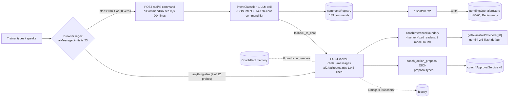
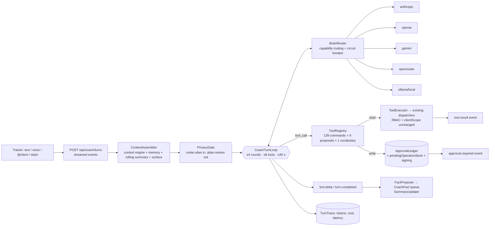
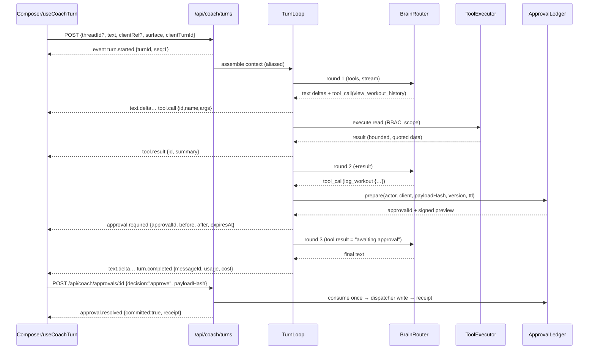
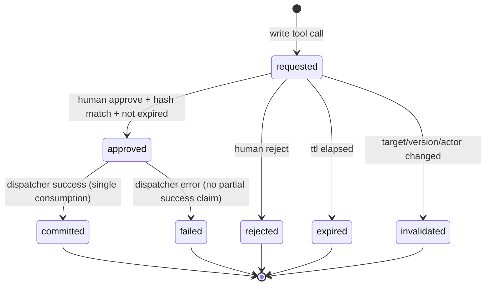
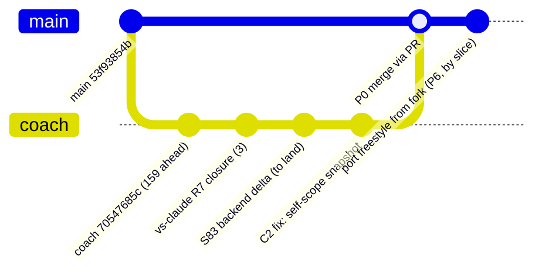

# 01 — Architecture

## 1. What exists today (coach branch `70547685c`), measured

**Structural faults** (hostile review H1–H6):
- There are two lanes, two action vocabularies and two approval stores.
- Routing happens in the browser.
- The model never chooses a tool.
- There is no streaming.
- The memory is dark.
- The model is hard-coded.

## 2. Target

## 3. Component ownership

| Component | New path (backend) | Reuses | Owner of truth |
|---|---|---|---|
| Turn route + SSE writer | `backend/services/coach-brain/turn/coachTurnRoute.mjs`, `turnEventWriter.mjs` | `protect`, rate limiter | Event sequence and terminal state |
| Turn loop | `coach-brain/turn/coachTurnLoop.mjs` | `circuitBreaker.mjs` | Budgets, round counting |
| Context | `coach-brain/context/contextAssembler.mjs`, `conversationSummary.mjs` | `contextEngine/coachContextEngine.mjs`, `coachFactMemoryPolicy.getMemoryForTask` | What the model sees |
| Privacy | `coach-brain/privacy/rosterAlias.mjs` | `deIdentifier.mjs`, `phiScanner.mjs` (as defence-in-depth) | Name↔alias map per turn |
| Tools | `coach-brain/tools/toolRegistry.mjs`, `toolSelector.mjs`, `toolExecutor.mjs` | `commandRegistry/*`, `commandDispatcher.mjs`, `dispatchers/*`, proposal classifiers | Tool list and schemas |
| Ledger | `coach-brain/ledger/approvalLedger.mjs` | `destructiveOperations.mjs`, `pendingOperationStore.mjs`, `operationSigning.mjs`, `approvalEvents.mjs` | Whether a write may run |
| Brains | `coach-brain/brain/brainAdapter.mjs`, `modelRegistry.mjs`, `brainRouter.mjs`, `adapters/*.mjs`, `costLedger.mjs` | `services/ai/adapters/*`, `providerCostTracker.mjs` | Which model serves a turn |
| Memory writer | `coach-brain/memory/factProposer.mjs` | `coachFactService.proposeFacts` | Proposed facts (never active without a human) |
| Trace | `coach-brain/trace/turnTrace.mjs` | `commandAudit.mjs` | Per-turn metrics |

**Frontend** (`frontend/src/components/DashBoard/Pages/coach-workspace/`):

| Component | Responsibility |
|---|---|
| `useCoachTurn.ts` | Opens the stream (fetch + `ReadableStream`), reduces events, handles cancel and resume |
| `CoachWorkspace.tsx` | Layout: sidebar · conversation · inspector; responsive shell |
| `ThreadSidebar.tsx` | Threads grouped by client and today; search |
| `ConversationColumn.tsx`, `TurnView.tsx` | Messages, markdown, streaming caret |
| `ActivityTimeline.tsx` | Collapsible "Coach looked at …" tool steps (Claude Code style) |
| `ApprovalCard.tsx` | Before → after diff, with Approve / Edit / Reject and expiry |
| `Composer.tsx`, `ClientMentionChip.tsx`, `SlashMenu.tsx` | The only input: `@client`, `/log /plan /schedule /review`, attach, mic |
| `InspectorPanel.tsx` | Client card, pending approvals, today brief (G10) |

The existing `coach-assistant/` tree stays mounted behind the flag until P4 exit, then retires. Its result cards are reused inside `TurnView` where they fit (`CoachExecutionResultCard`, `CoachPreparedDraftResultCard`).

## 4. A turn, end to end

## 5. Approval state machine

## 6. Lineage consolidation (P0)

Candidate order (decision D1): coach branch → land C3 → fix C2 → merge `origin/main` into it → PR to `main`. The fork is **not** merged; the fork-only assets (freestyle trio, the privacy lessons) are ported by slice.

## 7. Trade-offs chosen

- **SSE over POST, not WebSocket.** It is one-directional, which matches a turn. It works through the existing Express stack and auth header, and cancel is a separate POST. Socket.IO exists but would couple turns to connection state.
- **Tool calling, not classify-then-dispatch.** The classifier is kept only as a *fallback brain* for providers without tool support (capability flag), not as the router.
- **Reuse the ledger, not rebuild it.** The coach branch's signed, async, atomically consumed store is the strongest code in the system.
- **Dictionary aliasing, not regex admission.** A roster substitution is deterministic and testable to zero. A regex over clinical prose is not (H7).
