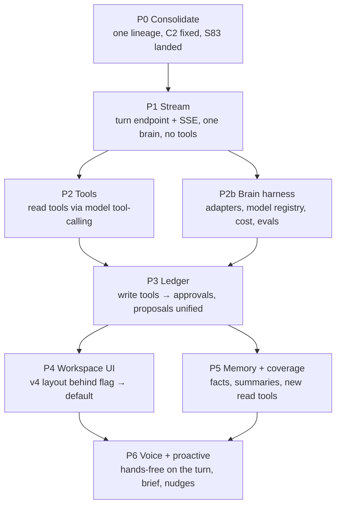

# 04 — Build order

Seven phases. Each phase ends in **one PR**, reviewed against its checkpoint in
`07-checkpoints.md` before the next phase starts. There are no parallel phases on the same
files. Estimates are in slices, not days.

## P0 — Consolidate (blocks everything)

**Entry:**
- Owner decision D1 on the base branch.
- The vs-claude lane has finished its R7 work, or has handed it off.

**Work:**
- Land the S83 backend delta (C3).
- Push the lane branch from the verified-clean clone.
- Fix C2: the self-scope snapshot, plus typed refusals for every null guard (M5).
- Merge `origin/main` into the coach branch and resolve conflicts on coach paths. Measured: the branch is 140 behind main, and 24 coach-path files changed on main since the 09-01 merge base.
- Put the mounted smoke in the gate.
- Freeze coach paths on `creator-brains-engine-r2-20260915` with the lane lock (J20).
- Index this package as canonical.

**Exit:**
- The smoke passes 3/3 on the consolidated branch.
- Unit suites are at or above baseline (1,538 frontend / 1,298 backend AI).
- The PR to `main` is merged.
- Render has deployed it, and a production smoke has run read-only.

**Rollback:** revert the merge commit; main is unchanged until the merge.

## P1 — Stream (J02, J03, J17)

**Work:**
- Add `POST /api/coach/turns` with the SSE writer, heartbeat, cancel and idempotency.
- Build a single-brain loop with **no tools**: context assembler, aliasing and one model round.
- Add `useCoachTurn.ts` to the frontend, mounted in the *existing* page behind `COACH_BRAIN_V4_STREAM`, replacing only the chat send.
- **Measure U1 first**, as a spike slice. Stream 120 s of heartbeats through Render in staging. If the proxy cuts the stream, stay under the proven limit and make resume-by-`turnId` the fallback.

**Exit:**
- First token ≤ 1.5 s p50 on staging.
- Cancel stops the provider in ≤ 1 s (measured).
- There are zero silent terminal states in the T-J02 matrix.

**Rollback:** flag off. The legacy `/api/ai-chat` path is untouched.

## P2 — Read tools (J04, J05)

**Work:**
- `toolRegistry` built from `commandRegistry` for **read** commands only (94 of 139).
- A `toolExecutor` that calls the existing dispatchers.
- A `toolSelector`, and the loop running at most 4 rounds and at most 8 calls.
- `ActivityTimeline` events.
- Delete the `shouldRouteToCommandLane` use in the v4 path.

**Exit:**
- The 12-utterance probe is at least 11/12 correct, and the golden set tool-selection is ≥ 90% on the primary brain.
- 0 write dispatchers are reachable (T-J06a).

**Rollback:** flag `COACH_TOOLS=off`, which falls back to the P1 single-round turn.

## P2b — Brain harness (J09, J10, J19)

**Work:**
- The `BrainAdapter` interface.
- Adapters for anthropic, openai, gemini, openrouter and ollama.
- `modelRegistry` (D2), `brainRouter` with the circuit breaker, and `costLedger`.
- The golden-set eval runner: `backend/eval/coach-brain/`, extending the existing `backend/eval/ab/abRunner.mjs`.
- An admin trace view (read-only).

**Exit:**
- The same golden set runs on at least 3 brains.
- The leaderboard is committed as evidence.
- The fallback event is observed under an injected failure.

**Rollback:** registry row `enabled:false`.

## P3 — Write tools and one ledger (J06, J07)

**Work:**
- Expose write tools, which produce `approval.required` only.
- `approvalLedger` over the existing store.
- `POST /api/coach/approvals/:id`.
- Map the 9 proposal types to write tools.
- Build `ApprovalCard`.
- Enumerate dispatchers against the registry (T-J06b).
- `APPROVAL_STORE=redis` in production (D5).

**Exit:**
- T-J06 shows 0 mutations before approval, with concurrent approves committing exactly once.
- The replay, edit, expire and invalidate matrix is green.
- The mounted flow is proved at 375 and 1440 px.

**Rollback:** `AI_COMMAND_WRITES_ENABLED=false` (existing kill switch) keeps reads working.

## P4 — Workspace UI (J13, J14)

**Work:** build `coach-workspace/**` per `02-wireframes.md`, mount it at the three
existing routes behind `COACH_BRAIN_V4`, then make it the default and retire the old
`coach-assistant` page. Keep the reusable result cards.

**Exit:**
- There are ≤ 12 first-paint controls on desktop.
- The transcript takes ≥ 70% of mobile height.
- The lens switch visual diff is clean.
- The a11y checks pass.

**Rollback:** flag off; the old page returns.

## P5 — Memory and coverage (J08, J12)

**Work:**
- Rolling summaries.
- `getMemoryForTask` in the context bundle.
- `factProposer` with the inspector review queue.
- New read tools for messaging, sessions and credits, orders, waivers and leads.

**Exit:**
- T-J08 shows a fact approved in turn N appearing in the turn N+1 prompt, and a forgotten fact is gone.
- Coverage table rows are marked READ for those 5 domains.

**Rollback:** per-tool registry flag.

## P6 — Voice and proactive (J15, J16)

**Work:**
- Port the fork's freestyle trio by slice under the live-blueprint contract.
- Hands-free sends into `useCoachTurn`.
- Streamed TTS of the final text, with barge-in.
- The G10 nudge engine and morning brief shown in the inspector.

**Exit:**
- Physical-device acceptance: one phone and one desktop, recorded.
- No duplicate sends under delayed callbacks (live blueprint T-set).

## Dependencies outside the code

| Dependency | Needed by | Owner |
|---|---|---|
| D1 base branch ruling | P0 | Sean |
| C3 landing + push from clean clone | P0 | vs-claude lane |
| D2 brain list + budget | P2b | Sean |
| D3 provider privacy allowlist | P1 (client-bound turns) | Sean |
| D5 Redis in production | P3 exit | Sean / Render |
| U1 Render streaming limit measured | P1 | builder (spike) |
