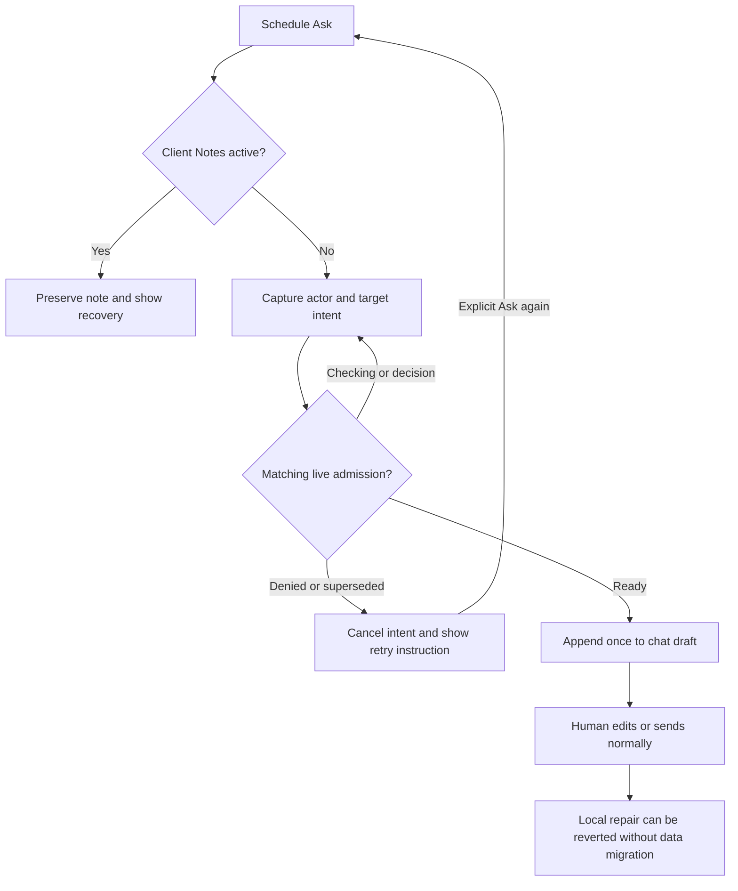

# 12 — Astra hostile review and repair, 2026-09-23

Owner: Codex / Astra. Status: LOCAL REPAIRS VERIFIED; RELEASE REVIEW BLOCKED. Baseline: `92c7e21da992f66ba22a912fec134156c569ad4d`. Supplements `11-v4-review-log.md`; preserves historical findings. Canonical package remains this directory.

Archive successor: `Z:/HostileReviews/2026-09-23-021253-swan-coach-v4-workspace-repair-and-delivery.md`, verdict **PARTIAL**. This builder audit is not independent Claude approval.

Entry point: `frontend/src/components/DashBoard/Pages/coach-workspace/CoachWorkspacePage.tsx` → `useCoachWorkspaceModel.ts` → shared `CoachCommandCenter.controller.ts` / `CoachCommandCenter.submit.ts` / `useAIChat.ts`.

## Baseline and preservation

Restored the exact supplied v4 bundle into an independent clone from the incident's clean clone, including the three R7 prerequisites. `git fsck --connectivity-only --no-dangling`: PASS. Live origin/main remains `53f93854b`. Shared damaged checkout was read only. Branch: `codex/coach-v4-hostile-20260923`.

Planning snapshots: all 13 originals in `tmp/hostile-review-20260923/blueprint-before/manifest.json`; copied and SHA-256 compared before updates. Native hooks are not claimed. Synthetic frontend baseline: 53/53 pass. Borrowed dependencies produced eight unresolved-import diagnostics and a CanceledError typing mismatch. Lockfile-exact `npm ci --prefix frontend --ignore-scripts --no-audit --no-fund` resolved those environment mismatches, with no package-file changes; full frontend TypeScript checking now passes. Setup/import errors are not behavioral RED evidence.

## Requirements, contract and slices

| ID | Acceptance / forbidden side effects | Entry / test / exit |
|---|---|---|
| R1 | Keep same-actor rows during refresh; label retained rows on failure and offer retry; successful empty clears cached rows; actor/search cannot revive stale rows | useStableThreadList (7 tests), useAIChat.listRefresh (4), mounted failed-list/retry test; PASS |
| R2 | Schedule Ask stages exactly once after matching admission; denial/actor/target/navigation changes cancel visibly; permit its own route-thread reset; 9-second admission works | useAskAboutSession.lifecycle (13), delayed/denied/existing-thread e2e; PASS |
| R3 | Ask in Client Notes mode preserves note and refuses visibly; never stages a question that Enter would save as a note | Same lifecycle suite and mounted note-mode regression; PASS |
| R4 | Send notice uses its own request's network stage; concurrent food/slash sends cannot overwrite it; unknown means possibly sent | useAIChat.sendReceipt (2), twoChats, submit and caller regressions; PASS |
| R5 | Tab and Shift+Tab navigate normally; Enter picks; IME does not send | WorkspaceComposer.keyboard (3), mounted native-Tab test; PASS |
| R6 | CSS media queries and docking agree at fractional breakpoints; theme/lens and role surfaces remain functional | useWorkspacePanels.zoom (4), existing browser suite plus trainer/4K; PASS with synthetic fractional matchMedia, not real browser zoom certification |

Responsibilities: list cache is presentation-only; selection adapter remains authority; Ask owns a disposable local intent, never admission or persistence; send receipt belongs to caller, never shared hook state. No new provider, data schema, endpoint, paid run, production mutation, or legacy deletion. Local-first brain/streaming/tool-registry phases remain separate unbuilt blueprint work.

## UI, flow and applicability

Existing desktop/mobile wireframes in `02-wireframes.md` remain canonical. Status messages use the existing live region beneath the single composer. Waiting → ready appends question beneath current chat draft; denied/cancelled/note-mode shows recovery instruction; retry requires another explicit Ask. Keyboard uses normal tab order, arrow selection and Enter. No new surface or palette.

Contracts: existing APIs unchanged; request-local send receipt adds an optional in-process argument. State diagram represented above; sequence is request → admission → local append. ERD/migration N/A: no persistence changes. Permissions unchanged: server and selection binding remain authoritative. Privacy: synthetic fixtures only, prompt includes session time but no client name. Logs contain no customer data. Performance: constant-size intent/cache bookkeeping, no new polling or network calls. Operations owner Sean; rollout by reviewed branch/PR, no push/deploy in this task. Rollback is revert of the scoped repair commit, no database restore.

## Review and readiness

Prior archive `2026-09-23-012227-swan-coach-v4-workspace-on-coach-brain-v4-build` read before review. D1–D4 reproduced and repaired. Additional admission, note-mode, own-thread-reset and failed-list recovery regressions repaired. A bounded same-model reviewer found no new concrete defect in the final schedule/thread and list-recovery scan; that is corroboration, not independent approval.

Behavioral RED logs precede repairs for cache, delayed/denied Ask, network receipts, native Tab, route-thread reset and failed-list recovery. Setup errors are excluded. The optional eighth send argument is a per-invocation `AIChatSendReceipt={reachedNetwork:boolean|null}`: false before message POST, true when that POST is attempted, null when unknown. Creating an empty conversation alone does not mean the words were sent. APIs and return values remain unchanged.

The selection adapter owns admission deadlines; Ask has no competing eight-second TTL. It consumes a matching pending intent before appending, allows only the old-thread-to-empty transition caused by its own client switch, and never sends automatically. History distinguishes unloaded/loading/settled/error, including interrupted reads; retained rows are labelled on failure and a successful empty retry clears them.

## Verification receipt

Run from this clone's `frontend` directory:

- `node node_modules/vitest/vitest.mjs run src/components/DashBoard/Pages/coach-assistant src/components/DashBoard/Pages/coach-workspace src/hooks src/context --maxWorkers=3`: **1,883/1,883 PASS across 313 files**, exit 0.
- `node --max-old-space-size=16384 node_modules/typescript/bin/tsc --noEmit`: PASS, exit 0.
- With Vite at loopback port 5198, `SWAN_PLAYWRIGHT_SKIP_WEBSERVER=1`, `BASE_URL=http://127.0.0.1:5198`: `node node_modules/@playwright/test/cli.js test e2e/coach-workspace-smoke.spec.ts e2e/coach-workspace-client.spec.ts e2e/coach-workspace-repairs.spec.ts --project="Desktop Chrome" --workers=1 --retries=0 --reporter=line`: **27/27 PASS**, exit 0.

Browser coverage includes admin/trainer/client, widths 375/414/768/1440/2560/3840, all four lens variants, theme changes, conversations, unpin, Ask, denied access, note refusal/save errors, focus and sends. Phone and 4K screenshots inspected. All browser API responses are synthetic; no real database or provider was used.

Raw logs/snapshots: `tmp/hostile-review-20260923/`. Committed `evidence/20260923-repair-verification.json` records command results and hashes. Caller argument tests now explicitly check the additional receipt argument. A 302-line controller size failure was corrected by shortening its explanatory comment; the enforced 300-line test passes. The prior author's publication-card flake did not reproduce in the final run, which cannot prove it never recurs.

## Remaining delivery finding and unproven boundaries

**D1 — HIGH: the v4 bundle does not deliver the required S83 backend delta.** The runner `backend/run-coach-postgres.mjs` and selector `backend/tests/helpers/coachSuiteSelection.mjs` are absent in v4 and untracked in the preserved source worktree. Its manifest is `tmp/worktrees/swan-coach-astra-owned-20260906/docs/ai-workflow/AI-HANDOFF/BLUEPRINT-swan-coach-universe-v3-s83-completion-2026-09-19/evidence/candidate-manifest.json` under the canonical shared checkout; generated 2026-09-22T22:16:33.646Z, entries at lines 770/889. Of 106 backend manifest paths, 62 are absent in v4 and 44 have different raw hashes; 41 of the latter still differ after newline normalization, and three were retired in the source candidate. No backend paths changed in the ten v4 commits (`114de2c34..92c7e21da`). This is the PART-C/P0.1 delivery dependency, not a newly demonstrated vulnerability. The separate S83 lane was inspected without importing its broad delta.

Unproven boundaries:

1. Real backend, PostgreSQL persistence, production auth/permissions and provider behavior: NOT RUN.
2. Independent final Claude review: BLOCKED; `claude auth status` returned loggedIn=false, authMethod=none, firstParty provider. No provider prompt or paid fallback was sent. The predecessor's Kimi gate also remains pending.
3. Actual fractional browser zoom: the four synthetic matchMedia boundary tests pass; real fractional zoom remains untested.
4. Full one-brain/registry/ledger/stream/local-first implementation: later blueprint phases remain unbuilt.

Existing oversized useAIChat/test files remain maintainability debt; no broad hook decomposition was attempted. Mermaid source above was authored; no rendered diagram preview was verified. Astra's conditional profile applies to this compact receipt; no workflow-controller or native-hook approval is claimed.

**Local repair implementation:** verified within the stated frontend boundary. **Release readiness:** blocked. **Deployed:** no. Next: independent review against the repair commit and separate S83 consolidation with real-backend evidence before claiming P0 or whole-brain readiness. User authorized a local commit, not push.
