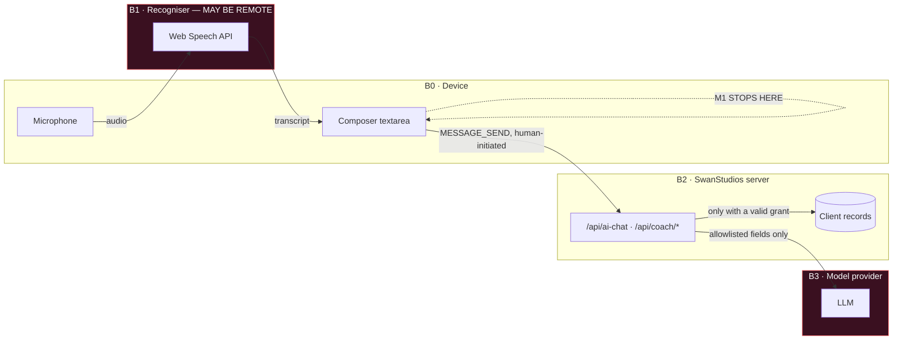
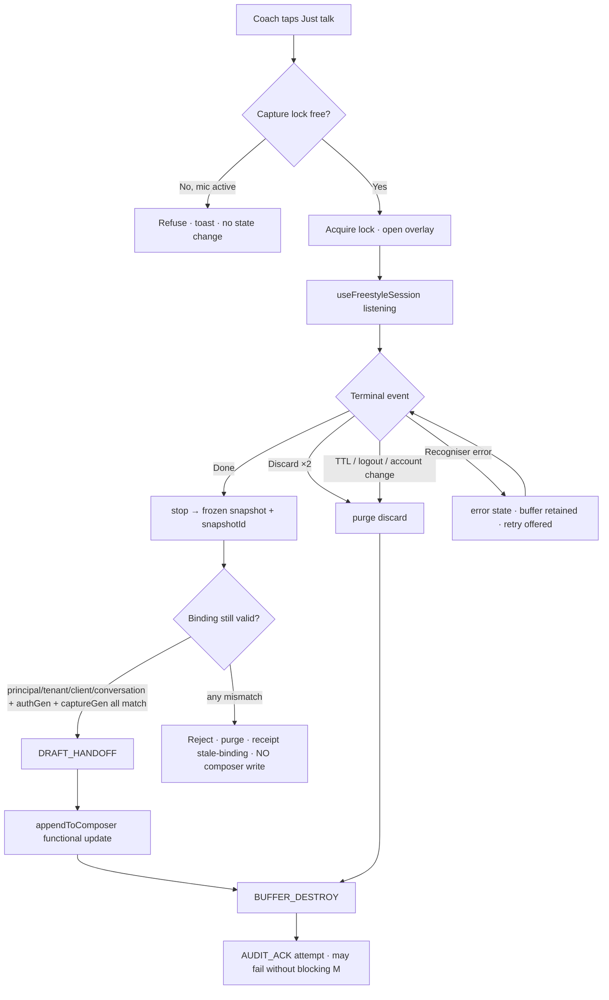
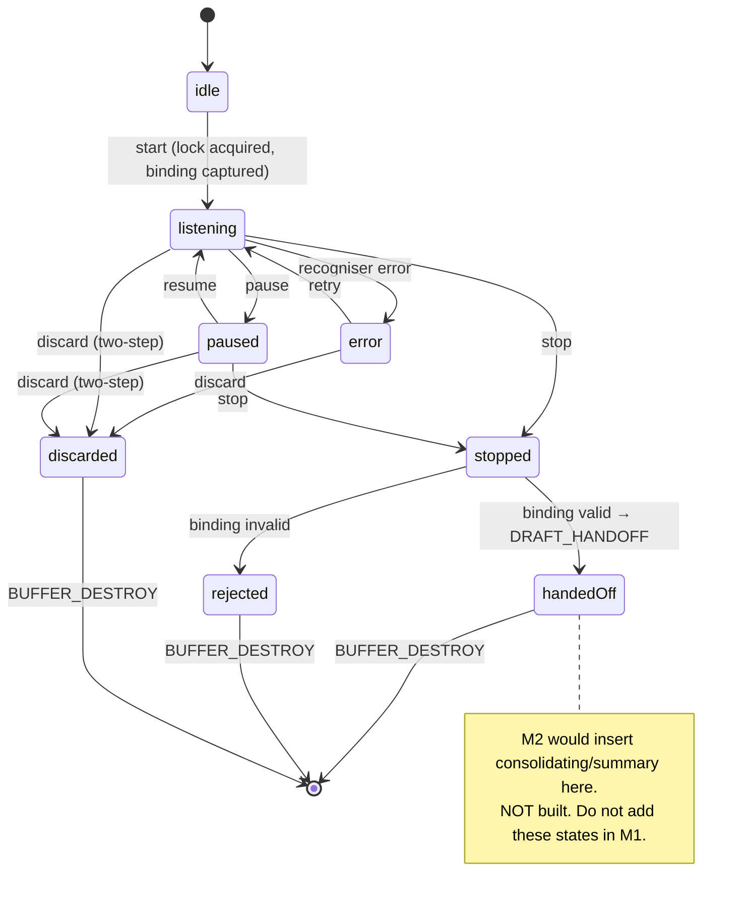
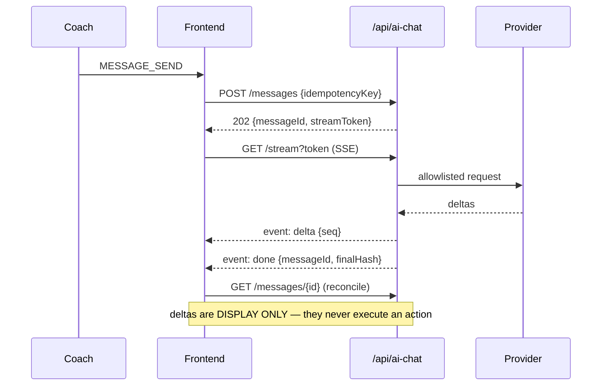

# 01 — Architecture

## 1. Component tree (M1 scope in **bold**)

```
CoachCommandCenterPage.tsx                      [SUPPLIED] mounted, 3 roles
└── CoachConsoleDock.tsx                        [SUPPLIED] owns the composer
    ├── <textarea> commandText / commandTextRef [SUPPLIED] authoritative composer node
    ├── dock-mic  → onVoice()                   [SUPPLIED] SHORT-COMMAND capture owner
    ├── **CoachFreestyleControl.tsx**           [PROPOSED] LONG-FORM capture owner
    │   ├── **useCoachFreestyleDraft.ts**       [PROPOSED] the S4 consumer
    │   └── CoachFreestyleOverlay.tsx           [SUPPLIED] always mounted, isOpen toggles
    │       ├── useFreestyleSession.ts          [SUPPLIED] buffer + ownership mask + purges
    │       └── useFreestyleSpeech.ts           [SUPPLIED] Web Speech API
    └── VoiceRecordingOverlay.tsx               [SUPPLIED] short-command overlay
```

## 2. The three trust boundaries



**B1 is the finding most likely to be missed.** `useFreestyleSpeech` uses the Web Speech API. The
overlay's own header states this is a *transport* choice, not a privacy guarantee: **on Chrome the
recogniser is cloud-backed** `[SUPPLIED]`. Dictated audio — a coach saying real client names aloud —
therefore leaves the device **before any SwanStudios code executes**. No downstream redaction can
undo that. This is an unresolved owner decision, not a solved problem (PART C, D-1).

## 3. M1 dataflow



## 4. Why binding is checked at **consumption**, not only at capture (correction 4)

`useFreestyleSession` protects **its own buffer**. It cannot protect a *consumer it never knew
about*. A ten-minute dictation spans logout, re-auth, client switch and conversation switch. The
snapshot is a plain object that outlives every in-hook purge **by design** — which is exactly why
handing it to a composer that now belongs to a different client is possible.

**Binding record**, captured at `start()` and re-checked at consumption:

```ts
interface CaptureBinding {
  principalId: string;      // acting user
  tenantId: string;         // org
  clientId: string | null;  // subject of coaching, null = self
  conversationId: string;
  authGeneration: number;   // bumped on login/logout/refresh
  captureGeneration: number;// bumped on every new capture session
}
```

Consumption proceeds **only if every field is equal**. Any mismatch → reject, purge, emit a
`stale-binding` receipt, **write nothing to the composer**. Missing target (composer unmounted,
`conversationId` null) → treated as mismatch: purge and receipt, never a silent hold.

`snapshotId` is a per-capture UUID. A consumed-set makes consumption **at most once**, so a duplicate
`onStopped` — a real possibility across a responsive remount — is a no-op, not a double append.

## 5. State machine



`consolidating` and `summary` are declared in the existing `FreestyleState` union `[SUPPLIED]` and
remain **unreachable** in M1. A builder must not wire them.

## 6. Capture ownership (correction 8)

**Exactly one active capture owner at a time**, enforced by a module-level lock in the dock, not by
hope:

```ts
type CaptureOwner = 'none' | 'short-command' | 'freestyle';
```

- Acquire is a compare-and-set against `'none'`. Failure is **explicit refusal with a visible
  reason**, never a silent no-op and never a pre-emption of a live capture.
- Release happens on every terminal path including error and unmount.
- Switching modes requires release-then-acquire. There is no implicit hand-off.
- Both owners are **discrete controls with visible labels**. There is **no press-and-hold**, no
  long-press, and no hidden gesture: they are undiscoverable, inaccessible to keyboard users, and
  unreliable with gloves or wet hands on a gym floor.

## 7. Composer update authority (correction 5)

The authoritative owner of composer text is **`CoachConsoleDock`**, which holds the `<textarea>` and
`onCommandTextChange`. A ref mirrored on render fixes a *stale closure*; it does **not** make a
read-modify-write *atomic*. Two writers (a typing coach and a returning snapshot) can still
interleave between render and commit.

M1 therefore requires a **functional update** at the authoritative owner:

```ts
appendDictation(snapshotId: string, text: string): AppendResult
```

It computes the next value from the **current** value inside the state updater, and it is
idempotent on `snapshotId`. Contract in `03-contracts.md` §2.

> **`[UNVERIFIED]`** — that the current ref-mirror implementation actually loses a concurrent edit
> has *not* been demonstrated. It is an unproven interleaving, labelled as such, and `09-tests.md`
> T-05.3 is written to decide it. Do not report it as a live defect.

## 8. What M3 would add (designed, not built)



Full transport decision, schemas and failure matrix in `03-contracts.md` §5.
