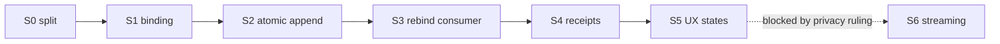

# 04 — Build order (file by file)

Budget = hard 300 lines, `wc -l`. Every slice ends bootable and green.

## S0 — Split the oversized files FIRST (no behaviour change)

Three touched files already exceed the cap `[SUPPLIED]`. Adding to them first would compound a
violation, so extraction comes before features. **Pure moves: no renames of exported symbols, no
signature changes, no new keys in any `vi.mock` factory.**

| # | File | From → To | Extract |
|---|---|---|---|
| S0.1 | `hooks/useFreestyleSession.ts` | 624 → ≤300 | `useFreestyleSession.types.ts` (all exported interfaces/unions) · `useFreestyleSession.purge.ts` (purge + TTL + ownership-mask helpers) |
| S0.2 | `CoachFreestyleOverlay.tsx` | 605 → ≤300 | `CoachFreestyleOverlay.controls.tsx` (control row + discard confirm) · `CoachFreestyleOverlay.signals.tsx` (orb, counters, live phrase) |
| S0.3 | `hooks/useFreestyleSpeech.ts` | 358 → ≤300 | `useFreestyleSpeech.support.ts` (capability detection + vendor prefixes) |

**Re-export rule:** each original file keeps re-exporting every symbol it exported before, so no
importer changes in S0. An extraction that forces an import edit is not a pure move.

> **Why this discipline:** an extraction of a green file is only safe if proven. Round-2 **R2-10**
> recorded a package document that broke its own size ban; the same class of drift in code is worse.
> S0's acceptance criterion is *byte-identical behaviour*, evidenced by the pre-existing suites
> passing **unchanged** — not rewritten to fit the new shape.

## S1 — Binding + snapshot identity

| File | Budget | Purpose |
|---|---|---|
| `hooks/useCaptureBinding.ts` **NEW** | ≤120 | Builds `CaptureBinding` from auth/route context; exposes `authGeneration`, `captureGeneration`, `sameBinding(a,b)`. |
| `hooks/useFreestyleSession.types.ts` **MODIFY** | ≤300 | Add `BoundSnapshot`, `RejectReason`, `HandoffOutcome` (§1, `03-contracts.md`). |

**Imports:** `useAuth` (existing, `[SUPPLIED]` — used by `CoachCommandCenterPage.tsx`), `useSearchParams`.
**Exports:** `useCaptureBinding`, `sameBinding`.
**Mimic:** the ref-mirror discipline already in `useFreestyleSession.ts` (`fragmentsRef`) for any
value read inside a long-lived callback.

**ARCHITECT MUST SUPPLY BEFORE S1** (see PART C): the authoritative source of `tenantId` and
`conversationId`, and whether `authGeneration` already exists in the auth layer or must be added.
Do **not** invent these. If absent, STOP and return the question.

## S2 — Atomic composer append

| File | Budget | Purpose |
|---|---|---|
| `CoachConsoleDock.tsx` **MODIFY** | 285 → ≤300 | Implement `appendDictation(snapshotId, text)` per `03-contracts.md` §2; hold the consumed-set; own the capture lock. |
| `CoachConsoleDock.appendDictation.ts` **NEW** | ≤100 | Pure `mergeDictation(prev, text)` + consumed-set, unit-testable without React. |

Extract the pure part so the merge rule is testable without rendering. The dock keeps only the
`setCommandText(prev => …)` call.

## S3 — Rebind the consumer

| File | Budget | Purpose |
|---|---|---|
| `hooks/useCoachFreestyleDraft.ts` **MODIFY** | 188 → ≤300 | Take `BoundSnapshot`; validate binding at consumption; return `HandoffOutcome`; call `appendDictation`; emit the three separated events. |
| `CoachFreestyleControl.tsx` **MODIFY** | 90 → ≤300 | Acquire/release the capture lock; render the disabled + unsupported states from `02-wireframes.md` §2/§8. |

**The ref-mirror is retained but demoted**: it remains the stale-closure guard, and is *no longer*
the merge mechanism. `03-contracts.md` §2 is.

## S4 — Receipts and the three events

| File | Budget | Purpose |
|---|---|---|
| `services/coachCaptureReceipts.ts` **NEW** | ≤150 | `emitReceipt(event)` for `DRAFT_HANDOFF` / `BUFFER_DESTROY` / `AUDIT_ACK`; idempotent on `eventId`; **never** carries transcript text. |

Sink-failure behaviour: local deletion proceeds regardless; a failed sink is surfaced as
`durability: 'unacknowledged'` and never as success. TTL and authorisation for the sink are in
`03-contracts.md` §1.1 and PART C D-4 (sink not yet chosen).

## S5 — UX states

| File | Budget | Purpose |
|---|---|---|
| `CoachFreestyleOverlay.controls.tsx` **MODIFY** | ≤300 | Wire the permission-denied, unsupported, error-retained, empty-result and rejected-handoff screens (`02-wireframes.md` §7–§11). |
| `CoachCommandCenter.bridgeDockStyles.ts` **MODIFY** | **299 → must extract first** | Add `.dock-freestyle:disabled` states. **1 line of headroom — extract a `dockControlStyles.ts` before touching.** |

## S6 — M3 streaming (NOT AUTHORISED — design only)

Listed so the build order is complete. Requires the privacy ruling (PART C D-1/D-2) before any
provider-facing work starts. No files are to be created in S6 under this package.

---

## Dependency order

S2 may proceed in parallel with S1 **only** if the builder stubs `CaptureBinding` behind the
interface; it may not be merged before S1 lands.

## In-repo patterns to mimic (excerpts the builder needs)

**ARCHITECT MUST SUPPLY** (PART C D-7) — the builder has the checkout but no memory of this
conversation, so these are named, not pasted, and must be provided as excerpts before S1:

1. `CoachConsoleDock.tsx:230-250` — the existing `dock-mic` button, for markup/ARIA shape.
2. `hooks/useFreestyleSession.ts` — the `fragmentsRef` block, for the ref-mirror idiom.
3. One existing `*.test.ts` in `hooks/` — for the suite's `renderHook`/`act` conventions.
4. `CoachCommandCenter.bridgeDockStyles.ts` — the `.dock-mic` rule block, for the token idiom and
   the `color-mix()` fallback-first cascade.
