# Completion architecture

## Ownership

| Responsibility | Existing owner |
|---|---|
| Selection/admission/publication | `useCoachSessionSelection` and its existing state/admission/commit leaves |
| Created-thread adoption lifetime | `useCoachCreatedThreadAdoption` |
| Independent adoption settlement | Existing controller/router composing layer; exact call sites required by C0 |
| Dirty draft | Existing plan-51 shell owner |
| Blocked navigation | `useCoachSelectionNavigationBlocker` |
| Memory mutation | Scoped route → correction/read/policy services → `CoachFact` |
| Consent merge | Shared preference updater participating in both controller writers |
| Rest deadline | Existing `useRestTimer` |
| Logger command lifetime | Existing Logger scope and dictation hooks |
| Mobile top reserve | Universal layout styles and Coach bridge height styles |
| Database lifecycle | Owned verification harness, not application startup |
| Domain writes | Existing reviewed proposal service; no new authority |

## User and subsystem flows

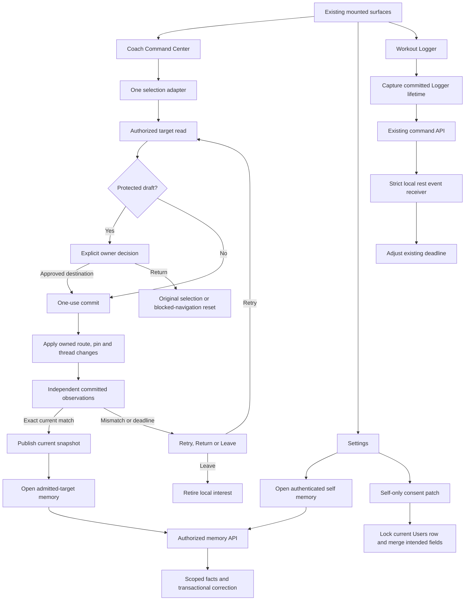

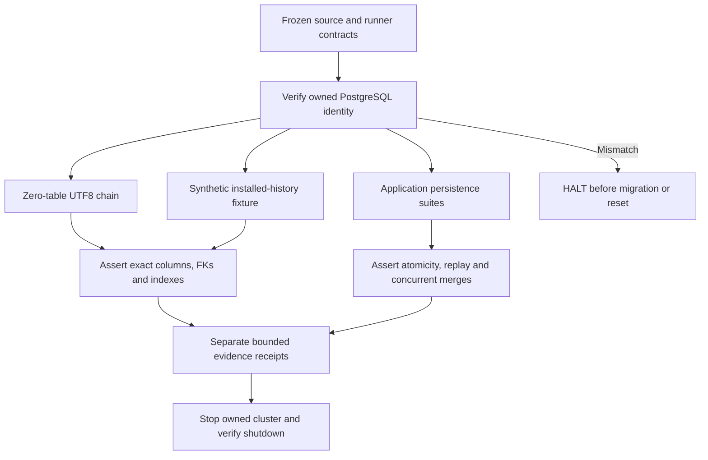

## Selection states

`committing` includes waiting for independent settlement. `settling` is not a new enum member.

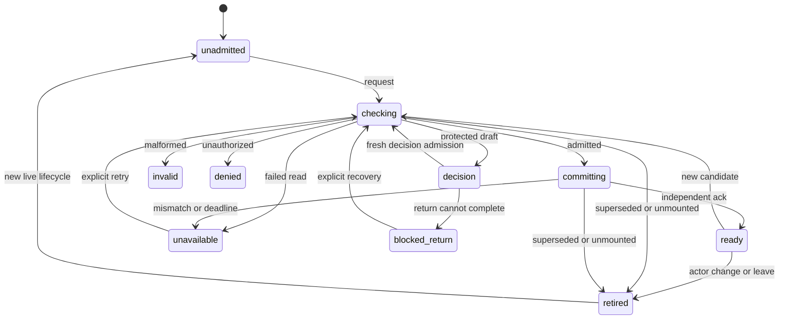

Superseded work cannot publish a failure into a newer lifecycle. Retirement clears publication and invalidates the old ticket.

## API interaction sequences

Endpoint labels marked **C0-bound** must be replaced by supplied exact methods/paths before execution. They are not invented route contracts.

```mermaid
sequenceDiagram
  participant UI as Coach producer
  participant Owner as Selection adapter
  participant API as C0-bound target-access GET
  participant Live as Router, pin and active thread
  UI->>Owner: requestSelection(candidate)
  Owner->>API: Current actor/audience and validated candidate
  API-->>Owner: Admission or bounded denial
  alt Current admission and owner decision permit
    Owner->>Live: Consume ticket and apply once
    Live-->>Owner: Independent committed observation
    Owner->>Owner: ackCommit and publish
  else Superseded or denied
    Owner-->>UI: No publication; current recovery only
  end
```

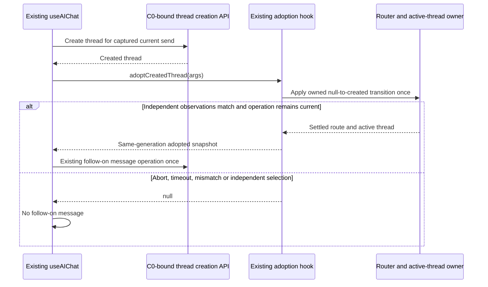

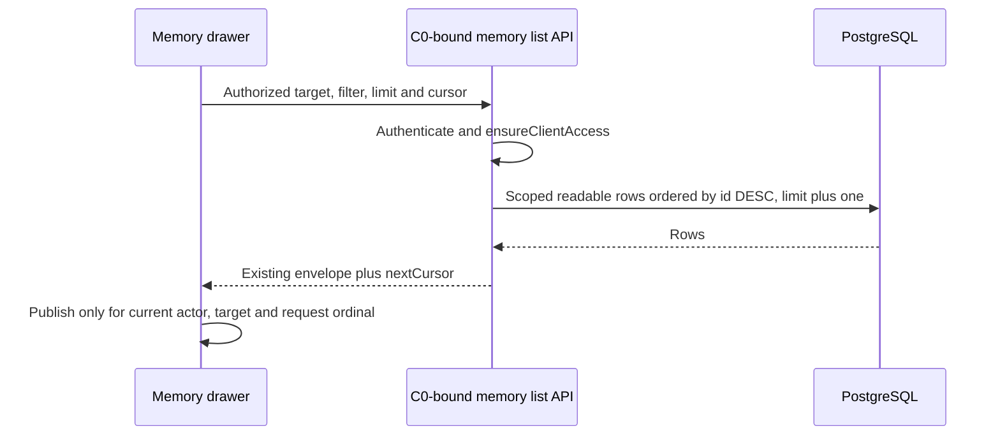

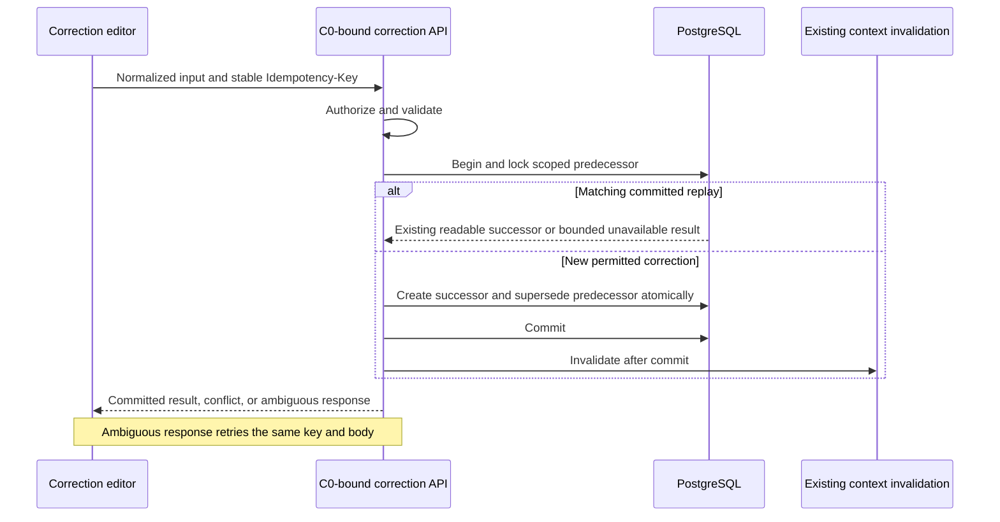

```mermaid
sequenceDiagram
  participant UI as Forget confirmation
  participant API as C0-bound forget API
  participant DB as PostgreSQL
  participant Context as Retrieval boundary
  UI->>API: Explicit selected version
  API->>API: Authorize target and version
  API->>DB: Serialize with correction; tombstone selected version
  API->>DB: Commit without extending an existing purge deadline
  API->>Context: Invalidate current retrieval
  API-->>UI: Actual version result
  Note over UI,Context: Success excludes retrieval; it does not certify physical purge
```

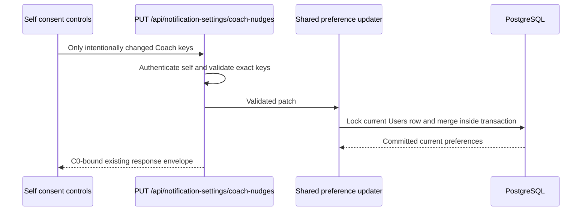

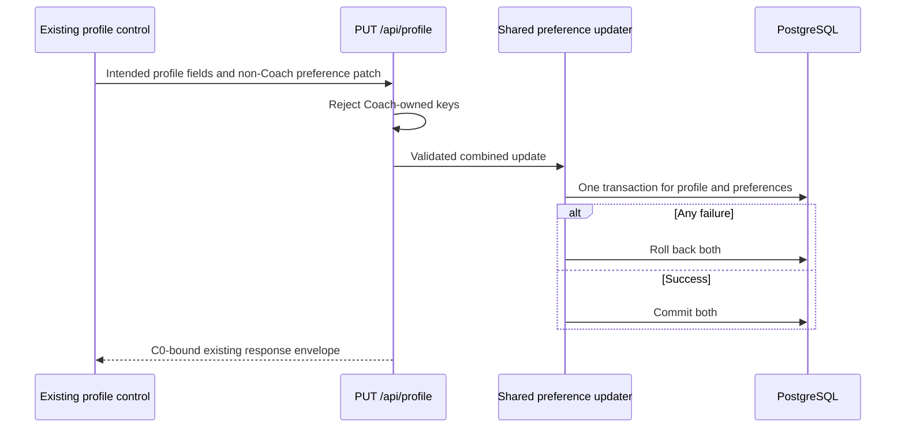

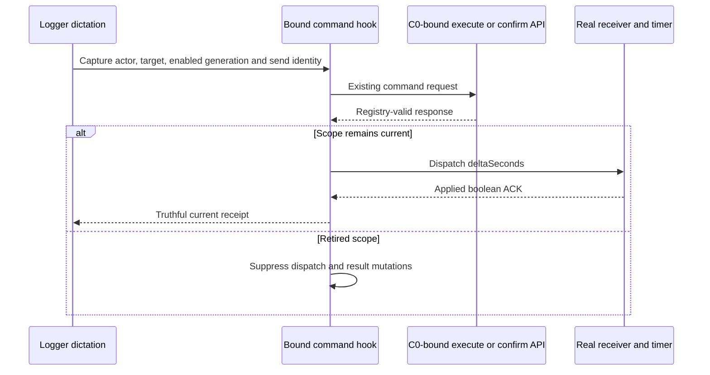

Existing self-consent read and conversation list/detail APIs are also exercised by the mounted tests. Their exact contracts are absent. C0 must supply them and append their sequences before C4; they may not be substituted with assumed requests.

## Memory and timer states

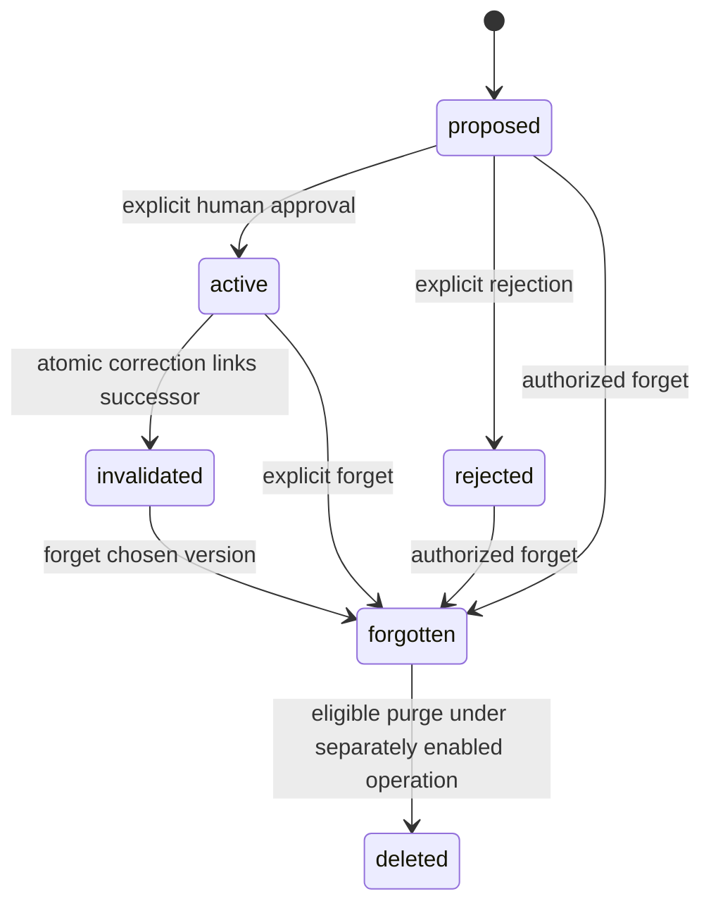

`forgotten` is a conceptual state represented by `forgottenAt`; it is not a new `status` enum value.

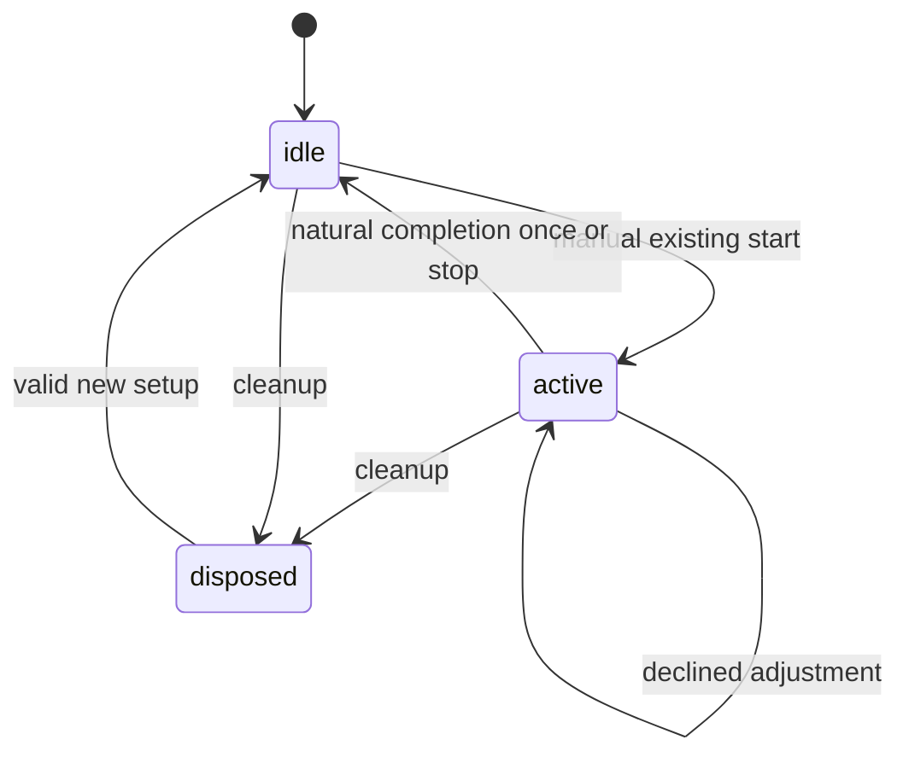

## ERD — exact supplied fields

This is a **column projection**, not the complete schemas of referenced parent tables. Parent columns not supplied are deliberately absent. Existing PostgreSQL enum type names are not supplied; `enum` denotes the Sequelize enum fields and their exact members are in `03-contracts.md`.

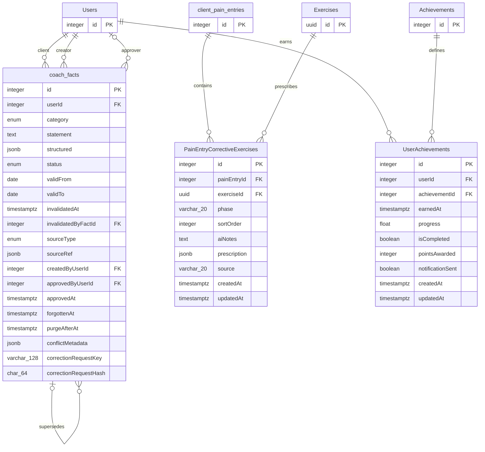

`CoachFact` has `timestamps:true`; the effective timestamp attribute names and live definitions must be confirmed through C0 because global Sequelize configuration is absent.

The consent storage column definition is also absent. No guessed JSONB field is added to this ERD.

**N/A:** new billing, deployment-topology and provider diagrams—this package creates none of those boundaries. Mermaid rendering is **NOT RUN**.
