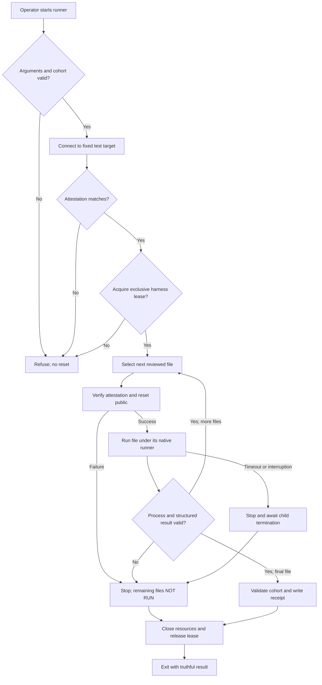
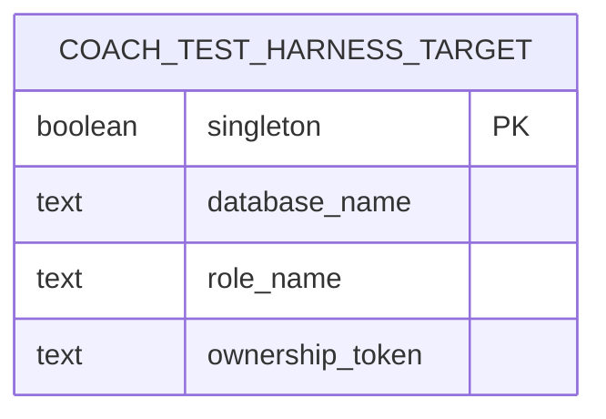

# Astra Reply — subscription transport — 2026-09-20T03:58:46.338Z

**Provider:** openai-codex
**Billing:** chatgpt-subscription
**Authentication:** chatgpt_subscription
**Transport:** codex-cli
**Requested model:** gpt-6-astra
**Served model:** NOT OBSERVABLE on codex-cli (see SERVED_MODEL_UNVERIFIABLE_NOTE)
**Tokens:** in=142233 out=8750 reasoning=527
**Packet:** `C:/Users/BigotSmasher/Desktop/@Everything/quick-pt/SS-PT/tmp/worktrees/swan-coach-astra-owned-20260906/docs/ai-workflow/AI-HANDOFF/BLUEPRINT-swan-coach-universe-v3-s83-completion-2026-09-19/CONSULT-PACKET-REVIEW-2.md`
**Wall:** 292.4s
**Mega Blueprint:** ARMED (document)

> Marginal cost $0 — this leg rides the ChatGPT subscription, not OpenRouter.

---
Mega Blueprint — I’m applying the supplied `fable-blueprint-forge` skill to review the fixes and produce the nine-document package. I’ll keep findings bounded to the supplied evidence and distinguish recorded test results from independently verified behavior.

The fixes still contain several concrete gaps: the Node group resets only once, the “below median” claim contradicts 2864 ms, and the probe measures connection shutdown as well as establishment. The longer timeout also applies to product code through the mocked database import. I’m carrying those corrections into the package, alongside fail-closed reset handling and stronger run evidence.

## PART A — HOSTILE REVIEW

**Advisory verdict: REVISE.** The supplied logs support three recorded green runs. They do not establish per-file isolation across all twelve files, timeout correctness, clean-checkout reproducibility, or product readiness.

Evidence tags below mean: **[VERIFIED]** directly supported by supplied text/code/logs; **[LIKELY]** a mechanism supported but not reproduced here; **[UNKNOWN]** requires omitted evidence. References use packet sections and their named file excerpts; original source line numbers are used where supplied. No repository exploration, test execution, or file modification was performed. Archive filing remains **PENDING — operator action**, under the packet’s read-only delivery instruction; this is not a filed Rule 86 review.

### A1 — Review of the fixes

**R2-01 · HIGH · The reset does not run before every Node test file. [VERIFIED]**

Evidence: `CONSULT-PACKET-REVIEW-2.md#SECTION-6`, `run-coach-postgres.mjs`, “Reset BEFORE group 2” and the single invocation containing `...NODE_TEST_SUITES`.

The runner resets once, then runs three files against that schema. Serial execution prevents simultaneous file execution within that invocation; it does not remove predecessor state. The docblock’s “before every suite” and “order-independent by construction” claims are false for this group.

**Fix:** run each Node file in its own child process, preceded by a successful schema reset. Preserve concurrency inside each file. Verify forward and reverse file orders with a sentinel left by the preceding file.

---

**R2-02 · HIGH · Worker limits do not protect the shared database from another invocation. [VERIFIED mechanism; UNKNOWN occurrence]**

Evidence: `coachTestDatabase.mjs:8–10` fixes the database/host; packet §6 aggregate config sets only process-local file/worker controls. Neither reset helper acquires exclusive ownership.

Two aggregate runners—or an aggregate runner and a per-suite command—can independently drop the same schema. A concurrent agent’s activity is not controlled by `maxWorkers: 1`.

**Fix:** require one database-scoped exclusive lease for every supported destructive entry point, held through all child processes and their shutdown. A second cooperating runner must refuse before resetting. Explicitly state that this does not protect against arbitrary SQL clients bypassing the harness.

---

**R2-03 · HIGH · A failed reset does not stop dependent tests. [VERIFIED]**

Evidence: packet §6, `run-coach-postgres.mjs`, `const resetOk = run(...)` followed unconditionally by `const nodeOk = run(...)`.

If `DROP` succeeds but `CREATE` fails—or the reset never connects—the Node group still executes against unknown state. The final exit remains nonzero, so this is not a false aggregate success; it is invalid dependent execution and misleading group evidence.

**Fix:** reset failure must stop that run immediately. Mark all dependent files `NOT RUN`, preserve the reset error, and return nonzero. Close the reset connection in `finally`.

---

**R2-04 · HIGH · “Cannot mask a product defect” is contradicted by the test wiring. [VERIFIED]**

Evidence: `coachWorkoutAtomic.postgres.test.mjs:8–11` supplies the shared helper as the mocked application database; lines 196–260 invoke `writer`, `approve`, and `ensureClientAccess`. `coachTestDatabase.mjs:31–35` claims only test-owned connections are affected.

The COMMIT cases call `approve(input)` without explicitly opening a test transaction. Product code uses the substituted Sequelize instance and its enlarged budgets. Functional assertions remain useful, but a product operation requiring longer acquisition, retaining connections, or opening excessive connections could pass under the relaxed helper.

**Fix:** retain the functional suite, withdraw the impossibility claim, and add separate bounded acquisition-failure and connection-release tests through the product caller. Instrument ownership of acquisition attempts before attributing failures to fixture transactions.

---

**R2-05 · MEDIUM · Timeout ordering does not guarantee the connect error wins. [VERIFIED counterexample]**

Evidence: `coachTestDatabase.mjs:11–18`, especially “the informative connect error always wins.”

If all pool connections are checked out, an acquisition can wait without starting a new connection. Its acquire timeout can therefore expire regardless of the connect timeout. A connection attempt that starts after queueing also has a different clock origin.

The recorded acquire failure does not, by itself, prove that reversing the numeric inequality caused that failure.

**Fix:** describe `30000 > 15000` as an intended budget allocation for this harness, not a universal invariant. Test connection-establishment delay and pool exhaustion separately; preserve both error classes.

---

**R2-06 · MEDIUM · The probe does not measure connection-establishment latency alone. [VERIFIED]**

Evidence: packet §8.2, `connectOnce()`:

```js
client.connect()
  .then(() => client.end())
  .then(() => resolve({ ms: Date.now() - started, ok: true }))
```

The reported interval includes shutdown. Failed attempts are also added to the same percentile population. Thus “45 connections exceeded the connect budget” is not established by this measurement.

Additionally, the 9072 ms result comes from an extra 25-client burst while suites were running. It is stress contention, not a measurement of the suites’ own peak demand.

**Fix:** timestamp successful `connect()` completion before calling `end()`, record cleanup separately, separate successes from failures, use a monotonic clock, and label idle/stress/suite measurements distinctly. Measure actual suite acquisition concurrency before choosing a workload-derived threshold. Keep 15000/30000 provisional; the packet does not justify replacement values.

---

**R2-07 · MEDIUM · The median claim is arithmetically false and remains widespread. [VERIFIED]**

Evidence: `coachTestDatabase.mjs:20–24`; packet §§2.5, 2.6, 10; `88-…-HANDOFF-20260917.md:477`.

**3000 ms is above 2864 ms.** The reported exceedance fraction is 45/125 = **36%**, not evidence that 3000 falls below the median.

**Fix:** replace every active occurrence with:

> The original probe reported 36% of connect-plus-close samples above 3000 ms. Its reported median was 2864 ms. Establishment-only latency remains unmeasured.

Preserve the old statement only in explicitly superseded history.

---

**R2-08 · MEDIUM · Unsupported contamination evidence survives in executable-file documentation. [VERIFIED]**

Evidence: packet §2.4 disclaims the old `101 passed / 5 failed` evidence. Packet §6, `resetCoachTestSchema.mjs` opening docblock and `run-coach-postgres.mjs` blocker 3, still present it as measured proof.

The aggregate config withdrew that evidence, but the reset and runner did not. The runner also says “FOUR” before enumerating six blockers; the config’s six-item list instead separates aggregate exclusion and omits the Node-file race.

**Fix:** withdraw the unsupported measurement everywhere, retain the isolation mechanism as a rationale, and give the six reported issues stable identifiers shared by the documents. Call them “six identified issues,” never an exhaustive proof that no seventh exists.

---

**R2-09 · MEDIUM · The suggested direct Node command reintroduces the known race. [VERIFIED]**

Evidence: packet §6, aggregate-config comment:

```text
node --import ./tests/helpers/registerCoachTestDatabase.mjs --test \
  tests/integration/coachIntent*.postgres.test.mjs
```

It lacks both the schema reset and `--test-concurrency=1`.

**Fix:** remove this bypass command. Document only the guarded runner and its explicit single-file selection mode once implemented.

---

**R2-10 · MEDIUM · The seven configurations are not accurately characterized. [VERIFIED / UNKNOWN]**

Evidence: packet §7, `coachWorkoutAtomic.postgres.config.mjs`, has no `envDir: false`; the aggregate-config comment says it was copied from all seven. The seven configs also omit the new reset.

They are invocable by explicit `--config`, as the supplied isolated-control log demonstrates. “Nothing references them” cannot be verified from the configuration files themselves; the claimed repository-wide search is outside supplied evidence.

**Fix:** describe them as pre-existing standalone configurations, historically reported as undiscovered by aggregate tooling. Preserve them as historical diagnostic artifacts, but remove their endorsement as supported equivalent entry points. Route supported single-file runs through the same guarded runner/configuration. Do not claim environment isolation for the omitted loader or transitive imports.

---

**R2-11 · HIGH · Port validation is not proof that destructive reset targets disposable data. [VERIFIED]**

Evidence: `coachTestDatabase.mjs:5–10`; packet §6, `resetCoachTestSchemaNow.mjs`, safety paragraph.

A valid port plus a database name and login identifies a connection target. It does not prove that its contents are disposable. The phrase “so this can only ever point at the disposable database” overstates enforcement.

**Fix:** require an explicit provisioning attestation for the target, checked before any destructive statement. Bind it to the connected database and role, keep it outside `public`, and require exclusive harness ownership. Missing or mismatched attestation must refuse reset. This protects against accidental targeting, not a privileged malicious operator.

---

**R2-12 · MEDIUM · Exit zero does not enforce the advertised cohort or zero skips. [VERIFIED]**

Evidence: packet §6, runner `run()` returns only `r.status === 0`; the Vitest include is a glob, while the Node list is fixed.

The current runner correctly rejects the supplied file-hook failure because the process fails. But a deliberately skipped test or missing file can change coverage without necessarily making a runner fail. There is no machine-enforced twelve-file/142-test inventory.

**Fix:** capture structured results, enforce the reviewed file and test identities, reject skipped/todo/cancelled cases and collection errors, and bind results to source/config hashes. Counts are a cross-check, not the identity of the cohort.

---

**R2-13 · MEDIUM · The README’s current banner still advertises unsupported evidence. [VERIFIED]**

Evidence: `swan-coach-universe-v3/README.md:6`.

The struck migration sentence is not the only problematic statement. The same current banner retains `10 suites/125 tests`, which packet §6 says depends on a missing runner script and cannot be reproduced from a clean checkout. “New persistence concurrency tests are still pending” is also not reconciled with the supplied concurrency-test excerpts.

**Fix:** replace the whole current-evidence paragraph with the bounded current result. Preserve the former paragraph as dated history. Mark the concurrency milestone’s status unresolved until its exact intended test inventory is identified.

---

**R2-14 · MEDIUM · The atomic tests have failure paths that can retain transactions or wait without a bound. [VERIFIED mechanism; UNKNOWN observed effect]**

Evidence: `coachWorkoutAtomic.postgres.test.mjs:226–260`.

- The revocation test waits for `entered()`; if approval fails before reaching `findByPk`, that promise never resolves.
- `writerTx` is acquired before `revokerTx`, but the cleanup `try` begins only after both acquisitions. Failure acquiring the second leaves the first outside cleanup.
- Sequential rollback in one `finally` can skip the second rollback if the first rejects.

These mechanisms matter specifically when reviewing connection-budget failures.

**Fix:** put each successful acquisition under immediate cleanup ownership; settle every acquired transaction even if another cleanup fails. Bound the synchronization barrier, observe early approval rejection, and await all started work before releasing the fixture.

---

**R2-15 · MEDIUM · The remaining documentation still overstates scope. [VERIFIED]**

Evidence:

- `88-…-HANDOFF-20260917.md:126–129` still says class (d) is “immune to reading.”
- Packet §8.1 imports and executes `proposalMigration.up()`, contradicting the blanket description that these suites require “no migrations.”
- Packet §2.6 says “10/18 fail”; `coach-pg-run-review2-final3.log` reports **10 pass, 8 fail**.

**Fix:** state that the defect was missed during previous inspection, not inherently undetectable by reading. Describe fixture provisioning as selected migrations plus `sync()`, with no full migration-chain proof. Correct the race tally to 8 failures.

### Fixes accepted within their evidenced limits

- **[VERIFIED]** `26 + 9 = 35` is corrected; visible historical correction is appropriate.
- **[VERIFIED]** The phantom `--reset` usage instruction is removed. Unknown arguments are still silently ignored.
- **[VERIFIED]** The aggregate config separates the three named Node files and disables retries.
- **[VERIFIED]** Serial Node-file execution removes the demonstrated cross-file migration interleaving within one invocation. It does not repair migration concurrency in other contexts.
- **[VERIFIED, supplied logs only]** Runs A/B/C each report `9 passed (9)`, `124 passed (124)`, Node `18 pass`, `0 fail`, `0 skipped`, and reset `PASS`. This is repeatability evidence for the recorded conditions.
- **[UNKNOWN]** The claimed `19/19` guard execution, npm-script wiring, fresh-database recreation before each final run, and migration-chain outcome lack their underlying executable evidence in this packet. Their correctness is not disproved.

### A2 — One review of the draft package

The draft was reviewed once. These findings changed the emitted package:

| Draft defect | Concrete correction incorporated below |
|---|---|
| A lease alone was described as proving disposability. | Separate target attestation from exclusive runner ownership; neither substitutes for the other. |
| A proposed fixed 142-count gate could pass after test substitution. | Require file/test identities and source hashes as well as totals. |
| A reset failure could still leave later work runnable. | Make reset failure terminal and report dependent files `NOT RUN`. |
| The draft treated missing suite names and loader behavior as builder choices. | Make those evidence dependencies explicit checkpoint blockers. |
| A global timeout could kill the parent before its children stopped. | Require child shutdown and confirmed termination before releasing the database lease. |
| The draft overgeneralized reset as cleaning the entire database. | Limit reset to `public`; prohibit fixture writes elsewhere except the harness attestation schema. |

## PART B — FORGED PACKAGE

### 00-README.md

**Package:** Coach PostgreSQL harness remediation, Review 2.  
**Status:** specification emitted; implementation and acceptance tests **NOT RUN**. Checkpoint 0 is **BLOCKED** on the evidence listed below.  
**Entry point:** `backend/run-coach-postgres.mjs`.  
**Scope:** test runner, test database helper, reset helpers, latency probe, affected test cleanup, and evidence documentation. No product feature implementation.

The current implementation has three recorded green runs. This package addresses the remaining isolation, failure-handling, measurement, and reporting defects.

Requirements:

| ID | Acceptance criterion |
|---|---|
| H01 | Every reviewed file starts with an empty `public` schema after a verified reset. |
| H02 | An unattested target or competing supported runner causes refusal before destructive SQL. |
| H03 | Reset, child-process, collection, timeout, or interruption failure produces nonzero status and truthful dependent `NOT RUN` states. |
| H04 | Only the exact reviewed cohort, with no skipped/todo/cancelled cases, earns PASS. |
| H05 | Connection measurement separates establishment, pool waiting, workload, and cleanup. |
| H06 | Functional tests cannot be cited as proof of production connection behavior or full application readiness. |
| H07 | Transactions and child processes are cleaned up on failure and interruption. |
| H08 | Current documents contain no disproved active claims; historical claims remain visibly superseded. |

**Checkpoint 0 evidence dependencies:** the two unnamed Vitest files; all twelve complete test files; the DB-injecting loader; package script and lockfile/runtime versions; full logs; prior archived review identity. These are absent from the packet. Do not invent them.

**Builder contract:** Follow the decided contracts. Build one slice at a time; return changed-file evidence and actual acceptance output at its checkpoint. An unavailable prerequisite is `BLOCKED`, never a fabricated default. No commit, push, deployment, paid review, or git-registry repair is included.

The operator saves this package into the existing completion packet, preserving the prior version and its hash. Archive this review separately under Rule 86 before claiming review completion.

### 01-architecture.md

The runner owns argument validation, the target lease, file ordering, child lifetimes, and final evidence. Reset code owns attestation verification and transactional recreation of `public`. Tests own their fixture data and transaction cleanup.

All supported aggregate and single-file execution uses this runner. Historical standalone configs remain preserved but are not endorsed execution paths.



No HTTP API is added or changed. The relevant database interaction is:

```mermaid
sequenceDiagram
    participant O as Operator
    participant R as Runner
    participant D as PostgreSQL
    participant C as Test child

    O->>R: Start reviewed cohort
    R->>D: Validate attestation
    R->>D: Try session advisory lock
    alt Refused
        R-->>O: Nonzero; no destructive SQL
    else Exclusive ownership
        loop Each reviewed file
            R->>D: BEGIN; verify attestation
            R->>D: DROP public; CREATE public; COMMIT
            R->>C: Start native runner for one file
            C->>D: Provision fixture and execute assertions
            C-->>R: Structured results and process outcome
        end
        R->>D: Release lock and close
        R-->>O: Receipt and exit status
    end
```

Proposed harness-only attestation, provisioned separately from the runner:



Exact relation: `coach_test_harness.target`. This is new test infrastructure, **not an existing product table**.

Product ERD: **N/A — no product schema change is planned; complete product columns are absent from the supplied scope.** Do not invent an ERD from partial fixture definitions.

```mermaid
stateDiagram-v2
    [*] --> VALIDATING
    VALIDATING --> REFUSED: Invalid input or attestation
    VALIDATING --> LEASED: Target and lease accepted
    LEASED --> RESETTING
    RESETTING --> RUNNING: Reset committed
    RESETTING --> FAILED: Reset error
    RUNNING --> RESETTING: File passes; files remain
    RUNNING --> VERIFYING: Last file passes
    RUNNING --> STOPPING: Failure, timeout, interruption
    STOPPING --> FAILED: Children terminated
    VERIFYING --> PASSED: Exact cohort; zero omissions
    VERIFYING --> FAILED: Receipt mismatch
    REFUSED --> [*]
    FAILED --> [*]
    PASSED --> [*]
```



Literal Mermaid source is supplied; rendered preview was **NOT RUN**.

### 02-wireframes.md

**N/A — headless test-harness remediation. No screens, desktop/mobile layouts, palette tokens, touch targets, or mounted product UI are introduced.**

Exact terminal copy:

```text
REFUSED: target database is not attested as disposable.
REFUSED: another Coach PostgreSQL runner owns this target.
RESET FAILED: <file>; remaining files NOT RUN.
RUN FAILED: <file>; inspect the recorded child error.
INTERRUPTED: child processes stopped; remaining files NOT RUN.
RESULT: PASS | FAIL | REFUSED | INTERRUPTED
```

A PASS line must identify the reviewed manifest hash and observed file/test totals. Terminal output must not print the ownership token, credentials, or full environment.

### 03-contracts.md

**Existing connection target:** loopback, database `coach_test_20260906`, role `coach_test_admin`, validated `SWAN_COACH_TEST_PORT`. These identify the target; they do not attest disposability.

**New environment input:** `SWAN_COACH_TEST_OWNERSHIP_TOKEN`, nonempty and supplied by the operator’s isolated provisioning process. Never emit its value in logs, packets, or receipts.

**Attestation schema:**

```sql
CREATE SCHEMA coach_test_harness;

CREATE TABLE coach_test_harness.target (
  singleton BOOLEAN PRIMARY KEY CHECK (singleton),
  database_name TEXT NOT NULL,
  role_name TEXT NOT NULL,
  ownership_token TEXT NOT NULL CHECK (length(ownership_token) > 0)
);
```

Exactly one row must exist. Match `database_name` to `current_database()`, `role_name` to `current_user`, and the token to the supplied token. Provisioning must be an explicit operation against an already established disposable target; the runner must never create an attestation to authorize its own reset.

**Lease:** use a dedicated connection holding `pg_try_advisory_lock(830019, 1)` throughout the run. Every supported destructive invocation uses the same lease convention. Loss of this connection terminates the run. This coordinates compliant harnesses; it is not a privilege boundary against arbitrary database clients.

**Reset:** one transaction, one connection:

1. Validate attestation.
2. `DROP SCHEMA IF EXISTS public CASCADE`.
3. `CREATE SCHEMA public`.
4. Commit.
5. On error, rollback and fail.

No fixture may create persistent objects outside `public`, except the attestation relation. Capture actual reset start/completion per file.

**Planned module contracts:**

```ts
type RunStatus = 'PASS' | 'FAIL' | 'REFUSED' | 'INTERRUPTED';

type Suite = {
  path: string;
  runner: 'vitest' | 'node';
  testIds: string[];
};

type ChildResult = {
  exitCode: number | null;
  signal: string | null;
  spawnError: string | null;
  collectedTestIds: string[];
  passed: number;
  failed: number;
  skipped: number;
  todo: number;
  cancelled: number;
  collectionErrors: string[];
};

acquireCoachTestLease(): Promise<{
  resetPublic(): Promise<void>;
  close(): Promise<void>;
}>;

runCoachSuite(suite: Suite, signal: AbortSignal): Promise<ChildResult>;

validateCoachResults(
  manifest: Suite[],
  results: ChildResult[]
): { status: RunStatus; reasons: string[] };
```

**CLI:** no arguments runs the reviewed cohort. Add only `--file <exact-manifest-path>` and `--order forward|reverse`. Unknown, duplicated, or malformed options exit 4 before database access. Single-file results must say `scope: single-file`; they cannot earn aggregate PASS.

**Results:** exit 0 requires successful process exits, exact identities, no missing files, no collection errors, and zero failed/skipped/todo/cancelled cases. Exit 1 indicates execution/evidence failure; exit 4 indicates invalid input/target refusal; interruption exits 130.

**Timeouts:** retain connect 15000 ms and acquire 30000 ms provisionally. They are independent controls, not proof of error precedence. Reset lock wait is capped at 5 seconds; reset statements at 30 seconds. Each file has a 180-second outer deadline in addition to test/hook limits. Deadline expiration is failure, never retry.

**Rollback:** preserve previous source bytes before edits. Restore only task-owned changes if necessary. Test schema contents are disposable and not restored. Failure during transactional reset must roll back its DDL. Never stop a shared PostgreSQL server merely because a run finished.

### 04-build-order.md

All new modules remain below 300 lines. Existing artifacts are preserved before replacement.

| Order | File | Responsibility / imports / exports |
|---|---|---|
| 1 | `backend/tests/fixtures/coachPostgresManifest.json` | Exact twelve-file and test-identity inventory. Populate only after checkpoint-0 evidence is supplied. |
| 2 | `backend/tests/helpers/coachTestDatabase.mjs` | Retain fixed target and provisional budgets; correct false claims. Preserve default Sequelize export. |
| 3 | `backend/tests/helpers/coachTestLease.mjs` | Attestation, dedicated advisory-lock connection, transactional reset. Exports `acquireCoachTestLease`. |
| 4 | `backend/tests/helpers/coachPostgresChild.mjs` | Native runner dispatch, structured result adaptation, timeout/interruption cleanup. Exports `runCoachSuite`. |
| 5 | `backend/tests/helpers/coachPostgresResults.mjs` | Identity/count/error validation. Exports `validateCoachResults`. |
| 6 | `backend/run-coach-postgres.mjs` | Own lease; reset and run each file sequentially; terminate on failure; emit receipt. |
| 7 | `backend/vitest.coach-postgres.config.mjs` | Keep no app-env loading and no retries; receive explicit selected file. Remove duplicate per-file reset after parent reset is established. |
| 8 | `backend/tests/helpers/resetCoachTestSchema.mjs` and `resetCoachTestSchemaNow.mjs` | Retire unguarded destructive behavior. Direct use refuses with guidance to the supported runner. Preserve old versions as history. |
| 9 | `backend/tests/integration/coachWorkoutAtomic.postgres.test.mjs` | Repair barrier and transaction cleanup without weakening assertions. |
| 10 | `backend/tests/helpers/probeCoachConnectionLatency.mjs` | Portable establishment/cleanup measurement; no hardcoded checkout path. |
| 11 | Existing README, handoff, verification notes | Apply R2-07/08/10/13/15 corrections; retain historical evidence. |
| 12 | Test files named in `09-tests.md` | Behavioral harness tests and focused database fault tests. |

Existing patterns supplied by the packet:

```js
const here = dirname(fileURLToPath(import.meta.url));
```

Use this pattern for portable file-relative paths.

```js
vi.mock('../../database.mjs', async () => ({
  default: (await import('../helpers/coachTestDatabase.mjs')).default
}));
```

This is the existing product-to-test database substitution. Preserve it and document its evidence limit.

**Blocked implementation detail:** structured reporter APIs and loader isolation must be selected against the supplied installed versions, not assumed from memory. No dependency upgrade is authorized.

### 05-slices.md

**S0 — Evidence and preservation**

Scope: manifest, versions, loader, full source/log inputs, archive predecessor, snapshots.

Acceptance: all twelve filenames and exact test identities available; snapshot hashes recorded; npm entry point and loader verified from supplied source. Missing inputs produce `BLOCKED`.

**STOP:** do not implement S1 until checkpoint 0 passes.

**S1 — Target ownership and reset**

Scope: helper corrections, lease module, attestation validation, transactional reset.

Acceptance: `coachTestLease.test.mjs` and `coachTestLease.postgres.test.mjs` cases in `09-tests.md` pass. A wrong token, missing attestation, competing runner, or reset failure must cause no dependent test execution.

**STOP:** do not proceed to S2 until checkpoint passes.

**S2 — Deterministic dispatch and truthful results**

Scope: child adapter, result validation, runner, configuration, direct-reset retirement.

Acceptance: dispatch/result tests pass; forward and reverse aggregate runs each execute the same reviewed identities with zero skips; single-file invocation cannot report aggregate success.

**STOP:** do not proceed to S3 until checkpoint passes.

**S3 — Failure-path and measurement hardening**

Scope: atomic cleanup fixes, establishment-only probe, separate product acquisition-failure coverage.

Acceptance: forced second-acquisition failure releases the first transaction; early approval failure settles the barrier; pool exhaustion and connection establishment are distinguished; cleanup latency cannot alter measured establishment latency.

**STOP:** do not proceed to S4 until checkpoint passes.

**S4 — Evidence refresh**

Scope: corrected current documents, immutable run receipts, archive submission.

Acceptance: active claims match their attached evidence; unsupported earlier measurements are visibly superseded; full logs, source hashes, commands, versions, manifest identity, and archive review ID are recorded.

Final status remains advisory to Fable. Product release, migration-chain readiness, mounted UI, and full-repository baseline remain outside this package.

### 06-bans.md

- Do not reset a target merely because its name and port look like a test database.
- Do not auto-provision attestation during ordinary execution.
- Do not run multiple supported harnesses against one target without the shared lease.
- Do not treat serial execution as per-file cleanup.
- Do not continue after failed reset, lost lease, timeout, or interruption.
- Do not release the lease while a child can still access the target.
- Do not raise timeouts again merely to obtain green output.
- Do not reduce concurrency inside the product race tests.
- Do not weaken assertions, add retries, or skip failing cases to satisfy totals.
- Do not infer production acquisition behavior from the relaxed test helper.
- Do not present selected migrations plus `sync()` as full migration/boot/upgrade proof.
- Do not change product schema, production configuration, providers, billing, or mounted UI.
- Do not repair git registration, stash shared edits, broad-stage, commit, push, or deploy.
- Do not delete historical configs, prior logs, or earlier review artifacts.
- Do not put secrets or ownership-token values into evidence.
- Keep modules at or below 300 lines.

UI house rules are **N/A — no UI work is authorized**.

### 07-checkpoints.md

**Current receipt**

| Item | Status |
|---|---|
| Packet-only review and refreshed specification | Emitted |
| Historical A/B/C results | Supported by supplied selected logs |
| Source/command/hash binding of historical runs | UNKNOWN |
| New implementation and tests | NOT RUN |
| Checkpoint 0 | BLOCKED on missing evidence |
| Secret scan of saved package | NOT RUN |
| Archive lookup and filing | PENDING operator |
| Product/migration/production readiness | Not established |

Every execution receipt must include:

- Source snapshot hashes, including dirty-file bytes where git is unavailable.
- Manifest and configuration hashes.
- Node, Vitest, Sequelize, `pg`, and PostgreSQL versions.
- Exact command, working directory, start/end timestamps, and process exit/signal.
- Per-file reset result, test identities, and all outcome counts.
- Full log artifact paths/hashes.
- Missing boundaries and checkpoint verdict.

**Checkpoint remit:**

> Review only the changed slice. Verify every acceptance criterion against actual output. Attempt target mismatch, competing ownership, reset failure, missing tests, skipped tests, process failure, interruption, and transaction-cleanup failure where applicable. Reject claims extending beyond fixture-backed service behavior. Return PASS, REVISE with concrete fixes, or HALT with the exact missing prerequisite.

Fable remains Final Decider. No external reviewer call is performed or newly authorized by this document.

### 09-tests.md

All tests below are **planned, not created or executed**. Commands are acceptance commands for the completed slices; they are not current green evidence.

Run from `backend` after S0 establishes installed versions and the disposable fixture.

**Harness behavior — eight named cases:**

File: `tests/unit/coachPostgresRunner.test.mjs`

1. `rejects unknown arguments before connecting`
2. `resets before each native-runner file`
3. `does not dispatch a file after reset failure`
4. `stops after child spawn error or nonzero exit`
5. `rejects missing or substituted test identities`
6. `rejects skipped todo cancelled and collection-error results`
7. `single-file success cannot become aggregate success`
8. `interruption terminates children before releasing ownership`

```powershell
node --test tests/unit/coachPostgresRunner.test.mjs
```

Use controlled child fixtures and injected database adapters. Assert actual call order and process outcomes; source regex matching alone is insufficient.

**Lease validation — three named cases:**

File: `tests/unit/coachTestLease.test.mjs`

1. `missing attestation prevents destructive SQL`
2. `mismatched database role or token prevents destructive SQL`
3. `connection loss invalidates ownership and stops dispatch`

```powershell
node --test tests/unit/coachTestLease.test.mjs
```

**Real disposable-database ownership/reset — four named cases:**

File: `tests/integration/coachTestLease.postgres.test.mjs`

1. `second runner is refused while first holds ownership`
2. `reset removes predecessor sentinel before every file`
3. `failed schema recreation rolls back the drop`
4. `attestation survives public reset`

```powershell
node --test --test-concurrency=1 tests/integration/coachTestLease.postgres.test.mjs
```

This meta-suite uses its own explicitly provisioned disposable fixture. It must not join the twelve-file product cohort or attempt nested ownership against that cohort’s active lease.

**Probe correctness — three named cases:**

File: `tests/unit/probeCoachConnectionLatency.test.mjs`

1. `slow close does not inflate establishment measurement`
2. `failed connects are excluded from success percentiles`
3. `invalid port burst and rounds refuse before connecting`

```powershell
node --test tests/unit/probeCoachConnectionLatency.test.mjs
```

**Atomic failure cleanup — extend the existing suite with three named cases:**

File: `tests/integration/coachWorkoutAtomic.postgres.test.mjs`

1. `second transaction acquisition failure releases the first transaction`
2. `approval rejection before lock observation settles the barrier`
3. `one cleanup rejection does not prevent remaining transaction cleanup`

Retain existing COMMIT, revocation, and lock assertions.

```powershell
node run-coach-postgres.mjs --file tests/integration/coachWorkoutAtomic.postgres.test.mjs
```

The new cases intentionally change the reviewed test total. Update the manifest explicitly; do not continue advertising 142 as an invariant after adding tests.

**Aggregate identity and ordering:**

```powershell
node run-coach-postgres.mjs --order forward
node run-coach-postgres.mjs --order reverse
```

Both must execute the identical reviewed test set, reset before every file, and report zero missing/skipped/todo/cancelled cases. This establishes the tested order permutations; it does not prove every possible order or arbitrary external interference.

**Product acquisition failure:** add a focused case through the actual approval caller after its complete source is supplied. Assert bounded failure, no unauthorized write/session debit, and release of acquired resources. Exact expected response cannot be chosen from the supplied excerpts; this criterion remains **BLOCKED**, not delegated to guesswork.

## PART C — DECISION-DENSITY SELF-TEST

| Builder choice | Decision or explicit bound |
|---|---|
| Work scope | Harness, affected test cleanup, measurement, evidence documents only. |
| Canonical entry point | `backend/run-coach-postgres.mjs`; both aggregate and single-file execution use it. |
| Target identity | Existing fixed loopback database/role plus validated port. |
| Disposability proof | Separately provisioned attestation outside `public`; never self-authorized by the runner. |
| Concurrent execution | Dedicated database advisory lease; all supported destructive paths cooperate. |
| Reset granularity | Before every file, including all three Node files. |
| Reset atomicity | Attestation check and DDL in one transaction; error stops execution. |
| Runner isolation | One native-runner child per file; preserve concurrency inside files. |
| Cohort definition | Exact file/test identities with source hashes; initial population blocked on omitted files. |
| Reporter implementation | Bound to installed, evidenced versions; no guessed API or dependency upgrade. |
| Loader isolation | Must inspect supplied complete loader before checkpoint 0 can pass. |
| Timeout values | Existing 15000/30000 provisional; no claim that inequality guarantees error precedence. |
| Timeout/interruption cleanup | Stop and await children before releasing target ownership. |
| Measurement | Establishment timestamp before close; separate failures, cleanup, idle, stress, and actual-suite demand. |
| Transaction cleanup | Every acquired transaction receives cleanup even if later acquisition or another cleanup fails. |
| Product timeout response | Blocked on actual caller contract; do not invent a response shape. |
| UI and product ERD | N/A with explicit absence of UI/product-schema changes. |
| Historical configuration handling | Preserve; cease endorsing unguarded equivalent entry points. |
| Evidence acceptance | Structured identity/results plus full logs and source/config/version binding. |
| Review authority | Advisory Astra review; Fable remains Final Decider. |
| Archive completion | Operator files this read-only response; no filed-review claim before an archive ID exists. |

**No listed dependency is silently delegated. The package is not implementation-ready until checkpoint 0 and the explicit product-error-contract blocker are resolved.**
