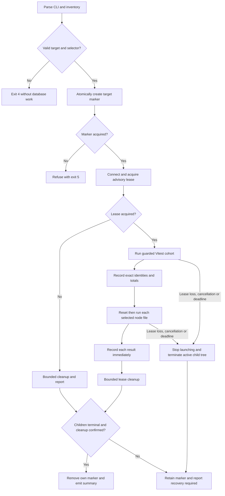
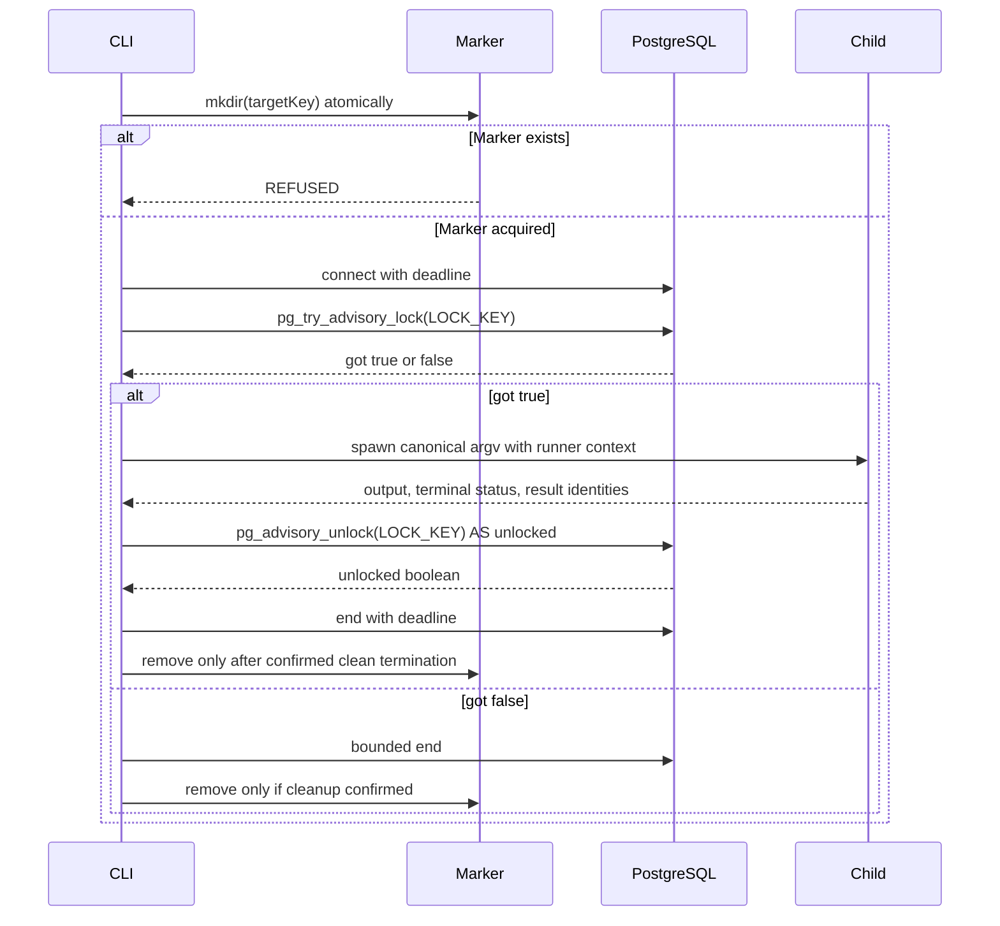
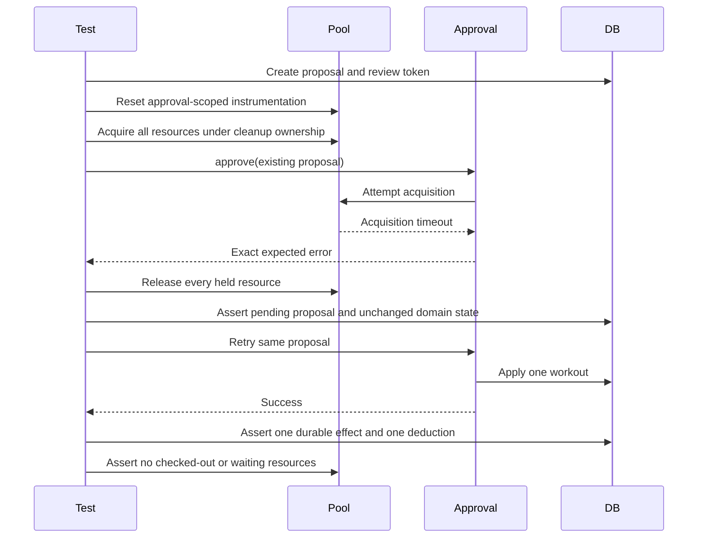
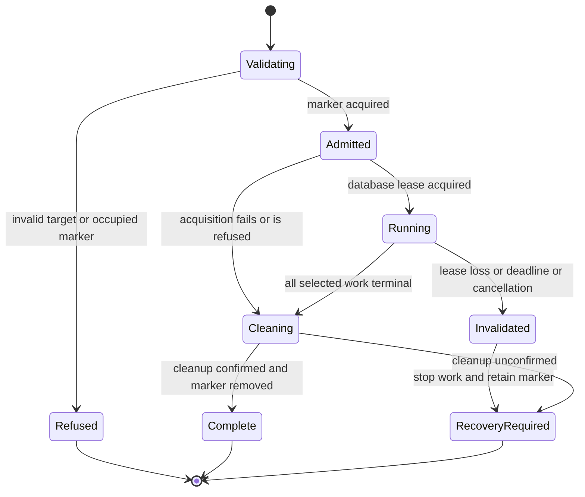

# Astra Reply — subscription transport — 2026-09-20T07:06:23.372Z

**Provider:** openai-codex
**Billing:** chatgpt-subscription
**Authentication:** chatgpt_subscription
**Transport:** codex-cli
**Requested model:** gpt-6-astra
**Served model:** NOT OBSERVABLE on codex-cli (see SERVED_MODEL_UNVERIFIABLE_NOTE)
**Tokens:** in=380271 out=13444 reasoning=2224
**Packet:** `C:/Users/BigotSmasher/Desktop/@Everything/quick-pt/SS-PT/tmp/worktrees/swan-coach-astra-owned-20260906/docs/ai-workflow/AI-HANDOFF/BLUEPRINT-swan-coach-universe-v3-s83-completion-2026-09-19/CONSULT-PACKET-REVIEW-3.md`
**Wall:** 437.4s
**Mega Blueprint:** ARMED (document)

> Marginal cost $0 — this leg rides the ChatGPT subscription, not OpenRouter.

---
Mega Blueprint — I’m applying the supplied `fable-blueprint-forge` skill to the packet only. I’ll check the claimed fixes against the included code and logs, then emit the revised package. Filing the review remains an operator step because this session is read-only.

The packet shows three concrete defects: node single-file mode passes a bare filename, lease cleanup can still throw and can report an unverified release, and the synchronous runner cannot react to lease loss while a child runs. The flake logs support “cause unresolved”; they do not rule out the alternatives the ledger claims to have eliminated.

The in-memory probes reproduced both cleanup failures: a throwing warning callback skips connection closure, and failed unlock plus failed close still returns “released by session close.” The parser also accepts a synthetic TAP summary with a nonzero cancellation count; the packet does not demonstrate that shape from a real run. I’m keeping that distinction between proven code behavior and demonstrated runtime reachability in the review.

## PART A — HOSTILE REVIEW

**Advisory verdict: REVISE. Archive classification: DEFECTS-FOUND.**

[VERIFIED] Review scope is the supplied pass-4/pass-5 source, tests and selected logs. Source citations below use line numbers within the packet’s verbatim file blocks. I executed isolated, in-memory probes of the supplied cohort and lease helpers; no database suites, repository changes, commits or writes occurred.

[UNKNOWN] Archive lookup, archive filing, the prior complete review, historical file identity and mounted product behavior were not verified. This is an **unfiled review deliverable** for the operator to archive, not a completed Rule 86 record. The final commit decision remains Fable’s.

**A1 — Review of the existing package**

**R3-01 — Node single-file mode loses the directory. Medium.**

[VERIFIED] `backend/run-coach-postgres.mjs:197` stores a basename in `selected`; line 203 constructs `[selected]` for node suites; lines 254–256 pass it directly to Node. The child’s working directory is `backend`, so selecting `coachIntent` attempts:

```text
node --import ./tests/helpers/registerCoachTestDatabase.mjs \
  --test --test-concurrency=1 coachIntent.postgres.test.mjs
```

The inventoried file is `tests/integration/coachIntent.postgres.test.mjs`. Full-run mode retains that prefix; single-file mode does not.

**Concrete fix:** represent every selected suite with one canonical backend-relative path. Exercise all three node suites through `--file`, checking executed identity, totals and exit status. The supplied single-file log covers only Vitest and does not settle this branch.

---

**R3-02 — Lease cleanup still throws and still invents successful release. Medium.**

[VERIFIED] `backend/tests/helpers/coachDatabaseLease.mjs:64–80` has three distinct defects:

| Input | Executed result |
|---|---|
| Unlock rejects; injected warning callback throws | `releaseLease` rejects; `client.end()` is never called |
| Unlock and close both reject | Returns `"released by session close"` |
| Unlock query resolves with `pg_advisory_unlock = false` | Returns `"released"` |

The first reproduces F-2’s original summary-suppression mechanism. The second and third defeat F-4’s claimed outcome reporting. Additionally, accessing `err.message` is unsafe when a rejection value is `null`.

[VERIFIED] Acquisition also lacks cleanup around the lock query: a successful connect followed by query rejection exits `acquireLease` without closing its owned client (`coachDatabaseLease.mjs:46–55`).

**Concrete fix:** return structured cleanup evidence; explicitly inspect an aliased unlock boolean; contain warning failures; stringify arbitrary rejection values safely; always attempt bounded closure. On acquisition failure, close every client whose ownership has begun. Keep test outcomes separate from cleanup uncertainty: preserve the summary, but do not report an overall clean run when cleanup is unconfirmed.

---

**R3-03 — The lease does not establish continuous protection of running children. High.**

[VERIFIED] The runner uses `spawnSync` at `backend/run-coach-postgres.mjs:145` and later unconditionally prints “held for the whole run” at line 275. The lease helper installs no connection-loss supervision.

[LIKELY] Loss of the dedicated PostgreSQL session can release its advisory lock while a test child continues using independent database connections. A second runner can then acquire the lock. The parent cannot process asynchronous lease notifications while blocked inside `spawnSync`. An eventual unhandled client error might crash the parent; that does not establish protection during the interval.

[UNKNOWN] Parent termination may also leave test descendants running. The supplied code and logs do not demonstrate process-tree cleanup on Windows. Therefore, “a killed runner cannot wedge the next one” addresses lock availability without proving that starting the next destructive runner is safe.

**Concrete fix:** use asynchronous child execution and explicit lease-loss handling. Add a shared, fail-closed local target marker for cooperating runners under the same OS account: create it atomically before acquiring the database lease; retain it after crashes, lease loss or uncertain descendant termination; require evidence-based recovery before removing it. Stop launching work after lease loss and report the run as invalidated.

This deliberately replaces unconditional crash recovery with explicit recovery. It does not claim protection from other users, marker bypasses, endpoint aliases or arbitrary SQL clients.

---

**R3-04 — An advertised command still bypasses the lease. Medium.**

[VERIFIED] `backend/vitest.coach-postgres.config.mjs:66` advertises:

```text
SWAN_COACH_TEST_PORT=55433 npx vitest run --config vitest.coach-postgres.config.mjs
```

That command runs destructive resets without `run-coach-postgres.mjs` and its lease. The same config says bare configuration entry points are not equivalent.

This is a surviving bypass mechanism, not a re-report of the already removed node wildcard command.

**Concrete fix:** replace this command with the guarded runner. Make the aggregate config reject a missing runner context before registering or executing destructive setup. Document that this protects against accidental bypass, not a deliberately forged context.

---

**R3-05 — Pool tests provide useful evidence, but their strongest claims exceed their assertions. Medium.**

[VERIFIED] `backend/tests/integration/coachWorkoutPoolBudget.postgres.test.mjs:103–119` resets the peak before `proposal()`. Proposal insertion and review-token retrieval then acquire connections before `approve()` starts. Consequently, `peakUsing > 0` does not identify approval-path activity.

[VERIFIED] The five-way test at lines 131–139 asserts one success, but does not assert that the other four results are expected conflicts. Four returned errors could satisfy it. The recovery test at lines 209 onward never first causes an acquisition timeout; it holds and releases connections, then approves. It does not establish recovery **after the observed timeout**.

[VERIFIED] Fixture construction preceding instrumentation is not itself a defect for a steady-state approval test. It does mean startup demand and cold initialization are unmeasured. Likewise, `peakUsing <= maxSize` principally checks the configured pool cap; successful approvals and release assertions carry the useful behavioral evidence.

**Concrete fix:**

- Start operation-scoped counters after proposal creation.
- Count attempted and successful acquisitions during `approve()`.
- Assert four expected conflict results in the concurrency test.
- Perform timeout, release, rollback verification and retry of the **same proposal in the same test**.
- Describe coverage as approval with the listed secondary services mocked, not the complete production approval graph.

[VERIFIED] The existing exact error-class and timing assertions are useful compensating evidence for R2-04. They justify a narrower closure, not dismissal of the entire suite.

---

**R3-06 — Failure paths can leave test-owned work alive. Medium.**

[VERIFIED] The exhaustion test acquires both held connections before entering `try` (`coachWorkoutPoolBudget.postgres.test.mjs:170–173`). If acquiring the second rejects, the first is outside cleanup ownership. The recovery test repeats that acquisition pattern at lines 212–214.

[VERIFIED] The atomic revocation test starts `approval` at `coachWorkoutAtomic.postgres.test.mjs:204`, but a barrier timeout at lines 212 onward exits through blocker rollback without awaiting or otherwise settling that approval. It may continue into subsequent test cleanup; an early rejection can also remain unobserved during the barrier wait.

**Concrete fix:** establish cleanup before the first acquisition. Register every acquired connection immediately. Observe the approval promise immediately, include its early completion in the barrier outcome, and settle it after releasing the blocker. If settlement exceeds a bounded cleanup deadline, terminate that suite process and prohibit subsequent work in the run.

This is a specific remaining R2-14 failure mechanism; immediate ownership of the blocker transaction alone did not close it.

---

**R3-07 — The environmental attribution and some timing claims are unsupported. Medium.**

[VERIFIED] `coachWorkoutAtomic.postgres.test.mjs:162–171` executes the real COMMIT for `lost_ack`, then throws a synthetic error. It does not itself kill a connection mid-commit. Any subsequent connection destruction and replacement depend on behavior outside the supplied implementation.

[UNKNOWN] The failing stack does not identify whether the timeout occurred during approval, reconciliation, verification queries or subsequent setup. The selected `coach-pg-pass5-hardened-3.log` omits the per-test timing and file-order lines cited elsewhere. The 14,501 ms figure is a test duration, not a directly captured establishment duration.

[VERIFIED] The ledger’s elimination claims are too broad:

- Three isolated green runs do not rule out an intermittent leak.
- Running first excludes interference from a later suite in that same sequential run; it does not exclude earlier-run residue, orphan processes or fixture effects.
- A connection-count snapshot does not exclude an earlier transient condition.
- Pool recovery after a rejected connection creation, event-loop delay and connection lifecycle errors are not instrumented.
- Comparing a flawed measurement with a corrected one does not establish “variance … ±6%” (`coachTestDatabase.mjs:43`).

[VERIFIED] The supplied post-change evidence is **eight** green full-run excerpts: five `pass5b` plus three `pass6`. At an assumed independent failure probability of `1/7`:

```text
Expected failures in 5 runs = 5/7 = 0.7143
Probability of 0 failures in 5 runs = (6/7)^5 = 46.27%
Probability of 0 failures in 8 runs = (6/7)^8 = 29.14%
```

The baseline itself mixes revisions: pass 4 has `0/3`; pass 5 before mitigation has `1/4`. It is not a controlled estimate of an unchanged workload.

[VERIFIED] The reported 40–44 second durations are Vitest group durations, excluding the later node/reset work. Successful pre-change Vitest runs were approximately 35–36 seconds. “Durations tightened” does not establish a speed improvement.

**Concrete fix:** label the cause **unresolved** and the budget increase **provisional**. Retain all eight post-change outcomes with their revision/configuration identity. Capture monotonic connection create/destroy timings, approval-phase markers, pool state and contemporaneous server observations before attributing the cause. Do not turn ordinary run successes into proof that the defect is absent.

---

**R3-08 — Timeout policy is neither executable nor a complete operation bound. Medium.**

[VERIFIED] The budget chain is duplicated in `coachTestDatabase.mjs`, `vitest.coach-postgres.config.mjs:125–126` and the reset hook. The supplied changes contain no enforcing test.

[VERIFIED] `acquire < hookTimeout` alone does not establish sufficient time for two sequential acquisitions plus SQL execution. Acquisition and connection budgets also do not bound a stalled schema query. The separate lease configuration at `run-coach-postgres.mjs:109` has no explicit connection or query deadline.

[VERIFIED] The tight test intentionally uses `acquire = 1500` and `connect = 15000`; a universal strict-order assertion would incorrectly reject it.

**Concrete fix:** centralize named shared and tight-test profiles, enforce their different purposes, and add an outer child deadline. Bound lease operations and reset SQL separately. Test the actual imported settings, including the reset hook’s explicit timeout, rather than grepping documentation.

---

**R3-09 — Cohort checks still have narrower guarantees than their documentation. Low; hardening reachability partly unproven.**

[VERIFIED] `cohortChecks.mjs:115–130` never reads TAP `cancelled`. An executed synthetic input containing `tests=1`, `pass=1`, `fail=0`, `cancelled=1`, `skipped=0`, `todo=0` returned no violations.

[UNKNOWN] That inconsistent total combination is not demonstrated from the real Node reporter. This is an explicit-contract gap, not proof of a reachable false green.

[VERIFIED] The Vitest parser still depends on reporter words and shapes (`cohortChecks.mjs:52,74–75`), despite claiming otherwise. An unparseable trailing total fails closed; that part is adequate. Counts alone also do not prove file identity. `nodeTestRunnerSeparation.test.mjs:33` explicitly skips `integration`, so it does not validate the PostgreSQL runner partition.

[VERIFIED] The supplied ANSI fix removes the captured SGR sequences. An executed private-CSI example survives the filter at `cohortChecks.mjs:42`.

[UNKNOWN] No supplied real log demonstrates that broader ANSI residue. F-5’s observed defect is fixed; universal ANSI-removal claims are not supported.

**Concrete fix:** explicitly check cancelled totals; validate a single unambiguous summary; compare executed file identities with the inventory; cover the integration partition independently. Use the runtime’s complete VT-control stripping facility and keep one normalized string for echo and checking. Label synthetic fixtures as synthetic.

---

**R3-10 — The verification ledger cannot substantiate its complete closure tally. Medium.**

[VERIFIED] The packet does not contain all artifacts needed to validate its fifteen-row disposition:

- The corrected latency probe and its raw results are absent.
- The cited README replacement and several handoff corrections are absent.
- The standalone reset implementation is absent.
- Unit-test source is present, but the claimed unit-run result is not.
- The lease-refusal transcript contains the refusal message, but not a captured exit code; `EXIT=5` appears in its annotation.
- No before-version of the atomic fixture is supplied to establish “unchanged.”
- An mtime inventory cannot establish a complete historical change set.

[VERIFIED] Tests named `RED:` assert the old defect’s behavior and are expected to pass as written. They are characterization tests, not recorded failing executions of the new acceptance requirement.

**Concrete fix:** maintain per-claim evidence status instead of inheriting “14 confirmed.” Capture exit codes, immutable source hashes and actual test results. Rename characterization tests accordingly; reserve RED→GREEN claims for recorded failing and passing acceptance executions.

**Disposition of the prior findings**

| Prior item | Current adjudication |
|---|---|
| R2-01 | [VERIFIED] Per-file node reset and child separation are present. |
| R2-02 | [VERIFIED] Initial mutual refusal is supported; continuous protection remains inadequate under R3-03. |
| R2-03 | [VERIFIED] Reset failure stops later node execution. Detailed reporting loses prior results and lists only the first unrun file; preserve per-file outcomes. |
| R2-04 | [VERIFIED] Requested test categories exist; evidence is bounded by R3-05/R3-06. |
| R2-05 | [VERIFIED] The guarantee was replaced with a qualified allocation statement. |
| R2-06 | [UNKNOWN] Corrected probe implementation and raw measurement absent. |
| R2-07 | [VERIFIED] Arithmetic correction is present; variance inference remains unsupported. |
| R2-08 | [VERIFIED] Withdrawal and stable issue identifiers are present. |
| R2-09 | [VERIFIED] Node bypass removed; aggregate Vitest bypass remains. |
| R2-10 | [VERIFIED] Coverage wording improved; node single-file implementation is defective. |
| R2-11 | [VERIFIED] Disposability is correctly described as operator responsibility. |
| R2-12 | [VERIFIED] Stronger numeric gates exist; identity/cancellation limits remain. |
| R2-13 | [UNKNOWN] Referenced README not supplied. |
| R2-14 | [VERIFIED] Transaction cleanup improved; in-flight approval ownership remains incomplete. |
| R2-15 | [UNKNOWN] Full correction set absent. The config still contains inconsistent historical wording. |

[VERIFIED] **F-1’s downgrade is appropriate:** the captured zero-test case is rejected by both old and new gates. No live false-green path was demonstrated. F-2 and F-4 are not fully fixed. F-3 requires a narrower lifecycle statement. F-5 fixes the demonstrated SGR case.

**A2 — One hostile pass over the proposed package**

The following defects were found in the initial package design and corrected in Part B:

1. **An asynchronous lease listener alone leaves a crash/descendant gap.** Added an atomic local target marker, retained on uncertain termination, with explicit recovery.
2. **A universal timeout chain breaks the deliberate exhaustion test.** Split shared and tight profiles; made the latter’s reverse ordering intentional and tested.
3. **A separate “recovery” test repeats the original evidence gap.** Required timeout and recovery on the same proposal in one test.
4. **Live normalized output could split escape sequences across chunks.** Required whole-result normalization for adjudication and emitted evidence.
5. **A list of proposed tests could be misread as runnable evidence.** Added an isolated unit config, exact invocation commands, named cases and explicit NOT RUN status.
6. **Stale-marker recovery could become an unsafe automatic unlock.** Prohibited age/PID-only clearing and required descendant/backend quiescence evidence.

## PART B — FORGED PACKAGE

### 00-README.md

# Coach PostgreSQL harness — review-3 revision

**Status:** authored repair package; implementation and acceptance execution NOT RUN.

**Scope:** repair the packet’s PostgreSQL test harness, approval fixture tests and evidence claims. Entry point: `backend/run-coach-postgres.mjs`.

**Outside scope:** product feature changes, production configuration, deployed behavior, full migration-chain certification and mounted UI verification.

**Evidence boundary:** packet source and selected historical logs are reviewed inputs. Reported branch tip `70547685c` does not identify the subsequent uncommitted bytes. Historical before/after equality remains unverified.

| Requirement | Acceptance criterion | Slice / tests |
|---|---|---|
| H1 — Correct selection | Every supported selector executes the intended canonical path | S1 / T01–T03 |
| H2 — Honest cohort | Exact file partition and results; no missing/non-pass totals | S1 / T04–T07 |
| H3 — Honest cleanup | Cleanup never suppresses results; uncertainty remains visible | S2 / T08–T12 |
| H4 — Guarded lifecycle | Same-account, same-endpoint runners refuse overlap and uncertain recovery | S3 / T13–T18 |
| H5 — Executable budgets | Actual settings satisfy named profiles and outer bounds | S2 / T19–T21 |
| H6 — Meaningful approval evidence | Operation-scoped acquisition, release, failure and recovery assertions | S4 / T22–T26 |
| H7 — Bounded claim ledger | Every verdict references evidence or states UNKNOWN/NOT RUN | S5 / T27 |

**Builder contract:** implement one slice at a time. Do not change product behavior to make a harness assertion green. Return explicit changed paths, source hashes, commands, exit codes and concise results at each checkpoint. Stop advancing when the checkpoint returns REVISE or HALT.

**Preservation:** the operator saves these nine documents as a new revision within the existing package directory and preserves the previous revision and source snapshot with hashes. No preservation or archive write is claimed here.

**Applicability:** architecture, execution flow, state, contracts, tests, trust boundaries, recovery and traceability apply. Visual wireframes, public HTTP contracts and database schema changes do not.

### 01-architecture.md

# Architecture

The CLI selects canonical suite paths and delegates execution to an importable runner. Admission, database lease, child execution, cohort evaluation and evidence reporting have separate responsibilities.

The safety scope is explicitly **cooperating processes using the same OS account, temporary-directory root and literal database endpoint**. The advisory lock remains an additional database-level guard; the local marker preserves refusal after ownership becomes uncertain.



No HTTP API is introduced. The external protocol interactions are PostgreSQL lease calls and child-process execution.







**ERD:** N/A — this revision creates or changes no database tables or columns. Existing product schemas are test dependencies, not schema modifications. Their complete definitions are absent from the packet; an “exact” product ERD would be invented.

**Trust boundaries:** CLI arguments and child output are untrusted inputs. Only validated canonical paths reach process execution. Only an operator-attested disposable target receives destructive SQL. No application credentials, `.env` loading or external provider calls are added.

**Rendering:** literal Mermaid source supplied; rendered appearance was not verified in this session.

### 02-wireframes.md

# Wireframes and operator output

**Desktop and 375px mobile: N/A — headless test runner; no screens, visual controls, responsive layout or palette tokens.**

CLI results use exact field labels. Values must reflect adjudicated results, not merely child exit status:

```text
=== SUMMARY ===
mode: full
vitest group: PASS
node:test group: FAIL
lease continuity: observed
lease release: unlocked
target marker: removed
overall: FAIL
```

Permitted values:

| Field | Values |
|---|---|
| `mode` | `full`, `single` |
| Group result | `PASS`, `FAIL`, `NOT RUN`, `PARTIAL` |
| `lease continuity` | `observed`, `lost`, `unknown` |
| `lease release` | `not acquired`, `unlocked`, `session closed`, `unconfirmed` |
| `target marker` | `not acquired`, `removed`, `retained` |
| `overall` | `PASS`, `FAIL`, `REFUSED`, `RECOVERY REQUIRED` |

Exact exceptional copy:

```text
REFUSED: another run or an unresolved prior run owns this target marker.
RECOVERY REQUIRED: target ownership or child termination is unconfirmed.
NOT RUN: schema reset failed before this file.
FAIL: child output did not satisfy the cohort contract.
```

A marker refusal must not assert that its owner is alive. A prior successful file must remain visible when a later reset fails. List every selected but unexecuted file.

### 03-contracts.md

# Contracts, configuration and recovery

**Public endpoints/auth:** N/A — no public API or authorization behavior changes.

**CLI:**

```text
node run-coach-postgres.mjs
node run-coach-postgres.mjs --file <basename-or-backend-relative-suite-path>
```

Accept one selector only. Normalize backslashes to slashes, reject traversal and unknown options, and resolve against the discovered inventory. Preserve full canonical paths internally.

**Process contracts:**

```ts
type Suite = {
  path: string;              // tests/integration/<name>.postgres.test.mjs
  runner: 'vitest' | 'node';
};

type ChildResult = {
  status: number | null;
  signal: string | null;
  error: string | null;
  timedOut: boolean;
  stdout: string;
  stderr: string;
  normalizedOutput: string;
};

type LeaseRelease = {
  unlock: 'confirmed' | 'not-held' | 'failed' | 'not-attempted';
  close: 'confirmed' | 'failed' | 'timed-out' | 'not-attempted';
  warnings: string[];
};
```

Required functions:

```ts
resolveSuites(argv: string[], inventory: Suite[]): Suite[];
runChild(spec: ChildSpec, signal: AbortSignal): Promise<ChildResult>;
releaseLease(client: Client | null, warn?: (message: string) => void):
  Promise<LeaseRelease>;
validateBudgetProfiles(profiles: BudgetProfiles): string[];
```

`releaseLease` contains synchronous warning exceptions and arbitrary rejection values. Its deadlines settle the reporting function; a deadline does not prove that the underlying client closed.

**Target marker:** atomically create:

```text
<os.tmpdir()>/swan-coach-postgres-leases/<sha256(host + ":" + port + "/" + database)>/
```

Write metadata inside the newly owned directory: random run ID, PID, start timestamp, canonical working root and target identity. An existing or incomplete directory means refusal. Never auto-remove based on age or PID reuse.

**Profiles, all milliseconds:**

| Setting | Shared harness | Tight approval test |
|---|---:|---:|
| Pool maximum | 25 | 2 |
| Connection deadline | 30000 | 15000 |
| Acquisition deadline | 45000 | 1500 |
| Hook/test deadline | 120000 | 120000 |
| Retry | 0 | 0 |

The shared profile must satisfy `connect < acquire` and `2 * acquire + 10000 <= resetHook`. The tight profile deliberately permits acquisition failure before connection establishment.

Additional proposed operational bounds:

```text
lease connect/query: 30000 each
lease close: 5000
reset SQL statement_timeout: 10000
reset SQL lock_timeout: 5000
child termination grace: 5000
Vitest aggregate child deadline: 600000
individual reset/node child deadline: 180000
```

These are chosen operational ceilings, not measured performance guarantees. A deadline invalidates the run; it never converts work into a pass.

**Environment:** retain `SWAN_COACH_TEST_PORT`. Add runner-issued `SWAN_COACH_TEST_RUN_ID` and `SWAN_COACH_TEST_MARKER_PATH` for accidental-bypass checks. These are coordination metadata, not security credentials. No new application environment variables.

**Exit codes:**

- `0`: every selected test and harness criterion passed; cleanup confirmed.
- `1`: test, cohort, infrastructure or cleanup failure.
- `4`: invalid invocation.
- `5`: admission refused.
- `130`: requested interruption, after bounded cleanup attempt.

**Recovery:** retain the marker after lease loss, crash or uncertain termination. Removal requires operator evidence that prior descendants and their database work have ended. No automatic recovery command is introduced in this revision.

**Migrations:** none introduced. Existing fixture migration execution remains confined to disposable databases.

**Rollback:** restore the preserved harness revision as a unit. Preserve failed-run evidence. Do not automatically lower timeouts, remove unresolved markers or alter product code.

### 04-build-order.md

# File-by-file build order

All paths are relative to the packet worktree. Every module must remain at or below 300 lines; move historical prose into this package.

| Slice | File | Responsibility / imports / exports |
|---|---|---|
| S1 | `backend/tests/helpers/coachSuiteInventory.mjs` — new | Pure path validation and runner partition; exports inventory/selection helpers |
| S1 | `backend/tests/helpers/cohortChecks.mjs` | Existing gate pattern; explicit cancellation, unambiguous totals and VT normalization |
| S1 | `backend/tests/unit/cohortChecks.test.mjs` | Preserve captured fixtures; add clearly labelled synthetic hardening cases |
| S1 | `backend/tests/unit/coachSuiteInventory.test.mjs` — new | All selectors, paths and partition invariants |
| S1 | `backend/vitest.coach-harness-unit.config.mjs` — new | Isolated unit-only config; no database setup |
| S2 | `backend/tests/helpers/coachHarnessBudgets.mjs` — new | Pure named constants and profile validator |
| S2 | `backend/tests/helpers/coachDatabaseLease.mjs` | Bounded acquisition/cleanup; structured outcomes |
| S2 | `backend/tests/unit/coachDatabaseLease.test.mjs` | Failure, refusal, deadline and warning containment cases |
| S2 | `backend/tests/unit/coachHarnessBudgets.test.mjs` — new | Actual settings and intentional tight-profile asymmetry |
| S2 | Existing DB helper, reset helper and aggregate config | Import budgets; remove contradictory prose and direct bypass command |
| S3 | `backend/tests/helpers/coachRunAdmission.mjs` — new | Atomic local marker; ownership-specific cleanup |
| S3 | `backend/tests/helpers/coachRunnerExecution.mjs` — new | Asynchronous children, deadlines, result preservation and summary |
| S3 | `backend/run-coach-postgres.mjs` | Thin CLI wiring for inventory, admission, lease and executor |
| S3 | `backend/tests/unit/coachRunnerExecution.test.mjs` — new | Controlled fake children/clients; state and reporting tests |
| S3 | `backend/tests/unit/coachRunAdmission.test.mjs` — new | Shared temporary marker contention and retention |
| S4 | `backend/tests/integration/coachWorkoutPoolBudget.postgres.test.mjs` | Approval-scoped instrumentation and same-test recovery |
| S4 | `backend/tests/integration/coachWorkoutAtomic.postgres.test.mjs` | Own and settle the asynchronous approval |
| S4 | `backend/tests/helpers/coachApprovalFixture.mjs` | Change only if stronger shared assertions require it |
| S5 | Existing verification ledger and this nine-document package | Correct claims and attach immutable evidence |

Existing patterns to retain:

```js
// Canonical selected path, never a basename at the execution boundary.
const suitePath = `tests/integration/${selectedName}`;
```

```js
// Ownership begins before acquisition; retain every resource immediately.
const held = [];
try {
  held.push(await pool.acquire());
  held.push(await pool.acquire());
  // Exercise the caller.
} finally {
  for (const connection of held) pool.release(connection);
}
```

```js
// Existing useful expectation: real acquisition error, not incidental failure.
expect(thrown?.name).toBe('SequelizeConnectionAcquireTimeoutError');
```

Do not duplicate the fixture’s schema or mocks. Preserve each suite’s database-selection mock.

### 05-slices.md

# Slices and acceptance

**S1 — Selection and cohort correctness**

Implement canonical path selection, integration runner partition and strict reporting checks. Compare executed Vitest identities through machine-readable reporter output against the canonical inventory; counts remain a cross-check. Preserve verbose output for diagnosis.

Acceptance: T01–T07 pass. Unknown, duplicate or missing identities fail. A selected node suite is executed using its canonical backend-relative path.

**STOP:** do not proceed to S2 until the checkpoint passes.

**S2 — Cleanup and budget contracts**

Implement structured cleanup, nonthrowing warnings, acquisition ownership and named budget profiles. Confirm bounded failure even when `query()` or `end()` never settles.

Acceptance: T08–T12 and T19–T21 pass. A double cleanup failure returns `unconfirmed`, preserves test results and produces a nonzero overall result.

**STOP:** do not proceed to S3 until the checkpoint passes.

**S3 — Runner lifecycle**

Implement local marker admission, asynchronous child execution, lease monitoring, cancellation and complete per-file results. Guard aggregate setup against accidental direct invocation.

Acceptance: T13–T18 pass locally; then verify actual lease refusal, lease loss and parent termination on the owned disposable target. Keep the marker when termination is unconfirmed.

**STOP:** do not proceed to S4 until the checkpoint passes. Mocked child termination does not satisfy Windows process-tree acceptance.

**S4 — Approval evidence**

Keep seven pool-suite cases, strengthening their assertions. Scope instrumentation to approval; assert expected loser outcomes; own held resources; combine timeout and recovery. Settle the atomic test’s approval on every path.

Acceptance: T22–T26 pass through the guarded runner. The atomic suite retains its thirteen named cases, but historical equivalence is not claimed without preserved before-bytes.

**STOP:** do not proceed to S5 until the checkpoint passes.

**S5 — Combined evidence**

Run the unit contract suite, all three node selectors, both affected Vitest selectors and the full guarded cohort. Record every attempt, including failures; no automatic retries.

Acceptance: T27. Report the flake as unresolved unless new causal evidence settles it. Archive the review and retain Fable’s final decision separately.

### 06-bans.md

# Bans

- Do not claim continuous lease ownership from successful initial acquisition.
- Do not report release merely because an unlock query resolved.
- Do not discard earlier file results after a later reset failure.
- Do not call a group PASS before cohort adjudication.
- Do not silently skip, retry or quarantine failing tests.
- Do not infer exact file identity from matching counts.
- Do not characterize synthetic reporter shapes as captured runtime failures.
- Do not call passing old-behavior assertions RED execution evidence.
- Do not describe provisional timeouts as workload-derived.
- Do not alter product code, billing, authorization, schema or migrations to satisfy harness tests.
- Do not infer disposability from a valid port or database name.
- Do not clear a marker using age or PID absence alone.
- Do not claim protection across different OS accounts, endpoint aliases or non-cooperating clients.
- Do not install dependencies or invoke external reviewers/providers as part of this package without their existing authorization.
- Do not broad-stage, reset the shared tree, push or deploy.
- Keep modules at or below 300 lines; retain explicit source/evidence boundaries.

Visual house rules are N/A here because no UI is introduced. If scope expands to UI, return for a separate surface-specific package.

### 07-checkpoints.md

# Checkpoints and readiness

At each slice boundary, the builder supplies:

1. Exact changed paths and before/after hashes.
2. Requirement-to-test mapping.
3. Exact commands, process exit codes and concise results.
4. Failed attempts and unresolved evidence gaps.
5. Disposable-target ownership attestation for database execution.
6. Drift against this package and rollback status.

Checkpoint verdicts: **PASS**, **REVISE**, **HALT**. PASS applies only to the named slice and its evidence.

Reusable review remit:

> Attempt to falsify the slice’s acceptance claims. Trace each assertion to executed evidence. Check failure cleanup, skipped work, process lifetime, target ownership and source identity. Distinguish synthetic unit coverage from real database and Windows child-process behavior. Give a concrete repair for each finding.

**Authority:** this review is advisory. Fable retains the final commit decision. No paid invocation is implied.

**Archive:** operator files this review and subsequent hostile reviews under `Z:\HostileReviews`, using the archive’s actual schema and generated review ID. Do not invent a review ID or mark filing complete before the file and index exist.

**Current receipt:**

| Item | Status |
|---|---|
| Packet code/log review | VERIFIED within supplied scope |
| Isolated cleanup/parser probes | VERIFIED; process exit 0 |
| Revised nine-document package | AUTHORED |
| Source repairs | NOT RUN |
| Unit acceptance suite | NOT RUN |
| PostgreSQL acceptance suite | NOT RUN |
| Windows descendant termination | UNKNOWN |
| Flake cause | UNKNOWN |
| Source preservation hashes | NOT RUN |
| Secret scan | NOT RUN |
| Archive filing | NOT RUN — operator step |
| Final commit decision | PENDING |
| Deployment/product verification | OUT OF SCOPE |

No implementation-readiness or deployed-capability claim follows from this receipt.

### 09-tests.md

# Executable acceptance plan

**Current status:** proposed cases below are NOT RUN. The only new execution in this review was the in-memory probe of supplied helpers reported in Part A.

**Unit configuration:** create `backend/vitest.coach-harness-unit.config.mjs` with `envDir: false`, Node environment, `retry: 0`, and explicit inclusion of these six files only:

```text
tests/unit/cohortChecks.test.mjs
tests/unit/coachSuiteInventory.test.mjs
tests/unit/coachDatabaseLease.test.mjs
tests/unit/coachHarnessBudgets.test.mjs
tests/unit/coachRunnerExecution.test.mjs
tests/unit/coachRunAdmission.test.mjs
```

From `backend`, exact unit command:

```powershell
node ./node_modules/vitest/vitest.mjs run --config vitest.coach-harness-unit.config.mjs
```

| ID | File / named case | What it proves |
|---|---|---|
| T01 | `coachSuiteInventory`: `each node selector resolves to its canonical integration path` | All three node branches retain the directory |
| T02 | Same: `basename and relative-path selectors resolve identically` | Supported selector forms are equivalent |
| T03 | Same: `invalid duplicate and traversal selectors fail before execution` | Invalid CLI cannot reach reset |
| T04 | `cohortChecks`: `captured green and empty-file summaries preserve their verdicts` | No regression in demonstrated shapes |
| T05 | Same: `missing cancelled and nonzero cancelled TAP totals fail closed` | Explicit cancellation contract |
| T06 | Same: `duplicate ambiguous and missing summaries are rejected` | No first-summary false authority |
| T07 | Same/inventory: `executed identities equal the discovered runner partition` | Exact files, not count coincidence |
| T08 | `coachDatabaseLease`: `throwing warning cannot suppress close` | F-2 regression |
| T09 | Same: `failed unlock and failed close report unconfirmed` | F-4 regression |
| T10 | Same: `false unlock result is not confirmed unlock` | Query success differs from unlock success |
| T11 | Same: `connect or lock-query failure closes every owned client` | Acquisition cleanup ownership |
| T12 | Same: `null rejections and never-settling operations preserve bounded reporting` | Error-shape and deadline behavior |
| T13 | `coachRunAdmission`: `only one process creates the same target marker` | Atomic local admission |
| T14 | Same: `crash residue refuses subsequent admission` | No automatic unsafe restart |
| T15 | `coachRunnerExecution`: `lease loss stops launches and retains marker` | Invalidated lifecycle |
| T16 | Same: `reset failure preserves completed results and lists every unrun file` | Accurate partial execution |
| T17 | Same: `child deadline and interruption cannot produce PASS` | Bounded failure |
| T18 | Same: `missing runner context prevents destructive setup` | Accidental bypass prevention |
| T19 | `coachHarnessBudgets`: `shared imported budgets satisfy the reset allocation` | Executable shared chain |
| T20 | Same: `tight profile deliberately keeps acquire at 1500` | Exhaustion test stays meaningful |
| T21 | Same: `lease SQL and child deadlines are finite and applied` | No prose-only budgets |
| T22 | Pool suite: existing single-approval case | Approval-scoped attempts/successes, one deduction, zero held/waiting resources |
| T23 | Pool suite: existing five-way case | One success and four expected conflicts |
| T24 | Pool suite: existing exhaustion case | Real attempted acquisition, exact timeout, no writes, then same-proposal recovery |
| T25 | Pool suite: sequential/failure cases | Resource return across distinct approvals and insert failure |
| T26 | Atomic suite: existing revocation case | Barrier failure cannot leave approval running |
| T27 | Combined execution receipt | Every selected identity, result, configuration and exit code is retained |

**Guarded database commands**

Prerequisite: operator has established ownership and disposability of the target. Port `55433` is the packet’s example, not an attestation.

```powershell
$env:SWAN_COACH_TEST_PORT = '55433'
node run-coach-postgres.mjs --file coachIntent
node run-coach-postgres.mjs --file coachIntent.proof
node run-coach-postgres.mjs --file coachIntentListing
node run-coach-postgres.mjs --file coachWorkoutPoolBudget
node run-coach-postgres.mjs --file coachWorkoutAtomic
node run-coach-postgres.mjs
```

Capture `$LASTEXITCODE` immediately after each command in the evidence harness. Stop on failure; do not overwrite its log with a subsequent attempt.

**Real lifecycle acceptance:** while one guarded run is active, a second same-target invocation must exit 5 before reset. Terminate the owner during active child execution; verify the retained marker refuses a successor. In a separate controlled run, terminate the lease backend and verify invalidation, no further launches and retained recovery state. Record actual process/backend identities and cleanup evidence locally.

**Timing methodology:** use a monotonic clock. Retain the existing exhaustion bounds of `1400 <= elapsed < 10000` ms plus the exact error class and observed acquisition attempt. These are test acceptance bounds, not production latency promises.

**Flake diagnostics:** record connection creation/destruction and suite phase timestamps, including failures. Preserve shared-profile values. No repeat count by itself certifies resolution; any additional experiment must state its hypothesis, workload, stopping rule and interpretation before execution.

## PART C — DECISION-DENSITY SELF-TEST

| Remaining builder choice | Decision or bounded delegation |
|---|---|
| Scope | Harness and supplied approval tests only; no product repair inferred |
| Canonical entry point | `backend/run-coach-postgres.mjs` |
| Path representation | Backend-relative canonical paths throughout execution |
| Runner partition | Explicit node set cross-checked against discovered integration inventory |
| Exact Vitest identities | Machine-readable reporter result; missing or mismatched identities fail |
| Reporter-specific JSON adaptation | Delegated to the installed version’s observed shape; fixture and rejection tests required before acceptance |
| ANSI normalization | Runtime VT-control stripping; normalize complete captured text once |
| Cleanup success | Structured observed outcomes; uncertainty never becomes release success |
| Warning behavior | Contained; cannot skip cleanup or suppress summary |
| Lease-loss behavior | Invalidate, stop launches, terminate active tree, retain marker |
| Crash recovery | Manual evidence-based recovery; no age/PID-only clearing |
| Marker scope | Same OS account, temp root and literal endpoint; broader protection explicitly excluded |
| Windows descendant termination | Platform adapter choice delegated; must prove real descendant termination or retain RECOVERY REQUIRED |
| Timeout values | Fixed named profiles and explicit outer limits in `03-contracts.md` |
| Tight-budget asymmetry | Intentional; must not be “fixed” into the shared ordering |
| Approval instrumentation | Starts after proposal setup; observes attempts and successes during approval |
| Concurrent losers | Four expected conflicts, not arbitrary non-successes |
| Recovery test | Same proposal, same test, after an actual acquisition timeout |
| Fixture extraction equivalence | UNKNOWN until preserved before/after bytes and results establish it |
| Flake cause | UNKNOWN; no product/environment attribution without lifecycle evidence |
| Historical evidence | Preserve claims separately from raw output and captured exit codes |
| New files and line limits | Exact list in build order; ≤300 lines per module |
| Archive and commit authority | Operator files; Fable adjudicates commit; neither completed here |

**Self-test result:** no silent implementation choices identified in this package. Reporter adaptation and Windows termination are bounded delegations requiring evidence. The package is authored; implementation verification, archive filing and final adjudication remain pending.
