# Astra Reply — subscription transport — 2026-09-19T23:13:30.459Z

**Provider:** openai-codex
**Billing:** chatgpt-subscription
**Authentication:** chatgpt_subscription
**Transport:** codex-cli
**Requested model:** gpt-6-astra
**Served model:** unknown
**Tokens:** in=102109 out=21167
**Packet:** `C:/Users/BigotSmasher/Desktop/@Everything/quick-pt/SS-PT/tmp/worktrees/swan-coach-astra-owned-20260906/docs/ai-workflow/AI-HANDOFF/BLUEPRINT-swan-coach-universe-v3-s83-completion-2026-09-19/CONSULT-PACKET.md`
**Wall:** 648.5s
**Mega Blueprint:** ARMED (remit, document)

> Marginal cost $0 — this leg rides the ChatGPT subscription, not OpenRouter.

---
Mega Blueprints. I’m using the inlined `fable-blueprint-forge` skill to review the supplied plans and forge the completion package. Missing source contracts will become explicit, bounded blockers—not invented implementation details.

## PART A — HOSTILE REVIEW

**Verdict: REVISE.** The packet supports a completion plan, but not an implementation-ready handoff for every remaining boundary. The missing mounted-route, transport, test-runner and database-configuration contracts must be supplied before the corresponding edits.

This review uses only the supplied packet. No commands, repository inspection, tests, rendering, file writes or archive filing occurred. Reported historical results remain **packet-reported evidence**, not independently reproduced results.

### A1 — Review of the existing blueprints

| ID | Severity | Evidence | Finding and concrete fix |
|---|---|---|---|
| A1-01 | High | `README.md#REMEDIATION-CURRENT:20260913`; its later `Current continuation: 2026-09-17`; doc 84 §9; doc 85 §§0/9; doc 86 §9; packet §§2–3 | Current-looking instructions contradict the later empty-database execution. **Fix:** publish one dated current-status block; mark the older blockers historical. Record F3 option **(b), migration-chain self-containment**, as taken for the original blocker, while withholding application-schema and production-upgrade closure. |
| A1-02 | High | Doc 88 §§6, 11.8 versus packet §2.1 and G0 `migrationFkTypeCompat.test.mjs` | The continuation still requests an unfinished class-(d)/raw-SQL sweep that the latest packet reports completed. **Fix:** retain its historical record, replace the active queue with regression verification, and carry the analyzer’s actual limitations. Do not repeat the completed sweep as new work. |
| A1-03 | High | Doc 88 §§11.1/11.6; G0 `authoritative()` and `extractColumns()` | “Earliest creator wins” overstates the static analyzer. Its implementation collects `createTable`, `addColumn` and `changeColumn`, then chooses the earliest declaration per column; it does not simulate guarded execution or later type changes. **Fix:** describe it as a heuristic candidate detector. Execute fresh-chain and relevant partial-history fixtures; report unparsed/unresolved references separately. A green static scan is not complete FK certification. |
| A1-04 | High | Doc 88 §§2A/10 versus §11 and G0 static guard | “Invisible to every static check” is contradicted by the permanent static tests. Class (b) is also described both as an unconditional FK hard failure and as a silent no-op. **Fix:** distinguish detection mechanisms accurately: static checks detect covered patterns; execution verifies exercised migration paths and resulting objects. Neither proves every historical starting state. |
| A1-05 | Critical release risk | Packet §2.4; G0 repaired historical migrations; doc 84 §8 | Editing already-recorded migrations does not cause them to run again on an installed database. Fresh-chain success alone cannot deliver repaired columns/FKs to existing installations. **Fix:** add an upgrade-path gate using synthetic pre-remediation schema plus `SequelizeMeta`. Determine which repairs need a new forward migration; do not remove metadata or replay history against production. |
| A1-06 | High | G0 `20260301000100-fix-user-achievement-userid-type.cjs#up/down` | The existing UUID-user branch deletes every `UserAchievements` row before changing the column; `down()` drops the table regardless of whether this migration created it. These paths are incompatible with a blanket “reversible/data-preserving” claim. **Fix:** forbid their use as the completion rollback. Test them only on disposable fixtures; require an explicit identity-mapping policy before any data-preserving production conversion. |
| A1-07 | High | G0 pain-junction migration: `createTable`, three `addIndex` calls, early existing-table return | Table creation and indexes are not enclosed in one explicit transaction. If an index creation fails, rerunning can see the table and skip the missing indexes. **Fix:** reproduce this partial-state path in isolation; make creation/index completion transactional or independently reconcile the three expected indexes. Address already-applied history through the forward-repair decision in A1-05. |
| A1-08 | High | Doc 88 §11.6 | The model audit’s new findings are classified as “not defects” because boot synchronization is expected to repair them. Expected boot behavior is not executed application-schema evidence. The supplied breakdown—26 missing tables plus nine missing columns—also totals **35**, not 36. **Fix:** retain the raw audit as unresolved evidence; test the bounded boot path or identify the explicit schema prerequisite for each app suite. Do not run unrestricted `sync({alter:true})` as a verification shortcut. |
| A1-09 | High | Doc 84 §6; doc 88 §6; packet §2.3 | Database instructions disagree: fixed helper identity on 55441 versus the available cluster on 55433. Supplying `PG_*` variables is insufficient if the helper reads only `SWAN_COACH_TEST_PORT`. **Fix:** bind one owned database identity through the actual helper, loader and runner contracts; verify identity through each suite’s Sequelize connection before any reset. |
| A1-10 | High | Doc 84 §§2/5/10; packet §2.3; G0 `CoachSelectionAdapterParams.adoptionSettler` | The adoption hook exists, but the independent settler is deferred. Re-running hook tests cannot close first-message completion. **Fix:** wire the existing hook into the real composing layer, then prove route **and** active-thread settlement before resolving adoption and allowing the follow-on send. Missing controller/transport excerpts block exact implementation instructions. |
| A1-11 | High | G0 navigation blocker: render-phase capture followed by `[blockedKey]` effect | On a newly observed blocked key, render can populate `blockedOperationRef`, after which the passive effect clears it. The effect does not synchronously replace it. This creates a testable risk of a valid first Discard being refused; a subsequent render may instead capture newer metadata. **Fix:** add a real-router regression covering first committed render, passive-effect flush and actor/operation changes before another render. If reproduced, initialize transition identity and capture together at a committed boundary; preserve separate destructive and exit claims. This is a new hypothesis, not a re-report of the repaired re-arm defect. |
| A1-12 | High | G0 `shouldBlock()` | `isSurfaceOwnedNavigation(next.targetUserId, next.threadId)` runs **before** checking `next.resolved`. Malformed input becomes a null tuple and can bypass blocking if the callback accepts that tuple. **Fix:** reproduce with malformed/duplicate query parameters and an owned-null callback; reject unresolved candidates before considering a surface-owned exemption. Mounted reachability is **UNVERIFIED**. |
| A1-13 | Medium | G0 `useCoachSelectionSettledAction.ts` comments; doc 88 honest downgrade | The source comment still describes a repaired stale-closure failure, while the adjudication calls it latent hardening. Its claim that another listed dependency changing preserves an old closure is also incorrect: rerunning the effect uses the current render’s closure. **Fix:** keep the added dependency; replace the explanation with the accurate dependency-completeness rationale and preserve the “not demonstrated live” disposition. |
| A1-14 | High | Doc 83 flowchart; G0 `CoachSelectionPhase`; doc 84 §5 | The plan treats `settling` as a phase, but the supplied union has no such member. Return is also diagrammed as a generic admission loop although the navigation blocker’s Return is `reset()` only. **Fix:** diagram settlement as a substate of `committing`; distinguish selection-owner Return from blocked-navigation Return. Do not add a phase merely to match prose. |
| A1-15 | High | Docs 83–86 test plans; doc 88 §§1/3; README | The evidence mixes 244/245 files, 1777/1781/1785 tests, and 13/18/19 guard tests. A scoped typecheck with 18 configuration errors is not a passing typecheck. Pre-existing failures establish non-attribution, not the asserted timezone root cause. **Fix:** bind each result to command, date, manifest, dirty source hashes and raw output. Keep the latest packet-reported union at 244/1781 and guard cohort at 19; full baseline and canonical typecheck stay unverified. |
| A1-16 | High | Doc 85 §§3/6; doc 84 §3 | Existing wireframes omit exact 375px layouts and token mappings. Browser acceptance can also pass on missing/unadmitted nodes unless fixtures fail closed. **Fix:** supply 375px and desktop wireframes with a finite copy/state catalog; require mounted positive-size nodes, settled target identity, rects and hit tests before geometry assertions. |
| A1-17 | High | Doc 84 §§2/5/6; G0 excerpts | Exact memory route suffixes/methods, response envelopes, auth mounts, helper signatures, transport adoption arguments, test configs and controller call sites are absent. They cannot be safely reconstructed from filenames. **Fix:** create a bounded source-supplement gate. No guessed endpoint, fake export signature or generic `data:[]` fixture may satisfy it. |
| A1-18 | Medium | G0 `CoachFact.mjs` header and purge columns; doc 84 §§3/5/8 | “Rows are never deleted” contradicts the declared hard-purge path. The correction flow also omits explicit post-commit invalidation-failure handling. **Fix:** distinguish immediate retrieval exclusion, delayed eligible deletion and currently disabled production scheduling. After an ambiguous committed correction, retry the same key; do not invite a new correction or claim rollback. |
| A1-19 | High | Packet §4 Rule 67; supplied current project instructions | Static `claude.lane.md`/`codex.lane.md` instructions conflict with the current per-session lane protocol. **Fix:** require the workspace operator’s current `node scripts/lane.mjs digest` receipt and exact ownership assignment; do not instruct the context-free builder to edit obsolete lane files. |
| A1-20 | High | Doc 86 scoped cap; doc 88 §5B; packet §2.3 | Scoped ≤300-line compliance does not resolve the historical 786-file repository baseline. `coachFactService.mjs` is reported at 543 lines. **Fix:** remeasure the repository without broad refactoring; enforce ≤300 for new modules and coherent extraction before modifying an oversized production module. Preserve unrelated violations as named baseline debt. |

**Review coverage.** A1 covers every supplied blueprint, its diagrams/wireframes/test plans, the supplied index, spine and G0 excerpts. Referenced documents whose contents were not supplied—including the complete doc 77 and mounted capability ledger—are **UNVERIFIED**, not independently reviewed.

**Not reopened:** the completed migration guard fixes, bootcamp downstream self-healing disposition, rest-timer implementation, Logger retirement implementation, memory masking, unreachable `ackCommit` branches, completed S90 extraction, HR16/CA-0 corrections, and phantom-control correction. Their historical evidence remains bounded to the packet.

### A2 — One hostile pass over the draft package

The draft was challenged once before emitting Part B. These findings changed the emitted package:

| ID | Draft defect | Applied correction |
|---|---|---|
| A2-01 | A fresh database was sufficient to clear the migration slice. | Added an installed-history fixture, forward-repair decision, partial-index interruption case and explicit prohibition on replaying historical migrations. |
| A2-02 | An exact invented memory endpoint would make commands appear executable. | Removed inferred route suffixes. Added source-supplement requirements and marked dependent tests **BLOCKED**, with no false route receipt. |
| A2-03 | The adoption deadline could be chosen independently of transport. | Required reuse of the existing transport deadline; no second competing timeout. Exact constant/signature is a source-supplement blocker. |
| A2-04 | Teardown could stop a peer-owned cluster because the port matched. | Added cluster ownership, data-directory identity and lifecycle ownership checks. Stop the owned cluster on success, failure and interruption; never stop an unverified listener. |
| A2-05 | `settling` was emitted as a nonexistent adapter enum value. | Replaced it with `committing` plus a conceptual waiting-for-observation substate. |
| A2-06 | “Retain draft” implied recovery after a full reload. | Limited retention promises to the existing shell lifetime; explicitly excluded hard reload/off-origin durability. |
| A2-07 | Full-suite commands could silently exclude integration or native tests. | Required a manifest of runner/config/discovery/exclusions and retained separate full-repository, union and focused results. |
| A2-08 | A token list could silently redefine the application theme. | Restricted styling to three supplied token contracts; any additional existing token requires the supplement. No theme values or global defaults are changed. |
| A2-09 | A correction database commit followed by cache failure could be presented as unsaved. | Added committed/ambiguous-result handling and same-key retry tests; no rollback claim after commit. |
| A2-10 | A forged package status could imply execution readiness despite missing mounts. | Set status to **FORGED — CONDITIONAL; IMPLEMENTATION ENTRY BLOCKED AT C0**. All test and review gates remain explicit. |

## PART B — FORGED PACKAGE

### 00-README.md

# S83–S90 completion package

**Version:** 1.0, 2026-09-19  
**Status:** FORGED — CONDITIONAL; IMPLEMENTATION ENTRY BLOCKED AT C0  
**Target:** context-free builder receiving bounded source supplements  
**Output location:** `docs/ai-workflow/AI-HANDOFF/BLUEPRINT-swan-coach-universe-v3-s83-completion-2026-09-19/`  
**Delivery:** reply text only; files and review archive entry have not been created.

**Working root**

```text
C:/Users/BigotSmasher/Desktop/@Everything/quick-pt/SS-PT/tmp/worktrees/swan-coach-astra-owned-20260906
```

**Branch:** `codex/swan-coach-astra-owned-20260906`  
**Historical base HEAD:** `70547685c0fc8496342bf61210bf3b576f7e425c`  
**Current dirty-tree identity:** UNVERIFIED; the base commit does not identify uncommitted remediation.

## Outcome

Finish the remaining persistence verification and created-thread settlement; reconcile migration installation paths; verify existing S83–S90 behavior through mounted surfaces; produce a reviewable completion receipt.

This package does not authorize a commit, push, deployment, production database operation, provider call, production purge switch or paid reviewer.

## Requirements

| ID | Acceptance |
|---|---|
| C-R1 | Every claimed capability has a route/JSX/service/backend/model receipt and a test through the claimed boundary. |
| C-R2 | Memory and consent application suites execute against the verified isolated PostgreSQL connection with no external database access. |
| C-R3 | Fresh migration, installed-history upgrade and interrupted-junction paths have separate results; no fixture or boot sync is represented as an empty-chain result. |
| C-R4 | First bound staff send adopts its own thread only after independent settlement; stale/aborted adoption emits no follow-on message. |
| C-R5 | Blocked navigation preserves exact Return behavior, refuses stale Discard and always retains safe exits. |
| C-R6 | Existing memory, consent, Logger and mobile surfaces meet the state/viewport contracts in `02-wireframes.md`. |
| C-R7 | Union, focused, integration, full-repository and typecheck results remain separately identified. |
| C-R8 | New/changed module sizes, retained debt, ownership, source hashes and rollback limitations are explicit. |
| C-R9 | Final advisory review and Final Decider disposition identify the same frozen bytes; no historical approval authorizes the current dirty tree. |

## Current disposition

| Item | Disposition |
|---|---|
| Empty migration chain | Packet reports exit 0, 218 tables, 381 migrations; regression required if relevant bytes change. |
| Inline/raw FK sweep | Packet reports completed; retain heuristic limits and guard regression. |
| Guard cohort | Packet reports 19 tests; rerun the three named files. |
| Frontend union | Packet reports 244 files / 1781 tests; not full repository. |
| S90 extraction, rest adjustment, Logger retirement | Preserve; modify only for a newly reproduced defect. |
| Application PostgreSQL suites | Open: configuration and execution. |
| Created-thread settler | Open: mounted wiring and composed proof. |
| Installed-history delivery of migration repairs | Open: not established by fresh-chain proof. |
| Full baseline, full typecheck, repository cap audit | Open. |
| Final Decider, live production proof | Not performed. |

## Builder contract

You are the builder, not the architect. Follow the decisions here. Do not infer missing endpoints, schema, exports, flags or mounting paths. Request only the bounded source supplement specified by C0; do not reconstruct the repository from memory.

Build one slice at a time. Produce its diff, actual acceptance output and source/test hashes. Advance only when the checkpoint is PASS. Checkpoints are scope/evidence gates; the authorized combined hostile review remains at the end. They do not introduce mandatory per-slice paid reviews.

When a criterion is blocked, state exactly which input or boundary is missing. Never replace an unavailable real boundary with a mock and keep the original claim.

## Build order

1. **C0:** bind source, mounts, database configuration and ownership.
2. **C1:** execute persistence suites and close configuration-only blockers.
3. **C2:** execute fresh/upgrade/interruption migration verification; implement only demonstrated repair needs.
4. **C3:** wire created-thread settlement and test navigation hypotheses.
5. **C4:** verify mounted memory, consent, Logger and responsive behavior.
6. **C5:** reconcile full baseline, typecheck, line caps and evidence.
7. **C6:** combined review, repairs and Final Decider submission.

## Scope boundaries

G07 substitution/share placement, automatic memory-conflict reconciliation, new nudge delivery behavior, raw-user conversation entitlement, global event authentication/deduplication, provider evaluation and production operations remain outside implementation scope.

These may remain release blockers. “Outside this completion patch” never means “passed.”

The Session Desk remains unmounted unless a separately supplied mounted contract authorizes otherwise.

## Preservation and status updates

The operator must preserve original docs/evidence before saving these files. Update the old README’s active pointer and doc 77’s F3 disposition; retain dated historical claims as history.

Formal F3 disposition:

> Option (b) has been taken for the original empty-chain blocker. The supplied worktree evidence reports a successful fresh migration chain. This does not establish application-schema completeness, safe upgrades from installed history, or production equivalence.

No archive filing, secret scan, Mermaid rendering or executable verification was performed during forging.

### 01-architecture.md

# Completion architecture

## Ownership

| Responsibility | Existing owner |
|---|---|
| Selection/admission/publication | `useCoachSessionSelection` and its existing state/admission/commit leaves |
| Created-thread adoption lifetime | `useCoachCreatedThreadAdoption` |
| Independent adoption settlement | Existing controller/router composing layer; exact call sites required by C0 |
| Dirty draft | Existing plan-51 shell owner |
| Blocked navigation | `useCoachSelectionNavigationBlocker` |
| Memory mutation | Scoped route → correction/read/policy services → `CoachFact` |
| Consent merge | Shared preference updater participating in both controller writers |
| Rest deadline | Existing `useRestTimer` |
| Logger command lifetime | Existing Logger scope and dictation hooks |
| Mobile top reserve | Universal layout styles and Coach bridge height styles |
| Database lifecycle | Owned verification harness, not application startup |
| Domain writes | Existing reviewed proposal service; no new authority |

## User and subsystem flows

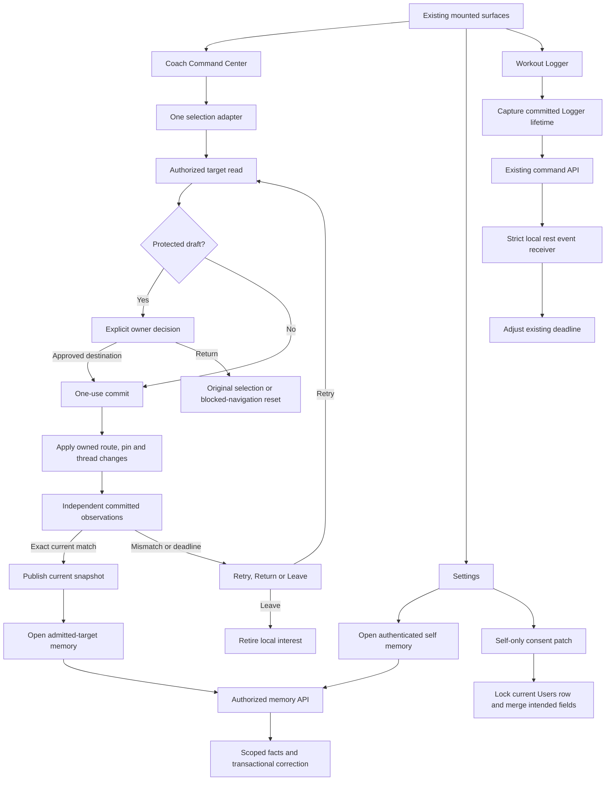

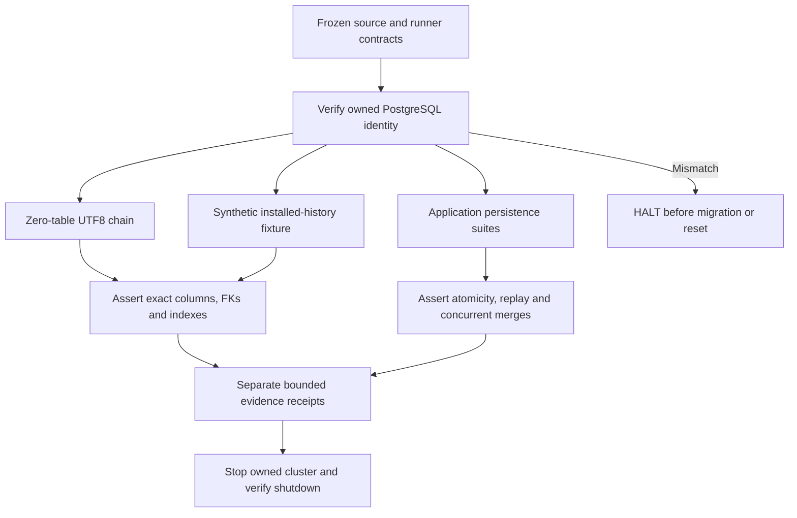

## Selection states

`committing` includes waiting for independent settlement. `settling` is not a new enum member.

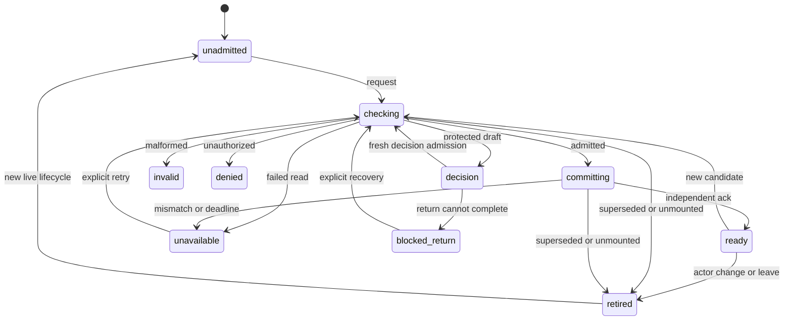

Superseded work cannot publish a failure into a newer lifecycle. Retirement clears publication and invalidates the old ticket.

## API interaction sequences

Endpoint labels marked **C0-bound** must be replaced by supplied exact methods/paths before execution. They are not invented route contracts.

```mermaid
sequenceDiagram
  participant UI as Coach producer
  participant Owner as Selection adapter
  participant API as C0-bound target-access GET
  participant Live as Router, pin and active thread
  UI->>Owner: requestSelection(candidate)
  Owner->>API: Current actor/audience and validated candidate
  API-->>Owner: Admission or bounded denial
  alt Current admission and owner decision permit
    Owner->>Live: Consume ticket and apply once
    Live-->>Owner: Independent committed observation
    Owner->>Owner: ackCommit and publish
  else Superseded or denied
    Owner-->>UI: No publication; current recovery only
  end
```

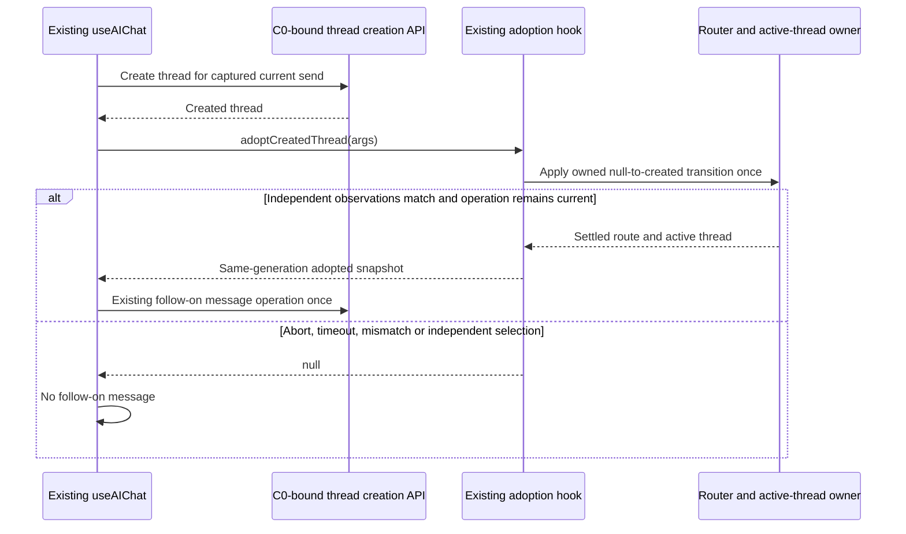

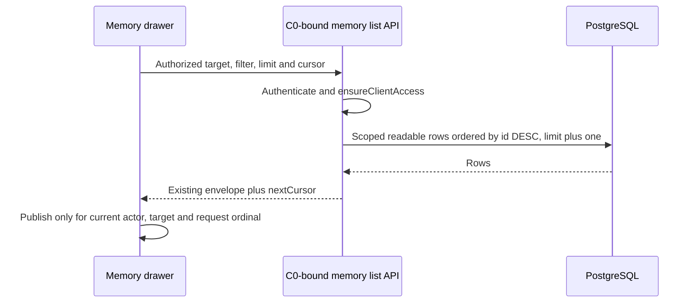

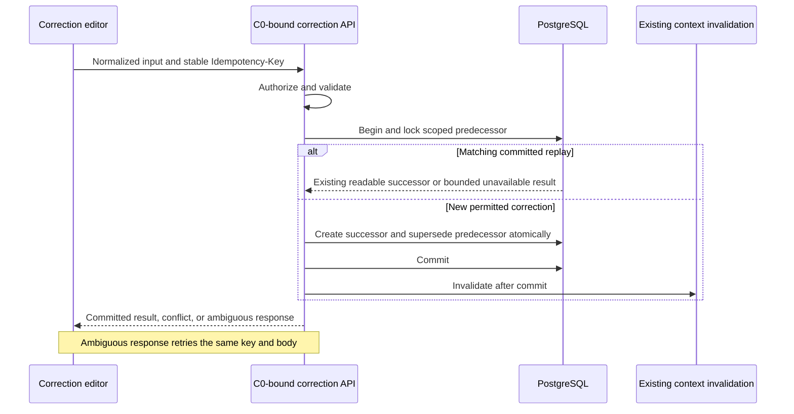

```mermaid
sequenceDiagram
  participant UI as Forget confirmation
  participant API as C0-bound forget API
  participant DB as PostgreSQL
  participant Context as Retrieval boundary
  UI->>API: Explicit selected version
  API->>API: Authorize target and version
  API->>DB: Serialize with correction; tombstone selected version
  API->>DB: Commit without extending an existing purge deadline
  API->>Context: Invalidate current retrieval
  API-->>UI: Actual version result
  Note over UI,Context: Success excludes retrieval; it does not certify physical purge
```

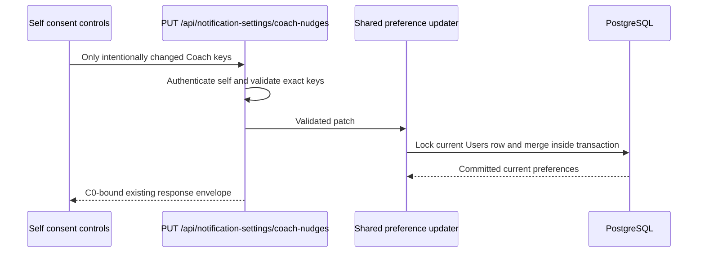

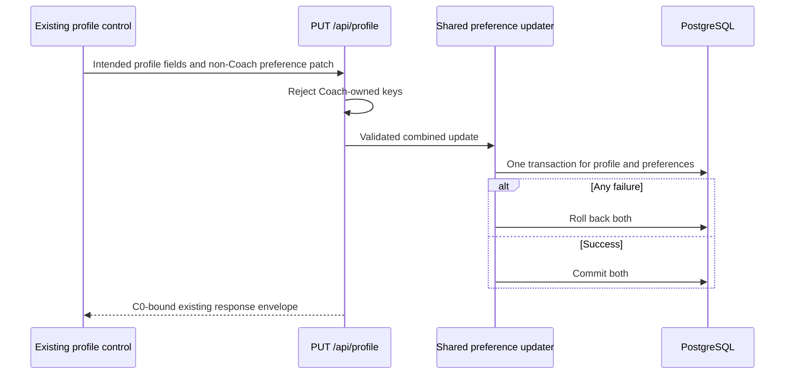

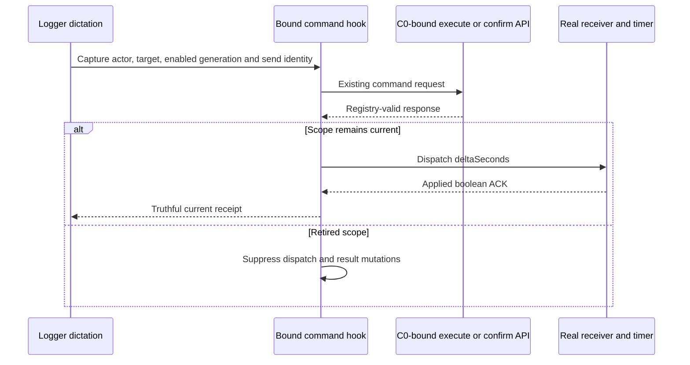

Existing self-consent read and conversation list/detail APIs are also exercised by the mounted tests. Their exact contracts are absent. C0 must supply them and append their sequences before C4; they may not be substituted with assumed requests.

## Memory and timer states

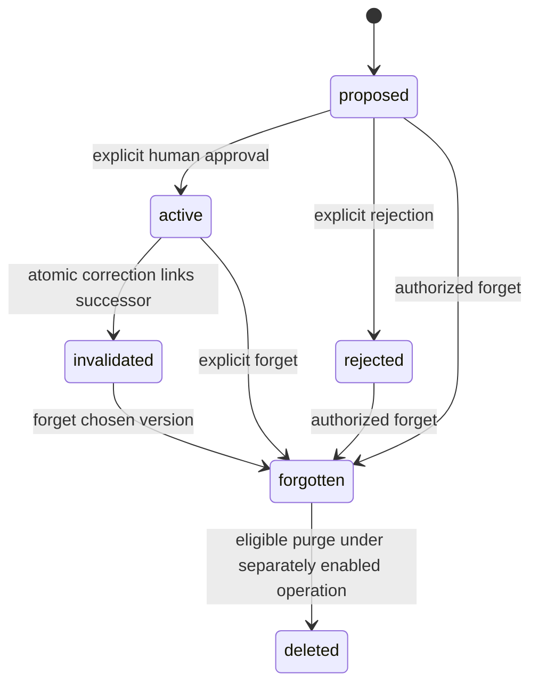

`forgotten` is a conceptual state represented by `forgottenAt`; it is not a new `status` enum value.

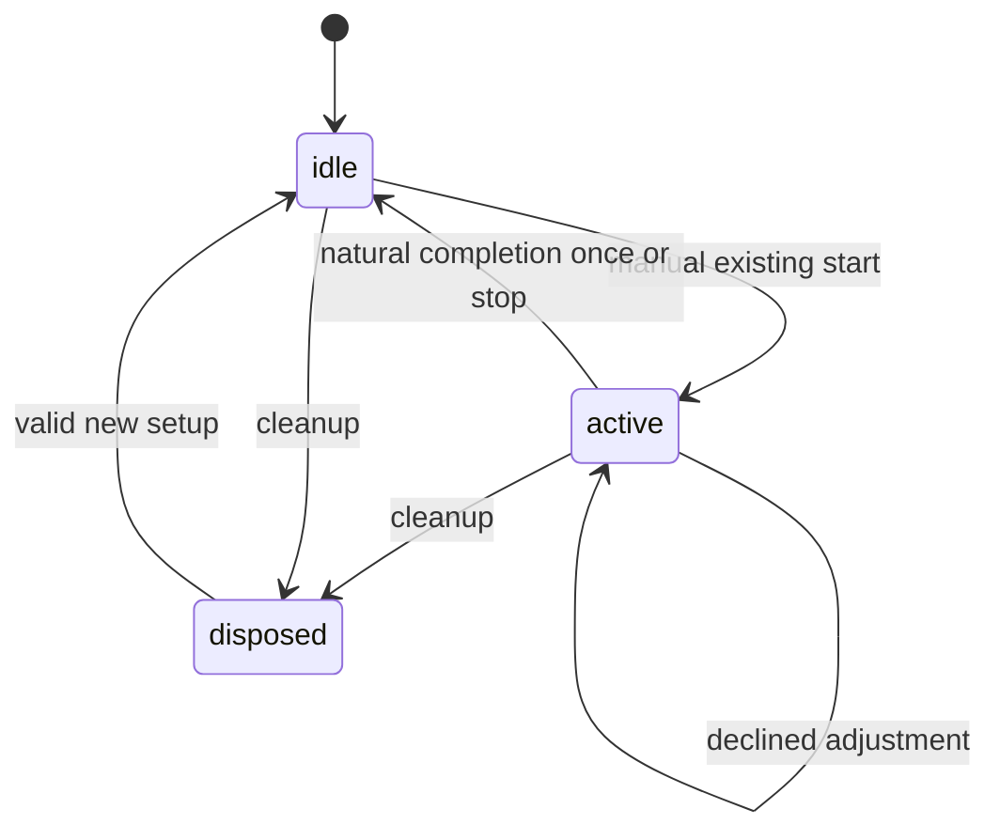

## ERD — exact supplied fields

This is a **column projection**, not the complete schemas of referenced parent tables. Parent columns not supplied are deliberately absent. Existing PostgreSQL enum type names are not supplied; `enum` denotes the Sequelize enum fields and their exact members are in `03-contracts.md`.

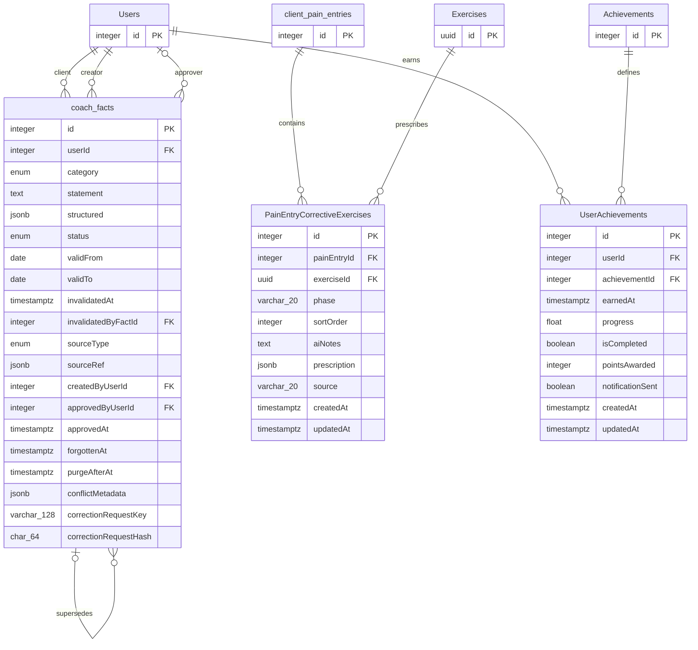

`CoachFact` has `timestamps:true`; the effective timestamp attribute names and live definitions must be confirmed through C0 because global Sequelize configuration is absent.

The consent storage column definition is also absent. No guessed JSONB field is added to this ERD.

**N/A:** new billing, deployment-topology and provider diagrams—this package creates none of those boundaries. Mermaid rendering is **NOT RUN**.

### 02-wireframes.md

# Existing surfaces: completion acceptance

No new screen, navigation item, design system or Session Desk mount is authorized.

## Exact styling contract

Use the supplied theme contracts:

```css
background: var(--bg-base, #030712);
color: var(--text-primary, #E0ECF4);
border-color: var(--accent-primary, #60C0F0);
outline-color: var(--accent-primary, #60C0F0);
```

`--bg-base` and `--accent-primary` are supplied project tokens. `--text-primary` is the explicit package text-token choice with the supplied Frost White fallback; do not redefine it globally. If an existing component uses a different canonical text token, C0 must supply that declaration and the package must bind it before a styling edit.

No raw palette literals outside token fallbacks. Use existing styled-components; shared interpolated style fragments require `css`. Minimum controls: **44×44 CSS px**. Verify 4.5:1 text contrast at the actual computed colors.

All layouts below use these tokens. Overlay surfaces may use the same background; no additional invented elevation token is required.

## A. Coach selection and conversation

```text
DESKTOP 1440×900
┌────────────────────────────────────────────────────────────┐
│ Existing sidebar │ Coach                                   │
│                  │ Now coaching                            │
│                  │ [Client 42 ▾] [New chat] [Tools]          │
│                  │ [Talk] [Review] [History]                │
│                  │ {SELECTION STATUS}                      │
│                  │                                         │
│                  │ Existing transcript                     │
│                  │                                         │
│                  │ [Message Coach                       ]   │
│                  │ [More] [Mic] [Send]                      │
└────────────────────────────────────────────────────────────┘

MOBILE 375×812
┌─────────────────────────────────┐
│ Existing header / safe area     │
│ [Open dashboard menu] [Back]    │
│ Reserved chrome band + gap      │
├─────────────────────────────────┤
│ Coach                           │
│ Now coaching                    │
│ [Client 42 ▾                  ] │
│ [New chat] [Tools]               │
│ [Talk] [Review] [History]        │
│ {SELECTION STATUS}              │
│ Existing transcript             │
│ [Message Coach                ] │
│ [More] [Mic] [Send]              │
│ Bottom safe area                │
└─────────────────────────────────┘
```

The menu’s actual role-specific accessible name remains unchanged. “Open dashboard menu” is the common wireframe label, not an instruction to rename role-specific controls.

| State | Exact status / controls |
|---|---|
| Unscoped | `No main client` |
| Checking | `Checking selection…` — Send disabled; prior target content masked |
| Committing/settlement wait | `Finishing selection…` — Send disabled |
| Invalid | `This selection link is invalid.` `[Return to original]` `[Leave Coach]` |
| Denied | `You do not have access to this selection.` `[Return to original]` `[Leave Coach]` |
| Recoverable failure | `The selection could not settle.` `[Retry selection]` `[Return to original]` `[Leave Coach]` |
| Failure before discard | `Your draft is still available in this session.` |
| Failure after confirmed discard | `The draft was discarded, but the selection could not settle.` |
| Ready new thread | Existing exact role copy: `New Coach Chat ready` or `New Coach Thread ready` |
| Adoption pending | `Finishing the new conversation…` |
| Adoption failure | `The new conversation could not be opened. Your message was not sent.` |
| Retired actor | Close private overlays and mask old target content; do not announce old success |

The adoption failure copy is permitted only when the trace proves the follow-on message was not transmitted. Ambiguous transmission uses `The message result could not be confirmed.` and requires the existing reconciliation contract.

## B. Dirty selection decision and blocked navigation

```text
DESKTOP — centered existing modal
┌─────────────────────────────────────────────────────┐
│ Keep your current work?                             │
│ From: Client 42                                     │
│ To: Client 43                                       │
│ {DECISION NOTICE}                                   │
│ [Return] [Discard draft and switch]                  │
│ [Leave Coach and keep draft]                        │
└─────────────────────────────────────────────────────┘

MOBILE 375px — scrollable within viewport
┌─────────────────────────────────┐
│ Keep your current work?         │
│ From: Client 42                 │
│ To: Client 43                   │
│ {DECISION NOTICE}               │
│ [Return                       ] │
│ [Discard draft and switch     ] │
│ [Leave Coach and keep draft    ] │
└─────────────────────────────────┘
```

Exact existing refusal strings:

- `That draft changed while this decision was open. Nothing was discarded — Return, or choose Leave.`
- `The draft could not be discarded. Nothing was changed — Return, or choose Leave.`

During owner decision: `Checking whether this switch is allowed…`.

Initial focus: **Return**. Escape invokes Return, never Discard. After a refused Discard, disable that transition’s destructive action while retaining Return and Leave. Reset/proceed are mutually exclusive.

Selection-owner Return may require fresh admission. **Blocked-router Return calls the existing blocker reset only**, preserving pathname, search and hash exactly.

Draft retention is limited to the existing shell lifecycle. No claim of survival after hard reload or off-origin departure.

## C. Memory inspect, correction and forget

```text
DESKTOP — existing drawer
┌─────────────────────────────────────────────────────┐
│ Coach memory — Client 42                    [Close] │
│ [Active] [History] [Category ▾]                      │
│ {MEMORY STATUS}                                     │
│ Injury constraint · Active                          │
│ Synthetic statement wraps within drawer.            │
│ [Correct] [Forget this version]                     │
│ [Load more]                                         │
└─────────────────────────────────────────────────────┘

MOBILE 375px
┌─────────────────────────────────┐
│ Coach memory — Client 42        │
│ [Close]                         │
│ [Active] [History]              │
│ [Category ▾                   ] │
│ {MEMORY STATUS}                 │
│ Injury constraint · Active      │
│ Synthetic statement wraps.      │
│ [Correct                      ] │
│ [Forget this version          ] │
│ [Load more                    ] │
└─────────────────────────────────┘
```

```text
CORRECTION — desktop content / mobile stacked
┌─────────────────────────────────┐
│ Correct this version            │
│ Category [                    ▾]│
│ Statement                       │
│ [                             ] │
│ [                             ] │
│ Valid from [YYYY-MM-DD          ]│
│ Valid to, optional [           ]│
│ {CORRECTION STATUS}             │
│ [Save correction] [Cancel]      │
└─────────────────────────────────┘

FORGET — desktop modal / mobile stacked
┌─────────────────────────────────┐
│ Forget this version?            │
│ This removes this version from  │
│ Coach retrieval.                │
│ Other versions are unchanged.   │
│ [Cancel]                        │
│ [Forget this version]           │
└─────────────────────────────────┘
```

| State | Exact copy / action |
|---|---|
| Initial loading | `Loading Coach memory…` |
| Empty filter | `No memory matches this filter.` |
| Next page loading | `Loading more…` — preserve current rows |
| Page failure | `More memory could not be loaded.` `[Retry loading]` |
| Initial failure | `Coach memory could not be loaded.` `[Retry loading]` |
| Denied | `You do not have access to this memory.` `[Close]` |
| Waiver required | `Complete the required waiver to view this memory.` `[Close]`; add waiver link only when its route is supplied |
| Correction pending | `Saving correction…` |
| Correction committed | `Correction saved.` |
| Ambiguous correction response | `The save result could not be confirmed. Retry to check this correction.` `[Retry correction]` |
| Known validation failure | Server-approved field error, mapped through a finite C0-supplied error table; preserve input |
| Conflict | `This version changed. Reload it before making another correction.` `[Reload version]` |
| Forget pending | `Forgetting this version…` |
| Forget success | `This version was removed from Coach retrieval.` |
| Forget failure | `This version could not be forgotten.` `[Retry]` `[Cancel]` |
| Retired scope | Clear/mask old private content immediately; close editor/drawer |

No statement is copied to logs, URL, localStorage or review artifacts. A response-loss correction retry uses the **same key and body**.

## D. Self consent

```text
DESKTOP — Settings / Notifications
┌─────────────────────────────────────────────────────┐
│ Coach progress nudges                    [Off / On] │
│ Pause until [date and time                      ]   │
│ [Save pause] [Resume now]                           │
│ {CONSENT STATUS}                                    │
└─────────────────────────────────────────────────────┘

MOBILE 375px
┌─────────────────────────────────┐
│ Coach progress nudges           │
│ [Off / On]                      │
│ Pause until                     │
│ [date and time                ] │
│ [Save pause                   ] │
│ [Resume now                   ] │
│ {CONSENT STATUS}                │
└─────────────────────────────────┘
```

States: `Loading preferences…`, `Saving…`, `Preferences saved.`, `Preferences could not be saved.` with `[Retry]`.

Loading failure: `Preferences could not be loaded.` with `[Retry]`; disable writes until authority and current values are established. Never render an unknown server opt-in as a confirmed On state.

Snooze controls change only snooze. Toggle changes only opt-in. Actor change retires old reads/writes/results.

## E. Existing Logger

```text
DESKTOP — existing Logger
┌─────────────────────────────────────────────────────┐
│ Existing workout and set controls                   │
│ Rest timer  [01:00]   [existing manual controls]     │
│ [Type a command                                 ]  │
│ [Send command]                                      │
│ {COMMAND STATUS}                                    │
└─────────────────────────────────────────────────────┘

MOBILE 375px
┌─────────────────────────────────┐
│ Existing workout controls       │
│ Rest timer [01:00]              │
│ [existing manual controls]      │
│ [Type a command               ] │
│ [Send command                 ] │
│ {COMMAND STATUS}                │
└─────────────────────────────────┘
```

Exact receipts:

- Pending: `Working…`
- Applied: `Rest timer adjusted.`
- Declined: `Rest adjustment was not applied. Check the active timer and adjustment limits.`

Current failure retains the current command for retry. Retired operations emit no receipt, error, clear or stale submitting-state update. This wireframe does not authorize enabling a disabled legacy dictation lane.

## Cross-surface acceptance

Test **375×812** and **1440×900**, plus 320×568, 390×844, 414×896, 768×1024, 2560×1440 and 3840×2160. Cover 200% zoom, short landscape, keyboard inset and reduced motion.

Require focus trap/restoration for modal surfaces; polite status announcements; no hover-only controls; scrollable forms with reachable submit controls. Test closed-overlay geometry separately from intentional open overlays.

**N/A:** new database-harness screens and S90 extraction screens—neither introduces rendered UI.

### 03-contracts.md

# Contracts, storage, isolation and rollback

## C0 source supplement: exact missing inputs

The workspace operator supplies these bounded excerpts and receipts. The context-free builder does not search for substitutes.

| Input | Required content |
|---|---|
| G0-MOUNT | Actual route registration and mounted JSX for Coach, Settings and Logger; applicable backend `app.use`/router entries in order; exact frontend API string literals |
| G0-ADOPT | Full `CreatedThreadAdoptionArgs`, `PublicationSnapshot`, `PublicationBinding`; adoption hook; composing hook/controller call sites; route/active-thread setters; transport timeout and follow-on-send logic |
| G0-MEMORY | Full memory route handlers, service signatures, validation and HTTP error/response envelopes; shared normalization and invalidation behavior |
| G0-CONSENT | Dedicated read/write routes, shared update helper, both controller writers, real `Users` preference attribute definition |
| G0-DB | Test helper, loader, both `.postgres.test.mjs` files, integration config, matrix runner CLI/config, migration config |
| G0-TEST | Package scripts and test discovery for frontend/backend, native runner suites, Playwright configs, tsconfig and scoped config |
| G0-SCHEMA | Orientation model/baseline creator; other repaired migration bodies; canonical parent definitions; authorized schema evidence without private row data |
| G0-OWNER | Current lane digest, exact owned paths, current HEAD, dirty-path inventory and hashes of target files |
| G0-RELEASE | Applicable unresolved release-gate ledger, exact Final Decider seat/identity and existing entitlement route |

Missing inputs block dependent edits. They do not authorize plausible guesses.

## Existing public selection interfaces

Preserve these supplied signatures:

```ts
type CoachCreatedThreadAdoptionSettler =
  (args: CreatedThreadAdoptionArgs) => Promise<boolean>;

type CoachSelectionAdapterParams = {
  actorId?: string | number | null;
  rawRole?: string | null;
  audienceRole?: string | null;
  observation?: {
    pathname: string;
    search: string;
    hash: string;
  } | null;
  adoptionSettler?: CoachCreatedThreadAdoptionSettler;
};
```

`CreatedThreadAdoptionArgs` is an existing imported type. Its fields are **not supplied**; do not redeclare it.

Required behavior:

1. Only the current null-thread publication and its own send may adopt.
2. Created target, audience and actor match the captured operation.
3. Apply route/active-thread changes once using existing setters.
4. Resolve `true` only after committed, independently observed route and active-thread identity match.
5. Actor/audience change, independent selection, abort, timeout or unmount resolves refusal.
6. Publication state remains owned by the existing state module.
7. Adoption alone preserves generation; ordinary admission acknowledgements mint generations.
8. Do not reuse the generation-increasing producer-cleanup predicate as adoption settlement.
9. Reuse the transport’s existing deadline; no independent second timeout.
10. Cleanup removes listeners/timers and makes completion idempotent.

The implementation export for a settler hook is **not prescribed until G0-ADOPT establishes the existing hook’s actual API**. Adding a duplicate hook because a planned name sounds suitable is prohibited.

## HTTP contracts

| Interaction | Known contract | Missing contract / disposition |
|---|---|---|
| Target admission | One generation-fenced GET ending in `/target-access` | Full path, query, envelope and mounted owner require G0-MOUNT |
| Memory list/correct/forget | Existing `/api/coach/memory` route family; `ensureClientAccess` before lookup/write | Exact suffixes/methods and envelopes require G0-MEMORY |
| Consent update | `PUT /api/notification-settings/coach-nudges` | Response envelope and exact error codes require G0-CONSENT |
| Profile update | `PUT /api/profile` | Full validated profile shape and envelope require G0-CONSENT |
| Self-consent read | Existing read, exact endpoint absent | G0-CONSENT |
| Conversation create/list/detail/message | Existing transport contracts | G0-ADOPT/G0-MOUNT |
| Logger execute/confirm | Existing command API, `rest_adjust` schema retained | G0-MOUNT/G0-TEST |

Exact consent request examples:

```json
{"coachProactiveNudges":false}
```

```json
{"coachNudgeSnoozedUntil":"2026-09-20T18:00:00.000Z"}
```

```json
{"coachNudgeSnoozedUntil":null}
```

Omitted keys remain unchanged. Reject extra keys, nonboolean opt-in, invalid timestamp and target-user selection. The authenticated caller selects the row.

Generic profile `notificationPreferences` is a patch of submitted **non-Coach** keys. Presence of either Coach-owned key returns 400. Combined profile/preference changes commit or roll back together.

## Memory contracts

- IDs are strict positive integers.
- Authorization precedes scoped database lookup.
- Ownership lookup includes both fact ID and authorized `userId`.
- Unknown/other-client fact responses are indistinguishable 404.
- Correction requires a canonical UUID `Idempotency-Key`; missing header returns 400 with `COACH_FACT_IDEMPOTENCY_REQUIRED`.
- Hash normalized accepted fields and actor/client/predecessor identity. Omitted `validFrom` has an explicit hash marker independent of the retry date.
- Use those same normalized values for insertion.
- Lock the predecessor; create successor and invalidate predecessor in one transaction.
- Matching key/hash returns existing successor identity without another mutation; changed body/actor cannot replay.
- New correction success: existing 201 envelope containing `fact` and `supersededFact`.
- Replay success: existing 200 envelope with `replayed:true`; exact envelope requires G0-MEMORY.
- Conflict: 409; unreadable/missing successor: bounded 404/409 per supplied implementation contract. C0 must settle the exact mapping before tests assert it.
- Forgotten predecessor replay never returns its statement.
- Forget targets one version, serializes against correction and never extends an existing purge deadline.
- Retrieval exclusion is immediate after successful forget; physical purge is separately controlled and currently not production-certified.
- Inspect: default limit 50, maximum 100, `id DESC`, limit+1, strict cursor, same filters/scope on every page.
- Apply active-context priority and validity predicates **before** LIMIT.
- No network/provider work inside transactions.
- Post-commit invalidation failure cannot be described as transaction rollback. Same-key retry must recover a committed correction without duplication; serving stale forgotten content remains forbidden.

## Complete supplied CoachFact model contract

This reproduces the supplied model definition in compact form; it is a reference, **not an instruction to replace the current file**.

```js
import { DataTypes, Model } from 'sequelize';
import sequelize from '../database.mjs';

class CoachFact extends Model {}

CoachFact.init({
  id: {
    type: DataTypes.INTEGER, primaryKey: true, autoIncrement: true,
  },
  userId: {
    type: DataTypes.INTEGER, allowNull: false,
    references: { model: 'Users', key: 'id' },
    onUpdate: 'CASCADE', onDelete: 'CASCADE',
  },
  category: {
    type: DataTypes.ENUM(
      'injury_constraint', 'preference', 'goal_context',
      'lifestyle', 'equipment', 'motivation_style',
      'schedule_pattern', 'coaching_cue', 'milestone',
    ),
    allowNull: false,
  },
  statement: { type: DataTypes.TEXT, allowNull: false },
  structured: { type: DataTypes.JSONB, allowNull: true },
  status: {
    type: DataTypes.ENUM('proposed', 'active', 'invalidated', 'rejected'),
    allowNull: false, defaultValue: 'proposed',
  },
  validFrom: { type: DataTypes.DATEONLY, allowNull: false },
  validTo: { type: DataTypes.DATEONLY, allowNull: true },
  invalidatedAt: { type: DataTypes.DATE, allowNull: true },
  invalidatedByFactId: {
    type: DataTypes.INTEGER, allowNull: true,
    references: { model: 'coach_facts', key: 'id' },
    onUpdate: 'CASCADE', onDelete: 'SET NULL',
  },
  sourceType: {
    type: DataTypes.ENUM(
      'chat', 'dictation', 'intake', 'workout_log',
      'client_note', 'trainer_manual',
    ),
    allowNull: false,
  },
  sourceRef: { type: DataTypes.JSONB, allowNull: true },
  createdByUserId: {
    type: DataTypes.INTEGER, allowNull: false,
    references: { model: 'Users', key: 'id' },
    onUpdate: 'CASCADE', onDelete: 'CASCADE',
  },
  approvedByUserId: {
    type: DataTypes.INTEGER, allowNull: true,
    references: { model: 'Users', key: 'id' },
    onUpdate: 'CASCADE', onDelete: 'SET NULL',
  },
  approvedAt: { type: DataTypes.DATE, allowNull: true },
  forgottenAt: {
    type: DataTypes.DATE, allowNull: true,
    comment: 'When a forget operator invalidated this fact for deletion/privacy',
  },
  purgeAfterAt: {
    type: DataTypes.DATE, allowNull: true,
    comment: 'forgottenAt + 24h; purgeDueFacts hard-destroys the row after this',
  },
  conflictMetadata: {
    type: DataTypes.JSONB, allowNull: true,
    comment: 'T37 conflict annotations; written only by an explicit reconcile step',
  },
  correctionRequestKey: {
    type: DataTypes.STRING(128), allowNull: true,
    comment: 'Scoped client idempotency key for a committed correction',
  },
  correctionRequestHash: {
    type: DataTypes.CHAR(64), allowNull: true,
    comment: 'SHA-256 hash of the normalized correction request and scope',
  },
}, {
  sequelize,
  modelName: 'CoachFact',
  tableName: 'coach_facts',
  timestamps: true,
  indexes: [
    { fields: ['userId', 'status'] },
    { fields: ['userId', 'category', 'status'] },
  ],
});

CoachFact.associate = (models) => {
  CoachFact.belongsTo(models.User, {
    foreignKey: 'userId', as: 'client',
  });
  CoachFact.belongsTo(models.User, {
    foreignKey: 'createdByUserId', as: 'createdBy',
  });
  CoachFact.belongsTo(models.User, {
    foreignKey: 'approvedByUserId', as: 'approvedBy',
  });
  CoachFact.belongsTo(models.CoachFact, {
    foreignKey: 'invalidatedByFactId', as: 'supersededBy',
  });
};

export default CoachFact;
```

No other model definition is invented. Missing `Users`, orientation and parent definitions block edits to those models.

## PostgreSQL isolation contract

Known historical cluster: PostgreSQL 17, loopback port 55433, role `swanverify`, data directory `%TEMP%\swan-verify-pg`. These values are **not proof of current ownership**.

Before any reset/migration, verify through the actual suite connection:

```sql
SELECT current_database(), current_user,
       inet_server_addr(), inet_server_port();
SHOW server_encoding;
SHOW data_directory;
```

Required:

- Loopback only; no non-loopback trust listener.
- UTF8 database.
- Exact operator-assigned database, role and data directory.
- Current ownership receipt permitting lifecycle operations.
- No application `.env`, production `DATABASE_URL` or inherited credential fallback.
- No parallel reset of a shared fixture.
- Integration suites run serially with real Sequelize/model classes.
- Test process establishes lock/statement timeouts; no unbounded concurrency barrier.
- Teardown runs after pass, failure and interruption.
- If the cluster is already running without verified ownership, halt before using or stopping it.

Configuration keys are not interchangeable:

| Key family | Use |
|---|---|
| `PG_HOST`, `PG_PORT`, `PG_USER`, `PG_PASSWORD`, `PG_DB` | Supplied historical migration invocation; actual config precedence must be verified |
| `SWAN_COACH_TEST_PORT` | Supplied fixed helper’s declared input |
| `BASE_URL` | Owned browser frontend; no automatic backend startup |
| `DATABASE_URL` | Must not reach application production configuration in these tests |

C0 decides whether the existing helper safely accepts a narrow explicit identity object or whether the harness provisions its fixed database/role inside the owned cluster. Do not modify only the port and assume isolation is solved.

## Migration and rollback

Three distinct fixtures:

1. **Fresh:** zero public application tables before migration; no boot sync.
2. **Installed history:** synthetic pre-remediation schema plus applied migration metadata.
3. **Interrupted:** table exists but one or more expected indexes are absent.

Assert names/types/targets, not only table or FK counts.

A forward-repair migration is conditional on C2 evidence. Its filename and complete body require verified migration ordering and column contracts. No guessed conversion, broad `alter`, deletion or data remapping is authorized.

Rollback rules:

- Source: restore only the coherent owned patch, preserving unrelated dirty work.
- Memory replay columns: stop dependent correction writes before removing replay capability; production down is not authorized.
- Consent: retain atomic merge or disable affected writes; never restore snapshot replacement.
- Adoption: fail closed by disabling adoption capability; do not fabricate success.
- Data: restore only the owned test fixture and verify content/constraints.
- Never use the destructive `UserAchievements.down()` as the completion rollback.

### 04-build-order.md

# File-by-file execution order

Existing application files are **not** recreated. NEW below means proposed, not present or executed.

Path aliases:

```text
FE = frontend/src/components/DashBoard/Pages/coach-assistant/
BE = backend/
PKG = docs/ai-workflow/AI-HANDOFF/BLUEPRINT-swan-coach-universe-v3-s83-completion-2026-09-19/
```

## Ordered scope

| Order / slice | Exact path | Responsibility, imports/exports, budget |
|---|---|---|
| 1 / C0 | `PKG/00-README.md` through `PKG/09-tests.md` as listed in this package | Operator saves nine supplied artifacts; each ≤300 physical lines. No runtime imports. |
| 2 / C0 | `PKG/evidence/source-bindings.json` — NEW | Operator-supplied source hashes, mount receipts, runner/config identities and ownership. No secrets. ≤200 lines; data only. |
| 3 / C1 | `backend/tests/helpers/coachTestDatabase.mjs` | Existing isolated connection; change only after G0-DB supplies exports. Preserve public API; ≤300 lines. |
| 4 / C1 | `backend/tests/helpers/coachTestDatabaseLoader.mjs` | Existing loader; admit only required real model paths. Do not redirect arbitrary imports. Exact exports from G0-DB; ≤300 lines. |
| 5 / C1 | `backend/tests/integration/coachMemoryPersistence.postgres.test.mjs` | Real memory atomicity/replay/ownership tests; import supplied real services/helper. Preserve existing cases; ≤300 lines or coherent fixture extraction. |
| 6 / C1 | `backend/tests/integration/coachConsentPersistence.postgres.test.mjs` | Real participating-writer concurrency tests; same helper; ≤300 lines. |
| 7 / C1 | `backend/vitest.coach-completion.config.mjs` — NEW only if necessary | Dedicated two-suite config extending verified existing setup. Default export; serial, retries zero; ≤100 lines. No guessed base-config import. |
| 8 / C1 | `docs/ai-workflow/AI-HANDOFF/swan-coach-universe-v3/evidence/remediation-20260913/run-owned-postgres-matrix.mjs` | Canonical runner candidate. Packet also names a `tmp/` copy; operator must establish authority. No edit until bound. |
| 9 / C2 | `backend/tests/integration/coachMigrationCompletion.postgres.test.mjs` — NEW | Real chain/installed-history/interruption assertions; imports verified helper and approved migrations. ≤280 lines. |
| 10 / C2 | `backend/tests/helpers/coachMigrationCompletionFixtures.mjs` — NEW | Synthetic database-state fixtures only; no production data. Exact exports defined when missing schemas arrive; ≤250 lines. |
| 11 / C2 | `backend/tests/unit/migrationFkTypeCompat.test.mjs` | Preserve six tests; narrow misleading authority documentation; add coverage only for demonstrated scanner gaps. Existing Vitest pattern; ≤300 lines. |
| 12 / C2 | `backend/migrations/20260325000001-create-pain-entry-corrective-exercises.cjs` | Conditional interrupted-index repair. Preserve table/types/actions; `up/down` exports; ≤300 lines. |
| 13 / C2 | New forward migration, **path BLOCKED pending C2 decision** | Only if installed-history evidence requires it. Exact filename, DDL and rollback must be checkpointed before creation. No placeholder migration file. |
| 14 / C3 | `FE/hooks/useCoachCreatedThreadAdoption.test.tsx` | Extend real lifecycle tests; do not substitute them for mounted composition. ≤300 lines or split by lifecycle responsibility. |
| 15 / C3 | `FE/CoachCommandCenterPage.createdThreadCompletion.test.tsx` — NEW | Real composing layer/router/chat adoption path. Real bindings, controlled HTTP boundary; ≤280 lines. |
| 16 / C3 | `FE/hooks/useCoachSelectionNavigationBlocker.test.tsx` | First capture, malformed candidate, refusal and safe exits. Real data router. Preserve prior assertions. |
| 17 / C3 | `FE/hooks/useCoachCommandCenterSelection.ts` | Preferred existing composition entry for passing settler; G0-ADOPT determines actual location. Preserve existing exports; ≤300 lines. |
| 18 / C3 | `FE/CoachCommandCenter.controller.ts` | Wire actual committed observations if required; preserve public API and one owner; ≤300 lines. |
| 19 / C3 | `FE/hooks/useCoachCreatedThreadAdoption.ts` | Preserve existing implementation; edit only if its supplied API cannot support required settlement. ≤300 lines. |
| 20 / C3 | `FE/hooks/useCoachSelectionNavigationBlocker.ts` | Repair A1-11/A1-12 only after behavioral RED; keep separate discard/exit claims. Existing exports; ≤300 lines. |
| 21 / C3 | `FE/hooks/useCoachSelectionSettledAction.ts` | Correct hardening comment only; no second behavior refactor. Existing exports; ≤300 lines. |
| 22 / C4 | `frontend/e2e/coach-memory-consent-remediation.spec.ts` | Existing/planned mounted journey; bind actual runner/root first. ≤300 lines; synthetic users only. |
| 23 / C4 | `frontend/e2e/coach-created-thread-completion.spec.ts` — NEW | Mounted first-message completion and stale-operation case; ≤250 lines. |
| 24 / C4 | `frontend/playwright.coach-completion.config.ts` — NEW only if needed | Verified Playwright pattern, exact test matches, one worker, retries zero, owned BASE_URL, no backend auto-start; ≤100 lines. |
| 25 / C4 | `frontend/e2e/workout-logger-rest-adjust.spec.ts` | Reuse actual typed Logger/receiver/timer; preserve provider mock labeling. No production feature toggle. |
| 26 / C4 | `frontend/e2e/coach-command-center-mobile.spec.ts` | Add 375px and node-presence assertions if absent; retain existing matrix. |
| 27 / C4 | `frontend/src/components/DashBoard/UniversalDashboardLayout.styles.ts` | Conditional measured geometry repair only; ≤300 lines or approved cohesive split. |
| 28 / C4 | `FE/CoachCommandCenter.bridgeMobileDockStyles.ts` | Conditional corresponding viewport-height change; no z-index-only fix; ≤300 lines. |
| 29 / C5 | `PKG/evidence/verification-receipt.json` — NEW | Command/status/source/manifest references. No fabricated output. |
| 30 / C5 | `PKG/evidence/module-line-audit.json` — NEW | Complete tracked-module scope and changed/new-module subset; separate classifications. |
| 31 / C5 | `docs/ai-workflow/AI-HANDOFF/swan-coach-universe-v3/README.md` | Replace active entry block, preserving historical sections. No false execution status. |
| 32 / C5 | `docs/ai-workflow/AI-HANDOFF/swan-coach-universe-v3/77-open-findings-register.md` | Formal F3 disposition and precise residuals; operator supplies target section before patch. |
| 33 / C6 | `PKG/07-checkpoints.md` | Append actual review dispositions and immutable evidence references. Operator files hostile review separately. |

## Existing patterns available in the packet

- Structural types: `coachSelectionLifecycleTypes.ts`; type-only leaf, no runtime ownership.
- React lifecycle: supplied adoption contract and blocker; preserve effect/cleanup ownership, but do not copy the capture issue identified in A1.
- Static guard: supplied `migrationFkTypeCompat.test.mjs`; actual Vitest `describe/it/expect`, nonvacuous discovery and mutation RED.
- Sequelize model: complete `CoachFact` definition in `03-contracts.md`.
- Migration: supplied transactional `UserAchievements.up()` illustrates transaction plumbing, **not** an acceptable data-loss conversion.
- Styled-component and real route/controller examples: **missing**, required only before corresponding production edits.
- No chart changes: Victory implementation example is **N/A**.

## File-budget rule

Do not squeeze comments, minify or scatter helpers to satisfy 300 lines. If a named test needs separation, split by independently meaningful scenario families and record exact new paths before creation.

Do not edit the reported 543-line `coachFactService.mjs` opportunistically. If C1 reproduces a defect there, checkpoint a cohesive extraction and exact new interface first.

### 05-slices.md

# Completion slices and exit criteria

All new acceptance work is **NOT RUN**. Counts below describe required scenarios, not claimed passing test totals.

## C0 — Bind the missing contracts

**Scope:** package source bindings and operator-supplied excerpts only.

**Decisions:** no source guessing; no deployment; current ownership replaces obsolete lane filenames.

**Acceptance:**

- All ten G0 input rows in `03-contracts.md` have supplied evidence or an explicit dependency-specific BLOCKED result.
- Coach/Settings/Logger each have route → mounted JSX → hook/service → exact API → backend mount → authoritative field receipt.
- Every overlapping backend mount for a touched path is ordered.
- Actual DB helper/loader/config and matrix runner authority are unambiguous.
- Dirty source hashes bind the handoff.
- Exact new/edit paths are allocated to one owner.
- No missing input is called N/A merely to advance.

**STOP:** Do not proceed to C1 until its database and runner bindings pass. Other slices remain blocked on their own missing inputs.

## C1 — Real PostgreSQL application suites

**Scope:** helper/loader/config, two persistence suites, verified matrix runner.

**Decisions:** real model classes; isolated database; serial runs; no unrestricted app boot or sync.

**Acceptance:**

- `coachMemoryPersistence.postgres.test.mjs`: atomic rollback, same-key replay, conflicting replay, concurrent correction, >500 ownership, forget races, pagination and context-priority scenarios.
- `coachConsentPersistence.postgres.test.mjs`: opt-out/snooze and opt-out/profile in both interleavings, combined rollback, invalid body and self-scope.
- Existing owned matrix runs through its correct mixed runners; report discovered counts instead of forcing historical 10/125.
- Each suite proves its own actual connection identity.
- No skipped suite, zero-test success or import failure counts as PASS.
- Owned cluster stops after the run; teardown result is recorded.

If a production defect appears, record behavioral RED and issue an exact bounded scope amendment. Do not silently convert this configuration slice into a broad service rewrite.

**STOP:** Do not proceed to C2 until C1 passes or the checkpoint explicitly records an independent C2 execution window without asserting C1 closure.

## C2 — Migration delivery, not merely migration readability

**Scope:** new migration integration test/fixtures; demonstrated junction repair; conditional forward migration.

**Acceptance:**

- Fresh UTF8 zero-table chain executes and exact repaired objects are queried.
- Second migrate is a no-op on applied history.
- `UserAchievements` fallback executes when `Users`/`Achievements` exist but the child does not.
- Installed-history fixture does not rely on editing old migration files to receive repairs.
- Interruption after table creation cannot leave the junction permanently without its required indexes.
- Synthetic fixture values survive any proposed forward repair.
- Unknown UUID-to-integer identity conversion is refused without data deletion.
- Restore verification compares relevant rows, types, FK targets and indexes.
- Three static guard files run; observed totals are recorded.

Fresh-chain 218/381 and 355-FK counts are historical diagnostics. A justified new migration changes counts; exact object assertions remain authoritative.

**STOP:** Do not proceed to C3 with an unreviewed migration or unresolved destructive conversion hidden as a successful upgrade.

## C3 — Created-thread completion and navigation integrity

**Scope:** named selection composition/hooks/tests.

**Acceptance:**

- Real composition: current first staff send → created thread → route and active thread independently settle → same generation adopted → one follow-on message.
- Route-only and active-thread-only matches do not settle.
- Wrong target/audience, actor A-B-A, independent selection, abort, deadline and unmount refuse adoption.
- Same tuple from another operation cannot satisfy the capture.
- First Discard after passive-effect flush behaves correctly.
- Malformed/duplicate query cannot obtain a surface-owned exemption.
- Stale/refused Discard never re-arms; Return and Leave remain usable.
- Return preserves exact pathname/search/hash; no `navigate` plus `proceed`.
- Existing 19 changed-hook tests remain, subject to actual current discovery.
- No extra selection owner, commit consumer or uncontrolled request fanout.

**STOP:** Do not proceed to C4 until composed tests pass and the mounted test’s exact route/fixtures are bound.

## C4 — Mounted completion

**Scope:** real existing UI, named browser tests; production edits only for reproduced failures.

**Acceptance:**

- Memory correct/forget persists after close/reopen and real server readback.
- Response-loss correction retry reuses key/body and creates no duplicate.
- Consent readback preserves opt-out under competing supported writers.
- First-message adoption is observed through actual mounted UI.
- Logger typed command reaches the actual receiver/deadline; no workout save or session decrement.
- Native Worker short real-time check plus interval fallback test.
- 375×812 and 1440×900 primary layouts; remaining matrix in `02-wireframes.md`.
- Required nodes exist, have positive size and belong to the admitted target.
- Closed-overlay geometry, safe-area obstruction and hit testing pass.
- Keyboard/focus, 200% zoom and retirement masking pass.
- Mocked-auth geometry and real-auth/application journeys are labeled separately.

If legacy dictation is disabled, that journey is BLOCKED. Do not switch production flags or substitute another command lane.

**STOP:** Do not proceed to C5 with a missing mounted boundary described as working.

## C5 — Baseline and evidence closure

**Scope:** verification and documentation, no broad cleanup.

**Acceptance:**

- Union manifest hash and exact batch membership recorded.
- Full repository test inventory identifies every package, runner and exclusion.
- Full run attempted where authorized; failures separated from suite-load errors and skips.
- No unrelated failures silently waived or assertions loosened.
- Canonical whole-project typecheck executes on a suitable existing environment, or remains BLOCKED.
- Corrected scoped config, if used, exits zero; still labeled scoped.
- Production frontend build result recorded.
- Repository line audit remeasures historical 786 and distinguishes unchanged debt.
- Every changed/new production module satisfies the cap or has an explicit unresolved finding.
- F3 disposition and current README agree.
- No new temp artifact is unindexed.

**STOP:** Do not proceed to C6 until the evidence bundle has complete statuses. BLOCKED is a valid recorded status, not a passing gate.

## C6 — Combined review and decision

**Scope:** frozen package, diff, evidence and resulting bounded repairs.

**Acceptance:**

- Combined hostile review checks actual frozen implementation and mounted evidence.
- Repairs receive focused regression and affected-boundary verification.
- Review receipt records source/test hashes and remaining unproven boundaries.
- Mandatory Codex hostile-review input is advisory.
- Packet’s Gemini/Fable final-decision requirements are reconciled with actual available identity/entitlement; no guessed model alias or paid fallback.
- Final Decider gate remains pending until an actual receipt exists.
- Sean’s separate commit/push authority remains required.
- Live production status remains **NONE** until a separately authorized deployment and live smoke.

**STOP:** No commit, push or deployment is a step of this package.

### 06-bans.md

# Non-negotiable constraints

## Authority and evidence

- Do not claim a capability works from file existence, exported types, structural readiness or mocked helper tests.
- Do not equate a dirty tree with its base HEAD.
- Do not call the 244-file union the full repository.
- Do not turn expected test counts into results.
- Do not call “no errors in the changed files” a passing typecheck when the command failed.
- Do not infer native hook execution from enrollment.
- Do not re-report settled historical findings without new evidence.
- Do not manufacture complete source contracts for missing excerpts.
- Do not hide known failures in a broadened baseline allowlist.
- Do not attribute failures to timezone/load without a causal reproducer.

## Repository and process

- No commit or push, including non-main commits, in this task.
- No `git add -A`, reset, clean, checkout-based restoration or shared-tree stash workflow.
- No obsolete static lane-file edits.
- No edits outside the assigned source window.
- No broad line-cap refactor.
- New/changed modules: ≤300 lines with cohesive responsibilities.
- No cleanup/move/delete pass bundled with completion.
- Preserve historical evidence; supersede conclusions through dated records.
- Future authorized commits use `type(scope): description`.

## Database

- No application production database or `.env`.
- No trust listener outside loopback.
- No reset, drop or stop based only on a matching port.
- No unrestricted app boot, seeders, schedulers or `sync({alter:true})`.
- No production audit-baseline replacement from isolated results.
- No replaying old migrations by deleting `SequelizeMeta`.
- No UUID/integer casting by deleting data or replacing unmatched identities with null.
- No `UserAchievements.down()` as safe rollback.
- No “chain complete” claim based only on counts or static analysis.
- Canonical user FK target is `"Users"`.
- Preserve case distinctions: `"Exercises"` is UUID; do not alias it to another exercise table.
- No generic SQL executor.

## Selection and transport

- No second selection owner or publication store.
- No successful adoption from the tuple just written.
- No generation bump for the permitted own-thread adoption.
- No producer cleanup before independent settlement.
- No stale capture rebuilt from live metadata after refusal.
- No fused destructive/exit action claim.
- No malformed candidate interpreted as valid unscoped navigation.
- No automatic request polling or competing adoption timer.
- No raw-user conversation entitlement alias.
- No arbitrary tool executor.
- Existing proposal service remains domain-write authority.

## Memory and consent

- No parallel fact store or global replay table.
- No machine activation of facts.
- No ownership checks through the first page of a list.
- No silent conflict merge or automatic reconciliation writer.
- No replay reconstruction of forgotten statements.
- No “purged” UI copy for retrieval exclusion.
- No consent writes for a staff-selected client.
- No old preference object spreading.
- No whole-object preference replacement.
- No fact/composer content in URLs, localStorage, logs or external model prompts.

## UI and Logger

- No MUI; styled-components only.
- No hardcoded colors outside token fallbacks.
- `css` helper for interpolated shared styles.
- Victory only if a chart change is separately authorized.
- Dark-first; 44px targets; accessible focus/contrast.
- No yoga/meditation wording.
- No hidden controls, pointer disabling or z-index-only overlap fix.
- No replacing the existing timer, restarting it for adjustments or using rendered seconds as authority.
- No `seconds` alias, coercion, clamping or rounding before range validation.
- No AI workout submission or session decrement.
- No speculative feature-flag enablement.
- No claim that global DOM events are authenticated or exactly-once across multiple receivers.

### 07-checkpoints.md

# Checkpoint protocol and current ledger

## Roles and cadence

- Builder executes bounded slices and returns evidence.
- Architecture owner resolves scope/contract gaps.
- User-authorized combined Astra hostile review occurs after implementation slices; this package’s A2 is only the one-pass review of the **draft plan**.
- Codex hostile review is advisory input to the packet’s Final Decider chain.
- Fable remains the packet’s named final commit gate; exact seat and entitlement require G0-RELEASE.
- No mandatory GLM/Flash gates are added.
- No paid call, reviewer substitution or additional spend is authorized here.

## Per-slice packet

Each checkpoint includes:

```text
slice_id:
worktree:
branch:
base_head:
dirty_source_manifest:
owned_paths:
requirements:
commands:
exit_codes:
test_files:
passed:
failed:
suite_load_failures:
skipped:
mocked_boundaries:
real_boundaries:
screenshots_and_network_receipts:
remaining_findings:
rollback_evidence:
cluster_teardown:
verdict:
```

Attach actual output excerpts. Passing checks get concise result lines; failures include the failed assertion/error, exit code and file. Link raw logs within the saved evidence package.

## Verdicts

- **PASS:** all slice requirements met for the stated boundary.
- **REVISE:** concrete repair list with requirement, evidence and expected retest.
- **HALT:** missing authority/source/identity, unsafe isolation or consequential unresolved contract.

A conditional continuation into an independent slice does not relabel the blocked slice PASS.

## Current ledger

| Checkpoint | Status | Reason |
|---|---|---|
| Forge A1 | REVISE | Findings above |
| Forge A2 | Completed once | Ten corrections reflected in emitted package |
| C0 | BLOCKED | Required source/mount/config supplements absent |
| C1–C5 | NOT RUN | Execution outside this forging call |
| C6 combined implementation review | NOT RUN | No frozen implementation evidence reviewed here |
| Final Decider | PENDING | No actual gate receipt |
| Production | NONE | No authorized deployment/live proof |

## Reviewer remit

> Review only the frozen worktree bytes identified by this checkpoint. Test whether each required behavior reaches its mounted caller and real persistence boundary. Separate source facts, executed results and inference. Challenge same-key replay, committed-but-ambiguous responses, installed migration history, partial DDL, adoption self-acknowledgement, stale navigation credentials, actor A-B-A, and browser fixtures that pass with absent nodes. Every finding must identify evidence, a concrete repair and the required retest. Preserve previous findings and verdicts; do not upgrade untested boundaries.

## Release decision

“Releasable” requires applicable inherited release gates as well as this package’s criteria. G0-RELEASE must identify their disposition. A successful local completion patch is not a claim that all Universe V3 release obligations are met.

The Final Decider receives:

1. Exact diff and frozen source hashes.
2. C0–C5 receipts.
3. Combined review and repair receipts.
4. Current baseline failures and release exclusions.
5. Migration upgrade/rollback evidence.
6. Separate production authorization status.

## Archive and hygiene

The operator saves this review and later implementation reviews under `Z:\HostileReviews` using the established archive protocol. This reply does not claim filing occurred.

Proposed evidence files belong under this package’s `evidence/` directory. Reuse indexed original logs; do not duplicate large historical artifacts. No continuity closeout is authorized.

### 09-tests.md

# Executable verification plan

**Current status:** every command below is **NOT RUN in this call**. Existing test filenames come from the packet. NEW tests/configs are proposed implementation work and become executable only after their slice creates them.

## Named cases and what they prove

| Test file | Required named cases |
|---|---|
| `backend/tests/integration/coachMemoryPersistence.postgres.test.mjs` | `rolls back successor when predecessor update fails`; `replays committed correction without another row`; `rejects same key with changed normalized input`; `serializes competing corrections`; `corrects owned fact beyond first 500`; `rejects another client's fact without mutation`; `serializes correct and forget in both orders`; `does not extend repeated forget deadline`; `never returns forgotten text on replay`; `pages stable filtered rows without duplication`; `applies safety priority before context limit`; `recovers committed correction after response or invalidation failure without duplication` |
| `backend/tests/integration/coachConsentPersistence.postgres.test.mjs` | `opt-out survives snooze in both commit orders`; `opt-out survives profile patch in both commit orders`; `rejects generic Coach preference writes`; `rolls back profile and preferences together`; `rejects invalid and extra fields`; `uses authenticated self identity only` |
| **NEW** `backend/tests/integration/coachMigrationCompletion.postgres.test.mjs` | `starts from zero public tables and executes full chain`; `rerun applies no completed migrations`; `creates integer UserAchievements on partial history`; `delivers required repair with old migrations already recorded`; `recovers missing junction indexes after interruption`; `refuses destructive unknown identity conversion`; `restores synthetic rows and constraints`; `asserts exact repaired FK targets and types` |
| `backend/tests/unit/migrationFkTypeCompat.test.mjs` | Preserve all six supplied tests; mutation checks prove UUID/integer and blind-catch guards can fail |
| `backend/tests/unit/migrationGuardTableNames.test.mjs` | Preserve all seven supplied tests, including forbidden case/placeholder and UUID junction checks |
| `backend/tests/unit/modelTableGuard.test.mjs` | Preserve six supplied tests; absent junction must not return to the retired allowlist |
| **NEW** `FE/CoachCommandCenterPage.createdThreadCompletion.test.tsx` | `adopts after independent route and active-thread settlement`; `does not settle from route alone`; `does not settle from active thread alone`; `preserves generation and sends once`; `rejects foreign target or audience`; `rejects actor ABA`; `rejects independent selection`; `rejects abort deadline and unmount`; `does not accept another operation with the same tuple` |
| `FE/hooks/useCoachSelectionNavigationBlocker.test.tsx` | `valid first discard survives passive-effect flush`; `changed metadata cannot replace the transition credential`; `malformed query cannot take owned-null exemption`; `duplicate query cannot take owned-null exemption`; preserve no-rearm, refusal, Return and Leave tests |
| `FE/hooks/useCoachSelectionSettledAction.epoch.test.tsx` | Preserve four epoch/current-recovery cases; do not claim the dependency addition repaired a demonstrated live race |
| `FE/CoachCommandCenter.sectionSplit.test.ts` | Preserve existing file set and 300-line threshold; include actual newly created production modules if any |
| `frontend/e2e/coach-memory-consent-remediation.spec.ts` | `corrects and rereads persisted version`; `forgets only chosen version`; `retries lost response with same key`; `masks retired target`; `saves self consent and reads it back`; `supports keyboard and 375px layout` |
| **NEW** `frontend/e2e/coach-created-thread-completion.spec.ts` | `mounted first staff message adopts and completes once`; `selection change prevents stale follow-on send` |
| `frontend/e2e/workout-logger-rest-adjust.spec.ts` | `typed Logger command adjusts real deadline`; `declined adjustment has neutral receipt`; `native Worker survives adjustment`; `does not save workout or decrement session` |
| `frontend/e2e/coach-command-center-mobile.spec.ts` | `requires settled mounted client and chrome nodes`; `closed chrome does not obscure client controls`; `375px controls remain hit-testable`; `keyboard and overlay close restore reachable dock` |

`FE` expands to `frontend/src/components/DashBoard/Pages/coach-assistant/`.

Memory race tests use independent database sessions and deterministic barriers. Fixed sleeps are not concurrency proof.

## Commands already identified by supplied filenames

From `backend`:

```powershell
node ./node_modules/vitest/vitest.mjs run tests/unit/migrationGuardTableNames.test.mjs tests/unit/migrationFkTypeCompat.test.mjs tests/unit/modelTableGuard.test.mjs --maxWorkers=1 --retry=0
```

Historical expectation: three files, 19 tests. A changed count requires explanation, not forced matching.

From `frontend`:

```powershell
node ./node_modules/vitest/vitest.mjs run src/components/DashBoard/Pages/coach-assistant/hooks/useCoachSelectionNavigationBlocker.test.tsx src/components/DashBoard/Pages/coach-assistant/hooks/useCoachSelectionSettledAction.epoch.test.tsx --maxWorkers=1 --retry=0
```

Historical expectation: 19 tests before new cases.

```powershell
node ./node_modules/vitest/vitest.mjs run src/components/DashBoard/Pages/coach-assistant/hooks/useCoachCreatedThreadAdoption.test.tsx src/components/DashBoard/Pages/coach-assistant/CoachCommandCenterPage.selectionBinding.test.tsx src/components/DashBoard/Pages/coach-assistant/CoachCommandCenter.sectionSplit.test.ts --maxWorkers=1 --retry=0
```

From `frontend`, after C3 creates its new test:

```powershell
node ./node_modules/vitest/vitest.mjs run src/components/DashBoard/Pages/coach-assistant/CoachCommandCenterPage.createdThreadCompletion.test.tsx --maxWorkers=1 --retry=0
```

## PostgreSQL commands after C0 binding

If C1 requires the specified dedicated config, from `backend`:

```powershell
node ./node_modules/vitest/vitest.mjs run --config vitest.coach-completion.config.mjs tests/integration/coachMemoryPersistence.postgres.test.mjs tests/integration/coachConsentPersistence.postgres.test.mjs --maxWorkers=1 --retry=0
```

After C2 creates its migration test and adds that exact file to the dedicated config:

```powershell
node ./node_modules/vitest/vitest.mjs run --config vitest.coach-completion.config.mjs tests/integration/coachMigrationCompletion.postgres.test.mjs --maxWorkers=1 --retry=0
```

These commands are **BLOCKED until the actual connection and config contracts are supplied**. There is no invented `--postgres` flag.

The existing matrix runner’s exact invocation is also BLOCKED pending G0-DB. Its historical 10-suite/125-test result does not execute the new application suites.

Migration runner subprocess, from `backend`, inside the verified harness environment:

```powershell
node ./node_modules/sequelize-cli/lib/sequelize db:migrate --config config/config.cjs --migrations-path migrations --models-path models --env development
```

The harness must establish the database identity before invoking this command. Running it directly with ordinary application environment is prohibited.

## Exact catalog assertions

Run on the verified fixture connection after migration:

```sql
SELECT table_name, column_name, data_type
FROM information_schema.columns
WHERE table_schema = 'public'
  AND (
    (table_name = 'PainEntryCorrectiveExercises'
      AND column_name IN ('id', 'painEntryId', 'exerciseId'))
    OR
    (table_name = 'UserAchievements'
      AND column_name IN ('id', 'userId', 'achievementId'))
    OR
    (table_name = 'orientations' AND column_name = 'userId')
    OR
    (table_name = 'gallery_visitors' AND column_name = 'user_id')
  )
ORDER BY table_name, column_name;
```

Required types:

```text
PainEntryCorrectiveExercises.id            integer
PainEntryCorrectiveExercises.painEntryId   integer
PainEntryCorrectiveExercises.exerciseId    uuid
UserAchievements.id                       integer
UserAchievements.userId                   integer
UserAchievements.achievementId            integer
orientations.userId                       integer
gallery_visitors.user_id                  integer
```

```sql
SELECT c.relname AS table_name,
       k.conname,
       pg_get_constraintdef(k.oid) AS definition
FROM pg_constraint k
JOIN pg_class c ON c.oid = k.conrelid
JOIN pg_namespace n ON n.oid = c.relnamespace
WHERE n.nspname = 'public'
  AND k.contype = 'f'
  AND c.relname IN (
    'PainEntryCorrectiveExercises',
    'UserAchievements',
    'gallery_visitors',
    'leads',
    'bootcamp_exercises'
  )
ORDER BY c.relname, k.conname;
```

Compare actual definitions to the supplied targets; do not merely count rows.

```sql
SELECT indexname, indexdef
FROM pg_indexes
WHERE schemaname = 'public'
  AND tablename = 'PainEntryCorrectiveExercises'
ORDER BY indexname;
```

Require:

- `idx_unique_pain_exercise_phase`: unique, ordered `(painEntryId, exerciseId, phase)`.
- `idx_pain_corrective_pain_entry`: `(painEntryId)`.
- `idx_pain_corrective_exercise`: `(exerciseId)`.

Also assert `Exercises.coachingCues`, all three gallery enhancement columns with their verified definitions, replay columns, and `leads.scheduled_session_id → sessions.id`. Exact missing column definitions come from G0-SCHEMA, not guesses.

## Browser commands

From `frontend`, after C4 binds or creates its exact config:

```powershell
node ./node_modules/@playwright/test/cli.js test --config playwright.coach-completion.config.ts
```

Existing packet-specified configs:

```powershell
node ./node_modules/@playwright/test/cli.js test --config playwright.workout-logger-rest-adjust.config.ts
```

```powershell
node ./node_modules/@playwright/test/cli.js test --config playwright.coach-mobile.config.ts
```

Require owned `BASE_URL`, workers one, retries zero and no backend auto-start.

For each capability record route, actor fixture, admitted target, mounted element, user action, actual request, database readback where applicable, screenshot and source hashes.

Exact `curl` commands are **BLOCKED**, not omitted as unnecessary: the packet lacks complete route envelopes and auth fixture contracts. C0 must supply those before API acceptance commands are added.

## Union, full baseline and compiler

Union manifest:

```text
tmp/coach-remediation-20260913/zcode-union-args-final.txt
sha256: 8f7fb56712e65dda47c1f7c6ccd53dfa7140ec5f90aa81346b224f88d11034d5
```

The harness must batch explicit arguments below Windows limits and compare the union of batches with the manifest: no omission, duplicate or implicit discovery. Do not append a test already in the manifest.

Full-repository commands cannot be specified truthfully without G0-TEST’s package/runner inventory. An unfiltered Vitest run alone does not prove inclusion of native tests, excluded integrations or other packages.

Canonical frontend checks, from `frontend`:

```powershell
node --max-old-space-size=12288 ./node_modules/typescript/bin/tsc --noEmit --pretty false -p tsconfig.json
```

```powershell
node ./node_modules/vite/bin/vite.js build
```

A 12GB heap is an attempt on a suitable machine, not a guarantee that the historical OOM is resolved. No configuration exclusions may be added solely to obtain green.

## Traceability

| Requirement | Tests / evidence |
|---|---|
| C-R1 | C0 mount receipt + C4 browser/network/readback |
| C-R2 | Two PostgreSQL application suites + connection/teardown receipts |
| C-R3 | Migration completion suite + catalog/restore assertions |
| C-R4 | Created-thread composition and mounted browser tests |
| C-R5 | Real-router blocker suite |
| C-R6 | Memory/consent, Logger and mobile browser suites |
| C-R7 | Runner inventory, union manifest, full results, canonical compiler output |
| C-R8 | Line audit, owned diff and rollback record |
| C-R9 | Frozen evidence index and actual final decision receipt |

No tests were run, no output was fabricated, and no PASS is awarded by this plan.

## PART C — DECISION-DENSITY SELF-TEST

| Remaining builder choice | Decision or bounded delegation |
|---|---|
| Which worktree? | Exact root and branch in `00-README.md`; current dirty identity must be supplied. |
| Which source/version governs? | Supplied G0 excerpts govern stated code facts; packet §2 governs latest reported status; contradictions remain recorded. |
| Reimplement completed S83–S90 work? | No. Preserve it; repair only reproduced residuals. |
| What closes F3? | Record original empty-chain blocker dispositioned by option (b); retain upgrade and application-schema gates. |
| Re-run the completed FK investigation? | Regression only unless new evidence changes the scope. |
| Trust the static analyzer completely? | No; heuristic coverage, unresolved patterns and actual execution remain separate. |
| Which test database? | Operator-bound owned identity; no inference from port or `PG_*` alone. |
| How to adapt fixed DB configuration? | Bounded to helper/loader/harness compatibility after exact source supply. No application connection changes. |
| Who starts/stops PostgreSQL? | Verified lifecycle owner; guaranteed cleanup path; no peer listener termination. |
| Is model sync allowed? | No unrestricted sync. Any required bounded initialization must be explicitly specified and evidenced. |
| Are repaired historical migrations sufficient for upgrades? | No; installed-history fixture decides whether a forward repair is required. |
| Exact forward migration filename/body? | Explicitly blocked until ordering, schema and conversion evidence are supplied. No placeholder or guessed DDL. |
| How to map unknown UUID user identities? | Do not map, null or delete. Halt that conversion pending authoritative policy. |
| How to fix partial junction creation? | Behavioral interruption test first; transactional creation or independent index reconciliation, chosen against supplied current migration contracts. |
| Where does adoption settle? | Existing composing layer; one state owner; exact call sites blocked on G0-ADOPT. |
| What makes adoption successful? | Independent committed route and active thread, current actor/operation, same generation. |
| Which timeout? | Existing transport deadline; no new competing timer. |
| Add a `settling` enum phase? | No; conceptual substate of `committing`. |
| Are the blocker hypotheses proven defects? | No. Reproduce the first-capture and malformed-exemption cases; repair only when confirmed. |
| How does Return differ? | Router Return resets only; selection-owner Return follows its admission contract. |
| Can Discard retry after capture refusal? | No; safe exits remain enabled. |
| Does Leave guarantee reload recovery? | No; existing shell lifetime only. |
| Exact memory endpoints/errors? | Bounded source supplement required; no fabricated paths or status envelopes. |
| Correction retry after uncertain result? | Same key and body; no duplicate operation or false rollback claim. |
| Forget semantics? | Selected version; retrieval exclusion; no implicit successor deletion or production-purge claim. |
| Consent behavior? | Self-only intended-key patches; shared locked merge; combined profile update atomicity. |
| UI copy/layout/tokens? | Defined in `02-wireframes.md`; existing inaccessible/missing contracts remain C0 blockers. |
| New visual surfaces? | None; existing surfaces only. |
| Missing legacy Logger lane? | BLOCKED journey; no speculative toggle or alternate-lane substitution. |
| Multiple event receivers? | Hold demonstrated scenario for separate delivery-owner decision; no exactly-once claim. |
| Which viewports? | Explicit primary and extended matrix in `02-wireframes.md`. |
| How to measure geometry? | Actual positive-size mounted nodes, rects, visual obstruction and hit tests; never expected CSS alone. |
| How many tests must pass? | All discovered required cases; report actual totals. Historical totals are reference evidence only. |
| Full test baseline command? | Operator supplies complete runner/discovery manifest; do not guess completeness from Vitest. |
| Typecheck OOM? | Existing suitable environment or BLOCKED; scoped green remains scoped. |
| Repository line-cap debt? | Remeasure and disclose; no mass refactor. New/changed modules stay ≤300. |
| New helper exports/test splits? | Exact signatures and paths checkpointed against supplied source; cohesive ≤300-line modules only. |
| Review cadence? | Per-slice evidence checkpoints; combined implementation hostile review; actual Final Decider gate preserved. |
| Reviewer identity/entitlement missing? | Pending, no substitution or paid fallback. |
| Who saves/archives this reply? | Operator, as requested; no filing claimed here. |
| Commit/push/deploy? | Not authorized by this package. |
| When may “releasable” be claimed? | Only after applicable inherited gates and current frozen-byte evidence are adjudicated. Mounted local success alone is insufficient. |

**Self-test result:** no silent consequential choices identified. Missing contracts are explicitly bounded and block their dependent work. The package is forged; implementation readiness, execution results and release approval remain unclaimed.
