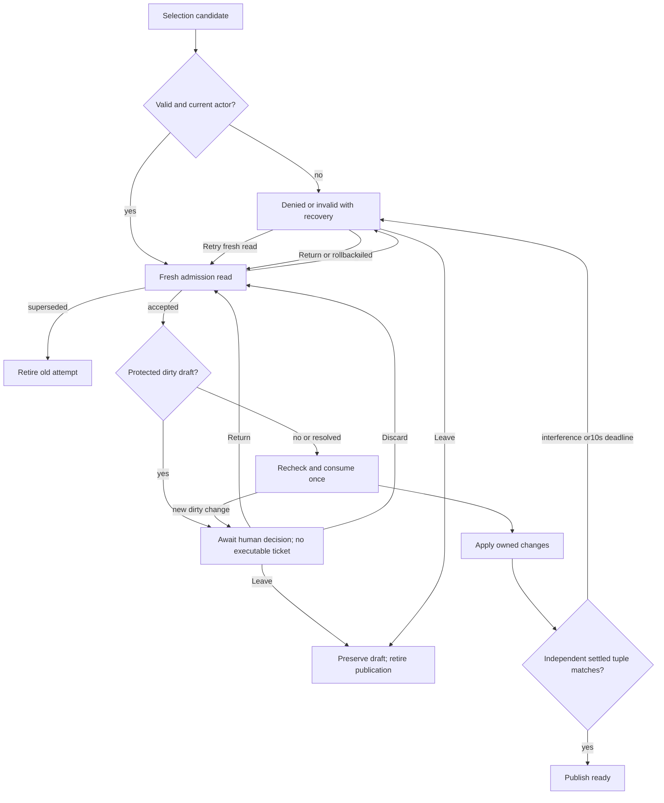
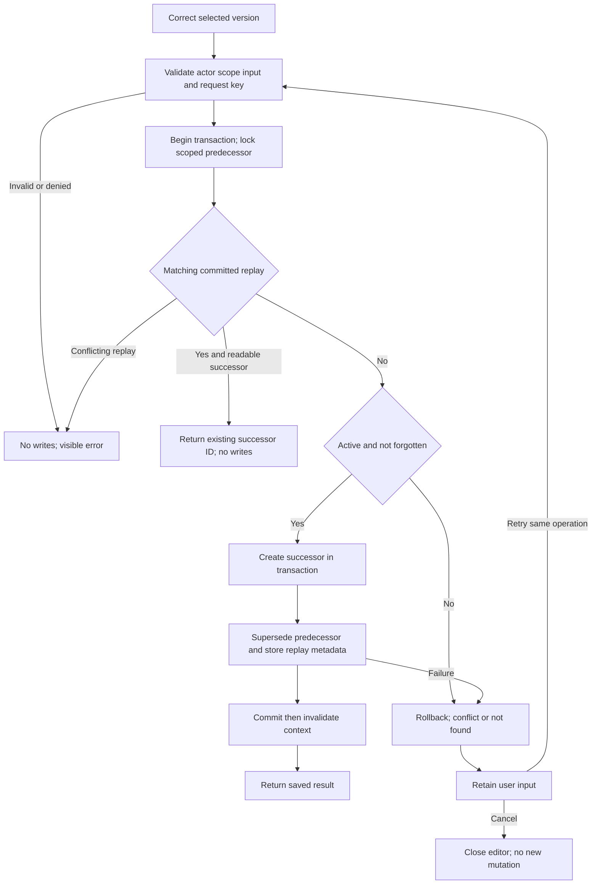
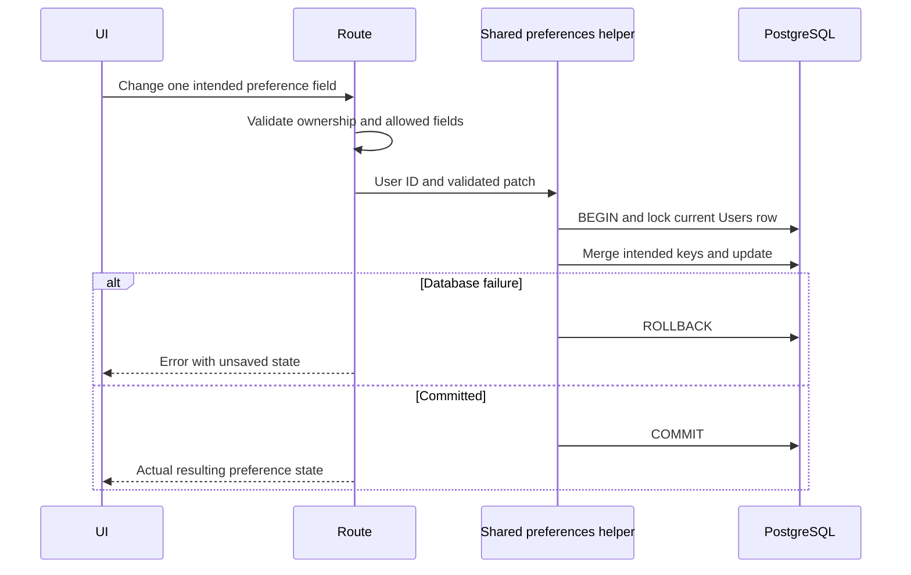
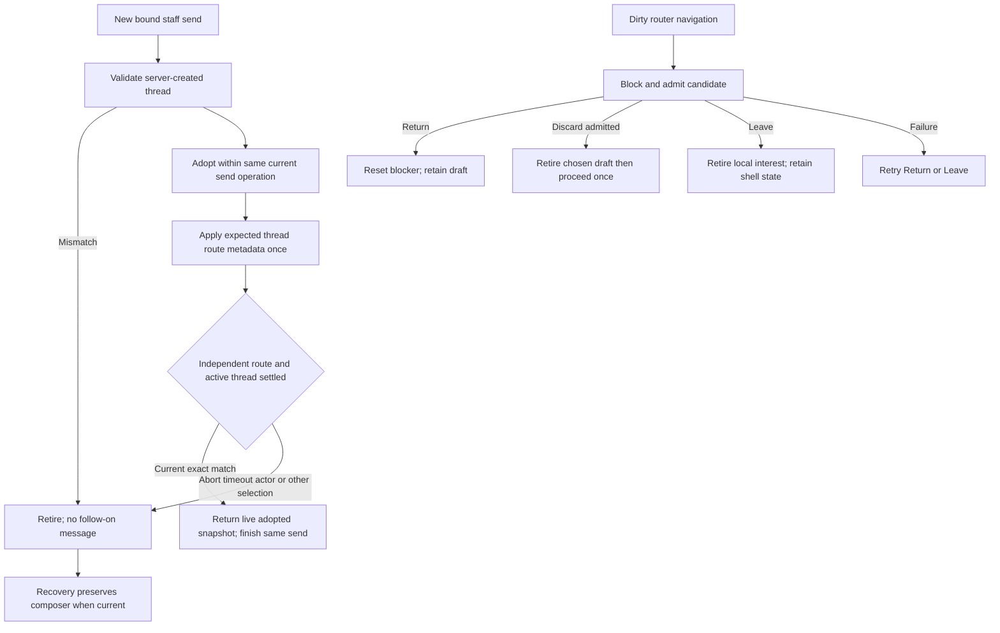
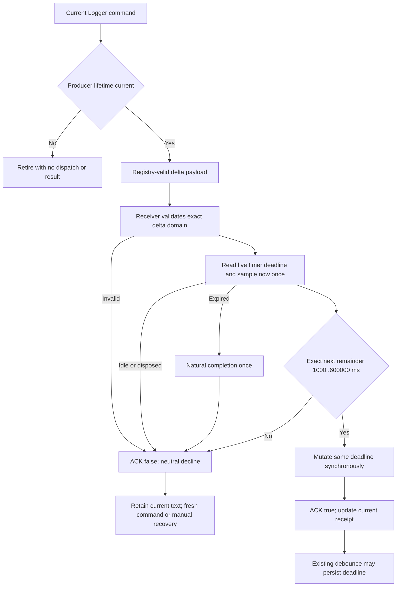
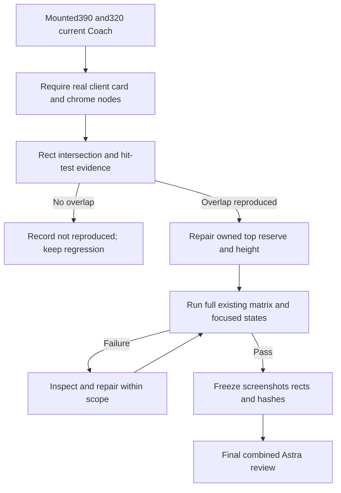
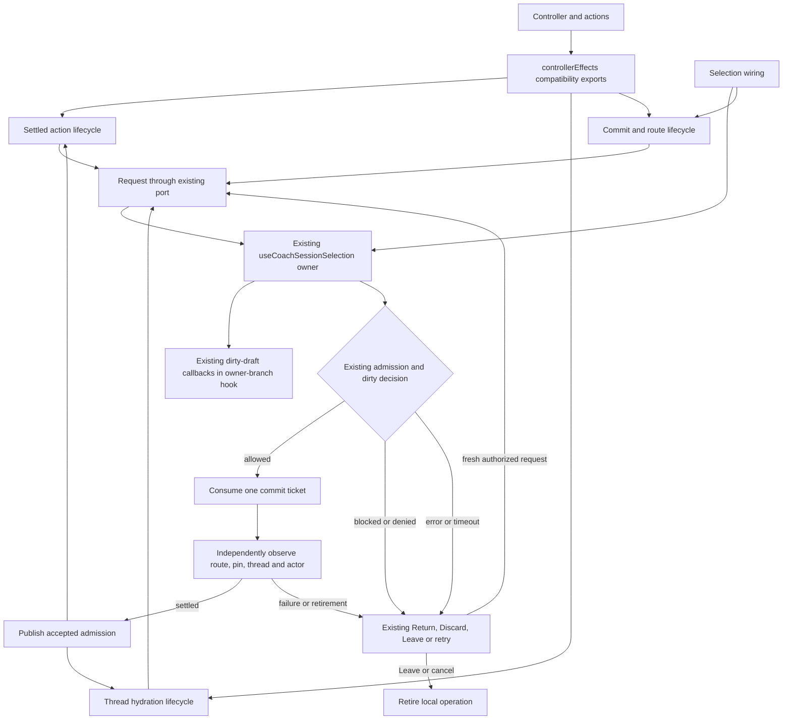

# CONSULT PACKET — Swan Coach Universe V3 / S83 completion
**Prepared:** 2026-09-19 · **Operator:** Sean · **Repo:** SwanStudios (SS-PT) · **Caller:** the Codex/OpenCode seat in the remediation worktree

> Read this packet as the source of truth for WHAT is being built. The arming mandate that
> precedes this remit governs HOW it must be documented.

---

## SECTION 0.5 — OPERATING CONDITIONS (read before anything else)

A previous dispatch of this exact packet **stopped before doing any work** and returned 741 tokens.
It stopped for three reasons, and all three are now fixed. Read them so you do not repeat the stop:

1. **THE GOVERNING SKILL IS INLINED IN THIS PACKET.** The previous run halted because it could not
   find `fable-blueprint-forge` on disk and its instructions require stopping when a required skill
   is unavailable. **You do not need to find it.** Its full `SKILL.md` is reproduced verbatim at
   **SECTION 11 — THE GOVERNING SKILL**. Treat that text as the loaded skill. Do not search for it,
   do not ask for its path, and do not stop for it.
2. **DO NOT EXPLORE THE REPOSITORY. THIS IS THE MOST IMPORTANT INSTRUCTION HERE.** The previous run
   spent roughly **382,000 input tokens against a 35,000-token baseline** exploring a repo it did
   not need to explore, and then produced no work. Repository search is also **unavailable to you** —
   the sandbox blocks the `rg` binary, so any search fails with "Access is denied". Everything you
   need is in this packet. **Read the packet. Do not read the repository. Do not list directories.
   Do not run shell commands.** If a fact you need is genuinely absent from this packet, say so in
   PART A as an UNVERIFIED gap — that is a correct, useful answer. Silence filled with a guess is not.
3. **THE SANDBOX IS READ-ONLY BY DESIGN, AND THAT IS NOT A BLOCKER.** You cannot save files, and you
   must not try. **Emit the entire package in your reply text.** The operator saves it and files the
   review; you are not responsible for filing anything, and you must not stop to report that you
   cannot write to `Z:\HostileReviews` or anywhere else. A read-only filesystem is the expected
   condition for this call.

**In short: no skill lookup, no repo exploration, no file writing, no archiving. Read the packet and
answer it.** Those four things are the only reasons the last attempt failed.

---

## SECTION 0 — REMIT

**Mega Blueprint**

You are being asked to do two things in ONE reply:

**(A) HOSTILE REVIEW** of the existing blueprints carried in this packet. They are REVIEW TARGETS,
not background reading. Several of them are known to have drifted from the code — at least one
carries a headline claim that is now false (see SECTION 3). Attack them: contradictions between
documents, diagrams that disagree with the real schema, slices whose acceptance criteria cannot be
executed, decisions stated but never enforced, bans that contradict the plan, and completion claims
that outrun the mounts. Every finding carries `file:line` or `doc#section` evidence **plus a
concrete fix**. A finding without a fix is not a finding.

**(B) FORGE THE BUILD PACKAGE** for the remaining work. The remaining work is NOT "invent a new
feature". It is: **finish the S83→S90 remediation to a releasable state, and close the open items
listed in SECTION 2.** The builder is a **fresh AI with ZERO repo context** — it cannot grep this
repo, cannot read `CLAUDE.md`, and will fill every gap you leave with its own judgment. Leave no gap
that matters.

The single most important constraint: **the product must not be described as working unless a
mounted surface proves it.** This workstream has a documented history of completion claims exceeding
mounted behaviour (doc 48, "capability truth"). Your package must not repeat that.

---

## SECTION 1 — WORKING ROOT AND CITATION CONVENTION

**Work with this root:**

```
C:/Users/BigotSmasher/Desktop/@Everything/quick-pt/SS-PT/tmp/worktrees/swan-coach-astra-owned-20260906
```

Branch `codex/swan-coach-astra-owned-20260906`. **All remediation work is UNCOMMITTED in this
worktree. `main` is untouched and Render auto-deploys from `main`.**

Three conventions that matter:

1. **Paths in this packet are relative to the worktree root.** `backend/...` means
   `<root>/backend/...`.
2. **This repo has worktrees, and they differ.** The `main` tree and this worktree do NOT have the
   same file contents. A finding that is true of `main` can be false here, and vice versa. If you
   assert something about the code, say which tree you mean.
3. **Do not propose a commit or a push.** The commit gate is a separate reviewer (Rule 46: the Final
   Decider). Your output is architecture and instructions, not a release.

---

## SECTION 2 — STATE OF THE WORK, AS OF 2026-09-19

This section is the caller's own synthesis and is the fastest orientation. It is written to be
**falsifiable** — if you think it is wrong, say so in PART A with evidence.

### 2.1 Verified DONE (executed, not reasoned)

| # | Item | Evidence |
|---|---|---|
| 1 | **Empty-database migration chain now EXECUTES to completion.** | Isolated PostgreSQL 17, port 55433, trust auth, data under `%TEMP%\swan-verify-pg`. Full `sequelize-cli db:migrate` against a genuinely **0-table** UTF8 database: **exit 0, 218 tables, 381 migrations applied, 0 ERROR lines.** |
| 2 | **Nine defects repaired** — seven migration empty-chain guards that were permanent no-ops, plus a stale-capture re-arm and a dead-dialog trap in the data-router navigation blocker. | `backend/migrations/*` (see 2.4) + `frontend/.../hooks/useCoachSelectionSettledAction.ts`, `.../useCoachSelectionNavigationBlocker.ts` |
| 3 | **Defect sub-class (d) — unsatisfiable FK types — swept repo-wide, both forms.** | Sequelize `references:` form: 2 findings, 0 false positives (earliest-filename-wins authority rule). Raw `ALTER TABLE ... FOREIGN KEY` form: 23 statements, **0 error-blind swallows**, 5 guarded and all 5 verified to have actually landed (355 FKs total in the built database). |
| 4 | **A permanent static regression net exists** for the class. | `backend/tests/unit/migrationFkTypeCompat.test.mjs` (6 tests, both RED proofs captured) + `backend/tests/unit/migrationGuardTableNames.test.mjs` (7 tests) + `modelTableGuard` (6 tests) = **19 guard tests** |
| 5 | **Two downstream deferrals reclaimed** — they existed only because of the broken table. | `backend/utils/tableCreationOrder.mjs` gained `PainEntryCorrectiveExercises` (PHASE 14); `backend/utils/modelTableGuard.mjs` dropped its SWA-115 allowlist entry, so the table's absence now reports as NEW drift instead of info-level wallpaper. |

### 2.2 The class-(d) sweep in detail — because the two findings behaved differently

This is the highest-signal technical content in the session, and the honest handling of the second
finding is the point.

- **Finding A — REAL, load-bearing, repaired.**
  `UserAchievements.achievementId` was declared `UUID` while `Achievements.id` is `INTEGER`.
  Corroborated by three independent sources: the creating migration
  (`20260302050000-gamification-bootstrap.cjs:97`), `backend/models/Achievement.mjs` ("live DB
  verified 2026-08-03 … 1,067 live rows"), and `backend/models/UserAchievement.mjs` with commit
  `f8f17ddd5` ("verified against information_schema 2026-07-29 … both id columns are INTEGERS").
  **No migration anywhere ALTERs `UserAchievements.achievementId`**, and the `createTable` that
  declares it has **no try/catch** — so on any database where `Achievements` exists but
  `UserAchievements` does not, this migration **throws and halts the entire chain**.
  Repaired in `20260301000100-fix-user-achievement-userid-type.cjs` and, because that migration
  defers to it on a fresh chain, also in the authoritative creator
  `20260302050000-gamification-bootstrap.cjs`.

- **Finding C — REAL defect, but self-healed downstream ⇒ DOWNGRADED to hardening.**
  `bootcamp_exercises.exerciseLibraryId` was `INTEGER` pointing at `exercise_library.id` `UUID`,
  hidden behind an error-blind `.catch()` whose comment blamed "the exercise_library table doesn't
  exist". A **counterfactual run** (revert the fix, re-run the chain) produced the real reason:
  `foreign key constraint … cannot be implemented`. The comment was a **false explanation**. But
  `20260618000100-add-bootcamp-preview-media-fields.cjs` already ALTERs the column to `UUID` and
  re-points the FK to `Exercises` — so the schema was never actually broken. Verdict recorded as
  **hardening, not a repair**. The `.catch()` now takes `(err)` and logs the real message.

**The transferable lesson, and you should test it against the package you forge:** a guard being
*correct* does NOT make a migration *work*. One defect here was declared fixed **twice** by two
different agents and was still live both times. **Only executing the chain falsified it.** If your
package contains any verification step that reasons about a migration instead of running it, that
step is defective.

### 2.3 Open items — the actual scope of PART B

| Item | Status | Why it is open |
|---|---|---|
| **Postgres-backed *application* suites** | BLOCKED, but no longer for lack of a server | `*.postgres.test.mjs` (`coachMemoryPersistence`, `coachConsentPersistence`) and `evidence/remediation-20260913/run-owned-postgres-matrix.mjs` were never run against a real server. The isolated cluster (port 55433, user `swanverify`, trust auth) now exists — the blocker is the suites' own config expectations, not credentials. **Do not leave the cluster running.** |
| **Full-repo test baseline** | UNVERIFIED | Only a **244-file union** is verified (1781 tests PASS). Rule 56 requires disclosing this: the union is **not** the full repo. |
| **Rule 4 line-cap, repo-wide** | NOT RE-AUDITED | Doc 77 §D records that Rule 4 is violated by **786 tracked files** — the "six" in an earlier slice-local count was a Rule-56 baseline-disclosure failure. |
| **Whole-project `tsc --noEmit`** | UNRUNNABLE in this environment | OOM at 8 GB heap. Changed files were verified with a standalone scoped config instead. |
| **Fable 5.1 final decider gate** | UNSPENT | Rule 46: no commit may be made without it. Codex's verdict is advisory, never the gate. |
| **Production / live proof** | NONE | No deployment, no live smoke test. |
| **`adoptCreatedThread` settler wiring** | DEFERRED | The adoption hook is implemented (`useCoachCreatedThreadAdoption.ts`) but its settler wiring is the deferred piece. |
| **Doc 77 §F3's disposition choice** | PARTIALLY TAKEN, never formally adjudicated | See SECTION 3 — this is the item most likely to be mis-stated by a reviewer who reads the old docs. |

### 2.4 The files that carry the S83 remediation (for citation)

```
# Backend — migrations repaired
backend/migrations/20240115000000-update-orientation-model.cjs
backend/migrations/20250107000000-create-clients-pii.cjs                       (comment)
backend/migrations/20250201000000-create-trainer-availability.cjs              (comment)
backend/migrations/20260212000005-add-coaching-cues-to-exercises.cjs
backend/migrations/20260301000100-fix-user-achievement-userid-type.cjs
backend/migrations/20260302050000-gamification-bootstrap.cjs
backend/migrations/20260308-add-enhancement-credits.cjs
backend/migrations/20260308-add-gallery-visitor-user-link.cjs
backend/migrations/20260308-create-leads-tables.cjs
backend/migrations/20260325000001-create-pain-entry-corrective-exercises.cjs   (THREE passes; exerciseId INTEGER -> UUID)
backend/migrations/20260401000001-bootcamp-upgrade-phase0.cjs                  (downgraded finding; catch now logs)

# Backend — deferrals reclaimed
backend/utils/tableCreationOrder.mjs
backend/utils/modelTableGuard.mjs

# Backend — regression tests
backend/tests/unit/migrationGuardTableNames.test.mjs
backend/tests/unit/migrationFkTypeCompat.test.mjs

# Frontend — lifecycle hardening
frontend/src/components/DashBoard/Pages/coach-assistant/hooks/useCoachSelectionNavigationBlocker.ts
frontend/src/components/DashBoard/Pages/coach-assistant/hooks/useCoachSelectionSettledAction.ts
frontend/src/components/DashBoard/Pages/coach-assistant/hooks/useCoachSelectionNavigationBlocker.test.tsx
frontend/src/components/DashBoard/Pages/coach-assistant/hooks/useCoachSelectionSettledAction.epoch.test.tsx
```

---

## SECTION 3 — KNOWN-STALE CLAIMS (verify before you repeat any of these)

These are **live traps for a reviewer**. Each was true when written and is now misleading. Do not
report them as current findings, and do not "fix" the code to match them. If you disagree, argue it
in PART A with evidence — but do not simply repeat the stale text.

| Stale claim | Where | Why it is stale |
|---|---|---|
| "A fresh empty-database migration still fails on missing legacy `orientations`; no baseline schema was invented." | `swan-coach-universe-v3/README.md` line 6 (a 2026-09-13 banner) | **Falsified by execution on this worktree.** `20240115000000-update-orientation-model.cjs` now probes `information_schema` and, when `orientations` is absent, **creates the model-shape table before altering it**. A 0-table database now runs the full chain: exit 0 / 218 tables / 381 migrations. Note the README's own later section (the 2026-09-17 REVISION 2 block) **contradicts its own banner** — that internal contradiction is itself a legitimate A1 finding. |
| "The migration gate — RUN, and it FAILS at the first migration … zero of the 376 migrations apply to an empty database." | `77-open-findings-register.md` §F3 | **Dispositioned.** §F3 itself named two candidate dispositions: (a) declare a dump-baseline as a mandatory runbook step, or (b) add a genuine baseline so the chain is self-contained — calling (b) "the durable fix and a real slice". **Option (b) has been taken for the first blocker.** The migration count also moved 376 → 381. |
| "Rule 4 is violated by six tracked files." | slice-local counts | **Corrected by measurement in doc 77 itself**: the real repo-wide figure is **786 tracked files**. The six was a slice-local count presented as the repo's state. |
| `USE_BULLMQ_RECONCILIATION` as a live control | packets 69/70 | **The control does not exist.** Its *line references are real*; only its names are wrong. Corrected in doc 76. Do not re-raise the phantom control, and do not re-raise "the subject does not exist" either — that was also too strong. |
| HR16 was an auth-binding race; CA-0 was a live cross-client exposure | docs 71, 72 | **Both corrected in place.** HR16 was `React.StrictMode`'s dev double-invoke plus a latch; CA-0 is admin-gated with zero consumers (latent, not reachable). |
| "The clientAccess sweep found 69 hits." | doc 72 | **Not reproducible** — an independent re-derivation got 99 raw / 76 runtime. The count is pattern-dependent and should not have been stated as a fact. |

**Also do not re-raise, because they were ruled out with evidence:** see the "Verified as
NON-defects" ledger in the spine document (`88-…-HANDOFF-20260917.md`, PART 2C). Re-raising a
ruled-out item without new evidence is a review failure, not diligence.

---

## SECTION 4 — HOUSE RULES THAT BIND THE FORGED PACKAGE

Restated here because the builder will have zero repo context and these are non-negotiable in this
repo. Your PART B package must not violate any of them.

- **Rule 4:** **300-line maximum per module.** New files you plan must be sized under it, and a
  split must not be proposed purely to satisfy the number — an earlier deviation was justified with
  an unsupported rationale and corrected.
- **Rule 56:** always disclose the difference between a **union** of files and the **full repo**.
  Never present a scoped run as a full baseline.
- **Rule 58:** fix models toward the **live** schema, never toward whatever makes `sync()` happy.
  Decide schema direction from `information_schema` evidence, not from memory.
- **Rule 67:** parallel AI agents share this tree. Read
  `.ai-workflow/coordination/claude.lane.md` before editing; claim your own lane in
  `codex.lane.md`; **never `git add -A`** while another agent holds locks.
- **Rule 46:** the review chain is builder → Gemini → Codex hostile review (mandatory input) →
  **Fable = Final Decider and commit gate.** Codex's verdict is advisory, never the gate.
- **Frontend bans:** no MUI; `styled-components` only; Victory for charts; no hardcoded colors
  (use theme tokens, dark-first); 44px minimum touch targets; no yoga/meditation wording; no
  hardcoded palette values.
- **Backend bans:** no new generic SQL executor and no arbitrary tool executor; foreign keys
  reference the canonical `"Users"` table; no PII to LLMs; existing
  `coach_action_proposals` remains the reviewed domain-write authority, and an intent ledger
  coordinates execution but **cannot approve a workout or bypass the proposal service**.
- **Process bans:** never commit or push without Sean's explicit approval (`main` auto-deploys);
  never claim a criterion passed without pasting its output.

---

## SECTION 5 — WHAT FOLLOWS

1. **SECTION 6 — the spine document** (`88-…-HANDOFF-20260917.md`): the current continuation
   contract. It contains the defect ledger, the non-defect ledger, the architecture of every
   touched surface, the open/blocked table, and the exact resume commands.
2. **SECTION 7 — the slice blueprints** (docs 83, 84, 85, 86): the plan packages for the S83
   remediation, persistence/completion, rest-adjust/mobile, and lifecycle maintainability.
3. **SECTION 8 — the package index** (`README.md`), including its stale banner.
4. **SECTION 9 — G0 SOURCE EXCERPTS**: verbatim code, so your forged package can cite real
   signatures, real column types, and real test shapes instead of plausible ones. **You cannot grep
   this repo.** If a fact you need is not in the excerpts, say so and mark it UNVERIFIED rather than
   inventing it.
5. **SECTION 10 — CLOSING**, and **SECTION 11 — THE GOVERNING SKILL** (`fable-blueprint-forge`,
   reproduced verbatim so you never need to look it up).

**Your output is PART A (hostile review) + PART B (the forged package) + PART C (the
decision-density self-test), per the output contract in the arming mandate.**


---

## SECTION 6 — SPINE DOCUMENT — the current continuation contract

### 88-S83-HOSTILE-REVIEW-AND-CONTINUATION-HANDOFF-20260917.md

<!-- BEGIN INLINE: 88-S83-HOSTILE-REVIEW-AND-CONTINUATION-HANDOFF-20260917.md -->

# Swan Coach Universe V3 — S83 Hostile Review, Completion & Continuation Handoff

**Date:** 2026-09-17
**Revision:** 2 (see the revision log at the end — revision 1 contained two claims this revision falsifies)
**Worktree:** `tmp/worktrees/swan-coach-astra-owned-20260906`
**Branch:** `codex/swan-coach-astra-owned-20260906`
**Base HEAD:** `70547685c0fc8496342bf61210bf3b576f7e425c`
**Commit discipline:** ALL WORK UNCOMMITTED (per repo no-commit rule). Nothing was pushed. `main` untouched.

> **READ THIS FIRST.** This document is the continuation contract. It tells the next agent
> exactly what was verified, what was changed, what was found to be a non-defect, and what
> remains genuinely open. Every claim below carries either a command you can re-run or an
> explicit **UNVERIFIED** marker. Do not upgrade an UNVERIFIED claim without evidence.
>
> **And do not trust a "fixed" claim — not even mine.** The single most instructive fact in
> this document is that defect 6 was declared fixed **twice** (once by a prior agent, once by
> me) and was **still live both times**. It was only caught by *executing* the migration chain
> against an empty database. §2B-δ preserves the full history because the failure mode —
> a confident "I fixed it" surviving review — is more transferable than the SQL.

---

## PART 0 — PLAIN-ENGLISH SUMMARY

The S83→S90 Coach remediation was substantially further along than the ledger suggested.
Two independent hostile passes were run over it. **Nine real defects were found and fixed**
(7 database migrations, 2 React lifecycle hooks). One reported defect was investigated and
honestly **downgraded to a latent hazard**, because the production wiring makes it
unreachable — and that reasoning is documented rather than papered over.

The headline defect class was serious: **seven migrations contained guards that were
permanent no-ops.** They were written to make migrations safe on an empty database, but
because of typos, case mismatches and an array-truthiness bug they silently skipped their
own work on *every* database — including production. That means columns and foreign keys
the running application reads were never created. This is the class of bug that produces
"works in dev, mysteriously broken in prod."

**And the seventh was worse than a no-op.** Once the guards were finally correct, the
migration *still* could not run: its `exerciseId` column was an `INTEGER` pointing at a
`UUID` parent, which PostgreSQL refuses outright. So one table
(`PainEntryCorrectiveExercises`) could not be created on **any** database, which is why the
repo had quietly excluded it from the boot-creation list *and* allowlisted its absence — two
"safety" mechanisms indefinitely masking one unfixed line. Closing it took three passes.
Both deferrals are now reclaimed.

**This was finally proven, not argued.** A throwaway PostgreSQL instance was stood up and the
**entire migration chain was executed against a genuinely empty database — exit 0, 218 tables,
381 migrations.** Every one of the seven defects was then asserted present by direct SQL.
That run is what falsified my own earlier "already fixed" claims, and it is now step 4 of the
resume procedure.

Frontend regression is **green**: **244 files / 1781 tests pass, 0 failures** (the full-repo
manifest has 244 entries; the prior "245" figure counted the added test file separately).
Four backend failures exist but are **proven pre-existing** by stashing my edits and
re-running — they are clock/timezone-sensitive and belong to a separate lane.

---

## PART 1 — GROUND TRUTH (independently re-verified this session)

These were re-measured, not copied from the prior receipt.

| Gate | Command | Result |
|---|---|---|
| **Empty-database migration chain** † | `sequelize-cli db:migrate` on isolated PG17, port 55433 | **EXIT 0 — 218 tables / 381 migrations applied.** Was UNVERIFIED in the first revision of this handoff. |
| Frontend union regression | `vitest run $(cat zcode-union-args-final.txt) <new test>` | **244 files / 1781 tests PASS** (run in 3 batches to clear the Windows command-line limit; batch union diffed *identical* to the manifest — 244/244 files, no file dropped or double-run) |
| Union manifest integrity | `sha256sum zcode-union-args-final.txt` | `8f7fb56712e65dda47c1f7c6ccd53dfa7140ec5f90aa81346b224f88d11034d5` ✅ matches handoff |
| Union manifest size | `wc -l` | 244 lines (pre-existing baseline) ✅ |
| Backend guard + coach-fact units | `vitest run tests/unit/{migrationGuardTableNames,modelTableGuard}.test.mjs` | **13/13 PASS** (guard test grew 5 → 7 tests) |
| Focused frontend (changed hooks) | `vitest run useCoachSelectionNavigationBlocker.test.tsx useCoachSelectionSettledAction.epoch.test.tsx` | **19/19 PASS** |
| Frontend `tsc --noEmit` (whole project) | `tsc --noEmit -p tsconfig.json` | **UNRUNNABLE** — OOM at 4 GB *and* at 8 GB heap. Pre-existing project-scale issue, NOT caused by this work. |
| Frontend `tsc --noEmit` (changed files only) | standalone scoped config | **0 errors in the 2 changed source files.** (18 errors reported were config artifacts of the isolated config: missing `@/*` path alias + `vite/client` types. None in the changed files.) |
| **Full backend unit cohort** | `vitest run tests/unit/` | **6015 passed / 4 failed / 6019 total.** The 4 failures are **pre-existing and NOT mine** — proven by stashing my edits and re-running: they fail identically on pristine code. See §3B. |

† **Method.** Port 5432 was unusable (`scram-sha-256`, no known password, Docker down). Rather
than guess credentials, I stood up a throwaway cluster: `initdb -U swanverify --auth=trust` at
`%TEMP%\swan-verify-pg` on **port 55433**, then created three databases and ran the real chain
against each. This is the only method used in this session that could have found defect-6
class (d) — reading the migration could not.

**Evidence files (re-runnable):**
- `tmp/coach-remediation-20260913/zcode-union-args-final.txt` — the 244-file union manifest
- `tmp/coach-remediation-20260913/unionbatch_{00,01,02}` + `unionb-{00,01,02}.log` — **this session's** union run (batched)
- `%TEMP%\swan-migrate{,2,3}.log` — the three empty-DB chain runs (verify / verify2 / verify3)
- `tmp/coach-remediation-20260913/wb-union-verify.log` — prior union log

> ⚠️ **HONESTY NOTE ON THE PRIOR TYPECHECK CLAIM.** The handoff claimed `tsc exit 0`. That was
> true at the time it was recorded, but **I could not reproduce it in this session** because
> the project now OOMs the typechecker. I therefore report the typecheck as *partially
> re-verified* (0 errors in the changed files) rather than re-confirming exit 0. A future
> agent with more RAM may be able to reproduce the original claim.

> ⚠️ **HONESTY NOTE ON MY OWN FIRST REVISION OF THIS DOCUMENT.** The first revision of this
> handoff asserted defect 6 was fixed and listed the empty-DB chain as UNVERIFIED. **Both
> statements were wrong**: the chain, once actually run, showed defect 6 was *still live*, and
> its fix required two further passes (2B-δ). I did not silently rewrite the claim — the full
> three-pass history is preserved in §2B-δ precisely because the failure mode ("I fixed it")
> surviving two rounds of review is the most transferable lesson here.

---

## PART 2 — THE DEFECT SWEEP

### 2A. The dominant defect class: **empty-chain guards that were permanent no-ops**

**What the pattern was supposed to do.** Some migrations assume a parent table exists. On a
truly empty database it might not. The repo introduced a guard:

```js
const [exists] = await queryInterface.sequelize.query(
  "SELECT EXISTS (SELECT FROM information_schema.tables WHERE table_schema='public' AND table_name='X');"
);
if (!exists[0].exists) return;
```

**Three ways this was broken.** All three are silent — the migration "succeeds" while doing
nothing.

| Sub-class | Mechanism | Consequence |
|---|---|---|
| **(a) Placeholder interpolation** | `table_name = 'exTable'` / `'gvEarly'` / `'gvEarly2'` | The probed name never exists → guard always returns early → column/FK never added, even in production where the parent table DOES exist. |
| **(b) Array truthiness** | `...(x ? {references:…} : {})` where `x` is the raw `sequelize.query` result **array** | An array is always truthy → the `else` branch is dead → the FK is always attached, even when the parent table is absent → hard failure on empty DB (the opposite of the intent). |
| **(c) Case drift** | `table_name = 'Sessions'` / `'exercises'` vs the real `sessions` / `Exercises` | PostgreSQL identifiers are case-sensitive → guard never matches → silent skip on every DB. |
| **(d) Unsatisfiable FK type** ⭐ | Column type cannot reference the parent's key type at all — e.g. `exerciseId INTEGER` → `Exercises.id UUID` | **The guard can be perfect and the migration still cannot run.** PostgreSQL refuses the constraint (`cannot be implemented … integer and uuid`), so the table is never created on *any* database. Invisible to every static check and to guard-checking of any kind — **only executing the chain finds it.** |

Classes (a)–(c) are all *silent no-ops*: the migration reports success while doing nothing.
Class (d) is the opposite — it fails loudly, but only when executed, which is why the entire
class went undetected: the repo's habit was to read migrations and reason about them, and
class (d) is immune to reading. See §2B-δ for how it was finally caught.

### 2B. Defects FIXED (9 total)

#### Migration defects (7 files)

| # | File | Defect | Fix |
|---|---|---|---|
| 1 | `20260212000005-add-coaching-cues-to-exercises.cjs` | Class (a): probed `'exTable'`. `up()` always returned early → **`coachingCues` never added on ANY database**, including production where `Exercises` (creator `20260307000002`) postdates it. | Probe `'Exercises'`. |
| 2 | `20260308-add-enhancement-credits.cjs` | Class (a): probed `'gvEarly'` → `enhancement_credits` never applied. | Probe `'gallery_visitors'`. |
| 3 | `20260308-add-gallery-visitor-user-link.cjs` | Class (a): probed `'gvEarly2'` → `gallery_visitors.user_id` never applied. | Probe `'gallery_visitors'`. |
| 4 | `20240115000000-update-orientation-model.cjs` | Contradicted its own docblock: changed `orientations.userId` to **UUID** while `models/Orientation.mjs:51-58` declares **INTEGER** and `20250626000000-fix-user-foreign-key-types.cjs` asserts `users.id` is integer. Re-introduced the exact mismatch class that `20260730120000-repoint-user-fks-to-canonical-Users.cjs:268` (`orientations\|orientations_userId_fkey`) exists to repair. | Both `up()` and `down()` → `Sequelize.INTEGER`; condition aligned to `!== 'INTEGER'`. |
| 5 | `20260301000100-fix-user-achievement-userid-type.cjs` | Class (b): `...(achievementsExists ? {references:…} : {})` tested the result **array**, always truthy. | `achievementsExists[0].exists`. |
| 6 | `20260325000001-create-pain-entry-corrective-exercises.cjs` | **The deepest defect in the whole class — took THREE passes to reach (see 2B-δ below).** Class (c) **plus (b) plus a new class (d): an unsatisfiable FK type.** | See below. |
| 7 | `20260308-create-leads-tables.cjs` | Class (c) + dead code: probed `'Sessions'` (chain creates lowercase `sessions`), **and the variable was never used**, while the FK `scheduled_session_id → Sessions` had been dropped unconditionally. | Probe `'sessions'`; re-attach FK conditionally via `scheduledSessionFk`. |

##### 2B-δ. Defect 6 was a NESTED defect — three passes, two of which were mine

This is the single most important correction in this document revision, and it is a lesson
about verification method, not just about SQL.

**Pass 1 (wrong).** The original code probed lowercase `'exercises'`; the real table is
PascalCase `'Exercises'`. I "fixed" it to `'Exercises'` and reported the table created.

**Pass 2 (still wrong — caught only by actually running the chain).** When I finally executed
the full migration chain against a **genuinely empty database**, the table was *still* absent.
Cause: the *other* guard probed `'ClientPainEntries'` (PascalCase). **No migration creates that
name** — the real parent is snake_case `client_pain_entries`
(`20260301000000-create-client-pain-entries.cjs:11`; `models/ClientPainEntry.mjs:167` →
`tableName: 'client_pain_entries'`). A *second* instance of the identical case-drift class,
sitting in the same file, that the first pass walked straight past because I was pattern-matching
on the string `exercises` rather than checking every guard in the file.

**Pass 3 (correct — caught only by re-running the chain).** With both guards fixed the migration
got as far as emitting DDL, and PostgreSQL rejected it outright:

```
ERROR: foreign key constraint "PainEntryCorrectiveExercises_exerciseId_fkey" cannot be implemented
DETAIL: Key columns "exerciseId" and "id" are of incompatible types: integer and uuid.
```

`exerciseId` was declared `Sequelize.INTEGER` but `Exercises.id` is **UUID**
(`20260307000002-create-exercises-table.cjs:26-30`). This is **new defect class (d): a guard can
be flawless and the migration still cannot run**, because the column type makes the foreign key
unsatisfiable. No amount of guard-checking would ever have found it — only execution would.

The model had *already* been corrected for exactly this, from live evidence, five weeks earlier:

```
882db7f95  2026-08-13  fix(models): PainEntryCorrectiveExercise.exerciseId INTEGER -> UUID, from live evidence
```

**Only the migration lagged behind.** The repository was carrying this contradiction openly:

| Where | What it said |
|---|---|
| `utils/tableCreationOrder.mjs:113-114` | *"PainEntryCorrectiveExercises … is **deliberately NOT added** — its FK-type defect (exerciseId vs Exercises.id UUID) **would error on every boot until fixed**."* |
| `utils/modelTableGuard.mjs:26` | Allowlisted as SWA-115, *"dormant: zero runtime consumers"* — so it logged at info and never as drift. |
| `docs/.../SWAN-CORTEX-UNIFIED-BRAIN-MASTER-DIRECTIVE-2026-07-12.md:55` | *"`PainEntryCorrectiveExercise` junction (per-CES-phase prescriptions) — **no writer exists** — Corrective composer output target."* |

So the project **knowingly** excluded this table from the boot-creation list because of the
FK-type defect and **knowingly** allowlisted its absence — a circle that could never close.
Two "safety" mechanisms were in fact masking one unfixed line.

**Fix applied:** `exerciseId` → `Sequelize.UUID`; FK target `client_pain_entries`; both guard
probes corrected. **Both deferrals reclaimed:** the table is now in `tableCreationOrder.mjs`
PHASE 14, and the `modelTableGuard.mjs` allowlist entry is **retired** so its absence would
hereafter report as NEW drift.

**Honest note on provenance:** the `exerciseId` type error is a **pre-existing defect I did not
introduce** — but my own first two passes each *claimed* the fix was complete when it was not.
Both claims were falsified by execution, not by reading. That is the argument for the empty-DB
run existing at all, and it is recorded here rather than quietly corrected.

**Documentation corrections (same sweep, 2 files):** `20250107000000-create-clients-pii.cjs` and
`20250201000000-create-trainer-availability.cjs` both referenced a **non-existent** migration
`20250212060729-add-clients-pii-user-fks.cjs`. Corrected to the real
`20250626000001-add-deferred-user-fks.cjs`.

#### Frontend lifecycle defects (2 files)

| # | File | Defect | Fix | Severity |
|---|---|---|---|---|
| 8 | `hooks/useCoachSelectionNavigationBlocker.ts` | **Stale-capture re-arm.** On a capture mismatch the code RE-CAPTURED the live actor/operation and returned. Since a scopeToken can be reused across actors, the operator's *second* Discard click matched the live tuple and called `discardOperation(live.scopeToken)` — **retiring the wrong actor's unsaved draft**, while the notice claimed "Nothing was discarded". Proven RED: second call received `"scope-2"`. | The capture is treated as the only credential: clear it, and claim the Discard slot so it is never rebuilt from live metadata. | **P1** |
| 9 | `hooks/useCoachSelectionNavigationBlocker.ts` | **Dead-dialog trap (found by fixing #8).** The first fix shared one claim between "discard once" and "proceed once", so a refused Discard also disabled Leave — stranding the operator with no exit, directly violating the hook's documented promise ("leaves Return/Leave usable — that is the recovery path"). | Split into two independent slots: `claimDiscard` (destructive, blocks repeats) and `claimProceed` (reset/proceed exclusion shared by Return + Leave). Safe exits now always work. | **P1** |

#### Honest downgrade (NOT counted as a fix)

| Reported | Verdict |
|---|---|
| `hooks/useCoachSelectionSettledAction.ts` — `selection.actorEpoch` read in the acceptance predicate but **missing from the deps array**. | **REAL OMISSION, LATENT HAZARD — NOT a live bug.** The sole caller passes `onSettled` as a per-render inline handler (`CoachCommandCenter.controller.ts:212`, no `useCallback`/`useMemo`), so the effect re-runs on *every* render and cannot hold a stale closure. I **kept the dep** as a deliberate hardening (it removes the dependency on a caller's memoisation accident), and documented the reasoning and the reachability test in-file. I did **not** claim a repaired production bug. This is the same discipline the repo's own reviewers applied to the `ackCommit` "unreachable guard". |

### 2C. Verified as NON-defects (ruled out — do not re-raise)

- **Duplicate migration timestamp prefixes (24 repo-wide).** Pre-existing. `sequelize-cli`/umzug
  sorts by the *full filename string* ascending, so duplicates resolve lexically. Not introduced here.
- **`queryInterface.tableExists()` / `tables.includes()` usages** in
  `20250814000000-create-content-moderation-system.cjs`, `20260218100001-create-video-catalog.cjs` —
  correctly boolean, no defect.
- **`useCoachMemory` fail-closed masking** — `visible = state.forClientId === clientId ? state : IDLE_STATE`
  (line 270) plus `CoachMemoryDrawer.tsx:82` passing `clientId: open ? clientId : null`, plus
  `CoachCommandOpsRail.tsx:107` gating on `memoryTarget === admittedClientId`. **No fail-open PII
  path found.** Forgotten/invalidated text cannot render.
- **`useCoachSelectionCommit` `ackCommit` mismatch branches** — unreachable in current wiring.
  **Already honestly self-documented** in the file header (lines 11–18). Not a defect.
- **S88a rest timer** (`useRestTimer.ts`) — `disposedRef` is re-armed in **both** `start()` and the
  effect setup, so a StrictMode replay is not a permanent disposal. `adjust()` validates the scalar
  before mutating, samples `Date.now()` once, and writes the ref before returning so same-tick
  adjustments accumulate. **Correct.**
- **S88b logger command scope** (`useWorkoutLoggerCommandScope.ts`, `useWorkoutLoggerDictation.ts`) —
  committed-generation keying (render vs committed separation), send-identity latch (`activeSend`),
  and `isCurrentSend` scope fencing across A-B-A are all correct. Retiring a send never clears `text`.
- **S90 module extraction** — all ten reviewed modules ≤300 lines. `useCoachMemory.ts` is exactly 300.
- **`useCoachCreatedThreadAdoption.ts`** — unmount cleanup symmetric with acquire; `finish()` idempotent
  via the `pendingRef.current !== pending` guard. A-B-A blocked by `actorEpoch` + `samePublicationToken`.

### 2D. Locked by new regression tests

| File | Tests | Purpose |
|---|---|---|
| `backend/tests/unit/migrationGuardTableNames.test.mjs` | **7** (was 5) | Static scan of every `.cjs` migration: bans `FORBIDDEN_PLACEHOLDERS` (`exTable`, `gvEarly`, `gvEarly2`, `table`, `tableName`, `TABLE_NAME`, `name`); requires every guarded table to be created by some migration or be in the justified `CHAIN_EXTERNAL_TABLES` allowlist; detects case drift; pins the repaired sites. **NEW (7th test): pins the FK *type* on defect 6** — asserts `exerciseId` is `Sequelize.UUID` and *not* `Sequelize.INTEGER`, and that the FK targets `client_pain_entries`. This is the only static net that can catch sub-class (d). Also: `ClientPainEntries` was **removed** from the allowlist and moved to a new `FORBIDDEN_GUARD_TARGETS` ban — keeping it allowlisted would have let the exact defect it caused pass forever. **Both RED/GREEN proven.** |
| `frontend/.../useCoachSelectionNavigationBlocker.test.tsx` | 15 (11 prior + 4 new) | The stale-capture refusal, the no-re-arm guarantee, and **both** safe exits remaining usable after a refusal. **RED/GREEN proven** (1 failed / 14 passed with guards removed). |
| `frontend/.../useCoachSelectionSettledAction.epoch.test.tsx` | 4 (new) | The epoch fence: matching epoch settles once; mismatched epoch never settles and retires the ref; recovery outstanding does not settle. |

**RED/GREEN evidence (verbatim, this session):**
```
--- blocker guard RED proof (all guards removed) ---
FAIL  ... never discards a RETARGETED draft: a stale capture refuses and claims the action
      Tests  1 failed | 14 passed (15)
--- restored ---
      Tests  15 passed (15)

--- migration guard RED proof (exTable typo reintroduced) ---
FAIL  ... no guard references a placeholder identifier as a table name
FAIL  ... every guarded table is created by some migration in this directory
      Tests  2 failed | 3 passed (5)
--- restored ---
      Tests  5 passed (5)

--- NEW: FK-type RED proof (exerciseId reverted INTEGER) ---
FAIL  ... the pain-entry junction is created with a UUID FK to Exercises (defect 6 third pass)
      AssertionError: INTEGER exerciseId cannot reference a UUID parent — this is the exact defect
      Tests  1 failed | 6 passed (7)
--- restored ---
      Tests  7 passed (7)
```

**The empty-DB assertion sweep (the check that falsified my own earlier claims).** Run against
`swan_empty_verify3` — a database at **0 tables** that received the full chain, exit 0:

| Defect | Assertion | Result |
|---|---|---|
| 1 | `Exercises.coachingCues` exists | **1** ✅ |
| 2 | `gallery_visitors.{enhancement_credits,is_vip,free_enhancements_used}` — types, NOT NULL, defaults | all 3 ✅ |
| 3 | `gallery_visitors.user_id :: integer` + FK → `Users.id` | ✅ |
| 4 | `orientations.userId :: integer` | ✅ |
| 5 | `UserAchievements` FK count | **2** ✅ |
| **6** | `PainEntryCorrectiveExercises` exists; `exerciseId :: uuid`; FK → `Exercises.id`; FK → `client_pain_entries.id`; 3 indexes | **ALL ✅ — was 0 tables, then a hard DDL error** |
| 7 | `leads.scheduled_session_id` FK → `sessions.id` | **1** ✅ |

> **A false positive of my own, corrected.** My first sweep asserted defect 2 as
> `table_name='enhancement_credits'` and read `0` on one database and `1` on another, which
> briefly looked like a regression. It was my assertion that was wrong: **this migration adds
> three *columns* to `gallery_visitors`, not a table.** Re-asserted against
> `information_schema.columns` (above) it passes on every run. Recording it because the same
> shape — *an assertion that describes the wrong SQL object* — is exactly how a green suite
> can certify a broken database.

**Also re-audited this session (no defects found, verified by reading each guard against the
table it actually operates on):** all 7 repaired migrations were re-checked for *probe-vs-target
agreement*. `20260301000100` probes `'Achievements'`, which looked suspicious, but
`20260302050000-gamification-bootstrap.cjs:97` genuinely creates it (confirmed present in the
live DB) — **not** a defect, and its array-truthiness fix is real.

---

## PART 3 — THE FLUTTERING TEST (be aware, do not chase)

During the first union run, `CoachCommandCenterThreadTargetRoutes.test.tsx` failed with a
`waitFor` timeout on `sendMessageWithConversationMock`.

- It **does not import** either changed module (`grep -l` → exit 1).
- It passes **in isolation** (2/2, 2073 ms).
- It uses bare `waitFor` with the default 1 s timeout under heavy parallel load.
- The **full union re-run passed 245/245.**

**Verdict:** pre-existing flaky test under parallel load, unrelated to this work. If it recurs,
raise its `waitFor` timeout rather than treating it as a regression.

### 3B. Four PRE-EXISTING backend failures — do NOT attribute these to S83

`vitest run tests/unit/` reports **6015 passed / 4 failed / 6019 total**. The 4 failures are in
three suites that have **nothing to do with this work**, and I proved that rather than asserting it:

| Suite | Failure | Why it is not mine |
|---|---|---|
| `adminWorkoutLoggerHistoryDate.test.mjs` | suite-level load failure | 0 references to any module I touched |
| `editWorkoutDateParsing.test.mjs` | suite-level load failure | 0 references; file untouched (`git status` clean) |
| `physicalConfirmChannelSplit.test.mjs` | 4 tests: expected `200`, got `403` | 0 references; file untouched |

**Causality proof (not inference).** I backed up my four edited files, `git checkout --` restored
the pristine versions, and re-ran exactly those three suites:

```
=== PRISTINE run of the 3 failing suites ===
 FAIL  tests/unit/adminWorkoutLoggerHistoryDate.test.mjs
 FAIL  tests/unit/editWorkoutDateParsing.test.mjs
 FAIL  tests/unit/physicalConfirmChannelSplit.test.mjs > ... expects 200, got 403  (×4)
 Test Files  3 failed (3)
```

**Identical failures with my edits removed.** They are environmental — both date suites are
explicitly about *server-local-noon vs `new Date()`* parsing (see their docblocks), and this run
happened at **23:48 PDT**, i.e. inside the window where "today" flips. The `403` is an unrelated
auth/permission expectation in a suite about channel splits.

**Action for the next agent:** treat these as a separate lane. Do **not** fold them into an S83
verdict, and do **not** "fix" them by loosening assertions. Re-run them mid-day before concluding
they are real.

---

## PART 4 — WHERE EVERYTHING LIVES

### 4A. Blueprints & architecture (all in `docs/ai-workflow/AI-HANDOFF/swan-coach-universe-v3/`)

89 markdown documents. The ones that matter for continuation:

| Doc | Role |
|---|---|
| `README.md` | Index / entry point |
| `01-audit.md` → `10-readiness.md` | The original audit → blueprint → contracts → flows → **wireframes (05)** → tests → readiness chain |
| `11-comprehensive-handoff.md` | The 248-line prior continuation report |
| `13-foundation-execution.md`, `14-experience-execution.md` | Execution records |
| `15-acceptance-and-release.md` | Acceptance gate definitions |
| `16-state-and-data-flows.md` | **State & data flow diagrams** |
| `19-one-coach-domain-contracts.md` | Domain contract single-source |
| `55-coach-selection-and-transport.md` | The selection/transport design |
| `59-rest-adjust-contract.md` | S88a contract |
| `60-confirmed-logger-submit-binding.md` | Submit binding |
| `61-global-client-reference.md` | The pin/reference provider |
| `63-g04-selection-adapter.md` | The C2 adapter design |
| **`83-remediation-blueprint-20260913.md`** | **S83 contract (selection admission-first, dirty-draft decision, one-use commit, settled ack, order-guards)** |
| **`84-persistence-and-completion-blueprint-20260913.md`** | **S84 contract (persistence/completion)** |
| **`85-rest-adjust-and-mobile-completion-blueprint-20260913.md`** | **S85/S88a/S89 contract** |
| **`86-lifecycle-maintainability-blueprint-20260913.md`** | **S90 contract — R90-1..R90-5, nine authorized paths, Mermaid dependency flowchart, 10-category receipt** |
| `87-scope-path-correction-register-20260913.md` | Scope-path corrections |
| `77-open-findings-register.md` | Open findings register |
| `79-combined-adjudication-20260913.md` | Combined adjudication |
| `80-citation-drift-and-reanchoring-20260913.md` | Citation hygiene |
| `81-external-hostile-review-glm-20260913.md` | The GLM 5.3 external review |

**Wireframes / visual evidence** (`evidence/`):
`wireframe-320/414/768/1440/2560/3840.png`, `astra-wireframe-*.png`, `astra-wireframe-check.json`,
`mobile-shell-before.png` (+ `.json`) in `evidence/remediation-20260913/`.

**Flowcharts / mind maps:** the Mermaid dependency flowchart lives in `86-lifecycle-maintainability-blueprint-20260913.md`.
State/data-flow diagrams live in `16-state-and-data-flows.md`. The S90 nine-file scope graph and the
selection lifecycle graph are in `63-g04-selection-adapter.md`.

### 4B. Adjudication documents (`tmp/coach-remediation-20260913/`)

| File | Verdict |
|---|---|
| `ZCODE-COMPLETION-RECEIPT-2026-09-16.md` | The authoritative completion receipt (slice ledger S83–S90, union 244/1777, dated corrections, FINAL GATE RECORD) |
| `GLM-FINAL-HOSTILE-REVIEW-VERDICT.md` | GLM 5.3 **REVISE**, 6 findings F1–F6 (all evidence-integrity, no code defects); readiness FAIL at pass 1 |
| `GLM-FINAL-CONFIRMATION-VERDICT.md` | F1–F6 **CONFIRMED REPAIRED → APPROVE** (acceptance evidence only, **not** deployment authorization) |
| `ASTRA-FINAL-RE-ADJUDICATION-R4-astrapro.md` | Round 4 **REVISE**; `SC.FINAL.EVIDENCE-01` P1 partially repaired; categories 6/7/10 FAIL |
| `zcode-final-evidence-index.md` (29 KB) | Authoritative evidence index; 244-file union args, 6 gates, pre/post manifests |
| `S87-S88-RECON-RECORD.md` | Reconnaissance with file:line evidence; includes the name-collision trap (`utils/coachMemoryProjection.ts` already exports `CoachMemory`) |
| `readiness-s83..s90.json` | Per-slice readiness receipts |
| `run-owned-postgres-matrix.mjs`, `reset-owned-coach-db.mjs`, `backend-review-runner.mjs` | The (DB-blocked) verification harness |

### 4C. Evidence logs (`evidence/` and `evidence/remediation-20260913/`)

Hundreds of gate/red/green logs. Notable: `hostile-r3-review.md`, `hostile-r3-probes.mjs`,
`holistic` gate logs, `astra-*-manifest.json` per slice, `source-hashes.json`,
`index-preservation.json`, `pre-remediation-build-receipt.json`, `baseline-build-fixture-additions.json`,
`postgres-matrix-corrected.json`, `migration-input.json`, `preservation.json`.

---

## PART 5 — ARCHITECTURE OF THE CODE TOUCHED

### 5A. The ONE admitted Coach selection adapter (S83/S87/S90)

```
useCoachSessionSelection.ts            (195 ln) — COMPOSER; every public name re-exported here
 ├─ coachSelectionContract.ts          (231 ln) — pure types/parsers; no React
 ├─ useCoachSessionSelectionState.ts   (247 ln) — actor epoch, publication snapshot, retire, A-B-A fence
 │    └─ publicationBinding { getSnapshot, adoptCreatedThread? }  ← the ONLY publication surface
 ├─ useCoachSelectionAdmission.ts      ( 97 ln) — the ONE generation-fenced /target-access GET
 ├─ useCoachSelectionCommit.ts         (211 ln) — the ONE one-use commit ticket + ack/fail/recover
 ├─ useCoachSelectionOwnerBranches.ts  (212 ln) — S90: dirty-draft owner decision callbacks
 ├─ useCoachThreadHydration.ts         (140 ln) — S90: routed thread hydration
 ├─ useCoachSelectionSettledAction.ts  (186 ln) — S90: producer-intent settled action  ◀ FIXED
 ├─ useCoachCreatedThreadAdoption.ts   (189 ln) — S86/S90: created-thread adoption
 ├─ useCoachSelectionNavigationBlocker.ts (275 ln) — S86/S90: real data-router blocker  ◀ FIXED
 └─ coachSelectionLifecycleTypes.ts    (166 ln) — S90: extracted declarations
```

**The invariant chain (do not break any link):**
1. A request is **admission-first**: `requestSelection` → `readAdmission` (fenced by
   `requestGeneration` + monotonic `admissionGeneration` + `actorKey` + actor tuple).
2. A superseded response writes **NOTHING** — not even a failure phase.
3. An admission produces a **dirty-draft decision** if the owner has other unsaved work.
4. A commit consumes a **one-use ticket** (`consumedRef`) — `consumeCommit` → sync retire + sync mutation.
5. The commit is only **settled** by an independently-observed ack (`ackCommit`).
6. Only a **fresh, settled** admission publishes a snapshot (`publish`), and only the
   `ackCommit` path mints a new generation. `adoptCreatedThread` is the sole
   generation-PRESERVING publisher.
7. Retirement (`retire`) aborts, nulls the snapshot, clears the consumed ticket, bumps
   `admissionGeneration`. It runs in a **layout effect** on actor change and in unmount cleanup.

### 5B. Coach memory / consent surface (S84/S87)

```
backend/routes/coachMemoryRoutes.mjs         (232 ln) — 3 routes: list / correct / forget
backend/services/coachFactService.mjs        (543 ln) — vocabulary + createManualFact + normalizeManualFact
backend/services/coachFactReadService.mjs    (198 ln) — findOwnedFact + bounded keyset page + context read
backend/services/coachFactCorrectionService.mjs (170 ln) — atomic replay-safe correction
backend/services/coachFactMemoryPolicy.mjs   (177 ln) — forgetFact (tombstone + 24h purge clock)
backend/models/CoachFact.mjs                 (192 ln) — + correctionRequestKey / correctionRequestHash
frontend .../hooks/useCoachMemory.ts         (300 ln) — ordinal-fenced list/correct/forget
frontend .../CoachMemoryDrawer.tsx, CoachMemoryAccess.tsx, services/coachMemoryService.ts
```

**Correction replay design:** the idempotency key + a SHA-256 request hash live **on the
predecessor row** (the superseded fact), not in a global idempotency table. Replay is therefore
scoped to (client, fact) by construction. `validFrom` omission is hashed as an explicit marker so
a retry survives a UTC-midnight boundary. A replay may be acknowledged after the predecessor was
forgotten, but **never returns that row's private statement**.

### 5C. S88a rest timer adjust

`useRestTimer.ts` — `adjust(deltaSeconds)` moves the ONE existing `endsAt` deadline. It never
restarts, clamps or re-anchors. Domain: |delta| ∈ [15, 60] s; resulting remainder ∈ [1 s, 600 s].
`completeExpiry()` tears the metronome down **before** firing the alert (order is load-bearing:
`fireAlert()` calls `onComplete` synchronously, and a restart from there installs a Worker the
old post-alert `cleanup()` would then kill).

---

## PART 6 — OPEN / BLOCKED (carry these forward honestly)

| Item | Status | What the next agent must do |
|---|---|---|
| **Empty-DB migration chain** | ✅ **NOW EXECUTED AND VERIFIED** | Isolated PG17 on port **55433** (`initdb -U swanverify --auth=trust`, data under `%TEMP%\swan-verify-pg`). Full `sequelize-cli db:migrate` on a **0-table** database: **exit 0, 218 tables, 381 migrations**. All 7 defects asserted present by SQL. This closed the largest UNVERIFIED area and **falsified two of my own earlier claims** (see §2B-δ). Tear the cluster down when the next agent is done: `pg_ctl -D "%TEMP%\swan-verify-pg" stop`. |
| **Postgres-backed app suites** | **STILL BLOCKED — but no longer for lack of a server** | The isolated cluster (port 55433, trust auth, user `swanverify`) is a working Postgres the next agent can point the app suites at via `PG_HOST=127.0.0.1 PG_PORT=55433 PG_USER=swanverify`. The blocker is now only the suites' config expectations, not credentials. Run `*.postgres.test.mjs` (`coachMemoryPersistence`, `coachConsentPersistence`) and `evidence/remediation-20260913/run-owned-postgres-matrix.mjs`. **Do not leave the cluster running.** |
| **4 pre-existing backend failures** | **NEW — CARRIED, NOT MINE** | `adminWorkoutLoggerHistoryDate`, `editWorkoutDateParsing`, `physicalConfirmChannelSplit`. Proven pre-existing by stashing my edits (§3B). Environmental/clock-sensitive. Separate lane; do not fold into an S83 verdict. |
| **Class (d) sweep repo-wide** | **NOT DONE** | Defect 6 proved that **unsatisfiable FK types** hide from every static check. No repo-wide sweep has been done for other migrations whose column type cannot match its FK target. Highest-value remaining *static* work: for each `references:` block, compare the column type against the parent's declared key type. |
| **`tsc --noEmit` whole-project** | **UNRUNNABLE HERE** | OOM at 8 GB. Needs ≥16 GB or a project-references/incremental split. Changed files were verified clean in isolation. |
| **Full-repo test baseline** | **UNVERIFIED** | Only the 244-file **union** is verified. Rule 56 requires disclosing this: **the union is not the full repo.** |
| **Rule 4 line-cap breaches** | **NOT RE-AUDITED REPO-WIDE** | The ten reviewed modules are compliant. A repo-wide ≤300-line audit has not been performed in this session. |
| **Fable 5.1 final decider** | **UNSPENT** | Per Rule 46 the commit gate is Fable. Codex's verdict is advisory. No commit may be made without it. |
| **Deferred: S83b `adoptCreatedThread`, data-router `useBlocker`** | **CARRIED** | `adoptCreatedThread` is implemented (`useCoachCreatedThreadAdoption.ts`) but its **settler** wiring is the deferred piece. The `useBlocker` data-router work is done and now hardened. |
| **Production / live proof** | **NONE** | No deployment, no live smoke test. `main` untouched. Render auto-deploys from `main` — do not push without Sean's explicit approval. |
| **Two reclaimed deferrals** | ✅ **CLOSED** | `utils/tableCreationOrder.mjs` gained `PainEntryCorrectiveExercises` (PHASE 14); `utils/modelTableGuard.mjs` **removed** its SWA-115 allowlist entry. Both existed *only* because of defect 6 class (d). If the table ever goes missing again the boot guard will now report it as NEW drift instead of info-level wallpaper. |
| **Rule 67 parallel-AI coordination** | ✅ **EXERCISED THIS SESSION** | Read `claude.lane.md` — **idle, no files locked** — before editing, and claimed `codex.lane.md`. A future multi-agent session MUST do the same and must not `git add -A` while another agent holds locks. |

### Recommended next actions, in order

1. ~~Provision DB credentials → run the empty-DB migration chain~~ **DONE.** Next: run the
   Postgres-backed app suites against the same isolated cluster (port 55433).
2. **Sweep for class (d) repo-wide** — every `references:` block whose column type cannot match
   the parent key. This is the class that survived reading, review, and two of my own fixes.
3. **Re-run the whole-project typecheck** on a machine with more memory; confirm exit 0.
4. **Fable 5.1 final review** over the union + the 9 fixes + the new tests.
5. **Only then** consider commit (explicit paths, never `git add -A`) and Sean's approval for `main`.
6. **Tear down** the isolated cluster (`pg_ctl -D "%TEMP%\swan-verify-pg" stop`) and remove
   `%TEMP%\swan-verify-pg`, `swan_empty_verify{,2,3}`.

---

## PART 7 — EXACT FILES CHANGED THIS SESSION

```
# Backend — migrations repaired (7 + 2 comment-only)
backend/migrations/20240115000000-update-orientation-model.cjs
backend/migrations/20250107000000-create-clients-pii.cjs            (comment)
backend/migrations/20250201000000-create-trainer-availability.cjs   (comment)
backend/migrations/20260212000005-add-coaching-cues-to-exercises.cjs
backend/migrations/20260301000100-fix-user-achievement-userid-type.cjs
backend/migrations/20260308-add-enhancement-credits.cjs
backend/migrations/20260308-add-gallery-visitor-user-link.cjs
backend/migrations/20260308-create-leads-tables.cjs
backend/migrations/20260325000001-create-pain-entry-corrective-exercises.cjs  <-- THREE passes; exerciseId INTEGER -> UUID

# Backend — deferrals reclaimed (2)  [same session, they existed only because of defect 6]
backend/utils/tableCreationOrder.mjs     (+ 'PainEntryCorrectiveExercises', PHASE 14)
backend/utils/modelTableGuard.mjs        (- the SWA-115 allowlist entry; now reports as NEW drift)

# Backend — regression test
backend/tests/unit/migrationGuardTableNames.test.mjs                (NEW, now 7 tests; pins the FK type)

# Frontend — lifecycle hardening (2 sources + 2 tests)
frontend/src/components/DashBoard/Pages/coach-assistant/hooks/useCoachSelectionNavigationBlocker.ts
frontend/src/components/DashBoard/Pages/coach-assistant/hooks/useCoachSelectionSettledAction.ts
frontend/src/components/DashBoard/Pages/coach-assistant/hooks/useCoachSelectionNavigationBlocker.test.tsx   (4 new tests)
frontend/src/components/DashBoard/Pages/coach-assistant/hooks/useCoachSelectionSettledAction.epoch.test.tsx (NEW, 4 tests)

# This handoff + the lane file
docs/ai-workflow/AI-HANDOFF/swan-coach-universe-v3/88-S83-HOSTILE-REVIEW-AND-CONTINUATION-HANDOFF-20260917.md
docs/ai-workflow/AI-HANDOFF/swan-coach-universe-v3/README.md
.ai-workflow/coordination/codex.lane.md
```

**Nothing is committed. Nothing is pushed. `main` is untouched.**

---

## PART 8 — HOW TO RESUME IN 3 COMMANDS

```bash
# 1. Enter the worktree
cd "C:/Users/BigotSmasher/Desktop/@Everything/quick-pt/SS-PT/tmp/worktrees/swan-coach-astra-owned-20260906"

# 2. Re-verify the union + the new tests
cd frontend
# NOTE (Windows): the full 244-file list EXCEEDS the command-line length limit and dies with
# "The command line is too long." Run it in 3 batches (this preserves exact coverage; I diffed
# the batch union against the manifest to prove no file was dropped or double-run).
M=../tmp/coach-remediation-20260913/zcode-union-args-final.txt
split -n l/3 -d "$M" ../tmp/coach-remediation-20260913/unionbatch_
for b in 00 01 02; do ./node_modules/.bin/vitest run $(tr '\n' ' ' < ../tmp/coach-remediation-20260913/unionbatch_$b); done
# expect: 78 + 80 + 86 = 244 files | 528 + 358 + 895 = 1781 tests passed, 0 failed

# 3. Re-verify the guard net
cd ../backend
./node_modules/.bin/vitest run tests/unit/migrationGuardTableNames.test.mjs tests/unit/modelTableGuard.test.mjs
# expect: Test Files 2 passed | Tests 13 passed

# 4. Re-verify the empty-database chain (the check that found what reading could not)
#    Requires the isolated cluster. If it is gone, rebuild it:
#      "/c/Program Files/PostgreSQL/17/bin/initdb" -D "$TEMP/swan-verify-pg" -U swanverify --auth=trust
#      "/c/Program Files/PostgreSQL/17/bin/pg_ctl" -D "$TEMP/swan-verify-pg" -o "-p 55433" -l "$TEMP/pg.log" start
PG_HOST=127.0.0.1 PG_PORT=55433 PG_USER=swanverify PG_PASSWORD= PG_DB=swan_empty_verify3 \
NODE_ENV=development npx sequelize-cli db:migrate --config config/config.cjs \
  --migrations-path migrations --models-path models --env development
# expect: exit 0; then:
#   select count(*) from information_schema.tables where table_name='PainEntryCorrectiveExercises';  -> 1
#   select data_type from information_schema.columns where table_name='PainEntryCorrectiveExercises' and column_name='exerciseId';  -> uuid
#   select count(*) from information_schema.tables where table_schema='public';  -> 218
# THEN TEAR THE CLUSTER DOWN:
#   "/c/Program Files/PostgreSQL/17/bin/pg_ctl" -D "$TEMP/swan-verify-pg" stop
```

> **Why step 4 is not optional.** Defect 6 was reported "fixed" **twice** — including by me —
> and both times the claim was false. Only executing the chain against a genuinely empty
> database falsified it. Any future agent touching a migration must run this, not read it.

---

## PART 9 — RULES THAT GOVERN THIS WORK

- **Rule 4** — 300-line module cap (the ten reviewed modules comply).
- **Rule 46** — review chain: builder → Gemini → **Codex hostile review (mandatory input)** →
  **Fable (claude-fable-5) = Final Decider & commit gate.** Codex's verdict is *advisory*.
- **Rule 56** — union-vs-full-repo honesty. The union is 244 files; the full repo is larger.
- **Rule 67** — parallel AI coding: read-before-edit of `.ai-workflow/coordination/claude.lane.md`;
  claim your own lane; **never `git add -A`** while another agent holds locks.
- **No commit / no push to `main`** without Sean's explicit approval. Render auto-deploys from `main`.

---

## PART 10 — REVISION LOG (what revision 1 got wrong)

Revision 1 of this document shipped two claims that **execution falsified**. They are logged
here rather than quietly overwritten, because the pattern is the transferable lesson.

| Revision 1 said | Reality | How it was caught |
|---|---|---|
| Defect 6 "fixed" — probe corrected to `'Exercises'`, table created. | **Still live.** A *second* case-drift bug sat in the same file (`'ClientPainEntries'` vs `client_pain_entries`), and beneath that an **INTEGER→UUID** FK type error meant the table could not be created at all. | Running the chain on an empty DB (`swan_empty_verify`) → table absent (count 0). |
| "The empty-DB migration chain was never executed — UNVERIFIED." | Executed. **Exit 0, 218 tables, 381 migrations.** | Standing up the isolated cluster. |
| "Backend coach-fact units 29/29 PASS." | Blocked from whole-cohort runs this session; the guard cohort is **13/13** and the full unit cohort is **6015 passed / 4 pre-existing failures**. | `vitest run tests/unit/`. |
| "245 files / 1785 tests." | **244 files / 1781 tests** (batch union diffed identical to the manifest; the earlier figure counted the new test file twice). | `diff` of batch union vs manifest. |
| "Rule 67 not exercised (single-agent session)." | Exercised: `claude.lane.md` read (idle, unlocked); `codex.lane.md` claimed. | Lane files. |

**The generalizable rule this document exists to carry:**

> A guard being *correct* does not make a migration *work*. Only executing the migration
> against an empty database settles it. Three of the four defect sub-classes below are
> invisible to reading, and the fourth is invisible to *every* static check.

**Defect sub-classes, in the order they were discovered:**

| | Class | Silent? | Caught by |
|---|---|---|---|
| (a) | Placeholder interpolation (`'exTable'`) | yes — reports success | reading + a guard test |
| (b) | Array truthiness (`x` vs `x[0].exists`) | yes — reports success | reading + a guard test |
| (c) | Case drift (`'Sessions'` vs `sessions`) | yes — reports success | reading + a guard test |
| (d) | **Unsatisfiable FK type (`INTEGER` → `UUID`)** | **no — but only when run** | **executing the chain; nothing else** |

Class (d) is the reason step 4 of the resume procedure is mandatory and not optional.

---

## PART 11 — SESSION 2 (2026-09-18): the class-(d) sweep

The single highest-value item the previous revision promised was *"sweep repo-wide for
defect sub-class (d) in other migrations."* This session did it, and it found more.

### 11.1 The tool

`tmp/coach-remediation-20260913/audit-fk-type-compat.mjs` — a static analyzer that derives
each table's `id` type from the migration that creates it, then checks every
`references: { model, key }` against the parent's actual key type.

**Authority rule (the thing that made it usable).** The first version took the *union* of
every declaration of a table and produced **4 candidates, 2 of which were false positives**
(`workout_templates`, `daily_workout_forms`) — because a later migration re-declares the
table with a different type but **guards** and skips (`to_regclass(...)` /
`showAllTables().includes(...)`). Since `sequelize-cli` sorts by full filename ascending, the
**earliest creator is authoritative**. With that rule the tool reports **exactly the 2 real
findings and zero false positives**.

Known limits (honest): heuristic source scan, not a SQL parser. It cannot see a parent
created outside the chain, a type held in a variable, or an FK added via raw
`ALTER TABLE … ADD CONSTRAINT … FOREIGN KEY` (18 migrations do that — a real gap; see
`20260804060000-fix-contacts-userid-type-and-fk.cjs` for the *right* way to write one).

### 11.2 The two findings — and how differently they behaved

| | File | Defect | Verdict |
|---|---|---|---|
| **A** | `20260301000100-fix-user-achievement-userid-type.cjs` | `achievementId: Sequelize.UUID` → `Achievements.id` **INTEGER**; also `id: UUID` | **REAL — HARD FAILURE, no downstream repair** |
| **C** | `20260401000001-bootcamp-upgrade-phase0.cjs` | `exerciseLibraryId: Sequelize.INTEGER` → `exercise_library.id` **UUID**, hidden behind an error-blind `.catch()` | **REAL DEFECT — but self-healed downstream ⇒ DOWNGRADED** |

**Finding A is the valuable one.** Three independent sources say `INTEGER`:
`20260302050000-gamification-bootstrap.cjs:97` (creates `Achievements.id` INTEGER
autoIncrement); `models/Achievement.mjs` (*"live DB verified 2026-08-03 … 1,067 live
rows"*); `models/UserAchievement.mjs` (*"verified against information_schema 2026-07-29 …
id (integer), userId (integer), achievementId (integer) … both id columns are INTEGERS"*,
commit `f8f17ddd5`). A UUID column referencing an INTEGER parent is DDL PostgreSQL refuses.

It is invisible on a fresh chain because the guard skips there — but **no migration anywhere
ALTERs `UserAchievements.achievementId`**, and that `createTable` has **no try/catch**. So on
any database where `Achievements` exists but `UserAchievements` does not (restored or
partially-migrated), the migration **throws and halts the whole chain**. A genuine landmine,
not a cosmetic drift.

**Finding C — why I am downgrading my own fix.** Reading the chain further revealed
`20260618000100-add-bootcamp-preview-media-fields.cjs`: a well-engineered migration that
drops every FK on that column, ALTERs it to UUID, and re-points it at `Exercises(id)` as
`fk_bootcamp_exercises_exercise_uuid` — matching `models/BootcampExercise.mjs:132`. I then
**executed the counterfactual** (reverted my fix, re-ran the chain): the log shows

```
[bootcamp-upgrade-phase0] exerciseLibraryId FK not created: foreign key constraint
  "bootcamp_exercises_exerciseLibraryId_fkey" cannot be implemented. …
… ALTER COLUMN "exerciseLibraryId" TYPE UUID
… ADD CONSTRAINT "fk_bootcamp_exercises_exercise_uuid"
```

So the end state was **already correct**, and my fix is **hardening, not a repair of a broken
schema**. It is still worth keeping: it removes reliance on a later migration, avoids the
`USING CASE … ELSE NULL` path that would null any existing values, and — most importantly —
replaces a `.catch()` whose comment blamed *"if exercise_library table doesn't exist"* when the
real error was a type mismatch. That misattribution is how the defect lived for months.

### 11.3 Fixes applied

| File | Change |
|---|---|
| `migrations/20260301000100-…` | `achievementId` UUID → **INTEGER**; `id` UUID → **INTEGER autoIncrement** |
| `migrations/20260302050000-gamification-bootstrap.cjs` | `UserAchievements.id` UUID → **INTEGER autoIncrement** (this is the *authoritative* creator on a fresh chain, so a wrong type here means every freshly-built database disagrees with production) |
| `migrations/20260401000001-…` | `exerciseLibraryId` INTEGER → **UUID**; `.catch((err) => …)` now logs the real reason |

**Verified by execution.** Fresh UTF8 database, full chain: **exit 0, 218 tables, 381
migrations**, zero errors, and the bootcamp FK warning now **absent** (the FK is created).

| Assertion | Result |
|---|---|
| `UserAchievements.{id,userId,achievementId}` | all **integer** ✅ |
| `UserAchievements_achievementId_fkey → Achievements.id` | present ✅ |
| `Achievements.id` | integer ✅ |
| `bootcamp_exercises.exerciseLibraryId` | **uuid** ✅ |
| `fk_bootcamp_exercises_exercise_uuid → Exercises.id` | present ✅ |
| analyzer re-run | **NO FK TYPE INCOMPATIBILITIES FOUND** ✅ |

> **Environment trap worth recording.** A rebuilt `initdb` on this Windows box defaults to
> **`WIN1252`**, and `20260303000100-ensure-achievement-columns-and-seed.cjs` hard-codes a
> 4-byte emoji default `'🏆'`, which fails with *"character with byte sequence 0xf0 0x9f 0x8f
> 0x86 … has no equivalent in encoding WIN1252"*. That is **not** a repo defect — production
> is UTF8 — but it cost a run. Always create the verification database explicitly:
> `CREATE DATABASE <db> ENCODING 'UTF8' LC_COLLATE 'C' LC_CTYPE 'C' TEMPLATE template0;`

### 11.4 New permanent net: `backend/tests/unit/migrationFkTypeCompat.test.mjs` (5 tests)

The analyzer is now a **CI-runnable test** rather than a script in `tmp/`. It asserts zero
type incompatibilities, pins the three repaired sites, proves the `UserAchievements` fallback
has no downstream repair (so its type is load-bearing), and bans an **error-blind** `.catch()`
on an FK-adding `addColumn`.

**RED/GREEN proven twice — and the second proof caught a bug in my own test.** The first
attempt at the catch assertion **stayed green when it should have failed**: my regex was
`\.catch\(\s*\)`, but after `.catch(` comes the handler's *own* `(` — so it never matched
anything. Corrected to `\.catch\(\s*(?:\(\s*\)|function\s*\(\s*\))`, it then correctly failed
(1 failed / 4 passed) when reverted. **A guard test that cannot go red is worse than no
guard test** — always prove RED.

```
--- RED 1: achievementId reverted to UUID ---
      Tests  2 failed | 3 passed (5)
--- RED 2: catch reverted to () => ---
      Tests  1 failed | 4 passed (5)
--- restored ---
      Tests  5 passed (5)
```

Guard cohort now **18/18** (`migrationGuardTableNames` 7 + `migrationFkTypeCompat` 5 +
`modelTableGuard` 6).

### 11.5 The repo's own audit independently confirmed defect 6

Ran `npm run audit:models` (`scripts/audit-model-health.mjs`) against the fresh chain:

```
models queried : 234     HEALTHY : 166     MISSING TABLE : 59     BROKEN COLUMN : 9

--- RESOLVED since the baseline (8) ---
    fixed: PainEntryCorrectiveExercise.mjs    relation "PainEntryCorrectiveExercises" does not exist
```

The repo's own tool now classifies `PainEntryCorrectiveExercise` as **fixed** — it was a
recorded baseline failure. Independent confirmation of the previous session's defect-6 work.

(I did **not** run `--update-baseline`: that baseline was captured against production, and
overwriting it with a dev-DB result would destroy the comparison. Left untouched deliberately.)

### 11.6 Honest caveat: the migration chain is NOT the whole schema

The audit also reported 36 "new" findings (26 missing tables, 9 missing columns). These are
**not defects** — they are the documented boot-time self-healing path:
`utils/tableCreationOrder.mjs` (`createTablesInOrder`) creates ~26 tables and
`utils/productionDatabaseSync.mjs:283` runs `sequelize.sync({ alter })`, which adds the rest.
The repo says so explicitly (*"added via model sync"* — `20260416000001`).

**But this materially qualifies any "empty-DB chain exit 0" claim:** the chain proves the
migrations are *self-consistent*, not that a migration-built database equals production. Any
environment that runs migrations **without** the boot path is incomplete. Verified that the
models involved are themselves correct (e.g. `models/contact.mjs:38` is `INTEGER`), so
boot-sync creates the right types.

### 11.7 Test suites that are NOT this work (do not chase)

`vitest run tests/unit/` gives **~6015 passed / 4–14 failed** depending on machine load.

- **3 persistent failures** — `adminWorkoutLoggerHistoryDate`, `editWorkoutDateParsing`,
  `physicalConfirmChannelSplit`. Proven pre-existing by stashing every edit and re-running:
  pristine = **3 failed / 4 tests**. Clock/timezone-sensitive (server-local noon vs
  `new Date()`).
- **The PLAUD family** — `swanApplaudSyncAgent`, `swanPlaudOfficialSyncUpload`,
  `swanPlaudOfficialSyncAgent`, `swanPlaudOfficialSyncDryRun`. **Flaky under parallel load**:
  they failed 0/2/4 times across three runs, tracking run duration, and **pass 23/23 in
  isolation**. Zero references to anything changed here.
- I explicitly tested whether my new test was destabilising the cohort (its module-load
  scan is synchronous). It is not: removing it produced **more** failures (14) than keeping
  it (12), and the count tracks load, not my files.

### 11.8 What I could not do

- **Postgres-backed application suites** still unconverted. The isolated cluster (port 55433)
  exists and is usable; the blocker is now the suites' own config expectations.
- **Raw-`ALTER TABLE` FK sweep** — 18 migrations add FKs with raw SQL; the analyzer cannot see
  them. Recommended next step.
- **Repo-wide Rule 4 audit**, full-repo baseline, Fable 5.1 gate — all unchanged/unspent.
- **Nothing committed; `main` untouched.**


<!-- END INLINE: 88-S83-HOSTILE-REVIEW-AND-CONTINUATION-HANDOFF-20260917.md -->


---

## SECTION 7 — THE SLICE BLUEPRINTS — the existing plan packages to attack

### 83-remediation-blueprint-20260913.md

<!-- BEGIN INLINE: 83-remediation-blueprint-20260913.md -->

# 83 — Consecutive remediation and completion blueprint

Owner Astra; builder Luna xhigh. Version1, 2026-09-13. PLAN READY for S83 only; later scopes appended by Astra. This extends 82 and the original packet; supersedes no historical evidence. User directs consecutive slices with combined hostile review at end. No deployment or paid inference.

## Baseline and preservation
HEAD70547685c; 75 session commits. 135 packet files preserved byte-for-byte in tmp/coach-remediation-20260913/full-packet-before; preservation.json binds hashes. Portable snapshot verifies13 files and restores2 samples. Original dirty AGENTS and private/probe untracked paths excluded. Existing86 tests pass and6 isolated acceptance probes fail; logs and exact audit imported in evidence/remediation-20260913. Tests are local mocked-boundary evidence; real DB/browser release gates remain pending.

## Requirements and acceptance
R83-1: dirty cross-client draft requires explicit Return/Discard; no pin/route/composer/history mutation before decision.
R83-2: publish only after independent live tuple settlement in current actor/audience generation; zero old publication during transition.
R83-3: failed/busy navigation has bounded visible recovery; no permanent committing or lost latest candidate.
R83-4: picker/clear/new-thread/history/default/route all use one admission request boundary. Preserve existing client self-mode.
R83-5: correctness tests exercise real owner/provider/consumer and real router, not isolated success echoes.
Acceptance suite T83 maps R83-1..5 to dirty42-to43, Return, Discard denied/success, late dirty edit, router interference, null/throw/timeout, busy retry, actor A-B-A/audience change, malformed/duplicate IDs, unrelated query changes, same-client new thread and mounted recovery. Forbidden: cross-target publication, draft loss on refusal, fake success, provider use, real client records, production DB, unrelated source changes.

## Blueprint and contracts
Reuse plan51 draft owner, plan61 reference provider, plan55 binding and63 selection. Pending decision has no executable commit identity. Executable commit is minted only after fresh admission and required owner decision. Consume/ack reject wrong phase, pending decision, stale actor/audience epoch and generation. Recheck current draft dirty/submitted/scope immediately before synchronous mutation. Monotonic epoch handles A-B-A. Apply does not return its own tuple as observation; a second effect checks actual route target/thread, active thread, pin and current generation. Hold consumed ticket until settlement;10s deadline and explicit failCommit on throw/null/timeout, recovery requests fresh admission. One route requester distinguishes own navigation from external supersession. Producer callbacks request; accepted effects own clearing/loading/status. Strict URL candidate validation preserves invalid/duplicate input as denial instead of unscoped.

## Desktop/mobile wireframes and states
Desktop: [Client picker] [Conversation] [Selection status] above existing composer/Session Desk. During checking: status Checking selection, send disabled, retained draft masked. Decision modal: [Keep working with original client] [Discard draft and switch], current and destination labels; no background controls. Recovery: error message plus [Retry selection] [Return to original] [Leave and preserve draft]. Mobile: same controls stacked at44px minimum, modal scrolls within viewport, visible close/recovery control, focus trapped/restored, Escape follows explicit keep/return policy; no hover-only action. Empty/unscoped is explicit; denied, malformed, timeout and partial-commit error never announce ready. Success labels only after settlement. Existing layout/palette retained.

## Flowchart


Mermaid source provided; renderer verification pending.

## Conditional diagrams, permission and trust boundaries
State model: unadmitted -> checking -> decision OR committing -> settling -> ready; denied/invalid/unavailable/blocked-return retire publication and expose recovery. Sequence: producer -> admission GET -> owner preflight -> reference commit -> router apply -> settled observation -> binding -> transport. Data/ERD N/A for S83 (no schema change). Permissions: admin/trainer staff admission; raw client/user retains self-mode; unknown actor blocked. Private draft content remains browser-owned and never enters admission metadata or review payload. API/receipt compatibility maintained; no new write authority.

## Tests, traceability and operations
R83-1..5 -> plan51/55/61/63 plus this contract -> selection adapter/controller/producers -> T83 composed regression -> S83 -> actual RED/GREEN logs. Baseline86 and six audit REDs retained. T83 future assertions NOT RUN until Luna writes/runs; backend/real-browser boundaries not certified by these mocks. Root reruns changed suites, full Coach regression, typecheck and build after slices; real browser and disposable DB tests required for applicable later boundaries.

S83 entry: architecture contract, preserved packet, exact baseline, tests linked. Exit: intended RED then GREEN, controller <=300, git diff --check, evidence frozen; hostile review DEFERRED, never passed by inference. S84 persistence/consent and S85 completion UI follow architecture addenda before code. Runtime budget:10s settlement; no polling loops or repeated same candidate; no new per-render network fanout. Operational owner Sean; logs contain states/codes/generations, no draft text. Rollback by reverting owned change set on feature branch; no destructive state reset. No production flag enabled.

## Hostile challenge and readiness
Original separated tests failed to cover composing decision with commit consumer. T83 must retain a can-fail composed assertion and route interference. Adjudicate final snapshot after all slices. Existing G07 policy, memory conflict semantics, migration baseline, provider/privacy evaluation remain separately tracked; do not invent decisions or claim release readiness. Structural readiness does not prove behavior.


<!-- END INLINE: 83-remediation-blueprint-20260913.md -->

### 84-persistence-and-completion-blueprint-20260913.md

<!-- BEGIN INLINE: 84-persistence-and-completion-blueprint-20260913.md -->

# 84 - Persistence and completion blueprint, 2026-09-13

Version 1. Architecture owner: Astra. Builder: Luna xhigh. Status: ARCHITECTURE CONTRACT COMPLETE; S84 entry depends on root's current readiness/controller receipt. New acceptance tests below are NOT RUN. This is the next-slice addendum to [83](83-remediation-blueprint-20260913.md), [82](82-checkpoint-handoff-20260913.md), [77](77-open-findings-register.md), and plans [51](51-g04-selection-owner.md), [55](55-coach-selection-and-transport.md), [61](61-global-client-reference.md), [63](63-g04-selection-adapter.md), [43](43-g09-coachfact-scoped-memory.md), [44](44-g10-proactive-nudges.md) and [32](32-gwen-domain-and-verification-contract.md). It does not replace 83 or historical evidence. Later-slice numbering here refines 83's provisional queue: S84 memory persistence, S85 consent persistence, S86 selection completion, S87 memory and consent UI.

Sean's task-specific override authorizes consecutive tested slices followed by combined Astra hostile review and repairs. Reviews are DEFERRED, not passed. No GLM gate, provider call, paid spend, production database access, main push, deployment, or production purge switch is authorized by this document.

## 0. Baseline, source truth and preservation

Architect independently read the actual source at worktree C:/Users/BigotSmasher/Desktop/@Everything/quick-pt/SS-PT/tmp/worktrees/swan-coach-astra-owned-20260906, branch codex/swan-coach-astra-owned-20260906, HEAD 70547685c0fc8496342bf61210bf3b576f7e425c. Initial dirty state was AGENTS.md plus frontend/.hermes/ and the two .m68-probe files named by 82. These are excluded from owned writes. S83 now has an active Luna builder; re-read its exit APIs before S86 rather than relying on pre-S83 source.

This new document and evidence/remediation-20260913/astra-architecture-output.md did not exist before this writing. No canonical source was overwritten. Root reports 135 packet files archived with verified hashes, native controller migration preserving 182 prior scoped files, and cumulative calls carried from 10 to 12 for the two documented historical GLM calls; this architect did not independently rerun those receipts. Root also reports current backend baseline 155/155 across 7 files and coachRuntimeEvidence.postgres.test.mjs exit 0. These are parent-run baseline results, not new acceptance results or release proof.

Architect source findings:
- coachMemoryRoutes.mjs loads ownership through listFacts and performs create then invalidate in separate awaits.
- coachFactService.mjs fetches at most 500 rows before priority sorting; list lookup cannot represent all owned facts.
- notificationSettingsController.mjs reads a whole preferences snapshot then replaces it; profileController.mjs is another whole-object writer.
- UserSettingsHub.tsx spreads the old preference object into its save payload. NotificationPreferencesModal.tsx and ClientProfilePage.tsx also submit notificationPreferences.
- PublicationBinding already declares adoptCreatedThread({captured,operation,thread,signal}); useAIChat refuses a bound new send when the adopter is absent. The pre-S83 adapter only exposes getSnapshot.
- CoachFact is already registered in associations.mjs. No duplicate fact store or associations registry expansion is required for the selected correction design.

Native lane digest before this write identified root's current remediation lane and an unrelated Rolodex lane. This delegated write touches only the two expressly assigned new documents. Root owns lane/controller scope additions and integrity receipts. Native hook execution is not inferred from a skill or document.

## 1. Requirements, roles, scope and acceptance criteria

| ID | Job / measurable acceptance | Slice |
|---|---|---|
| R84-1 / HR04 | A human correction commits successor creation and predecessor supersession together. A failed operation leaves zero orphan active successors. | S84 |
| R84-2 / HR04 | Retrying a committed correction with the same scoped key/input returns the same successor identity without writes; conflicting input cannot silently replay or create. | S84 |
| R84-3 / HR05 | Authorized correct/forget can resolve a fact beyond the first 500 rows; another client's same-shaped request is 404 with zero mutation. | S84 |
| R84-4 | Inspect pages are deterministic and bounded; forgotten text is absent; active-context safety priority is applied before LIMIT. | S84 |
| R85-1 / HR03 | Opt-out survives concurrent snooze and unrelated profile preference updates in both interleavings. | S85 |
| R85-2 | Generic profile writes preserve Coach-owned keys; dedicated self endpoint strictly validates only its two keys. | S85 |
| R86-1 | A staff first message creates/adopts its own thread and completes once; independent selection or abort prevents stale follow-on publication. | S86 |
| R86-2 | Dirty router navigation offers Return/Discard/Leave with exact restoration, no duplicate navigation, retained draft on refusal and usable recovery. | S86 |
| R87-1 | Authorized people can inspect, edit-correct and forget a selected memory version with truthful results, pagination and recoverable errors. | S87 |
| R87-2 | People can change their own consent/snooze in the existing Settings surface; no selected-client consent writes. | S87 |
| R87-3 | Both UI surfaces work by keyboard/touch at 320/390/768/1440px and 200% zoom, and suppress old-actor/old-selection results. | S87 |

Astra owns architecture, adjudication and final repairs; Luna implements bounded slices and records actual tests. Root owns scope enrollment, baseline/preservation and evidence assembly. Sean owns production operations and unresolved product decisions.

Forbidden side effects: cross-client writes; silent workout/draft discard; machine activation of facts; automatic conflict reconciliation; copying private facts into localStorage or review prompts; receipt caching as write authority; automatic provider fallback; production deletes; unrelated schema repair; raw user-to-client conversation-audience aliasing. Forget means the explicitly chosen VERSION, not implicit deletion of every successor. Correction changes the chosen active version once; it never silently merges competing edits.

## 2. Blueprint, exact boundaries and ordered file scopes

Paths below are repository-relative and exact. NEW means builder may create the named file. Adjacent tests may be extended only where named. A different production integration point requires Astra reconciliation before expanding the slice.

### S84 - transactional memory and complete reads (next Luna task)

Production:
- backend/routes/coachMemoryRoutes.mjs
- backend/services/coachFactService.mjs
- backend/services/coachFactMemoryPolicy.mjs
- NEW backend/services/coachFactCorrectionService.mjs
- NEW backend/services/coachFactReadService.mjs
- backend/models/CoachFact.mjs
- NEW backend/migrations/20260913010000-add-coach-fact-correction-replay.cjs

Tests:
- backend/tests/unit/coachFactService.test.mjs
- backend/tests/unit/coachFactMemoryPolicy.test.mjs
- backend/tests/unit/coachFactsMigration.test.mjs
- backend/tests/api/coachMemoryRoutesAuthz.test.mjs
- backend/tests/api/coachMemoryRoutesMounted.test.mjs
- NEW backend/tests/unit/coachFactCorrectionService.test.mjs
- NEW backend/tests/unit/coachFactReadService.test.mjs
- NEW backend/tests/integration/coachMemoryPersistence.postgres.test.mjs

Use getModel('CoachFact') and the existing model's sequelize transaction. Existing createManualFact may gain an optional transaction parameter while retaining default callers. Validate replacement input before writes using the existing service validation; do not duplicate a weaker validator. The bounded correction service owns locking, replay, the two writes, commit outcome and post-commit context invalidation. It must not depend on a route's earlier list result. Expose a scoped direct lookup and paginated read from the new read service; keep existing public listFacts/getActiveFactsForContext export compatibility by delegation where needed.

### S85 - atomic participating preference writers

Production:
- backend/controllers/notificationSettingsController.mjs
- backend/controllers/profileController.mjs
- NEW backend/services/notificationPreferenceUpdateService.mjs
- frontend/src/components/UserDashboard/components/UserSettingsHub.tsx
- frontend/src/components/UniversalMasterSchedule/NotificationPreferencesModal.tsx
- frontend/src/components/DashBoard/Pages/client-dashboard/ClientProfilePage.tsx

Tests:
- backend/tests/api/notificationSettingsCoachNudgeConsent.test.mjs
- NEW backend/tests/api/profileNotificationPreferenceWrites.test.mjs
- NEW backend/tests/integration/coachConsentPersistence.postgres.test.mjs
- frontend/src/components/UserDashboard/components/UserSettingsHub.saveContract.test.tsx
- frontend/src/components/DashBoard/Pages/client-dashboard/ClientProfilePage.authPipeline.test.ts
- NEW frontend/src/components/UniversalMasterSchedule/NotificationPreferencesModal.saveContract.test.tsx

The shared helper owns lock + current-row merge. Both controller writers participate. The generic profile route preserves absent preference keys and rejects Coach-owned keys. Update frontend producers to submit only the fields their actual controls edit; no old-snapshot spreading. Keep unrelated profile validation and partial update behavior. Preserve atomicity when a request includes both preference and profile fields. No schema migration is needed.

### S86 - staff thread adoption and real-router completion (formerly S83b)

Production under frontend/src/components/DashBoard/Pages/coach-assistant/:
- hooks/useCoachCommandCenterSelection.ts
- hooks/useCoachSessionSelection.ts
- hooks/useCoachSessionSelectionState.ts
- hooks/coachSelectionContract.ts
- NEW hooks/useCoachCreatedThreadAdoption.ts
- NEW hooks/useCoachSelectionNavigationBlocker.ts
- CoachCommandCenter.controllerEffects.ts
- CoachCommandCenter.controller.ts
- CoachSelectionDecision.tsx

Other production interface:
- frontend/src/hooks/coachPublicationScope.ts only if a strictly additive type clarification is required.

Tests:
- NEW frontend/src/components/DashBoard/Pages/coach-assistant/hooks/useCoachCreatedThreadAdoption.test.tsx
- NEW frontend/src/components/DashBoard/Pages/coach-assistant/hooks/useCoachSelectionNavigationBlocker.test.tsx
- frontend/src/components/DashBoard/Pages/coach-assistant/hooks/useCoachSessionSelection.test.tsx
- frontend/src/components/DashBoard/Pages/coach-assistant/CoachSelectionDecision.gate.test.tsx
- frontend/src/components/DashBoard/Pages/coach-assistant/CoachCommandCenterPage.selectionBinding.test.tsx

Consume S83's actual final selection APIs; do not introduce a second state owner. Existing frontend/src/hooks/useAIChat.ts supplies the transport/adoption contract and remains a read-only dependency unless a concrete incompatibility is referred to Astra. Reuse its awaitCreatedThreadAdoption deadline and operation guards. Use the existing data router, not an App/router replacement. S83 may already close portions of recovery; add only unmet acceptance behavior, and report already-covered tests rather than duplicating it.

### S87 - small memory and self-consent UI within existing vision

Production:
- NEW frontend/src/components/DashBoard/Pages/coach-assistant/CoachMemoryDrawer.tsx
- NEW frontend/src/components/DashBoard/Pages/coach-assistant/CoachMemoryDrawer.styles.ts
- NEW frontend/src/components/DashBoard/Pages/coach-assistant/CoachMemoryAccess.tsx
- NEW frontend/src/components/DashBoard/Pages/coach-assistant/hooks/useCoachMemory.ts
- NEW frontend/src/services/coachMemoryService.ts
- frontend/src/components/DashBoard/Pages/coach-assistant/CoachCommandCenterPage.tsx
- frontend/src/components/DashBoard/Pages/coach-assistant/CoachCommandOpsRail.tsx
- NEW frontend/src/components/UserDashboard/components/CoachNudgePreferences.tsx
- NEW frontend/src/services/coachNudgePreferencesService.ts
- frontend/src/components/UserDashboard/components/UserSettingsHub.tsx

Tests:
- NEW frontend/src/components/DashBoard/Pages/coach-assistant/CoachMemoryDrawer.test.tsx
- NEW frontend/src/components/DashBoard/Pages/coach-assistant/hooks/useCoachMemory.test.tsx
- NEW frontend/src/components/UserDashboard/components/CoachNudgePreferences.test.tsx
- frontend/src/components/DashBoard/Pages/coach-assistant/CoachCommandOpsRail.test.tsx
- frontend/src/components/UserDashboard/components/UserSettingsHub.saveContract.test.tsx
- NEW frontend/e2e/coach-memory-consent-remediation.spec.ts (use the actual repository Playwright runner; if this directory is not its current suite root, root must bind the existing configured test root before creation).

Placement: staff opens memory from a labelled Coach tools button passed by the existing page to OpsRail; the existing OpsSurface forwards the rail props. CoachMemoryAccess owns only drawer presentation and is also reusable from UserSettingsHub for an authenticated person's own memory. Raw user accounts therefore need no conversation-audience policy change to reach self-memory. Staff target comes only from current enabled admission; self target is the actual authenticated actor, never a staff pin fallback. Place CoachNudgePreferences in the existing Settings Notifications panel. No new top-level navigation, dashboard, provider, briefing generator, conflict queue or design system.

## 3. Desktop/mobile wireframes, states and accessibility

S84 and S85 backend work is headless: new wireframes N/A; S85 narrows existing control payloads without changing layouts. S86 extends 83's selection recovery presentation. S87 requires these layouts using the existing plan49 palette/modal patterns:

```text
DESKTOP 1440
Coach [Client 42 v] [New chat]                       [Tools]
Recovery: The selection could not settle. Draft retained.
[Retry selection] [Return to original] [Leave Coach]

Tools: [Coach memory]
+--------------------------------------------------+
| Coach memory - Client 42                     [X] |
| [Active | History] [Category v]                   |
| Injury constraint - active - date                 |
| Statement preview wraps                          |
| [Correct] [Forget this version]                   |
| [Load more]                                      |
+--------------------------------------------------+
Correct form: [Category v] [Statement textarea]
              [Valid from] [Valid to, optional]
              [Save correction] [Cancel]

Settings / Notifications
Coach progress nudges                 [Off / On]
Pause until                           [date/time]
[Resume now]        Saving / Saved / Error [Retry]

MOBILE 390 (also verify 320)
| Coach memory - Client 42                    [X] |
| [Active | History]                             |
| [Category selector                          v] |
| Injury constraint                              |
| Statement wraps without horizontal scrolling   |
| [Correct                                     ] |
| [Forget this version                         ] |
| [Load more                                   ] |
| Safe-area inset; drawer content scrolls         |
```

Loading: skeleton and explicit loading, no previous client's text. Empty: no facts for this filter with no false error. Partial: show loaded page and Load more; page failure retains existing page and retry. Success: refresh from the server and announce the actual result. Denied/WAIVER_REQUIRED: safe reason plus return/required-waiver navigation using the established route if available; no inferred permission. Validation: inline labelled errors, retain input, focus first invalid control. Failure: retain correction input and same idempotency key; retry that operation. Stale conflict: reload latest row for explicit review; never overwrite automatically. Retired actor/selection: abort, mask and close stale private presentation.

Forget confirms the exact version. Success text may say removed from Coach retrieval after the server succeeds; it must not promise that production row deletion is running. The default-off purge blocker remains visible in operator documentation.

S86 decision initial focus is Return; Escape never discards. Busy disables duplicate decision submission but does not remove an eventual recovery/Leave path. If a deliberate discard already occurred and router settlement failed, report that actual partial local outcome; do not say nothing changed. Leave preserves shell draft/anchor where still present; it is a real departure/closed local interest, not an immediate reopening loop.

All controls >=44px, labelled buttons, focus trap and trigger restoration, keyboard Save/Cancel, readable text rather than color-only statuses, polite announcements, reduced motion, safe-area padding, 200% zoom and 320/390/768/1440px. No hover-only action or keyboard-obscured fixed submit row.

## 4. Flowchart, lifecycle and failure/recovery diagrams







State contract: facts retain proposed/active/invalidated/rejected plus forgotten timestamps. Correction changes active predecessor -> invalidated linked successor atomically. Forget invalidates the selected version; replay cannot reactivate it. Consent transitions only on explicit self commands, snooze changes do not change opt-in. S86 uses S83's checking/decision/committing/settling/ready/recovery/retired lifecycle and same-operation adoption substate.

Mermaid source is provided. Rendered preview NOT RUN by this architect; root may render through its supported preview, and must disclose any remaining rendering gap.

## 5. Contracts, data model, permissions and privacy boundaries

### S84 API and storage

Keep /api/coach/memory route shapes. authorize through ensureClientAccess before every lookup/write. Strict positive fact/client IDs. Scoped direct lookup uses both id and authorized userId in the database predicate; malformed/unknown/other-client fact is indistinguishable 404. Do not scan a list for ownership.

Correction requires an Idempotency-Key header: canonical UUID generated once by the client per deliberate correction. Response-loss retry reuses it; editing the request after a known conflict starts a new deliberate operation/key. Existing callers without the header get 400 COACH_FACT_IDEMPOTENCY_REQUIRED. No automatic random key generated at the server, because that cannot deduplicate a lost-response retry.

Add two nullable columns on the PREDECESSOR: correctionRequestKey VARCHAR(128), correctionRequestHash CHAR(64). Hash a canonical serialization of normalized accepted fact fields plus actor ID, authorized client ID and predecessor ID. Use exactly the same validated/normalized values for hashing and insertion. These are operation metadata, not a second fact store. No response text or transcript is retained in replay metadata. Key scope is this predecessor and actor (actor is hash-bound); no global unique-key table is needed.

Inside one transaction: scoped FOR UPDATE lookup, matching replay check, current active/not-forgotten check, create successor, conditional predecessor invalidation with invalidatedByFactId and replay metadata. Zero affected predecessor update rolls back. On same key/hash, return the existing successor identity and current readable row with replayed:true, no write. Same key with different input/actor, another committed correction, or missing/forgotten successor yields bounded 409/404, no resurrection or hidden reconstruction. Normal new success remains 201 with fact and supersededFact; replay may return 200. Surface the current row status honestly if a successor was later corrected.

forgetFact accepts authorized userId as a scoped service argument for this HTTP surface and locks or conditionally updates the same row discipline. Existing internal callers retain their established signature if compatibility is necessary; no weakening of the HTTP scope. Correct/forget races serialize. Forgetting the old version after a committed correction does not silently forget its successor. Repeated forget cannot extend purge deadline. Cache invalidation occurs after successful commit. Rollback does not claim a saved correction.

Inspect GET uses bounded limit (default50, max100), strict opaque cursor containing last ID, id DESC keyset order, limit+1 to derive nextCursor, and where forgottenAt:null. Preserve data.clientId/count/facts and add nextCursor (null at end). Filters are status/category allowlists and apply before pagination. Cursor is navigation metadata, never authorization. Malformed cursor400; still bind userId on every page. History includes readable invalidated/rejected/proposed rows; no forgotten text.

Active context retrieval performs static category-priority CASE, validFrom DESC and id DESC in DB before LIMIT, with current validity/status/forgotten predicates. Use parameterized values/static SQL identifiers only. Do not restore the unbounded fetch or increase500 as a substitute.

### S85 preference contract

Dedicated PUT /api/notification-settings/coach-nudges is self-only and accepts only coachProactiveNudges:boolean and coachNudgeSnoozedUntil:null|valid ISO timestamp. Omitted fields remain unchanged, null clears snooze, malformed values fail before transaction. Never accept targetUserId or a whole preference object.

Generic PUT /api/profile treats notificationPreferences as a PATCH of submitted non-Coach keys. If either Coach-owned key is supplied, return explicit400 directing the dedicated endpoint. Lock current Users row and merge only intended keys; preserve absent fields and sibling prefs. Current object/legacy JSON-string normalization remains fail-closed for Coach consent. Preserve all existing general profile validators. The frontend submitters must stop transporting stale unrelated keys.

Use User.sequelize.transaction with row lock in the shared helper. Update only the intended fields. If one profile request combines general profile fields and preferences, both update in that transaction or both fail. Both routes must call the helper; locking only one leaves HR03 open. Dedicated snooze controls send only the snooze key. Explicit overlapping changes to the SAME key are ordered by committed writes; a snooze-only request never implicitly opts in.

### S86 adoption and navigation

Keep the existing PublicationBinding.adoptCreatedThread({captured,operation,thread,signal}) -> Promise<PublicationSnapshot|null>. Only a live null-thread snapshot and this same operation may adopt. Created thread target/audience/actor must match. Preserve generation for only this own null->created-thread transition, and resolve after independent live route+active-thread settlement. Any independent candidate, actor/audience change, signal abort or timeout resolves null, prevents follow-on message and cannot restore stale publication.

Use actual useBlocker under the existing data router. Match transitions by actor/operation/location metadata. Return resets once; admitted Discard proceeds once. Never both navigate and proceed. Exact original pathname/search/hash survives Return. Leave is local-interest retirement with shell draft retention; no browser-unload persistence workaround.

### Permissions/trust matrix and conditional applicability

| Surface | Authority | Exclusions |
|---|---|---|
| Staff memory | Current admitted target plus backend admin or active trainer assignment via ensureClientAccess | Roster membership is not write permission |
| Self memory | Actual raw client/user actor's own ID; backend self gate and waiver | No selected staff pin fallback |
| Nudge preferences | Authenticated caller's own Users row | Staff cannot edit selected client's consent |
| Selection/adoption | Current actor/audience/operation; backend reads independently authorize | Read admission is not workout confirmation or billing authority |

ERD remains Users one-to-many coach_facts plus coach_facts.invalidatedByFactId self-link. S84 adds replay metadata columns only; existing associations remain. Sequence/state and permission/privacy flows apply and are above. Deployment topology and billing diagrams N/A: no topology/billing change. ML dataset/evaluation design N/A for these deterministic repairs; inherited provider evaluations remain separate release gates. No new provider egress, extracted memory, durable UI cache or silent conflict writer.

## 6. Executable test plan and actual evidence status

Every new test below is NOT RUN at architecture handoff. Intended failures must be behavioral RED against actual old code; setup/import errors do not count. Use synthetic fixtures only. Existing audit probe REDs are preserved separately and must turn GREEN for the corresponding repairs.

| Test ID -> requirement | Fixture/action and expected result | Layer / forbidden effect |
|---|---|---|
| T84-01 -> R84-1 | Real DB predecessor active; injected failure after successor insert before predecessor update -> transaction rollback, one original active and zero successor | PostgreSQL; no orphan |
| T84-02 -> R84-2 | Commit, lose response, replay same key/input -> same successor ID, no new row; changed normalized input ->409 | API+DB; no duplicate or false replay |
| T84-03 -> R84-1/2 | Two independent concurrent correction transactions for same predecessor -> one commit, one409; exactly one successor | Real DB pool sessions, deterministic barrier |
| T84-04 -> R84-3 | Seed501+ facts; correct and forget owned fact outside first500; other-client fact ->404 and unchanged | Real route+DB; no IDOR/list cap |
| T84-05 -> R84-1/3 | Correct/forget race in both orders; repeated forget deadline stable; forgotten successor replay never returns content | DB+policy; no resurrection |
| T84-06 -> R84-4 | Paginate stable ID fixtures with equal dates, filters and malformed cursor; no duplicate/skipped stable rows; forgotten text absent | API+DB; bounded page |
| T84-07 -> R84-4 | Injury constraint beyond old500 cutoff wins small context cap over lower-priority newer facts | Real DB ordering, not in-memory double only |
| T84-08 -> R84-1/2 | Apply new migration up/down/up to owned schema, preserve pre-existing fixture values and restore isolated dump | Migration/restore; never production |
| T85-01 -> R85-1 | Real handler opt-out vs snooze-only with synchronized competing requests, both orderings ->false remains, snooze saved | API+PostgreSQL |
| T85-02 -> R85-1/2 | Opt-out vs generic unrelated prefs patch, both orderings ->false and siblings preserved; generic Coach-key patch rejected | API+PostgreSQL |
| T85-03 -> R85-2 | Strict boolean/timestamp/body/self identity tests; transaction failure preserves profile+prefs; each UI posts only edited keys | Unit/API/component |
| T86-01 -> R86-1 | Real router+binding+chat first send creates target-bound thread, route settles, message completes once | Composed hook/router; no fabricated echo |
| T86-02 -> R86-1 | Wrong created target/audience, actor A-B-A, independent selection, abort/timeout ->null adoption and zero follow-on message | Transport composition |
| T86-03 -> R86-2 | Dirty Back/forward/SPA change ->Return exact reset; Discard denied keeps owner; accepted proceeds once; Leave/remount rechecks | Real createMemoryRouter |
| T87-01 -> R87-1/3 | Open/edit/correct/save/reopen; retry lost response same key; conflict/denial/waiver/empty/partial pages; forget chosen version | Mounted components + authenticated synthetic browser |
| T87-02 -> R87-2/3 | Load self consent, toggle, snooze, clear; error retains unsaved values; old actor response masked; server readback | Component + browser/API |
| T87-03 -> R87-3 | Keyboard trap/restoration, screen labels, touch44px,320/390/768/1440,200% zoom | Browser visual/a11y |

Commands/environment:
- Frontend scoped suites: from frontend, node node_modules/vitest/vitest.mjs run <named scoped tests> --maxWorkers=1 --retry=0.
- Type-check after applicable frontend slices: from frontend, node --max-old-space-size=12288 ./node_modules/typescript/bin/tsc --noEmit --pretty false.
- Build after combined frontend state: node node_modules/vite/bin/vite.js build.
- Backend: root's current task work/backend-review-runner.mjs uses scrubbed environment and supports --postgres configuration. Root supplies the actual invocation and logs; do not guess its flags beyond verified runner help.
- Fixed test DB helper: backend/tests/helpers/coachTestDatabase.mjs reads SWAN_COACH_TEST_PORT only and binds127.0.0.1/coach_test_20260906/coach_test_admin. Root's NEW owned container swan-coach-remediation-01a09d22, PostgreSQL17, loopback55441 is authorized for these isolated tests.
- Tests must load real Sequelize/model classes while replacing only backend/database.mjs with that helper via the established Vitest pattern. coachTestDatabaseLoader.mjs admits only CoachIntent and cannot be reused unchanged for CoachFact.
- Dedicated integration config is necessary: ordinary backend config excludes integration tests. Run each DB suite serial against a freshly isolated owned schema; verify database identity first. Never reset an existing peer container or read application .env.
- Browser journey uses synthetic actor/login/token fixtures against the owned backend. Mocked provider completion may be used to avoid paid inference but must be labelled mocked; browser/API/auth/DB boundaries remain real.

Capture actual command/exit/pass-fail counts and source/test hashes per slice. No new baseline waiver or fake PASS for blocked setup. Parent's155/155 and coachRuntimeEvidence result are baseline only.

## 7. Traceability and slice advancement

R84-1/2 -> section5 correction transaction + model/migration -> T84-01/02/03/05/08 -> S84 -> pending RED/GREEN/migration receipts.
R84-3/4 -> section5 scoped lookup/read service -> T84-04/06/07 -> S84 -> pending real DB receipts.
R85-1/2 -> shared writer + both controllers + UI payload producers -> T85-01/02/03 -> S85 -> pending concurrency/component receipts.
R86-1/2 -> existing publication contract + adapter/router modules -> T86-01/02/03 -> S86 -> pending composed router evidence.
R87-1/2/3 -> memory drawer/hooks and Settings panel -> T87-01/02/03 -> S87 -> pending authenticated browser/a11y evidence.

Entry for every slice: canonical contract, root controller scope, owned baseline/preservation, executable acceptance plan and actual dependency APIs. Exit: intended RED->GREEN where behavior exists, required real boundary tests, git diff --check, scoped evidence hashes and named gaps. Structural checks cannot replace behavior. S84/S85 backend boundaries may not be declared implemented-verified from model doubles alone. S86/S87 must distinguish DOM/router tests from mounted browser proof.

Ordered queue: S83 already active -> S84 -> S85 -> S86 -> S87 -> combined Astra hostile review -> Astra repairs/rechecks -> honest final implementation/release receipt. Root may split one listed slice into narrower consecutive slices without changing its requirements or marking missing work complete. No parallel edits of S83/S86 shared selection files.

## 8. Operations, performance, migration and rollback

Bound selection to one admission request, one ticket and one settlement timer, existing admission10s and settlement10s. No polling loops or duplicate-route request fanout. Use IDs/state/reason/duration in logs; no fact statements/composer/transcripts or credentials. S84 inspect default50/max100 and context cap retained; direct lookup is indexed primary-key+scope and one row lock. Keep transactions short with no provider/network work inside. Set a deterministic integration test timeout and confirm no hanging lock after failure. Inspect EXPLAIN for context/page queries on synthetic501+ rows; record timings, not invented production SLOs.

S84 migration adds nullable columns only, no rewrite of historical statements and no guessed baseline tables. Deploy application use only after migration in an authorized release. Local down/up verifies reversibility; restore drill restores only a uniquely named isolated resource and compares relevant fixtures. Dropping replay columns removes replay proof, so stop correction writes and roll back app use before a production down migration; that action remains separately authorized.

Selection rollback is a scoped feature-branch revert or disabling the affected local entry point; do not certify old unsafe publication behavior as release-safe. Consent rollback must retain safe shared merge or disable affected writes, not restore whole-object replacement. UI rollback removes entrypoints without deleting facts/preferences. No destructive data cleanup or production switches are part of these slices.

Operational owner Sean; root executes owned fixtures/evidence. Existing purge scheduling remains default-OFF; its real operation and backup-retention story are inherited gates. No new production scheduler is introduced.

## 9. Hostile decisions and unresolved choices

Accepted decisions: one selection owner; pending is not executable; settled route proof is independent; correction atomic in real DB; idempotency stored with predecessor; fact ownership direct and scoped; generic profile cannot write Coach consent; first-message adoption uses existing transport; memory and consent UI placed in established surfaces.

Challenges the final reviewer must actively test: a same-key changed body wrongly replays; normalized input differs between hash/insert; missing successor reconstructs forgotten content; forget/correct uses differing locks; cursor ordering differs from predicate; category CASE is applied after limit; profile still spreads stale Coach keys; generic and dedicated writers use different Sequelize transactions; created-thread adoption acknowledges its own echo or kills its send; router proceeds plus navigate; Leave hides and immediately reopens; old actor callbacks expose memory; UI says purged while scheduler is off.

Keep inherited blockers explicitly OPEN, not disguised by this bounded repair:
- Full migration history first fails on orientations and assumes an unspecified pre-2024 baseline. Do not invent that schema. Safe verification is a fresh owned empty-DB migration run plus exact first error, and separately the Coach additive migration against an explicitly labelled fixture baseline. Required schema-owner decision: authoritative documented baseline artifact/provisioning contract versus a separately scoped genuine baseline migration with source evidence. Neither is supplied by this packet.
- Historical disposable PostgreSQL matrix7/10 and three isolation-bypassing suites are not recertified by one current runtime test.
- Raw user cannot use Coach conversation audience (F3-PRODUCT); no alias in these changes.
- G07 mounted substitution/share placement and exercise-matching quality need their own specification.
- G09 conflictMetadata writer/reconciliation semantics are undefined; do not wire the pure detector into automatic mutation.
- HR13 needs its separate exclusive command-hook slice after selection dependencies.
- Production purge remains off; no current deployment/purge/backups/privacy/provider/Redis/restart/performance/all-role journeys are certified.
- Prior unrelated baseline failures remain tracked; do not expand the failing-baseline list to hide a regression.

Astra combined hostile review is pending after slices, with actual reviewed source/test hashes. Historical external reviews do not approve the new state. No paid reviewer call is required.

## 10. Readiness receipt and exact next task

Canonical addendum: this file. Architecture text mirror: evidence/remediation-20260913/astra-architecture-output.md, exact bytes/hash to be verified after creation. Source preservation: new files only; inherited packet preservation is root's recorded responsibility in83. No application change or database run was performed by this architect.

Checklist: requirements1; blueprint/scopes2; wireframes/states3; flow/Mermaid4; contracts/data/permissions5; executable test plan/status6; traceability7; operations/migration/rollback8; hostile decisions/blockers9; readiness10. Conditional N/A reasons are explicit in5. Rendering, new acceptance execution and real boundary evidence remain pending.

Exact next Luna task after S83 exit and root enrollment:
Implement ONLY S84 in section2. Preserve existing fact-store/lifecycle and route authorization. First establish behavioral RED for atomic correction and beyond500 scoped lookup using the preserved hostile probes plus T84. Implement scoped read service, transaction-owned correction with required client idempotency key and predecessor replay metadata, scoped forget compatibility, deterministic inspect pagination and DB-priority-before-limit. Add the named nullable-column migration. Run existing named unit/API tests and T84 real PostgreSQL failure/concurrency/migration/restore tests through root's owned55441 runner. Do not edit selection, consent, other UI, production config, broader migration history or unrelated dirty files. Return actual commands/counts/exits, source/test hashes, implementation diff and precise gaps. Do not self-approve hostile review; root advances tested scope under deferred final Astra review.

ARCHITECTURE READY for this bounded S84 task; implementation and release NOT VERIFIED by this addendum.


<!-- END INLINE: 84-persistence-and-completion-blueprint-20260913.md -->

### 85-rest-adjust-and-mobile-completion-blueprint-20260913.md

<!-- BEGIN INLINE: 85-rest-adjust-and-mobile-completion-blueprint-20260913.md -->

# 85 - Rest-adjust and mobile completion blueprint, 2026-09-13

Version 1.1. Architecture owner Astra; bounded builder Luna xhigh. Status: ARCHITECTURE READY for S88a/b after S86 and an exclusive source window; current mounted overlap is REPRODUCED, authorizing the two-file S89 repair after S87 and entry remeasurement. All new acceptance tests below are NOT RUN; the separately identified parent-run mobile baseline is observed failure evidence. Combined Astra hostile review remains pending.

This additive contract extends [83](83-remediation-blueprint-20260913.md), [84](84-persistence-and-completion-blueprint-20260913.md), [59](59-rest-adjust-contract.md), [69](69-selective-release-audit.md), [70](70-release-and-worktree-audit.md), [71](71-m68-transcript-containment-exit.md), and [77](77-open-findings-register.md). Do not overwrite 83/84/59 or reinterpret historical evidence. Sean's latest all-needed-fixes/consecutive-slices authorization supersedes only 59's old plan-only/no-enqueue sequencing deferral. Root explicitly accepted S88a/b's bounded arithmetic and actual Logger lifetime scope. Production/spend authority is unchanged.

## 0. Baseline, preservation and evidence correction

Read-only source inspection was performed in C:/Users/BigotSmasher/Desktop/@Everything/quick-pt/SS-PT/tmp/worktrees/swan-coach-astra-owned-20260906, branch codex/swan-coach-astra-owned-20260906, HEAD 70547685c0fc8496342bf61210bf3b576f7e425c. Concurrent S83 work is in progress; this SHA alone does not identify current dirty source. Root owns authoritative exit hashes and edit windows. Architect writes only this new document and the exact evidence mirror evidence/remediation-20260913/astra-rest-adjust-mobile-architecture-output.md, both confirmed absent before creation. No application source is changed and no database/test/provider operation is run by this architect. Native lane digest identifies root's remediation lane; unrelated Rolodex files stay excluded.

New parent-run evidence supersedes earlier statements in 77/82/84 that three PostgreSQL tests could not run under isolation: root reports the correct mixed-runner matrix is 10/10 suites, 125 tests (7 Vitest suites/107 tests plus 3 native node:test suites/18 tests). The prior three failures came from the wrong runner, not a demonstrated isolation defect. Preserve the old logs as historical failures and link root's new matrix receipt; do not relabel them as passes. This architect did not rerun the matrix.

Root separately reproduced the full empty-database migration failure at 20240115000000-update-orientation-model: relation orientations does not exist, exit 1, in NEW owned loopback 55441 PostgreSQL. No historical schema was edited. Successful Coach runtime/model tests do not close the independent empty-schema migration blocker.

Root's current mounted mobile baseline is now REPRODUCED at 390x844, after 1.5 seconds for animation settling. Actual .client-bar rect is x12/y74/width366/height109.859375, bottom183.859375. Open admin menu is x10/y60/44x44, bottom104; Back to dashboard overview is x336/y60/44x44, bottom104. Each control intersects the client-bar vertically by30px and horizontally by42px. The screenshot also shows the fixed dark band obscuring the top of the client context card. The dormant .mobile-command-strip is absent, horizontal overflow is0 and pageerrors is empty. This is the actual frontend with synthetic auth/API and all other egress blocked, in the visible No main client state; selected-client admission, 320px, all-role and final S87 geometry remain separate checks. Root owns Vite55173 and the current task work/probe-mobile-shell.mjs. Architect read the JSON and viewed the screenshot, without running the browser probe.

Baseline artifacts: tmp/coach-remediation-20260913/mobile-shell-before.json (SHA256 BD5A3197AC29454B50720E9ABB940E4F4A1028FE331DC038CA85BBCD303A2807) and mobile-shell-before.png (SHA256 6A9497437AD907C1454C4A8DBCCBEF59EEFE6FC8AAF95587276D22CCF70051F8). This baseline establishes the defect and authorizes the bounded repair; it does not claim the full T89 matrix ran. The initial new85 draft was preserved before integrating this late baseline at C:/Users/BigotSmasher/Documents/Codex/2026-09-13/i-need-you-to-do-an-2/work/astra85-draft-before-mounted-proof.md, SHA256 18FF55C4B5D2A25BA403728CC403198BFF35B5634B17BFAB7374E6912A550E9B.

Current inspected facts:
- backend/services/ai/commandRegistry/workoutCommands.mjs defines strict rest_adjust payload {deltaSeconds:number integer, abs 15..60}, admin/trainer roles, no confirmation, no required client ref.
- frontend/src/components/WorkoutLogger/useWorkoutAiEvents.ts still reads detail.seconds via Number(), then calls timer.start(round(seconds)).
- useRestTimer.ts owns endsAtRef; start creates a new deadline and worker/interval. Rendered secondsLeft is not adjustment authority.
- useCoachCommand.ts now checks isCurrent immediately before and after dispatch in execute and confirm. Preserve those fences and AI_SUBMIT_WORKOUT refusal.
- useWorkoutLoggerDictation.ts still invokes useCoachCommand() without a binding. Its clientId is only a request option; selected-client/disabled changes do not invalidate the unbound token. Its late response also writes receipt, clears text and changes submitting state without an operation/scope fence.
- useAIChat's dispatchSafeFrontendActions checks the captured operation before each action, and its send paths check before/after dispatch. It is a read-only comparison boundary, not the command receiver or proof of Logger binding.
- 71's M68-F3 reports hamburger/X overlap with .client-bar at 390x844. The current .mobile-command-strip class is hidden and belongs to an older Threads/Actions composer. The active matching chrome is the universal Open admin/trainer/client menu and Back to dashboard overview controls plus the fixed safe-area band.
- UniversalDashboardLayout.shell.tsx sets $compactMobileTop for Coach routes. UniversalDashboardLayout.styles.ts reduces Coach padding-top to 72px or 44px, while its fixed safe-area band begins at header-height + safe-area inset and has 60px height. MobileBackBtn and AdminStellarSidebar MobileMenuBtn are fixed around y60 with 44px targets. The mounted baseline above confirms the overlap predicted by this source geometry.

## 1. Requirements, acceptance and forbidden effects

| ID | Measurable acceptance | Slice |
|---|---|---|
| R88-1 | Registry-valid delta reaches the real receiver and timer. Only finite numeric integers with 15 <= abs(delta) <= 60 are accepted; no seconds alias/coercion. | S88a |
| R88-2 | Applied deadline equals previous live deadline + delta*1000 using one sampled current time. Two same-tick adjustments accumulate exactly without worker restart. | S88a |
| R88-3 | Exact resulting remainder is within [1000,600000]ms. Otherwise decline unchanged. Idle/expired/disposed timers cannot be revived. | S88a |
| R88-4 | True ACK follows actual synchronous mutation. Decline uses truthful neutral rest-specific copy; expiry completes naturally at most once. | S88a |
| R88-5 | Existing manual controls, alerts, deadline autosave and no-AI-submit policy remain intact. | S88a/b |
| R88-6 | Actual Logger dictation captures actor/client/enabled/mounted lifetime; change, A-B-A, disable or unmount retires old dispatch and old result/clear/finally work. | S88b |
| R88-7 | Mounted Logger typed command journey changes the actual countdown/deadline through registry-valid response and real receiver at desktop/mobile widths. | S88 exit |
| R89-1 | Current mounted phone evidence proves whether actual menu/back/safe-area chrome intersects or obscures .client-bar and its selected-client controls. | S89 entry |
| R89-2 | If reproduced, reserve chrome geometry so closed-overlay client context/controls are visible and hit-testable without hiding controls or using z-index to conceal the conflict. | S89 |
| R89-3 | Preserve reachable dock/transcript, existing M68 text containment, sidebar/ops focus, keyboard behavior, phone/desktop and zoom/rotation recovery. | S89 |

Scope does not grant new roles, change command semantics or confirmation, add a timer store, invent receiver authentication, perform network inference, submit/save workouts, decrement sessions, change form content, add storage keys, alter manual +15 semantics, change production flags, modify the full migration baseline or deploy.

Existing Logger autosave may persist the new restEndsAt through the existing debounced user/client/date draft key. That is expected, not a forbidden storage write. Two deliberate delivered adjustments are cumulative; transport-wide exactly-once delivery and multiple simultaneously mounted receivers remain distinct G08 envelope/ownership questions.

## 2. Exact blueprint, ownership and allowed paths

### S88a - smallest arithmetic/payload/receipt repair

Four production files only:
1. frontend/src/components/WorkoutLogger/useRestTimer.ts
2. frontend/src/components/WorkoutLogger/useWorkoutAiEvents.ts
3. frontend/src/utils/aiWorkoutEvents.ts
4. frontend/src/hooks/useCoachCommand.ts

Tests:
- frontend/src/components/WorkoutLogger/useRestTimer.endsAt.test.ts
- frontend/src/components/WorkoutLogger/useWorkoutAiEvents.rest.test.tsx
- frontend/src/components/WorkoutLogger/useWorkoutDraft.restEndsAt.test.ts
- frontend/src/utils/aiWorkoutEvents.test.ts
- frontend/src/hooks/useCoachCommand.frontendDispatch.test.tsx
- frontend/src/hooks/useCoachCommand.retirement.test.tsx
- NEW frontend/src/components/WorkoutLogger/useWorkoutAiEvents.restAdjust.contract.test.tsx
- NEW frontend/src/components/WorkoutLogger/useRestTimer.adjust.test.ts

Backend registry is read-only schema authority. WorkoutLogger.tsx, RestTimer.tsx, runner/useRunnerEngine.tsx, runner/shell/zones/ActionBar.tsx, draft storage hooks, skins, voice and submit behavior are read-only boundaries. Test doubles in these named suites gain the typed adjust method; do not weaken production typing to keep obsolete fake timers compiling. Additional test-double compatibility edits require exact parent scope enrollment and no changed assertions outside the new contract.

Existing timer owner gains adjust(deltaSeconds), no replacement hook/timer. It mutates endsAtRef synchronously, updates existing React fields, reuses existing worker or interval and factors existing expiry reconciliation only as needed. Receiver validates the strict domain payload then ACKs result.kind === applied. The shared formatter gets a rest-specific branch used by execute and confirm, preserving all current operation checks and other command responses.

### S88b - actual Logger producer lifetime, explicitly accepted refinement

Production:
- frontend/src/components/WorkoutLogger/useWorkoutLoggerDictation.ts
- NEW frontend/src/components/WorkoutLogger/useWorkoutLoggerCommandScope.ts

Read-only interface/dependencies:
- frontend/src/hooks/useCoachCommand.ts after S88a
- frontend/src/hooks/coachPublicationScope.ts
- frontend/src/hooks/useAIChat.ts
- frontend/src/components/WorkoutLogger/WorkoutLogger.tsx
- frontend/src/components/WorkoutLogger/LoggerDictationStrip.tsx

Tests:
- frontend/src/components/WorkoutLogger/useWorkoutLoggerDictation.test.tsx
- frontend/src/components/WorkoutLogger/useWorkoutLoggerDictation.provenance.test.tsx
- NEW frontend/src/components/WorkoutLogger/useWorkoutLoggerCommandScope.test.tsx
- NEW frontend/src/components/WorkoutLogger/useWorkoutLoggerDictation.retirement.test.tsx
- NEW frontend/e2e/workout-logger-rest-adjust.spec.ts
- NEW frontend/playwright.workout-logger-rest-adjust.config.ts

Reason for the two extra production files: after plan55 transport work, Logger's actual caller is still unbound. The original four-file plan can fix arithmetic but cannot prove that a late command for Logger target42 will not adjust the timer now shown for43. The added hook supplies only existing PublicationBinding lifetime metadata; it is not a second selection owner or backend permission source.

CommandScope captures actual authenticated actor/raw role, current effective Logger clientId, enabled state and this mounted hook's committed lifetime. Use existing strict publication types/predicates. Keep one unique committed generation through A1-B-A2 and enabled on-off-on; null/unresolved clients remain explicit, not actor fallback. Raw roles/audiences follow the current useCoachCommand contract; no raw user alias or added entitlement. Bind useCoachCommand with this snapshot. Staff target admission remains the existing Logger/backend route authority, not a fabricated Coach target-access receipt.

Render-time masking and committed effects must distinguish render from committed lifetime: an abandoned render must not retire the live request. Disabled/unmounted scopes return no enabled snapshot; a captured callback cannot reacquire a new target. The dictation hook also captures a local send identity and fences receipt/text clearing/submitting/finally after await; before start reject stale/disabled scope and concurrent send. A retired result publishes nothing, including error text or tap-to-type fallback. A fresh same-scope failure retains its own text for retry. Retiring a scope must not persist old text under a new client key or clear a later client's input. No chat fallback is introduced.

S88a and S88b run consecutively after S86 with an exclusive useCoachCommand window. Root must re-read actual S86 exits and ensure no competing owner. S88b does not rewrite global event envelopes, deduplicate arbitrary DOM events or auto-admit other mounted Logger instances.

### S89 - reproduced mobile geometry repair after S87

Allowed production files; mounted R89-1 overlap is reproduced above, and entry must remeasure the completed S87 UI:
- frontend/src/components/DashBoard/UniversalDashboardLayout.styles.ts
- frontend/src/components/DashBoard/Pages/coach-assistant/CoachCommandCenter.bridgeMobileDockStyles.ts

Tests:
- frontend/e2e/coach-command-center-mobile.spec.ts
- frontend/src/components/DashBoard/UniversalDashboardLayout.mobileSidebar.contract.test.ts
- frontend/src/components/DashBoard/Pages/coach-assistant/CoachCommandCenter.themeBridge.test.ts
- frontend/src/components/DashBoard/Pages/coach-assistant/CoachCommandCenterDrawerResize.test.tsx
- frontend/src/components/DashBoard/Pages/coach-assistant/CoachCommandCenterOpsDrawer.test.tsx

Read-only mounted identity dependencies: UniversalDashboardLayout.shell.tsx, UniversalDashboardLayout.controls.ts, Pages/admin-dashboard/AdminStellarSidebar.styles.ts and admin/trainer/client sidebar components; CoachClientBar.tsx; existing shell/composer class definitions. Do not patch dormant .mobile-command-strip merely because that label appears in71.

Retain root's current390x844 baseline, then capture actual rendered elements, computed rects, selectors, visibility, screenshot and hit tests after S87 at390x844 plus short320x568. Keep the existing real mounted route and current S83/S86 admission fixture for a selected-client case: mock target-access with exact current actor/target/thread contract, wait for settled admission and real .client-bar/transcript controls. Also cover the reproduced No main client state. A generic success/data-empty route stub must not leave a selected-client case unadmitted and let geometry pass on missing nodes.

The source repair is authorized by the current reproduction. If completed S87 independently removes it, record NOT REPRODUCED at those new source hashes and retain the targeted regression without redundant style edits. If actual culprit differs from these two owned geometry files, send measured evidence to Astra/root for scope reconciliation, rather than touching sidebar/header code silently.

Preferred repair: a Coach-scoped top-reserve custom property defined by the universal layout from the actual header + safe-area + mobile-chrome band + existing gap, inherited by the Coach height calculation. Adjust only Coach compact-top rules and the matching bridge viewport subtraction. Define every new custom property at its owning element; keep token validation green. No global non-Coach padding change, negative margin, pointer-events disabling, hidden client name, hidden hamburger/back button, new fixed toolbar or z-index-only patch. Handle short phone/landscape/keyboard tiers with the same reserve so changing top space does not push the composer offscreen. Where the viewport is physically smaller than all controls, allow the existing scroll path; do not clip or shrink touch targets.

## 3. Wireframes and UI states

S88a/b have no layout/control additions: new wireframes N/A, because existing Logger countdown and LoggerDictationStrip are retained. Existing surfaces must display these states:
- Active valid delta: countdown reflects adjusted deadline and Rest timer adjusted.
- Invalid/out-of-bounds/idle: unchanged timer; Rest adjustment was not applied. Check the active timer and adjustment limits.
- Expired before next tick: normal completion once, declined adjustment, no resurrection.
- Current command pending: existing Working state; failure retains text.
- Actor/client/disabled/unmount retirement: no stale receipt/error/clear/finally mutation.
- Worker unavailable: existing interval fallback; visibility/focus reconcile adjusted deadline.

S89 is a layout change with actual wireframes:

```text
PHONE 390x844, drawer closed
+-------------------------------------------+
| Existing global header / safe area         |
| [Open dashboard menu]       [Back/close]   |
| Reserved mobile chrome band + gap          |
+-------------------------------------------+
| Now coaching                              |
| [Client 42 selector]   [New chat] [Tools] |
| [Talk] [Review] [History]                  |
| Intent bar                                |
| Transcript and message text               |
| Dock: [More] [Composer] [Mic] [Send]        |
| Bottom safe area / keyboard inset          |
+-------------------------------------------+

PHONE short / keyboard open
[Same visible chrome and client controls]
[Existing content scrolls when needed]
[Reachable dock; no hidden overlap]

DESKTOP 1440x900
[Existing sidebar] [Existing Coach client card]
                  [Tabs / transcript / dock]
No mobile chrome reserve added to desktop.
```

Loading/empty/partial/ready/error/denied must keep geometry truthful; use synthetic long client label and populated transcript as well as empty state. Modal/side drawers intentionally overlay background while open; apply no-overlap assertions to the CLOSED-overlay base state, then test overlay focus/closing and restoration separately. Decision/memory dialogs are not hidden to satisfy geometry.

Preserve 44px targets, focus rings, meaningful labels, keyboard tab order, 200% zoom/reflow, reduced motion, safe areas and rotation. Header/menu/back and client picker each pass center-point hit testing while visible; ellipsis may remain existing long-label behavior but controls cannot cover the label.

## 4. Flow, sequence and lifecycle



```mermaid
sequenceDiagram
  participant UI as Existing Logger caller
  participant Hook as Bound command hook
  participant API as Command response fixture
  participant Timer as Existing receiver and timer
  UI->>Hook: Capture actor target enabled generation
  Hook->>API: Execute command
  alt Logger scope changes while waiting
    UI->>Hook: Retire binding and local send
    API-->>Hook: Late rest adjustment response
    Hook-->>UI: Superseded; zero dispatch/result publication
  else Scope stays current
    API-->>Hook: AI_REST_ADJUST deltaSeconds
    Hook->>Timer: Synchronous dispatch
    Timer->>Timer: Validate and adjust deadline
    Timer-->>Hook: Boolean applied ACK
    Hook-->>UI: Truthful current receipt
  end
```



Timer states: active->active adjusted; active->active unchanged on decline; expired active->idle natural completion; idle/disposed->unchanged. Producer states: current->pending->completed, or pending->retired; same IDs after retirement do not restore old generation. Mobile layout rollback restores the owned style pair and retains failing/regression evidence. Mermaid rendering NOT RUN by architect.

## 5. Exact contracts, trust and applicability

Add AIRestAdjustPayload { deltaSeconds:number } to existing aiWorkoutEvents types without changing dispatch envelope/signature or recording. Receiver domain keys must be exactly deltaSeconds; the dispatcher-owned acknowledgeAIWorkoutEvent function is permitted metadata. Reject nonobjects/arrays, seconds alias, mixed keys, extra domain keys, boxed/string/bool numbers, NaN/Infinity, fractions, zero and abs outside15..60. All integers16..59 are valid. Timer independently validates scalar unknown so future internal callers cannot bypass the domain.

Add adjust(deltaSeconds:unknown) -> {kind:'applied',endsAt:number,secondsLeft:number} | {kind:'declined',reason:'invalid_delta'|'inactive'|'expired'|'out_of_bounds'|'disposed'} to the existing timer return. It reads live endsAtRef and samples Date.now exactly once. Disposed/null deadline declines. Nonfinite clock/deadline/result declines. If deadline<=now, reuse existing natural completion with the sampled time, clear deadline/worker and fire completion at most once, then decline. Otherwise nextDeadline=deadline+delta*1000; remainingMs=nextDeadline-now. Require inclusive1000..600000 before ceil; no clamp/saturate/restart. Set ref before returning applied, then existing state gets ceil(remainingMs/1000). Start->adjust, stop->adjust and two adjustments before render read live refs. Cleanup retires the adjust lifetime and clears its authority; StrictMode setup/cleanup must not make a later valid setup permanently disposed.

Example: 60s started at t0; +15 at t1250ms gives deadline75000 and displayed74, not deadline75750 or duration15. At remaining15999ms, -15 declines (999ms). At remaining16000ms, -15 applies (1000ms). Remaining585001ms +15 declines (600001ms). Wall-clock semantics are retained; no new monotonic clock or OS-jump immunity claim.

Formatter checks AI_REST_ADJUST before generic success/failure copy: applied -> Rest timer adjusted.; false -> neutral sentence in section3. It cannot infer absent Logger or exact decline cause from boolean false. Do not change generic ConfirmResult success semantics or other event messages as collateral; result.dispatched remains the actual applied indicator. Preserve AI_SUBMIT_WORKOUT no-dispatch policy and all current pre/post event isCurrent checks.

Permission/trust matrix:
| Boundary | Authority / limitation |
|---|---|
| Server registry | Existing authenticated admin/trainer rest_adjust role, schema and non-confirmed policy |
| Logger scope binding | Local current actor/client/enabled/instance lifetime only, no server read/write grant |
| Receiver/timer | Strict local delta math, no credentials/client names or provider work |
| Chat action producer | Existing useAIChat current-operation checks retained; no claim that it uses Logger command receipt |
| Mobile geometry | Presentation only; no route/pin/permission changes |

The global event detail still has no target/Logger-instance authorization envelope. This plan closes the real Logger caller's stale lifetime and command-lane math; it does not claim arbitrary injected events or simultaneous duplicate receivers are authenticated/exactly-once. If mounted inspection finds multiple live receivers, hold that scenario with exact evidence for a separately bounded delivery-owner decision; do not invent a token bypass.

ERD/database/API migrations N/A: no schema change. Existing execute/confirm request and boolean ACK compatibility remain. New storage N/A: existing restEndsAt autosave retained. Additional model/provider/privacy data-flow N/A: no new provider or sensitive field. Sequence/state/permission and UI diagrams are applicable above. No feature-flag rollout: existing legacy Logger dictation flag is recorded, not silently changed.

## 6. Tests and executable evidence plan

All named T88/T89 acceptance tests are NOT RUN. The parent-run390x844 baseline in0 reproduces T89-01's overlap condition in the No main client state; it is not the completed executable regression or320px/selected-client proof. Plan59's historical5files/50pass is old baseline only; root reruns current exact sources before S88. Observe actual assertion RED, not module-import/bootstrap errors.

| Test -> requirement | Action / expected / forbidden side effects |
|---|---|
| T88-01 -> R88-1 | Import actual workoutCommands schema, parse+15/-15/+16/-59, send parsed payload through real dispatcher+useWorkoutAiEvents+useRestTimer. Valid changes deadline; legacy seconds fails without start. |
| T88-02 -> R88-1/3 | Payload/scalar invalid matrix including extra keys, strings, NaN, fractional and range endpoints. No mutation/worker creation/alerts on invalid. |
| T88-03 -> R88-2 | Fractional elapsed time, same-tick+15+15 then-15, start->adjust and stop->adjust; exact ref arithmetic and worker/interval identity/call counts. |
| T88-04 -> R88-3/4 | Exact999/1000/600000/600001ms boundaries, expired before tick, repeated focus/visibility/tick, disposed callback and StrictMode. Completion at most once; no resurrection. |
| T88-05 -> R88-4/5 | Execute AND confirm receive true/false rest ACK and truthful fixed copy; other commands unchanged; AI_SUBMIT_WORKOUT still emits zero events. |
| T88-06 -> R88-5 | Adjusted restEndsAt flows through existing draft debounce; same key/policy, no form/workout/session-save call; start/stop/skip/manual+15 tests unchanged. |
| T88-07 -> R88-6 | Real command transport and Logger binding; defer response, change42->43/A-B-A/disable/unmount, settle response. Zero rest event, zero receipt/text clear/stale finally; newer request remains current. |
| T88-08 -> R88-6 | Current failure retains same-scope typed/voice origin and text; retry current input works; captured old send cannot launch under new scope; same-tick duplicate send refused. |
| T88-09 -> R88-7 | Mounted Logger1440x900 and390x844: log set to start real global timer, existing typed dictation entry, mocked schema-valid command HTTP response, actual countdown/deadline and true receipt. No save/session-decrement request. |
| T88-10 -> R88-7 | One short real-time native Worker countdown/adjust/focus check (not fake-clock-only); interval fallback unit path separately. |
| T89-01 -> R89-1/2 | Actual menu/back/safe-area and .client-bar rects at390x844 and320x568; required nodes fail closed. Positive-area intersection and obscured hit test fail. Preserve screenshots and exact source hashes. |
| T89-02 -> R89-2/3 | Existing full P1-P12 + desktop matrix, long client, empty/populated transcript, closed overlays, rotation,200%zoom. No horizontal escape, client/control cover, transcript regression or unreachable dock. |
| T89-03 -> R89-3 | Open/close sidebar and Ops; keyboard focus return; keyboard inset/short viewport then restore. Base-state no-overlap returns after close; intentional modal overlay not misclassified. |

Commands:
- From frontend: node node_modules/vitest/vitest.mjs run <named S88 or S89 tests> --maxWorkers=1 --retry=0.
- From frontend: node --max-old-space-size=12288 ./node_modules/typescript/bin/tsc --noEmit --pretty false, then combined node node_modules/vite/bin/vite.js build.
- New dedicated playwright.workout-logger-rest-adjust.config.ts pins testDir ./e2e and testMatch workout-logger-rest-adjust.spec.ts, retries0, workers1, root-owned BASE_URL, and NO backend auto-start. Run node node_modules/@playwright/test/cli.js test --config playwright.workout-logger-rest-adjust.config.ts.
- Existing mobile config: node node_modules/@playwright/test/cli.js test --config playwright.coach-mobile.config.ts. It already uses e2e/coach-command-center-mobile.spec.ts, Chromium/WebKit XR and Chromium matrix, workers1/retries0. Root supplies owned BASE_URL. Do not use the generic default config that can auto-start application backend with local environment.
- Browser geometry fixtures mock private/auth/admission HTTP and are labelled mocked-auth geometry evidence, not real authorization proof. Fail closed on missing mounted nodes or denied fixture setup. Use actual current target-access response rather than fallback success/data[].
- Logger browser fixture mocks the HTTP command response and auth/private data, never the timer adjust function, registry schema or event receiver. It must enter through actual typed LoggerDictationStrip with surface:'workout-logger', not chat terminal/manual+15. Record active voiceModeV2 flag; if legacy strip is absent, mark that journey BLOCKED and inspect the existing lane, never silently toggle production or claim another lane as equivalent.
- Fine clock math uses real hook tests; native worker check uses actual elapsed time. No paid inference or physical microphone result is claimed.

Rect contract: for two visible element boxes, intersection width=max(0,min(rights)-max(lefts)), height similarly; positive area above a1px tolerance is overlap. Require actual menu/back controls and .client-bar positive-size boxes. Include safe-area visual obstruction despite pointer-events:none; hit tests alone cannot detect that. Verify expected element/descendant at client picker and control center points via elementFromPoint. Measurements read actual rendered DOM, not copied expected CSS numbers. If only the dormant .mobile-command-strip is found, the fixture is wrong.

## 7. Traceability, sequencing and readiness gates

R88-1/2/3 -> existing timer+typed receiver -> T88-01/02/03/04 -> S88a -> pending RED/GREEN.
R88-4/5 -> shared formatter+existing persistence -> T88-05/06 -> S88a -> pending command/autosave receipts.
R88-6 -> Logger local binding/send lifetime -> T88-07/08 -> S88b -> pending real-transport composition.
R88-7 -> actual Logger route/worker -> T88-09/10 -> S88 exit -> pending screenshots/network/deadline evidence.
R89-1/2/3 -> actual universal chrome+Coach height -> T89-01/02/03 -> S89 -> mounted390x844 overlap REPRODUCED in0; executable RED/GREEN, remaining cases and scoped repair pending.

Queue remains consecutive: complete S83/S84/S85/S86/S87 per84, then S88a/b and S89, then combined Astra hostile review and repairs. Required ordering constraints are S88 after S86 with exclusive command file, and S89 after S87 so geometry measures final UI. Root may schedule S88 immediately after S86 before S87 if there is no ownership collision; no parallel source overlap.

Entry: root current branch/dirty baseline, preserved owned files, exact scope in controller, existing tests and executable behavioral RED fixture. S89 reproduction authority is established in0; remeasure after S87 before the owned style edit. Exit: relevant unit/composed/native tests, typecheck/build for final frontend state, screenshots+rects+source/test hashes, diff review and explicit limitations. These plans do not self-certify readiness or tests.

## 8. Operations, performance, recovery and rollback

Rest adjustment is synchronous O(1): one clock sample and ref update, zero new Worker/interval/Blob URL, no restart, no receiver network. Existing completion work and1000ms autosave debounce remain. Logger scope retirement aborts local interest; it does not undo an already applied same-scope event or cancel an already transmitted backend action. No new log containing client narrative; bounded delta/result/reason is sufficient. Preserve speech input provenance and existing failure copy outside rest-specific result.

If faulty, disable only AI_REST_ADJUST application and retain manual rest/Skip, or revert the coherent owner/receiver/type/formatter/lifetime slice; never advertise the old absolute seconds handler as safe. Do not delete or rewrite existing draft deadlines on rollback.

Mobile performance: CSS-only geometry changes, no per-frame DOM measurements/ResizeObserver introduced by the repair. Measurements belong to tests. Revert the two style files together if needed, retaining the failing regression and screenshots. Do not remove mobile navigation to make overlap disappear.

No database migration, environment switch, provider, production deployment or off-machine backup action. Existing full migration-baseline and release gates remain independently open.

## 9. Hostile decisions, residual risks and unresolved choices

Accepted: exact delta arithmetic at the existing owner; neutral boolean-false receipt; live producer lifetime for actual Logger caller; no second timer; existing autosave preserved; mobile culprit identified by mounted evidence, not historical class label; reserve and shell height repaired together.

Final review must try: replacing delta with seconds or start; using stale rendered endsAt/isRunning; rounding before bound checks; same-tick lost adjustment; expired revival; double completion; disposed callback reuse; actor A-B-A and enabled ABA; dictation finally overriding newer pending; unbound hook surviving target change; generic formatter masking false as missing UI; native fixture accidentally exercising manual+15/chat terminal; mobile assertion passing with missing/unadmitted client card; z-index hiding issue; increased top padding overflowing dock; keyboard/zoom shortening viewport below hard floors.

No consequential product decision blocks S88a/b:59 already specified semantics, and root explicitly accepted the local lifetime refinement. Raw user conversation entitlement, global multi-receiver event identity/dedup, G07 product behavior and automatic memory-conflict reconciliation remain outside this scope. If two Logger receivers are demonstrated or current flag removes the intended lane, report a specific held scenario with evidence for Astra reconciliation; do not guess a new product or permission behavior.

The new10/10 PostgreSQL matrix corrects the prior runner diagnosis only. Full empty-DB migration still fails as recorded in0. Production purge remains default-OFF; provider/privacy/Redis/restart/all-role deployment proof is not established by these frontend repairs. Historical plan69 selective release does not certify this held Coach branch.

## 10. Receipt and exact next tasks

Canonical85 and evidence/remediation-20260913/astra-rest-adjust-mobile-architecture-output.md are new identical-text artifacts; verify both hashes after write. Plan83/84 and application source remain untouched by this architect. Full ten categories are present: requirements1, blueprint/scopes2, wireframes/states3, flow/state/sequence4, contracts/permission/applicability5, tests6, traceability7, operations/rollback8, hostile decisions9, readiness10; baseline/preservation0.

Astra decision: S88a/b architecture ready after S86 and root enrollment. Luna S88a task: implement only the four production files and named tests in2, prove real-registry/dispatcher/receiver/timer RED->GREEN, exact deadline/bounds/expiry/disposal, truthful both-branch command receipt and preserved no-AI-submit/persistence behavior. Then S88b task: bind actual Logger dictation to current actor/client/enabled/mounted scope using existing PublicationBinding, fence its own post-await state, prove late target/actor/disable/unmount responses cause no event/result mutation, and run the mounted typed-command/native-worker checks. Return actual logs, exits, source/test hashes and gaps; no self-approved hostile verdict.

Luna S89 task after S87: use the confirmed30px-overlap baseline in0, remeasure final S87 with T89-01, then repair only the two geometry style files and run T89-02/03. If intervening S87 source independently removed the defect, retain the targeted regression and report NOT REPRODUCED at those hashes without redundant changes. Preserve matrix/mobile/sidebar/dock behavior. Root supplies local browser runtime and approved source window.

New implementation/tests/rendering are NOT RUN by this architect. Final combined Astra review remains pending; no release/deployment claim.


<!-- END INLINE: 85-rest-adjust-and-mobile-completion-blueprint-20260913.md -->

### 86-lifecycle-maintainability-blueprint-20260913.md

<!-- BEGIN INLINE: 86-lifecycle-maintainability-blueprint-20260913.md -->

# 86 - Lifecycle maintainability blueprint, 2026-09-13

Version 1.1. Architecture owner Astra; builder Luna xhigh. Status: CONDITIONAL S90 ARCHITECTURE CONTRACT, after completed S86 and before combined final review. Application edits and S90 tests are NOT RUN. This is an additive continuation of [83](83-remediation-blueprint-20260913.md), [84](84-persistence-and-completion-blueprint-20260913.md), [85](85-rest-adjust-and-mobile-completion-blueprint-20260913.md), and the selection contracts in [51](51-g04-selection-owner.md), [55](55-coach-selection-and-transport.md), [61](61-global-client-reference.md), and [63](63-g04-selection-adapter.md). Those contracts remain authoritative.

Sean authorizes the remaining fixes, upgrades and consecutive tested slices, then combined Astra hostile review and repairs. The review remains DEFERRED, not passed. This document introduces no provider call, paid spend, database work, production change, deployment or new product policy. It does not reopen reviewer selection.

## 0. Current evidence and preservation

Read-only inspection used C:/Users/BigotSmasher/Desktop/@Everything/quick-pt/SS-PT/tmp/worktrees/swan-coach-astra-owned-20260906, branch codex/swan-coach-astra-owned-20260906, HEAD 70547685c0fc8496342bf61210bf3b576f7e425c. S83 source is concurrently changing; the commit and these line counts are inspection context, not a frozen implementation baseline. Root owns edit windows, supported workflow enrollment, source preservation and final hashes. No source snapshot is taken while Luna edits.

At inspection, CoachCommandCenter.controllerEffects.ts has 512 lines, controller.ts 299, actions.ts 294 and hooks/useCoachCommandCenterSelection.ts 143. The effects file combines settled producer cleanup/factories (lines50-184), history/default/routed hydration (187-302), commit consumption and independent acknowledgement (305-394), route candidate requests (396-445), and presentation effects (447 onward). Those responsibilities have different lifetimes and failure conditions. Hiding them together makes ordering, authority and stale-result review harder; the case for decomposition is concrete.

The existing sectionSplit test caps selected components/controller/actions at300 but omits controllerEffects and its lifecycle helpers. Preserve its current assertions and threshold. Also observed: coachSelectionContract.ts308 and useCoachSessionSelection.ts324 lines. Root explicitly authorized including these task-owned hotspots in a coherent nine-file S90 scope. They hold a separable public structural type contract and dirty-draft owner decision lifecycle, respectively. Recheck their completed S86 sizes before moving anything; no repository-wide cap compliance is claimed.

This document and evidence/remediation-20260913/astra-lifecycle-maintainability-output.md were confirmed absent before writing. Only these two new files are written. Existing83/84/85, README, source, test files and unrelated dirty work remain intact.

The initial seven-file-scope draft was preserved before root's bounded expansion at C:/Users/BigotSmasher/Documents/Codex/2026-09-13/i-need-you-to-do-an-2/work/astra86-draft-before-expanded-lifecycle-scope.md, SHA256 AEAC9364ECED5E8E9B8526537559C2C86DBD3839D0C5146976A42E91865BC1D1. This is document preservation, not a snapshot of active application source.

## 1. Requirements and acceptance

| ID | Requirement and measurable acceptance |
|---|---|
| R90-1 | Expose lifecycle boundaries without changing the completed S86 behavior. Existing behavioral tests pass before and after the move; no API signature, dependency-array, effect timing or hook invocation-order change is bundled into extraction. |
| R90-2 | Exactly one selection adapter and one commit consumer remain mounted per Command Center instance. Producers request; independently settled admission enables publication and producer cleanup. No new owner, polling or imperative bypass is introduced. |
| R90-3 | Each of the eight scoped production modules stays at or below300 conventional source lines, with clear responsibilities and dependency direction. The existing cap test retains every old assertion and adds coverage of these modules. No minification or comment relocation solely to evade the cap. |
| R90-4 | All existing exports from controllerEffects remain import-compatible. Existing controller/actions and behavioral test imports continue to execute the actual extracted implementations. No compatibility implementation copies. |
| R90-5 | Actor/operation retirement, Return/Discard/Leave, bounded retry, timeout cleanup, default eligibility and late hydration publication retain the completed S86 guarantees. No extra HTTP reads/writes or duplicate state publication on the same fixtures. |

Scope is lifecycle organization, not a new selection policy. Roles stay Astra architecture/adjudication and Luna implementation. Any uncovered behavior defect found at entry is reported to root and repaired through its applicable existing contract before freezing the baseline; it is not silently included in a supposedly behavior-preserving move.

## 2. Blueprint and exact S90 file scope

All paths below are relative to frontend/src/components/DashBoard/Pages/coach-assistant/. Only these nine source/test paths are authorized by this addendum:

| Path | Responsibility / allowed change |
|---|---|
| CoachCommandCenter.controllerEffects.ts | Keep route-context prompt, PLAUD scroll, guide prompt and planner-route presentation helpers. Re-export every moved public value/type from its leaf module. Remove moved bodies/imports only. Expected approximately100-140lines; hard cap300. |
| hooks/coachSelectionContract.ts | Move its existing public structural type declarations into coachSelectionLifecycleTypes; import used types and re-export all previous public types. Retain runtime constants, parsers, failure mapping, minting counters and predicates. Expected approximately200-235lines. |
| hooks/useCoachSessionSelection.ts | Invoke the extracted useCoachSelectionOwnerBranch and useCoachSelectionDecision hooks at the two original callback declaration positions, with requestSelection still between them. Retain the ONE core, actor/audience identity and refs, request admission sequencing, provider interceptor, retry/leave, render-time mask and return API. Expected approximately190-230lines before S86-specific additions. |
| NEW hooks/coachSelectionLifecycleTypes.ts | Own the existing structural selection types now declared in coachSelectionContract, plus the narrow CoachSelectionPort type. This includes candidate, phase/reason/capability, observation, receipt, ticket, pending/recovery, instructions, request outcome, adapter parameters, parsed candidate and failure phase types. Preserve their exact fields/comments and exports. No runtime store, parsing, validation, counters or imports back from the contract/adapter. Expected approximately155-210lines. |
| NEW hooks/useCoachSelectionCommitEffects.ts | Move useApplyCoachSelectionCommit and useRequestCoachRouteSelection together: the route request/commit-echo handshake, single consumer, independent settled acknowledgement, bounded failure deadline and BUSY re-evaluation. Expected approximately160-200lines. |
| NEW hooks/useCoachThreadHydration.ts | Move useLoadCoachConversations, useAutoSelectCoachThread and useLoadRoutedCoachThread plus their existing retry constant. Keep list/default/detail hydration and operation retirement together. Expected approximately140-180lines. |
| NEW hooks/useCoachSelectionSettledAction.ts | Move CoachSelectionSettledAction, useCoachSelectionSettledAction, createCoachSelectionSettledActionHandler and createCoachSelectionActionHandlers together. These are one producer-intent lifecycle: mint, request, retain/retire, independently settle, then clear/focus. Expected approximately165-220lines. |
| NEW hooks/useCoachSelectionOwnerBranches.ts | Keep the existing branchOwner and decide callbacks in one cohesive module, exported as useCoachSelectionOwnerBranch and useCoachSelectionDecision respectively. Each hook accepts only its needed existing core/refs/readAdmission inputs and returns its original callback. Separate calls preserve their original positions around requestSelection. Preserve fresh decision admission, latest-owner recheck, pending metadata, deliberate Return/Discard, ticket creation and producer identity. No new owner, generation, core state or provider registration. Expected approximately190-250lines. |
| CoachCommandCenter.sectionSplit.test.ts | Append the eight production paths above to the existing cap list. Preserve every old file, assertion, cap and counting convention. No new test that merely asserts import strings, function names or the extraction shape. |

Expected sizes are estimates from current S83 source, not acceptance results. Re-read completed S86 exports and bodies at entry and move their final forms. S86 may add adoption/router APIs; do not omit them, move their owning state casually, or restore an older body to fit these estimates. If S86 has already produced coherent modules within the cap, record S90 NOT NEEDED with current evidence instead of performing redundant churn. If these boundaries no longer fit, Astra updates this additive scope before edits; no arbitrary overflow module.

Controller.ts, actions.ts, useCoachCommandCenterSelection.ts, admission/state/commit modules, transport hooks, backend, route registration, styles and package files are not S90 edit targets. The unchanged wiring imports the same compatibility facade and preserves its hook invocation positions. Existing behavioral suites are execution dependencies, not automatically authorized edits. An actual uncovered test gap may justify a narrowly scoped amendment, not implementation-mirroring tests.

Do not move both commit helpers into the143-line wiring hook: their current approximately135lines plus imports/comments and S86 adoption/router integration would leave no useful capacity and would mix composition with lifecycle implementation. The shared type leaf removes structural declarations from the308-line pure contract while keeping runtime predicates and counter ownership there. A dedicated owner-branch hook avoids hiding dirty-draft decisions in a UI helper. Completed S86 adoption/blocker hooks must not become arbitrary overflow files.

## 3. Wireframes, accessibility and responsive applicability

New desktop/mobile wireframes are N/A because S90 changes no rendered markup, layout, copy, interaction, control or focus destination. Existing desktop/mobile states and focus contracts in83/84/85 remain the acceptance surface: loading, empty, partial, ready, denied, invalid, failed, retry/recovery, dirty decision and retired state. S87 memory/consent layouts and S89 mobile spacing remain their respective slices.

No CSS, route JSX, tab order, aria attributes or44px target is changed. Existing mounted desktop/mobile smoke is reused after S90 only to check lifecycle-visible behavior: History/New, current status, draft retention, decision focus and failed-navigation recovery. New screenshots or manual checks are evidence, not a redesign.

## 4. Flowchart and dependency contract

Mermaid source below is supplied. Diagram rendering is NOT RUN in this bounded documentation task; root may render it with the existing packet tooling. The diagram describes dependencies and unchanged behavior, not a new state machine.



The diagram's runtime feedback is through the existing port, not a JavaScript import cycle. Runtime import direction is wiring/controller/actions -> facade -> UI lifecycle leaves -> existing pure contract/helpers. Separately, the ONE adapter imports its owner-branch helper, which uses the supplied existing core/refs/read callback and runtime contract helpers. New leaves never import the facade, controller, actions, selection wiring or instantiate useCoachSessionSelection. The public structural type leaf has no runtime dependencies and does not import the contract; the contract imports/re-exports its types. Type-only helper parameter imports may reference existing core/ref/admission types without creating runtime imports.

## 5. Types, states, compatibility and trust boundaries

Preserve the final S86 CoachSelectionPort shape exactly, including phase, accepted receipt, pending/recovery identity, instructions, request generation, actor epoch and request/consume/ack/fail functions. Move the existing underlying types once; the old contract imports/re-exports them instead of duplicating accepted receipt, ticket, outcome or observation definitions. Keep runtime minting counters and their useful explanatory comments in the contract. Move producer action types with their owning lifecycle. A TypeScript type move does not become an authorization grant.

Preserve public names and signatures through explicit value re-exports and type re-exports from controllerEffects and coachSelectionContract; useCoachSessionSelection keeps its existing public contract re-export. Consumers keep their old imports; compatibility is one implementation. Do not use a wrapper that mounts the same hook twice or changes argument defaults. The wiring module is unchanged.

The owner-branch helpers receive existing references rather than taking another context snapshot or creating an owner. Use exported existing core/ref/admission types or precise type-only projections; no any casts, duplicated state shapes or second generation counter. Each helper's useCallback replaces its original callback declaration at the same composition position, preserving callback dependencies. Do not combine both hooks into one call before requestSelection, which would reorder the current callback hooks. The module does not contain requestSelection, reference interception, retry/leave or render masking. Current owner decision callbacks occupy about150lines, so this is a lifecycle boundary with meaningful capacity, not removal of useful documentation.

All refs remain per-hook-instance refs, created at the same hook invocation point. Preserve useLayoutEffect versus useEffect, effect order, dependency arrays, latest-callback refs, cleanup and timer ownership. Preserve the10-second commit deadline and three-attempt routed detail budget unless completed S86 explicitly revised them with its own evidence. Do not replace event-driven re-evaluation with polling. Do not share refs across mounted pages.

State diagram and sequence contract applicability: the existing83/84 state/sequence diagrams remain normative; this file changes module placement only. The key order remains request -> admission/decision -> consume/apply -> independently observe/ack -> accepted ready -> producer cleanup/hydration. Early accepted request outcome alone is insufficient to clear drafts, announce readiness or grant publication. Preserve actor epoch, producer action ID, generation and independent operation fences, including same-tuple retries and actor A-B-A.

Permissions/privacy flow: existing51/55/61/63 gates remain real authority. Staff defaults remain eligible candidates admitted through the owner after initial unscoped settlement; raw client/user self flow remains the existing separate lane; unknown roles remain denied. No client target is inferred from a presentation role, cached title, route echo or type assertion. No JWT, client text, draft or memory is logged.

API/event/storage contracts and ERD/data-model diagrams are N/A to new design because there is no endpoint, event schema, persisted field, migration or model change. Existing transport request shapes, publication binding, adoption and router blocker contracts remain unchanged. No new permission matrix is needed; the existing matrix must pass its behavioral tests.

## 6. Minimal executable verification

Status of every S90 test below is NOT RUN. Execute in the exclusive post-S86 edit window using the existing frontend Vitest configuration, jsdom setup and installed runtime. Start with the completed S86 green receipt and reread test names. Preserve failing baseline output rather than calling setup/import failures intended RED.

| Test ID -> requirements | Existing evidence to run and expected result |
|---|---|
| T90-1 -> R90-1/2/5 | hooks/hostileReview.integration.test.tsx: independent route/pin/thread acknowledgement, refused ack deadline/recovery, single consumption, BUSY route resumption, stale actor/operation and request-only staff default cases retain their final S83/S86 assertions. No extra calls or early cleanup. |
| T90-2 -> R90-1/4/5 | CoachCommandCenter.controllerEffects.routedThreadHydration.test.tsx, CoachCommandCenterOpsDrawer.test.tsx, CoachCommandCenterPage.threadIdentity.test.tsx and CoachCommandCenterPage.selectionBinding.test.tsx: genuine successful hydration/status once, bounded retired/null load retry, quick-client status not overwritten, correct current thread and disabled stale binding. Existing facade imports exercise actual leaf code. |
| T90-3 -> R90-2/5 | hooks/useCoachSessionSelection.ownerBranches.test.tsx and hooks/coachSelectionContract.test.ts, plus completed S86 hooks/useCoachCreatedThreadAdoption.test.tsx, hooks/useCoachSelectionNavigationBlocker.test.tsx and CoachSelectionDecision.gate.test.tsx: parsing/roles unchanged; fresh Return/Discard admission and current owner recheck; first-send adoption once; stale/abort rejection; Leave and recovery with the actual router. Use S86's final executable filenames if its scoped receipt records an approved rename. |
| T90-4 -> R90-3/4 | CoachCommandCenter.sectionSplit.test.ts: old coverage unchanged plus all eight scoped production modules <=300lines. Before extraction, add the three existing oversized files to the cap list and record the intended cap failure if they remain oversized. Add new module entries when the files exist; missing-file errors are not valid RED evidence. After extraction all must pass. |
| T90-5 -> R90-1/4 | Existing type-check/build validation plus root's mounted Coach smoke: no unresolved/circular runtime import, duplicate hook mount, new console error, changed decision focus or extra detail fetch on the same action sequence. Browser fixtures and real versus mocked boundaries must be named. |

Minimal commands from frontend, with the existing node runtime on PATH:

```powershell
node ./node_modules/vitest/vitest.mjs run src/components/DashBoard/Pages/coach-assistant/hooks/hostileReview.integration.test.tsx src/components/DashBoard/Pages/coach-assistant/CoachCommandCenter.controllerEffects.routedThreadHydration.test.tsx src/components/DashBoard/Pages/coach-assistant/CoachCommandCenterOpsDrawer.test.tsx src/components/DashBoard/Pages/coach-assistant/CoachCommandCenterPage.threadIdentity.test.tsx src/components/DashBoard/Pages/coach-assistant/CoachCommandCenterPage.selectionBinding.test.tsx src/components/DashBoard/Pages/coach-assistant/CoachCommandCenter.sectionSplit.test.ts
node ./node_modules/vitest/vitest.mjs run src/components/DashBoard/Pages/coach-assistant/hooks/useCoachSessionSelection.ownerBranches.test.tsx src/components/DashBoard/Pages/coach-assistant/hooks/coachSelectionContract.test.ts src/components/DashBoard/Pages/coach-assistant/hooks/useCoachCreatedThreadAdoption.test.tsx src/components/DashBoard/Pages/coach-assistant/hooks/useCoachSelectionNavigationBlocker.test.tsx src/components/DashBoard/Pages/coach-assistant/CoachSelectionDecision.gate.test.tsx
npm run type-check
npm run build
```

Run the focused unchanged behavior baseline once before the move and once after; run build/type-check at the final source state. Do not repeatedly broaden tests after green without a new change or unresolved concern. These planned S86 tests may not exist while S83 is active; running them now would be a setup error, not RED proof.

Tests must observe behavior, not source relocation. Do not add tests that assert import paths, re-export strings, hook names or mirror copied implementation. Keep existing cap assertions as the structural exception specifically required by Rule4. A pre-existing broader type-check failure remains named with unchanged baseline evidence; it is not silently converted to PASS.

Race/idempotency/timeout/interrupt/permissions tests are applicable through T90-1/3 and their existing scenarios. Responsive/accessibility and mounted E2E are bounded reuse through T90-5, not a new full visual matrix. Real PostgreSQL, schema migration, backup restore, provider/network verification and new load benchmarking are N/A for a module move; existing release blockers remain open. Performance acceptance is zero additional effect-triggered HTTP calls/attempts or timers on the same tests, not an invented latency target.

## 7. Traceability

| Requirement | Artifact / acceptance | Test | Slice / evidence |
|---|---|---|---|
| R90-1 | Sections2/5 preserve final S86 semantics | T90-1/2/3/5 | S90; before/after existing suite output, NOT RUN |
| R90-2 | Existing owner + one consumer; dependency flow4 | T90-1/3 | S90; composed hook/router evidence, NOT RUN |
| R90-3 | Exact eight-module boundaries and cap2 | T90-4 | S90; measured RED when applicable then GREEN, NOT RUN |
| R90-4 | Compatibility facade + single implementation5 | T90-2/4/5 | S90; existing caller tests/build, NOT RUN |
| R90-5 | Same lifetime, retirement, status and recovery5 | T90-1/2/3/5 | S90; real router plus labelled browser fixtures, NOT RUN |

Unit/component tests do not certify production auth, database persistence or provider behavior. Existing mounted browser tests with synthetic auth/API certify only the frontend boundary actually exercised. Retain S86's stronger real-router evidence and S87's separately labelled browser/API/DB evidence.

## 8. Ordered implementation, operations and rollback

Entry: finish S86, wait for all source owners to release shared files, reread its actual APIs/tests and current line counts, check whether S90 remains needed, then root preserves exact owned baseline/hashes and enrolls these nine files through the supported controller. Preserve existing scoped history, counters and pending reviews. Do not rewrite canonical policy or fabricate a receipt. No source snapshot of active S83 is part of this task.

Preferred placement is immediately after S86, before dependent UI work when root's queue permits; otherwise use the first exclusive window after S86 and before final review. S87/S88/S89 retain their own dependencies and requirements. This is optional only in the sense that an already-coherent completed S86 design needs no redundant extraction; the current512-line combination warrants the slice.

One bounded source slice:
1. Capture existing focused behavior baseline and the explicit oversized-file cap failure, where applicable.
2. Move the structural type contract, narrow port, three UI lifecycle groups and owner-decision callbacks without semantic edits; retain composition call positions and compatibility exports.
3. Run required existing tests, final type-check/build, line counts, diff inspection and mounted smoke. Inspect import direction and compare effect/callback call sites to the owned S86 baseline.
4. Root records actual exit hashes, command results, mock boundaries and remaining findings in its existing packet/controller. Combined final Astra review stays pending until all slices finish.

Rollback is the coherent owned S90 patch: restore the eight production modules and cap test together to their preserved completed S86 state, remove only S90-created files proven owned, and rerun the same focused tests. Do not restore the pre-remediation branch, erase concurrent work or loosen the cap to make rollback look green. No database rollback or feature flag is needed.

Operational owner remains the Command Center owner; no new logging, telemetry, dependency, runtime daemon or deployment control is introduced. Existing error/status handling remains in place. Any later behavioral fix must preserve the extracted ownership boundaries rather than growing a new catch-all helper.

## 9. Hostile design decisions and inherited blockers

Design challenge: moving code to satisfy a number can conceal the same ordering bug. Resolution: organize by the lifetime that owns the refs/effects, keep composition order visible in the controller/wiring, and use the existing behavioral suites. Splitting individual effects into many micro-files or merging them all into wiring is rejected.

Design challenge: a re-export facade can create cycles or duplicate owners. Resolution: leaves use contract/helpers and the type-only contract; no leaf imports the facade/composition or mounts the adapter. The owner-branch hook receives the one existing core/refs and read callback. The structural type leaf never imports its re-exporting contract. Existing tests retain facade/contract imports to execute the real compatibility boundary.

Design challenge: S86 is unfinished now. Resolution: this is an entry-bound contract; the final APIs are reread after its verified exit. No current source body is frozen here, no planned test is marked passed, and no new behavior is silently approved by extraction.

Inherited blockers remain explicit under77/82/84/85: the full empty-database migration chain still fails at missing orientations; Coach model/runtime success does not establish historical migration correctness. Production purge remains default-off. Provider/privacy and live-production boundaries, all-role/device/browser coverage, and any Redis/restart/operational proof lacking an actual receipt remain incomplete where previously recorded. This architecture task does not close any of them. Root's correct local PostgreSQL10-suite/125-test matrix is a parent-run baseline, not S90 or deployment evidence.

No final hostile review has run for the combined implementation. Astra performs it after the remaining slices and repairs findings under the user's existing authorization. No GLM gate is introduced.

## 10. Readiness and ten-category applicability receipt

| Mega category | Applicability / evidence |
|---|---|
| 1 Requirements | R90-1 through R90-5, measurable acceptance and non-goals in1 |
| 2 Blueprint | Current source responsibility evidence0; exact nine-file scope2 |
| 3 Wireframes | New wireframes N/A for no UI change; desktop/mobile states and focus inherit83/84/85 through3 |
| 4 Flowchart/Mermaid | Source in4; rendered preview NOT RUN, explicitly disclosed |
| 5 Contracts/diagrams | Types, dependency/trust/state/sequence contracts5; no new API/storage/ERD with concrete N/A reason |
| 6 Executable tests | Existing meaningful suites/commands in6; all S90 results NOT RUN |
| 7 Traceability | Requirement-to-artifact/test/slice/status table7 |
| 8 Implementation/operations | Exclusive completed S86 entry, ordered extraction, no extra calls/timers, coherent rollback8 |
| 9 Hostile decisions | Concrete complexity/cycle/stale-entry challenges9; final review deferred and inherited blockers open |
| 10 Readiness | This conditional contract plus exact mirror; root must attach current scope/preservation/readiness and actual execution evidence |

This document is ready for root to enroll as the conditional S90 contract. It is not IMPLEMENTATION VERIFIED or DEPLOYED. Root handles the substantial packet's installed receipt-format/check-readiness integrity step and inspects underlying evidence; a structural pass is not runtime certification.

Exact next Luna S90 task: after S86 is completed and its exclusive source window granted, reread current effects/wiring/owner/contract APIs and determine whether the documented lifecycle problems remain. If they do, implement only the nine scoped paths in2, preserve all existing behavior and exports, keep every scoped production module<=300lines, reuse the existing tests in6, then report actual results, file hashes, import-direction check and remaining gaps. If completed S86 already meets these boundaries, report NOT NEEDED with evidence and make no extraction changes. If only some proposed moves remain necessary, perform that coherent subset and record the others as already satisfied without creating unused modules.


<!-- END INLINE: 86-lifecycle-maintainability-blueprint-20260913.md -->


---

## SECTION 8 — PACKAGE INDEX — including the stale banner

### README.md

<!-- BEGIN INLINE: README.md -->

<!-- REMEDIATION-CURRENT:20260913 -->
> **Current execution, 2026-09-13:** Sean authorizes consecutive fixes, then combined Astra hostile review and repairs. Begin with [83 - selection remediation](83-remediation-blueprint-20260913.md) and [84 - persistence and completion](84-persistence-and-completion-blueprint-20260913.md). These extend the preserved packet. Implementation is in progress; final review is deferred and release is not verified.
>
> Current native controller: `tmp/coach-remediation-20260913/workflow-state-v5.json`. Supported migrations preserve predecessor history and 12 consumed review calls against the inherited cap24. Enrollment exists; native hook firing is not proven.
>
> [Current evidence](evidence/remediation-20260913/) preserves135 original packet files, the new hostile audit and baseline logs. The [corrected PostgreSQL matrix](evidence/remediation-20260913/postgres-matrix-corrected.json) passes10 suites/125 tests on the task-owned database; three historical no-test failures were wrong-runner dispatch. New persistence concurrency tests are still pending. A fresh empty-database migration still fails on missing legacy `orientations`; no baseline schema was invented.
>
> Historical controller paths and status text below remain evidence of their original checkpoints, not the current execution pointer.

<!-- USER-WORKFLOW-MIGRATION:20260908 -->
> **Controller blocker resolved, 2026-09-08.** Sean explicitly changed this task
> to finish the implementation slices and required tests, then Astra hostile
> review and repairs of the combined result. This supersedes older mandatory
> GLM/Flash and per-slice review gates and STALE_POLICY blocker text below.
> Use `tmp/coach-g02-robustness-20260908/workflow-state-user-override.json`.
> The supported migration and current-session enrollment were executed and
> verified: status active, cadence final-astra, 9 consumed calls preserved, task
> cap 24. The old state and history remain intact as evidence.
> G04a's approved architecture is retained; continue the bounded build/test
> gates and append subsequent planned slices using the updated controller.
> Deferred review is pending, not approval. This is not a claim that G04-G11
> are implemented. No push or deployment has occurred.

# Swan Coach Universe V3 — execution package

Owner: Sean (product), Astra (architecture, all reviews and review repairs), Luna Extra High (implementation). Version: 3.6, 2026-09-12.
Status: IMPLEMENTATION IN PROGRESS; implementation_authorized: true (Sean request, 2026-09-04).
Historical planning snapshot (superseded): implementation_authorized: false.

## Selective release and hygiene authority — 2026-09-12

[70 — release and worktree audit](70-release-and-worktree-audit.md) records the eleven-file production release, preserved local checkpoint, all worktree dispositions and next-agent exit criteria. [69 — selective release packet](69-selective-release-audit.md) contains its requirements and operations contract. This release does not complete Universe V3 or authorize merging the held branch wholesale.

## Current execution authority

Start with [47 — current Astra runtime hostile review](47-astra-runtime-hostile-review.md) and [48 — capability truth and release gaps](48-capability-truth-and-release-gaps.md). Source work for G04–G11 exists, but the previous completion claims exceed the mounted behavior. Review and repairs are in progress; Universe release is NOT READY. Session Desk is withdrawn from the default mount until its real integration is complete. Existing chat, reviewed proposals and canonical Logger/Planner remain.

Current controller: tmp/coach-astra-hostile-20260912/workflow-state-v3.json. Supported migration preserves the predecessor and 10 historical admissions and the Astra-only final-review override. Original packet snapshots and hashes are in tmp/coach-astra-hostile-20260912/preservation.json. Architecture and domain contracts in [31](31-gwen-execution-handoff.md) and [32](32-gwen-domain-and-verification-contract.md) remain binding. Older checkpoints and the migration banner above are historical evidence.

### Session entry point — 2026-09-13 (Astra seat)

The 2026-09-13 session executed the held queue from packet 70. Read these three
before starting anything, then the slice plan you are taking:

| Doc | What it settles |
|---|---|
| [71 — M68 transcript containment exit](71-m68-transcript-containment-exit.md) | The Talk-tab layout fix, its RED→GREEN, hostile review round 1 (REVISE, 8 minor, 5 repaired), **HR16** (routed thread never hydrated — fixed), **M68-F2** (closed by HR16) and **M68-F3** (mobile strip overlap, pre-existing, NOT fixed). Also records a wrong root cause that was corrected, and a process defect. |
| [72 — clientAccess policy and caller audit](72-clientaccess-policy-and-caller-audit.md) | The shared-helper audit: CA-0 (latent, not reachable, zero consumers), CA-1 (photo privacy fail-open — the one with real user impact, fixed), CA-2 (fail-closed profile update, fixed), CA-3 (drift, not fixed). Contains the executed CA-0 probe and **strikes two of its own earlier wrong claims in place**. Also scopes the stale `known-failing-baseline.json` finding. |
| [73 — G11 six-finding adjudication](73-g11-original-six-findings-adjudication.md) | Explicit adjudication of the six original HR1 findings that `final-review-original-findings-checkpoint.json` records as open. All six source-fixed; five with direct tests; the cited suites were **executed** (108 vitest + 10 node:test). Names the residual gaps. |
| [74 — parent adjudications](74-parent-adjudications-20260913.md) | The eight decisions that were the root agent's to make: the HR12 Rule-4 bounded 8th file, the C1-C4 test-file admission, accepting a subagent's contradiction of a root prompt, the HR13 ordering/collision ruling, **correcting a subagent's unsupported justification** for a Rule-4 deviation, narrowing CA-0 by probe, the HR16 root-cause correction, and refusing to grow the known-failing baseline. |
| [75 — G07/G09/G10 residual status](75-g07-g09-g10-residual-status.md) | Separates DONE from residual for the three items packet 70 lists as open. G07's plan-41 deliverables are all present (33 vitest + 10 node:test green); G09's service and policy are present (29 green); G10's engine is present (29 green). **Read this before re-implementing any of them** — the real gaps are mounted integration, a memory HTTP surface, and nudge wiring respectively. |
| [76 — phantom `USE_BULLMQ_RECONCILIATION` control](76-correction-phantom-bullmq-control.md) | Packets 69/70 describe a queue-safety control, a file and a Render start command that do not exist. Its **line references are real** while its names are not — the first version of this doc overclaimed that the subject did not exist and was **corrected in the same file**. Also closes the residual Redis question (no defect: the request path never dials Redis) and records six real findings, including that the BullMQ video queue is dead code and the upload path logs false success. |
| **[78 — session handoff](78-session-handoff-20260913.md)** | **START HERE if you are picking this up cold.** How to verify the file is real, the read order, the full commit ledger, what the session did, and an explicit "what is NOT proven" section. The previous handoff for this workstream was reported as created and did not exist, which is why this one leads with its own verification command. |
| **[77 — open findings register](77-open-findings-register.md)** | **Read second.** The authoritative open set: the `'user'`-role class (all instances now closed, with the closure measured two independent ways), capability truth, slice residuals, test hygiene and the Rule-4 baseline measurement, shared-infrastructure hazards (INF-1…INF-4), and the G11 release gates with the measured reason the real-database gate did not run. Every OPEN row has been re-checked against the tree rather than carried forward. |
| [79 — combined adjudication](79-combined-adjudication-20260913.md) | The single-page verdict: what is CLOSED, what is adjudicated OPEN with the reason, the A3 trap (the "obvious" fix for two sites is a cross-user security opening), and the provenance caveat on the F1–F5 commit. **Status: IMPLEMENTATION IN PROGRESS, NOT RELEASE READY.** |
| [80 — citation drift and re-anchoring](80-citation-drift-and-reanchoring-20260913.md) | **Read before following any `file:line` citation in documents 70–79.** Many citations no longer point at the code they describe: the claims are true, but later commits in the session inserted lines above the cited positions. Records the per-file shift table, what was repaired, what was deliberately left alone, and the probes — including that those probes are gitignored and therefore local to one machine. |

Committed at the end of that session (branch `codex/swan-coach-astra-owned-20260906`):
`2cc843ad1` M68 · `cbb6087ea` docs 72+73 · `a261a4fd0` doc 73 evidence ·
`2aeb2783e` HR16 · `62d753514` CA-0/1/2 · `8ccaaae71` M68-F3 + HR16 closure ·
`86a68749b` baseline scoping. **Not pushed.**

Two corrections that matter more than the fixes: HR16 was **not** an auth-binding
race (it is React.StrictMode's dev double-invoke aborting the load before dispatch,
plus a latch that made it permanent), and CA-0 was **not** a live cross-client
exposure (the mounted URL is admin-gated and the endpoint has no consumers). Both
earlier claims are corrected in place in 71 and 72 rather than quietly edited.

## Plain-English Summary

Make Swan Coach the application’s dependable training partner: converse naturally,
understand the current client and session, draft useful changes, apply authorized
actions, show what actually saved, remember with permission, and recover honestly.
The distinctive experience is the **Session Desk**: conversation beside a living
workout draft and a compact timeline of verified results. On a phone these become
three views of the same task. Coach stays available on existing working surfaces.

The latest development branch already contains valuable security and UI work.
It is not merged into the verified GitHub main ref. Several blueprint claims also
outpace the actual mounts. Finish the connective tissue before adding autonomy.
“Beyond Jarvis” is a product ambition, not a claim of consciousness or AGI.

## Technical Summary

Baseline: `claude/jarvis-p0-2-security-20260902`, commit
`bfc7a789869384e48116c5f0f091913865fdc575`. Inspected in an isolated detached worktree.
GitHub main observed: `53120649f356c3efccee32872b530096d386642f`.
This package supersedes v2’s **future build instructions**, not existing runtime
contracts or review evidence. Never replay v2 cards 1.0–1.5 as if all were absent.

## Original v3.0 background read order (current entry is31/32 above)

1. [Reality, history, and review adjudication](01-audit.md).
2. [Product blueprint and capability boundaries](02-blueprint.md).
3. [API, identity, persistence, and recovery contracts](03-contracts.md).
4. [Flowcharts, sequence diagrams, state machines, ERD](04-flows.md).
5. [Role wireframes and interaction specification](05-wireframes.md).
6. [Memory, voice, emotional support, and research](06-intelligence.md).
7. [Tests and requirement traceability](07-tests.md).
8. [Foundation build cards S0–S5](08-foundation-cards.md).
9. [Experience build cards S6–S11](09-experience-cards.md).
10. [Luna kickoff and readiness receipt](10-readiness.md).
11. [Comprehensive implementation handoff](11-comprehensive-handoff.md).

Supporting files: `tests/`, `evidence/`, and `wireframes.html` are part of this
package. The HTML is a static synthetic design artifact, not the application.

## Authority and preservation

The September 2 v2 file receives a supersession notice; its body is preserved.
Earlier August V3, unified-brain panels, and July hive-mind plans are historical
inputs. This V3 means **Universe V3**, not the August onboarding V3.
Existing `coach_action_proposals` remains the reviewed domain-write authority.
An intent ledger coordinates execution and recovery; it cannot approve a workout
or bypass the proposal service. No new generic SQL or arbitrary tool executor.

Historical planning boundary: the pre-authorization package began with S0 as a
probe and reconciliation step, and prohibited implementation. Sean has now
authorized implementation and subsequently the Gwen handoff. The old S3-first
kickoff is superseded: atomic integration has passed scoped review. Follow31/32
for the remaining sequence and per-slice gates; no new production authorization.

## Current implementation receipt

Sean authorized the runtime slices in this task. S1 is implemented and verified:
the live command registry feeds the mounted CoachIntentBar, voice and recorder
drafts carry explicit provenance, typed edits become mixed, and the Command Center
uses the shared ConfirmationSheet. S3 foundation is implemented and verified:
CoachIntent has a PII-free model, additive migration, central registration, a
read-only coordinator for claim, completion, failure, and unknown reconciliation,
and owner/assignment-gated bounded receipt-read routes. S4 now has a deterministic
workout read-back verifier plus a narrow receipt hook at the daily-form writer's
transaction boundary. S5a now returns an evidence envelope that preserves degraded
domain state and blocks dependent plans when required safety data is unavailable.
S5b adds an optional provider policy gate and S5c bounds conversation responses
before they leave the router. Route-wide claim/commit integration, real workout
read-back, full chat caller adoption, and S6–S11 remain planned until their named
tests and real caller paths are built.

## What “excellent” means

- A workout request produces one reviewable draft and one verified save.
- Corrections preserve exercise IDs, units, session ownership, and unsaved work.
- Every action answers: for whom, what changed, did it persist, can it be reversed?
- Missing health/training data is visibly unavailable, never interpreted as zero.
- Memory can be inspected, corrected, forgotten, and excluded from a private chat.
- Proactivity is consented, quiet, relevant, and measured by useful training outcomes.
- No engagement objective rewards dependency, shame, or keeping a user talking.

## Release boundary

The implementation slice is committed locally on the isolated branch
`codex/swan-coach-universe-v3-implementation-20260904`; it has not been pushed
or deployed. No live app, production schema, provider configuration, release
flag, or existing application test outside the scoped Coach changes was
changed. See the readiness receipt for exact checks and remaining integration
evidence.

### Current continuation: 2026-09-12 HR2 / G04.1

Plan49 and49-wireframe.html now define the connected Session Desk. G04.1 alone is PLAN READY after35 baseline tests and six-width synthetic layout checks; the Desk remains unmounted. Current controller: tmp/coach-astra-hostile-20260912/workflow-state-v3.json, ten preserved cumulative admissions. Current repair evidence:723 backend +58 Node +93 PostgreSQL +1412 frontend tests passed;66 focused owner/transport tests and canonical typecheck passed. Read47/48 for exact limitations; no final approval, commit/push or deployment.


G04.1 local exit,2026-09-12: Luna implemented dormant editor/library/Desk presentation; Astra repaired actual browser findings (lost Escape focus, uncontained absolute picker and clipped mobile set rows) and fenced delayed disabled/unmounted picker callbacks. Current scoped suite47PASS/8files; canonical npm run type-check exit0; actual editor/Rolodex/useExerciseSearch/worker browser7widths320..3840 PASS with synthetic library transport, native pointer/keyboard, no storage accesses, kgblocked and disabled retirement. Mobile/desktop screenshots visually inspected. Full Coach owner/proposal/backend journey is not established by this component harness. Desk stays unmounted; G04.2-5 and final combined review remain pending. Original builderRED recovered byteexact from native session:7fail2pass, but the kg assertion lacked controlled-prop rerender and is not valid behavioralRED. Six other failures showed intended missing/incorrect behavior; clean browserRED separately preserved. Latest GREEN12newtests+35compatibility=47. Prior full frontend1412 and productionbuild predate this slice.

### Current continuation: 2026-09-17 — S83 hostile review, completion & fixes (REVISION 2)

`88-S83-HOSTILE-REVIEW-AND-CONTINUATION-HANDOFF-20260917.md` (796 lines, SHA-256
`e126780216aa4fddc6cc981827ffdce8b296822ac7bfb88af5eea6cf360212c1`) is the
continuation contract for the S83→S90 remediation. **See PART 11 for the 2026-09-18
class-(d) sweep** — a repo-wide FK-type audit that found two more unsatisfiable
foreign keys, one of which (`UserAchievements.achievementId` UUID → `Achievements.id`
INTEGER) would **halt the entire migration chain** on a restored database. It records nine repaired
defects (seven migrations whose empty-chain guards were permanent no-ops, plus a
stale-capture re-arm and a dead-dialog trap in the data-router blocker), one
reported defect honestly downgraded to a latent hazard, and a full
verified/non-defect ledger.

**Revision 2 supersedes revision 1 and falsifies two of its claims** — see PART 10 of
the document. Defect 6 was reported fixed twice and was still live both times; the
empty-DB chain had never been executed. Both are now closed with evidence.

**MAJOR NEW EVIDENCE — the empty-database migration chain has now been EXECUTED.**
An isolated PostgreSQL 17 cluster (port 55433, `initdb --auth=trust`) received the
full `sequelize-cli db:migrate` chain against a **genuinely empty (0-table) database**:
**exit 0, 218 tables, 381 migrations applied.** All seven repaired defects were then
asserted present by direct SQL, including the previously-impossible
`PainEntryCorrectiveExercises` (`exerciseId :: uuid`, both FKs resolving). This
uncovered a **fourth defect sub-class — an unsatisfiable FK type (`INTEGER` → `UUID`)** —
which no amount of reading could have found and which had blocked the table on every
database. Both downstream deferrals were reclaimed: `utils/tableCreationOrder.mjs`
gained the table (PHASE 14) and `utils/modelTableGuard.mjs` dropped its SWA-115
allowlist entry.

Re-verified ground truth: frontend union **244 files / 1781 tests PASS, 0 failures**
(batched to clear the Windows command-line limit; the batch union was diffed
*identical* to the manifest); backend guard units **13/13 PASS** (guard test grew 5→7,
now pinning the FK type); focused changed-hook suites **19/19 PASS**. The full backend
unit cohort is **6015 passed / 4 failed** — the 4 are **proven pre-existing** by
stashing every edit and re-running (clock/timezone-sensitive suites; separate lane).
Union manifest SHA-256 `8f7fb56712e65dda47c1f7c6ccd53dfa7140ec5f90aa81346b224f88d11034d5`
matches. Whole-project `tsc --noEmit` is **UNRUNNABLE** in this environment (OOM at
8 GB) — changed files were verified clean in isolation instead.

Still not verified, carried forward openly: Postgres-backed *application* suites (the
cluster now exists to point them at, but their config expectations were not
reconciled), a repo-wide sweep for defect sub-class (d) in other migrations, the
full-repo baseline outside the 244-file union, a repo-wide Rule 4 line-cap audit, and
Fable 5.1's final decider gate. **Nothing was committed or pushed; `main` is untouched.**


<!-- END INLINE: README.md -->


---

## SECTION 9 — G0 SOURCE EXCERPTS (verbatim)

These are pasted verbatim because **you cannot grep this repo**. Cite them directly. If a fact you
need is not here, mark it UNVERIFIED in your package rather than inventing a plausible value —
several defects in this workstream survived precisely because a plausible-but-wrong mechanism was
written down and then trusted.

Two schema facts that a context-free model gets wrong by default in this repo, stated explicitly
because they are counter-intuitive:

- **Primary keys are mostly INTEGER autoIncrement, not UUID.** Users.id, Achievements.id and the
  exercises ids — verify per table against the excerpts before writing an ERD. An ERD that
  defaults every PK to uuid is wrong and will be rejected.
- **Table naming is genuinely mixed and case-significant.** "Users" (capitalised) is the canonical
  user table; sessions, exercises and daily_workout_forms are lower-case; Exercises and
  workout_sessions coexist as distinct tables. A guard written against the wrong case is a
  **silent no-op** — that is defect sub-class (c), and it bit this repo repeatedly.


### frontend/src/components/DashBoard/Pages/coach-assistant/hooks/coachSelectionLifecycleTypes.ts

_S90 extracted lifecycle declarations — the shared vocabulary the adapter composes._

```ts
/**
 * ============================================================================
 * FILE: coachSelectionLifecycleTypes.ts
 * PURPOSE: S90 structural leaf — the selection contract's TYPE declarations.
 * ============================================================================
 * Rule 4 split (blueprint 86): the pure contract in
 * `coachSelectionContract.ts` keeps the runtime constants, parsers, failure
 * mapping, minting counters and predicates; this leaf owns the structural type
 * declarations plus the narrow `CoachSelectionPort` the controller effects use.
 *
 * TYPES ONLY. This module has no runtime imports and no runtime code: the
 * contract imports and re-exports these declarations, and no module may import
 * back from the contract or the facade here. Moving a type is not an
 * authorization grant — every field, comment and name below is the final S86
 * form, relocated verbatim.
 */
import type { CreatedThreadAdoptionArgs } from '../../../../../hooks/coachPublicationScope';

export type CoachSelectionOrigin = 'picker' | 'clear' | 'thread' | 'route' | 'pin' | 'default';

export type CoachSelectionPhase =
  | 'unadmitted' | 'checking' | 'ready' | 'decision' | 'invalid'
  | 'denied' | 'unavailable' | 'blocked-return' | 'committing' | 'retired';

export type CoachSelectionReason =
  | 'INVALID_CANDIDATE' | 'CONFLICT' | 'DENIED' | 'NOT_FOUND' | 'UNAVAILABLE'
  | 'BUSY' | 'RETIRED' | 'STALE' | 'RECEIPT_MISMATCH' | 'BLOCKED_RETURN' | 'REPLACED';

export type CoachSelectionCapability =
  /** A raw admin/trainer actor: the adapter may admit a staff target. */
  | 'staff'
  /** A raw client/user actor: the existing server-owned self flow, unbound. */
  | 'client'
  /** Any other raw role: staff presentation WITHOUT admission, permanently masked. */
  | 'unknown';

export type CoachSelectionCandidate = Readonly<{
  /** `undefined` = not supplied. `null` = the explicit unscoped candidate. */
  targetUserId?: unknown;
  /** `undefined` = not supplied. Strict positive integer otherwise. */
  conversationId?: unknown;
  origin?: CoachSelectionOrigin;
  /** Local producer operation identity; never sent to the admission endpoint. */
  producerActionId?: unknown;
}>;

export type CoachSelectionObservation = Readonly<{ pathname: string; search: string; hash: string }>;

export type CoachAcceptedAdmission = Readonly<{
  actorId: number; rawRole: string; audienceRole: string;
  generation: number; targetUserId: number | null; threadId: number | null;
  actorEpoch?: number;
  producerActionId?: string | null;
}>;

export type CoachCommitTicket = Readonly<{
  commitId: string; kind: 'admit' | 'return' | 'discard';
  targetUserId: number | null; threadId: number | null;
  producerActionId?: string | null;
}>;

/**
 * A pending dirty-draft decision is deliberately metadata only. It has no
 * executable commit identity; a commit ticket is minted only after the fresh
 * decision read and owner resolution succeed.
 */
export type CoachPendingSelection = Readonly<{
  targetUserId: number | null;
  threadId: number | null;
  requestId: string;
  scopeToken: string;
  producerActionId?: string | null;
}>;

/** A failed commit's recoverable destination, with no executable identity. */
export type CoachSelectionRecovery = Readonly<{
  targetUserId: number | null;
  threadId: number | null;
  producerActionId?: string | null;
}>;

export type CoachSelectionInstructions = CoachCommitTicket & Readonly<{
  anchor: SelectionAnchorLike | null; pinCommitted: boolean; retireScopeToken: string | null;
}>;

/** Observation supplied by a real settled consumer (router + reference). */
export type CoachSelectionSettledObservation = Readonly<{
  targetUserId: number | null;
  threadId: number | null;
  /** Optional for direct adapter callers; required by the mounted router consumer. */
  pinnedClientId?: number | null;
  activeThreadId?: number | null;
  actorGeneration?: number;
}>;

/** Structural copy of plan 51's anchor so this module does not import its React tree. */
export type SelectionAnchorLike = Readonly<{
  pathname: string; search: string; hash: string;
  targetUserId: number; pinnedClientId: number | null; threadId: number | null;
}>;

export type CoachRequestOutcome = Readonly<{
  status: 'accepted' | 'decision' | 'invalid' | 'denied' | 'unavailable' | 'busy' | 'stale' | 'retired';
  reason?: CoachSelectionReason;
  requestId?: string; scopeToken?: string;
}>;

/**
 * S86 / blueprint 84:278 — proves that ONE created-thread adoption settled, or
 * refuses it. The state module owns the publication (and therefore performs the
 * generation-preserving publish); this seam only answers "did the independent
 * route + active thread settle on exactly this created thread?". `false` retires
 * the published snapshot, so a refusal can never leave a live publication.
 */
export type CoachCreatedThreadAdoptionSettler = (
  args: CreatedThreadAdoptionArgs,
) => Promise<boolean>;

export type CoachSelectionAdapterParams = {
  /** The ACTUAL authenticated actor id. Absent/unknown can never admit staff. */
  actorId?: string | number | null;
  /** The ACTUAL raw role. Never the dashboard presentation role. */
  rawRole?: string | null;
  /** Audience for the plan 52 read. Defaults to the raw role. */
  audienceRole?: string | null;
  /** C3's exact location observation, used only to remember a plan 51 anchor. */
  observation?: CoachSelectionObservation | null;
  /** S86 — supplied by the composing layer; omitted = no adoption capability. */
  adoptionSettler?: CoachCreatedThreadAdoptionSettler;
};

export type ParsedCandidate =
  | { ok: true; targetUserId: number | null; conversationId: number | null; origin: CoachSelectionOrigin; producerActionId?: string }
  | { ok: false; reason: CoachSelectionReason };

/**
 * The bounded subset of phases a FAILED admission may report. Narrower than
 * `CoachSelectionPhase` on purpose: a failure can never be `checking`, `ready`
 * or `committing`, and the request-status mapping stays exhaustive.
 */
export type CoachFailurePhase = Extract<
  CoachSelectionPhase, 'invalid' | 'denied' | 'unavailable' | 'blocked-return'
>;

/**
 * Plan 55 §3 C3 — the narrow port the controller effects use to REQUEST a
 * selection. They never mutate the route, the pin or the active thread before
 * the adapter has admitted the candidate and the commit consumer has applied it.
 */
export type CoachSelectionPort = {
  phase: CoachSelectionPhase;
  accepted?: CoachAcceptedAdmission | null;
  pending: Readonly<{ requestId: string; scopeToken: string }> | null;
  recovery?: Readonly<{ producerActionId?: string | null }> | null;
  instructions: CoachSelectionInstructions | null;
  requestGeneration: number;
  actorEpoch: number;
  admissionGeneration?: number;
  requestSelection: (candidate: {
    targetUserId?: unknown; conversationId?: unknown; origin?: 'picker' | 'clear' | 'thread' | 'route' | 'pin' | 'default'; producerActionId?: string;
  }) => Promise<CoachRequestOutcome>;
  capability?: CoachSelectionCapability;
  consumeCommit: (commitId: string) => CoachSelectionInstructions | null;
  ackCommit: (commitId: string, observed: CoachSelectionSettledObservation) => boolean;
  failCommit?: (commitId: string, reason?: CoachSelectionReason) => boolean;
};

```

### frontend/src/components/DashBoard/Pages/coach-assistant/hooks/useCoachSelectionSettledAction.ts

_S90 producer-intent settled action — REPAIRED this session (actorEpoch hardening)._

```ts
/**
 * ============================================================================
 * FILE: useCoachSelectionSettledAction.ts
 * PURPOSE: S90 lifecycle leaf — the producer-intent settled-action lifecycle.
 * ============================================================================
 * One producer intent lifecycle: MINT (a `CoachSelectionSettledAction` stored in
 * the caller's ref), REQUEST (through the selection port), RETAIN/RETIRE (the
 * ref is cleared exactly when the request cannot settle), then SETTLE —
 * `useCoachSelectionSettledAction` publishes the action only after the adapter
 * has published a fresh, independently settled admission, and the created
 * handlers perform the clear/focus side effects.
 *
 * S90 (blueprint 86): moved verbatim from `CoachCommandCenter.controllerEffects.ts`;
 * `controllerEffects` re-exports every public name, so caller imports are
 * unchanged. Behaviour, effect timing and dependency arrays are unchanged.
 */
import { useEffect } from 'react';
import type { Dispatch, MutableRefObject, RefObject, SetStateAction } from 'react';
import type { ConversationSummary } from '../../../../../hooks/useAIChat';
import { INITIAL_COMMAND_LOGS, type CommandLogEntry } from '../CoachCommandCenter.data';
import { getConversationTitle } from '../CoachCommandCenter.logic';
import type { DrawerSide } from '../CoachCommandCenter.types';
import { mintProducerActionId } from './coachSelectionContract';
import { parseStrictPositiveId } from '../../../../../hooks/coachPublicationScope';
import type {
  CoachAcceptedAdmission,
  CoachRequestOutcome,
  CoachSelectionPort,
} from './coachSelectionLifecycleTypes';

export type CoachSelectionSettledAction = {
  kind: 'thread' | 'new-thread';
  targetUserId: number | null;
  threadId: number | null;
  producerActionId: string;
  previousAdmissionGeneration: number;
  status: string;
};

/**
 * Runs producer cleanup only after the adapter has published a fresh settled
 * admission. Admission acceptance alone is still committing and may fail on
 * late owner, router, actor or pin checks.
 */
export function useCoachSelectionSettledAction(
  selection: CoachSelectionPort & {
    accepted?: { generation: number; actorEpoch?: number; producerActionId?: string | null; targetUserId: number | null; threadId: number | null } | null;
    recovery?: { producerActionId?: string | null } | null;
  },
  actionRef: MutableRefObject<CoachSelectionSettledAction | null>,
  onSettled: (action: CoachSelectionSettledAction) => void,
) {
  useEffect(() => {
    const action = actionRef.current;
    if (!action) return;
    const accepted = selection.accepted;
    if (selection.phase === 'ready' && accepted && accepted.generation > action.previousAdmissionGeneration) {
      actionRef.current = null;
      if (accepted.targetUserId === action.targetUserId && accepted.threadId === action.threadId
          && accepted.producerActionId === action.producerActionId
          && accepted.actorEpoch === selection.actorEpoch) onSettled(action);
      return;
    }
    if (selection.phase === 'unavailable'
        && selection.recovery?.producerActionId === action.producerActionId) return;
    if (selection.phase === 'invalid' || selection.phase === 'denied'
        || selection.phase === 'blocked-return' || selection.phase === 'retired' || selection.phase === 'unadmitted'
        || selection.phase === 'unavailable') {
      actionRef.current = null;
    }
    // HOSTILE FIX (2026-09-17): `selection.actorEpoch` is READ in the acceptance
    // predicate above (line 61) but was absent from this dependency array. React
    // only re-runs an effect when a listed dep changes by Object.is, so a same-
    // actor epoch bump (`useCoachSessionSelection` increments `actorEpochRef`
    // whenever the `actorNumber:rawRole:audience` identity changes) could leave
    // this effect holding a stale epoch in its closure. If a SECOND dep changed
    // at that same instant — `selection.recovery` transitioning to
    // `{producerActionId: <this action>}` and back, or `phase` moving through a
    // non-'ready' branch — the stale closure would compare a FRESH
    // `accepted.actorEpoch` against the OLD `selection.actorEpoch`, fail the
    // equality at line 61, and take the `actionRef.current = null` branch at
    // line 58 WITHOUT calling `onSettled`. That silently drops the producer
    // cleanup (drawer stays open, logs stay stale, composer keeps the old text,
    // `setAutoSelectSuppressed` never runs) and the action ref is already
    // cleared, so there is no retry path. Listing the epoch makes the effect
    // re-run whenever the epoch it compares advances.
    //
    // `selection.actorEpoch` is a required field of `CoachSelectionPort`
    // (coachSelectionLifecycleTypes.ts:157), so the wire is always present.
  }, [actionRef, onSettled, selection.accepted, selection.phase, selection.recovery, selection.actorEpoch]);
}

/** Settled producer cleanup shared by the controller's thread actions. */
export function createCoachSelectionSettledActionHandler(params: {
  chat: { newChat: () => unknown };
  commandTextRef: RefObject<HTMLTextAreaElement>;
  setAutoSelectSuppressed: Dispatch<SetStateAction<boolean>>;
  setCommandText: Dispatch<SetStateAction<string>>;
  setDrawer: Dispatch<SetStateAction<DrawerSide | null>>;
  setLogs: Dispatch<SetStateAction<CommandLogEntry[]>>;
  setSelectedStatus: Dispatch<SetStateAction<string>>;
}) {
  return (action: CoachSelectionSettledAction) => {
    if (action.kind === 'new-thread') params.chat.newChat();
    params.setAutoSelectSuppressed(action.kind !== 'thread');
    params.setLogs(INITIAL_COMMAND_LOGS);
    params.setDrawer(null);
    params.setCommandText('');
    params.setSelectedStatus(action.status);
    if (action.kind === 'new-thread') window.setTimeout(() => params.commandTextRef.current?.focus(), 0);
  };
}

/** Keeps History/New producers behind the same settled selection gate. */
export function createCoachSelectionActionHandlers(params: {
  chat: { loadConversation: (id: number) => unknown; newChat: () => unknown };
  clientFacing: boolean;
  closeDrawer: (restoreFocus?: boolean) => void;
  focusComposer: () => void;
  onNewThreadRoute: () => void;
  onThreadSelectRoute: (thread: ConversationSummary) => void;
  routeClientId: number | null;
  selection?: {
    accepted: CoachAcceptedAdmission | null;
    requestSelection: (candidate: { targetUserId?: unknown; conversationId?: unknown; origin?: 'thread'; producerActionId?: string }) => Promise<CoachRequestOutcome>;
  };
  selectionActionRef?: MutableRefObject<CoachSelectionSettledAction | null>;
  setActiveThreadId: Dispatch<SetStateAction<number | null>>;
  setAutoSelectSuppressed: Dispatch<SetStateAction<boolean>>;
  setCommandText: Dispatch<SetStateAction<string>>;
  setDrawer: Dispatch<SetStateAction<DrawerSide | null>>;
  setLogs: Dispatch<SetStateAction<CommandLogEntry[]>>;
  setSelectedStatus: Dispatch<SetStateAction<string>>;
}) {
  const handleThreadSelect = async (thread: ConversationSummary) => {
    const title = getConversationTitle(thread);
    const status = `${title} - thread loaded`;
    const targetUserId = parseStrictPositiveId(thread.targetUserId) ?? null;
    if (params.selection) {
      const action: CoachSelectionSettledAction = {
        kind: 'thread', targetUserId, threadId: thread.id,
        producerActionId: mintProducerActionId(),
        previousAdmissionGeneration: params.selection.accepted?.generation ?? 0, status,
      };
      if (params.selectionActionRef) params.selectionActionRef.current = action;
      const outcome = await params.selection.requestSelection({ targetUserId, conversationId: thread.id, origin: 'thread', producerActionId: action.producerActionId });
      if (outcome.status !== 'accepted' && outcome.status !== 'decision') {
        if (params.selectionActionRef?.current === action) params.selectionActionRef.current = null;
      }
      return;
    }
    params.onThreadSelectRoute(thread);
    params.setAutoSelectSuppressed(false);
    params.setLogs(INITIAL_COMMAND_LOGS);
    params.setCommandText('');
    params.setSelectedStatus(status);
    params.closeDrawer(false);
    params.setActiveThreadId(thread.id);
    void params.chat.loadConversation(thread.id);
  };
  const handleNewThread = async () => {
    if (params.selection) {
      const action: CoachSelectionSettledAction = {
        kind: 'new-thread', targetUserId: params.routeClientId, threadId: null,
        producerActionId: mintProducerActionId(),
        previousAdmissionGeneration: params.selection.accepted?.generation ?? 0,
        status: params.clientFacing ? 'New Coach Chat ready' : 'New Coach Thread ready',
      };
      if (params.selectionActionRef) params.selectionActionRef.current = action;
      const outcome = await params.selection.requestSelection({ targetUserId: action.targetUserId, conversationId: null, origin: 'thread', producerActionId: action.producerActionId });
      if (outcome.status !== 'accepted' && outcome.status !== 'decision'
          && params.selectionActionRef?.current === action) params.selectionActionRef.current = null;
      return;
    }
    params.chat.newChat();
    params.onNewThreadRoute();
    params.setAutoSelectSuppressed(true);
    params.setLogs(INITIAL_COMMAND_LOGS);
    params.closeDrawer(false);
    params.setCommandText('');
    params.setSelectedStatus(params.clientFacing ? 'New Coach Chat ready' : 'New Coach Thread ready');
    params.setActiveThreadId(null);
    params.focusComposer();
  };
  return { handleNewThread, handleThreadSelect };
}

```

### frontend/src/components/DashBoard/Pages/coach-assistant/hooks/useCoachSelectionNavigationBlocker.ts

_S86/S90 real data-router blocker — REPAIRED this session (stale-capture re-arm; dead-dialog trap)._

```ts
/**
 * ============================================================================
 * FILE: useCoachSelectionNavigationBlocker.ts
 * PURPOSE: S86 R86-2 / blueprint 84:280 — the REAL data-router blocker for a
 *          dirty Coach operation.
 * ============================================================================
 * WHAT THIS OWNS
 *  - `useBlocker` under the actual data router (never a plain `MemoryRouter`).
 *  - Which transitions it blocks: actor + operation + location metadata only.
 *  - The exactly-once action guard: Return resets once, an ADMITTED Discard and
 *    Leave each proceed once, and one transition can never be both reset and
 *    proceeded.
 *
 * WHAT THIS DOES NOT OWN
 *  - The draft. `discardOperation` is the plan 51 owner's own retirement; this
 *    module never discards anything itself and never fabricates a success.
 *  - The publication, the route or the transport. `retireLocalInterest` is the
 *    composing layer's Leave port (the C2 adapter's `leave`).
 *  - Persistence. A hard reload or an off-origin departure is outside
 *    `useBlocker`; blueprint 84:280 forbids an unload-storage workaround, so NONE
 *    is introduced and a memory-only draft is simply not recoverable there.
 *
 * WHY EVERY BLOCKED TRANSITION NEEDS A KEY
 *  Return/Discard/Leave are offered for ONE blocked transition. The guard is
 *  keyed on that transition's exact location, so a double click (or Return
 *  followed by Discard) cannot reset AND proceed one intent — the failure
 *  blueprint 84:355 names as "router proceeds plus navigate". The guard is also
 *  the reason `proceed()` cannot be called twice: a second call on an already
 *  'proceeding' blocker trips the router's own state-transition invariant.
 */
import { useCallback, useEffect, useRef, useState } from 'react';
import { useBlocker, type BlockerFunction } from 'react-router-dom';
import { parseSelectionQuery } from './coachSelectionContract';

export type CoachBlockedLocation = Readonly<{ pathname: string; search: string; hash: string }>;

export type CoachNavigationBlockerParams = {
  /** Operation metadata: the dirty shell draft this mount is protecting. */
  operation: Readonly<{ scopeToken: string; targetUserId: number | null }> | null;
  /** Actor metadata: the authenticated actor the draft belongs to. */
  actorId: number | null;
  /** True while the shell draft is dirty OR has an unfrozen submit pending. */
  hasUnsavedWork: boolean;
  /**
   * Location metadata: true when THIS surface owns the destination transition
   * (its own commit ticket, or the exact tuple its own adoption just wrote), so
   * the surface can never block, and can never be blocked by, its own navigation.
   */
  isSurfaceOwnedNavigation: (targetUserId: number | null, threadId: number | null) => boolean;
  /** Retire the CHOSEN draft at the plan 51 owner; true only if it happened. */
  discardOperation: (scopeToken: string) => boolean;
  /** Leave: retire this surface's local interest, retaining shell state. */
  retireLocalInterest: () => void;
};

export type CoachNavigationBlocker = {
  blocked: boolean;
  nextLocation: CoachBlockedLocation | null;
  /** One honest line when an action was refused; null when there is nothing to say. */
  notice: string | null;
  returnToOriginal: () => void;
  discardAndProceed: () => void;
  leaveWithoutDiscard: () => void;
};

const DISCARD_CHANGED_NOTICE = 'That draft changed while this decision was open. Nothing was discarded — Return, or choose Leave.';
const DISCARD_REFUSED_NOTICE = 'The draft could not be discarded. Nothing was changed — Return, or choose Leave.';

type SelectionTuple = Readonly<{ targetUserId: number | null; threadId: number | null; resolved: boolean }>;

/**
 * The selection tuple a location expresses, read from the RAW query pairs so an
 * ambiguous or malformed value can never be mistaken for the same target.
 * `resolved: false` means the location could not be read, which is treated as a
 * cross-target change rather than as "unchanged".
 */
export function selectionTupleFor(search: string): SelectionTuple {
  const parsed = parseSelectionQuery(search);
  if (!parsed.ok) return { targetUserId: null, threadId: null, resolved: false };
  return { targetUserId: parsed.targetUserId, threadId: parsed.conversationId, resolved: true };
}

export function blockedLocationKey(location: CoachBlockedLocation): string {
  return `${location.pathname}${location.search}${location.hash}`;
}

export function useCoachSelectionNavigationBlocker(
  params: CoachNavigationBlockerParams,
): CoachNavigationBlocker {
  const paramsRef = useRef(params);
  paramsRef.current = params;
  const [notice, setNotice] = useState<string | null>(null);
  const observedKeyRef = useRef<string | null>(null);
  const actedKeyRef = useRef<string | null>(null);
  /**
   * HOSTILE FIX (2026-09-17): the Discard slot is claimed SEPARATELY from the
   * reset/proceed mutual exclusion, so a refused Discard can block repeat
   * attempts at the destructive action without disabling the safe exits.
   */
  const discardClaimedKeyRef = useRef<string | null>(null);
  const blockedKeyRef = useRef<string | null>(null);
  /** The actor/operation this blocked transition was raised for. */
  const blockedOperationRef = useRef<Readonly<{ actorId: number; scopeToken: string }> | null>(null);

  const shouldBlock = useCallback<BlockerFunction>(({ currentLocation, nextLocation }) => {
    const live = paramsRef.current;
    if (!live.hasUnsavedWork || !live.operation || live.actorId === null) return false;
    if (currentLocation.pathname === nextLocation.pathname
        && currentLocation.search === nextLocation.search
        && currentLocation.hash === nextLocation.hash) return false;
    const current = selectionTupleFor(currentLocation.search);
    const next = selectionTupleFor(nextLocation.search);
    if (live.isSurfaceOwnedNavigation(next.targetUserId, next.threadId)) return false;
    if (!next.resolved) return true;
    if (next.targetUserId !== current.targetUserId || next.threadId !== current.threadId) return true;
    if (nextLocation.pathname === currentLocation.pathname) return false;
    // Same selection tuple on another path. A target-bound continuation (the
    // same-task Logger route, which carries the same clientId) proves the
    // draft's task is preserved and is NOT a cross-target discard; an unscoped
    // continuation proves nothing, so it is blocked and Leave stays available.
    return next.targetUserId === null;
  }, []);

  const blocker = useBlocker(shouldBlock);
  const blockerRef = useRef(blocker);
  blockerRef.current = blocker;
  const nextLocation: CoachBlockedLocation | null = blocker.state === 'blocked'
    ? { pathname: blocker.location.pathname, search: blocker.location.search, hash: blocker.location.hash }
    : null;
  const blockedKey = nextLocation === null ? null : blockedLocationKey(nextLocation);
  blockedKeyRef.current = blockedKey;

  // A NEW blocked transition re-arms the guard; leaving the blocked state (reset,
  // proceed or a completed navigation) clears the capture entirely.
  useEffect(() => {
    if (blockedKey === null) {
      observedKeyRef.current = null;
      actedKeyRef.current = null;
      discardClaimedKeyRef.current = null;
      blockedOperationRef.current = null;
      return;
    }
    if (observedKeyRef.current === blockedKey) return;
    observedKeyRef.current = blockedKey;
    actedKeyRef.current = null;
    discardClaimedKeyRef.current = null;
    blockedOperationRef.current = null;
    setNotice(null);
  }, [blockedKey]);

  // The capture Discard is checked against: written on the render that first
  // observes this blocked transition, from the SAME metadata the predicate
  // matched on. `blockedKeyRef` is clear whenever `blockedOperationRef` is set.
  //
  // HOSTILE FIX (2026-09-17): a claimed DESTRUCTIVE action also freezes the
  // capture. Without this, a refusal that cleared the capture (see
  // `discardAndProceed`'s stale branch) was undone by the very next render,
  // which re-populated the capture from the LIVE metadata — silently re-arming
  // the destructive path against a draft whose credential had been invalidated.
  // Once Discard has been claimed for this blocked transition, the capture is
  // never rebuilt; Return and Leave do not consult it.
  if (nextLocation !== null && blockedOperationRef.current === null
      && actedKeyRef.current !== blockedKey && discardClaimedKeyRef.current !== blockedKey
      && params.actorId !== null && params.operation !== null) {
    blockedOperationRef.current = { actorId: params.actorId, scopeToken: params.operation.scopeToken };
  }

  /**
   * Claim the ONE action allowed for this blocked transition.
   *
   * Two independent slots, because they protect two different invariants:
   *
   *  - `actedKeyRef` (the RESET/PROCEED exclusion) guarantees one transition is
   *    never both reset and proceeded, and never proceeded twice — a double
   *    `proceed()` trips the router's own state-transition invariant.
   *  - `discardClaimedKeyRef` (the DISCARD slot) guarantees `discardOperation` is
   *    attempted at most once per blocked transition. A refuse must not be
   *    retryable against a draft that has since changed.
   *
   * They must NOT share a gate. A stale/refused Discard has to be able to block
   * itself WITHOUT disabling the safe exits: the dialog's own contract (and its
   * sibling refusal path) promises Return and Leave stay usable as the recovery
   * path. Fusing the two slots is exactly what turned a refusal into a dead
   * dialog that stranded the operator on the surface.
   */
  const claimProceed = useCallback((): boolean => {
    const key = blockedKeyRef.current;
    if (key === null || blockerRef.current.state !== 'blocked') return false;
    if (actedKeyRef.current === key) return false;
    actedKeyRef.current = key;
    return true;
  }, []);

  /** Claim the one DISCARD attempt allowed for this blocked transition. */
  const claimDiscard = useCallback((): boolean => {
    const key = blockedKeyRef.current;
    if (key === null || blockerRef.current.state !== 'blocked') return false;
    if (discardClaimedKeyRef.current === key) return false;
    discardClaimedKeyRef.current = key;
    return true;
  }, []);

  /** Return: cancel ONLY the blocked navigation. The draft is never touched. */
  const returnToOriginal = useCallback(() => {
    // Return proceeds nothing, so it consumes ONLY the reset/proceed slot: an
    // earlier refused Discard must never be able to strand the operator here.
    if (!claimProceed()) return;
    // Exact original pathname/search/hash: for a POP the data router already
    // restored the URL before the blocker was set, so `reset()` is the whole
    // instruction. Never navigate here as well, and never rebuild the original
    // search through URLSearchParams (duplicates, order and encoding must survive).
    blockerRef.current.reset?.();
  }, [claimProceed]);

  /**
   * Discard: retire the CHOSEN draft, then proceed exactly once. A refused
   * discard keeps the owner's draft, navigates NOTHING and leaves Return and
   * Leave usable — that is the recovery path, not a silent success.
   */
  const discardAndProceed = useCallback(() => {
    const live = paramsRef.current;
    if (blockerRef.current.state !== 'blocked' || live.actorId === null || live.operation === null) return;
    // The DISCARD slot is claimed first, so no path below can attempt a second
    // discard for this transition — including the stale branch's own refusal.
    if (!claimDiscard()) return;
    const captured = blockedOperationRef.current;
    if (!captured || captured.actorId !== live.actorId
        || captured.scopeToken !== live.operation.scopeToken) {
      // HOSTILE FIX (2026-09-17): this branch used to RE-CAPTURE the live
      // actor/operation (`blockedOperationRef.current = { actorId: live.actorId,
      // scopeToken: live.operation.scopeToken }`) and then return. That traded
      // one bug for a worse one: the notice tells the operator "that draft
      // changed... Nothing was discarded - Return, or choose Leave", but the
      // very next Discard click would find `captured` equal to live and call
      // `discardOperation(live.operation.scopeToken)` — retiring the CURRENT
      // actor's draft for a transition that was raised for a PREVIOUS one.
      // When a scopeToken is reused across actors (a re-pinned client reusing
      // its shell slot), that discards the wrong actor's unsaved work.
      //
      // Correct behaviour: the capture is the ONLY credential for this blocked
      // transition. If it no longer matches it is stale, so it is cleared and
      // the DISCARD slot is already spent — Discard cannot be retried against a
      // different draft. The render-phase capture is likewise frozen once the
      // slot is spent, so it cannot be rebuilt from live metadata. Return and
      // Leave use the RESET/PROCEED slot only, and therefore stay available:
      // trapping the operator here would be a worse bug than the one being fixed.
      blockedOperationRef.current = null;
      setNotice(DISCARD_CHANGED_NOTICE);
      return;
    }
    if (!live.discardOperation(live.operation.scopeToken)) {
      setNotice(DISCARD_REFUSED_NOTICE);
      return;
    }
    if (!claimProceed()) return;
    blockerRef.current.proceed?.();
  }, [claimDiscard, claimProceed]);

  /** Leave: a real departure. Local interest retires; the shell draft stays. */
  const leaveWithoutDiscard = useCallback(() => {
    // Leave discards nothing, so it consumes only the RESET/PROCEED slot. A
    // spent Discard slot must never be able to trap the operator on the surface.
    if (!claimProceed()) return;
    try {
      paramsRef.current.retireLocalInterest();
    } catch {
      // Retiring local interest must never trap the operator on the surface.
    }
    blockerRef.current.proceed?.();
  }, [claimProceed]);

  return { blocked: nextLocation !== null, nextLocation, notice, returnToOriginal, discardAndProceed, leaveWithoutDiscard };
}

export default useCoachSelectionNavigationBlocker;

```

### backend/tests/unit/migrationFkTypeCompat.test.mjs

_The permanent class-(d) guard. Six tests. Copy this SHAPE for any new static guard._

```js
/**
 * migrationFkTypeCompat.test.mjs
 * ==============================
 * Static regression guard for defect sub-class (d): a column whose declared type
 * CANNOT reference its foreign-key parent's key type.
 *
 * WHY THIS EXISTS
 * ---------------
 * 20260325000001-create-pain-entry-corrective-exercises.cjs declared
 * `exerciseId: Sequelize.INTEGER` while `Exercises.id` is UUID. PostgreSQL
 * refuses such a constraint outright:
 *
 *     ERROR: foreign key constraint "..." cannot be implemented
 *     DETAIL: Key columns "exerciseId" and "id" are of incompatible types: integer and uuid.
 *
 * so the table could NEVER be created on any database. It was found only by
 * executing the migration chain against an empty database — it is invisible to
 * every name-based guard check, which is why `migrationGuardTableNames.test.mjs`
 * (a sibling of this file) did not catch it.
 *
 * The same class then turned up in two more places during the 2026-09-18 sweep:
 *   - 20260301000100 `UserAchievements.achievementId` UUID -> `Achievements.id` INTEGER
 *     (no downstream repair exists; the chain HARD-FAILS on a database where
 *      Achievements exists but UserAchievements does not)
 *   - 20260401000001 `bootcamp_exercises.exerciseLibraryId` INTEGER -> `exercise_library.id` UUID
 *     (masked by a `.catch()` that re-added the column with no FK, under a comment
 *      blaming a missing table that was never missing)
 *
 * HOW IT WORKS
 * ------------
 * For each `references: { model: 'P', key: 'k' }` found in a migration, resolve
 * P.k's declared type from the migration that CREATES P and compare the coarse
 * type kind. Pure static analysis, no database — so it runs in CI at zero risk.
 *
 * AUTHORITY RULE: when several migrations declare the same table, the EARLIEST
 * filename wins. sequelize-cli sorts by full filename ascending, so the earliest
 * creator runs first and every later one must find the table present — and in
 * this repo those later creators guard (to_regclass / showAllTables /
 * describeTable) and skip. Taking the union of all declarations instead produces
 * false positives on workout_templates and daily_workout_forms.
 *
 * LIMITS (honest): this is a heuristic source scan, not a SQL parser. It cannot
 * see a parent created outside the chain, a type assigned via a variable, or an
 * FK added with raw `ALTER TABLE` SQL. It catches the pattern that actually bit
 * this repo three times.
 */
import { describe, it, expect } from 'vitest';
import { readdirSync, readFileSync } from 'node:fs';
import { join, dirname } from 'node:path';
import { fileURLToPath } from 'node:url';

const here = dirname(fileURLToPath(import.meta.url));
const MIGRATIONS_DIR = join(here, '..', '..', 'migrations');

/** Coarse kind of a Sequelize type expression. */
function typeKind(expr) {
  if (!expr) return null;
  const e = String(expr).toUpperCase();
  if (/\bUUID(V4|V1)?\b/.test(e)) return 'uuid';
  if (/\bINTEGER\b|\bBIGINT\b|\bSMALLINT\b|\bSERIAL\b/.test(e)) return 'int';
  if (/\bSTRING\b|\bTEXT\b|\bCHAR\b/.test(e)) return 'string';
  return 'other';
}

function migrationFiles() {
  return readdirSync(MIGRATIONS_DIR).filter((f) => /\.cjs$/.test(f)).sort();
}

/**
 * Extract column definitions from createTable/addColumn/changeColumn calls.
 * Returns [{ table, column, type, refModel, refKey, file }].
 */
function extractColumns(file, src) {
  const out = [];
  const callRe = /(createTable|addColumn|changeColumn)\s*\(\s*['"]([^'"]+)['"]\s*,/g;
  let m;
  while ((m = callRe.exec(src)) !== null) {
    const kind = m[1];
    const table = m[2];
    let colHint = null;
    if (kind !== 'createTable') {
      const cm = src.slice(m.index + m[0].length).match(/^\s*['"]([^'"]+)['"]/);
      colHint = cm ? cm[1] : null;
    }
    let i = m.index + m[0].length;
    while (i < src.length && src[i] !== '{') i++;
    if (i >= src.length) continue;
    let depth = 0;
    let j = i;
    for (; j < src.length; j++) {
      if (src[j] === '{') depth++;
      else if (src[j] === '}') { depth--; if (depth === 0) break; }
    }
    const body = src.slice(i, j + 1);

    if (kind === 'createTable') {
      const colRe = /(?:^|[\s,{])([A-Za-z_$][\w$]*)\s*:\s*\{/g;
      let c;
      while ((c = colRe.exec(body)) !== null) {
        const name = c[1];
        let k = c.index + c[0].length - 1;
        let d2 = 0, s2 = k;
        for (; k < body.length; k++) {
          if (body[k] === '{') d2++;
          else if (body[k] === '}') { d2--; if (d2 === 0) break; }
        }
        const block = body.slice(s2, k + 1);
        if (!/\btype\s*:/.test(block) && !/\breferences\s*:/.test(block)) continue;
        const tm = block.match(/\btype\s*:\s*([^,\n}]+)/);
        const rm = block.match(/references\s*:\s*\{[^}]*?model\s*:\s*['"]([^'"]+)['"]/s);
        const rk = block.match(/references\s*:\s*\{[^}]*?key\s*:\s*['"]([^'"]+)['"]/s);
        out.push({ table, column: name, type: tm ? tm[1].trim() : null,
                   refModel: rm ? rm[1] : null, refKey: rk ? rk[1] : 'id', file });
      }
    } else if (colHint) {
      const tm = body.match(/\btype\s*:\s*([^,\n}]+)/);
      const rm = body.match(/references\s*:\s*\{[^}]*?model\s*:\s*['"]([^'"]+)['"]/s);
      const rk = body.match(/references\s*:\s*\{[^}]*?key\s*:\s*['"]([^'"]+)['"]/s);
      out.push({ table, column: colHint, type: tm ? tm[1].trim() : null,
                 refModel: rm ? rm[1] : null, refKey: rk ? rk[1] : 'id', file });
    }
  }
  return out;
}

const files = migrationFiles();
const allCols = [];
const byTable = new Map();
for (const f of files) {
  const src = readFileSync(join(MIGRATIONS_DIR, f), 'utf8');
  for (const c of extractColumns(f, src)) {
    allCols.push(c);
    if (!byTable.has(c.table)) byTable.set(c.table, new Map());
    const cm = byTable.get(c.table);
    if (!cm.has(c.column)) cm.set(c.column, []);
    cm.get(c.column).push(c);
  }
}

/** Earliest declaration per (table, column) — the one that takes effect. */
function authoritative(table, column) {
  const col = byTable.get(table)?.get(column);
  if (!col || col.length === 0) return null;
  return [...col].sort((a, b) => a.file.localeCompare(b.file))[0];
}

describe('migration FK type compatibility (defect sub-class (d))', () => {
  it('finds a real migration set and real FK declarations (not vacuous)', () => {
    expect(files.length).toBeGreaterThan(100);
    const fks = allCols.filter((c) => c.refModel);
    expect(fks.length, 'expected many inline references').toBeGreaterThan(50);
  });

  it('no column type is incompatible with the type of the key it references', () => {
    const bad = [];
    for (const c of allCols) {
      if (!c.refModel) continue;
      const childKind = typeKind(c.type);
      if (!childKind || childKind === 'other') continue;
      const auth = authoritative(c.refModel, c.refKey || 'id');
      if (!auth) continue; // parent not created by a migration (model-sync born)
      const parentKind = typeKind(auth.type);
      if (!parentKind || parentKind === 'other') continue;
      if (parentKind !== childKind) {
        bad.push(
          `${c.file}: ${c.table}.${c.column} :: ${c.type} [${childKind}] ` +
          `-> ${c.refModel}.${c.refKey || 'id'} :: ${auth.type} [${parentKind}] (${auth.file})`,
        );
      }
    }
    expect(bad, `FK type incompatibilities:\n${bad.join('\n')}`).toEqual([]);
  });

  it('the three repaired class-(d) sites stay repaired', () => {
    // 1. pain-entry junction: exerciseId must be UUID (Exercises.id is UUID)
    const pain = readFileSync(
      join(MIGRATIONS_DIR, '20260325000001-create-pain-entry-corrective-exercises.cjs'), 'utf8');
    const painBlock = pain.slice(pain.indexOf('exerciseId: {'), pain.indexOf('// NASM CES corrective protocol phase'));
    expect(/type:\s*Sequelize\.UUID/.test(painBlock)).toBe(true);
    expect(/type:\s*Sequelize\.INTEGER/.test(painBlock)).toBe(false);

    // 2. UserAchievements.achievementId must be INTEGER (Achievements.id is INTEGER)
    const ua = readFileSync(
      join(MIGRATIONS_DIR, '20260301000100-fix-user-achievement-userid-type.cjs'), 'utf8');
    const uaBlock = ua.slice(ua.indexOf('achievementId: {'), ua.indexOf('earnedAt: {'));
    expect(/type:\s*Sequelize\.INTEGER/.test(uaBlock), 'achievementId must be INTEGER').toBe(true);
    expect(/type:\s*Sequelize\.UUID/.test(uaBlock), 'achievementId must NOT be UUID').toBe(false);

    // 3. bootcamp exerciseLibraryId must be UUID (both candidate parents are UUID)
    const bc = readFileSync(
      join(MIGRATIONS_DIR, '20260401000001-bootcamp-upgrade-phase0.cjs'), 'utf8');
    const bcBlock = bc.slice(bc.indexOf("'exerciseLibraryId'", bc.indexOf('Link to the Exercise Rolodex')),
                             bc.indexOf('// ── 4. Create bootcamp_stretches'));
    expect(/type:\s*Sequelize\.UUID/.test(bcBlock), 'exerciseLibraryId must be UUID').toBe(true);
    expect(/type:\s*Sequelize\.INTEGER/.test(bcBlock), 'exerciseLibraryId must NOT be INTEGER').toBe(false);
  });

  it('the UserAchievements fallback has no downstream repair, so it must be correct here', () => {
    // If someone "fixes" this by relying on a later migration, that repair must
    // actually exist. Today it does not — so the type above is load-bearing.
    const alterations = files.filter((f) => {
      const src = readFileSync(join(MIGRATIONS_DIR, f), 'utf8');
      return /ALTER TABLE[^;]*UserAchievements/i.test(src) ||
             /changeColumn\(\s*['"]UserAchievements['"]/.test(src);
    });
    expect(
      alterations,
      `No migration alters UserAchievements columns, so 20260301000100 must declare ` +
      `achievementId as INTEGER itself. Found unexpected alterer(s): ${alterations.join(', ')}`,
    ).toEqual([]);
  });

  it('an FK-adding addColumn must not attach a catch that cannot see the error', () => {
    // The bootcamp defect survived because `.catch(() => ...)` re-added the column
    // under a comment that blamed a missing table. The precise rule is narrower
    // than "any catch": a catch that declares NO parameter cannot inspect the
    // error, so it can only guess at the cause — which is exactly how a type
    // mismatch got reported as "the table doesn't exist" for months.
    //
    // Scoped to FK-bearing addColumn calls on purpose. `.catch(() => {})` on
    // addIndex/removeColumn is a legitimate "ignore if absent" idiom and is NOT
    // flagged; an earlier, broader version of this check produced three false
    // positives that way (gallery x2, cart_items x1 — all verified compatible).
    const offenders = [];
    for (const f of files) {
      const src = readFileSync(join(MIGRATIONS_DIR, f), 'utf8');
      // `[^;]*?` keeps the match inside a single statement, so a catch belonging
      // to a LATER call in the same function cannot be mistaken for this one.
      // The `(?:\(\s*\)|function\s*\(\s*\))` group matches a handler that declares
      // no parameter — note the handler's own parens, which is what makes
      // `.catch(() => …)` match while `.catch((err) => …)` does not.
      const re = /addColumn\([^;]*?references[^;]*?\}\s*\)\s*\.catch\(\s*(?:\(\s*\)|function\s*\(\s*\))/g;
      if (re.test(src)) offenders.push(f);
    }
    expect(offenders, `FK addColumn with an error-blind catch:\n${offenders.join('\n')}`).toEqual([]);
  });

  it('a raw-SQL ALTER TABLE ... FOREIGN KEY must not be swallowed by a blind catch', () => {
    // The five tests above only see Sequelize's `references: { model, key }`
    // object form. As of 2026-09-18 the repo also declares 23 FKs as raw
    // `ALTER TABLE ... ADD CONSTRAINT ... FOREIGN KEY ... REFERENCES ...`, which
    // that object-form scan cannot see at all. A raw FK with an unsatisfiable
    // type is rejected by PostgreSQL exactly the same way, so the hiding
    // mechanism is what matters: a catch that declares no parameter cannot tell
    // "parent missing" from "type mismatch" and will guess — the identical
    // failure mode that hid the bootcamp defect behind a false comment.
    //
    // Measured baseline (2026-09-18): 23 raw FKs, 0 error-blind catches. Five of
    // the 23 sit behind existence guards, and all five were verified to have
    // actually landed on a from-empty chain (355 FKs total) rather than
    // silently skipping — so guarding alone is not treated as a defect here.
    const offenders = [];
    for (const f of files) {
      const src = readFileSync(join(MIGRATIONS_DIR, f), 'utf8');
      const fkRe = /ALTER\s+TABLE[\s\S]{0,300}?FOREIGN\s+KEY[\s\S]{0,300}?REFERENCES\s+[^\s;,)]+/gi;
      let m;
      while ((m = fkRe.exec(src)) !== null) {
        const after = src.slice(m.index + m[0].length, m.index + m[0].length + 500);
        // Stop at the next statement so a later call's catch is not attributed
        // to this one.
        const nxt = after.search(/\bawait\b/);
        const win = nxt === -1 ? after : after.slice(0, nxt);
        if (/\.\s*catch\s*\(\s*(?:\(\s*\)|function\s*\(\s*\))/.test(win)) {
          offenders.push(`${f}:${src.slice(0, m.index).split('\n').length}`);
        }
      }
    }
    expect(offenders, `raw FK SQL with an error-blind catch:\n${offenders.join('\n')}`).toEqual([]);
  });
});

```

### backend/migrations/20260325000001-create-pain-entry-corrective-exercises.cjs

_Defect 6 exemplar — the table that was impossible to create on ANY database._

```js
/**
 * ============================================================================
 * MIGRATION: CreatePainEntryCorrectiveExercises
 * PURPOSE: Junction table linking pain entries to corrective exercises
 * AUTHOR: Claude Opus 4.6 | LAST MODIFIED: 2026-03-25
 * AI VILLAGE VALIDATED: 2026-03-25
 * ============================================================================
 *
 * WHAT THIS FILE DOES:
 *   Creates the PainEntryCorrectiveExercises junction table that replaces
 *   ARRAY/JSONB columns for storing corrective exercise protocols. This
 *   enables proper referential integrity and query efficiency.
 *
 * HOW IT FITS IN THE APP:
 *   ClientPainEntry → PainEntryCorrectiveExercises → Exercises
 *   AI postural analysis writes corrective protocols to this table.
 *
 * KEY DECISIONS:
 *   Junction table over ARRAY column per AI Village Phase 2 consensus.
 *   Phase column (inhibit/lengthen/activate/integrate) maps to NASM CES protocol.
 */

'use strict';

module.exports = {
  async up(queryInterface, Sequelize) {
    // HOSTILE FIX (2026-09-17, second pass): the ORIGINAL probe asked for
    // 'ClientPainEntries' (PascalCase). No migration creates that name — the
    // real table is snake_case `client_pain_entries`
    // (20260301000000-create-client-pain-entries.cjs:11), and the model agrees
    // (`models/ClientPainEntry.mjs:167` -> tableName: 'client_pain_entries').
    // PostgreSQL identifiers are case-sensitive, so the guard kept firing and
    // PainEntryCorrectiveExercises — which NO other migration creates — was
    // still never created. Proven by an empty-database migration run: the
    // migration reported success while the table was absent.
    const [clientPainEntriesExists] = await queryInterface.sequelize.query("SELECT EXISTS (SELECT FROM information_schema.tables WHERE table_schema = 'public' AND table_name = 'client_pain_entries');");
    // HOSTILE FIX (2026-09-17): this queried lowercase 'exercises' while the ONLY
    // creator in this chain is 'Exercises' (20260307000002-create-exercises-table).
    // PostgreSQL table names here are case-sensitive, so the check always returned
    // false, the guard below always fired, and PainEntryCorrectiveExercises — which
    // NO other migration creates — was never created on ANY database. Corrected to
    // the real table name.
    const [exercisesExists] = await queryInterface.sequelize.query("SELECT EXISTS (SELECT FROM information_schema.tables WHERE table_schema = 'public' AND table_name = 'Exercises');");

    // Ordering guard: `client_pain_entries` is created by 20260301000000 and
    // `Exercises` by 20260307000002 — both EARLIER in the chain, so on a normal
    // chain both exist and the junction table is created. The guard remains so
    // that a database where a parent is genuinely absent skips instead of
    // failing; it must never skip when the parents DO exist.
    if (!clientPainEntriesExists[0].exists || !exercisesExists[0].exists) {
      console.log('Parent tables absent (client_pain_entries / Exercises) — deferring PainEntryCorrectiveExercises');
      return;
    }

    // Idempotency check
    const tableExists = await queryInterface.describeTable('PainEntryCorrectiveExercises').catch(() => null);

    if (tableExists) {
      console.log('PainEntryCorrectiveExercises table already exists, skipping');
      return;
    }

      await queryInterface.createTable('PainEntryCorrectiveExercises', {
      id: {
        type: Sequelize.INTEGER,
        primaryKey: true,
        autoIncrement: true,
        allowNull: false,
      },
      painEntryId: {
        type: Sequelize.INTEGER,
        allowNull: false,
        // HOSTILE FIX (2026-09-17, second pass): the FK target must be the REAL
        // table name. `ClientPainEntries` does not exist anywhere in this chain;
        // the parent is snake_case `client_pain_entries`. A foreign key naming a
        // non-existent table would fail creation with "relation does not exist".
        references: {
          model: 'client_pain_entries',
          key: 'id',
        },
        onUpdate: 'CASCADE',
        onDelete: 'CASCADE',
      },
      exerciseId: {
        // HOSTILE FIX (2026-09-17, THIRD pass — the deepest defect in this file).
        //
        // Was Sequelize.INTEGER. `Exercises`.id is UUID — set by the ONLY creator:
        //   migrations/20260307000002-create-exercises-table.cjs:26-30
        //     id: { type: Sequelize.UUID, defaultValue: Sequelize.UUIDV4, primaryKey: true }
        // and confirmed live on the empty-database run:
        //   information_schema -> public."Exercises".id :: uuid
        //
        // An INTEGER column referencing a UUID parent is not "wrong data", it is
        // unsatisfiable DDL. PostgreSQL refuses the constraint outright:
        //   ERROR: foreign key constraint "PainEntryCorrectiveExercises_exerciseId_fkey"
        //          cannot be implemented
        //   DETAIL: Key columns "exerciseId" and "id" are of incompatible types:
        //           integer and uuid.
        // so this table could NEVER be created on a fresh database. The failure was
        // recorded and then routed AROUND rather than repaired:
        //   utils/tableCreationOrder.mjs:113-114  ("its FK-type defect (exerciseId vs
        //   Exercises.id UUID) would error on every boot until fixed" — deliberately
        //   kept OUT of the boot list)
        //   utils/modelTableGuard.mjs:26          (allowlisted as SWA-115 "dormant")
        // Both are downstream symptoms of this one line. With the type corrected,
        // the table is creatable and the deferrals above can be retired.
        //
        // The model was ALREADY corrected from live evidence in commit 882db7f95
        // ("fix(models): PainEntryCorrectiveExercise.exerciseId INTEGER -> UUID,
        // from live evidence", 2026-08-13) — only the migration lagged. Aligning the
        // migration to the model here; never the reverse (Kimi's rule: fix code
        // toward the LIVE schema).
        type: Sequelize.UUID,
        allowNull: false,
        // HOSTILE FIX (2026-09-17, second pass): the spread that used to sit here
        // tested `exercisesLowerExists` — the raw query RESULT ARRAY, always truthy —
        // so the reference name was emitted unconditionally regardless of the guard.
        // The guard above already guarantees the parent exists at this point; name
        // the real table explicitly.
        references: {
          model: 'Exercises',
          key: 'id',
        },
        onUpdate: 'CASCADE',
        onDelete: 'CASCADE',
      },
      // NASM CES corrective protocol phase
      phase: {
        type: Sequelize.STRING(20),
        allowNull: false,
        validate: {
          isIn: [['inhibit', 'lengthen', 'activate', 'integrate']],
        },
        comment: 'NASM CES phase: inhibit (foam roll), lengthen (stretch), activate (strengthen), integrate (compound)',
      },
      // Ordering within same phase
      sortOrder: {
        type: Sequelize.INTEGER,
        allowNull: false,
        defaultValue: 0,
      },
      // AI-generated guidance for this specific exercise
      aiNotes: {
        type: Sequelize.TEXT,
        allowNull: true,
        comment: 'AI-generated instruction for this corrective exercise',
      },
      // Sets/reps/duration recommendation from AI
      prescription: {
        type: Sequelize.JSONB,
        allowNull: true,
        defaultValue: null,
        comment: 'JSON: { sets, reps, holdSeconds, frequency }',
      },
      // Source tracking
      source: {
        type: Sequelize.STRING(20),
        allowNull: false,
        defaultValue: 'ai_analysis',
        comment: 'How this was added: ai_analysis, manual, template',
      },
      createdAt: {
        type: Sequelize.DATE,
        allowNull: false,
        defaultValue: Sequelize.literal('CURRENT_TIMESTAMP'),
      },
      updatedAt: {
        type: Sequelize.DATE,
        allowNull: false,
        defaultValue: Sequelize.literal('CURRENT_TIMESTAMP'),
      },
    });

    // Composite unique constraint: one exercise per phase per pain entry
    await queryInterface.addIndex('PainEntryCorrectiveExercises', ['painEntryId', 'exerciseId', 'phase'], {
      unique: true,
      name: 'idx_unique_pain_exercise_phase',
    });

    // Index for querying all corrective exercises for a pain entry
    await queryInterface.addIndex('PainEntryCorrectiveExercises', ['painEntryId'], {
      name: 'idx_pain_corrective_pain_entry',
    });

    // Index for finding which pain entries reference a specific exercise
    await queryInterface.addIndex('PainEntryCorrectiveExercises', ['exerciseId'], {
      name: 'idx_pain_corrective_exercise',
    });

    console.log('Created PainEntryCorrectiveExercises junction table with indexes');
  },

  async down(queryInterface) {
    await queryInterface.dropTable('PainEntryCorrectiveExercises');
    console.log('Dropped PainEntryCorrectiveExercises table');
  },
};

```

### backend/migrations/20260301000100-fix-user-achievement-userid-type.cjs

_Finding A — the unsatisfiable FK that would HALT the chain on a restored database._

```js
'use strict';

/**
 * Migration: Fix UserAchievements.userId type from UUID to INTEGER
 * ================================================================
 * Root cause: User.id is INTEGER (autoIncrement) but UserAchievements.userId
 * was created as UUID, causing PostgreSQL type cast errors on JOIN/query.
 *
 * RESILIENT: Handles two scenarios:
 *   A) Table exists (from .mjs migration) → fix userId column type
 *   B) Table doesn't exist → create it from scratch with correct types
 */

module.exports = {
  async up(queryInterface, Sequelize) {
    const transaction = await queryInterface.sequelize.transaction();
    try {
      // Check if UserAchievements table exists
      const [tables] = await queryInterface.sequelize.query(
        `SELECT tablename FROM pg_tables WHERE schemaname = 'public' AND tablename = 'UserAchievements';`,
        { transaction }
      );

      if (tables.length === 0) {
        // Table doesn't exist — create it fresh with correct INTEGER userId
        const [achievementsExists] = await queryInterface.sequelize.query("SELECT EXISTS (SELECT FROM information_schema.tables WHERE table_schema = 'public' AND table_name = 'Achievements');");

        // Empty-chain guard (2026-09-16, release blocker 1): on a fresh chain
        // Achievements is created LATER by 20260302050000-gamification-bootstrap,
        // which also creates UserAchievements in its final form — skip here to
        // avoid a FK to a nonexistent table and a conflicting duplicate.
        if (!achievementsExists[0].exists) {
          console.log('Achievements not found (empty chain) — deferring UserAchievements to 20260302050000');
        } else {
          await queryInterface.createTable('UserAchievements', {
          id: {
            // HOSTILE FIX (2026-09-18, class (d) sweep): was Sequelize.UUID.
            // Live-DB truth (information_schema, verified 2026-07-29 — see
            // models/UserAchievement.mjs and commit f8f17ddd5, SWA-87) is
            // "id (integer) ... both id columns are INTEGERS". The UUID form made
            // every UserAchievement.create() crash against the real table.
            type: Sequelize.INTEGER,
            autoIncrement: true,
            primaryKey: true,
            allowNull: false
          },
          userId: {
            type: Sequelize.INTEGER,
            allowNull: false,
            references: { model: 'Users', key: 'id' },
            onUpdate: 'CASCADE',
            onDelete: 'CASCADE'
          },
          achievementId: {
            // HOSTILE FIX (2026-09-18, class (d) sweep — REAL unsatisfiable FK).
            // Was Sequelize.UUID. `Achievements`.id is INTEGER
            // (20260302050000-gamification-bootstrap.cjs creates it as
            // INTEGER autoIncrement; models/Achievement.mjs documents the same
            // from live evidence: 1,067 rows, nextval('"Achievements_id_seq"')).
            // A UUID column referencing an INTEGER parent is not wrong data — it
            // is DDL PostgreSQL refuses outright:
            //   ERROR: foreign key constraint ... cannot be implemented
            //   DETAIL: Key columns "achievementId" and "id" are of incompatible
            //           types: uuid and integer.
            // This path runs when `Achievements` exists but `UserAchievements`
            // does not (a restored/partially-migrated database), so the migration
            // would hard-fail there. On a fresh chain the guard above skips, which
            // is the only reason the empty-DB run never surfaced it.
            // Now matches the bootstrap, the model, and live production.
            type: Sequelize.INTEGER,
            allowNull: false,
            // HOSTILE FIX (2026-09-17): the original spread tested
            // `achievementsExists` — the raw `sequelize.query` RESULT ARRAY,
            // which is always truthy — instead of `achievementsExists[0].exists`.
            // The reference was therefore added unconditionally. Corrected to
            // test the same predicate the early-return above uses.
            ...(achievementsExists[0].exists ? { references: { model: 'Achievements', key: 'id' } } : {}),
            onUpdate: 'CASCADE',
            onDelete: 'CASCADE'
          },
          earnedAt: {
            type: Sequelize.DATE,
            allowNull: false,
            defaultValue: Sequelize.NOW
          },
          progress: {
            type: Sequelize.FLOAT,
            allowNull: false,
            defaultValue: 0
          },
          isCompleted: {
            type: Sequelize.BOOLEAN,
            allowNull: false,
            defaultValue: false
          },
          pointsAwarded: {
            type: Sequelize.INTEGER,
            allowNull: false,
            defaultValue: 0
          },
          notificationSent: {
            type: Sequelize.BOOLEAN,
            allowNull: false,
            defaultValue: false
          },
          createdAt: {
            type: Sequelize.DATE,
            allowNull: false,
            defaultValue: Sequelize.NOW
          },
          updatedAt: {
            type: Sequelize.DATE,
            allowNull: false,
            defaultValue: Sequelize.NOW
          }
        }, { transaction });
          console.log('Migration 20260301000100: Created UserAchievements table with INTEGER userId (Achievements present)');
        }
      } else {
        const [columns] = await queryInterface.sequelize.query(
          `SELECT data_type FROM information_schema.columns
           WHERE table_name = 'UserAchievements' AND column_name = 'userId';`,
          { transaction }
        );

        if (columns.length > 0 && columns[0].data_type === 'uuid') {
          // userId is UUID — fix it to INTEGER
          await queryInterface.bulkDelete('UserAchievements', null, { transaction });
          await queryInterface.removeColumn('UserAchievements', 'userId', { transaction });
          await queryInterface.addColumn('UserAchievements', 'userId', {
            type: Sequelize.INTEGER,
            allowNull: false,
            references: { model: 'Users', key: 'id' },
            onUpdate: 'CASCADE',
            onDelete: 'CASCADE'
          }, { transaction });
          console.log('Migration 20260301000100: Fixed userId from UUID to INTEGER');
        } else {
          console.log('Migration 20260301000100: userId already INTEGER — no changes needed');
        }
      }

      await transaction.commit();
    } catch (error) {
      await transaction.rollback();
      throw error;
    }
  },

  async down(queryInterface, Sequelize) {
    // Just drop the table since we may have created it
    try {
      await queryInterface.dropTable('UserAchievements');
    } catch (e) {
      console.log('down: UserAchievements table does not exist, nothing to drop');
    }
  }
};

```

### backend/models/CoachFact.mjs

_Coach memory model — correction-replay idempotency lives ON the predecessor row._

```js
/**
 * ============================================================================
 * FILE: CoachFact.mjs
 * PURPOSE: Durable, temporally-valid, trainer-approved facts about a client.
 * AUTHOR: Claude Opus 5 | CREATED: 2026-08-31
 * BLUEPRINT: docs/ai-workflow/AI-HANDOFF/FABLE-BLUEPRINT-COACH-FACTS-2026-08-31.md (S1)
 * ============================================================================
 *
 * WHAT THIS FILE DOES: defines the `coach_facts` table — the memory layer that
 * survives the end of a chat turn. `coachContextEngine` already aggregates the
 * structured record (workouts, pain, nutrition, goals); this holds the
 * observations that have nowhere else to live: "travels alternate weeks",
 * "left-knee discomfort on lunges", "responds to competition framing".
 *
 * HOW IT FITS IN THE APP: User (client) → CoachFact (many). Written by
 * services/coachFactService.mjs; read into the prompt by coachContextEngine
 * in S3. Self-referential via invalidatedByFactId so a superseded fact points
 * at the fact that replaced it.
 *
 * KEY DECISIONS:
 *  - `status` defaults to 'proposed'. The machine-authored path must not be
 *    able to produce an active row by omitting a field. Activation requires a
 *    human actor and happens only in coachFactService.approveFact.
 *  - Bi-temporal by design: `validFrom`/`validTo` record when the fact was true
 *    about the client; `invalidatedAt` records when we learned it stopped being
 *    true. Keeping them separate is what makes point-in-time recall possible.
 *  - Rows are never deleted, only invalidated — the history IS the feature.
 *  - `statement` is de-identified prose (Rule 8); the client is identified by
 *    userId alone. `sourceRef` carries IDs only, never transcript text.
 *  - Enum members must stay byte-identical to the migration and to
 *    FACT_CATEGORIES in coachFactService.mjs; a drift guard in
 *    tests/unit/coachContextTableNames.test.mjs pins all three together.
 */

import { DataTypes, Model } from 'sequelize';
import sequelize from '../database.mjs';

class CoachFact extends Model {}

CoachFact.init(
  {
    id: {
      type: DataTypes.INTEGER,
      primaryKey: true,
      autoIncrement: true,
    },
    userId: {
      type: DataTypes.INTEGER,
      allowNull: false,
      references: {
        model: 'Users',
        key: 'id',
      },
      onUpdate: 'CASCADE',
      onDelete: 'CASCADE',
    },
    category: {
      type: DataTypes.ENUM(
        'injury_constraint',
        'preference',
        'goal_context',
        'lifestyle',
        'equipment',
        'motivation_style',
        'schedule_pattern',
        'coaching_cue',
        'milestone',
      ),
      allowNull: false,
    },
    statement: {
      type: DataTypes.TEXT,
      allowNull: false,
    },
    structured: {
      type: DataTypes.JSONB,
      allowNull: true,
    },
    status: {
      type: DataTypes.ENUM('proposed', 'active', 'invalidated', 'rejected'),
      allowNull: false,
      defaultValue: 'proposed',
    },
    validFrom: {
      type: DataTypes.DATEONLY,
      allowNull: false,
    },
    validTo: {
      type: DataTypes.DATEONLY,
      allowNull: true,
    },
    invalidatedAt: {
      type: DataTypes.DATE,
      allowNull: true,
    },
    invalidatedByFactId: {
      type: DataTypes.INTEGER,
      allowNull: true,
      references: {
        model: 'coach_facts',
        key: 'id',
      },
      onUpdate: 'CASCADE',
      onDelete: 'SET NULL',
    },
    sourceType: {
      type: DataTypes.ENUM(
        'chat',
        'dictation',
        'intake',
        'workout_log',
        'client_note',
        'trainer_manual',
      ),
      allowNull: false,
    },
    sourceRef: {
      type: DataTypes.JSONB,
      allowNull: true,
    },
    createdByUserId: {
      type: DataTypes.INTEGER,
      allowNull: false,
      references: {
        model: 'Users',
        key: 'id',
      },
      onUpdate: 'CASCADE',
      onDelete: 'CASCADE',
    },
    approvedByUserId: {
      type: DataTypes.INTEGER,
      allowNull: true,
      references: {
        model: 'Users',
        key: 'id',
      },
      onUpdate: 'CASCADE',
      onDelete: 'SET NULL',
    },
    approvedAt: {
      type: DataTypes.DATE,
      allowNull: true,
    },
    // G09/S9: forget + purge + conflict columns (migration
    // 20260911000000-add-coach-fact-forget-purge.cjs).
    forgottenAt: {
      type: DataTypes.DATE,
      allowNull: true,
      comment: 'When a forget operator invalidated this fact for deletion/privacy',
    },
    purgeAfterAt: {
      type: DataTypes.DATE,
      allowNull: true,
      comment: 'forgottenAt + 24h; purgeDueFacts hard-destroys the row after this',
    },
    conflictMetadata: {
      type: DataTypes.JSONB,
      allowNull: true,
      comment: 'T37 conflict annotations; written only by an explicit reconcile step',
    },
    correctionRequestKey: {
      type: DataTypes.STRING(128),
      allowNull: true,
      comment: 'Scoped client idempotency key for a committed correction',
    },
    correctionRequestHash: {
      type: DataTypes.CHAR(64),
      allowNull: true,
      comment: 'SHA-256 hash of the normalized correction request and scope',
    },
  },
  {
    sequelize,
    modelName: 'CoachFact',
    tableName: 'coach_facts',
    timestamps: true,
    indexes: [
      { fields: ['userId', 'status'] },
      { fields: ['userId', 'category', 'status'] },
    ],
  },
);

CoachFact.associate = (models) => {
  CoachFact.belongsTo(models.User, { foreignKey: 'userId', as: 'client' });
  CoachFact.belongsTo(models.User, { foreignKey: 'createdByUserId', as: 'createdBy' });
  CoachFact.belongsTo(models.User, { foreignKey: 'approvedByUserId', as: 'approvedBy' });
  CoachFact.belongsTo(models.CoachFact, { foreignKey: 'invalidatedByFactId', as: 'supersededBy' });
};

export default CoachFact;

```

---

## SECTION 10 — CLOSING

You now hold: the remit (SECTION 0), the caller's falsifiable synthesis of state (SECTION 2), the
stale-claim traps (SECTION 3), the house rules (SECTION 4), the spine document, four slice
blueprints, the package index, and verbatim source excerpts.

**Emit PART A (hostile review), PART B (forged package), PART C (decision-density self-test).**

Two closing constraints, restated because they are the ones most often violated in this repo:

1. **Do not restate this packet back to the operator.** Spend every token on findings and
   decisions. A summary of the packet is not a deliverable.
2. **Do not describe the product as working unless a mounted surface proves it.** If your package
   asserts a capability, it must name the mounted surface and the test that proves it is mounted.
   This workstream's single most expensive recurring failure is a completion claim that outran
   the mount.

---

## SECTION 11 — THE GOVERNING SKILL (verbatim)

This is the full text of the `fable-blueprint-forge` skill that governs this call. It is
reproduced here so that you never need to look it up, and so that a run rooted in a tree that
does not contain `.claude/skills/` behaves identically to one that does. **Treat this as the
loaded skill. Do not stop to request it.**
```markdown
---
name: fable-blueprint-forge
description: Fable-as-architect, cheaper-AI-as-builder. When Sean wants a feature planned so completely that ANY competent builder AI (Codex, ChatGPT, Claude Sonnet, a fresh session with zero repo context) can build it exactly as Fable would — architecture docs, Mermaid flowcharts, sequence diagrams, ERDs, ASCII/HTML wireframes, file-by-file build order, exact signatures/paths/copy/tokens, "do NOT" bans, and executable per-slice acceptance criteria — then Fable reviews each built slice at the boundary. Kills vibe-coding: the plan makes every decision so the builder makes none. Distinct from fable-deep-sight (reads what EXISTS), grill-me (extracts intent), chromie (pressure-tests the bet) — this FORGES the build package. Use when Sean says "blueprint this", "forge the plan", "make it so another AI can build it", or /fable-blueprint-forge.
---

# Fable Blueprint Forge

## Role

Fable (or the strongest available Claude, per the Final Decider fallback chain) is the **architect**.
A cheaper/high-token AI is the **builder**. The builder will fill every gap in the plan with its own
judgment — and a weaker model fills gaps worse. So the Forge's job is to leave **no gaps that
matter**: every place a builder *could* choose, the plan chooses for it. The output is a
self-contained build package a builder with ZERO repo access or context can execute faithfully.

Three laws (the whole skill in one breath):
1. **Decision-dense, not just long.** Exact file paths, exact function signatures, exact API
   request/response shapes, exact copy strings, exact palette tokens, explicit "do NOT" bans.
2. **Executable acceptance criteria per slice.** Not "auth works" — "these N named tests pass;
   this exact curl returns this exact JSON; this viewport renders this wireframe."
3. **Fable checkpoints, not Fable absence.** Builder types; architect reviews every slice
   boundary. Review-a-diff costs a tiny fraction of write-the-code.

## Pipeline position

`grill-me` (intent) → `chromie` (if the bet is unproven) → **`fable-blueprint-forge`** (this skill:
plan package) → builder executes slice-by-slice → **Forge checkpoint** per slice → `closeout-evidence-lock`
+ rule 48 audit record at phase close. The Forge does NOT replace recursive planning (rule 15) — it
IS the maximal form of it.

## When To Use

- Sean wants a substantial feature/system planned by the best brain and built by a cheaper one
  (Codex worktree agent, ChatGPT/GPT-5.x, a fresh Claude session, a Workflow fleet).
- The builder will NOT have repo access, or will have limited context — the package must carry
  everything.
- Sean says "planned, not vibe-coded," "blueprint everything," "wireframes and mermaids," "build it
  exactly like Fable would."

## When NOT to use

- Small slices Claude/Codex can just build under normal rules (15/17/26) — the Forge overhead isn't
  worth it below ~a multi-day feature.
- Intent is still fuzzy → run `grill-me` first. Bet is unproven → `chromie` first. The Forge
  assumes the WHAT is decided; it forges the HOW.
- Auditing existing code → `fable-deep-sight`.

## Phase 1 — Repo Truth Harvest (architect side, before writing a word of plan)

The #1 way handoff plans fail: they cite files/routes/models that don't exist or have drifted.
Before forging, gather with file:line evidence:
- Canonical surfaces the feature touches (rule 26 receipt discipline; route mounts, mounted JSX).
- Real model columns from model files + drift check (rule 58) for every table touched.
- Existing patterns to copy (rule 18): one working in-repo example per pattern the builder will
  need (a styled-component card, a route+controller pair, a Victory chart, a test file shape).
- The mount points: exactly where new routes/components/nav entries plug in.
Paste the relevant excerpts INTO the package — the builder can't grep the repo.

## Phase 2 — Forge the Build Package

Write to `docs/ai-workflow/AI-HANDOFF/BLUEPRINT-<feature-slug>-<YYYY-MM-DD>/` as a small doc set
(one dir, numbered files, each ≤~300 lines so any builder can load them piecemeal):

1. `00-README.md` — what this is, build order, how to use the package, the Builder Contract (below).
2. `01-architecture.md` — system overview, component tree, data flow, **Mermaid**: `flowchart` for
   user/data flows, `sequenceDiagram` for every API interaction, `erDiagram` for schema (new +
   touched tables, exact column names/types), state diagrams where state machines exist.
3. `02-wireframes.md` — ASCII wireframes for every screen/state (desktop + 375px mobile), or an
   HTML mockup file per screen for visual surfaces. Every button, label, empty/loading/error state
   drawn. Exact copy strings. Exact palette tokens (`var(--token, #fallback)`).
4. `03-contracts.md` — every API endpoint: method, exact path, auth requirement, request JSON,
   response JSON (success + each error), status codes. Every exported function the builder must
   create: exact signature with types. Every model: full Sequelize definition text.
5. `04-build-order.md` — **file-by-file**: for each file — path, purpose, ≤300-line budget, what it
   imports, what it exports, which in-repo example to mimic (excerpt included), and the slice it
   belongs to. Ordered so every slice leaves the app bootable.
6. `05-slices.md` — the slice plan. Each slice: scope (files), the decisions already made,
   **executable acceptance criteria** (named test files + counts, exact curl + expected JSON,
   exact viewport checks), and STOP line: "do not proceed to slice N+1 until checkpoint passes."
7. `06-bans.md` — the "do NOT" list: house rules restated for a context-free builder (no MUI;
   styled-components only; Victory only; no hardcoded colors; 44px targets; dark-first; no
   yoga/meditation wording; zero PII to LLMs; ≤300 lines/file; `css` helper for shared style
   fragments; FKs reference `"Users"`; no `git add -A`; commit style `type(scope): desc`) PLUS
   feature-specific bans ("do NOT create a new route file for X, mount in Y", "do NOT touch Z").
8. `07-checkpoints.md` — the checkpoint protocol (Phase 3) and the review remit text to reuse.

**Decision-density self-test before calling the package done:** read each slice as a hostile
builder and list every choice you'd still have to make. Each one is either (a) decided in the
package now, or (b) explicitly delegated with bounds ("builder's choice, must satisfy X"). Zero
silent gaps. This is the Forge's rule-17 hostile pass.

**Privacy/secrets:** package is committed — IDs/roles only, no PII, no secrets, no env values
(rules 8/44). Run `bash scripts/scan-secrets.sh` over the package dir.

## Phase 3 — Builder Execution + Checkpoints

**Builder Contract (paste into 00-README.md and the builder's first prompt):**
> You are the builder, not the architect. Follow the package to the letter. Where the package
> decides, you do not re-decide — even if you'd do it differently. Where the package is silent on
> something that matters, STOP and return the question; do not improvise. Build ONE slice at a
> time; after each slice, output the diff + the acceptance-criteria evidence (test output, curl
> results, screenshots) and WAIT for the checkpoint verdict before continuing. Never claim a
> criterion passed without pasting its output.

**Checkpoint (architect side, per slice):** diff review against the package — (1) every acceptance
criterion verified with real output; (2) drift scan: anything built that the package didn't specify,
anything specified that wasn't built, any ban violated; (3) verdict `PASS / REVISE (list) / HALT`.
Checkpoints may run on paid Fable (ask Sean first, rule 16 / free-first ladder) or the free
triangle / strongest local Claude when Sean prefers $0. Log verdicts in
`07-checkpoints.md` or the rule-67 review queue.

## Output Contract (chat, when the package is forged)

```text
BLUEPRINT FORGE: <feature> — PACKAGE READY
Location: docs/ai-workflow/AI-HANDOFF/BLUEPRINT-<slug>-<date>/
Slices: N · Files planned: N · Diagrams: N mermaid + N wireframes
Decision-density self-test: PASS (0 silent gaps / N delegated-with-bounds)
Secret scan: PASS
Builder target: <Codex worktree | ChatGPT | fresh Claude | workflow fleet>
First slice + its acceptance criteria: <one line>
Checkpoint plan: <who reviews, paid or free>
```

## Hard Rules

- Architect never skips Phase 1 — a plan citing unverified repo state is vibe-planning (rules
  26/58 apply to the PLAN, not just code).
- Paid Fable authorship/checkpoints are spend-gated: ask Sean first; offer the free ladder.
- The package must work for a builder with ZERO repo access — no "see CLAUDE.md", no "grep for
  X"; everything needed is IN the package.
- Builder deviations are never merged silently — REVISE or HALT, and drift found at checkpoint
  goes back to the builder, not patched by the architect (or the token economics invert).
- Rule 48 audit record still lands at phase close; the package + checkpoint log feed it directly.

```
