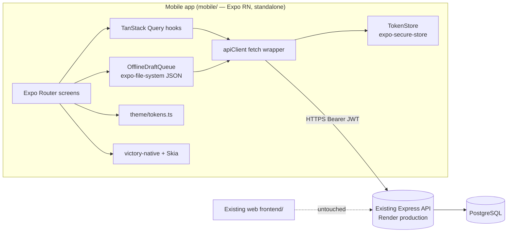
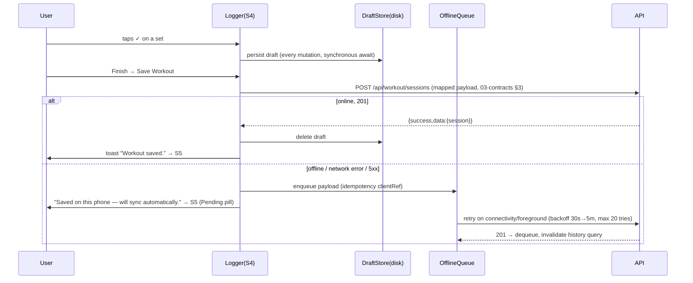

# 01 — Architecture

## System overview



Principles:
- The mobile app is a pure API consumer. Zero backend changes (except read-only contract tests).
- State: TanStack Query for server state; no Redux. Local component state otherwise.
- Every network call goes through ONE `apiClient`; every token read/write through ONE `TokenStore`.
- Offline: the logger writes every logged set to a disk draft immediately; save failures enqueue;
  queue flushes on app-foreground + connectivity regain (NetInfo listener).

## Navigation tree (Expo Router)

```
app/
  _layout.tsx            root: fonts, QueryClientProvider, AuthGate
  (auth)/login.tsx       S1
  (app)/_layout.tsx      tab bar: Home | Log | Progress
    index.tsx            S2 Home
    workout/current.tsx  S3 Overview
    workout/logger.tsx   S4 Logger (+S4b sheet)
    workout/history.tsx  S5 History (the "Log" tab)
    progress.tsx         S6 Progress
```

AuthGate: on launch → `TokenStore.getAccessToken()` → if present, fire `GET /api/auth/me`;
valid → `(app)`, invalid/absent → try refresh once, then `(auth)/login`.

## Auth sequence

```mermaid
sequenceDiagram
  participant App
  participant SS as SecureStore
  participant API
  App->>API: POST /api/auth/login {username,password}
  API-->>App: 200 {success,user,token,refreshToken}
  App->>SS: save access + refresh tokens
  App->>API: GET /api/auth/me (Authorization: Bearer)
  API-->>App: 200 {success,user}
  Note over App,API: on any 401 → single-flight POST /api/auth/refresh-token,<br/>replay original request once; refresh fails → logout to S1
```

## Workout save + offline sequence



Idempotency: each queued save carries a `clientRef` UUID inside `notes` metadata is NOT acceptable —
instead the queue dedupes locally (one queue entry per draft id) and never enqueues the same draft
twice. Server-side idempotency is out of scope for v1 (documented residual risk: a retry after a
timeout where the server actually persisted can duplicate a session; acceptance test AC-2.4.3
covers the client-side dedupe).

## Data flow: Progress chart

`GET /api/workouts/:userId/history?limit=100` → `chartSpecs/volumeOverTime.ts` pure transformer
(sessions[] → `{x: Date, y: totalWeight}[]`, filtered to range 4/8/12 weeks, zero-fill weeks) →
victory-native `CartesianChart`. Transformer is a pure function with its own unit tests — this is
the seed of the future shared chart-spec layer.

## Touched backend surfaces (READ-ONLY truth, harvested 2026-07-13)

- Mount order in `backend/core/routes.mjs`: `/api/workout` (line 347) is mounted BEFORE
  `/api/workout/sessions` (line 348), so GET/POST `/api/workout/sessions` are served by
  `workoutController` via `workoutRoutes` — the dedicated `workoutSessionRoutes` Zod schema is
  SHADOWED dead code for those verbs. Contracts in 03-contracts reflect the REAL handler
  (`workoutController.createWorkoutSession`, field whitelist), not the dead schema.
- Sub-paths `/start`, `/:id/end`, `/statistics/:userId` fall through to `workoutSessionRoutes`.
  v1 does NOT call them.
- `WorkoutSession` model (`backend/models/WorkoutSession.mjs`, table `workout_sessions`) has NO
  `exercises` column — exercise detail persists via associated logs. v1 sends the whitelisted
  fields incl. `exercises` (service-handled) but the HISTORY UI renders only session-level fields
  (title, date/completedAt, duration, totalWeight/totalReps/totalSets, status) — never assume
  per-exercise data comes back on the session list.

## Repo placement & isolation

- Branch: `codex/native-mobile-<date>` from `origin/main`, isolated worktree.
- `mobile/` standalone (own package.json/lockfile). Root `.gitignore` gains `mobile/.env*`,
  `mobile/.expo/`, `mobile/android/`, `mobile/ios/` (prebuild output; EAS builds remotely).
- CI/type-check: `cd mobile && npx tsc --noEmit` and `npx jest` are the Tier-A gates.
