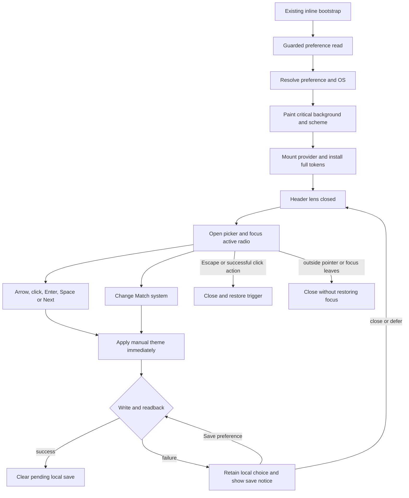
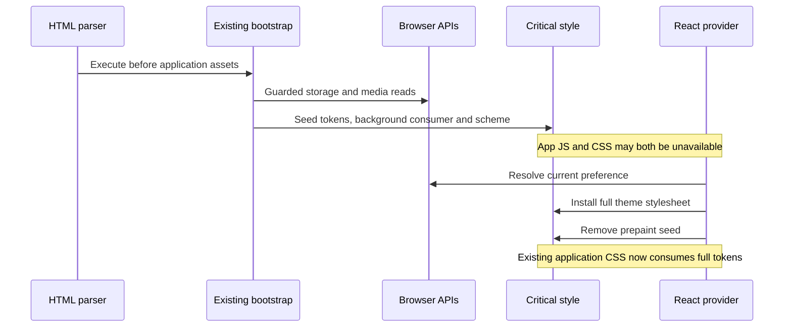
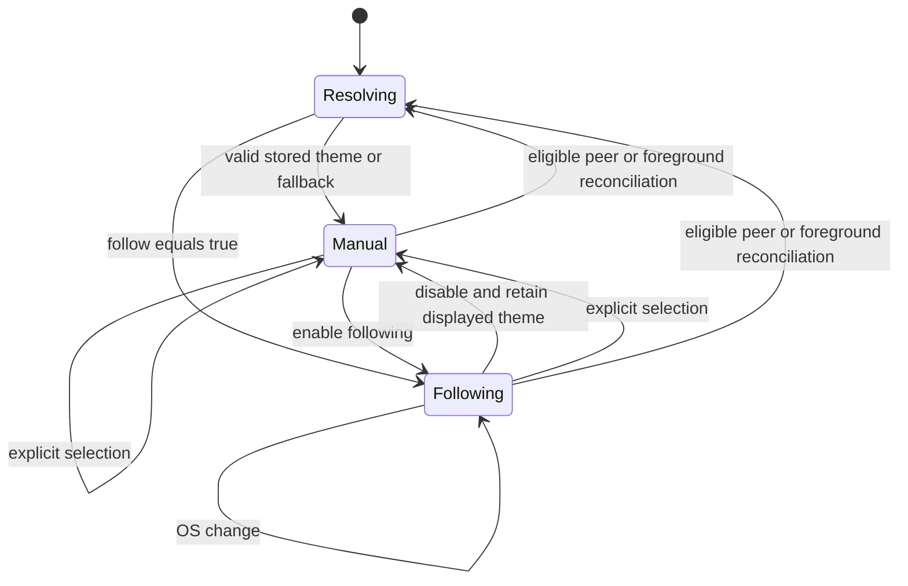
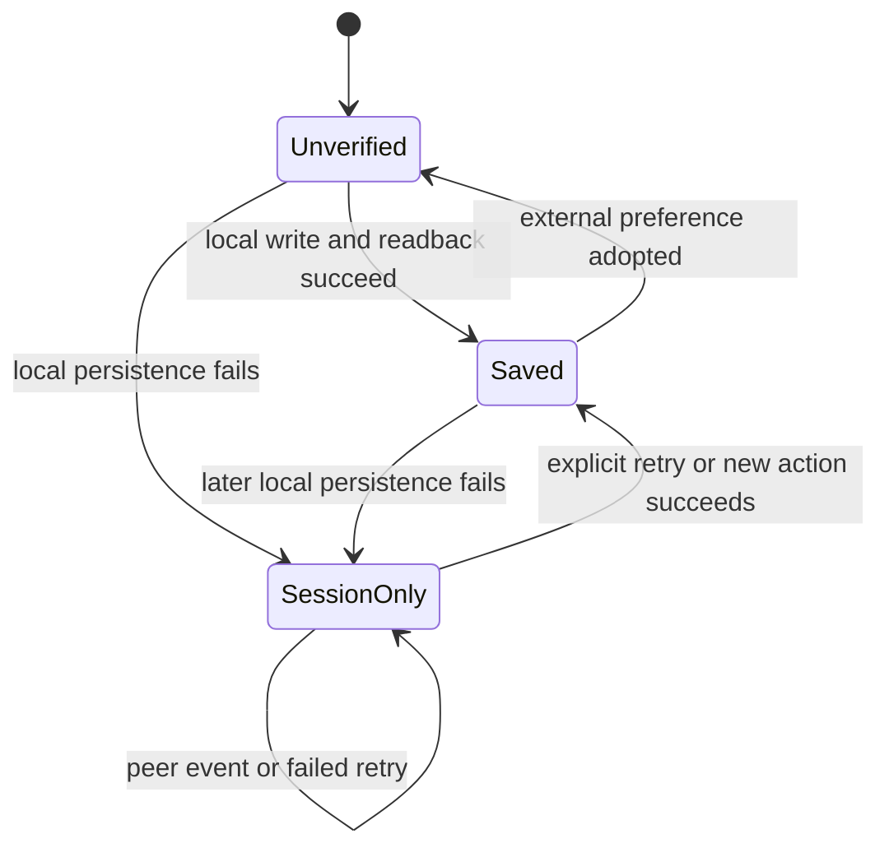
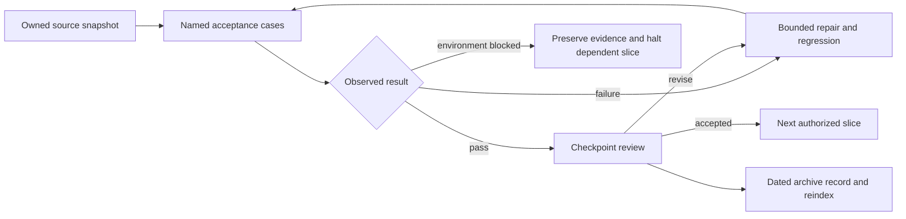

**[VERIFIED] Canonical source path**

| Layer | Mounted evidence |
|---|---|
| React root | `frontend/src/main.jsx:69` |
| Theme provider and dark default | `frontend/src/App.tsx:245` |
| Router construction | `frontend/src/App.tsx:109` |
| Layout JSX | `frontend/src/routes/main-routes.tsx:308` |
| Header JSX | `frontend/src/components/Layout/layout.tsx:69` |
| Header actions JSX | `frontend/src/components/Header/header.tsx:193` |
| Lens JSX | `frontend/src/components/Header/components/ActionIcons.tsx:243` |
| Picker JSX | `L/UniversalThemeToggle.tsx:121–130` |

This is source reachability, not live-browser proof.

Frontend HTTP endpoint, backend handler and database fields: **N/A — preference is browser-local; this scope introduces no HTTP or database interaction.**

**[PLAN] Ownership**

- `themePalettes.ts`: existing registry authority.
- `themePreferenceSnapshot.ts`: guarded read outcome and pure resolution.
- `themeStorageWrites.ts`: exact operation writes and readback.
- `useThemePreference.ts`: current preference, pending local intent and persistence status.
- `useSystemColorScheme.ts`: OS observation, independent of follow mode.
- `useCrossTabThemeSync.ts`: event filtering and reconciliation triggers.
- `useUniversalTheme.ts`: context type and consumer hooks.
- `UniversalThemeContext.tsx`: preference composition, CSS injection and styled-theme bridge.
- `UniversalThemeToggle.tsx`: open state and close policy.
- Button/popover: presentation and input semantics.
- Contrast apparatus: explicit state/paint ownership plus rendered checks.
- Optional preview: decorative lifecycle only.

**User and preference flow**



“Successful click action” means a valid selection, regardless of persistence outcome; a failed save is announced and remains visible on reopening.

**Storage and OS APIs**

```mermaid
sequenceDiagram
    participant U as User
    participant P as Preference owner
    participant S as localStorage
    participant T as Peer tab
    participant O as matchMedia
    U->>P: Select theme or change following
    P->>P: Apply complete in-memory preference
    P->>S: Perform operation-specific writes
    P->>S: Read back required values
    alt required values match
        P->>P: saved; clear pending local intent
    else write/read failure or mismatch
        P->>P: session-only; retain pending local intent
    end
    S-->>T: Relevant storage event
    T->>S: Guarded fresh snapshot
    alt readable and no pending local intent
        T->>T: Resolve and apply both fields; no write
    else unavailable or local save pending
        T->>T: Retain current preference
    end
    O-->>P: Scheme change
    P->>P: Update OS label
    opt following enabled
        P->>P: Apply OS theme; do not persist
    end
```

**Bootstrap handoff**



**Preference and persistence states**





**Optional decoration API/lifecycle**

```mermaid
sequenceDiagram
    participant P as Picker
    participant G as Eligibility policy
    participant M as Lazy scene module
    participant W as WebGL scene
    P->>P: Render static wing immediately
    P->>G: Check flag, device, motion, visibility and canvases
    alt ineligible
        G-->>P: Keep static
    else eligible
        P->>M: Import with generation and deadline
        alt late, rejected or cancelled
            M-->>P: Keep static; do not create scene
        else still eligible
            M->>W: Create bounded scene
            W->>W: Render one settle, then stop
            P->>W: Dispose on close, denial or context loss
        end
    end
```

**Evidence flow**



`erDiagram`: **N/A — no relational tables, columns, foreign keys or schema changes.** Browser storage keys and value types are specified in §03.

Permissions: authenticated and unauthenticated users have the same local preference actions. Storage denial changes persistence capability, not access to theme selection. No PII, telemetry, account identifier or external asset is added.

Mermaid source is supplied; rendered previews were not verified.
