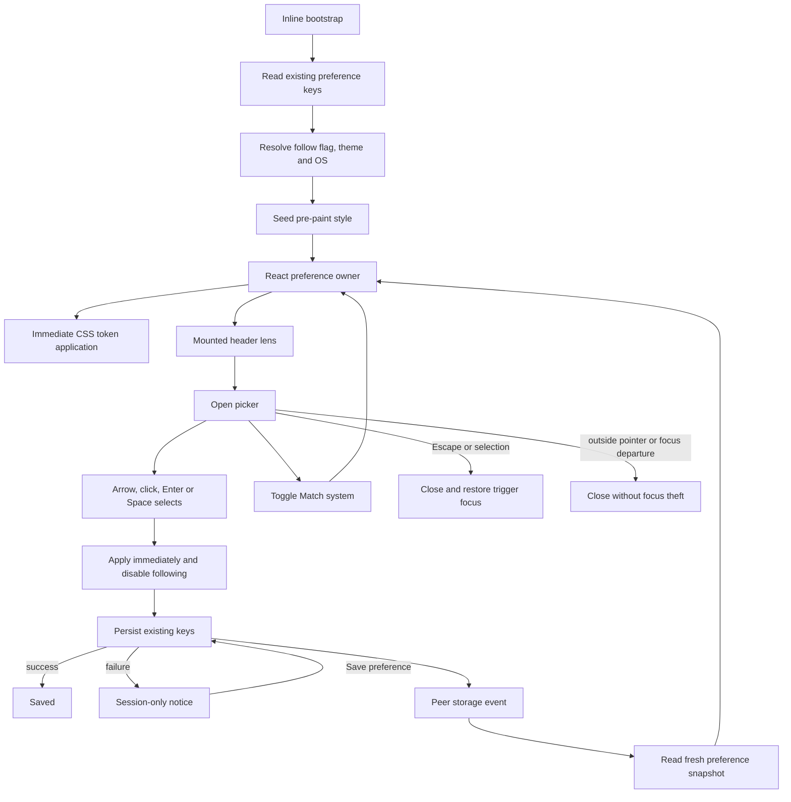
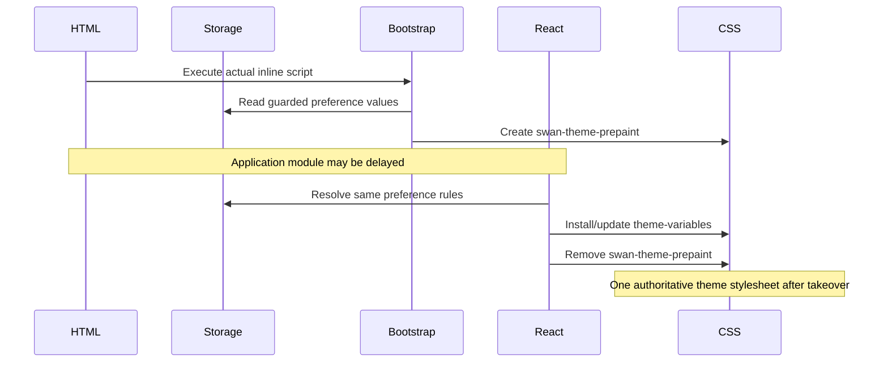
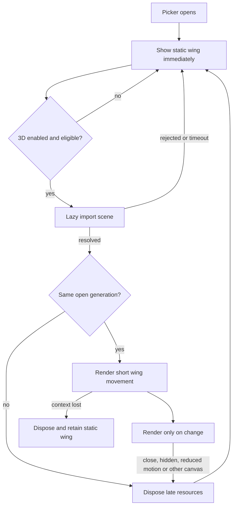

# Astra Reply — subscription transport — 2026-09-20T04:03:19.151Z

**Provider:** openai-codex
**Billing:** chatgpt-subscription
**Authentication:** chatgpt_subscription
**Transport:** codex-cli
**Requested model:** gpt-6-astra
**Served model:** NOT OBSERVABLE on codex-cli (see SERVED_MODEL_UNVERIFIABLE_NOTE)
**Tokens:** in=1735204 out=18826 reasoning=3445
**Packet:** `frontend/tmp/theme-lens-harness/ASTRA-REQUEST-THEME-LENS-R5.md`
**Wall:** 654.7s
**Mega Blueprint:** ARMED (document)

> Marginal cost $0 — this leg rides the ChatGPT subscription, not OpenRouter.

---
Mega Blueprints. I’ll read the packet, applicable forge instructions, prior reviews, and theme-lens sources, then produce the review and updated planning package. This session is read-only, so filing the review to `Z:\HostileReviews` may remain blocked.

The checkout matches the packet’s commit and 1,154 dirty-file count. The archive query found no matching review, but warned that its index is stale. I’m using the `fable-blueprint-forge` and `non-vibe-coding` skills; next I’m checking the actual guards and mounted header path.

Two gaps are clear from the source: “Match system (dark/light)” stops tracking the OS while the switch is off, and the contrast instrument checks declared background recipes without verifying that those recipes still match the CSS. I also found an existing inline pre-paint bootstrap, so the plan will strengthen that path rather than add a second one.

The cross-tab documentation still overstates what the tests prove. Both keys are written before the test delivers either event; that does not prove the writes form an atomic transaction across browser tabs. The listener also mixes historical event values with fresh storage reads. I’m making convergence tests a prerequisite to visual enhancements.

For this bounded control, GSAP and R3F have no measured benefit yet. The package will use existing Framer Motion and make a small raw-Three.js accent conditional on bundle, accessibility, and runtime-cost gates.

The installed versions differ from the packet’s dependency ranges: React is **18.3.1**, Framer Motion **10.18.0**, and styled-components **6.1.19**. React remains on major 18, so the R3F compatibility conclusion is unchanged.

The package is now being finalized with explicit file permissions per slice, tests that exercise the mounted header, and a static fallback for every decorative effect. Tests and builds were not rerun; their reported green results remain historical evidence.

## PART A — HOSTILE REVIEW

**Advisory verdict: REVISE. Archive status: BLOCKED; this is an unfiled, partial review—not a completed Rule 86 record.**

[VERIFIED] Checkout: `creator-brains-engine-r2-20260915`, commit `fe388691fbfbcd9a23eba380c929ce1e10c9d736`, with **1,154 dirty entries**. The theme lane includes untracked files, so the commit alone does not identify the reviewed implementation.

[VERIFIED] Packet SHA-256: `47785B1A2E7DDB9867059585F4CBFFDDD077C4EC6E327A79D4A145238C50F8FE`.

Evidence notation throughout:

- **[VERIFIED]** — inspected source, filesystem result, or cited primary documentation; runtime verification is stated separately.
- **[LIKELY]** — inference from inspected evidence.
- **[HYPOTHESIS]** — requires a reproducer.
- **[UNKNOWN]** — not established.
- **[PLAN]** — proposed contract, not an implementation claim.

Paths beginning `L/` mean `frontend/src/context/ThemeContext/`.

**A1 — Existing blueprints, implementation and guards**

**A1-01 · HIGH — The replacement cross-tab mechanism claim still exceeds its evidence.**

[VERIFIED] `L/themeStorageWrites.ts:20–30` and `L/useCrossTabThemeSync.ts:33–40` assert both writes have landed before any peer listener executes. `L/themeCrossTab.test.tsx:214–243` arranges exactly that condition before dispatching synthetic events. It proves the arranged case, not atomicity across browser contexts.

[VERIFIED] The HTML standard explicitly cautions against assuming locking across agent clusters. Queued storage events do not turn two writes into one transaction. [HTML Web Storage specification](https://html.spec.whatwg.org/multipage/webstorage.html#introduction).

[VERIFIED] The listener also combines historical `event.newValue` at `L/useCrossTabThemeSync.ts:82,88` with a fresh theme read at line 98. A delayed follow-system event can therefore override a newer local choice.

**Fix:** preserve the existing keys but define **eventual reconciliation**, not transactional semantics. For either relevant event, read both current values and resolve them together. Filter `storageArea`; handle `key === null`; reconcile on foreground return. Test stale event payloads, interleaved writes, deletion and partial write failure. Concurrent writers may produce a mixed final pair; do not promise preservation of the last human intention.

**A1-02 · MEDIUM — The displayed OS preference becomes stale while following is disabled.**

[VERIFIED] `L/UniversalThemeContext.tsx:87` promises the current OS preference independently of the active theme. Its observer exits when following is disabled at line 129. `L/ThemeLensPopover.tsx:190` nevertheless displays that value.

**Reproducer:** disable Match system, change the OS colour scheme, reopen the picker.  
[LIKELY] The label retains the earlier OS value until following is enabled.

**Fix:** observe OS preference independently; apply OS changes to the active theme only when following is enabled. Extract this logic before extending the 290-line provider.

**A1-03 · HIGH — Contrast measurements remain vulnerable to background and inventory drift.**

[VERIFIED] The instrument extracts foreground declarations, but background recipes remain hand-entered: `L/themeContrastInstrument.ts:147–152,184–245`. The actual corresponding washes live separately at `L/ThemeLensPopover.styles.ts:111–116,133,161–164`.

Changing a wash percentage without changing a foreground token does not invalidate the token-set comparison at `L/themeContrast.test.ts:140–158`.

[VERIFIED] The stylesheet inventory is also a literal array at `L/themeContrastInstrument.ts:155–159`; component discovery iterates that array at lines 171–180. A newly imported stylesheet can remain outside that discovery.

[VERIFIED] Real-content backdrop uncertainty is already disclosed at `L/themeContrast.test.ts:38–40`. That settled limitation is not a newly discovered contrast failure.

**Fix:** retain the instrument, add background-recipe assertions and stylesheet-inventory closure, and test adversarial changes in memory. Make the panel’s backing opaque through existing tokens. Add browser checks for computed backgrounds, focus indicators, selected marks and switch states. An unsupported colour expression must fail measurement explicitly.

**A1-04 · MEDIUM — The pre-paint suite does not execute the bootstrap’s decision branches.**

[VERIFIED] `L/themePrePaint.test.ts:32–105` checks source strings and background-map parity. Its behavioural section at lines 128–164 creates a substitute seed and runs the injector; it does not execute the actual inline resolver.

[VERIFIED] The real bootstrap already exists at `frontend/index.html:94–219`. Its follow-system branch starts at line 156. The application uses `createRoot`, not hydration, at `frontend/src/main.jsx:69`.

**Fix:** execute the actual bootstrap in a controlled DOM for the storage/OS matrix, then test delayed application loading in a browser. Keep the claim bounded to page background, colour scheme and browser chrome before React. No SSR or hydration work is justified here.

**A1-05 · MEDIUM — Component tests can pass without applying or persisting a theme.**

[VERIFIED] `L/ThemeLensPopover.test.tsx:25–43` supplies mocked `onSelect`, `onPreview`, `onClose` and `onCycle` callbacks, while passing a fixed `activeTheme`.

Those tests establish component interactions. They do not establish the mounted chain:

`radio → toggle → provider → CSS variables → storage → peer tab`.

**Fix:** retain component tests and add integration tests through `UniversalThemeToggle`, plus real two-page browser tests. Assert checked state, computed variables, stored values and reload outcome together.

**A1-06 · MEDIUM — Dependency and verification receipts conflate declared ranges with installed versions.**

[VERIFIED] Installed values differ from the packet:

| Dependency | Declared range | Installed value |
|---|---:|---:|
| React | `^18.2.0` | **18.3.1** |
| Framer Motion | `^10.16.5` | **10.18.0** |
| styled-components | `^6.1.6` | **6.1.19** |
| Three.js | `^0.169.0` | **0.169.0** |

Evidence: `frontend/package.json:47,55,72`; corresponding `node_modules/*/package.json` version fields, including React line 7.

[VERIFIED] `frontend/tmp/tsconfig.themelens-lane-only.json` includes the theme context and theme utilities, not the mounted Header subtree as an explicit target.

**Fix:** record declared, locked and installed versions separately. Keep lane type-check evidence distinct from application type-check and mounted-header evidence. React remains major 18; R3F 8 is its documented compatible major. [R3F installation guidance](https://r3f.docs.pmnd.rs/getting-started/introduction).

**A1-07 · MEDIUM — The packet leaves conflicting scope instructions for a builder to resolve.**

[VERIFIED] Packet §4 calls six colours a “closed token set,” while §2 requires preserving 28 registered themes. It also introduces a transcript-engine/console boundary into a header-theme task without defining a console deliverable.

**Fix:** preserve all registered palette values and the existing emitted-token contract. Apply the six named colours to fallback/brand treatment, not as permission to recolour all themes. Explicitly exclude the entire transcript engine and any console enhancement. This package touches the application header lens only.

**Guard disposition**

[VERIFIED] Twelve lane test files exist. Their reported **114 green tests were not rerun**.

| Guard | Retain its purpose | What it does not establish |
|---|---|---|
| `themeTokens.test.ts` | Token completeness and name parity | Browser cascade, contrast, paint |
| `themeTextTokenGaps.test.ts` | Exact debt ledgers | Accessibility compliance of affected consumers |
| `themeContrast.test.ts` | Declared-site contrast | Background-recipe or rendered-state completeness |
| `themePaletteIntegrity.test.ts` | Palette partition/order/coercion constraints | Product quality or exhaustive runtime validation |
| `themePrePaint.test.ts` | Map parity and injector takeover | Actual bootstrap branch execution |
| `themeSwatch.test.ts` | Palette-derived swatches and sampled contrast | Every pixel under a gradient glyph |
| `themePersistence.test.ts` | Resolver/storage helper behaviour | Multi-context convergence |
| `themeCrossTab.test.tsx` | Arranged writer/listener cases | Browser concurrency or atomicity |
| `themeRule4.test.ts` | Recursive lane line cap | Maintainability or runtime correctness |
| `UniversalThemeContext.themeCycle.test.ts` | Registry reachability and metadata | Mounted keyboard journey |
| `ThemeLensPopover.test.tsx` | Semantics and callback interactions | Actual application/persistence through callbacks |
| `ThemeLensButton.test.tsx` | Trigger accessibility contract | Real header positioning and occlusion |

**Over-guarding assessment:** retain exact palette order, ledger membership and the line cap. They protect explicit contracts. Do not add another prose/source-string assertion where execution can establish the property. Dormant exemption checks must not be counted as active product coverage.

**A2 — One hostile pass over the draft package**

These findings changed the emitted package:

| Draft defect | Concrete correction incorporated below |
|---|---|
| A storage rewrite was described as guaranteeing the latest user intention. | Contracts now promise convergence to the final readable pair only; concurrent-intent ordering remains explicitly unsupported. |
| A decorative preview could introduce another active renderer beside existing page graphics. | Enhancement defaults off; any other page canvas forces the static treatment. No renderer is required for selection. |
| A renderer import could finish after the picker closed and mount orphaned work. | Generation-based cancellation, late-result disposal and no state update after unmount are mandatory. |
| “Use Playwright” silently inherited a configuration that starts the backend. | Dedicated frontend-only configuration, loopback origin, blocked API traffic and no backend server. |
| Visual changes were permitted without permitting their contrast-site updates. | Each slice now names styles, instrument, tests and mounting files together. |
| Storage failure copy required a provider state that the file list did not create. | Persistence status and retry contracts are included in the extracted preference hook and provider surface. |
| A global theme-colour tween could create unreadable intermediate frames. | Theme tokens switch immediately; motion affects only decorative geometry and panel presentation. |

**Not proven / unopened**

[UNKNOWN] Current test results, complete application type-check, production build, browser interaction, screenshots, GPU timings, incremental bundle sizes, live CSP and deployed behaviour.

Only portions of historical HY4 review documents were inspected; their complete contents and every historical disposition were not re-reviewed. No separate complete existing nine-document blueprint was supplied in the packet or established as canonical during the bounded lookup.

The archive query returned no match and warned of a stale index. Neither reindexing nor filing was possible under this session’s read-only filesystem. No source, dependency, instruction file, index or review archive was changed.

## PART B — FORGED PACKAGE

### 00-README.md

**Artifact:** Swan Theme Lens R5 enhancement package  
**Version/date:** R5.1 / 2026-09-19  
**Owner:** Sean; implementation owner assigned at execution  
**Status:** [PLAN] Reviewable proposal; **not implementation-ready**  
**Supersession:** revises the R5 request’s proposed direction; preserves all historical packets and findings.

**Outcome**

Make the existing header theme selector more dependable and visually distinctive while preserving immediate selection, all registered themes, keyboard access and first-paint correctness.

**Requirements and acceptance**

| ID | Requirement | Acceptance |
|---|---|---|
| R1 | Preserve theme compatibility | Same theme IDs/order, palette values and 130-token name contract |
| R2 | Truthful preference state | OS label updates independently; displayed/stored states obey §03 |
| R3 | Honest cross-tab behaviour | Fresh-snapshot convergence; stale events cannot restore obsolete payloads |
| R4 | Predictable keyboard interaction | Actual mounted trigger, picker, system switch and cycle control remain reachable |
| R5 | Checkable contrast | Text ≥4.5:1; essential non-text/focus indicators ≥3:1 on specified surfaces |
| R6 | Correct pre-React presentation | Real bootstrap and provider resolve the same preference matrix |
| R7 | Distinctive bounded motion | Static treatment always works; decorative motion satisfies §03 budgets |
| R8 | Scoped delivery | No engine/backend/production changes; every changed file ≤300 lines |

**Ranked delivery**

1. Preference correctness and evidence repair.
2. Contrast certainty and mounted accessibility.
3. Existing-library visual refinement.
4. Optional Three.js accent after measured admission.

**Builder contract**

Build one approved slice at a time. Preserve the dirty baseline and existing review history. Follow decided contracts; escalate consequential omissions. Report actual command results and stop at each checkpoint. This package authorizes no implementation in the present review-only task.

**Preservation**

Before future edits, capture the exact dirty lane, relevant bootstrap/header files, package manifests and existing review packets into the established project snapshot mechanism. Record SHA-256 hashes and verify the snapshot. Preserve the original packet hash stated in Part A.

No snapshot or readiness-check execution is claimed here.

### 01-architecture.md

**[VERIFIED] Canonical source mount**

| Layer | Evidence |
|---|---|
| Provider | `frontend/src/App.tsx:245` |
| Router construction | `frontend/src/App.tsx:109` |
| Layout JSX | `frontend/src/routes/main-routes.tsx:308` |
| Header JSX | `frontend/src/components/Layout/layout.tsx:69` |
| Action icons JSX | `frontend/src/components/Header/header.tsx:193` |
| Lens JSX | `frontend/src/components/Header/components/ActionIcons.tsx:243` |
| Picker JSX | `L/UniversalThemeToggle.tsx:121` |
| Preference consumer | `L/UniversalThemeToggle.tsx:58` |

This establishes source reachability, not a live-browser receipt.

Frontend API, backend handler and authoritative database model: **N/A — theme preference is browser-local and this scope introduces no HTTP endpoint or database access.**

**[PLAN] Ownership**

- `UniversalThemeContext.tsx`: context, styled-theme bridge and compatibility exports.
- `useThemePreference.ts`: current theme, follow flag, persistence status and public actions.
- `useSystemColorScheme.ts`: independent OS observation.
- `themePreferenceSnapshot.ts`: pure resolution plus explicit read outcomes.
- `themeStorageWrites.ts`: bounded writes and persistence result.
- `useCrossTabThemeSync.ts`: event filtering and reconciliation triggers.
- `UniversalThemeToggle.tsx`: open/close state and focus restoration.
- `ThemeLensPopover.tsx`: accessible controls and status.
- `ThemeLensPreview.tsx`: decorative fallback and optional renderer lifecycle.
- `themeLensScene.ts`: isolated, disposable Three.js scene.
- Existing contrast instrument plus new recipe checks: measurement authority.

**User and data flow**



**Browser storage and media APIs**

```mermaid
sequenceDiagram
    participant User
    participant Preference
    participant Storage as localStorage
    participant Peer
    participant OS as matchMedia
    User->>Preference: Select theme
    Preference->>Preference: Apply theme; follow=false
    Preference->>Storage: Write theme and follow keys
    alt write/readback succeeds
        Preference->>Preference: status=saved
    else exception or mismatched readback
        Preference->>Preference: retain local choice; status=session-only
    end
    Storage-->>Peer: storage event
    Peer->>Storage: Read current theme and follow keys
    Peer->>Peer: Resolve fresh values; never echo-write
    OS-->>Preference: scheme changed
    Preference->>Preference: Update OS label
    opt follow=true
        Preference->>Preference: Apply current system theme
    end
```

**Pre-paint handoff**



**Decoration lifecycle**



**Preference state machine**

```mermaid
stateDiagram-v2
    [*] --> Resolving
    Resolving --> Manual: valid stored theme or dark default
    Resolving --> Following: follow flag is true
    Manual --> Manual: explicit selection
    Manual --> Following: enable Match system
    Following --> Following: OS scheme changes
    Following --> Manual: disable; retain displayed theme
    Following --> Manual: explicit selection
    Manual --> Resolving: relevant external change or foreground return
    Following --> Resolving: relevant external change or foreground return
```



Persistence status is orthogonal: `unknown → saved | session-only`; a retry repeats only the current desired preference.

**Relational diagram**

`erDiagram`: **N/A — no relational tables, columns, foreign keys or schema migration.** Exact browser storage fields are documented in §03.

**Privacy boundary**

Theme IDs and a boolean remain in same-origin browser storage. No new telemetry, account identifier, server persistence or external asset request.

**“Pre-JS” resolution**

[PLAN] Optimized for the **Three.js** interpretation through a bounded optional accent. The pre-paint interpretation is also addressed through stronger testing of the existing bootstrap. Resolving a saved preference requires script execution; “before any JavaScript” and “before the first byte” are not promised.

Mermaid source is supplied; rendered previews were not produced in this read-only pass.

### 02-wireframes.md

**[PLAN] Direction: Faceted Wing**

Preserve the compact picker. Add a small wing specimen and a clear current-theme label; keep the grid dominant. The signature moment is a brief geometric settling movement, never a moving text background.

Alternative **Quiet Chrome** uses the identical layout with static geometry only. It is the mandatory fallback and the initial delivery. A separate full-screen theme gallery is excluded.

**Exact token consumption**

| Role | Token and fallback |
|---|---|
| Opaque base | `var(--bg-primary, #0A0A0F)` |
| Elevated overlay | `var(--bg-elevated, #002060)` |
| Primary text | `var(--text-primary, #E0ECF4)` |
| Secondary text | `var(--text-secondary, #E0ECF4)` |
| Accent | `var(--accent-primary, #60C0F0)` |
| Secondary decorative accent | `var(--accent-secondary, #8B5CF6)` |
| Border | `var(--border-strong, #C6A84B)` |

Existing registered values win over fallbacks. No new palette tokens or global palette edits.

Panel backing: elevated overlay composited over an **opaque primary base**. Text never sits over the wing canvas.

**Desktop — open, manual**

```text
[Logo]                [Theme lens] [Cart] [...]

                      ┌─────────────────────────────┐
                      │ 28 themes            [Next] │
                      │ [wing] Current: {themeName} │
                      │ Match system (dark)   [OFF] │
                      │ Changes apply immediately. │
                      │                             │
                      │ [name] [name] [name] [name] │
                      │ [name] [name] [name] [name] │
                      │ ...all registered themes...│
                      │                             │
                      │ {persistence status slot}   │
                      └─────────────────────────────┘
```

Panel maximum width **420px**; minimum viewport gutter **12px**. The wireframe’s rows are illustrative: CSS retains `auto-fill` with the existing 66px option floor. Keyboard navigation reads the actual rendered column count.

**375px mobile — open**

```text
┌─────────────────────────────────────┐
│ [Logo]            [Lens] [Cart] [...]│
│ ┌─────────────────────────────────┐ │
│ │ 28 themes                [Next] │ │
│ │ [wing] Current: {themeName}     │ │
│ │ Match system (dark)      [OFF] │ │
│ │ Changes apply immediately.    │ │
│ │                               │ │
│ │ [name] [name] [name] [name]    │ │
│ │ [name] [name] [name] [name]    │ │
│ │ ...scroll to remaining themes │ │
│ │ {persistence status slot}      │ │
│ └─────────────────────────────────┘ │
└─────────────────────────────────────┘
```

Mobile gutters **8px**; safe-area-aware bottom clearance. Preserve existing positioning initially; browser tests must prove it remains within the visual viewport under the real transformed header. If that fails, positioning requires a separately reviewed amendment—not an improvised portal.

**Exact copy and state variants**

`{themeName}` is exactly `themes[currentTheme].name`; option names remain the registry names and existing accessible descriptions. `{count}` is `themeCycle.length`, currently 28.

| State | Desktop and mobile presentation |
|---|---|
| Closed | Existing 44px-or-larger trigger; accessible name `Theme: {themeName}. Activate to choose a theme.` |
| Tooltip | Existing theme description on opaque primary background; hidden while picker is open |
| Manual | `Current: {themeName}`; `Match system (dark)` or `Match system (light)`; switch off |
| Following | Same structure; switch on; current theme follows OS |
| Selection | Immediate checked mark and current-theme update; no loading spinner |
| Persistence success | Status slot empty; do not repeatedly announce “saved” |
| Persistence failure | `Theme applied for this session. Your preference could not be saved.` followed by `[Save preference]` |
| Retry succeeds | Clear failure notice; polite announcement `Theme preference saved.` |
| Retry fails | Retain the same notice and button |
| 3D loading | Static wing remains visible in reserved space |
| 3D unavailable/fails | Same static wing; no technical error shown to the user |
| Reduced motion | Static wing; no geometric, scale, translation or colour animation |
| External theme update | Checked state/current label update; focus stays on the user’s current control |

Empty/search/no-results states: **N/A — registry is synchronous, non-empty and unfiltered.** Registry corruption fails validation; do not invent a runtime theme-fetch workflow.

Authentication-denied state: **N/A — this preference control has no authentication requirement.** Storage denial uses the session-only state above.

**Interaction contract**

- Every interactive target is at least **44×44 CSS px**.
- Arrows apply and persist immediately while leaving the picker open.
- Enter/Space/click apply and close.
- Escape closes and restores trigger focus.
- Preserve existing forward-Tab and Shift+Tab behaviour; test the complete real sequence.
- Outside pointer dismissal must not restore focus.
- External updates never steal focus.
- Selection remains identifiable by checked semantics and a check mark, not colour alone.
- No new hover-only control; no focusable canvas.
- At 200% zoom and all mandated widths, labels wrap without obscuring controls.

### 03-contracts.md

**[PLAN] Public compatibility**

Preserve existing exports, theme IDs, ordering, storage keys and `UniversalThemeToggleProps`.

Retain the current context fields. Add only:

| Field | Type | Meaning |
|---|---|---|
| `persistenceStatus` | `'unknown' \| 'saved' \| 'session-only'` | Outcome of the latest local persistence attempt |
| `retryThemePersistence` | `() => void` | Retry current desired preference once |

No storage write occurs merely because a peer update was received.

**New module contracts**

| Export | Signature / result |
|---|---|
| `useSystemColorScheme` | `(): boolean` — current dark preference; guarded dark fallback |
| `readThemePreferenceSnapshot` | `(): { kind: 'readable'; themeId: ThemeId \| null; followSystem: boolean } \| { kind: 'unavailable' }` |
| `resolveThemePreference` | `(snapshot, systemDark: boolean, fallback: ThemeId): { themeId: ThemeId; followSystem: boolean }` |
| `useThemePreference` | `(defaultTheme: ThemeId):` existing preference fields/actions plus persistence fields above |
| `writeThemePreference` | `(themeId: ThemeId, followSystem: boolean): { status: 'saved' \| 'session-only' }` |
| `ThemeLensPreview` | Props: `{ themeId: ThemeId; enabled: boolean }`; decorative only |
| `createThemeLensScene` | `(canvas, colors, size): { updateColors(colors): void; resize(size): void; play(): void; dispose(): void }` |

`colors` contains validated resolved strings for primary/secondary accent and opaque background. `size` contains CSS width, CSS height and bounded pixel ratio. All scene operations tolerate repeated disposal.

Existing writer helper signatures remain compatibility wrappers where callers require them.

**Storage**

| Key | Allowed stored value |
|---|---|
| `swanstudios-theme` | A registered `ThemeId` string |
| `swanstudios-theme-follow-system` | `'true'` or `'false'` |

Resolution:

1. Readable follow flag `'true'`: choose OS dark/light mapping.
2. Otherwise valid stored theme: choose it.
3. Otherwise choose the provider fallback; mounted application fallback remains `crystalline-dark`.
4. Read failure during boot: dark fallback.
5. Read failure during an active session: retain current in-memory preference.

Manual selection writes the chosen theme and `'false'`. Disabling following writes the displayed theme and `'false'`. Enabling following writes `'true'`; the old stored theme remains non-authoritative.

A write or required readback failure yields `session-only`; the local visual selection remains applied. No automatic retry, polling or compensating write loop.

**Cross-tab reconciliation**

- Accept only the relevant local-storage area.
- Relevant keys: either preference key, or `null` for clear.
- Ignore event payload values as state authority.
- Re-read current keys; derive both preference fields together.
- Reconcile again on foreground return.
- Never write in response to reconciliation.
- After writers become quiescent and events are processed, readable tabs resolve the same final stored pair.
- No atomic-pair guarantee; no global ordering of user intentions.
- Removal/clear resolves through the same fallback rules.

**Events**

Preserve existing `themeChanged` payload `{ themeId, theme }` and its existing explicit-selection behaviour. The new decoration consumes React context, not that event. Expanding event emission to OS/peer changes is excluded because other consumers were not audited.

**Pre-paint**

Use the existing inline script and storage keys. Give the script a stable identifier for execution tests. Keep the seeded scope limited to its current critical tokens, colour scheme and theme-colour metadata. Do not emit a second theme bootstrap or introduce SSR.

**Motion and renderer**

- Framer Motion owns panel presentation; CSS owns static styling.
- Tokens change immediately. No interpolation of global text/background tokens.
- Normal panel presentation: maximum **180ms**.
- Reduced motion: immediate presentation and static ornament.
- Optional wing: three overlapping feather facets, no text, texture, HDRI, particles, bloom or postprocessing.
- APIs: `THREE.WebGLRenderer`, `Scene`, `OrthographicCamera`, `ShapeGeometry`, `MeshBasicMaterial`, `Mesh`, `Group`, `Color`; explicit geometry/material/renderer disposal.
- Wing motion: one **240ms** settle, maximum yaw change **8°**; no idle rotation or pointer tracking.
- Maximum canvas **72×48 CSS px**, pixel ratio ≤**1.5**, ≤**128 triangles**, ≤**4 draw calls**.
- No new renderer when another page canvas exists. This deliberately conservative rule avoids guessing its renderer type.
- Disabled for reduced motion, Save-Data, known device memory below 4GB, hidden document or width below 768px.
- Import timeout **2 seconds**; retain static fallback. No automatic retry.
- A late import cannot mount into a closed or superseded picker.
- Context loss disposes the scene and leaves static mode for that page session.

**Cost admission**

[UNKNOWN] Current incremental costs are unmeasured. Packet chunk sizes are historical reports, not this review’s measurements.

[PLAN] Required budgets:

- Core lens enhancement: ≤**5 KiB gzip** added to the initial JS graph.
- Lazy scene wrapper/geometry: ≤**8 KiB gzip**, excluding an existing deduplicated Three.js chunk.
- Record total cold-transfer cost including Three.js; it must not be concealed by the incremental figure.
- No scene request before an eligible picker opening.
- No continuous animation frames once settled.
- Theme interaction p95 ≤**100ms** over 30 interactions on the recorded test machine.
- No lens-induced layout shift; no introduced task exceeding **50ms** in the measured interaction trace.

Failure leaves the 3D feature disabled.

**GSAP / R3F decision**

Do **not add either dependency** in this package.

- GSAP would buy timeline/scroll choreography absent from this control. Existing Framer Motion covers the required panel motion. `gsap.context()`, `gsap.matchMedia()` and `revert()` are suitable lifecycle tools if a later feature earns GSAP; their existence does not justify installation. [GSAP matchMedia documentation](https://gsap.com/docs/v3/GSAP/gsap.matchMedia%28%29/).
- R3F would buy declarative scene composition and renderer lifecycle integration. A three-facet scene already fits raw Three.js. If later admitted, evaluate R3F **8**, `Canvas`, demand rendering and invalidation against the raw implementation; React 19 migration is prohibited here. [R3F compatibility guidance](https://r3f.docs.pmnd.rs/getting-started/introduction).

No absent-library size estimate is presented as measured evidence.

**Migrations, environment and rollback**

Database migration: **N/A**. Storage migration: **none**.

Proposed build flag: `VITE_THEME_LENS_3D`, enabled only by exact value `'true'`, default false. It is public build configuration, not a secret.

Rollback the optional effect by rebuilding with the flag false. Roll back core changes using only the verified task-owned snapshot/diff in an isolated checkout. Preserve both existing storage keys; never clear user storage.

### 04-build-order.md

**[PLAN] File permissions and budgets**

All paths below are relative to `frontend/`; `L/` retains its earlier meaning. Budgets include comments and tests.

| Slice | Files | Responsibility / dependency | Budget each |
|---|---|---|---:|
| S0 | `playwright.theme-lens.config.ts` | Frontend-only loopback preview; no backend startup | 140 |
| S0 | `e2e/theme-lens/network.fixture.ts` | Block API and external traffic; assert no mutations | 180 |
| S0 | `e2e/theme-lens/mount.spec.ts` | Actual application-header reachability | 180 |
| S1 | `L/themePreferenceSnapshot.ts` | Read outcomes and pure resolution; imports palette/persistence definitions | 160 |
| S1 | `L/useSystemColorScheme.ts` | Independent observer and cleanup | 110 |
| S1 | `L/useThemePreference.ts` | Extract state/actions from provider | 240 |
| S1 | `L/UniversalThemeContext.tsx` | Preserve context/bridge; delegate preference ownership | 220 |
| S1 | `L/themePersistence.ts`, `L/themeStorageWrites.ts`, `L/useCrossTabThemeSync.ts` | Storage contracts and reconciliation | 180 |
| S1 | `L/themePreferenceSnapshot.test.ts`, `L/useSystemColorScheme.test.tsx`, `L/themePreference.integration.test.tsx` | New behavioural tests | 250 |
| S1 | `L/themeCrossTab.test.tsx` | Update synthetic events with actual storage-area semantics | 300 |
| S1 | `e2e/theme-lens/persistence.spec.ts` | Two real pages and reload | 260 |
| S2 | `index.html` | Stable bootstrap script identifier; only proven bootstrap repairs | 300 |
| S2 | `L/themePrePaint.test.ts`, `L/themeBootstrap.execution.test.ts` | Keep parity; execute real script | 260 |
| S2 | `e2e/theme-lens/prepaint.spec.ts` | Hold application module; verify pre-React state | 220 |
| S3 | `L/ThemeLensPopover.tsx`, `.styles.ts` | Opaque backing, current label, persistence notice | 280 |
| S3 | `L/ThemeLensSwitch.styles.ts`, `L/ThemeLensButton.styles.ts` | Focus/contrast corrections only where required | 280 |
| S3 | `L/ThemeLensStatus.tsx`, `.styles.ts` | Session-only notice and retry action | 140 |
| S3 | `L/themeContrastInstrument.ts`, `L/themeContrast.test.ts` | Extend coverage without weakening thresholds | 280 |
| S3 | `L/themeContrastRecipes.test.ts` | Background/inventory drift and mutation controls | 250 |
| S3 | `L/ThemeLensInteraction.test.tsx` | Real toggle/provider integration | 260 |
| S3 | `e2e/theme-lens/accessibility.spec.ts`, `layout.spec.ts` | Real focus, viewport, contrast receipts | 280 |
| S4 | `L/ThemeLensPreview.tsx`, `.styles.ts` | Static wing, reserved geometry, lazy admission | 200 |
| S4 | `L/themeLensScene.ts`, `L/themeLensScenePolicy.ts` | Disposable renderer and eligibility | 220 |
| S4 | `L/ThemeLensPopover.tsx` | Actual preview mount | 280 |
| S4 | `L/themeLensScenePolicy.test.ts`, `L/ThemeLensPreview.test.tsx` | Policy, cancellation and fallback | 240 |
| S4 | `e2e/theme-lens/motion.spec.ts` | Browser motion/lifecycle tests | 280 |
| S4 | `scripts/measure-theme-lens-bundle.mjs` | Baseline/candidate import-graph and gzip comparison | 220 |

If any touched existing test would exceed 300 lines, extract its new cases into a named sibling before adding them. No exemptions.

**Patterns to preserve**

[VERIFIED] Existing provider uses `useLayoutEffect` for variable injection (`L/UniversalThemeContext.tsx:123`) and keeps explicit-selection side effects outside state updaters (`:160–184`).

[VERIFIED] Existing lens components use local `MotionConfig reducedMotion="user"` boundaries (`L/ThemeLensPopover.tsx:167`).

[VERIFIED] Existing `components/SwanMark3D/swanMarkScene.ts` exposes explicit disposal and cancels pending rendering. Reuse that lifecycle pattern, not its heavier asset or scratch-buffer pipeline.

No change to `package.json`, lockfile, header mounting files, theme palettes, engine or backend is permitted by these slices. A prerequisite failure in those areas requires a scoped amendment.

### 05-slices.md

**[PLAN] S0 — Establish executable evidence**

Scope: S0 files in §04 and preservation receipt.

- Snapshot dirty source before implementation.
- Prove the built public `/` route renders `[data-theme-lens]`.
- Use a dedicated configuration; never inherit backend startup from `frontend/playwright.config.ts`.
- Block `/api/**` and external requests. If the header cannot render under that boundary, report the exact dependency instead of fabricating response data.

**Acceptance:** T0 passes; source/lock hashes and actual dependency versions recorded.  
**Reachability:** config → actual built application → existing Header → lens.  
**STOP:** no S1 until the baseline and test boundary are accepted.

**S1 — Preference correctness**

Scope: S1 files.

- Extract provider preference ownership first.
- Separate OS observation from following.
- Implement fresh-snapshot reconciliation and persistence outcomes.
- Preserve current theme application and existing event compatibility.

**Acceptance:** T1–T3 pass; existing lane regressions retain their assertions.  
**Reachability:** new hook is imported by the mounted provider; listener and writer use the same resolution contract.  
**STOP:** no S2 until stale-event, OS-label and two-page cases pass.

**S2 — Bootstrap execution**

Scope: S2 files.

- Execute the actual inline bootstrap in tests.
- Preserve existing critical-token scope and one-authority handoff.
- Change bootstrap behaviour only for a demonstrated discrepancy.

**Acceptance:** T4–T5 pass for all registered themes, invalid storage, denied storage and both OS schemes.  
**Reachability:** tests read actual `index.html`; browser test loads the built application document.  
**STOP:** no S3 until bootstrap and provider precedence agree.

**S3 — Usable visual refinement**

Scope: S3 files.

- Add opaque panel backing and current-theme copy.
- Expose persistence failure and manual retry.
- Close measurement drift gaps.
- Preserve keyboard semantics and registry order.

**Acceptance:** T6–T8 pass; all target widths and 200% zoom verified; ledgers unchanged.  
**Reachability:** popover imports status component; provider exposes its state/action; styles are included in the instrument inventory.  
**STOP:** no S4 until the static experience is accepted.

**S4 — Optional Three.js accent**

Scope: S4 files.

- Ship static wing first.
- Implement lazy renderer behind the default-off flag.
- Measure baseline/candidate costs.
- Enable only if all eligibility, lifecycle and performance gates pass.

**Acceptance:** T9–T10 pass; cost receipt supplied; no new dependency.  
**Reachability:** mounted popover → preview → eligible lazy import → scene.  
**STOP:** failure keeps the flag false; do not weaken budgets to admit it.

**Combined acceptance**

Run T0–T10 applicable to the enabled configuration, existing lane tests, lane type-check, full application type-check and build. Classify unrelated failures individually. No “complete” or “deployed” claim follows from lane-only success.

### 06-bans.md

**[PLAN]**

- No implementation, staging, commit, push or deployment during this review task.
- No transcript-engine, console, backend, account, billing or production-data changes.
- No palette recolouring, theme removal/reordering or token-count reduction.
- No widening either contrast-debt ledger or the recorded coercion set.
- No claim that two local-storage writes are atomic.
- No relying on storage-event payloads as current authority.
- No echo-writing peer events or retry loops.
- No second bootstrap, SSR migration or React-major upgrade.
- No GSAP, R3F, Drei, postprocessing or icon dependency installation.
- No global colour tween, text-on-canvas, permanent render loop or pointer tracking.
- No 3D dependency for choosing, saving or understanding a theme.
- No new MUI, Tailwind, chart library or styling system.
- No banned Galaxy colours; raw colour literals only in approved token fallbacks or existing palette definitions.
- No file above 300 lines and no line-cap exemption.
- No synthetic callback assertion presented as mounted-browser proof.
- No inherited test configuration that starts the production-connected backend.
- No claims of archive filing, tests, cost measurements or deployment without receipts.

### 07-checkpoints.md

**[PLAN] Review protocol**

At each slice boundary, provide:

1. Exact owned-file diff and source hashes.
2. Requirement/test mapping and actual results.
3. Mounted-path evidence where behaviour changed.
4. Negative-side-effect evidence.
5. Remaining unknowns and rollback boundary.
6. Reviewer verdict: `PASS`, `REVISE`, or `HALT`.

Sean’s assigned reviewer evaluates future implementation. This planning self-review is not approval of code that does not yet exist. No provider call or paid review is authorized by this package.

**Traceability**

| Requirements | Artifacts/components | Tests | Gate |
|---|---|---|---|
| R1, R8 | Registry, context compatibility, §04/06 | Existing lane suite, line cap | Every slice |
| R2, R3 | Preference hook, snapshot, writer, listener | T1–T3 | S1 |
| R6 | Actual bootstrap and injector | T4–T5 | S2 |
| R4, R5 | Picker, status, styles, instrument | T6–T8 | S3 |
| R7 | Preview, policy, scene, cost tool | T9–T10 | S4 |

**Current readiness receipt**

| Evidence | Status |
|---|---|
| Branch/commit/dirty count | VERIFIED |
| Packet hash | VERIFIED |
| Source mount chain | VERIFIED |
| Twelve test files present | VERIFIED |
| Current tests/type-check/build | NOT RUN |
| Browser/mobile/accessibility proof | NOT RUN |
| Dependency admission measurements | NOT RUN |
| Dirty-source snapshot | NOT CREATED |
| Mermaid rendering | NOT RUN |
| Structural readiness checker | NOT RUN |
| Archive filing/reindex | BLOCKED |
| Implementation/deployment | NOT AUTHORIZED / NOT PERFORMED |

**Archive completion**

A write-capable authorized seat must create a new dated record in `Z:\HostileReviews`, fill the required header and actual findings, then reindex. Use `PARTIAL` while these runtime boundaries remain unverified. Do not assign a fabricated `review_id` or mark an unfiled chat response as archived.

**Hygiene**

This pass created no files, screenshots or temporary artifacts. Future evidence belongs under the accepted package’s evidence directory; the existing `frontend/tmp/theme-lens-harness` history remains preserved.

### 09-tests.md

**[PLAN] Status:** new tests below are specified, not implemented or executed. Existing commands are runnable in a write-capable isolated checkout with installed dependencies. New-file commands become runnable in their owning slice. No test result is implied.

All commands run from `frontend/`.

**Baseline commands**

```powershell
node ./node_modules/vitest/vitest.mjs run src/context/ThemeContext
node ./node_modules/typescript/bin/tsc --noEmit --incremental false -p tmp/tsconfig.themelens-lane-only.json
npm run type-check
node ./node_modules/vite/bin/vite.js build
```

**Dedicated browser configuration contract**

`playwright.theme-lens.config.ts` must:

- Set `testDir` to `e2e/theme-lens`.
- Start only Vite preview on `127.0.0.1:4179`.
- Use that exact loopback base URL; reject overrides pointing elsewhere.
- Disable server reuse, service workers and automatic retries.
- Run Chromium initially; record browser version.
- Never start the backend.
- Save evidence only within the task-owned evidence directory.

```powershell
node ./node_modules/@playwright/test/cli.js test --config playwright.theme-lens.config.ts
```

**Named acceptance cases**

| ID | File and named cases | What the cases prove |
|---|---|---|
| T0 | `e2e/theme-lens/mount.spec.ts`: `public header mounts the real lens`; `opening exposes all registered radio options`; `theme interaction makes no API mutation` | Actual source chain is reachable in built application |
| T1 | `L/useSystemColorScheme.test.tsx`: `OS label changes while following is off`; `manual theme survives OS change`; `following applies OS change`; `observer cleans up under StrictMode` | OS truth is independent of application policy |
| T2 | `L/themePreferenceSnapshot.test.ts`: `follow overrides stored theme`; `invalid theme uses fallback`; `denied read is explicit`; `missing keys resolve dark default` | Resolver precedence and failure distinction |
| T2 | `L/themePreference.integration.test.tsx`: `manual pick applies and saves`; `turning follow off saves displayed theme`; `partial write failure remains session-only`; `retry saves current preference` | Real provider/writer integration |
| T3 | `L/themeCrossTab.test.tsx`: `stale event payload cannot overwrite fresh storage`; `sessionStorage event is ignored`; `clear reconciles fallback`; `peer reconciliation never writes` | Event filtering and current-authority contract |
| T3 | `e2e/theme-lens/persistence.spec.ts`: `two real pages converge after selection`; `interleaved writers converge to final stored pair`; `foreground return reconciles`; `reload preserves manual and system choices` | Real browser storage delivery; no atomic-intent claim |
| T4 | `L/themeBootstrap.execution.test.ts`: `actual inline resolver matches provider matrix`; `blocked storage does not abort bootstrap`; `missing matchMedia uses dark fallback` | Executed bootstrap, not string presence |
| T5 | `e2e/theme-lens/prepaint.spec.ts`: `saved background appears while application module is held`; `follow-system wins before React`; `takeover leaves one theme authority` | Pre-React presentation and real handoff |
| T6 | `L/themeContrastRecipes.test.ts`: `changed wash percentage is detected`; `new lens stylesheet is detected`; `unsupported colour expression fails measurement`; `opaque backing removes content dependence` | Instrument detects its own blind spots |
| T7 | `L/ThemeLensInteraction.test.tsx`: `arrow selection changes provider CSS and storage`; `click selects and closes`; `retry uses current preference`; `external update does not steal focus` | Actual callbacks perform the product action |
| T8 | `e2e/theme-lens/accessibility.spec.ts`: `full keyboard journey reaches switch and Next`; `outside click retains destination focus`; `focus and selected marks meet non-text contrast`; `all targets meet 44px` | Browser focus, geometry and accessibility |
| T8 | `e2e/theme-lens/layout.spec.ts`: `all themes fit the viewport matrix`; `last option remains reachable`; `200 percent zoom preserves controls`; `tooltip remains inside viewport` | Layout under actual header containment |
| T9 | `L/themeLensScenePolicy.test.ts`: `default flag disables scene`; `reduced motion and Save-Data reject scene`; `existing canvas rejects scene`; `hidden or narrow viewport rejects scene` | Admission policy |
| T9 | `L/ThemeLensPreview.test.tsx`: `static wing survives import failure`; `late import cannot mount after close`; `StrictMode leaves one owned scene`; `context loss disposes and falls back` | Lifecycle and recovery |
| T10 | `e2e/theme-lens/motion.spec.ts`: `reduced motion creates no scene`; `closed picker creates no scene request`; `settled scene stops rendering`; `repeated opening does not retain canvases`; `interaction stays within budget` | Browser execution and performance |

**Targeted commands**

```powershell
node ./node_modules/vitest/vitest.mjs run src/context/ThemeContext/useSystemColorScheme.test.tsx src/context/ThemeContext/themePreferenceSnapshot.test.ts src/context/ThemeContext/themePreference.integration.test.tsx src/context/ThemeContext/themeCrossTab.test.tsx
node ./node_modules/vitest/vitest.mjs run src/context/ThemeContext/themePrePaint.test.ts src/context/ThemeContext/themeBootstrap.execution.test.ts
node ./node_modules/vitest/vitest.mjs run src/context/ThemeContext/themeContrast.test.ts src/context/ThemeContext/themeContrastRecipes.test.ts src/context/ThemeContext/ThemeLensInteraction.test.tsx
node ./node_modules/vitest/vitest.mjs run src/context/ThemeContext/themeLensScenePolicy.test.ts src/context/ThemeContext/ThemeLensPreview.test.tsx
```

**Fixtures and measurement**

- Use generated registry fixtures from actual `themeCycle`; no duplicate theme list.
- Browser pages share one isolated context for cross-tab cases.
- Viewports: **320×740, 375×812, 414×896, 768×1024, 1024×768, 1440×900, 2560×1440, 3840×2160**.
- Verify all 28 themes across the viewport matrix; record OS scheme and motion preference.
- Contrast states: rest, selected, hover, focus, switch on/off and persistence notice.
- Negative controls modify strings/fixtures **in memory**, never leave probe files in `src`.
- Performance receipt records browser, hardware, viewport, throttling, warm/cold cache, raw samples and p95.
- Bundle tool compares isolated baseline/candidate build directories, reports changed gzip bytes and total reachable cold-import bytes. Missing baseline means **NOT MEASURED**, not zero.

**RED/GREEN discipline**

A regression must fail for its intended assertion before repair. Import failures, missing dependencies and unavailable browsers are setup blockers, not RED evidence. Preserve existing ledger membership and known limitations throughout.

## PART C — DECISION-DENSITY SELF-TEST

| Remaining builder choice | Disposition |
|---|---|
| Which application surface? | **Decided:** existing Header → ActionIcons → UniversalThemeToggle |
| Which themes and ordering? | **Decided:** preserve actual registry and order |
| What do arrows mean? | **Decided:** immediate application/persistence; picker stays open |
| Does Escape undo selection? | **Decided:** no; it closes only |
| What wins during following? | **Decided:** current OS scheme |
| Does the OS label update while following is off? | **Decided:** yes |
| What does cross-tab correctness guarantee? | **Decided:** convergence to final readable pair; no atomic-intent ordering |
| What happens on storage failure? | **Decided:** retain local state, disclose session-only outcome, manual retry |
| Is storage migrated? | **Decided:** no |
| Does `themeChanged` gain new semantics? | **Decided:** no |
| Is this an SSR/hydration project? | **Decided:** no |
| Which first-paint properties are promised? | **Decided:** existing critical bootstrap scope only |
| Which visual direction ships first? | **Decided:** static Faceted Wing/Quiet Chrome treatment |
| Are global theme colours animated? | **Decided:** no |
| Are GSAP/R3F installed? | **Decided:** no; no measured justification |
| How is Three.js admitted? | **Decided:** default-off flag plus functional, lifecycle and cost gates |
| Exact wing vertex arrangement? | **Delegated with bounds:** three feather facets, ≤128 triangles, ≤4 draw calls, reserved 72×48 area, no text or external asset |
| Can the builder change positioning architecture? | **Bounded:** only after a reproduced failure and reviewed amendment |
| How are test fixtures isolated? | **Decided:** frontend-only loopback preview, blocked API/external traffic |
| Can missing Header dependencies be repaired opportunistically? | **Decided:** no; prerequisite amendment required |
| Who selects the performance reference machine? | **Delegated with bounds:** execution owner records the available desktop and mobile/emulated profile before collecting baseline and candidate samples |
| Who approves implementation and optional visual direction? | **Explicitly retained:** Sean’s execution gate; this turn is plan-only |
| What identifies the reviewed dirty source? | **Required before execution:** verified snapshot and per-file hashes |
| What closes the review archive requirement? | **Required:** actual dated archive record and successful reindex |
| Is the package implementation-ready now? | **No:** snapshot, executable new tests, runtime evidence and archive filing remain outstanding |

The nine documents above are the proposed package. **No code was changed, no tests were reported as newly passing, and no review was filed.**
