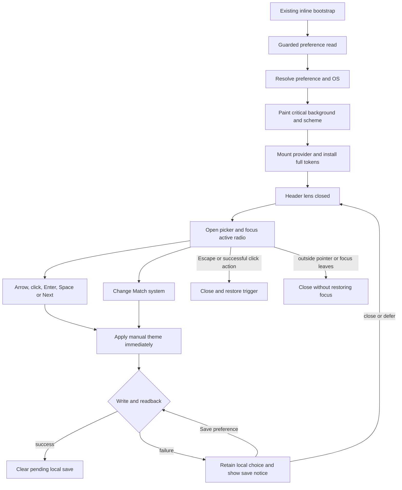
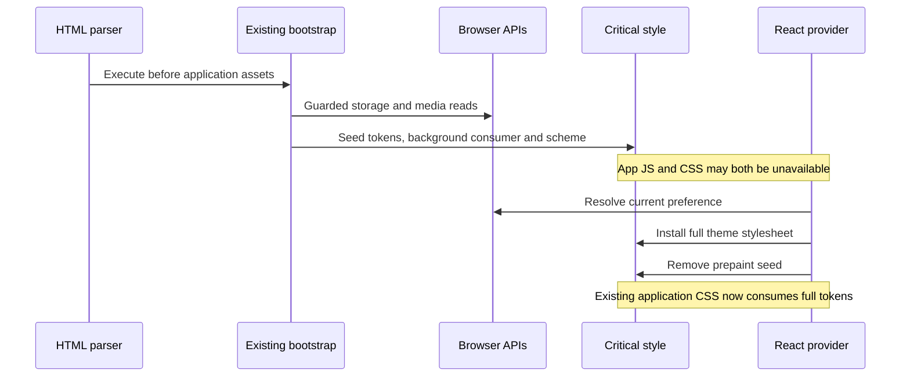
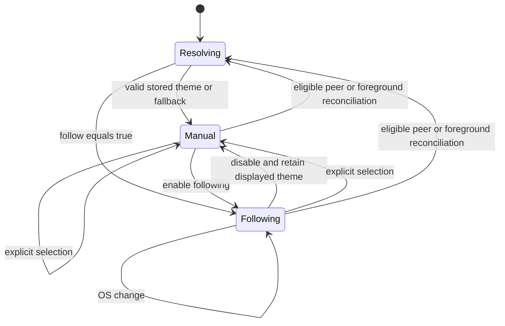
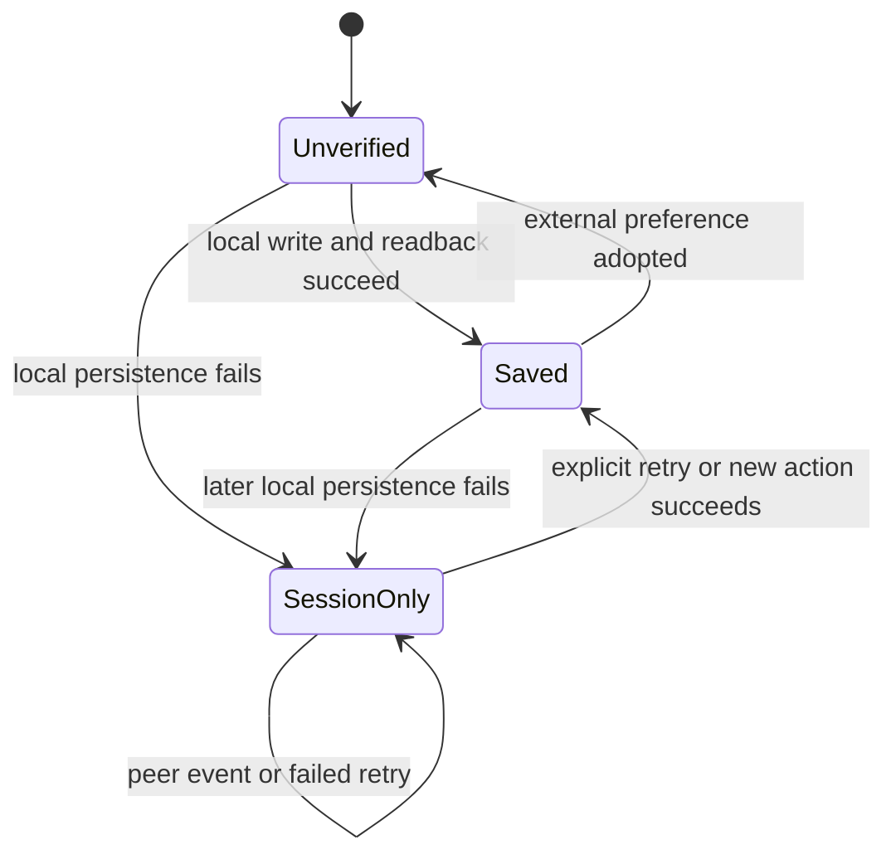
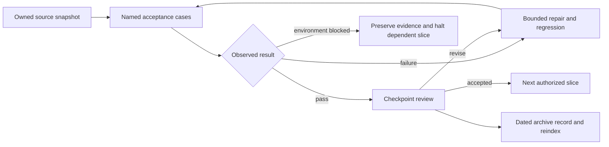

# Astra Reply — subscription transport — 2026-09-20T07:50:14.842Z

**Provider:** openai-codex
**Billing:** chatgpt-subscription
**Authentication:** chatgpt_subscription
**Transport:** codex-cli
**Requested model:** gpt-6-astra
**Served model:** NOT OBSERVABLE on codex-cli (see SERVED_MODEL_UNVERIFIABLE_NOTE)
**Reasoning effort:** xhigh
**Tokens:** in=3076294 out=27315 reasoning=4858
**Packet:** `frontend/tmp/theme-lens-harness/ASTRA-REQUEST-THEME-LENS-R6.md`
**Wall:** 944.7s
**Mega Blueprint:** ARMED (document)

> Marginal cost $0 — this leg rides the ChatGPT subscription, not OpenRouter.

---
Mega Blueprints. I’ll check the R6 packet, prior reviews, and current lane evidence, then produce the nine-document plan. This session is read-only, so filing the review in `Z:\HostileReviews` is blocked; I’ll keep that limitation explicit.

I’m using `fable-blueprint-forge`, `non-vibe-coding`, and the archive protocol. The checkout has moved to `6065985d` and has 1,166 dirty entries, so the packet’s commit is stale. I found the filed R5 review and will recheck its findings against the current files.

The stale-event and OS-label repairs are present. I found a blind spot in the new storage-area test: rejecting the event and accidentally processing it produce the same asserted state. I’m checking deletion/reset behavior and focus contrast next, using in-memory probes without changing files.

The contrast instrument is being edited during this review, so I’m withdrawing the old “literal inventory” claim for the newer file. Its replacement parser currently misses the production `var(--token, fallback)` syntax. Separate probes show that clearing preferences does not apply a fallback theme, and the `obsidian-black` focus ring measures about 1.13:1 against the modeled panel background.

The parser and parent-background repairs have now appeared in the shared tree. A stable in-memory probe still defeats the revised guard: swapping selected and unselected backgrounds leaves `washDrift()` green while modeled unselected text falls to 4.26:1.

I’m incorporating that finding into the package, alongside the reset and pre-paint gaps. The type-check attempt was blocked by `Access is denied` before TypeScript started.

## PART A — HOSTILE REVIEW

**Advisory verdict: REVISE. Review filing: BLOCKED by the read-only session. Implementation and deployment: not performed.**

Evidence labels apply throughout: **[VERIFIED]** means inspected source or an explicitly described measurement; **[LIKELY]** means inference; **[HYPOTHESIS]** requires reproduction; **[UNKNOWN]** means unverified. **[PLAN]** identifies requirements proposed below, not completed work.

Path aliases:

- `L/` = `frontend/src/context/ThemeContext/`
- `H/` = `frontend/tmp/theme-lens-harness/`
- `B/` = `frontend/e2e/theme-lens/`
- `R5` = `H/ASTRA-REPLY-THEME-LENS-R5.md`

**Evidence boundary**

[VERIFIED] The checkout was at `6065985dd5b20045360f0fa0b97ff98edd4b6cae`, branch `creator-brains-engine-r2-20260915`, with 1,166 dirty entries at initial inspection. The packet’s `fe388691f` baseline is stale.

[VERIFIED] Contrast files changed during this review. I observed the original instrument, an intermediate parser repair, and a subsequent parent-background repair. Findings below distinguish those versions. The last mutation probe read stable source throughout its execution.

[VERIFIED] R6 request SHA-256:

`02C58C3E9830ED343B568362277D15F980F12BE90F581288691308F44E9486F9`

[VERIFIED] Prior records were found and read:

- `2026-09-19-205229-swan-theme-lens-write-order-myth-ledger`
- `2026-09-19-235931-swan-theme-lens-astra-mega-blueprint-r5`

[UNKNOWN] R5’s actual effort remains unobservable from its inspected metadata. Its `.meta.json` records requested model, null served model, and token counts, but no effort. Ambient configuration supports an inference, not proof of the historical execution. Reasoning-token counts do not establish an effort level.

**A1 — Adjudication of the five returned findings**

| R5 finding | Still reproducible? | Recommendation change | Smallest closure |
|---|---|---|---|
| **A1-03 — HIGH** | **Partially.** [VERIFIED] The literal stylesheet array has been replaced by directory discovery at `L/themeContrastInstrument.ts:262–265`. Withdraw that exact claim for the latest inspected version. The new wash guard still loses state identity; see N1. | Replace the broad “hand-entered recipes” criticism with the demonstrated state-pairing defect and bounded discovery limitation. | Compare foreground and background **per rendered state**, and reject unmeasured reachable style sources. |
| **A1-04 — MEDIUM** | **Yes.** [VERIFIED] `L/themePrePaint.test.ts:128–164` creates a substitute seed. Source assertions at lines 32–105 do not execute bootstrap branches. | Strengthen it: executing the actual bootstrap exposed a missing paint consumer, N4. | Execute the real script, provide critical background CSS, then test with application JS and CSS withheld. |
| **A1-05 — MEDIUM** | **Yes, narrowed.** [VERIFIED] `L/ThemeLensPopover.test.tsx:25–43` still substitutes callbacks. `L/themeWritePath.test.tsx:48–60` now exercises the provider’s real writer. | Credit the provider coverage. The remaining gap is toggle wiring, computed styles, browser delivery, reload and focus. | Add a real provider-plus-toggle integration test and two-page browser test; retain useful component tests. |
| **A1-06 — MEDIUM** | **Yes in the request; corrected in the archive.** [VERIFIED] The archive’s D7, lines 171–181, already corrects the versions. | Treat this as resolved documentation debt requiring propagation, not a new runtime defect. | Carry declared, locked and installed columns into this package. No dependency change. |
| **A1-07 — MEDIUM** | **Yes in the request; resolved by the archive clarification.** [VERIFIED] Archive D8, lines 183–192, preserves palettes and interprets six colours as design language. | Adopt that resolution. Do not reopen palette selection. | State explicitly that existing theme values and token names remain authoritative; six colours constrain new fallback treatment. |

[VERIFIED] The repaired historical-value listener and OS observer are present at `L/useCrossTabThemeSync.ts:95–110` and `L/UniversalThemeContext.tsx:127–148`. **A1-01a, A1-01b and A1-02 are not re-reported as open runtime defects.** Their complete RED/GREEN history was not rerun.

**N1 — HIGH: the new contrast guard can certify the wrong state pairing**

[VERIFIED] `L/themeContrastInstrument.ts:225–226` sorts washes into an unordered signature. Lines 235–246 compare those signatures. Actual selected/unselected backgrounds are separate branches at `L/ThemeLensPopover.styles.ts:161–164`.

An in-memory mutation exchanged those two background branches without changing the files:

```text
baseline washDrift: []
swapped selected/unselected backgrounds washDrift: []
deep-ocean unselected text on swapped accent wash: 4.264985:1
```

The probe used instrument SHA-256:

`50f298fb537b076c8065c99884c3cba7aac98c0399c62896dd851855c274e1a0`

Sources remained unchanged during that probe. This proves a guard blind spot; it does **not** claim the complete mutated suite was run.

**Broken invariant:** each foreground must clear contrast against the background of the **same state**. Knowing that both backgrounds occur somewhere is insufficient.

**Fix:** identify `selected`, `unselected`, `hover`, and `focus` explicitly. Compare state-to-recipe mappings and browser-computed state pairs. Add the branch-swap mutation as a required negative control.

The earlier fallback-parser and missing-parent failures were observed during concurrent edits and then corrected in source. **Withdraw those transient failures as current findings.**

Directory discovery is also bounded: `themeContrastInstrument.ts:262–263` examines only top-level `ThemeLens*.styles.ts`. **Fix:** enforce that all reachable colour-bearing lens styles belong to the measured inventory; imports, nested files and inline styled declarations must not silently escape it.

**N2 — MEDIUM: the storage-area regression test passes after its guard is removed**

[VERIFIED] `L/themeCrossTab.test.tsx:233–252` leaves local storage and the mounted theme at `solar-gold`, sends a session-storage event, then checks only that the theme remains `solar-gold`.

Removing the filtering line from the real handler **in memory** produced:

```text
original:      theme=solar-gold, follow=false, callbacks=0
guard removed: theme=solar-gold, follow=false, callbacks=2
```

**Broken invariant:** ignored events perform no reconciliation. The current assertion observes a value that reconciliation would also produce.

**Fix:** assert zero reads/application callbacks, or arrange divergent in-memory and stored preferences so accidental reconciliation changes an observable result. The guard itself is present; this finding concerns its regression protection.

[VERIFIED] Archive R5 D2 line 103 also overstates session-storage reach across tabs. Session-storage notifications are scoped to the same top-level browsing context, unlike local storage. Correct this in the successor record, preserving the filed original. [HTML storage broadcast rules](https://html.spec.whatwg.org/multipage/webstorage.html#the-storage-interface).

**N3 — MEDIUM: clear/removal does not converge to the startup fallback**

[VERIFIED] `L/useCrossTabThemeSync.ts:84–110` accepts `key === null`, sets following false, then applies a theme only when the stored value is valid. It never applies the fallback for absent or invalid values.

Executing the actual handler with cleared storage produced:

```text
applyTheme calls: []
setFollowSystem calls: [false]
```

A tab showing Solar Gold therefore retains it, while a new mounted application resolves `crystalline-dark` through `themePersistence.ts:93–99` and `App.tsx:245`.

**Fix:** resolve a complete preference snapshot using the same fallback rules as startup; pass the provider fallback explicitly. Test clear, theme-key removal and invalid replacement.

[VERIFIED] The area check at `useCrossTabThemeSync.ts:82` also accesses `window.localStorage` outside its guarded reader. A throwing getter escaped the isolated handler as `SecurityError`.

**Fix:** guard acquisition of the storage object. On denied access, retain current state and report an unavailable read; do not interpret denial as a reset.

**N4 — MEDIUM: pre-paint variables do not themselves paint the page**

[VERIFIED] `frontend/index.html:199–210` creates custom properties and `color-scheme`, but no background declaration consuming them. The background consumer is `frontend/src/index.css:35`, imported by `frontend/src/main.jsx:11`.

Executing the actual inline script in a DOM with application assets absent yielded:

```text
data-theme: solar-gold
--bg-primary: #120C05
html background-color: rgba(0, 0, 0, 0)
body background-color: rgba(0, 0, 0, 0)
```

[LIKELY] Before application CSS arrives, the canvas uses browser-default painting rather than the saved palette background. Actual browser pixels were not captured.

**Fix:** the existing bootstrap seed must include a critical `html/body` background consumer. Test with **both** application JS and CSS withheld. A correct variable value is not a first-paint assertion.

**N5 — HIGH: focus visibility is outside the measured contrast sites**

[VERIFIED] The picker uses `--accent-primary` for focus outlines at:

- `L/ThemeLensPopover.styles.ts:119–121`
- `L/ThemeLensPopover.styles.ts:176–178`
- `L/ThemeLensSwitch.styles.ts:69–71`

For `obsidian-black`, the actual palette gives accent `#002060` and modeled panel `#1A1A24`; the existing colour math measured **1.130103:1**. Palette evidence: `L/palettes/obsidian.ts:44,105–109`.

The site table measures text and the selected check, not these outlines: `L/themeContrastSites.ts:37–100`.

**Broken invariant:** “text contrast passes” does not establish a visible keyboard focus indicator.

**Fix:** use a tested foreground/background focus pair, with an opaque backing where surrounding content varies. Add focus, switch-thumb and selected-indicator cases; retain the existing text thresholds. Browser verification remains required.

**N6 — MEDIUM: the custom tooltip has no complete dismissal/hover contract**

[VERIFIED] `L/ThemeLensButton.tsx:63–79` opens the tooltip on hover/focus but handles only arrow keys. The document Escape listener exists only while the picker is open, at `L/UniversalThemeToggle.tsx:78–91`. `L/ThemeLensButton.styles.ts:173` makes the bubble pointer-inert.

**Fix:** Escape dismisses the tooltip without moving focus or opening the picker; suppression lasts until hover and focus leave. Permit the pointer to enter the tooltip across its gap and keep it visible there. Verify actual geometry and persistence. These are distinct from accessible-name duplication. [W3C hover/focus guidance](https://www.w3.org/WAI/WCAG21/Understanding/content-on-hover-or-focus.html).

**N7 — MEDIUM: the R5 package cannot reach all of its own deliverables**

[VERIFIED] Three contradictions exist in the supplied blueprint:

1. **Context fields:** R5 lines 474–479 add persistence fields, but its S1 file list at 598–605 omits their current owning interface, `L/useUniversalTheme.ts:20–38`.
2. **Retry reachability:** R5 lines 404,424 place retry after the grid, while line 461 preserves forward-Tab behavior. The current hook intercepts forward Tab at `L/useThemeGridNavigation.ts:185–202`, closing before a footer action can receive focus.
3. **Motion prohibition:** R5 lines 718 and 542–550 reject permanent animation, but existing button styles run infinite particle/pulse animations at `L/ThemeLensButton.styles.ts:65,78,86`. Its S3 permission at R5 line 610 allows only focus/contrast corrections there.

**Fix:** include the context owner, keyboard hook and orchestrator in the appropriate slices; explicitly retire existing infinite lens animations. Place persistence status before the grid so retry is reachable immediately and does not depend on scrolling.

**N8 — MEDIUM: R5 turns an unanswered recommendation into a builder ban**

[VERIFIED] R5 lines 572 and 717 prohibit GSAP/R3F installation. R6 addendum E explicitly says Sean has not answered that recommendation.

**Fix:** distinguish **recommendation**, **current execution permission**, and **Sean’s pending decision**. My recommendation remains unchanged: no GSAP, R3F, Drei, postprocessing or icon installation for this bounded control without demonstrated benefit. It remains awaiting Sean’s decision; it is not recorded as his rejection.

**Residual documentation claim, carried forward rather than counted anew**

[VERIFIED] `themeStorageWrites.ts:20–30` and `useCrossTabThemeSync.ts:51–56` still assert that both writes necessarily precede any peer listener. Neither reversed synthetic delivery nor synchronous calls in one context proves a cross-context transaction. Preserve eventual-convergence semantics and remove transactional language. The standard advises authors not to assume cross-agent locking. [HTML Web Storage](https://html.spec.whatwg.org/multipage/webstorage.html#introduction).

**Guard disposition**

[VERIFIED] Fifteen lane test files existed at the last inventory, reflecting concurrent additions. **The packet’s 120 green tests were not rerun.**

| Guards | What remains useful | What remains unproved |
|---|---|---|
| Tokens, palette integrity, cycle, swatch | Registry and generated-value contracts | Browser cascade, complete graphical contrast |
| Text-token ledgers | Exact known-debt membership | Accessibility of all consumers |
| Contrast scoring/coverage | Measured declared sites and wash presence | State pairing, reachable-source closure, focus |
| Persistence, write path, cross-tab | Resolver/writer behavior and arranged event cases | Real browser convergence, partial-write policy, non-vacuous area rejection |
| System preference | OS observation and following behavior | Listener lifecycle under real browser changes |
| Pre-paint | Map parity and injector takeover | Critical painting before app CSS |
| Button/popover | Semantics and callback interactions | Mounted wiring, geometry, tooltip lifecycle |
| Rule 4 | Lane-wide line cap | Maintainability or out-of-lane compliance |

Do not inflate coverage by adding more source-string checks where behavior is executable.

**A2 — One hostile pass over this draft package**

The following defects were found in the draft and corrected in Part B:

| Draft defect | Incorporated correction |
|---|---|
| “Retain an unsaved local choice” contradicted unconditional peer convergence. | Convergence excludes an explicit pending local save; peer events cannot silently erase that choice. |
| A generic writer signature obscured enabling-follow’s one-key write. | Persistence accepts a discriminated operation with exact write/readback rules. |
| Browser pre-paint tests could pass because bundled CSS arrived first. | Tests separately hold JS and application CSS and inspect painted backgrounds. |
| Decorative addition retained old infinite button animations. | S3 explicitly removes those loops and broad colour transitions. |
| A new retry control could remain keyboard-unreachable. | Status precedes the grid; native Tab departure replaces unconditional grid interception. |
| A default-off 3D flag could still pull Three.js into the initial graph. | Import reachability and cold-transfer measurements are separate admission gates. |
| Two-key rollback could overwrite another tab’s successful write. | No compensating storage rollback; preserve local state and expose retry. |

**Not proven / unopened**

[UNKNOWN] Current full Vitest results, application type-check/build, mounted browser behavior, real two-tab delivery, screenshot matrix, accessibility-tree behavior, GPU timing, bundle deltas, deployed CSP and production behavior.

The scoped type-check attempt exited **1 before TypeScript started**:

```text
Program 'node.exe' failed to run: Access is denied
```

Command: `node ./node_modules/typescript/bin/tsc --noEmit --incremental false -p tmp/tsconfig.themelens-lane-only.json`, from `frontend/`. This is an execution-boundary failure, not a TypeScript diagnostic.

Historical HY4 packets were not fully reviewed. Unrelated dirty work, backend/DB behavior and the transcript engine were outside scope. In-memory probes are narrower than browser integration tests.

## PART B — FORGED PACKAGE

### 00-README.md

**[PLAN] Swan Theme Lens R6.1 — correctness, measurable accessibility and bounded visual refinement**

Owner: Sean. Builder: assigned by Sean. Reviewer: this adjudication seat for the present planning pass; future implementation checkpoints retain Sean’s assigned authority.

Status: **reviewable plan; implementation readiness blocked** by source stabilization, executable acceptance evidence and archive filing.

Supersedes the proposed implementation package in R5. Preserve R5 and both filed reviews. This response does not overwrite or save them.

Proposed durable location:

`docs/ai-workflow/AI-HANDOFF/BLUEPRINT-theme-lens-2026-09-20/`

All nine documents share this version and status.

**Outcome**

Make the existing header lens reliably select, persist, restore and explain all registered themes; make keyboard focus measurable; retain Swan-specific visual character without requiring animation or WebGL.

| Requirement | Acceptance criterion | Owning slices |
|---|---|---|
| R1 — Compatibility | Preserve 28 IDs/order, palette values, public exports and 130-token name contract | Every slice |
| R2 — Preference truth | Manual/follow actions, reset, denied access and retry follow §03 | S1 |
| R3 — Synchronization | Eligible tabs converge after writes settle; no echo writes or stale-payload authority | S1 |
| R4 — First paint | Correct background with application JS/CSS held; clean provider takeover | S2 |
| R5 — Accessibility | Text ≥4.5:1; essential graphics/focus ≥3:1; targets ≥44×44 CSS px | S3 |
| R6 — Interaction | Complete keyboard path, dismissible tooltip, no focus theft | S3 |
| R7 — Beauty and motion | Static faceted treatment works everywhere; bounded motion; optional 3D meets admission budgets | S3/S4 |
| R8 — Evidence | Source hashes, named tests, actual results and filed review distinguish plan/runtime/deployment | S0 and checkpoints |

**Scope**

Existing header trigger, picker, preference provider, storage helpers, bootstrap and their measuring apparatus.

No transcript-engine or console changes; no backend, account preference service, database migration, palette redesign, theme search/gallery, React-major change, commit, staging, push or deployment.

**Builder contract**

Build one accepted slice at a time. Preserve existing repairs. Where this package decides, follow it. Where it names a bounded delegation, remain inside that boundary. An unmet entry criterion or consequential unlisted change requires a checkpoint amendment.

This task authorizes the plan only. A future execution request must establish ownership and freeze the dirty source before editing.

### 01-architecture.md

**[VERIFIED] Canonical source path**

| Layer | Mounted evidence |
|---|---|
| React root | `frontend/src/main.jsx:69` |
| Theme provider and dark default | `frontend/src/App.tsx:245` |
| Router construction | `frontend/src/App.tsx:109` |
| Layout JSX | `frontend/src/routes/main-routes.tsx:308` |
| Header JSX | `frontend/src/components/Layout/layout.tsx:69` |
| Header actions JSX | `frontend/src/components/Header/header.tsx:193` |
| Lens JSX | `frontend/src/components/Header/components/ActionIcons.tsx:243` |
| Picker JSX | `L/UniversalThemeToggle.tsx:121–130` |

This is source reachability, not live-browser proof.

Frontend HTTP endpoint, backend handler and database fields: **N/A — preference is browser-local; this scope introduces no HTTP or database interaction.**

**[PLAN] Ownership**

- `themePalettes.ts`: existing registry authority.
- `themePreferenceSnapshot.ts`: guarded read outcome and pure resolution.
- `themeStorageWrites.ts`: exact operation writes and readback.
- `useThemePreference.ts`: current preference, pending local intent and persistence status.
- `useSystemColorScheme.ts`: OS observation, independent of follow mode.
- `useCrossTabThemeSync.ts`: event filtering and reconciliation triggers.
- `useUniversalTheme.ts`: context type and consumer hooks.
- `UniversalThemeContext.tsx`: preference composition, CSS injection and styled-theme bridge.
- `UniversalThemeToggle.tsx`: open state and close policy.
- Button/popover: presentation and input semantics.
- Contrast apparatus: explicit state/paint ownership plus rendered checks.
- Optional preview: decorative lifecycle only.

**User and preference flow**



“Successful click action” means a valid selection, regardless of persistence outcome; a failed save is announced and remains visible on reopening.

**Storage and OS APIs**

```mermaid
sequenceDiagram
    participant U as User
    participant P as Preference owner
    participant S as localStorage
    participant T as Peer tab
    participant O as matchMedia
    U->>P: Select theme or change following
    P->>P: Apply complete in-memory preference
    P->>S: Perform operation-specific writes
    P->>S: Read back required values
    alt required values match
        P->>P: saved; clear pending local intent
    else write/read failure or mismatch
        P->>P: session-only; retain pending local intent
    end
    S-->>T: Relevant storage event
    T->>S: Guarded fresh snapshot
    alt readable and no pending local intent
        T->>T: Resolve and apply both fields; no write
    else unavailable or local save pending
        T->>T: Retain current preference
    end
    O-->>P: Scheme change
    P->>P: Update OS label
    opt following enabled
        P->>P: Apply OS theme; do not persist
    end
```

**Bootstrap handoff**



**Preference and persistence states**





**Optional decoration API/lifecycle**

```mermaid
sequenceDiagram
    participant P as Picker
    participant G as Eligibility policy
    participant M as Lazy scene module
    participant W as WebGL scene
    P->>P: Render static wing immediately
    P->>G: Check flag, device, motion, visibility and canvases
    alt ineligible
        G-->>P: Keep static
    else eligible
        P->>M: Import with generation and deadline
        alt late, rejected or cancelled
            M-->>P: Keep static; do not create scene
        else still eligible
            M->>W: Create bounded scene
            W->>W: Render one settle, then stop
            P->>W: Dispose on close, denial or context loss
        end
    end
```

**Evidence flow**



`erDiagram`: **N/A — no relational tables, columns, foreign keys or schema changes.** Browser storage keys and value types are specified in §03.

Permissions: authenticated and unauthenticated users have the same local preference actions. Storage denial changes persistence capability, not access to theme selection. No PII, telemetry, account identifier or external asset is added.

Mermaid source is supplied; rendered previews were not verified.

### 02-wireframes.md

**[PLAN] Visual direction**

Retain the compact picker and registry order. Use an opaque, layered surface, readable names, a clear current-theme line and a small faceted wing. The grid remains dominant.

Two bounded treatments remain available to Sean:

- **Quiet Chrome:** static wing and immediate theme changes; default implementation recommendation.
- **Faceted Wing:** identical layout plus the optional brief raw-Three.js settle after its admission gate.

Neither is a new page or full-screen gallery. Swan design-router guidance applies; no additional aesthetic framework is introduced.

**Exact tokens**

| Role | Consumption |
|---|---|
| Opaque base | `var(--bg-primary, #0A0A0F)` |
| Elevated overlay | `var(--bg-elevated, #002060)` |
| Primary text/focus foreground | `var(--text-primary, #E0ECF4)` |
| Secondary text | `var(--text-secondary, #E0ECF4)` |
| Primary decorative accent | `var(--accent-primary, #60C0F0)` |
| Secondary decorative accent | `var(--accent-secondary, #8B5CF6)` |
| Border | `var(--border-strong, #C6A84B)` |
| Selected check foreground | `var(--text-on-accent, #0A0A0F)` |
| Unsaved decorative indicator | `var(--accent-gold, #C6A84B)` |

Existing palette values win. No global token additions or palette recolouring.

Panel background: elevated colour painted over an opaque primary-colour layer. Remove backdrop blur once the backing is opaque.

Focus treatment: 2px primary-text outline with a 2px opaque primary-background separator. Test both layers against their actual adjacent colours. Forced-colours mode uses system `Canvas`/`CanvasText`.

**Desktop — closed and tooltip**

```text
[Logo]                           [Theme lens] [Cart] [...]
                                      |
                         +-----------------------------+
                         | {description} — click for    |
                         | themes, arrows to cycle      |
                         +-----------------------------+
```

The tooltip appears after 300ms hover/focus, remains hoverable, and dismisses with Escape.

**Desktop — open**

```text
[Logo]                           [Theme lens] [Cart] [...]
                          +----------------------------------+
                          | 28 themes                 [Next] |
                          | [wing] Current: {themeName}       |
                          | Match system (dark)        [OFF] |
                          | Changes apply immediately.       |
                          | {status region, when required}   |
                          |                                  |
                          | [swatch/name] [swatch/name] ...   |
                          | [swatch/name] [swatch/name] ...   |
                          | ...all registered options...     |
                          +----------------------------------+
```

Panel: maximum 420px; 12px padding; 6px grid gap; 66px minimum option width; minimum target 44×44px. Maximum height `min(74dvh, 540px)` with a `vh` fallback. Names wrap.

**375px — closed and tooltip**

```text
+-------------------------------------+
| [Logo]          [Lens] [Cart] [...]  |
|           +-----------------------+ |
|           | {description} — click | |
|           | for themes, arrows    | |
|           | to cycle              | |
|           +-----------------------+ |
+-------------------------------------+
```

Tooltip width ≤260px and constrained to the visual viewport with 16px minimum clearance.

**375px — open**

```text
+-------------------------------------+
| [Logo]          [Lens] [Cart] [...]  |
| +---------------------------------+ |
| | 28 themes                [Next] | |
| | [wing] Current: {themeName}     | |
| | Match system (dark)      [OFF] | |
| | Changes apply immediately.     | |
| | {status region}                | |
| |                               | |
| | [name] [name] [name] [name]    | |
| | [name] [name] [name] [name]    | |
| | ...remaining options scroll...| |
| +---------------------------------+ |
+-------------------------------------+
```

Gutters 8px; top follows the verified header geometry, initially the existing 66px position. Bottom clearance includes safe-area inset. Retain current positioning until browser tests establish whether an amendment is necessary.

**State-specific content — both layouts**

The following rows replace the corresponding slots in both wireframes; no separate screen is introduced.

| State | Desktop content | 375px content |
|---|---|---|
| Manual | `Current: {themeName}` / `Match system (dark)` `[OFF]` | Same; wrap current name |
| Following | `Current: {systemThemeName}` / `Match system (light)` `[ON]` | Same |
| Selection | New checked option and current name immediately | Same; no spinner |
| Saved | Status region absent | Same |
| Denied/partial/mismatched save | `Theme applied for this session. Your preference could not be saved.` `[Save preference]` | Copy wraps; button occupies its own ≥44px row |
| Retry succeeds | Notice clears; polite announcement `Theme preference saved.` | Same |
| Retry fails | Existing notice and button remain | Same |
| External update | Current name and checked state update; focus stays put | Same |
| Optional scene loading | Static wing remains in reserved area | Static wing; mobile scene ineligible |
| Scene failure/context loss | Static wing remains; no technical error copy | Same |
| Reduced motion | Static wing; immediate panel/tooltip presentation | Same |
| Closed after failed save | Small unsaved mark; accessible description `Preference not saved on this device.` | Same |
| Reopen after failed save | Notice and retry appear before grid | Same |

Accessible trigger name remains:

`Theme: {description}. Activate to choose a theme.`

`{description}` comes from `getThemeDescription(currentTheme)`; visible `{themeName}` comes from `themes[currentTheme].name`. Do not substitute one silently for the other.

**Interaction**

- Initial focus: active radio.
- Left/Right wrap by one; Up/Down use actual column count; Home/End select endpoints.
- Arrow selection applies and persists immediately; Escape does not undo it.
- Enter/Space/click select and close.
- Native Tab/Shift+Tab traverse available controls; leaving the panel closes without restoring focus.
- Escape closes once and restores trigger focus.
- Outside pointer dismissal preserves destination focus.
- Tooltip Escape suppression persists until pointer and focus both leave its hover/focus group.
- A pointer bridge covers the tooltip’s 8px gap.
- Trigger glyph uses an opaque 28px primary-background plate with primary-text foreground; outer swatch retains theme identity.
- No focusable canvas or hover-only action.

Empty, remote-loading and no-results states: **N/A — registry is synchronous, non-empty and unfiltered.** Invalid programmatic IDs are rejected without side effects. Authentication denial: **N/A — no protected action.**

### 03-contracts.md

**[PLAN] Compatibility**

Preserve existing exported names, `ThemeId`, registry order, `UniversalThemeToggleProps`, and explicit-selection `themeChanged` payload `{ themeId, theme }`.

Do not extend that event to OS/peer updates without a separate consumer audit. Decoration consumes context.

**Preference types and signatures**

| Export | Contract |
|---|---|
| `ThemePreference` | `{ themeId: ThemeId; followSystem: boolean }` |
| `PreferenceSnapshot` | `{ kind: 'readable'; rawTheme: string \| null; rawFollow: string \| null } \| { kind: 'unavailable' }` |
| `readThemePreferenceSnapshot()` | Returns `PreferenceSnapshot`; catches getter and read failures |
| `resolveThemePreference(snapshot, systemDark, fallback)` | Readable snapshot → complete `ThemePreference`; unavailable handling belongs to caller |
| `useSystemColorScheme()` | Current dark preference; true when unsupported/denied; subscription cleaned up |
| `useThemePreference(fallback: ThemeId)` | Existing preference fields/actions plus persistence state and retry |
| `persistenceStatus` | `'unverified' \| 'saved' \| 'session-only'` |
| `pendingLocalWrite` | Internal boolean; true only after an unsuccessful local persistence attempt |
| `retryThemePersistence()` | One attempt to save current desired preference; no automatic retry |
| `writeThemePreference(operation)` | Returns `{ status: 'saved' \| 'session-only' }` |

`operation` is exactly one of:

- `{ kind: 'manual'; themeId: ThemeId }`
- `{ kind: 'enable-follow' }`
- `{ kind: 'disable-follow'; themeId: ThemeId }`

Existing writer exports remain compatibility wrappers where still referenced.

**Storage schema**

| Key | Type and accepted values |
|---|---|
| `swanstudios-theme` | String containing a registered theme ID |
| `swanstudios-theme-follow-system` | String `'true'` or `'false'` |

No migration, new key, account sync or automatic cleanup.

Resolution:

1. Literal follow value `'true'` selects current OS dark/light mapping.
2. Otherwise use a valid stored theme.
3. Otherwise use the provider fallback, `crystalline-dark` on the mounted application.
4. Unavailable startup read uses that fallback with following false.
5. Unavailable active-session read retains both current fields.
6. Invalid follow values behave as false.

Write rules:

| Operation | Writes | Success readback |
|---|---|---|
| Manual | Theme ID, then `'false'` | Both equal desired values |
| Disable following | Displayed theme ID, then `'false'` | Both equal desired values |
| Enable following | `'true'` only | Follow value equals `'true'` |

Order is deterministic for implementation simplicity, not atomicity. Failure after either write returns `session-only`. No compensating writes: another tab may have changed storage.

Local state applies before persistence. A failed local attempt sets pending local intent. Reconciliation cannot overwrite it. A successful retry or new local action clears it.

**Cross-tab contract**

- Obtain local storage inside a guarded boundary.
- Require `event.storageArea` to equal that storage object; null-area synthetic events are not production authority.
- Accept either key or `key === null`; ignore other keys.
- Event payload values are hints only.
- Reconcile on relevant events, `pageshow`, and return to visible state.
- Apply a complete resolved preference in one state update.
- Never persist during peer/foreground reconciliation.
- Clear/removal/invalid values use normal fallback rules.
- Convergence applies after writers settle, reads succeed, notifications/reconciliation run, and the receiving tab has no pending local save.
- No promise of globally ordered human intentions or atomic multi-key snapshots.

**Bootstrap contract**

Retain one inline bootstrap. Give it ID `swan-theme-bootstrap`; place it in the head after theme metadata and before stylesheet links.

The seed keeps its current five custom properties and colour scheme, and adds actual `html/body` background consumption. Do not write inline custom properties on `<html>`. The existing injector remains the sole full-token writer and retires `swan-theme-prepaint`.

“Pre-JS” readings:

- **Pre-paint:** correct critical presentation before application assets; not “before any JavaScript.”
- **Three.js:** optional decorative enhancement in S4.

The package prioritizes dependable theme behavior and visible polish; Three.js remains a bounded optional treatment. The application uses `createRoot`, so hydration work is **N/A**.

**Contrast contract**

A measured site identifies:

`{ component, state, foreground, paintOwner, backgroundRecipe, threshold }`

States are named, not combined into unordered token sets. Parent background ownership is explicit.

The instrument supports only its declared CSS grammar. Unsupported colour expressions, unmeasured reachable styles or unknown state branches fail measurement; they do not return an empty successful result.

Retain exact existing debt-ledger memberships. New focus or state failures are not absorbed into those ledgers.

**Motion**

- Remove existing infinite pulse/orbit animations from the lens.
- Remove `transition: all` and theme-colour interpolation.
- Panel: opacity plus ≤8px movement, ≤180ms.
- Tooltip: opacity, ≤120ms.
- Reduced motion: duration zero and no transform animation.
- Switch: transform-based thumb movement ≤120ms; zero under reduced motion.
- No viewport-wide colour tween or text on animated backgrounds.

**Optional scene**

`ThemeLensPreview({ themeId, enabled })` owns static fallback and lazy lifecycle.

`createThemeLensScene(canvas, colors, size)` returns:

`{ updateColors(colors), resize(size), play(), dispose() }`

- `colors`: validated resolved primary/secondary accent strings.
- `size`: `{ width, height, pixelRatio }`.
- APIs: `WebGLRenderer`, `Scene`, `OrthographicCamera`, `ShapeGeometry`, `MeshBasicMaterial`, `Mesh`, `Group`, `Color`, `render()`, geometry/material/renderer `dispose()`.
- 72×48 CSS px; DPR ≤1.5; ≤128 triangles; ≤4 draw calls.
- One 240ms settle, yaw ≤8°; no idle loop.
- No textures, external assets, HDRI, bloom or postprocessing.
- Disable below 768px, under reduced motion/Save-Data, known memory below 4GB, hidden document, or another page canvas.
- Exclude the owned canvas from the “another canvas” check.
- Recheck eligibility after import and on relevant changes.
- Two-second import deadline; late completion cannot create a scene.
- Close/context loss disposes owned resources; context loss disables the effect for that document lifetime.
- No automatic retry in the same opening.

Three.js resources require explicit lifecycle cleanup; garbage collection alone is not the acceptance criterion. [Three.js renderer documentation](https://threejs.org/docs/pages/WebGLRenderer.html).

**Dependencies and admission**

[VERIFIED] Declared / locked / installed:

| Package | Declared | Locked | Installed |
|---|---|---|---|
| React | `^18.2.0` | 18.3.1 | 18.3.1 |
| Framer Motion | `^10.16.5` | 10.18.0 | 10.18.0 |
| styled-components | `^6.1.6` | 6.1.19 | 6.1.19 |
| Three.js | `^0.169.0` | 0.169.0 | 0.169.0 |
| Victory | `^37.3.6` | 37.3.6 | 37.3.6 |

[VERIFIED] GSAP, R3F, Drei, both postprocessing packages and `@tabler/icons-react` were absent from these three dependency surfaces.

[PLAN] Recommendation remains **no new dependency for this control**, pending Sean’s answer:

- GSAP supplies timeline/media-query orchestration; this control’s motion already fits Framer Motion. Candidate APIs, if later justified: `gsap.context()`, `gsap.matchMedia()`, `revert()`. [GSAP documentation](https://gsap.com/docs/v3/GSAP/gsap.matchMedia%28%29/).
- R3F supplies declarative scene/lifecycle integration. A three-facet ornament does not yet establish an advantage over existing raw Three.js. Any later evaluation must verify exact peer dependencies; documented R3F 8 pairs with React 18. [R3F installation](https://r3f.docs.pmnd.rs/getting-started/installation).
- Drei/postprocessing/icons have no accepted lane requirement.

[UNKNOWN] Incremental bundle and GPU costs are unmeasured. Historical chunk sizes are not candidate measurements.

[PLAN] Admission budgets:

- Core addition ≤5 KiB gzip initial JS and ≤2 KiB gzip CSS.
- Lazy scene-specific code ≤8 KiB gzip.
- Report total cold transfer including any newly fetched Three.js chunk.
- No scene import while disabled or before eligible opening.
- Interaction p95 ≤100ms over 30 recorded interactions.
- No lens-attributed layout shift or new main-thread task >50ms in the measured trace.
- Zero scene animation frames after settling.
- Failure keeps `VITE_THEME_LENS_3D` false.

Flag: enabled only by exact string `'true'`; default false; public build configuration.

Rollback: restore only owned changes from verified preservation artifacts in an isolated checkout. Preserve user storage. Optional-effect rollback requires a rebuild with the flag false.

### 04-build-order.md

**[PLAN] File permissions, responsibilities and budgets**

Paths below are exhaustive permissions for their slices. Listed line budgets are implementation targets, always ≤300. Existing tests retain their assertions unless an explicit contract change requires an reviewed update.

| Slice | Files | Purpose, imports/exports and budget |
|---|---|---|
| S0 | `frontend/playwright.theme-lens.config.ts` | Dedicated preview/browser configuration; exports config; ≤140 |
| S0 | `B/network.fixture.ts` | Imports Playwright; exports isolated fixture blocking API/external traffic; ≤180 |
| S0 | `B/mount.spec.ts` | Imports fixture; actual header reachability; ≤180 |
| S0 | Package `evidence/source-manifest.json`, `evidence/results.md` | Owned paths/hashes, dependency versions, commands/results; each ≤300 |
| S1 | `L/themePreferenceSnapshot.ts` | Imports palette validation; exports snapshot/resolver contracts; ≤160 |
| S1 | `L/useSystemColorScheme.ts` | Imports React; exports independent OS observer; ≤110 |
| S1 | `L/useThemePreference.ts` | Imports resolver/writer/observer; exports preference owner; ≤260 |
| S1 | `L/themePersistence.ts` | Preserve keys/helpers; guarded reads and validation; ≤180 |
| S1 | `L/themeStorageWrites.ts` | Operation-specific writes/readback; compatibility wrappers; ≤180 |
| S1 | `L/useCrossTabThemeSync.ts` | Imports snapshot reader; reconciliation triggers/cleanup; ≤180 |
| S1 | `L/useUniversalTheme.ts` | Context type additions; preserve hook exports; ≤120 |
| S1 | `L/UniversalThemeContext.tsx` | Extract preference state/effects/actions; keep CSS/StyledProvider bridge and exports; ≤220 |
| S1 | `L/themePreferenceSnapshot.test.ts`, `L/themePreference.integration.test.tsx`, `L/themeStorageFailures.test.tsx` | Resolver, provider and failure behavior; each ≤260 |
| S1 | `L/themeCrossTab.test.tsx`, `L/themeSystemPreference.test.tsx`, `L/themeWritePath.test.tsx` | Strengthen existing regressions and realistic event area; each ≤300 |
| S1 | `B/persistence.spec.ts` | Two pages, reload, clear and foreground recovery; ≤260 |
| S2 | `frontend/index.html` | Existing script identification/location and critical paint consumer; ≤300 |
| S2 | `L/themePrePaint.test.ts`, `L/themeBootstrap.execution.test.ts` | Preserve map parity; execute real script; each ≤260 |
| S2 | `B/prepaint.spec.ts` | Withheld-assets and takeover checks; ≤220 |
| S3 | `L/ThemeLensButton.tsx`, `L/ThemeLensButton.styles.ts` | Tooltip lifecycle, glyph plate, unsaved status, bounded motion; each ≤280 |
| S3 | `L/useThemeLensTooltip.ts` | Extract tooltip visibility/dismissal lifecycle; ≤140 |
| S3 | `L/ThemeLensPopover.tsx`, `L/ThemeLensPopover.styles.ts` | Opaque panel, current line, status placement and focus; each ≤280 |
| S3 | `L/ThemeLensSwitch.styles.ts` | Focus and transform-only thumb motion; ≤120 |
| S3 | `L/useThemeGridNavigation.ts`, `L/UniversalThemeToggle.tsx` | Native Tab departure and single Escape handling; each ≤240 |
| S3 | `L/ThemeLensStatus.tsx`, `L/ThemeLensStatus.styles.ts` | Notice/retry presentation from context; each ≤140 |
| S3 | `L/ThemeLensPreview.tsx`, `L/ThemeLensPreview.styles.ts` | Static decorative wing only; each ≤160 |
| S3 | `L/themeContrastInstrument.ts`, `L/themeContrastSites.ts`, `L/themeContrastCoverage.test.ts`, `L/themeContrast.test.ts` | Extend existing apparatus with state/paint ownership; each ≤280 |
| S3 | `L/themeContrastState.test.ts`, `L/ThemeLensInteraction.test.tsx`, `L/ThemeLensTooltip.test.tsx` | Negative controls and real interaction chain; each ≤260 |
| S3 | `B/accessibility.spec.ts`, `B/layout.spec.ts`, `B/contrast.spec.ts` | Browser semantics, viewport matrix and rendered pairs; each ≤280 |
| S4 | `L/ThemeLensPreview.tsx` | Add optional lazy admission without changing static contract; ≤220 |
| S4 | `L/themeLensScene.ts`, `L/themeLensScenePolicy.ts` | Existing Three.js only; scene exports and eligibility; each ≤240 |
| S4 | `L/themeLensScenePolicy.test.ts`, `L/ThemeLensPreview.test.tsx` | Eligibility, cancellation and cleanup; each ≤240 |
| S4 | `B/motion.spec.ts` | Real lifecycle and performance observations; ≤280 |
| S4 | `frontend/scripts/measure-theme-lens-bundle.mjs` | Imports Node filesystem/zlib; baseline/candidate graph and gzip report; ≤220 |
| S4 | `frontend/src/vite-env.d.ts` | Add typed public flag declaration only if absent; ≤300 |

Patterns to preserve:

- Provider injection: `useLayoutEffect` → `injectThemeVariables`, `UniversalThemeContext.tsx:109–111`.
- Side effects outside React state updaters: `UniversalThemeContext.tsx:164–181`.
- Real writer test: `themeWritePath.test.tsx:48–60`.
- Named styled-components and local motion boundaries: existing button/popover files.
- Disposable rendering contract: `frontend/src/components/SwanMark3D/swanMarkScene.ts:85–86`.

No change to the 607-line `frontend/src/utils/theme/themeUtils.ts` is needed for the specified bootstrap repair. Its existing size is not silently certified by the lane-only Rule 4 check.

If a target approaches 300 lines, extract its named responsibility within the slice’s permitted files; do not delete evidence comments merely to manufacture headroom.

### 05-slices.md

**[PLAN] S0 — Stabilize the evidence boundary**

Entry: execution authorized; lane ownership established; no concurrent edits to owned files.

Actions:

1. Preserve exact dirty source and existing R5/R6 artifacts; verify snapshot hashes.
2. Record declared/locked/installed dependencies.
3. Establish frontend-only browser fixture.
4. Capture baseline commands and failures without repairing unrelated Header dependencies.

Acceptance: T0 cases pass; baseline evidence is tied to source hashes. If the mounted application cannot load, classify the exact prerequisite and halt browser-dependent acceptance.

Reachability: configuration → built application → verified Layout/Header/ActionIcons → existing lens. No replacement demo mounts satisfy T0.

**STOP:** do not advance on a moving source snapshot.

**S1 — Complete preference semantics**

Entry: S0 accepted.

Actions: extract preference ownership, preserve repaired OS behavior, guard storage acquisition, resolve resets, expose persistence status and retry, and make storage-area tests non-vacuous.

Acceptance: T1–T4 pass, including two real pages and failed-save retention. No peer-triggered writes; registry/token contracts unchanged.

Reachability: `useUniversalTheme.ts` defines fields → provider supplies them → real toggle uses existing setters → writer/listener share resolution rules.

**STOP:** do not advance while clear, denied access, partial write or convergence behavior remains ambiguous.

**S2 — Prove critical painting**

Entry: S1 accepted.

Actions: execute the actual bootstrap in tests; add critical background consumption; preserve one bootstrap and injector takeover.

Acceptance: T5–T6 pass for all theme IDs, both OS schemes, invalid storage and blocked APIs. Browser test holds JS and CSS independently and together.

Reachability: actual `index.html` → real bootstrap → critical style → existing provider/injector.

**STOP:** variable assertions alone do not satisfy painted-background acceptance.

**S3 — Accessible visual refinement**

Entry: S2 accepted; Quiet Chrome/static direction accepted for execution.

Actions: opaque panel, current-theme line, status/retry, focus repair, hoverable/dismissible tooltip, native Tab departure, static wing and removal of existing infinite animation. Extend the current contrast apparatus.

Acceptance: T7–T10 pass across all required viewports/themes; branch-swap mutation fails for the intended reason; existing debt ledgers remain unchanged.

Reachability: popover mounts status and preview; context supplies retry; keyboard hook permits reaching controls; button exposes closed-state save failure; styles are covered by the instrument.

**STOP:** static usability and accessibility must pass before optional WebGL work.

**S4 — Optional Three.js treatment**

Entry: S3 accepted; Sean’s dependency/visual decision recorded. This proposed implementation uses existing Three.js and adds no package.

Actions: default-off lazy scene, eligibility, disposal and measured baseline/candidate comparison.

Acceptance: T11–T12 and every performance budget pass. Failure leaves static treatment active.

Reachability: mounted popover → preview → exact build flag and eligibility → lazy module → owned scene.

**STOP:** do not enable based solely on installed dependency presence or historical chunk sizes.

**Combined acceptance**

Run all enabled-configuration tests, complete application type-check and build. Attribute unrelated failures explicitly. No lane-only pass authorizes a deployment claim.

### 06-bans.md

**[PLAN]**

- No implementation, staging, commit, push or deployment during this review task.
- No transcript-engine, console, backend, database, billing or account-preference changes.
- No theme removal, reordering, palette repaint or global token-contract reduction.
- No widening contrast ledgers or recorded coercion sets to obtain green tests.
- No assumption that two storage writes or reads are atomic.
- No event-payload authority, peer echo writes, polling or automatic save retries.
- No storage cleanup or compensating rollback writes.
- No replacement bootstrap, SSR migration or hydration project.
- No new dependency installation without Sean’s recorded decision and measured justification.
- No treating the no-install recommendation as Sean’s answer.
- No new styling/chart framework; styled-components and existing Victory conventions remain.
- No banned Galaxy colours or raw component palette literals beyond approved token fallbacks.
- No permanent lens animation, global colour tween, text-on-canvas or decorative pointer tracking.
- No scene dependency for choosing, saving or understanding a theme.
- No unchecked CSS grammar silently treated as “no measured colour.”
- No mocked callback result presented as mounted-browser proof.
- No browser configuration that starts the production-connected backend.
- No source-string assertion presented as proof of paint or event delivery.
- No self-granted line-cap exemption.
- No resetting workflow counters, rewriting filed findings or claiming archive completion without a record.
- No unrelated cleanup while executing these slices.

### 07-checkpoints.md

**[PLAN] Required checkpoint receipt**

For each slice:

1. Owned source list, hashes and preservation reference.
2. Exact commands, exit codes and named acceptance results.
3. Expected RED assertion before repair, followed by GREEN where feasible.
4. Mounted-path evidence and forbidden-side-effect checks.
5. Dependency/contract deviations, remaining unknowns and rollback boundary.
6. `PASS`, `REVISE` or `HALT` from the assigned reviewer.
7. Dated archive filing and successful reindex for each completed hostile-review pass.

Missing browser evidence stays **NOT RUN** or **BLOCKED**. It is not replaced by component coverage.

**Traceability**

| Requirement | Contract/artifact | Tests | Checkpoint |
|---|---|---|---|
| R1 | Registry/public compatibility, §03/06 | Existing token/palette/cycle suites | Every slice |
| R2 | Operation writes, pending local intent | T1–T3 | S1 |
| R3 | Snapshot reconciliation | T2–T4 | S1 |
| R4 | Actual bootstrap/critical paint | T5–T6 | S2 |
| R5 | State-specific contrast/focus | T7, T9, T10 | S3 |
| R6 | Tooltip/focus/Tab contract | T8–T10 | S3 |
| R7 | Motion/static/optional scene | T9, T11–T12 | S3/S4 |
| R8 | Source manifest and receipts | T0 plus all evidence | Every checkpoint |

**Current receipt**

| Item | Status |
|---|---|
| Packet hash and initial checkout identity | VERIFIED |
| Source mount chain | VERIFIED |
| Prior archive records | READ |
| Independent in-memory defect probes | EXECUTED; scope stated in Part A |
| Stable complete lane snapshot | NOT CREATED; concurrent edits observed |
| Full lane tests | NOT RUN |
| Scoped type-check | BLOCKED before compiler startup |
| Full application type-check/build | NOT RUN |
| Browser/accessibility/paint proof | NOT RUN |
| Bundle/GPU cost | NOT MEASURED |
| New acceptance files | SPECIFIED, NOT IMPLEMENTED |
| Mermaid render/structural readiness checker | NOT RUN |
| Archive filing/reindex | BLOCKED |
| Implementation/deployment | NOT PERFORMED |

**Archive handoff**

A write-capable authorized seat must file the R6 findings with actual timestamps, dirty-source hashes, bounded scope, defect/unproven counts and reciprocal supersession links to the R5 record. Preserve transient observations as withdrawn, not current defects.

The loaded archive skill requires: **“Every hostile-review pass leaves exactly one file in `Z:\HostileReviews`.”** Filing is unfinished because this session’s filesystem is read-only, not because another permission question is needed. [Archive skill](C:/Users/BigotSmasher/Desktop/@Everything/quick-pt/SS-PT/.claude/skills/hostile-review-archive/SKILL.md).

No source files, screenshots or temporary files were created by this pass. Future evidence belongs under the package’s `evidence/` directory. Existing harness history remains preserved.

### 09-tests.md

**[PLAN] Test specifications below are named implementation deliverables, not claims that files or passing results already exist.** Existing commands are runnable in an authorized write-capable checkout. Future-file commands become runnable in their owning slice.

All commands run from `frontend/`.

**Baseline**

```powershell
node ./node_modules/vitest/vitest.mjs run src/context/ThemeContext
node ./node_modules/typescript/bin/tsc --noEmit --incremental false -p tmp/tsconfig.themelens-lane-only.json
node ./node_modules/typescript/bin/tsc --noEmit --incremental false
node ./node_modules/vite/bin/vite.js build
```

Record actual test counts; do not preserve “120” as an expected outcome after adding files.

**Browser configuration**

`playwright.theme-lens.config.ts`:

- `testDir`: `e2e/theme-lens`.
- Base URL: `http://127.0.0.1:4179`.
- Start only Vite preview on that exact host/port.
- Disable server reuse, service workers and retries.
- Use isolated browser contexts; two-page cases share one context.
- Abort API/external requests and record attempted mutations.
- Never start a backend or inherit another Playwright configuration.
- Chromium initially; record browser version. Firefox/WebKit remain explicit additional gates before claiming cross-browser support.
- Save artifacts only under package evidence.

```powershell
node ./node_modules/@playwright/test/cli.js test --config playwright.theme-lens.config.ts
```

**Named cases**

| ID | File | Named cases and proof |
|---|---|---|
| T0 | `B/mount.spec.ts` | `mounts the production header lens`; `opens all registered radios`; `selection causes no API mutation` — proves actual mount and local-only action |
| T1 | `L/themePreferenceSnapshot.test.ts` | `follow wins over stored theme`; `invalid and missing values use supplied fallback`; `getter and read denial return unavailable`; `prototype names are rejected` |
| T2 | `L/themeCrossTab.test.tsx` | Retain repaired cases; add `clear resolves the supplied fallback`; `theme removal resolves fallback`; `wrong storage area causes zero reconciliation`; `null storage area is ignored`; `peer adoption never writes` |
| T2 | `L/themeSystemPreference.test.tsx` | Retain both existing behavior cases; add `StrictMode leaves one active listener`; `unmount removes listener`; `unsupported media API uses dark fallback` |
| T3 | `L/themePreference.integration.test.tsx` | `manual choice updates context CSS and storage`; `disabling following stores displayed theme`; `invalid action changes nothing`; `peer update applies both fields together` |
| T3 | `L/themeStorageFailures.test.tsx` | `first write failure retains local choice`; `second write failure reports session-only`; `readback mismatch is not saved`; `peer event preserves pending local choice`; `retry saves current desired preference once`; `enable-follow requires only follow readback` |
| T4 | `B/persistence.spec.ts` | `two pages converge after a real selection`; `reload restores manual choice`; `reload follows current OS`; `clear converges with a new page`; `foreground return reconciles`; `interleaved writers converge to final readable pair` |
| T5 | `L/themeBootstrap.execution.test.ts` | `actual script resolves every registered theme`; `actual follow branch matches provider`; `denied APIs preserve a usable fallback`; `critical seed contains a background consumer`; `actual seed retires on injector takeover` |
| T6 | `B/prepaint.spec.ts` | `saved background paints with JS and CSS withheld`; `follow-system paints before React`; `application CSS alone preserves critical background`; `takeover leaves correct computed colours and one theme authority` |
| T7 | `L/themeContrastState.test.ts` | `swapping selected backgrounds fails`; `changed wash percentage fails`; `unknown expression fails closed`; `nested imported stylesheet cannot escape`; `inline colour declaration cannot escape`; `focus sites cover every interactive control` |
| T8 | `L/ThemeLensInteraction.test.tsx` | `real arrow action updates checked state CSS and storage`; `click selects and closes`; `retry is keyboard reachable`; `Escape closes once`; `external update preserves focus` |
| T8 | `L/ThemeLensTooltip.test.tsx` | `Escape dismisses without moving focus`; `dismissed tooltip stays suppressed`; `pointer enters bubble without dismissal`; `leaving hover and focus rearms`; `picker opening hides tooltip` |
| T9 | `B/accessibility.spec.ts` | `complete keyboard journey reaches Next switch retry and radios`; `forward Tab leaves naturally`; `outside click preserves destination focus`; `every target meets 44 pixels`; `forced colours retain focus`; `closed failed save is announced` |
| T10 | `B/layout.spec.ts` | `all themes fit every viewport`; `last option remains reachable`; `200 percent zoom retains controls`; `tooltip remains inside visual viewport`; `longest label wraps without overlap` |
| T10 | `B/contrast.spec.ts` | `rendered text pairs meet AA`; `focus indicators meet non-text threshold`; `switch states and selected check remain visible`; `opaque panel isolates page-content backdrop` |
| T11 | `L/themeLensScenePolicy.test.ts` | `default flag denies`; `reduced motion and Save-Data deny`; `narrow hidden low-memory and other-canvas states deny`; `own canvas does not deny itself` |
| T11 | `L/ThemeLensPreview.test.tsx` | `static wing survives failure`; `late import cannot create scene`; `StrictMode cleanup is idempotent`; `eligibility loss disposes`; `context loss disables this document`; `timeout does not retry` |
| T12 | `B/motion.spec.ts` | `disabled or closed picker requests no scene`; `reduced motion has no lens animation`; `scene stops after settling`; `repeated opening leaves no owned resources`; `interaction and layout budgets hold` |

**Slice commands**

```powershell
node ./node_modules/vitest/vitest.mjs run src/context/ThemeContext/themePreferenceSnapshot.test.ts src/context/ThemeContext/themePreference.integration.test.tsx src/context/ThemeContext/themeStorageFailures.test.tsx src/context/ThemeContext/themeCrossTab.test.tsx src/context/ThemeContext/themeSystemPreference.test.tsx src/context/ThemeContext/themeWritePath.test.tsx
node ./node_modules/@playwright/test/cli.js test --config playwright.theme-lens.config.ts persistence.spec.ts
```

```powershell
node ./node_modules/vitest/vitest.mjs run src/context/ThemeContext/themePrePaint.test.ts src/context/ThemeContext/themeBootstrap.execution.test.ts
node ./node_modules/@playwright/test/cli.js test --config playwright.theme-lens.config.ts prepaint.spec.ts
```

```powershell
node ./node_modules/vitest/vitest.mjs run src/context/ThemeContext/themeContrast.test.ts src/context/ThemeContext/themeContrastCoverage.test.ts src/context/ThemeContext/themeContrastState.test.ts src/context/ThemeContext/ThemeLensInteraction.test.tsx src/context/ThemeContext/ThemeLensTooltip.test.tsx
node ./node_modules/@playwright/test/cli.js test --config playwright.theme-lens.config.ts accessibility.spec.ts layout.spec.ts contrast.spec.ts
```

```powershell
node ./node_modules/vitest/vitest.mjs run src/context/ThemeContext/themeLensScenePolicy.test.ts src/context/ThemeContext/ThemeLensPreview.test.tsx
node ./node_modules/@playwright/test/cli.js test --config playwright.theme-lens.config.ts motion.spec.ts
node scripts/measure-theme-lens-bundle.mjs --baseline tmp/theme-lens-baseline/dist --candidate tmp/theme-lens-candidate/dist
```

**Fixtures and observable results**

- Registry fixtures come from actual `themeCycle`, never a second theme list.
- Viewports: 320×740, 375×812, 414×896, 768×1024, 1024×768, 1440×900, 2560×1440, 3840×2160.
- Exercise all 28 themes across layout/contrast cases.
- Contrast uses actual computed foreground/background state pairs, pseudo-elements and opaque backing. Unsupported computed colour formats fail the measurement.
- Negative controls mutate strings/modules in memory or task-owned temporary fixtures, never production source.
- Performance evidence records hardware, browser, viewport, throttling, warm/cold cache, raw samples and p95.
- Bundle evidence records initial graph delta, lazy graph delta and total cold transfer separately.
- Rollback verification rebuilds the owned baseline in isolation and confirms existing stored preferences still resolve.
- No real DB, account, provider or production service is a test fixture.

Missing imports, denied process execution or missing browsers are setup failures, not valid RED evidence.

## PART C — DECISION-DENSITY SELF-TEST

**[PLAN] Remaining consequential choices are either decided or explicitly bounded below. No passing implementation status is implied.**

| Builder choice | Disposition |
|---|---|
| Surface to change | Existing mounted header lens only |
| Theme identities/order/values | Preserve actual registry and palettes |
| Six-colour wording | New fallback/design language; not a palette rewrite |
| Initial application default | `crystalline-dark` |
| Follow/manual precedence | Exact §03 resolution |
| Clear/removal behavior | Resolve normal fallback; no silent retention |
| Storage denial | Retain active preference; distinguish unavailable from missing |
| Partial save | Session-only, pending local intent, no compensating writes |
| Peer event during failed local save | Retain local choice until explicit successful save/new action |
| Concurrency guarantee | Eventual resolution of final readable pair within stated eligibility conditions |
| Retry policy | User-triggered single attempt using current desired preference |
| OS observation | Always observe; apply only while following |
| Public event semantics | Preserve existing explicit-selection behavior |
| Pre-paint promise | Actual background before application assets; no zero-JavaScript or hydration claim |
| Keyboard selection | Immediate apply/persist; Escape does not undo |
| Tab behavior | Native traversal; close on departure without focus theft |
| Tooltip behavior | Hoverable, Escape-dismissable, suppression until hover/focus reset |
| Focus colours | Tested primary-text/opaque-primary pair; no accent-only assumption |
| Contrast architecture | Extend existing apparatus with state and paint ownership |
| Unknown CSS/imports | Fail measurement; no silent omission |
| Existing animation loops | Remove within S3 |
| Default visual treatment | Quiet Chrome/static recommendation |
| Optional visual choice | **Sean pending:** static-only versus bounded faceted Three.js treatment |
| GSAP/R3F decision | **Sean pending:** recommendation remains no installation; no rejection attributed to him |
| Exact wing geometry | **Delegated:** three feather facets, ≤128 triangles, ≤4 draws, 72×48 area, no text/assets |
| 3D eligibility | Exact §03 rules and default-off flag |
| Dependency compatibility if Sean changes direction | **Bounded prerequisite:** exact peer-version and cost evaluation before a revised slice |
| Performance reference hardware | **Delegated:** executor records available desktop and mobile/emulated profile before both measurements |
| Positioning failure under actual header | **Bounded:** halt that acceptance and amend exact mount/positioning files; no improvised global rewrite |
| Source ownership | **Prerequisite:** freeze owned files and preserve concurrent work |
| Future reviewer identity | **Sean/controller-owned:** no inferred reselection or additional provider dispatch |
| Archive completion | Write-capable authorized seat files dated successor record and reindexes |
| Plan readiness | **Blocked:** source preservation, executable acceptance implementation and archive filing remain outstanding |

The package is a concrete R6 revision. The review establishes specific source and in-memory failures; it does not certify the changing lane, browser experience or deployment.
