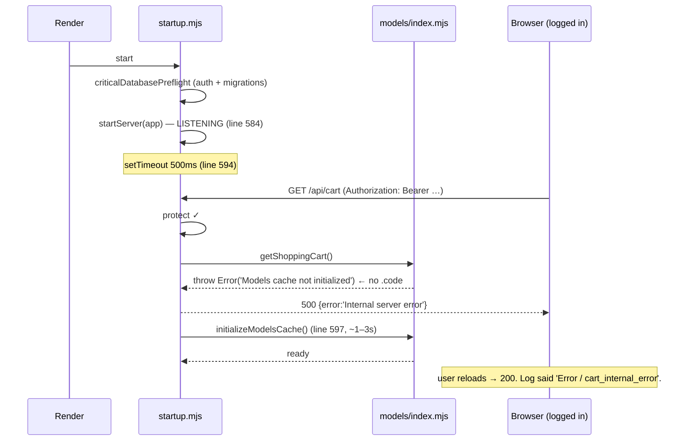
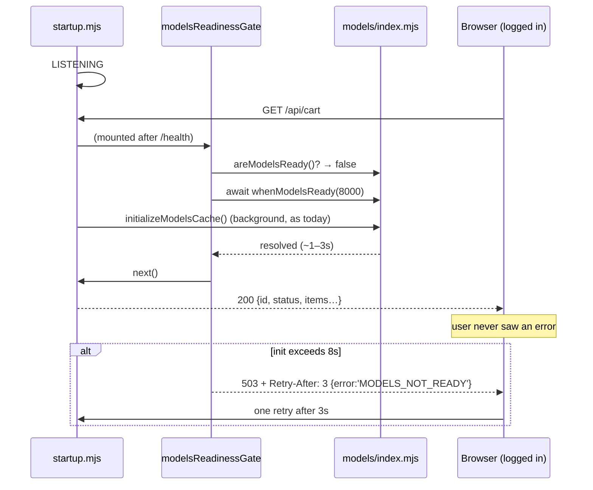
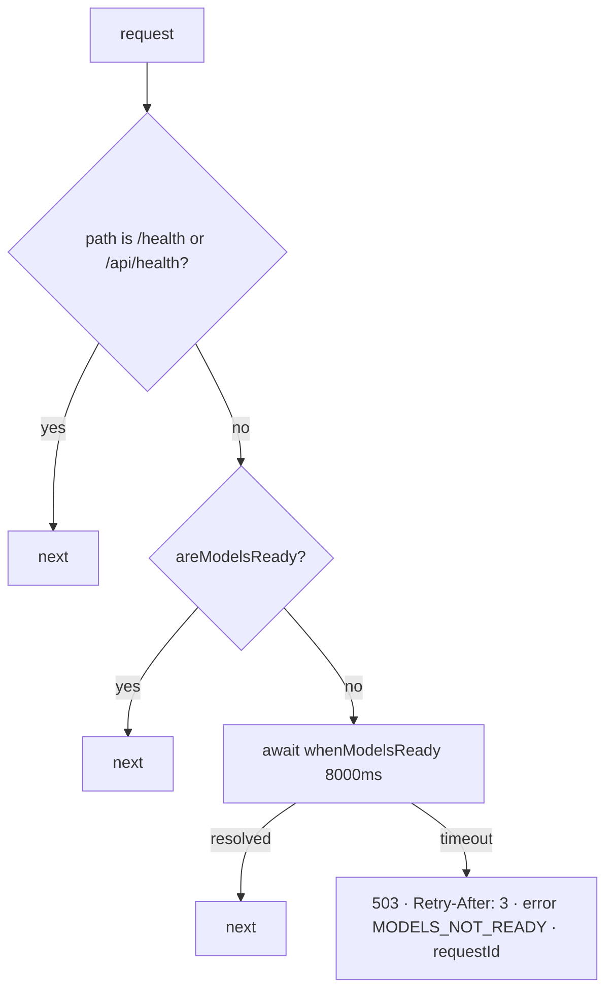

# Cart 500 — root cause, hostile review, and the readiness-gate blueprint

**Author:** Fable 5.1 (review-and-blueprint seat), 2026-09-03.
**Builder:** any agent. Every decision is made here. If you have to ask, this document failed — say so on SWA-92 rather than guessing.
**Related:** SWA-92 (this defect) · `claude/cart-observability-swa92` @ `e1f0bcc81` (instrumentation, unmerged) · SWA-232 (miniswan, §7).

---

## 1. Root cause — verified mechanism

Read from `origin/main`, which is what production runs.

| Step | File:line | What happens |
|---|---|---|
| 1 | `backend/core/startup.mjs:584` | `startServer(app)` — **server is LISTENING** |
| 2 | `backend/core/startup.mjs:594` | `setTimeout(async () => { ... }, 500)` — background, **500ms** later |
| 3 | `backend/core/startup.mjs:597` | `await initializeDatabases()` — which calls `initializeModelsCache()` |
| 4 | `backend/models/index.mjs:78-81` | until step 3 completes, `getAllModels()` **throws** `new Error('Models cache not initialized…')` — a bare `Error`, no `.code` |
| 5 | `backend/routes/cartRoutes.mjs:317` | `getShoppingCart()` → step 4 → the route's catch → `logCartError` → **500** |

**The window** = 500ms + the full `initializeDatabases()` duration. Measured on a warm dev box: models cache alone ≈ 800ms, after associations, before E2EE and seeding. On a cold Render dyno, several seconds. **Every deploy opens it.**

**Why the symptom matched "authenticated 500, anonymous clean 401":** anonymous requests are rejected by `protect` *before* any handler runs — they never touch the models. Authenticated requests pass `protect` and hit `getShoppingCart()` into an empty cache. The asymmetry that puzzled every previous look at this is the fingerprint of the race.

**Why it was undiagnosable:** the thrown `Error` carries no `.code`, so the log line read `errorName: 'Error', errorCode: 'cart_internal_error'` — the exact shape observed. `e1f0bcc81` adds message + stack; once merged, the next occurrence will log *"Models cache not initialized"* by name.

**Why "cart bug" was the wrong frame:** `grep -rl "get(ShoppingCart|CartItem|StorefrontItem|User|Session|AllModels)\(\)" backend/routes backend/controllers backend/middleware` → **61 files**. Every one of them 500s inside the window. The cart is merely the one the homepage calls first.

### 1.1 Confidence — say this exactly, do not upgrade it

`[VERIFIED]` the mechanism: the ordering, the throw, the window, the 61-file blast radius.
`[HYPOTHESIS]` that this mechanism is what produced the specific 2026-09-01 observation. The instrumentation commit settles it: after merge, the next 500 either names this error or names something else. **Do not close SWA-92 on this blueprint alone.** Close it when a post-merge log line names the cause, or when the gate has been live across two deploys with no money-path 500.

### 1.2 What was disproven against production (read-only replay, `diagnose-cart-500.mjs`)

| Hypothesis | Result |
|---|---|
| D-1 user-id type mismatch | **disproven** — `ShoppingCart.userId` is INTEGER, matches `Users.id`; `ensureNumericCartUser` returns 401 not 500 |
| D-3 serializer / orphaned joins | **disproven** — replayed for clients 35, 84, 89: carts found, 26 storefront columns, includes resolve, **0 orphaned cart items repo-wide, 0 duplicate active carts** |
| D-2 missing cart row | **not the cause** — `safeFindOrCreateActiveCart` handles it; user 89 has no cart and the create path is guarded |

The data is clean. The bug was never in the data.

---

## 2. Hostile review of the work already committed

### 2.1 `e1f0bcc81` — cart observability (Opus 5)

| # | Finding | Verdict |
|---|---|---|
| R1 | `redactLogString` is fail-**open**: its `catch { return input }` returns the *unredacted* string if a regex throws. Probability is low (regex over a string), consequence is one raw message in a log. | **ACCEPT with note.** Builder: do not "fix" this in the gate slice; it is a separate, pre-existing property of the redactor. File as a one-line follow-up. |
| R2 | The test imports the real module and carries a negative control against the legacy shape. | **PASS.** The first draft duplicated the implementation; Opus caught it in its own pass. |
| R3 | Credential fixtures assembled at runtime so no secret-shaped literal is committed. | **PASS.** Correct trade — the scanner was not weakened. |
| R4 | No route-level integration test (route pulls Stripe at import). Mitigated by `node --check` + import-execution of the util + 12-call-site grep. | **ACCEPT.** The gate slice's supertest (§5) covers the route path. |
| R5 | GLM's Blueprint A said "allowlist `err.message` raw"; Opus used the redactor instead. | **PASS — and record it:** second GLM defect this session after the uuid→integer FK. External blueprints get verified, not trusted. |
| R6 | `package-lock.json` churn from the worktree `npm install` was reverted, not committed. | **PASS.** |

**Verdict on `e1f0bcc81`: APPROVE.** It does exactly one thing, proves it, and would have surfaced the real cause within one deploy. Merge it first, independently of the gate.

### 2.2 The root-cause reasoning (Opus 5) — attacks run this session

| Attack | Result |
|---|---|
| Does the **pre-listen** `criticalDatabasePreflight` already initialize models, making the window imaginary? | **No.** `startup.mjs:518-537` authenticates and runs migrations. It never calls `initializeModelsCache`. |
| Is there already a readiness gate on routes? | **No.** `grep -rn "isInitialized\|modelsReady\|503" backend/middleware backend/core/routes.mjs` finds 503s only in AI/plaud feature-flag guards — nothing model-related. |
| Is `initializeModelsCache` safe to call from a gate (idempotent)? | **Yes.** `models/index.mjs:26` early-returns when initialized. A gate may await it without double-initializing. |
| Do health routes call model getters (would a global gate kill Render deploys)? | **No.** `healthRoutes` does not call getters; `/health` and `/api/health` mount at `routes.mjs:308-309`, *before* every API family. Gate after 309, not before. |

**The root cause survives. Proceed.**

---

## 3. Design decisions — all made here

| ID | Decision | Rejected alternative and why |
|---|---|---|
| D1 | **Wait-then-503**, not immediate 503. The gate `await`s readiness up to a cap; a request at t=200ms gets a 200 two seconds later instead of an error. | Immediate 503 is honest but makes every fresh-deploy visitor see an error for nothing. Holding is strictly better UX and costs one promise. |
| D2 | **Cap = 8000ms.** Past that, respond `503` + `Retry-After: 3`. | Unbounded wait piles requests during a slow boot; 8s is longer than any healthy init and shorter than a browser's patience. |
| D3 | **Mount globally after health routes** (`routes.mjs` line 309 → insert at 310), not per-route on the cart. | Per-route misses the other 60 files. Health stays ungated because it is mounted above the gate. |
| D4 | **Typed error** `ModelsNotReadyError` with `code: 'MODELS_NOT_READY'`, thrown from `getAllModels()` in place of the bare `Error`. | Even if something bypasses the gate, the log names the cause. Bare `Error` is what made this undiagnosable. |
| D5 | **Export `areModelsReady()` and `whenModelsReady()`** from `models/index.mjs`. The gate consumes them; nothing reaches into module-private state. | Exporting `isInitialized` directly leaks a mutable `let`. |
| D6 | **Frontend: one bounded retry** on `503` with `Retry-After` in `CartContextProvider`; no retry on any other status. | Unbounded retry hides real outages. One retry after the header's delay covers the boot window precisely. |
| D7 | **Do NOT move init pre-listen in this slice.** File it as SWA-92-follow-up: it changes boot for every route and may push Render's initial health probe past its timeout. | Correct in principle; too wide a blast radius to ship alongside a defect fix. The gate makes the reorder optional rather than urgent. |
| D8 | The gate is **not** a feature flag and has **no** env kill-switch. | A switch that turns the gate off re-opens a 500 on the money path. There is no operational scenario where that is desired. |

---

## 4. Diagrams

### 4.1 Boot vs first request — before



### 4.2 Boot vs first request — after



### 4.3 Gate logic



(H is defensive only — health mounts above the gate, so it never reaches it. Keep the check: a future re-ordering of mounts must not silently gate health.)

---

## 5. Contracts

### 5.1 `backend/models/index.mjs` — additions (no existing export changes)

```js
export class ModelsNotReadyError extends Error {
  constructor() {
    super('Models cache not initialized. Call initializeModelsCache() during server startup.');
    this.name = 'ModelsNotReadyError';
    this.code = 'MODELS_NOT_READY';
  }
}

// getAllModels(): replace `throw new Error('Models cache not initialized…')` at line 81
// with `throw new ModelsNotReadyError()`. Message text unchanged; only the type and code change.

let readyResolve;
const readyPromise = new Promise((resolve) => { readyResolve = resolve; });
// inside initializeModelsCache(), immediately after `isInitialized = true;` (line 62): readyResolve();

export const areModelsReady = () => isInitialized && !!modelsCache;

/** Resolves true when ready, false on timeout. Never rejects. */
export const whenModelsReady = (timeoutMs = 8000) =>
  areModelsReady()
    ? Promise.resolve(true)
    : Promise.race([
        readyPromise.then(() => true),
        new Promise((resolve) => setTimeout(() => resolve(false), timeoutMs))
      ]);
```

### 5.2 `backend/middleware/modelsReadinessGate.mjs` `[NEW]` (~40 lines)

```js
import { areModelsReady, whenModelsReady } from '../models/index.mjs';
import { randomUUID } from 'node:crypto';

export const MODELS_READY_TIMEOUT_MS = 8000;
export const MODELS_RETRY_AFTER_SECONDS = 3;
const UNGATED = new Set(['/health', '/api/health']);

export const modelsReadinessGate = async (req, res, next) => {
  if (areModelsReady()) return next();
  if ([...UNGATED].some((p) => req.path === p || req.path.startsWith(`${p}/`))) return next();

  const ready = await whenModelsReady(MODELS_READY_TIMEOUT_MS);
  if (ready) return next();

  const requestId = `req_${randomUUID()}`;
  res.set('Retry-After', String(MODELS_RETRY_AFTER_SECONDS));
  return res.status(503).json({
    success: false,
    error: 'MODELS_NOT_READY',
    message: 'Server is starting. Please retry shortly.',
    requestId
  });
};
```

Log one `logger.warn('[readiness] request held past timeout', { path, requestId })` on the 503 branch only. Never log on the pass-through branch — the gate must be silent when healthy.

### 5.3 Mount — `backend/core/routes.mjs`

Insert **between** line 309 (`app.use('/api/health', healthRoutes);`) and line 310 (`app.use('/api/config', …)`):

```js
  // Models initialize in a background setTimeout AFTER listen (startup.mjs:594). Every API
  // route that lazy-loads a model 500s inside that window. Hold requests until ready; health
  // mounts above this line on purpose so Render's probe is never gated.
  app.use(modelsReadinessGate);
```

### 5.4 Response contract (new, only on timeout)

```
HTTP/1.1 503 Service Unavailable
Retry-After: 3
Content-Type: application/json

{ "success": false, "error": "MODELS_NOT_READY", "message": "Server is starting. Please retry shortly.", "requestId": "req_…" }
```

No change to any 2xx or 4xx response anywhere.

### 5.5 `frontend/src/context/CartContextProvider.tsx` — one bounded retry

At the `/api/cart` fetch (line 67 on `origin/main`) and `/api/cart/add` (line 138): if the response is `503` **and** `error === 'MODELS_NOT_READY'`, wait `Retry-After` seconds (default 3, cap 10), retry **once**. Any other status or a second 503 follows the existing error path unchanged. Expose nothing new in the context API. Keep the file under 300 lines — extract `retryOnceIfWarming(fetchFn)` to `frontend/src/context/cartWarmupRetry.ts` `[NEW]` if needed.

No UI change. The cart badge already renders nothing while loading; the retry happens inside that state.

---

## 6. Slices, tests, proof

| Slice | Files | Acceptance | Prove |
|---|---|---|---|
| **S0** typed error + readiness accessors | `backend/models/index.mjs` | `areModelsReady()` false before init, true after; `whenModelsReady(50)` resolves `false` before init; `getAllModels()` pre-init throws with `.code === 'MODELS_NOT_READY'` and `.name === 'ModelsNotReadyError'` | `npx vitest run backend/tests/unit/modelsReadiness.test.mjs` → N/N, exit 0 |
| **S1** gate + mount | `backend/middleware/modelsReadinessGate.mjs` `[NEW]`, `backend/core/routes.mjs` (+4 lines at 310) | supertest app: `/api/health` → 200 while not ready; `/api/cart` → held, then 200 when readiness flips within cap; `/api/cart` → 503 + `Retry-After: 3` + `error: MODELS_NOT_READY` when cap exceeded; **negative control**: gate mounted *after* the cart router → 500 not 503 (proves placement is load-bearing) | `npx vitest run backend/tests/api/modelsReadinessGate.test.mjs` → N/N, exit 0; `node --check` on both files; `git ls-files --others --exclude-standard backend/` shows only the two new files (Rule 42) |
| **S2** frontend retry | `frontend/src/context/CartContextProvider.tsx`, optional `cartWarmupRetry.ts` `[NEW]` | mocked fetch: 503+`MODELS_NOT_READY` then 200 → resolves 200 with exactly 2 calls; 503 twice → error path, exactly 2 calls; 500 once → error path, exactly 1 call (no retry) | `npx vitest run frontend/src/context/CartContext.warmupRetry.test.ts` → N/N; `npx tsc --noEmit` from `frontend/` exit 0 (report slice-clean vs baseline per Rule 56) |
| **S3** *(separate issue, not this branch)* | `backend/core/startup.mjs` | move `initializeModelsCache()` pre-listen; measure Render first-probe latency | file as SWA-92-follow-up; do not bundle |

**Test fixtures the builder needs (S1):** build the supertest app with `initializeModelsCache` **mocked** via `vi.mock('../../models/index.mjs')` exposing a controllable `flipReady()`; do not import the real models (they pull the DB). The negative-control test is not optional — without it "all green" says nothing about mount order.

**Definition of done for SWA-92 (not for the slice):** `e1f0bcc81` + S0–S2 merged → two consecutive Render deploys → zero `MODELS_NOT_READY` 503s past the cap and zero money-path 500s in logs → **then** close. Closing on green tests is exactly the mistake Rule 73 exists to stop.

---

## 7. miniswan — what is actually installed for SWA-232 `[VERIFIED 2026-09-03, SSH after WoL]`

Sean asked whether the other PC had been set up. **It has not. Nothing beyond the GPU driver.**

| Needed for Flash-Next | Present | Note |
|---|---|---|
| NVIDIA driver | **yes** — `32.0.15.9186` (= 591.86) | only thing installed |
| `nvidia-smi` | yes | ships with the driver |
| CUDA toolkit / `nvcc` | **no** | not required if a prebuilt CUDA `llama-server` is used |
| `llama-server` (llama.cpp) | **no** | the serving engine — D2 in SWA-232 |
| Ollama | no | **correctly absent** — SWA-232 rejects Ollama for this model (no per-tensor offload control on Windows) |
| WSL | **no** | not required for llama-server; required only if Hermes itself ever runs on this box |
| git / node / real Python | **no** | Python is the Store stub only |
| any `.gguf` | **0 files** | ~94 GB download still ahead; 498 GB free |
| EXPO | **off** | DIMMs at 4800 vs rated 6000 — BIOS, Sean's action, biggest single lever on a bandwidth-bound box |

**Install order for the builder (SWA-232), zero-decision:** (1) Sean enables EXPO in BIOS; (2) prebuilt llama.cpp CUDA release for Windows — avoids nvcc and Visual Studio entirely; (3) `unsloth/Qwen3.8-Flash-Next-GGUF` `UD-IQ4_XS` to `C:\models\`; (4) a Windows Scheduled Task, **"wake the computer to run this task"** enabled, that starts `llama-server` with the SWA-232 flags on the tailnet interface; (5) Hermes on the 5090 gets a second provider `miniswan-flash` → `http://100.72.20.72:<port>/v1` with `fallback_providers: []` untouched. WoL-from-sleep is proven (~20s); nothing here needs the box awake by default.

**Open before (5):** the vault-read transport (SWA-232 H6). miniswan must *read* the 5090's `~/hermes2/brain-vault`; candidates are the existing `hermes2_brain_mcp_server.py` over the tailnet or a read-only SMB share. Undesigned; a builder should not pick — it is a Sean decision because it decides whether the 5090 must stay on.

---

## 8. What NOT to do

* Do not wrap `getShoppingCart()` in try/catch in the cart route. It hides the cause and fixes one of 61 files.
* Do not make `initializeModelsCache()` synchronous or move it pre-listen in this branch (D7).
* Do not add an env switch to disable the gate (D8).
* Do not gate `/health` or `/api/health` — Render's probe must answer during boot.
* Do not retry on 500 in the frontend — only on 503 + `MODELS_NOT_READY`, once.
* Do not close SWA-92 on green tests. Close it on two clean deploys.
