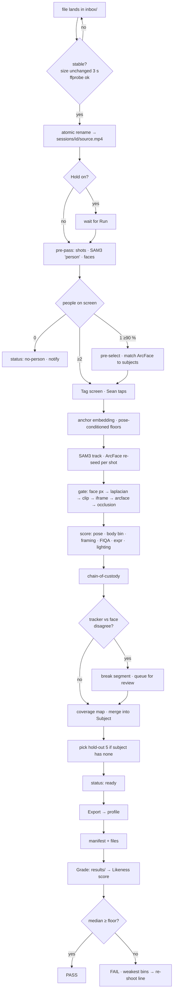
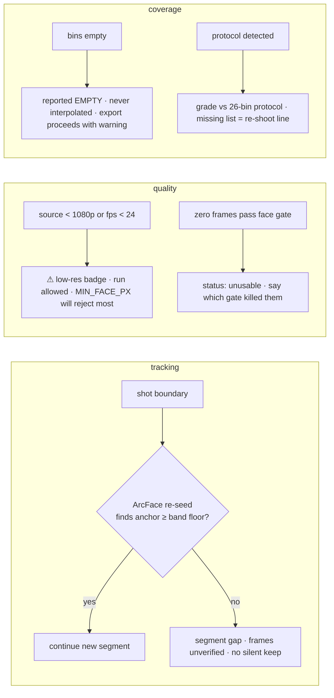

# Swan Likeness — Fable Blueprint (v1)

**Date:** 2026-09-02 · **Author:** Fable 5.1 (Final Decider) · **Inputs:** Opus 5 research
+ consult packet (`ce9d83d51`), official MiniMax platform docs (fetched this session),
Krea docs, `swan-taste-brain` on disk. **GLM 5.3 / 5.3-flash:** queued, blocked on the
Z.ai call lock at time of writing; folded in as a later round when they land.

> **Working name:** *Swan Likeness*. The app's one job is likeness. Sean picks the final name.
> **Placement:** new sibling repo `~/Desktop/swan-likeness`, same house pattern as
> `swan-taste-brain` (Node server, vanilla web UI, zero runtime deps, plain `.mjs` tests)
> plus a Python 3.12 CV worker. **Not** in SS-PT.

---

## 0. Hostile review of the prior work — what was wrong or thin

The research is a good skeleton. It is not a build plan. Ten findings, ranked:

| # | Finding | Severity | Fixed in |
|---|---|---|---|
| F1 | **"Exactly like the person" was never given a measurement.** The entire product promise had no acceptance test. Without one, every dataset is "probably fine" and Sean finds out it isn't after a paid H3 render. | **Critical** | §1 Likeness Loop |
| F2 | **Three Krea paths conflated into one "krea-train" profile.** Krea *Train* (cloud, 3–30 images), Krea 2 *edit-conditioning* (local ComfyUI, `TextEncodeQwenImageEditPlus`+`ReferenceLatent` — the only path already PROVEN on Sean's machine), and a local Krea 2 RAW LoRA (`TRAINING_NOTES`). They want different datasets. | **Critical** | §9 profiles |
| F3 | **No body-identity mechanism.** ArcFace is face-only. The research said "body must match" and then had nothing that verifies a full-body frame is the tagged person. | High | §7 chain-of-custody |
| F4 | **No cross-video subject model.** Sean will drop several videos of the same person over weeks. The research had "session" but coverage did not accumulate per person. The app must recognise "this is the same subject as last week" and merge. | High | §4 data model |
| F5 | **Watch folder would process half-copied files.** `fs.watch` fires on create, long before a 4 GB MP4 finishes copying. | High | §3 stage 0 |
| F6 | **"Hard floor on face pixels" with no number.** A worker-bot cannot build a gate from an adjective. | Med | §6 numbers |
| F7 | **The lighting contradiction was punted.** Now resolved: MiniMax's own guidance is *"pick references that agree on identity, lighting, and framing — conflicting images pull the result in different directions."* Uniform wins for reference sets. | Med | §6 |
| F8 | **Set selection for H3's 9-image cap was hand-waved** ("maximize coverage"). Needs an algorithm. | Med | §8 |
| F9 | **H3 image limits were cited from a third-party page.** Now verified against `platform.minimax.io`: images JPG/PNG/WEBP/HEIC/HEIF, **each side 256–5760 px, aspect 2:5–5:2, ≤30 MB, ≤9**; clips H.264/H.265, **2–15 s each, ≤15 s total, ≤50 MB, ≤3**; **12 files total**; role `reference_image`. | Low | §9 |
| F10 | **Capture Protocol was a paragraph, not a spec.** The single highest-leverage idea in the research got two sentences. | Med | §5 |

The research's four strategic findings (H3 ≠ Krea artifacts; 360° is a target not a
property; nobody does person-lock + coverage map; reuse `lib/lora.mjs`) all **survive
review** and are the foundation below.

---

## 1. The one idea that makes this "locked in": the Likeness Loop

Sean's bar, in his words: *"I don't want it giving me a different person. I want the
person I'm giving it."* That is a **measurable** statement, and the app must measure it.

```
   source video ──► harvest ──► dataset ──► [H3 / Krea] ──► generated output
                        │                                        │
                        │  hold out 5 frames (never exported)     │
                        └──────────► LIKENESS SCORE ◄────────────┘
                                 ArcFace(generated) vs ArcFace(held-out)
```

**Rules of the loop:**

1. **Hold-out set.** From every subject, the app withholds **5 face-verified frames across
   ≥3 yaw bins** that are *never* exported to any profile. They exist only to grade output.
2. **Likeness Score** = mean ArcFace cosine between faces detected in the *generated* output
   (still, or sampled frames of a generated video) and the held-out set. Compared against the
   *held-out* set, not the training set — comparing against training frames rewards
   memorisation, not likeness.
3. **Calibrated, not guessed.** The pass threshold is set from the subject's own
   *self-similarity distribution* (held-out vs. exported frames of the same person, across
   the same yaw bins). `pass = score >= (self_mean − 1.5·self_std)`. This adapts to the
   person and to pose — it is the answer to research risk R3 (fixed thresholds kill profiles).
4. **Verdict is per-output and per-dataset.** One bad render is the prompt; a bad *median*
   across 4 renders is the **dataset**, and the app says so: *"Likeness 0.41 vs. self-floor
   0.52 — the dataset is not carrying identity. Weakest bins: rear-left, chin-down."*
5. **Body check, coarser.** For full-body outputs, compare a person re-ID embedding
   (OSNet, clothing-sensitive) *only when the generated clothing matches the source* —
   otherwise skip and report `body: not comparable`. Never fake a body score.

**This loop is the product.** The harvester, coverage map, and exporters exist to make the
score go up. Every slice below is gated by whether it moves this number.

---

## 2. Product definition

**Input:** a video file (or several) dropped in `inbox/`.
**Output:** per subject, a **coverage-mapped, identity-verified image + clip library**,
exported on demand to any target via a profile — H3, Krea Train, Krea 2 edit-conditioning,
local LoRA, or generic — plus a Likeness Score on whatever the target produced.

**Main path, click count (Sean's mandate):**

| Step | Sean does | Clicks |
|---|---|---|
| 1 | Drops `walk-in-park.mp4` into `inbox/` | 0 (file drop) |
| 2 | App detects a complete file, auto-runs the pre-pass, opens the tag screen | 0 |
| 3 | Taps the person (one tap on one frame). If only one person is on screen for ≥90 % of the video, the app pre-selects and Sean just confirms | **1** |
| 4 | App tracks, gates, scores, builds coverage map, auto-matches to an existing subject if ArcFace agrees | 0 |
| 5 | Sean reviews the coverage map; taps **Export → H3** | **1** |
| **Total** | | **2 taps** (3 if a new subject needs naming) |

**Manual override:** a **Run** button on any inbox file, and a **Re-run** on any session with
changed thresholds. Auto-run can be paused globally (a "Hold" toggle) — Sean's *"or I could
just choose to start it myself."*

---

## 3. Architecture — stages, each with input, output, model, and why

```
inbox/ ──0──► ingest ──1──► pre-pass ──2──► TAG ──3──► track ──4──► gate ──5──► score
                                                                                 │
   export ◄──8── select ◄──7── coverage ◄──6── identity chain-of-custody ◄───────┘
     │
     └──9──► LIKENESS LOOP (on whatever the target produced)
```

| # | Stage | Input → Output | Model / lib | Why this one |
|---|---|---|---|---|
| 0 | **Ingest** | file in `inbox/` → `sessions/<id>/source.mp4` + probe JSON | Node `fs.watch` + **stability gate**: size unchanged for 3 s AND `ffprobe` parses cleanly AND mtime > 5 s old. Then atomic `rename` into the session. | Fixes F5. A file is "arrived" only when it stops growing and decodes. |
| 1 | **Pre-pass** | video → shot list, sampled frames (every 0.5 s), person detections, face detections | PySceneDetect (shots); SAM 3 text prompt `"person"` for candidate people; InsightFace `buffalo_l` (det + ArcFace) | Cheap survey to power the tag screen and pre-select when there is one person. |
| 2 | **Tag** | Sean's one tap → `subject_anchor` (frame id, point, SAM 3 object id, ArcFace anchor embedding = mean of the 5 sharpest anchor-adjacent faces) | UI | The anchor embedding is the identity ground truth for the whole run. |
| 3 | **Track** | anchor → per-frame mask + object id for the tagged person, across shots | **SAM 3** video tracker, re-seeded per shot boundary by ArcFace re-identification (highest cosine to anchor among detected faces in the first 10 frames of the shot) | SAM 3 holds identity *within* a shot; ArcFace re-seeds it *across* shots. Neither alone survives a cut. |
| 4 | **Gate** (cheap → expensive) | tracked frames → survivors | (a) face box ≥ `MIN_FACE_PX` (§6); (b) Laplacian variance **on the face crop** ≥ threshold; (c) exposure: <2 % clipped pixels in face crop; (d) I-frame preferred (`ffprobe -show_frames pict_type`); (e) ArcFace cosine to anchor ≥ pose-conditioned floor (§7); (f) occlusion: face-parsing (BiSeNet) skin+eyes+nose+mouth coverage ≥ 85 % of expected | Order matters: (a)–(d) are microseconds; (e)–(f) are models. Only survivors pay for models. |
| 5 | **Score** | survivor → per-frame record: yaw/pitch/roll (6DRepNet360), body orientation (MEBOW → 8 bins), framing class (face / head-shoulders / half / full, from mask-height ÷ frame-height), FIQA (CR-FIQA), expression (neutral / smile / other via MediaPipe blendshapes), lighting vector (mean L*, contrast, colour temp estimate on face crop) | All standard; all written to the session DB. |
| 6 | **Chain-of-custody** | records → each frame carries `identity_proof ∈ {face-verified, chain-verified, unverified}` | §7 | Gives body frames identity without a body-ID model. |
| 7 | **Coverage** | subject's verified frames (all sessions) → bin fill counts | 12 yaw × 3 pitch head bins; 8 body-orientation bins × 4 framing classes; expression + lighting histograms | The honest report. Empty stays empty. |
| 8 | **Select + export** | coverage + profile → files + manifest | §8 algorithm; §9 profiles; reuse `swan-taste-brain/prompter/lib/lora.mjs` for caption/token/licence gate | Profile-driven so a new target is a JSON file. |
| 9 | **Likeness Loop** | generated output dropped in `results/<subject>/` → score + verdict + weakest-bins | §1 | The product. |

**Process shape:** Node server (`serve.mjs`) owns the UI, the watcher, the session DB, and
export. It spawns **one long-lived Python worker** (`worker/main.py`) over stdio JSON-lines;
the worker loads SAM 3 + InsightFace + 6DRepNet + CR-FIQA once and keeps them warm on the
5090. All heavy work is a job on a queue; the UI polls `/api/session/<id>/progress`.
Never one Python process per frame.

**VRAM budget (5090, 32 GB):** SAM 3 (~4–6 GB bf16), InsightFace (<1 GB), 6DRepNet (<1 GB),
CR-FIQA (<1 GB), MEBOW (<1 GB), BiSeNet (<1 GB). Fits with >20 GB spare — ComfyUI on 8189
can stay up. `[UNSURE]` on the SAM 3 figure; measure in slice 2.

---

## 4. Data model

```
Subject                       -- a real person; the identity anchor across all videos
  id, display_name, consent {given:bool, note, date}
  anchor_embedding[512]       -- running mean of face-verified embeddings, updated per session
  self_similarity {mean, std} -- per yaw bin; drives the Likeness floor
  holdout_frame_ids[5]        -- never exported; chosen once, across >=3 yaw bins
  created_at

Session                       -- one source video processed for one subject
  id, subject_id, source_path, probe {w,h,fps,duration,codec}
  shots[] {start_frame, end_frame, reseed_ok:bool}
  status ∈ {ingested, prepass, awaiting_tag, tracking, gating, scoring, ready, failed}
  thresholds_used {…}         -- frozen copy, so a re-run is reproducible
  created_at

Frame                         -- one candidate still (only survivors are persisted)
  id, session_id, frame_no, timestamp, is_iframe
  bbox_face, bbox_person, mask_path
  embedding[512], cos_to_anchor
  identity_proof ∈ {face-verified, chain-verified, unverified}, proof_chain_id
  yaw, pitch, roll, body_bin(0..7), framing ∈ {face, head-shoulders, half, full}
  fiqa, laplacian_face, clipped_pct, occlusion_pct
  expression ∈ {neutral, smile, other}, lighting {L, contrast, temp}
  quality_score               -- §8 weighted composite
  status ∈ {candidate, kept, rejected:<reason>, holdout}

Clip                          -- a 2–15 s span for targets that take video
  id, session_id, start_ts, end_ts, identity_min_cos, motion_class, has_speech

Export                        -- one emitted dataset
  id, subject_id, profile_name, frame_ids[], clip_ids[], out_dir, manifest_path, created_at

LikenessRun                   -- one graded output
  id, subject_id, export_id, source ∈ {h3, krea-train, krea2-edit, lora, other}
  output_paths[], score, floor, verdict ∈ {pass, weak, fail}, weakest_bins[], created_at
```

Storage: **SQLite** via `node:sqlite` (Node 22.5+ ships it; zero deps) at
`data/likeness.db`. Frames on disk as PNG (lossless — never re-JPEG a training frame).

---

## 5. The Capture Protocol — the shoot script (the biggest upgrade)

Research risk R1 said video may not clear the bar. The answer is not a better harvester;
it is **footage designed to be harvested**. The app ships a shoot script and grades footage
against it. When Sean shoots to protocol, coverage is complete by construction.

**Camera:** 4K (3840×2160) minimum, **60 fps**, shutter **≥ 1/250 s** (motion blur is the
enemy; 60 fps + fast shutter = sharp frames even mid-turn), fixed focus locked on the
subject's face, fixed exposure (no auto-exposure drift across the orbit), tripod, lens at
≥ 50 mm equivalent for the face pass (no wide-angle distortion of features).

**Lighting:** soft, even, front-ish key (large window or softbox), fill to keep shadow
side ≤ 1.5 stops down, **no colour-changing light**, neutral background. Uniform lighting
is the *default* because MiniMax's guidance says conflicting lighting pulls the result apart,
and because a LoRA learns lighting as readily as it learns a face.

**The script** (the app displays it and shows a live "bins filling" overlay — see §10 M3):

| Pass | Subject does | Frames the app expects |
|---|---|---|
| **A — Face orbit** (2.5 m, face fills ≥ 40 % of frame height) | Stand still. Turn in **45° steps**: 0, 45, 90, 135, 180, 225, 270, 315. **Hold each 2 s.** Neutral expression, eyes open, mouth closed. | 8 yaw bins × pitch 0 |
| **B — Pitch** (same distance) | At 0° and 45° and 315°: chin up 20°, hold 2 s; chin down 20°, hold 2 s | 6 more head bins |
| **C — Expression** (0°, 45°) | Natural smile 2 s; laugh 2 s; talking 5 s (for clip refs) | expression histogram |
| **D — Body orbit** (5 m, full body in frame, head-to-toe with margin) | Same 8-stop turn, hold 2 s each, arms relaxed at sides | 8 body bins × `full` framing |
| **E — Half-body** (3.5 m) | 0°, 45°, 315°, 90°, 270°; hold 2 s | `half` framing bins |
| **F — Motion clip** (5 m) | Walk toward camera 4 s, turn, walk away 4 s, turn back | Clip refs for H3 |
| **G — Lighting diversity** (optional, 0° only) | Repeat pass A stops 0/45/315 under one *different* light (window side-light) | the 20 % diversity slice for training profiles |

Total ≈ 3 minutes of footage. **Pausing at each stop matters** — the photogrammetry
turntable industry stops at every angle for the same reason.

**Protocol grading:** when a session's source is flagged `protocol: true` (auto-detected
if ≥ 6 of 8 yaw bins fill with hold-still frames), the app reports *"Protocol coverage
23/26 bins — missing: pitch-down@45, half@270, lighting-B@315."* That line is the re-shoot
instruction. **Casual video still works** — it just usually gets a longer missing list.

---

## 6. Numbers a worker-bot needs (all tunable; all frozen into `Session.thresholds_used`)

| Parameter | Value | Basis |
|---|---|---|
| `MIN_FACE_PX` (face framing) | **≥ 512 px** face box height | Training res is 1024; a face crop upscaled >2× is invented detail. At 4K/2.5 m this is easy; at 1080p it forces close-ups. `[UNSURE]` — tune on the first real render |
| `MIN_FACE_PX` (half / full framing) | **≥ 160 px** | Full-body frames teach body; the face here is not the identity source, chain-of-custody is (§7) |
| `MIN_PERSON_PX` (full framing) | subject mask height **≥ 70 %** of frame height | Anything smaller is a background person |
| Laplacian var (face crop, 512 px normalised) | **≥ 120** | Standard starting point; recalibrate per camera — the test suite has a blurred-fixture positive control |
| Clipped pixels (face crop) | **< 2 %** at L<3 or L>252 | |
| ArcFace floor | **pose-conditioned**, §7 | Never a single number |
| Near-duplicate | cos ≥ **0.95** AND \|Δyaw\| < 5° AND \|Δpitch\| < 5° AND same expression → duplicate | |
| Hold-out | **5** frames, ≥ 3 yaw bins, face-verified only | |
| Diversity slice (training profiles) | **20 %** of the set from pass G lighting or off-key lighting; **0 %** for reference profiles (H3, Krea 2 edit) | MiniMax guidance + LoRA generalisation, reconciled |
| Expression mix (training) | ~70 % neutral, ~30 % smile/other | Neutral is the identity anchor |
| Framing mix (training, 24 frames) | 10 face · 6 head-shoulders · 4 half · 4 full | Face carries identity; body must be present |

---

## 7. Identity chain-of-custody — how a body frame earns trust

ArcFace verifies faces. A rear-view full-body frame has no face. Rather than bolt on a body-ID
model (clothing-sensitive, brittle), use **temporal custody**:

```
tracker segment S (unbroken SAM 3 object id, no shot boundary, no mask gap > 3 frames)
   anchored by  ≥ 3 face-verified frames within S
   ⇒ every frame in S is  chain-verified
   ⇒ a frame in S more than 4 s from the nearest face-verified frame is  unverified
```

**Pose-conditioned face floor.** Compute the anchor's own cosine distribution at tag time
by yaw band (frontal ±30°, three-quarter 30–75°, profile 75–105°, beyond = no face check).
Floor per band = `mean − 2·std` of that band's *anchor-adjacent* frames, with a hard
minimum of 0.25. Profile frames are checked against a *profile* floor, not a frontal one —
this is what stops the gate from rejecting the 360° coverage it exists to collect.

**Second-opinion rule (research R4).** Tracker says same object, ArcFace says different face
(cos below the band floor by > 0.10) → **break the segment there**, mark both halves, and put
the frame on the review screen with both faces side by side. The app never silently keeps a
frame the two systems disagree on.

**Two-people fixture** (§12) is the positive control for all of this.

---

## 8. Selection — the algorithm behind "pick the best N"

Every kept frame gets `quality_score = 0.45·FIQA + 0.25·norm(laplacian) + 0.15·(1 − clipped)
+ 0.15·(1 − occlusion)`. Then, per profile:

1. **Hard filters:** `identity_proof ∈ profile.allowed_proof`, framing ∈ profile.framing_mix,
   lighting within `profile.lighting_tolerance` of the session median unless the frame is
   flagged for the diversity slice, not a hold-out.
2. **Farthest-point sampling** in the joint space
   `[yaw/180, pitch/90, body_bin/8, framing_idx/4, expression_idx/3, lighting_L/100]`
   (weights configurable per profile), seeded with the single highest-`quality_score`
   frontal face-verified frame. At each step pick the candidate maximising
   `min_distance_to_selected × quality_score`. Stop at `profile.max_images`.
3. **Quota repair:** if the framing mix or expression mix is under quota, swap the
   lowest-value selected frame in the over-represented class for the best frame in the
   under-represented one. Two passes maximum.
4. **Dedup guard:** reject any pick within the §6 near-duplicate radius of an existing pick.

Deterministic given the same inputs (ties broken by frame id). The test suite asserts that.

**Clips** (profiles with `max_clips > 0`): candidate spans = chain-verified runs ≥ 2 s;
score = `min_cos_to_anchor × motion_class_weight × (has_speech ? 1.2 : 1)`; take the top
`max_clips` non-overlapping spans, trimmed to `[2, 15]` s each and ≤ `total_clip_s` combined,
re-encoded H.264 at source resolution. H3's clip references carry motion and voice that no
still can — this is why clips are in.

---

## 9. Export profiles — a JSON file per target

`profiles/<name>.json`. Adding a target = adding a file. Four ship on day one:

```jsonc
// profiles/h3-reference.json   — MiniMax H3 reference set (official limits, fetched 2026-09-02)
{ "target": "minimax-h3", "max_images": 9, "max_clips": 3, "clip_s": [2, 15], "total_clip_s": 15,
  "max_files": 12, "image": { "format": "png", "side_px": [256, 5760], "aspect": [0.4, 2.5], "max_mb": 30 },
  "clip":  { "codec": "h264", "audio": "aac", "side_px": [256, 5760], "aspect": [0.4, 2.5], "max_mb": 50 },
  "allowed_proof": ["face-verified", "chain-verified"], "diversity_pct": 0,
  "framing_mix": { "face": 4, "head-shoulders": 2, "half": 1, "full": 2 },
  "lighting_tolerance": "tight", "role": "reference_image" }

// profiles/krea-train.json     — Krea cloud Train
{ "target": "krea-train", "max_images": 24, "max_clips": 0,
  "image": { "format": "png", "min_side_px": 1024 }, "allowed_proof": ["face-verified", "chain-verified"],
  "diversity_pct": 20, "framing_mix": { "face": 10, "head-shoulders": 6, "half": 4, "full": 4 },
  "expression_mix": { "neutral": 0.7 }, "lighting_tolerance": "tight" }

// profiles/krea2-edit.json     — local ComfyUI edit-conditioning (the PROVEN path)
{ "target": "comfyui-qwen-edit", "max_images": 3, "max_clips": 0,
  "image": { "format": "png", "min_side_px": 1024 }, "allowed_proof": ["face-verified"],
  "framing_mix": { "face": 2, "head-shoulders": 1 }, "diversity_pct": 0, "lighting_tolerance": "tight",
  "note": "hero + two supporting; feeds TextEncodeQwenImageEditPlus + ReferenceLatent on 8189" }

// profiles/lora-local.json     — local Krea 2 RAW LoRA via swan-taste-brain doctrine
{ "target": "lora", "max_images": 30, "max_clips": 0, "caption": "lib/lora.mjs:captionFor",
  "token_rule": "lib/lora.mjs:TOKEN_RE", "image": { "format": "png", "side_px_exact": 1024, "crop": "face-centred-square" },
  "allowed_proof": ["face-verified", "chain-verified"], "diversity_pct": 20,
  "framing_mix": { "face": 12, "head-shoulders": 8, "half": 5, "full": 5 },
  "training_notes": "reuse TRAINING_NOTES; identity LoRA may need lower strength than style — measure with the Likeness Loop" }
```

Every export writes `manifest.json`: subject id, profile, frame list with per-frame
proof/pose/scores, hold-out ids (listed, **not** included), thresholds, coverage snapshot,
consent flag, and a `restoration: none` line — **face restoration is not offered in v1**
(research R2: it hallucinates identity; there is no version of this app where a generative
restorer is on by default).

The export reuses `swan-taste-brain/prompter/lib/lora.mjs` for token validation, captions and
the licence gate — **import it by path, do not copy it**; a copy drifts.

---

## 10. Wireframes

Vanilla HTML/CSS/JS, one page, four panes, no framework. Dark-first, Swan palette tokens.

### D1 — Desktop: Inbox (idle / auto-run)

```
┌─ Swan Likeness ───────────────────────────────────────────────── [Hold ○] [Settings] ┐
│ SUBJECTS                 │ INBOX  ~/swan-likeness/inbox/                              │
│ ● Sean         31 bins   │  walk-in-park.mp4     4K 60fps 2:41   ● copying… 71 %      │
│ ● Subject-02   12 bins   │  studio-protocol.mp4  4K 60fps 3:05   ✔ ready → auto-run   │
│ + new                    │  old-phone.mov        1080p 30 1:10   ⚠ low-res  [Run]     │
│                          │                                                            │
│ RECENT SESSIONS          │  Drop files here. Complete files run automatically.        │
│ studio-protocol → Sean   │  Hold ○ pauses auto-run; [Run] starts one by hand.         │
│   tracking  ▓▓▓▓▓░░ 68 % │                                                            │
└──────────────────────────┴────────────────────────────────────────────────────────────┘
```

### D2 — Desktop: Tag (one tap)

```
┌─ Tag the person · studio-protocol.mp4 ─────────────────────────────────────────────────┐
│  ┌───────────────────────────────────────────────┐  Who is this?                        │
│  │                                               │  ◉ Sean        (ArcFace 0.71 match)   │
│  │        [frame with 2 people, SAM masks]       │  ○ Subject-02  (0.22)                 │
│  │         ┌──────┐                              │  ○ New subject  [name…]               │
│  │         │ tap  │      ┌──────┐                │                                       │
│  │         │  me  │      │      │                │  1 person on screen 94 % of video —   │
│  │         └──────┘      └──────┘                │  pre-selected. Tap to change.         │
│  └───────────────────────────────────────────────┘                                       │
│  ◄ ▌▌ ►  ────────●──────────────────────────  0:12 / 3:05   [ Confirm & track  ▶ ]      │
└─────────────────────────────────────────────────────────────────────────────────────────┘
```

### D3 — Desktop: Coverage + Review (the honest report)

```
┌─ Sean · 3 sessions · 412 kept / 9 880 seen ────────────────────────── [Export ▾] [Grade]─┐
│ HEAD  yaw→   0   45   90  135  180  225  270  315     BODY  full  half  h-s  face        │
│ pitch +20   ▓▓   ▓░   ░░   ──   ──   ──   ░░   ▓░       0°    ▓▓    ▓▓   ▓▓   ▓▓          │
│ pitch  0    ▓▓   ▓▓   ▓▓   ▓░   ▓░   ▓░   ▓▓   ▓▓      45°    ▓▓    ▓░   ▓▓   ▓▓          │
│ pitch −20   ▓▓   ▓▓   ░░   ──   ──   ──   ▓░   ▓▓      90°    ▓░    ──   ▓░   ▓░          │
│ ▓▓ ≥6 frames  ▓░ 2–5  ░░ 1  ── EMPTY                  135°    ░░    ──   ──   ──          │
│                                                        180°    ▓░    ──   ──   ──          │
│ MISSING (re-shoot): pitch+20 @ 135/180/225 · half @ 90/135/180 · face @ 135/180           │
│ Lighting: 91 % within tolerance · Expression: 68 % neutral / 24 % smile / 8 % other        │
│                                                                                            │
│ NEEDS YOUR EYE (3)   [tracker ≠ face]  frame 4 812 ▣ vs anchor ▣   [keep] [drop]           │
│ HOLD-OUT (5, never exported)  ▣ ▣ ▣ ▣ ▣                                                    │
│ KEPT (412)  sort: quality ▾   ▣ ▣ ▣ ▣ ▣ ▣ ▣ ▣ ▣ ▣ ▣ ▣ ▣ ▣ ▣ ▣ ▣ ▣ ▣ ▣ ▣ ▣ ▣ ▣ …            │
└────────────────────────────────────────────────────────────────────────────────────────────┘
```

### D4 — Desktop: Grade (Likeness Loop)

```
┌─ Grade · Sean · export h3-reference #7 ────────────────────────────────────────────────┐
│ Drop H3 / Krea output here, or watch  results/sean/                                    │
│  render-01.mp4   score 0.63   floor 0.52   ✔ PASS   weakest: rear-left                 │
│  render-02.mp4   score 0.58   floor 0.52   ✔ PASS                                      │
│  render-03.png   score 0.39   floor 0.52   ✘ FAIL   weakest: profile-R, chin-down      │
│  render-04.png   score 0.44   floor 0.52   ✘ FAIL                                      │
│ DATASET VERDICT: median 0.51 < floor — dataset is not carrying identity in             │
│ profile-R and chin-down. Shoot pass A stops 90/270 + pass B, then re-export.           │
└────────────────────────────────────────────────────────────────────────────────────────┘
```

### M1–M4 — Mobile (414 px)

```
M1 Inbox                    M2 Tag                     M3 Shoot overlay (protocol)
┌────────────────────┐      ┌────────────────────┐     ┌────────────────────┐
│ Swan Likeness  ○   │      │ Tag the person     │     │ PASS A · stop 4/8  │
│ Sean      31 bins  │      │ ┌────────────────┐ │     │  ┌──────────────┐  │
│ Subject-02 12 bins │      │ │  [frame]       │ │     │  │  camera view │  │
│ ───────────────    │      │ │   (tap)        │ │     │  │   ▓▓▓░░░░░   │  │
│ INBOX              │      │ └────────────────┘ │     │  └──────────────┘  │
│ studio…  ▓▓▓░ 68 % │      │ ◉ Sean  0.71       │     │  Turn to 135°.     │
│ old-phone ⚠ [Run]  │      │ ○ New subject      │     │  Hold 2 s… ●●○     │
│                    │      │ ◄ ●───────── ►     │     │  bins 11/26        │
│ [ + add video ]    │      │ [ Confirm ▶ ]      │     │  [ skip ] [ done ] │
└────────────────────┘      └────────────────────┘     └────────────────────┘
M4 Coverage: the D3 grid stacked (HEAD grid, then BODY grid), MISSING list first,
review cards full-width, one [keep]/[drop] pair per card, all targets ≥ 44 px.
```

M3 is the phone-as-monitor: the desktop runs the pipeline live on a tethered/AirDropped
stream in v2; in **v1 it is a static checklist with a stopwatch** — no live CV on the phone.

---

## 11. Flowcharts

### Main path



### Failure branches that matter



---

## 12. Tests — what proves each stage, with positive controls

House style: plain `node test-*.mjs` scripts for the Node side; `pytest` for the worker.
**Every absence claim has a positive control** — a fixture that would fail if the check
were broken (learning packet 2026-08-16: author-written tests sample the author's imagination).

**Golden fixtures** (`fixtures/`, committed, synthetic or Sean-consented only):

| Fixture | Purpose |
|---|---|
| `protocol-sean-4k.mp4` (3 min, shot to §5) | end-to-end; expected 26/26 bins |
| `two-people.mp4` | Sean + a second person crossing, overlapping, similar clothing |
| `swap-injected.mp4` | `two-people` with 12 frames of person B *spliced into* A's segment at frame 4 800 |
| `frontal-only.mp4` | 60 s of Sean, yaw within ±20° only |
| `blurred.mp4` | protocol video re-encoded with motion blur (ffmpeg `tblend`) |
| `half-copy.mp4.part` → `.mp4` | ingest stability |
| `low-res-1080p.mp4` | face gate math |
| `casual-phone.mov` | the realistic case |

| # | Test | Asserts | Positive control |
|---|---|---|---|
| T0 | ingest stability | a file still growing is not picked up; picked up ≤ 5 s after it stops | start a copy that pauses at 50 %; assert NOT ingested; resume; assert ingested |
| T1 | pre-pass person count | `two-people` → 2; `protocol` → 1 pre-selected | |
| T2 | tag → anchor | anchor = mean of 5 sharpest faces within ±1 s of the tap; cosine of each ≥ 0.6 | |
| T3 | **identity lock** | on `swap-injected`, the 12 spliced frames are all `rejected:identity` or `unverified`; **zero** reach `kept` | run the same test with the ArcFace gate disabled → spliced frames MUST leak to `kept` (proves the test can fail) |
| T4 | shot re-seed | `two-people`: after each cut, the tracked object's first-10-frame faces have cos to anchor ≥ band floor | invert the anchor (use person B's) → assert re-seed picks B |
| T5 | pose-conditioned floor | on `protocol`, profile frames (yaw 75–105°) are kept at ≥ 80 % rate | replace band floors with a single 0.45 → profile keep rate drops below 30 % (documents *why* the band floor exists) |
| T6 | chain-of-custody | `protocol` pass D rear frames (no face) are `chain-verified`; frames > 4 s from any face-verified frame are `unverified` | cut the segment (inject a 5-frame mask gap) → downstream frames drop to `unverified` |
| T7 | **coverage honesty** | `frontal-only` → yaw bins 90–270 are EMPTY in the map, the export manifest lists them as missing, and the export still succeeds with a warning | fill one rear bin with a hand-added frame → that bin, and only that bin, reports non-empty |
| T8 | blur gate | `blurred` → ≥ 90 % rejected at laplacian; `protocol` → ≤ 10 % rejected there | |
| T9 | face-px gate | `low-res-1080p`, face framing → rejected when box < 512; half/full → kept when ≥ 160 | |
| T10 | selection determinism | same session + profile twice → identical frame id list | perturb one `quality_score` by 0.001 → list changes (proves it is reading the score) |
| T11 | selection quotas | `h3-reference` → exactly 9 images, framing mix ±1, no two picks inside the dup radius, 0 hold-outs | inject a duplicate pair with top scores → only one selected |
| T12 | H3 limits | every exported image side ∈ [256, 5760], aspect ∈ [0.4, 2.5], ≤ 30 MB; clips 2–15 s, ≤ 15 s total, ≤ 50 MB, H.264; files ≤ 12 | feed a 6000 px frame → exporter downsizes or rejects, never emits |
| T13 | hold-out never exported | across all 4 profiles, intersection(export.frame_ids, subject.holdout) = ∅ | delete the hold-out filter → intersection non-empty |
| T14 | licence gate reuse | `lora-local` export refuses any frame whose `source` is not a session (a stray reference photo) — via `lib/lora.mjs` | seed one photograph → refused with the lib's error |
| T15 | **Likeness Loop** | on `protocol` output rendered by Krea 2 edit-conditioning (ComfyUI 8189, seed fixed): score ≥ subject floor | grade a render of a *different* person → FAIL; grade the subject's own held-out frame → score ≈ 1.0 upper control |
| T16 | subject merge | second `protocol` session auto-matches Sean (cos ≥ 0.6 to anchor); coverage counts add | a `two-people` session tagged on B → new subject, Sean's bins unchanged |
| T17 | re-run reproducibility | re-run with `thresholds_used` → identical kept set | |
| T18 | worker resilience | kill the Python worker mid-session → Node marks session `failed`, restarts worker, `Re-run` resumes from the last completed stage | |

---

## 13. Slices — numbered, independently shippable

Slice 1 proves or kills the premise before any UI exists. Nothing later is built if it fails.

| # | Slice | Acceptance |
|---|---|---|
| **1** | **Premise spike, no app.** Sean shoots the §5 protocol once (phone is fine at 4K/60). Python script: InsightFace + Laplacian, hand-picked thresholds, dump best 24 frames. Feed `krea2-edit` (3 frames) through the proven ComfyUI path AND upload 24 to Krea Train (Sean's account). **Grade both with a throwaway Likeness script against 5 held-out frames.** | A written number. If median likeness ≥ subject self-floor on at least one path → proceed. If not → the app becomes a stills-capture director (DSLR tether) and §3 is re-planned. **This slice's output is one paragraph and two numbers, not code.** |
| 2 | Worker skeleton | `worker/main.py` loads SAM 3, InsightFace, 6DRepNet360, CR-FIQA, MEBOW, BiSeNet once; JSON-lines protocol; VRAM measured and written down; `pytest` smoke on each model with a fixture frame |
| 3 | Ingest + pre-pass + SQLite | T0, T1; `serve.mjs` with the D1 inbox pane; Hold toggle; Run button |
| 4 | Tag + track + gate | T2–T5; D2 screen; two-people fixture green |
| 5 | Score + custody + coverage | T6–T9; D3 grid + MISSING line; subject merge (T16) |
| 6 | Select + export (4 profiles) + `lib/lora.mjs` reuse | T10–T14; manifests; H3 limits enforced from the official numbers |
| 7 | **Likeness Loop** | T15; D4 screen; `results/` watcher; dataset verdict + re-shoot line |
| 8 | Clips | H3 clip export; T12 clip half; speech detection via `ffmpeg` silencedetect |
| 9 | Protocol overlay (M3 static) + protocol grading | 26-bin grade; missing list |
| 10 | Hardening | T17–T18; low-res path; re-run; Subject consent field surfaced in UI and manifest |

Each slice: build → gates → **hostile pass until dry** (Rule 73) → local commit. Push at batch end.

---

## 14. My three strongest objections to this design

**O1 — The premise may still fail, and slice 1 is the only honest answer.** Even shot to
protocol, an 8-bit H.264 frame is not a RAW still. If slice 1's likeness number is weak on
*both* paths, no amount of gating fixes it — the tool should then drive a **tethered stills
camera** (gphoto2 / Sony Remote SDK) through the same protocol, and the video path becomes
the fallback for casual footage. I have built the design so that only stages 0–1 change in
that world (ingest stills instead of video; SAM 3 becomes single-image). Do not skip slice 1
to "save time." It *is* the time-saver.

**O2 — The Likeness Score is a face score wearing a body costume.** ArcFace measures faces.
Sean asked for the *body* to match. The custody chain guarantees the *dataset's* body frames
are the right person; it does not measure whether the *generated* body is right. The
re-ID-when-clothing-matches rule is a partial answer. A real body-shape metric (SMPL-X betas
from a body-shape estimator on source vs. output) is v2 — and even that is `[UNSURE]` on
robustness to generated imagery. **v1 should say "body: verified in dataset, not graded in
output" in plain words on the Grade screen** rather than imply a number it does not have.

**O3 — SAM 3 is the newest, least battle-tested piece, and it sits on the critical path.**
Licence, Windows + Python 3.12 + CUDA on a Blackwell card, and its behaviour on long
occlusions are all `[UNSURE]` until slice 2 runs. The design deliberately makes the tracker
*replaceable*: ArcFace re-seeding per shot plus custody means a weaker tracker (SAM 2, or
even ByteTrack on person boxes) degrades coverage, not identity. If SAM 3 fights back in
slice 2, swap to SAM 2 and move on — do not spend a week on it.

---

## 15. Decisions Sean owns

1. **Name.** *Swan Likeness* or his own.
2. **Slice 1 shoot** — he is the subject; ~3 minutes at 4K/60 to the §5 script.
3. **Consent posture** — v1 is Sean + consenting adults only; the consent field is in the
   model and manifest from day one so a client path later is a policy switch, not a rewrite.
4. **Krea account** for the slice-1 Train upload (his subscription; the app never holds keys).
5. **Whether this outranks SwanStudios production work this week.** It is a side tool.
   Slice 1 is one shoot + one evening; the rest is ~10 slices.

---

## Sources (this document's own verification)

- [MiniMax Video Generation API docs — platform.minimax.io](https://platform.minimax.io/docs/guides/video-generation) — image/clip limits quoted in F9 and §9
- [MiniMax H3 reference-image guidance — WaveSpeed](https://wavespeed.ai/blog/minimax-h3/minimax-h3-reference-images-api/) — "references that agree on identity, lighting, framing"
- [MiniMax H3 model post — MiniMax Research](https://www.minimax.io/blog/minimax-h3)
- [Krea Training docs](https://www.krea.ai/docs/features/training)
- Prior research + sources: `docs/ai-workflow/brainstorms/character-capture-app-research-2026-09-02.md`
- On-disk: `~/Desktop/swan-taste-brain/prompter/lib/lora.mjs`, `export-lora-dataset.mjs`, `test-lora.mjs`; learning packet `20260902-style-reference-copies-aesthetics-identity-needs-edit-conditioning.md`
