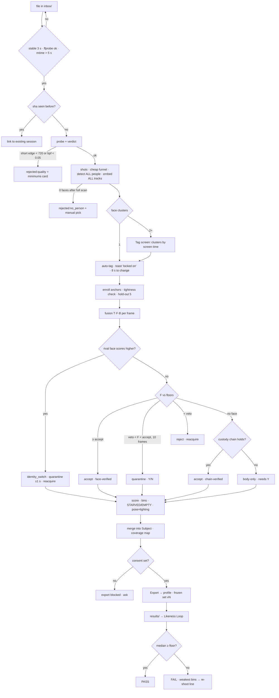

# Swan Likeness — Fable Blueprint v2 (GLM-synthesised)

**Date:** 2026-09-02 · **Author:** Fable 5.1 (Final Decider) · **Linear:** SWA-239
**Inputs:** v1 (`43ff8d64f`) · `CHARACTER-CAPTURE-GLM-53.md` (5.3, 27k out, 1016 s, served as requested, complete) ·
`CHARACTER-CAPTURE-GLM-53-FLASH.md` (flash, 24k out, 861 s, served as requested, complete) ·
official MiniMax platform docs (fetched this session) · `swan-taste-brain` on disk.

> **Working name:** *Swan Likeness* (Sean's call). **Placement:** `~/Desktop/swan-likeness`, sibling of
> `swan-taste-brain`; Node server + vanilla web UI + Python CV worker; **not** in SS-PT.
> Tags: `[VERIFIED]` I checked it this session · `[CONSULT]` a GLM claim I did not verify · `[UNSURE]` nobody has.

---

## 0a. What v1 got wrong (the hostile review of the Opus research — unchanged from v1)

Ten findings; the two critical ones were **F1 — "exactly like the person" had no measurement** (→ §1 Likeness
Loop) and **F2 — three Krea paths conflated into one profile** (→ §9). Full table in v1 at `43ff8d64f`; every
fix is carried into this document.

## 0b. GLM synthesis — rulings

Both seats were given the same packet independently. Where they converged with v1 *unprompted*, that is
corroboration. Where they disagreed with v1, I ruled. Where they were **wrong**, I say so.

### Independent convergence (three seats, no coordination) — build on this

| Point | v1 | GLM 5.3 | flash |
|---|---|---|---|
| Capture director is the product, not a recovery mode | §5 protocol | "undersold — protocol card is the *first-run* screen" | "sell the loop: map → checklist → shoot → re-drop" |
| **Closed-loop fidelity measurement** | Likeness Loop vs **held-out** frames | "fidelity probe vs anchors — *if you keep one change, keep this*" | — (implicit in review gate) |
| No generative face restoration, ever | not offered | test 11: grep for restorers = 0 | principle 6: banned from every export path |
| Clips = real win, late slice, capped, kill switch | S8 | S7 + recorded A/B | Slice 6, stills-first |
| Impostor/rival → quarantine, never silently keep | second-opinion rule | impostor veto | three-stream fusion + quarantine |
| Track within a shot, identify across shots | ArcFace re-seed per shot | same | principle 3 |
| Coverage honesty needs a positive control | T7 | test 7 anti-interpolation | F2/F2r pair + canary |

### Adopted from the GLMs (v2 changes)

| # | Change | Source | Why it wins |
|---|---|---|---|
| A1 | **Policy in Node, perception in Python.** Every threshold, bin, selection, coverage and export rule is a pure Node function; Python emits measurements only | flash P1 | Tests stay plain `.mjs` (house doctrine); no drift between what is measured and what is decided |
| A2 | **Harvest every person; the subject is a query.** Embed all tracks; tagging/re-tagging re-filters stored evidence, never re-runs the video | flash P2 | Two-candidate branch and subject-switching become instant |
| A3 | **Identity v1 ships with NO SAM.** IoU + embedding tracking within a shot, ArcFace stitch across shots. SAM 3 becomes a pure upgrade slice gated on its licence; SAM 2.1 (Apache-2.0) is the wired fallback | flash S3/S4; 5.3's "one tracker stack" concern | Resolves 5.3's double-maintenance objection *and* the licence risk in one move: the fallback is the path already shipped |
| A4 | **Veto-style gating.** Low cosine alone never rejects. Hard reject needs `F < vetoFloor` **or** a rival face scoring higher against the anchors. Low-cos-no-rival → borderline queue (it is probably pose) | 5.3 Obj 3 | The single sharpest fix for research risk R3 — separates "wrong person" from "hard angle" by evidence, not a number |
| A5 | **Per-video adaptive τ.** If ≥2 identity clusters exist, set the frontal floor above the impostor distribution (p99 + 0.05); else stay conservative. Combined with v1's per-subject self-similarity bands | 5.3 §1.2 | Automates the calibration v1 only *asked* for |
| A6 | **STARVED ≠ EMPTY.** A bin whose pose was *seen* but every frame failed a gate reports STARVED with per-reason counts ("14 full-body seen, 9 blur, 3 face too small"). EMPTY = never seen | flash §1.4 | Different re-shoot instruction: "get closer / faster shutter" vs "turn around" |
| A7 | **Cheap funnel finds stillness peaks.** Decode at ½ res; frame-diff magnitude + Laplacian on the interpolated face box; top-2 per 1 s window → ~2 fps of candidates; full-res extract only winners | 5.3 stage 3–4 | Motion blur minima are where the good stills are; this finds them before any GPU spend |
| A8 | **Session id = sha256 of the source.** Re-dropping the same file links to the existing session; no reprocess | flash | Sean will re-drop |
| A9 | **Consent blocks export** while `consent == null`; manifest records `confirmedBy` and `identityReviewedBy` | flash T-19 / Obj 2 | Stronger than v1's "field in manifest" |
| A10 | **Vendor `lib/lora.mjs` verbatim** + `tools/sync-lora-lib.mjs` that fails the suite if the copy diverges from the sibling's file without a recorded reason; `TRAINING_NOTES_IDENTITY` written fresh, style notes never emitted | flash + 5.3 | **v1 was wrong** ("import by path, a copy drifts"). A sibling-path import dies the day the sibling moves — that breaks the five-year-from-a-checkout doctrine v1 itself cited. The sync check is what stops drift |
| A11 | **Incremental enrollment + tightness check.** Anchors = top-12 frontal (yaw < 30°) by quality; require mean pairwise cos ≥ 0.45 `[UNSURE]` else ask Sean to confirm 3 thumbnails; a better frontal found later is added (cap 12). Hold-out frames may never enter the anchors | flash §1.3 + 5.3 stage 6 | "Early-anchor bias is the hidden single point of failure" (5.3) |
| A12 | **Body yaw from keypoints** (shoulder/hip geometry from the pose model already run), MEBOW cut to a documented upgrade path | flash stage 8 | One fewer model; MEBOW is TF-era `[CONSULT, UNVERIFIED]` |
| A13 | **FIQA proxy in v1** (ArcFace embedding norm + face px + Laplacian); CR-FIQA is a swap-in only if the proxy visibly misranks | both GLMs | Packaging `[UNSURE]` twice over; do not block a slice on it |
| A14 | **Pose × lighting correlation check** in the coverage report; a single lighting cluster dominating a pose band triggers the "second lighting setup" instruction | 5.3 §0 | If every left-profile is warm and every right-profile cool, the LoRA learns lighting *as* pose |
| A15 | **Yaw convention, once:** yaw ∈ [−180, 180], 0 = frontal, **positive = subject turned to their own right (viewer's left)** | 5.3 | Every bin, test and shot list uses it |
| A16 | **Resume:** `frames.jsonl` append-only is the mid-stage checkpoint; report = pure function of it (golden-diff idempotent); stage fingerprints skip completed stages | 5.3 + flash hybrid | |
| A17 | **RTX 5090 = sm_120.** Bootstrap asserts `torch.cuda.get_device_capability() == (12, 0)` and fails loudly | 5.3 | Blackwell wheel mismatch is a silent-CPU-fallback trap |
| A18 | **Degraded mode + standing rule:** the probe path (OpenCV + InsightFace only) must work with every heavyweight dep broken; **no new Python model without a fallback wired and a fixture proving both paths** | flash Obj 3 | The model zoo is what kills five-year runnability |
| A19 | **Protocol card is the first-run screen** for a subject with no sessions, and "42 % coverage — here's what to shoot" renders as a *success* state | 5.3 Obj 2 | Extractor-first UI encodes the wrong default habit |
| A20 | **Export normalisation, training profiles only:** WB + exposure normalisation (non-generative) + Lanczos; reference profiles are resize-only | flash §0 | Reconciles Krea's "uniform" with the LoRA field's "diverse": uniform *processing*, diverse *conditions* |

### Rejected GLM positions (with reasons)

| GLM said | Ruling |
|---|---|
| 5.3: "ComfyUI 8189 NOT used by this app" | **Rejected.** The `krea2-edit` profile feeds the only identity path already **proven** on this machine, and slice 1 depends on it |
| 5.3: fidelity probe scores against the **anchors** | **Rejected in favour of v1.** 5.3 itself admits it is "generous to the enrollment set." Score against **held-out** frames or the number rewards memorisation |
| Both: H3 per-image limits `[UNSURE]` → downscale ladder, never hard-code | **Resolved, not unsure.** `[VERIFIED]` from `platform.minimax.io`: JPG/PNG/WEBP/HEIC/HEIF, each side **256–5760 px**, aspect **2:5–5:2**, **≤30 MB**, ≤9; clips H.264/H.265 with AAC/MP3, **2–15 s each, ≤15 s total, ≤50 MB**, ≤3; **12 files**. The exporter hard-codes these from the source. (The GLMs had no fetch — flagging rather than inventing was the right behaviour) |
| flash: ship clips **silent**, `[UNSURE]` on audio | **Rejected.** Official doc lists in-video AAC/MP3 as accepted and MiniMax states *voice* carries across shots with a reused reference set. Keep source audio; flag in manifest |
| flash: 3-click main path | **Partially.** With the review gate adopted (A9/Obj 2 below), the zero-review path stays **2 taps** — it exports the auto-accepted subset; keystrokes only unlock quarantined frames |

### Objection adopted whole: flash Objection 2

*"Zero-touch identity curation is a poisoned-dataset generator with a delay fuse."* One lookalike at frame
41 of 900 and the character carries her jawline forever. **Ruling:** harvest is fully automatic (Sean's hard
requirement); **inclusion is human-gated only where the machine cannot prove identity**: face-verified,
high-margin frames auto-accept and export with zero review; body-only / chain-verified-without-face /
quarantined frames require one keystroke (`Y`/`N`) before they can be exported. Export is never blocked by
review — it exports the proven subset — but coverage of the rear bins is what the 60-second review buys.

---

## 1. The idea that makes it "locked in": the Likeness Loop (unchanged, corroborated)

```
   source video ──► harvest ──► dataset ──► [H3 / Krea] ──► generated output
                        │                                        │
                        │  hold out 5 frames (never exported,    │
                        │  never enrolled as anchors)            │
                        └──────────► LIKENESS SCORE ◄────────────┘
                                 ArcFace(generated) vs ArcFace(held-out)
```

1. **Hold-out:** 5 face-verified frames across ≥3 yaw bins per subject; never exported to any profile, never
   used as anchors (A11).
2. **Score** = mean ArcFace cosine between faces in the generated output (stills, or sampled frames of a
   generated video) and the hold-out.
3. **Floor** = `self_mean − 1.5·self_std` from the subject's own held-out-vs-kept distribution per yaw band.
4. **Verdict** per output and per dataset: one bad render is the prompt; a bad *median* over ≥3 renders is
   the **dataset**, and the app names the weakest bins as a re-shoot line.
5. **Body:** "verified in dataset, not graded in output" — stated in words on the Grade screen (v1 O2).
   Re-ID comparison only when generated clothing matches source; otherwise `body: not comparable`.

---

## 2. Product definition and click count

**Main path:** drop file (0) → auto-run (0) → tag: pre-selected when one person holds ≥90 % of screen
time, else one tap (0–1) → harvest, gate, bin, merge into Subject (0) → **Export → H3** (1).
**2 taps.** Quarantine review: optional, `Y`/`N` per card, unlocks body/rear coverage. Manual start:
**Run** on any inbox file; global **Hold** pauses auto-run.

---

## 3. Architecture

```
inbox/ ─0─► ingest(sha) ─1─► probe+verdict ─2─► shots ─3─► cheap funnel ─4─► detect ALL people
   ─5─► embed ALL tracks ─6─► TAG (query) ─7─► fusion (T·F·B) ─8─► score ─9─► custody
   ─10─► coverage (FULL/THIN/STARVED/EMPTY) ─11─► review gate ─12─► select+export ─13─► LIKENESS LOOP
```

**Process shape:** `serve.mjs` (Node 22, `dependencies: {}`) owns UI, watcher, SQLite (`node:sqlite`),
policy, export. It spawns **one persistent Python worker** over stdio JSON-lines that holds InsightFace,
6DRepNet360, the pose model (and SAM 3 after slice 6) warm on the 5090. Python returns measurements; Node
decides (A1). One job at a time; the UI polls SSE. No listening socket in Python.

| # | Stage | Output | Choice | Failure behaviour |
|---|---|---|---|---|
| 0 | Ingest | `sessions/<sha16>/source.*` | `fs.watch` + **5 s polling backstop** (Windows rename events are flaky) + stability gate: size unchanged 3 s, `ffprobe` parses, mtime > 5 s; atomic rename | Same sha → link to existing session (A8). Locked by AV/OneDrive → 3 retries then `failed:locked` |
| 1 | Probe + verdict | fps/res/dur/codec, `bits·px⁻¹·frame⁻¹` | ffprobe | Short edge < 720 or bpf < 0.05 `[UNSURE]` → `rejected:quality` + minimums card; 720–1080 → flag not reject |
| 2 | Shots | cut list | PySceneDetect `ContentDetector` | Empty = one shot |
| 3 | Cheap funnel | candidate frame ids (~2 fps) | ½-res decode, frame-diff + Laplacian on interpolated face box, top-2 per 1 s window (A7) | Never fatal |
| 4 | Detect | face boxes (SCRFD) + person boxes + keypoints, **every person** | InsightFace `buffalo_l`; RTMO/ONNX pose | 0 faces → scan whole video → `rejected:no_person` + manual frame-pick |
| 5 | Embed + track | ArcFace 512-d per face; per-shot IoU+embedding tracks; cross-shot stitch by ArcFace | InsightFace; **no SAM in v1** (A3) | |
| 6 | Tag | subject = a query over stored tracks; anchors per A11 | UI | 1 cluster → auto; ≥2 → tag screen; not tight → confirm 3 thumbs |
| 7 | Fusion | per-frame verdict + provenance | §7 table (A4) | Disagreement → quarantine; loss > 5 s → LOST + gap note |
| 8 | Score | yaw/pitch/roll (6DRepNet360), body yaw bin from keypoints (A12), framing, FIQA proxy (A13), exposure, lighting cluster | | `[UNSURE]` 6DRepNet360 error past ±90° — fixture F7 calibrates before rear bins are trusted |
| 9 | Custody | `face-verified / chain-verified / body-only / unverified` | §7 | |
| 10 | Coverage | bins in four states (A6) + pose×lighting correlation (A14) | pure Node | Empty stays empty |
| 11 | Review gate | quarantined/body-only need `Y`/`N`; rest auto | UI | Export never blocked |
| 12 | Select + export | files + manifest | §8 algorithm, §9 profiles, vendored `lora.mjs` (A10) | H3 limits enforced from official numbers |
| 13 | Likeness Loop | score, floor, verdict, weakest bins | §1 | |

**VRAM:** InsightFace + 6DRepNet + pose + BiSeNet < 4 GB; SAM 3 (slice 6) ~4–6 GB `[UNSURE]`. ComfyUI on 8189
stays up.

---

## 4. Data model (SQLite, `node:sqlite`)

```
Subject   id, display_name, consent {confirmedBy, date, scope} | null   -- export blocked while null (A9)
          anchors[≤12] {embedding, frame_id, yaw, quality}                -- incremental, hold-out excluded (A11)
          self_similarity {band → mean, std}, holdout_frame_ids[5], appearance {torsoHSV, heightRatio}
Session   id = sha16(source), subject_id | null, probe, verdict, shots[], status ∈
          {ingested, probing, rejected:<reason>, prepass, awaiting_tag, tracking, scoring, awaiting_review,
           ready, failed:<reason>, sourceMissing}, thresholds_used (frozen), stage_fingerprints{}
Track     id, session_id, shot_idx, t0, t1, person_cluster_id            -- ALL people (A2)
Frame     id, session_id, track_id, frame_no, t, is_iframe, bbox_face, bbox_person, mask_path,
          embedding, cos_to_anchor, rival_cos, provenance ∈ {face-verified, chain-verified, body-only, unverified},
          yaw, pitch, roll, body_bin(0..7), framing ∈ {face, head-shoulders, half, full},
          fiqa_proxy, laplacian_face, clipped_pct, occlusion_pct, expression, lighting {L, contrast, temp, cluster},
          quality_score, status ∈ {candidate, accepted, quarantined:<reason>, rejected:<reason>, holdout},
          reviewed_by | null
CoverageBin (derived) key {axis, center}, target, accepted, seen, rejected_by_reason{},
          state ∈ {FULL, THIN, STARVED, EMPTY}, best_frame_id                          -- A6
Clip      id, session_id, t0, t1, identity_min_cos, motion_class, has_speech, audio_kept
Export    id, subject_id, profile, version, frame_ids[], clip_ids[], file_hashes[], out_dir, manifest_path,
          identity_reviewed_by | null                                                   -- frozen; H3 reuse rule
LikenessRun id, subject_id, export_id, source, output_paths[], score, floor, verdict, weakest_bins[]
```

Frames on disk as PNG. `frames.jsonl` append-only per session is the mid-stage checkpoint (A16).

---

## 5. The Capture Protocol (unchanged from v1, now the first-run screen — A19)

4K · 60 fps · shutter ≥ 1/250 · locked focus and exposure · tripod · ≥ 50 mm-equivalent for the face pass ·
soft even key, fill ≤ 1.5 stops down · neutral background.
**A** face orbit, 8 × 45° stops, **hold 2 s** · **B** pitch ±20° at 0/45/315 · **C** expressions + 5 s talking ·
**D** body orbit 8 stops · **E** half-body 5 stops · **F** walk toward / away (clip) · **G** optional second light
at 0/45/315. ≈ 3 minutes. Protocol auto-detected (≥6/8 yaw bins with hold-still frames) → graded against 26
bins → the MISSING line is the re-shoot instruction.

---

## 6. Numbers (all in `config/defaults.json`; frozen into `Session.thresholds_used`; tests read config)

| Parameter | Value | Note |
|---|---|---|
| `MIN_FACE_PX` face framing | ≥ 512 px box height | `[UNSURE]` tune on first real render |
| `MIN_FACE_PX` half / full | ≥ 160 px | body frames get identity from custody, not the face |
| `MIN_PERSON_PX` full | mask height ≥ 70 % frame | |
| Laplacian (face crop) | **adaptive**: ≥ per-video median × 0.6, hard floor 80 | absolute thresholds misclassify dark footage wholesale (flash) |
| Clipped px (face crop) | < 2 % | |
| Accept floor by yaw band | 0–30°: self-band `mean − 2σ`, min 0.35 · 30–60°: −0.08 · 60–75°: −0.15 **review-only** · > 75°: face gate off, custody + body only | starting points; A5 raises them above impostors when a second cluster exists |
| Veto floor | 0.10 at every yaw | hard reject only below this **or** when a rival scores higher (A4) |
| Borderline | veto < F < accept for 10 consecutive frames → quarantine + reacquire scan | |
| Near-duplicate | cos ≥ 0.95 ∧ \|Δyaw\| < 5° ∧ \|Δpitch\| < 5° ∧ same expression | |
| Hold-out | 5 frames, ≥ 3 yaw bins, face-verified, never anchors | |
| Diversity slice | 20 % training profiles · 0 % reference profiles | |
| Expression (training) | ~70 % neutral | |
| Framing mix (training, 24) | 10 face · 6 head-shoulders · 4 half · 4 full | |
| Coverage targets | face: frontal ≥3, each ¾ ≥2, each profile ≥1 · body: each of 8 bins ≥1 full/half | so 30 frontal frames cannot read as success |

---

## 7. Identity fusion and custody (A3 + A4 + v1 custody)

Three streams per frame: **T** tracker continuity · **F** face cosine vs anchors (reliable to ~75° yaw) ·
**B** body embedding / torso-HSV (weak, pose-robust).

| Condition | Verdict / provenance |
|---|---|
| T = subject ∧ F ≥ accept(yaw) | **accept** · `face-verified` |
| T = subject ∧ rival face in frame scores **higher** vs anchors than the tracked face | **reject** · `identity_switch` event · quarantine ±1 s · reacquire scan |
| T = subject ∧ F < veto (0.10) | **reject** · different person · reacquire scan |
| T = subject ∧ veto < F < accept, no rival, 10 consecutive frames | **quarantine** (probably pose) · reacquire scan · human `Y`/`N` |
| T ≠ subject ∧ F ≥ accept | subject regained · tracker id corrected |
| no face, T = subject, inside a segment anchored by ≥3 face-verified frames, ≤ 4 s from the nearest one, no crossing face | **accept** · `chain-verified` (v1 custody) |
| no face, T = subject, B ≥ bodyFloor `[UNSURE]` but custody fails | `body-only` · requires `Y` before export |
| otherwise | `unverified` · never exported |

Properties the tests enforce: identity never flips silently; loss never continues silently; nothing below
`face-verified` exports without a keystroke; a lookalike cannot reach an export.

---

## 8. Selection (unchanged algorithm; inputs now from the fusion table)

`quality_score = 0.45·fiqa_proxy + 0.25·norm(laplacian) + 0.15·(1 − clipped) + 0.15·(1 − occlusion)`.
Hard filters (profile `allowed_provenance`, framing, lighting tolerance, not hold-out, reviewed if
required) → farthest-point sampling in `[yaw/180, pitch/90, body_bin/8, framing/4, expression/3, L/100]`
seeded by the best frontal face-verified frame, pick maximising `min_dist × quality` → quota repair (2 passes)
→ dup guard. Deterministic; ties by frame id. **Clips:** chain-verified spans ≥ 2 s, no cut inside, score
`min_cos × motion_weight × (speech ? 1.2 : 1)`, top `max_clips` non-overlapping within `[2,15]` s and
≤ 15 s total, **re-mux with source audio** (stream-copy when H.264/AAC, else re-encode CRF 18).

---

## 9. Export profiles (JSON per target; H3 numbers `[VERIFIED]` from platform.minimax.io)

```jsonc
// profiles/h3-reference.json
{ "target": "minimax-h3", "role": "reference_image", "max_images": 9, "max_clips": 3, "clip_s": [2, 15],
  "total_clip_s": 15, "max_files": 12,
  "image": { "formats": ["png","jpg","webp","heic"], "emit": "png", "side_px": [256, 5760], "aspect": [0.4, 2.5], "max_mb": 30 },
  "clip":  { "codec": ["h264","h265"], "audio": ["aac","mp3"], "keep_audio": true, "side_px": [256, 5760], "aspect": [0.4, 2.5], "max_mb": 50 },
  "allowed_provenance": ["face-verified", "chain-verified", "body-only:reviewed"],
  "diversity_pct": 0, "lighting_tolerance": "tight", "normalise": "none",
  "framing_mix": { "face": 4, "head-shoulders": 2, "half": 1, "full": 2 },
  "frozen_set": true }                      // membership change bumps version; H3 reuse rule
// profiles/krea-train.json   — cloud Train, 24, normalise WB+exposure, diversity 20 %, min_side 1024 [UNSURE: Krea's own px floor]
// profiles/krea2-edit.json   — ComfyUI TextEncodeQwenImageEditPlus + ReferenceLatent on 8189: hero + 2, face-verified only, normalise none
// profiles/lora-local.json   — Krea 2 RAW, 30, 1024² face-centred crops, captions via vendor/lora.mjs, TRAINING_NOTES_IDENTITY
```

Manifest per export: subject, profile, version, frames with provenance/pose/scores, hold-out ids (listed,
excluded), thresholds, coverage snapshot, consent, `identityReviewedBy`, `restoration: none`, clip audio flag.

---

## 10. Wireframes — deltas from v1

v1's D1–D4 and M1–M4 stand, with these changes:

- **D1 Inbox:** a subject with zero sessions shows the **Protocol card** above the drop zone (A19), with
  `[Print card]` and `[Skip — I have footage]`. Sessions list gains `⚑ awaiting review · 6 quarantined`.
- **D2 Tag:** candidates are **face clusters ranked by screen time** (A2), auto-continue in 8 s when one
  dominates; `[None of these — pick a frame]` and a text prompt field (used once SAM 3 lands).
- **D3 Coverage:** four bin states — `▓▓ FULL · ▓░ THIN · ⚠ STARVED (n seen, reasons) · ── EMPTY` (A6).
  Gap callouts split *"never saw the back → turn around"* from *"saw 14, 9 blurred → faster shutter / closer."*
  A `⚠ 1 lighting context` badge when A14 fires. **Quarantine strip** with `Y`/`N`, keyboard-first.
- **D4 Grade:** unchanged; adds `body: verified in dataset, not graded in output`.
- **D5 Export (new):** frozen-set version + hash, file count `11/12`, per-bin composition, clip durations,
  consent ✓ required, `[Export selected]`.
- **Mobile:** progress · one-tap `Y`/`N` cards · coverage compass · **the re-shoot checklist, taken to the
  shoot** (M3 stays a static checklist + stopwatch in v1).

---

## 11. Flowchart (main path; failure branches as v1)



---

## 12. Tests — v1's T0–T18 plus these (every absence claim keeps its positive control)

| # | Test | Asserts | Positive control |
|---|---|---|---|
| T19 | **Restore ban is wiring** | grep `worker/` + `server/` for `gfpgan\|codeformer\|esrgan\|restoreformer` = 0; no export path imports a restorer | a sharp fixture is accepted without any restorer (sharpness is not *achieved* by restoration) |
| T20 | Consent gate | export refused while `consent == null`; manifest carries `confirmedBy` once set | consented subject exports |
| T21 | **STARVED vs EMPTY** | `frontal-only` with a *blurred* rear segment appended → rear bins STARVED with `blur: n`, not EMPTY; plain `frontal-only` → EMPTY | `frontal-plus-rear` (sharp) → rear FULL |
| T22 | Coverage canary | inject the protocol video's rear frames into the frontal-only stream *pre-gate* → rear bins populate (emptiness is measured, not a detector blind spot) | — |
| T23 | sha dedupe | same file dropped twice → one session, second links | different file → second session |
| T24 | Veto-style gating (SYN vectors) | low F + no rival → quarantine, never reject; low F + rival higher → reject; F < 0.10 → reject | above-floor → accept for every band row |
| T25 | Adaptive τ | two-cluster session → frontal floor > impostor p99 + 0.05; single-cluster → default floor | |
| T26 | Enrollment tightness | loose cluster (mean pairwise < 0.45) → UI asks for 3 confirmations, no auto-anchor | tight cluster → auto |
| T27 | Hold-out ≠ anchors | `anchors ∩ holdout = ∅` after incremental updates | remove the guard → intersection non-empty |
| T28 | Subject-as-query | re-tag from cluster A to B → no Python stage re-runs (stage fingerprints untouched), verdicts recomputed | |
| T29 | Vendored lora sync | `tools/sync-lora-lib.mjs --check` fails when `vendor/lora.mjs` ≠ sibling file and no `VENDOR-NOTE` reason | identical → passes; the sibling's own `test-lora.mjs` runs green inside our suite |
| T30 | sm_120 bootstrap | fake capability `(8,9)` → bootstrap exits non-zero with the wheel-mismatch message | `(12,0)` → passes |
| T31 | Degraded mode | with SAM/6DRepNet/pose stubbed to fail, the probe path (OpenCV + InsightFace) still produces best-30 + report | full stack produces the same best-30 ± dup radius |
| T32 | Clip audio | exported clip has an AAC stream when source had one; manifest `audio_kept: true` | silent source → `audio_kept: false`, no fake track |
| T33 | Pose×lighting correlation | fixture where all left-profiles are warm → report flags the band and emits the second-light instruction | balanced fixture → no flag |

Fixtures add: `frontal-plus-rear.mp4` (positive twin), `frontal-only-blurred-rear.mp4`, `lookalikes.mp4`
(A + B in the same hoodie/wig — cheap twin substitute), `leave-return.mp4`, `bad/*` (truncated, not-a-video,
empty), `SYN/` embedding vectors with known cosines and a −180…180 pose grid at 5°.
**Global degenerate-gate floor:** any fixture run accepting 0 frames where ≥ N known-good exist fails the suite
(`fixtures/expected.json`). Fixture faces must be real humans — synthetic faces embed poorly `[CONSULT]`.

---

## 13. Slices (re-ordered: identity without SAM ships before SAM)

| # | Slice | Acceptance |
|---|---|---|
| **1** | **Premise spike — no app.** Sean shoots the §5 protocol once. Script: InsightFace + Laplacian + head-pose bins → best-30 + contact sheet + `probe-report.json` (median/max face px, % passing, per-bin counts). Feed `krea2-edit` (3) via ComfyUI **and** 24 to Krea Train. Grade both against 5 held-out frames. | **Three pre-registered signals:** (i) median accepted face px ≥ 256 on Sean's real source, else pivot early (flash); (ii) **Likeness median ≥ self-floor on ≥ 1 path** (primary); (iii) Sean's forced-choice A/B says the number tracks his eye (5.3). Two of three → GO. Else → tethered-stills capture director; only stages 0–3 change. **Output: one paragraph, three numbers.** |
| 2 | Worker skeleton + bootstrap | persistent worker; InsightFace, 6DRepNet360, pose model warm; sm_120 assert (T30); `REVISIONS.txt` pins; degraded mode (T31); VRAM written down |
| 3 | Ingest + probe + sessions + SQLite + inbox UI | T0, T23, T-01-style bad files; Hold/Run; **Protocol card first-run** (A19) |
| 4 | Harvest all people + tag-as-query + enrollment | T1, T2, T26, T27, T28; D2 |
| 5 | **Identity v1 without SAM** — fusion table, adaptive τ, custody, quarantine, LOST | T3–T6, T24, T25; `lookalikes` → **zero** B frames exportable; `leave-return` → LOST then regained |
| 6 | SAM 3 upgrade — **gated on licence check**; SAM 2.1 wired | T4 improves or holds; runtime note per minute of video; text-prompt tag input |
| 7 | Score + coverage (4 states) + pose×lighting + review gate | T7–T9, T21, T22, T33; D3 |
| 8 | Select + export (4 profiles) + vendored `lora.mjs` + consent gate | T10–T14, T20, T29; frozen-set versioning; H3 limits from the official numbers |
| 9 | **Likeness Loop** | T15; D4; `results/` watcher; dataset verdict + re-shoot line |
| 10 | Clips (with audio) | T12 clip half, T32; kill switch in profile |
| 11 | Protocol grading + mobile checklist + hardening | T17, T18; 3 consecutive real videos complete without manual state surgery (5.3 S5 acceptance) |

Each slice: build → gates → hostile pass until dry (Rule 73) → local commit; push at batch end (Rule 70).

---

## 14. Objections that stand (v1 O1–O3, with what the GLMs added)

**O1 — The premise may still fail; slice 1 is the only honest answer.** All three seats independently
pre-registered a kill rule. Do not skip it.
**O2 — The Likeness Score is a face score.** Body is verified in the dataset, not graded in output; say so.
**O3 — The model zoo is the fragile part.** v2 cuts MEBOW and defers CR-FIQA, ships identity without SAM,
and adds the degraded-mode rule — three fewer critical-path models than v1.
**O4 (flash, adopted) — Zero-touch curation is a delay-fuse poison.** Inclusion below `face-verified` is
keystroke-gated; sets are frozen and versioned; `identityReviewedBy` is in every manifest.

---

## 15. Decisions Sean owns

1. Name. 2. Shoot the 3-minute protocol (slice 1). 3. Consent posture (v1 = Sean + consenting adults; export
is blocked without it). 4. Krea account for the slice-1 upload. 5. Whether this outranks SwanStudios
production this week.

---

## External-model calibration (for the learning packet)

| Seat | Cost | Real findings adopted | Disproven / resolved by verification | Note |
|---|---|---|---|---|
| GLM 5.3 | Z.ai subscription, 1016 s | 8 (A4, A5, A7, A11, A14–A17) + Obj 2 first-run card | H3 limits "unsure" (official doc had them); "ComfyUI not used"; probe-vs-anchors | Converged on the fidelity probe unprompted |
| GLM 5.3-flash | Z.ai subscription, 861 s | 10 (A1–A3, A6, A8–A10, A12, A13, A18, A20) + Obj 2 adopted whole | H3 limits "unsure"; silent clips | Best single insight in either doc: STARVED ≠ EMPTY; strongest objection: delay-fuse poison |
| Fable v1 (me) | subscription | — | **wrong** on import-by-path vs vendor; H3 limits I *had* verified and the GLMs could not | Both GLMs flagged unknowns rather than inventing — correct behaviour for seats without fetch |

## Sources

- [MiniMax Video Generation API docs](https://platform.minimax.io/docs/guides/video-generation) — image/clip limits, codecs, audio
- [MiniMax H3 reference guidance — WaveSpeed](https://wavespeed.ai/blog/minimax-h3/minimax-h3-reference-images-api/)
- [Krea Training docs](https://www.krea.ai/docs/features/training)
- GLM consults: `CHARACTER-CAPTURE-GLM-53.md`, `CHARACTER-CAPTURE-GLM-53-FLASH.md` (same directory)
- Research base + 25 sources: `docs/ai-workflow/brainstorms/character-capture-app-research-2026-09-02.md`
