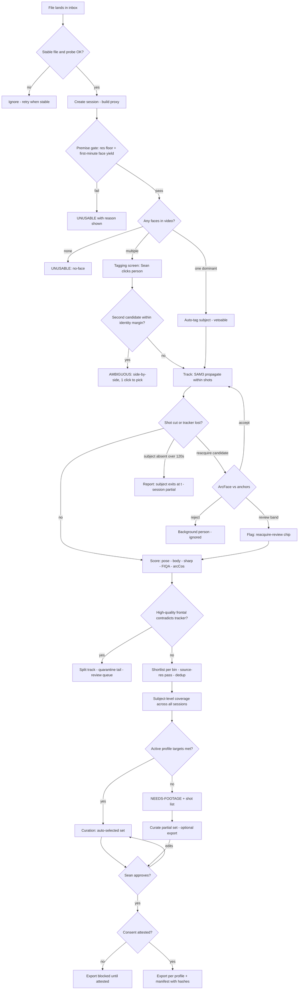

# GLM Consult

**Requested:** `glm-5.3-flash`
**Served:** `glm-5.3-flash`
**Document:** (path redacted; packet digest is recorded by consult-panel.mjs)
**Tokens:** 2560 in / 25060 out (reasoning: 15630) | total 27620
**Wall:** 855.4s

---

# CHARACTER CAPTURE — design response

**Verdicts up front** (details in §6/objections, but these change the build so they come first):

1. **Section 6 reframe: RIGHT, with two sharpenings and one warning.** (a) The target grid must be *vendor-derived*, not literal 360° — Krea's own guidance wants front + 3/4 + expressions; chasing rear-facing bins buys almost nothing downstream and costs Sean real shoots. (b) This makes the app **verdict-first**: every session ends in exactly one of `READY` / `NEEDS-FOOTAGE (+shot list)` / `UNUSABLE (+reason)`. That's the product. (c) Warning: a coverage map is only as good as its pose calibration — uncalibrated 6DRepNet360/MEBOW output will send Sean to reshoot angles he already has. Calibration fixtures ship in the same slice as the map or the map is a liability.
2. **Lighting conflict: uniformity-preferring, vendor-authority.** Krea is the tool being fed; its docs say uniform. Policy: maximize diversity of **pose > expression > distance**, match **lighting** to the session's dominant condition, warn when a subject's footage mixes color grades. H3 profile cherry-picks best-9 regardless. Reversible via config flag. Heuristic threshold for "mixed grading" is color-stat distance — exact cutoff [UNSURE], calibrate in Slice 7.
3. **Clips: real win, H3-only, late slice, raw segments only.** A clean 7s clip carries temporal identity no still can. Rule: export a window only if identity margin stays above threshold on *every* frame (min-over-window, not mean) — a clip with 2 drifted frames is worse than a still. Cropped/stabilized clip tooling = scope creep, don't build.
4. **Structural correction the brief gets wrong:** the unit of work is the **subject across many videos**, not the session. Coverage, dedup, and export counts only make sense per-subject. Baked into the blueprint below.
5. **H3 per-image resolution/filesize limits: NOT DOCUMENTED in the sources provided. I am not guessing.** Settings field ships blank/null; verify against vendor before the first real H3 export. No hard-coded cap anywhere in code.

---

# 1. BLUEPRINT

## 1.1 Architecture

```
┌──────────────────────────  Node 22, zero deps  ──────────────────────────┐
│  serve.mjs                                                               │
│   ├─ static server → public/ (vanilla HTML/CSS/JS, SSE for progress)     │
│   ├─ REST API  /api/sessions /api/subjects /api/coverage /api/export     │
│   ├─ WatchFolder (fs.watch on data/inbox, debounce + stability check)    │
│   ├─ JobEngine (in-memory queue, rebuilt from disk manifests on boot)    │
│   └─ MLWorker host — ONE python child process, NDJSON over stdio         │
└──────────────────────────────┬───────────────────────────────────────────┘
                               │ {"op":"analyze-span","id":7,...} / replies
┌──────────────────────────────▼───────────────────────────────────────────┐
│  ml/worker.py  (Python 3.12, pinned requirements.txt, local venv)        │
│   staged model host — loads/unloads to fit 32 GB VRAM:                   │
│   phase A: SAM3 + InsightFace(det+arc)      phase B: 6DRepNet360, MEBOW, │
│   phase C: CR-FIQA + crop extraction        phase D: PySceneDetect (CPU) │
│   decode: OpenCV VideoCapture; if codec unsupported → one-time ffmpeg    │
│   transcode to H.264 mezzanine, session flagged "transcoded-source"      │
└───────────────────────────────────────────────────────────────────────────┘
```

**Why this shape:** the swan-taste-brain ethos (no build step, runs in 5 years from `node serve.mjs`) forbids a JS framework and a packaged ML stack in one process. One Python child with a line protocol is debuggable with `cat`, restartable, and serializes GPU access naturally. Model weights are downloaded once by `setup.mjs` into `models/` with checksums, gitignored.

**Hard rules:**
- **No face restoration. GFPGAN/CodeFormer are banned from the pipeline entirely** (risk 2). Frames are used as captured or rejected. No toggle, not even off-by-default.
- Identity is **face-anchored, never tracker-anchored** (see Objection 1). SAM3 is a segmentor/propagator; every frame's identity claim is an ArcFace-vs-anchors decision, or carries an explicit `identitySource: "continuity"` flag.
- All randomness seeded by session id → **byte-identical reruns** (kill-test requirement).

## 1.2 Pipeline stages

| # | Stage | Input | Output | Choice & why |
|---|---|---|---|---|
| 0 | Ingest | file in inbox | session dir, probe json, 720p H.264 proxy | ffprobe for metadata; proxy for UI scrubbing only. **All sharpness/quality measurement happens on source-resolution pixels** — proxy re-encode destroys exactly the signal we select on |
| 1 | Premise gate | probe + 60s sample scan | pass / `UNUSABLE(low-res|no-face)` | Hard floor: height ≥ 720p auto-reject at ingest. Soft: if P90 face-crop < 180px in first minute → session flagged "low yield likely", continues. Floors are config, calibrated by Slice 1 |
| 2 | Shot segmentation | proxy | cut list (t, shot id) | PySceneDetect ContentDetector — fast, CPU, no model; cuts are hard tracker boundaries that prevent cross-shot bleed |
| 3 | Detect + tag | sampled frames | subject anchors | If exactly one dominant face across ≥90% of analyzed frames → auto-tag (vetoable). Else tagging screen: 6 thumbnail frames, Sean clicks the person. Anchors = top-8 crops by FIQA among high-confidence frontal frames; **frozen** — updated only on manual confirm, never by a running mean (drift poisoning) |
| 4 | Track + associate | per-shot frames | subject track segments | SAM3 propagates within a shot. At every cut/lost-event: re-detect persons, compare face crops to anchors. cos ≥ accept → silent resume (counter shown); review band → chip in review queue; below → background |
| 5 | Score (pass 1, proxy, 2 fps) | track frames | pose (6DRepNet360), body-orient (MEBOW 8-bin), face box/size, motion score, arcCos | Cheap tier excludes Laplacian — meaningless on proxy; motion magnitude within ±0.5s is the blur proxy here |
| 6 | Score (pass 2, source res) | per-bin top-8 shortlist | true crops, Laplacian-variance **on the face crop**, CR-FIQA, final arcCos | Bounds 4K decode to ~minutes. Shortlist key: (identity margin, low motion, face px) |
| 7 | Dedup | scored frames | dHash (face + body crop) | Near-dup collapse at Hamming ≤ 8 [UNSURE threshold] within a bin; export sets enforce min pairwise distance |
| 8 | Coverage | all subject frames, all sessions | `coverage.json` (subject level) | **Pure reducer** over frame records — unit-testable with no video. Evidence vs counts strictly separated (§1.4) |
| 9 | Curate | coverage + scores | approved set | Auto-selected per active profile; Sean prunes/approves |
| 10 | Export | approved set | `exports/<profile>/` + manifest | H3: ≤9 stills (+ ≤3 clips in Slice 6; 9+3=12 ≤ file cap). Krea: 12–30 via vendored `lib/lora.mjs` (licence gate preserved). Consent attestation gates all export endpoints (403 until attested) |

**Analysis cadence:** SAM3 propagation per-frame on proxy within shots; attribute scoring at 2 fps; source-res pass only on shortlisted candidates.

**Pose-conditional identity thresholds** (risk 3). Defaults, all `[UNSURE — set by Slice 3 calibration harness, FMR-style operating point: impostor-in-export ≤ 0.1%, frontal recall ≥ 95%]`:

| face yaw | accept | review band |
|---|---|---|
| ≤30° | 0.38 | 0.30–0.38 |
| 30–60° | 0.34 | 0.26–0.34 |
| 60–90° | 0.30 | 0.22–0.30 |
| >90° (rear) | n/a | identity by **continuity only**: unbroken track from a confirmed frame within 2s, and no better face match in frame → `identitySource: "continuity"` |

**Track-level quarantine (risk 4):** a track is the subject's iff median-cos ≥ accept **and** no high-quality frontal frame in the track contradicts (cos < reject-band). If tracker continuity says subject but a good frontal crop says otherwise → **split the track at that frame; the tail is quarantined pending review.** Never per-frame filtering across a poisoned track.

## 1.3 Data model

```js
// data/subjects.json  — the real top-level object
Subject {
  id, name?, consent: {attested: bool, date?, note?},
  anchors: [{frameId, embedding[512], fiqa, provenance}],   // frozen set
  sessionIds: []
}

// data/sessions/<id>/session.json
Session {
  id, subjectId?, status: queued|analyzing|needs-tag|ambiguous|
     review|needs-footage|ready|exported|unusable,
  unusableReason?,           // "low-res" | "no-face" | "no-subject-time"
  sources: [{path, size, mtime, headHash, w,h,fps,dur, transcodedSource?}],
  settingsSnapshot           // thresholds + floors used, for reproducibility
}

// frames.jsonl  — append-only, one record per analyzed frame, replayable
CandidateFrame {
  frameId, sessionId, sourceId, tMs, shotId, trackId,
  faceBox, bodyBox?, facePx,                  // face crop long-edge, source res
  yaw,pitch,roll,                             // 6DRepNet360
  bodyBin,                                    // MEBOW 8-bin + continuous
  motionScore, laplacianVar, fiqa, arcCos, identitySource, // face-match|continuity
  binId,
  gates: {blur:bool, id:bool, size:bool, dedup:bool, bg:bool}, reasons:[...],
  status: candidate|shortlisted|scored|selected|rejected|review|quarantined
}

// coverage.json (per subject) — produced ONLY by the pure reducer
CoverageBin {
  binId, state: no-evidence|empty|sparse|ok|surplus,
  evidenceSec,      // subject-detected time, BEFORE quality gates
  counts: {ingested, passed, selected}, shortfallVsProfile
}

ExportProfile {
  id: h3|krea|custom, countCap, minShortEdgePx, binTargets:{binId:n},
  lightingPolicy: dominant-match|any, cropStyle: framed|tight|mix,
  clipRules: {enabled, minMarginRule:"min-over-window", maxTotalSec},
  captionTemplate, maxImageBytes: null   // H3 per-image limit UNKNOWN — no guess
}
```

**Coverage bin grid (40 bins — vendor-derived, not literal 360):** faceYaw 8 × 45° bins × pitch 2 (level ±20° / beyond) × framing 2 (face-close: facePx ≥ 250 / full-body) = 32, + bodyOrient 8 bins within full-body framing = 40. Face-px floor 250 is a heuristic derived from Krea's ≥512 rule with 40% context margin [UNSURE — revisit after Slice 1 measures real distributions]. Expression is **metadata only** in v1 (no expression model; Krea's smiles guidance handled in curation) — known gap, deliberate.

## 1.4 Coverage honesty (the core mechanism)

A bin's `evidenceSec` counts subject-detected time **regardless of quality gates**. `counts` only counts gate-passing frames. States derive only from actual frame records — the reducer is incapable of interpolation by construction (pure function, no neighbor input). This yields the critical three-way distinction:
- `no-evidence` — subject never seen at that angle → "go shoot it"
- `empty` (evidence-but-rejected) — subject *was* at that angle, everything failed quality → "you have the angle, reshoot it sharper/steadier"
- `sparse` / `ok` / `surplus` — counts vs bin target

These are different **instructions to Sean**, which is the whole point of the reframe.

## 1.5 Disk layout

```
character-capture/
  serve.mjs  setup.mjs  config.json        # thresholds, floors, profiles (user-editable)
  server/  public/  tests/  tools/
  lib/lora.mjs        # VENDORED copy from swan-taste-brain, provenance header,
                      # licence gate + regression suite intact. (Relative-path import
                      # across repos breaks the 5-year checkout guarantee.)
  ml/worker.py  ml/requirements.txt    # exact pins
  models/             # weights w/ checksums, gitignored
  data/
    inbox/                                 # THE watch folder
    subjects.json
    sessions/<id>/{session.json, media/<srcHash>/proxy.mp4, frames.jsonl,
                   tracks.jsonl, stage-manifests/, exports/<profile>/...}
    exports/<subjectId>/<profile>/<utcstamp>/   # final sets + manifest.json (hashes)
```

## 1.6 State & failure/resume

No database. State = `subjects.json` + per-session dirs. Job queue is in-memory but **rebuilt on boot** by scanning stage manifests.

Every stage writes a `stage-manifest.json` (inputs processed, outputs, seed, content counts) **last, via atomic rename**. Resume rule: manifest present → skip stage; absent/partial → re-run, skipping frame ids already present in `frames.jsonl` (append-only = replay-safe idempotency).

| Failure | Behavior |
|---|---|
| Crash mid-stage | Restart → stage resumes from replay position |
| Source file changed (size/mtime) | Invalidate everything downstream, re-run; UI shows why |
| Source file missing | Session → `unusable(source-missing)`, others continue |
| Model load fail / OOM | Stage `failed(reason)` surfaced in UI; staged load/unload order is the mitigation; session retriable |
| Codec decode fail | One-time ffmpeg mezzanine transcode, session flagged |
| Disk < 2 GB before proxy | Job blocked with message, not a midnight crash |
| Partial download in inbox | Stability check: size+mtime unchanged across two polls 2s apart; extensions whitelist `.mp4 .mov .mkv .webm .m4v`; dotfiles/temp exts ignored forever |

---

# 2. WIREFRAMES

Mobile is a **companion viewer** (same server over LAN, responsive CSS): review, coverage read-only, approve/export. Tagging and tuning are desktop-only — precision clicking on video frames doesn't survive a phone. Stated as a scope decision.

### D1 — Library / watch folder, idle + auto-start

```
┌────────────────────────────────────────────────────────────────────────────┐
│ CHARACTER CAPTURE              inbox: WATCHING ▣   auto-start: [ON]  ⚙     │
├────────────────────────────────────────────────────────────────────────────┤
│ SUBJECTS                                                                   │
│  ▸ Sean (you)     coverage ▓▓▓▓▓▓░░░░ 58%    3 sessions    [Open]          │
│  ▸ Untagged       from: a-roll_04.mp4        [Tag] [Dismiss]               │
├────────────────────────────────────────────────────────────────────────────┤
│ INBOX  — drop files into ~/character-capture/data/inbox                    │
│  ●  a-roll_04.mp4    analyzing · tracking 41%  ▓▓▓▓░░░░░░                  │
│  ●  b-roll_city.mov  queued · auto-start in 0:03          [Start now]      │
│  ✓  interview_v3.mp4 → Sean · READY FOR REVIEW            [Review]         │
│  ✕  phone_480p.mp4   UNUSABLE: below resolution floor      [Why?]          │
└────────────────────────────────────────────────────────────────────────────┘
```
Auto-start ON (default): 0 clicks after drop. OFF: sessions queue, `[Start now]` = 1 click. Both satisfy the hard requirement.

### D2 — Tagging (only when >1 candidate or auto-tag vetoed)

```
┌────────────────────────────────────────────────────────────────────────────┐
│ Tag the subject — a-roll_04.mp4            frames sampled across the video │
├────────────────────────────────────────────────────────────────────────────┤
│  ┌────────┐ ┌────────┐ ┌────────┐ ┌────────┐ ┌────────┐ ┌────────┐        │
│  │ 00:12  │ │ 04:31  │ │ 09:07  │ │ 15:44  │ │ 21:10  │ │ 27:02  │        │
│  │ [thumb]│ │ [thumb]│ │ [thumb]│ │ [thumb]│ │ [thumb]│ │ [thumb]│        │
│  └────────┘ └────────┘ └────────┘ └────────┘ └────────┘ └────────┘        │
│  click a frame to open it, then click the person's face                    │
│  ┌──────────────────────────────────────────────┐  [◀ back] [This person ▸]│
│  │  opened frame, crosshair cursor, loupe zoom  │  (enabled after click)   │
│  └──────────────────────────────────────────────┘                           │
└────────────────────────────────────────────────────────────────────────────┘
```
Cost: 2 clicks (pick frame, click face) + 1 confirm. Ambiguous look-alike branch: same screen with side-by-side "A | B" and one click to choose.

### D3 — Review / curation (primary surface — see Objection 3)

```
┌────────────────────────────────────────────────────────────────────────────┐
│ Sean · interview_v3 + 2 more sessions          profile: (Krea|H3)  ▣ H3    │
├──────────────┬─────────────────────────────────────────┬───────────────────┤
│ BINS (40)    │  ■ selected  ▢ candidate  ✕ rejected    │ DETAIL            │
│ yaw F     3/3│  ┌────┐┌────┐┌────┐┌────┐┌────┐┌────┐   │ [preview]         │
│ yaw F¾L   2/2│  │■341││■087││■102││□118││□126││✕093│   │ yaw +47° pitch -3 │
│ yaw 90L   1/2│  └────┘└────┘└────┘└────┘└────┘└────┘   │ sharp 214 fiqa 4.1│
│ yaw 90R   0/2│  ┌────┐┌────┐┌────┐┌────┐               │ arcCos .81 MATCH  │
│ yaw B¾R  NO-DATA                        ...               │ body 90L fullbody │
│ ...          │  reasons on hover: ✕093 = blur+id-low   │ src 00:41:12 4K   │
│ [shot list ▸]│  auto-set: 9/9 · 2 flagged for you      │ dup dHash ok      │
├──────────────┴─────────────────────────────────────────┴───────────────────┤
│ keys: j/k move · a accept · x reject · u undo · g gap-list    [Export 9 ▸] │
└────────────────────────────────────────────────────────────────────────────┘
```
Auto-set pre-selected by the active profile; most sessions = open, glance, export. Flagged items (review-band identity, reacquire chips, quarantined-track tails) appear at top with reasons — every automatic decision shows its **why**.

### D4 — Coverage map + gap callouts

```
┌────────────────────────────────────────────────────────────────────────────┐
│ COVERAGE — Sean (union of 3 sessions)                    target profile: H3 │
│  FACE YAW (face-close framing)          FULL-BODY (body orientation)       │
│   B    B¾R   90R   F¾R  │  F    F¾L   90L   B¾L          N NE E SE S SW W NW│
│  ▓▓▓  ░░░░  ────  ▓▓▓▓  │ ▓▓▓▓ ▓▓▓▓  ▓▓░░  ────         ░ · ─ · · · ─ ·    │
│  ok   spars EMPTY  ok   │  ok   ok   sparse EMPTY                       ▲   │
│  PITCH: level ✓   up/down: sparse (1)                                      │
├────────────────────────────────────────────────────────────────────────────┤
│ GAP CALLOUTS                    legend: ▓ ok  ░ sparse  ─ EMPTY  ▒ no-data │
│  1. 90R face — EMPTY (you HAVE 41s here, all too blurry) → reshoot steadier│
│  2. B¾L — NO DATA (never filmed) → go capture                              │
│  3. full-body NW — EMPTY → capture                                         │
│ [Generate shot list ▸]                                                     │
└────────────────────────────────────────────────────────────────────────────┘
```
Shot-list output (markdown + JSON): **two passes**, per turntable doctrine — (1) *face pass*: tight framing, subject stationary, walk orbit pausing every ~30–45°, hold 3s each, face ≥300px (upper-body framing at 4K); (2) *body pass*: camera static, subject pivots in 45° pauses. Includes capture spec: ≥1440p (4K preferred), lighting matched to dominant condition, no walking orbits.

### M1 — Mobile (review & approve only)

```
┌───────────────────────┐   ┌───────────────────────┐   ┌──────────────────┐
│ ◀ Sean · 3 sessions   │   │ REVIEW  auto-set 9/9  │   │ ✓ 341  ✓ 087     │
│ ────────────────────  │   │ ┌────┐ ┌────┐ ┌────┐  │   │ ✓ 102  □ 118     │
│ interview_v3  READY   │   │ │■341│ │■087│ │■102│  │   │ ✓ 126  ✕ 093     │
│  coverage 58%  [Open] │ → │ └────┘ └────┘ └────┘  │ → │ ───────────────  │
│ a-roll_04  analyzing  │   │ ┌────┐ ┌────┐ ┌────┐  │   │ tap = toggle     │
│  41%  ▓▓▓▓░░          │   │ │■118│ │□126│ │✕093│  │   │ [Approve & export]│
│ phone_480p  UNUSABLE  │   │ └────┘ └────┘ └────┘  │   │ consent: ✓       │
│  low-res     [Why?]   │   │  tap frame = detail   │   │                  │
└───────────────────────┘   └───────────────────────┘   └──────────────────┘
```
COVERAGE (mobile): vertical yaw strip, read-only, states color-coded; shot list viewable, not editable.

**Click/tap counts, main path (single person, coverage met):** drop file (0) → toast → **Review (1)** → glance pre-selected set → **Export (2). Total: 2 clicks.** Auto-tag veto: +2. Multi-person tag: +3. Ambiguous pick: +1. Mobile approve: 2 taps.

---

# 3. FLOWCHART + MERMAID



| Branch | Trigger | Resolution |
|---|---|---|
| No face found | zero faces ≥ min size across sampled video | `UNUSABLE(no-face)`; inbox moves on |
| Two candidate people | 2nd-best anchor cosine within margin of best [margin UNSURE, Slice 3 calibration] | `ambiguous`, side-by-side, 1 click |
| Tracker lost | track ends at cut/occlusion | re-detect + anchor match; accept → silent; review band → chip; reject → background. >120s absent → "subject exits at 12:31" in report |
| Identity ≠ tracker | good frontal crop, cos < reject band, inside a "subject" track | split track, quarantine tail, review — never silently filter frame-by-frame |
| Coverage incomplete | bins short of active profile targets | `needs-footage` + shot list (with the EMPTY-vs-NO-DATA distinction from §1.4) |
| Too low quality | res floor at ingest, or all evidence frames fail gates | `unusable(low-res)` / `empty`-with-evidence per bin; never upscaled mush — **no face restoration, ever** |

---

# 4. TESTS

Runner: plain `.mjs` scripts, same convention as swan-taste-brain. Coverage reducer and threshold policy are pure functions → unit-tested without video. All fixtures live in `tests/fixtures/` with a `fixture.json` of **ground truth** (cut times ±1 frame, identity label per time span, expected bin states).

### Golden fixtures

| Fixture | Content | Ground truth |
|---|---|---|
| `two-people-intercut.mp4` | A 10s / B 10s / A 5s, B wears similar colors | identity per span, cut times |
| `occlusion-walk.mp4` | subject occluded 3× (doorway, passerby), re-emerges | occlusion spans |
| `multi-cut-reacquire.mp4` | cut every 5s, subject re-enters ×5 | cut times |
| `coverage-full-turntable.mp4` | pause-and-orbit capture hitting all 8 yaw bins + body bins | expected bin→state map: all `ok` |
| `coverage-frontal-only.mp4` | 60s talking head | rear bins = `no-evidence`, evidenceSec=0 |
| `coverage-degraded-bins.mp4` | turntable fixture, half the bins synthetically blurred + 480p + heavy compression | those bins = `empty` WITH evidenceSec>0 |
| `lowres-source.mp4` | 480p phone clip | session → `unusable(low-res)` |
| `no-face.mp4` | empty room / animal only | `unusable(no-face)` |
| `similar-pair.mp4` | two different people, matched wardrobe | `ambiguous` branch fires |
| `yaw-calib-render.mp4` | 3D head render at exact 15° steps | exact yaw per frame |
| `loop-dup.mp4` | same clip concatenated twice | dedup collapses |

### Per-stage tests (assert + the mutation that must make it fail)

**Watch folder.** Write `.part` file grown over 5s → never ingested until stable; dotfile ignored; valid file → session in <5s. *Mutation:* disable stability check → partial-file test fails. ✅positive control present.

**Premise gate.** `lowres-source` → `unusable(low-res)`; 1080p fixture passes. *Mutation:* floor removed → test fails.

**Shot segmentation.** `multi-cut-reacquire`: detected cuts within ±1 frame of truth. *Mutation:* ContentDetector threshold set to 0 (detects nothing) → fails.

**Tag + auto-tag.** Single-person fixture auto-tags; `similar-pair` does **not**. *Mutation:* auto-tag forced regardless → fails.

**Identity lock held — the hard one. Three independent proofs:**
1. **Ground truth:** run pipeline on `two-people-intercut`; every selected frame must match its span's true identity — **zero impostor frames**. *Mutation:* set accept threshold to 0.05 (guard effectively off) → impostors flow into selection → test fails. ✅
2. **Impostor injection:** inject one known-impostor crop into the curated pool pre-export; the export-time single-cluster consistency check (mean pairwise cos of exported embeddings ≥ 0.5, min ≥ 0.35 to centroid — [UNSURE values, calibrate]) must **fail the export**. *Mutation:* disable the consistency check → injection test fails. ✅ (This is the positive control for the absence claim "no impostor ever reaches export.")
3. **Production proxy (no ground truth available):** leave-one-cluster-out over export embeddings; a bimodal distribution fails the set.

**Tracker never bleeds.** `occlusion-walk`: reacquires 3/3, zero B-track frames labeled subject. *Mutation:* identity re-association off (pure track continuity through cuts) → bleed asserted → test fails. ✅

**Pose calibration.** `yaw-calib-render`: median |yaw error| ≤ 10°, bin assignment ≥ 85% [targets UNSURE — plausible, tune]; MEBOW within ±1 body bin. Gates the coverage map's trustworthiness — see warning in Verdict 1.

**Quality honesty.** Gaussian-blurred variants of the same frame must score below originals (Laplacian monotonicity); FIQA ranks sharp > blurred. *Mutation:* Laplacian computed on the **proxy** instead of source (the classic bug) → degraded fixture scores shift → monotonicity test fails.

**Coverage honesty — no interpolation, ever.**
- `coverage-frontal-only` → rear bins `no-evidence`, evidenceSec = 0. *Mutation:* an interpolating reducer (fills empty bins from neighbors — the plausible bug) marks them `sparse` → test fails. ✅
- `coverage-degraded-bins` → those bins `empty` **with** evidenceSec > 0. *Mutation:* quality gate bypassed → they read `ok` → test fails. ✅
- `coverage-full-turntable` → all `ok` (positive control for the "full" claim too).
- Reducer property test: synthetic frame records removed from input must remove exactly those bins' counts; evidenceSec only drops when the *detection* records are removed, not the quality records.

**Dedup.** `loop-dup` → export contains no pair with dHash Hamming ≤ 8. *Mutation:* dedup off → fails. ✅

**Export contracts.** H3: ≤9 stills, ≤3 clips, clip total ≤15s, total files ≤12, count cap cannot be exceeded even with 12 selected (priority truncation + manifest note). *Mutation:* cap removed → fails. ✅ Krea: 12–30 (or explicit shortfall report — never silent), short edge ≥512, captions valid per `TOKEN_RE`, **licence-gate regression suite from swan-taste-brain runs green unmodified**. Manifest: every file sha256 + source frameId provenance.
**H3 per-image size/resolution: no test exists because the limit is unknown. Config field stays null. Adding a hard-coded guess here is a review-blocking defect.**

**Consent.** Export endpoint returns 403 pre-attestation. *Mutation:* gate removed → fails. ✅

**Resume/determinism.** SIGKILL the server mid-stage twice; rerun to completion; final artifacts byte-identical (hashes) to an uninterrupted run. *Mutation:* unseeded randomness anywhere → fails. ✅

---

# 5. SLICES

**Slice 1 — Premise probe (kills or proves risk 1).** Dev-only harness (`tools/probe.mjs` + a slice of the python worker): given a video, sample at 2 fps, detect faces, measure face-crop px at **source res**, Laplacian on crops, motion; emit `report.json`: minutes of usable-face time, crop-size histogram, sharpness pass-rate, **projected yield vs Krea-24 and H3-9**. *AC:* runs on 3 of Sean's real videos (4K, 1080p, phone); each gets an explicit KEEP / CONDITIONAL / KILL verdict with numbers; KILL if projected usable < 10 per 10 min. No UI, no tracking. Timebox 2–3 days. This decides whether the rest gets built.

**Slice 2 — Watch folder + session shell.** Drop files → auto-sessions, proxies, SSE progress, boot-time queue rebuild, partial-file rejection. *AC:* drop 3 files → 3 sessions auto-start; SIGKILL mid-transcode → restart resumes; partial-file fixture test green. Hard usability requirement proven.

**Slice 3 — Tag, track, identity (single + ambiguous).** Auto-tag, tagging screen, SAM3 in-shot propagation, anchor-based reacquisition across cuts, ambiguous side-by-side, **calibration harness producing the threshold table** (replaces my UNSURE defaults). *AC:* `two-people-intercut` zero impostors; `occlusion-walk` 3/3 reacquire; `multi-cut-reacquire` 5/5 cuts; calibration report hits the operating point (impostor-in-export ≤0.1%, frontal recall ≥95%). **Gate: if SAM3 install/licence/VRAM fights back here, fall back to face-detection + IoU association — do not spend more days on the model.**

**Slice 4 — Scoring + selection + Krea export.** Two-tier scoring, shortlisting, dedup, coverage-agnostic best-frame selection, review screen with keyboard curation, Krea profile via vendored `lora.mjs`. *AC:* export contract tests green; licence suite green; shortfall produces explicit report, never silence.

**Slice 5 — Coverage map + shot list.** Pure reducer, subject-level union, honest states, D4 UI, calibration fixtures, shot-list generator. *AC:* all coverage-honesty tests green (this is the slice where "the map doesn't lie" becomes a tested property, not a hope).

**Slice 6 — H3 profile + clips + closed loop + consent.** ≤9 cherry-pick composition (6 framed + 3 tight — editorial default, [UNSURE] whether H3 prefers that mix; not documented; both variants exported so Sean can A/B), clip windows by min-margin-over-window rule, consent gate, **round-trip harness**: one-click "prove it" → generate via H3 with the exported set (+ local ComfyUI reference-gen via the proven `TextEncodeQwenImageEditPlus` path) → score generated faces against anchors with the same ArcFace/FIQA stack → similarity report. *AC:* export contract tests; 403 test; round-trip produces a number, not a vibe.

**Slice 7 — Subject workspace hardening.** Track-split quarantine review, anchor recalculation UI, subject merge/split, cross-session dedup, mixed-grading color warning. *AC:* dropping a 5th video into an existing subject extends its coverage without duplicate exports.

**Slice 8 — Five-year hardening.** Determinism/kill-test green, codec fallback, disk guards, pinned requirements verified on fresh checkout, docs, fresh-clone → `setup.mjs` → `node serve.mjs` → working run.

---

# 6. THREE STRONGEST OBJECTIONS

**1. The packet's tracker-centric identity design is the most likely way this app poisons datasets — I've overridden it.** "SAM3 click-to-track with persistent IDs" invites the assumption that a persistent track ID *is* identity. It isn't. Every documented failure mode that matters (risk 4, mis-tracking onto a second person) happens precisely where tracker persistence is weakest: cuts, occlusion exits, similar-looking people. A single blended face in a 12–30 image Krea set is worse than a missing frame, and the tracker will hand them to you with a straight face. So: identity is decided **only** by ArcFace-vs-frozen-anchors (or explicit `continuity` flags for rear views), tracks are quarantined whole on contradiction, anchors are frozen against drift. And strategically: SAM3 is my riskiest dependency (licence terms and VRAM footprint [UNSURE]; the documented fallback SAM2 is weak exactly where we need it). The identity signal is facial — so if SAM3 costs more than a day in Slice 3, cut to detection + IoU + face anchors and ship. Do not let the shiniest component own the safety-critical decision.

**2. Session-per-video is the wrong data model, and the brief as written would have failed in Sean's second week.** Sean's real workflow is many clips of the same person over weeks. Under a session-first model: every coverage map reads "incomplete" even when the union across his footage is fine (the map lies by omission — the exact "failure that looks like success" risk 5 warns about), exports collide into near-duplicates, and counts never add up. I've made Subject the primary object and coverage/export subject-level unions; sessions become ingestion bookkeeping. If a worker-bot skips this because it looks like a refactor, the app is demoware.

**3. Without a closed loop, "exactly like them" is unfalsifiable — the app will say READY and be wrong.** FIQA and ArcFace measure embedding-space properties; they correlate imperfectly with perceptual likeness, and *nothing* in the extraction pipeline measures what Sean actually cares about: does H3/Krea output look like him. Slice 6's round-trip harness (generate with the exported set → score generations against the same anchors) is the only honest feedback signal that exists on this box, and ComfyUI + Krea weights are already installed. Cheapest possible version: one fixed prompt, one grid of generations, one similarity histogram. It won't be a guarantee — it converts a trust problem into a measured one. I'd trade a pipeline feature for it.

**On section 6, stated plainly since I was asked to disagree where I disagree:** the reframe is right and I've built the app around it, but I half-disagree with its framing. "360° coverage" as the success axis is the wrong target — the vendors' own guidance (front + 3/4, expressions, varied poses) means roughly 270° of *face* yaw plus body orientation is where value lives; rear-facing face bins are shoots Sean shouldn't be sent on. The 40-bin grid encodes that. And the reframe's hidden dependency — pose-model calibration — is the part everyone skips and the reason coverage maps in the wild lie. It ships with the map, in the same slice, or the feature is a liability.

*[UNSURE] items consolidated:* ArcFace operating thresholds (Slice 3 calibration is their source of truth, my numbers are defaults); SAM3 licence/VRAM; H3 per-image resolution and filesize (**unknown — no code may encode a value**); H3 reference still framing preference (both variants exported); dHash near-dup threshold; 250px face floor; cluster-consistency cos values; 6DRepNet360/MEBOW accuracy targets; mixed-grading warning cutoff; `node:sqlite` availability on 22.14 (moot — JSONL chosen).
