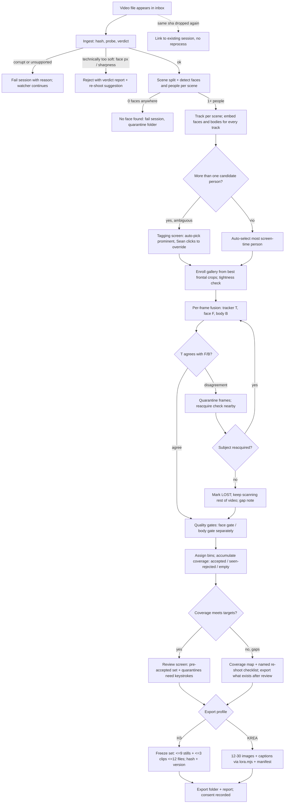

# GLM Consult

**Requested:** `glm-5.3-flash`
**Served:** `glm-5.3-flash`
**Document:** (path redacted; packet digest is recorded by consult-panel.mjs)
**Tokens:** 2560 in / 23922 out (reasoning: 14059) | total 26482
**Wall:** 860.9s

---

# CHARACTER CAPTURE — design response

## 0. Rulings first (where I agree/disagree with the packet)

**§6 reframe: right, and I'd go further than you did.** Ordinary footage cannot yield 360°; the app must be a capture director. But "report empty bins after the fact" is the weak version. The strong version is that **the cheapest source of complete coverage is a 3-minute planned shoot, and the app should sell that loop, not just diagnose the backlog.** Concretely: coverage map → **named re-shoot checklist** → Sean shoots 8 × ~10s with feet planted → re-drop → bins fill. The photogrammetry-turntable citation you found is the proof: motion is the enemy; planted-camera-per-angle is the fix. The watch-folder harvester remains the product's spine (Sean's hard requirement), but the coverage→shoot→re-drop loop is what actually reaches the "exactly like them" bar. I treat the shoot checklist as a first-class deliverable (Slice 5), same as you proposed.

**Uniform vs diverse lighting: resolve as "uniform *processing*, diverse *conditions*."** Krea's uniformity guidance is about technical consistency (colour balance, exposure, resolution) so lighting artifacts don't bake into identity; the LoRA-field diversity guidance is about condition coverage so identity generalizes to new light. These are not actually in conflict: export applies **consistent white-balance/exposure normalization** to every frame, while *selecting across* distinct lighting setups. Fidelity failures come from both directions — baked-in lighting (fixed by normalization) and brittle identity under new light (fixed by diversity). For the H3 ≤9 reference set, lean harder toward same-look consistency for ~6 of 9 slots, diversity in the rest.

**Clips export: real win, deferred, capped.** H3 explicitly accepts ≤3 clips / ≤15s; stills-only leaves the motion channel of H3's identity mechanism unused. It is *not* scope creep **if** it's a late slice that reuses already-computed tracks (a clip = a contiguous high-quality subject-visible window; the expensive work is already done). Cost is export plumbing + a re-mux. Ship in Slice 6, default 9 stills + 3 clips = exactly 12 files, stills-first if clips don't qualify.

**Automation: harvest is zero-touch; inclusion is human-gated.** The "works alone" requirement is honored — the app does all labor (watch, track, gate, bin, select). But nothing exports as "subject" without either (a) being high-margin auto-accepted, or (b) one keystroke in review. One twin/look-alike frame silently poisons an identity dataset; 60 seconds of review is the cheapest insurance in the whole system. Details in Objection 2.

---

## 1. BLUEPRINT

### 1.1 Architectural principles

1. **Node owns policy; Python owns perception.** All thresholds, binning, selection, coverage math, export policy live in Node (pure functions, testable in `.mjs`). Python workers only emit per-frame/crop *measurements* (embeddings, poses, sharpness, boxes). No policy logic in Python → no drift between what the pipeline measures and what the app decides, and the test suite stays plain `.mjs` per house doctrine.
2. **Process once for all people; subject selection is a query.** The pipeline harvests every person track's embeddings/crops. Tagging/retagging = re-filtering stored evidence, not reprocessing video. This makes subject-switching ~instant and makes the two-candidate branch cheap.
3. **Track within a scene, identify across scenes.** SAM-family trackers are weak at shot changes (packet's own note). So: run the tracker per scene segment only; stitch subject identity across scenes via face/body embeddings against the enrollment gallery. This sidesteps the known weakness instead of tuning against it.
4. **Two independent quality gates** (kills Risk 6): a **face gate** on the head crop (close/medium frames) and a **body gate** on the body crop (full-body frames). A frame never needs to pass both. Coverage bins know which gate feeds them.
5. **Zero npm dependencies** (swan doctrine). Python deps live in a pinned venv built by `setup-python.mjs`; weights fetched by `fetch-models.mjs` into `data/models/`; degraded mode documented (probe needs only OpenCV + insightface).
6. **No generative pixel alteration of exports.** GFPGAN/CodeFormer/Real-ESRGAN are **banned from every export path** (Risk 2 — a restorer inventing plausible detail is a confident wrong face). Lanczos resize only. If resolution is insufficient, that is a re-shoot instruction, not an upscaler's problem. (Review screen may render a restored *preview* side-by-side for judgment; it is never written to an export.)

### 1.2 Stage table

| # | Stage | Input | Output | Choice | Why this one |
|---|---|---|---|---|---|
| 1 | Watch/ingest | inbox dir | session dir + sha256 | Node `fs.watch` recursive + 2s stability debounce (size unchanged) + streamed sha256 | zero-dep, Windows recursive supported; hash gives dedupe + resume key |
| 2 | Probe | video file | fps/res/duration + verdict JSON | OpenCV sampling (no ffprobe dependency) | already a transitive dep of PySceneDetect; verdict thresholds calibrated in Slice 1 |
| 3 | Scene split | frames | scene table | PySceneDetect `ContentDetector` (default 27.0) | boring, proven, pinned |
| 4 | Detect | frames | face boxes (SCRFD) + person boxes/keypoints | `insightface` buffalo_l (SCRFD-10GF) for faces; RTMO/ONNX pose model for person + keypoints | one package for detect+recognize; keypoints serve body framing *and* body-yaw estimate (see 8) |
| 5 | Track | person boxes per scene | per-scene tracks w/ IDs | SAM 3 (`facebook/sam3`); fallback SAM 2.1 + IoU tracker | persistent IDs through occlusion; click-to-refine in tagging UI. ⚠ [UNSURE] SAM 3 license terms — verify before pinning; SAM 2.1 is Apache-2.0 and a known-good fallback |
| 6 | Embeddings | crops | face 512-d (ArcFace), body embedding | buffalo_l ArcFace; body: OSNet ONNX or pose-geometry descriptor [UNSURE which body embedder survives pinning; OSNet torchreid has ONNX exports] | ArcFace is the field standard, thresholds in packet match; body embed needed for rear-view frames where face is invisible |
| 7 | Head pose | face crop | yaw/pitch/roll | 6DRepNet360 | full 360° range is the whole point; alternatives (FAN-style) clamp near frontal |
| 8 | Body yaw | keypoints | 8-bin compass bearing | shoulder/hip geometry from stage-4 keypoints (shoulder dx vs depth proxy, shoulder:hip width ratios) | **MEBOW cut.** Original is TF-era [UNSURE on maintained port]; keypoint geometry is one fewer model, and we already run it. Upgrade path documented |
| 9 | Quality gate | crops + video stats | pass/reject + reasons | Laplacian variance **on the face crop**, adaptive (per-video median × k), plus face-px-height floor; FIQA: CR-FIQA ONNX **if drop-in**, else ArcFace embedding-norm proxy [UNSURE on CR-FIQA packaging; do not block on it] | adaptive threshold handles per-video sharpness baselines; absolute thresholds misclassify dark footage wholesale |
| 10 | Identity fusion | tracks + embeddings + gallery | per-frame subject verdict + provenance | three-stream fusion (see 1.3) | no single signal survives pose/occlusion; fusion with hysteresis + quarantine does |
| 11 | Coverage/binning | per-frame metrics | bin assignments + coverage snapshot | **pure Node** | policy-in-Node principle; single implementation, unit-testable |
| 12 | Selection/export | accepted set | H3 set (≤9 stills + ≤3 clips, ≤12 files) / Krea set (12–30) | Node; Krea captions via **vendored** `lib/lora.mjs` (verbatim copy + `tools/sync-lora-lib.mjs` + its regression suite in our CI) | vendoring keeps "runs in five years from a checkout" true — a sibling-repo import dies when the sibling moves |
| 13 | Clips | qualified windows | ≤3 re-muxed clips | ffmpeg stream-copy if present (`fetch-ffmpeg.mjs`), else cv2 silent re-encode fallback [UNSURE whether H3 wants audio in reference clips; ship silent, flag in manifest] | re-mux avoids re-encode quality loss |

### 1.3 Identity fusion (the part that must not silently fail)

Enrollment (from Sean's tag click): take top-12 face crops by quality at head-yaw < 30°, cluster; require mean pairwise cosine ≥ 0.45 within cluster [UNSURE — calibrate on fixtures in Slice 3]; if the cluster is not tight, UI asks Sean to confirm 3+ thumbnails instead of guessing.

Per-frame arbitration, three evidence streams — T (tracker continuity), F (face cosine vs gallery, reliable while head-yaw < ~75°), B (body embedding, weak but pose-robust):

| Condition | Verdict |
|---|---|
| T = subject AND (no F) AND (no B) | subject (provenance: track-only) |
| T = subject AND F ≥ acceptFloor(yaw) | subject (provenance: face) |
| T = subject AND vetoFloor < F < acceptFloor(yaw) for K=10 consecutive frames | **quarantine** → reacquire check: scan nearby detections for a better gallery match; found → tracker ID-switch correction; not found → subject marked LOST |
| T = subject AND F < vetoFloor | **hard veto** — different person; frame rejected, trigger reacquire check |
| T ≠ subject AND F ≥ acceptFloor | subject regained (ID-switch correction) |
| no face (rear/occluded) | subject iff T = subject AND B ≥ bodyFloor [UNSURE floor — calibrate]; otherwise **quarantined**, never auto-exported |

Pose-aware accept floors (initial table, `config/defaults.json`, calibrated on fixtures in Slice 3): yaw 0–30°: 0.35 · 30–60°: 0.28 · 60–75°: 0.22 (auto-accept off; review-only) · >75°: face gate disabled, T+B only. Veto floor 0.10 at all yaws [UNSURE — the packet's 0.30–0.45 band is the *accept* zone at FMR 1e-4…1e-5; these floors are starting points with a mandated fixture calibration step, not asserted constants].

**Key property:** frames never silently flip identity and never silently continue after loss. Disagreement → quarantine; loss → LOST state → gap note in coverage; body-only provenance → mandatory review. This is what makes "mis-tracked blend" (Risk 4) structurally impossible to export without a human keystroke.

### 1.4 Data model

```ts
Subject {
  id, name,                       // "Subject 1" default
  consent: { confirmedBy, date } | null,   // export blocked if null (Risk 7)
  gallery: [ { embedding: f512, cropPath, headYaw, quality } ],   // ≥3
  bodyEmbedding: fD | null
}

Session {                          // one video file
  id: sha256[0..16], sourcePath, status:
    queued | probing | processing | awaitingReview | done | failed | sourceMissing,
  fps, width, height, durationS,
  stages: { [stageName]: { outputFingerprint, doneAt } },   // resume markers
  sceneTable: [ { idx, t0, t1 } ],
  tracks: [ { id, sceneIdx, t0, t1 } ],
  subjects: [ Subject ],
  activeSubjectId,
  candidates: [ CandidateFrame ],
  coverage: CoverageSnapshot,
  verdict: { medianFacePx, pctFramesPassing, sharpnessMedian, decision }
}

CandidateFrame {
  frameIdx, timecodeS, sceneIdx,
  fullFramePath, faceCropPath | null, bodyCropPath | null,
  metrics: { sharpnessFace, facePxH, fiqa|normProxy, headYaw/Pitch, bodyYawBin, framing },
  identity: { trackId, faceCos|null, bodyCos|null, provenance: face|body|track|quarantined },
  status: pending | accepted | rejected{reason} | quarantined{reason}
}

CoverageBin {
  key: { bodyYaw: N|NE|E|SE|S|SW|W|NW, framing: face|medium|full },
  headYaw tracked separately for the face sub-set,
  targetCount, acceptedCount, seenCount, rejectedCount{byReason},
  bestCandidate, status: FULL | THIN | EMPTY | STARVED,
  // STARVED = pose was seen but quality/identity rejected it — distinct from EMPTY,
  // and the honest-map feature (see wireframes + tests)
}

ExportProfile {
  type: H3 | KREA,
  H3:  { maxStills: 9, maxClips: 3, maxTotalFiles: 12, clipMaxTotalS: 15 },
  KREA: { min 12, target 24, max 30, minPx 512, exportPx 1024 [UNSURE — confirm against
         current Krea avatar docs at build time; 1024 matches swan style doctrine but
         identity doctrine is explicitly NOT assumed to transfer] }
}

ReferenceSet {                     // a frozen export (H3 "reuse the same set" rule)
  version, profile, fileHashes[], manifestPath, createdAt,
  note: "H3 identity holds when the same reference set is reused — re-export bumps
         version only if membership changes"
}
```

**Coverage targets** (so 30 frontal frames can't masquerade as success): face sub-set — frontal ≥3, each 3/4 ≥2, each profile ≥1 (review-ok); body set — each of 8 body-yaw bins ≥1 full/medium, frontal two bins ≥2. Targets live in `config/defaults.json`.

### 1.5 Disk layout

```
character-capture/
  serve.mjs                    # node serve.mjs — the whole app
  config/defaults.json         # ALL thresholds/targets; single tuning surface
  server/
    watch.mjs  sessions.mjs  policy.js  coverage.js  select.js
    export-h3.mjs  export-krea.mjs  pyworker.mjs  sse.mjs  ui-http.mjs
  vendor/
    lora.mjs                   # verbatim copy of swan-taste-brain prompter/lib/lora.mjs
  tools/
    sync-lora-lib.mjs  fetch-models.mjs  fetch-ffmpeg.mjs  setup-python.mjs
  web/  index.html app.css app.js          # vanilla SPA, hash routes, SSE progress
  python/
    requirements.txt           # exact pins
    cc_probe.py cc_scene.py cc_detect.py cc_track.py cc_embed.py
    cc_headpose.py cc_quality.py
    # each: read jobs/<stage>.input.json → write jobs/<stage>.output.json + artifacts, exit
  data/
    library.json               # index of sessions
    models/                    # downloaded weights (gitignored)
    sessions/<sha16>/
      state.json               # atomic write (tmp+rename); Node is the single writer
      source.link.json  stage-*.json
      frames/ crops/face/ crops/body/
      exports/h3-v3_<hash7>/  exports/krea-v1_<hash7>/
  tests/
    run.mjs  fixtures/ …       # plain .mjs, house doctrine
```

### 1.6 Failure & resume

- **Resume granularity = stage.** Each stage writes `stage-X.output.json` containing a fingerprint of its input. Orchestration skips stages whose output exists and matches. A crash mid-stage leaves no output → stage re-runs. `state.json` written atomically (tmp + rename) after every stage transition.
- **Duplicate drop:** same sha → UI links to existing session, no reprocess.
- **Source moved/renamed:** session → `sourceMissing`, "Relink" button re-binds path; nothing recomputed.
- **Corrupt/unsupported file:** session → `failed{reason}`, quarantined under `data/failed/`, **watcher keeps running** (tested: F7 + positive control).
- **Watcher death:** `serve.mjs` runs the watch loop under a catch/restart supervisor; SSE clients reconnect.
- **Partial video locked by another process (OneDrive/AV):** retry with backoff ×3, then fail session with that reason.

### 1.7 KNOWN-UNKNOWNs (do not invent answers at build time)

1. **H3 per-image resolution/filesize limits: NOT documented in the sources found.** Export stills at source resolution; if an upload is rejected, UI offers a downscale ladder (2048→1536→1024) and records which rung worked into the manifest. No hard-coded guess.
2. H3 reference-clip codec/audio expectations — [UNSURE]. Ship H.264 silent re-mux, flag in manifest.
3. SAM 3 license terms and weights-availability specifics — [UNSURE]; gate Slice 4 start on verification, SAM 2.1 fallback is always kept wired.
4. CR-FIQA pip/ONNX packaging — [UNSURE]; norm-proxy fallback stays implemented either way.
5. Exact ArcFace accept/veto floors and body-embedding floor — deliberately calibrated on fixtures (Slice 3), not asserted here.

---

## 2. WIREFRAMES

All vanilla HTML, hash-routed. **Main path click count (happy case): 3 clicks, 0 keystrokes** — drag-drop file (0) → auto-tag auto-proceeds (0) → review screen pre-approves high-margin set → click **Approve 27 & continue** (1) → profile pre-selected → click **Export** (1) → done (auto-open folder). Tag override: +1 click. Rejecting an individual frame: 1 keypress (`X`) each.

### 2.1 Desktop — Dashboard (watch idle + auto-start)

```
┌────────────────────────────────────────────────────────────────────────────┐
│ CHARACTER CAPTURE            Inbox: ~/Videos/cc-inbox              [ ⚙ ]   │
├────────────────────────────────────────────────────────────────────────────┤
│                                                                            │
│   ┌──────────────────────────────────────────────────────────────┐         │
│   │      DROP VIDEO FILES HERE — processing starts on its own    │         │
│   │         .mp4 .mov .mkv · nothing else to click               │         │
│   └──────────────────────────────────────────────────────────────┘         │
│   [ Start a run manually… ]        (file picker — still no CLI)            │
├────────────────────────────────────────────────────────────────────────────┤
│ SESSIONS                                                                   │
│  ●  salsa_rehearsal_4k.mp4    tracking · scene 4/9 · 214 candidates  [▸]   │
│  ✓  studio_orbit.mp4          done · 27 kept · coverage 19/24 · set v3 [Open]│
│  ⚑  studio_orbit.mp4          awaiting review · 6 quarantined          [Open]│
│  ✗  phone_vertical_720.mp4    rejected — median face 96px, soft source     │
│                               [Why?] → verdict report                      │
└────────────────────────────────────────────────────────────────────────────┘
```

### 2.2 Desktop — Tagging (only shown when ambiguous)

Auto-selects the most screen-time person; Sean overrides with one click. Both candidates were harvested already — switching re-filters, no reprocessing.

```
┌────────────────────────────────────────────────────────────────────────────┐
│ WHO IS THE SUBJECT?                        salsa_rehearsal_4k.mp4          │
│                                                                            │
│  ┌────────────┐   ┌────────────┐   ┌────────────┐                          │
│  │ [face thumb]│  │ [face thumb]│  │ [face thumb]│   ← detected people,   │
│  │  SUBJECT 1  │  │  SUBJECT 2  │  │  SUBJECT 3  │      ranked by screen   │
│  │  412 crops  │  │   38 crops  │  │   12 crops  │      time                │
│  │  ★ selected │  │             │  │             │                          │
│  └────────────┘   └────────────┘   └────────────┘                          │
│                                                                            │
│  Selected: SUBJECT 1 · gallery locked (12 frontal refs, tightness 0.61)    │
│            [ ✓ Continue with Subject 1 ]        (auto-continues in 8s)     │
└────────────────────────────────────────────────────────────────────────────┘
```

### 2.3 Desktop — Review / curation (keyboard-first)

Pre-accepted = above quality margin, up to per-bin target. Quarantined frames **require** an explicit keystroke; nothing quarantined exports silently.

```
┌────────────────────────────────────────────────────────────────────────────┐
│ REVIEW · salsa_rehearsal_4k · SUBJECT 1          [change subject ▾]        │
│  27 auto-accepted · 6 pending · 6 QUARANTINED (identity review)            │
├────────────────────────────────────────────────────────────────────────────┤
│  ┌──────┐ ┌──────┐ ┌──────┐ ┌──────┐ ┌──────┐ ┌──────┐                     │
│  │thumb │ │thumb │ │thumb │ │thumb │ │thumb │ │thumb │   ✓ accepted        │
│  │NE·med│ │E·full│ │N·face│ │…     │ │      │ │      │   · pending         │
│  │  ✓   │ │  ✓   │ │  ✓   │ │  ·   │ │  ·   │ │  ·   │   ⚑ quarantined     │
│  └──────┘ └──────┘ └──────┘ └──────┘ └──────┘ └──────┘                     │
│  ⚑ QUARANTINE — is this the subject?      [Y] keep / [N] discard           │
│  [thumb] track-only provenance · rear view · body match 0.41               │
├────────────────────────────────────────────────────────────────────────────┤
│  Keys: A accept · X reject · Y/N quarantine verdict · ←→ navigate          │
│  [ Approve 27 & continue ]     (or Enter)                                  │
└────────────────────────────────────────────────────────────────────────────┘
```

### 2.4 Desktop — Coverage map + gap callouts (the honest map)

Three states — this is Risk 5's kill switch: **EMPTY** (pose never seen), **STARVED** (pose seen, gate rejected — with reasons), **accepted**. "Saw 40 rear candidates, 2 passed" is visible, so quality starvation can't masquerade as absence.

```
┌────────────────────────────────────────────────────────────────────────────┐
│ COVERAGE — studio_orbit.mp4 · SUBJECT 1                 19/24 bins filled  │
│                                                                            │
│                 N ── 12 ✓                                                  │
│            NW ╱        ╲ NE                                                │
│        (empty)            8 ✓            ┌ legend ─────────────────┐      │
│       W  5 ✓     [face]     E  9 ✓       │ ✓ filled (≥ target)     │      │
│       3 ✓      [medium]     2 ✓          │ · thin   (below target) │      │
│            SW ╱        ╲ SE               │ ✗ EMPTY — never seen    │      │
│              S ✗ empty                    │ ⚠ STARVED — seen,       │      │
│                                           │   rejected by gate      │      │
│  FRAMING: face 11 ✓ · medium 6 ✓ · full 2 ·  ⚠                          │
├────────────────────────────────────────────────────────────────────────────┤
│ GAP CALLOUTS — to finish this set, shoot:                                  │
│  1. REAR (S): no frames of the subject's back at all. → 10–15 s, camera    │
│     planted at subject's rear, subject slow turn OR walk away/toward,      │
│     subject 3–5 m, even light. [copy checklist]                            │
│  2. FULL-BODY (⚠ starved): 14 full-body candidates seen, 12 rejected —     │
│     9 motion blur, 3 face too small (130px). → shoot full-body with        │
│     planted pauses at N/E/W; get 2× closer or shoot 4K.                    │
│  [ Export what exists ]   [ Copy re-shoot checklist ]                      │
└────────────────────────────────────────────────────────────────────────────┘
```

### 2.5 Desktop — Export (H3 freeze)

```
┌────────────────────────────────────────────────────────────────────────────┐
│ EXPORT                                            Subject 1 · consent ✓    │
│  [ H3 reference set · v4 ]  9 stills + 2 clips = 11/12 files · 10.2s clip  │
│    frontal 2 · 3/4L 2 · 3/4R 2 · profileL 1 · profileR 1 · rear 1          │
│    clips: walk-away 5.1s · turntable-L 5.1s   (frozen set: a1b2c3d)        │
│  [ KREA training set · v2 ] 24 images · 1024px · captions via lora.mjs ✓   │
│  ⚠ H3 per-image resolution limit undocumented — exporting at source res;   │
│    if upload rejects, downscale ladder: 2048 → 1536 → 1024                 │
│  [ Export selected ]  →  data/sessions/<id>/exports/h3-v4_a1b2c3d/         │
└────────────────────────────────────────────────────────────────────────────┘
```

### 2.6 Mobile (read-mostly companion + shoot checklist)

Heavy CV stays desktop. Mobile = progress, one-tap approve, coverage view, and **the re-shoot checklist taken to the shoot** — which is exactly where the capture-director loop pays.

```
┌───────────────────────────┐   ┌───────────────────────────┐
│ ● salsa_rehearsal_4k      │   │ RE-SHOOT CHECKLIST        │
│   tracking · scene 4/9    │   │ ☐ REAR 10–15s, planted    │
│ ████████░░░░ 62%          │   │ ☐ FULL-BODY N/E/W pauses  │
├───────────────────────────┤   │ ☐ get 2× closer or 4K     │
│ ✓ studio_orbit  19/24     │   ├───────────────────────────┤
│   [Review] [Approve all]  │   │ COVERAGE (live)           │
│   ⚑ 6 quarantined         │   │   N ✓  NE ✓  E ✓  SE ·    │
│      [Y][N] one tap each  │   │   S ✗  SW ✗  W ✓  NW ✗    │
└───────────────────────────┘   └───────────────────────────┘
```

---

## 3. FLOWCHART + MERMAID

Branch points covered: no face found · two candidates · tracker loses subject · identity/tracker disagreement · incomplete coverage · low-quality source.



---

## 4. TESTS

Harness: `node tests/run.mjs` (units, no Python, fast) and `node tests/run.mjs --full` (spawns Python stages on fixtures). Plain `.mjs` per house doctrine. The vendored `lora.mjs` regression suite runs inside our suite via `sync-lora-lib.mjs`'s check.

### 4.1 Golden fixtures (one afternoon of shooting; sidecars hand-written)

| Fixture | Content | Ground truth sidecar |
|---|---|---|
| `F1_orbit_good.mp4` (+`F1b` = same with 2 spliced scene cuts) | 4K phone, volunteer A, planted camera at 8 × 45° positions, 5–8s each | `truth.json`: bin per segment from shooting log |
| `F2_frontal_only.mp4` | Same volunteer, static camera, 60s, frontal only | rear/profile bins EMPTY by construction |
| `F2r_frontal_plus_rear.mp4` | F2 + appended 20s rear segment (**positive control twin of F2**) | rear bins must fill |
| `F3_occlusion_cross.mp4` | Volunteers A + B cross paths, brief full occlusion | per-frame subject box IDs |
| `F4_lookalikes.mp4` | A + B in identical hoodie+wig (cheap controllable twin substitute) | zero B-frames may export as A |
| `F5_blur_mix.mp4` | Half tripod-sharp, half walking-handheld blurry (verify while shooting) | sharp half passes, blurred half rejected |
| `F6_leave_return.mp4` | Subject exits frame 10s, returns | LOST then reacquired |
| `F7_bad/*` | truncated.mp4, notavideo.txt, empty.mp4 | failed-session reasons; watcher survives |
| SYN (no video) | synthetic embedding vectors with known cosines | threshold-function unit truth |

### 4.2 The two hard proofs the packet calls out

**Proving identity lock actually held** — three layers: (1) per-frame track/verdict vs `truth.json` on F3: subject-frame precision ≥ 0.98, zero B-frames in output on F4; (2) post-hoc invariant: every exported face crop re-embedded and checked against the gallery ≥ accept floor — the export step re-verifies its own inputs; (3) **positive controls** so a broken gate can't pass: F1 retention ≥ 0.90 of subject-visible frames (if someone hard-vetoes, F1 fails) and SYN cases probing both sides of every threshold row.

**Proving the coverage map is honest about an empty bin** — the F2 / F2r pair: F2 must report S/SW/S rear bins EMPTY (not thin, not interpolated); F2r (identical except the appended rear segment) must report them filled. Plus a **canary**: inject F1's rear frames into the F2 stream pre-gate → bins must populate (proves emptiness is measured, not an artifact of an upstream detector's blind spot). Plus the STARVED distinction: F2 with blur applied to its rear segment reports rear as STARVED-with-reasons, not EMPTY.

### 4.3 Test table (every absence claim paired with a presence control)

| ID | Stage | Fixture | Assert | Positive control |
|---|---|---|---|---|
| T-01 | Watch | F7 files into temp inbox | each → failed session with reason; watcher alive | next good file (F1) still auto-processes |
| T-02 | Watch | F1 copied in | session auto-starts ≤5s; dedupe: second copy links, no 2nd session | — |
| T-03 | Probe | F5 | verdict flags blurred half; `medianFacePx` reported | F1 verdict "ok" (gate isn't rejecting everything) |
| T-04 | Scene split | F1b | cut count == 2 ± 0 | F1 continuous: 0 cuts reported |
| T-05 | Track | F3 | no ID swap across occlusion (vs truth) ≥0.98 | F1: single track, ≥0.95 retention |
| T-06 | Scene-stitch | F1b | subject identity continuous across both cuts | — |
| T-07 | Identity fusion | F4 | zero lookalike frames accepted/exported | F1 retention ≥0.90 (accept floor not over-firing) |
| T-08 | Identity fusion | SYN vectors | every threshold row: above-floor accepted, below rejected, veto row vetoed | paired accept cases per row |
| T-09 | Identity fusion | F6 | LOST raised ≤1s after exit; reacquired on return; gap note written | F1: zero LOST events |
| T-10 | Head/body pose | SYN pose grid −180…180° @5° | each pose → exactly one bin; boundary rule documented | — |
| T-11 | Quality gates | F5 | blur-segment face crops rejected with reason `blur`; sharp accepted | paired per gate |
| T-12 | Coverage honesty | F2 / F2r / canary | rear EMPTY ↔ filled per §4.2 | F2r |
| T-13 | Coverage honesty | F2-blurred-rear | STARVED with per-reason counts, not EMPTY | F2r |
| T-14 | Export H3 | property test over 100 random accepted sets | ≤9 stills, ≤3 clips, ≤15.0s total clips, ≤12 files, manifest validates, hashes present | a minimal-but-valid set exports successfully |
| T-15 | Export H3 | — | membership change bumps version; identical selection reuses hash/version | — |
| T-16 | Export Krea | curated 24 | vendored `lora.mjs` regression suite passes; captions non-empty; 11 images → explicit warning file, not silent | 24-image set exports clean |
| T-17 | Restore ban | wiring test | no export code path imports/calls restorer module | restorer's own unit test still passes (ban is wiring, not deletion) |
| T-18 | Resume | kill serve.mjs mid-stage-5 | restart skips stages 1–4 (fingerprint match), completes | fresh session runs all stages |
| T-19 | Consent | — | export blocked while `consent == null`; manifest records `confirmedBy` once set | set-consent session exports |
| T-20 | E2E | full run F1→exports | `.mjs` end-to-end: inbox drop → both export folders exist, report JSONs validate | — |

Numbers marked as targets (0.98, 0.90) are fixture-calibrated in Slice 3 and live in `config/defaults.json`; the tests read config, they don't hard-code.

---

## 5. SLICES (numbered, independently shippable)

**Slice 1 — Premise Probe (proves or kills Risk 1).**
Drop a video (manual file-picker allowed; watch folder may be trivial) → OpenCV sampling + SCRFD faces + sharpness/face-px metrics + head-pose bins + coverage snapshot + top-50 contact sheet + best-30 folder + `probe-report.json` (median/max face px, % frames passing, per-bin counts). No tracking, no SAM — per-frame embedding clustering suffices for the probe. Acceptance: on F1 completes in ≤2× realtime on the 5090; on F5 the blurred half is rejected with reasons; report populates on Sean's real footage. **Kill/pivot rule, pre-registered:** Sean runs the best-30 through Krea and H3 against a hand-collected photo set; character matches the real person in 3-angle side-by-side → GO. If median accepted face crop < ~256px on his real sources, or the video-set character visibly loses the likeness → pivot to guided-shoot-first design (photo ingest + shoot protocol as primary; harvesting as backlog). This slice also calibrates the quality floors everything else depends on — that is why it's first.

**Slice 2 — Watch folder + sessions + review UI (the hard usability requirement).**
`fs.watch` + debounce + hash dedupe + stage manifests + atomic `state.json` + resume + SSE progress + review screen (pre-accept/quarantine keystrokes) + failed-session UX. Acceptance: T-01, T-02, T-18 pass; drop-to-working ≤5s; full F1 run to review with zero clicks after the drop.

**Slice 3 — Identity v1 (no SAM yet).**
Gallery enrollment, pose-aware floor table, three-stream fusion with per-frame identity (IoU+embedding tracking within scene, embedding stitch across scenes), quarantine/LOST states, re-review flow. Acceptance: T-07, T-08, T-09, plus floors calibrated and written to `config/defaults.json` with fixture evidence.

**Slice 4 — SAM 3 tracker (upgrade, gated on license check).**
Swap-in SAM3 (SAM2.1 fallback stays wired), reacquire logic, occlusion hardening. Acceptance: T-05, T-06; F3 precision maintained or improved; benchmark note of SAM3-vs-fallback runtime per minute of video.

**Slice 5 — Coverage map + dual export (the differentiators).**
Full binning with body-yaw, three-state honest map (EMPTY/STARVED/accepted) with per-reason starvation counts, named re-shoot checklist (UI + copyable), H3 profile with frozen versioned `ReferenceSet`, Krea profile via vendored `lora.mjs`, consent gate. Acceptance: T-10–T-16, T-19; F2/F2r honesty pair green; Sean can complete one full H3 export and one Krea export from a fixture session.

**Slice 6 — Clips + polish.**
H3 clip windows (top-3 by visibility/sharpness/bin-variety, cut on scene boundaries, ≤15s total), ffmpeg re-mux with cv2 fallback, downscale-ladder on upload rejection, mobile companion views, shoot-checklist screen. Acceptance: T-14 clip properties; property test that stills-first policy holds when <3 clips qualify; manifest flags silent clips.

---

## 6. THREE STRONGEST OBJECTIONS

**1. The premise is probably wrong for casual footage, and an extractor-first build optimizes the wrong activity. (This extends the §6 reframe, it doesn't replace it.)**
The binding constraints — source resolution, motion blur, and whether a rear view exists at all — are properties of the *footage*, and no pipeline component under consideration changes them. Thirty minutes of existing event video will never contain the subject's back; a 3-minute planted-camera shoot contains all eight bins by construction. So the highest-leverage feature in the app is the one that changes how footage gets made: the shoot protocol + verification loop. What I'd do instead (and what the slices already reflect): build Slice 1 as a *premise instrument* with a pre-registered kill rule, and treat the re-shoot checklist as core product rather than a report byproduct — including the contingency that if even guided video can't clear the "exactly" bar on Sean's sources, the honest pivot is a photo/burst-assist flow, which the watch-folder architecture absorbs cheaply. If Sean's real usage turns out to be "I have footage of *other people* I can't re-shoot," the app should say so loudly (verdict: unreachable bins) instead of quietly exporting a frontal-only set that looks like success.

**2. Zero-touch identity curation is a poisoned-dataset generator with a delay fuse.**
The failure mode (Risk 4, twins, occlusion swaps) is intermittent and invisible: everything looks fine until a lookalike walks through frame 41 of 900 and the trained character carries her jawline forever. Any design that promises "drop folder → finished dataset with no human in the loop" will ship this failure. What I'd do instead — already baked in: harvest fully automatic (honoring the hard requirement), inclusion human-gated: high-margin frames auto-accept, everything with body-only provenance or a quarantine flag requires one keystroke, and H3 reference sets are *frozen and versioned* so a bad set can't silently drift into reuse. Cost: ~60 seconds of review per session. Anyone who argues that's too much friction is optimizing away the one step that protects the entire downstream bar. I'd go further: keep a per-export "identity reviewed by" field in the manifest so Sean can tell, months later, which sets got the human pass.

**3. The model zoo is the fragile part, and it quietly kills the five-year doctrine.**
Seven-ish Python components (SAM3, insightface, 6DRepNet360, FIQA, pose model, PySceneDetect, OpenCV, ffmpeg), each with weights, licenses, and Windows/venv risk, is exactly the kind of stack that stops installing from a fresh checkout in 2031. Two of the packet's candidates are already shaky: MEBOW is TF-era [UNSURE on a maintained port] — I cut it for keypoint geometry from a model we run anyway; CR-FIQA's packaging is unverified [UNSURE] — the norm-proxy fallback stays implemented regardless; SAM3's license is unverified [UNSURE] — hence the fallback-wired gate on Slice 4. What I'd do instead: pin exact wheels in one `requirements.txt`, vendor weights via one script with a documented offline-zip path, implement a **degraded mode** (probe pipeline = OpenCV + insightface only) so the app's core value survives a broken heavyweight dep, and add a rule to the blueprint: no new Python model without a fallback already wired and a fixture test proving both paths.

---

**Unresolved items carried forward** (all flagged above, restated for the worker-bot): H3 per-image resolution/filesize (unknown — downscale ladder, never guess); H3 clip audio expectations; SAM3 license; CR-FIQA packaging; exact identity floors and quality thresholds (fixture-calibrated in Slices 1 and 3, read from `config/defaults.json`, never hard-coded).
