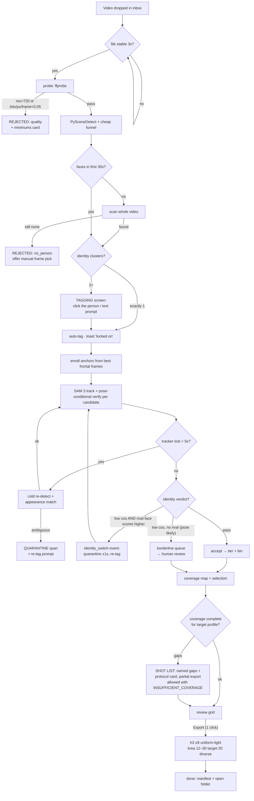

# GLM Consult

**Requested:** `glm-5.3`
**Served:** `glm-5.3`
**Document:** (path redacted; packet digest is recorded by consult-panel.mjs)
**Tokens:** 2560 in / 27246 out (reasoning: 17920) | total 29806
**Wall:** 1015.8s

---

# CHARACTER CAPTURE — design deliverable

Preliminary rulings first (they shape everything below), then the six items in order.

---

## §0 RULINGS — where I agree, disagree, and reframe back

**§6 reframe (extractor → capture director): RIGHT, but undersold.** I agree the coverage map + named gaps + reshoot instructions are first-class deliverables. But the packet still treats directing as something that happens *after* a video fails to cover. If the bar is "exactly like them," the director's job starts **before capture**: the single highest-leverage feature is a pre-shoot protocol card (paused turntable, 8 angles × 2s, tripod, 4K, 1/60s shutter minimum, two lighting setups) that Sean sees on first run — before he's wasted an evening shooting smooth orbits that the app will then reject for motion blur. I go further than the packet: the product's defensible core is **coverage instrument + shot protocol + closed-loop fidelity probe** (see Objection 1). Extraction is the commodity part; §7's competitive analysis is correct and I'd weight effort accordingly.

**Clips export: real win, not scope creep — but minimal scope.** H3 holds identity on *reused reference sets* and accepts ≤3 clips / ≤15s total. For a video-generation model, a 12s clip of the subject turning through 3–4 angles is plausibly the strongest single reference asset it can be given. Krea can't use clips, so this only serves the H3 profile — which is why it's the last feature slice, gated behind a recorded A/B. `[UNSURE: whether H3 video references materially outperform image sets for identity lock — not empirically established in the packet. Treat as an experiment with a kill switch, slice 7.]` No clip editor, no trim UI. Auto-picked spans only.

**Uniform vs diverse lighting: split by export profile, not globally.**
- **H3 set (≤9): uniform.** These images go into *conditioning* at inference time. Mixed lighting across 9 references makes the model arbitrage between them and drags generation lighting. Pick the dominant lighting cluster, export only from it.
- **Krea set (12–30): diverse contexts, neutral white balance per frame.** Identity LoRA overfit = can't render the person in new lighting. Diversity decorrelates illumination from identity — *provided* lighting doesn't correlate with pose (all left-profiles warm, all right-profiles cool = poisoned). The coverage report must check pose×lighting correlation and add a "second lighting setup" instruction when a single context dominates.

**Component vetoes (challenging §4):**
- **Drop the SAM 2 fallback** for v1. Two tracker stacks = double maintenance; the identity-veto layer already catches SAM-2-style failures (drift onto a lookalike gets rejected by ArcFace). Fallback is cold re-detect + appearance match, which reuses parts we already have.
- **Defer CR-FIQA.** `[UNSURE: packaging/licensing/integration cost of CR-FIQA as a drop-in.]` v1 uses an FIQA *proxy*: ArcFace embedding norm (MagFace-style signal) + face pixel width + Laplacian variance. CR-FIQA is a slice-5 upgrade only if the proxy's ranking visibly misbehaves on real data.
- **Keep** fs.watch + debounce, but add a **5s polling backstop** (Windows rename events are flaky; ~30 lines of code).
- **Keep** PySceneDetect, ArcFace/InsightFace (buffalo_l, ONNX), 6DRepNet360, MEBOW (head yaw ≠ body yaw is exactly right), Laplacian **as tie-breaker only** on body crops.
- **`lib/lora.mjs`: reuse the machinery, fork the doctrine.** Keep `datasetFor`/`captionFor`/licence gate. `TRAINING_NOTES` is style-LoRA doctrine — write `TRAINING_NOTES_IDENTITY` from scratch. Do not let the old notes leak into exports.

**H3 per-image limits: `[UNSURE — not documented in sources]`.** Not hard-coded. Config `h3.imageMaxLongEdge = 2048` with an `"unverified": true` flag in config; slice 3 includes a 10-minute empirical check by Sean (export at native, at 2048, at 1024; note which H3 accepts/compresses).

Audio references: out of scope (Sean asked for photos/clips; H3 audio can't be sent without image/video anyway).

---

## §1 BLUEPRINT

### 1.1 Process architecture

Two processes, stdio-coupled. The Node hub inherits the swan-taste-brain ethos (zero npm deps, no build, `node hub.mjs` runs it); all rot-prone ML lives in the Python worker behind a stable line protocol, so the hub stays five-year-runnable even if the worker doesn't.

```
┌─────────────────────── Sean's desktop (Win 11, RTX 5090) ───────────────────────┐
│                                                                                  │
│  data/inbox/  ──drop──►  hub.mjs (Node 22, zero deps)                            │
│                           ├─ lib/watch.mjs      fs.watch + 2s debounce + 5s poll │
│                           ├─ lib/jobs.mjs       state machine, job.json (atomic) │
│                           ├─ lib/api.mjs        localhost:3777, static + JSON    │
│                           │                     API + SSE progress               │
│                           └─ spawn ──►  worker/worker.py (persistent, holds     │
│                                            SAM 3 + InsightFace + 6DRepNet360 +  │
│                                            MEBOW in VRAM)                       │
│                           JSON-lines over stdio:                                 │
│                             ► {"id","op":"analyze","job":{...}}                  │
│                             ◄ {"id","type":"event","name":"stage"|"frame",...}   │
│                             ◄ {"id","type":"result","report":{...}}              │
│                           ffmpeg/ffprobe: bundled GPL build, child_process,      │
│                                            args arrays, no shell                │
│  ComfyUI (8189): NOT used by this app. Probe slice scores with ArcFace only.     │
└──────────────────────────────────────────────────────────────────────────────────┘
```

One worker, one job at a time (single GPU). Hub queues. No listening sockets in the Python worker (avoids Windows firewall prompts); the hub's only socket is localhost:3777.

**Model manifest / pinning** — `worker/models/REVISIONS.txt` records every model's source URL + commit/hash at install. `[UNSURE: exact install channel for SAM 3 (pip vs HF vs git clone) — bot must resolve at install time and record it.]` `[UNSURE: torch pin for RTX 5090 (sm_120) — install latest stable CUDA wheel whose `torch.cuda.get_device_capability()` reports `(12,0)`; verify in bootstrap script, fail loudly otherwise.]`

### 1.2 Pipeline stages

Funnel principle: **decode everything cheaply, run models on few frames.** Motion blur means the best stills sit at motion minima; find them with cheap metrics before spending GPU.

| # | Stage | Input → Output | Model/Lib | Why this one | Failure behavior |
|---|-------|----------------|-----------|--------------|------------------|
| 0 | Ingest | inbox file → job dir (atomic same-volume rename to `data/jobs/<id>/source.ext`) | fs.watch+poll | Rename is atomic; inbox stays clean ("in = todo") | Partial copies: wait until size stable 3s + openable exclusive |
| 1 | Probe/gate | source → `probe.json` (res, fps, dur, bitrate, codec) | ffprobe | needed anyway for decode params | res < 720 short edge or bits/pixel/frame < 0.05 `[UNSURE heuristic]` → `rejected:quality` + minimums card. Flag-not-reject for 720–1080 |
| 2 | Scenes | source → `scenes.json` (cut list) | PySceneDetect (content detector) | Cuts break tracking continuity; clips must not span cuts | Empty result = whole video one scene; fine |
| 3 | Cheap funnel | video → per-window candidate list | OpenCV: decode at ½ res, full fps; frame-diff magnitude + Laplacian var on face region (RetinaFace every 0.5s, box-interpolated between) | Finds stillness/sharpness peaks without GPU cost | None fatal; worst case more candidates |
| 4 | Candidate set | per 1.0s window, top-2 by stillness+sharpness → ~2 fps effective → `cache/` full-res JPEGs | ffmpeg seek-extract | Full-res decode only for winners | Corrupt frame → skip, log |
| 5 | Detect+tag | first 30s → identity clusters (ArcFace embeddings, cluster by cosine < 0.35 `[UNSURE cut]`) | InsightFace buffalo_l (ONNX) | 1 cluster → auto-tag (zero clicks). ≥2 → tagging screen. 0 → scan whole video, then `rejected:no_person` + manual frame-pick offer | |
| 6 | Enroll | top-5 frontal (yaw<20°, best FIQA-proxy) first 10s → anchor set (≤5 L2-normalized embeddings, max-cosine scoring) | InsightFace | **Incremental enrollment**: better frontal found later gets added; early-anchor bias is the hidden single point of failure | No frontal in whole video → manual frame pick on tagging screen |
| 7 | Track | SAM 3 click/concept on chosen person → persistent ID, mask+bbox per candidate frame | SAM 3 (`facebook/sam3`) | Persistent IDs through occlusion is the advertised strength; text prompt ("the man in the red jacket") as secondary tag input | ID lost > 5s → cold re-detect (persons via SAM 3 concept) + appearance match (torso HSV histogram + face when visible); ambiguous → quarantine span + re-tag prompt |
| 8 | Verify (pose-conditional, veto-style) | face crop from **mask**, not bbox (prevents crop bleed from a second face) | ArcFace vs anchors | See thresholds below. Veto, not requirement: rejection requires *positive evidence of wrong person*, not merely low cosine | |
| 9 | Pose | 6DRepNet360 (face yaw/pitch, full range) + MEBOW (body yaw) on subject crop | | head yaw ≠ body yaw; both axes needed for bins | `[UNSURE: 6DRepNet360 error at |yaw|>90° — calibrate with fixture F7 before trusting rear bins]` |
| 10 | Quality | FIQA-proxy (embed norm + face width + Laplacian), body-crop Laplacian, exposure/CCT stats, subject height px | | Tiered: face frames judged on face; body frames on subject crop (risk 6 resolved by tiers, not by one gate) | |
| 11 | Coverage | accepted frames → bins, gaps, shot list (`coverage.py` templates) | | First-class deliverable per §0 | |
| 12 | Review | UI grid grouped by bin; vetoes persist to job | | Sean vetoes; nothing auto-deletes silently | |
| 13 | Export | selection policies → `exports/` | vendored `lora-identity/` fork of `lib/lora.mjs` | Reuse machinery + licence gate; forked identity doctrine notes | |

**Verification thresholds (defaults, all in config):**

| Band | Gate | Borderline handling |
|---|---|---|
| \|yaw\| ≤ 30° | cos ≥ τ_front = 0.40 `[UNSURE]` | 0.25–0.35 → human review queue, never auto-accept |
| 30–70° | τ_front − 0.08 | same |
| 70–100° | τ_front − 0.15 **and** FIQA-proxy ≥ min | same |
| \|yaw\| > 100° or no face | **unverifiable** → body tier: requires track-continuity ≥ 0.9 + torso-histogram match; labeled `verified:body-only` in manifest | Always human-confirmable; excluded from H3 face slots |
| Any band | **Impostor veto:** another face in frame scores *higher* vs anchors than the tracked subject's face → reject frame, emit `identity_switch` event, quarantine ±1s | This is the anti-blend rule (risk 4) |

τ_front is **per-video adaptive** where possible: if ≥2 identity clusters exist, set τ above the impostor cosine distribution (p99 + 0.05); otherwise stay conservative. No precomputed magic number survives contact with a new video.

**Yaw sign convention (defined once, used everywhere):** yaw ∈ [−180, 180], 0 = frontal, **positive = subject turned to their own right (viewer's left)**. All bins, shot lists, and tests use this.

### 1.3 Data model

```jsonc
// Subject — data/subjects/<subjectId>/subject.json
{ "subjectId": "subj_8f3a", "name": "Maya",
  "consent": { "granted": true, "date": "2026-09-02", "scope": "personal" },
  "anchors": [ { "embedRef": "anchors/a1.npy", "quality": 0.81, "yaw": 4, "srcJob": "2026-09-02T1015-interview" } ],
  "appearance": { "torsoHSV": [/* 16-bin h, 8-bin s, 8-bin v */], "heightRatio": 0.42 } }

// Job (session) — data/jobs/<jobId>/job.json ; jobId = "2026-09-02T1015-<slug>"
{ "jobId": "...", "source": "source.mp4", "subjectId": "subj_8f3a",
  "status": "discovered|probing|needs_tag|auto_tagged|enrolled|analyzing|needs_review|exporting|done|rejected|failed|quarantined",
  "rejectReason": "quality|no_person", "stages": [ {"name":"scenes","status":"ok","ms":4120} ],
  "coverageSummary": { "faceYawFilled": [0,30,60,120,-60], "gaps": ["faceYaw:-90..-60"] } }

// CandidateFrame — append-only frames.jsonl (also the crash checkpoint)
{ "i": 4213, "t": 175.5, "shot": 6, "track": 1,
  "face": { "box": [x,y,w,h], "cos": 0.52, "fiqaProxy": 0.78, "wPx": 214 },
  "pose": { "yaw": -63, "pitch": 4, "bodyYaw": -90 },
  "body": { "box": [x,y,w,h], "hPx": 1188, "sharp": 146 },
  "light": { "cluster": 1, "cct": 5100, "ev": 0.2 },
  "tier": "face", "verdict": "accept", "reason": "" }

// CoverageBin — derived view in report.json
{ "axis": "faceYaw", "center": -60, "range": [-75,-45), "n": 7, "bestQ": 0.81,
  "verified": 7, "bodyOnly": 0, "example": "job://frames/4213" }

// ExportProfile — config.json (excerpt)
{ "h3":  { "maxImages": 9, "clips": { "max": 3, "maxTotalSec": 15 },
           "imageMaxLongEdge": 2048, "imageMaxLongEdgeUnverified": true,
           "lighting": "uniform-dominant-cluster",
           "policy": { "frontal": 2, "yawQuadrants": 4, "body": 2, "detail": 1 } },
  "krea": { "min": 12, "target": 20, "max": 30, "longEdge": 1024,
            "lighting": "diverse-contexts-neutral-wb",
            "warningFlag": "INSUFFICIENT_COVERAGE" } }
```

### 1.4 Disk layout

```
~/Desktop/character-capture/
  hub.mjs  config.json
  lib/{watch,jobs,api,export,constants}.mjs
  vendor/lora-identity/        # fork of lib/lora.mjs + TRAINING_NOTES_IDENTITY
  public/{index.html,app.js,style.css}          # vanilla, no build
  worker/{worker.py, pipeline/{probe,scenes,funnel,detect,track,embed,pose,quality,coverage,select,report}.py, models/REVISIONS.txt, tests/}
  ffmpeg/bin/{ffmpeg.exe,ffprobe.exe}
  data/
    inbox/                     # <-- Sean drops here
    probe/<subjectId>/         # <-- Sean drops H3 OUTPUTS here (slice 6)
    jobs/<jobId>/{source.ext, job.json, frames.jsonl, events.jsonl, cache/, report.json, exports/}
    subjects/<subjectId>/
    exports/<profile>-<ts>/
  tests/{run.mjs, fixtures/make_fixtures.py}
```

### 1.5 Failure & resume

- `job.json` written atomically (tmp + rename) on every transition; illegal transitions rejected by `jobs.mjs` (tested).
- `frames.jsonl` **is** the checkpoint. On worker restart mid-analysis: stream it, collect analyzed frame indices, continue from first unanalyzed candidate. Report generation is a pure function of `frames.jsonl` + vetoes → idempotent (golden-diff tested).
- Worker crash → hub respawns it, resumes job, SSE shows "resumed at frame N". Hub crash → on start, scan `data/jobs/`, reconcile statuses, resume.
- `cache/` is deletable at any time (re-extractable from source). Cache eviction: after `done`, keep only accepted frames' caches; purge > 7 days.

**Performance budget** `[UNSURE ±2×]`: 4K/10-min video ≈ 2–4 min cheap-funnel (CPU) + ~1,200 candidates × ~100ms GPU ≈ 2–4 min → **≤ 10 min end-to-end**, models resident in VRAM « 32 GB.

---

## §2 WIREFRAMES

### Desktop (localhost:3777, 1280+)

**State A — Idle / watching**

```
┌─ Character Capture ─────────────────────────────── watching data/inbox ── [＋ Add video] ─┐
│ Jobs (2)                                                                                   │
│ ┌───────────────────────────────────────────────────────────────────────────────────────┐ │
│ │ ▶ interview_take3.mp4     ANALYZING 62%   scenes ✓ funnel ✓ verify ▓▓▓▓▓▓░░░  412 acc │ │
│ │ ▶ backyard_test.mp4       NEEDS TAG — 2 people found            [Tag now ▸]           │ │
│ └───────────────────────────────────────────────────────────────────────────────────────┘ │
│                                                                                             │
│  ┌─ NEW SUBJECT? Shoot this first ────────────────────────────────────────────────────┐   │
│  │ ❶ Tripod, 4K/30, shutter 1/60 or faster   ❷ Subject turns ON THE SPOT, pausing 2s  │   │
│  │  at each of 8 angles (every 45°)          ❸ Again under a 2nd lighting setup       │   │
│  │  ❹ One slow full-body pan, head to feet   [Print card]   [Skip — I have footage]   │   │
│  └─────────────────────────────────────────────────────────────────────────────────────┘   │
│  Inbox: ~/Desktop/character-capture/data/inbox   ·   drop a file to start ·   0 clicks   │ │
└─────────────────────────────────────────────────────────────────────────────────────────────┘
```

**State B — Tagging (only when ≥2 identity clusters)**

```
┌─ Tag: who is the subject? ── interview_take3.mp4 ──────────────────────────────────────────┐
│  ┌───────────────┐  ┌───────────────┐  ┌───────────────┐   Click the person.            │
│  │  ◉ face A     │  │  ◻ face B     │  │  ◻ face C     │   Or type: [man, red jacket  ]│
│  │  (268 frames) │  │  (154 frames) │  │  (31 frames)  │   [None of these — pick frame] │ │
│  └───────────────┘  └───────────────┘  └───────────────┘                                  │
└─────────────────────────────────────────────────────────────────────────────────────────────┘
```
Auto path (1 cluster): no tagging screen — toast "1 person found — locked on" with a 10s "change" link.

**State C — Analyzing (live)**

```
┌─ interview_take3.mp4 ── analyzing 62% ── ▓▓▓▓▓▓▓░░░ ───────────────────────────────────────┐
│  faceYaw bins (live):   −180 ▁ ▂ 15 ▁ │ −90 ▁ │ 0 ▂48▂ │ +90 ▁ │ +180 ▁ ▃ 9 ▁            │
│  bodyYaw:  filled 5/8 ·  accepted 412 ·  quarantined 1 span (00:02:41, possible swap)    │
└─────────────────────────────────────────────────────────────────────────────────────────────┘
```

**State D — Review + coverage map + gaps (the main screen)**

```
┌─ interview_take3 ── REVIEW ─────────────────────────────────────────── [Export both ⏎] 1 ─┐
│ COVERAGE (✓ verified · ◔ body-only · · empty)                    LIGHTING: 1 context ⚠   │
│           pitch: down      level      up                                                    │
│  yaw −150   ·        ◔2        ·        KREA SET 14/20 · under target                     │
│  yaw −120   ·        ·         ·        ┌─ SHOOT LIST (fills 6 gaps) ─────────────────┐   │
│  yaw  −90   ·        ◔1        ·        │ ❶ Face 3/4 right (yaw −45): pause 2s        │   │
│  yaw  −60   ·        ·         ·        │ ❷ Right profile (−90) + rear (−150)         │   │
│  yaw  −30   ✓3       ✓11       ✓2       │ ❸ Body rear + right 3/4 (full body)         │   │
│  yaw    0   ✓4       ✓23       ✓5       │ ❹ Second lighting: warm practical, repeat ❶ │   │
│  yaw  +30   ✓2       ✓9        ✓1       │    [Print checklist] [Merge reshoot later]  │   │
│  ...                                     └────────────────────────────────────────────┘   │
│ Bin: yaw −30, level ── 11 frames ────────────────────────────────────────────────────────  │
│ [f4213 ✓q.81] [f4187 ✓q.79] [f4102 ✓q.74] [f4461 ✗ vetoed]   click=preview  X=veto  U=undo│
│ ⚠ 12 frames in review queue (borderline identity)  [Review ▸]     E=export  ←/→=navigate  │
└─────────────────────────────────────────────────────────────────────────────────────────────┘
```

### Mobile (review-first; tagging/analysis stay desktop)

```
┌─ CC · interview_take3 ──────┐
│ coverage: 9/12 yaw bins     │
│ −180 ─░░░░░░░░░░░─ +180     │
│ ▂▂▂▂ ✓✓✓✓ ✓✓✓ ✓◔ ✓ ...    │
│ GAPS (6): +45 face · rear…  │
│ ─────────────────────────── │
│ ┌───────────────┐           │
│ │  f4213  q.81  │  ◄ swipe ►│
│ │  yaw −32      │           │
│ └───────────────┘           │
│   [ ✓ keep ]  [ ✗ veto ]    │
│ [ Export both ]             │
└─────────────────────────────┘
```

**Click counts (main path):** drop file → **0 clicks** through analysis (auto-tag when unique). Review defaults preselected → **1 click** ("Export both", also `E`). Ambiguous person: **+1 click**. Each veto: +1 (optional, never required to export). Manual start instead of watch: 2 clicks (＋ Add → choose file).

---

## §3 FLOWCHART



Branch table (all six required branches): no face → `rejected:no_person` after full scan, with manual-pick escape hatch. Two candidates → tagging screen, never a silent guess. Tracker loss → occlusion-tolerant 5s, then cold re-detect; ambiguity quarantines rather than guesses. Identity disagreement → the impostor-veto rule; disagreement without a rival is treated as *pose*, not rejection (risk 3). Coverage incomplete → first-class shot list; partial export permitted but flagged in manifest (risk 5). Low quality → early reject with the minimums card, so Sean learns the capture protocol from the failure itself.

---

## §4 TESTS

**Philosophy:** every absence claim ships with a positive control — a paired assertion that the *same pipeline accepts known-good data*. A degenerate gate that rejects everything must fail the suite. House style: plain `.mjs` for hub/API (fetch against a test server on an ephemeral port), `pytest` for worker; fixtures built deterministically by `tests/fixtures/make_fixtures.py`.

### Golden fixtures

| ID | Fixture | Recipe | Purpose |
|---|---|---|---|
| F1a/F1b | `turntable_full_{soft,warm}.mp4` | Sean (developer = inherent consent) on tripod, 8 paused angles × 2s, 4K/30, two lighting setups; tape marks on wall give yaw ±10° | Full-coverage positive control; lighting clusters |
| F2 | `switcheroo.mp4` | Two different people, similar wardrobe, A exits / B enters (ffmpeg concat) | Impostor precision |
| F3 | `occlusion_pole.mp4` | Subject walks behind a pole/door, reappears | Tracker loss/recovery |
| F4 | `interview_narrow.mp4` | Frontal-only conversation footage | Honest gap reporting |
| F5 | `crushed_720.mp4` | F1a re-encoded 720p CRF 40 | Quality gate |
| F6 | `no_person.mp4` | Scenery only | No-face branch |
| F7 | `pose_stills/` | 8 stills at labeled yaws (0, ±45, ±90, ±135, 180) from F1 wall-mark protocol | Pose calibration |
| F8 | `sharp_blur_pairs/` | Accepted stills + ffmpeg `boxblur` copies | Blur gate |
| F9 | `gen_probe_sample.mp4` | One real H3 generation of the F1 subject (recorded once, manually) | Fidelity probe sanity |

*Note: fixture faces must be real humans — synthetic faces embed poorly in ArcFace `[UNSURE]`, which would invalidate the identity tests.*

### Test matrix (absence claim ↔ positive control)

| # | Claim under test | Test | Positive control (fails if check is broken) |
|---|---|---|---|
| 1 | Rejects low quality | F5 → `rejected:quality`, reason matches `/resolution|bitrate/` | F1a passes gate |
| 2 | Rejects no-person | F6 → `rejected:no_person` | F1a yields ≥1 cluster |
| 3 | Cluster counting | F1a → exactly 1 (auto-tag); F2 → ≥2 (tagging screen) | — (self-paired) |
| 4 | **Identity lock held** | F2, enrolled on A: accepted frames with t > swap ≡ **0** (impostor precision = 1.0) | Pre-swap acceptance ≥ 20 face-tier frames (gate not broken-closed) |
| 5 | Occlusion recovery | F3: zero impostor accepts; acceptance resumes post-occlusion; ≤1 quarantine span | Occlusion must not reject the same person (resume count > 0) |
| 6 | Pose honesty | F7: \|pred−label\| ≤ 15° for \|yaw\|≤90°, ≤ 25° beyond | Detector returns *some* value for every F7 still (not crash/NaN) |
| 7 | **Coverage map honest — anti-interpolation** | Harness veto-hook force-rejects yaw ∈ [−75,−45) on F1a → report shows that bin **empty**, shot list names "3/4 right face," selection excludes it, all other bins unchanged ±2 | Unmodified F1a lights **12/12** yaw bins — the map fills when data exists |
| 8 | Narrow coverage honesty | F4: ≥4 named gaps; krea count <12 → manifest `INSUFFICIENT_COVERAGE`; every exported file's provenance `t` maps to an `accept` row in frames.jsonl (no fabricated frames) | F1a krea export reaches target 20 with no warning |
| 9 | Export constraints (fuzz) | 10k random score vectors → h3 ≤ 9 always; krea ∈ [12,30] or warned; manifest count + hashes match disk exactly | Fuzz with all-high scores must produce *full* sets (selector isn't conservatively broken) |
| 10 | Licence gate | Existing suite + fork guard: `TRAINING_NOTES_IDENTITY` used, style notes never emitted | Export succeeds on gated-pass fixture |
| 11 | **No face restoration, ever** (risk 2) | `test_no_restorers`: grep worker/ for `gfpgan|codeformer|retinex` → 0 matches | Paired F8: sharp originals accepted (sharpness isn't achieved by restoration) |
| 12 | Watch stability | Append-write 1MB/200ms → job starts only ≥3s after last write | Fast full copy detected within 10s |
| 13 | Resume = idempotent | F1a full run → `report.golden.json`; SIGKILL worker at 25/50/75% frame indices, restart → canonical-JSON-identical report | — |
| 14 | Borderline routing | Synthetic cosine 0.25–0.35 → review queue, never auto-accept, never silently dropped | Cosines ≥0.5 auto-accept |
| 15 | State machine legality | Random transition sequences → illegal ones rejected | Legal sequence reaches `done` |
| 16 | Probe instrument sanity (slice 6) | probe(F1a vs F1a anchors) median cos ≥ 0.5 `[UNSURE value — calibrate from enrollment distribution]` | probe(F6 frames) scores low |

The **degenerate-gate floor** applies globally: any fixture run that accepts 0 frames where ≥N known-good frames exist fails the suite. N per fixture lives in `tests/fixtures/expected.json`.

---

## §5 SLICES

**S1 — Premise harness (prove/kill risk 1).** Offline CLI, no UI, no tracking: `python -m tools.premise_probe --video F1a --reference-dir <Sean's hand-curated set>`. Samples frames, runs face detect + FIQA-proxy + sharpness, exports top-9 + a parity report (video-top-9 vs hand-picked distributions). Sean does one manual H3 A/B (hand-picked vs harvested, forced-choice) recorded in `docs/premise-verdict.md`.
*Accept:* report runs on this machine; parity ratio computed; verdict recorded. **Kill/pivot criterion:** parity < 0.7 `[UNSURE threshold]` or Sean reliably prefers hand-picked → app pivots to director-first (shot lists + probe become the product; extraction stays for good-footage cases). Timebox: 1 day.

**S2 — Hub v0: watch, gate, card.** Node hub, watch folder + manual start, probe + quality gate, job state machine, UI shell (idle, rejected states), the **pre-shoot protocol card** on idle screen (§0). Analyzer stub ends at `needs_tag: "analyzer not installed (S3)"`.
*Accept:* F5 → rejected card; F6 → no_person; F1a → job queued; slow-copy test passes; card printable.

**S3 — Extractor end-to-end (single person).** Stages 3–8 + crude top-9 H3 export (manual count, uniform-light best-effort). Auto-tag when unique; click-to-tag otherwise.
*Accept:* F1a auto-tags, ≥ fixture-floor accepts, top-9 produced; **F2 impostor accepts = 0**; F4 partial with warning; H3 long-edge limit empirically checked by Sean and un-flagged in config.

**S4 — Coverage + dual export + review grid.** Pose models, bins, coverage map UI, gap shot lists, review grid with veto round-trip, h3 + krea profiles, vendored `lora-identity` fork with licence gate.
*Accept:* anti-interpolation test (T7) passes; F4 named gaps + `INSUFFICIENT_COVERAGE`; vetoed frames never export; default path = 1 click.

**S5 — Robustness.** Adaptive τ_front, impostor-veto spans, cold re-detect, quarantine UX, checkpoint resume, illegal-transition guard, occlusion handling; optional CR-FIQA swap-in if proxy misranks on real data.
*Accept:* T5, T13, T14, T15 pass; 3 consecutive real-world videos complete without manual state surgery.

**S6 — Fidelity probe (closed loop, see Objection 1).** `data/probe/<subjectId>/`: drop H3 outputs → ArcFace vs anchors → per-generation median-cos report appended to subject history; trend shown in UI.
*Accept:* T16 passes; Sean has ≥3 generations scored and can state whether the number tracks his eyeball verdict.

**S7 — Clip export (experiment).** Auto-select ≤3 contiguous spans (identity-verified throughout, no cut inside, stillness-preferring, motion variety), ≤15s total, ffmpeg CRF 18; manifest lists seconds; toggle in h3 profile.
*Accept:* constraint fuzz (clips ≤3, ≤15s); Sean A/B recorded in `docs/clips-verdict.md`; kill switch = config flag if A/B shows no identity gain.

**S8 — Subject library, merge, polish.** Multi-video jobs merge into one coverage map per subject; combined exports; mobile review polish; cache eviction/archive.
*Accept:* F1a + F4 (same subject) merge: gaps from one filled by the other, export reflects union; mobile veto round-trips.

---

## §6 THREE STRONGEST OBJECTIONS

**1. As specced, the app never measures the thing it exists to achieve.** Every internal metric — FIQA, sharpness, bin counts — is a proxy. "Exactly like them" is decided inside H3/Krea at generation time, and nothing in the packet looks back. Sean will iteratively tweak reference sets against an instrument that doesn't exist. The fix is cheap because the stack already exists: **the fidelity probe** (S6) — drop generated outputs back in, ArcFace them against the subject anchors, report a number per generation. It's not ground truth (it's the same embedding family, so it's generous to the enrollment set), but it converts "feels off" into a trend line. I'd trade the clip feature and half the robustness polish before I'd cut the probe; if you only keep one of my changes, keep this one.

**2. The packet's reframe is right for the wrong reason — the director isn't a recovery mode, it's the product, and it should change slice order.** Casual video has a narrow yaw band; most drops will end as shot lists, not datasets. Extraction alone is already commoditized (§7's list). So the first-run experience for a new subject must be the protocol card, not the inbox; "42% coverage — here's what to shoot" must be presented as a **success state**; and the merge path (S8) is the actual loop: shoot → harvest → see gaps → reshoot → merge. If we build extractor-first and bolt directing on later, the UI, the copy, and Sean's habits will all encode the wrong default. I moved the card to S2 for this reason.

**3. The identity instrument degrades exactly where this product's value lives, and pose-binned thresholds are a patch, not a fix.** ArcFace embeddings were never trained to match at ±90°+; rear views are unverifiable by *any* face embedding; 6DRepNet360's error at extreme yaw may itself be ±30° `[UNSURE — F7 calibrates this before rear bins are trusted]`. Consequences I've designed in, and would defend hard: (a) **veto-style gating** — low cosine alone never rejects; rejection needs a *rival face scoring higher*; (b) bins are filled with confidence labels (`verified` vs `body-only`) and the UI renders them differently, so the map never pretends rear coverage is face-verified; (c) frames with |yaw| > 70° default to human-confirm; (d) **chain-of-custody scoring** for unverifiable frames — a frame is trusted if it's inside one continuous track segment anchored at both ends by verified frontal frames with no crossing face, which is evidence the threshold table can't manufacture. If calibration (F7) shows the instrument is too noisy past ±90°, cut the 12-bin map down to what's honest rather than shipping false precision — an honest 6-bin map with a "rear: unverifiable, go shoot" instruction beats a decorative 12-bin one.

---

## Register of `[UNSURE]`s (build-blocking only)

| Item | Disposition |
|---|---|
| H3 per-image resolution/size caps | Config flagged unverified; empirical check in S3 |
| torch/CUDA pin for RTX 5090 (sm_120) | Bootstrap script verifies `get_device_capability()==(12,0)` |
| SAM 3 install channel + packaging | Resolve at install; record in `models/REVISIONS.txt` |
| CR-FIQA drop-in availability | Deferred; FIQA-proxy in v1 |
| ArcFace τ values (0.40 base, band offsets) | Defaults + per-video adaptation + F2/F7 calibration |
| Cluster split cosine 0.35; quality-gate bits/px/frame 0.05; S1 kill threshold 0.7; probe sanity 0.5; performance estimates | Calibrate against fixtures in S1–S3 |

Everything else in this document is buildable as written.
