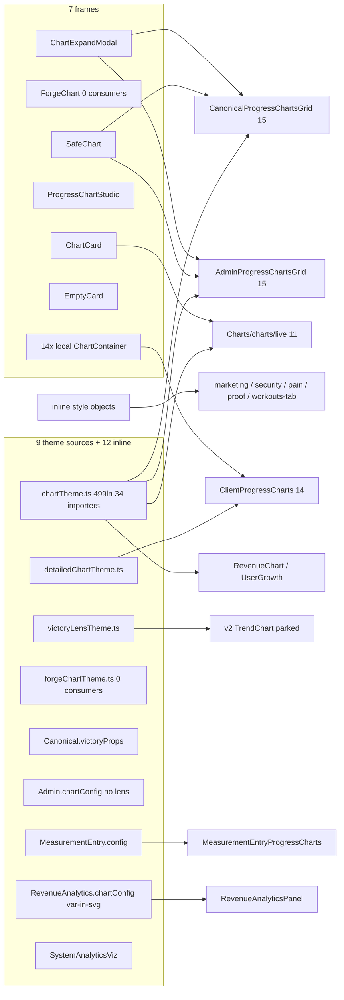
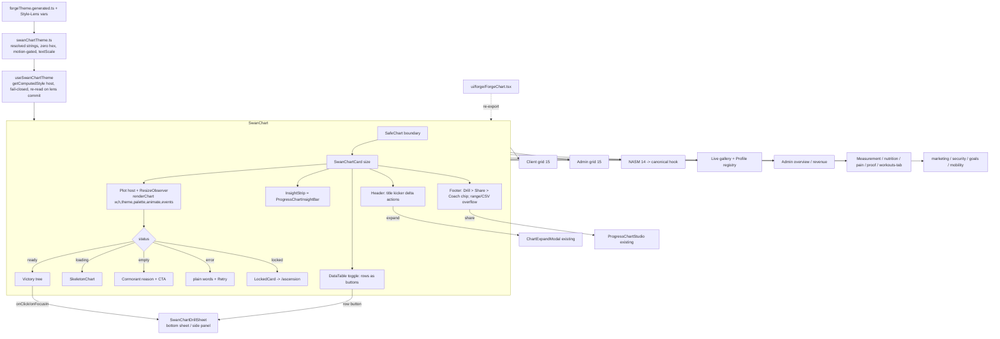
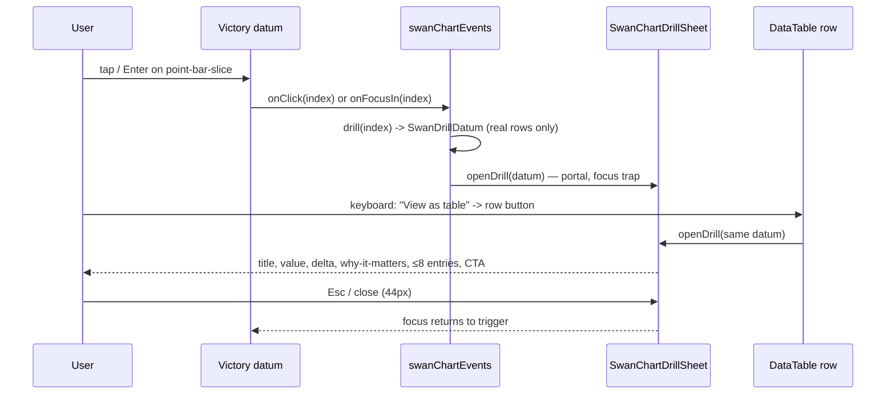
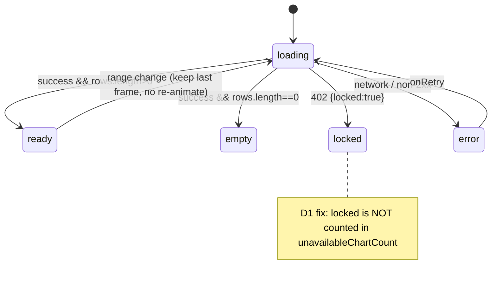
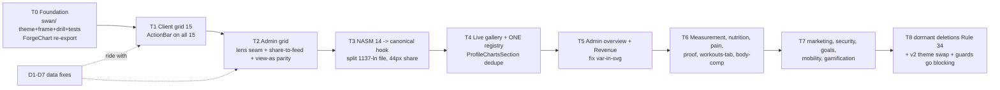

# Chart System Unification — Audit + Blueprint (2026-09-03)

> **Worker contract.** This document is complete enough to build from without asking Fable anything. Execute the slices in §9 in order. Do not re-decide anything in §5–§8. Where a decision is marked `[SEAN]`, stop and ask Sean, not Fable. Every claim below carries `file:line` against `origin/main@776cad07b`; if a line has moved, re-grep by symbol, do not guess.
>
> **What Sean asked (verbatim intent):** audit the client-data charts, make them beautiful, clickable, modular, and *all the same* — "take all the charts, combine everything that makes them all good, make that ONE the default chart for everything." Then blueprint + wireframe + mermaid + flowchart + tests for another agent. **No build in this session.**

---

## 0. Executive read (60 seconds)

| Fact | Evidence |
|---|---|
| **61 chart-rendering files** (46 Victory, 15 hand-rolled SVG/CSS); **0 d3, 0 Recharts** — Rule 10 clean | inventory agent, `rg -l "from 'victory'" frontend/src` |
| **9 distinct theme sources + 12 files with inline axis/tooltip objects** | §2.1 |
| **7 distinct frame/card systems**, 4 different card radii (12/14/16/20), grid-line alpha 0.06→0.28, tooltip background split Graphite vs Carbon | §2.2 |
| **22/61 files carry raw hex** (whole `ClientProgressCharts/charts/` = 14/14; whole `Charts/charts/` = 0/11) | §2.3 |
| **24 files animate with no reduced-motion gate**; only 2 gate correctly | §2.4 |
| **21 files hard-code pixel sizes**; exactly ONE `ResizeObserver` exists in the chart layer (`ChartExpandModal.tsx:109-112`) | §2.5 |
| **Retired Galaxy-Swan tokens in chart files: ZERO** | `rg -n -i "00ffff\|7851a9\|0a0a1a"` → 30 hits, none in chart files |
| **Mock data feeding any canonical chart: ZERO**; all 15 canonical charts read real `workout_logs` / `workout_sessions` / `body_measurements` / `daily_macro_logs` via raw SQL; response-shape drift: **none** | §3 |
| **Two "next-generation" chart systems already exist side by side** — `progress-proof/` (live, rich) and Forge `ForgeChart` (zero-hex theme, reduced-motion gate, **0 consumers**) — neither reached the other 45 files | §2.6 |
| **The same chart component is mounted from 3 URLs** (`ClientProgressCharts`) and the live gallery has **two independent lazy registries** with different gating models | §4 |
| Real defects found (not style): locked/unavailable double-count, admin 402 swallow, tier-gating asymmetry, dead `predictions` endpoint, `var()` emitted into SVG attributes, 36px share button | §3.3, §2.7 |

**Verdict:** the *data* is honest; the *presentation* is nine dialects of the same language. Unification is a presentation-layer strangler with a handful of data-layer bug fixes riding along. No schema work. No new endpoints.

---

## 1. Canonical Surface Receipt (Rule 26) — primary surface

The unification's first target is the client progress grid, because it is already the closest to the target and has the most tests.

| Receipt item | Evidence |
|---|---|
| (a) route file mounting the URL | `frontend/src/routes/main-routes.tsx:936` (`dashboard/*` → `UniversalDashboardLayout`) → `components/DashBoard/UniversalDashboardLayout.routes.tsx:224` (`client/progress`) |
| (b) mounted JSX | `UniversalDashboardLayout.routeComponents.tsx:99` → `Pages/client-dashboard/ClientProgressDashboardPage.tsx:249` `<CanonicalProgressChartsGrid …/>` |
| (c) consumer hook | `Pages/client-dashboard/CanonicalProgressChartsGrid.tsx:62` → `hooks/analytics/useClientProgressCharts.ts` |
| (d) exact API path literal | `hooks/analytics/useClientProgressCharts.ts:40` — `` `/api/client/analytics/${suffix}` ``; 15 suffixes at `useClientProgressCharts.types.ts:33-49` |
| (e) backend route match | `backend/core/routes.mjs:474` `app.use('/api/client/analytics', clientAnalyticsRoutes)` → `backend/routes/clientAnalyticsRoutes.mjs:188-255` → `backend/controllers/chartDataController.mjs` (per-chart handlers `:131-853`) |
| (f) authoritative fields | raw SQL on `workout_sessions`, `workout_logs`, `body_measurements`, `daily_macro_logs` (table names locked by `backend/tests/unit/chartDataControllerSchemaDrift.test.mjs:83`) |

Mount-shadow walk (Rule 31): `/api/analytics` (`routes.mjs:473`) vs `/api/client/analytics` (`:474`) — no shadowing (longer literal prefix wins; all `/api/analytics` routes require `:userId`). Overlapping `/api/admin` mounts `adminClientRoutes` (`:502`) and `adminWorkoutLoggerRoutes` (`:558`) — safe today, **unpinned** (slice D6 adds the guard).

---

## 2. Audit — presentation layer (what "different" actually means)

### 2.1 Theme sources (9 + inline)

| # | file | ln | importers | raw hex | reduced-motion gate | unique capability |
|---|---|---|---|---|---|---|
| T1 | `components/Charts/chartTheme.ts` | 499 | 34 | 24 | card CSS only (`:317-325`); `VICTORY_ANIMATE` (`:182`) **ungated** | most complete (9 mark types `:103-179`), `sanitizeChartData` (`:417-427`), lens bridge (`:63-72`), `ChartCard` sheen/depth (`:240-271`) |
| T2 | `ClientProgressCharts/charts/detailedChartTheme.ts` | 96 | 10 | 4 | none | grid 0.08 alpha (3.5× fainter than T1) |
| T3 | `adapters/style-lens-swan/charts/victoryLensTheme.ts` | 118 | 5 | 2 | none | fail-closed hex validation + never-throw fallback (`:60,105-117`); `fontFamily` deliberately unset (`:86`) |
| T4 | `components/ui/forge/forgeChartTheme.ts` | 66 | **1 (ForgeChart only)** | **0** | **yes** — `Number(forgeTheme.motion) > 0` (`:66`) | tooltip `cornerRadius:6 pointerLength:6` (`:55-56`), `textScale` (`:20-21`), derived from `forgeTheme.generated.ts` |
| T5 | `client-dashboard/CanonicalProgressChartsGrid.victoryProps.ts` | 76 | 8 | 0 | n/a | seamed lens props via `useSeamedVictoryProps` |
| T6 | `clients-team/tabs/AdminProgressChartsGrid.chartConfig.ts` | 79 | 5 | 0 | n/a | **admin twin of T5 with NO lens seam** |
| T7 | `admin-dashboard/MeasurementEntry.config.ts` | 143 | 1 | yes | none | local theme; styles file uses slate `rgba(30,41,59)` + Material `#4caf50` (`MeasurementEntry.chartStyles.ts:34,68,94,99,121`) |
| T8 | `admin-dashboard/components/RevenueAnalyticsPanel.chartConfig.ts` | 71 | 1 | 0 | none | **emits `var()`/`color-mix()` INTO Victory SVG props** (`:11-19,24-33`) — SVG presentation attributes cannot resolve these; contradicts `chartTheme.ts:39-41`. Only file honoring `--accent-data` (`:40-41`) |
| T9 | `admin-gamification/SystemAnalyticsViz.styles.ts` | 83 | 1 | 0 | none | pure-CSS bars, private `--analytics-*` namespace |
| — | inline style objects in 12 files | — | — | — | — | `SecurityScoreCard.tsx:51`, `VulnerabilityScannerPanel.tsx:39`, `ProgressChartRecoveryObservatory.tsx:35`, `ProofChart.tsx:20`, `NASMCategoryRadar`, `OneRepMaxChart`, `RPEDistributionChart`, `PainChartTrendFollowUp`, `WorkoutsTabCharts`, `ExerciseHistoryChart`, `MetricConstellation`, `ConsistencyHeatmap` |

Divergence values that a user *sees* as "these charts look different":

| property | T1 | T2 | T3 | T4 | decision (§6) |
|---|---|---|---|---|---|
| grid stroke | Ice Wing 0.28, dash `4 4` | Ice Wing 0.08, `4,4` | Frost 0.12, no dash | Frost 0.06, `4 4` | Frost White 0.12, dash `4 4` |
| tooltip bg | Graphite `#1A1A24`@.95 | Carbon `#141419` | Carbon | Graphite@.95 | Graphite@.95 |
| tooltip radius | 0 | 0 | 0 | **6** | 6, pointer 6 |
| tick font | Fira Code 11 | Fira Code 11 | unset | Fira Code 10×scale | Fira Code 11×scale |
| axis label font | Sora 12 | Fira Code 12 | unset | Sora 11×scale | Sora 12×scale |
| series-1 | Ice Wing `#60C0F0` | seamed | seamed | Ice Wing | **Arctic Cyan `#50A0F0`** (CLAUDE.md: data-only token; design-brain §5) |
| animation | 800ms ungated | 800ms ungated | none | 800ms gated | 600ms on-load, gated |

### 2.2 Frame / card systems (7)

| frame | file | consumers | what only it has |
|---|---|---|---|
| `SafeChart` | `Charts/SafeChart.tsx:57-60` | 4 hosts | error boundary + Suspense + 44px retry |
| `ForgeChart` | `ui/forge/ForgeChart.tsx:20-26` | **0** | class-based `sw-card--data` chrome, `aria-labelledby` |
| `ChartExpandTrigger`→`ChartExpandModal` | `progress-proof/ChartExpandModal.tsx:40-50` | 8 / 6 | **the a11y gold standard**: focus-return (`:84-91`), Escape (`:93-97`), scroll lock (`:99-104`), the only `ResizeObserver` (`:106-117`), `renderChart(w,h)` |
| `ProgressChartStudio` | `progress-proof/ProgressChartStudio.tsx:33-40` | 6 | share card + tone border map (`.styles.ts:4-11`) + PR celebration (`:177`); **lacks focus-return and scroll lock** |
| `ChartCard` (chartTheme) | `Charts/chartTheme.ts:205-283` | Charts/live family | sheen `::before` + depth `::after` + `@supports` fallback |
| `EmptyCard` primitives | `CanonicalProgressChartsGrid.primitives.tsx:11` | 8 | — |
| per-file `styled(motion.div) ChartContainer` ×14 | every `ClientProgressCharts/charts/*.tsx` | 14 | nothing — pure duplication |

Card radius: 12 (`CanonicalProgressChartsGrid.styles.ts:29`) / 14 (`AdminProgressChartsGrid.styles.ts:20`) / 16 (`chartTheme.ts:220`, `RevenueChart.styles.ts:11`) / 20 (`ClientProgressCharts.tsx:280`, `ShareChartModal.tsx:52`) / 8 (`ProgressChartStudio.styles.ts`).
Skeletons: `ui/SkeletonChart.tsx` (9 sites, token-driven, full reduced-motion) — winner; `SkeletonLoaders/ChartSkeleton.tsx` (1 site, unique `hardware` gym-screen variant `:79,88`); `Skeletons/ChartSkeleton.tsx` (**0 sites, hardcoded `#141419` at `:86` — dead**).

### 2.3 Raw hex offenders (22 files)
Worst: `Charts/ExerciseHistoryChart.tsx` (25), `ClientProgressCharts/charts/ExerciseFrequencyChart.tsx` (18), `FormQualityChart.tsx` (18), `workspaces/marketing/SEOAuditPanel.tsx` (15), `NASMCategoryRadar.tsx` (14 — uses Tailwind `#3b82f6`/`#10b981` at `:130-131`, not Swan), `OneRepMaxChart.tsx` (14). `StrengthProgressionChart.tsx:29` introduces `#4ECDC4` (not a Swan token). Marketing widgets use Instagram/Facebook brand hex (`CompetitorAnalysisWidget.tsx:140-141`) — acceptable as *brand-of-the-competitor* data, must be routed through a named `EXTERNAL_BRAND` map, not inline.

### 2.4 Motion (24 ungated)
Correct pattern exists in exactly two files: `Charts/charts/pie/MacroDonut.tsx:91` and `radar/NutritionBalanceRadar.tsx:101` (`animate={prefersReducedMotion ? undefined : VICTORY_ANIMATE}` via `hooks/useReducedMotion`). `DashBoard/v2/sections/TrendChart.tsx:49` gates on a density prop. Everything else animates 800ms unconditionally. Six files have CSS `prefers-reduced-motion` blocks that govern card hover only, not the Victory `animate` prop.

### 2.5 Sizing (21 fixed)
Fixed pixel sizes: `ProgressChartRecoveryObservatory.tsx:85-86` (232×520), `ProofChart.tsx:51` (560), `RPEDistributionChart.tsx:85-86` (400×300), `SEOAuditPanel.tsx:146-147` (160²), `AdminBodyCompPanel.tsx:134,165,201` (180), `RevenueAnalyticsPanel.sections.tsx:204,234,242` (350/280/60), `RevenueChart.tsx:161`/`UserGrowthChart.tsx:133` (220), `WorkoutsTabCharts.tsx:98-100` (reads `window.innerWidth` once, no listener — stale after resize/rotate).

### 2.6 The two half-finished successors
- **progress-proof** (`components/DashBoard/progress-proof/`, 35 files, SWA-68 S1 shipped 2026-07-25→27): expand modal, data table, action bar, insight bar, studio, gravity, ghost-self, constellation, facet rail, digest, proof reel. Live on the client grid (15 charts) and admin grid — but action bar reaches only **2 client charts** (`interactiveCards.tsx:202,273`), admin has no lens seam and no share-to-feed (`AdminProgressChartsGrid.share.tsx:79-85` never passes `onShareToFeed`).
- **Forge** (`ui/forge/ForgeChart.tsx` + `forgeChartTheme.ts`, Phase 2f shipped 2026-08-24): the only zero-hex, reduced-motion-gated, text-scaled theme. **Zero consumers.** The catalog plan (`brainstorms/component-forge-catalog-2026-08-24.md:27,242`) explicitly keeps SafeChart and defers a chart-adapter interface.

These two must become ONE. §5 fuses them.

### 2.7 Concrete UI defects (fix in migration, not separately)
- `ClientProgressCharts.tsx:386-387` `ShareIconBtn` is 36×36 — Rule 2 violation (only chart button in the repo that fails 44px).
- `RevenueAnalyticsPanel.chartConfig.ts:11-33` `var()` in SVG attributes (renders browser-default black when unresolved).
- `ProgressChartStudio.tsx:99-108` and `ShareChartModal.tsx:305-312` — no focus trap, no focus-return (WCAG 2.4.3).
- `NASMCategoryRadar.tsx:168`, `OneRepMaxChart.tsx:91` — `height` prop received and unused.
- `#60C0F0` (Ice Wing) used as **chrome** (borders/focus rings) in ~10 chart style files (`CanonicalProgressChartsGrid.styles.ts:257,260,271`, `ChartExpandModal.styles.ts:104,110`) while the data-only token Arctic Cyan is barely used — series-1 should be Arctic Cyan, glow/focus should be Wing Purple per Dual-Button Glow.

---

## 3. Audit — data layer (Rule 58 proactive drift check)

### 3.1 Truth table (all 15 canonical charts)
| chart | client route | admin route | handler | table |
|---|---|---|---|---|
| workoutFrequency / attendanceReliability / durationTrend | `clientAnalyticsRoutes.mjs:188,191,200` | `analyticsRoutes.mjs:164-183` | `chartDataController.mjs:131,165,292` | `workout_sessions` |
| weeklyVolume / setsRepsTrend / intensityRpeTrend / prTimeline / anchorLifts / exerciseFrequency / movementPatternBalance / muscleGroupBalance / recoverySignal / estOneRm | `:194-228` | same | `:212-838` | `workout_logs` (⋈ sessions) |
| weightTrend / bodyFatTrend | `:249,252` (**ungated**) | `:181-182` (**`requireTier('pro')`**) | `:709,737` | `body_measurements` |
| macroSplit | — | `:183` | `:775` | `daily_macro_logs` |

Shapes expected by `useClientProgressChartsResponseMapping.ts:78-110` match controller returns (`chartDataController.mjs:192-197,269-275,488-492,849-853`). **No drift.** `movementPatternBalance`/`muscleGroupBalance` are classifier-derived from `exerciseName` via CASE ladders (`:67-68`), guarded by `chartDataTruthContract.test.mjs:27-41`.

### 3.2 Second lineage
`ClientProgressCharts.tsx:517,522` → `/api/workout-forms/client/:id/progress[-detailed]` → `backend/routes/dailyWorkoutFormRoutes.mjs:1655,1884` → `daily_workout_forms` (`DailyWorkoutForm.findAll`) **merged with** canonical `WorkoutLog` sessions via `fetchCanonicalProgressWorkoutSessions`, with a legacy `formData` fallback when the canonical query fails. `[VERIFIED]` this session. Two lineages can therefore disagree on a bad day. §9 slice T3 migrates these 14 charts onto the canonical 15-chart hook where a canonical equivalent exists and keeps `progress-detailed` only for NASM-category/form-quality charts that have no canonical source.

### 3.3 Data defects (ride along in slices D1–D6)
| id | defect | file:line | fix |
|---|---|---|---|
| D1 | Locked (402 `{locked:true}`) charts also counted as *unavailable* → free-tier users see an outage banner for correct paywall behavior | `useClientProgressChartsResponseMapping.ts:152-154`, `useCanonicalProgressChartsFetch.ts:83-87` | exclude `locked` from `countUnavailableChartResponses`; RED test first |
| D2 | Admin hook swallows every error, no 402 sentinel | `useAdminClientProgressCharts.ts:51` | mirror client sentinel |
| D3 | Body-comp hook has no `catch` → silent empty charts on failure | `useAdminBodyCompCharts.ts:103-111` | add error state |
| D4 | Tier asymmetry: weight/body-fat free on client, pro on admin | `clientAnalyticsRoutes.mjs:249,252` vs `analyticsRoutes.mjs:181-182` | `[SEAN]` decide which is intended; then a contract test asserting both routers agree |
| D5 | Dead method targets nonexistent route | `services/enhanced-progress-analytics-service.ts:255-263` (`/predictions`) | delete (0 consumers) |
| D6 | `/api/admin` mount order unpinned | `backend/core/routes.mjs:502` vs `:558` | comment + contract test like `routes.mjs:709-712` |
| D7 | No cache/dedup: every grid mount fires 15 requests; two consumers of `useClientProgressCharts` (`CanonicalProgressChartsGrid.tsx:62`, dormant `ClientObservatoryProgressCube.tsx:17`) | `useClientProgressCharts.ts:47-51` | lift `hooks/useAnalytics.ts:69-93` TTL + `AbortController` pattern into `useCanonicalProgressChartsFetch` |

### 3.4 Share/export PII posture (Rule 8)
Path 2 (progress-proof) is clean by construction (`progressShareCard.ts:5`, caption built from title/pulse/summary only `:110-120`; `isShareable` gate `:74`). Path 1 (`chartCapture.ts` html2canvas → `POST /api/social/posts` multipart): the captured element is the ChartCard; `[VERIFIED]` no client name renders inside `ClientProgressCharts.tsx` cards (grep `clientName|firstName|lastName` = 0), `data-no-capture` on all 12 share buttons. Risk LOW; §10 adds a guard test that the captured subtree never contains the client display name. Admin share studio cannot post to feed (asymmetry) — resolved in T2.

---

## 4. Surface Classification Table (Rule 27)

Router spine for every `/dashboard/*` row: `main-routes.tsx:936` → `UniversalDashboardLayout.tsx:172` → `.shellPieces.tsx:92-113` → `.routes.tsx:<n>` → `.routeComponents.tsx:<n>`.

| surface | URL | role | mount (terminal hop) | class | migration tier |
|---|---|---|---|---|---|
| `CanonicalProgressChartsGrid` (15 charts) | `/dashboard/client/progress` | client | `ClientProgressDashboardPage.tsx:249` | **canonical** | **T1** |
| `AdminProgressChartsGrid` | `…/client-management?tab=progress`, trainer `…/clients?tab=progress`; also `?tab=training` → `WorkoutHistoryPanelContent.tsx:106`; and view-as modal `AdminViewAsWrapper.tsx:534` | admin, trainer | `ProgressTabContent.tsx:45` (+2 more entries) | **competing** (1 component, 3 entries, different `clientId` plumbing) | **T2** |
| `ClientProgressCharts` (NASM 14) | `/dashboard/client/progress/detailed` (`routeComponents.tsx:148`, alias `NASMProgressCharts` `:52`); `/dashboard/admin/client-progress-tracking` (`admin-client-progress-view.V2.tsx:639`); `/dashboard/admin\|trainer/client-progress` (`ClientProgressView.tsx:250`) | client (Guardian), admin, trainer | 3 mounts | **competing** (3 URLs, 2 admin sidebar entries both titled "Client Progress Analytics" `routes.tsx:121,177`) | **T3** |
| `ClientAnalyticsPanel` + `Charts/charts/live/*` + `ExerciseHistoryChart` | `/dashboard/admin\|trainer/client-progress` | admin, trainer | `ClientProgressView.tsx:247` → `ClientAnalyticsPanel.tsx:126-138` | canonical | **T4** |
| `ProfileChartsSection` registry (same live charts, second lazy registry) | `/dashboard/client/profile`, `/profile/:userId` | client, social | `ProfileChartsGrid.tsx:125` → `ProfileChartsSection.tsx:79-101,155` | **competing** (two lazy registries, `SafeChart` vs `requiresPro` gating) | **T4** |
| `GoalProgressBullet` | via registry | client, social | `ProfileChartsSection.tsx:100` | **ambiguous** (documented removed at `ProfileChartsGrid.tsx:58`, still registered) | T4 (delete or wire) |
| `MeasurementEntryProgressCharts` | `?tab=biometrics` → measurements card | admin, trainer | `MeasurementEntry.tsx:131` | canonical | **T6** |
| `RevenueChart`, `UserGrowthChart` | `/dashboard/admin/overview` | admin | `AdminOverviewPanel.tsx:242-243` | canonical | **T5** |
| `RevenueAnalyticsPanel` | `/dashboard/admin/revenue` | admin | route element `routeComponents.tsx:31` | canonical | **T5** |
| `SystemAnalytics*` | `/dashboard/admin/gamification` | admin | `AdminGamificationTabs.tsx:129` | canonical | **T7** |
| `WorkoutsTabCharts` | `/user-dashboard/progress` | user | `WorkoutsTab.tsx:186` | canonical | **T6** |
| `SocialProgressAnalyticsPreview` (Cube + WarRoom) | `/dashboard/client/overview` | client | `ClientDashboardHome.tsx:63` | canonical | T1 (inherits) |
| `NutritionTrendChart`, `MacroDonut`, `NutritionBalanceRadar` | `?tab=nutrition`; `/dashboard/*/meal-planner`; `/user-dashboard/nutrition` | all 4 roles | `NutritionTrendPanel.tsx:49`; `NutritionWorkspace.macroCharts.tsx:220,227` | canonical | **T6** |
| `ComparisonAnalytics`, `InjuryRiskAssessment`, `GoalProgressTracker` → `ProgressAreaChart` | `…/client-progress` → `advancedMode` (default off `EnhancedClientProgressView.tsx:56`) | admin, trainer | `EnhancedClientProgressViewShell.tsx:178-190` → `GoalProgressTrackerGoalDetails.tsx:126` | canonical (8 hops deep) | **T7** |
| `PainChartInsightPanel` + `PainChartTrendFollowUp` | `/dashboard/*/body-map` | all | `BodyMap/index.tsx:398` → `PainChartInsightPanel.tsx:114` | canonical | **T6** |
| `MobilityRadar` | `/form-analysis` (Profile tab), `?tab=biometrics` | any authed | `MovementProfilePage.tsx:378` | canonical | **T7** |
| `ProofChart` | `/dashboard/client/log-workout` post-save | client | `PostSaveHandoff.tsx:213` | **ambiguous** (feature-flag inside `WorkoutLoggerHandoffMount.tsx:6`) | **T6** |
| `SocialAnalyticsDashboard`, marketing/security widgets | `/dashboard/admin/marketing`, `/security` | admin | `MarketingWorkspace.tsx:173` | canonical | **T7** |
| `DashBoard/v2/sections/TrendChart` + `ProgressRing` | Design Studio preview only (`playgroundRegistry.ts:76-86` `status:'parked'`) | admin preview | `DashboardShell.tsx:32-35` | **dormant (parked)** | T8 (theme swap only) |
| `AnalyticsWorkspace` | — | — | 0 JSX consumers | **dormant** | T8 delete candidate |
| `ForgeChart` | — | — | 0 consumers (`ForgeChart.tsx:28`) | **dormant** → becomes the SwanChart re-export | T0 |
| `DashBoard/chart-data/*` (8 Berry-template files) | — | — | 0 references | **dormant** | T8 delete candidate |
| `UniversalMasterSchedule/Charts/index.ts` | — | — | 0 importers | **dormant** | T8 delete candidate |
| `Skeletons/ChartSkeleton` + `Skeletons/` barrel | — | — | 0 importers | **dormant** | T8 delete candidate |
| `observatory/ClientObservatoryHome` → `ClientObservatoryProgressCube` | — | — | 0 non-test consumers | **dormant** | T8 delete candidate |

Deletions are Rule 34: "likely deletion candidate pending Phase 2 approval" — grep evidence is in the mount-receipt agent's Table 2; Sean approves before any `git rm`.

---

## 5. Decision: what "the ONE chart" is

**Name:** `SwanChart`. **Home:** `frontend/src/components/Charts/swan/` (new directory; each file ≤300 lines).
**Why here and not Forge:** 34 files already import from `components/Charts/`; progress-proof imports from there; the Forge catalog explicitly keeps SafeChart and defers a chart adapter (`component-forge-catalog-2026-08-24.md:27,117`). So `components/Charts/swan/` is the runtime home, and `ui/forge/ForgeChart.tsx` becomes a one-line re-export of `SwanChart` so the Forge catalog entry and its test keep pointing at the single implementation. One program, not two.

**Fusion — which existing file contributes what (do not re-invent any of these):**

| capability | take from |
|---|---|
| Zero-hex theme derivation from the generated token projection | `ui/forge/forgeChartTheme.ts:15,30-35` via `forgeTheme.generated.ts:8-31` |
| Full Victory mark coverage (axis/line/area/bar/pie/scatter/tooltip/voronoi/legend) | `Charts/chartTheme.ts:103-179` |
| Tooltip `cornerRadius:6` + `pointerLength:6` | `forgeChartTheme.ts:55-56` |
| `textScale` respect | `forgeChartTheme.ts:20-21,32` |
| Motion gate (`motion` token AND `prefers-reduced-motion`) | `forgeChartTheme.ts:66` + `hooks/useReducedMotion` as used in `MacroDonut.tsx:91` |
| Lens seam (resolved strings via `getComputedStyle`, re-read on lens change) | `chartTheme.ts:63-72` + `lensChartPalette.tsx:35-44` + `victoryLensTheme.ts:60,105-117` fail-closed validation |
| `sanitizeChartData` NaN/sparse guard | `chartTheme.ts:417-427` |
| Card chrome: sheen `::before`, depth `::after`, `@supports` fallback, reduced-motion CSS | `chartTheme.ts:240-283,312-325` — but **low-motion** (no pointer tracking, no hover transform) per the Swan Card/Button Standard for data cards |
| Card tokens via `var()` + `color-mix` | `CanonicalProgressChartsGrid.styles.ts:22-39` |
| Print styles | `ClientProgressCharts.tsx:306-314` |
| Error boundary + Suspense + 44px retry | `Charts/SafeChart.tsx:62-68,112` |
| Skeleton (aspect-ratio, variants, full reduced-motion) + `hardware` variant | `ui/SkeletonChart.tsx:40-45,99-127` + `SkeletonLoaders/ChartSkeleton.tsx:79,88` |
| Expand modal a11y (focus return, Escape, scroll lock, `ResizeObserver`, `renderChart(w,h)`) | `progress-proof/ChartExpandModal.tsx:84-117` |
| SR data table | `progress-proof/ChartExpandDataTable.tsx:14-40` |
| Insight strip (pulse tones, facts, coach read, milestone gravity) | `progress-proof/ProgressChartInsightBar.tsx:34-77` |
| Action bar (range / CSV / PNG / share / drill / legend toggles) + state-driven CTA hierarchy | `progress-proof/ProgressChartActionBar.tsx:52-64,241-272` (G4 shipped) |
| Share studio + tone border map + PR celebration | `progress-proof/ProgressChartStudio.tsx:152-217`, `.styles.ts:4-11` |
| Locked-tier upsell card | `CanonicalProgressChartsGrid.lockedCard.tsx:19-26` |
| Week drill trigger (externally openable) | `ChartWeekDrillTrigger.tsx:18-51` |
| Lens taxonomy (which charts a lens shows) | `progress-proof/progressChartLens.ts:27-89` |
| `--accent-data` separation of data blue from chrome blue | `RevenueAnalyticsPanel.chartConfig.ts:40-41` (the idea, not the implementation) |
| `victoryStyleProps<T>()` lint shim (26 sites) | keep `Charts/victoryStyleProps.ts` untouched |

**What does NOT survive:** `detailedChartTheme.ts`, `MeasurementEntry.config.ts` chart section, `RevenueAnalyticsPanel.chartConfig.ts`, `AdminProgressChartsGrid.chartConfig.ts`, the 14 per-file `ChartContainer`s, `Skeletons/ChartSkeleton`, inline axis objects, `VICTORY_ANIMATE` unconditional usage, `FULL_PALETTE` leading with Ice Wing.

---

## 6. `swanChartTheme` — the token contract

### 6.1 Series palette (validated)
Order is fixed, never cycled (dataviz non-negotiable). Max 4 series per chart; a 5th series means small multiples, never a 5th hue.

| slot | token | resolved (crystalline-dark) | role |
|---|---|---|---|
| series-1 | `--chart-series-1` ← `--accent-data` | Arctic Cyan `#50A0F0` | primary metric (lens-seamed: follows `--world-accent` when a lens is active) |
| series-2 | `--chart-series-2` ← `--accent-secondary` | Wing Purple `#8B5CF6` | comparison / ghost-self |
| series-3 | `--chart-series-3` ← `--accent-gold` | Gilded Fern `#C6A84B` | goal / target / PR marker |
| series-4 | `--chart-series-4` ← `--swan-lavender` | Swan Lavender `#4070C0` | tertiary |
| status | success Ice Wing `#60C0F0` · warn Gilded Fern · info Swan Lavender · danger `#E5484D` | design-brain semantic colors | never reused as a series |

`node scripts/validate_palette.js "#50A0F0,#8B5CF6,#C6A84B,#4070C0" --mode dark --surface "#141419"` (dataviz skill) → **CVD separation PASS** (worst adjacent ΔE 10.8 deutan / 14.3 tritan), **normal-vision floor PASS** (17.1), **contrast vs surface PASS** (all ≥3:1), lightness-band FAIL (Arctic Cyan L 0.69, Gilded Fern L 0.74 above the generic 0.48–0.67 dark band). **Ruling:** the band is a generic heuristic; CLAUDE.md palette + SWAN-CINEMATIC-DESIGN-SYSTEM.md are the authority (router load order item 1 wins). Brand tokens stay. Mitigation is structural, not chromatic: every ≥2-series chart ships a legend AND direct labels (dataviz step 6), so identity is never color-alone.

### 6.2 Chrome (derived, zero literal hex in the theme file)
| element | value |
|---|---|
| tick labels | Fira Code, `11 × textScale`, `--chart-axis-label` = Frost White 58% |
| axis labels | Sora, `12 × textScale`, Frost White 78% |
| axis line | Frost White 24% |
| grid | Frost White 12%, `strokeDasharray '4 4'` |
| tooltip | fill Graphite `#1A1A24` 95%, stroke Wing Purple 30%, `cornerRadius 6`, `pointerLength 6`, Fira Code 12, Frost White |
| area fill | series color 22% → 0 (`--chart-area-fade-from/to`) |
| annotation | coach = Wing Purple; PR = Gilded Fern; pain = danger |
| padding | `{top:16,right:16,bottom:36,left:44}`; `domainPadding {x:12,y:8}` |
| animation | `{duration:600, easing:'cubicInOut', onLoad only}`; `undefined` when `prefersReducedMotion \|\| motionToken === 0`; never re-animate on refetch (key charts by id, not by data) |
| hover point | Wing Purple glow (Dual-Button Glow: blue data → purple glow), radius +2 |

Delivery mechanism: **resolved strings**, never `var()` inside Victory props (SVG presentation attributes do not resolve custom properties — `chartTheme.ts:39-41`). `useSwanChartTheme()` reads the custom properties with `getComputedStyle` from a host `<div data-swan-chart-host style="display:contents">` inside the lens frame, validates hex fail-closed, falls back to the brand constants, and re-reads on Style-Lens commit (subscribe to `StyleLensProvider`; the known trap is that `UniversalThemeContext` is NOT the lens — tests must seed the Style-Lens `paletteThemeId`).

### 6.3 Sizes
| size | grid span | plot area | chrome |
|---|---|---|---|
| `hero` | 2×2 | 60–70% width, min-height 320 | C11 narrative column 30–40%: headline, Cormorant italic insight, delta pill (gold/purple), annotation, next-action CTA footer |
| `standard` | 1×1 | 100%, height 240 (≥1440: 280) | header + insight strip + footer action bar |
| `compact` | 1×½ | number + 100×32 spark | title, hero number (Plus Jakarta Sans 28–32), delta, spark |
| `spark` | inline | 100×32 | none |

Desktop scale plan (router hard gate): grid = `repeat(auto-fit, minmax(360px, 1fr))` at ≥1280, hero spans 2 columns; at ≥2560 the grid caps at 4 columns with the hero at 2 and labels stay 15–18px — no miniature island.

---

## 7. `SwanChart` — component contract

```ts
// frontend/src/components/Charts/swan/SwanChart.types.ts
export type SwanChartSize = 'hero' | 'standard' | 'compact' | 'spark';
export type SwanChartStatus = 'loading' | 'ready' | 'empty' | 'error' | 'locked';

export interface SwanChartRow { label: string; value: number | string; unit?: string; detail?: string; at?: string; }

export interface SwanDrillEntry { id: string; label: string; value: string; at?: string; href?: string; }
export interface SwanDrillDatum {
  chartId: string; label: string; value: string; unit?: string; deltaText?: string;
  whyText: string;                 // plain language, no clinical/syndrome words client-side
  entries: SwanDrillEntry[];       // REAL rows, max 8 shown + "View all →"
  entriesTitle: string;
  cta?: { label: string; href: string };
}

export interface SwanChartInsight { tone: 'empty'|'building'|'rising'|'steady'|'falling'|'record'; label: string; value: string; detail?: string; coachRead?: string; }

export interface SwanChartProps {
  id: string;                                  // registry key (progressChartLens.ts ids)
  title: string;
  kicker?: string;                             // "Last 12 weeks"
  size?: SwanChartSize;                        // default 'standard'
  status: SwanChartStatus;
  emptyReason?: string;                        // Cormorant italic sentence; NEVER "No data"
  lockedFeature?: string;                      // → lockedCard (/ascension)
  onRetry?: () => void;
  insight?: SwanChartInsight;
  delta?: { value: number; unit?: string; direction: 'up'|'down'|'flat'; goodDirection: 'up'|'down' };
  rows: SwanChartRow[];                        // a11y table mirror + CSV + share (required when status==='ready')
  drill?: (datumIndex: number) => SwanDrillDatum;   // presence === chart is clickable
  actions?: { expand?: boolean; share?: boolean; csv?: boolean; coach?: boolean; range?: { value: string; options: string[]; onChange: (v: string) => void } };
  legend?: Array<{ key: string; label: string; seriesSlot: 1|2|3|4; hidden?: boolean }>;
  onToggleLegend?: (key: string) => void;
  renderChart: (ctx: SwanChartRenderCtx) => React.ReactNode;   // the Victory tree lives here
  narrative?: { headline: string; insightLine?: string; cta?: { label: string; href: string } }; // hero only
  testId?: string;
}

export interface SwanChartRenderCtx {
  width: number; height: number;               // measured by ResizeObserver
  theme: VictoryThemeDefinition;                // swanVictoryTheme (resolved)
  palette: SwanChartPalette;                    // series1..4, grid, axis, tooltip, areaFade
  animate: AnimatePropTypeInterface | undefined;// already gated
  events: EventPropTypeInterface[];             // from swanChartEvents(id, drill) — spread onto data components
  styleProps: typeof victoryStyleProps;
  containerComponent: React.ReactElement;       // VictoryVoronoiContainer wired with SwanTooltip
}
```

Frame anatomy (top→bottom): `SafeChart` boundary → `SwanChartCard[$size]` → `SwanChartHeader` (title, kicker, delta pill, actions cluster ≥44px each) → `SwanChartInsightStrip` (existing `ProgressChartInsightBar`) → `SwanChartPlot` (measured host; `SkeletonChart` while loading; `EmptyState` Cormorant line; `ErrorState` plain words + retry; `LockedCard`) → `SwanChartFooter` (state-driven CTA hierarchy: **Drill primary always** / Share promoted on `record` / Coach chip only when `insight.coachRead` exists / CSV+range in overflow menu on mobile) → `SwanChartDataTable` (toggle "View as table", rows as `<button>`s that open the same drill sheet — the keyboard-first path).

Interaction contract:
- `swanChartEvents(id, drill)` returns a Victory `events` array wiring `onClick` and `onFocusIn` on every data component (`VictoryLine`/`Bar`/`Area`/`Scatter`/`Pie` `data` target) to `openDrill(drill(index))`; enlarges hit area with an invisible ≥44px-equivalent stroke.
- `SwanChartDrillSheet`: portal; bottom sheet <1024px, side panel ≥1024px; focus trap; Escape closes; focus returns to the triggering datum's table row or the card; 44px close; reduced-motion → fade only; **rebuilt fresh, not rescued** (Sean's taste-cut 2026-07-24 #1).
- Expand: existing `ChartExpandTrigger`/`ChartExpandModal` unchanged, now rendered by the frame for every chart (not 8 hand-placed sites).
- Modal-over-modal is banned: drilling from inside the expand modal replaces the modal body with a breadcrumb back (design-brain §6).

---

## 8. Wireframes

### 8.1 Hero card (desktop ≥1280, C11 environment)
```
┌────────────────────────────────────────────────────────────────────────────────┐
│ ▎ WEEKLY VOLUME            Last 12 weeks                   [⤢] [⇪] [⋯]        │  ← header: kicker Fira, title Plus Jakarta 18-20
│ ▎ ▲ +12% vs prior 4 wks  ● rising · 4,860 lb this week                          │  ← delta pill (purple) + insight strip (tone-colored)
├────────────────────────────────────────────┬───────────────────────────────────┤
│                                             │  "Your volume climbed four weeks  │  ← narrative col 30-40%
│      ╭──╮        ╭──╮ ╭──╮                  │   straight — the last time this   │     headline Plus Jakarta 22
│   ╭──╯  ╰──╮  ╭──╯  ╰─╯  ╰──╮  ●PR          │   happened you set a PR."         │     insight Cormorant italic
│ ──╯        ╰──╯             ╰──╮  ╭─        │                                   │
│ ░░░░░░░░░░░░░░░░░░░░░░░░░░░░░░░░╰──╯░░░░░░  │  Δ  +540 lb / wk   (gold)         │
│  w1   w3   w5   w7   w9   w11   ⇠ Fira 11   │  ✦  PR on Sep 1 — squat 225       │  ← annotation
│                                             │                                   │
│  ● volume  ● goal ‑ ‑                       │  [ Review this week → ]           │  ← next-action CTA (44px)
├────────────────────────────────────────────┴───────────────────────────────────┤
│ [ Details ▸ ]  [ Share ]  Ask Coach ◦   ·   Range ▾   CSV                       │  ← footer: Drill primary, Share promoted on record
│ ▸ View as table                                                                │
└────────────────────────────────────────────────────────────────────────────────┘
 chrome: 1px chrome border, sheen ::before, depth ::after, radius var(--world-panel-radius,16px), gradient Royal Depth → Carbon
```

### 8.2 Standard card (1×1) and compact tile
```
┌──────────────────────────────────────┐   ┌──────────────────────────────┐
│ ▎ SETS & REPS        12 wks  [⤢][⋯]  │   │ STREAK                       │
│ ● steady · 96 sets / wk               │   │ 14 days   ▲ +3   ▁▂▃▅▆▇█    │  ← number 28-32px + spark 100×32
├──────────────────────────────────────┤   └──────────────────────────────┘
│ ▇ ▇ ▇ ▆ ▇ ▇ ▅ ▇ ▇ ▇ ▇ ▇  (sets, cyan)  │
│ ▂ ▂ ▂ ▂ ▂ ▂ ▂ ▂ ▂ ▂ ▂ ▂  (reps, gold)  │
│  w1        w6        w12              │
│  ● sets  ● reps                       │
├──────────────────────────────────────┤
│ [ Details ▸ ]  ⇪   ◦          Range ▾ │
└──────────────────────────────────────┘
```

### 8.3 Mobile (375px) — cards stack, hero loses narrative column, actions collapse
```
┌────────────────────────────┐
│ ▎ WEEKLY VOLUME     [⤢][⋯] │
│ ▲ +12% · rising            │
├────────────────────────────┤
│   ╭─╮   ╭─╮ ╭╮             │
│ ╭─╯ ╰─╮╭╯ ╰─╯╰─╮ ●         │
│ ░░░░░░░░░░░░░░░░░░░░       │
│ w1    w6    w12            │
├────────────────────────────┤
│ "Four weeks straight…"     │  ← insight line moves BELOW plot
│ [ Details ▸ ]   [ Share ]  │  ← 2 primary, rest in [⋯] menu; all 44px
│ ▸ View as table            │
└────────────────────────────┘
```

### 8.4 Drill sheet (tap a bar) — mobile bottom sheet / desktop side panel
```
mobile (portal, 92vh max)                     desktop ≥1024 (side panel 420px)
┌────────────────────────────┐                ┌───────────────────────────┐
│ ━━━━                   [×] │ 44px           │ Week of Sep 1        [×]  │
│ Week of Sep 1              │                │ 4,860 lb  ▲ +540         │
│ 4,860 lb   ▲ +540 vs prior │                │ Why it matters            │
│                            │                │  More total work moved…   │
│ Why it matters             │                │ Sessions this week (3)    │
│  More total work moved     │                │  ▸ Mon · Lower · 1,900 lb │
│  than any week since July. │                │  ▸ Wed · Upper · 1,460 lb │
│                            │                │  ▸ Sat · Full  · 1,500 lb │
│ Sessions this week (3)     │                │  View all →               │
│  ▸ Mon · Lower · 1,900 lb  │  real rows     │ [ Open workout history ]  │
│  ▸ Wed · Upper · 1,460 lb  │                └───────────────────────────┘
│  ▸ Sat · Full  · 1,500 lb  │
│  View all →                │
│ [ Open workout history → ] │ 44px CTA
└────────────────────────────┘
```

### 8.5 States
```
loading: geometry-matched SkeletonChart (aspect 16:9 standard, 1:1 ring)
empty:   ┌───────────────────────────────┐
         │ ▎ BODY FAT TREND              │
         │  Two measurements unlock this │  ← Cormorant italic, never "No data"
         │  line — log one after Friday. │
         │  [ Log a measurement → ]      │
         └───────────────────────────────┘
error:   plain words + [ Retry ] (44px)
locked:  existing CrystallineLockOverlay → /ascension (lockedCard.tsx:19-26)
```

---

## 9. Mermaid — architecture, flows, migration

### 9.1 Current state (why they look different)


### 9.2 Target state


### 9.3 Interaction flow (clickable everywhere)


### 9.4 Data flow + status machine


### 9.5 Migration ladder (strangler, one surface per PR)


---

## 10. Test specification (RED first, every slice)

### 10.1 Theme contract — `Charts/swan/swanChartTheme.contract.test.ts`
1. Theme file contains zero `#[0-9a-f]{3,8}` literals (source-parse, like `GlowButton` anchor test).
2. Series order resolves to `[#50A0F0, #8B5CF6, #C6A84B, #4070C0]` under `crystalline-dark`; palette validator (dataviz `validate_palette.js` ported as a test helper) passes CVD ≥8, normal-vision ≥15, contrast ≥3:1.
3. Tooltip `cornerRadius === 6`, `pointerLength === 6`; tick font `Fira Code`; axis font `Sora`; grid `strokeDasharray '4 4'`, opacity 0.12.
4. `animate` is `undefined` when `matchMedia('(prefers-reduced-motion: reduce)')` matches OR motion token is 0; otherwise `{duration:600}`.
5. Lens recolor: seed the **Style-Lens** appearance profile (not `swanstudios-theme`), commit a lens whose `--world-accent` differs, assert a rendered `VictoryLine` path `stroke` computed-style changes (positive control: the same test with `crystalline-dark` must NOT change — the lying-gate guard).
6. `useSwanChartTheme` never throws on malformed custom properties (fuzz `--world-accent: garbage`) and falls back to brand constants.

### 10.2 Frame contract — `SwanChart.test.tsx`
1. Every interactive control ≥44×44 (getBoundingClientRect in jsdom with the styled theme; or assert `min-height/min-width` computed ≥44).
2. `status='empty'` renders `emptyReason` and NEVER the string "No data"; renders the CTA.
3. `status='error'` renders `onRetry` button; clicking calls it once.
4. `status='locked'` renders `CrystallineLockOverlay` with `/ascension` link.
5. `status='loading'` renders `SkeletonChart` with the size's aspect ratio.
6. `ResizeObserver` callback re-invokes `renderChart` with new `width`; no re-invoke when size unchanged (identity bail-out).
7. Footer hierarchy: Drill button has `data-emphasis="primary"` always; Share gets `data-emphasis="promoted"` only when `insight.tone==='record'` (G4 regression `3a218db69f` stays green); Coach chip absent unless `insight.coachRead`.
8. "View as table" toggles a `<table>` with `caption`, `scope="col"`, and one `<button>` per row.
9. Print: `@media print` hides actions and expands the plot (snapshot of the styled rule).
10. `ForgeChart` re-export renders `SwanChart` (existing `forgeChartTheme.test.tsx:36` keeps passing).

### 10.3 Drill contract — `SwanChartDrillSheet.test.tsx` + `swanChartEvents.test.ts`
1. `swanChartEvents('weeklyVolume', drill)` returns events for `target:'data'` with `onClick` and `onFocusIn`; invoking `onClick` with `{index:3}` calls `drill(3)`.
2. Clicking a datum opens the sheet with `label`, `value`, `whyText`, ≤8 `entries`, `entriesTitle`, CTA href.
3. Keyboard path: focus table row → Enter → same sheet content.
4. Focus trap: Tab from last focusable wraps; Escape closes; focus returns to the trigger.
5. `<1024px` renders `role="dialog"` bottom sheet; `≥1024px` renders side panel (resize jsdom viewport).
6. Reduced motion → no transform animation (only opacity).
7. `whyText` copy map contains no clinical/syndrome words (regex from the pain-chart two-tier copy law).
8. Drill entries are never fabricated: `drill()` with zero underlying rows returns `entries: []` and the sheet shows the honest cold-start line.

### 10.4 Migration guards (added in T0 as `warn`, flipped to `error` in T8) — `Charts/swan/swanChart.guards.test.ts`
- G1 no chart file outside `Charts/swan/` defines `flyoutStyle`, `axis:` style objects, or imports `victoryTheme`/`DETAILED_AXIS_STYLE`/`forgeVictoryTheme` directly.
- G2 no `#hex` literal in any file under the chart globs (`Charts/**`, `ClientProgressCharts/**`, `progress-proof/**`, `*Chart*.tsx`) except `swanChartTheme.fallbacks.ts` and the `EXTERNAL_BRAND` map.
- G3 no `animate={` in a chart file whose value is not `ctx.animate`.
- G4 no numeric `width={<literal>}`/`height={<literal>}` on a `Victory*` element (measured `ctx.width/height` only); `spark` size is the one allowed exception via `SPARK_SIZE`.
- G5 `Skeletons/ChartSkeleton` and `SkeletonLoaders/ChartSkeleton` have zero importers (after T8 deletion, the files do not exist).
- G6 orphan sweep resolves `React.lazy(() => import(path))` by **path**, not identifier (the `NASMProgressCharts` alias trap).

### 10.5 Data-layer tests (ride with T1/T2)
- D1: `useCanonicalProgressChartsFetch.test.ts` — 3 ready + 2 locked + 1 failed → `unavailableChartCount === 1`, `lockedChartIds.length === 2` (RED today).
- D2: `useAdminClientProgressCharts` 402 → `{locked:true}` sentinel, not `null`.
- D3: `useAdminBodyCompCharts` rejected fetch → `error` state, not silent empty.
- D4: contract test that client and admin routers apply the same tier gate to `chart-weight-progression` / `chart-body-fat-trend` (assert whichever `[SEAN]` chooses).
- D6: `backend/tests/api/adminMountOrder.test.mjs` — `/api/admin/clients/:id/workouts` resolves to `adminWorkoutLoggerRoutes.mjs:101`; adding a colliding route in `adminClientRoutes` fails the test.
- D7: cache — two mounts within TTL fire 15 requests, not 30; `AbortController` cancels on unmount.
- `workoutAnalyticsUtils.test.ts` — `calcBrzycki1RM` known values (100×10 → 133.3), reps ≥37 guard, NaN inputs.
- `useProgressPulse.test.tsx` — `progress-pulse` 402 → `nba-lite` fallback → `lite` state; malformed payload → `error`.
- PII guard: render `ClientProgressCharts` card with a client fixture; assert the element passed to `captureChartAsImage` contains no `firstName`/`lastName` text.

### 10.6 E2E (Playwright, `frontend/e2e/charts-truth.spec.ts`)
- Log one workout as a seeded test client → `/dashboard/client/progress` → `weeklyVolume` card `status=ready` and the data table's last row equals the logged volume (end-to-end proof that a logged workout reaches a chart — does not exist today).
- Tap a bar → drill sheet lists that session → CTA navigates to workout history.
- Responsive audit at 320 / 375 / 414 / 768 / 1024 / 1280 / 1440 / 1920 / 2560×1440 / 3840×2160 / 3440: no horizontal scroll, no overlap of header actions, hero narrative column collapses <1024, all buttons ≥44.
- Reduced-motion emulation → no `<animate>`/transition on first paint.

### 10.7 Deterministic Tier-A per slice
`npx vitest run <touched>` · `npx tsc --noEmit` (from `frontend/`, true exit) · `npm run build` · `node --check` on any backend file · Rule 42 audit · `bash scripts/scan-secrets.sh` · `npm run code-health:audit` (Rule 63; report slice-clean vs baseline per Rule 56).

---

## 11. Slice ladder for the worker-bot (each slice: RED → build → GREEN → hostile pass → local commit, batch-push at end per Rule 70)

**T0 Foundation** (no consumer changes; 6 files ≤300 ln each)
1. `Charts/swan/swanChartTheme.ts` — derived from `forgeTheme.generated.ts` + brand fallbacks; exports `buildSwanVictoryTheme(resolved)`, `SWAN_SERIES_ORDER`, `swanAnimate(reduced, motion)`.
2. `Charts/swan/useSwanChartTheme.ts` — host div, `getComputedStyle`, validation, lens subscription; wraps existing `LensChartPaletteProvider` so current consumers keep working.
3. `Charts/swan/SwanChart.tsx` + `SwanChart.styles.ts` + `SwanChart.types.ts` — frame per §7; composes existing `SafeChart`, `SkeletonChart`, `ProgressChartInsightBar`, `ChartExpandTrigger`, `lockedCard`.
4. `Charts/swan/swanChartEvents.ts` + `SwanChartDrillSheet.tsx` + `.styles.ts` + `drillCopy.ts` (per-chart `whyText` map, 15 canonical ids).
5. `Charts/swan/SwanChartDataTable.tsx` — evolve `ChartExpandDataTable` to row-buttons.
6. `ui/forge/ForgeChart.tsx` → `export { SwanChart as ForgeChart }`; keep its test green.
7. Tests §10.1–10.4 (guards in `warn`).
8. `chartTheme.ts` gains a deprecation header pointing to `swan/`; `CHART_COLORS` stays exported but becomes `Object.freeze(resolvedFallbacks)`.

**T1 Client grid** — wrap all 15 canonical cards in `SwanChart`; delete `CanonicalProgressChartsGrid.victoryProps.ts` in favor of `ctx`; ActionBar reaches 15/15; hero = trainer-set focus metric or latest PR (`ProgressProofCockpit` already knows); D1, D7 ride along; SWA-68 G2 closes.
**T2 Admin grid** — same wrap; lens seam (delete `AdminProgressChartsGrid.chartConfig.ts`); `share.tsx` passes `onShareToFeed` (or `[SEAN]` decides trainers must not post to a client's feed — then the button is hidden, not dead); D2, D3, D6 ride along; view-as and training-tab entries verified live with a computed-style receipt each.
**T3 NASM 14** — split `ClientProgressCharts.tsx` (1137 ln) into `ClientProgressCharts.{data,layout,share}.ts(x)`; each of the 14 charts becomes a `renderChart` body inside `SwanChart`; delete `detailedChartTheme.ts` + 14 `ChartContainer`s; 44px share; charts with a canonical equivalent (volume, 1RM, PR timeline, exercise frequency, muscle balance, session intensity, consistency, training load, RPE) switch to the canonical hook; NASM category / form quality keep `progress-detailed`. Resolve the 3-URL duplication: `[SEAN]` picks which of `client-progress-tracking` (`routes.tsx:121`) vs `client-progress` (`:177`) survives; the other redirects.
**T4 Live gallery + ONE registry** — `Charts/charts/live/*` (11) onto `SwanChart`; `ProfileChartsSection.tsx:79-101` and `ClientAnalyticsPanel.tsx:54-60` share one `chartRegistry.ts` (id → lazy path → gating); `GoalProgressBullet` deleted or wired to a real source (`[SEAN]`); `ExerciseHistoryChart` (473 ln, 25 hex) re-tokened and split.
**T5 Admin overview + revenue** — `RevenueChart`, `UserGrowthChart`, `RevenueAnalyticsPanel.sections` onto `SwanChart`; delete `RevenueAnalyticsPanel.chartConfig.ts` (the `var()`-in-SVG bug dies with it); measured sizes replace 220/350/280.
**T6 Long tail A** — `MeasurementEntryProgressCharts` (re-token, delete slate/Material), `NutritionTrendChart`, `MacroDonut`/`NutritionBalanceRadar`, `PainChartTrendFollowUp`, `ProofChart` (flag read + receipt), `WorkoutsTabCharts` (drop `window.innerWidth`), `AdminBodyCompPanel`, `ProgressChartRecoveryObservatory` (drop 232×520).
**T7 Long tail B** — marketing/security widgets (`EXTERNAL_BRAND` map for competitor hex; status colors via semantic tokens), `SystemAnalyticsTiers`, `GoalProgressTracker`→`ProgressAreaChart`, `MobilityRadar`, `ComparisonAnalytics`, `InjuryRiskAssessment`.
**T8 Close** — Rule 34 deletions with Sean's approval (`chart-data/*`, `Skeletons/`, `AnalyticsWorkspace`, `UniversalMasterSchedule/Charts`, `ClientObservatoryHome`, `SkeletonLoaders/ChartSkeleton` after its `hardware` variant moves into `SkeletonChart`); v2 `TrendChart` swaps `victoryLensTheme` for `swanChartTheme` (parked surface, theme-only); guards flip to `error`; `CHART-ANALYTICS-SYSTEM.md` rewritten to describe what the code does NOW (Trailhead-Truth); Rule 48 audit record; Hermes packet.

Deploy verification after the batch push: backend health + release-marker chunk walk; then a computed-style probe on one `VictoryLine` per migrated surface (`stroke === rgb(80,160,240)` under crystalline-dark) — that is the "they all look the same" proof, not a screenshot.

---

## 12. Decisions Sean must make before T1 (`[SEAN]`)
1. **D4 tier gate** for weight/body-fat: free (client router today) or Guardian/pro (admin router today)?
2. **Trainer share-to-feed** from the admin grid: allowed (posting to the client's feed on their behalf) or hidden?
3. **Three-URL NASM surface:** which admin route survives — `/client-progress-tracking` or `/client-progress`?
4. **`GoalProgressBullet`:** delete, or wire to the goals API (`/api/client-progress/:id/goals`)?
5. **Grid stroke** — this blueprint picks Frost White 12% (recessive, dataviz); T1's 28% is the only value with a recorded rationale. Confirm 12% or keep 28%.
6. **Review tier:** free triangle (Claude + Codex + Gemini) on this blueprint before T0 starts — yes/no. No paid seat is proposed.

Everything else is decided above; the worker does not ask.

---

## 13. Hostile review of this blueprint (Rule 61/73 — three rounds, run dry)

**Round 1 — attack the audit.**
- *Claim "9 themes" could be inflated.* Checked: T5/T6 are prop builders, not themes; kept as sources because each independently pins colors/fonts and each is a place a chart can drift. Counted honestly as "9 sources", not "9 Victory themes" (6).
- *"0 mock data" was asserted by a subagent (Rule 30).* Re-grepped `mock|MOCK|sample|Math.random|demoData` across `hooks/analytics` and the three chart dirs: 0 hits. `GoalProgressBullet` has a documented no-data path (`:27`) but no fake numbers. Stands.
- *Second lineage was `[UNVERIFIED]`.* Traced this session to `dailyWorkoutFormRoutes.mjs:1884` — `daily_workout_forms` merged with canonical sessions. Fixed in §3.2.
- *PII-in-pixels was flagged as the top risk.* Verified no client name inside the captured card → downgraded to LOW with a guard test. A subagent's severity is a hypothesis.
- *Orphan sweep false negatives.* The mount agent proved name-greps miss aliased lazy imports and multi-line JSX; every "0 consumers" row was re-derived with the `<Name([[:space:]/>]|$)` pattern and path-based lazy resolution. Guard G6 encodes this.

**Round 2 — attack the design.**
- *Palette fails the dataviz lightness band.* Ruled: brand authority wins, mitigation is legend + direct labels. Recorded as an accepted deviation, not hidden.
- *Series-1 Arctic Cyan contradicts the shipped `FULL_PALETTE` (Ice Wing first) and the 2026-07-24 blueprint §2.* CLAUDE.md marks Arctic Cyan "DATA ONLY — charts" and Ice Wing "gaming accents/glow"; design-brain §5 says Arctic Cyan primary. The 07-24 doc is the outlier; this supersedes that one line only (recorded in §6.1). Lens-seamed primary still follows `--world-accent` when a lens is active, so nothing shipped visually regresses on a non-default lens.
- *`renderChart` render-prop could tempt workers to put theme logic back inside.* Guards G1–G4 make that fail CI in T8; in `warn` mode before that so T1–T7 can land incrementally.
- *A drill sheet for every chart risks "clickable but hollow".* Contract: `drill()` must return real rows or `entries: []` with the cold-start line; test 10.3.8 enforces. Charts with no row-level data (radar summaries) get a drill that shows the contributing sessions, never a restated number.
- *Hero card narrative column on mobile.* Collapses below 1024 (§8.3). Router 2026-gate "mobile collision plan" satisfied.
- *One `ResizeObserver` per card × 30 cards.* Acceptable (native, passive); identity bail-out (10.2.6) prevents render storms. Spark size skips the observer.

**Round 3 — attack the plan.**
- *T3 is the riskiest slice (1137-line file, 3 URLs, second lineage).* Sequenced after T1/T2 so the frame is proven on the best-tested surface first; `[SEAN]` route decision gates it.
- *Batch-push (Rule 70) with 8 slices means a long unpushed run.* Each slice is a separate local commit with explicit paths (Rule 67 R6); T0–T2 may push as a first batch if the deploy-verify probe is wanted earlier — worker's call, stated in the commit message.
- *Does anything here contradict the shipped SWA-68 S1 work?* No: G1/G4/G5, gravity, ghost-self, constellation, digest, reel all live inside `progress-proof/` and are consumed by the frame unchanged. This blueprint is the S2 ("consolidate + a11y") + S3 ("depth") slices SWA-68 already listed, generalized to every surface.
- *Confirmation pass:* nothing new found. Dry.

Residual risk (disclosed, not hidden): the lens-recolor test (10.1.5) depends on the Style-Lens provider's test seeding API, which was not read in this session — the worker must locate it (`frontend/src/core/style-lens-os/StyleLensProvider.tsx`) and use the existing `CanonicalProgressChartsGrid.themeBridge.test.*` as the working example (Rule 18) before writing the assertion.

---

## 14. What this session did NOT do (by instruction)
No code, no commits, no pushes, no Codex/Gemini/Kimi calls, no worktree edits. The audit worktree at the scratchpad path is disposable (`git worktree remove`; it contains no junctions).
