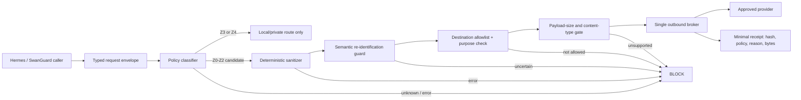

# Classroom Hermes Privacy + Egress Assurance Gate

**Date:** 2026-08-21  
**Owner:** Sean / SwanGuard  
**Status:** P0 BLOCKED — universal enforcement is not yet proven  
**Applies to:** teacher Mac, private 5090 service, Radar station, SwanGuard, AI Village, external model calls, transcription, OCR, attachments, web tools, and tool-result callbacks  
**Decision rule:** no student-specific content may reach an external model until every required gate below has reproducible evidence.

## 1. Plain-English Rule

The teacher has full authorized access to SwanGuard. That does not mean every service connected to SwanGuard may receive every record. Human authorization and machine egress are separate questions.

The system must assume that names are only one way a child can be identified. A story containing a classroom, date, rare condition, family detail, photograph, voice, location, or unusual event may still identify a child after the name is removed. Student-specific narratives stay local unless the school has approved the exact use and the egress policy proves that the payload is safe for that destination.

“Redacted” is not the same as “safe.” “Passed 100 AI reviews” is not proof. The proof is a single fail-closed enforcement point, blocked bypasses, deterministic tests, controlled network egress, and repeatable clean hostile rounds.

## 2. Current Evidence and Verdict

| Surface | Current evidence | Verdict |
|---|---|---|
| `piiSanitizationMiddleware.mjs` | Selected routes/fields and regex-style detection; not a universal broker | PARTIAL |
| `aiPrivacyService.mjs` | Identity replacement exists; some downstream failures are treated as non-fatal | FAIL-OPEN RISK |
| AI chat text | Strict middleware exists on a specific chat path | PARTIAL |
| Transcription / TTS | Raw audio and speech paths are not proven behind the same text gate | UNPROVEN |
| AI Village | File and validation dispatches are not proven behind the same privacy boundary | UNPROVEN |
| Standalone consult scripts | Narrow secret/email/phone filters do not prove semantic de-identification | PARTIAL |
| Classroom deterministic detector | Useful floor, but held-out recall is below the required target and wiring is unproven | NOT A RELEASE GATE |
| Private 5090 | Family-controlled transport reduces exposure but does not replace authentication, authorization, logging, or endpoint hardening | CONDITIONAL |

**P0 verdict:** the statement “Hermes already safely redacts every student/client payload before any cloud call” is **UNPROVEN**. Initial evidence shows paths that could bypass or weaken the intended control.

## 3. Data Zones

| Zone | Examples | Default handling |
|---|---|---|
| Z0 Public | official calendars, public merchant pages, public teaching resources | Radar/SwanGuard allowed with source tracking |
| Z1 Synthetic | invented classroom examples with no real-person linkage | approved external reviewers allowed through broker |
| Z2 Internal operational | inventory counts, generic themes, non-personal schedule labels | private systems allowed; cloud only after classification |
| Z3 Student-specific | observations, incidents, family messages, progress, behavior, toileting, health, disability, photos, voice | local/private only by default |
| Z4 Secrets/credentials | keys, tokens, passwords, private hostnames, network details | never enter model prompts; dedicated secret store only |

“Private” means the teacher Mac, an explicitly approved family-controlled service over an authenticated private overlay, or a school-approved storage boundary. It does not mean a public cloud model with names removed.

## 4. Mandatory Architecture

### Non-negotiable properties

1. Every provider SDK, raw HTTP client, transcription endpoint, OCR worker, attachment path, Radar tool, and AI Village call must use one outbound broker.
2. Provider network access is denied at the host/container/firewall layer except from that broker.
3. The broker accepts a typed request, not an arbitrary URL or provider client object.
4. Destination, purpose, data class, content type, policy version, and human approval receipt are explicit fields.
5. Missing policy, unavailable roster, parser failure, timeout, unsupported media, sanitizer exception, or classifier uncertainty returns a hard block.
6. There is no automatic cloud fallback, provider failover, paid retry, or “best effort” bypass.
7. The response and every tool result re-enter through the same classification boundary before persistence or another model hop.

## 5. Content Rules

### Always block from external providers

- real student or client names, initials tied to a class, identifiers, contact information, credentials, private hostnames, and network secrets;
- photos, video, voice, handwriting, scanned forms, copied family messages, and raw attachments containing real people;
- child-specific health, disability, toileting, behavior, discipline, family, legal, financial, or incident narratives;
- exact combinations that make a person unique even if obvious identifiers were removed;
- hidden prompt history, tool output, browser page state, OCR text, EXIF, filenames, alt text, comments, and metadata that have not been classified.

### Cloud-eligible only after the gate

- public sources;
- synthetic examples;
- generic lesson structures, supply lists, and developmental questions;
- aggregate classroom needs only when the group is large enough and attributes cannot single out a child;
- a minimized excerpt that the policy explicitly permits for the named destination and purpose.

## 6. Logging and Audit Receipts

Allowed receipt fields:

- timestamp, caller, destination, declared purpose, policy/version, decision/reason code;
- input/output byte counts, stable content hash, request correlation ID, and approval ID where required;
- sanitizer rule IDs triggered and whether a human release was required.

Prohibited logs:

- raw or sanitized prompts, model responses, audio, images, attachments, OCR text, tool outputs, cookies, authorization headers, environment variables, or full URLs containing query data.

Receipts must support revocation and incident reconstruction without becoming a second copy of the sensitive content.

## 7. Hostile Test Program

The requested “100 hostile reviews” becomes a measurable assurance campaign rather than 100 repeated opinions.

| Family | Minimum rounds | Examples |
|---|---:|---|
| Direct identifiers | 10 | full/first names, initials, email, phone, addresses, IDs |
| Obfuscation | 10 | Unicode, homoglyphs, zero-width text, leetspeak, spaced digits |
| Semantic linkage | 10 | rare event + date + classroom, relatives, nicknames, indirect references |
| Structured payloads | 10 | nested JSON, arrays, quoted email, HTML, Markdown, CSV, YAML |
| Media/attachments | 10 | filenames, metadata, OCR, EXIF, audio transcript, image captions |
| Streaming/history | 10 | partial chunks, prior turns, system/tool messages, retries |
| Failure behavior | 10 | unavailable roster, parser crash, timeout, malformed body, unknown MIME |
| Bypass attempts | 10 | alternate SDK, raw socket, redirect, webhook, plugin, child process |
| Persistence/logging | 10 | traces, analytics, crash dumps, caches, temp files, receipts |
| Fresh-vantage attack | 10 | independent tests created after fixes without seeing prior cases |

Each round must record scope, seed, expected decision, actual decision, policy version, code revision, and artifact hash. A model critique may propose tests, but deterministic assertions decide pass/fail.

### Required techniques

- unit and integration tests for every content type and caller;
- property-based generation and mutation testing;
- fuzzing of encodings, nesting, and multipart boundaries;
- canary identifiers that must never appear beyond the broker;
- network tests proving direct provider access is denied;
- log/caches/temp-file inspection;
- negative tests proving errors block instead of degrade;
- two consecutive clean fresh-vantage rounds after the last repair.

## 8. Release Gates

| Gate | Evidence required | Status |
|---|---|---|
| G0 Inventory | complete outbound caller and destination inventory | BLOCKED |
| G1 Single broker | all callers migrated; direct clients removed or denied | BLOCKED |
| G2 Fail closed | forced dependency failures produce no outbound request | BLOCKED |
| G3 Network control | only broker can reach approved provider endpoints | BLOCKED |
| G4 Content coverage | text, media, attachments, OCR, streaming, history, tools tested | BLOCKED |
| G5 Minimal receipts | no prompt/content leakage in logs, traces, caches, crashes | BLOCKED |
| G6 Adversarial campaign | 100 scoped rounds; all defects repaired | BLOCKED |
| G7 Dry loop | two consecutive clean fresh-vantage rounds | BLOCKED |
| G8 School approval | actual Fairmont policy/handbook and authorized data-use decision recorded | BLOCKED |

No gate may be marked clean by an LLM vote. Evidence must bind to the exact code revision and deployed network boundary.

## 9. Fairmont-Specific Policy Check

Fairmont Anaheim Hills publicly states that preschool students must be fully potty-trained and independently use the restroom; its public handbook says the preschool is not a potty-training facility. Therefore:

- do not build a school workflow that assumes initiation of toilet training;
- design neutral bathroom routines, self-help prompts, privacy-respecting accident support, sanitation, and escalation boundaries;
- obtain the current staff handbook/director instruction because the teacher’s description and the public policy may use different terms or refer to a distinct two-year-old program;
- never store accident details in cloud prompts; retain only the minimum school-required record in the approved system.

## 10. External Review Policy

External models may review the public/synthetic architecture packet. They may not receive the raw conversation, family infrastructure details, real school records, rosters, observations, or private SwanGuard/SwanStudios content.

Every paid review requires a disclosed worst-case spend, a hard cap, one attempt, and no automatic retry. Reviewer output is advisory. The release authority remains the deterministic gate and the human owner.

## 11. Exit Criteria

This document may change from **P0 BLOCKED** only when G0–G8 have linked evidence. Until then:

- her personal Hermes may be installed and used for public/synthetic/local-only work;
- the private 5090 route may be tested with synthetic prompts;
- SwanGuard may expose public Radar findings and generic planning tools;
- student-specific external-model, transcription, OCR, attachment, and AI Village flows remain disabled.

