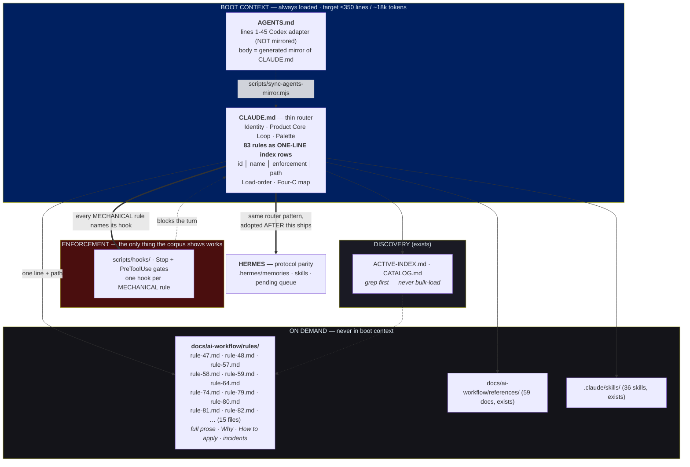

# CLAUDE.md / AGENTS.md Re-architecture — Blueprint v1 (for panel review)

**Date:** 2026-08-23 · **Author:** vs-claude (claude-opus-5) · **Status:** DRAFT — awaiting panel
**Evidence base:** `HERMES-AI-FAILURE-FORENSICS-REPORT-2026-08-23.md` (Q1–Q8, 2,523 mistake
bullets across 1,215 files — 427 packet + 2,096 memo)
**Scope:** `CLAUDE.md`, `AGENTS.md`, and Hermes protocol parity.

---

## 1. The measured problem

| Metric | Value |
|---|---|
| `CLAUDE.md` @ origin/main | **1,176 lines / 210 KB ≈ ~54k tokens** |
| `AGENTS.md` @ origin/main | 1,182 lines / 210 KB (mirror + Codex adapter, lines 1–45) |
| `## MANDATORY Rules` span | lines 92–759 = **667 lines = 57% of file** |
| Rules defined | **83** |
| **Rules ≥15 lines** | **15 rules → 404 lines → 60% of the rules block** |
| Rules ≤3 lines | 48 rules → 73 lines (already correct shape) |
| Self-stated count vs actual | header says "66 MANDATORY"; **83 exist** |

**Every agent, every session, pays ~54k tokens before doing any work.** The index layer already
exists and is healthy — 59 reference docs, 36 skills, `ACTIVE-INDEX.md` (282 lines),
`CATALOG.md` (256 lines). The router was built; the content was never moved out from under it.

**Fattest 15:** 48, 59, 58, 57, 80, 64, 49, 79, 47, 82, 81, 74, and three more ≥15.

---

## 2. The governing finding (Q4 + Q8)

Across 2,096 memo bullets, the catch verbs are, measured:

```
caught because ............ 84    (+ caught because ran 10, caught because checked 7)
caught reading ............ 26
hostile round / pass ...... ~65 combined
caught node check ..........  5
caught by remembering a rule    0
```

**Nothing in the corpus is caught by an agent recalling prose.** Errors are caught by an executed
command or an adversarial round. Meanwhile `already written` appears **41 times** — lessons written
down and repeated anyway; `third time session` **13**, i.e. three repeats inside one session.

> **Design law for this rewrite: a rule that does not attach a command is not a control.**
> Every rule that survives must name either (a) the command that proves it, or (b) the hook that
> enforces it. Rules that can do neither are demoted to guidance and moved out of boot context.

Corroboration that mechanisms work: `stop hook` appears 18× in the memos, and on 2026-08-23 three
Stop hooks caught this author omitting Linear sync, the Hermes artifact, and the dry-loop ledger
in a single turn. Hooks caught what the author's own four verification rounds did not.

---

## 3. Target architecture



### Index row format (replaces 667 lines with ~83)

```
| 74 | Proof-Before-Done | HOOK dry-loop-gate.mjs | rules/rule-74.md |
| 59 | Read-Time Secret Exposure | HOOK scan-secrets.sh | rules/rule-59.md |
| 20 | Repo-wide sibling sweep | CMD `rg -n '<sym>' frontend/src backend/` | — |
|  9 | No yoga/meditation language | PROSE | — |
```

Four enforcement classes, and **every rule must declare one**:
- **HOOK** — a file in `scripts/hooks/` blocks the turn. Strongest.
- **CMD** — a specific command proves compliance; the command text lives in the row.
- **PROSE** — no mechanism exists. *Flagged as a known-weak rule*, not silently equal to the others.
- **RETIRED** — kept as a numbered tombstone (Rule 12 precedent) so citations don't break.

---

## 4. Projected result

| | Now | After 15-rule move | After full pass |
|---|---|---|---|
| CLAUDE.md lines | 1,176 | ~772 | **~350** |
| Boot tokens | ~54k | ~35k | **~18k** |
| Rules in boot | 83 full-prose | 83 one-line rows | 83 one-line rows |
| Rules discoverable | yes | yes | yes |
| Rules **deleted** | — | **0** | **0** |

Nothing is deleted. Rule 34 applies throughout: content moves, and the index points at it.

---

## 5. New rules the evidence demands (currently unnamed)

| Proposed | Evidence | Enforcement |
|---|---|---|
| **Exit-status is a separate claim from printed output.** Read both; never infer status from a pipe. | `exit code` **39** + `piped exit code` 5 = **44 hits**; and `hermes-learning-validate.mjs` prints `FAILING: 28` and exits `0` | CMD + candidate HOOK |
| **Verify branch freshness before auditing or claiming absence.** | `origin main` **38**, `commits behind main` 5, `origin main head` 6 = **49 hits**; this tree is 2197 behind | CMD |
| **A control must be proven to fire before its silence is trusted** (positive control). | `whose entire purpose` 8, `produced false` 21, `instrument believing negative` 23 | CMD |

These three are the highest-frequency mechanisms in the corpus with **no governing rule**.

---

## 6. Known risks for the panel to attack

1. **Splitting rules may reduce compliance** — a rule not in boot context may never be read. Counter-evidence needed: does the corpus show agents *reading* pointed-to docs? If not, the split trades bloat for blindness.
2. **AGENTS.md mirror drift** — the drift-check hook already reports these out of sync. The rewrite must run `sync-agents-mirror.mjs` and must NOT touch lines 1–45.
3. **83 vs "66 MANDATORY"** — the header has been wrong for some time; nothing caught it. What else in the index is stale?
4. **Hermes parity timing** — designing Hermes's protocol in parallel risks two divergent standards. Recommend: SwanStudios ships first, Hermes adopts.
5. **This blueprint is authored by one seat.** Its numbers are measured, but its *architecture* is one opinion. That is what the panel is for.

---

## 7. Panel remit

Attack §3 and §5. Produce: wireframe/flowchart corrections, a merged blueprint, and a ranked
list of what this design gets wrong. Full-spectrum remit per Rule 82 — no narrow lenses.
