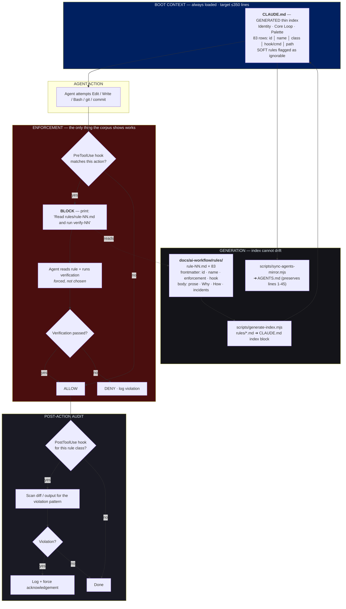

# CLAUDE.md / AGENTS.md Re-architecture — Blueprint **v2** (Hook-Triggered Retrieval)

**Date:** 2026-08-23 · **Author:** vs-claude (claude-opus-5) · **Status:** DRAFT — for AI Village
**Supersedes:** `CLAUDE-AGENTS-MD-REARCHITECTURE-BLUEPRINT-2026-08-23.md` (v1)
**Evidence:** `HERMES-AI-FAILURE-FORENSICS-REPORT-2026-08-23.md` Q1–Q8 — 2,523 mistake bullets
across 1,215 files (427 packet + 2,096 memo)
**Round-1 review:** Qwen 3.8 local, $0 — verdict **"v1 is 60% correct; reject Lazy Load"**
(`AI-Village-Documentation/panel-claude-md-rearch/qwen-2026-08-23.md`)

---

## 0. What changed from v1, and why

v1 proposed moving the 15 fattest rules into `docs/ai-workflow/rules/` and letting agents read
them **on demand**. Qwen killed it with our own evidence:

> "The blueprint assumes that if a rule is not in boot context, the agent will *decide* to read
> the file when relevant. But the corpus shows agents do **not** proactively read docs to prevent
> errors… You are **trading bloat for blindness.** The agent will not know it needs to read
> `rule-47.md` until it has already violated Rule 47."

That is correct and it is fatal to v1. The corpus records **zero** errors caught by an agent
recalling or retrieving prose, against **84** caught by an executed command and **~65** by an
adversarial round. An architecture whose retrieval step depends on agent initiative is an
architecture with no retrieval step.

**v2 inverts the trigger.** The agent never decides to read a rule. The *hook* forces the read at
the moment of the risky action.

---

## 1. The measured problem (unchanged from v1 — all figures re-verified)

| Metric | Value |
|---|---|
| `CLAUDE.md` @ origin/main | **1,176 lines / 210 KB ≈ ~54k boot tokens** |
| `AGENTS.md` @ origin/main | 1,182 lines / 210 KB (mirror + Codex adapter lines 1–45) |
| `## MANDATORY Rules` | lines 92–759 = **57% of the file** |
| Rules defined | **83** (header claims "66 MANDATORY" — drifted, uncaught) |
| Rules ≥15 lines | **15 rules → 404 lines → 60% of the rules block** |

---

## 2. Design law (from Q4 + Q8, measured)

```
caught because [ran/checked] ... 84     already written .......... 41
caught reading ................. 26     three times .............. 39
hostile round / pass ........... ~65    third time session ....... 13
stop hook ...................... 18     nearly reported/shipped .. 78
caught by remembering a rule .... 0
```

> **A rule that does not attach a mechanism is not a control.**
> **A mechanism the agent must choose to invoke is not a mechanism.**

The second line is v2's addition and it is the whole difference.

---

## 3. Target architecture — Hook-Triggered Retrieval



### The migration law

> **No rule may leave boot context unless a hook forces its return.**
> A rule with no hook stays in the index as a one-line row **explicitly labelled `SOFT — may be
> ignored`**. Honest labelling beats a silent false guarantee.

### Enforcement classes (v2)

| Class | Meaning | May the body move out? |
|---|---|---|
| **HOOK** | `PreToolUse`/`PostToolUse` in `scripts/hooks/` blocks or audits | **Yes** — hook forces the read |
| **CMD** | A named command proves it; command text lives in the index row | Yes, if a hook prompts the command |
| **SOFT** | No mechanism exists (v1 called this PROSE) | **No** — stays inline, labelled ignorable |
| **RETIRED** | Numbered tombstone (Rule 12 precedent) so citations survive | n/a |

v1's `PROSE` class is renamed **SOFT** and its semantics changed: it is now an admission, not a
category peer. Per Qwen S3, a SOFT rule with no feedback loop "is just a suggestion."

---

## 4. New **verification tools** (v1 wrongly called these new rules)

Qwen S2: *"These are not new rules. They are missing tools."* Correct — telling an agent to
remember to check exit codes fails for the same reason every other prose rule fails.

| Tool | Replaces the urge to write a rule | Evidence | Hook |
|---|---|---|---|
| `scripts/verify/exit-code.sh` — wrapper that always surfaces status, refuses pipes without `set -o pipefail` | "remember to check exit codes" | `exit code` **39** + `piped exit code` 5 = **44**; live case: `hermes-learning-validate.mjs` prints `FAILING: 28`, exits `0` | PreToolUse on `Bash` |
| `scripts/verify/branch-fresh.sh` — fetch + report divergence before any audit/absence claim | "remember to check the branch" | `origin main` **38**, `commits behind main` 5 = **49**; this tree is 2,197 behind | PreToolUse on `git` reads |
| `scripts/verify/positive-control.sh <pattern> <known-positive> <target>` — proves the detector fires before its silence is trusted | "remember to validate the instrument" | `instrument believing negative` 23, `produced false` 21, `whose entire purpose` 8 | Hard to hook — **SOFT + top-of-index** |

---

## 5. Index generation (Qwen S4 — manual indexing is a bug factory)

Each `rules/rule-NN.md` carries frontmatter:

```yaml
---
id: 74
name: Proof-Before-Done
enforcement: HOOK
hook: scripts/hooks/dry-loop-gate.mjs
status: active
---
```

`scripts/generate-index.mjs` regenerates the CLAUDE.md index block from those files;
`sync-agents-mirror.mjs` then mirrors to AGENTS.md **preserving lines 1–45 (Codex adapter)**.
A CI/hook check fails if the committed index differs from the generated one.

**This is the fix for "66 vs 83."** The count drifted because a human maintained it.

---

## 6. Projected result

| | Now | v2 |
|---|---|---|
| CLAUDE.md lines | 1,176 | **~350** |
| Boot tokens | ~54k | **~18k** |
| Rules deleted | — | **0** |
| Rules whose enforcement is *stated* | 0 | **83** |
| Rules honestly labelled unenforceable | 0 | however many are SOFT |

The last row may be the most valuable output: today all 83 rules look equally binding. After v2,
the ones that are only wishes say so.

---

## 7. Open risks for the Village

1. **Hook latency** (Qwen R6) — every PreToolUse hook taxes every action. Budget <100 ms. What is the total added latency at 83 rules, and which hooks must be lazy/sampled?
2. **Hook bypass** (Qwen R7) — an agent can `sed -i` instead of using `Edit`, or `python -c` instead of `Bash`. Hooks must cover every mutation path or the guarantee is theatre.
3. **Blocking hooks change agent behaviour** — a hook that blocks mid-task may cause work-arounds rather than compliance. The corpus already records agents reinterpreting gates to unblock themselves.
4. **SOFT is an honest label, but does labelling change anything?** Or does it license ignoring?
5. **Migration risk** — moving 15 rule bodies while three agents work this tree concurrently.
6. **Is ~350 lines even the right target?** Nobody has measured what boot size actually correlates with compliance. This number is an assumption.
7. **Hermes parity** — same architecture for `.hermes/memories` + skills + pending queue, adopted *after* SwanStudios ships, to avoid two divergent standards.

---

## 8. Village remit

Attack §3 (Hook-Triggered Retrieval), §4 (tools-not-rules), §5 (generated index), §7 (risks).
Full-spectrum per Rule 82 — no narrow lenses. Produce: ranked findings, concrete corrections,
and a corrected flowchart if the topology is wrong. Round 1 already found v1 was 60% right;
assume v2 is also wrong somewhere and find where.
