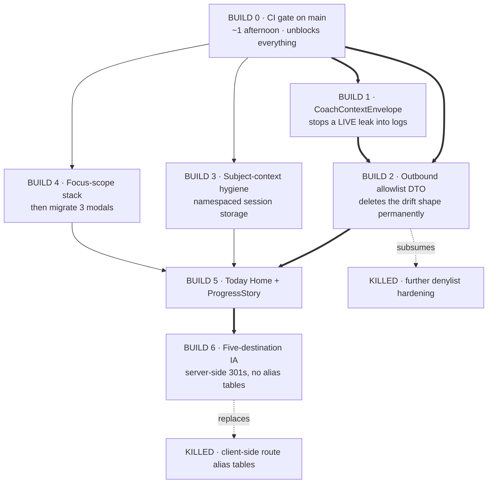
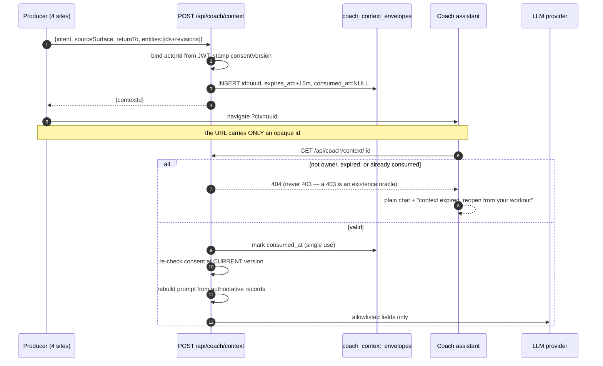
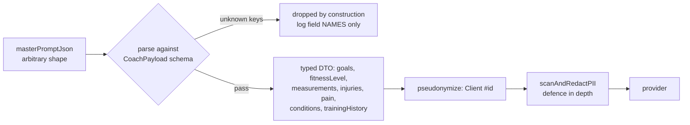

# Forward blueprint — Fable ruling

**Panel:** ox-alpha, GLM 5.3, Kimi K3. **Orchestrator/arbiter:** Fable 5 (in-session).
**Basis:** the as-built code at `f3e0d0863`, after six review rounds.

---

## 0. The ruling in one paragraph

Every P0 this codebase has suffered is **one failure shape**: an enumeration
drifting from a claim. A path list missed `medicalConditions`. A category matcher
missed array-nested keys. A prefix rule missed six lifestyle spellings. A REST
lane missed the socket. A consent gate missed the version. Six rounds of review
have been *patching instances of a shape*. The forward plan's job is to **delete
the shape**, and only two builds do that: the **outbound allowlist DTO** (makes
the privacy claim true by construction) and the **context envelope** (makes the
URL carry nothing). Everything else is polish sitting on top of pipes.

**Where the panel disagreed, and my ruling:** ox put the DTO first (it is the root
cause under three of five historical incidents). Kimi put the envelope first (it
is the only one leaking *today*, into logs the DTO never touches). **Kimi is
right on sequencing, ox is right on importance.** `teachPrompt` is writing client
state into nginx logs and `Referer` headers right now; the denylist, after this
round, is actually holding. Live exposure outranks root cause. **Envelope first,
DTO second — and both after the CI gate, which both seats independently ranked
above their own proposals.**

---

## 1. Build order



Thick arrows are hard blocks. Builds 3 and 4 are parallel-safe once 0 lands.

---

## 2. BUILD 0 — CI gate (do this first, it is the cheapest lever here)

There is **no CI gate on `main` at all** while this repo ships consent
enforcement and authorization code. Six review rounds have been doing, by hand
and by paid panel, what a 20-line workflow does for free on every push.

Two seats reached this independently and both ranked it above their own designs.
The drift-check also reports **zero GitHub Actions runs have ever succeeded** —
blanket `startup_failure` including scheduled runs, which is an account-level
billing block, not a workflow bug.

**Slices**
1. Fix the Actions billing block (owner action — `github.com/settings/billing`).
2. Workflow: `lint → tsc → vitest → contract tests`, on PR to `main`.
3. Add a `wc -l ≤ 300` check. This turns the 300-line rule from a project into a
   **ratchet**: files get split when touched, automatically. It also subsumes
   most of Slice 4.
4. Buy GitHub Pro (~$4/mo) → branch protection + required checks.

**Acceptance:** a PR with a failing test cannot merge to `main`. A PR that grows
a file past 300 lines fails. Both proven by deliberately opening one of each.

---

## 3. BUILD 1 — CoachContextEnvelope

`teachPrompt` currently interpolates client state — level, streak, XP, progress,
booking status, assignment detail — into a **query string**. That lands in
browser history, server access logs, and `Referer` headers on every third-party
asset the coach page loads. The de-identification service never sees it.



**Why single-use + owner-check + 404:** single-use kills replay, the owner check
kills token-guessing, and returning 404 rather than 403 means a guessed id cannot
distinguish "exists but not yours" from "does not exist".

**Consent is re-checked at redemption, not issuance** — a withdrawal between the
two must invalidate envelopes already in flight.

**Slices:** schema + endpoints → migrate one producer per PR (client observatory,
workouts page, current-workout card, admin planner).

**Acceptance per producer:** repo-wide grep for `teachPrompt` in runtime code
returns 0 · a test scrapes every emitted path and asserts no client-identifying
substring · replay of a consumed id → 404 · expiry renders the notice, never a
blank screen.

---

## 4. BUILD 2 — Outbound allowlist DTO

The denylist has now failed by shape **five times**. Stop hardening it. Invert it:
nothing leaves unless it is named.



**What this deletes:** `TRAINING_SAFETY_PATHS` becomes schema *fields*, so the
override-versus-gate precedence war disappears. The word classifier demotes from
a gate to a telemetry logger. Free-text notes are excluded by construction, so
the consent copy's "avoid names in notes" warning can be **deleted rather than
reworded** — and the categorical "supplements, sleep and stress are withheld"
claim becomes provable instead of merely true-today.

**Acceptance:** a property test feeds random junk and asserts the output contains
only schema keys · all five historical regression fixtures pass against the DTO
(`medicalConditions`, array-nested sleep, `stressEchocardiogram`, `avgSleepHours`,
`bedtime`) · a contract test serializes every User model field and asserts
non-allowlisted fields are absent.

---

## 5. BUILD 3 — subject-context hygiene

Namespace every `sessionStorage` key by authenticated user
(`swan:{userId}:…`) and wipe the previous namespace on any auth change. One
utility, 21 consumers migrated mechanically.

**Acceptance:** log out and back in as a different user in the same tab; assert
`GlobalClientContext` rehydrates nothing from the previous identity.

---

## 6. BUILD 5 — "Today" Home

```
DESKTOP ≥1280                                   MOBILE 375 (stack order normative)
┌──────────────┬──────────────────────────────┐ ┌────────────────────────────┐
│ SIDEBAR      │ TODAY · Tue          [bell]  │ │ ☰  TODAY · Aug 26   [bell] │
│ ● Today      ├───────────────────┬──────────┤ ├────────────────────────────┤
│ ○ Training   │ NEXT ACTION       │ TRAINER  │ │ 1  NEXT ACTION             │
│ ○ Progress   │ Lower Body · D3/12│ ┌──┐ ▸   │ │    Lower Body · Day 3/12   │
│ ○ Community  │ 6 exercises ~45m  │ └──┘     │ │    ┌──────────────────────┐│
│ ○ Profile    │ ┌───────────────┐ │ ┌──────┐ │ │    │ ▶ START      «44px»  ││
│ ──────────   │ │ ▶ START WORKOUT│ │ │MESSAGE│ │ │    └──────────────────────┘│
│ ▸ Explore    │ │  «44px, glow» │ │ │ 44px │ │ ├────────────────────────────┤
│   (legacy)   │ └───────────────┘ │ └──────┘ │ │ 2  WHY (Coach, 1 line)     │
│              ├───────────────────┤ ┌──────┐ │ │    [Ask Coach →]   «44px»  │
│              │ WHY THIS WORKOUT  │ │ BOOK │ │ │═════════ FOLD ═════════════│
│              │ Coach, one line   │ │ 44px │ │ │ 3  TRAINER + MESSAGE       │
│              │ [Ask Coach →]     │ └──────┘ │ │ 4  LAST VERIFIED PROOF     │
│═══════════════ FOLD ════════════════════════│ │ 5  COMMUNITY PREVIEW       │
│              │ PROGRESS PROOF (Victory)     │ │ 6  ▸ Explore (collapsed)   │
│              │ sessions/wk · PR markers     │ └────────────────────────────┘
└──────────────┴──────────────────────────────┘
```

**Rules:** one hero action, chosen server-side · Victory only · every target
≥44px · tokens with fallbacks, no hex in components · each card its own file
≤300 lines · `prefers-reduced-motion` swaps chart animation for instant render ·
empty/rest/completed/error states render truthfully — **never a fake zero**.

---

## 7. What I am killing

| Killed | Why |
|---|---|
| Further denylist hardening (`LIFESTYLE_WORDS`, `classifyKey`) | Sunk cost the moment Build 2 lands. Freeze it. |
| Client-side route alias tables (old Slice 12) | Doubles the deep-link surface — the same class as the `composeTo` bug. Pick canonical routes, 301 server-side. |
| Slice 4 as a standalone project | Build 0's line-cap check turns it into an automatic ratchet. |
| A blanket "stop shipping" freeze | Scoped freeze only: no new `teachPrompt` producers, no new subject-context consumers, no new parallel gates. |

---

## 8. Open owner decisions

1. **GitHub Actions billing block** — nothing in Build 0 works until this clears.
2. **Counsel sign-off** on health fields. The hatch now requires
   `CURRENT_CONSENT_VERSION === '3.0'`, so enabling means shipping new copy in a
   reviewed change — it cannot be flipped by an env var alone.
3. **Q5 blast radius, now shippable.** Every client whose consent predates v2.0
   is 403'd from Coach until they re-confirm — but the interceptor now routes
   them to the consent screen, which was the missing piece.
