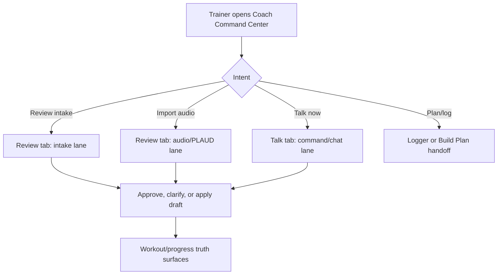
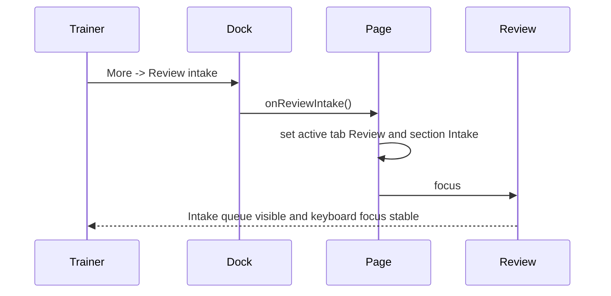

# Coach Command Center Fable-Ready Brief - 2026-07-09

Status: Codex recursive hostile review and verified repair passes complete for the current Coach slice. Paid Fable review is not marked complete here.
Scope: `/dashboard/{admin|trainer|client}/coach-assistant`, mounted `CoachCommandCenterPage` only.
Branch/worktree: `codex/coach-command-center-20260709` in `C:\tmp\sspt-coach-command-center-20260709`.

## External Reference Receipt

- Mobbin/Mobbin-like MCP: `[MOBBIN UNAVAILABLE]` in this Codex session. No external screen reference was fetched.
- Design source loaded: Swan Design Router, Cinematic Design System, Asset Storyboarding, Design Brain product-surface/Fable/reviewer adapters, motion/components/anti-patterns/QA gates.
- Fable status: no paid Fable model run was executed in this pass. This document remains the compact context packet for that run.
- Free AI Village / triangle status: `scripts/fusion-triangle.mjs` was attempted for `Coach Command Center UX/UI and control-purpose review`. Gemini returned a grounded REVISE answer; Claude did not complete, so no synthesis artifact was produced. The concrete Gemini findings were independently validated and repaired.
- Independent post-repair status: a hostile reviewer found four additional issues (client-preview audience leakage, drawer breakpoint state, completed-draft counting, and incomplete live announcements); all four were repaired with regression coverage. A final fresh reviewer attempt was blocked by the subagent usage limit, so this packet does not claim a completed external post-green gate.

## Canonical Surface Receipt

Route mount:
- `frontend/src/routes/DashboardRoutes.tsx:72` mounts `/dashboard/*` into the universal dashboard system.
- `frontend/src/components/DashBoard/UniversalDashboardLayout.routeComponents.tsx:62` lazy-imports `CoachCommandCenterPage`.
- `frontend/src/components/DashBoard/UniversalDashboardLayout.routes.tsx:97` maps admin `/coach-assistant` to `CoachCommandCenterPage`.
- `frontend/src/components/DashBoard/UniversalDashboardLayout.routes.tsx:175` maps trainer `/coach-assistant` to `CoachCommandCenterPage`.
- `frontend/src/components/DashBoard/UniversalDashboardLayout.routes.tsx:201` maps client `/coach-assistant` to `CoachCommandCenterPage`.
- `frontend/src/components/DashBoard/Pages/coach-assistant/CoachCommandCenterPage.tsx:35` is the mounted page component.

Frontend API literals:
- `frontend/src/hooks/useCoachCommand.ts:96` posts `/api/ai-command/execute`.
- `frontend/src/hooks/useCoachCommand.ts:170` posts `/api/ai-command/confirm`.
- `frontend/src/hooks/useCoachCommand.ts:207` posts `/api/ai-command/cancel`.
- `frontend/src/hooks/useAIChat.ts:255` posts `/api/ai-chat/conversations`.
- `frontend/src/hooks/useAIChat.ts:489` posts `/api/ai-chat/conversations/${convId}/messages`.
- `frontend/src/components/DashBoard/Pages/coach-assistant/hooks/useGeminiTranscription.ts:56` posts `/api/ai-chat/transcribe`.
- `frontend/src/components/DashBoard/Pages/coach-assistant/hooks/usePremiumTTS.ts:92` posts `/api/ai-chat/tts`.

Backend mounts and handlers:
- `backend/core/routes.mjs:380` mounts `/api/coach/intake` to `coachIntakeRoutes`.
- `backend/core/routes.mjs:384` mounts `/api/plaud/clips`.
- `backend/core/routes.mjs:385` mounts `/api/plaud/intake`.
- `backend/core/routes.mjs:386` mounts `/api/plaud/merge`.
- `backend/core/routes.mjs:387` mounts `/api/plaud/merge-requests`.
- `backend/core/routes.mjs:633` mounts `/api/ai-chat` to `aiChatRoutes`.
- `backend/core/routes.mjs:634` mounts `/api/ai-command` to `aiCommandRoutes`.
- `backend/routes/aiCommandRoutes.mjs:119,296,320,352,380` define execute, confirm, cancel, commands, health.
- `backend/routes/aiChatRoutes.mjs:338,449,488,540,921,954,982,1038` define conversation CRUD, messages, transcription, and TTS.
- `backend/routes/coachIntakeRoutes.mjs:30-36` defines text intake, queue, health, retention, events, and audio-order confirm.

Authoritative data tables touched by this surface:
- No Sequelize model was edited in this pass.
- Coach intake is raw-SQL backed by `backend/migrations/20260506120000-create-coach-intake-items.cjs:25-58` for `coach_intake_items` fields and `:142-154` for `coach_intake_events` fields.
- No table schema or Sequelize model fields changed. AI chat route behavior did change to scope conversations, history, and prompts by the requested dashboard audience while preserving the authenticated actor and access checks.

## Surface Classification Table

| File/component | Classification | Evidence | Notes |
| --- | --- | --- | --- |
| `CoachCommandCenterPage.tsx` | canonical | `CoachCommandCenterPage.tsx:11,14,17,175,223,255` imports and renders `CoachChatTranscript`, `CoachConsoleDock`, and `CoachCommandOpsSurface`; dashboard route receipt above mounts this page for admin/trainer/client Coach URLs. | Current live Coach Command Center shell. |
| `CoachChatTranscript.tsx` | canonical child | `CoachCommandCenterPage.tsx:11,175` imports and renders it. | Empty-state prompt chips are live accelerators, not save actions. |
| `CoachConsoleDock.tsx` | canonical child | `CoachCommandCenterPage.tsx:17,223` imports and renders it. | More-menu controls are the live dock controls. |
| `CoachCommandOpsSurface.tsx` | canonical child | `CoachCommandCenterPage.tsx:14,255` imports and renders it for staff roles. | Keeps the persistent desktop operations rail inline and portals the tablet/mobile modal above global dashboard chrome. |
| `CoachReviewHub.tsx` | canonical child through review panel | `CoachCommandCenterReviewPanel.tsx:14,46` imports and renders it. | Live Review grouping for intake/audio/drafts. |
| `CoachCommandComposer.tsx` + `CoachCommandComposerParts.tsx` | dormant/legacy for this route | Repo grep finds component declarations at `CoachCommandComposer.tsx:30` and `CoachCommandComposerParts.tsx:101`, but no `<CoachCommandComposer` mount or import from `CoachCommandCenterPage`. | Contains old `Attach`/`Readback` labels; not part of the verified mounted surface. Cleanup/retire separately, not in this live-surface patch. |
| `CoachCommandOverview.tsx` + `CoachCommandOverviewPanels.tsx` | dormant/legacy for this route | Repo grep finds declarations at `CoachCommandOverview.tsx:33` and `CoachCommandOverviewPanels.tsx:43`, but no `<CoachCommandOverview` mount or import from `CoachCommandCenterPage`. | Contains old `Readback dossier`; not part of the verified mounted surface. Cleanup/retire separately, not in this live-surface patch. |
## Current Control Purpose Matrix

| Control | Current purpose | Backing / outcome | Empty-button verdict |
| --- | --- | --- | --- |
| Talk tab | Main command/chat lane | `useCoachCommand` + `useAIChat` paths above | Real |
| Review tab | Staff-only intake/audio/draft workspace; badge includes all three queues | `CoachReviewHub` + intake/PLAUD routes; omitted for clients | Real and role-gated |
| History tab | Thread/history workspace | `useAIChat` conversation routes | Real |
| Empty transcript prompt chips | Prefill the composer without submitting or saving; use client-safe wording in client mode | `CoachChatTranscript` -> `onSuggestedPrompt` -> `commandCenter.setCommandText` | Real accelerator |
| More -> Review intake | Opens Review tab and intake lane, logs status, then focuses review workspace after render commit | `openIntakeReview` + `handleReviewIntake`; verified no route/focus contention | Real |
| More -> Import audio | Opens Review tab and audio lane, increments PLAUD upload handoff, then focuses review workspace after render commit | `handleStartPlaudUpload` in `CoachCommandCenterPage.tsx` | Real |
| More -> Read replies aloud | Toggles TTS/readback state; the old passive `Readback help` item was removed | `voiceRepliesEnabled` and TTS hook path | Real toggle |
| More -> Logger | Route-safe handoff to workout logger | `buildSwanCoachWorkoutLoggerRoute` | Real |
| More -> Build Plan / My Workouts | Route-safe handoff to planner/workouts | role-aware route prop | Real |
| Mic | Starts voice capture only when browser support exists | disabled when unsupported, with title | Real guard |
| Send | Submits non-empty typed prompts; disables while empty or busy and announces busy state | command/chat submit path | Real guard |
| More coach actions | Opens the staff operations rail as an inline desktop rail or portaled modal drawer | `CoachCommandOpsSurface` + `CoachCommandOpsRail` | Real and staff-only |

## Fixes From This Recursive Review Pass

- Removed invalid `aria-pressed` from `role="tab"` buttons; tab state is now `aria-selected` only.
- Made the Review tab badge count intake + audio/PLAUD + prepared/pending drafts so the tab matches the Review hub.
- Replaced the racy `setTimeout(0)` review-focus handoff with an effect that focuses `#coach-tabpanel-review` only after the Review panel is mounted.
- Scoped transcript live announcements to the latest entry and included normalized response content instead of putting `aria-live` on the whole transcript stream.
- Removed the passive `Readback help` menu item and made the voice/readback affordance a real `Read replies aloud` checkbox toggle.
- Converted inert empty-state intent labels into 44px prompt chips that prefill the composer without submitting or saving.
- Closed the dock More menu when keyboard focus leaves the popup, preventing a visible orphaned menu after Tab navigation.
- Cleared the mobile operations drawer's delayed first-focus timer when a drawer action closes the rail before the timer fires, preventing focus from jumping into a hidden rail.
- Kept the mobile History tab's left rail operable as inline tab content instead of treating it as an inactive modal drawer; this removes the stale `inert`/`aria-hidden` state from the mounted History rail while preserving desktop right-rail semantics.
- Removed the staff-only `Review intake` action from the client More menu so clients cannot enter an unrenderable Review state.
- Replaced staff queue language in the client transcript prompts and History rail with client-safe training context.
- Added an accessible composer label and made Send truthfully disabled for empty and in-flight submissions, including a `Sending to Swan Coach` busy label.
- Moved tablet/mobile operations into a React portal so the drawer and scrim sit above global dashboard headers and intercept pointer events correctly; desktop keeps the persistent inline rail.
- Repaired the 320-414px talk surface: three tabs remain on one row, the More menu stays inside the viewport, the empty transcript begins at the top, and the composer/actions remain reachable above app chrome.
- Corrected transcript auto-scroll so an empty conversation stays at `scrollTop = 0`, while populated conversations still follow their latest message.
- Composed mobile dock overrides after the focus theme styles so narrow-viewport geometry cannot be silently overwritten by cascade order.
- Preserved the existing confirm-before-save command lane; no backend model/schema or final-write behavior changed.
- Scoped admin/trainer/client dashboard conversations through `audienceRole`, including role-filtered history and role-correct prompt context; privileged audience escalation remains rejected.
- Allowed admins to use the supported trainer-dashboard preview audience while keeping trainer-to-admin and client-to-staff escalation blocked.
- Re-inlined an open mobile/tablet operations drawer when the viewport expands to desktop, releasing modal focus-trap and portal semantics without losing the rail state.
- Counted only pending drafts as waiting review work; completed proposals no longer inflate the Review badge or readiness metrics.
- Hid optional suggestion controls when no callback exists and kept the composer read-only while a send is in flight.
- Repaired line-cap regressions; `CoachCommandCenterPage.tsx` is 290 lines and `CoachCommandCenterPage.shell.test.tsx` is 298 lines.

## Verified Evidence

- Focused Coach verification: `vitest run CoachCommandCenterPage.keyboard.test.tsx CoachCommandCenterPage.shell.test.tsx CoachCommandCenterDeepLinkMatrix.test.tsx CoachCommandCenterClientMode.test.tsx CoachCommandCenter.sectionSplit.test.ts --reporter verbose` -> 5 files / 47 tests passed, including the focus-out More-menu regression.
- Focused drawer verification: `vitest run CoachCommandCenterOpsDrawer.test.tsx --reporter verbose` -> 1 file / 13 tests passed, including the stale hidden-drawer focus regression and mobile History inline-rail regression.
- Red/green guard: temporarily removing the drawer focus-timer cleanup made the new regression fail with `RED_GREEN_FAIL_CODE=1`; focus moved to the hidden `Close Coach operations` button, then the cleanup was restored.
- Red/green guard: before the inline-History rail fix, the new mobile History regression failed with `expected true to be false` because `historyRail.inert` stayed true on the active History tab.
- Affected drawer/shell/deeplink/keyboard batch: `vitest run CoachCommandCenterOpsDrawer.test.tsx CoachCommandCenterPage.keyboard.test.tsx CoachCommandCenterPage.shell.test.tsx CoachCommandCenterDeepLinkMatrix.test.tsx --reporter dot` -> 4 files / 53 tests passed.
- Final connected Coach/PLAUD sweep: `npm run test:coach-plaud-flow` -> 137 files / 791 tests passed.
- Audience/accessibility regression batch: 5 files / 15 tests passed.
- Drawer/shell regression batch: 4 files / 39 tests passed.
- Backend AI-chat/intake adjacency sweep: 16 files / 83 tests passed after the admin trainer-preview contract was added.
- Red/green audience guard: the new admin-as-trainer request failed with HTTP `403` before the role-lattice correction and passed with HTTP `201` afterward.
- `npm run type-check` -> TypeScript passed with the repository's required 8 GB compiler heap.
- `npm run build` -> Vite production build passed after transforming 6,620 modules; `CoachCommandCenterPage` emitted in the production bundle.
- `git diff --check` -> no whitespace errors; expected LF-to-CRLF working-copy normalization warnings only.
- Live-surface fake-control scan over `CoachCommandCenterPage.tsx`, `CoachConsoleDock.tsx`, `CoachChatTranscript.tsx`, `CoachReviewHub.tsx`, `CoachCommandTabBar.tsx`, `useCoachCommandCenterDrawerEffects.ts`, and the drawer test found no `Attach`, `Stage attachment`, `Coming soon`, `TODO`, `noop`, fake `href="#`, or empty `onClick={() => {}}` controls.
- Live-surface ARIA/focus scan found expected states only: `aria-pressed` on the Mic toggle and Review section cards, `aria-live` on the scoped transcript announcement, `role="tab"` on section tabs, `role="menu"`/menuitem roles in the dock popup, paired `setTimeout`/`clearTimeout` drawer focus handling, and explicit inline-left vs inline-right vs modal-drawer rail semantics.
- Changed-file line-count audit: release-owned Coach components and new regression files are at or below 300 lines; `aiChatConversationTargetGuard.test.mjs` is exactly 300. Pre-existing legacy files `backend/routes/aiChatRoutes.mjs`, `backend/tests/unit/coachIntakeItemService.test.mjs`, and `frontend/src/hooks/useAIChat.ts` remain above the repository ceiling and are recorded as separate extraction debt.
- Byte-prefix check across every changed Coach file found no UTF-8 BOM.
- Standard Playwright config backend startup is currently blocked by an unrelated Node 22 ESM issue in `backend/routes/galleryRoutes.mjs` (`archiver` default export), so that failed startup was not counted as browser evidence.
- Frontend-only browser smoke: started Vite on `127.0.0.1:5174` with `SWAN_PLAYWRIGHT_SKIP_WEBSERVER=1`, then ran `npx playwright test e2e/coach-intake-plaud-playback-smoke.spec.ts --project="Desktop Chrome" --project="Mobile Chrome" --workers=1` -> 2 tests passed. The smoke verified active PLAUD audio load, mobile overflow, touch target size, overlap absence, and page errors.
- Role/viewport browser matrix: 15/15 scenarios passed at admin widths `320, 375, 414, 768, 1024, 1280, 1440, 1920, 2560, 3440, 3840` plus client widths `320, 414, 1280, 2560`. Checks covered menu containment, horizontal overflow, 44px controls, accessible names, visible-control overlap, role leakage, desktop rail semantics, mobile/tablet dialog semantics, pointer hit-testing, close behavior, and browser errors.
- Representative visual review at 320, 414, 1280, and 2560 confirmed one-row phone tabs, reachable composer/actions, readable transcript framing, coherent desktop operations, and no Coach-surface overlap. The local-only Crystalline Swan theme-token overlay at desktop widths is global development tooling, not part of the mounted Coach surface.
## Flow For Fable Review





## Fable Questions

1. Should the first screen bias harder toward `today's live session` instead of equal `Talk / Review / History` tabs?
2. Should `Review intake` become the primary dock action when an actionable intake exists, demoting free-form chat?
3. Should the Review tab show a single ordered work queue instead of three cards for intake/audio/drafts?
4. Should voice/readback state become a persistent transcript indicator in addition to the More-menu checkbox?
5. Should the logger/planner handoffs show client-specific readiness labels before navigating?

## Proposed Paid-Fable Prompt

```text
Review the SwanStudios Coach Command Center as a trainer operating surface, not a marketing page. Use the receipt, control matrix, free-review repair ledger, and evidence in docs/ai-workflow/AI-HANDOFF/COACH-COMMAND-CENTER-FABLE-READY-BRIEF-2026-07-09.md. Judge UX hierarchy, button purpose, keyboard accessibility, workflow fit for trainer/client goals, and whether the Talk/Review/History split should be revised. Output findings as APPROVE/REVISE with wireframe-level recommendations, Mermaid flow changes, and exact implementation slices. Do not invent routes or backend models beyond the receipt.
```

## Exit Criteria For The Next Recursive Pass

- If Fable/free-triangle returns REVISE: implement only the concrete live-surface issues with receipts and tests.
- If it returns APPROVE with polish recommendations: separate product-design backlog from required bug fixes.
- Do not declare the overall `/goal` complete until external Fable review is actually run or Sean explicitly narrows the stop condition to Codex-only verification.
