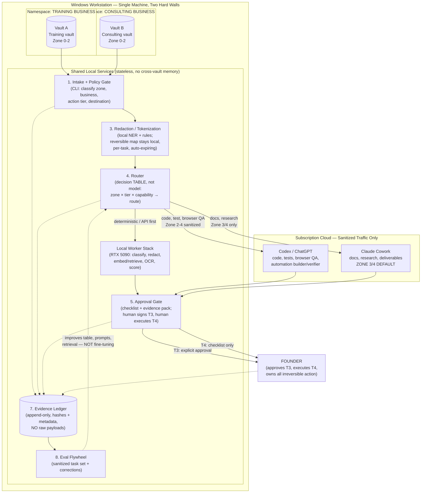
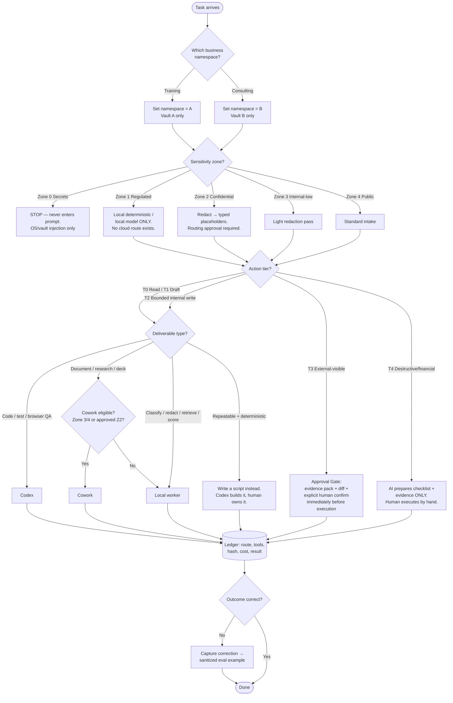

# Kimi K3 - Review

**Reviewer:** `moonshotai/kimi-k3` (high)
**Document:** C:\tmp\codex-cowork-private-ai-os-panel-20260813\review-packet.md
**Seed:** (none)
**Tokens:** 2688 in / 10289 out | **Cost:** ~$0.1624 | **Wall:** 855.3s | **finish_reason:** stop

---

# Kimi K3 Advisory Review — Privacy-First Codex + Cowork Operating System

**Reviewer role:** Product, domain-intelligence, and experience-design authority
**Verdict type:** Decisive review with implementation-ready artifacts. This is a strategy and design review only — nothing here connects accounts, moves data, or deploys anything.

---

## 1. Verdict and Strongest Disagreement

### Verdict

**Adopt the thesis, but cut the control plane in half before building anything.** The eight-component architecture is directionally correct and the data-zone/action-tier model is genuinely good. But as written, the thesis contains the seed of the exact failure it warns against: a solo founder building an eight-service platform is a six-month project with no revenue attached. The correct move is to build the control plane as **policy documents plus one thin local CLI**, not as a brokered service architecture.

### Strongest disagreements with the packet

1. **Cowork is mis-positioned as a default worker.** The packet names Cowork "the default document/project/research/deliverable worker" while simultaneously acknowledging Cowork executes remotely. Those two statements are in tension. My ruling: **Cowork is a Zone 3/4 worker only, by default, full stop.** Any Zone 2 material reaches Cowork only after the redaction layer has run and a per-workflow routing approval exists. Zone 1 never reaches Cowork under any configuration in this phase. "Local folder access through the desktop bridge" is a *disclosure path*, not a privacy feature.

2. **The Local Context Broker should not be built yet.** Minimum-necessary retrieval is the right principle, but a broker service is premature. For 90 days, "context brokering" is a human copying sanitized snippets into a task packet, assisted by local search. Automate it only after the eval set proves which retrieval patterns repeat.

3. **The Router should be a decision table, not a model.** Video C's routing flywheel is real but the first implementation is a YAML/JSON routing table the founder maintains, plus logging. A learned or LLM-based router before you have 200+ logged, corrected tasks is astrology.

4. **The two-business separation is under-specified.** "Separate vaults/projects" is necessary but insufficient. The real requirement is **separate OS-level identities or at minimum separate Windows user contexts, browser profiles, and agent project scopes**, so that a misconfigured agent cannot traverse from consulting context into training-client context. One workstation, two hard walls.

5. **The candidate workflow list is ordered wrong.** Workflow 3 (client workflow audit) is the revenue engine of the consulting business and should be workflow #1 for design purposes, because the entire control plane should be shaped to be *demonstrable to a consulting client* as the delivery method. The personal-training marketing workflow is the safest first *execution*, but the audit pipeline is the first *product*.

### The operating model in one paragraph

Codex builds and verifies; Cowork drafts and synthesizes (sanitized only); local workers classify, redact, retrieve, and score; the founder approves everything at T3 and executes everything at T4 personally. The control plane is a policy file, a routing table, a redaction CLI, an approval checklist, and an append-only ledger — all local, all boring, all auditable. Everything else is deferred.

---

## 2. Recommended Target Architecture

### 2.1 Architecture diagram (Mermaid)



### 2.2 Routing flow (Mermaid)



### 2.3 Minimum viable architecture (one founder, no platform project)

The MVP is **five artifacts and one habit**, not eight services:

| # | Artifact | Form | Effort |
|---|----------|------|--------|
| 1 | Policy file | `policy.yaml` — zones, tiers, namespaces, allowed destinations per zone | 1 day to draft, living document |
| 2 | Routing table | `routing.yaml` — zone × tier × deliverable-type → route; human-maintained | 1 day |
| 3 | Redaction CLI | Local script: NER + regex rules → typed placeholders (`[CLIENT_NAME_1]`, `[HEALTH_METRIC_2]`); writes per-task reversible map to an encrypted, auto-expiring local store | 3–5 days using existing local-model experience |
| 4 | Approval checklist | Markdown template + evidence-pack convention (diff, output hash, destination, rollback note) | 1 day |
| 5 | Ledger | Append-only JSONL or SQLite, local, hashes + metadata only | 2 days |
| 6 | The habit | Every task starts at intake. No exceptions, including "quick questions." | Ongoing |

**Explicitly not in the MVP:** context broker service, learned router, Switchyard integration, fine-tuning, multi-client orchestration, dashboards beyond a ledger query, any always-on agent.

---

## 3. Codex / Cowork / Local-Worker Responsibility Matrix

### 3.1 Primary-owner matrix (R = responsible owner, S = supporting, — = never)

| Task class | Codex | Cowork | Local worker | Founder |
|---|---|---|---|---|
| Sensitivity classification | — | — | **R** | S (spot-check) |
| PII/secret detection + redaction | — | — | **R** | S (audits samples) |
| Secret/credential handling | — | — | — | **R** (OS vault only) |
| Code design, implementation, refactor | **R** | S (spec prose) | — | S (review) |
| Test authoring + execution | **R** | — | S (local runners) | S (accept) |
| Browser QA / adversarial UI testing (test envs) | **R** | — | — | S (approve scope) |
| Deterministic automation (scripts/macros) | **R** (builds) | — | S (runs) | **R** (owns + triggers) |
| Long-document synthesis, proposals, SOWs | S (code-adjacent docs) | **R** (Z3/4; Z2 redacted only) | S (retrieval) | S (edit + approve) |
| Research briefs (public material) | S | **R** | S (local corpus) | S |
| Meeting-to-deliverable pipeline | — | **R** (sanitized notes) | **R** (local transcription/redaction upstream) | S |
| OCR / transcription of sensitive docs | — | — | **R** | — |
| Embeddings / retrieval index | — | — | **R** | — |
| Client workflow audit deliverable | S (any tooling) | **R** (de-identified map → report) | **R** (de-identification) | **R** (client relationship) |
| External messages, publishing, scheduling | — | — | — | **R** (T3 approval, always) |
| Payments, deletions, credential changes, production mutation | — | — | — | **R** (T4, human-executed) |
| Ledger writes | S | S | **R** (automated) | S (weekly review) |
| Eval scoring | — | — | **R** | **R** (judges edge cases) |

### 3.2 Duplication to eliminate

1. **Document drafting:** Both Codex and Cowork can draft prose. Rule: *if the deliverable is a document, Cowork (zone-permitting); if the deliverable is code or a tested artifact, Codex.* Never run both on the same draft "to compare" — that doubles cost and doubles disclosure surface for zero decision value.
2. **Research:** Pick Cowork as the sole research-brief worker. Codex's browser use is for *verification and QA*, not open-ended research.
3. **Automation:** Codex builds automations; Cowork never does. Cowork's scheduled/long-running tasks must not duplicate a deterministic script that already exists — the routing table checks "does a script exist?" first (API > script > AI browser, per Video A's heuristic, which is the one claim I fully endorse).
4. **Summarization of sensitive material:** Never send to either cloud agent "for a quick summary." Local model only. This is the most likely casual-leak path and deserves an explicit rule.

---

## 4. Privacy and Security Controls

### 4.1 Threat model and controls

| Threat | Vector | Control | Residual risk |
|---|---|---|---|
| **Data exfiltration** | Sensitive content pasted into cloud agent | Zone gate at intake; redaction CLI mandatory for Z2→cloud; Z1 has no cloud route; canary tokens planted in vaults to detect leakage | Low-Med (human bypass is the residual) |
| **Prompt injection** | Malicious web page/email/document content hijacks agent instructions | Treat all retrieved/external content as untrusted data, never instructions; browser/computer use constrained to named sites/accounts/actions with stop conditions; no agent reads inbound email and acts on it | Med — never fully eliminable; mitigate by keeping injected agents away from T3/T4 authority |
| **Cross-client/context leakage** | One client's context bleeds into another's deliverable; training-business data enters consulting work | Hard namespace walls (separate vaults, browser profiles, agent projects); shared services are stateless; ledger records namespace per task; consulting delivery uses per-client vaults with the same wall pattern | Low if walls are OS-level; Med if only folder-level |
| **Connector overreach** | Cowork/Codex connector reads more than the task needs | Connectors scoped to named folders per project; default-deny; no whole-drive mounting; audit connector list monthly; prefer export-a-sanitized-copy over live connection for Z2 | Med |
| **Credential exposure** | Secrets in prompts, logs, browser sessions | Zone 0 never enters prompts or the ledger; OS/vault injection only; authenticated browser sessions use dedicated profiles, never the founder's primary; no credential in any skill/macro definition | Low |
| **Unsafe browser actions** | Agent clicks/purchases/submits beyond intent | Browser use = named sites + named accounts + bounded action list + explicit stop conditions; supervised rehearsal before any new browser workflow; T3/T4 actions are human-executed regardless of agent capability | Low-Med |
| **Misleading logs** | Ledger claims success that didn't happen, or omits failures | Ledger stores output *hash* plus pointer to local artifact, not a self-reported summary; verification step (Codex re-runs check or human spot-check) writes its own ledger entry; weekly founder review samples 10% | Low |
| **Silent cloud execution** | "Local" tool actually executes remotely (the Cowork trap) | Written inventory of every tool's execution location, reviewed quarterly against official docs; rule: assume remote unless official documentation says otherwise; Cowork treated as remote, period | Med (vendor behavior changes) |
| **Training-data contamination** | Subscription content used for vendor training | Assume consumer subscriptions may train unless official terms say otherwise; this is *why* Z1/Z2-raw never leave; do not rely on opt-outs as the primary control — minimization is the primary control | Med |
| **Reversible-map compromise** | Tokenization map is itself a PII store | Map is encrypted at rest, per-task scoped, auto-expires (default 30 days), lives outside both vaults, and is never attached to the ledger | Low-Med |

### 4.2 Zone and tier repairs

The proposed zones and tiers are solid. Four repairs:

1. **Zone 2 needs a sub-boundary.** "Contracts" and "internal SOPs" have different blast radii. Add **Z2a (client-identifiable)** vs **Z2b (internal-only)**. Z2b may go to cloud redacted with a standing approval; Z2a requires per-workflow approval. This prevents approval fatigue from collapsing the whole gate.
2. **Zone 1 needs an explicit "no cloud route exists" statement** in the routing table — not "requires authorization," because an authorization path that exists will eventually be taken under time pressure. In this phase, the path does not exist.
3. **T2 needs a staging-area definition.** "Bounded internal write" is only safe if the staging area is a named, versioned folder/DB schema per namespace with rollback (snapshot or VCS). Define it or T2 becomes unbounded drift.
4. **T3 approval must be *immediately before execution* with the final artifact shown** — not approval of a plan followed by unsupervised execution. The packet says this; I'm elevating it to a hard rule with a checklist artifact (Appendix B wireframe).

### 4.3 The two-business wall (concrete)

- Separate Windows user accounts *or* at minimum: separate browser profiles, separate agent project scopes, separate vault directories with distinct ACLs, separate ledger namespaces.
- Shared services (redaction, ledger, eval) hold **no persistent cross-namespace state**.
- The consulting business gets a per-client sub-namespace from day one of its first client — retrofitting walls after client 3 is how leaks happen.

---

## 5. 30/60/90-Day Roadmap

### Days 1–30 — Policy and plumbing (no agents change behavior yet)

- Write `policy.yaml` and `routing.yaml` (zones, tiers, namespaces, routes, "no cloud route" for Z1).
- Stand up the two namespaces with OS/browser/agent-scope separation.
- Build the redaction CLI v1 (rules + local NER via existing local-model experience).
- Stand up the append-only ledger; log every agent task manually at first.
- Run the **personal-training marketing workflow** (candidate #1) end-to-end through the gates as the rehearsal workload. Zero client data in it.
- **Do not build yet:** context broker, learned router, Switchyard, dashboards, fine-tuning, any client-facing automation.

### Days 31–60 — Gates under load

- Add the approval-gate checklist + evidence-pack convention; enforce T3/T4 rules on every task.
- Add canary tokens to both vaults; verify they never appear in outbound payloads.
- Run **lead qualification** (candidate #2) and **document intake** (candidate #4) through the pipeline.
- Start the eval set: every correction the founder makes becomes a sanitized example. Target: 100 logged tasks, 30+ corrections.
- Codex builds the first two deterministic automations that replace repeated agent work (the flywheel's first actual turn).
- **Do not build yet:** RAM-dependent concurrency, unattended browser workflows, any Z2a cloud route.

### Days 61–90 — Productize the method

- Package the pipeline as the consulting delivery method: intake → de-identify → baseline → proposal → bounded pilot → measured report (candidate #3 becomes the offer).
- First consulting pilot runs *through the same gates the founder uses internally* — the control plane is the demo.
- Review the routing table against 90 days of ledger data; promote/demote routes based on evidence.
- Decide the RAM question with test data (Section 8) before any unattended workload depends on it.
- **Do not build yet (still):** fine-tuning, multi-client orchestration software, learned routing, any T4 automation, any "second brain" ingestion.

---

## 6. Evidence Ledger and Evaluation Design

### 6.1 Ledger schema (metadata + hashes, never payloads)

```json
{
  "task_id": "uuid",
  "ts": "ISO-8601",
  "namespace": "training | consulting | consulting/client-<id>",
  "zone": "0-4 (2a/2b where applicable)",
  "tier": "T0-T4",
  "task_class": "code | doc | research | qa | classify | redact | retrieve | automation",
  "route": "local | codex | cowork | script | human",
  "tools_used": ["list"],
  "source_categories": ["public-web", "vault-b-z2b-redacted"],
  "redaction_applied": true,
  "approval": {"required": true, "approver": "founder", "approved_ts": "...", "artifact_hash": "sha256"},
  "output_hash": "sha256",
  "output_pointer": "local path (access-controlled, outside ledger)",
  "cost": {"tokens_or_units": null, "notes": ""},
  "result": "success | corrected | failed | rejected",
  "correction_pointer": "eval example id or null",
  "lesson_id": "reusable-lesson id or null"
}
```

**Privacy rules for the ledger:** no raw payloads, no PII, no prompt text, no reversible-map references. The ledger answers "what happened, where did it go, who approved it, did it work" — it cannot reconstruct *what was said*. Retention: indefinite for metadata; output artifacts follow vault retention.

### 6.2 Eval flywheel (useful, not a liability)

- **Eval set construction:** every founder correction → sanitized example (redaction applied a second time, because corrections often quote sensitive text). Stored in the local eval vault, not the ledger.
- **Cadence:** weekly, 30 minutes. Score the week's failures by class; the worst class gets one improvement: a prompt fix, a retrieval fix, a routing-table row, or a new deterministic script — in that order of preference.
- **Promotion rule:** a task class moves from frontier cloud → local model only after 20 consecutive correct local outputs on the eval slice for that class. This is the honest version of Video C's flywheel.
- **Fine-tuning gate:** not before 500+ eval examples, a measured plateau from prompt/retrieval/routing fixes, and a named recurring task class that justifies it. Expect this to be month 6+, if ever.
- **Anti-liability rule:** eval examples are sanitized to Zone 3 equivalence before storage. The eval set must be safe to show a consulting client — because eventually it will be, as proof of method.

---
