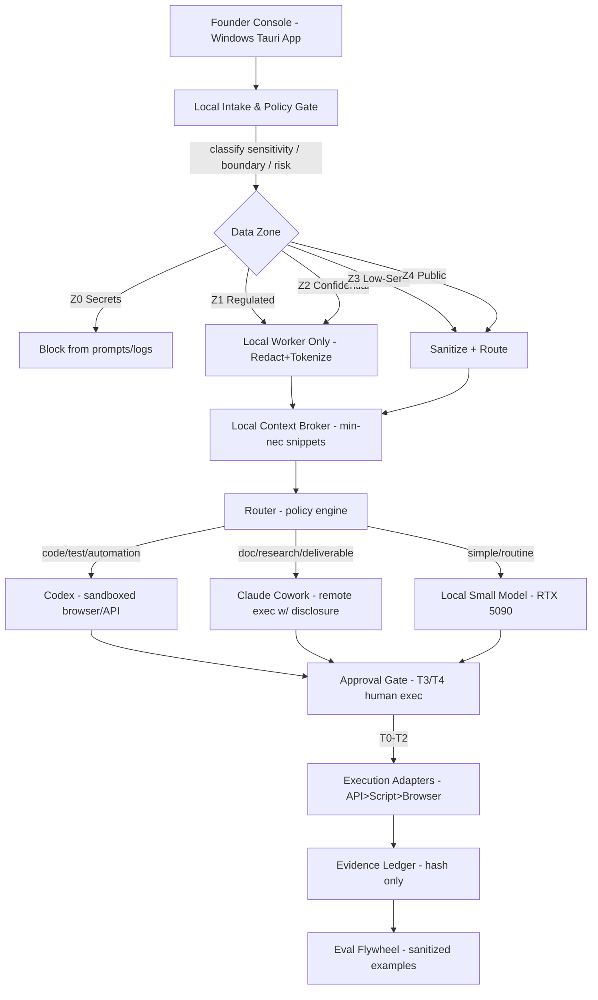
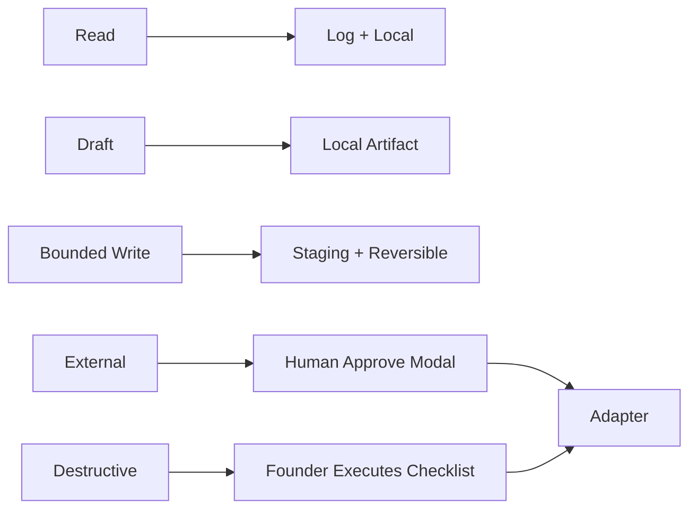

# Tencent Hy3 - Design Inspiration

**Reviewer:** `tencent/hy3` (high)
**Document:** C:\tmp\codex-cowork-private-ai-os-panel-20260813\review-packet.md
**Seed:** (none)
**Tokens:** 2629 in / 5192 out | **Cost:** ~$0.0031 | **Wall:** 51.6s | **finish_reason:** stop

---

# Tencent HY3 — Advisory Review & Implementation-Ready UX/UI System Decisions
**Role:** UX/UI Systems & Interaction-Design Authority
**Packet:** Privacy-First Codex + Claude Cowork Operating System
**Posture:** Decisive, independent, productized. No implementation executed; design authority only.

---

## 1. Verdict and Strongest Disagreement

**Verdict:**
Adopt a **Local-First Policy-Bound Routing Shell (LPRS)** — a lightweight Windows-native desktop console that enforces the eight-thesis control plane as *interaction patterns*, not a backend platform. Codex is the automation/verification builder; Cowork is a remote document worker allowed only on sanitized Zone 3–4 or explicitly approved Zone 2 redacted packets; local worker handles classification, redaction, ledger, and eval.

**Strongest Disagreement:**
The packet’s thesis implicitly treats Claude Cowork’s “local folder access” via desktop bridge as compatible with Zone 1/2 privacy. **It is not.** Current official docs state Cowork task execution is remote. We reject any UI that does not (a) flag Cowork as *cloud‑bound*, (b) show the exact redacted payload leaving the machine, and (c) require a separate human approval for cross‑boundary transfer. Video C’s Switchyard/Nemotron flywheel is unsafe scaffolding and must be killed from this owner’s plan.

---

## 2. Recommended Target Architecture (Mermaid)

### 2.1 System & Information Architecture


### 2.2 Routing & Action‑Risk Flow


---

## 3. Codex / Cowork / Local‑Worker Responsibility Matrix

| Task Class | Primary Owner | Tool | Interaction Rule |
|---|---|---|---|
| Sensitivity classification, PII/secret detect | Local Worker | Local model + rules | UI shows zone badge before next step |
| Redaction / tokenization | Local Worker | Local script + VRAM model | Preview diff modal mandatory |
| Code, tests, repo QA, browser automation | **Codex** | Codex desktop | Named sites only; stop conditions shown |
| Document synthesis, SOW, research brief | **Cowork** | Claude Cowork | Enabled only after redaction + cloud‑bound banner |
| Routing decision | Local Policy Engine | Deterministic | Suggested route visible, overridable |
| Approval of external/financial | Founder (Human) | Console modal | Keyboard‑focused, no silent default |
| Evidence ledger write | Local Worker | Encrypted local store | Hash only, no raw payload |
| Eval set scoring | Local Worker | Local eval | Sanitized tasks only |
| Consulting client namespace isolation | Founder + Local Worker | Vault policy | Separate logical projects, no cross‑query |

---

## 4. Privacy and Security Controls (with UX State)

| Control | Interaction / Visual State | Accessibility |
|---|---|---|
| **Intake Gate** | Drop‑or‑type area; live zone classifier chips (Z0–Z4) | Chips have text + icon, not color‑only |
| **Redaction Preview** | Split view: original (masked) vs tokenized; “Confirm Sanitize” button | Screen‑reader announces placeholder types |
| **Cowork Disclosure Banner** | Persistent amber bar: “Remote execution – data leaves machine” | High‑contrast, dismiss‑requires action |
| **Approval Gate** | Modal with action tier (T3/T4), expected effect, abort | Focus trap, Esc‑to‑cancel |
| **Ledger View** | Read‑only table, hash prefixes, no raw content | Sortable, aria‑grid |
| **Credential Vault** | OS Credential Manager injection; UI never displays | No copy‑to‑clipboard in logs |
| **Cross‑Client Leak Guard** | Namespace switcher; query results tagged with client ID | Visible separator, audit hint |

**Visual System:** Dark workspace, zone color tokens (Z0=#000, Z1=#C0392B, Z2=#E67E22, Z3=#2980B9, Z4=#27AE60) used with patterns. Type scale based on Tencent HY3 baseline (1.25 ratio).

---

## 5. 30 / 60 / 90‑Day Roadmap

### 30 Days — *Foundation (Local Only)*
- Build Founder Console shell (Tauri, Windows).
- Implement Intake Gate + Local Redaction preview.
- Define vault namespaces for two businesses.
- **Do NOT build:** any cloud adapter, Switchyard, fine‑tune.

### 60 Days — *Bounded Hybrid*
- Integrate Codex for local repo QA (test env only).
- Integrate Cowork for Zone 4 marketing drafts with disclosure banner.
- Stand up Evidence Ledger (hash only).
- **Do NOT build:** autonomous publishing, payment actions.

### 90 Days — *Pilot & Flywheel*
- Run one consulting workflow audit (de‑identified).
- Launch Eval Flywheel with sanitized corrections.
- Capacity limit SOPs in console.
- **Do NOT build:** mixed‑RAM unattended mode, cross‑client learning.

---

## 6. Evidence Ledger & Evaluation Design

**Ledger Schema (no raw PII):**
`task_id, timestamp, zone, route, tool, action_tier, approval_hash, output_hash, cost, result, correction_ref`

**UI:** Console tab “Ledger” shows filtered view per business namespace.

**Eval Flywheel:**
1. Collect sanitized task pairs (input_redacted, output_ok).
2. Human correction → stored as diff example.
3. Local scoring compares router suggestion vs ideal.
4. Improve prompts/tools; never fine‑tune in phase 1.

---

## 7. Consulting Productization Implications

- The LPRS *is* the deliverable method: diagnose → baseline in Zone 2 redacted → pilot → retainer.
- Each client gets a **logical namespace**; the local broker denies cross‑namespace retrieval.
- Public site separated; no fabricated metrics.
- Reusable SOPs are Zone 3 templates; client‑specific logic stays encrypted in their vault.

---

## 8. Hardware / RAM Assessment

- **Benefit of 128 GB:** Larger offline index, better CPU offload for 30B‑A3B model, concurrent redaction+router. VRAM unchanged (32 GB).
- **Mixed‑Kit Risk:** Asymmetric timings may cause silent corruption; not safe for unattended until validated.
- **Required Tests:** MemTest86 (2 passes), OCCT RAM stress 24h, conservative JEDEC settings, monitor ECC‑like parity via app checksums before unattended use.

---

## 9. Top 10 Backlog with Acceptance Criteria

1. **Intake Gate UI** – *AC:* Pastes PII → zone chip shows Z1; blocks send if Z0 detected.
2. **Redaction Engine** – *AC:* Replaces 5 defined entity types; reversible map local‑only.
3. **Policy Router** – *AC:* Given Z2 doc, suggests Local+Codex, never Cowork unless redacted.
4. **Codex Adapter (API‑first)** – *AC:* Executes test script on local repo; returns evidence hash.
5. **Cowork Adapter w/ Banner** – *AC:* Every remote call shows disclosure; logs output hash.
6. **Approval Modal** – *AC:* T3 action requires explicit founder click; no default yes.
7. **Ledger Store** – *AC:* Stores only hashes; query by namespace works.
8. **Eval Set Builder** – *AC:* Imports sanitized correction; produces routing accuracy %.
9. **Namespace Vaults** – *AC:* Query in biz A returns zero biz B snippets.
10. **RAM Validation Suite** – *AC:* 24h stress passes; app warns if mixed kit unstable.

---

## 10. Kill List (Do Not Build / Automate Yet)

- ❌ NVIDIA Switchyard or any experimental router dependency.
- ❌ “Upload everything” second‑brain index.
- ❌ Autonomous external email/publish/financial execution.
- ❌ Fine‑tuning or model customization in phase 1.
- ❌ Mixed‑kit 128 GB unattended workloads before stress validation.
- ❌ Cowork bridging for Zone 1/2 without redaction + approval.
- ❌ Fabricated case studies or savings metrics.
- ❌ Shared context between personal‑training and consulting vaults.

---

## Required Artifacts (per packet)

### A. Mermaid Diagrams
Provided in §2.1 and §2.2.

### B. Wireframe — Founder Console (ASCII)

```
+--------------------------------------------------------------+
| HY3 Control Shell   [Biz: PersonalTraining ▼] [Ledger] [Help]|
+--------+-------------------------------------------+---------+
| Intake | Redaction Preview          | Route Suggest          |
| [Drop] | --------------------------- | Codex  (local test)   |
| Zone:  | Orig: "Client John, BMI.." | Cowork (cloud) 🔒 banner|
| [Z1]   | Mask: "CLIENT_1, BMI_##"   | Local  (redact) ✓      |
|        | [Confirm Sanitize]         | [Approve Gate]         |
+--------+-------------------------------------------+---------+
| Modal: T3 External Publish                            |
| Effect: Post to PT marketing (public). OK? [Cancel][Go]|
+--------------------------------------------------------------+
```
*Visual:* Dark theme, Z1 chip red‑striped, focus rings for keyboard.

### C. Decision Register

| ID | Decision | Rationale | Owner |
|---|---|---|---|
| D1 | Local intake before any agent | Privacy non‑negotiable | Local |
| D2 | Cowork = remote‑only, banner forced | Official docs + leakage risk | UX |
| D3 | Codex default for code/QA | Video A heuristic | Founder |
| D4 | No Switchyard | Unverified, volatile | HY3 |
| D5 | 128GB only after stress | Stability > capacity | HW |
| D6 | Separate namespaces | Cross‑client leak | Local |
| D7 | T4 human‑executed | Irreversible | Founder |
| D8 | Ledger hash‑only | Privacy liability | Local |
| D9 | No fine‑tune ph1 | Improve routing first | HY3 |
| D10 | Redaction preview modal | Consent & clarity | UX |
| D11 | Approval focus‑trap | A11y + safety | UX |
| D12 | Kill second‑brain | Non‑negotiable | HY3 |

### D. Tests (Acceptance / Security / UX)

1. **Security:** Inject credential string → system blocks from prompt + ledger.
2. **Privacy:** Simulate Cowork call with Z2 raw → test fails if no redaction.
3. **UX:** Keyboard‑only traverse Intake→Approve; screen‑reader announces zones.
4. **Routing:** Unit test: Z1+doc → never returns Cowork route.
5. **Ledger:** Attempt insert raw PII → schema rejects.
6. **RAM:** 24h stress with mixed kit → app health flag.
7. **Cross‑namespace:** Query biz B in biz A console → returns 0 rows.
8. **A11y:** Color‑blind sim on zone chips → still distinguishable by icon.
9. **Failure:** Codex adapter timeout → rollback to local draft, log hash.
10. **Eval:** Sanitized correction improves router score >5% in pilot.

---

**End of Tencent HY3 Review.** All decisions are implementation‑ready and respect the packet’s non‑negotiables.
