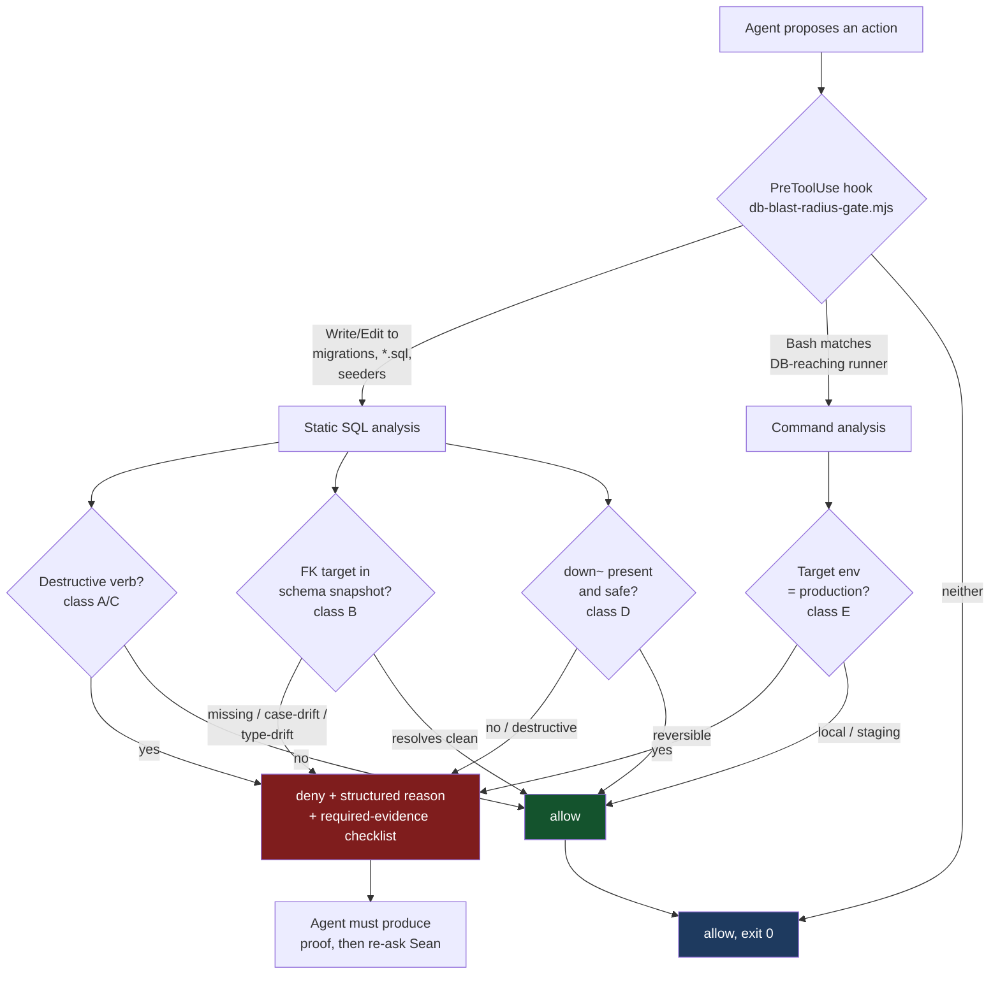

# Blast-Radius Guard — blueprint for review

**Author:** Opus 5 (vs-claude) · **Date:** 2026-08-11 · **Status:** DRAFT, pre-build
**Remit:** stop an AI agent from irreversibly damaging production data while coding.

---

## 1. The incident that triggered this

An external model authored a plan containing migration SQL. It was not run. It was caught by
review, not by any guard.

`docs/ai-workflow/AI-HANDOFF/NASM-INTEGRATION-CONSOLIDATED-REVIEW.md:71,89,91`

```sql
CREATE TABLE phase_transition_audit (
  id UUID PRIMARY KEY DEFAULT gen_random_uuid(),
  client_id UUID REFERENCES users(id),          -- ① wrong table: prod is "Users"
  ...
);
CREATE TABLE exercise_modifications (
  exercise_id UUID REFERENCES exercise_library(id),  -- ② table does not exist
  client_id   UUID REFERENCES users(id),
  created_by  UUID REFERENCES users(id),
  ...
);
```

Three defects in nine lines, none of which contain a destructive verb:

1. **Wrong table, silently valid.** Production has a stale lowercase `users` alongside canonical
   `"Users"` (CLAUDE.md "Common Gotchas"; migration `20260730120000-repoint-user-fks-to-canonical-Users.cjs`
   repointed 50 FKs away from it). `REFERENCES users(id)` therefore **succeeds** and binds to the
   dead table. No error. Rows insert. Joins silently return nothing. This is the failure mode that
   produced the May round of mystery 500s.
2. **Nonexistent table.** `exercise_library` is not a table in this schema.
3. **Type drift.** `UUID` FK against an `INTEGER` PK. The repo already carries
   `backend/migrations/UUID-INTEGER-TYPE-MISMATCH-FIX.cjs` — this exact class has bitten before.

**The load-bearing observation:** a blocklist of dangerous verbs (`DROP`, `DELETE`, `TRUNCATE`)
would have caught **none** of this. The statement is a `CREATE TABLE`. It is destructive by
*reference*, not by *verb*. Any guard built only on scary keywords is theater against this class.

---

## 2. Three verified unguarded paths to production (this repo, today)

`DATABASE_URL` points at **production Postgres from local dev** — CLAUDE.md:49: *"Local dev uses
production DB … if it works locally, it works in production."* So every path below ends at live
customer data.

| # | Path | Gate today | Verified at |
|---|---|---|---|
| **P1** | Write `backend/migrations/*.cjs` → `npx sequelize-cli db:migrate` | **NONE.** `defaultMode:"acceptEdits"` writes the file silently; `Bash(npx sequelize-cli:*)` is in **allow** | settings.json:6, allow list |
| **P2** | `node -e "…sequelize.query('TRUNCATE …')"` | **NONE.** `Bash(node -e:*)` is in **allow** | allow list |
| **P3** | A migration whose SQL is *valid but wrong* (the incident above) | **NONE.** No verb to match; succeeds silently | §1 |

The existing deny list gates the *wrong things*. `Bash(DROP TABLE:*)` only matches a shell command
that literally begins `DROP TABLE` — not a shell command at all, so it never fires. Meanwhile the
canonical migration runner (`npx sequelize-cli db:migrate`) is allow-listed because the guard was
written around script *names* (`node scripts/*migration*` is in `ask`) and the real runner is an npx
tool that also does harmless things.

`psql`, `pg_dump`, and `node scripts/*migrate*` **are** correctly in `ask`. The hole is everything
that reaches the DB without going through those three shapes.

---

## 3. What the guard must cover — the harm taxonomy

Scope is "irreversible or wide-blast-radius harm," not "database" specifically. Sean's ask: *anything
along this line, this level.*

| Class | Example | Detectable how |
|---|---|---|
| **A. Destructive DDL/DML** | `DROP`/`TRUNCATE`/`DELETE` without `WHERE`, `ALTER … DROP COLUMN` | statement parse |
| **B. Referential drift** ← *the incident* | FK → nonexistent/stale table; type mismatch; wrong case | **parse + compare against real schema** |
| **C. Unbounded mutation** | `UPDATE t SET x=…` with no `WHERE`, or `WHERE 1=1` | statement parse |
| **D. Irreversible migration** | `down()` missing, or `down()` that drops data | AST/text check on the migration file |
| **E. Prod-target confusion** | destructive op while `DATABASE_URL` = prod | env inspection at run time |
| **F. Secret/PII egress** | already covered by Rules 44/59 + scan-secrets.sh | out of scope, cross-ref only |
| **G. History/infra destruction** | force-push, `git reset --hard`, `rm -rf` | already denied; keep |

**B is the priority.** A–C are the loud ones and are half-covered. B is silent, is what actually
happened, and no current mechanism sees it.

---

## 4. Architecture

Three layers, because a skill alone is advisory and *"a duty enforced only by the model remembering
is a duty that will eventually be dropped"* (CLAUDE.md Rule 57 amendment).



### Layer 1 — deterministic `PreToolUse` hook (the actual guard)

`scripts/hooks/db-blast-radius-gate.mjs`. Fires on `Write`, `Edit`, `Bash`. Zero model calls, fail
**closed** on parse ambiguity for destructive shapes, fail **open** on unreadable input (matching
`hermes-closeout-gate.mjs` convention). Blocks by exit code + structured stderr.

**Schema snapshot** (the class-B mechanism): a committed `backend/schema-snapshot.json` —
`{table: {columns: {name: type}}}` — regenerated by a script against the real DB. FK targets are
resolved against it, **case-sensitively**, with a dedicated error for the `users`/`"Users"` pair and
for UUID↔INTEGER drift. Snapshot staleness is itself reported (Rule 72's source-SHA discipline).

### Layer 2 — the skill (judgment + teaching)

`.claude/skills/blast-radius-guard/SKILL.md`. Loads when DB/migration/destructive work starts.
Carries the taxonomy, the required-evidence checklist, and the *reasoning* the hook can't encode
(is this `DELETE` legitimately scoped? is this migration genuinely reversible?).

### Layer 3 — cross-agent injection

Sean's explicit ask: *"inject another AI to watch out for this too."* Three sub-channels:
1. **Rule + AGENTS.md mirror** → Codex/Fable/any Claude reads it at boot.
2. **Consult-packet preamble** — `scripts/consult-*.mjs` prepend a standing constraint so
   externally-authored SQL is born correct (Kimi, HY3, Gemini, Qwen).
3. **Blueprint lint** — the hook also scans `docs/**/*.md` on write for SQL fenced blocks, so a bad
   FK is caught **in the plan**, before any builder can run it verbatim. This is the layer that
   would have caught §1 at authoring time.

---

## 5. Block-message wireframe

Denial must teach, not just refuse — otherwise the agent retries a variant.

```
┌──────────────────────────────────────────────────────────────────────┐
│  ⛔ BLAST-RADIUS GATE — write blocked                                 │
│                                                                       │
│  File   backend/migrations/20260811-add-phase-audit.cjs               │
│  Class  B — referential drift (silent corruption, no error at run)    │
│                                                                       │
│  Line 12   client_id UUID REFERENCES users(id)                        │
│            ▲ target table `users` is the STALE duplicate.             │
│              Canonical is "Users" (quoted, capital U).                │
│              FK would bind to the dead table and joins return empty.  │
│              → see 20260730120000-repoint-user-fks-to-canonical.cjs   │
│                                                                       │
│  Line 12   UUID vs "Users".id INTEGER                                 │
│            ▲ type drift — cf. UUID-INTEGER-TYPE-MISMATCH-FIX.cjs      │
│                                                                       │
│  Line 19   REFERENCES exercise_library(id)                            │
│            ▲ no such table in schema snapshot (taken 2026-08-11).     │
│                                                                       │
│  TO PROCEED, produce in your next message:                            │
│    1. the real target table, quoted from schema-snapshot.json         │
│    2. the real PK type                                                │
│    3. a down() that is proven reversible                              │
│    4. Sean's explicit approval to run against production              │
│                                                                       │
│  Snapshot age: 0d.   Override: SWAN_BLAST_RADIUS_ACK=<reason>         │
└──────────────────────────────────────────────────────────────────────┘
```

---

## 6. Open questions — attack these

1. **Is the schema snapshot the right mechanism?** It can go stale, and a stale snapshot that says
   "table missing" produces false blocks that train the agent to reach for the override. What is the
   correct staleness policy — hard-fail, warn, or refuse to judge class B at all past N days?
2. **Where does the override live?** An env-var escape hatch that the *agent itself* can set is not
   a gate at all. But with no escape hatch, a false positive hard-stops legitimate work.
3. **False-positive budget.** 343 files already in `backend/migrations/`. If the gate is retrofitted
   and flags historical files on edit, does it become noise that gets disabled within a week?
4. **Is `node -e` blockable without wrecking ergonomics?** It's allow-listed and genuinely useful.
   Pattern-matching its content is trivially evadable (string concat, base64, `require` indirection).
   Is a partial guard worse than none — does it create false confidence?
5. **Does blueprint-lint over-reach?** Markdown SQL is often illustrative pseudo-schema. Blocking a
   *doc write* for an FK typo may be the wrong severity. Warn vs block?
6. **What am I missing in the taxonomy** — a class of irreversible harm not in §3 that an AI agent
   plausibly reaches in this repo?
7. **The deepest question:** should the gate block at *write* time or at *run* time? Write-time
   catches it earliest but has the highest false-positive rate. Run-time is precise but the file
   already exists and a human may run it outside the hook.
