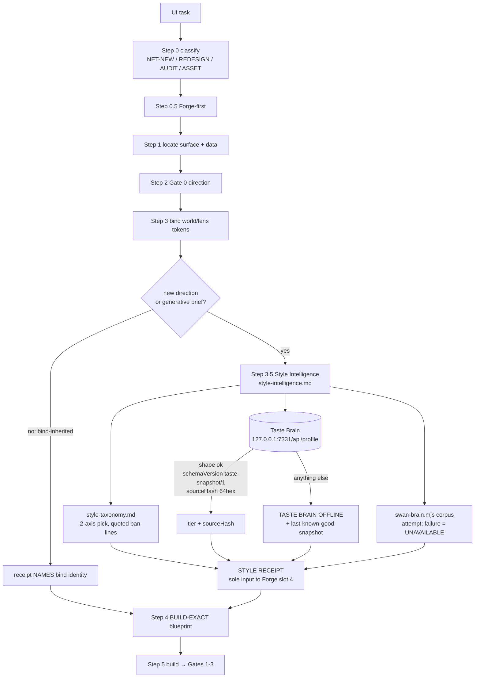
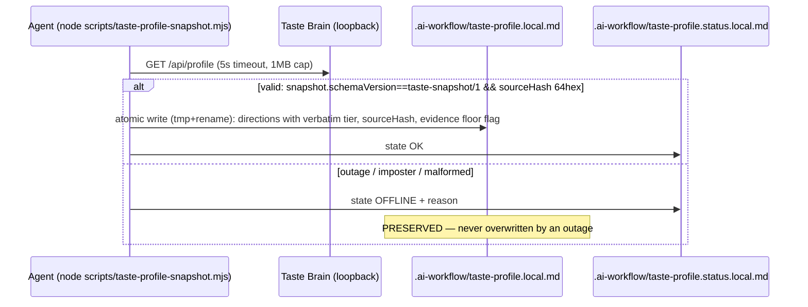
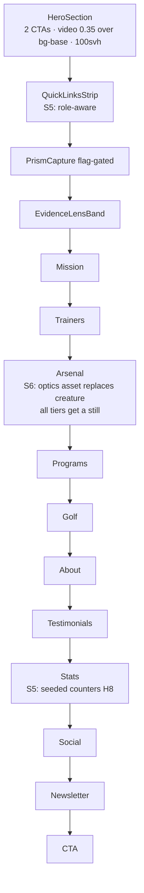
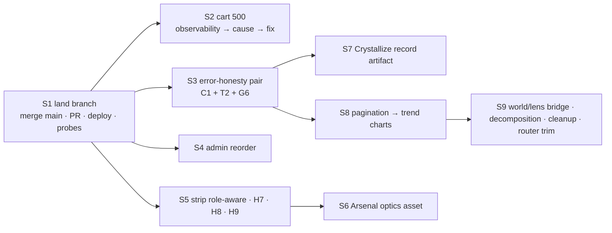

# Design-Brain + Five-Surface Workstream — Blueprint v2 (Fable 5.1 → Opus 5 build spec)

- **Date:** 2026-09-02 · **Author:** Claude Fable 5.1 (Final Decider; hostile re-review of the Fable 5.0 chain) · **Builder:** Opus 5 — executes verbatim, makes ZERO decisions (every decision is recorded in §2; if a question arises, the blueprint is incomplete — stop and report the gap, do not decide)
- **Decision:** the 5.0 chain is sound but had 12 gaps (§1); this v2 supersedes the ranked list in the review's §Ranked next-slice with nine BUILD-EXACT slices (§4)
- **Status:** open (build spec) · **Supersedes:** `HOSTILE-DESIGN-REVIEW-FIVE-SURFACES-2026-09-01.md` §Ranked next-slice order (the review's findings stay canonical; its slice ordering is replaced by §4)
- **Branch:** `feat/design-brain-style-intelligence` at `d6894a70d` — 8 ahead / **9 behind** origin/main (`80efc51be`); `git merge-tree` dry-run = **0 conflicts** `[VERIFIED 2026-09-02]`. Worktree `c:/tmp/ss-pt-design-wt`. The MAIN checkout (`Desktop/quick-pt/SS-PT`) is on an unrelated stale branch — never build there.
- **Evidence provenance:** every file:line below was read this session (lead or Sonnet receipt spot-verified). Anything the lead did not open is tagged `[HYPOTHESIS]` and paired with the probe that settles it.

---

## 0. How Opus uses this document

1. Read §2 (decisions) once — they are not suggestions.
2. Execute §4 slices in order S1→S9. Each slice: claim lane (`node scripts/lane.mjs claim`), build, run the slice's PROOF block, hostile-loop until dry (Rule 73), commit per slice (explicit paths, `Co-Authored-By` trailer), push at batch end (Rule 70), post the PROOF block to SWA-229.
3. Tier-A on this repo: `cd frontend && NODE_OPTIONS=--max-old-space-size=12288 npx tsc --noEmit` (8GB OOMs), `npm run build`, targeted `npx vitest run <files>` (default reporter — `--reporter basic` is not installed). Backend: `node --check`, `npm test` in `backend/`, Rule 42 audit before push.
4. Commit gates you WILL hit and must not bypass: G4 hex (tag pre-existing lines `swan-guard-allow-hex <reason>`; new code uses `var(--token, #fallback)` with tokens that EXIST — the token-existence gate rejects invented names; defined tokens live in `frontend/src/styles/*.css`), G6 300-line cap, constitution mirror (`node scripts/sync-agents-mirror.mjs` if CLAUDE.md changes — avoid touching it), brain-links (design-brain index law: every new file in `docs/ai-workflow/design-brain/` needs an `index.md` row).
5. A blocked commit leaves files STAGED — re-check `git status` before the next commit or your "docs commit" becomes a no-op (happened 2026-09-02).

---

## 1. Fable 5.1 hostile review of the 5.0 chain — gaps found

Scope reviewed: all 8 branch commits (`eae029c3c`…`d6894a70d`), the review artifact rev 3, `style-intelligence.md`, the router Step 3.5, the taste bridge + tests, the hero triad, the X6 fix, the learning packet, plus live probes from the 5.0 session. Verdict on the chain: **sound in substance, incomplete in four places, wrong in one.**

| # | Gap | Evidence | Effect on the build |
|---|---|---|---|
| G1 | **X1 was mis-framed: the LAW-5 record-artifact Crystallize does not exist anywhere.** `useCrystallizeTransition` is a *settings/appearance theme-switch* transition (`CRYSTALLIZE_SURFACE_ID = 'settings.appearance'`, phases `idle→charging→settling`, variants `static/fade/sweep` — `adapters/style-lens-swan/motion/useCrystallizeTransition.ts:20-35`). Nothing live consumes it (`LabConfirmationChip.tsx:30` is a comment). `CelebrationBurst` (`WorkoutLogger/handoff/CelebrationBurst.tsx:39`) is the only execution-moment feedback in the product, and it fires only on PR/first/streak (`PostSaveHandoff.tsx:183-184`). | S7 is a **build**, not a rename: define the record artifact around the existing burst + a state chip. |
| G2 | **The Arsenal creature image is tier-gated.** `ArsenalSection.tsx:64-72` renders `/images/parallax/features-swan-bg.png` as a `ParallaxBg` at opacity 0.35 **only when `tier==='full'`**; balanced/essential visitors get no image. | H2 (S6) is an asset swap on one path plus a decision about what balanced/essential see (§2 D6). |
| G3 | **C1 is wider than the recap card.** `PersonalRecordsCard` is gated on `personalRecords.length > 0` (`ClientProgressDashboardPage.tsx:232-234`) — on fetch error it renders nothing; `personalRecordsError` (`:78,:117-124`) is only consumed by the stat strip. | S3 covers both cards. |
| G4 | **The cart-500 is unobservable by design.** `logCartError` (`routes/cartRoutes.mjs:70-76`) logs `error.name`/`error.code` only — never `message` or `stack`; `sendInternalError` (`:59-63`) collapses every throw to a generic 500. The true cause cannot be read from Render logs today. | S2 step 0 is observability, then reproduction, then the root-cause fix — not a guess. Three ranked hypotheses in §4 S2. |
| G5 | **`GET /api/workout/sessions` is served by the shadowing mount.** `backend/core/routes.mjs:411` mounts `/api/workout` (workoutRoutes) BEFORE `:412` mounts `/api/workout/sessions`; `workoutRoutes.mjs:201` defines `GET /sessions`; the dedicated `workoutSessionRoutes.mjs` has **no** `GET /` (only `/:id/handoff`, `/statistics/:userId`). The frontend's `limit: 200, page: 1` (`WorkoutsTab.tsx:91-92`) is honored — or not — by `workoutRoutes.mjs:201`. `[HYPOTHESIS: pagination params unverified there]` | S8 targets `workoutRoutes.mjs:201`; first step is to read it. |
| G6 | **X6 fix residual: the load effect is keyed on the `user` object.** `SessionContext.tsx` load effect deps include `user`; `AuthContextProvider.tsx:685` `setUser(refreshedUser)` on every token refresh → one bounded refetch per refresh. Not a loop; still waste. | S1 post-deploy probe + S3 tightening to `user?.id`. |
| G7 | **QuickLinksStrip is role-blind.** It renders Client/Trainer Dashboard, Waiver, Staff Review to visitors with no account (anonymous capture `home-anon-414.png`). No render test exists for the strip. | S5. |
| G8 | **Branch is 9 behind main** (sheen/forge perf PRs #107-#109, CI gate `test-gate.yml`). 0 conflicts today; the CI gate on main may run backend tests this branch never ran. | S1 lands it first. |
| G9 | **Router is 320 lines** (cap 300; baseline 304). Going under requires moving pre-existing canon, which 5.0 correctly refused inside a repair. | S9c defines exactly which sections move to `design.md` (§4). |
| G10 | **Anonymous attribution of the X6 storm is `[LIKELY]`, not verified** — the Playwright network log accumulates across navigations; `CartContextProvider.tsx:56-58` and `SessionContext` both guard on `isAuthenticated`, so the anonymous page *should* be quiet. | S1 post-deploy probe uses a fresh browser context, not a cleared page. |
| G11 | **Trainer save failures can look like success.** `useWorkoutSubmit.ts:216-217`: network/5xx → `offlineQueue.queueSubmission` → outcome `KEPT_LOCAL` with no toast in that branch (the queue "raises its own" per comment `:145` — unverified). `ClientsWorkspace.view.tsx:268-272` roster error is static text, no retry. | S3 T2 half. |
| G12 | **Cart-500 scope**: verified on ONE refresh-capable account; anonymous never calls `/api/cart` (`CartContextProvider.tsx:57`). | S2 reproduces on a second account before declaring breadth. |

What 5.0 got right and Opus must not re-litigate: Step 3.5 + `style-intelligence.md` (three review rounds), the taste bridge contract (`taste-snapshot/1` + `sourceHash`, verified against the real compiler), the hero triad, the X6 root cause, T4 withdrawn as false, A1 = 8th of 11.

---

## 2. Decisions (Fable's, final — Opus does not revisit)

- **D1 — One celebration, one name.** The Crystallize record artifact is built AROUND `CelebrationBurst` + a new `CrystallizeRecord` chip; the settings transition hook keeps its name and job. No confetti, no second celebration. Burst stays gated to PR/first/streak; the RECORD chip appears on EVERY save (the chip is the artifact; the burst is the PR bloom — LAW 5 slot 1).
- **D2 — Error honesty uses ONE pattern:** the user-tree `ErrorCard` + `RetryButton` (`UserDashboard/components/WorkoutsTabStyles.ts:255-269`), promoted to a shared `frontend/src/components/ui/ErrorCard.tsx` and consumed by client + trainer surfaces. Copy is fixed (§4 S3). Never `—` for an error; never empty-state copy for a failure.
- **D3 — Admin landing order (final):** Signal bar → Quick actions → **Work Queues** → **Client & Trainer Operations** → Alerts → AI Terminal → Business Lens → Revenue Integrity → Ops Intelligence → Community & Content Safety → Telemetry. Ships as a plain reorder (revert = rollback); no flag.
- **D4 — Cart fix is observability-first.** No root-cause guess ships before the real error is read from logs on a reproduced request.
- **D5 — QuickLinksStrip is role-aware:** anonymous → Photography · Waiver · Contact (Staff Review) only; authenticated → the role's dashboard + Social + Photography + Waiver; never both dashboards for one role. Hero stays exactly two CTAs.
- **D6 — Arsenal balanced/essential tiers get the SAME new optics asset as a still** (no more "no image" tiers); full tier adds the parallax. The asset is generated via a Step 3.5 STYLE RECEIPT (§4 S6 carries the receipt + Seedance brief); until the asset exists, the section uses the `StaticBg`-style gradient (no creature, ever).
- **D7 — Pagination before charts** (U4 before U1): the Progress tab fetches windowed (`limit 50`, "Load older" affordance, cursor by `page`); trend charts render only from the loaded window with an explicit "showing last N" label. No chart on a truncated series without saying so.
- **D8 — World/lens bridge goes user-tree first**, via a single `userDashboard.tokens.ts` bridge (consumer-only per LAW 8 R6), behind the existing `*_ENABLED` runtime-flag scaffold (LAW 9 R2). No emitter code.
- **D9 — No new libraries.** Victory stays the only chart lib; framer-motion stays; styled-components only.
- **D10 — Nothing here changes CLAUDE.md.** The router line-count slice (S9c) moves prose to `design.md`, not law.

---

## 3. Architecture (mermaid)

### 3.1 Design brain — where style intelligence now sits


### 3.2 Taste bridge (last-known-good law)


### 3.3 The X6 cycle — before and after
```mermaid
flowchart LR
  subgraph before["BEFORE (infinite)"]
    E1[load effect deps:\nfetchSessionAnalytics, fetchSessions, user…] --> FS[fetchSessions]
    FS --> SS[setSessions → NEW array]
    SS --> FA[fetchSessionAnalytics\ndeps: …, sessions]
    FA -. new identity .-> E1
  end
  subgraph after["AFTER (d6894a70d)"]
    E2[load effect] --> FS2[fetchSessions]
    FS2 --> SS2[setSessions]
    SS2 --> REF[sessionsRef.current = sessions\n(sync effect, fetches nothing)]
    FA2[fetchSessionAnalytics\ndeps: isAuthenticated, user] -. stable .-> E2
  end
```

### 3.4 Home page section flow (post-triad) and the S5/S6 targets


### 3.5 Slice dependency graph


---

## 4. Slices — BUILD-EXACT

Each slice: **Files · Exact change · Tests · PROOF · Rollback**. Copy is verbatim (LAW 10). `[NEW BACKEND]` flags additive-only backend work.

### S1 — Land the branch and verify production (no feature work)
- **Files:** none new. `git merge origin/main` into the branch (NOT rebase — 8 published commits, Rule 45), resolve nothing (0 conflicts as of `80efc51be`; if conflicts appear, they are in `packages/swan-forge/*` or `frontend/src/hooks/useSheenPointer*` — take main's side, those files were never touched by this branch).
- **Then:** full Tier-A (§0.3), Rule 42 audit (`git ls-files --others --exclude-standard backend/` + `git diff --name-only HEAD backend/` → both empty), push, open PR titled `Design brain Step 3.5 + five-surface review fixes (X6 fetch cycle, hero triad)` with body = §1 table rows G1/G6/G7 + the review link; end body with the Claude Code footer. Render auto-deploys on merge.
- **Post-deploy probes (mandatory, in a FRESH Playwright context — `browser.newContext()`, never a cleared page):** (a) anonymous `/` → network filter `/api/sessions` → expect **0** entries after 60s idle; (b) authenticated `/` (Sean's account) → expect exactly ONE `/api/sessions` + ONE `/api/sessions/analytics` per token refresh, none between; (c) `/api/cart` status on that authenticated load — record it for S2; (d) 414px capture of the hero: 2 CTAs, no pills above the fold, no gold.
- **PROOF block:** merge SHA, PR URL, deploy marker chunk name from `dist/`, the three probe counts, capture sha256. Post to SWA-229.
- **Rollback:** `git revert` the merge commit on main (single commit); no migrations, no flags.

### S2 — `GET /api/cart` 500 (observability → reproduction → fix)
- **Step 0 (ship first, tiny):** `backend/routes/cartRoutes.mjs:70-76` `logCartError` → add `message: error?.message, stack: error?.stack?.split('\n').slice(0,6).join(' | '), pgCode: error?.original?.code, parent: error?.parent?.message` to the logged object (IDs only — never log `req.user` beyond `userId`). Keep `sendInternalError` unchanged. Test: `backend/routes/__tests__/cartRoutes.logCartError.test.mjs` — construct an Error with `original.code='42703'`, spy on logger, assert the four new keys present and no PII keys.
- **Step 1 (reproduce):** after deploy, hit `/api/cart` with Sean's account AND one client test account; read Render logs for the `errorName`/`message`/`pgCode`. Classify against the three receipts: **H-a** `Model 'X' not found in cache` (`models/index.mjs:103` — init race) · **H-b** non-recoverable PG error escaping `cartSchemaRecovery.mjs:122-141` (check live constraint name: `SELECT conname FROM pg_constraint WHERE conrelid='shopping_carts'::regclass;` — code expects `shopping_carts_one_open_per_user` at `:90`) · **H-c** `EagerLoadingError` "is not associated to" (association `models/associations.mjs:704` not attached in that process). All three are `[HYPOTHESIS]` until the log names one.
- **Step 2 (fix the named cause only):** H-a → await model-cache readiness in the route (pattern already used elsewhere: grep `initializeModelsCache`); H-b → make the unrecoverable error recoverable ONLY if it is a schema-class error, else surface a specific 5xx message; H-c → guard the include on `CartItem.associations?.storefrontItem` exactly as `productVariant` already is (`cartSchemaRecovery.mjs:422`). Each fix gets a supertest regression that fails before / passes after (Rule 55 probe discipline).
- **Adjacent finding to log, not fix here:** `models/User.mjs:608` `tableName: '"Users"'` (quotes embedded in the string) — file as SWA issue "dual-table landmine".
- **PROOF:** log excerpt (redacted), supertest output, live `/api/cart` → 200 on both accounts. **Rollback:** revert the fix commit; step 0 logging stays.

### S3 — Error-honesty pair (C1 recap + PR card · T2 roster + save · G6)
- **Shared component:** create `frontend/src/components/ui/ErrorCard.tsx` (≤80 lines) exporting `ErrorCard({ message, onRetry, retryLabel='Retry', testId })` — port the styled rules from `UserDashboard/components/WorkoutsTabStyles.ts:255-269` verbatim (error-left-border card + button), tokens `var(--bg-surface, …)`, `var(--text-primary, #E0ECF4)`, danger border `#E5484D` via `var(--color-danger, #E5484D)` (token exists? if the token-existence gate rejects, use `swan-guard-allow-hex semantic danger per router adapters` on that ONE line). 44px button. `role="alert"`. Then re-point `WorkoutsTab.tsx:127-135` to it (no behavior change) so there is ONE implementation.
- **C1 — client:** `ClientProgressDashboardPage.cards.tsx` `WeeklyRecapCardProps` gains `error: boolean; onRetry: () => void`. Render order: `error` → `<ErrorCard message="We couldn't load this week's recap." onRetry={onRetry} testId="recap-error" />`; else existing `settled/!hasRecap` empty copy; else content. `ClientProgressDashboardPage.tsx:222-229` passes `error={weeklyRecapError}` and `onRetry={reloadWeeklyRecap}` — extract the recap fetch (`:99-109`) into `const reloadWeeklyRecap = useCallback(...)` reused by the mount effect. Same for `PersonalRecordsCard` (`:232-234`): render `<ErrorCard message="We couldn't load your personal records." onRetry={reloadPersonalRecords} testId="pr-error" />` when `personalRecordsError`, instead of nothing. Stat-strip `—` behavior unchanged.
- **T2 — trainer roster:** `ClientsWorkspace.view.tsx:268-272` replace the static `ErrorNote` with `<ErrorCard message="We couldn't load your client roster." onRetry={props.loadClients} testId="roster-error" />`; thread `loadClients` from `ClientsWorkspace.tsx:75` through the view props (it already exists on the hook return). **T2 — save path:** `useWorkoutSubmit.ts:216-217` — after `queueSubmission`, ALWAYS `toast.info('Saved on this device — will sync when you're back online.')` unless the queue module provably toasts (read `offlineQueue` first; if it does, do nothing and cite the line in the commit). Outcome `KEPT_LOCAL` must render a visible chip in `PostSaveHandoff` ("Saved locally · pending sync") — the record must never look identical to a synced save.
- **G6:** `SessionContext.tsx` load effect deps: replace `user` with `user?.id` (keep `isAuthenticated`), and inside the effect read `userRef.current` (add `const userRef = useRef(user); useEffect(() => { userRef.current = user; }, [user]);` next to `sessionsRef`). Extend `sessionContextPollingLoop.contract.test.ts`: assert the load effect's dep array no longer contains bare `user`.
- **Tests:** RTL for `ErrorCard` (renders message, calls `onRetry`, `role=alert`); RTL for `WeeklyRecapCard` error branch (error=true → testId `recap-error`, empty copy ABSENT); RTL for `PersonalRecordsCard` error branch; RTL for `ClientsWorkspace.view` roster error → retry calls `loadClients`; source contract for the toast/chip in the save path.
- **PROOF:** vitest file list + counts; tsc; build. **Rollback:** revert commit; no data impact.

### S4 — Admin landing reorder (D3)
- **File:** `AdminOverviewPanel.tsx:195-295`. Move the **Work Queues** band (`:219-231`, no prop deps) and the **Client & Trainer Operations** band (`:257-268`, needs `authAxios` from `:54` — already in scope) to directly after Quick actions (`:199`), before the AI Terminal band (`:200-210`). Nothing else moves. File stays ≤300 lines (297 now — if the move adds lines, extract the AI Terminal band into `AdminOverviewPanel.terminal.tsx`).
- **Test:** `AdminOverviewPanel.order.contract.test.ts` — read the source, assert the index of `name="Work Queues"`-band marker < index of the AI Terminal marker, and Operations < AI Terminal. (Source-text contract is this repo's convention for ordering.)
- **PROOF:** test, tsc, build, 1440 + 2560 authenticated screenshots (admin) with the fold line noted. **Rollback:** revert.

### S5 — Strip role-aware · H7 · H8 · H9
- **QuickLinksStrip.tsx:** import `useAuth` from `'@/context/AuthContext'` (path used by `CartContextProvider.tsx:24`). Build `LINKS` from `{ isAuthenticated, user }` per D5: anonymous → `[Photography, Waiver, Trainer Staff Review]`; client → `[SwanStudios Social, Client Dashboard, Photography, Waiver]`; trainer → `[Social, Trainer Dashboard, Photography, Waiver]`; admin → `[Social, Client Dashboard, Trainer Dashboard, Photography, Waiver]`. Role source: `user.role` (verify the exact field name on the `user` object in `AuthContextProvider.tsx:464` `formattedUser` — cite the line in the commit). Keep the file ≤120 lines; extract `quickLinks.data.ts` if needed.
- **H7:** `HeroSection.tsx` `VideoBg` gains `onError={() => setVideoFailed(true)}`; when `videoFailed`, render `<StaticBg />` instead (state via `useState(false)`).
- **H8:** `StatsSection.tsx` — pass `seed={stat.target}` so `AnimatedCounter` renders the FINAL value in initial DOM and animates from 0 only after `isInView` (read `AnimatedCounter.tsx:18-40` for the prop shape; add `seed?: number` if absent — when set, initial text = seed, animation replays toward the same value). No-JS/crawler DOM must contain the real number.
- **H9:** `HomePage.V4.tsx` — resolve `tier` once (already does) and pass it via a `TierContext` (new `frontend/src/pages/HomePage/components/shared/TierContext.tsx`, ≤40 lines) so sections read `useTier()` with a default of `'essential'` when no provider — forgetting the prop can only produce LESS motion, never more.
- **Tests:** RTL `QuickLinksStrip` ×4 role cases (mock `useAuth`); `HeroSection` onError → StaticBg present; `StatsSection` initial DOM contains the seeded number before intersection; source contract for TierContext default.
- **PROOF/Rollback:** standard.

### S6 — Arsenal optics asset (H2, LAW 4) — asset-first
- **STYLE RECEIPT (Step 3.5, filled by Fable here so Opus does not decide):** facets — `Cinematic` (preferred: "cinematic light/grade" per style-taxonomy §QUALITY), `Moody` (preferred), `Geometric` (requires-justification: justified — the caustic lattice is the geometry); source — Photographers (macro/scientific); anchor form (web surface) — "caustic refraction study, deep-ocean vault light, no creature form"; taste tier — `OFFLINE` at authoring (server down); fingerprint n/a; corpus — `[SWAN BRAIN UNAVAILABLE]` on this branch; refused-facets — none.
- **Seedance brief (E1 template):** 16:9, 8s loop + one still frame: "Macro of light refracting through faceted crystalline ice over dark sapphire water; caustic lattice drifting slowly; palette Midnight Sapphire #002060 base, Ice Wing #60C0F0 highlights, Frost White #E0ECF4 specular; no animals, no wings, no feathers, no silhouettes; no lens flare; no particles; physically plausible dispersion." Negative: "swan, bird, wings, creature, silhouette, lens flare, bokeh, purple-cyan gradient wash, Galaxy tones #0a0a1a #00FFFF #7851A9". Deliver `public/images/parallax/arsenal-caustics.jpg` (still, ≤300KB) and optionally `arsenal-caustics.mp4`.
- **Code:** `ArsenalSection.tsx:64-72`: `$bgImage="/images/parallax/arsenal-caustics.jpg"`; remove the `isFull &&` gate around the still (D6) — full tier keeps the parallax transform, balanced/essential render the still statically (`motionStyleProps(undefined)`). Delete `features-swan-bg.png` ONLY after `rg features-swan-bg` returns no other consumer (Rule 34).
- **Tests:** source contract: ArsenalSection does not reference `features-swan-bg`; `ParallaxBg` renders for `tier='balanced'`.
- **PROOF:** 1440/414 captures of the section (all three tiers via `useAnimationTier` mock). **Rollback:** revert; asset file stays.

### S7 — Crystallize record artifact (X1, LAW 5 — D1)
- **New:** `frontend/src/components/WorkoutLogger/handoff/CrystallizeRecord.tsx` (≤120 lines): props `{ phase: 'pending'|'forming'|'formed'|'resting', label: string, value?: string, isPR?: boolean }`. Renders a faceted chip (clip-path polygon, 6 facets, `var(--bg-surface)` fill, 1px `var(--border-prominent)` edge); `font-variant-numeric: tabular-nums` on `value`; phase transitions via framer `layout` + opacity ONLY, 400ms; `isPR` → numeral + delta use gold `var(--gilded-fern, #C6A84B)` (allowlist slot 1 — the only gold on the surface); `prefers-reduced-motion` → `initial={false}`, no transition (LAW 5 R1).
- **Wire:** `PostSaveHandoff.tsx` — render `CrystallizeRecord` on EVERY save outcome (`phase` driven by submit status: submitting→`pending`, response received→`forming`→`formed` (400ms)→`resting`; `KEPT_LOCAL` → `formed` with label "Saved locally"), and keep `CelebrationBurst` exactly where it is (`:183-184`) as the PR/first/streak bloom. Export `CrystallizeRecord` from `adapters/style-lens-swan/index.ts` so the adapter owns it.
- **Tests:** RTL phases render in order with the expected `data-phase`; reduced-motion renders `resting` immediately; PR renders gold class only when `isPR`; source contract: no `confetti`/second celebration import anywhere under `WorkoutLogger/`.
- **PROOF/Rollback:** standard.

### S8 — Pagination then trend charts (U4 → U1, D7) — **U1 HALF CANCELLED 2026-09-03**

> **Builder's stop-condition report (Opus 5).** The U1 half of this slice was NOT built, per §7 ("any file:line that does not match what you open → stop, report, do not improvise"). `bodyFatTrend` is already wired to a lazy `BodyFatTrendLine` at `ProfileChartsSection.tsx:95`; `weightProgression` is already a default-visible canonical chart (`ProfileChartsGrid.tsx:70-73`); `strength1RM` is offered in no UI. Building `TrendChart.tsx` would have duplicated a shipped chart and created a competing surface (the X5 hazard). The U4 half — pagination + window labelling — was real and shipped. See the review's U1 entry for the full withdrawal.
- **Backend read first:** `backend/routes/workoutRoutes.mjs:201+` — confirm `limit`/`page` (or `offset`) handling and the envelope. If absent → `[NEW BACKEND]` additive: honor `limit` (max 100) + `page`, return `{ success, data: { sessions, page, limit, total, hasMore } }` without changing existing fields. Supertest for both shapes.
- **Frontend:** `WorkoutsTab.tsx:88-97`: `limit: 50`, keep `page` state; "Load older workouts" `ForgeButton` under the list when `hasMore`; append, don't replace. Charts (`WorkoutsTabCharts.tsx`) receive the loaded window + `windowLabel="Last N workouts"` rendered as a C11 chart-environment caption.
- **U1:** add `TrendChart.tsx` (Victory `VictoryLine` + `VictoryScatter`, ≤150 lines) for the three advertised series driven by `chartVisibility` (`types/UserDashboardTypes.ts:44-57`): `weightProgression` (max weight per session), `bodyFatTrend` (only if a measurements source exists — else the toggle is HIDDEN, never dead), `strength1RM` (Epley from best set). Toggles that have no data source are removed from `EditProfileChartToggles.tsx` (no dead controls).
- **Tests:** transform unit tests (Epley, max-weight per session), RTL "Load older" appends, toggle↔chart parity test (every visible toggle has a rendered chart or is hidden).

### S9 — World/lens bridge · decomposition · cleanup · router trim
- **S9a (X2, D8):** `frontend/src/components/UserDashboard/userDashboard.tokens.ts` — consumer-only bridge mapping `--world-accent/--world-surface/--lens-*` → the tree's existing `var(--accent-primary…)` fallbacks; gate behind the existing runtime flag pattern (read `publicConfigRoutes.mjs` for the flag list; add `USER_DASHBOARD_WORLD_TOKENS_ENABLED`, default false). Contract test: no file under `UserDashboard/` emits/modifies `--world-*`.
- **S9b (X4/X5):** decompose `AiConsentScreen.tsx` (819) into `AiConsentScreen.tsx` + `.sections.tsx` + `.styles.ts` + `.copy.ts` (≤300 each, no behavior change, existing tests green); delete the two orphan lazy exports `UniversalDashboardLayout.routeComponents.tsx:54` (`MyClientsView`) and `:84` (`TrainerVideosPage`) after `rg` shows no consumer; Rule-34 classify→approve pass for the home V3 generations and `ClientObservatoryHome` (propose, do not delete without Sean).
- **S9c (G9):** move the router's "World Engine fail-closed compatibility" block and the "BUILD-EXACT blueprint format" + "FULL-STACK REAL & REVERSIBLE" prose into `docs/ai-workflow/design-brain/design.md` (new sections, index row updated), leaving one-line pointers — target ≤295 lines. brain-links + rulebook-review gates must pass; CLAUDE.md untouched.

---

## 5. Wireframes (ASCII — the shapes are decisions)

### 5.1 Home hero + strip — 414px (shipped) / target with S5
```
┌───────────────────────────────┐        ┌───────────────────────────────┐
│ ☰ SwanStudios          🛒 👤 │        │ hero: 100svh, video 0.35      │
│                               │        │        (logo)                 │
│         (logo)                │        │  Health First.                │
│  Health First.                │        │  Community Always.            │
│  Community Always.            │        │  italic sub-line              │
│  italic sub-line              │        │ [Join the Community]          │
│ [Join the Community]          │        │ [Find a Trainer]              │
│ [Find a Trainer]              │        │           scroll ⌄            │
│           scroll ⌄            │ ─fold─ ├───────────────────────────────┤
├───────────────────────────────┤        │ QuickLinksStrip (role-aware)  │
│ QuickLinksStrip               │        │ anon: (📷 Photography)        │
│ (all 6 pills, one sapphire)   │        │       (✎ Waiver) (🏅 Contact) │
└───────────────────────────────┘        └───────────────────────────────┘
```

### 5.2 Client progress — recap + PR cards with S3 error state
```
┌ Weekly recap ─────────────────────────────┐   ┌ Personal records ───────────────┐
│ ▌ We couldn't load this week's recap.     │   │ ▌ We couldn't load your personal │
│ ▌ [ Retry ]   (role=alert, 44px)          │   │ ▌ records.   [ Retry ]           │
└───────────────────────────────────────────┘   └─────────────────────────────────┘
   (empty week keeps: "No weekly recap available yet." — a DIFFERENT card)
```

### 5.3 Admin landing (D3) — 1440px above the fold
```
[ Signal bar ─────────────────────────────────────────────── ]
[ Quick actions ───────────────────────────────────────────── ]
[ WORK QUEUES: intake ▏ waiver ▏ pending pay ▏ cancelled ▏ check-ins ▏ renewal risk ]
[ CLIENT & TRAINER OPERATIONS: who trained · stale · needs intervention · signups ]
─────────────────────────────── fold @ 900px ────────────────────────────────
[ Alerts ] [ AI Terminal ] [ Business Lens ] [ Revenue Integrity ] [ Ops Intel ] [ Safety ] [ Telemetry ]
```

### 5.4 Crystallize record chip — phases (S7)
```
pending   ◇ Saving set…            (outline only, 60% opacity)
forming   ◆ 5 × 185 lb            (facets fill over 400ms, layout+opacity only)
formed    ◆ 5 × 185 lb  ▲ +10     (PR: numeral+delta gold — the ONLY gold; burst fires here)
resting   ◆ 5 × 185 lb            (static; reduced-motion jumps straight here)
```

---

## 6. Test plan (matrix)

| Slice | Unit/contract | RTL | Backend/supertest | Live probe |
|---|---|---|---|---|
| S1 | existing suites | — | `backend npm test` (main's CI gate) | fresh-context storm probe, cart status, 414 capture |
| S2 | logCartError keys | — | regression per hypothesis | `/api/cart` 200 on 2 accounts |
| S3 | polling contract ext. | ErrorCard ×3 surfaces, roster retry | — | client + trainer screenshots of error states (mock network) |
| S4 | order contract | — | — | admin 1440/2560 |
| S5 | TierContext default | strip ×4 roles, hero onError, seeded counter | — | anonymous vs authed strip |
| S6 | no-creature contract | ParallaxBg on balanced | — | 3-tier captures |
| S7 | no-second-celebration contract | phases, reduced-motion, PR gold | — | save flow video |
| S8 | Epley/max transforms, toggle↔chart parity | Load older appends | pagination envelope | long-history account |
| S9 | consumer-only contract, orphan-absent contract | existing suites | — | flag on/off |

Commands: `cd frontend && npx vitest run <files>` · `NODE_OPTIONS=--max-old-space-size=12288 npx tsc --noEmit` · `npm run build` · `cd backend && npm test` · `node --test scripts/taste-profile-snapshot.test.mjs` (12 checks, must stay green).

---

## 7. Stop conditions for Opus (report, don't decide)

- Any file:line above that does not match what you open → stop, report the drift with the real lines, do not improvise.
- Cart log names a cause outside H-a/H-b/H-c → stop and report the real error; the fix is not pre-authorized.
- Arsenal asset not yet generated → ship S6 with the gradient fallback and the receipt; never a creature.
- A slice cannot be proven in-session (needs Sean's login, a Seedance run, a DB read) → disclose the unproven part per Rule 73; partial claims only.
