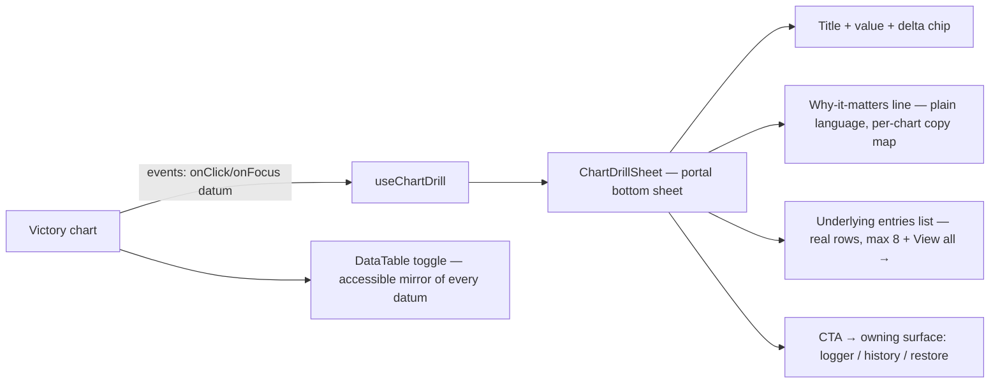

# ELEGANCE BLUEPRINT — Arc C: Interactive Client Charts

**Sean's contract:** "every single element clickable… information and data that would explain
something… deeper." No dead one-box-of-words charts. Beautiful AND usable. Everything rides the Swan
Lens (theme changer) seamlessly.

**Worker contract:** execute exactly this; do not re-decide. Victory ONLY. Colors ONLY through
`lensChartPalette.tsx` / `chartTheme.ts` (lens-connected — extending those files is allowed, bypassing
them is BANNED). Real-log data-truth: a drill-down shows real underlying entries or an honest
"unlocks after N sessions" cold-start line (W0.1 contract) — never fabricated numbers.

## Verified current state (do not re-audit)
- 9 Victory chart files, ZERO interaction events today (grep-verified).
- `charts/live/`: BodyFatTrendLine, IntensityRpeTrendLine, MacroSplitDonut, MuscleGroupBalanceBars,
  RecoverySignalBars, WeightProgressionLive, WorkoutFrequencyBar. Plus `heatmap/WorkoutHeatmapCalendar`,
  `pie/MacroDonut`, `ExerciseHistoryChart.tsx` (473 ln — over cap; interaction lands via the shared
  system, NOT by growing this file), SafeChart error boundary, `victoryStyleProps.ts`.

## Architecture (ONE shared system, not 9 bespoke hacks)


### New shared files (each ≤300 ln, in `frontend/src/components/Charts/drill/`)
1. `useChartDrill.ts` — state `{ open, datum: DrillDatum | null }`; `openDrill(datum)`, `closeDrill()`.
2. `ChartDrillSheet.tsx` + `.styles.ts` — portal bottom sheet (mobile) / side panel ≥1024px; focus-trap,
   Esc closes, 44px close; sections per mermaid; lens tokens only; reduced-motion = fade only.
3. `drillContracts.ts` — `interface DrillDatum { chartId; label; value; unit; deltaText?; whyText;
   entries: DrillEntry[]; entriesTitle; cta?: { label; href } }` + per-chart `WHY_COPY` map (plain
   language, NO clinical/syndrome words client-side — two-tier copy law) + `buildDrillDatum` helpers
   per chart transforming the datum Victory hands back.
4. `victoryDrillEvents.ts` — factory returning Victory `events` array wiring `onClick` (+`onFocusIn`)
   on data components to `openDrill(buildDrillDatum(chartId, props))`; enlarges hit area via
   `size`/`barWidth` bump on active + invisible hit-strokes ≥44px equivalent.
5. `ChartDataTable.tsx` — the a11y mirror: toggle button ("View as table", 44px) under every drilled
   chart rendering the series as a real `<table>` with row buttons opening the same drill sheet
   (keyboard-first path; Victory SVG a11y is not sufficient — this is the accessible truth).

### Per-chart wiring order (one slice each, same pattern)
C1 WeightProgressionLive → C2 WorkoutFrequencyBar → C3 IntensityRpeTrendLine → C4
MuscleGroupBalanceBars → C5 RecoverySignalBars → C6 BodyFat/MacroSplit/MacroDonut → C7
WorkoutHeatmapCalendar (day-cell → that day's sessions) → C8 ExerciseHistoryChart (points → that
session's sets; file over cap — wire via drill system imports only, net ≤+20 ln).
Every slice: RED test (datum click → sheet with correct label/value/why/entries), wire, GREEN, guards.

### Drill entries data
Prefer data ALREADY in the chart's props/response. Where a chart only has aggregates, the sheet's
entries section renders the honest line "Tap through to history for the full log" with the CTA —
NO new endpoints in this arc (endpoint additions = separate reviewed slice; log as backlog per chart).

## Wireframe — drill sheet (mobile)
```
┌──────────────────────────────┐
│ ▔▔ drag handle               │
│ Squat e1RM        205 lb ▲+25│  ← title, value, delta chip (Gilded Fern)
│ Built from your logged sets — │
│ heavier than any recent week. │  ← whyText, plain language
│ ────────────────────────────  │
│ ENTRIES (LAST 8)              │
│ • Jul 22 — 3×5 @ 185 lb      │  ← real rows, each 44px, tap → history
│ • Jul 19 — 5×3 @ 175 lb      │
│ [ View full history → ]       │  ← CTA (GlowButton primary)
└──────────────────────────────┘
```

## Acceptance (arc-level)
Every chart in `charts/live/` + heatmap + pies + ExerciseHistoryChart: click ANY datum → sheet with
non-empty why-copy + truthful entries/CTA; table toggle present; keyboard path opens the same sheet;
lens palette only (guards + `lint:swan-lens` clean); reduced-motion compliant; SafeChart boundary
still wraps everything; 320px + 4K checked.

## Do-NOT list
No Recharts. No bypassing lensChartPalette/chartTheme. No fake/placeholder drill data — cold starts
speak honestly. No new endpoints this arc. No syndrome/clinical words client-side. ExerciseHistoryChart
stays ≤493 ln. No flags.
