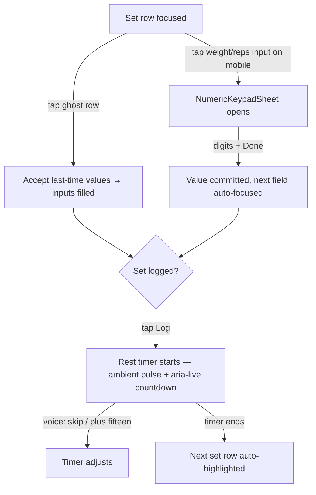

# ELEGANCE BLUEPRINT — Arc L: Workout Logger Fluidity

**Worker contract:** execute EXACTLY this. Where this doc decides, you do not re-decide. TDD every
slice (RED test first). All colors `var(--token, #crystalline-fallback)` — the logger rides the Swan
Lens automatically via tokens; NEVER hardcode a look. All targets ≥44px. `prefers-reduced-motion`
honored everywhere. Zero PII to LLMs. Commit per slice; batch push after CLEAN×2.

## Verified current state (do not re-audit)
- `WorkoutLogger.tsx` (866 ln — DO NOT push past cap; new UI goes in NEW files).
- `ExerciseSetRowComponent.tsx` (203 ln) — weight/reps inputs, RPE slider at :135-144.
- `GhostDataRow.tsx` — READ-ONLY ghost display ("Last: 135lbs × 10"), renders only setIndex 0,
  trainer/admin path only (`skip` on client route — 403 endpoint; KEEP that rule).
- `useGhostPreFill.ts` — auto-populates NEW sets from last session + overload suggestion.
- `FloatingRestTimer.tsx` mounted at WorkoutLogger:844.
- Save → 201 carries prEvents + handoff → PostSaveHandoff celebration (SHIPPED — do not touch).
- Dictation: Coach command lane live ("✓ Added Goblet Squat — 3×12" chip pattern exists).

## Mermaid — target interaction flow

## Slices (independently shippable, in order)

### L1 — Ghost-tap-accept (the 1-gesture repeat)
- `GhostDataRow.tsx`: add optional prop `onAccept?: (ghost: GhostSet) => void`. When present, the row
  renders as a `<button type="button">` (44px min-height, full-width) with trailing affordance label
  `Tap to use` (Sora 0.72rem, `var(--text-secondary, #8aa2b8)`). onClick → `onAccept(ghostSet)`.
  Absent → exact current read-only rendering (client route unchanged).
- `ExerciseCardComponent.tsx`: pass `onAccept` filling set 0's weight/reps/rpe via existing
  `onUpdateSet(exerciseIndex, 0, field, value)` calls (one per field, sequential).
- ACCEPTANCE (tests): tap ghost → onUpdateSet called with ghost weight+reps(+rpe if present); no
  `onAccept` → no button role rendered; keyboard Enter works; row ≥44px.
- BAN: do not auto-accept without a tap; do not render the button on the client self-log route.

### L2 — NumericKeypadSheet (mobile bottom-sheet number pad)
- NEW `frontend/src/components/WorkoutLogger/NumericKeypadSheet.tsx` (+`.styles.ts`, ≤300 ln each):
  portal bottom sheet, keys 1-9/0/decimal/backspace/±2.5 steppers/Done, each key ≥48px, Graphite
  `var(--surface-dark, #1A1A24)` sheet, key press feedback via transform scale (reduced-motion: none).
  Props: `{ open, label, value, allowDecimal, onCommit(next: number), onClose }`.
- Wire in `ExerciseSetRowComponent`: on touch devices (pointer: coarse media check hook) tapping the
  weight or reps input opens the sheet instead of the OS keyboard (`inputMode="none"` when coarse,
  readOnly + onClick). Desktop unchanged (normal inputs).
- On Done → commit via onUpdateSet → auto-advance: weight→reps→(RPE row visible? focus it)→Log button.
- ACCEPTANCE: coarse-pointer tap opens sheet; Done commits + advances; Esc/backdrop closes without
  commit; desktop keyboard path untouched (tests mock matchMedia pointer:coarse).
- BAN: never block paste/manual entry on desktop; no OS-keyboard flash (inputMode none before focus).

### L3 — Rest-timer atmosphere
- `FloatingRestTimer`: add `aria-live="polite"` remaining-time announcement at 30/10/0s marks; add
  ±15s and Skip buttons (44px) if absent; ambient border pulse synced to the second
  (`transform/opacity` keyframe, killed under reduced-motion → static ring + text).
- Voice: register `rest_skip` + `rest_adjust` FRONTEND_DISPATCH commands (mirror bootcampCommands.mjs
  shape; events `AI_LOGGER_REST_SKIP`, `AI_LOGGER_REST_ADJUST {deltaSeconds:±15..±60}`) + listener in
  a NEW `useLoggerRestAiEvents.ts` (mirror useBootcampAiEvents; validate delta; ack contract).
- ACCEPTANCE: timer announces via aria-live; voice skip works through the dispatcher map; reduced
  motion = zero animation, countdown text still updates.

### L4 — Dictation degradation chips
- Extend the shipped confirm-chip pattern: on dictation parse failure/ambiguity in the logger context,
  render an inline chip row "Didn't catch that — tap to type" opening L2's keypad/text path; on mic
  permission denial render a one-time receipt chip (not a toast) with the keypad fallback.
- ACCEPTANCE: parse-fail path shows chip (test with mocked failure); never an error wall/modal.

## Metrics (closeout payload)
Median taps per logged set ≤2 on the repeat path (L1) — count in tests by simulating the flow;
keypad commit+advance ≤2 taps per field; zero regressions in the 57-test handoff suite +
logger draft/coach tests.

## Do-NOT list
No schema changes. No touching PostSaveHandoff/celebration. No new transport (blueprint 06-bans §1).
No MUI. No Recharts. WorkoutLogger.tsx stays ≤866 ln (net additions go to new files). No flags.

## KIMI CO-SIGN DELTAS (2026-07-22 — BINDING; supersede conflicting lines above)

### L1 — THE SIGNATURE GESTURE (identity: you vs. last you)
On accept: inputs COUNT UP from current→ghost values over 300ms (numerals tick); the row flashes a
cyan→purple gradient sweep along its hairline border (background-position/opacity keyframes ONLY);
haptic tick on coarse pointers (`navigator.vibrate?.(10)`); affordance copy is **"Beat this — {w} × {r}"**
(icon + label, ≥0.8rem — NEVER below 12px; 4.5:1). Reduced-motion: instant fill + border state change
only, no count-up, no sweep. HIERARCHY LAW: the ghost row stays visually SUBORDINATE — dashed/hairline
crystalline border, NO fill; the Log Set button keeps the card's only solid/glow treatment.
**Dual-Button Glow law (quote to every CTA in this arc): blue bg → purple glow; purple bg → cyan glow.**
Prefill conflict resolution: tap-accept silently overwrites prefilled set-0 values (same source data).

### L2 — Keypad face + focus contract (all decisions made)
Face: glass keys with 8px GAPS (no hairline grid), digits in Fira Code display-size, pressed state =
`color-mix(in srgb, var(--accent-primary, #60C0F0) 18%, transparent)` + scale 0.97 (reduced-motion: color
only); top drag-handle + field label title; **Done = Dual-Button Glow primary (blue bg → purple glow)**;
KILL the ±2.5 steppers — slots go to backspace + a quick-chip row showing LAST SESSION'S value (ghost
narrative reinforcement, one-tap commit). Verify `--surface-dark` is a registered lens token before use;
if not, use the registered Graphite token name from the lens registry — never invent token names.
Focus: trap while open; Esc/backdrop with dirty field COMMITS (never discards); return focus to invoking
input on close; Done → commit + auto-focus NEXT field (weight→reps ONLY — one hop); RPE gets
scroll-into-view + polite announcement, NEVER focus theft; Log is always user-initiated. Sheet contains a
44px tertiary "Use system keyboard" button (flips field to native input for the session — SR populations;
`readOnly` announces as dimmed). `allowDecimal`: weight YES, reps NO. Done on empty field = keep prior
value, close (no zero-commit). `env(safe-area-inset-bottom)` padding; landscape max-height 70dvh +
internal scroll; portal to document.body.

### L3 — Timer corrections
Voice = TWO INTENTS IN THE EXISTING Coach dictation parser (rest_skip, rest_adjust ±15..±60) — NO new
FRONTEND_DISPATCH registry surface (duplicate ack-contract rot). Visual = depleting CONIC PROGRESS RING
(carries information even static under reduced-motion) + drop-shadow glow on a transform-scale pulse —
never a border-color pulse. Haptic vocabulary: key tick (10ms), commit thud (20ms), timer-end pulse
(30ms double) — all behind a coarse-pointer + vibrate-support check.

### Nested-interactive check (verify at build): GhostDataRow's button variant must not render inside
any other interactive wrapper in the trainer card.
