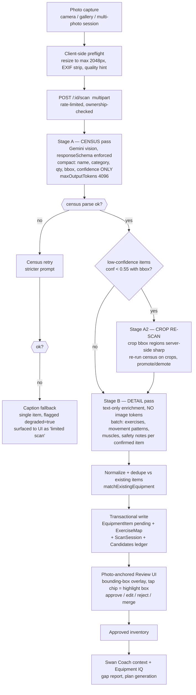
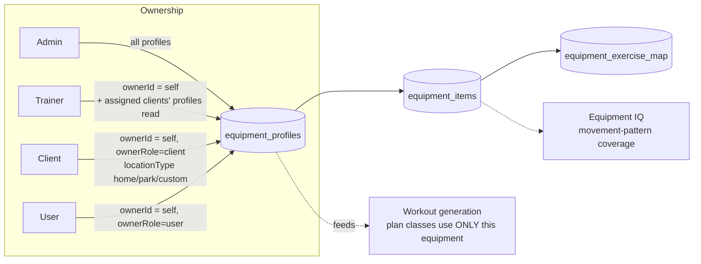
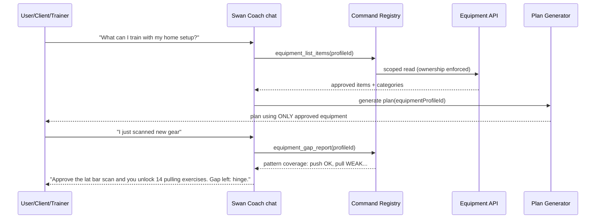
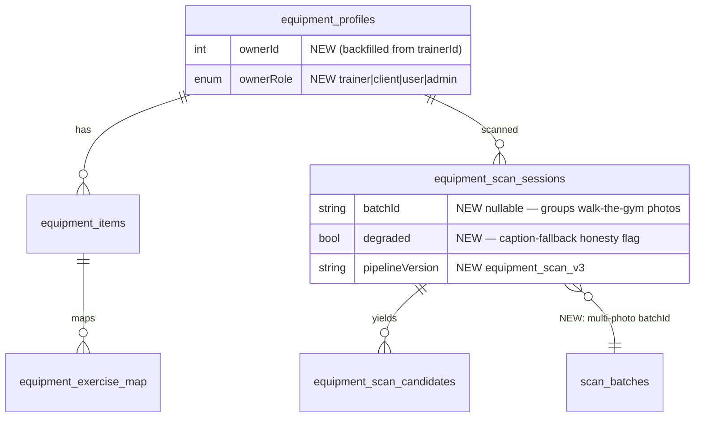

# Equipment Intelligence Overhaul — Blueprint & Enhanced Master Prompt
**Date:** 2026-08-04 · **Author:** Claude (Fable 5) · **Build base:** `origin/main` (this wip branch is 1,512 commits behind; all equipment hardening lives on main)
**Review chain:** This doc → Kimi K3 visual consult + HY3 design consult (one call each, Sean-authorized) → findings folded → build slices.

---

## 1. Enhanced Master Prompt (the recreated prompt, verbatim directive)

> **Overhaul the SwanStudios Equipment system end-to-end.** Today it is a single 1,763-line trainer/admin-only page with a photo scanner that claims multi-object detection but collapses to one item on busy photos, a "Swan Coach scanner" label with no actual Swan Coach integration, and zero presence for clients and users. Deliver:
>
> 1. **Scan V3 — genuinely smart multi-object scanning.** Census→detail two-stage vision pipeline, enforced JSON schema, 8k+ output budget, bounding-box crop re-scan for uncertain items, multi-photo merged scan sessions ("walk your gym" mode), and a photo-anchored review UI where every detected item is a tappable box overlay on the photo.
> 2. **Four-role presence.** Admin (fleet oversight + all profiles), Trainer (own + assigned-client profiles, nav tab restored), Client and User ("My Equipment" — self-owned home/park profiles that feed their own workout generation). Role-scoped API expansion with per-row ownership checks (no IDOR regressions — main just fixed one).
> 3. **Real Swan Coach hive-mind integration.** Registry commands (`equipment_list_profiles`, `equipment_list_items`, `equipment_add_item` as review-gated T2 write, `equipment_gap_report`), scan results narrated by Coach, equipment-aware plan generation formalized (profile ID, not free-text), and an "Equipment IQ" gap analysis mapping inventory → movement patterns (push/pull/hinge/squat/lunge/carry/core) with next-purchase suggestions. Fix the trailhead-truth violation: the copy finally describes what the code does.
> 4. **Crystalline Swan UI rebuild.** Decompose the monolith into ≤300-line modules; SheenCard/GlowButton chrome; dark-first; scan flow that feels cinematic (capture → constellation of detected items → approve); 44px targets; full loading/empty/error/permission states; 320px→4K responsive; reduced-motion fallbacks; wording pass on every user-facing string.
> 5. **Documentation-first.** Mermaid architecture + sequence + ER diagrams, ASCII wireframes desktop & mobile, numbered independently-shippable slices, security receipts, and Kimi K3 + HY3 visual review before build.

---

## 2. Current-State Receipt (evidence, verified 2026-08-04)

### 2.1 Surfaces (Rule 27 classification)
| Surface | URL | Status | Evidence |
|---|---|---|---|
| Standalone route | `/equipment-manager` | canonical (live) | `main-routes.tsx:586-590`, roles trainer+admin |
| Admin dashboard | `/dashboard/admin/equipment` | canonical (live, has nav) | `UniversalDashboardLayout.routes.tsx:138`, nav `dashboard-tabs.ts:547` |
| Trainer dashboard | `/dashboard/trainer/equipment` | live; nav restored on origin/main ("de-orphan trainer nav Slice 1") | `routes.tsx:171`; main's `TrainerStellarSidebar.tsx` |
| Workouts workspace tab | `/dashboard/workouts/equipment` | DEAD (component unmounted, path unrouted) | `WorkoutsWorkspace.tsx:37` |
| Client / User | — | ABSENT | API gated `authorize(['admin','trainer'])` at `equipmentRoutes.mjs:78` |

### 2.2 Backend (on origin/main — the build base)
- `backend/routes/equipmentRoutes.mjs` (~1,100 LOC on main): 18 endpoints under `/api/equipment-profiles`; scan at `POST /:id/scan`; input hardening (400s not 500s), case-insensitive active-only dupe checks, transaction-wrapped scan writes, unique-index race → 409, 10 scans/hr/trainer rate limit.
- Models: `EquipmentProfile` (trainerId-owned, locationType gym|park|home|client_home|custom), `EquipmentItem` (approvalStatus pending|approved|rejected|manual, aiScanData JSON), `EquipmentExerciseMap`, `EquipmentScanSession`, `EquipmentScanCandidate` (review ledger). Partial CI unique indexes `(profileId, lower(name)) WHERE isActive`.
- Legacy disjoint pair `equipment`/`exercise_equipment` (2025-05) — untouched by this system; out of scope except a bridge note (§9).
- Vision: Gemini (`gemini-2.5-flash` default, env-overridable via `EQUIPMENT_SCAN_MODEL`), 3-pass: V2 multi-item JSON → retry → 80-token caption fallback (single item).

### 2.3 Root causes of "weak at multiple things in a picture" [VERIFIED]
1. **`maxOutputTokens: 1800`** (`equipmentScanService.mjs:80`) vs ~16 rich fields × up to 12 items → truncated JSON on busy scenes → parse failure → retry → **single-item caption fallback**. The pipeline silently degrades from 12 items to 1.
2. **Single monolithic pass** — detection AND enrichment (exercises, muscles, safety notes, reasoning) in one generation. Enrichment bloat starves detection.
3. **No enforced schema** — prose-prompt JSON, no `responseSchema`; parser plays whack-a-mole with shapes.
4. **No second look at uncertain regions** — `possibleItems` (<0.55 confidence) are never re-scanned via their bounding boxes.
5. **One photo per scan** — no merged multi-photo session; a gym can't be captured in one frame.
6. **Review UI is list-shaped, not photo-shaped** — boxes are stored (`boundingBox` col) but never drawn; the trainer can't see WHAT the AI saw, so recall failures are invisible.

### 2.4 Swan Coach truth
- Reads: names-only context (`contextBuilder.mjs:165-169`), chat data source SQL (`aiChatService.mjs:1214-1230`, `:1575-1608`), per-request `equipmentProfileId` (`aiChatRoutes.mjs:214-266`, flag `AI_CHAT_EQUIPMENT_CONTEXTS`).
- Writes: **none**. No equipment command exists in the registry (`commandRegistry/` grep: one read-side filter param, `workoutCommands.mjs:172`).
- Copy claims: admin nav says "Swan Coach scanner" (`dashboard-tabs.ts:547`), prompt persona "Swan Coach Vision". **Rule 75 P0: copy over-claims code.** Resolution: build the integration (this blueprint), not just fix copy.

---

## 3. Target Architecture

### 3.1 Scan V3 pipeline

Key deltas from V2: census/detail split (detection never starves), `responseSchema` on both stages, crop re-scan for uncertain regions, degraded-mode honesty flag, multi-photo session merge (Stage A per photo → one merged census → one Stage B).

### 3.2 Role & ownership model

Schema change: `equipment_profiles` gains `ownerRole` (trainer|client|user|admin) alongside existing `trainerId` → renamed semantics to `ownerId` via new column + backfill migration (additive, no destructive rename; `trainerId` kept as deprecated alias until a later cleanup slice). Route policy matrix in §7.

### 3.3 Swan Coach integration (sequence)

Commands (all registry-typed, T-tiered): `equipment_list_profiles` (T0), `equipment_list_items` (T0), `equipment_gap_report` (T0), `equipment_add_item` (T2, creates `approvalStatus: 'manual'` pending row — human approves in UI), `equipment_rename_item` (T2). **No scan trigger from chat** (photo required); Coach deep-links to the scanner instead.

### 3.4 ER delta


---

## 4. Wireframes

### 4.1 Manager page — desktop (all roles, content varies by role)
```
┌────────────────────────────────────────────────────────────────────────┐
│ ⚙ Equipment                    [Profile: Main Gym ▾]  [+ New Location] │
│────────────────────────────────────────────────────────────────────────│
│ ┌─ Equipment IQ ────────────────────────────────────────────────────┐  │
│ │  Push ████████ 92%   Pull ███ 41%   Hinge ██████ 70%              │  │
│ │  Squat ███████ 85%   Carry ██ 25%   Core █████ 66%                │  │
│ │  ✦ Coach: "Add a loop band to unlock 11 pull exercises" [Ask →]   │  │
│ └───────────────────────────────────────────────────────────────────┘  │
│ ┌─ Scan ─────────────────────────┐ ┌─ Inventory (24) ──── [filter ▾]┐ │
│ │   📷  Swan Coach Scan          │ │ ▣ Dumbbell Rack 5-50   x1  ✓   │ │
│ │   [Take Photo] [Gallery]       │ │ ▣ Flat Bench           x2  ✓   │ │
│ │   [🎥 Walk-the-Gym mode]       │ │ ▣ Cable Machine        x1  ✓   │ │
│ │   3 pending review ●           │ │ ▢ Lat Bar (pending) ●  x1  ⏳  │ │
│ └────────────────────────────────┘ └────────────────────────────────┘ │
└────────────────────────────────────────────────────────────────────────┘
```

### 4.2 Scan review — photo-anchored (mobile-first, the signature moment)
```
┌──────────────────────────┐
│ ◤ PHOTO w/ glowing boxes │   Tap a chip → its box pulses Ice Wing.
│  ┌───┐   ┌─────┐         │   Tap a box → chip scrolls into view.
│  │ 1 │   │  2  │  ┌──┐   │   Uncertain items = dashed Wing Purple box.
│  └───┘   └─────┘  │3?│   │
│                   └──┘   │
│──────────────────────────│
│ 1 ▸ Dumbbell Rack  0.94  │
│    [✓ Add] [✎ Edit] [✗]  │
│ 2 ▸ Flat Bench     0.89  │
│    [✓ Add] [✎ Edit] [✗]  │
│ 3 ▸ Possible: Sled 0.48  │
│    [🔍 Look closer] [✗]   │   ← triggers crop re-scan
│──────────────────────────│
│ [✓ Approve all confident] │   44px, GlowButton
└──────────────────────────┘
```

### 4.3 Client/User "My Equipment" (new surface, simplified)
```
┌──────────────────────────┐
│ My Equipment             │
│ [Home ▾] [+ Add place]   │
│ ┌──────────────────────┐ │
│ │ 📷 Scan my equipment │ │  ← primary CTA, camera-first on mobile
│ └──────────────────────┘ │
│ Your gear (6)            │
│ ▣ Adjustable dumbbells   │
│ ▣ Loop bands (3)         │
│ ▣ Pull-up bar            │
│ ✦ Coach: "Your next      │
│   workout uses all 3 —   │
│   start now →"           │
└──────────────────────────┘
```
Trainer view of a client adds a read-only banner: "CLIENT-OWNED · used when planning their home workouts."

---

## 5. Feature Decisions (ranked)
| # | Feature | Serves | Priority |
|---|---|---|---|
| F1 | Scan V3 census/detail + schema + 8k budget | trust, core loop | P0 |
| F2 | Photo-anchored review w/ bbox overlay | trust, beauty | P0 |
| F3 | Trainer nav + copy/wording pass (trailhead truth) | trust | P0 |
| F4 | Crop re-scan ("Look closer") | scan accuracy | P1 |
| F5 | Client/User My Equipment + role-scoped API | activation, self-serve loop | P1 |
| F6 | Swan Coach equipment commands + gap report | coaching depth | P1 |
| F7 | Multi-photo Walk-the-Gym batch | coverage | P2 |
| F8 | Equipment IQ panel (pattern coverage) | next-best-action, upsell | P2 |
| F9 | Monolith decomposition to ≤300-line modules | maintainability | P0 (with F1/F2) |
| F10 | Next-purchase suggestions w/ exercise unlock counts | revenue-adjacent, adherence | P3 |
| F11 | **Equipment-aware planning/logging contract** (Sean 2026-08-04: "super important") | data truth, core loop | **P0** |

**F11 detail — the workout data-correctness loop.** Every surface that creates workout data carries a real `equipmentProfileId` (row link, never free text): (a) plan generation uses ONLY approved items from the selected profile — generated exercises are validated server-side against the profile inventory and rejected/substituted on mismatch; (b) the Workout Logger's exercise picker filters by the active profile (picker already mounts at `WorkoutLogger.tsx:949` — upgrade it from passive dropdown to an enforcement layer with a visible "planning from: Main Gym" chip); (c) the admin/trainer planner state (`useWorkoutPlannerEquipmentProfileState.ts`) and bootcamp builder share the same contract; (d) logged workouts store the profileId used, so progress charts and Coach recommendations know what equipment produced the data. This makes the equipment system the ground truth that keeps AI-generated plans and logged data honest.

Non-goals: video ingest, brand/model recognition, price lookups, legacy `equipment` table merge (bridge note only), barcode scanning.

## 6. Implementation Slices (independently shippable, from origin/main)
1. **S1 — Scan V3 backend**: census/detail passes, responseSchema, token budgets, degraded flag, pipelineVersion; regression tests incl. 12-item busy-scene fixture. (No UI change; legacy response shape preserved.)
2. **S2 — Review UI rebuild**: decompose page; bbox overlay review panel; wording pass. (Vitest + 320/414/768/1440 checks.)
3. **S3 — Crop re-scan endpoint + "Look closer"** button.
4. **S4 — Ownership schema migration** (`ownerId`/`ownerRole` additive + backfill) + role-scoped route policy + IDOR test suite extension.
5. **S5 — Client/User My Equipment surface** + nav entries (user & client tabs) + simplified scan flow.
6. **S6 — Swan Coach commands + gap report service + Coach narration cards.**
7. **S7 — Multi-photo batch sessions.**
8. **S8 — Equipment IQ panel + next-purchase suggestions.**

## 7. Security & Access Matrix (S4 gate — Tier-C trigger acknowledged: multi-tenant scoping)
| Action | Admin | Trainer | Client/User |
|---|---|---|---|
| List/read profiles | all | own + assigned clients | own only |
| Create profile | ✓ | ✓ | ✓ (home/park/custom only, max 3) |
| Scan | ✓ | ✓ (10/hr) | ✓ (5/hr, max photo 10MB) |
| Approve items | ✓ | own profiles | own profiles |
| Delete | ✓ | own | own |
| View client profile | ✓ | assigned only (read) | — |
Every route: per-row `ownerId` check (not just role gate); existing horizontal-authz audit script (`audit-idor-surface.mjs`) extended to the new routes. Zero PII to the vision model: photos only, no client names in prompts.

## 8. Wording / copy pass (the "wording" ask, applied to equipment)
- "Swan Coach Scan" → keep ONLY after S6 lands; until then button reads "Scan Equipment" (truth-first).
- Empty state: "No equipment yet. Scan your space — Swan Coach will identify what you've got and what it unlocks."
- Degraded scan: "We could only identify one item confidently. Better lighting or a closer shot helps."
- Duplicate: "Looks like gear you already have: {name}. Add anyway as a second unit?"
- All copy: no "AI" user-facing (brand rule) — "Swan Coach" or neutral verbs.

## 9. Open questions for Sean
1. Client/User profile cap (proposed 3) and scan rate (proposed 5/hr) OK?
2. Should trainers see client HOME equipment by default, or opt-in per client (privacy posture)?
3. Equipment IQ on the user dashboard home, or inside My Equipment only?
4. Legacy `equipment`/`exercise_equipment` tables: leave frozen (recommended) or schedule a bridge?

## 10a. CONSULT VERDICT — Locked design directives (Kimi K3 + HY3, both reviews complete 2026-08-04, ~$0.08 total)

Full reviews: `EQUIPMENT-KIMI-K3-DESIGN-REVIEW-2026-08-04.md`, `EQUIPMENT-HY3-DESIGN-REVIEW-2026-08-04.md`. Where both agreed, the directive is LOCKED; where they diverged, the resolution is noted.

1. **[LOCKED — both #1] F11 context chip.** The logger/planner equipment profile is a persistent sticky SheenChip (`⬡ Planning from: Main Gym ▾`), 44px, Midnight Sapphire fill, Ice Wing border — never a dropdown. One tap opens a bottom sheet (mobile) / popover (desktop) of profile cards with item counts + last-scanned dates. *Divergence resolved:* HY3 wanted a blocking prompt when unset; Kimi wanted silent derivation. **Resolution: Kimi** — derive from `plan.equipmentProfileId` or the single existing profile; never launch unresolved; prompt only when genuinely ambiguous (>1 profile, no plan context). Mismatch enforcement is corrective, not blocking: Gilded Fern edge + "Not in Main Gym — log anyway?" with one-tap switch. Logged sessions stamp profileId, shown read-only in history. **Fold into S2 (was implicit — now explicit).**
2. **[LOCKED — both #2] Constellation review overlay.** Corner-bracket boxes (not full rectangles), Ice Wing glow, numbered node pips; uncertain = dashed Wing Purple + pulse (`?` pip) — the only ambient animation. Tap chip ↔ box two-way sync with dim-outside-focus isolation (photo dims to 40% except active region). Reduced-motion: instant states, no pulse.
3. **[LOCKED — both] Kill raw confidence decimals.** Three trust tiers: ≥0.80 "Confident" (Ice Wing) / 0.55–0.79 "Likely — quick check" / <0.55 "Not sure — look closer?" (Wing Purple dashed). Numbers demoted to the edit sheet.
4. **[LOCKED — both] Equipment IQ = radial, not bars.** 7-spoke pattern web (push/pull/hinge/squat/lunge/carry/core) on Obsidian; coverage in Ice Wing gradient; **weakest spoke in Gilded Fern** (the eye lands on the gap); overall % centered; ONE rotating Coach insight strip below (`✦ "A loop band unlocks 11 pull exercises" [Ask →]`). Mobile: 7-segment arc gauge. Empty: dashed heptagon + "Scan your space to light this up."
5. **[LOCKED — both] Cinematic capture + honest states.** Camera-first (in-app viewfinder, Ice Wing shutter ring; gallery = corner icon). Loading = staged copy ("Scanning the room… / Identifying equipment… / Matching to your inventory…") with hairline progress — no spinners. Boxes stagger in 80ms apart (constellation forming). Degraded scan = Gilded Fern banner, never red: "Limited scan — we could only confirm one item…" [Retake] primary. Reduced-motion: skip burst/stagger.
6. **[LOCKED — Kimi #6, HY3 #3] Approval ergonomics.** Swipe right = approve (Ice Wing wash + haptic), swipe left = reject, tap = edit sheet; desktop keeps visible icon buttons (gestures never the only path). Sticky bottom GlowButton "Add 9 confident items" (live count). 4-second undo snackbar after any approval. Inventory counter ticks up ("24 → 27").
7. **[LOCKED — both] My Equipment (client/user).** SheenCard grid grouped by movement pattern ("Pulling — pull-up bar, loop bands"), not a flat list — teaches the IQ model implicitly. Coach nudge card promoted directly under hero CTA (Midnight Sapphire, Gilded Fern left border). Custom 1.5px stroke icons — **no emoji**. Cinematic empty state: faint Ice Wing starfield + "Takes about 30 seconds." Quantity steppers 44px.
8. **[LOCKED — HY3 #6] Trainer client-context ribbon.** When a trainer views client-owned gear: frosted Obsidian ribbon, Wing Purple left flag — `Planning for: Client #1042 · Home · read-only`. (Visual answer to Open Q2; default remains opt-in pending Sean.)
9. **[LOCKED — Kimi #8] Walk-the-Gym merge transparency.** Filmstrip of session thumbs with per-photo item-count badges; merged review header "3 photos · 14 unique items · 2 duplicates merged" with expandable merge receipt ("Dumbbell Rack seen in photos 1 & 2 → kept once"). Per-photo degraded dots.
10. **[LOCKED — both] Wording.** "Scan Equipment" until S6 lands; "Scan this spot closer" (not "Look closer"); "Add N confident items" (not "Approve all"); duplicate actions [Add second unit] / [Keep one]; zero user-facing "AI/detection/confidence/bounding box" — "Swan Coach spotted…".
11. **[Structural — Kimi] Slice adjustments.** F11 chip + trust tiers fold into **S2**. Gap-report API shape built once in **S6** and reused by the S8 radial.
12. **[Template bans confirmed by both]** No progress-bar stat rows, no native `<select>` for profile choice, no emoji icons, no raw decimals, no full-rectangle CV boxes, no three-buttons-per-row, no generic spinners, no 50/50 card grid (IQ = full-width hero band; Scan card 40% with last-scan thumbnail background at 20% opacity; inventory 60%).

## 10. Reviewer remit (Kimi K3 + HY3)
You are reviewing a design blueprint for a premium dark-first fitness platform (palette: Midnight Sapphire #002060, Royal Depth #003080, Ice Wing #60C0F0, Wing Purple #8B5CF6, Gilded Fern #C6A84B, Frost White #E0ECF4 on Obsidian #0A0A0F; styled-components; 44px targets; reduced-motion support). Give concrete, buildable **visual UX/UI suggestions**: layout, hierarchy, the scan-review interaction, the bbox overlay treatment, Equipment IQ visualization, mobile camera flow, empty/loading states, micro-interactions, any wording improvements, AND the equipment-profile selection experience inside the Workout Logger / planner (F11): how should "which equipment am I planning/logging with" look so it is always visible, one tap to change, and impossible to get wrong? Rank your top 10 suggestions by impact. Flag anything generic or template-feeling in the wireframes and propose the premium alternative.
