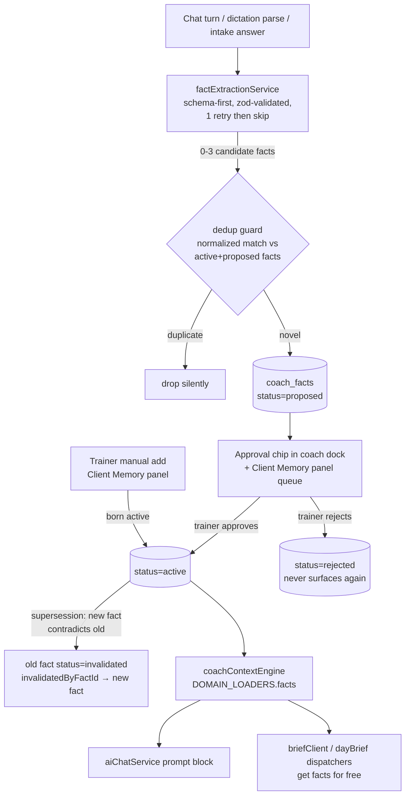
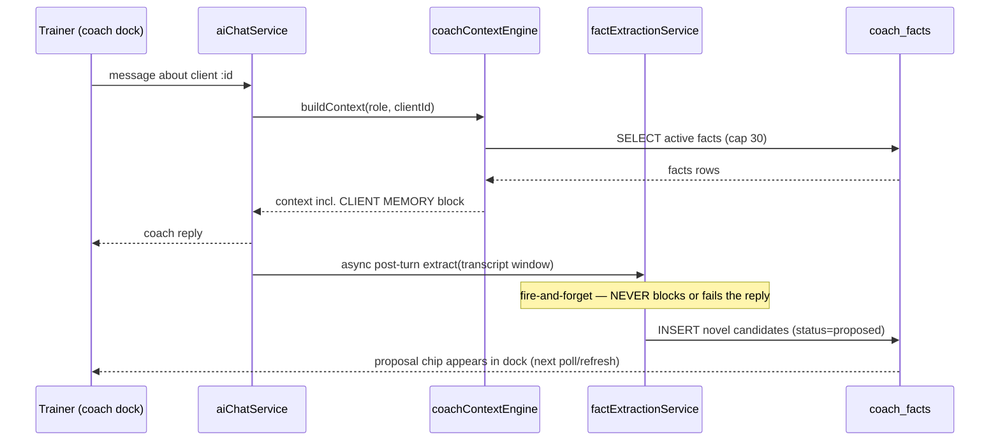

# FABLE BLUEPRINT — Coach Facts: The Durable Hive-Mind Memory Layer

**Date:** 2026-08-31 · **Author:** Fable 5 (Final Decider, review-and-blueprint only)
**Builder:** Opus 5 — this doc is the complete build contract. A question back to Fable = this blueprint failed its bar.
**Build branch law:** ⚠ cut the build branch **from `origin/main`**, NOT from `wip/comms-notifications-2026-07-05` (2,303 commits behind). Every file:line below was verified against `origin/main`.

---

## 1. Hostile review of the Opus 4.8 OSS scan (round 1 verdict)

| # | Opus claim | Verdict | Evidence |
|---|---|---|---|
| 1 | "Swan has no memory/fact layer; design `coach_facts` from Graphiti" | **PARTIALLY WRONG — audit ran on a branch 2,303 commits behind.** Main already ships `backend/services/ai/contextEngine/coachContextEngine.mjs` — literally titled "The Hive-Mind Read Layer (Slice A1)": fail-closed client access, de-identification, 7 domain loaders (profile, workouts, pain, nutrition, goals, schedule, badges). | `git show origin/main:backend/services/ai/contextEngine/coachContextEngine.mjs` header |
| 2 | (implied) nothing note-shaped exists | **WRONG.** `ClientNote` model exists on main: ENUM('observation','red_flag','achievement','concern','general'), severity, visibility ENUM('private','trainer_only','admin_only'), `client_notes` table. | `origin/main:backend/models/ClientNote.mjs` |
| 3 | No temporal-validity vocabulary anywhere | **CONFIRMED.** `git grep -E "validFrom\|valid_from\|invalidatedAt" origin/main -- backend/models backend/services` → zero hits. The bi-temporal gap is real. | grep run 2026-08-31 |
| 4 | No fact-extraction service | **CONFIRMED.** Zero hits for extraction-service patterns on main. | grep run 2026-08-31 |
| 5 | STT = browser Web Speech + Gemini batch | **CONFIRMED on main** (`useCoachBrowserSpeechInput.ts`, `voiceTranscriptionService.mjs` both present on main). "Firefox and iOS Safari get nothing" was overstated — treat browser-coverage claims as [UNVERIFIED]; the real gaps (no VAD, no barge-in, no semantic endpointing, gym noise) stand. | `git ls-tree origin/main` |
| 6 | Skip mem0, adapt Graphiti's bi-temporal schema into Postgres, no Neo4j | **UPHELD.** Also consistent with Rule 72's standing anti-RAG/anti-graph-infra prohibition. | Rule 72 |
| 7 | Jarvis-topic and fitness-LLM repos are toy tier | **UPHELD.** | round-1 scan |

**Net:** the *recommendation* survives; the *design premise* changes completely. We are not building a memory system — we are adding the **missing durable-fact domain to a hive-mind that already exists**, and wiring it through the **existing proposal/approval architecture** (`coachActionProposal*` family) so the trainer stays the decider (trainer-indispensability doctrine).

## 2. Second scan (5 chosen terms) — new findings merged

Terms chosen: in-app AI copilot framework · personal AI second brain · LLM structured output extraction · proactive AI agent check-in · AI health coaching agent.

| Repo | Stars (API, 2026-08-31) | License | Adopt? |
|---|---|---|---|
| CopilotKit/CopilotKit | 37,131 | MIT | **Patterns yes, dependency no.** Generative UI + human-in-the-loop tool approval + shared app state = exactly Swan Coach's dock model. Steal the HITL approval-chip interaction pattern (§8 wireframe). |
| ag-ui-protocol/ag-ui | 15,650 | MIT | Read-only reference for agent↔frontend event contract. Do not adopt the protocol now. |
| 567-labs/instructor | 13,811 | MIT | **Pattern adopted in S2:** schema-first extraction — zod-validated JSON, one bounded retry on validation failure, then skip (never crash the chat turn). |
| dottxt-ai/outlines | 15,726 | Apache-2.0 | Not applicable (server-side token masking needs self-hosted inference). |
| BoundaryML/baml | 9,116 | Apache-2.0 | Watch list only. |
| khoj-ai/khoj | 36,834 | ⚠ **AGPL-3.0** | **NEVER vendor code** into proprietary SaaS. Idea-reference only. |
| Mintplex-Labs/anything-llm | 65,431 | MIT | Workspace-RAG shape; not the embedded-coach shape. Skip. |
| vercel/ai | 26,513 | ⚠ NOASSERTION flag | Re-check license before ever adopting. |
| Graphiti (round 1) | 30,461 | Apache-2.0 | **Schema ideas adopted:** bi-temporal validity + edge invalidation → `validFrom/validTo/invalidatedAt/invalidatedByFactId`. No Neo4j, no library. |

## 3. The decision

> **Next slice: `coach_facts` — structured, temporally-valid, provenance-carrying, trainer-approved facts about each client, written by a proposal-gated extractor and read by the existing coachContextEngine + aiChatService.**

What it is NOT: not a replacement for `client_notes` (free-text trainer notes stay), not embeddings/RAG (Rule 72), not a new database, not client-facing in v1, not the voice/VAD upgrade (that is Fable blueprint #2, queued).

Why this beats fixing voice first: every logged session, chat, and dictation already produces facts that evaporate today. The memory layer compounds from day one and makes every later surface (including better voice) smarter. Voice polish improves input; this improves *everything downstream of input*.

## 4. Architecture

### 4.1 Fact lifecycle (flowchart)



### 4.2 ERD

```mermaid
erDiagram
    Users ||--o{ coach_facts : "userId (client)"
    Users ||--o{ coach_facts : "createdByUserId"
    Users ||--o{ coach_facts : "approvedByUserId"
    coach_facts ||--o| coach_facts : "invalidatedByFactId"
    coach_facts {
        INTEGER id PK
        INTEGER userId FK "REFERENCES \"Users\"(id) — QUOTED"
        ENUM category
        TEXT statement "de-identified, no names"
        JSONB structured "nullable machine payload"
        ENUM status "proposed|active|invalidated|rejected"
        DATEONLY validFrom
        DATEONLY validTo "nullable"
        TIMESTAMPTZ invalidatedAt "nullable"
        INTEGER invalidatedByFactId FK "nullable self-ref"
        ENUM sourceType "chat|dictation|intake|workout_log|client_note|trainer_manual"
        JSONB sourceRef "nullable {conversationId,...}"
        INTEGER createdByUserId FK
        INTEGER approvedByUserId FK "nullable"
        TIMESTAMPTZ approvedAt "nullable"
        TIMESTAMPTZ createdAt
        TIMESTAMPTZ updatedAt
    }
```

### 4.3 Chat-turn sequence (S2+S3 together)



## 5. Data contract — migration (Opus runs verbatim)

**Executor:** Opus 5 via `npx sequelize-cli db:migrate` from `backend/`. **Target DB:** production Render Postgres (local dev points at prod — CLAUDE.md). **Blast radius:** one new empty table + its indexes; zero existing rows touched. **Rollback:** `down()` drops only the new table + enums.

SCHEMA CONSTRAINTS (non-negotiable): canonical users table is `"Users"` QUOTED (bare `users` is a stale duplicate — binding to it succeeds silently and corrupts); unquoted identifiers fold to lowercase; `"Users".id` is INTEGER; every migration defines a non-destructive `down()`; never `sync({force|alter})`.

File: `backend/migrations/<YYYYMMDDHHMMSS>-create-coach-facts.cjs`

```js
'use strict';
/** coach_facts — durable hive-mind memory (Fable blueprint 2026-08-31) */
module.exports = {
  async up(queryInterface, Sequelize) {
    await queryInterface.createTable('coach_facts', {
      id: { type: Sequelize.INTEGER, primaryKey: true, autoIncrement: true },
      userId: {
        type: Sequelize.INTEGER, allowNull: false,
        references: { model: 'Users', key: 'id' },   // sequelize quotes → "Users"
        onDelete: 'CASCADE',
      },
      category: {
        type: Sequelize.ENUM('injury_constraint','preference','goal_context','lifestyle',
          'equipment','motivation_style','schedule_pattern','coaching_cue','milestone'),
        allowNull: false,
      },
      statement: { type: Sequelize.TEXT, allowNull: false },
      structured: { type: Sequelize.JSONB, allowNull: true },
      status: {
        type: Sequelize.ENUM('proposed','active','invalidated','rejected'),
        allowNull: false, defaultValue: 'proposed',
      },
      validFrom: { type: Sequelize.DATEONLY, allowNull: false },
      validTo: { type: Sequelize.DATEONLY, allowNull: true },
      invalidatedAt: { type: Sequelize.DATE, allowNull: true },
      invalidatedByFactId: {
        type: Sequelize.INTEGER, allowNull: true,
        references: { model: 'coach_facts', key: 'id' }, onDelete: 'SET NULL',
      },
      sourceType: {
        type: Sequelize.ENUM('chat','dictation','intake','workout_log','client_note','trainer_manual'),
        allowNull: false,
      },
      sourceRef: { type: Sequelize.JSONB, allowNull: true },
      createdByUserId: {
        type: Sequelize.INTEGER, allowNull: false,
        references: { model: 'Users', key: 'id' }, onDelete: 'CASCADE',
      },
      approvedByUserId: {
        type: Sequelize.INTEGER, allowNull: true,
        references: { model: 'Users', key: 'id' }, onDelete: 'SET NULL',
      },
      approvedAt: { type: Sequelize.DATE, allowNull: true },
      createdAt: { type: Sequelize.DATE, allowNull: false, defaultValue: Sequelize.literal('NOW()') },
      updatedAt: { type: Sequelize.DATE, allowNull: false, defaultValue: Sequelize.literal('NOW()') },
    });
    // Plain CREATE INDEX (not CONCURRENTLY) is safe: table was created this transaction, is empty, has no readers.
    await queryInterface.addIndex('coach_facts', ['userId', 'status'], { name: 'coach_facts_user_status' });
    await queryInterface.addIndex('coach_facts', ['userId', 'category', 'status'], { name: 'coach_facts_user_cat_status' });
  },
  async down(queryInterface) {
    await queryInterface.dropTable('coach_facts');
    for (const e of ['enum_coach_facts_category','enum_coach_facts_status','enum_coach_facts_sourceType']) {
      await queryInterface.sequelize.query(`DROP TYPE IF EXISTS "${e}";`);
    }
  },
};
```

Model file `backend/models/CoachFact.mjs` mirrors the table exactly (`tableName: 'coach_facts'`, `timestamps: true`); follow `ClientNote.mjs` house style, add Blueprint header (>100-line rule). Re-run `node scripts/schema-snapshot.mjs` after the model lands so the blast-radius gate learns the table.

## 6. Service + API contract

### 6.1 `backend/services/coachFactService.mjs` (< 300 lines; split if approaching)

| fn | signature | behavior |
|---|---|---|
| `proposeFacts` | `({userId, facts:[{category,statement,structured?,validFrom?,sourceType,sourceRef?}], createdByUserId})` | dedup-guarded bulk insert, status=proposed. Dedup: lowercase, strip punctuation/whitespace → exact match against existing proposed+active same userId+category → drop dupes. Returns `{created:[], dropped:n}`. |
| `createManualFact` | same shape, single fact | trainer/admin path: born `active`, approvedBy=creator, approvedAt=now |
| `approveFact` | `({factId, approverUserId})` | proposed→active; sets approvedBy/At. 409 if not proposed. |
| `rejectFact` | `({factId, approverUserId})` | proposed→rejected. 409 if not proposed. |
| `invalidateFact` | `({factId, byUserId, supersededByFactId?, validTo?})` | active→invalidated, invalidatedAt=now |
| `listFacts` | `({userId, status?, category?, limit=50})` | ordered category, validFrom DESC |
| `getActiveFactsForContext` | `({userId, cap=30})` | active only, injury_constraint first, then category order — feeds context engine |

Every fn takes an authorized caller — routes enforce; service asserts non-null actor. All writes audit-log via the existing pattern in `ai_command_audit_logs` if the helper is importable without new plumbing; otherwise `logger.info` structured line (do not build new audit infra in this slice).

### 6.2 Routes `backend/routes/coachFactRoutes.mjs`, mounted `/api/coach-facts`

| Method+path | auth | body → response |
|---|---|---|
| `GET /api/coach-facts/client/:clientId` | trainer/admin + `checkClientAccess` fail-closed gate (reuse `contextEngine/clientAccess.mjs`) | `?status=&category=` → `{facts:[...]}` flat at root (schema-drift class 7: do NOT nest `data.data`) |
| `POST /api/coach-facts/client/:clientId` | trainer/admin + gate | manual fact → `{fact}` 201 |
| `POST /api/coach-facts/:factId/approve` | trainer/admin + gate on the fact's userId | → `{fact}` |
| `POST /api/coach-facts/:factId/reject` | trainer/admin + gate | → `{fact}` |
| `POST /api/coach-facts/:factId/invalidate` | trainer/admin + gate | `{validTo?}` → `{fact}` |

Rule 31 shadow-audit at build time: list every mount overlapping `/api/coach-facts` in `server` mount order before calling routes verified. No client-role route in v1 (clients read+do, never decide).

### 6.3 Extraction `backend/services/ai/factExtractionService.mjs` (S2)

- Trigger: post-turn in aiChatService (fire-and-forget promise, `.catch(log)`) and post-parse in the dictation workout-log path. NEVER awaited on the reply path; a total extraction failure costs nothing user-visible.
- Contract (instructor pattern): prompt takes de-identified transcript window (last ~6 turns) + the client's existing active fact statements (dedup context) + category enum; model must return `{"facts":[{category,statement,validFrom?,structured?}]}` (max 3). Validate with zod. One retry on invalid JSON with the validator error appended. Second failure → return `[]`.
- Hard rules in the extraction prompt: statements are client-ID-referenced only, NEVER names (Rule 8); "stretching/flexibility" never "yoga/meditation" (Rule 9); no medical diagnosis language — observations only ("reports left-knee discomfort on lunges", not "has patellar tendinitis").
- Provider: whatever `aiChatService` already uses on main — reuse its existing model-call helper; introduce zero new SDK dependencies.

### 6.4 Read integration (S3) — exact touch points

1. `backend/services/ai/contextEngine/coachContextEngine.mjs` → add `facts` to `DOMAIN_LOADERS` (SELECT statement/category/validFrom/validTo on `coach_facts` WHERE `userId=:clientId AND status='active'` ORDER BY category, `"validFrom" DESC` LIMIT 30). Degrades like every other domain via `Promise.allSettled`.
2. `backend/services/aiChatService.mjs` → add a `CLIENT MEMORY (trainer-approved facts)` prompt block via `coachFactService.getActiveFactsForContext`, formatted like the existing `formatTrendFactsForPrompt` from `painTrendService.mjs` (already imported there on main — mirror its shape).
3. `backend/tests/unit/coachContextTableNames.test.mjs` → extend the drift guard with `coach_facts`.

## 7. Wireframes

### 7.1 Client Memory panel (trainer client view, desktop) — S4

```
┌─ CLIENT MEMORY ────────────────────────────── [+ Add fact] ─┐
│ ⚠ 2 proposed by Swan Coach — review                          │
│ ┌──────────────────────────────────────────────────────────┐ │
│ │ ● injury_constraint  · proposed · from chat 08-29        │ │
│ │ "Reports left-knee discomfort on lunges"                 │ │
│ │            [✓ Approve]  [✕ Reject]   (both ≥44px)        │ │
│ └──────────────────────────────────────────────────────────┘ │
│ ACTIVE (7)                        filter: [All categories ▾] │
│ ▸ injury_constraint  "Left-knee discomfort…"  since 08-29    │
│ ▸ preference         "Prefers supersets over straight sets"  │
│ ▸ schedule_pattern   "Travels alternate weeks"    since 06-02│
│   each row: … menu → [Edit dates] [Invalidate]               │
│ INVALIDATED (3)  — collapsed accordion, history only         │
└──────────────────────────────────────────────────────────────┘
```

### 7.2 Approval chip in coach dock (CopilotKit HITL pattern), mobile 414px

```
┌ Swan Coach ────────────────────────────┐
│ …coach reply text…                     │
│ ┌────────────────────────────────────┐ │
│ │ 🧠 Remember this?                  │ │
│ │ "Travels alternate weeks"          │ │
│ │ [ Save ✓ ]   [ Dismiss ✕ ]  44px+  │ │
│ └────────────────────────────────────┘ │
└────────────────────────────────────────┘
```

Rules for the builder: styled-components only, `var(--token, #fallback)` Crystalline palette, dark-first, no hover-only actions, wrap/stack at 320/375/414px, route the visual pass through `swan-design-router`. Client role never sees this panel in v1.

## 8. Test matrix (write failing-first per slice — Rule 73 / TDD)

| Slice | Test file | Must prove |
|---|---|---|
| S1 | `backend/tests/unit/coachFactService.test.mjs` | propose→approve→active; reject; invalidate sets invalidatedAt+link; dedup drops normalized duplicate, counts it; approve on non-proposed → 409-class error; manual fact born active |
| S1 | extend `coachContextTableNames.test.mjs` | `coach_facts` in the drift guard |
| S2 | `backend/tests/unit/factExtractionService.test.mjs` | fixture transcript → expected proposals; invalid-JSON first response + valid retry → proposals; twice-invalid → `[]` and no throw; names in model output → turn rejected (PII guard); max-3 cap enforced |
| S2 | aiChatService integration test | extraction failure does NOT fail the chat turn (mock extractor throws; reply still returns) |
| S3 | extend `backend/tests/unit/coachContextEngine.test.mjs` (mirror its existing mock-sequelize pattern) | facts domain loads, caps at 30, active-only; failing facts query degrades without killing other domains |
| S3 | prompt-block unit test | active facts render in the CLIENT MEMORY block; zero facts → block omitted entirely |
| S4 | route tests | trainer w/o client access → 403 (fail-closed); client role → 403 on all five routes; response shape flat `{facts}` |
| S4 | vitest component test | proposed chip renders approve/reject; approve optimistically moves row to ACTIVE; keyboard operability (no mouse-only confirm — SwanGuard lesson) |

Gates per slice (Rule 70 batch cadence): affected vitest green → `tsc --noEmit` true-exit from `frontend/` (S4) → `node --check` on touched backend modules → Rule 42 audit → secret scan → local commit, push once at batch end.

## 9. Slices for Opus (independently shippable, in order)

- **S1 — Table + model + service + tests.** No callers yet; invisible to prod. Acceptance: migration up+down clean on a scratch schema check, service tests green, snapshot regenerated.
- **S2 — Extraction (propose-only).** Wire post-turn hook. Acceptance: fixtures green; live smoke = one real chat turn writes a `proposed` row; chat latency unchanged (extraction async).
- **S3 — Read path.** contextEngine domain + aiChatService block + brief dispatchers inherit. Acceptance: extended engine tests green; a seeded active fact provably alters the prompt context in a captured prompt-assembly test.
- **S4 — Trainer UI.** Client Memory panel + dock approval chip. Acceptance: Rule 26 Canonical Surface Receipt for the mount point (produce it on the fresh main-cut branch — this blueprint deliberately does NOT assert the trainer-view mount, it was only verifiable on stale code), responsive matrix incl. 414px, keyboard pass.

## 10. Security / privacy / rollback

- **Rule 8:** statements are de-identified at extraction (ID-referenced), and the read path flows through the engine that already runs `deIdentifyClient`. Extraction PII guard test is mandatory (S2 row above).
- **Fail-closed access:** every route and the context domain sit behind the existing `clientAccess` gate; denied access loads zero facts.
- **Trainer-indispensability:** AI can only *propose*; `active` requires a human trainer/admin. No auto-activation path exists in the contract — do not add one.
- **Kill switch:** `COACH_FACTS_ENABLED` env flag (default ON after S3 ships) checked in extraction trigger + context domain; flag OFF = system behaves exactly as today.
- **Rollback:** flag off → revert slice commits (each slice = isolated commits) → `db:migrate:undo` runs the `down()` above (drops only the new empty-ish table). No existing table is ever altered by this workstream.

## 11. Non-goals (do not let scope creep in)

Voice/VAD/endpointing upgrade (Fable blueprint #2 — Silero VAD + semantic endpointing, queued next) · embeddings/vector RAG (Rule 72 prohibition) · Neo4j/Graphiti-the-library · mem0/Letta dependencies · client-facing memory UI · migrating `client_notes` content · AG-UI protocol adoption · any change to `useCoachBrowserSpeechInput.ts`.
