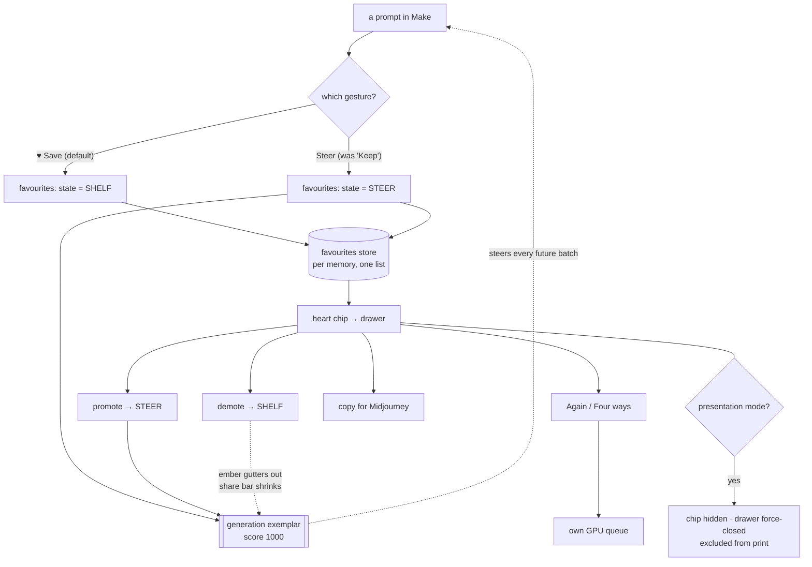
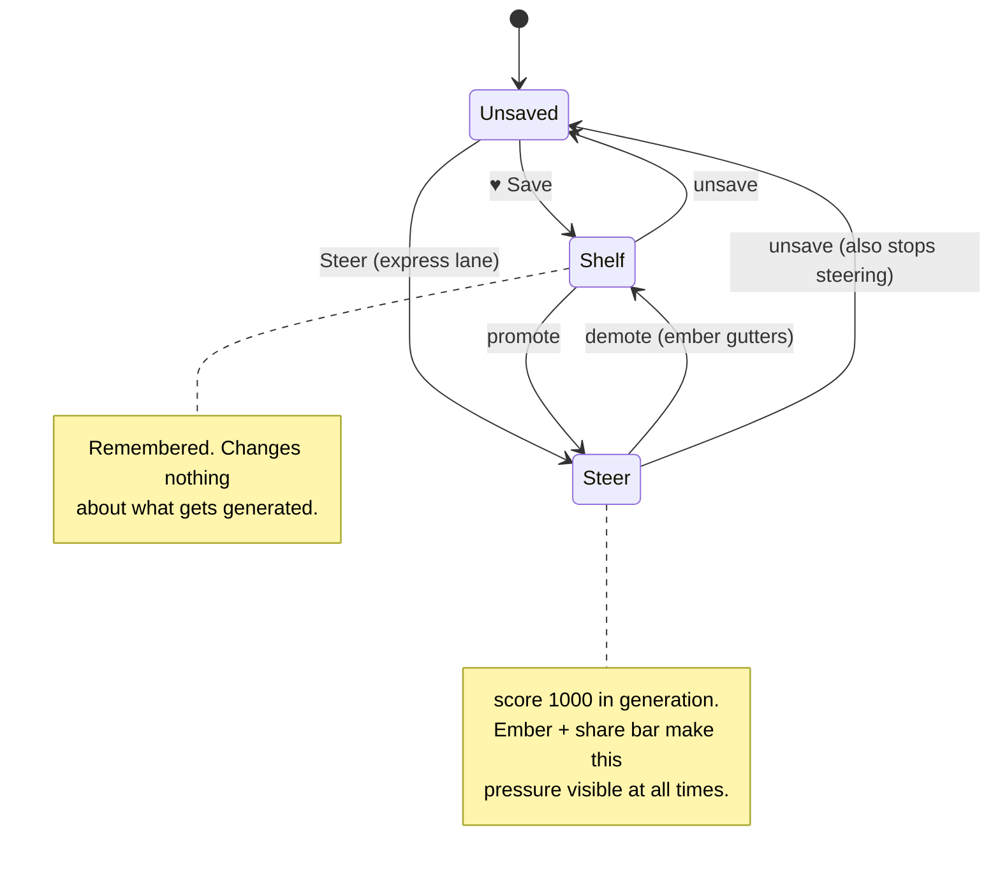

# Favourites — arbitrated blueprint

Two seats answered the same packet independently. Their raw returns are in
`panel-favourites-2026-08-27/`. This file takes the best of each and rules where they split.

**They agreed on more than they disagreed on**, which is the strongest signal in the exercise:
one list not two; a summoned drawer not a fourth section; the steer/shelf difference carried as a
visible reversible **state** on the item; native `<dialog>` for focus/Esc/backdrop; force-closed in
presentation mode. Where they split — **what the default is** — is the decision that matters most,
and it is ruled below.

---

> **SEAN CONFIRMED BOTH, 2026-08-27.** Shelf-by-default: yes. Relabel `Keep` → `Steer`: yes. Both
> went the way this document ruled, so §1 stands unamended and F1 is unblocked.
>
> **F0 is built and committed** — `d200a0a` in swan-taste-brain. It found more than the blueprint
> scoped: five memory-scoped reads needed the guard, not one. See §11.

## 1. The ruling that governs everything else

**Favourites is ONE list, per memory, with two states. The default is SHELF. `Keep` remains the
express lane that writes an item in the STEER state. Promote and demote are visible, reversible
moves on the list.**

### Why, and why not the other way

The trap in the packet was real: **a kept prompt is not a bookmark.** It re-enters generation with
score 1000 — the code's own words, *"dominates corpus scores; kept work is the strongest signal
there is."*

- **GLM 5.3 ruled default-STEER** (option a): one action, one store, the dial as a reversible state
  on the item, defaulting to steering. Its argument is that two verbs is how tools rot, and that
  visibility plus reversibility defuses the danger.
- **Flash ruled default-SHELF** (option d): Save ♥ files it; Keep stays the explicit express lane;
  promotion is a deliberate act.

**Flash is right, and GLM 5.3's own framing is why.** GLM 5.3 correctly insists the distinction must
be a *visible state* rather than two lists — but then defaults that state to the most powerful
setting the system has. The owner's words were *"if there's a prompt that I really like, I should be
able to save it."* That is a shelving intent. Defaulting it to steering means a heart silently
reweights every future batch, forever, from a gesture that reads as "remember this" — which is
precisely the failure the packet was written to prevent.

The safe default is also the recoverable one: shelving something that should have steered costs one
promote. Steering something that should have shelved silently contaminates every batch until
noticed, and there is no notification.

**What we take from each:** GLM 5.3's *one store, one list, state-not-lists* architecture (correct,
and the thing that stops rot), with Flash's *default* (correct, and the thing that stops harm).

### The one thing neither seat said

Keep's existing meaning must not be silently redefined. Today `Keep` steers. If Favourites ships and
`Keep` keeps its label, the owner has two buttons where one is quietly ten times more powerful.
**Relabel `Keep` → `Steer`** at the same time, with its tooltip stating the consequence. One-word
change, and it makes the pair self-explaining: *Save* files it, *Steer* teaches with it.

---

## 2. Where it lives — a drawer, not a fourth section

**Both seats independently refused a fourth section, for the same reason, and both are right.**

Slice 2's three-section discipline is about **destinations** — places you travel to, with landing
rules and a section registry. Favourites is not a stage in the loop; it is a reference collection
consulted *while* in another stage: you want it in Make (grab and re-run) and in Gallery (that render
came from a favourite). A destination makes every use a trip.

The codebase's own precedents settle the shape: presentation mode is a body class, and the lightbox
is a `<dialog>` — both non-section surfaces that already work. So:

- A **heart chip with a count** in the header, beside the queue pill.
- Opens a native `<dialog>` styled as a **420px right drawer**, full-width bottom sheet at ≤640px.
- `showModal()` buys the focus trap, Esc, `::backdrop` and an inert background for free — the same
  reasoning that made the slice-3 lightbox cheap and correct.
- **No fourth bottom-bar tab on mobile**, so the tab-collision ban is satisfied by construction.
- **Force-closed and its chip hidden in presentation mode**, and excluded from print. Flash's phrasing
  is the right standard: favourites are not merely *stripped* in front of a client, they are
  *unreachable*.
- Section count stays three. The registry gains nothing, so it creates no new stale-guard surface —
  which matters, because stale section-name guards have already bitten this codebase twice.

---

## 3. The signature moment — best of both

Flash's save affordance, GLM 5.3's information display. The two do different jobs and both earn
their place; the third candidate is cut.

### Adopted from Flash — the ink-rise heart

The heart does not flip; it **fills, like ink rising in a vessel**.

```css
.save-btn .heart-fill { clip-path: inset(100% 0 0 0); }          /* empty vessel */
.save-btn[aria-pressed="true"] .heart-fill {
  clip-path: inset(0 0 0 0);                                      /* ink rises bottom-up */
  transition: clip-path 320ms cubic-bezier(.2, .7, .3, 1);
  filter: drop-shadow(0 0 4px rgba(139, 92, 246, .45));           /* purple glow on a blue surface */
}
```

### Adopted from GLM 5.3 — the ember and the steering-share bar

This is the half that makes the B2 danger **legible**, and it is the best single idea in either
return. A steering item carries an **ember**; demoting it lets the ember *gutter out* while a
**steering-share bar** in the drawer header shrinks by one notch. You watch generation pressure
leave the system.

```css
.fav[data-state="steer"] {
  box-shadow: inset 2px 0 0 var(--purple), 0 0 14px rgba(139, 92, 246, .22);
  transition: box-shadow 400ms ease-out;                          /* guttering out is the demote */
}
.fav__share {                                                     /* aggregate pressure, 3px */
  height: 3px;
  background: linear-gradient(90deg, var(--cyan) var(--pct), var(--graphite) var(--pct));
  transition: width 240ms ease;
}
```

**Cut: Flash's one-shot edge-light sweep.** Its stated job — "marks this card as filed" — is already
done by the ink-rise and the header count. The house bans decorative motion without an information
job, and a second confirmation of the same fact is decoration.

**Accessibility, non-negotiable:** under `prefers-reduced-motion` the ink fill and gutter are
instant and the count is the confirmation. Under `forced-colors: active` the UA suppresses shadows
and glows, so state must survive as **filled-vs-outline glyph, chip text, and `border: 1px solid
ButtonText`** — never as glow alone. Wing Purple stays a glow/border colour and never becomes text.

---

## 4. The flow





---

## 5. Wireframes

**A prompt card in Make** — one new control, placed before the destructive-ish actions:

```
┌──────────────────────────────────────────────────────────────┐
│ editorial photography portrait, dusk, 35mm grain --ar 16:9   │
│                                                              │
│ [♥ Save]  [Steer]  [Make]  [Make 4]  [Copy]  [Prefix]  ★5 1 │
│   44px      44px                                             │
└──────────────────────────────────────────────────────────────┘
        ▲ ink-rises on press; header count dips and settles
```

**The drawer, desktop (420px, right):**

```
                                    ┌─────────────────────────────────┐
                                    │ Favourites            9    [×]  │
                                    │ ▰▰▰▰▰▰▱▱▱▱  steering 3 of 9     │ ← share bar
                                    │ [ all ][ steering ][ shelf ]    │
                                    │ [ find…                      ]  │
                                    ├─────────────────────────────────┤
                                    │▏dusk portrait, 35mm grain       │ ← ember (steering)
                                    │▏[STEER ▾] [Again] [×4] [Copy]   │
                                    ├─────────────────────────────────┤
                                    │ turquoise lagoon from above     │   no ember (shelf)
                                    │ [SHELF ▾] [Again] [×4] [Copy]   │
                                    └─────────────────────────────────┘
```

**≤640px — full-width bottom sheet**, no fourth tab in the bar:

```
┌──────────────────────────────────┐
│ Favourites   9            [×]    │
│ ▰▰▰▰▰▱▱▱▱▱ steering 3 of 9       │
│ [all][steering][shelf]           │
│ [ find…                        ] │
│ ─────────────────────────────────│
│▏dusk portrait, 35mm grain        │
│▏[STEER ▾]                        │
│▏[Again] [×4] [Copy]   44px each  │
│ ─────────────────────────────────│
├──────────────────────────────────┤
│   ▦ Judge   ✎ Make   ▤ Gallery   │ ← still three
└──────────────────────────────────┘
```

---

## 6. Click cost

| Task | Today | With Favourites |
|---|---|---|
| Save a prompt I like (no steering) | **impossible** — only Keep, which steers | 1 tap |
| Steer with a prompt | 1 tap (Keep) | 1 tap (Steer) — unchanged |
| Find a saved prompt later | scroll Gallery's kept rows | 1 tap chip + type |
| Run a saved one again | 2 (find, Make) | 2 (chip, Again) |
| Stop something steering | Drop — deletes it entirely | 1 tap demote — **keeps the prompt** |

The last row is the real gain: today the only way to stop a prompt steering is to delete it.

---

## 7. Tests — and the thing the panel found that I had not

Both seats independently named the same **unaddressed failure class**, and they are right:
**everything found so far has been *spatial* — two representations of one fact disagreeing at rest.
Nothing has been *temporal*.** No test, and no probe I ran across five slices, covers a callback
resolving after the world moved.

**But GLM 5.3's flagship example of that class does not hold, and I checked rather than relayed it.**
It claimed the style-code rating write could land in the wrong memory and breach the corpus law.
It cannot, with defence in depth: the rate control only renders when
`profile === 'sean' && project === 'default' && p.sref` (`app-make.js:19`), and the server refuses
any other `profileId` outright — *"star ratings are Sean's markdown channel"* (`serve.mjs:244`).
The class is real; that instance is closed. The generate path is likewise already epoch-guarded
(`app-make.js:110–112`).

**Adopted: GLM 5.3's world-epoch, before Favourites is written.** ~30 lines: a counter bumped on
every memory/profile switch; every async boundary captures it at launch and returns early on
resolution if it changed. Favourites must be born with it rather than retrofitted.

| # | Assertion | Level |
|---|---|---|
| F1 | A favourite saved in memory A is absent from memory B; stores are disjoint | node |
| F2 | Default state of ♥ Save is SHELF, and a SHELF item contributes **zero** exemplars to generation | node |
| F3 | A STEER item contributes exactly the existing weight — no more, no less | node |
| F4 | Promote then demote returns generation output to byte-identical | node |
| F5 | Memory switch mid-flight: no favourite write lands in the wrong memory (the epoch guard, made mechanical) | node |
| F6 | Presentation mode: chip hidden, drawer force-closed, zero favourite text in the visible tree | browser |
| F7 | Print: zero favourite text, zero style codes on paper | browser |
| F8 | `forced-colors: active` — steer vs shelf remains distinguishable without glow | browser |
| F9 | Drawer: focus trapped, Esc closes, focus returns to the chip | browser |
| F10 | Every drawer control ≥44px at 390px; no fourth bottom-bar tab | browser |
| F11 | **Every button in the drawer has a wired handler** — the dead-control sweep, mechanised | node (static parse) |

F11 exists because of §8.

---

## 8. What the code review found — three live bugs, all mine

Run against the shipped console while the seats worked. All three were **invisible to the checks I
had been running**, which is the finding behind F11 and the epoch work.

1. **`Copy as text` and `Print / PDF` were completely dead — since slice 2.** Both are bound inside
   `mount()`, and `app-shell.js` only runs `mount()` for tabs that have a matching `#tab-<name>`
   element. Slice 2 deleted `#tab-directions`. **I then built an entire printable brief in slice 5
   and verified it with print-media emulation — which drives the stylesheet directly and never
   presses the button.** Proving the stylesheet is not proving the control.
2. **Entering presentation mode threw a `TypeError` every time** on a fresh page: `present()` calls
   `shut()` → `teardown()`, which touches lightbox state that does not exist until first open. It
   *looked* fine because the body class toggles before the throw, so every assertion passed while an
   exception fired. Found by attaching a `pageerror` listener — the instrument I should have had from
   slice 1.
3. **The Gallery filter silently stopped applying** after a kept-list repaint: `app-directions.js`
   re-applied it, `app-kept.js` did not. The counter would read "showing 1 of 2" while showing 2.

All three fixed and verified; zero page errors on the paths that previously threw.

---

## 9. Build order

| # | Slice | Why here |
|---|---|---|
| ~~F0~~ | ~~World epoch + `pageerror` listener wired into every browser probe~~ — ✅ **DONE `d200a0a`** | Favourites must be born guarded, and the probes must be able to see a throw |
| F1 | Store + `Save`/`Steer` on Make cards; relabel Keep → Steer | The data model and the honest pair of verbs |
| F2 | The drawer: chip, `<dialog>`, list, filter, promote/demote | The surface |
| F3 | Ink-rise + ember + share bar | The signature moment, once the states it describes exist |
| F4 | Presentation/print exclusion + the F-series tests | Client safety, mechanised |

F0 first is not ceremony. Three of the last three bugs were invisible to the checks in use; adding a
sixth surface without fixing the instruments repeats the pattern deliberately.

---

## 10. Model calibration

| Seat | Cost | Value |
|---|---|---|
| **GLM 5.3** | $0 | The one-store/state-not-lists architecture; the world-epoch mechanism; the ember + steering-share bar — the best single idea in either return, because it makes the danger legible. One flagship claim disproven on inspection. |
| **GLM 5.3 Flash** | $0 | The correct default (shelf); the ink-rise heart; the "unreachable, not merely stripped" standard for presentation mode; the cleanest implementable CSS. |

Both free. **Total external spend: $0.00.**

They converged independently on the structural call (drawer, one list, state) and split on the
default — which is exactly the split worth having, and the reason to run two seats rather than one.

---

## 11. F0 closeout — what building it changed about this plan (2026-08-27, `d200a0a`)

**The plan said ~30 lines in one file. It was ~150 across six, and the extra was not padding.**

§7 named `app-make.js` as the one hand-rolled guard and treated the epoch as a mechanism to add
beside it. Building it found **five** memory-scoped reads. Two carried the ad-hoc string compare
(Make, and **Judge — which this document never mentioned**); three had no guard at all: Directions,
Kept, Status.

**Two corrections to the reasoning in §7, both worth keeping:**

1. **The string compare was not merely duplicated, it was weaker.** It cannot see a memory that
   changed and changed *back* while a fetch was in flight — that reads as "same world" by name and
   is not. Replacing it was a fix, not a tidy-up.
2. **The naive placement of the bump would not have closed the bug.** Putting the counter in
   `memoryChanged()` — the obvious reading of "a counter bumped on every memory/profile switch" —
   leaves the profile-switch handler's `await loadProjects()` as an open window, because
   `memoryChanged()` runs at the *end* of it. The bump had to go in the **setter**. A plan can name
   the right mechanism and still leave the hazard open on placement alone.

**The three unguarded reads were the more serious finding.** Each interpolates the **live** memory
around a payload fetched for the **old** one, so a late landing shows one person's evidence **under
the other person's name** — on the brief, which is the printed, client-facing surface. Kept is worse
still: its cards carry `Make` and `Drop`, which address the *current* memory while acting on the
*stale* card in front of them. That is the corpus-law breach shape, reachable from the UI, and it
existed before Favourites was written.

**What this changes for F1–F4.** Nothing in the ruling, the drawer, or the signature moment. One
addition: the favourites list is a **sixth** memory-scoped read and inherits all of the above. It
must capture `Swan.world()` before its fetch, and any card action it ships is a *write addressed at
click time* — the class deliberately left unguarded, whose safety comes from the list under it being
guarded. `test-world.mjs` W12 sweeps for a new unguarded read, so a favourites fetch that forgets
this fails the suite rather than shipping.

**F11 ("every button in the drawer has a wired handler") is now cheaper than planned.**
`test-browser.mjs` exists, presses controls rather than inferring them, and fails on an uncaught
throw — which is what made the dead `Copy as text` / `Print / PDF` buttons invisible for three
slices. F11 becomes an addition to a working suite instead of a new harness.
