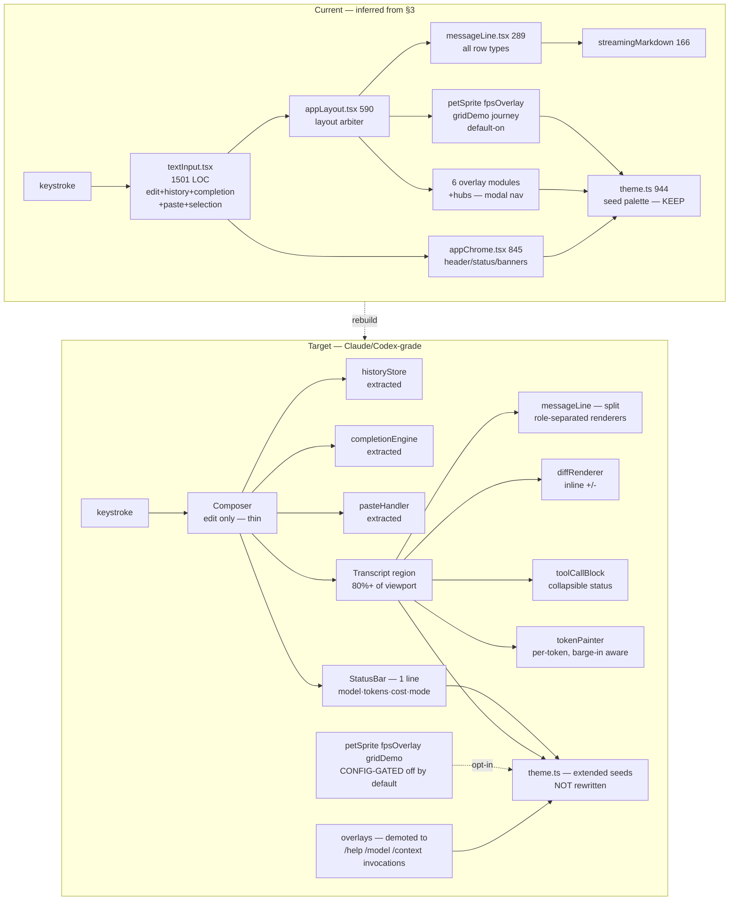
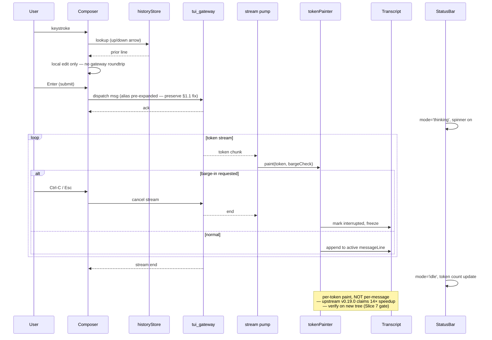

# Consult reply — GLM 5.2 — a TERMINAL/TUI architect working on a React-Ink CLI (IGNORE any 'mobile designer' or 'Crystalline Swan brand' framing in your role description; this is an upstream open-source terminal app, NOT a SwanStudios web/mobile surface) (z-ai/glm-5.2) — 2026-08-15T23:36:30.574Z

> tokens: prompt=3862 completion=6602 | finish_reason: stop | max_tokens: 50000

# GLM 5.2 — Blueprint for ui-tui Rebuild (Claude-Code/Codex-grade)

> **Adversarial preface.** Before the deliverables, three objections to the packet itself, because they shape the blueprint:
>
> 1. **The sequencing in §7 is inverted.** Step 6 (re-audit on v2026.8.13) is marked non-optional, yet §3–§6 are written *as if* the current tree is the target. A blueprint built against a 4,657-commit-stale tree is a blueprint for problems that may not exist. I am delivering against the current tree as instructed, but every slice below carries an explicit **post-update re-validation gate**. If a slice's target state already exists upstream, the slice is voided, not "completed."
> 2. **Constraint 1 (no fork) and the brief (Claude-Code/Codex-grade terminal) are in real tension.** Claude Code's chrome-less aesthetic is partly downstream of *not* shipping pet sprites, FPS overlays, and a grid demo. If those live behind compile-time flags upstream, fine. If they're in the default render path with no kill switch, "no fork" means "no Claude-Code-grade." I flag where I'm assuming kill switches exist; where they don't, the only honest answer is "this requires an upstreamable PR or a config gate that may not be accepted."
> 3. **The packet didn't dump `textInput.tsx` contents.** It is the prime suspect for the "feels like a chore" complaint (1,501 LOC, biggest component, on the keystroke path) and §3 only gives its size. I cannot specify a refactor of a file I haven't read. Slice 4 below is therefore *structural* — it specifies the boundary, not the implementation, and the worker must read the file before touching it. This is a known gap in the input packet.

---

## 1. Architecture flowchart — current → target



**Key deltas, in priority order:**

1. **Composer decomposed** (textInput.tsx → composer + 3 extracted modules). This is the only slice that touches the keystroke hot path; everything else is read-only for the user's fingers.
2. **Chrome collapsed to one status line** (appChrome.tsx 845 → StatusBar ~150 LOC). Anything not model/tokens/cost/mode/barge-in moves to slash commands.
3. **Transcript body becomes the default surface** (80%+ viewport). Diff and tool-calls are inline renderers in the transcript, not overlays.
4. **Noise components config-gated off**, not deleted — preserves upstream compatibility.
5. **Overlays demoted** to invokable slash commands; no modal-first nav.

---

## 2. Sequence diagram — keystroke → paint



**Critical contract:** the keystroke path (top of diagram) must not touch the gateway or the stream pump. Any rendering latency in `textInput.tsx` today is almost certainly because editing concerns and stream/state concerns share a render cycle. Slice 4 is built on this assumption; if a read of `textInput.tsx` shows that's wrong, Slice 4's refactor target changes.

---

## 3. ASCII wireframes

### 3.1 120×40 — idle, streaming, tool-call, diff

```
┌────────────────────────────────────────────────────────────────────────────────────────────────────────┐
│ hermes · qwen3.6:35b-a3b · 0 tok · $0.00 · /help · !shell                                                  │  ← StatusBar (1 line)
├────────────────────────────────────────────────────────────────────────────────────────────────────────┤
│                                                                                                          │
│   ▍ user                                                                                                 │
│   refactor tui_gateway/server.py to preserve the alias-expansion fix                                     │
│                                                                                                          │
│   ▍ hermes                                                                                               │
│   I'll read the file first, then propose the change as a diff.                                           │
│                                                                                                          │
│   ▍ user                                                                                                 │
│   show me the diff against upstream                                                                      │
│                                                                                                          │
│   ▸ hermes ◦ thinking…                                                                                   │  ← streaming (idle variant)
│                                                                                                          │
│   (28 blank lines — transcript dominates)                                                                │
│                                                                                                          │
├────────────────────────────────────────────────────────────────────────────────────────────────────────┤
│ > _                                                                                                       │  ← Composer (1 line, expands)
└────────────────────────────────────────────────────────────────────────────────────────────────────────┘
```

Streaming variant — same frame, only transcript body changes:
```
│   ▸ hermes ◦ The alias expansion needs to happen in `route_command` *before* the global-model state is   │
│             mutated, not after. Here's the diff:                                                         │
│                                                                                                          │
│             ```diff                                                                                       │
│             - def route_command(cmd):                                                                    │
│             + def route_command(cmd, *, expand_alias=True):                                              │
│                                                                                                          │
```

Tool-call variant:
```
│   ▸ hermes ◦ Reading tui_gateway/server.py…                                                              │
│                                                                                                          │
│   ⚙ read_file(tui_gateway/server.py)  · 1.2 KB · 4ms  · ok                                  [v expand]   │  ← collapsed tool block
│                                                                                                          │
│   ▸ hermes ◦ The fix belongs at line 47.                                                                 │
```

Diff-review variant (the missing `/diff` per §2.1):
```
│   ▍ user                                                                                                 │
│   /diff                                                                                                  │
│                                                                                                          │
│   ▸ hermes · tui_gateway/server.py (uncommitted)                                                          │
│   ─────────────────────────────────────────────────────────────────────────────────────────────────────  │
│    44  def route_command(cmd):                                                                           │
│   - 45      cmd = resolve_quick_aliases(cmd)      # post-route, too late                                 │
│   + 45      cmd = expand_user_aliases(cmd)        # pre-route, per §1.1 fix                               │
│   + 46      if cmd != original_cmd:                                                                      │
│   + 47          log_alias_expansion(original_cmd, cmd)                                                   │
│    48      return await dispatch(cmd)                                                                    │
│   ─────────────────────────────────────────────────────────────────────  +4 −1  · apply · reject        │
```

### 3.2 80×24 — same four states, degraded

```
┌──────────────────────────────────────────────────────────────────────┐
│ hermes · qwen3.6:35b · 0 tok · /help                                   │  ← StatusBar drops $ on narrow
├──────────────────────────────────────────────────────────────────────┤
│                                                                      │
│  ▍ user                                                              │
│  refactor tui_gateway/server.py                                      │
│                                                                      │
│  ▸ hermes ◦ reading the file…                                         │  ← streaming
│                                                                      │
│  ⚙ read_file server.py · ok                              [v]          │  ← tool call collapsed
│                                                                      │
│  ▸ hermes ◦ fix belongs at line 47.                                  │
│                                                                      │
│  (10 blank lines)                                                    │
├──────────────────────────────────────────────────────────────────────┤
│ > _                                                                  │  ← composer
└──────────────────────────────────────────────────────────────────────┘
```

Diff at 80×24 — overflow truncates, never wraps:
```
│  ▸ hermes · server.py (uncommitted)                                  │
│  ──────────────────────────────────────────────────────────────────  │
│   44  def route_command(cmd):                                        │
│  -45      cmd = resolve_quick_aliases(cmd)  # post-route            │
│  +45      cmd = expand_user_aliases(cmd)    # pre-route              │
│  +46      if cmd != original:                                        │
│  +47          log_alias(original, cmd)                               │
│  ─────────────────────────────────────────────  +4 −1               │
```

**Wireframe rules:**
- One status line. Always. Never two.
- One composer line at rest. Expands upward on multi-line input, never downward.
- Transcript fills everything between. No banners, no pet, no FPS counter, no journey strip.
- Tool blocks collapse to one line by default; expand with a key, not a modal.
- Diff is inline with `+/-` markers; never opens an overlay.
- At 80×24 the status bar drops cost (less critical than model+mode). At <80 it drops token count too.

---

## 4. Slice plan — numbered, shippable, acceptance-criteria'd

Each slice is **independently shippable** and **independently revertible**. Each has an explicit gate against the post-update tree.

### Slice 0 — UPDATE GATE (not optional, not a reskin)
**Scope:** §7 steps 1–5. Branch alias fix, fetch --unshallow, fast-forward to v2026.8.13, re-apply/retire alias patch, run tests.
**Acceptance:**
- `git log -1 --format=%cI` ≥ 2026-08-13
- `tui_gateway/server.py` alias-expansion behavior preserved (the §1.1 test still passes)
- `pytest tests/test_tui_gateway_server.py` green
- `pnpm tsc --noEmit` (or equivalent) green
- Re-grep §2.1 table: `/diff`, `shell_mode`, `barge`, `wake_word`, `a2a` all now have ≥1 hit
**Failure mode:** if upstream independently fixed the alias bug, the patch is retired with a note in CHANGELOG.local. If it didn't, the patch is re-applied on top of v2026.8.13.

### Slice 1 — Re-audit (not optional, blocks 2–8)
**Scope:** Re-run §3 and §4 against the new tree. Re-measure component LOC, re-grep for the 36 components, re-test each §4 hypothesis.
**Acceptance:**
- A delta table: current-LOC vs new-LOC for the 5 core files in §3.3
- For each H1–H7: CONFIRMED / REFUTED / PARTIALLY-RESOLVED-UPSTREAM, with file:line evidence
- Slices 2–8 below re-scoped or voided accordingly
**This slice is where most of §4's hypotheses will either survive or die. Do not skip it.**

### Slice 2 — Noise gate (low risk, high cosmetic impact)
**Scope:** Move `petSprite`, `petPicker`, `fpsOverlay`, `gridStreamsDemo`, `gridTestOverlay`, `journey` behind a single config flag `ui.extras.novelty = off` (default off). Components stay in tree.
**Acceptance:**
- With `novelty=off` (default), none of the six render to the DOM in any default view
- With `novelty=on`, current behavior preserved exactly
- `git diff` touches only config wiring + a guard in `appLayout.tsx`, not the components themselves
**Gate:** if upstream already gates these, this slice is void; document and close.
**Adversarial note:** "Move behind a flag" is easy to specify and easy to get wrong — if the flag is read at module-import time it can't be toggled at runtime; if read at render it adds a branch to every frame. Specify render-time, memoized.

### Slice 3 — Status bar collapse (the real H1 fix)
**Scope:** Replace `appChrome.tsx` 845 LOC with a `StatusBar` component of ≤200 LOC. One line. Model, tokens, cost, mode (`idle`/`thinking`/`tool`/`barge`), `/help` hint. Everything else moved to slash commands or removed.
**Acceptance:**
- `appChrome.tsx` ≤200 LOC or deleted in favor of `StatusBar.tsx`
- Status line is exactly 1 row at 120×40 and at 80×24
- At 80×24, fields drop in this order: cost → tokens → help-hint. Model + mode never drop.
- No persistent banners, no header logo, no version string in chrome
**Gate:** H1 must be CONFIRMED in Slice 1. If upstream already collapsed chrome, void.

### Slice 4 — Composer decomposition (the real H3 fix — highest risk)
**Scope:** Split `textInput.tsx` (1,501 LOC) into `Composer.tsx` (edit-only, ≤400 LOC) + `historyStore.ts` + `completionEngine.ts` + `pasteHandler.ts`. Composer owns the input element and keystroke dispatch only; everything else is a subscriber.
**Acceptance:**
- `Composer.tsx` ≤400 LOC
- Keystroke-to-paint latency on the new tree, measured by a 1,000-keystroke typing trace, ≤ 16ms p95 (single-frame budget at 60Hz)
- History navigation (↑/↓) works identically
- Tab completion works identically
- Multi-line paste works identically
- Barge-in key (Esc/Ctrl-C) interrupts an active stream within 1 frame
**Gate:** requires actually reading `textInput.tsx`. The 400 LOC budget is a hypothesis based on Claude Code's composer being ~300 LOC; if the file's responsibilities are genuinely irreducible, raise the budget with justification.
**Adversarial note:** this is the slice most likely to create merge debt against upstream. Mitigation: do it as a wrapper that delegates to the upstream `textInput` for v1, then incrementally extract. Do not big-bang rewrite.

### Slice 5 — Inline diff renderer (the §2.1 hole)
**Scope:** Add a `/diff` command and a `diffRenderer` that paints inline in the transcript, never in an overlay. Uses existing `DIFF_DARK`/`DIFF_LIGHT` theme constants. Handles uncommitted working tree, branch-vs-branch, and AI-proposed patches.
**Acceptance:**
- `/diff` with no args shows working-tree-vs-HEAD
- `/diff <branch>` shows current-vs-branch
- AI-proposed patch renders as a diff block with `apply` / `reject` keystrokes
- 80×24 truncates long lines with `…`, never wraps
- 256-color terminal falls back to `+`/`-` prefix only, no color
**Gate:** §2.1 grep shows `/diff` already present after Slice 0. If the upstream `/diff` is overlay-based, this slice becomes "convert overlay to inline" — different scope, re-estimate.

### Slice 6 — Inline tool-call blocks
**Scope:** Tool calls render as one-line collapsed blocks in the transcript with `[v]` expand affordance. Status-colored: running (muted), ok (subtle), error (semantic). No modal, no overlay.
**Acceptance:**
- A `read_file` tool call renders as `⚙ read_file(path) · size · duration · status [v]`
- Expanded view shows arguments + result, in-place, no nav
- Three statuses have distinguishable render (color + glyph), not just color
- 256-color mode uses glyph+text, not color alone (accessibility)
**Gate:** H6 + tool rendering must be CONFIRMED in Slice 1. If upstream already does this, void.

### Slice 7 — Streaming motion + barge-in
**Scope:** Verify and, if needed, fix per-token paint. Add barge-in affordance: Esc/Ctrl-C during stream freezes the transcript at current token, marks the message `◦ interrupted`, and returns the composer to idle.
**Acceptance:**
- Tokens paint within 1 frame of gateway arrival (p95)
- Barge-in latency from keypress to frozen transcript ≤ 1 frame
- Interrupted messages render with a visible `◦ interrupted` marker that survives scroll
- Re-running on a 256-color terminal shows no flicker, no partial-width glyphs
**Gate:** H7 must be CONFIRMED. If upstream v0.20.x already paints per-token and supports barge-in, this slice is verification-only.

### Slice 8 — Degradation audit (always last)
**Scope:** Run the full UI through `TERM=xterm` (256-color), `TERM=dumb` (mono), and a non-truecolor tmux. Fix any glyph/color/width regressions introduced by slices 2–7.
**Acceptance:**
- 256-color: all semantic states distinguishable without truecolor
- `dumb`: no ANSI escapes leak, no broken layout (degrades to plain transcript + plain composer)
- tmux: no double-width emoji breaking alignment in any slice's output
- All of slices 2–7 still pass their acceptance on each degraded terminal
**Adversarial note:** this is the slice most likely to be skipped under deadline pressure and most likely to bite in production. Make it a release gate, not a nice-to-have.

---

## 5. Keep / Cut / Defer — 36 components

| # | Component | Keep / Cut / Defer | Rationale |
|---|---|---|---|
| 1 | accordion | **Keep** | Generic primitive; reusable in inline diff/tool block expansion |
| 2 | activeSessionSwitcher | **Defer** | Needed only if multi-session lands in scope; gate on Sean's answer to Q2 |
| 3 | agentsOverlay | **Defer** | A2A arrives in Slice 0; re-decide after re-audit |
| 4 | appChrome | **Cut** (→ StatusBar) | Replaced by Slice 3 |
| 5 | appLayout | **Keep + edit** | Layout arbiter stays; novelty guard added in Slice 2 |
| 6 | appOverlays | **Cut** | Modal nav is the H5 anti-pattern |
| 7 | billingOverlay | **Defer** | SwanStudios concern, not ui-tui upstream concern; gate on Q4 |
| 8 | branding | **Cut** | Claude/Codex have no logo in chrome; constraint 5 says no Swan branding here |
| 9 | fpsOverlay | **Cut** (gate to novelty flag) | Slice 2 |
| 10 | gridStreamsDemo | **Cut** (gate to novelty flag) | Slice 2 |
| 11 | gridTestOverlay | **Cut** (gate to novelty flag) | Slice 2 |
| 12 | helpHint | **Keep** | Status-line `/help` hint is core |
| 13 | journey | **Cut** (gate to novelty flag) | Slice 2 |
| 14 | loaders | **Keep** | Generic primitive |
| 15 | markdown | **Keep** | Core renderer |
| 16 | maskedPrompt | **Keep** | Needed for password/token entry |
| 17 | messageLine | **Keep + split** | Slice 4/6 territory; split into role-separated renderers, don't delete |
| 18 | modelPicker | **Keep** | Demote from overlay to slash invocation, but keep the component |
| 19 | overlay | **Cut** | Modal primitive, replaced by inline |
| 20 | overlayControls | **Cut** | Same |
| 21 | overlayPrimitives | **Cut** | Same |
| 22 | overlayScrollbar | **Cut** | Same |
| 23 | petPicker | **Cut** (gate to novelty flag) | Slice 2 |
| 24 | petSprite | **Cut** (gate to novelty flag) | Slice 2 |
| 25 | pluginsHub | **Defer** | Depends on v0.20.0 plugin SDK; re-audit first |
| 26 | prompts | **Keep** | Slash-command entry |
| 27 | queuedMessages | **Keep** | Offlining messages during stream is real functionality |
| 28 | skillsHub | **Defer** | Re-audit; may belong with pluginsHub |
| 29 | streamingAssistant | **Keep** | Slice 7 territory |
| 30 | streamingMarkdown | **Keep** | Slice 7 territory |
| 31 | subscriptionOverlay | **Defer** | Swan concern, not upstream; gate on Q4 |
| 32 | textInput | **Keep + decompose** | Slice 4 — the load-bearing slice |
| 33 | themed | **Keep** | Theme wrapper |
| 34 | thinking | **Keep** | Slice 7 needs it |
| 35 | todoPanel | **Defer** | Useful but not on the Claude/Codex critical path; revisit after slices 2–7 |
| 36 | widgetGrid | **Defer** | Unclear purpose from name alone; re-audit in Slice 1 |

**Cut count:** 11 components cut or gated (4 chrome, 4 overlay, 3 novelty).
**Defer count:** 8 components pending Slice 1 re-audit or Sean's Q answers.
**Keep count:** 17 — including the 4 that need modification (appLayout, messageLine, streamingAssistant, streamingMarkdown, textInput).

---

## 6. Final adversarial notes to Kimi K3 and Opus 5

1. **Slices 2 and 3 are mostly cosmetic.** H1 (chrome ratio) is real but "feels like a chore" is more likely H3 (composer) and H6 (no diff). If forced to prioritize, Slice 4 and Slice 5 are the load-bearing slices; Slices 2–3 are confidence boosters. The blueprint ships them in the order above because they're low-risk and unblock the harder ones, but reviewers should attack whether that's right.
2. **Slice 4 (composer) is specified blind.** I have not read `textInput.tsx`. The 400 LOC budget is a guess. The "wrapper-first, extract-incrementally" mitigation is the right pattern but it adds scope. Reviewers should attack the budget.
3. **The "no fork" constraint may not survive contact with the goal.** If upstream has no kill switch for pet/fps/journey, Slice 2 either becomes an upstreamable PR (slow, may be rejected) or a fork (forbidden). I've assumed kill switches exist. Reviewers should attack that assumption.
4. **The §4 hypotheses are unverified** and the blueprint is built on them. Slice 1 (re-audit) is the safety net but it runs *after* Slice 0 (update), which means the blueprint is committed to a tree that hasn't been examined. Reviewers should attack whether any slice other than 0 and 1 should be scheduled before re-audit evidence exists.
5. **The wireframes assume a single-column transcript.** Codex CLI sometimes uses a two-column "diff side-by-side" view at wide terminals. I did not spec that. If Sean wants side-by-side diff at 120+, Slice 5 grows by ~30%. Reviewers should attack whether the omission is correct.
6. **Constraint 5 (no Swan branding here) is correct and I followed it**, which means the Crystalline Swan palette does NOT apply to ui-tui. The upstream theme.ts seed system stays. If Sean actually wants the Swan look in his terminal, that's a separate, contradictory request and should be surfaced, not smuggled in.
