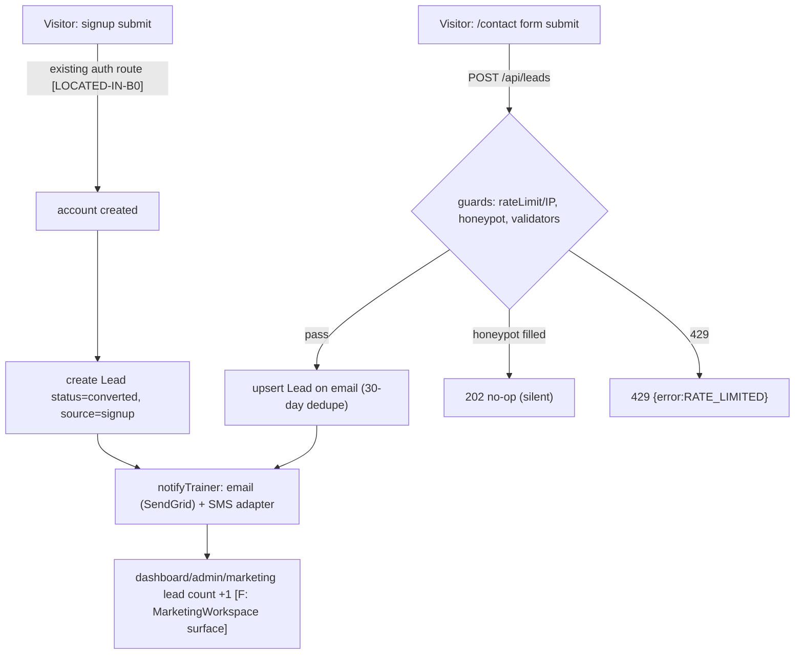
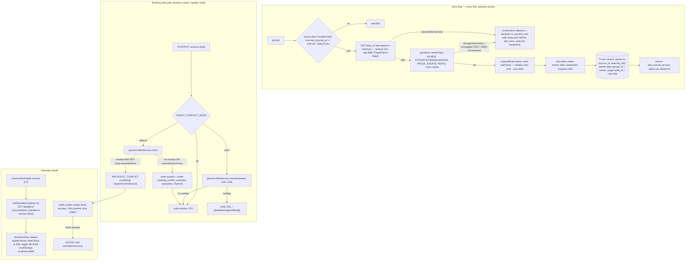
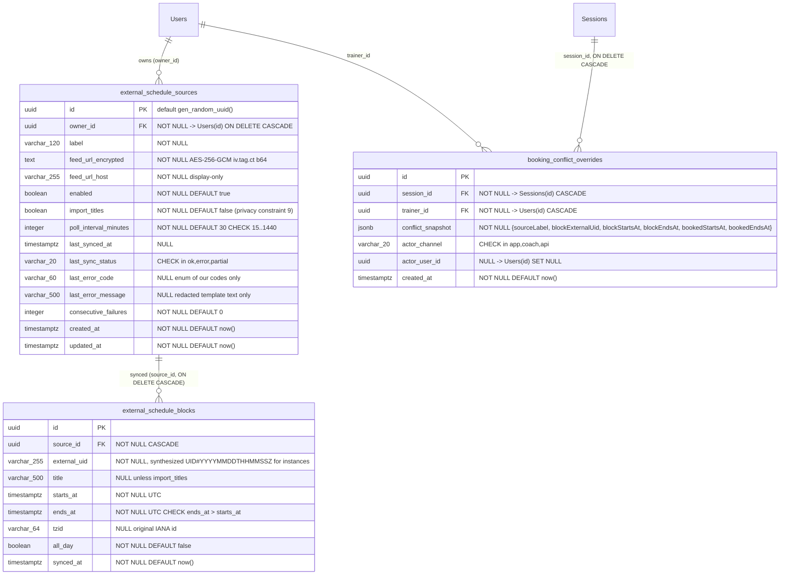

# GLM Consult

**Requested:** `glm-5.3`
**Served:** `glm-5.3`
**Document:** (path redacted; packet digest is recorded by consult-panel.mjs)
**Tokens:** 4031 in / 34000 out (reasoning: 21115) | total 38031
**Wall:** 1053.7s

---

> ⚠ **INCOMPLETE** — the model hit max_tokens (34000).

# GLM-5.3 — ARCHITECT DELIVERABLE, SWANSTUDIOS MONEY LANE

**Grounding legend:** `[F#]` = verified fact from §2. `[NEW]` = file/endpoint/table that does not exist yet; every such path is created by a slice. `[ASSUMPTION]` = not verified tonight; each is paired with the audit slice that confirms or corrects it, and the blueprint is written so a one-line correction fills it in. `[LOCATED-IN-C0/D0/B0]` = the artifact exists but its path is unverified; the audit slice pins it before any code depends on it. This is the mechanism §3 demands: unknowns stay fill-in-able, never assumed-away.

---

# DELIVERABLE 1 — REVIEW OF FABLE'S NINE FINDINGS

| # | Verdict | One line |
|---|---|---|
| H1 | **AGREE** (under-specified) | Revenue-first is right; Fable never names the second-fastest money item (lead capture) or a money canary. |
| H2 | **AGREE** (under-specified) | Also unproven: checkout → webhook → fulfillment. Schema-green ≠ money-green. |
| H3 | **AGREE, all five** (incomplete) | Four more defects exist: sync churn, unbounded expansion/self-DOS, multi-trainer scoping, unmapped-TZID policy. |
| H4 | **AGREE** (under-specified) | Idempotency right; Fable designed no notify rail, no relay-token misuse model, no PII-free Telegram text. |
| H5 | **AGREE** | Plus: Coach is only auto-protected if it writes through the standard session path — must be verified, not assumed. |
| H6 | **AGREE** | Out of the SwanStudios money lane; consequence stated plainly below; deliberately not designed here. |
| H7 | **AGREE** | Plus: miniswan is *unused* by C/D; policy is sleep-not-shutdown because WoL-from-S5 is unproven [F16]. |
| H8 | **AGREE** (under-specified) | Add ETag/Last-Modified, backoff, circuit-breaker, jitter, identifying UA. |
| H9 | **AGREE** (under-specified) | The audit must also pin: Users.id type, trainer role values, frontend test runner, and Coach's write path. |

## H1 — AGREE, with two extensions

Fable is right that U1 is the only item that can be a **100% conversion leak for logged-in clients** — nothing else in the packet can be silently destroying every purchase today. F3 proves only the 401 guard [F3]; the memory records an authenticated 500 with **zero observability**, and nobody has reproduced it. That combination (total-leak potential × no diagnostics × never reproduced) justifies blocker rank.

**What Fable missed:**

1. **"Sequence revenue-first" is stated but never instantiated.** Fable names no second money item. The fastest *new*-money item in the packet is not C or D — it is B's lead-capture gap: the contact form exists, the `Lead` model exists, and the wire between them does not. That is hours of work recovering leads that are being discarded daily. My build order (Deliverable 2) puts it second.
2. **No money canary.** Even after U1 is fixed, nothing detects the *next* authenticated 500. A daily authenticated cart-lifecycle probe is cheap and converts U1 from an incident into a non-event.

## H2 — AGREE, with one extension

F1/F2 prove referential integrity of the schema; they say nothing about the runtime path. **Also unproven: the webhook → order/fulfillment chain.** A purchase that pays but never fulfills is worse than a 500 — it produces chargebacks. The acceptance test for A must therefore be *staged*: (1) authenticated cart lifecycle green, (2) processor identified `[LOCATED-IN-A0]`, (3) sandbox purchase end-to-end if the processor's test mode exists `[ASSUMPTION]`.

## H3 — AGREE on all five; four defects Fable missed

(a)–(e) all stand. Specifics I ratify and harden:

- **(a) RRULE** — correct, and I add the fail-safe semantics Fable left open: when the parser meets an unsupported RRULE token (BYSETPOS, BYWEEKNO, BYYEARDAY, BYMONTHDAY, BYMONTH), it must **not** silently import only the first occurrence (the exact empty-calendar defect) nor silently skip. It must abort the sync for that source, **keep the previous block set intact**, and set `last_error_code='RRULE_UNSUPPORTED'` surfaced in the UI. v1 supports `FREQ=DAILY|WEEKLY`, `INTERVAL`, `BYDAY` (weekly), `COUNT`, `UNTIL` — which covers MindBody shift patterns [F11]. Expansion is implemented on luxon, **not rrule.js**, because rrule.js does UTC-arithmetic on recurrences that RFC 5545 defines in local wall-time — it is wrong across DST by construction, which would re-introduce defect (b) while fixing (a).
- **(b) Timezone** — correct. Decision made below: expand in the event's `TZID` (VTIMEZONE mapped to IANA), store UTC `timestamptz`, retain the original `tzid` column so future re-syncs can rebase. Floating times (no TZID) interpret in the trainer's timezone. Unmappable TZID = source error `UNMAPPED_TZID`, fail-safe keep previous.
- **(c) Server-side check** — correct, and the check keys on `trainerId` [F9], not `userId`: the session's *client* is `userId`; the person double-booked is the trainer. The check runs inside the same request as the write, at every write path: session create, session update/reschedule, and `BulkSessionCreator` if it writes directly `[LOCATED-IN-C0]`. "Warn, not block" is preserved as a **soft gate**: first submission without acknowledgment returns `409 GHOST_CONFLICT`; re-submission with `overrideGhost:true` proceeds and writes the audit row. Any API caller can proceed; nobody can proceed *unwittingly*.
- **(d) Audit trail** — correct; implemented as `booking_conflict_overrides` with a **JSONB snapshot** (deliberately *not* FK'd to the block — blocks are volatile derived data deleted on every re-sync; an FK would cascade-delete audit history or fail).
- **(e) Feed URL as capability secret** — correct; AES-256-GCM at rest, `feedUrlHost` + boolean returned to the UI, never the URL; `last_error_message` is redacted **by construction** (only our own error codes + whitelisted message templates are ever written, never raw parser/HTTP error text, which can embed the URL).

**Missed defects:**

- **(f) Sync churn.** Delete-and-reinsert per sync causes calendar flicker and ID churn that breaks the override audit linkage. Guard: upsert on `(source_id, external_uid)`, delete only rows whose `synced_at` predates this sync's start, in one transaction per source.
- **(g) Unbounded expansion / self-DOS.** A feed with `FREQ=DAILY;COUNT=1000000` or a 50 MB body can wedge the dyno. Guards: 2 MB body cap, 15 s timeout, 5,000-occurrence cap per source per sync (abort + fail-safe on exceed).
- **(h) Multi-trainer scoping.** Fable's schema has `owner` but never states that *every* query — sync due-check, blocks read, conflict check — filters by owner/trainer. Sean's B2B2C framing makes this load-bearing: one trainer's gym feed must never appear on another trainer's calendar. All three queries are owner-scoped by specification below.
- **(i) Duplicate-job risk on Render.** If the service ever scales past one instance, two sync loops double-poll and race. Guard: `pg_try_advisory_lock(hashtext('ghost-sync'))` around each sync pass.

## H4 — AGREE, with three extensions

One approval record, idempotent, Hermes-as-relay: all correct. The mechanism is simpler and stronger than Fable states: **idempotency on the draft's own state machine** — `UPDATE ... WHERE id=$1 AND status='pending_approval'`. First writer wins; the second caller (app or Telegram, in any order, any race) gets the *same final state* back with `alreadyApplied:true`. No separate key table, no double-send, no lock choreography.

**What Fable missed:**

1. **The notify rail is undesigned.** "Text and email" — email rides existing SendGrid infrastructure (SPF includes sendgrid.net [F12]) `[ASSUMPTION: key/sender env names — D0]`. **No SMS provider exists anywhere in the packet.** Blueprint ships an adapter interface with a no-op SMS adapter that logs, plus a UI-visible "SMS not configured" badge — so the rail is honest, and the only Sean-decision is approving the spend (Open Question 1).
2. **The relay token is itself a send capability.** If Hermes is compromised, an attacker can approve pending drafts → send to Sean's clients. Guards: token scoped to exactly two internal endpoints (create-draft, decide), decisions only valid on drafts in `pending_approval` **and** `notified_at` within 48 h (an approval must be tethered to a real outbound notification — stale-draft replay dies), 30/hour rate limit, full audit with channel, anomaly alert at >5 decisions/hour, rotation runbook.
3. **Telegram text must be PII-free** (Constraint 5 applies to *every* external channel in the doctrine, and Telegram is external). Spec: `Draft {shortId} · {kind} · client #{clientId} — approve?` with Approve/Reject buttons and a View deep-link. Message body never leaves SwanStudios except to the final recipient.

## H5 — AGREE

`schedule_session` is recorded broken (U2) and must not be load-bearing for anything until fixed. Extension: C's conflict check lives server-side in the write path, so Coach inherits protection **only if** Coach books through the standard session API rather than direct DB writes — this is a C0 audit item, not an assumption.

## H6 — AGREE; explicitly deferred

The 5090↔miniswan vault transport is real work with real failure modes and is **not in the SwanStudios money lane**. Consequence stated plainly as the packet requires: **miniswan has no memory when the 5090 is off; nothing in C or D depends on either machine.** This blueprint neither designs nor blocks on H6. D's relay contract is written so Hermes can run anywhere (including its current 5090 host) — the only requirement is outbound HTTPS.

## H7 — AGREE

With MindBody consumed via subscribable iCal [F11], nothing in A/B/C/D needs a GPU awake. miniswan receives **zero changes** from this blueprint. Policy recorded for whoever eventually uses it: sleep-not-shutdown (WoL-from-S5 unproven [F16]); if a wake schedule is ever needed, Task Scheduler "wake to run" is the pattern — not needed now.

## H8 — AGREE, hardened

Subscribable link polled at calendar-client cadence is the vendor's intended use. Additions: per-source interval 15–1440 min (default 30) **plus 0–5 min jitter** to avoid thundering syncs; honor `ETag`/`Last-Modified` with `If-None-Match`/`If-Modified-Since` when the origin provides them; exponential backoff on failure (2ⁿ, cap 60 min, via `consecutive_failures`); circuit-break surfaced in UI after 3 consecutive failures with an email alert to the trainer; `User-Agent: SwanStudios-GhostSync/1.0 (+https://sswanstudios.com)`. Also the setup gotcha from F11 the plan must carry into UI copy: **the link cannot be generated from a MindBody owner account** — instructions tell the trainer to generate it from a staff login, per location.

## H9 — AGREE, scope extended

The audit is read-only, additive-only-integration, and must pin exactly: (1) the session **create/update** route files and the write path inside `BulkSessionCreator` `[LOCATED-IN-C0]`; (2) the exact API UMS calls to read the calendar (so the ghost fetch parallels it); (3) blocked-time flow end-to-end [F6]; (4) how UMS formats `sessionDate` for display (UTC per F9 — where local conversion happens); (5) `schedule_session` live semantics (U2); plus three Fable omitted: **(6) `Users.id` data type** (every FK below depends on it), **(7) the trainer-role values** the auth guard checks, **(8) the frontend test runner** (component prove-commands depend on it). Output is a committed doc with file:line anchors; no refactors.

---

## Absence-first gap analysis — what the entire plan is missing, ranked by money left on the table

1. **No end-to-end money canary.** Nothing in A–D would detect the *next* checkout break. A daily authenticated probe of the purchase path (and, once the processor is identified `[LOCATED-IN-A0]`, a sandbox purchase) converts U1-class failures from week-long bleeds into alerts. *Highest value per line of code in this packet.*
2. **No error observability baseline on money paths.** U1's handler logs nothing — and it is probably not the only one. Structured `{route, userId, status, message, stack}` logging with a PII allowlist on `/api/cart*`, `/api/sessions*`, `/api/leads*` is a precondition for *every* fix in this plan. Fable's H1 implies it; nobody schedules it.
3. **B's lead-capture gap is unsequenced.** Fable demands revenue-first ordering and then never schedules the cheapest new-revenue item (contact form + signup → `Lead` + instant notification to Sean). Every day unwired = leads discarded.
4. **No webhook idempotency / reconciliation story.** Dropped webhooks create paid-but-unfulfilled orders — refunds, chargebacks, and the worst possible word-of-mouth for a trainer going independent. `[LOCATED-IN-A0]` identifies the processor; reconciliation is then a bounded job.
5. **No rollback runbooks or pre-migration backups.** Constraint 7 demands reversibility; the plan never says *when* the reverse runs (answer: `pg_dump` before every production migrate; undo-script proven locally first — baked into every slice below).
6. **No multi-instance job guard.** Render scaling horizontally would double-run the sync loop, the draft-expiry loop, and the canary. `pg_try_advisory_lock` guards all three.
7. **No notification-trust guards for D.** Unbatched per-draft text+email while Sean is on the gym floor trains him to ignore approvals — which silently kills the whole rail. Cooldown (10 min resend), quiet hours (default 08:00–20:00 trainer-local, queued not dropped), and a daily digest option are guards, not niceties.
8. **Privacy implementation is a bullet point, not a mechanism.** Constraint 9 needs: title discard by default, `import_titles` explicit per-source opt-in, retention purge of blocks outside the window (data minimization *is* the retention policy), and the B2B2C default locked to times-only. Specified below, tested below.
9. **No success metrics.** "Make this shit crack" is unverifiable without four numbers: completed purchases/week, leads captured/week (and lead→trial rate), double-book incidents (target: 0 — sourced from `booking_conflict_overrides`), approval median latency (created→sent). All computable from tables in this blueprint; no analytics vendor.
10. **No iCal fixture corpus.** The RRULE fixture alone doesn't cover hostile inputs: `EXDATE` in a different TZID than `DTSTART`, `STATUS:CANCELLED`, `RDATE`, folded lines (RFC 5545 line folding), all-day events, unmapped `TZID`, oversized bodies. Full corpus specified in C's test matrix.
11. **No staging parity procedure.** Every migration below proves forward+reverse on a local PostgreSQL 16 with the production schema snapshot before production. Stated as a gate, not advice.

---

# DELIVERABLE 2 — BUILD ORDER (REVENUE-FIRST)

| Order | Item | Why here | Revenue effect | Ship gate |
|---|---|---|---|---|
| 1 | **A0–A2: U1 repro → observability → fix → canary** | Only item that can be blocking *all* logged-in purchases; smallest scope; unblocks truth about the money path | Stops a 100% leak | Canary green 3 days running |
| 2 | **B0–B3: lead capture (contact + signup → `Lead` + notify Sean)** | Fastest *new* money in the packet; every day delayed = leads discarded; no schema risk | Creates pipeline | Lead row + notification verified end-to-end |
| 3 | **C0–C8: Ghost Schedule** | Protects existing paying clients (a double-book during his transition is a refund + reputation event at the worst possible time) and unlocks Sean taking more clients confidently; fully self-contained in SwanStudios — no new credentials, no cross-boundary work | Prevents loss; enables capacity | 24 h in `warn` mode, then `enforce`; DST fixture green |
| 4 | **D0–D7: Approval bridge** | Time leverage + retention (timely client comms = renewal LTV); requires SMS decision + Hermes relay = most moving parts, so it earns the fourth slot despite high value | Multiplies capacity/retention | App-approval door live before Telegram door |
| 5 | **B-rest: drip scheduler, email list, AI panels** | Real, but new-money-*later*; AI panels depend on H6 transport which is explicitly undesigned | Compounding, not immediate | After money lane |

**Where I overrule Fable's implicit ordering, and why:** Fable's H1 says "revenue-first" and stops at A. Inserting B-lead at #2 is the correction — fixing the checkout defends existing conversion; lead capture *adds* revenue the same week. C before D because C is single-system, zero external credentials, and protects revenue Sean already depends on, while D's Telegram door requires a relay deployment on a second machine plus a Sean spend decision. If Sean's daily felt pain says otherwise, he can swap 3 and 4 — both blueprints are independent by construction.

---

# DELIVERABLE 3 — BLUEPRINT A: PURCHASE PATH (U1)

**Scope:** reproduce U1 with a real authenticated session; instrument before fixing; fix per a pre-written diagnosis table; install a daily canary. No new tables, no new UI. (Flowchart: yes. ERD: none — no new tables, by design. Wireframes: none — no UI change.)

## A.1 Runtime flow

```mermaid
flowchart TD
  subgraph A0["A0 — Reproduce (prod, test account)"]
    R1["backend/scripts/repro-cart500.mjs [NEW]"] -->|"login (env creds)"| R2["GET /api/cart (authenticated)"]
    R2 --> R3{"status?"}
    R3 -->|"200"| R4["repeat: POST /api/cart/add, PUT, DELETE"]
    R3 -->|"500"| R5["capture stack via NEW error middleware"]
  end
  subgraph A1["A1 — Observability then fix"]
    O1["errorHandler on cart router [F4 file]"] --> O2["log {route, userId, status, message, stack} — PII allowlist"]
    O2 --> F1a{"diagnosis table §A.4"}
    F1a -->|"D-1 assoc/type"| X1["align Cart user FK to Users.id type"]
    F1a -->|"D-2 missing row"| X2["upsert cart on ensureNumericCartUser"]
    F1a -->|"D-3 serializer"| X3["fix response transform"]
  end
  subgraph A2["A2 — Canary (daily, advisory-locked)"]
    C1["login as canary account"] --> C2["GET products, GET /api/cart, add, update, remove"]
    C2 --> C3{"all 2xx?"}
    C3 -->|"no"| C4["email Sean + log MONEY_CANARY_RED"]
    C3 -->|"yes"| C5["record pass row"]
  end
```



## A.2 API surface touched

No new endpoints. Existing verified surface [F3, F4]: `GET /api/cart`, `POST /api/cart/add`, `PUT /api/cart/update/:itemId`, `DELETE /api/cart/remove/:itemId`, `POST /api/checkout`, `POST /api/webhook`. Guard chain on `/add` is `protect, cartMutationLimiter, ensureNumericCartUser, validatePurchaseRole` [F4].

**New error response shape (uniform, added by middleware):**
```json
// 500 from any /api/cart* route — body unchanged for the client, PLUS server log line:
{ "error": "CART_INTERNAL", "requestId": "req_01H…" }
// log: {"route":"POST /api/cart/add","userId":"<uuid>","status":500,
//       "message":"<err.message>","stack":"<err.stack>","requestId":"req_01H…"}
```
`requestId` is echoed, so a Sean screenshot maps to a log line. Message/stack never logged for 4xx; `message` is allowlisted to `err.message` only (no request body — bodies can hold PII).

## A.3 Migration

**None.** If diagnosis D-1 (below) requires a type alignment, the migration is written as C1-style reversible SQL (pattern provided in C.6) with the same pre-dump gate — but it does not exist until A0 produces the stack. This is the §3-compliant design: the unknown (U1) is resolved by execution, and the remediation for each branch is pre-specified so A1 involves zero new decisions.

## A.4 Diagnosis table (pre-written remediations)

| ID | Probable root cause | Evidence signature in stack | Exact remediation |
|---|---|---|---|
| D-1 | Cart user association type mismatch (the `ensureNumericCartUser` name [F4] suggests cart rows were built for a numeric user id; Users canonicalization [F1/F2] may have left the cart table behind) | Sequelize `ECONN`-style cast error (`invalid input syntax for type uuid` / `integer out of range`) on a `WHERE "userId" = …` against cart table | Reversible migration altering the cart table's user FK column to match `Users.id` type (pattern: C.6 SQL, FK target quoted `"Users"`), with pre-migration `pg_dump` of that table |
| D-2 | Authenticated user has no cart row; handler assumes one | `Cannot read properties of null (reading …)` | Upsert inside `ensureNumericCartUser` (find-or-create cart for user before continue) |
| D-3 | Response serializer chokes on populated cart (null package, missing include) | TypeError inside a `toJSON`/transform function | Fix transform to null-guard; unit test with fully-populated and minimal cart fixtures |

If the stack matches none, the diagnosis table gains a row *from the stack itself* — the table is the decision record, not a limit.

## A.5 Slices

**A0 — Reproduce + instrument (ships first, alone).**
Files: `backend/scripts/repro-cart500.mjs` `[NEW]` (~120 lines); modify `backend/routes/cartRoutes.mjs` [F4 path] to attach the error middleware (~25 lines added).
Acceptance: running the repro on production with `CART_TEST_EMAIL`/`CART_TEST_PASSWORD` env yields 200s for the full lifecycle, or a captured stack in logs with a `requestId`.
Prove: `node backend/scripts/repro-cart500.mjs --host https://sswanstudios.com` then `node backend/scripts/repro-cart500.mjs --host https://sswanstudios.com --role client` (runs both an admin-role and client-role account; D-3-class bugs are role-dependent).

**A1 — Fix per diagnosis table.**
Files: per remediation row above.
Acceptance: A0 repro green for **both roles**, twice consecutively (fresh logins — per U1's own note that a stale session masks it).
Prove: same command as A0, exit code 0.

**A2 — Money canary.**
Files: `backend/core/jobs/moneyCanaryJob.mjs` `[NEW]`; row sink `backend/scripts/money-canary-report.mjs` `[NEW]`.
Acceptance: daily advisory-locked run; any non-2xx on the lifecycle emails Sean via the SendGrid adapter from D.2 (if D.2 not yet shipped, logs `MONEY_CANARY_RED` loudly — belt and suspenders).
Prove: `node backend/core/jobs/moneyCanaryJob.mjs --once` locally against staging creds; grep log for `MONEY_CANARY_GREEN`.

## A.6 Test matrix

| File `[NEW]` | Asserts | Fixture |
|---|---|---|
| `backend/scripts/repro-cart500.mjs` (self-check mode `--selftest`) | Script's own HTTP+assert helpers work against a mock server | Inline mock (30 lines) |
| `backend/core/jobs/moneyCanaryJob.test.mjs` | Canary marks red on first non-2xx; green on all-2xx; advisory lock prevents double-run | Mock fetch returning 500 for `GET /api/cart` |
| `backend/middleware/__tests__/errorHandler.test.mjs` | 500 → log line contains route/userId/status/stack; 4xx → no stack logged; body carries `requestId` | Throwing handler stub |

## A.7 Failure modes & guards

1. **Fix is role- or product-specific** (green for admin, red for client role, or green for package A only) → guard: repro matrix runs both roles × two products; canary rotates product choice daily.
2. **Observability leaks PII into logs** → guard: serializer allowlist (route, userId, status, message, stack, requestId only); test asserts request bodies never appear.
3. **D-1 migration touches live cart rows** → guards: pre-dump `pg_dump --table <cart>`; bounded batch updates (5,000/tx); forward+reverse proven locally first; deploy in a low-traffic window per runbook `docs/runbooks/money-path.md` `[NEW]`.
4. **Canary account pollutes real data** → guard: canary uses a dedicated flagged account; canary cart cleared at end of run; canary never calls `/checkout` until a processor sandbox is confirmed `[LOCATED-IN-A0]`.

---

# DELIVERABLE 3 — BLUEPRINT B (LEAD-CAPTURE SLICE): STOP DISCARDING LEADS

**Scope:** the two money-touching gaps only — public touchpoints create `Lead` rows + Sean is notified instantly. Drip scheduler, social, AI panels, email list = B-rest, later, per build order. ERD: none (`Lead` model exists per audit doc; B0 confirms columns; if `source`/`status` columns are missing, B1 adds them via the reversible pattern in C.6). Wireframes: none — no new UI; existing contact form and signup flow are rewired, existing admin CRM surfaces the rows.

## B.1 Runtime flow



## B.2 API contract

`POST /api/leads` — public. Guard chain: `leadLimiter` `[NEW]` (10/IP/hour) → validators.
Request: `{ name: string(1..120), email: string(email), phone?: string(7..20), message?: string(0..2000), source: 'contact_form', hp: string (honeypot, normally empty) }`
Responses:
- `202 {"ok":true}` — accepted (also returned for honeypot hits, silently discarded server-side)
- `400 {"error":"VALIDATION","fields":["email"]}` · `429 {"error":"RATE_LIMITED"}`
Notify email to trainer (Sean's account email): subject `New lead — {name} ({source})`, body: name, email, phone, message, link to the marketing workspace lead view.

## B.3 Slices

**B0 — Audit.** Locate: contact form component + its current submit handler; signup route; `Lead` model columns; whether a `source` column exists. Doc: `docs/audit/LEAD-CAPTURE-B0.md` `[NEW]`. Prove: the grep/psql commands' outputs committed in the doc.
**B1 — `POST /api/leads` + notify.** Files: `backend/routes/leadRoutes.mjs` `[NEW]` mounted in `backend/core/routes.mjs` [F4 mount file], `backend/core/services/leadService.mjs` `[NEW]`, tests. Prove: `bash backend/scripts/smoke-leads.sh` (curl → 202 → psql count → email received).
**B2 — Signup conversion + source attribution.** Modify signup handler `[LOCATED-IN-B0]` to create the converted Lead. Prove: signup via curl → Lead row `status='converted'`.
**B3 — Coverage + abuse tests.** Prove: `node --test backend/core/services/leadService.test.mjs`.

## B.4 Test matrix & failure modes

Tests: honeypot hit discards; dedupe upserts (same email within 30 d increments `touchCount` `[ASSUMPTION column — B0; if absent, B1 adds via reversible migration]`); rate limit trips at 11th request. **Failure modes:** (1) bot flood → honeypot + IP limiter + 2,000-char cap; (2) notification email lands in spam → SPF/SendGrid alignment exists [F12], bounce logging in adapter, fallback in-app badge; (3) only one of several public forms wired → B0 inventory grep is the gate, coverage test asserts every `source` enum value has a wired touchpoint.

---

# DELIVERABLE 3 — BLUEPRINT C: GHOST SCHEDULE (FULL)

## C.0 Design ratification and decisions (all made here; none left to the builder)

1. **Separate tables, not `Session.isBlocked` rows** — Fable is right and I ratify with the stronger arguments: (i) ghost rows are derived data re-synced wholesale — a delete cursor over `Session` is one parser bug from deleting a paying client's booking; (ii) `Session.status` carries a validator (`SESSION_STATUSES` [F9]) — polluting a shared enum for a non-session concept couples every future status migration to gym shifts; (iii) sync churn (H3-f) would hammer the Sessions table hourly.
2. **UTC `timestamptz` storage**, original `tzid` retained per block; expansion in the event's TZID via luxon; floating times = trainer-local `[ASSUMPTION: trainer timezone column/source — C0; if Users has no tz column, default env GHOST_TZ_DEFAULT=America/Los_Angeles pending Sean's answer in Open Questions]`.
3. **Conflict = soft gate:** `409 GHOST_CONFLICT` without `overrideGhost:true`; with the flag, proceed + audit row. Kill-switch env `GHOST_CONFLICT_MODE=off|warn|enforce` (rollout: 24 h in `warn`, then `enforce`).
4. **Overlap semantics:** `block.starts_at < req.end AND block.ends_at > req.start` — touching endpoints (block ends 10:00, booking starts 10:00) is **not** a conflict. Tested.
5. **Privacy defaults:** titles discarded unless per-source `import_titles=true`; UI renders "Busy" for untitled blocks; retention purge deletes blocks with `ends_at < now() - 30 days` on every sync (minimization by construction).
6. **Synthesized UIDs for recurrence instances:** `${UID}#<RECURRENCE-START-UTC-compact>` — stable across syncs, so upserts don't churn.
7. **Job loop:** in-process `setInterval(60s)` due-check (Render single web process) + `pg_try_advisory_lock` guard. No new scheduler dependency — that's B-rest's problem, solved once, properly.
8. **Toggle:** per-device `localStorage['ss.ghost.visible']` (default `true`). No schema, no API — v1 product decision made; noted as revisitable when multi-trainer viewer roles exist.

## C.1 Mermaid — runtime flow



## C.2 Mermaid — ERD


Unique constraints: `external_schedule_sources(owner_id, label)`; `external_schedule_blocks(source_id, external_uid)`. Indexes: `ghost_sources_owner_idx(owner_id)`; `ghost_blocks_source_start_idx(source_id, starts_at)`; `ghost_blocks_source_end_idx(source_id, ends_at)`; `ghost_blocks_purge_idx(ends_at)`; `booking_overrides_session_idx(session_id)`.

## C.3 Wireframes

**Desktop ≥1024 — Universal Master Schedule week view with ghost overlay (all states shown):**

```
┌──────────────────────────────────────────────────────────────────────────────────┐
│ SWAN STUDIOS — MASTER SCHEDULE            [Day][Week][Month]   ( Gym hours ●ON ) │ ← toggle pill: 44px H,
│ ┌─────────┬─────────┬─────────┬─────────┬─────────┬─────────┬─────────┐  label   │   purple bg ON w/ cyan
│ │  MON    │  TUE    │  WED 26 │  THU    │  FRI    │  SAT    │  SUN    │  glow; Obsidian bg OFF
│ │         │         │         │         │         │         │         │          │
│ │ ▒▒▒▒▒▒▒ │  ┌────┐ │ ▒▒▒▒▒▒▒ │         │ ▒▒▒▒▒▒▒ │         │         │ ▒ block  │
│ │ ▒Busy▒▒ │  │Sess│ │ ▒Busy▒▒ │  ┌────┐ │ ▒6a-9a▒ │         │         │  = hatched Wing Purple
│ │ ▒6a-2p▒ │  │ion │ │ ▒6a-2p▒ │  │Book│ │ ▒(gym)▒ │  ┌────┐ │         │  @0.18 alpha on Midnight
│ │ ▒(gym)▒ │  └────┘ │ ▒(gym)▒ │  │ing │ │ ▒▒▒▒▒▒▒ │  │Sess│ │         │  Sapphire, 3px Gilded
│ │ ▒▒▒▒▒▒▒ │         │ ▒▒▒▒▒▒▒ │  └────┘ │         │  │ion │ │         │  Fern left border,
│ │  ┌────┐ │  ┌────┐ │         │         │  ┌────┐ │  └────┘ │         │  text Frost White
│ │  │Sess│ │  │Sess│ │  ┌────┐ │         │  │Sess│ │         │         │  ~11px
│ │  │ion │ │  │ion │ │  │Sess│ │         │  │ion │ │         │         │
│ │  └────┘ │  └────┘ │  └────┘ │         │  └────┘ │         │         │         │
│ └─────────┴─────────┴─────────┴─────────┴─────────┴─────────┴─────────┘         │
│ Legend: ▪ Session  ▒ Busy (external) — click ▒ for source label only             │
└──────────────────────────────────────────────────────────────────────────────────┘
 States: LOADING → 8 skeleton rows shimmering (Ice Wing @0.15 alpha)
         EMPTY (toggle ON, no sources) → centered card:
           "No external schedule connected" / "Link your gym's schedule so you
            can't double-book." / [ + Add gym schedule ] (48px, purple bg, cyan glow)
           subtext: "Ask your gym for the subscribable schedule link (staff login,
            not owner). MindBody: Schedule → Generate a schedule link."   [F11]
         ERROR (fetch fail) → inline banner under toolbar:
           "Couldn't load gym hours — retrying" [Retry] (44px) — sessions still render
```

**Conflict modal (desktop & mobile identical content; 375px shown):**

```
┌─────────────────────────────────────┐
│ ⚠  Overlaps gym commitment          │ ← Frost White on Midnight Sapphire
│                                     │
│ Your booking 2:00p–3:00p Wed        │
│ overlaps:                           │
│                                     │
│ ▒ Busy 1:30p–4:00p Wed              │ ← hatched swatch + times; no
│   (source: Life Time — gym)         │   employer client names ever shown
│                                     │
│ You can still book this slot.       │
│                                     │
│ ┌───────────────┐ ┌───────────────┐ │
│ │  Book anyway  │ │ Pick another  │ │ ← both min-height 44px;
│ └───────────────┘ │    time       │ │ Book anyway: purple bg #8B5CF6,
│                   └───────────────┘ │ cyan glow; Pick: blue bg #002060,
│                                     │ purple glow (Dual-Button Glow)
└─────────────────────────────────────┘
 States: SUBMITTING → Book anyway disabled, spinner in button
         SUCCESS → modal closes, toast "Booked — overlap recorded"
         ERROR   → "Couldn't book — try again" + [Retry] (44px)
```

**Mobile 375 — week view:**

```
┌───────────────────────────┐
│ ‹  Oct 26 – Nov 1  ›      │
│ ( Gym hours ●ON )  ⚙      │ ← 44px pill; ⚙ = 44px → source manager
│ ┌───────────────────────┐ │
│ │ MON 26                │ │
│ │ ▒▒▒▒▒▒▒▒▒▒▒ 6a–2p     │ │ ← 44px row height (touchable → detail)
│ │ ▪ Session 3p          │ │
│ ├───────────────────────┤ │
│ │ TUE 27                │ │
│ │ ▪ Session 9a          │ │
│ └───────────────────────┘ │
└───────────────────────────┘
```

**Source manager (modal from ⚙ — every state):**

```
┌──────────────────────────────────────────────────────┐
│ External schedules                         [ ✕ ] 44px│
│ ────────────────────────────────────────────────────│
│ LOADING: 3 skeleton rows                              │
│ EMPTY:   "No external schedule connected"             │
│          [ + Add gym schedule ] 48px                  │
│ LIST:                                                  │
│ ┌────────────────────────────────────────────────┐   │
│ │ Life Time — gym        status: ● Synced 4m ago │   │
│ │ mindbodyonline.com      112 blocks   [Sync now]│   │ ← 44px
│ │ (●ON switch 44px)      [Edit] [Delete]         │   │ ← 44px each
│ └────────────────────────────────────────────────┘   │
│ ┌────────────────────────────────────────────────┘   │
│ │ Anytime Fit     status: ⚠ RRULE_UNSUPPORTED 3× │   │ ← amber-ish = Gilded
│ │                    "This feed uses a pattern we  │   │   Fern text on
│ │                     don't support yet. Previous  │   │   Obsidian chip
│ │                     blocks kept. [View details]" │   │
│ └────────────────────────────────────────────────┘   │
│ ADD/EDIT FORM:                                        │
│  Label          [______________________] 48px field   │
│  Feed URL       [______________________] 44px   🔒   │
│                 "Stored encrypted. Never shown again  │
│                  — paste it fresh to replace."        │
│  Import titles  ( ) OFF  — default. "Shows 'Busy'."   │
│                 ( ) ON   — "Show event titles from    │
│                            this feed." + privacy note │
│                 "This gym's feed may contain ITS      │
│                  clients' names. Keep OFF unless you  │
│                  have their employer's okay."         │
│  Sync every     [ 30 ▾ ] minutes (15–1440) 44px       │
│  [ Save ] 48px purple/cyan   [ Cancel ] 44px          │
│ DELETE CONFIRM: "Delete 'Life Time — gym' and its     │
│  112 blocks? Sessions you booked over it are kept."   │
│  [ Delete ] 44px Obsidian/Frost  [ Keep ] 44px        │
│ SUCCESS: toast "Connected — first sync running"       │
│ ERROR (add): inline "That link didn't work            │
│  (FETCH_FAILED). Paste the subscribable link, not a   │
│  page URL."                                           │
└──────────────────────────────────────────────────────┘
```
Style spec (`frontend/src/components/Schedule/ghostStyles.ts` `[NEW]`): all tokens as `var(--midnight-sapphire, #002060)` etc. per constraint 2; hatch via `repeating-linear-gradient(45deg, rgba(139,92,246,0.18) 0 8px, transparent 8px 16px)`; text pairings: Frost `#E0ECF4` on Midnight (≈12:1 ✓), Frost on Obsidian (✓), Gilded Fern `#C6A84B` accents on Obsidian (large text/labels only), Ice Wing `#60C0F0` on Midnight for secondary text (✓). Every interactive element ≥44×44px.

## C.4 API contracts

Router: `backend/routes/ghostRoutes.mjs` `[NEW]`, mounted in `backend/core/routes.mjs` [F4 mount file] as `app.use('/api/ghost-sources', ghostRoutes)`. Guards: `protect` [F4] then `requireTrainer` `[NEW middleware — C0 pins role values; fallback spec: role ∈ TRAINER_ROLES constant]`. All responses JSON; all errors shaped `{"error": CODE, ...}`.

**1. `GET /api/ghost-sources`** — `protect, requireTrainer`
→ `200 { "sources": [{ "id": uuid, "label": str, "feedUrlHost": str, "hasFeedUrl": true, "enabled": bool, "importTitles": bool, "pollIntervalMinutes": int, "lastSyncedAt": iso|null, "lastSyncStatus": "ok"|"error"|"partial"|null, "lastErrorCode": str|null, "lastErrorMessage": str|null, "consecutiveFailures": int, "blockCount": int }] }` (owner-scoped to auth user)
→ `401 {"error":"UNAUTHENTICATED"}` · `403 {"error":"FORBIDDEN"}`

**2. `POST /api/ghost-sources`** — `protect, requireTrainer, ghostMutationLimiter` `[NEW: 20/hour/user]`
Body: `{ "label": str(1..120), "feedUrl": str matching ^https?:// or ^webcal:// (webcal→https), "importTitles"?: bool = false, "pollIntervalMinutes"?: int(15..1440) = 30 }`
→ `201` item shape as GET · kicks first sync async
→ `400 {"error":"INVALID_URL"|"INVALID_LABEL"|"INVALID_INTERVAL"}` · `409 {"error":"LABEL_EXISTS"}` · `401/403` as above

**3. `PUT /api/ghost-sources/:id`** — same guards. Body: any subset of `{label?, enabled?, importTitles?, pollIntervalMinutes?, feedUrl?}` (feedUrl replaced = re-encrypt; never returned).
→ `200` item · `404 {"error":"NOT_FOUND"}` · `400/409` as above

**4. `DELETE /api/ghost-sources/:id`** — → `204` · `404`. Cascades blocks (FK). Sessions and overrides survive.

**5. `POST /api/ghost-sources/:id/sync`** — `protect, requireTrainer, ghostSyncLimiter` `[NEW: 1/min/source]`. Runs one inline sync.
→ `200 {"status":"ok","blocksImported":int}` · `200 {"status":"error","errorCode":str}` (with prior blocks kept) · `429 {"error":"RATE_LIMITED"}` · `404`

**6. `GET /api/ghost-sources/blocks?from=ISO&to=ISO`** — `protect, requireTrainer`. Window ≤ 62 d, `to ≥ from`, both required.
→ `200 {"blocks":[{ "id": uuid, "startsAt": iso, "endsAt": iso, "title": str|null, "allDay": bool }]}` (owner-scoped via join to sources)
→ `400 {"error":"WINDOW_TOO_LARGE"|"INVALID_WINDOW"}`

**7. Booking-path integration (existing routes, `[LOCATED-IN-C0]` files).** For session **create** and **update/reschedule** (and bulk creator if it has a separate write `[LOCATED-IN-C0]`):
- No overlap, any mode → `201` normal response (in `warn` mode with overlap: `201` + `"ghostWarning": {"conflicts":[…]}`)
- Overlap in `enforce`, no `overrideGhost:true` in body →
  `409 {"error":"GHOST_CONFLICT","requiresOverride":true,"conflicts":[{"blockId":uuid,"startsAt":iso,"endsAt":iso,"sourceLabel":str}]}`
- `overrideGhost:true` + overlap → `201` + `booking_conflict_overrides` row inserted in the same transaction (`actor_channel:'app'` from web, `'coach'` when the caller is the Coach service `[C0 verifies how Coach authenticates — if indistinguishable, channel 'api']`, `'api'` otherwise; `actor_user_id` = auth user where present).
Coach-facing note: Swan Coach receives the same `409` payload and must surface it — it cannot silently override while U2 stands (H5).

## C.5 Sync engine specification (normative)

- `backend/core/lib/crypto/secretBox.mjs` `[NEW]` — AES-256-GCM, key from `GHOST_FEED_KEY` (32-byte base64 env). API: `encrypt(plain)→"iv.tag.ct" base64`, `decrypt(str)→plain`, `decryptSafe(str)→{ok,value}|{ok:false,code:'DECRYPT_FAILED'}`. On `DECRYPT_FAILED`: source flagged, prior blocks kept, never wiped.
- `backend/core/lib/ical/parseIcal.mjs` `[NEW]` — RFC 5545 subset: line unfolding (CRLF + space/tab continuation), `VTIMEZONE`→TZID extraction, `VEVENT` fields `UID, DTSTART, DTEND, DURATION, RRULE, EXDATE (multi), RDATE (multi), SUMMARY, STATUS:CANCELLED (→ skip = deletion on next sync), TZID params`. Errors return coded results, never throw raw (H3-e): `FETCH_FAILED, PARSE_FAILED, UID_TOO_LONG (>255), RRULE_UNSUPPORTED (includes offending token in code suffix e.g. RRULE_UNSUPPORTED_BYSETPOS), UNMAPPED_TZID, BODY_TOO_LARGE (>2MB), EXPANSION_OVERFLOW (>5000), DECRYPT_FAILED`.
- `backend/core/lib/ical/expandRrule.mjs` `[NEW]` — luxon-based. Supports `FREQ=DAILY|WEEKLY`, `INTERVAL n`, `BYDAY` (weekly context), `COUNT`, `UNTIL`. Iterates **local wall-time** day-by-day across the window `[now-14d, now+60d]`, producing UTC instants — DST-correct by construction. `EXDATE` matches on UTC instant **or** local wall-time equality (producers emit EXDATE in mixed TZIDs). Synthesizes `UID#YYYYMMDDTHHMMSSZ` per instance. All-day events: `allDay=true`, stored as date-bounded instants in feed tz.
- `backend/core/lib/ical/tzMap.mjs` `[NEW]` — TZID→IANA table (common MindBody/Outlook/Google ids); miss → `UNMAPPED_TZID` fail-safe.
- `backend/core/services/ghostSyncService.mjs` `[NEW]` — orchestrates fetch→parse→expand→strip-titles→transactional upsert/delete-stale/purge; updates source status; bounded DML (≤5,000 rows/tx, constraint 7). Consecutive-failure alert: email trainer at 3 via the notifier adapter (D.2 if shipped; else log `GHOST_SOURCE_FAILING`).
- `backend/core/jobs/ghostSyncJob.mjs` `[NEW]` — 60 s due-check; `pg_try_advisory_lock(hashtext('ghost-sync'))`; jitter per source.
- `backend/scripts/ghost-sync-once.mjs` `[NEW]` — CLI: `--source <id>` for Render shell/manual prove.

## C.6 Migration SQL — exact, forward + reverse

File: `backend/migrations/20261007120000-create-ghost-schedule.mjs` `[NEW — dir matches existing migration location; F2 proves migrations exist; C0 pins the exact dir]`. Types below assume `Users.id`/`Sessions.id` are UUID — **C0 gate: if either is INTEGER, change the four FK columns and `conflict_snapshot` accordingly; nothing else in this blueprint moves.** Proving command for C0: `psql $DATABASE_URL -c "SELECT table_name, data_type FROM information_schema.columns WHERE (table_name='Users' OR table_name='Sessions') AND column_name='id';"`

**Forward (PostgreSQL 16 [F1] — `gen_random_uuid()` built-in):**
```sql
CREATE TABLE IF NOT EXISTS external_schedule_sources (
  id UUID PRIMARY KEY DEFAULT gen_random_uuid(),
  owner_id UUID NOT NULL REFERENCES "Users"("id") ON DELETE CASCADE,
  label VARCHAR(120) NOT NULL,
  feed_url_encrypted TEXT NOT NULL,
  feed_url_host VARCHAR(255) NOT NULL,
  enabled BOOLEAN NOT NULL DEFAULT TRUE,
  import_titles BOOLEAN NOT NULL DEFAULT FALSE,
  poll_interval_minutes INTEGER NOT NULL DEFAULT 30
    CHECK (poll_interval_minutes BETWEEN 15 AND 1440),
  last_synced_at TIMESTAMPTZ,
  last_sync_status VARCHAR(20) CHECK (last_sync_status IN ('ok','error','partial')),
  last_error_code VARCHAR(60),
  last_error
